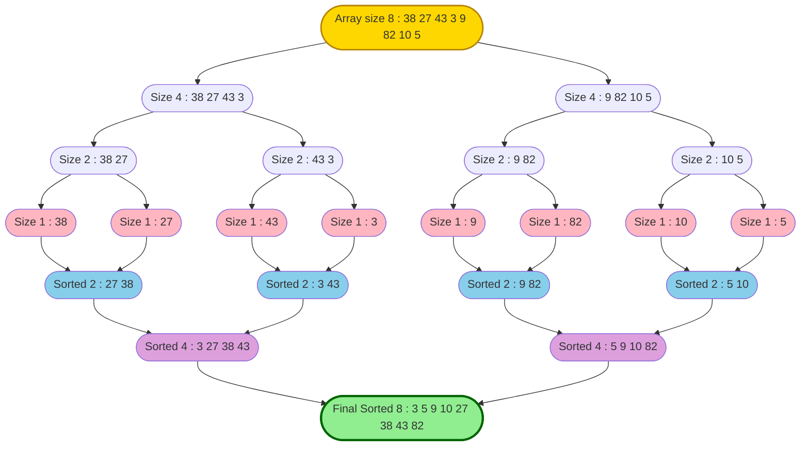
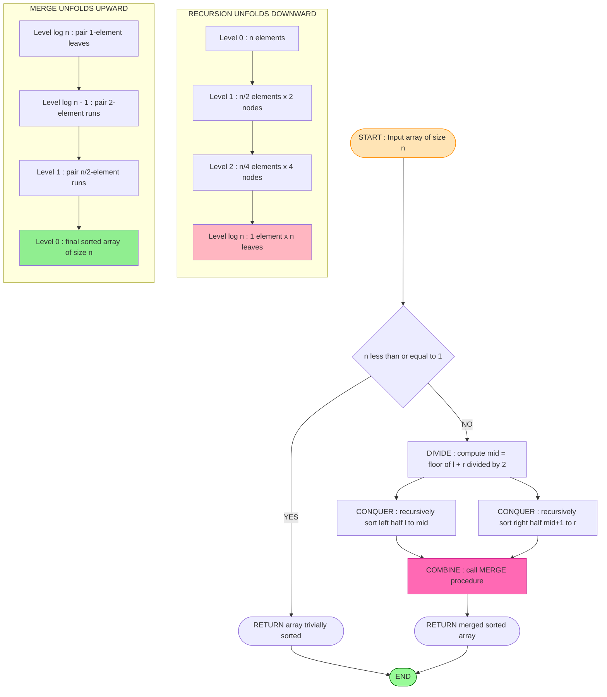
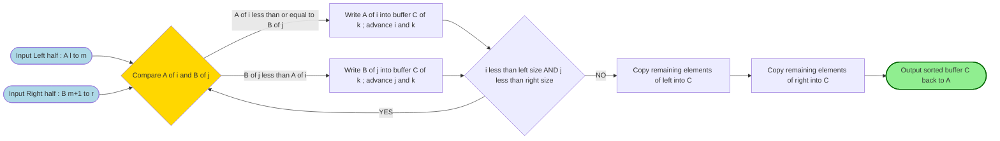

# Divide-and-conquer Approach (Merge Sort Algorithm, Advantages, Disadvantages)

<!-- SECTION_1_START -->
# Divide-and-Conquer Approach: Merge Sort Algorithm

> [!NOTE]
> **KTU 2024 Scheme – Module 4 Reference**
> **Course:** ALGORITHMIC THINKING WITH PYTHON (UCEST105)
> **Module:** 4 – Computational Approaches to Problem-Solving
> **Cognitive Level Targeted:** Understand $\rightarrow$ Apply $\rightarrow$ Analyze
> **Course Outcome (CO) Mapped:** CO2 – Apply algorithmic paradigms to design efficient solutions.

---

## 1.1 Formal Definition

### 1.1.1 Divide-and-Conquer (D\&C) Paradigm
The **Divide-and-Conquer** paradigm is a top-down recursive algorithmic strategy that solves a problem by:

1. **Dividing** the original problem into $k$ smaller, **disjoint** sub-problems of the same type.
2. **Conquering** each sub-problem recursively (base case reached when sub-problem is trivial).
3. **Combining** the solutions of the sub-problems to form the solution of the original problem.

Formally, for a problem of size $n$, the recurrence model is:

$$
T(n) = 
\begin{cases}
\Theta(1) & \text{if } n \leq n_0 \\
a \cdot T\!\left(\frac{n}{b}\right) + f(n) & \text{if } n > n_0
\end{cases}
$$

where $a$ is the number of sub-problems, $b$ is the factor by which the problem size is reduced, and $f(n)$ is the cost of dividing/combining.

### 1.1.2 Merge Sort
**Merge Sort** is a canonical Divide-and-Conquer sorting algorithm invented by **John von Neumann (1945)**. It recursively divides an array of size $n$ into two halves, sorts each half, and then merges the two sorted halves to produce a single sorted array.

> [!IMPORTANT]
> **Syllabus Highlight (KTU 2024):**
> Merge Sort is the *primary* D\&C algorithm students must implement, trace, and analyze under Module 4. It guarantees a worst-case time complexity of $O(n \log n)$ regardless of input distribution — a property Quick Sort cannot guarantee.

---

## 1.2 Conceptual Analogy / Intuition

Imagine a school principal with **200 answer sheets** that need to be ranked by score. The principal cannot sort all 200 at once. Instead:

- **Divide:** She splits the 200 sheets into two stacks of 100 each. Each stack is given to a vice-principal.
- **Conquer:** Each vice-principal further splits their 100 into 50/50 and delegates. This continues until each person holds a stack of **1 sheet** (already trivially "sorted").
- **Combine:** Two people sitting side-by-side then **merge** their two 1-sheet stacks into a sorted 2-sheet stack. Pairs of 2-sheets merge into 4-sheets, and so on — like assembling a sorted **pyramid** upward.

> This "**split down, merge up**" pyramid is the structural soul of Merge Sort. The *divide* cost is free; the *combine* (merge) cost is linear in $n$ at every level of the pyramid, leading to $O(n \log n)$ total work.

---

## 1.3 Key Constants and Metrics

| Metric | Value |
| :--- | :--- |
| Auxiliary Space Complexity | $O(n)$ — requires a temporary buffer |
| Stability | **Stable** — preserves relative order of equal keys |
| In-Place? | **No** — needs extra memory proportional to input |
| Adaptive? | **No** — performs identical work on sorted/reverse/random input |
| Best / Average / Worst Case | $O(n \log n)$ / $O(n \log n)$ / $O(n \log n)$ |

> [!VISUALIZATION CONTROL]
> **Concept:** Recursion Tree of Merge Sort on $n = 8$ elements
> **Visual Description:** A binary tree of depth 3, where the root contains 8 elements, two children contain 4 elements each, four grandchildren contain 2 elements each, and 8 leaves contain 1 element each. The width of every level equals $n$, so total work per level is $\Theta(n)$, multiplied by $\log_2 n$ levels gives $\Theta(n \log n)$.
> **Recommended Tool:** Draw this manually or use Python's `matplotlib.pyplot` with a binary tree plotter.

<!-- SECTION_1_END -->

<!-- SECTION_2_START -->
# Deep Theoretical Analysis & KTU High-Yield Formula Sheet

## 2.1 The Three Pillars of Divide-and-Conquer

The D\&C paradigm, when applied to Merge Sort, materializes as three distinct operational phases:

### Phase 1 — DIVIDE
- Compute the **midpoint** of the array index range: $m = \lfloor (l + r) / 2 \rfloor$.
- The original range $[l, r]$ of size $n = r - l + 1$ is split into:
  - Left sub-array: $[l, m]$ of size $\lfloor n/2 \rfloor$.
  - Right sub-array: $[m+1, r]$ of size $\lceil n/2 \rceil$.
- This step is **$O(1)$** — it just calculates an index.

### Phase 2 — CONQUER
- Recursively call Merge Sort on the left half and the right half.
- Recursion bottoms out at the **base case**: a sub-array of length $0$ or $1$ is, by definition, already sorted (no work required).
- Total recursive depth: $\log_2 n$ levels.

### Phase 3 — COMBINE
- The **MERGE** procedure takes two sorted sub-arrays and produces a single sorted array.
- It uses **three pointers** ($i$, $j$, $k$) to walk through the left half, right half, and an auxiliary buffer.
- Linear-time scan: each element is compared and copied at most once $\Rightarrow O(n)$.

---

## 2.2 KTU Formula Sheet / Cheat Sheet

> [!IMPORTANT]
> The following table is the *high-yield* memory bank for KTU ESE — memorize every cell.

| Concept | Formula / Expression | Explanation | Unit |
| :--- | :--- | :--- | :--- |
| Number of recursion levels | $\log_2 n$ | Depth of the binary splitting tree | levels |
| Number of leaves | $n$ | Each leaf holds 1 element | nodes |
| Work per level (merge cost) | $\Theta(n)$ | Total comparisons + copies at any level | operations |
| **Total Time Complexity** | $T(n) = 2 \cdot T(n/2) + \Theta(n)$ | Master Theorem, Case 2 | operations |
| Resolved Complexity | $\Theta(n \log_2 n)$ | Using Master Theorem $a=2, b=2, f(n)=n$ | operations |
| **Recurrence via Substitution** | $T(n) = cn \log_2 n + cn$ | Direct algebraic expansion | operations |
| Auxiliary Space | $\Theta(n)$ | Buffer for merge step | memory cells |
| Calls per element (stack frames) | $O(\log n)$ | Recursion depth | frames |
| Comparisons (worst case) | $n \log_2 n - 2^{\log_2 n} + 1$ | Tight bound by Knuth | comparisons |
| Best case | $O(n \log n)$ | Even pre-sorted input still fully splits/merges | operations |
| Stability verdict | **Stable** | Use $\le$ in merge condition for right half | — |

> **Note on Master Theorem Application:**
> Standard form: $T(n) = a \cdot T(n/b) + f(n)$ with $a = 2$, $b = 2$, $f(n) = \Theta(n^{\log_b a}) = \Theta(n^1)$.
> Since $f(n) = \Theta(n^{\log_b a})$, we are in **Case 2** of the Master Theorem, yielding $T(n) = \Theta(n^{\log_b a} \cdot \log n) = \Theta(n \log n)$.

---

## 2.3 Why Merge Sort Matters in Real Engineering

| Domain | Application |
| :--- | :--- |
| **Databases** | External sorting of data larger than RAM — chunked merge sort merges disk-sorted runs. |
| **Linked Lists** | Preferred over Quick Sort; no random access penalty since merge is pointer-based. |
| **Inversion Counting** | The merge step can be augmented to count inversions in $O(n \log n)$. |
| **Distributed Systems** | Hadoop/MapReduce sort phases use multi-way merge sort across nodes. |
| **Stable Sorting Pipelines** | When relative order of equal keys must be preserved (e.g., sorting by date then by name). |
| **Python Standard Library** | CPython's `list.sort()` uses **Timsort** (a hybrid of merge sort + insertion sort). |

> [!NOTE]
> **Why the *real-world utility* matters for KTU viva:** Examiners often award marks for explaining *when* to choose Merge Sort over Quick Sort. Remember: **Linked lists, external storage, and stability-required contexts** $\Rightarrow$ Merge Sort wins.

---

## 2.4 Advantages of Merge Sort

- **Guaranteed $O(n \log n)$** in best, average, and worst case — no pathological inputs.
- **Stable** — equal elements retain their original relative order.
- **Predictable performance** — input distribution does not affect running time.
- **Excellent for linked lists** and external (disk-based) sorting.
- **Parallelizable** — the two recursive halves are independent and can run on different threads/processes.

## 2.5 Disadvantages of Merge Sort

- **Extra $O(n)$ space** — must allocate an auxiliary buffer.
- **Slower than Quick Sort in practice** for in-memory, cache-friendly arrays due to higher constant factors and memory access patterns.
- **Not adaptive** — does not exploit existing order in the input.
- **Overkill for small arrays** — insertion sort is faster for $n < 20$ due to low overhead.
- **Recursion overhead** — $O(\log n)$ function call stack frames.

<!-- SECTION_2_END -->

<!-- SECTION_3_START -->
# Step-by-Step Derivations & Python Implementation

## 3.1 Derivation of the Recurrence Relation

Let $T(n)$ be the worst-case time to Merge Sort an array of $n$ elements.

- **Divide step:** Compute midpoint — $O(1)$.
- **Conquer step:** Sort two sub-arrays of size $n/2$ each — $2 \cdot T(n/2)$.
- **Combine step:** Merge two sorted halves of total size $n$ — $cn$ where $c$ is a constant (each element compared/copied at most once).

$$
\begin{aligned}
T(n) &= 2 \cdot T\!\left(\frac{n}{2}\right) + cn \\
&= 2 \left[ 2 \cdot T\!\left(\frac{n}{4}\right) + c \cdot \frac{n}{2} \right] + cn \\
&= 4 \cdot T\!\left(\frac{n}{4}\right) + 2cn \\
&= 8 \cdot T\!\left(\frac{n}{8}\right) + 3cn \\
&\;\;\vdots \\
&= n \cdot T(1) + (\log_2 n) \cdot cn
\end{aligned}
$$

At the base case $T(1) = d$ (constant), the recursion tree has $\log_2 n$ levels. Summing the $cn$ cost at each level:

$$
T(n) = dn + cn \log_2 n = \Theta(n \log_2 n)
$$

This confirms the Master Theorem result.

---

## 3.2 Worked Trace Example

Sort the array: $A = [38, 27, 43, 3, 9, 82, 10]$ using Merge Sort.

**Step 1 — Divide** until singletons:
- $A = [38, 27, 43, 3, \vert\; 9, 82, 10]$
- $A = [38, 27, \vert\; 43, 3, \vert\; 9, \vert\; 82, 10]$
- $A = [38, \vert\; 27, \vert\; 43, \vert\; 3, \vert\; 9, \vert\; 82, \vert\; 10]$

**Step 2 — Merge back** (ascending):

| Step | Left Sorted | Right Sorted | Merged Result |
| :--- | :--- | :--- | :--- |
| 1 | $[27]$ | $[38]$ | $[27, 38]$ |
| 2 | $[3]$ | $[43]$ | $[3, 43]$ |
| 3 | $[9]$ | $[10]$ | $[9, 10]$ |
| 4 | $[82]$ | $[10]$ | $[10, 82]$ |
| 5 | $[27, 38]$ | $[3, 43]$ | $[3, 27, 38, 43]$ |
| 6 | $[9, 10]$ | $[10, 82]$ | $[9, 10, 10, 82]$ |
| 7 | $[3, 27, 38, 43]$ | $[9, 10, 10, 82]$ | $[3, 9, 10, 10, 27, 38, 43, 82]$ |

Final sorted output: $[3, 9, 10, 10, 27, 38, 43, 82]$.

---

## 3.3 Full Python Implementation

```python
"""
Merge Sort — Reference Implementation for KTU UCEST105.
Time:  O(n log n) — worst, average, best
Space: O(n) auxiliary
"""

from typing import List


def merge_sort(arr: List[int]) -> List[int]:
    """
    Public driver: returns a new sorted list (non-mutating variant).
    Students may also implement an in-place version for practice.
    """
    if len(arr) <= 1:
        return arr[:]                       # Base case: trivially sorted
    mid: int = len(arr) // 2                # DIVIDE
    left: List[int] = merge_sort(arr[:mid])
    right: List[int] = merge_sort(arr[mid:])
    return merge(left, right)               # CONQUER + COMBINE


def merge(left: List[int], right: List[int]) -> List[int]:
    """
    Combine two sorted lists into one sorted list.
    Uses three-pointer technique over an auxiliary buffer.
    """
    result: List[int] = []
    i: int = 0
    j: int = 0
    n_left: int = len(left)
    n_right: int = len(right)

    # Walk through both halves, picking the smaller head each time
    while i < n_left and j < n_right:
        if left[i] <= right[j]:            # <= ensures STABILITY
            result.append(left[i])
            i += 1
        else:
            result.append(right[j])
            j += 1

    # One half may still have leftovers; concatenate
    if i < n_left:
        result.extend(left[i:])
    if j < n_right:
        result.extend(right[j:])

    return result


def merge_sort_inplace(arr: List[int], left: int, right: int) -> None:
    """
    In-place variant: mutates the input list directly.
    Useful for memory-constrained scenarios.
    """
    if left >= right:
        return                              # Base case
    mid: int = (left + right) // 2          # DIVIDE
    merge_sort_inplace(arr, left, mid)      # Sort left half
    merge_sort_inplace(arr, mid + 1, right) # Sort right half
    _merge_inplace(arr, left, mid, right)   # COMBINE


def _merge_inplace(arr: List[int], left: int, mid: int, right: int) -> None:
    """Helper for in-place variant using a temporary buffer."""
    left_part: List[int] = arr[left:mid + 1]
    right_part: List[int] = arr[mid + 1:right + 1]
    i: int = 0
    j: int = 0
    k: int = left
    while i < len(left_part) and j < len(right_part):
        if left_part[i] <= right_part[j]:
            arr[k] = left_part[i]
            i += 1
        else:
            arr[k] = right_part[j]
            j += 1
        k += 1
    while i < len(left_part):
        arr[k] = left_part[i]
        i += 1
        k += 1
    while j < len(right_part):
        arr[k] = right_part[j]
        j += 1
        k += 1


# ----- Driver / Sanity Tests -----
if __name__ == "__main__":
    sample: List[int] = [38, 27, 43, 3, 9, 82, 10]
    print("Original :", sample)
    print("Sorted   :", merge_sort(sample))

    sample2: List[int] = [5, 2, 8, 1, 9, 3, 7, 4, 6]
    merge_sort_inplace(sample2, 0, len(sample2) - 1)
    print("In-place :", sample2)
```

**Code Walk-Through Notes:**

| Line Block | Purpose | Complexity Contribution |
| :--- | :--- | :--- |
| `if len(arr) <= 1` | Base case guard | $O(1)$ per call |
| `mid = len(arr) // 2` | DIVIDE — find midpoint | $O(1)$ |
| Recursive calls | CONQUER — sort halves | $2 \cdot T(n/2)$ |
| `merge(left, right)` | COMBINE | $O(n)$ |

<!-- SECTION_3_END -->

<!-- SECTION_4_START -->
# Structural Diagrams & Schematics

## 4.1 Recursion Tree of Merge Sort on $n = 8$



## 4.2 Divide-and-Conquer Control Flow



## 4.3 MERGE Procedure — Sequential Processing Topology



<!-- SECTION_4_END -->

<!-- SECTION_5_START -->
# KTU 2024 Scheme Examination Question Bank & Topic Recap

> [!NOTE]
> **Mark Distribution Reference (KTU 2024 ESE Pattern):**
> - Part A: 3 marks each, no choice, direct/descriptive.
> - Part B: 14 marks each, internal choice between Q-A and Q-B; each Q typically splits into 7 + 7 sub-parts.
> - Bloom Levels: K1 = Remember, K2 = Understand, K3 = Apply, K4 = Analyze.

---

## PART A — Short Answer Questions (3 Marks Each)

### Question 1 `[KTU University Exam – July 2024]`
**CO2, K1 – Remember**
*Define the Divide-and-Conquer algorithmic paradigm. List its three phases.*

**Model Answer (Valuation Key):**
Divide-and-Conquer is a recursive problem-solving strategy that solves a problem by recursively breaking it into smaller sub-problems of the same form, solving those sub-problems, and combining their results.
Its three phases are:
1. **Divide** — partition the problem into smaller sub-problems.
2. **Conquer** — solve each sub-problem recursively or directly if small enough.
3. **Combine** — merge the sub-solutions to form the final solution.

*[Defining the paradigm: 1 Mark; Listing the three phases with one-line description: 2 Marks]*

---

### Question 2 `[KTU University Exam – Dec 2023]`
**CO2, K2 – Understand**
*State whether Merge Sort is stable. Justify your answer with reference to the merge procedure.*

**Model Answer (Valuation Key):**
Yes, **Merge Sort is stable**. In the merge step, when elements from both halves are equal, the algorithm uses the condition `if left[i] <= right[j]` and copies from the left half first. This ensures that equal elements retain their original relative order — a defining property of stability.

*[Stating stability: 1 Mark; Correct justification with condition: 2 Marks]*

---

## PART B — Long Answer Questions (14 Marks Each, Internal Choice)

### Question A (14 Marks) `[KTU University Exam – July 2024]`
**CO2, K3 – Apply**

**(a) [7 Marks]** Write a Python function `merge_sort(arr)` that implements the Merge Sort algorithm recursively. Your implementation must use an auxiliary buffer for the merge step. Briefly explain the time complexity of your solution.

**(b) [7 Marks]** Trace the Merge Sort algorithm on the input array $[5, 2, 9, 1, 6, 3]$ showing all intermediate splits and merges. State the final sorted output.

#### Model Solution for (a) — 7 Marks

```python
def merge_sort(arr):
    if len(arr) <= 1:
        return arr
    mid = len(arr) // 2
    left = merge_sort(arr[:mid])
    right = merge_sort(arr[mid:])
    return merge(left, right)

def merge(left, right):
    result = []
    i = j = 0
    while i < len(left) and j < len(right):
        if left[i] <= right[j]:
            result.append(left[i])
            i += 1
        else:
            result.append(right[j])
            j += 1
    result.extend(left[i:])
    result.extend(right[j:])
    return result
```

**Valuation Key for (a):**
- [Correct base case: 1 Mark]
- [Correct recursive divide step: 1 Mark]
- [Merge procedure with three-pointer logic: 2 Marks]
- [Auxiliary buffer usage shown: 1 Mark]
- [Time complexity statement $O(n \log n)$ with one-line justification: 2 Marks]

#### Model Solution for (b) — 7 Marks

| Level | Splits (Divide) | Merges (Combine) |
| :--- | :--- | :--- |
| 3 | $[5, 2, 9, 1, 6, 3]$ | — |
| 2 | $[5, 2, 9]$, $[1, 6, 3]$ | — |
| 1 | $[5, 2]$, $[9]$, $[1, 6]$, $[3]$ | — |
| 0 (base) | $[5]$, $[2]$, $[9]$, $[1]$, $[6]$, $[3]$ | — |
| 1 | — | $[2, 5]$, $[9]$, $[1, 6]$, $[3]$ |
| 2 | — | $[2, 5, 9]$, $[1, 3, 6]$ |
| 3 | — | $[1, 2, 3, 5, 6, 9]$ |

**Final Sorted Output:** $[1, 2, 3, 5, 6, 9]$

**Valuation Key for (b):**
- [Showing all 3 split levels correctly: 2 Marks]
- [Showing all 3 merge levels correctly: 2 Marks]
- [Correct pairwise merge comparisons (e.g., 5 vs 2 → 2 first): 2 Marks]
- [Final sorted output: 1 Mark]

---

### Question B (14 Marks) `[KTU University Exam – Dec 2023]`
**CO2, K4 – Analyze**

**(a) [7 Marks]** Derive the time complexity of Merge Sort using a recurrence relation. State the Master Theorem case applied and resolve the closed-form expression.

**(b) [7 Marks]** Compare Merge Sort and Quick Sort on the following axes: worst-case time complexity, auxiliary space, stability, in-place behaviour, and best-suited input type. Mention one scenario where Merge Sort strictly outperforms Quick Sort.

#### Model Solution for (a) — 7 Marks

Let $T(n)$ = time to Merge Sort $n$ elements.

$$
\begin{aligned}
T(n) &= 2 \cdot T\!\left(\frac{n}{2}\right) + \Theta(n) && \text{(2 recursive calls + linear merge)} \\
T(1) &= \Theta(1) && \text{(base case)}
\end{aligned}
$$

**Master Theorem Identification:**
- $a = 2$, $b = 2$, $f(n) = n$.
- $\log_b a = \log_2 2 = 1$.
- Compare $f(n) = n^1$ with $n^{\log_b a} = n^1$: $f(n) = \Theta(n^1)$ — **Case 2** applies.

$$
T(n) = \Theta(n^{\log_b a} \cdot \log n) = \Theta(n^1 \cdot \log n) = \Theta(n \log n)
$$

**Valuation Key for (a):**
- [Writing the recurrence correctly: 2 Marks]
- [Identifying $a$, $b$, $f(n)$ and $\log_b a$: 2 Marks]
- [Stating Master Theorem Case 2 with reasoning: 1 Mark]
- [Final closed form $\Theta(n \log n)$: 2 Marks]

#### Model Solution for (b) — 7 Marks

| Axis | Merge Sort | Quick Sort |
| :--- | :--- | :--- |
| Worst-case time | $O(n \log n)$ — guaranteed | $O(n^2)$ — bad pivot (e.g., sorted input) |
| Auxiliary space | $O(n)$ — buffer required | $O(\log n)$ — recursion stack only |
| Stability | **Stable** | **Not stable** (in standard form) |
| In-place? | No | Yes |
| Best input | **Linked lists, external/disk data** | In-memory arrays, average random data |
| Cache friendliness | Lower (extra buffer) | Higher (in-place partition) |

**Scenario where Merge Sort strictly wins:**
Sorting a **singly linked list** — since merging two sorted linked lists can be done in $O(n)$ using pointer manipulation without extra $O(n)$ buffer space, while Quick Sort's random-access pivot selection is expensive on linked lists.

**Valuation Key for (b):**
- [Table with all 5 axes filled correctly: 4 Marks]
- [One-sentence justification per row: 1 Mark]
- [Linked-list / external-sort scenario: 1 Mark]
- [Reasoning why merge works better on linked lists: 1 Mark]

---

> [!WARNING]
> **KTU Examiner's Valuation Warning — Common Pitfalls**
> 1. **Forgetting the base case:** Without `if len(arr) <= 1: return arr`, the recursion never terminates and you lose **1–2 marks** for code as well as the viva.
> 2. **Wrong merge comparison:** Using `<` instead of `<=` makes Merge Sort **unstable**. Examiners explicitly test for this. Always write `left[i] <= right[j]`.
> 3. **Confusing Master Theorem cases:** Case 1, Case 2, and Case 3 are frequently swapped. Remember: when $f(n) = \Theta(n^{\log_b a})$, it is **Case 2**, giving the extra $\log n$ factor.
> 4. **Space complexity oversight:** Stating "Merge Sort is $O(1)$ space" is **wrong** and will be penalized. It is $O(n)$.
> 5. **Skipping the recursion tree or trace:** A "code-only" answer without a recursion tree for 14-mark questions is considered incomplete. Draw the tree or the trace table.
> 6. **Not defining terms:** In 3-mark questions, the first sentence must be a definition. Jumping directly to advantages will lose 1 mark.

---

## 📌 Topic Recap & Important Things to Remember

- **Divide-and-Conquer (D\&C)** = **Divide** $\rightarrow$ **Conquer** $\rightarrow$ **Combine**, formalized via recurrence $T(n) = a \cdot T(n/b) + f(n)$.
- **Merge Sort** is the canonical D\&C sorting algorithm invented by **John von Neumann (1945)**.
- **Recurrence:** $T(n) = 2 \cdot T(n/2) + \Theta(n)$ — solved by **Master Theorem Case 2** yielding $\Theta(n \log n)$.
- **Three-pointer merge:** pointers $i$ (left), $j$ (right), $k$ (buffer); pick the smaller head, advance that pointer.
- **Stability condition:** `left[i] <= right[j]` — copying from the left half first ensures equal keys retain order.
- **Auxiliary space:** $O(n)$ — non-trivial buffer required at every level.
- **Recursion depth:** $\log_2 n$ levels; each level performs $O(n)$ work $\Rightarrow$ total $O(n \log n)$.
- **Worst / Average / Best:** all $O(n \log n)$ — input distribution is irrelevant.
- **Not in-place, not adaptive** — major disadvantages vs. Quick Sort / Insertion Sort.
- **Best for:** linked lists, external sorting (disk), parallel/distributed sorting, stability-required contexts.
- **Disadvantages:** $O(n)$ extra memory, higher constant factors than Quick Sort, recursion overhead.
- **Standard Python libraries** (e.g., CPython's `Timsort`) are hybrid D\&C algorithms derived from Merge Sort + Insertion Sort.
- **Inversion counting** can be done in $O(n \log n)$ by augmenting the merge step — a common KTU viva question.
- **Recursion tree intuition:** total work = (work per level) $\times$ (number of levels) = $O(n) \times O(\log n) = O(n \log n)$.
- **Master Theorem cheat:** if $f(n) = \Theta(n^{\log_b a})$, multiply by $\log n$ (Case 2). Otherwise compare $f(n)$ with $n^{\log_b a}$ for Case 1 or Case 3.
- **KTU viva tip:** Always be ready to explain *why* Merge Sort is preferred for linked lists and *why* it is stable, with one concrete example each.

<!-- SECTION_5_END -->
