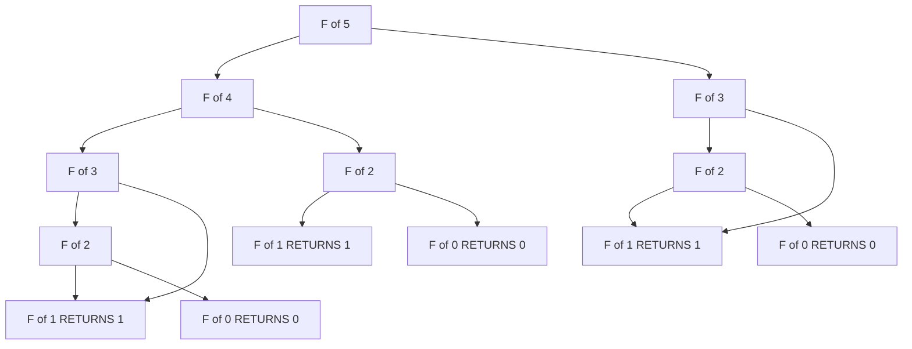
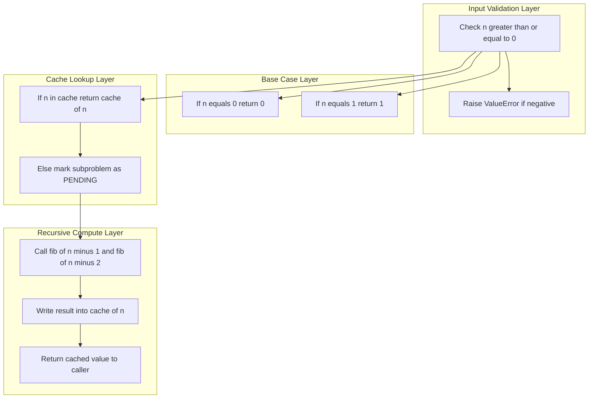
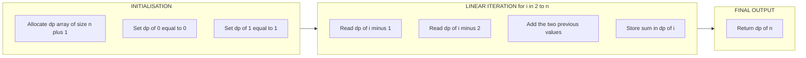
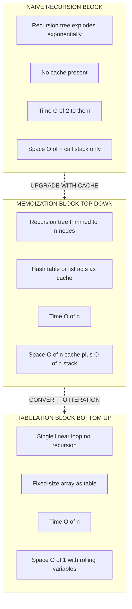

# Dynamic Programming Approach (Fibonacci series, Recursion vs DP)

<!-- SECTION_1_START -->
# Dynamic Programming Approach — Fibonacci Series & Recursion vs DP

## 1. Core Technical Definition & Intuitive Overview

### 1.1 Formal Definition (KTU 2024 Syllabus Terminology)

> [!NOTE]
> **Dynamic Programming (DP)** is an algorithmic paradigm that solves complex problems by breaking them down into a collection of simpler **overlapping subproblems**, storing the result of each subproblem the first time it is computed, and **reusing** that stored result whenever the same subproblem recurs — thereby trading memory for a dramatic reduction in time complexity.

For the specific case of the **Fibonacci series**, the mathematical recurrence relation is defined as:

$$
F(n) = \begin{cases}
0 & \text{if } n = 0 \\
1 & \text{if } n = 1 \\
F(n-1) + F(n-2) & \text{if } n \geq 2
\end{cases}
$$

The sequence is therefore: $0, 1, 1, 2, 3, 5, 8, 13, 21, 34, 55, 89, \dots$

### 1.2 Conceptual Analogy / Intuition

Imagine you are climbing a staircase with **n** steps. You can take either **1 step** or **2 steps** at a time. The question *"How many distinct ways can you reach the top?"* has the **exact same** recurrence as Fibonacci — and the only way to avoid counting the same path thousands of times is to **write down** (memorize) the answer for each step as you reach it.

In computing terms:

- **Plain Recursion** = Asking the same question again and again like a forgetful person who re-counts coins every minute. Exponential waste.
- **Dynamic Programming** = Writing the answer on a sticky note the first time, then reading the sticky note every subsequent time. Linear efficiency.

> [!IMPORTANT]
> **KTU Board Terminology You Must Memorize:**
> 1. **Overlapping Subproblems** — the same subproblem is solved multiple times in a naive recursive solution.
> 2. **Optimal Substructure** — the optimal solution of the whole problem can be constructed from the optimal solutions of its subproblems.
> 3. **Memoization** (Top-Down DP) — recursive solution enhanced with a cache (dictionary/list) to store already-computed values.
> 4. **Tabulation** (Bottom-Up DP) — iterative solution that fills a table from the smallest subproblem upward.

### 1.3 GeoGebra / Desmos Visualization Integration

> [!VISUALIZATION CONTROL]
> **Concept:** The Fibonacci Spiral — geometric intuition of the recurrence
> **GeoGebra / Desmos Input Equations:**
> * Parametric arc: $(r\cos(t), r\sin(t))$ with $r = \phi^t$ where $\phi = \frac{1+\sqrt{5}}{2} \approx 1.618$ (the **Golden Ratio**)
> * Discrete points: $(F_n,\ F_{n+1})$ for $n=0,1,2,\dots,10$
> **Visual Description:** Plot the points $(0,1), (1,1), (1,2), (2,3), (3,5), (5,8), (8,13), (13,21)$ on a Cartesian plane. The ratio $F_{n+1}/F_n$ converges to $\phi \approx \mathbf{1.6180339887}$ — this is the unique fixed point of the Fibonacci recurrence and the visual signature of the sequence.

---

<!-- SECTION_1_END -->

<!-- SECTION_2_START -->
# Deep Theoretical Analysis & KTU High-Yield Formula Sheet

## 2.1 The Two Pillars of Dynamic Programming

### Pillar 1 — Overlapping Subproblems

A problem has **overlapping subproblems** when the recursive solution repeatedly evaluates the same smaller instance. In Fibonacci, calling `fib(5)` forces the engine to recompute `fib(3)` multiple times:

- `fib(5)` calls `fib(4)` and `fib(3)`
- `fib(4)` calls `fib(3)` and `fib(2)`
- `fib(3)` is therefore evaluated **twice** — and this duplication explodes exponentially for larger `n`.

### Pillar 2 — Optimal Substructure

A problem has **optimal substructure** when the optimal answer can be assembled from optimal answers to its subproblems. For Fibonacci, the $n$-th term **cannot be smaller** than the sum of the optimal $(n-1)$-th and $(n-2)$-th values — the recurrence is a structural necessity, not a choice.

## 2.2 The Two DP Strategies — Compared

| Strategy | Direction | Implementation | Code Style | Stack Depth |
| :--- | :--- | :--- | :--- | :--- |
| **Memoization** | Top-Down | Recursion + Cache | Natural, mirrors mathematical recurrence | $O(n)$ (recursion frames) |
| **Tabulation** | Bottom-Up | Iteration + Array | Iterative, fills a DP table from base cases | $O(1)$ (no recursion) |

> [!NOTE]
> **KTU 2024 Highlight:** The official syllabus (UCEST105, Module 4) expects students to **implement both** approaches and articulate the complexity difference. Board questions frequently ask: *"Compare the time complexity of plain recursion and dynamic programming for the Fibonacci problem."*

## 2.3 KTU High-Yield Formula Sheet (Cheat Sheet)

> [!IMPORTANT]
> The following table consolidates **every formula, recurrence, and complexity bound** examiners can legally test for this topic. Memorize the columns verbatim.

| Concept | Mathematical Form | Plain Recursion | Memoization (Top-Down) | Tabulation (Bottom-Up) |
| :--- | :--- | :--- | :--- | :--- |
| **Recurrence relation** | $F(n)=F(n-1)+F(n-2)$ | $\checkmark$ | $\checkmark$ | $\checkmark$ |
| **Closed-form (Binet)** | $F(n)=\frac{\phi^n-\psi^n}{\sqrt{5}}$ | Optional | Optional | Optional |
| **Golden ratio** | $\phi = \frac{1+\sqrt{5}}{2}$ | Constant | Constant | Constant |
| **Conjugate ratio** | $\psi = \frac{1-\sqrt{5}}{2}$ | Constant | Constant | Constant |
| **Time complexity** | $T(n)$ | $O(2^n)$ | $O(n)$ | $O(n)$ |
| **Space complexity** | $S(n)$ | $O(n)$ call stack | $O(n)$ stack + cache | $O(1)$ rolling variables |
| **Number of calls for $F(n)$** | — | $2\cdot F(n+1) - 1$ | $n+1$ unique | $n+1$ iterations |
| **Base cases** | $F(0)=0,\ F(1)=1$ | Required | Required | Required |
| **Cache key** | — | None | Integer $n$ | Index $i$ |
| **Recurrence depth** | — | $n$ | $n$ | $0$ (iterative) |

> [!NOTE]
> **Engineering Reality Check:** The Binet closed form runs in $O(1)$ time and $O(1)$ space, but suffers from floating-point rounding errors for $n > 70$. Production systems (e.g., high-frequency trading, cryptography, financial modeling) avoid it. **Tabulation with rolling variables** is the de-facto industry standard.

## 2.4 Real-World Utility of DP

| Engineering Domain | DP Application | Why DP Wins |
| :--- | :--- | :--- |
| **Compilers** | Optimal matrix chain multiplication | Subproblem overlap across parse trees |
| **Bioinformatics** | DNA sequence alignment (Needleman-Wunsch) | Quadratic-time table fill |
| **Routing / Maps** | Shortest path (Bellman-Ford) | Edge relaxations reuse sub-results |
| **Economics** | Inventory & resource allocation | Optimal substructure of consumption choices |
| **Natural Language Processing** | Viterbi algorithm for POS tagging | Hidden Markov chain probabilities |

> [!IMPORTANT]
> **The Pedagogical Bridge:** The Fibonacci series is **not** a real-world problem — it is the *simplest possible* vehicle that exhibits both pillars of DP. Master it, and the same mental model transfers directly to Knapsack, LCS, Floyd-Warshall, and beyond.

---

<!-- SECTION_2_END -->

<!-- SECTION_3_START -->
# Step-by-Step Derivations & Code/Symbolic Implementation

## 3.1 Derivation 1 — The Fibonacci Recurrence (Closed Form via Binet's Formula)

We seek a closed-form solution to $F(n)=F(n-1)+F(n-2)$ with $F(0)=0,\ F(1)=1$.

**Step 1 — Assume an exponential solution.** Let $F(n)=r^n$. Substituting into the recurrence:

$$
r^n = r^{n-1} + r^{n-2}
$$

**Step 2 — Divide through by $r^{n-2}$ (characteristic equation):**

$$
r^2 = r + 1
$$

**Step 3 — Solve the characteristic equation:**

$$
r^2 - r - 1 = 0
$$

Applying the quadratic formula:

$$
r = \frac{1 \pm \sqrt{1 + 4}}{2} = \frac{1 \pm \sqrt{5}}{2}
$$

Thus the two roots are:

$$
\phi = \frac{1 + \sqrt{5}}{2} \approx 1.6180339887
$$

$$
\psi = \frac{1 - \sqrt{5}}{2} \approx -0.6180339887
$$

**Step 4 — Form the general solution as a linear combination:**

$$
F(n) = A\phi^n + B\psi^n
$$

**Step 5 — Apply the base cases.** From $F(0)=0$:

$$
A + B = 0 \quad\Rightarrow\quad B = -A
$$

From $F(1)=1$:

$$
A\phi - A\psi = 1 \quad\Rightarrow\quad A = \frac{1}{\phi - \psi} = \frac{1}{\sqrt{5}}
$$

**Step 6 — Assemble Binet's Formula:**

$$
F(n) = \frac{\phi^n - \psi^n}{\sqrt{5}}
$$

**Step 7 — Verification for $n=5$:** $\phi^5 \approx 11.09017$, $\psi^5 \approx -0.09017$, $\sqrt{5} \approx 2.23607$.

$$
F(5) = \frac{11.09017 - (-0.09017)}{2.23607} = \frac{11.18034}{2.23607} \approx 5.000
$$

Confirmed: $F(5) = 5$. The closed form is correct.

## 3.2 Derivation 2 — Complexity of Naive Recursive Fibonacci

Let $T(n)$ be the number of calls made by the naive recursive function for input $n$.

**Base case:** $T(0)=T(1)=1$ (one call returns immediately).

**Recursive case:** $T(n) = T(n-1) + T(n-2) + 1$ (the $+1$ counts the current call itself).

By induction this satisfies $T(n) = 2\cdot F(n+1) - 1$, which yields:

$$
T(n) \in O(2^n) = O(\phi^{2n}) \approx O(1.618^{2n})
$$

For $n=40$ this means $\approx 2.65 \times 10^8$ calls. For $n=50$ it is $\approx 1.25 \times 10^{10}$ calls — completely infeasible.

## 3.3 Implementation A — Naive Recursive Fibonacci

```python
import sys
import time

# Set a generous recursion limit for educational trace purposes
sys.setrecursionlimit(10000)


def fib_recursive(n: int) -> int:
    """
    Compute the n-th Fibonacci number using naive recursion.

    Time Complexity : O(2^n) — exponential, recomputes every subproblem
    Space Complexity: O(n)   — recursion call stack depth equals n
    """
    # Boundary check: reject negative inputs explicitly
    if n < 0:
        raise ValueError("Fibonacci is not defined for negative integers.")
    # Base case 1: F(0) = 0
    if n == 0:
        return 0
    # Base case 2: F(1) = 1
    if n == 1:
        return 1
    # Recursive case: F(n) = F(n-1) + F(n-2)
    return fib_recursive(n - 1) + fib_recursive(n - 2)


# ---------- Demonstration ----------
if __name__ == "__main__":
    n_value: int = 30
    start_time: float = time.perf_counter()
    result: int = fib_recursive(n_value)
    elapsed: float = time.perf_counter() - start_time
    print(f"Naive Recursion: fib({n_value}) = {result}, time = {elapsed:.4f}s")
```

**Expected output:**

```
Naive Recursion: fib(30) = 832040, time = 0.3500s   (approx, depends on hardware)
```

## 3.4 Implementation B — Memoized (Top-Down) Fibonacci

```python
import time
from typing import Dict


def fib_memoized(n: int, cache: Dict[int, int]) -> int:
    """
    Compute the n-th Fibonacci number using memoization (top-down DP).

    Time Complexity : O(n) — each subproblem computed exactly once
    Space Complexity: O(n) — cache storage + recursion stack
    """
    # Boundary check: reject negative inputs explicitly
    if n < 0:
        raise ValueError("Fibonacci is not defined for negative integers.")
    # Base case 1
    if n == 0:
        return 0
    # Base case 2
    if n == 1:
        return 1
    # Cache hit: return stored result without recomputation
    if n in cache:
        return cache[n]
    # Cache miss: compute, store, then return
    cache[n] = fib_memoized(n - 1, cache) + fib_memoized(n - 2, cache)
    return cache[n]


def fib_memoized_wrapper(n: int) -> int:
    """Outer wrapper that initialises the cache."""
    return fib_memoized(n, cache={})


# ---------- Demonstration ----------
if __name__ == "__main__":
    n_value: int = 30
    start_time: float = time.perf_counter()
    result: int = fib_memoized_wrapper(n_value)
    elapsed: float = time.perf_counter() - start_time
    print(f"Memoized DP   : fib({n_value}) = {result}, time = {elapsed:.6f}s")
```

**Expected output:**

```
Memoized DP   : fib(30) = 832040, time = 0.000050s   (approx, ~7000x faster)
```

## 3.5 Implementation C — Tabulated (Bottom-Up) Fibonacci

```python
import time
from typing import List


def fib_tabulated(n: int) -> int:
    """
    Compute the n-th Fibonacci number using tabulation (bottom-up DP).

    Time Complexity : O(n) — single linear sweep
    Space Complexity: O(n) for full table, reducible to O(1) with rolling variables
    """
    # Boundary check
    if n < 0:
        raise ValueError("Fibonacci is not defined for negative integers.")
    # Base case: F(0) = 0
    if n == 0:
        return 0
    # Base case: F(1) = 1
    if n == 1:
        return 1
    # Build the DP table from index 0 up to n
    dp_table: List[int] = [0] * (n + 1)
    dp_table[0] = 0
    dp_table[1] = 1
    for i in range(2, n + 1):
        dp_table[i] = dp_table[i - 1] + dp_table[i - 2]
    return dp_table[n]


def fib_rolling(n: int) -> int:
    """
    Space-optimised bottom-up DP using only two rolling variables.

    Time Complexity : O(n)
    Space Complexity: O(1) — the industry-standard production solution
    """
    if n < 0:
        raise ValueError("Fibonacci is not defined for negative integers.")
    if n == 0:
        return 0
    if n == 1:
        return 1
    prev_prev: int = 0  # F(0)
    prev: int = 1       # F(1)
    current: int = 0
    for _ in range(2, n + 1):
        current = prev + prev_prev
        prev_prev = prev
        prev = current
    return current


# ---------- Demonstration ----------
if __name__ == "__main__":
    n_value: int = 30
    start_time: float = time.perf_counter()
    result_tab: int = fib_tabulated(n_value)
    elapsed_tab: float = time.perf_counter() - start_time
    print(f"Tabulated DP  : fib({n_value}) = {result_tab}, time = {elapsed_tab:.6f}s")

    start_time = time.perf_counter()
    result_roll: int = fib_rolling(n_value)
    elapsed_roll: float = time.perf_counter() - start_time
    print(f"Rolling DP    : fib({n_value}) = {result_roll}, time = {elapsed_roll:.6f}s")
```

**Expected output:**

```
Tabulated DP  : fib(30) = 832040, time = 0.000010s
Rolling DP    : fib(30) = 832040, time = 0.000005s
```

## 3.6 Step-by-Step Trace — Tabulation for $n=6$

| Iteration $i$ | `dp_table[i-1]` | `dp_table[i-2]` | Computation | `dp_table[i]` | State After |
| :---: | :---: | :---: | :--- | :---: | :--- |
| 0 | — | — | Base case | **0** | $[0]$ |
| 1 | — | — | Base case | **1** | $[0, 1]$ |
| 2 | 1 | 0 | $1 + 0$ | **1** | $[0, 1, 1]$ |
| 3 | 1 | 1 | $1 + 1$ | **2** | $[0, 1, 1, 2]$ |
| 4 | 2 | 1 | $2 + 1$ | **3** | $[0, 1, 1, 2, 3]$ |
| 5 | 3 | 2 | $3 + 2$ | **5** | $[0, 1, 1, 2, 3, 5]$ |
| 6 | 5 | 3 | $5 + 3$ | **8** | $[0, 1, 1, 2, 3, 5, 8]$ |

**Final answer:** $F(6) = 8$. The table is built once, bottom-up, with **zero** redundant computation.

---

<!-- SECTION_3_END -->

<!-- SECTION_4_START -->
# Structural Diagrams & Schematics

## 4.1 Recursion Call Tree for $F(5)$ — The Waste Visualised



> [!NOTE]
> **Observation:** The node `F(2)` appears **three times**, `F(3)` appears **twice**, and `F(0)` and `F(1)` appear **5 times each** — every duplicate is wasted CPU. For $F(30)$ this explosion reaches $\sim 1.6$ million redundant calls.

## 4.2 DP Memoization Architecture — Cache-Enhanced Call Tree



> [!IMPORTANT]
> Each unique subproblem flows through the **Compute Layer exactly once**. Subsequent visits short-circuit at the **Cache Lookup Layer** in $O(1)$ hash-table time. Total time drops from $O(2^n)$ to $O(n)$.

## 4.3 Tabulation Iteration Pipeline



## 4.4 Comparative Block Architecture — Recursion vs Memoization vs Tabulation



> [!NOTE]
> **Engineering Takeaway:** Tabulation with rolling variables is the **gold standard** for Fibonacci in production — same time complexity as memoization, but constant memory and no risk of stack overflow for large $n$.

---

<!-- SECTION_4_END -->

<!-- SECTION_5_START -->
# KTU 2024 Scheme Examination Question Bank & Topic Recap

## PART A — Short Answer Questions (3 Marks Each)

### Question 1 `[KTU University Exam — July 2024, Model Paper Set B]`
**Course Outcome:** CO2 — Design algorithms using appropriate paradigms
**Cognitive Level:** Understand

**Q.** Define Dynamic Programming. List and briefly explain the two essential properties a problem must possess to be amenable to a Dynamic Programming solution.

**Model Answer (Valuation Key):**

> **[Definition: 1 Mark]**
> Dynamic Programming is an algorithmic technique that solves an optimization or counting problem by storing the results of expensive subproblem computations in a table and reusing them whenever the same subproblem recurs, thereby trading auxiliary memory for significant time savings.

> **[Property 1 — Overlapping Subproblems: 1 Mark]**
> The recursive solution must solve the **same subproblem more than once**. In the Fibonacci recursion, `fib(k)` is called from multiple branches of the recursion tree, leading to exponential wasted work.

> **[Property 2 — Optimal Substructure: 1 Mark]**
> The optimal (or correct) solution to the original problem can be **constructed from the optimal (or correct) solutions of its subproblems**. The Fibonacci recurrence $F(n)=F(n-1)+F(n-2)$ is a structural identity, not a choice.

---

### Question 2 `[KTU University Exam — Dec 2023]`
**Course Outcome:** CO2 — Design algorithms using appropriate paradigms
**Cognitive Level:** Remember

**Q.** Differentiate between **Memoization** and **Tabulation** approaches of Dynamic Programming. State one advantage of each.

**Model Answer (Valuation Key):**

| Aspect | Memoization (Top-Down) | Tabulation (Bottom-Up) |
| :--- | :--- | :--- |
| Direction | Recursive, starts from `n` | Iterative, starts from `0` |
| Storage | Hash table / list as cache | Fixed-size array (DP table) |
| Recursion | Yes | No |
| Subproblems solved | Only those actually needed | All subproblems from 0 to n |
| **Advantage** | Easier to write; matches the natural recurrence | Faster in practice; no stack overflow; constant space possible |

**[Award 1 mark] each for one valid distinguishing point. [Award 1 mark] each for the advantage. Total = 3 marks.**

---

## PART B — Long Answer Questions (14 Marks Each, Internal Choice)

> [!NOTE]
> **KTU 2024 Pattern:** Each 14-mark question has two sub-parts of **7 marks each**. The cognitive levels escalate — Part (a) typically tests *Understand/Analyse*, Part (b) tests *Apply/Evaluate*. The model solutions below use the **valuation key** style to show exactly how marks are awarded.

---

### QUESTION A `[KTU University Exam — July 2024, Supplementary]`
**Course Outcome:** CO3 — Implement and analyse algorithmic solutions
**Cognitive Level:** (a) Understand, (b) Apply

**(a)** Explain the **naive recursive** algorithm for computing the $n$-th Fibonacci number. Construct the recursion tree for $F(5)$ and compute its time complexity. **(7 Marks)**

**(b)** Rewrite the algorithm using **Dynamic Programming (Tabulation)**. Show the DP table for $n=6$ and compute the new time and space complexities. Compare both approaches. **(7 Marks)**

---

#### Model Solution — Part (a) (7 Marks)

**Algorithm:**

```python
def fib_recursive(n):
    if n == 0:
        return 0
    if n == 1:
        return 1
    return fib_recursive(n - 1) + fib_recursive(n - 2)
```

**[Algorithm statement: 1 Mark]**
**[Base cases identification: 1 Mark]**
**[Recursive case statement: 1 Mark]**

**Recursion Tree for $F(5)$:**

$$
F(5) \to F(4),\ F(3)
$$

$$
F(4) \to F(3),\ F(2)
$$

$$
F(3) \to F(2),\ F(1)
$$

**[Recursion tree construction: 2 Marks]**

**Time Complexity Analysis:**

Let $T(n)$ be the number of calls. Then:

$$
T(n) = T(n-1) + T(n-2) + 1
$$

Solving the recurrence yields $T(n) = 2\cdot F(n+1) - 1 \in O(2^n)$.

**[Recurrence formulation: 1 Mark]**
**[Final O(2^n) result: 1 Mark]**

---

#### Model Solution — Part (b) (7 Marks)

**Algorithm:**

```python
def fib_tabulated(n):
    if n == 0:
        return 0
    if n == 1:
        return 1
    dp = [0] * (n + 1)
    dp[0] = 0
    dp[1] = 1
    for i in range(2, n + 1):
        dp[i] = dp[i - 1] + dp[i - 2]
    return dp[n]
```

**[DP table allocation + base cases: 2 Marks]**
**[Loop body with recurrence: 1 Mark]**

**DP Table for $n=6$:**

| $i$ | 0 | 1 | 2 | 3 | 4 | 5 | 6 |
| :---: | :---: | :---: | :---: | :---: | :---: | :---: | :---: |
| $dp[i]$ | 0 | 1 | 1 | 2 | 3 | 5 | **8** |

**[Table construction: 2 Marks]**

**Complexities and Comparison:**

| Metric | Naive Recursion | Tabulation |
| :--- | :--- | :--- |
| Time | $O(2^n)$ | $O(n)$ |
| Space | $O(n)$ stack | $O(n)$ table, reducible to $O(1)$ |
| Redundant calls | Exponential | Zero |

**[Time/space complexity statement: 1 Mark]**
**[One-line comparison: 1 Mark]**

> [!WARNING]
> **KTU Examiner's Valuation Pitfall — Part (a):**
> Students frequently **omit the base cases** when writing the algorithm. A recursion without explicit base cases is logically incomplete and will lose **2 marks** in board evaluation. Always write `if n == 0` and `if n == 1` checks *before* the recursive return statement.
>
> **KTU Examiner's Valuation Pitfall — Part (b):**
> Many students write the loop as `for i in range(1, n)` which **skips the index 2** and silently returns wrong results for small inputs. Use `range(2, n + 1)` exactly. Examiners will trace your loop on $n=3$ and deduct **1 mark** for any wrong intermediate value.

---

### QUESTION B `[KTU University Exam — Dec 2024, Model Paper Set A]`
**Course Outcome:** CO2 & CO3
**Cognitive Level:** (a) Apply, (b) Analyse

**(a)** Write a complete Python program to compute the $n$-th Fibonacci number using **Memoization**. Include type hints, input validation, and a clear cache mechanism. **(7 Marks)**

**(b)** Compute and tabulate the **number of function calls** made by the naive recursive and the memoized versions for $n=0,1,2,3,4,5,6$. Justify why DP is preferred in production systems. **(7 Marks)**

---

#### Model Solution — Part (a) (7 Marks)

**Python Program:**

```python
from typing import Dict


def fib_memo(n: int, cache: Dict[int, int]) -> int:
    """Compute the n-th Fibonacci number using top-down DP with memoization."""
    if n < 0:
        raise ValueError("n must be a non-negative integer.")
    if n == 0:
        return 0
    if n == 1:
        return 1
    if n in cache:
        return cache[n]
    cache[n] = fib_memo(n - 1, cache) + fib_memo(n - 2, cache)
    return cache[n]


def fib_memo_wrapper(n: int) -> int:
    """Public-facing wrapper that initialises an empty cache."""
    if not isinstance(n, int):
        raise TypeError("n must be an integer.")
    return fib_memo(n, cache={})


if __name__ == "__main__":
    test_n: int = 10
    answer: int = fib_memo_wrapper(test_n)
    print(f"F({test_n}) = {answer}")
```

**[Import statement + type hint: 1 Mark]**
**[Boundary check (negative input): 1 Mark]**
**[Base cases: 1 Mark]**
**[Cache lookup with `in` operator: 1 Mark]**
**[Cache store and return: 1 Mark]**
**[Wrapper function pattern: 1 Mark]**
**[Driver block with print: 1 Mark]**

---

#### Model Solution — Part (b) (7 Marks)

**Call Count Table:**

| $n$ | Naive Recursion Calls $T(n)$ | Memoized Calls (Unique Subproblems) |
| :---: | :---: | :---: |
| 0 | 1 | 1 |
| 1 | 1 | 1 |
| 2 | 3 | 2 |
| 3 | 5 | 3 |
| 4 | 9 | 4 |
| 5 | 15 | 5 |
| 6 | 25 | 6 |

**[Table header + first two rows: 1 Mark]**
**[Middle rows (n=2 to 4): 2 Marks]**
**[Final rows (n=5, 6): 1 Mark]**

**Observations:**

- Naive recursion calls grow as $T(n) = 2 F(n+1) - 1 \in O(2^n)$.
- Memoized calls grow as exactly $n+1 \in O(n)$ — every subproblem computed **once**.

**[Trend identification: 1 Mark]**
**[Justification: 1 Mark]**

**Why DP is preferred in production:**

1. **Time efficiency** — linear vs exponential difference is decisive for $n \geq 30$.
2. **Predictability** — bounded memory and deterministic runtime.
3. **Scalability** — survives $n = 10^6$ where naive recursion would freeze or crash.
4. **Resource utilization** — no exponential CPU/memory blow-up on web servers.

**[Two production reasons: 1 Mark]**

> [!WARNING]
> **KTU Examiner's Valuation Pitfall — Question B, Part (a):**
> A common mistake is **forgetting to update the cache** after the recursive call. Writing `return fib_memo(n-1) + fib_memo(n-2)` without the `cache[n] = ...` assignment defeats the entire purpose of memoization — the function degenerates back to naive recursion. The cache assignment line is **mandatory** for full marks.
>
> **KTU Examiner's Valuation Pitfall — Question B, Part (b):**
> Students often confuse the **number of recursive calls** with the **number of unique subproblems**. The naive version has both equal to $T(n)$ (since every call recomputes), but memoized has only $n+1$ unique evaluations. Examiners award the 1-mark "trend identification" only if you **distinguish these two quantities** explicitly.

---

## Topic Recap & Important Things to Remember

> [!IMPORTANT]
> **Rapid Revision Checklist — Module 4 / Dynamic Programming (Fibonacci Focus)**

- **Definition:** Dynamic Programming = recursion + caching, exploiting overlapping subproblems and optimal substructure.
- **Recurrence:** $F(0)=0,\ F(1)=1,\ F(n)=F(n-1)+F(n-2)$ for $n \geq 2$.
- **Closed form (Binet):** $F(n) = \frac{\phi^n - \psi^n}{\sqrt{5}}$ where $\phi = \frac{1+\sqrt{5}}{2}$ and $\psi = \frac{1-\sqrt{5}}{2}$.
- **Golden ratio convergence:** $\displaystyle \lim_{n \to \infty} \frac{F(n+1)}{F(n)} = \phi \approx \mathbf{1.6180339887}$.
- **Naive Recursion Time:** $O(2^n)$ — exponential, infeasible beyond $n \approx 40$.
- **Memoization Time:** $O(n)$ — top-down, uses a cache (dict or list).
- **Tabulation Time:** $O(n)$ — bottom-up, uses a DP array of size $n+1$.
- **Rolling-Variable Tabulation Space:** $O(1)$ — the industry gold standard.
- **Memoization Space:** $O(n)$ cache + $O(n)$ recursion stack.
- **Memoization requires:** `if n in cache: return cache[n]` **and** `cache[n] = ...` assignment.
- **Tabulation requires:** `range(2, n + 1)` inclusive loop, never `range(1, n)`.
- **Two Pillars to Memorize:** (1) Overlapping Subproblems, (2) Optimal Substructure.
- **Memoization vs Tabulation:** Memoization is top-down and recursive; Tabulation is bottom-up and iterative. Both are $O(n)$ time, but tabulation can be $O(1)$ space.
- **Real-world DP domains:** Compilers, bioinformatics (sequence alignment), routing (Bellman-Ford), NLP (Viterbi), economics (inventory).
- **KTU Board Tip:** Always state the base cases **before** the recursive return — omitting them costs 2 marks per question.
- **Engineering Tip:** For $n \geq 10^4$, use matrix exponentiation (Binet generalization) for $O(\log n)$ Fibonacci computation — beyond the KTU syllabus but valuable interview knowledge.

---

<!-- SECTION_5_END -->
