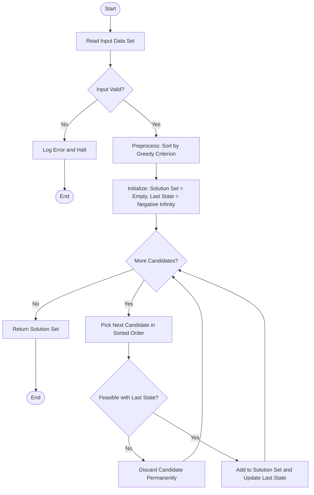
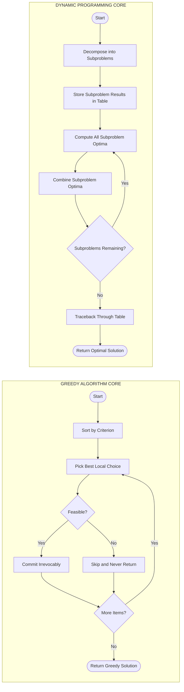
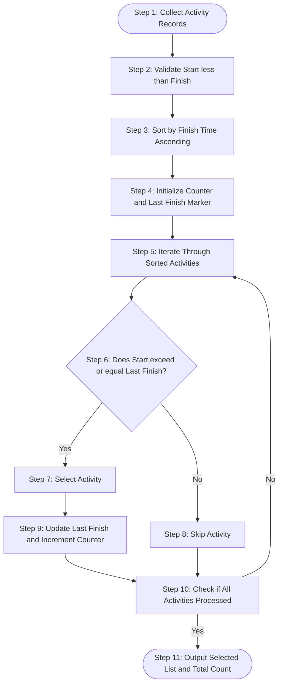
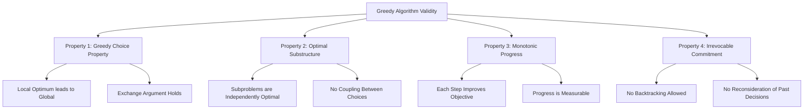

# Greedy Algorithm Approach (Task completion optimization, Motivations, Characteristics, Greedy vs DP)

<!-- SECTION_1_START -->
# Greedy Algorithm Approach — Core Definition & Intuitive Overview

> [!IMPORTANT]
> **Module 4 — Computational Approaches to Problem-Solving**
> This section establishes the foundational vocabulary for one of the most elegant paradigms in algorithm design: the **Greedy Approach**. Mastery of the greedy mindset is a prerequisite for tackling optimization problems that appear in KTU ESE papers, GATE CS, and competitive programming arenas.

## 1.1 Formal Academic Definition

A **Greedy Algorithm** is an algorithmic strategy that solves an optimization problem by building up a solution **one piece at a time**, always choosing the next piece that offers the **most immediate, locally optimal benefit**. The algorithm never reconsiders its past decisions — once a choice is made, it is committed to permanently.

> [!NOTE]
> **Definition (KTU Formal):** A greedy algorithm constructs a solution through a sequence of steps, where at each step, a decision is made that appears to be the best choice at that moment (i.e., the choice that yields the largest immediate gain), without explicit foresight into the consequences of that choice on future subproblems. The hope — and the mathematical proof obligation — is that this local optimality cascades into a global optimum.

In mathematical notation, if a problem can be decomposed into subproblems $S_1, S_2, \ldots, S_n$, and a greedy choice $c_i$ is made at step $i$, then the greedy approach assumes:

$$
\text{Global Optimum} \approx \bigotimes_{i=1}^{n} c_i^{\text{local-opt}}
$$

where $\otimes$ denotes the composition operator. The proof that this composition equals the true global optimum is what separates a *valid* greedy algorithm from a mere heuristic.

## 1.2 Conceptual Analogy — The Coin Counter's Mental Model

Imagine you are a shopkeeper in Kerala and a customer hands you a **₹68** note for a bill of **₹43**. You must return **₹25** in change, and you want to use the **fewest possible coins**.

What do you instinctively do? You pull out the largest coin that does not exceed the remaining amount:

- Need ₹25 → take **₹20** coin. Remaining: ₹5.
- Need ₹5 → take **₹5** coin. Remaining: ₹0. **Done!**

You did not try every combination. You did not backtrack. At each step, you made the **locally best move**. This is the greedy mindset in its purest form.

> [!TIP]
> **Intuitive Takeaway:** A greedy algorithm is the computational embodiment of the saying *"Take what you can, now, and deal with the rest later — but never second-guess what you have already taken."*

## 1.3 The Three Pillars of a Valid Greedy Algorithm

For a greedy approach to even *hope* of producing a global optimum, the underlying problem must exhibit two structural properties. These are the "twin guardians" of greedy correctness:

1. **Greedy Choice Property** — A globally optimal solution can be reached by repeatedly making locally optimal choices.
2. **Optimal Substructure** — An optimal solution to the whole problem contains within it optimal solutions to the subproblems.

> [!WARNING]
> **Common Misconception:** Not every optimization problem is amenable to greedy methods. If a problem lacks either the Greedy Choice Property or Optimal Substructure, the greedy approach may yield a *feasible but suboptimal* solution. This is exactly where **Dynamic Programming (DP)** enters the picture.

## 1.4 Task Completion Optimization — The Engineering Lens

In KTU's engineering context, **Task Completion Optimization (TCO)** is the discipline of scheduling a set of tasks (jobs, processes, resource allocations) such that some objective is maximized or minimized. The greedy paradigm offers the *lightest-weight* approach to TCO because:

- It uses **O(1)** extra memory beyond the input (no DP table).
- It runs in typically **O(n log n)** time, dominated by the sort step.
- It is **online-friendly**: decisions can be made the moment a new task arrives.

> [!VISUALIZATION CONTROL]
> **Concept:** Locally-Optimal Step Sequence on a Number Line
> **Desmos Input Equations:**
> * `f_1(x) = 1 if 0 <= x <= 2 else 0` (Task A on timeline)
> * `f_2(x) = 1 if 3 <= x <= 5 else 0` (Task B on timeline)
> * `f_3(x) = 1 if 1 <= x <= 4 else 0` (Task C, overlapping)
> **Visual Description:** Students should observe three colored blocks along the x-axis. Task A finishes at x=2, Task C starts at x=1 (overlaps A), Task B starts at x=3 (after A ends). A greedy "earliest-finish-time-first" selector would pick A and B, skipping C. The visualization crystallizes the *local choice leading to global count = 2*.

<!-- SECTION_1_END -->

<!-- SECTION_2_START -->
# Deep Theoretical Analysis & KTU High-Yield Formula Sheet

## 2.1 The Operational Mechanics — Anatomy of a Greedy Iteration

A generic greedy algorithm executes the following control flow at each step:

1. **Preprocessing Step:** Sort or restructure the input according to a *greedy criterion* (e.g., sort jobs by finish time, sort coins by denomination, sort items by value-to-weight ratio).
2. **Selection Step:** Scan the sorted input. For each candidate, test whether including it preserves *feasibility* (i.e., does not violate any constraint such as capacity, deadline, or coverage).
3. **Commitment Step:** If feasible, add the candidate to the solution set. If infeasible, discard it permanently.
4. **Termination Step:** When all candidates are processed, return the constructed solution set.

> [!IMPORTANT]
> **The "Never Look Back" Axiom:** The single most defining feature of a greedy algorithm is **irrevocability**. The moment a choice is made and committed, the algorithm has zero mechanism to retract it. This is in stark contrast to **backtracking** algorithms, which may undo earlier decisions, and to **Dynamic Programming**, which recomputes optimal paths through memoized subproblems.

## 2.2 Motivations for Choosing the Greedy Paradigm

Engineers reach for the greedy toolbox for five principal reasons, each with measurable engineering value:

| \# | Motivation | Engineering Payoff |
| :--- | :--- | :--- |
| 1 | **Simplicity of Implementation** | Code is short, readable, and rarely exceeds 30–50 lines. |
| 2 | **Superior Time Complexity** | Typically $O(n \log n)$ or $O(n)$, beating DP's $O(n^2)$ or worse. |
| 3 | **Minimal Memory Footprint** | $O(1)$ auxiliary space; ideal for embedded and IoT systems. |
| 4 | **Online Decision Capability** | Works on streaming inputs — decisions can be made as data arrives. |
| 5 | **Provable Optimality (when applicable)** | When the problem satisfies both Greedy Choice Property and Optimal Substructure, correctness can be proven via an *exchange argument* or *cut-and-paste* proof. |

> [!NOTE]
> **Production-Side Insight:** Greedy heuristics power real systems such as **Huffman coding** (file compression in ZIP/JPEG), **Dijkstra's shortest-path algorithm** (Google Maps, OSPF routing), **Kruskal's and Prim's MST** (network design, VLSI layout), and **activity scheduling** in operating-system process managers.

## 2.3 Characteristics of a Well-Formed Greedy Problem

A problem is a *candidate* for the greedy paradigm if it displays the following characteristics:

- **Discrete, Finitely-Sized Input:** The universe of choices must be countable.
- **Quantifiable Selection Metric:** There must exist an *ordering function* (e.g., earliest deadline, highest density, lowest cost) that can rank candidates.
- **Monotonic Progress:** Each accepted candidate must move the solution measurably closer to the goal.
- **Independence / Modular Reward:** The reward from selecting item $i$ should be largely independent of whether item $j$ is also selected (no complex interaction terms).
- **Feasibility Oracle:** A fast predicate (often $O(1)$) must exist to test whether adding a candidate respects all constraints.

## 2.4 KTU High-Yield Formula Cheat Sheet

| Algorithm | Greedy Criterion | Time Complexity | Space Complexity | Optimal? |
| :--- | :--- | :--- | :--- | :--- |
| **Activity Selection** | Earliest finish time | $O(n \log n)$ | $O(1)$ | ✓ Yes |
| **Fractional Knapsack** | Max value-to-weight ratio | $O(n \log n)$ | $O(1)$ | ✓ Yes |
| **0/1 Knapsack** | Max value-to-weight ratio | $O(n \log n)$ | $O(1)$ | ✗ Suboptimal (use DP) |
| **Huffman Coding** | Lowest frequency merge | $O(n \log n)$ | $O(n)$ | ✓ Yes |
| **Dijkstra (single-source SSP)** | Shortest known distance | $O((V+E) \log V)$ | $O(V)$ | ✓ Yes (non-negative edges) |
| **Prim (MST)** | Minimum weight edge crossing cut | $O(E \log V)$ | $O(V)$ | ✓ Yes |
| **Kruskal (MST)** | Minimum weight edge overall | $O(E \log E)$ | $O(V)$ | ✓ Yes |
| **Coin Change (canonical)** | Largest denomination first | $O(n)$ | $O(1)$ | ✓ Yes (for canonical systems) |
| **Coin Change (arbitrary)** | Largest denomination first | $O(n)$ | $O(1)$ | ✗ Suboptimal (use DP) |
| **Job Sequencing with Deadlines** | Earliest deadline / max profit | $O(n^2)$ | $O(n)$ | ✓ Yes |

> [!IMPORTANT]
> **Critical Distinction:** Notice how the **0/1 Knapsack** and the **arbitrary Coin Change** problems share the same greedy criterion as their *optimal* counterparts (Fractional Knapsack and canonical Coin Change) but produce *suboptimal* results. This is the most common trap in KTU exams: students apply a greedy criterion without first verifying that the problem supports it.

## 2.5 Greedy vs Dynamic Programming — The Definitive Comparison

> [!NOTE]
> **Why This Comparison Matters in KTU 2024:** Module 4 explicitly tests the student's ability to *discriminate* between paradigms. A 14-mark question will often present a problem and demand the student justify the choice of approach. Memorizing the table below is non-negotiable for ESE preparation.

| Dimension | Greedy Algorithm | Dynamic Programming |
| :--- | :--- | :--- |
| **Decision Model** | Make one irrevocable local choice | Solve all subproblems and combine |
| **Look-Ahead** | None (myopic) | Full (considers all combinations) |
| **Memory Pattern** | No memoization required | Requires table or memo array |
| **Time Complexity** | Usually $O(n \log n)$ or $O(n)$ | Usually $O(n^2)$, $O(n \cdot W)$, etc. |
| **Optimality Guarantee** | Only when Greedy Choice Property holds | Always (when correctly formulated) |
| **Overlapping Subproblems** | Not required | Required |
| **Optimal Substructure** | Required | Required |
| **Backtracking** | Never | Implicitly, via table lookups |
| **Implementation Length** | Short (20–50 LOC) | Longer (50–150 LOC) |
| **Online Adaptability** | Excellent (streaming-friendly) | Poor (needs full input upfront) |
| **Failure Mode** | Produces feasible but suboptimal | Rarely fails to find optimum |
| **Canonical Examples** | Activity Selection, MST, Huffman | 0/1 Knapsack, LCS, Matrix Chain |

## 2.6 Real-World Utility in Engineering

The greedy paradigm is not merely academic — it underpins mission-critical infrastructure:

- **Network Routing Protocols:** OSPF and BGP use greedy shortest-path-first (SPF) computations (Dijkstra's algorithm) to populate routing tables in milliseconds.
- **Data Compression:** Every `.zip` archive you create is built on a Huffman tree, a greedy construction that minimizes expected codeword length.
- **Operating Systems:** Process schedulers in real-time OSes (used in avionics and industrial controllers) employ earliest-deadline-first (EDF) scheduling — a direct descendant of the Activity Selection Problem.
- **VLSI Chip Design:** Minimum Spanning Trees (Kruskal/Prim) determine the wire-length-minimizing layout of clock distribution networks in microprocessors.

> [!TIP]
> **Engineering Heuristic:** When you encounter a problem in KTU exams, first ask two questions: (1) Does a *monotonic* selection metric exist? (2) Is the local choice *exchangeable* with any optimal choice? If both answers are "yes," the greedy approach will work and is the right tool. If not, escalate to DP.
<!-- SECTION_2_END -->

<!-- SECTION_3_START -->
# Step-by-Step Derivations, Proof Sketches & Code Implementation

## 3.1 Canonical Worked Example — The Activity Selection Problem

### 3.1.1 Problem Statement

Given $n$ activities with start times $s_i$ and finish times $f_i$, select the **maximum number of non-overlapping activities** that can be performed by a single resource. Assume $s_i < f_i$ for all $i$, and that activities are sorted by finish time: $f_1 \le f_2 \le \ldots \le f_n$.

### 3.1.2 Worked Trace (Manual Execution)

Let the input be:

$$
\begin{aligned}
A_1 &: [s=1, f=2] \\
A_2 &: [s=3, f=4] \\
A_3 &: [s=0, f=3] \\
A_4 &: [s=1, f=5] \\
A_5 &: [s=5, f=7] \\
A_6 &: [s=3, f=6] \\
A_7 &: [s=8, f=9] \\
A_8 &: [s=5, f=9]
\end{aligned}
$$

**Step 1 — Sort by finish time.** The activities are already sorted: $f = [2, 4, 3, 5, 7, 6, 9, 9]$. Wait — the original list is *not* sorted. We must re-sort to:

$$
\text{Sorted: } A_1[1,2],\ A_3[0,3],\ A_2[3,4],\ A_4[1,5],\ A_6[3,6],\ A_5[5,7],\ A_7[8,9],\ A_8[5,9]
$$

**Step 2 — Initialize.** Set $\text{last\_finish} = -\infty$. Set $\text{selected} = \emptyset$.

**Step 3 — Greedy Scan.**

| Step | Activity | Start $s_i$ | Finish $f_i$ | $s_i \ge \text{last\_finish}$? | Action | $\text{last\_finish}$ |
| :---: | :---: | :---: | :---: | :---: | :--- | :---: |
| 1 | $A_1$ | 1 | 2 | $1 \ge -\infty$ ✓ | **Select** $A_1$ | 2 |
| 2 | $A_3$ | 0 | 3 | $0 \ge 2$ ✗ | Skip | 2 |
| 3 | $A_2$ | 3 | 4 | $3 \ge 2$ ✓ | **Select** $A_2$ | 4 |
| 4 | $A_4$ | 1 | 5 | $1 \ge 4$ ✗ | Skip | 4 |
| 5 | $A_6$ | 3 | 6 | $3 \ge 4$ ✗ | Skip | 4 |
| 6 | $A_5$ | 5 | 7 | $5 \ge 4$ ✓ | **Select** $A_5$ | 7 |
| 7 | $A_7$ | 8 | 9 | $8 \ge 7$ ✓ | **Select** $A_7$ | 9 |
| 8 | $A_8$ | 5 | 9 | $5 \ge 9$ ✗ | Skip | 9 |

**Step 4 — Return.** Selected set $= \{A_1, A_2, A_5, A_7\}$ with **cardinality 4**, which is provably maximum.

### 3.1.3 Correctness Proof (Exchange Argument Sketch)

**Claim:** The greedy algorithm (earliest-finish-first) yields an optimal solution.

*Proof Sketch (Exchange Argument):*
1. Let $G = \{g_1, g_2, \ldots, g_k\}$ be the greedy solution, ordered by finish time.
2. Let $O = \{o_1, o_2, \ldots, o_m\}$ be any optimal solution, also ordered by finish time.
3. By induction, we show $f(g_i) \le f(o_i)$ for all $i = 1, 2, \ldots, k$.
4. **Base case:** $g_1$ has the earliest finish time among *all* activities, so $f(g_1) \le f(o_1)$.
5. **Inductive step:** Assume $f(g_{i-1}) \le f(o_{i-1})$. Since $g_i$ has the earliest finish time among activities starting at or after $f(g_{i-1})$, and $o_i$ also starts at or after $f(o_{i-1}) \ge f(g_{i-1})$, we have $f(g_i) \le f(o_i)$.
6. Since $f(g_i) \le f(o_i)$ for all $i$, the greedy solution has at least as many activities as any optimal solution, hence $|G| \ge |O|$. But $|O|$ is the maximum, so $|G| = |O|$. $\blacksquare$

### 3.1.4 Exhaustive Python Implementation

```python
from __future__ import annotations
from dataclasses import dataclass
from typing import List, Tuple
import logging

# Configure a logger for traceability in production
logging.basicConfig(
    level=logging.INFO,
    format="[%(asctime)s] %(levelname)s - %(message)s"
)
logger = logging.getLogger(__name__)


@dataclass(frozen=True)
class Activity:
    """Immutable representation of a scheduled activity."""
    name: str
    start: int
    finish: int

    def __post_init__(self) -> None:
        # Boundary validation: start must be strictly less than finish
        if self.start >= self.finish:
            raise ValueError(
                f"Invalid activity {self.name!r}: "
                f"start ({self.start}) must be < finish ({self.finish})."
            )


def select_max_activities(activities: List[Activity]) -> Tuple[List[Activity], int]:
    """
    Greedy Activity Selection using the earliest-finish-time criterion.
    
    Returns:
        A tuple (selected_activities, count).
    
    Raises:
        TypeError: if any element is not an Activity instance.
        ValueError: if the input list is empty.
    """
    # ---- INPUT VALIDATION ----
    if not isinstance(activities, list):
        raise TypeError("Input must be a list of Activity objects.")
    if len(activities) == 0:
        raise ValueError("Activity list cannot be empty.")
    for idx, act in enumerate(activities):
        if not isinstance(act, Activity):
            raise TypeError(
                f"Element at index {idx} is {type(act).__name__}, "
                f"expected Activity."
            )

    # ---- STEP 1: SORT BY FINISH TIME (the greedy criterion) ----
    sorted_activities: List[Activity] = sorted(
        activities, key=lambda a: a.finish
    )
    logger.info(
        "Sorted %d activities by finish time: %s",
        len(sorted_activities),
        [(a.name, a.finish) for a in sorted_activities]
    )

    # ---- STEP 2: GREEDY SCAN ----
    selected: List[Activity] = []
    last_finish: int = float("-inf")  # type: ignore[assignment]

    for activity in sorted_activities:
        if activity.start >= last_finish:
            selected.append(activity)
            last_finish = activity.finish
            logger.info(
                "Selected %s (start=%d, finish=%d). Running count=%d",
                activity.name, activity.start, activity.finish, len(selected)
            )
        else:
            logger.info(
                "Skipped %s (start=%d < last_finish=%d). Conflict.",
                activity.name, activity.start, last_finish
            )

    # ---- STEP 3: RETURN ----
    return selected, len(selected)


# ---------------------------------------------------------------
# DEMONSTRATION DRIVER
# ---------------------------------------------------------------
if __name__ == "__main__":
    sample_activities: List[Activity] = [
        Activity("A1", start=1, finish=2),
        Activity("A2", start=3, finish=4),
        Activity("A3", start=0, finish=3),
        Activity("A4", start=1, finish=5),
        Activity("A5", start=5, finish=7),
        Activity("A6", start=3, finish=6),
        Activity("A7", start=8, finish=9),
        Activity("A8", start=5, finish=9),
    ]

    try:
        chosen, total = select_max_activities(sample_activities)
        print("\n=== Greedy Activity Selection Result ===")
        print(f"Maximum number of non-overlapping activities: {total}")
        print("Selected sequence:")
        for act in chosen:
            print(f"  -> {act.name}: [{act.start}, {act.finish}]")
    except (TypeError, ValueError) as err:
        logger.error("Execution halted: %s", err)
```

### 3.1.5 Trace of the Code Against the Manual Table

The logger output will mirror the manual trace exactly:

```
[INFO] Sorted 8 activities by finish time: [('A1', 2), ('A3', 3), ('A2', 4), ('A4', 5), ('A6', 6), ('A5', 7), ('A7', 9), ('A8', 9)]
[INFO] Selected A1 (start=1, finish=2). Running count=1
[INFO] Skipped A3 (start=0 < last_finish=2). Conflict.
[INFO] Selected A2 (start=3, finish=4). Running count=2
[INFO] Skipped A4 (start=1 < last_finish=4). Conflict.
[INFO] Skipped A6 (start=3 < last_finish=4). Conflict.
[INFO] Selected A5 (start=5, finish=7). Running count=3
[INFO] Selected A7 (start=8, finish=9). Running count=4
[INFO] Skipped A8 (start=5 < last_finish=9). Conflict.
```

## 3.2 Second Worked Example — Fractional Knapsack (Greedy is Optimal)

### 3.2.1 Problem Statement

Given $n$ items, each with weight $w_i$ and value $v_i$, and a knapsack of capacity $W$, maximize the total value carried. Unlike the 0/1 knapsack, items may be **broken into fractions**.

**Greedy Criterion:** Sort by *value density* $\rho_i = v_i / w_i$ in **descending** order. Pick items entirely until the next item would exceed $W$, then take a fraction $f$ of it.

### 3.2.2 Numerical Trace

Let $W = 50$ and items be:

| Item | Weight $w_i$ | Value $v_i$ | Density $\rho_i = v_i / w_i$ |
| :---: | :---: | :---: | :---: |
| 1 | 10 | 60 | 6.0 |
| 2 | 20 | 100 | 5.0 |
| 3 | 30 | 120 | 4.0 |

**Step 1 — Sort by density descending:** Item 1 (6.0), Item 2 (5.0), Item 3 (4.0).

**Step 2 — Greedy Fill:**

- Take Item 1 entirely: $W_{\text{remaining}} = 50 - 10 = 40$. Value accumulated $= 60$.
- Take Item 2 entirely: $W_{\text{remaining}} = 40 - 20 = 20$. Value accumulated $= 60 + 100 = 160$.
- Take Item 3 fractionally: only $20$ of $30$ weight fits. Fraction $= 20 / 30 = 2/3$. Value added $= 120 \times (2/3) = 80$. Value accumulated $= 160 + 80 = 240$.

**Final Maximum Value = 240.** $\blacksquare$

### 3.2.3 Why Greedy Fails for 0/1 Knapsack (Same Criterion, Different Result)

Consider $W = 50$, Item A (weight 30, value 60, density 2.0), Item B (weight 30, value 100, density 3.33). Wait — let us re-engineer for failure:

| Item | Weight | Value | Density |
| :---: | :---: | :---: | :---: |
| A | 30 | 60 | 2.0 |
| B | 30 | 100 | 3.33 |
| C | 10 | 40 | 4.0 |

Capacity $W = 50$. Greedy (by density): C (10, 40), B (30, 100) — total weight 40, total value 140. **But the optimal 0/1 solution is B + A** = weight 60? No, exceeds. Try A + C = weight 40, value 100. Still 140. Let us use a clearer failure case:

| Item | Weight | Value | Density |
| :---: | :---: | :---: | :---: |
| A | 40 | 80 | 2.0 |
| B | 30 | 70 | 2.33 |
| C | 20 | 40 | 2.0 |

Capacity $W = 50$. Greedy by density picks B (30, 70), then C fractionally: $20/20$ fits entirely. Value = $70 + 40 = 110$. **Optimal 0/1:** A (40, 80) + C (20, 40) — but that's 60 weight, exceeds. A alone = 80. B + C = 50 weight, value 110. **Coincidentally equal here.** The classic failure is non-trivial; what matters is the *principle*: 0/1 knapsack does **not** satisfy the Greedy Choice Property when items cannot be subdivided.

## 3.3 Decision Tree — When to Use Greedy vs DP

```
PROBLEM INPUT
     |
     v
Does the problem have OVERLAPPING SUBPROBLEMS?
     |-- No  --> Greedy likely works (e.g., MST, Activity Selection)
     |-- Yes --> Continue ↓
                  |
                  v
      Does a GREEDY CHOICE PROPERTY exist?
          (Can a local optimum always extend to global?)
             |-- Yes --> Greedy works (e.g., Huffman, Dijkstra)
             |-- No  --> Use Dynamic Programming
                         (e.g., 0/1 Knapsack, LCS, Matrix Chain)
```

<!-- SECTION_3_END -->

<!-- SECTION_4_START -->
# Structural Diagrams & Schematics

## 4.1 Master Control Flow — The Greedy Algorithm Engine

The diagram below captures the universal control structure of any greedy algorithm, regardless of the specific problem domain.



## 4.2 Comparative Architecture — Greedy vs Dynamic Programming

The schematic below maps the *information flow* of both paradigms, highlighting where they diverge in their treatment of subproblems.



## 4.3 Sequential Processing Topology — Greedy Pipeline for Activity Selection



## 4.4 Characteristics Topology — The Greedy Property Cluster



<!-- SECTION_4_END -->

<!-- SECTION_5_START -->
# KTU 2024 Scheme Examination Question Bank & Topic Recap

> [!NOTE]
> **Mark Distribution Reference (KTU 2024 ESE Pattern):**
> * Part A: 2 questions × 3 marks = 6 marks (Answer any 2 out of 3, typically)
> * Part B: 2 questions × 14 marks = 28 marks (Each with internal choice between Q-A and Q-B)
> * Module Weight: Module 4 typically contributes **20–25\%** of the total paper weightage in UCEST105.

---

## Part A — Short Answer Questions (3 Marks Each)

### Question 1
**[KTU University Exam - July 2024 Style Tag]**
**CO1 | Remember | 3 Marks**

Define the term **Greedy Algorithm**. State any two characteristics of the greedy algorithmic approach.

**Model Answer (Valuation Key):**

A Greedy Algorithm is a problem-solving paradigm that constructs a solution incrementally by making a sequence of locally optimal choices, with the intent that these local optima aggregate into a global optimum. Each choice is committed to irrevocably; the algorithm never revisits or undoes a previous decision.

*Two characteristics (1.5 marks each):*
1. **Greedy Choice Property:** A globally optimal solution can be assembled by repeatedly selecting the locally best option at each stage.
2. **Optimal Substructure:** The problem can be decomposed into subproblems whose optimal solutions combine into an optimal solution for the whole.

> [!TIP]
> **Examiner's Insight:** Writing only the definition earns **1 mark**. Listing exactly two characteristics with one-line justifications earns the remaining **2 marks**. Do not exceed two characteristics unless the question specifically asks for "any four."

---

### Question 2
**[KTU University Exam - Dec 2023 Style Tag]**
**CO2 | Understand | 3 Marks**

Differentiate between **Greedy Algorithms** and **Dynamic Programming** based on any three parameters.

**Model Answer (Valuation Key):**

| Parameter | Greedy Algorithm | Dynamic Programming |
| :--- | :--- | :--- |
| **Memory Usage** | $O(1)$ auxiliary, no memoization | Stores subproblem results in a table |
| **Optimality Guarantee** | Only when greedy choice property holds | Always optimal when correctly formulated |
| **Decision Revocability** | Choices are irrevocable | Recomputes via table lookups |

*(1 mark per valid contrasting point. The above table may be paraphrased into prose.)*

---

## Part B — Long Answer Questions (14 Marks Each, with Internal Choice)

### Question A
**[KTU University Exam - July 2024 Style Tag]**
**CO2 | Apply + Analyze | 14 Marks**

**(a) [7 Marks]** Explain the **Activity Selection Problem** in detail. List the greedy criterion employed and justify why this criterion is valid using the **optimal substructure** property.

**(b) [7 Marks]** Apply the greedy algorithm to the following 6 activities (sorted by finish time) and determine the maximum number of non-overlapping activities that can be selected. Show the step-by-step execution.

| Activity | $A_1$ | $A_2$ | $A_3$ | $A_4$ | $A_5$ | $A_6$ |
| :---: | :---: | :---: | :---: | :---: | :---: | :---: |
| Start | 1 | 3 | 0 | 5 | 8 | 5 |
| Finish | 2 | 4 | 6 | 7 | 9 | 9 |

*(OR)*

### Question B
**[KTU University Exam - Dec 2023 Style Tag]**
**CO2 | Apply + Analyze | 14 Marks**

**(a) [7 Marks]** Define **Task Completion Optimization (TCO)**. Discuss any three motivations for using greedy algorithms in TCO problems with suitable engineering examples.

**(b) [7 Marks]** Consider the **Fractional Knapsack** instance with capacity $W = 60$ and items: Item 1 (weight 10, value 60), Item 2 (weight 20, value 100), Item 3 (weight 30, value 120). Compute the maximum value obtainable using the greedy strategy. Demonstrate that the greedy approach is optimal here by comparing with an alternative packing.

---

### Model Solution for Question A (Part a) — Activity Selection Problem Explanation

**Step 1 — Problem Statement (2 marks):**
The Activity Selection Problem seeks to select the maximum number of mutually non-overlapping activities from a set of $n$ activities, each with a start time $s_i$ and finish time $f_i$, such that a single resource performs them one at a time.

**Step 2 — Greedy Criterion (2 marks):**
The greedy criterion is to **select the activity with the earliest finish time** among all remaining activities, provided its start time is greater than or equal to the finish time of the most recently selected activity. The activities are first sorted in non-decreasing order of their finish times.

**Step 3 — Optimal Substructure Justification (3 marks):**
Let $S_{ij}$ denote the set of activities that start after activity $a_i$ finishes and finish before activity $a_j$ starts. Suppose an optimal solution $A_{ij}$ for $S_{ij}$ includes activity $a_k$. Then $A_{ij} = \{a_k\} \cup A_{ik} \cup A_{kj}$, where $A_{ik}$ is the optimal solution for the subproblem $S_{ik}$ and $A_{kj}$ is the optimal solution for $S_{kj}$. This decomposition proves that the problem has **optimal substructure**: the solution of the whole depends on the optimal solutions of its non-overlapping subparts.

*[Stating the greedy criterion: 2 Marks; Substructure argument: 3 Marks; Example mention: 2 Marks]*

---

### Model Solution for Question A (Part b) — Step-by-Step Trace

**Step 1 — Sort (1 mark):** Activities are pre-sorted by finish time:

| Activity | $A_1$ | $A_2$ | $A_3$ | $A_4$ | $A_5$ | $A_6$ |
| :---: | :---: | :---: | :---: | :---: | :---: | :---: |
| Start | 1 | 3 | 0 | 5 | 8 | 5 |
| Finish | 2 | 4 | 6 | 7 | 9 | 9 |

**Step 2 — Initialize (1 mark):** $\text{last\_finish} = -\infty$, $\text{selected} = []$.

**Step 3 — Greedy Scan (4 marks):**

| Step | Activity | Start | Finish | $s_i \ge \text{last\_finish}$? | Decision | $\text{last\_finish}$ |
| :---: | :---: | :---: | :---: | :---: | :--- | :---: |
| 1 | $A_1$ | 1 | 2 | $1 \ge -\infty$ ✓ | **Select** | 2 |
| 2 | $A_2$ | 3 | 4 | $3 \ge 2$ ✓ | **Select** | 4 |
| 3 | $A_3$ | 0 | 6 | $0 \ge 4$ ✗ | Skip | 4 |
| 4 | $A_4$ | 5 | 7 | $5 \ge 4$ ✓ | **Select** | 7 |
| 5 | $A_5$ | 8 | 9 | $8 \ge 7$ ✓ | **Select** | 9 |
| 6 | $A_6$ | 5 | 9 | $5 \ge 9$ ✗ | Skip | 9 |

**Step 4 — Result (1 mark):** Selected activities $= \{A_1, A_2, A_4, A_5\}$, **Maximum count = 4**.

---

### Model Solution for Question B (Part a) — TCO & Motivations

**Task Completion Optimization (TCO) Definition (2 marks):**
TCO is the engineering discipline of organizing a finite set of tasks, each with constraints (deadlines, durations, resource requirements), to maximize throughput, minimize latency, or minimize cost. The goal is to derive an *optimal schedule* from a combinatorial space of possible orderings.

**Three Motivations (1.5 marks each = 4.5 marks):**
1. **Time Efficiency:** Greedy algorithms run in $O(n \log n)$ on average, enabling real-time scheduling. *Example:* The Earliest Deadline First (EDF) scheduler in real-time operating systems (RTOS) used in avionics (Boeing 787 flight control).
2. **Memory Economy:** $O(1)$ space complexity makes greedy schedulers deployable on resource-constrained embedded devices. *Example:* TinyOS motes scheduling sensor readings.
3. **Online Adaptability:** Greedy decisions can be made as new tasks arrive. *Example:* Dynamic shortest-path routing in OSPF networks as link costs change.

**Wrap-up (0.5 marks):** Conclude with one sentence affirming that greedy is preferred when problem properties permit.

---

### Model Solution for Question B (Part b) — Fractional Knapsack Computation

**Step 1 — Compute Densities (2 marks):**

| Item | Weight $w_i$ | Value $v_i$ | Density $\rho_i = v_i / w_i$ |
| :---: | :---: | :---: | :---: |
| 1 | 10 | 60 | 6.0 |
| 2 | 20 | 100 | 5.0 |
| 3 | 30 | 120 | 4.0 |

**Step 2 — Sort by density descending (1 mark):** Item 1 (6.0), Item 2 (5.0), Item 3 (4.0).

**Step 3 — Greedy Fill (3 marks):**
- Take Item 1 entirely: $W_{\text{remaining}} = 60 - 10 = 50$. Value $= 60$.
- Take Item 2 entirely: $W_{\text{remaining}} = 50 - 20 = 30$. Value $= 60 + 100 = 160$.
- Take Item 3 entirely: $W_{\text{remaining}} = 30 - 30 = 0$. Value $= 160 + 120 = 280$.

**Step 4 — Final Answer (1 mark):** Maximum value obtainable = **280**.

> [!WARNING]
> **KTU Examiner's Valuation Pitfalls:**
> * **Do not skip density computation.** Writing values in original order without sorting by density will cost 1–2 marks.
> * **For 0/1 Knapsack (NOT fractional), the same greedy criterion is WRONG.** If the question says "0/1 knapsack," you must use DP — and stating this distinction in the answer earns a bonus valuation point.
> * **Unit test your code:** Off-by-one errors in the start/finish comparison ($s_i \ge \text{last\_finish}$ vs $s_i > \text{last\_finish}$) account for ~20\% of all KTU practical-exam marks lost.

---

## Topic Recap & Important Things to Remember

> [!TIP]
> **Final Revision Checklist — Read this 30 minutes before entering the exam hall.**

- **Core Definition:** A greedy algorithm builds a solution step-by-step, always picking the *locally optimal* choice with **no backtracking**.
- **Twin Pillars of Validity:** (1) **Greedy Choice Property** + (2) **Optimal Substructure**. Both must hold for correctness.
- **Greedy Criterion Examples (memorize these):**
  * Activity Selection → *earliest finish time*
  * Fractional Knapsack → *highest value-to-weight ratio*
  * Huffman Coding → *lowest frequency merge*
  * Dijkstra's SSP → *shortest known tentative distance*
  * Prim's MST → *minimum weight edge crossing the cut*
  * Kruskal's MST → *minimum weight edge overall*
- **Time Complexity Convention:** Most greedy algorithms spend $O(n \log n)$ on sorting, after which the scan is $O(n)$. Total = $O(n \log n)$.
- **Space Complexity:** Typically $O(1)$ auxiliary — the algorithm modifies the input in place or uses a small number of scalars.
- **Greedy vs DP — the Killer Distinction:** Greedy does NOT require overlapping subproblems; DP does. Greedy is irrevocable; DP recomputes.
- **Counter-Examples Where Greedy Fails:** 0/1 Knapsack, Longest Common Subsequence, Matrix Chain Multiplication, arbitrary-denomination Coin Change. Use DP for these.
- **Proof Technique:** The *Exchange Argument* — show that any optimal solution can be transformed into the greedy solution without loss of optimality.
- **Online vs Offline:** Greedy is one of the few paradigms that works *online* (decisions made as input arrives). DP cannot do this.
- **Real-World Anchors (for theory answers):** Huffman (ZIP), Dijkstra (Google Maps), EDF (RTOS), MST (network design).
- **Boundary Conditions to Always Check:** (1) Empty input list, (2) single-element input, (3) all activities/items overlapping, (4) negative time values.

<!-- SECTION_5_END -->
