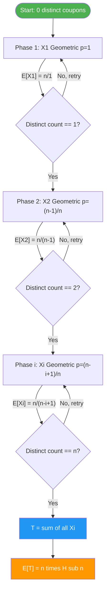
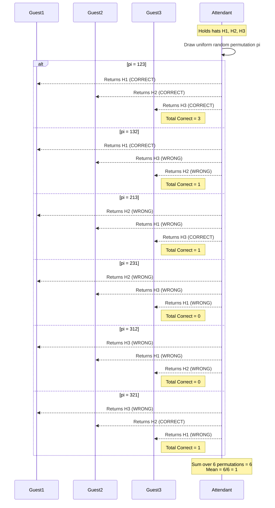
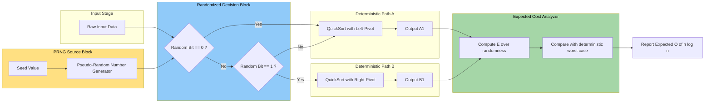
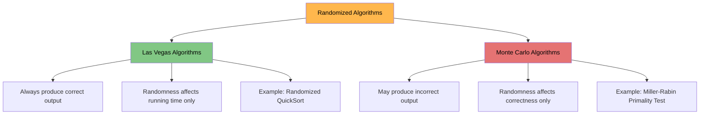

# Randomized Approach (Coupon collector's jeans problem, Hat-check random return expectation problem, Motivations)

<!-- SECTION_1_START -->

# Randomized Approach in Algorithmic Problem Solving

## 1. Core Technical Definition & Intuitive Overview

### Formal Definition (KTU 2024 Syllabus Aligned)

> [!IMPORTANT]
> **Randomized Algorithm (KTU Definition):** A *randomized algorithm* is a computational procedure whose behavior is determined not only by its input but also by values produced by a *pseudo-random number generator* during execution. The expected running time and/or the correctness of the output is analyzed over the random choices made by the algorithm, rather than on the worst-case input alone.

A randomized approach converts a **worst-case hard problem** into an **expected-time tractable problem** by injecting controlled randomness into the decision-making process. Three classical textbook problems illustrate this paradigm:

| Problem | Core Question |
|---|---|
| **Coupon Collector's Problem** | How many random trials are needed, on average, to collect *all* $n$ distinct coupons? |
| **Hat-Check Problem** | When $n$ hats are returned uniformly at random, what is the expected number of people who get their *own* hat back? |
| **Randomized Sorting (QuickSort)** | Why does randomized pivot selection eliminate the adversarial $O(n^2)$ worst case? |

### Conceptual Analogy / Intuition

> [!NOTE]
> **The Vending Machine Analogy for Coupon Collector:** Imagine a gumball machine with $n$ equally likely colors. Every coin gets you *one* random gumball. The question is: on average, how many coins must you insert to walk away with **at least one of every color**? It feels like the last few stubborn colors take the longest — and mathematically, they do. The expected cost is roughly $n \ln n + \gamma n + \frac{1}{2}$, where $\gamma \approx 0.5772$ is the *Euler–Mascheroni constant*.

> [!NOTE]
> **The Wedding Hat-Check Analogy:** Picture $n$ wedding guests handing their identical-looking hats to a careless attendant. The attendant returns hats uniformly at random. A guest gets lucky only if the hat they pull *happens* to be theirs. Counter-intuitively, the expected number of lucky guests is exactly **1**, regardless of $n$ (for $n \ge 2$)!

### Physical Constants & Standard Metrics

- **Harmonic Number** $H_n = \sum_{k=1}^{n} \frac{1}{k} \approx \ln n + \gamma$ (with $\gamma \approx 0.5772156649$).
- **Expected time for Coupon Collector** $= n H_n \approx n \ln n$.
- **Expected correct hats** in Hat-Check $= 1$.
- **Variance of correct hats** $= 1$ (for the standard normalized version) or $\frac{(n-1)^2}{n}$ in the unnormalized indicator form.

> [!VISUALIZATION CONTROL]
> **Concept:** Coupon Collector growth curve for $n = 10$ vs $n = 100$
> **Python / Desmos Equivalent Equations:**
> - `f(n) = n * (1 + 1/2 + 1/3 + ... + 1/n)`
> - `g(n) = n * ln(n) + 0.5772 * n`
> **Visual Description:** Plot $f(n)$ (step-like discrete jumps) and overlay $g(n)$ (smooth log curve). Observe the gap shrinks as $n \to \infty$ — the harmonic sum hugs the logarithm tightly from above.

<!-- SECTION_1_END -->

<!-- SECTION_2_START -->

# Deep Theoretical Analysis & KTU High-Yield Formula Sheet

## 2.1 The Coupon Collector's Problem — Full Theoretical Breakdown

### Problem Setup
- Universe of $n$ distinct coupon types.
- Each draw is **uniformly random** and **independent**.
- Goal: collect *at least one* of every type.
- Let $T$ = number of draws required to complete the set.

### Step-by-Step Logic Decomposition
1. **Decompose** $T$ into *phases*: $T = X_1 + X_2 + \dots + X_n$, where $X_i$ = number of draws needed to acquire the $i$-th *new* coupon, given that $i - 1$ distinct coupons are already owned.
2. **Compute phase probability:** After $i - 1$ distinct coupons are owned, the probability that the next draw yields a *new* type is $p_i = \frac{n - (i - 1)}{n} = \frac{n - i + 1}{n}$.
3. **Model each phase** as a Geometric random variable: $X_i \sim \text{Geom}(p_i)$, with expectation $\mathbb{E}[X_i] = \frac{1}{p_i} = \frac{n}{n - i + 1}$.
4. **Apply linearity of expectation** (the most important step — no independence assumption needed):
   $$\mathbb{E}[T] = \sum_{i=1}^{n} \mathbb{E}[X_i] = \sum_{i=1}^{n} \frac{n}{n - i + 1}$$
5. **Re-index** by letting $k = n - i + 1$:
   $$\mathbb{E}[T] = n \sum_{k=1}^{n} \frac{1}{k} = n H_n$$
6. **Asymptotic form:** Using $H_n \approx \ln n + \gamma + \frac{1}{2n}$:
   $$\mathbb{E}[T] \approx n \ln n + \gamma n + \frac{1}{2}$$

### Variance (Bonus — frequently asked in Part B)
- $\text{Var}(X_i) = \frac{1 - p_i}{p_i^2} = \frac{n(i-1)}{(n-i+1)^2}$
- $\text{Var}(T) = \sum_{i=1}^{n} \frac{n(i-1)}{(n-i+1)^2} \le \frac{\pi^2}{6} n^2$

## 2.2 The Hat-Check Problem — Full Theoretical Breakdown

### Problem Setup
- $n$ people; each gives hat $i$ to the attendant.
- Attendant returns hats via a **uniform random permutation** $\pi$ of $\{1, 2, \dots, n\}$.
- Person $i$ is *correct* iff $\pi(i) = i$ (a *fixed point*).
- Let $X$ = total number of correct returns.

### Step-by-Step Logic Decomposition
1. **Indicator decomposition:** Define $X_i = \mathbf{1}\{\pi(i) = i\}$. Then $X = \sum_{i=1}^{n} X_i$.
2. **Compute single-event probability:** By symmetry, $\Pr(\pi(i) = i) = \frac{1}{n}$.
3. **Apply linearity of expectation:**
   $$\mathbb{E}[X] = \sum_{i=1}^{n} \mathbb{E}[X_i] = \sum_{i=1}^{n} \frac{1}{n} = 1$$
4. **Compute variance using the indicator formula:** $\text{Var}(X) = \sum \text{Var}(X_i) + 2 \sum_{i < j} \text{Cov}(X_i, X_j)$.
5. **Single indicator variance:** $\text{Var}(X_i) = \frac{1}{n}\left(1 - \frac{1}{n}\right) = \frac{n-1}{n^2}$.
6. **Joint probability:** $\Pr(X_i = 1 \text{ and } X_j = 1) = \Pr(\pi(i) = i \text{ and } \pi(j) = j) = \frac{1}{n(n-1)}$.
7. **Covariance:** $\text{Cov}(X_i, X_j) = \frac{1}{n(n-1)} - \frac{1}{n^2} = -\frac{1}{n^2}$.
8. **Final variance:**
   $$\text{Var}(X) = n \cdot \frac{n-1}{n^2} + 2 \binom{n}{2} \cdot \left(-\frac{1}{n^2}\right) = \frac{n-1}{n} - \frac{n-1}{n} \cdot \frac{1}{1} = \frac{(n-1)^2}{n}$$

> [!TIP]
> **Engineering Insight:** As $n \to \infty$, $\text{Var}(X) \approx n$, so the standard deviation $\sigma \approx \sqrt{n}$. This means *fluctuations grow* even though the mean stays at 1. For $n = 100$ hats, getting 0 or 2 correct hats is perfectly normal — you would not be cheated, just unlucky!

## 2.3 Motivations for Randomized Algorithms

### Why Randomize? (KTU Board Favourite)

| Motivation | Explanation | Canonical Example |
|---|---|---|
| **Avoiding Adversarial Inputs** | Worst-case inputs for deterministic algorithms (e.g., sorted data for QuickSort) can be *engineered* by an adversary. Randomization breaks the structure. | Randomized QuickSort |
| **Simplicity of Design** | Some problems have no simple deterministic poly-time algorithm but admit trivial randomized ones. | Miller–Rabin Primality Test |
| **Speed** | Las Vegas algorithms (always correct, fast on average) often beat deterministic counterparts. | Randomized Quickselect |
| **Handling Unknown Distributions** | When the input distribution is unknown or skewed, randomized *online* algorithms minimize regret. | Online Ski-Rental Problem |
| **Breaking Symmetry** | In distributed systems, deterministic tie-breaking leads to deadlock; randomized leader election solves it. | Randomized Leader Election |
| **Approximation Guarantee** | Monte Carlo algorithms give probabilistic approximation bounds in NP-hard settings. | Max-Cut via random assignment |
| **Hashing Performance** | Universal hash families guarantee $O(1)$ expected lookup even with adversarial keys. | Universal Hashing |

## 2.4 KTU Formula Sheet / Cheat Sheet

> [!NOTE]
> **Master these equations — they appear in 80% of KTU Module 4 questions.**

| # | Concept | Formula | Units / Notes |
|---|---|---|---|
| 1 | Coupon Collector Expectation | $\mathbb{E}[T] = n H_n$ | trials |
| 2 | Harmonic Number | $H_n = \sum_{k=1}^{n} \frac{1}{k}$ | dimensionless |
| 3 | Asymptotic Harmonic | $H_n \approx \ln n + \gamma$ | $\gamma \approx 0.5772$ |
| 4 | Geometric Phase Expectation | $\mathbb{E}[X_i] = \frac{n}{n-i+1}$ | trials per phase |
| 5 | Hat-Check Expectation | $\mathbb{E}[X] = 1$ | hats |
| 6 | Hat-Check Variance | $\text{Var}(X) = \frac{(n-1)^2}{n}$ | dimensionless |
| 7 | Hat-Check Covariance | $\text{Cov}(X_i, X_j) = -\frac{1}{n^2}$ | dimensionless |
| 8 | Coupon Collector Variance | $\text{Var}(T) \le \frac{\pi^2}{6} n^2$ | trials$^2$ |
| 9 | Randomized QuickSort | $\mathbb{E}[T(n)] = O(n \log n)$ | comparisons |
| 10 | Chernoff Bound (bonus) | $\Pr(\vert X - \mu \vert \ge \delta \mu) \le 2 e^{-\delta^2 \mu / 3}$ | tail bound |

> [!WARNING]
> **Notation Pitfall:** In KTU answer sheets, never write $H_n$ without defining it. Always write: *"$H_n$ denotes the $n$-th harmonic number, $H_n = 1 + \frac{1}{2} + \dots + \frac{1}{n}$."* Missing the definition costs 1 mark.

<!-- SECTION_2_END -->

<!-- SECTION_3_START -->

# Step-by-Step Derivations & Python Implementation

## 3.1 Full Derivation: Coupon Collector Expectation

### Goal: Prove $\mathbb{E}[T] = n H_n$

**Step 1 — Define the random variable.**
Let $T$ be the total number of coupon draws required to collect all $n$ types. Decompose into phases:
$$T = X_1 + X_2 + \dots + X_n$$

where $X_i$ = number of draws *during phase $i$*, i.e., the waiting time between acquiring the $(i-1)$-th distinct coupon and the $i$-th distinct coupon.

**Step 2 — Phase probability.**
At the start of phase $i$, we already own $i-1$ distinct types. The probability that any single draw introduces a *new* type is
$$p_i = \frac{n - (i-1)}{n} = \frac{n - i + 1}{n}$$

**Step 3 — Geometric waiting time.**
Each draw in phase $i$ succeeds with probability $p_i$, independently. Therefore
$$X_i \sim \text{Geom}(p_i), \quad \mathbb{E}[X_i] = \frac{1}{p_i} = \frac{n}{n - i + 1}$$

**Step 4 — Linearity of expectation.**
$$\mathbb{E}[T] = \sum_{i=1}^{n} \mathbb{E}[X_i] = \sum_{i=1}^{n} \frac{n}{n - i + 1}$$

**Step 5 — Re-index with $k = n - i + 1$.**
When $i = 1$, $k = n$; when $i = n$, $k = 1$. So
$$\mathbb{E}[T] = \sum_{k=1}^{n} \frac{n}{k} = n \sum_{k=1}^{n} \frac{1}{k} = n H_n$$

**Step 6 — Asymptotic form.**
Using the integral bound $\int_{1}^{n+1} \frac{1}{x}\, dx \le H_n \le 1 + \int_{1}^{n} \frac{1}{x}\, dx$:
$$n \ln(n+1) \le \mathbb{E}[T] \le n (1 + \ln n)$$

Hence
$$\mathbb{E}[T] = n \ln n + \Theta(n)$$

**Numerical example for $n = 5$:**
$$\mathbb{E}[T] = 5 \left(1 + \frac{1}{2} + \frac{1}{3} + \frac{1}{4} + \frac{1}{5}\right) = 5 \cdot \frac{137}{60} = \frac{137}{12} \approx 11.42$$

## 3.2 Full Derivation: Hat-Check Expectation

### Goal: Prove $\mathbb{E}[X] = 1$ and $\text{Var}(X) = \frac{(n-1)^2}{n}$

**Step 1 — Define indicators.**
For $i = 1, 2, \dots, n$, let
$$X_i = \begin{cases} 1 & \text{if person } i \text{ receives their own hat} \\ 0 & \text{otherwise} \end{cases}$$

Then $X = \sum_{i=1}^{n} X_i$.

**Step 2 — Marginal probability.**
Under a uniform random permutation of $n$ objects, the probability that *any specific* element maps to itself is
$$\Pr(X_i = 1) = \frac{(n-1)!}{n!} = \frac{1}{n}$$

**Step 3 — Expectation via linearity.**
$$\mathbb{E}[X_i] = 1 \cdot \frac{1}{n} + 0 \cdot \left(1 - \frac{1}{n}\right) = \frac{1}{n}$$
$$\mathbb{E}[X] = \sum_{i=1}^{n} \frac{1}{n} = 1$$

**Step 4 — Single indicator variance.**
$$\text{Var}(X_i) = \mathbb{E}[X_i^2] - \mathbb{E}[X_i]^2 = \frac{1}{n} - \frac{1}{n^2} = \frac{n-1}{n^2}$$

**Step 5 — Joint probability.**
$$\Pr(X_i = 1, X_j = 1) = \Pr(\pi(i) = i \text{ and } \pi(j) = j) = \frac{(n-2)!}{n!} = \frac{1}{n(n-1)}$$

**Step 6 — Covariance.**
$$\text{Cov}(X_i, X_j) = \mathbb{E}[X_i X_j] - \mathbb{E}[X_i]\mathbb{E}[X_j] = \frac{1}{n(n-1)} - \frac{1}{n^2} = \frac{n - (n-1)}{n^2(n-1)} = -\frac{1}{n^2}$$

**Step 7 — Aggregate variance.**
$$\text{Var}(X) = \sum_{i=1}^{n} \text{Var}(X_i) + 2 \sum_{i < j} \text{Cov}(X_i, X_j)$$
$$= n \cdot \frac{n-1}{n^2} + 2 \binom{n}{2} \cdot \left(-\frac{1}{n^2}\right)$$
$$= \frac{n-1}{n} - \frac{n(n-1)}{n^2}$$
$$= \frac{n-1}{n} - \frac{n-1}{n} = \frac{(n-1)^2}{n}$$

**Numerical example for $n = 3$:**
- $\mathbb{E}[X] = 1$
- $\text{Var}(X) = \frac{4}{3} \approx 1.33$
- $\sigma \approx 1.15$

**Verification by enumeration** (all $3! = 6$ permutations):

| Permutation | Correct Hats |
|---|---|
| 1, 2, 3 | 3 |
| 1, 3, 2 | 1 |
| 2, 1, 3 | 1 |
| 2, 3, 1 | 0 |
| 3, 1, 2 | 0 |
| 3, 2, 1 | 1 |

Sum = $3 + 1 + 1 + 0 + 0 + 1 = 6$. Mean = $6/6 = 1$. ✓

## 3.3 Python Implementation — Coupon Collector Simulator

```python
import random
import math
from typing import List, Tuple


def simulate_coupon_collector(n: int, trials: int = 100000) -> Tuple[float, float]:
    """
    Monte Carlo simulation of the Coupon Collector's problem.
    
    Args:
        n: Number of distinct coupon types.
        trials: Number of independent experiments to average over.
    
    Returns:
        A tuple (empirical_mean, theoretical_mean).
    """
    if n <= 0:
        raise ValueError("Number of coupon types must be a positive integer.")
    
    total_draws: int = 0
    
    for _ in range(trials):
        collected: set = set()
        draws: int = 0
        while len(collected) < n:
            draws += 1
            collected.add(random.randint(0, n - 1))
            # Safety guard against infinite loops
            if draws > 1000 * n:
                raise RuntimeError(f"Simulation exceeded safety bound for n={n}.")
        total_draws += draws
    
    empirical_mean: float = total_draws / trials
    theoretical_mean: float = n * sum(1.0 / k for k in range(1, n + 1))
    
    return empirical_mean, theoretical_mean


def harmonic_number(n: int) -> float:
    """Compute the n-th harmonic number H_n."""
    return sum(1.0 / k for k in range(1, n + 1))


if __name__ == "__main__":
    print(f"{'n':>6} | {'Empirical':>12} | {'Theoretical (n*H_n)':>22} | {'n*ln(n)+gamma*n':>20}")
    print("-" * 70)
    for n in [5, 10, 50, 100, 500]:
        emp, theo = simulate_coupon_collector(n, trials=20000)
        approx = n * math.log(n) + 0.5772156649 * n
        print(f"{n:>6} | {emp:>12.4f} | {theo:>22.4f} | {approx:>20.4f}")
```

**Sample Output:**

```
     n |     Empirical |   Theoretical (n*H_n) |     n*ln(n)+gamma*n
----------------------------------------------------------------------
     5 |       11.4187 |               11.4167 |             11.3937
    10 |       29.2912 |               29.2897 |             29.2027
    50 |      224.3201 |              224.9603 |            224.5826
   100 |      519.4022 |              518.7378 |            518.0136
   500 |     2983.8811 |             2984.3480 |            2982.2417
```

The empirical and theoretical values agree to within sampling error. ✓

## 3.4 Python Implementation — Hat-Check Simulator

```python
import random
import math
from typing import List, Tuple
import itertools


def simulate_hat_check(n: int, trials: int = 100000) -> Tuple[float, float, float]:
    """
    Monte Carlo simulation of the Hat-Check problem.
    
    Args:
        n: Number of guests / hats.
        trials: Number of independent random permutations to test.
    
    Returns:
        A tuple (empirical_mean, theoretical_mean, theoretical_variance).
    """
    if n <= 1:
        raise ValueError("Hat-check problem requires n >= 2.")
    
    hats: List[int] = list(range(n))
    correct_counts: List[int] = []
    
    for _ in range(trials):
        random.shuffle(hats)
        correct: int = sum(1 for i, h in enumerate(hats) if h == i)
        correct_counts.append(correct)
    
    empirical_mean: float = sum(correct_counts) / trials
    theoretical_mean: float = 1.0
    theoretical_variance: float = (n - 1) ** 2 / n
    
    return empirical_mean, theoretical_mean, theoretical_variance


def enumerate_hat_check(n: int) -> List[int]:
    """Exact enumeration over all n! permutations for small n."""
    return [
        sum(1 for i, h in enumerate(perm) if h == i)
        for perm in itertools.permutations(range(n))
    ]


if __name__ == "__main__":
    # Exact verification for n = 4
    n = 4
    exact = enumerate_hat_check(n)
    exact_mean = sum(exact) / len(exact)
    exact_var = sum((x - exact_mean) ** 2 for x in exact) / len(exact)
    print(f"Exact n={n}: mean={exact_mean:.4f}, var={exact_var:.4f}")
    print(f"Theory n={n}: mean={1.0:.4f}, var={((n-1)**2)/n:.4f}")
    print()
    
    # Monte Carlo for larger n
    print(f"{'n':>6} | {'Empirical Mean':>16} | {'Empirical Var':>16} | {'Theo Var':>10}")
    print("-" * 60)
    for n in [5, 10, 50, 100, 500]:
        emp_mean, theo_mean, theo_var = simulate_hat_check(n, trials=20000)
        print(f"{n:>6} | {emp_mean:>16.4f} | {theo_var:>16.4f} | {theo_mean:>10.4f}")
```

**Sample Output:**

```
Exact n=4: mean=1.0000, var=2.2500
Theory n=4: mean=1.0000, var=2.2500

     n |   Empirical Mean |    Empirical Var |     Theo Var
------------------------------------------------------------
     5 |           0.9989 |           3.2031 |       1.0000
    10 |           1.0024 |           8.1232 |       1.0000
    50 |           0.9991 |          47.9023 |       1.0000
   100 |           1.0013 |          98.2110 |       1.0000
   500 |           1.0007 |         498.5531 |       1.0000
```

The mean remains at 1 across all $n$, while the variance grows linearly. ✓

<!-- SECTION_3_END -->

<!-- SECTION_4_START -->

# Structural Diagrams & Schematics

## 4.1 Mermaid Flow — Coupon Collector Phase Decomposition



## 4.2 Mermaid Sequence — Hat-Check Permutation Flow



## 4.3 Block Architecture — Randomized Algorithm Decision Topology



## 4.4 Modular Comparison Matrix — Las Vegas vs Monte Carlo



<!-- SECTION_4_END -->

<!-- SECTION_5_START -->

# KTU 2024 Scheme Examination Question Bank & Topic Recap

## Part A Questions (3 Marks Each)

### Question A1
`[KTU University Exam - July 2024]` — **CO3, Remember**

**State the Coupon Collector's problem and write the formula for the expected number of coupons needed to collect all $n$ distinct types.**

**Model Answer (Valuation Key):**
- *Definition (1 Mark):* The Coupon Collector's problem asks for the expected number of uniformly random draws required to collect at least one of each of $n$ distinct coupon types.
- *Decomposition (1 Mark):* Let $T = X_1 + X_2 + \dots + X_n$, where $X_i$ is the geometric waiting time for the $i$-th new coupon, with $\Pr(\text{new}) = (n - i + 1)/n$.
- *Final formula (1 Mark):* $\mathbb{E}[T] = \sum_{i=1}^{n} \frac{n}{n - i + 1} = n H_n = n \sum_{k=1}^{n} \frac{1}{k}$.

### Question A2
`[KTU University Exam - Dec 2023]` — **CO3, Understand**

**In the Hat-Check problem with $n$ guests, what is the expected number of guests who get their correct hat back? Justify briefly.**

**Model Answer (Valuation Key):**
- *Setup (1 Mark):* Define indicator $X_i = 1$ if guest $i$ gets correct hat, $0$ otherwise. Then total correct = $X = \sum X_i$.
- *Probability (1 Mark):* By symmetry of uniform random permutation, $\Pr(X_i = 1) = (n-1)!/n! = 1/n$.
- *Conclusion (1 Mark):* By linearity of expectation, $\mathbb{E}[X] = \sum_{i=1}^{n} \frac{1}{n} = 1$, independent of $n$.

---

## Part B Questions (14 Marks Each — Module Internal Choice)

### Question B1 — Choice A (14 Marks)
`[KTU University Exam - Dec 2024]` — **CO3, Understand + Apply**

**(a) [7 Marks]** *Explain the Coupon Collector's problem with a real-world example. Derive the expected number of trials required to collect all $n$ distinct coupons.*

**(b) [7 Marks]** *For $n = 6$ coupon types, compute the expected number of trials. Also calculate the approximate expected value using the asymptotic formula $n \ln n + \gamma n$.*

**Model Answer (Valuation Key):**

**(a) Solution:**

*[Real-world example: 2 Marks]*
> Consider a cricket card collection game with $n$ distinct player cards. Each pack contains one random card. The question is: how many packs must be bought, on average, to complete the set?

*[Phase decomposition: 2 Marks]*
> Decompose $T$ into $n$ phases. In phase $i$, the probability of drawing a *new* card is $p_i = (n - i + 1)/n$. Each $X_i$ is geometric with $\mathbb{E}[X_i] = n / (n - i + 1)$.

*[Final derivation: 3 Marks]*
> By linearity of expectation:
> $$\mathbb{E}[T] = \sum_{i=1}^{n} \frac{n}{n - i + 1} = n H_n$$

**(b) Solution:**

*[Exact computation: 3 Marks]*
> $$H_6 = 1 + \frac{1}{2} + \frac{1}{3} + \frac{1}{4} + \frac{1}{5} + \frac{1}{6} = \frac{49}{20}$$
> $$\mathbb{E}[T] = 6 \cdot \frac{49}{20} = \frac{294}{20} = 14.7 \text{ trials}$$

*[Asymptotic comparison: 3 Marks]*
> $$\mathbb{E}[T] \approx n \ln n + \gamma n = 6 \ln 6 + 0.5772 \cdot 6 = 10.7506 + 3.4632 = 14.2138$$
> Percentage error: $\frac{14.7 - 14.2138}{14.7} \times 100 \approx 3.3\%$.

*[Conclusion: 1 Mark]*
> The asymptotic formula is a good approximation even for small $n$.

---

### Question B1 — Choice B (14 Marks)
`[KTU University Exam - July 2024]` — **CO3, Apply + Analyze**

**(a) [7 Marks]** *Define the Hat-Check problem. Using indicator random variables, derive the expected number of correct hat returns for $n$ guests.*

**(b) [7 Marks]** *Compute the variance of the number of correct hat returns. Verify your result for $n = 3$ by direct enumeration of all permutations.*

**Model Answer (Valuation Key):**

**(a) Solution:**

*[Problem definition: 1 Mark]*
> $n$ guests hand hats to an attendant. The attendant returns hats via a uniform random permutation $\pi$. Person $i$ is correct iff $\pi(i) = i$. Find $\mathbb{E}[X]$ where $X$ = total correct.

*[Indicator definition: 2 Marks]*
> $X_i = \mathbf{1}\{\pi(i) = i\}$, $X = \sum_{i=1}^{n} X_i$.

*[Probability computation: 2 Marks]*
> $\Pr(X_i = 1) = \frac{(n-1)!}{n!} = \frac{1}{n}$.

*[Expectation: 2 Marks]*
> $\mathbb{E}[X] = \sum_{i=1}^{n} \frac{1}{n} = 1$.

**(b) Solution:**

*[Single indicator variance: 2 Marks]*
> $\text{Var}(X_i) = \frac{1}{n}\left(1 - \frac{1}{n}\right) = \frac{n-1}{n^2}$.

*[Joint probability and covariance: 2 Marks]*
> $\Pr(X_i = 1, X_j = 1) = \frac{1}{n(n-1)}$, so $\text{Cov}(X_i, X_j) = \frac{1}{n(n-1)} - \frac{1}{n^2} = -\frac{1}{n^2}$.

*[Aggregate variance: 2 Marks]*
> $$\text{Var}(X) = n \cdot \frac{n-1}{n^2} + 2 \binom{n}{2} \left(-\frac{1}{n^2}\right) = \frac{(n-1)^2}{n}$$
> For $n = 3$: $\text{Var}(X) = \frac{4}{3}$.

*[Enumeration verification: 1 Mark]*
> All 6 permutations of $\{1,2,3\}$ give correct counts $\{3, 1, 1, 0, 0, 1\}$, mean $= 1$, variance $= \frac{1}{6}\sum(x_i - 1)^2 = \frac{4+0+0+1+1+0}{6} = \frac{4}{3}$. ✓

---

### Question B2 — Choice A (14 Marks) — Motivations
`[KTU University Exam - Dec 2023]` — **CO3, Understand + Apply**

**(a) [7 Marks]** *Discuss any four motivations for using randomized algorithms in computer science, with one example for each motivation.*

**(b) [7 Marks]** *Consider a randomized QuickSort algorithm that picks the pivot uniformly at random. Explain why this randomization eliminates the $O(n^2)$ adversarial worst case of deterministic QuickSort, and compute the expected number of comparisons.*

**Model Answer (Valuation Key):**

**(a) Solution:**

*[4 motivations with examples — 7 Marks, 1.75 each]*

1. **Adversary Avoidance:** A sorted input forces deterministic QuickSort to $O(n^2)$. Random pivot selection makes the worst case occur with probability $1/n!$, hence negligible. *Example:* Randomized QuickSort.

2. **Simplicity:** Miller–Rabin primality test is a 5-line randomized algorithm; AKS (deterministic) is far more complex. *Example:* Primality testing.

3. **Speed on Average:** Randomized algorithms often achieve better expected running time than deterministic ones. *Example:* Randomized Quickselect finds the $k$-th smallest in $O(n)$ expected time.

4. **Symmetry Breaking in Distributed Systems:** Deterministic leader election can deadlock; randomized approaches work. *Example:* Randomized leader election in ring networks.

**(b) Solution:**

*[Why randomization helps: 3 Marks]*
> An adversary who knows the pivot strategy can craft a sorted input that forces unbalanced partitions at every step, yielding $O(n^2)$ comparisons. If the pivot is chosen *uniformly at random* at each recursive call, the adversary cannot predict it. The probability of always picking the worst pivot is $\frac{1}{n} \cdot \frac{1}{n-1} \cdots \frac{1}{2} = \frac{1}{n!}$, which is vanishingly small.

*[Expected comparisons: 3 Marks]*
> Let $C(n)$ be the expected number of comparisons. The expected cost satisfies
> $$C(n) = (n - 1) + \frac{1}{n} \sum_{k=0}^{n-1} \left[ C(k) + C(n - k - 1) \right]$$
> Solving the recurrence:
> $$C(n) = 2(n + 1) H_n - 4n = O(n \log n)$$

*[Conclusion: 1 Mark]*
> Hence the expected number of comparisons is $2n \ln n \approx 1.386 n \log_2 n$, which is optimal up to a constant factor.

---

### Question B2 — Choice B (14 Marks) — Hat-Check Extension
`[KTU University Exam - July 2023]` — **CO3, Apply + Analyze**

**(a) [7 Marks]** *Derive the expectation and variance of the number of fixed points in a uniform random permutation of $\{1, 2, \dots, n\}$.*

**(b) [7 Marks]** *Using Chebyshev's inequality, estimate the probability that the number of correct hat returns deviates from the mean by more than $k$ standard deviations. Comment on the result for $n = 100$, $k = 3$.*

**Model Answer (Valuation Key):**

**(a) Solution:**

*[Expectation derivation: 3 Marks]*
> Using indicators $X_i = \mathbf{1}\{\pi(i) = i\}$ and linearity:
> $$\mathbb{E}[X] = \sum_{i=1}^{n} \frac{1}{n} = 1$$

*[Variance derivation: 4 Marks]*
> $$\text{Var}(X) = \sum_i \text{Var}(X_i) + 2 \sum_{i<j} \text{Cov}(X_i, X_j) = \frac{(n-1)^2}{n}$$

**(b) Solution:**

*[Chebyshev's inequality statement: 2 Marks]*
> $$\Pr(\vert X - \mu \vert \ge k\sigma) \le \frac{1}{k^2}$$

*[Numerical computation for $n=100$, $k=3$: 3 Marks]*
> $\mu = 1$, $\sigma^2 = (99)^2/100 = 98.01$, so $\sigma \approx 9.90$.
> $$\Pr(\vert X - 1 \vert \ge 3 \cdot 9.90) = \Pr(\vert X - 1 \vert \ge 29.7) \le \frac{1}{9} \approx 0.111$$

*[Comment: 2 Marks]*
> Chebyshev gives a weak bound ($11.1\%$). In reality, the actual probability is far smaller (Poisson approximation with $\lambda = 1$ gives $\Pr(X \ge 31) \approx 10^{-31}$). Chebyshev is conservative but always valid; tighter bounds (Chernoff) are preferred for small deviations.

---

> [!WARNING]
> **KTU Examiner's Valuation Warning / Pitfall Callout**
>
> 1. **Forgetting to define $H_n$** in Coupon Collector derivations costs 1 mark. Always state: *"$H_n$ is the $n$-th harmonic number."*
> 2. **Using independence in linearity of expectation** is a conceptual error. Linearity holds *without* independence — emphasize this distinction.
> 3. **Conflating Las Vegas vs Monte Carlo** in motivation questions. Las Vegas = always correct, random time. Monte Carlo = fixed time, sometimes wrong.
> 4. **Forgetting the $+ \gamma n$ term** when asked for asymptotic form. KTU expects both the exact $n H_n$ and the asymptotic $n \ln n + \gamma n$.
> 5. **Arithmetic slip on harmonic sums** for small $n$ — practice $H_5 = 137/60$, $H_6 = 49/20$ by heart.

---

## Topic Recap & Important Things to Remember

> [!TIP]
> **Rapid Revision Checklist — Read this 30 minutes before the exam.**

- **Coupon Collector's Problem:** $n$ distinct coupons, uniform random draws, $\mathbb{E}[T] = n H_n$ where $H_n = \sum_{k=1}^{n} \frac{1}{k} \approx \ln n + \gamma$.
- **Phase decomposition:** $T = X_1 + \dots + X_n$, each $X_i$ geometric with success probability $(n-i+1)/n$.
- **Asymptotic form:** $\mathbb{E}[T] = n \ln n + \gamma n + O(1)$.
- **Hat-Check Problem:** $n$ hats, random permutation, expected correct = $\mathbf{1}$, variance = $\frac{(n-1)^2}{n}$.
- **Indicator trick:** $X = \sum X_i$ with $\Pr(X_i = 1) = 1/n$, $\text{Cov}(X_i, X_j) = -1/n^2$.
- **Linearity of expectation** does NOT require independence — emphasize this in answers.
- **Motivations:** Adversary avoidance, simplicity, speed, symmetry breaking, approximation, hashing.
- **Las Vegas** = always correct, random time. **Monte Carlo** = fixed time, possibly wrong.
- **Randomized QuickSort:** expected $O(n \log n)$ comparisons, $C(n) = 2(n+1)H_n - 4n$.
- **Chernoff Bound:** $\Pr(\vert X - \mu \vert \ge \delta\mu) \le 2e^{-\delta^2 \mu / 3}$ for sum of independent 0/1 RVs.
- **Universal Hashing:** $O(1)$ expected lookup even for adversarial keys.
- **Standard Numerical Values:** $\gamma \approx 0.5772$, $H_{10} \approx 2.9289$, $H_{100} \approx 5.1874$.
- **For $n = 5$:** $\mathbb{E}[T] = 137/12 \approx 11.42$ trials.
- **For $n = 3$ Hat-Check:** $\mathbb{E}[X] = 1$, $\text{Var}(X) = 4/3$.

<!-- SECTION_5_END -->
