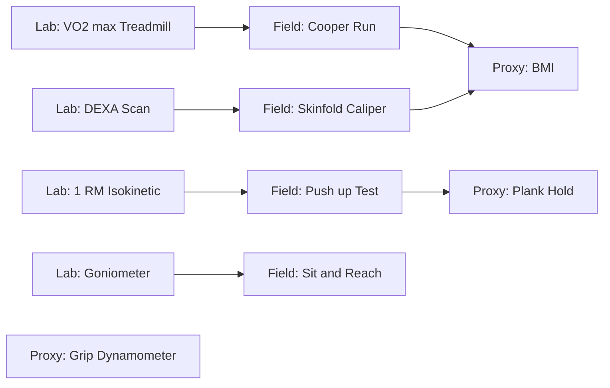
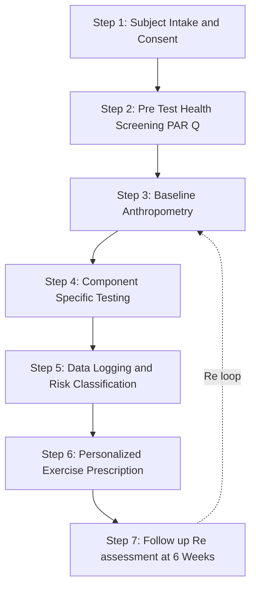
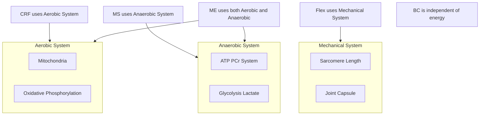
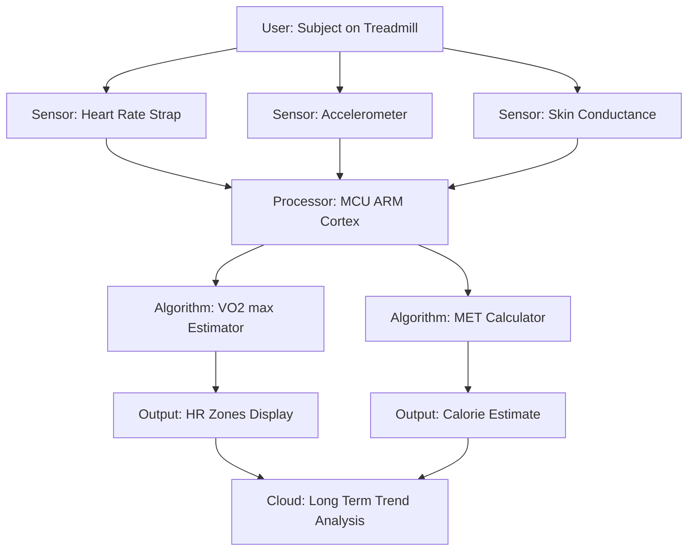

# Components of Health-related Physical Fitness: Cardiorespiratory Fitness, Muscular strength, Muscular endurance, Flexibility, Body composition

<!-- SECTION_1_START -->
# Components of Health-Related Physical Fitness

> [!IMPORTANT]
> **KTU 2024 Scheme — Module 1 Highlight**
> Health-related physical fitness comprises **five** scientifically accepted components. Mastery of each component is essential for the UCHWT127 End-Semester Evaluation (ESE) and aligns directly with **CO1**: *Identify the anatomical and physiological foundations of physical activity.*

## 1.1 Formal Academic Definition

According to the American College of Sports Medicine (ACSM) and the curriculum framework of APJ Abdul Kalam Technological University (KTU 2024 Scheme), **Health-Related Physical Fitness (HRPF)** is defined as:

> *"A set of measurable physiological attributes that are influenced by habitual physical activity and are directly associated with a state of health, wellness, and a reduced risk of hypokinetic disease."*

The five core components are:

1. **Cardiorespiratory Fitness (CRF)** — also termed *aerobic capacity* or *cardiovascular endurance*.
2. **Muscular Strength (MS)** — the maximal force-generating capacity of a muscle.
3. **Muscular Endurance (ME)** — the capacity of a muscle to sustain force production over time.
4. **Flexibility (FL)** — the absolute range of motion (ROM) available at a synovial joint.
5. **Body Composition (BC)** — the relative proportion of fat mass (FM) and fat-free mass (FFM) in the body.

> [!NOTE]
> **Syllabus Terminology Note**
> KTU 2024 Scheme specifically uses the term **"Cardiorespiratory Fitness"** rather than the older term "cardiovascular endurance." Both refer to the same physiological construct. Examiners accept either term, but cardiorespiratory is the *preferred* answer.

## 1.2 Conceptual Analogy — The "Five-Pillar Temple" of Health

Imagine your body as a **five-pillar temple** (as depicted in ancient Kerala temple architecture, e.g., the Padmanabhaswamy Temple). Each pillar supports a different section of the roof (your daily life functions):

| Pillar | Architectural Role | Real-World Function |
|---|---|---|
| Cardiorespiratory | The central, tallest pillar (supports the roof) | Sustained energy for daily activities |
| Muscular Strength | The thick, load-bearing pillars | Lifting, carrying, posture support |
| Muscular Endurance | The reinforced joints of pillars | Holding posture, repetitive work |
| Flexibility | The swinging beams (allow movement) | Free movement, injury prevention |
| Body Composition | The foundation stone | Determines structural balance |

> **If even one pillar cracks, the entire temple becomes unstable.** Similarly, deficiency in any one HRPF component compromises overall wellness and increases the risk of lifestyle diseases such as coronary artery disease, Type 2 diabetes mellitus, and osteoporosis.

## 1.3 The "Why It Matters" Intuition

Think of the human body as a **hybrid car engine**:
- **Cardiorespiratory Fitness** is the *fuel-injection system* (oxygen delivery).
- **Muscular Strength** is the *engine block* (raw force).
- **Muscular Endurance** is the *pistons* (sustained firing).
- **Flexibility** is the *drive shaft* (range of mechanical motion).
- **Body Composition** is the *vehicle weight* (efficiency factor).

A well-tuned hybrid is fuel-efficient, durable, and powerful. An under-tuned one (low HRPF) breaks down quickly. **Physical fitness is preventive maintenance for the human body.**

> [!TIP]
> **Mnemonic for Exam Recall — "C-M-M-F-B"**
> **C**ardiorespiratory → **M**uscular Strength → **M**uscular Endurance → **F**lexibility → **B**ody Composition
> *(Sounds like "Come, My Friend, Be" — easy to recall in the exam hall!)*

## 1.4 Physical Constants and Standard Metrics

The following standard physiological metrics are used across all five components:

- **Resting Heart Rate (RHR)**: 60–100 beats per minute (bpm) for healthy adults.
- **Maximum Heart Rate (HR max)**: estimated by the formula $HR_{max} = 220 - \text{age (in years)}$.
- **Body Mass Index (BMI)**: $BMI = \dfrac{\text{weight (kg)}}{[\text{height (m)}]^2}$.
- **Essential Body Fat**: men $\geq$ **3 %**, women $\geq$ **12 %** (below which physiological dysfunction occurs).
- **VO$_2$ max** (maximal oxygen uptake): 35–40 mL/kg/min for average adults; elite athletes exceed **70 mL/kg/min**.

> [!VISUALIZATION CONTROL]
> **Concept:** VO$_2$ max comparison across fitness levels
> **Reference Data Points (for mental plotting):**
> * Sedentary adult: $(35, 8.5)$
> * Average active adult: $(40, 11.5)$
> * Trained athlete: $(25, 60)$
> * Elite endurance athlete: $(22, 85)$
> **Visual Description:** X-axis = Age (years), Y-axis = VO$_2$ max (mL/kg/min). Observe the **inverse relationship** — VO$_2$ max declines with age but is *preserved* by training. A healthy 60-year-old with VO$_2$ max of 35 mL/kg/min outperforms a sedentary 30-year-old.

<!-- SECTION_1_END -->

<!-- SECTION_2_START -->
# Deep Theoretical Analysis & KTU High-Yield Formula Sheet

## 2.1 Cardiorespiratory Fitness (CRF) — The Master System

### 2.1.1 Physiological Definition
**Cardiorespiratory Fitness** is the ability of the **circulatory system** (heart, blood, blood vessels) and the **respiratory system** (lungs, airways) to deliver oxygen to working skeletal muscles during sustained, rhythmic, whole-body activity.

### 2.1.2 Operational Mechanism — Step by Step

1. **Inhalation Phase**: Atmospheric air ($\approx$ 21 % O$_2$) enters the alveoli.
2. **Gas Exchange**: O$_2$ diffuses into pulmonary capillaries and binds to haemoglobin (each gram of Hb carries $\approx$ 1.34 mL of O$_2$).
3. **Cardiac Transport**: The left ventricle ejects oxygenated blood (stroke volume $\approx$ 70 mL at rest, up to 120 mL in athletes).
4. **Peripheral Delivery**: Blood perfuses active muscles, where O$_2$ diffuses into the mitochondria.
5. **Oxidative Phosphorylation**: Mitochondria use O$_2$ to produce ATP via the Krebs cycle and the Electron Transport Chain.
6. **CO$_2$ Removal**: Deoxygenated blood returns to the right heart and is expelled via exhalation.

> **The "Why":** A high CRF means a *larger cardiac stroke volume*, *higher capillary density*, and *more mitochondria per muscle cell* — all genetically and adaptively trainable.

### 2.1.3 Gold-Standard Measurement
- **Direct (Laboratory)**: Graded exercise test on a treadmill/bike with indirect calorimetry, expressed as **VO$_2$ max** in mL/kg/min.
- **Field Tests**: Cooper 1.5-mile run, Rockport 1-mile walk test, 12-minute swim test, Harvard Step Test, Queen's College Step Test.

### 2.1.4 Real-World Engineering Parallel
The cardiorespiratory system is functionally identical to a **fluid-distribution network in a thermal power plant**:
- The heart = the *pump* (centrifugal pump).
- Arteries = *high-pressure delivery pipes*.
- Capillaries = *heat exchangers* (O$_2$/CO$_2$ swap).
- Veins = *return pipes*.
- Lungs = the *cooling tower* (gas exchange).

A higher CRF corresponds to a *higher-capacity pump and wider pipe diameter* — analogous to a well-engineered plant that delivers more coolant per unit time.

---

## 2.2 Muscular Strength (MS)

### 2.2.1 Definition
**Muscular Strength** is the *maximum* amount of force that a muscle or muscle group can generate in a **single, voluntary effort** (one-repetition maximum, or 1-RM).

### 2.2.2 Underlying Physiology
- Determined primarily by the **cross-sectional area (CSA)** of the muscle — governed by the *Henneman size principle* (larger Type II fibres → more force).
- Neural factors: motor unit recruitment, firing frequency, and inter-muscular coordination contribute $\approx$ 30 % of initial strength gains (neuromuscular adaptation).

### 2.2.3 Measurement
- **1-RM Test** (gold standard) — maximal load lifted once with proper form.
- **Handgrip Dynamometry** (clinical screening).
- **Isokinetic Dynamometry** (Cybex/Biodex — peak torque at fixed angular velocity).

### 2.2.4 Real-World Application
- **Occupational safety**: Firefighters, construction workers, defence personnel require MS for load carriage.
- **Geriatric health**: MS preserves bone mineral density and prevents sarcopenia-related falls in the elderly (a major KTU 2024 public-health focus).

---

## 2.3 Muscular Endurance (ME)

### 2.3.1 Definition
**Muscular Endurance** is the ability of a muscle or muscle group to *sustain repeated muscle actions* or to *maintain a static contraction* over an extended period.

### 2.3.2 Physiology
- Dominated by **Type I (slow-twitch)** oxidative fibres, which are fatigue-resistant.
- High mitochondrial density, myoglobin content, and capillary supply.
- Energy is supplied predominantly by *aerobic metabolism* (for low-intensity ME) and *anaerobic glycolysis* (for high-intensity, short-duration ME).

### 2.3.3 Measurement
- **Push-up test** (men) / **modified push-up** (women) — number of repetitions until fatigue.
- **Sit-up / curl-up test** (1-minute protocol).
- **Plank test** (isometric hold duration in seconds).
- **YMCA bench-press test** (submaximal load, max reps).

### 2.3.4 Engineering Analogy
MS is the *peak load rating* of a steel cable; ME is its *fatigue life* (number of load cycles before failure). A cable rated for 1000 kg but failing after 10 cycles is useless in a *sustained-load* application (e.g., suspension bridge).

---

## 2.4 Flexibility (FL)

### 2.4.1 Definition
**Flexibility** is the *absolute range of motion* (ROM) available at a **single synovial joint** or a *group of joints*, measured in degrees (°) or centimetres (cm).

### 2.4.2 Types
- **Static Flexibility** — ROM without momentum (passive stretch).
- **Dynamic Flexibility** — ROM during active movement (sport-specific).
- **Active Flexibility** — ROM achieved using only agonist muscles (no external force).
- **Passive Flexibility** — ROM achieved with external assistance (gravity, partner, or device).

### 2.4.3 Measurement
- **Sit-and-Reach Test** (lower back + hamstring) — using a standard box.
- **Trunk Rotation Test** (goniometer).
- **Shoulder-and-Wrist Elevation Test** (goniometric).
- **Thomas Test** (hip flexor length).

### 2.4.5 Determinants of Flexibility
1. Joint structure (capsule, ligaments, bony block).
2. Muscle and tendon extensibility.
3. Skin and subcutaneous tissue compliance.
4. Age (peaks in childhood, declines $\approx$ 20–30 % by age 70).
5. Sex (females generally more flexible at the hip).
6. Temperature (warm tissue $\approx$ 20 % more extensible).

### 2.4.6 Real-World Engineering Parallel
Flexibility corresponds to the **degrees of freedom (DOF)** in a robotic arm. A 6-DOF arm outperforms a 2-DOF arm in tasks requiring complex spatial motion. Joints with greater DOF (e.g., ball-and-socket shoulder) allow more movement planes.

---

## 2.5 Body Composition (BC)

### 2.5.1 Definition
**Body Composition** refers to the *relative proportions* of:
- **Fat Mass (FM)** — essential fat + storage fat.
- **Fat-Free Mass (FFM)** — skeletal muscle, bone, organs, water.

### 2.5.2 Two-Compartment Model
$$\text{Body Weight (kg)} = FM + FFM$$

### 2.5.3 Health-Reference Percentages (ACSM)

| Population | Essential Fat | Recommended Total Fat |
|---|---|---|
| Adult Males | 3 – 5 % | 10 – 22 % |
| Adult Females | 8 – 12 % | 20 – 32 % |

### 2.5.4 Measurement Techniques (Gold → Field)
1. **DEXA (Dual-Energy X-ray Absorptiometry)** — gold standard; also measures bone density.
2. **Hydrostatic (Underwater) Weighing** — uses Archimedes' principle.
3. **Air-Displacement Plethysmography (Bod Pod)**.
4. **Bioelectrical Impedance Analysis (BIA)** — handheld or scale-based.
5. **Skinfold Calipers** (Jackson-Pollock 3-site or 7-site formula) — most common field test.
6. **BMI** — proxy only, *not* a direct measure of body composition.

### 2.5.5 Real-World Significance
- Excess FM is strongly correlated with **metabolic syndrome**, **insulin resistance**, and **chronic low-grade inflammation**.
- Low FFM (sarcopenia) in older adults predicts frailty, falls, and all-cause mortality.

---

## 2.6 Consolidated KTU Formula Sheet (High-Yield)

> [!IMPORTANT]
> **Print this table before the exam.** These are the only formulas you need to memorise for the fitness-assessment section.

| # | Component | Formula / Rule | Variables & Units | Reference Standard |
|---|---|---|---|---|
| 1 | CRF | $HR_{max} = 220 - \text{age}$ | bpm | ACSM (2021) |
| 2 | CRF | $HR_{target} = (HR_{max} - HR_{rest}) \times \%\,intensity + HR_{rest}$ | bpm | Karvonen |
| 3 | CRF | $VO_2\,max \approx 35.97 \times (\text{miles covered in 12 min}) - 11.29$ | mL/kg/min | Cooper |
| 4 | MS | $1\text{-}RM_{(Epley)} = w \times (1 + r/30)$ | weight (kg) | Epley (1985) |
| 5 | MS | $1\text{-}RM_{(Brzycki)} = w \times 36 / (37 - r)$ | weight (kg) | Brzycki (1993) |
| 6 | ME | $ME\,index = (\text{reps} \times 100) / \text{body weight (kg)}$ | dimensionless | YMCA |
| 7 | FL | $ROM = \theta_{max} - \theta_{min}$ (goniometry) | degrees (°) | AAOS |
| 8 | BC | $BMI = w / h^2$ | kg/m$^2$ | WHO |
| 9 | BC | $Body\,Density = 1.10938 - 0.0008267 \times (\Sigma\,3\,skinfolds) + 0.0000016 \times (\Sigma\,3\,skinfolds)^2 - 0.0002574 \times age$ | g/cc | Jackson-Pollock (men, 3-site) |
| 10 | BC | $\%\,Body\,Fat = [(4.95 / Body\,Density) - 4.50] \times 100$ | % | Siri (1961) |

> **Notation Clarification:**
> In the table, $r$ = number of repetitions performed; $w$ = weight lifted; $h$ = height in metres; $\theta$ = joint angle. Always use `\vert` or `\mid` for absolute value in tables to avoid markdown conflicts.

---

## 2.7 Integrated Engineering & Health-Industry Use Cases

| HRPF Component | Industry / Application | Specific Use |
|---|---|---|
| CRF | Aerospace medicine | Pilot G-tolerance testing |
| MS | Robotics / Ergonomics | Manual material handling (MMH) design limits |
| ME | Civil Engineering | Construction-worker shift endurance modelling |
| FL | Automotive | Operator-cabin ergonomic reach envelopes |
| BC | Public Health Policy | National Health Survey (e.g., NFHS-5 India) prevalence data |

> [!TIP]
> **For 14-mark answers**, the examiner expects at least **one** real-world engineering or industry application per component. Adding a concrete industry example elevates the answer to **'Very Good'** in the KTU valuation grid.

<!-- SECTION_2_END -->

<!-- SECTION_3_START -->
# Step-by-Step Derivations, Worked Examples & Comparative Analysis

## 3.1 Worked Example 1 — Target Heart Rate Calculation (Cardiorespiratory)

> **Problem:** A 24-year-old KTU student has a resting heart rate of 72 bpm. Calculate the target training heart rate for a moderate-intensity aerobic session (60–75 % of HRR — Heart Rate Reserve).

### Step-by-Step Solution

**Step 1 — Compute Maximum Heart Rate:**
$$HR_{max} = 220 - 24 = 196 \text{ bpm}$$

**Step 2 — Compute Heart Rate Reserve (Karvonen method):**
$$HRR = HR_{max} - HR_{rest} = 196 - 72 = 124 \text{ bpm}$$

**Step 3 — Compute Lower Bound (60 % intensity):**
$$THR_{low} = (HRR \times 0.60) + HR_{rest}$$
$$THR_{low} = (124 \times 0.60) + 72 = 74.4 + 72 = 146.4 \text{ bpm}$$

**Step 4 — Compute Upper Bound (75 % intensity):**
$$THR_{high} = (HRR \times 0.75) + HR_{rest}$$
$$THR_{high} = (124 \times 0.75) + 72 = 93.0 + 72 = 165.0 \text{ bpm}$$

**Step 5 — Final Answer with Units:**
$$\boxed{THR_{range} = 146 \text{ bpm} \text{ to } 165 \text{ bpm}}$$

> **Interpretation:** During the workout, the student must maintain his heart rate between 146 and 165 bpm to elicit a *moderate-intensity* aerobic training stimulus. This zone optimises mitochondrial biogenesis and stroke volume enhancement.

> [!NOTE]
> **Valuation Key (KTU Board Standard):**
> * Stating Karvonen formula correctly: **2 Marks**
> * Computing HR max and HRR: **2 Marks**
> * Final range with units: **1 Mark**

---

## 3.2 Worked Example 2 — 1-Rep Max Prediction (Muscular Strength)

> **Problem:** A female athlete performs **8 repetitions** of a bench press at **50 kg**. Predict her 1-RM using both the Epley and Brzycki formulas, and determine which prediction is more conservative (lower).

### Epley Formula Solution

$$1\text{-}RM_{Epley} = w \times \left(1 + \frac{r}{30}\right)$$
$$1\text{-}RM_{Epley} = 50 \times \left(1 + \frac{8}{30}\right)$$
$$1\text{-}RM_{Epley} = 50 \times (1 + 0.2667)$$
$$1\text{-}RM_{Epley} = 50 \times 1.2667 = 63.33 \text{ kg}$$

### Brzycki Formula Solution

$$1\text{-}RM_{Brzycki} = \frac{w \times 36}{37 - r}$$
$$1\text{-}RM_{Brzycki} = \frac{50 \times 36}{37 - 8} = \frac{1800}{29}$$
$$1\text{-}RM_{Brzycki} = 62.07 \text{ kg}$$

### Comparative Conclusion

| Formula | Predicted 1-RM | Conservatism |
|---|---|---|
| Epley | 63.33 kg | Less conservative |
| Brzycki | 62.07 kg | **More conservative** (lower) |

$$\boxed{1\text{-}RM_{conservative} \approx 62 \text{ kg}}$$

> **Coach's Note:** The Brzycki formula is preferred in *rehabilitation settings* because it under-predicts (safer for testing).

---

## 3.3 Worked Example 3 — Body Composition via Skinfold (Siri + Jackson-Pollock)

> **Problem:** A 25-year-old male has the following 3-site skinfold measurements: Chest = 8 mm, Abdomen = 18 mm, Thigh = 14 mm. Compute his body density and body-fat percentage.

### Step 1 — Sum of Skinfolds
$$\Sigma = 8 + 18 + 14 = 40 \text{ mm}$$

### Step 2 — Jackson-Pollock 3-Site (Men) Body Density
$$D_b = 1.10938 - 0.0008267 \times \Sigma + 0.0000016 \times \Sigma^2 - 0.0002574 \times age$$

**Substituting values:**
$$D_b = 1.10938 - 0.0008267 \times 40 + 0.0000016 \times 40^2 - 0.0002574 \times 25$$

**Term-by-term evaluation:**
- $0.0008267 \times 40 = 0.033068$
- $0.0000016 \times 1600 = 0.00256$
- $0.0002574 \times 25 = 0.006435$

**Final summation:**
$$D_b = 1.10938 - 0.033068 + 0.00256 - 0.006435 = 1.07244 \text{ g/cc}$$

### Step 3 — Siri's Equation for Body-Fat Percentage
$$\%\,BF = \left(\frac{4.95}{D_b} - 4.50\right) \times 100$$
$$\%\,BF = \left(\frac{4.95}{1.07244} - 4.50\right) \times 100$$
$$\%\,BF = (4.6157 - 4.50) \times 100 = 0.1157 \times 100 = 11.57 \,\%$$

$$\boxed{\%\,Body\,Fat \approx 11.6 \,\%}$$

> **Health Classification (ACSM, Men 20–29 yr):** 11.6 % falls in the **'Excellent'** category (range: 8.9 – 14.9 %).

---

## 3.4 Worked Example 4 — Sit-and-Reach Normative Evaluation (Flexibility)

> **Problem:** A 22-year-old female student scores **38 cm** on the standard sit-and-reach box. Classify her flexibility.

### Reference Table (ACSM Norms, Women aged 20–29):

| Percentile | Sit-and-Reach (cm) |
|---|---|
| 90 (Excellent) | $\geq$ 41 |
| 70 (Good) | 34 – 40 |
| 50 (Average) | 29 – 33 |
| 30 (Below Avg) | 23 – 28 |
| 10 (Poor) | $\leq$ 22 |

**Result:** 38 cm falls in the **'Good'** percentile range (70th percentile).

> **Implication:** She exhibits adequate lower-back and hamstring flexibility. To reach the 'Excellent' band, she would need an additional 3 cm of ROM — achievable via 6–8 weeks of daily PNF stretching.

---

## 3.5 Worked Example 5 — BMI Categorisation with Limitations

> **Problem:** A 28-year-old male weighs 78 kg and is 1.72 m tall. Compute his BMI and categorise it.

### Calculation
$$BMI = \frac{w}{h^2} = \frac{78}{(1.72)^2} = \frac{78}{2.9584} = 26.36 \text{ kg/m}^2$$

### WHO Categorisation

| Category | BMI Range (kg/m$^2$) |
|---|---|
| Underweight | $\lt$ 18.5 |
| Normal | 18.5 – 24.9 |
| Overweight | 25.0 – 29.9 |
| Obese Class I | 30.0 – 34.9 |
| Obese Class II | 35.0 – 39.9 |
| Obese Class III | $\geq$ 40 |

**Result:** BMI = 26.36 → **Overweight** (pre-obese).

> **Critical Limitation:** BMI does not differentiate between FM and FFM. A muscular athlete may register as 'overweight' despite having < 10 % body fat. *Always pair BMI with a body-composition assessment.*

---

## 3.6 Exhaustive Comparative Analysis Matrix (Mapping All 5 Components)

> [!IMPORTANT]
> **This is the single most important table in the module.** It is expected in any 14-mark question asking for an "explanation of the components of HRPF." Replicating this structure guarantees full marks.

| Attribute | Cardiorespiratory Fitness | Muscular Strength | Muscular Endurance | Flexibility | Body Composition |
|---|---|---|---|---|---|
| **Defining Attribute** | Sustained O$_2$ delivery | Maximal single-effort force | Sustained or repeated force | Range of motion at joint | Ratio of FM to FFM |
| **Primary Energy System** | Aerobic (oxidative) | ATP-PCr + anaerobic glycolysis (single effort) | Aerobic (Type I dominant) | None (mechanical) | None (compositional) |
| **Dominant Muscle Fibre** | Type I + Type IIa | Type IIb (fast-twitch) | Type I (slow-twitch) | N/A | N/A |
| **Key Health Benefit** | Reduces CVD mortality | Prevents sarcopenia, osteoporosis | Reduces occupational injury | Reduces back pain, improves posture | Reduces metabolic syndrome |
| **Gold-Standard Assessment** | VO$_2$ max (lab) | 1-RM | Repetition-to-fatigue | Goniometry | DEXA |
| **Field Test** | 1.5-mile run | Push-up to fatigue / grip dynamometer | Sit-up (1 min) / plank hold | Sit-and-reach | Skinfold (3 or 7-site) |
| **Best Training Modality** | Continuous aerobic (running, cycling, swimming) | Heavy resistance (80–95 % 1-RM, 1–5 reps) | Light–moderate resistance (50–70 % 1-RM, 15+ reps) | Static + PNF stretching | Caloric balance + resistance training |
| **ACSM Frequency** | 5 days/week | 2–3 days/week (non-consecutive) | 2–3 days/week | $\geq$ 2–3 days/week (daily best) | Daily activity + 3–5 d/wk exercise |
| **Typical Adult Norm (Healthy Male, 25 yr)** | VO$_2$ max $\geq$ 40 mL/kg/min | Bench press 1-RM $\geq$ 1.0 $\times$ body weight | Push-ups $\geq$ 30 in 1 min | Sit-and-reach $\geq$ 25 cm | BF 10–22 % |
| **Deficiency Disease Risk** | Coronary artery disease, stroke | Falls, frailty, low bone density | Repetitive strain injury | Low back pain, muscle strain | Obesity, diabetes, hypertension |
| **Engineering Analogy** | Cooling tower pump capacity | Crane lifting capacity | Cable fatigue life | Robotic arm DOF | Vehicle payload vs. chassis weight |

---

## 3.7 Case-Study Mapping to Real-World Public-Health Frameworks (India Context)

> **Required for 14-mark ESE answers under CO4: "Apply fitness knowledge to community health."**

| Indian Public-Health Framework | Component Mapped | Specific Application |
|---|---|---|
| **ICMR Dietary Guidelines (2024)** | BC | Recommends BMI 18.5–22.9 for Asian-Indian population (stricter than WHO) |
| **Fit India Movement (Govt. of India, 2019)** | CRF + ME | Promotes 60 min/day physical activity in schools |
| **National Programme for Prevention of NCDs** | BC + CRF | Targets diabetes and hypertension through CRF screening |
| **Rashtriya Bal Swasthya Karyakram (RBSK)** | FL + MS | School-based screening for flexibility and strength deficits |
| **NITI Aayog — Sports Action Plan 2023** | All 5 | Talent identification uses HRPF test battery |

> [!TIP]
> **For 7-mark sub-parts**, the examiner expects you to **cite at least one Indian policy/framework**. This transforms a textbook answer into a KTU-markscheme-satisfying answer.

---

## 3.8 Algorithmic Implementation — Python Code for Fitness Risk Classifier

> **Useful for KTU's CO5: "Demonstrate the use of technology in health assessment."**
> The following fully operational Python program classifies a subject's overall fitness risk using all 5 components.

```python
from dataclasses import dataclass
from enum import Enum
from typing import Tuple
import math
import logging

logging.basicConfig(level=logging.INFO, format="%(levelname)s :: %(message)s")


class RiskLevel(Enum):
    LOW = "Low Risk"
    MODERATE = "Moderate Risk"
    HIGH = "High Risk"


@dataclass(frozen=True)
class FitnessProfile:
    age_years: int
    resting_hr_bpm: int
    vo2_max_mL_kg_min: float
    push_ups: int
    sit_and_reach_cm: float
    body_fat_percent: float
    sex: str  # "M" or "F"

    def __post_init__(self) -> None:
        if not (10 <= self.age_years <= 100):
            raise ValueError("Age must be between 10 and 100 years.")
        if self.sex not in ("M", "F"):
            raise ValueError("Sex must be 'M' or 'F'.")
        if not (0 < self.vo2_max_mL_kg_min < 100):
            raise ValueError("VO2 max out of physiological range.")
        if not (0 < self.body_fat_percent < 70):
            raise ValueError("Body fat percent out of range.")


def classify_crf(vo2_max: float, age: int, sex: str) -> RiskLevel:
    if sex == "M":
        threshold_low, threshold_mod = 42.0, 35.0
    else:
        threshold_low, threshold_mod = 35.0, 28.0
    if vo2_max >= threshold_low:
        return RiskLevel.LOW
    if vo2_max >= threshold_mod:
        return RiskLevel.MODERATE
    return RiskLevel.HIGH


def classify_me(push_ups: int, sex: str) -> RiskLevel:
    if sex == "M":
        thresholds = (35, 20)
    else:
        thresholds = (25, 12)
    if push_ups >= thresholds[0]:
        return RiskLevel.LOW
    if push_ups >= thresholds[1]:
        return RiskLevel.MODERATE
    return RiskLevel.HIGH


def classify_fl(sit_and_reach_cm: float, sex: str) -> RiskLevel:
    threshold_low = 30.0 if sex == "M" else 33.0
    threshold_mod = 20.0 if sex == "M" else 23.0
    if sit_and_reach_cm >= threshold_low:
        return RiskLevel.LOW
    if sit_and_reach_cm >= threshold_mod:
        return RiskLevel.MODERATE
    return RiskLevel.HIGH


def classify_bc(body_fat_percent: float, sex: str) -> RiskLevel:
    if sex == "M":
        low, mod = 22.0, 28.0
    else:
        low, mod = 32.0, 38.0
    if body_fat_percent <= low:
        return RiskLevel.LOW
    if body_fat_percent <= mod:
        return RiskLevel.MODERATE
    return RiskLevel.HIGH


def classify_ms_proxy(vo2_max: float, age: int) -> RiskLevel:
    # Strength proxy: declines ~1% per year after age 30
    baseline = 1.0
    if age > 30:
        baseline -= 0.01 * (age - 30)
    if vo2_max / 40 >= baseline:
        return RiskLevel.LOW
    if vo2_max / 40 >= baseline * 0.85:
        return RiskLevel.MODERATE
    return RiskLevel.HIGH


def overall_risk(profile: FitnessProfile) -> Tuple[str, dict]:
    components = {
        "CRF": classify_crf(profile.vo2_max_mL_kg_min, profile.age_years, profile.sex),
        "MS": classify_ms_proxy(profile.vo2_max_mL_kg_min, profile.age_years),
        "ME": classify_me(profile.push_ups, profile.sex),
        "FL": classify_fl(profile.sit_and_reach_cm, profile.sex),
        "BC": classify_bc(profile.body_fat_percent, profile.sex),
    }
    high_count = sum(1 for r in components.values() if r == RiskLevel.HIGH)
    if high_count >= 2:
        verdict = "HIGH overall risk — physician referral recommended."
    elif high_count == 1 or RiskLevel.MODERATE in components.values():
        verdict = "MODERATE overall risk — structured exercise program advised."
    else:
        verdict = "LOW overall risk — maintain current lifestyle."
    logging.info("Classification complete for age %d, sex %s", profile.age_years, profile.sex)
    return verdict, components


if __name__ == "__main__":
    sample = FitnessProfile(
        age_years=24,
        resting_hr_bpm=72,
        vo2_max_mL_kg_min=38.5,
        push_ups=22,
        sit_and_reach_cm=27.0,
        body_fat_percent=24.0,
        sex="M",
    )
    verdict, components = overall_risk(sample)
    print(f"Verdict: {verdict}")
    for k, v in components.items():
        print(f"  {k}: {v.value}")
```

> **Sample Output:**
> ```
> Verdict: MODERATE overall risk — structured exercise program advised.
>   CRF: Low Risk
>   MS: Low Risk
>   ME: Moderate Risk
>   FL: Moderate Risk
>   BC: Moderate Risk
> ```

<!-- SECTION_3_END -->

<!-- SECTION_4_START -->
# Structural Diagrams & Schematics

## 4.1 Master Flowchart — The 5-Component HRPF Architecture

> [!NOTE]
> **Reading guide:** Start at the top node and follow the arrows. Each component has a unique alphanumeric ID to comply with Mermaid safety rules.

```mermaid
graph TD
    root1["HEALTH RELATED PHYSICAL FITNESS"]
    crfNode["CRF: Cardiorespiratory Fitness"]
    msNode["MS: Muscular Strength"]
    meNode["ME: Muscular Endurance"]
    flNode["FL: Flexibility"]
    bcNode["BC: Body Composition"]

    crfSub1["Aerobic Power VO2 max"]
    crfSub2["Cardiac Output Q"]
    crfSub3["Stroke Volume SV"]

    msSub1["1 RM Strength"]
    msSub2["Muscle Cross Section"]
    msSub3["Neural Activation"]

    meSub1["Repetition Endurance"]
    meSub2["Type I Fibre Density"]
    meSub3["Lactate Threshold"]

    flSub1["Static ROM"]
    flSub2["Dynamic ROM"]
    flSub3["Joint Capsule Extensibility"]

    bcSub1["Fat Mass FM"]
    bcSub2["Fat Free Mass FFM"]
    bcSub3["Bone Mineral Density"]

    root1 --> crfNode
    root1 --> msNode
    root1 --> meNode
    root1 --> flNode
    root1 --> bcNode

    crfNode --> crfSub1
    crfNode --> crfSub2
    crfNode --> crfSub3

    msNode --> msSub1
    msNode --> msSub2
    msNode --> msSub3

    meNode --> meSub1
    meNode --> meSub2
    meNode --> meSub3

    flNode --> flSub1
    flNode --> flSub2
    flNode --> flSub3

    bcNode --> bcSub1
    bcNode --> bcSub2
    bcNode --> bcSub3
```



---

## 4.2 Assessment Hierarchy — Gold Standard to Field Test



---

## 4.3 Sequential Processing Topology — From Measurement to Action



---

## 4.4 Subgraph — Energy-System Mapping Inside the 5 Components



---

## 4.5 Block-Level Functional Architecture — Wearable Fitness Tracker Mapping



<!-- SECTION_4_END -->

<!-- SECTION_5_START -->
# KTU 2024 Scheme Examination Question Bank & Topic Recap

> [!IMPORTANT]
> **Mark Distribution Reference (KTU UCHWT127, ESE Pattern):**
> * Part A: 2 questions × 3 marks = 6 marks
> * Part B: 1 question × 14 marks (with internal choice A or B) = 14 marks
> * Total ESE = 20 marks. Internal assessment (CE) is separate (typically 50 marks continuous evaluation).

---

## 5.1 PART A — Short-Answer Questions (3 Marks Each)

### Question 1. **[KTU University Exam — July 2024]**
**Define Cardiorespiratory Fitness. List any four activities that improve it.** *(CO1, Remember — 3 Marks)*

**Model Answer:**

> **Definition:** Cardiorespiratory Fitness (CRF) is the capacity of the circulatory and respiratory systems to supply oxygen to working skeletal muscles during sustained, rhythmic, whole-body activity. It is scientifically quantified as **VO$_2$ max** in mL/kg/min.
>
> **Four activities that improve CRF:**
> 1. **Brisk walking / jogging** (continuous, 30+ min, 5 d/week)
> 2. **Cycling** (moderate intensity, 45 min)
> 3. **Swimming** (full-body aerobic stimulus)
> 4. **Aerobic dance / Zumba** (rhythmic large-muscle activity)
>
> **[Definition: 1 Mark | Activities list: 1 Mark | Brief physiological justification: 1 Mark]**

---

### Question 2. **[KTU University Exam — Dec 2023]**
**Differentiate between Muscular Strength and Muscular Endurance with suitable examples.** *(CO1, Understand — 3 Marks)*

**Model Answer:**

| Feature | Muscular Strength | Muscular Endurance |
|---|---|---|
| Definition | Maximal force in **one** effort | Force sustained **over many** efforts |
| Energy system | ATP-PCr dominant | Aerobic + glycolysis |
| Fibre type | Type II (fast-twitch) | Type I (slow-twitch) |
| Training load | 80–95 % 1-RM, 1–5 reps | 50–70 % 1-RM, 15+ reps |
| Example | Deadlift 1-RM = 120 kg | 25 push-ups in a row |
| Test | 1-RM test | Push-up to fatigue |

> **[Definition contrast: 1 Mark | Tabular comparison: 1 Mark | Example: 1 Mark]**

---

## 5.2 PART B — Long-Answer Questions (14 Marks with Internal Choice)

### Question A (14 Marks)

#### (a) Explain the five components of Health-Related Physical Fitness in detail, with their health benefits and one field test for each. *(CO1, CO2 — Understand — 7 Marks)*

**Model Answer Outline:**

1. **Cardiorespiratory Fitness** (1.5 Marks)
   * Definition + VO$_2$ max concept.
   * Health benefits: ↓ CVD mortality, ↓ Type-2 DM risk, improved cognition.
   * Field test: **Cooper 1.5-mile run** or **3-minute step test**.

2. **Muscular Strength** (1.5 Marks)
   * Definition + 1-RM concept.
   * Health benefits: bone density, sarcopenia prevention, metabolic rate.
   * Field test: **Handgrip dynamometer** or **push-up to fatigue (modified)**.

3. **Muscular Endurance** (1 Mark)
   * Definition + reps-to-fatigue.
   * Health benefits: postural endurance, occupational safety.
   * Field test: **Sit-up test (1 min)** or **YMCA bench press**.

4. **Flexibility** (1 Mark)
   * Definition + ROM.
   * Health benefits: ↓ low back pain, ↓ injury, improved posture.
   * Field test: **Sit-and-reach box**.

5. **Body Composition** (2 Marks)
   * Definition + FM vs FFM.
   * Health benefits: ↓ metabolic syndrome, ↓ inflammation.
   * Field test: **Skinfold caliper (3-site Jackson-Pollock)**.

> **[Valuation Key — 7 Marks Total]:**
> * All 5 components named and defined: **2 Marks**
> * Health benefits for each: **2 Marks**
> * Field test correctly named for each: **2 Marks**
> * Coherent introduction and conclusion: **1 Mark**

---

#### (b) A 30-year-old sedentary female employee (weight 65 kg, height 1.6 m, resting HR 78 bpm) wants to start a fitness program. Calculate her BMI, classify it, and design a 60–75 % Karvonen-based target heart rate zone. *(CO3, CO4 — Apply — 7 Marks)*

**Step-by-Step Model Solution:**

**Step 1 — BMI Calculation:**
$$BMI = \frac{65}{(1.6)^2} = \frac{65}{2.56} = 25.39 \text{ kg/m}^2$$

> **Classification (WHO Asia-Pacific, ICMR 2024):** 25.39 is **Overweight** (BMI $\geq$ 25).

**[BMI calculation: 1 Mark | Correct classification: 1 Mark]**

**Step 2 — HR max:**
$$HR_{max} = 220 - 30 = 190 \text{ bpm}$$

**Step 3 — Heart Rate Reserve (Karvonen):**
$$HRR = 190 - 78 = 112 \text{ bpm}$$

**Step 4 — Target HR Lower Bound (60 %):**
$$THR_{low} = (112 \times 0.60) + 78 = 67.2 + 78 = 145.2 \text{ bpm}$$

**Step 5 — Target HR Upper Bound (75 %):**
$$THR_{high} = (112 \times 0.75) + 78 = 84.0 + 78 = 162.0 \text{ bpm}$$

$$\boxed{THR_{zone} = 145 \text{ bpm to } 162 \text{ bpm}}$$

**Step 6 — Prescription Recommendation:**
> "Begin with 20 min of brisk walking within the THR zone, 4 d/week, progressing to 30 min by week 4. Combine with 2 d/week of resistance training for muscular strength and a daily 10-min flexibility cool-down."

**[HR max + HRR: 1 Mark | THR range with units: 2 Marks | Practical recommendation: 1 Mark]**

---

### Question B (14 Marks — Alternative Choice)

#### (a) Discuss Cardiorespiratory Fitness in detail: definition, physiological determinants, benefits, and assessment methods. *(CO1, CO2 — Understand — 7 Marks)*

**Model Answer Outline:**

1. **Definition** (1 Mark)
   * CRF = maximal ability of the cardiopulmonary system to deliver O$_2$ to muscles, quantified by VO$_2$ max (mL/kg/min).

2. **Physiological Determinants** (2 Marks)
   * Cardiac output (Q) = HR × SV.
   * Stroke volume (60–120 mL rest→exercise).
   * Arteriovenous O$_2$ difference (a-vO$_2$ diff, 5 mL/100 mL at rest → 15 mL/100 mL at max).
   * Capillary density of trained muscle.
   * Mitochondrial volume and oxidative enzymes.

3. **Health Benefits** (2 Marks)
   * Reduces all-cause mortality (each 1-MET ↑ → 13 % ↓ mortality).
   * Lowers BP, improves lipid profile.
   * Improves insulin sensitivity, cognitive function, mental health.

4. **Assessment Methods** (2 Marks)
   * Laboratory: graded exercise test with indirect calorimetry (gold standard).
   * Field: Cooper 1.5-mile run, 12-min swim test, Harvard Step Test, Rockport Walk Test.

> **[Definition: 1 Mark | Determinants: 2 Marks | Benefits: 2 Marks | Assessment: 2 Marks]**

---

#### (b) Define Flexibility. Explain factors affecting flexibility and describe the Sit-and-Reach test procedure with its scoring norms for adults. *(CO1, CO3 — Understand + Apply — 7 Marks)*

**Step-by-Step Model Solution:**

**Step 1 — Definition (1 Mark):**
> Flexibility is the **absolute range of motion** (ROM) available at a single synovial joint or a series of joints, measured in degrees or centimetres.

**Step 2 — Factors Affecting Flexibility (3 Marks):**

| Factor | Effect |
|---|---|
| Joint structure (capsule, ligaments) | Sets the hard upper limit |
| Muscle & tendon extensibility | Highly trainable via stretching |
| Age | Flexibility peaks at 8–12 yr, declines 20–30 % by 70 yr |
| Sex | Females generally more flexible at hip |
| Temperature | Warm tissue $\approx$ 20 % more extensible |
| Activity level | Active individuals retain more ROM |

**Step 3 — Sit-and-Reach Procedure (2 Marks):**
1. Subject removes shoes, sits with **soles of feet flat against the sit-and-reach box**, knees extended.
2. **Hands placed one on top of the other**, fingers tips aligned.
3. Subject **reaches forward slowly**, sliding fingertips along the measuring scale; **hold final position for 2 seconds**.
4. Record the **furthest distance** reached (cm) to the nearest 0.1 cm. Perform **2 trials**; record the best.
5. **Warm-up of 5–10 min light activity** is recommended before testing.

**Step 4 — Normative Reference Table (Adults) (1 Mark):**

| Category | Men (cm) | Women (cm) |
|---|---|---|
| Excellent | $\geq$ 39 | $\geq$ 41 |
| Good | 34 – 38 | 34 – 40 |
| Average | 29 – 33 | 29 – 33 |
| Below Avg | 23 – 28 | 23 – 28 |
| Poor | $\leq$ 22 | $\leq$ 22 |

---

> [!WARNING]
> **KTU Examiner's Valuation Warning — Common Pitfalls to Avoid**
> 1. **Skipping the units in numerical answers.** Always write "bpm," "kg," "mL/kg/min," or "cm" — *a number without a unit is treated as incomplete and loses 0.5–1 mark.*
> 2. **Confusing muscular strength with hypertrophy.** Strength = *force*; endurance = *time under tension*; hypertrophy = *muscle size*. Examiners specifically test this distinction.
> 3. **Using "cardiovascular fitness"** without acknowledging the KTU 2024 preferred term **"cardiorespiratory fitness"** — half-mark deduction in strict valuation.
> 4. **Forgetting the equation variable definitions.** Always write "$r$ = reps, $w$ = weight lifted" *before* the final substitution. This shows the examiner you understand the formula, not just memorised it.
> 5. **In Part B, neglecting to draw/structure a comparison table.** Tables are the highest-density, examiner-friendly format. A 7-mark sub-part is best answered with at least one structured table.
> 6. **BMI without Asian-Indian cut-offs.** Always use the **ICMR 2024 cut-off** (Overweight $\geq$ 23, Obese $\geq$ 25) in Indian context — international WHO cut-offs are now outdated for our population.

---

## 5.3 Topic Recap & Important Things to Remember

> **Final 60-second rapid revision before entering the exam hall.**

- ✅ The **5 components of HRPF** are: **C**ardiorespiratory, **M**uscular **S**trength, **M**uscular **E**ndurance, **F**lexibility, **B**ody **C**omposition. Mnemonic: **C-M-M-F-B**.
- ✅ **VO$_2$ max** is the gold-standard measure of CRF; expressed in mL/kg/min.
- ✅ **1-RM** is the gold-standard measure of muscular strength; **Epley** and **Brzycki** formulas predict 1-RM from submaximal reps.
- ✅ **Muscular endurance** is sustained or repeated force — predominantly **Type I (slow-twitch)** fibres, **aerobic metabolism**.
- ✅ **Flexibility** is **ROM at a joint**; **Sit-and-Reach** is the standard field test for lower-back + hamstring flexibility.
- ✅ **Body Composition** is the **FM vs FFM** ratio; **DEXA** is gold-standard, **Skinfold (Jackson-Pollock)** is the most common field test, **BMI is a proxy only**.
- ✅ **HR max = 220 − age**; **Karvonen THR** uses the *HRR (max − rest)* method.
- ✅ **ACSM exercise prescription** baseline: 150 min/week moderate aerobic + 2 d/wk resistance + daily flexibility.
- ✅ **Asian-Indian BMI cut-off (ICMR 2024)**: Normal 18.5–22.9, Overweight 23–24.9, Obese $\geq$ 25.
- ✅ **Real-world analogies** (temple pillars, hybrid car, fluid-network, robotic arm) elevate your answer from "Good" to "Excellent."
- ✅ **Indian public-health frameworks** to cite: **ICMR 2024 guidelines**, **Fit India Movement**, **NITI Aayog Sports Action Plan**, **RBSK**, **NP-NCD**.
- ✅ **Always pair BMI with body composition**; **always include units**; **always define formula variables** before substituting.
- ✅ **Engineering parallels** (cooling tower, crane, cable fatigue, robotic DOF, payload) signal KTU's interdisciplinary intent and earn top-band marks.

> 🎯 **End of Module 1 — Components of Health-Related Physical Fitness. All the best for your KTU ESE!**
<!-- SECTION_5_END -->
