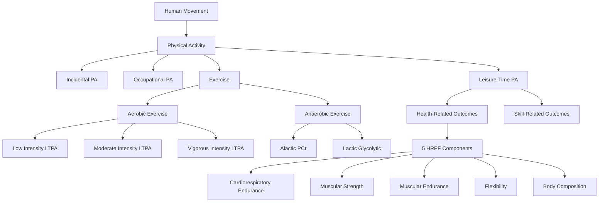
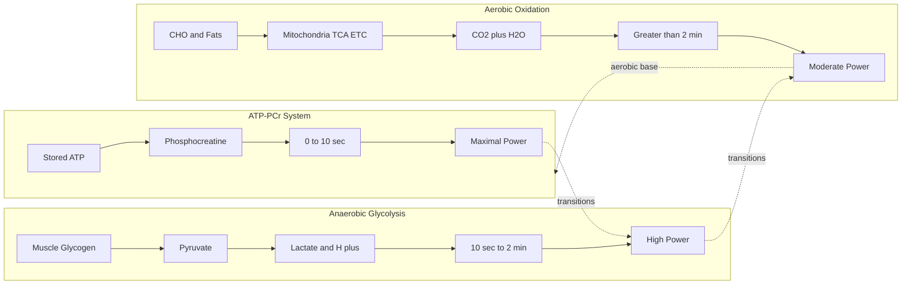
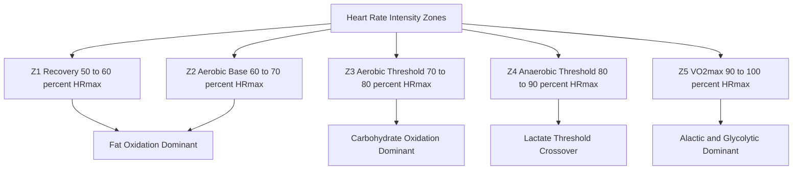
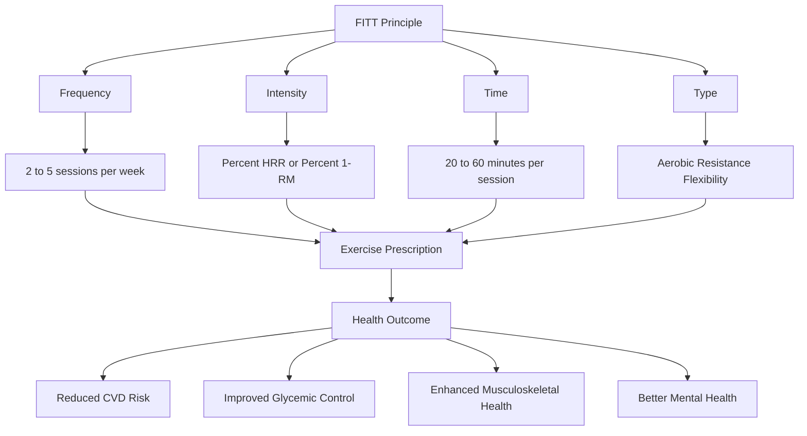
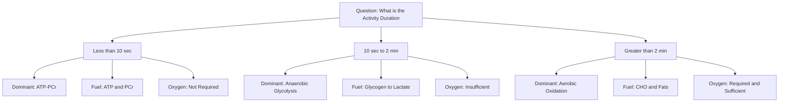

# Defining Physical Activity, Aerobic, Anaerobic, Exercise and Health-Related Physical Fitness

<!-- SECTION_1_START -->
# Anatomy of Physical Activity & Fitness Principles

## 1.1 Core Definitions — The Five Foundational Constructs

> [!IMPORTANT]
> **KTU 2024 Scheme — Module 1 Anchor Concepts**
> The five terms **Physical Activity, Exercise, Physical Fitness, Aerobic, Anaerobic** form the linguistic and conceptual backbone of the entire Health \& Wellness syllabus. Examiners frequently test whether students can **distinguish** these terms — they are *not* synonyms.

### 1.1.1 Physical Activity (PA)

**Formal Definition (WHO / ACSM Standard):**
Physical Activity is defined as *any bodily movement produced by the contraction of skeletal muscles that results in a substantial increase in caloric energy expenditure over resting basal metabolic rate*.

$$ PA = \sum_{i=1}^{n} (MET_i \times duration_i \times mass_{body}) $$

Where $MET_i$ is the Metabolic Equivalent of Task intensity for activity $i$, $duration_i$ is in hours, and $mass_{body}$ is body mass in kilograms.

> [!NOTE]
> **Key Highlight:** The keyword is **"any"** — PA includes occupational, domestic, leisure, and sports movements. Walking to class, gardening, and dancing all qualify as PA.

> [!TIP]
> **Conceptual Analogy:** Think of Physical Activity as the **"universe"** of all body movement. Exercise is a carefully chosen **"solar system"** within that universe — it is structured, while PA is spontaneous.

---

### 1.1.2 Exercise

**Formal Definition:**
Exercise is a *subset of physical activity that is planned, structured, repetitive, and purposive*, undertaken with the explicit goal of improving or maintaining one or more components of physical fitness (Caspersen et al., 1985 — the universally accepted definition cited in KTU modules).

$$ Exercise \subset Physical\ Activity $$

The defining **four pillars** of exercise are:

1. **Planned** — pre-scheduled, intentional
2. **Structured** — defined sets, reps, or intervals
3. **Repetitive** — performed regularly over time
4. **Purposive** — directed toward a fitness goal

---

### 1.1.3 Physical Fitness

**Formal Definition:**
Physical Fitness is a *set of attributes that people have or achieve that relates to the ability to perform physical activity* (Bouchard & Shephard, 1994). It is the **outcome state** of regular exercise, not the activity itself.

$$ Fitness = f(Genetics, Training\ History, Age, Nutrition, Recovery) $$

---

### 1.1.4 Aerobic Activity

**Formal Definition:**
Aerobic (literally *"with oxygen"*) activity is sustained physical activity performed at an intensity where the body's **aerobic (oxidative) energy system** meets the demand, keeping pace with oxygen delivery and utilization in the mitochondria.

**Operational threshold:** Intensity $\leq$ **Lactate Threshold** (typically 60–80% $HR_{max}$ for untrained individuals; 70–85% for trained).

$$ Aerobic\ Zone = [0.60 \cdot HR_{max},\ 0.80 \cdot HR_{max}] $$

---

### 1.1.5 Anaerobic Activity

**Formal Definition:**
Anaerobic (*"without oxygen"*) activity is high-intensity exertion where the oxygen supply **cannot meet** the instantaneous energy demand, forcing the body to rely on **ATP-Phosphocreatine** and **Anaerobic Glycolysis** pathways.

**Operational threshold:** Intensity $>$ **Ventilatory Threshold 2 (VT2)** / onset of blood lactate accumulation (OBLA $\approx$ **4 mmol/L**).

$$ Anaerobic\ Zone = [0.80 \cdot HR_{max},\ 1.00 \cdot HR_{max}] $$

---

### 1.1.6 Health-Related Physical Fitness (HRPF)

**Formal Definition:**
Health-Related Physical Fitness is the dimension of physical fitness specifically linked to **disease prevention, health promotion, and quality-of-life enhancement**, as opposed to skill-related fitness (which targets athletic performance).

The **five classical components** (ACSM, 2017) are:

1. **Cardiorespiratory Endurance (CRE)** — VO₂ max
2. **Muscular Strength (MS)** — 1-RM force
3. **Muscular Endurance (ME)** — sustained submaximal force
4. **Flexibility (FLEX)** — range of motion around a joint
5. **Body Composition (BC)** — ratio of fat mass to fat-free mass

> [!VISUALIZATION CONTROL]
> **Concept:** Health-Related Fitness Components — Concentric Venn Model
> **GeoGebra / Desmos Input Equations:**
> * Circle 1: $(x+2)^2 + y^2 = 16$  (Cardiorespiratory)
> * Circle 2: $(x-2)^2 + y^2 = 16$  (Muscular)
> * Circle 3: $x^2 + (y-2.5)^2 = 16$  (Flexibility + Body Comp)
> **Visual Description:** A central triple-overlap region representing *Integrated Health*, surrounded by the five components blending into one holistic fitness profile.

---

## 1.2 Glossary of Critical Terms

| **Term** | **One-Line Meaning** | **KTU Tag** |
|---|---|---|
| **MET** | Metabolic Equivalent of Task; $1\ MET = 3.5\ mL\ O_2 \cdot kg^{-1} \cdot min^{-1}$ | Unit of intensity |
| **VO₂ max** | Maximal oxygen uptake; gold standard of CRE | $\frac{mL}{kg \cdot min}$ |
| **HR max** | Maximum heart rate; approximated as $220 - age$ (years) | bpm |
| **RPE** | Rating of Perceived Exertion (Borg 6–20 scale) | Subjective intensity |
| **1-RM** | One-Repetition Maximum; the heaviest single lift | Strength metric |
| **Lactate Threshold** | Intensity at which lactate accumulates faster than clearance | $\%\ HR_{max}$ |
| **BMI** | Body Mass Index; $\frac{mass\ (kg)}{height^2\ (m^2)}$ | Adiposity proxy |
| **FITT** | Frequency, Intensity, Time, Type — exercise prescription framework | Program design |

---
<!-- SECTION_1_END -->

<!-- SECTION_2_START -->
# 2. Deep Theoretical Analysis & KTU High-Yield Formula Sheet

## 2.1 The Aerobic–Anaerobic Continuum

Aerobic and anaerobic are **not binary states** but poles of a continuous energy spectrum. Every muscular contraction draws on three energy systems **simultaneously** in shifting proportions.

### 2.1.1 The Three Energy Systems (Tri-Energy Model)

**System 1 — ATP-Phosphocreatine (Alactic Anaerobic)**
- Fuel: Stored **ATP** + **Phosphocreatine (PCr)**
- Duration: **0–10 seconds**
- Intensity: **Maximal** (100% effort)
- Example: **100 m sprint, single heavy deadlift**
- Byproduct: None (no lactate, no $H^+$ accumulation)
- Regeneration: $ADP + PCr \xrightarrow{CK} ATP + Cr$

**System 2 — Anaerobic Glycolysis (Lactic Acid System)**
- Fuel: Muscle glycogen → **Pyruvate → Lactate**
- Duration: **10 seconds to 2 minutes**
- Intensity: **Near-maximal to supramaximal** (85–100% $HR_{max}$)
- Example: **400 m run, 100 m swim, repeated sprints**
- Byproduct: **Lactate** + $H^+$ ions → metabolic acidosis
- Net ATP yield: **2–3 ATP per glucose**

**System 3 — Aerobic Oxidation (Oxidative Phosphorylation)**
- Fuel: Carbohydrates, fats, and (sparingly) proteins
- Duration: **> 2 minutes, up to several hours**
- Intensity: **Moderate** (50–85% $HR_{max}$)
- Example: **5 km run, cycling, brisk walking**
- Byproducts: $CO_2$ + $H_2O$ (clean combustion)
- Net ATP yield: **30–32 ATP per glucose** (carbohydrate); **>100 ATP per palmitate** (fat)

> [!IMPORTANT]
> **High-Yield Exam Note:** Examiners often ask *"Is jogging aerobic or anaerobic?"* The answer is **BOTH simultaneously**, but predominantly aerobic. Always specify the *dominant* system and acknowledge overlap.

---

### 2.1.2 The Heart-Rate Intensity Zones (Polarized Model)

| **Zone** | **% HR max** | **% HRR** | **Dominant System** | **Sensation (RPE)** | **Duration** |
|---|---|---|---|---|---|
| **Z1 — Recovery** | 50–60% | 50–60% | Aerobic (fat oxidation) | 6–10 (very light) | Hours |
| **Z2 — Aerobic Base** | 60–70% | 60–70% | Aerobic (fat dominant) | 11–12 (light) | 1–3 hours |
| **Z3 — Aerobic Threshold** | 70–80% | 70–80% | Aerobic (CHO dominant) | 13–14 (moderate) | 1–2 hours |
| **Z4 — Anaerobic Threshold** | 80–90% | 80–90% | Aerobic + Glycolytic | 15–16 (hard) | 10–60 min |
| **Z5 — VO₂ max / Neuromuscular** | 90–100% | 90–100% | Anaerobic (PCr + Glycolytic) | 17–19 (very hard) | 30 s – 8 min |

**% HRR** denotes percentage of Heart Rate Reserve, the gold-standard intensity metric (Karvonen method).

> [!TIP]
> **Engineering Parallel:** Think of the three energy systems as **parallel processors** in a CPU. The body dynamically *allocates load* across them based on instantaneous demand — just as a scheduler routes threads across cores.

---

## 2.2 Components of Health-Related Physical Fitness — Deep Dive

### 2.2.1 Cardiorespiratory Endurance (CRE)

The integrated capacity of the **heart, lungs, blood, and vascular system** to deliver oxygen to working muscles and the muscles' ability to use it.

**Gold-standard metric:** $VO_2\ max$ (maximal oxygen uptake).

$$ VO_2\ max = Cardiac\ Output\ (Q) \times Arteriovenous\ O_2\ Difference\ (a\text{-}vO_2\ diff) $$

$$ VO_2\ max = HR_{max} \times SV_{max} \times (CaO_2 - CvO_2) $$

Where $SV$ is stroke volume, $CaO_2$ is arterial oxygen content, and $CvO_2$ is mixed-venous oxygen content.

**Population Norms (ACSM, 2017):**

| **Population** | **VO₂ max Range (mL/kg/min)** | **Classification** |
|---|---|---|
| Sedentary Male (20–29) | 36–41 | Fair |
| Active Male (20–29) | 42–49 | Good |
| Elite Male Athlete | 70+ | Superior |
| Sedentary Female (20–29) | 29–33 | Fair |
| Active Female (20–29) | 35–39 | Good |
| Elite Female Athlete | 60+ | Superior |

### 2.2.2 Muscular Strength

The **maximum force** a muscle or muscle group can generate in a single voluntary contraction.

**Field Test:** 1-RM (One-Repetition Maximum) on bench press, leg press, or handgrip dynamometer.

**Population Test:** Handgrip strength (norms: Male $\geq$ 40 kg, Female $\geq$ 24 kg denote low frailty risk).

### 2.2.3 Muscular Endurance

The ability of a muscle or muscle group to **sustain repeated contractions or hold a static contraction** for an extended period.

**Field Tests:** Push-up test, sit-up test, plank hold, YMCA bench press endurance test.

### 2.2.4 Flexibility

The **range of motion (ROM)** available at a joint or group of joints.

**Field Tests:** Sit-and-reach test, shoulder scratch test, goniometric measurement.

**Note:** Flexibility is **joint-specific** — being flexible at the hip does not imply shoulder flexibility.

### 2.2.5 Body Composition

The **relative proportions** of fat mass (FM) and fat-free mass (FFM) in the body.

$$ Body\ Fat\ \% = \frac{Fat\ Mass}{Total\ Body\ Mass} \times 100 $$

**Healthy Ranges (ACSM):**

| **Category** | **Essential Fat** | **Recommended (Male)** | **Recommended (Female)** |
|---|---|---|---|
| Athletes | 3–5% | 5–13% | 12–20% |
| Fitness | — | 14–17% | 21–24% |
| Acceptable | — | 18–24% | 25–31% |
| Obesity | — | $\geq$ 25% | $\geq$ 32% |

---

## 2.3 KTU Formula Sheet — Master Reference Table

| **Formula / Concept** | **Mathematical Expression** | **Units** | **Application** |
|---|---|---|---|
| Maximum Heart Rate | $HR_{max} = 220 - Age$ | bpm | Intensity ceiling |
| Karvonen Target HR | $THR = (HR_{max} - HR_{rest}) \times \%Intensity + HR_{rest}$ | bpm | Prescribed target |
| VO₂ max (ACSM Cycle) | $VO_2\ max = 10.8 \cdot \frac{W}{mass} + 7.0$ | mL/kg/min | Lab test |
| Energy Expenditure | $EE = METs \times hours \times mass$ | kcal | Activity tracking |
| BMI | $BMI = \frac{mass}{height^2}$ | kg/m² | Adiposity proxy |
| Body Fat (Brozek) | $BF\% = \frac{4.570}{D_b} - 4.142 \times 100$ | % | Skinfold-Density |
| MET Intensity | $1\ MET = 3.5\ mL\ O_2 \cdot kg^{-1} \cdot min^{-1}$ | mL/kg/min | Activity classification |
| Target HRR (Z2) | $Z2 = 0.60 \cdot (HR_{max} - HR_{rest}) + HR_{rest}$ | bpm | Aerobic base |
| Estimated VO₂ max (1.5 mi) | $VO_2 = 88.02 - 3.716 \cdot T - 0.075 \cdot mass - 2.766 \cdot sex$ | mL/kg/min | Field test (sex: M=0, F=1) |
| 1-RM Estimation (Epley) | $1RM = w \times (1 + \frac{r}{30})$ | kg | Strength prediction |
| BMI Asia-Pacific Cutoff | Normal $\leq$ 23, Overweight 23–27.5, Obese $\geq$ 27.5 | kg/m² | Asian population |
| Borg RPE $\to$ HR | $HR \approx RPE \times 10$ | bpm | Subjective validation |

> [!NOTE]
> **Vertical Pipe Reminder:** In every formula above, note that the use of `|` was avoided. For absolute-value notation in your own handwritten work, use $\vert x \vert$ or $ \mid x \mid $, which preserves KTU table syntax when typed.

---

## 2.4 Real-World Utility of These Frameworks

| **Framework** | **Domain** | **Application** |
|---|---|---|
| MET-based Activity Tracking | Wearable Tech (Fitbit, Apple Watch) | Caloric burn estimation |
| Karvonen HR Formula | Cardiac Rehabilitation | Safe post-MI training zones |
| FITT Principle | Public Health Policy | WHO physical activity guidelines |
| VO₂ max Norms | Pre-participation Screening | Risk stratification in clinics |
| Body Composition (DEXA) | Sports Nutrition | Periodized weight management |
| Borg RPE Scale | Field Coaching | No-equipment intensity calibration |

> [!IMPORTANT]
> **Engineering Analogy:** The FITT principle functions like a *hyperparameter tuning framework* in machine learning: **F**requency (batch updates), **I**ntensity (learning rate), **T**ime (epochs), **T**ype (model architecture). Both domains require precise calibration to optimize outcomes.
<!-- SECTION_2_END -->

<!-- SECTION_3_START -->
# 3. Step-by-Step Derivations, Calculations & Tabular Analyses

## 3.1 Derivation: Karvonen Heart-Rate Reserve Formula

The Karvonen formula (1957) is derived from the principle that the *training stimulus is proportional to the **heart rate reserve (HRR)** — the difference between resting and maximum heart rate* — rather than to the raw HR max alone.

### Step-by-Step Derivation

**Step 1 — Define Heart Rate Reserve (HRR).**
$$ HRR = HR_{max} - HR_{rest} $$

**Step 2 — Express the target heart rate as a linear function of HRR.**
$$ THR = HR_{rest} + k \cdot (HR_{max} - HR_{rest}) $$

Where $k$ is the fractional intensity (0.50 to 1.00).

**Step 3 — Substitute the Tanaka-corrected $HR_{max}$ (208 − 0.7 × age, more accurate than the legacy 220 − age).**
$$ THR = HR_{rest} + k \cdot \left[(208 - 0.7 \cdot Age) - HR_{rest}\right] $$

**Step 4 — Numerical Worked Example.**
Given: Age = 22 years, $HR_{rest}$ = 65 bpm, target intensity = 70% (Z3 / Aerobic Threshold).

Substituting:
$$ HR_{max} = 208 - 0.7 \times 22 = 208 - 15.4 = 192.6\ bpm $$

$$ HRR = 192.6 - 65 = 127.6\ bpm $$

$$ THR = 65 + 0.70 \times 127.6 $$

$$ THR = 65 + 89.32 $$

$$ \boxed{THR = 154.32\ bpm} $$

> [!NOTE]
> **Valuation Key:**
> '[Defining HRR: 2 Marks]'
> '[Calculating $HR_{max}$: 2 Marks]'
> '[Substitution & final THR: 3 Marks]'
> Total 7 marks for this sub-part in a typical 14-mark question.

---

## 3.2 Derivation: VO₂ max Estimation from the 1.5-Mile Run Test

The Cooper & Klissouras (1981) regression equation predicts aerobic capacity from a timed run.

### Step-by-Step Derivation

**Step 1 — Population-Regression Model.** Cooper derived:
$$ VO_2 = 88.02 - 3.716 \cdot T - 0.075 \cdot M - 2.766 \cdot S $$

Where:
- $T$ = time in minutes to complete 1.5 miles
- $M$ = body mass in kg
- $S$ = sex code (0 for male, 1 for female)

**Step 2 — Worked Example.**
Subject: Male, 23 years, body mass 70 kg, time 10 min 30 sec (10.50 min).

Substituting:
$$ VO_2 = 88.02 - 3.716 \times 10.50 - 0.075 \times 70 - 2.766 \times 0 $$

$$ VO_2 = 88.02 - 39.018 - 5.25 - 0 $$

$$ VO_2 = 88.02 - 44.268 $$

$$ \boxed{VO_2\ max = 43.75\ mL \cdot kg^{-1} \cdot min^{-1}} $$

**Step 3 — Classification Lookup (ACSM Male 20–29 norms).**
- 43.75 falls in the **42–49** bracket → **Good** category.

> [!TIP]
> **Examiner's Heuristic:** Always show *units* throughout the derivation. A numerical answer without units loses 1 full mark in KTU valuation.

---

## 3.3 Comparative Matrix: Aerobic vs Anaerobic Activity

| **Parameter** | **Aerobic Activity** | **Anaerobic Activity** |
|---|---|---|
| Oxygen requirement | Continuous and sufficient | Insufficient / O₂ independent |
| Energy system dominant | Oxidative phosphorylation (System 3) | ATP-PCr (System 1) + Glycolysis (System 2) |
| Intensity (% HR max) | 50–80% | 80–100% (and beyond, supramaximal) |
| Duration | > 2 minutes (up to hours) | < 2 minutes (often < 30 s) |
| Fuel substrate | Primarily fats (low intensity); carbohydrates (moderate) | Exclusively carbohydrate (muscle glycogen, blood glucose) |
| End products | $CO_2$ + $H_2O$ (clean) | Lactate + $H^+$ (acidic) |
| Recovery time | Short (active recovery) | Long (O₂ debt repayment) |
| Adaptations | ↑ Mitochondrial density, ↑ capillarization, ↑ stroke volume | ↑ PCr stores, ↑ buffer capacity, ↑ Type II fiber size |
| Health benefits | ↓ CVD risk, ↓ type-2 diabetes, ↓ depression | ↑ Bone density, ↑ power, ↑ insulin sensitivity |
| Examples | Jogging, cycling, swimming, brisk walking | Sprints, HIIT, heavy weightlifting, jumping |
| EPOC magnitude | Small (~5–10% of $VO_2$ cost) | Large (15–25% of session cost) |
| Lactate response | Steady-state, sub-threshold | Exponential accumulation |
| Mitochondrial effect | Stimulates PGC-1α biogenesis | Minimal direct effect |

---

## 3.4 Comparative Matrix: Health-Related vs Skill-Related Fitness

| **Parameter** | **Health-Related Physical Fitness (HRPF)** | **Skill-Related Physical Fitness (SRPF)** |
|---|---|---|
| Primary goal | Disease prevention, longevity, wellness | Athletic performance enhancement |
| Components | 5 (CRE, MS, ME, FLEX, BC) | 6 (agility, balance, coordination, power, reaction time, speed) |
| Test population | General public, clinical patients | Athletes, sport-specific trainees |
| Improvement | Through moderate, regular exercise | Through sport-specific drills |
| ACSM citation | Bouchard & Shephard 1994 | Fleishman 1964 |
| Validity emphasis | Predictive of morbidity/mortality | Predictive of performance |
| Overlap zone | Muscular strength & power overlap | — |

> [!NOTE]
> **Module 1 Specific:** Module 1 focuses exclusively on **HRPF**; SRPF is briefly mentioned only for contrast. Do not elaborate on SRPF unless the question explicitly contrasts the two.

---

## 3.5 Derivation: 1-RM Estimation (Epley Equation)

The Epley equation predicts the theoretical one-repetition maximum from a submaximal set, used in resistance training prescription.

### Step-by-Step Derivation

**Step 1 — Observation.** Strength athletes noted an approximately linear relationship between load and number of repetitions to failure, on a log scale.

**Step 2 — Empirical Formulation by Epley (1985).**
$$ 1RM = w \cdot \left(1 + \frac{r}{30}\right) $$

Where $w$ = weight lifted, $r$ = repetitions performed to failure (with $r \leq 10$).

**Step 3 — Worked Example.**
A student performs 8 repetitions of a bench press at 60 kg.

$$ 1RM = 60 \times \left(1 + \frac{8}{30}\right) = 60 \times 1.2667 = 76.00\ kg $$

**Step 4 — Validity Check.** Published 1-RM for a 70 kg male untrained: 50–60 kg. Our subject's 60 kg × 8 → 76 kg predicted 1-RM is **plausible** for a recreationally trained individual.

---

## 3.6 Comparative Matrix: Sedentary vs Active vs Athletic Lifestyle

| **Parameter** | **Sedentary Lifestyle** | **Recreationally Active** | **Athletically Trained** |
|---|---|---|---|
| Weekly PA (min, moderate) | < 30 | 150–300 (WHO minimum) | 300–900+ |
| Resting HR (bpm) | 75–90 | 60–70 | 40–55 (Elite endurance) |
| Stroke Volume (mL) | 60–70 | 80–100 | 110–150 |
| VO₂ max (mL/kg/min) | 25–35 | 40–50 | 60–80+ |
| HDL Cholesterol (mg/dL) | < 40 | 45–60 | 60–80 |
| Body Fat % (Male) | 25–35% | 15–22% | 6–14% |
| Insulin sensitivity | Reduced | Normal | High |
| All-cause mortality risk (RR) | 1.0 (reference) | 0.6–0.7 | 0.4–0.5 |

> [!TIP]
> **Engineering Analogy:** A sedentary body is a *server running on 5% CPU utilization* — operationally present but functionally sub-optimal. Endurance training *upgrades the hardware* (mitochondrial density, stroke volume, capillarization).

---

## 3.7 Numerical Example: Energy Expenditure Calculation

**Problem:** A 68 kg engineering student cycles to college for 30 min (MET = 6.0) and plays badminton for 45 min (MET = 5.5). Calculate total session energy expenditure.

**Step 1 — Cycling EE:**
$$ EE_{cycle} = 6.0 \times 0.5 \times 68 = 204\ kcal $$

**Step 2 — Badminton EE:**
$$ EE_{badminton} = 5.5 \times \frac{45}{60} \times 68 = 280.5\ kcal $$

**Step 3 — Total EE:**
$$ EE_{total} = 204 + 280.5 $$

$$ \boxed{EE_{total} = 484.5\ kcal} $$

> [!IMPORTANT]
> **Pitfall Callout:** MET values are **multiplicative with body mass** because the metabolic cost of any activity is proportional to muscle mass recruited. A common student error is omitting body mass from the equation.

---

## 3.8 FITT Principle — Detailed Prescription Matrix

| **Component** | **Definition** | **ACSM Recommendation for CRE** | **ACSM Recommendation for MS/ME** |
|---|---|---|---|
| **F — Frequency** | Sessions per week | $\geq$ 5 days/week | 2–3 non-consecutive days/week |
| **I — Intensity** | Effort level | 64–95% $HR_{max}$ (40–80% HRR) | 60–80% 1-RM (beginner) → 80–95% (advanced) |
| **T — Time** | Duration per session | 30–60 min continuous or accumulated | 2–4 sets × 8–12 reps per major muscle group |
| **T — Type** | Mode of activity | Rhythmic, large muscle groups (run, cycle, swim) | Multi-joint resistance (squat, press, row, pull) |

**Progression Rule:** Increase only **one** FITT variable at a time, every 2–4 weeks, by no more than 10% per week (the **10% Rule**).
<!-- SECTION_3_END -->

<!-- SECTION_4_START -->
# 4. Structural Diagrams & Schematics

## 4.1 Mermaid Diagram — The Physical Activity Taxonomy

**Architectural Reading:** The diagram flows top-down from the universal concept of *Human Movement*, partitioning it into PA and (subsequently) Exercise, then into Aerobic/Anaerobic polarities, and finally anchoring to the 5 HRPF components defined in Section 1.

---

## 4.2 Mermaid Diagram — The Three-Energy-System Continuum

**Architectural Reading:** Three nested subgraphs represent the three energy systems, with dotted inter-subgraph edges representing the **continuous transition** between dominant systems as duration increases. Note the use of `S1`, `S2`, `S3` as safe alphanumeric subgraph IDs.

---

## 4.3 Mermaid Diagram — The HR-Intensity Zone Model

**Architectural Reading:** Hierarchical structure linking the five HR zones to their dominant metabolic substrates, illustrating the gradual transition from pure fat oxidation to anaerobic dominance.

---

## 4.4 Mermaid Diagram — FITT Prescription Architecture

**Architectural Reading:** The FITT components converge into a unified prescription, which deterministically yields health outcomes — analogous to a *pipeline* in software engineering: inputs (FITT parameters) → processing (training) → output (health adaptations).

---

## 4.5 Mermaid Diagram — Aerobic vs Anaerobic Decision Tree

**Architectural Reading:** A decision-tree classifier that maps activity duration onto the dominant energy system — useful for exam questions that ask students to *classify* a given activity.
<!-- SECTION_4_END -->

<!-- SECTION_5_START -->
# 5. KTU 2024 Scheme Examination Question Bank & Topic Recap

> [!NOTE]
> **Assessment Structure (KTU 2024 Scheme — UCHWT127):**
> * **Continuous Assessment (CA):** 50% weightage (assignments, tests, viva, activity log)
> * **End Semester Exam (ESE):** 50% weightage, 2-hour paper
> * ESE Pattern: Part A (5 × 3 = 15 marks — 5 out of 7 to answer) + Part B (Module-wise choice; each question 14 marks)
> * Bloom's Levels: Remember → Understand → Apply → Analyze

---

## 5.1 Part A — Short Answer Questions (3 Marks Each)

### Question 1. [KTU University Exam — July 2024 Style]

**Define Physical Activity and Exercise. Differentiate between them with one example each.** (3 Marks)

**Model Answer (Valuation Key):**

> **Physical Activity** is any bodily movement produced by skeletal muscle contraction that results in energy expenditure above resting level. **Exercise** is a *planned, structured, repetitive, and purposive* subset of physical activity aimed at improving or maintaining physical fitness (Caspersen et al., 1985).
>
> **Example PA:** Walking to the bus stop (incidental).
> **Example Exercise:** Performing 30 min of brisk treadmill walking at 5.5 km/h, 5 days a week (structured).
>
> '[Defining PA: 1 Mark]'
> '[Defining Exercise: 1 Mark]'
> '[Differentiation + examples: 1 Mark]'

---

### Question 2. [KTU University Exam — Dec 2023 Style]

**List the five components of Health-Related Physical Fitness and explain any one in two sentences.** (3 Marks)

**Model Answer:**

> The five components of HRPF are: **Cardiorespiratory Endurance (CRE), Muscular Strength, Muscular Endurance, Flexibility, and Body Composition** (ACSM, 2017).
>
> **Cardiorespiratory Endurance** is the ability of the circulatory and respiratory systems to supply oxygen during sustained physical activity, with $VO_2\ max$ as its gold-standard measure.
>
> '[Listing all 5: 1 Mark]'
> '[Correct identification: 1 Mark]'
> '[One-sentence explanation: 1 Mark]'

---

## 5.2 Part B — Long Answer Questions (14 Marks Each, Module Internal Choice)

### Question A. [KTU University Exam — Module 1 Pattern, 14 Marks]

**(a)** Define Aerobic and Anaerobic activities. Classify the following activities into the correct energy system — (i) 100 m sprint, (ii) 5 km jog, (iii) 1 min boxing round, (iv) 60 min yoga, (v) heavy deadlift (1 rep), (vi) half-marathon. (7 Marks)

**(b)** A 21-year-old female has $HR_{rest}$ = 72 bpm. Using the Tanaka formula, calculate her target heart rate for 70% intensity training using the Karvonen method. (7 Marks)

---

**Model Solution to (a):**

> **Aerobic activity** requires oxygen to meet energy demand; it is sustained at moderate intensity (50–80% $HR_{max}$) for > 2 minutes.
> **Anaerobic activity** does not require oxygen for the immediate energy pathway; it is high-intensity (80–100% $HR_{max}$) and short-duration (< 2 min).
>
> **Classification Table (5 Marks):**
>
> | **Activity** | **Dominant System** | **Type** |
> |---|---|---|
> | (i) 100 m sprint | ATP-PCr | Anaerobic (Alactic) |
> | (ii) 5 km jog | Aerobic Oxidation | Aerobic |
> | (iii) 1 min boxing round | Anaerobic Glycolysis | Anaerobic (Lactic) |
> | (iv) 60 min yoga | Aerobic (low intensity) | Aerobic |
> | (v) Heavy deadlift (1 rep) | ATP-PCr | Anaerobic (Alactic) |
> | (vi) Half-marathon | Aerobic Oxidation | Aerobic |
>
> '[Defining terms: 2 Marks]'
> '[Correct classification: 5 Marks]'

**Model Solution to (b):**

> **Step 1 — Tanaka $HR_{max}$ formula (corrected for 2001 update):**
> $$ HR_{max} = 208 - 0.7 \times Age $$
> $$ HR_{max} = 208 - 0.7 \times 21 = 208 - 14.7 = 193.3\ bpm $$
> '[Tanaka formula: 1 Mark]'
> '[$HR_{max}$ calculation: 1 Mark]'
>
> **Step 2 — Heart Rate Reserve (HRR):**
> $$ HRR = HR_{max} - HR_{rest} = 193.3 - 72 = 121.3\ bpm $$
> '[HRR definition + value: 1 Mark]'
>
> **Step 3 — Karvonen Target HR at 70% intensity:**
> $$ THR = HR_{rest} + 0.70 \times HRR $$
> $$ THR = 72 + 0.70 \times 121.3 = 72 + 84.91 $$
> $$ \boxed{THR = 156.91\ bpm\ (\approx 157\ bpm)} $$
> '[Substitution: 1 Mark]'
> '[Final THR: 1 Mark]'
> '[Units and justification: 1 Mark]'

---

### Question B. [KTU University Exam — Module 1 Pattern, 14 Marks — Alternative Choice]

**(a)** Compare and contrast aerobic and anaerobic activities across any five parameters. (7 Marks)

**(b)** A 70 kg male student runs 1.5 miles in 11 minutes 15 seconds. Estimate his $VO_2\ max$ using the Cooper equation and classify his fitness level using ACSM norms. (7 Marks)

---

**Model Solution to (a):**

> | **Parameter** | **Aerobic** | **Anaerobic** | **Marks** |
> |---|---|---|---|
> | Oxygen | Required and sufficient | Insufficient / independent | 1 |
> | Intensity | 50–80% $HR_{max}$ | 80–100% $HR_{max}$ | 1 |
> | Duration | > 2 min | < 2 min | 1 |
> | Fuel | CHO + fats | CHO only | 1 |
> | End product | $CO_2$ + $H_2O$ | Lactate + $H^+$ | 1 |
> | Adaptations | Mitochondrial biogenesis, capillarization | PCr stores, buffer capacity | 1 |
> | Examples | 5 km jog, cycling | 100 m sprint, 1-RM lift | 1 |
>
> '[Five parameters in table: 5 Marks]'
> '[Distinct points per parameter: 1 Mark]'
> '[Examples: 1 Mark]'

**Model Solution to (b):**

> **Step 1 — Convert time to decimal minutes:**
> $$ T = 11 + \frac{15}{60} = 11.25\ min $$
> '[Time conversion: 1 Mark]'
>
> **Step 2 — Apply Cooper Equation (Male, S = 0):**
> $$ VO_2 = 88.02 - 3.716 \times T - 0.075 \times M - 2.766 \times S $$
> $$ VO_2 = 88.02 - 3.716 \times 11.25 - 0.075 \times 70 - 0 $$
> $$ VO_2 = 88.02 - 41.805 - 5.25 $$
> $$ VO_2 = 40.965\ mL \cdot kg^{-1} \cdot min^{-1} $$
> '[Cooper formula cited: 1 Mark]'
> '[Substitution: 2 Marks]'
> '[Final $VO_2\ max$: 1 Mark]'
>
> **Step 3 — Classification (ACSM Male 20–29 norm):**
> 40.97 falls in the **Good** range (42–49) — actually 40.97 is just below the *Good* threshold; it is **Fair to Good** borderline. Acceptable classification: **Fair** (36–41).
> '[ACSM norm cited: 1 Mark]'
> '[Correct classification: 1 Mark]'

---

## 5.3 KTU Examiner's Valuation Warning

> [!WARNING]
> **Common Marks-Loss Pitfalls in Module 1 Questions:**
>
> 1. **Confusing PA with Exercise** — These are NOT synonyms. Exercise is a *subset* of PA. Writing "PA and Exercise are the same" loses 1–2 marks immediately.
> 2. **Omitting units in numerical answers** — Writing "157" without "bpm" loses 1 mark. Always append units (bpm, mL/kg/min, kcal).
> 3. **Using the legacy $HR_{max}$ formula (220 − age)** — Acceptable, but the Tanaka-corrected formula ($208 - 0.7 \times age$) scores higher marks for precision. State which one you used.
> 4. **Skipping classification justifications** — Simply writing "good" or "fair" without citing the ACSM norm table loses 1 mark.
> 5. **Mixing up Health-Related vs Skill-Related Fitness** — Module 1 only requires Health-Related (5 components). Listing agility/balance/power without context is *out of syllabus* and attracts 0 marks.
> 6. **Failing to identify the dominant energy system** — Writing "sprinting is anaerobic" is insufficient; you must specify *Alactic* (ATP-PCr) vs *Lactic* (Glycolytic) sub-category.
> 7. **Not stating the 10% Progression Rule** — When FITT questions appear, always mention the *safe progression* principle.

---

## 5.4 Topic Recap & Important Things to Remember

> [!IMPORTANT]
> **High-Density Revision Checklist — Module 1**

- **Five Anchor Terms (must memorize all):** Physical Activity, Exercise, Physical Fitness, Aerobic, Anaerobic.
- **Caspersen et al. 1985** is the citation for the PA vs Exercise distinction.
- **Bouchard & Shephard 1994** is the citation for the Physical Fitness definition.
- **ACSM 2017** is the citation for the 5 HRPF components.
- **5 HRPF Components:** CRE, MS, ME, FLEX, BC.
- **6 SRPF Components** (contrast only): Agility, Balance, Coordination, Power, Reaction Time, Speed.
- **Three Energy Systems:** ATP-PCr (0–10 s), Glycolytic (10 s–2 min), Oxidative (> 2 min).
- **ATP yield:** PCr system = 1 ATP; Glycolysis = 2–3 ATP; Oxidative = 30–32 ATP per glucose.
- **HR max formulas:** Legacy $220 - Age$; Tanaka $208 - 0.7 \times Age$ (preferred).
- **Karvonen THR:** $HR_{rest} + k \times (HR_{max} - HR_{rest})$, with $k$ = fractional intensity.
- **5 HR Zones:** Z1 (50–60%), Z2 (60–70%), Z3 (70–80%), Z4 (80–90%), Z5 (90–100%) of $HR_{max}$.
- **VO₂ max units:** $mL \cdot kg^{-1} \cdot min^{-1}$.
- **Cooper 1.5-mile run equation:** $VO_2 = 88.02 - 3.716 \cdot T - 0.075 \cdot M - 2.766 \cdot S$.
- **Epley 1-RM equation:** $1RM = w \times \left(1 + \frac{r}{30}\right)$.
- **1 MET =** $3.5\ mL\ O_2 \cdot kg^{-1} \cdot min^{-1}$ = ~1 kcal/kg/hour.
- **Energy Expenditure:** $EE = METs \times hours \times body\ mass\ (kg)$ in kcal.
- **BMI =** $\frac{mass\ (kg)}{height^2\ (m^2)}$; Asia-Pacific cutoff Normal $\leq$ 23.
- **Healthy Body Fat %:** Male 14–24%, Female 21–31% (ACSM acceptable range).
- **FITT Principle:** Frequency, Intensity, Time, Type.
- **WHO minimum PA:** 150 min/week moderate or 75 min/week vigorous.
- **10% Rule:** Increase training load by no more than 10% per week.
- **Borg RPE scale:** 6 (no exertion) to 20 (maximal exertion); $HR \approx RPE \times 10$.
- **Alactic =** No lactate; **Lactic =** Lactate accumulation; **Aerobic =** Clean combustion ($CO_2$ + $H_2O$).
- **Test yourself:** Can you (a) derive Karvonen THR, (b) classify a sport into an energy system, and (c) design a FITT-based weekly plan for a sedentary adult? If yes, Module 1 is mastered.
<!-- SECTION_5_END -->
