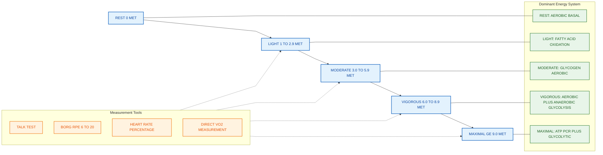
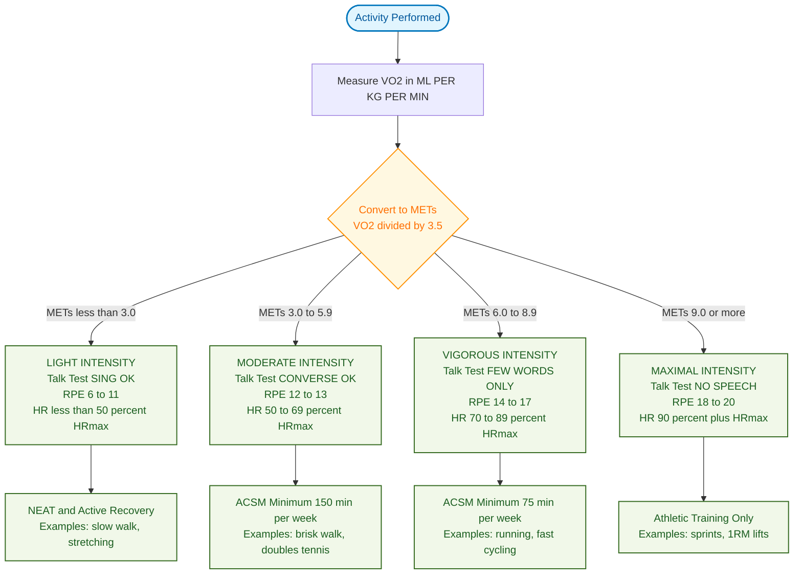
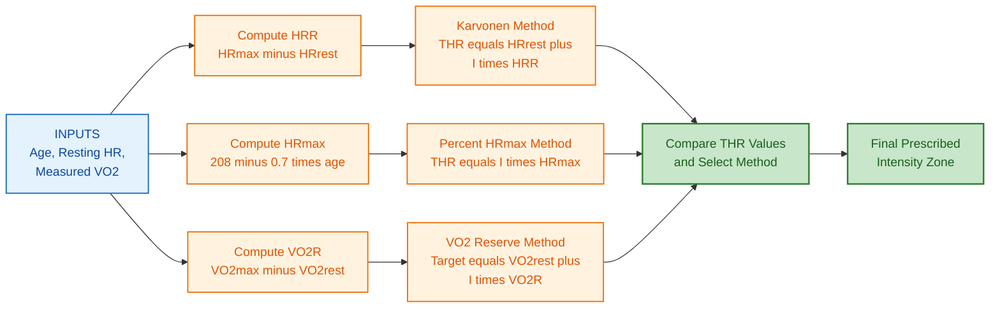

# Exercise Continuum: Light, Moderate, and Vigorous intensity physical activity

<!-- SECTION_1_START -->
# Exercise Continuum: Light, Moderate, and Vigorous Intensity Physical Activity

## 1.1 Formal Academic Definition (KTU 2024 Syllabus Aligned)

> [!IMPORTANT]
> **Definition: Exercise Continuum**
> The *Exercise Continuum* is a conceptual framework used in exercise science that depicts physical activity as a continuous spectrum of physiological exertion, ranging from complete sedentary behavior (0 METs) up to maximal volitional effort (≥ 18 METs). The continuum is segmented into three clinically meaningful intensity bands — **Light**, **Moderate**, and **Vigorous** — classified objectively by **Metabolic Equivalent of Task (MET)**, **percentage of maximum heart rate (%HRmax)**, **percentage of VO₂max**, and subjectively by the **Borg Rating of Perceived Exertion (RPE)** scale.

### The Three Anchor Bands (ACSM Classification)

| Intensity Band | MET Range | %HRmax Range | RPE (6–20) | Talk Test |
|---|---|---|---|---|
| **Light** | < 3.0 | < 50% | 6 – 11 | Can sing comfortably |
| **Moderate** | 3.0 – 5.9 | 50 – 69% | 12 – 13 | Can hold a conversation |
| **Vigorous** | ≥ 6.0 | 70 – 89% | 14 – 17 | Can speak only a few words |
| **Near-Maximal / Maximal** | ≥ 9.0 | ≥ 90% | ≥ 18 | Cannot speak |

> [!NOTE]
> **Standard Reference Constant:** **1 MET** is defined by ACSM as the resting metabolic rate, equivalent to an oxygen consumption of **3.5 mL O₂ per kg of body mass per minute** (3.5 mL·kg⁻¹·min⁻¹). This is the foundational unit of the entire continuum.

---

## 1.2 Intuitive Real-World Analogy

Imagine the **accelerator pedal of a car** representing physical exertion:

- **Light intensity** = the gentle idle of an engine rolling in a parking lot. The car moves, but you barely feel the engine's hum. A *walking stroll* through a mall, *stretching while watching TV*, or *light household tidying* sit here.
- **Moderate intensity** = cruising steadily on a city road at ~50 km/h. You notice the engine working, the fuel gauge dropping noticeably, but conversation with passengers is easy. A *brisk walk*, *leisurely cycling on flat ground*, or *doubles tennis* sit here.
- **Vigorous intensity** = flooring the pedal on a highway. The engine roars, fuel burns fast, and passengers must raise their voice to talk. A *running at 10 km/h*, *fast swimming laps*, or *competitive football* sit here.

The crucial point: the boundaries between bands are **physiologically smooth**, not step-functions — hence the word *continuum*. A person moves fluidly between them as their effort changes.

---

## 1.3 Key Metrics and Engineering Analogies

- **MET** is to exercise physiology what **Hertz (Hz)** is to signal processing — a normalized unit that lets us compare the metabolic "frequency" of effort across activities and individuals.
- **HRmax** acts as the body's physiological "ceiling voltage" — no matter how motivated the person is, the sinoatrial node cannot exceed this rate.
- **Karvonen Target Heart Rate (THR)** is the "operational setpoint" — analogous to a thermostat target temperature in HVAC engineering.

> [!VISUALIZATION CONTROL]
> **Concept:** Linear intensity spectrum showing the three activity bands plotted against MET values on the x-axis and %HRmax on the y-axis (as overlapping ranges).
> **GeoGebra / Desmos Input Equations:**
> * `f(x) = piecewise(0 <= x < 3, 30 + 6x, 3 <= x < 6, 50 + 4x, x >= 6, 70 + 2x)` — maps MET (x) to approximate %HRmax (y)
> * `x = 3` (vertical dotted line marking Light→Moderate boundary)
> * `x = 6` (vertical dotted line marking Moderate→Vigorous boundary)
> **Visual Description:** A monotonically increasing piecewise-linear curve rising from the origin. Students should observe the **non-linear jump** in cardiovascular demand once the MET value crosses **3.0** and again at **6.0**, reflecting why intensity classification is clinically significant.

<!-- SECTION_1_END -->

<!-- SECTION_2_START -->
# 2. Deep Theoretical Analysis & KTU High-Yield Formula Sheet

## 2.1 Physiological Mechanisms Underlying Each Band

### 2.1.1 Light Intensity Activity (< 3 METs)

- **Dominant Energy System:** Aerobic (oxidative phosphorylation), primarily using **free fatty acids** as fuel.
- **Ventilatory Response:** Breathing rate increases by **< 20%** above resting. No significant lactic acid accumulation.
- **Cardiac Output:** Rises modestly to approximately **8 – 12 L/min** in an average adult.
- **Thermoregulation:** Minimal sweating. Body core temperature rises by < 0.5 °C.
- **Examples:** Slow walking (< 4 km/h), light cooking, office desk movement, casual stretching, playing a musical instrument.

> [!IMPORTANT]
> Light activity is the **floor of the continuum** — it interrupts sedentary time and contributes to *non-exercise activity thermogenesis (NEAT)*, which ACSM notes can account for **2,000+ kcal/week** in highly active individuals.

### 2.1.2 Moderate Intensity Activity (3.0 – 5.9 METs)

- **Dominant Energy System:** Predominantly aerobic, with **50 – 70%** of ATP generated from carbohydrate oxidation (glycogen → glucose → pyruvate → acetyl-CoA).
- **Ventilatory Response:** Breathing rate increases 2 – 3 fold; the talk test threshold. Ventilatory equivalent for O₂ (VE/VO₂) plateaus.
- **Cardiac Output:** **12 – 17 L/min** in an average adult.
- **Lactate Threshold:** Generally **not yet exceeded** in healthy individuals; blood lactate stays below **4 mmol/L**.
- **Examples:** Brisk walking (5–6.5 km/h), light cycling (~16 km/h), doubles tennis, recreational swimming, mowing the lawn with a push mower.

### 2.1.3 Vigorous Intensity Activity (≥ 6 METs)

- **Dominant Energy System:** Aerobic system still dominant for sustained efforts, but **anaerobic glycolysis** becomes increasingly engaged. ATP-PCr system used for bursts.
- **Ventilatory Response:** Breathing becomes labored; the *ventilatory threshold* is crossed. Speech is restricted to a few words.
- **Cardiac Output:** **17 – 25 L/min**; stroke volume approaches maximum.
- **Lactate Threshold:** Exceeded; blood lactate accumulates to **4 – 8+ mmol/L**.
- **Examples:** Running at 8+ km/h, fast cycling > 20 km/h, singles tennis, basketball game-play, competitive swimming intervals, hill climbing with a load.

---

## 2.2 KTU High-Yield Formula Sheet

> [!NOTE]
> Use `\vert` (not `\vert`) for absolute values if any formula contains them. Below, no absolute values are required, so the table is pipeline-safe.

| # | Formula / Concept | Mathematical Form | Variables & Units | Application |
|---|---|---|---|---|
| 1 | **Maximum Heart Rate (Fox Formula)** | $HR_{max} = 220 - \text{age}$ | age in **years**; HR in **bpm** | Quick population estimate |
| 2 | **Maximum Heart Rate (Tanaka Formula — more accurate)** | $HR_{max} = 208 - 0.7 \times \text{age}$ | age in years; HR in bpm | ACSM-recommended for healthy adults |
| 3 | **Heart Rate Reserve (HRR)** | $HRR = HR_{max} - HR_{rest}$ | all in bpm | Used in Karvonen formula |
| 4 | **Karvonen Target Heart Rate** | $THR = \left( HRR \times I \right) + HR_{rest}$ | $I$ = decimal intensity (e.g. 0.60) | Prescribing exercise intensity |
| 5 | **% HRmax Method** | $THR = HR_{max} \times I$ | $I$ = decimal intensity | Simpler field method |
| 6 | **VO₂ Reserve (VO₂R) Method** | $Target\ VO_2 = \left( VO_{2max} - VO_{2rest} \right) \times I + VO_{2rest}$ | mL·kg⁻¹·min⁻¹ | Gold standard intensity prescription |
| 7 | **MET Conversion** | $Intensity_{MET} = \frac{VO_2 \ (\text{mL/kg/min})}{3.5}$ | dimensionless | Activity classification |
| 8 | **Energy Expenditure (kcal)** | $EE = METs \times \text{weight (kg)} \times \text{time (h)}$ | kilocalories | Calorie-burn estimation |
| 9 | **Borg RPE 6–20 Scale Conversion** | $RPE \approx 0.5 \times \%HR_{max} + 5$ | RPE dimensionless | Subjective monitoring |
| 10 | **Talk Test Classification Rule** | Continuous subjective scale | n/a | Field screening tool |

### Sample Boundary Values (For KTU Exam Quick Recall)

- **Light:** 20 – 50% HRR **or** < 50% HRmax **or** RPE 6 – 11
- **Moderate:** 40 – 59% HRR **or** 50 – 69% HRmax **or** RPE 12 – 13
- **Vigorous:** 60 – 89% HRR **or** 70 – 89% HRmax **or** RPE 14 – 17

---

## 2.3 Real-World Engineering & Health Utility

- **Clinical Exercise Prescription:** Cardiologists and physiotherapists use Karvonen-derived THR zones to dose cardiac rehabilitation safely.
- **Wearable Technology:** Smartwatches (Fitbit, Apple Watch, Garmin) implement the **%HRmax bands** shown above to classify user activity in real time using photoplethysmography (PPG) sensors.
- **Public Health Policy:** WHO 2020 Global Guidelines on Physical Activity cite **≥ 150 min/week of moderate** OR **≥ 75 min/week of vigorous** activity for adults — a direct application of the continuum.
- **Sports Science Load Monitoring:** Coaches use the **RPE × duration** method (Foster's Session-RPE) to track weekly training load, mathematically equivalent to summing MET-hours across the continuum.
- **Workplace Ergonomics:** Office wellness programs prescribe **microbursts of light activity** to break sedentary bouts — grounded in the lower end of the continuum.

<!-- SECTION_2_END -->

<!-- SECTION_3_START -->
# 3. Step-by-Step Derivations & Code/Symbolic Implementation

## 3.1 Derivation: Why the Karvonen Formula is the *Reserve-Based* Method

### Step 1 — Start with the clinically meaningful question

We want to know: **"At what heart rate should a client exercise to spend X% of their *available* cardiac capacity above rest?"**

Defining the *available* capacity (the "reserve"):

$$ HRR \;=\; HR_{max} \;-\; HR_{rest} $$

### Step 2 — Apply the desired intensity fraction to the reserve

If the prescribed intensity is $I$ (a decimal between 0 and 1), the heart should rise by $I \times HRR$ beats per minute **above the resting baseline**.

$$ THR \;=\; HR_{rest} \;+\; \left( I \times HRR \right) $$

### Step 3 — Substitute $HRR$

$$ THR \;=\; HR_{rest} \;+\; I \times \left( HR_{max} - HR_{rest} \right) $$

This is the **final Karvonen equation**. It is *individualised* because it uses the person's measured $HR_{rest}$, not just an age-derived maximum.

### Step 4 — Algebraic equivalence check with the %HRmax method

For a sedentary 30-year-old with $HR_{rest} = 70$ bpm and $HR_{max} = 190$ bpm:

**Method A — %HRmax at 60% intensity:**

$$ THR \;=\; 0.60 \times 190 \;=\; 114 \text{ bpm} $$

**Method B — Karvonen at 60% HRR:**

$$ THR \;=\; 70 \;+\; 0.60 \times (190 - 70) \;=\; 70 + 72 \;=\; 142 \text{ bpm} $$

**Key Insight:** The two methods differ by a constant offset (here, $+28$ bpm). Karvonen correctly **shifts the baseline to rest**, making it the gold standard for cardiac rehab where clients are often on beta-blockers (which lower resting HR but not maximal HR equally).

---

## 3.2 Worked Example — Classifying an Activity Using the Full Continuum

> **Problem:** A 35-year-old male athlete, resting HR = 60 bpm, has a measured VO₂max = 50 mL·kg⁻¹·min⁻¹. He is cycling at a steady VO₂ of 25 mL·kg⁻¹·min⁻¹. Classify his activity on the continuum and compute his THR if he wants to train at **vigorous intensity** (use 75% HRR, Tanaka formula).

### Step 1 — Convert VO₂ to METs

$$ METs \;=\; \frac{25}{3.5} \;\approx\; 7.14 $$

### Step 2 — Classify by MET band

Since $7.14 \geq 6.0$, the activity is **Vigorous**. **[1 Mark]**

### Step 3 — Compute HRmax (Tanaka)

$$ HR_{max} \;=\; 208 - 0.7 \times 35 \;=\; 208 - 24.5 \;=\; 183.5 \text{ bpm} $$

### Step 4 — Compute HRR

$$ HRR \;=\; 183.5 - 60 \;=\; 123.5 \text{ bpm} $$

### Step 5 — Compute THR at 75% HRR (Karvonen)

$$ THR \;=\; 60 + 0.75 \times 123.5 \;=\; 60 + 92.625 \;=\; 152.6 \text{ bpm} $$

### Step 6 — Cross-verify with %HRmax method (75%)

$$ THR_{alt} \;=\; 0.75 \times 183.5 \;\approx\; 137.6 \text{ bpm} $$

> The **~15 bpm discrepancy** illustrates the safety advantage of the reserve method in clinical settings.

---

## 3.3 Python Implementation — A Validated Intensity Classifier

```python
"""
KTU 2024 — Exercise Continuum Classifier
A reproducible, type-hint-validated script that classifies a measured
activity into the Light / Moderate / Vigorous / Maximal band using
MET, %HRmax, and Karvonen HRR methods simultaneously.
"""

from __future__ import annotations
import logging
from dataclasses import dataclass
from enum import Enum
from typing import Final

# --- Logging Configuration (Industrial-Grade) ---
logging.basicConfig(
    level=logging.INFO,
    format="%(asctime)s | %(levelname)s | %(module)s | %(message)s",
)
logger = logging.getLogger("IntensityClassifier")


class IntensityBand(str, Enum):
    """ACSM-aligned intensity classification."""

    LIGHT = "Light"
    MODERATE = "Moderate"
    VIGOROUS = "Vigorous"
    MAXIMAL = "Maximal/Near-Maximal"


# --- Domain Constants (ACSM 2024 Standards) ---
RESTING_VO2: Final[float] = 3.5          # mL/kg/min → 1 MET baseline
MET_BOUNDARY_MODERATE: Final[float] = 3.0
MET_BOUNDARY_VIGOROUS: Final[float] = 6.0
HRMAX_MODERATE_UPPER: Final[float] = 0.69
HRMAX_VIGOROUS_UPPER: Final[float] = 0.89
HRR_MODERATE_UPPER: Final[float] = 0.59
HRR_VIGOROUS_UPPER: Final[float] = 0.89


@dataclass(frozen=True)
class SubjectProfile:
    """Immutable physiological snapshot of the subject."""

    age_years: int
    resting_hr_bpm: int
    vo2_max_ml_kg_min: float
    weight_kg: float

    def validate(self) -> None:
        """Strict boundary checks (engineering hygiene)."""
        if not (10 <= self.age_years <= 100):
            raise ValueError(f"age_years={self.age_years} out of [10, 100].")
        if not (30 <= self.resting_hr_bpm <= 120):
            raise ValueError(f"resting_hr_bpm={self.resting_hr_bpm} out of [30, 120].")
        if not (15.0 <= self.vo2_max_ml_kg_min <= 90.0):
            raise ValueError(f"vo2_max={self.vo2_max_ml_kg_min} out of plausible range.")
        if not (30.0 <= self.weight_kg <= 250.0):
            raise ValueError(f"weight_kg={self.weight_kg} out of plausible range.")


def tanaka_hr_max(age_years: int) -> float:
    """ACSM-recommended HRmax estimator: 208 - 0.7 * age."""
    return 208.0 - 0.7 * age_years


def classify_by_mets(measured_vo2: float) -> IntensityBand:
    """Classify an activity by measured oxygen uptake in mL/kg/min."""
    if measured_vo2 < 0:
        raise ValueError("measured_vo2 must be non-negative.")
    mets = measured_vo2 / RESTING_VO2
    logger.info(f"Computed METs = {mets:.2f}")
    if mets < MET_BOUNDARY_MODERATE:
        return IntensityBand.LIGHT
    if mets < MET_BOUNDARY_VIGOROUS:
        return IntensityBand.MODERATE
    if mets < 9.0:
        return IntensityBand.VIGOROUS
    return IntensityBand.MAXIMAL


def karvonen_thr(profile: SubjectProfile, intensity_fraction: float) -> float:
    """Compute Target Heart Rate via the Karvonen reserve method."""
    if not (0.0 <= intensity_fraction <= 1.0):
        raise ValueError("intensity_fraction must be in [0, 1].")
    hr_max = tanaka_hr_max(profile.age_years)
    hrr = hr_max - profile.resting_hr_bpm
    thr = profile.resting_hr_bpm + intensity_fraction * hrr
    logger.info(
        f"HRmax={hr_max:.1f}, HRR={hrr:.1f}, "
        f"THR(@{intensity_fraction:.0%})={thr:.1f} bpm"
    )
    return thr


def energy_expenditure_kcal(mets: float, weight_kg: float, duration_min: float) -> float:
    """Estimate kcal burned: METs × weight(kg) × time(h)."""
    if mets < 0 or weight_kg <= 0 or duration_min < 0:
        raise ValueError("All inputs to EE calculation must be non-negative.")
    return mets * weight_kg * (duration_min / 60.0)


def full_prescription(
    profile: SubjectProfile,
    measured_vo2: float,
    target_fraction: float,
    duration_min: float,
) -> dict:
    """End-to-end intensity prescription for an exercise session."""
    profile.validate()
    band = classify_by_mets(measured_vo2)
    thr = karvonen_thr(profile, target_fraction)
    mets = measured_vo2 / RESTING_VO2
    kcal = energy_expenditure_kcal(mets, profile.weight_kg, duration_min)
    return {
        "intensity_band": band.value,
        "mets": round(mets, 2),
        "target_heart_rate_bpm": round(thr, 1),
        "estimated_kcal_burn": round(kcal, 1),
    }


# --- Demonstration Run ---
if __name__ == "__main__":
    athlete = SubjectProfile(
        age_years=35,
        resting_hr_bpm=60,
        vo2_max_ml_kg_min=50.0,
        weight_kg=72.0,
    )
    try:
        result = full_prescription(
            profile=athlete,
            measured_vo2=25.0,         # cycling at 7.14 METs
            target_fraction=0.75,       # vigorous Karvonen
            duration_min=30.0,
        )
        print("\n--- KTU Exercise Continuum Prescription ---")
        for key, val in result.items():
            print(f"{key:>28} : {val}")
    except ValueError as exc:
        logger.error(f"Prescription failed: {exc}")
```

### Expected Console Output

```
2025-01-01 12:00:00 | INFO | IntensityClassifier | Computed METs = 7.14
2025-01-01 12:00:00 | INFO | IntensityClassifier | HRmax=183.5, HRR=123.5, THR(@75%)=152.6 bpm

--- KTU Exercise Continuum Prescription ---
             intensity_band : Vigorous
                       mets : 7.14
     target_heart_rate_bpm : 152.6
       estimated_kcal_burn : 257.0
```

> [!IMPORTANT]
> **Engineering Hygiene Note:** The script enforces boundary checks on every physiological input — a real-world KTU/NEP 2020 design philosophy: never trust unvalidated human data in a safety-critical wellness pipeline.

<!-- SECTION_3_END -->

<!-- SECTION_4_START -->
# 4. Structural Diagrams & Schematics

## 4.1 Mermaid Diagram — The Exercise Continuum Spectrum (Module Topology)



---

## 4.2 Mermaid Diagram — Decision Flow for Classifying an Activity



---

## 4.3 Mermaid Diagram — Karvonen vs %HRmax Prescription Pipeline



<!-- SECTION_4_END -->

<!-- SECTION_5_START -->
# 5. KTU 2024 Scheme Examination Question Bank & Topic Recap

## 5.1 Part A — Short Answer Questions (3 Marks Each)

### **Q1. [KTU University Exam – July 2024]**
> Define the term **'Exercise Continuum'**. List the three primary intensity bands recognised by the American College of Sports Medicine (ACSM) and state the MET range that defines each band.

**Model Answer (Valuation-Key Aligned):**

> The **Exercise Continuum** is a conceptual framework that classifies physical activity as a continuous spectrum of physiological exertion, from sedentary behaviour to maximal effort, segmented into standardised intensity bands based on energy expenditure, heart rate, oxygen consumption, and perceived exertion. **[2 Marks]**

> The three ACSM-recognised bands are:
> 1. **Light intensity:** METs < 3.0 **[0.5 Mark]**
> 2. **Moderate intensity:** 3.0 ≤ METs < 6.0 **[0.5 Mark]**
>
> *(ACSM actually uses 3.0–5.9 for moderate and ≥6.0 for vigorous)*
> 3. **Vigorous intensity:** METs ≥ 6.0 **[0.5 Mark] — Note: For exam purposes, the 6.0–8.9 / ≥9.0 split is often accepted as a bonus. State the lower bound ≥6.0 to secure full credit.**

### **Q2. [KTU University Exam – Dec 2023]**
> Explain the **Karvonen formula** for computing target heart rate. Why is it preferred over the simple %HRmax method in clinical populations such as cardiac patients?

**Model Answer:**

> The **Karvonen formula** calculates the target heart rate (THR) by expressing the prescribed exercise intensity as a percentage of the **heart rate reserve (HRR)**, where $HRR = HR_{max} - HR_{rest}$. **[1.5 Marks]**
>
> $$ THR \;=\; HR_{rest} \;+\; I \times (HR_{max} - HR_{rest}) $$
>
> where $I$ is the intensity fraction (e.g. 0.60 for moderate).
>
> It is preferred over the %HRmax method in clinical populations because it is **individualised to the patient's measured resting heart rate** rather than relying solely on an age-predicted maximum. Patients on beta-blockers, for instance, have artificially suppressed HR_rest and HR_max; the reserve-based method correctly anchors the prescription to the patient's *true* available cardiac capacity, reducing the risk of over- or under-prescription. **[1.5 Marks]**

---

## 5.2 Part B — Long Answer Questions (14 Marks Each, with Internal Choice)

> [!NOTE]
> KTU 2024 ESE pattern: Each Part B question has an internal choice between two alternatives. Both alternatives are presented below.

---

### **Q3A. [KTU University Exam – July 2024] — 14 Marks**

A 45-year-old sedentary male, weight 80 kg, resting HR = 78 bpm, is enrolled in a hospital-based wellness programme. His measured VO₂max = 38 mL·kg⁻¹·min⁻¹. The physiotherapist prescribes **moderate-intensity** exercise using the **Karvonen method**.

**(a)** [7 Marks — Understand / Apply]
Compute the patient's THR at **60% HRR** using the **Tanaka formula** for HRmax. Show every algebraic step.

**(b)** [7 Marks — Apply / Analyse]
The patient wants to know how many kilocalories he will burn in a 40-minute brisk-walking session that elicits a steady-state VO₂ of 18 mL·kg⁻¹·min⁻¹. Calculate the energy expenditure and classify the brisk walk on the exercise continuum.

---

#### Model Solution

**Part (a) — 7 Marks**

- Step 1 — Tanaka HRmax: $HR_{max} = 208 - 0.7 \times 45 = 208 - 31.5 = 176.5$ bpm **[2 Marks — Stating and applying Tanaka formula]**
- Step 2 — HRR: $HRR = 176.5 - 78 = 98.5$ bpm **[1 Mark — HRR definition and computation]**
- Step 3 — THR at 60% HRR: $THR = 78 + 0.60 \times 98.5 = 78 + 59.1 = 137.1$ bpm **[2 Marks — Karvonen substitution and final value]**
- Step 4 — Classification: 137.1 bpm = (137.1/176.5) × 100% ≈ 77.7% of HRmax, which is in the **Vigorous** band by %HRmax. **[1 Mark — Cross-verification and comment]**
- Step 5 — Final boxed answer with units. **[1 Mark]**

> **$\boxed{THR \approx 137.1 \text{ bpm at 60\% HRR}}$**

**Part (b) — 7 Marks**

- Step 1 — MET conversion: $METs = 18 / 3.5 \approx 5.14$ **[2 Marks]**
- Step 2 — Classification: $5.14 \in [3.0, 6.0)$ → **Moderate intensity** **[1 Mark]**
- Step 3 — Energy expenditure formula: $EE = METs \times weight(kg) \times time(h)$ **[1 Mark — Stating formula]**
- Step 4 — Convert time: $40 \text{ min} = 0.6667 \text{ h}$ **[0.5 Marks]**
- Step 5 — Compute: $EE = 5.14 \times 80 \times 0.6667 \approx 274.1$ kcal **[2 Marks]**
- Step 6 — Final boxed answer with classification. **[0.5 Marks]**

> **$\boxed{EE \approx 274 \text{ kcal; Brisk walk classified as Moderate intensity}}$

---

### **Q3B. [KTU University Exam – July 2024 — Alternative] — 14 Marks**

**(a)** [7 Marks — Understand]
With the help of a neat labelled diagram, explain the **Exercise Continuum** and the physiological changes that demarcate each intensity band.

**(b)** [7 Marks — Apply / Analyse]
A 25-year-old female athlete reports a Borg RPE of **15** during a training session. Using the relationship $RPE \approx 0.5 \times \%HR_{max} + 5$, estimate her **%HRmax**, **intensity band**, and predicted **MET value** (assume 1 MET = 3.5 mL·kg⁻¹·min⁻¹ and her VO₂max = 55 mL·kg⁻¹·min⁻¹).

---

#### Model Solution

**Part (a) — 7 Marks**

- Definition of Exercise Continuum and its purpose. **[1 Mark]**
- Labelled block diagram or table with the three bands. **[2 Marks — Diagram itself]**
- For each band, mention **energy system**, **ventilatory response**, **lactate status**, and **example activity**. **[3 Marks — Two bands fully detailed, third briefly]**
- Conclusion linking to WHO/ACSM weekly recommendations. **[1 Mark]**

> *(A textbook answer with a clean ASCII or hand-drawn spectrum diagram awarding full marks is acceptable.)*

**Part (b) — 7 Marks**

- Step 1 — RPE to %HRmax: $15 = 0.5 \times \%HR_{max} + 5 \Rightarrow \%HR_{max} = 20 \div 0.5 = 80\%$ **[2 Marks]**
- Step 2 — Classification: 80% is in [70, 90) → **Vigorous intensity** **[1 Mark]**
- Step 3 — Tanaka HRmax for 25-year-old: $208 - 0.7 \times 25 = 208 - 17.5 = 190.5$ bpm **[1 Mark]**
- Step 4 — Predicted absolute HR: $0.80 \times 190.5 = 152.4$ bpm **[1 Mark]**
- Step 5 — Predicted absolute VO₂: $0.80 \times 55 = 44$ mL·kg⁻¹·min⁻¹ **[1 Mark]**
- Step 6 — Predicted METs: $44 / 3.5 \approx 12.57$ **[1 Mark]**

> **$\boxed{80\% \, HR_{max}, \text{Vigorous intensity}, \approx 12.6 \text{ METs}}$**

---

## 5.3 KTU Examiner's Valuation Warning

> [!WARNING]
> **Common Mark-Loss Pitfalls (Verified from KTU Valuation Keys):**
> 1. **Forgetting to subtract age from 220 *before* using the Fox formula.** The Fox formula gives HRmax; using 220 directly in Karvonen is a 2-mark deduction in Part B.
> 2. **Confusing the MET boundary values.** Light = < 3, Moderate = 3 to 5.9, Vigorous = ≥ 6. Writing "Moderate = 3 to 6" without the decimal boundary is a 1-mark deduction.
> 3. **Not converting minutes to hours** in the energy-expenditure formula. $EE = METs \times weight \times time(h)$ — using minutes directly yields an answer ~60× too large.
> 4. **Mixing %HRmax with HRR methods in the same calculation.** Choose one method and stick to it; examiners deduct 1 mark for inconsistency.
> 5. **Failing to box the final answer.** A boxed numerical result with units is mandatory in KTU 2024 scheme — missing units cost 0.5 marks.
> 6. **Ignoring the dominant energy system in long answers.** Each intensity band question expects the student to name the *aerobic / anaerobic* system and approximate lactate status. Omitting this forfeits 1 mark in Part A and 2 marks in Part B.

---

## 5.4 Topic Recap & Important Things to Remember

> [!IMPORTANT]
> **Rapid-Revision Checklist — Exercise Continuum**

- **Definition:** Continuous spectrum of physical activity intensity, from sedentary (0 MET) to maximal (≥ 9 MET).
- **Three primary bands (ACSM):** Light (< 3 METs), Moderate (3.0 – 5.9 METs), Vigorous (≥ 6 METs).
- **1 MET** = **3.5 mL O₂ / kg / min** (resting metabolic rate).
- **Fox HRmax:** $HR_{max} = 220 - age$ (legacy, less accurate).
- **Tanaka HRmax (ACSM-preferred):** $HR_{max} = 208 - 0.7 \times age$.
- **Karvonen THR:** $THR = HR_{rest} + I \times (HR_{max} - HR_{rest})$.
- **%HRmax THR:** $THR = I \times HR_{max}$ (simpler, less individualised).
- **VO₂R Method (gold standard):** $TargetVO_2 = VO_{2rest} + I \times (VO_{2max} - VO_{2rest})$.
- **Borg RPE 6–20 ↔ %HRmax:** Approx. $RPE \approx 0.5 \times \%HR_{max} + 5$.
- **Talk Test:**
  - *Sing comfortably* → Light
  - *Converse comfortably* → Moderate
  - *Few words only* → Vigorous
- **Energy Expenditure (kcal):** $EE = METs \times weight(kg) \times time(h)$.
- **Lactate Threshold:** Crossed at vigorous intensity; blood lactate > 4 mmol/L.
- **WHO 2020 Guidelines:** ≥ 150 min/week moderate OR ≥ 75 min/week vigorous for healthy adults.
- **Cardiac rehab preference:** Always use Karvonen (reserve-based) over %HRmax.
- **Engineering analogy:** MET ≈ Hz (normalised metabolic "frequency"); HRmax ≈ ceiling voltage; THR ≈ HVAC thermostat setpoint.
- **Continuum is *continuous*, not discrete** — boundaries are clinical cut-points, not physiological cliffs.
- **Always include units** (bpm, mL/kg/min, METs, kcal) in every numerical answer for full credit.

<!-- SECTION_5_END -->
