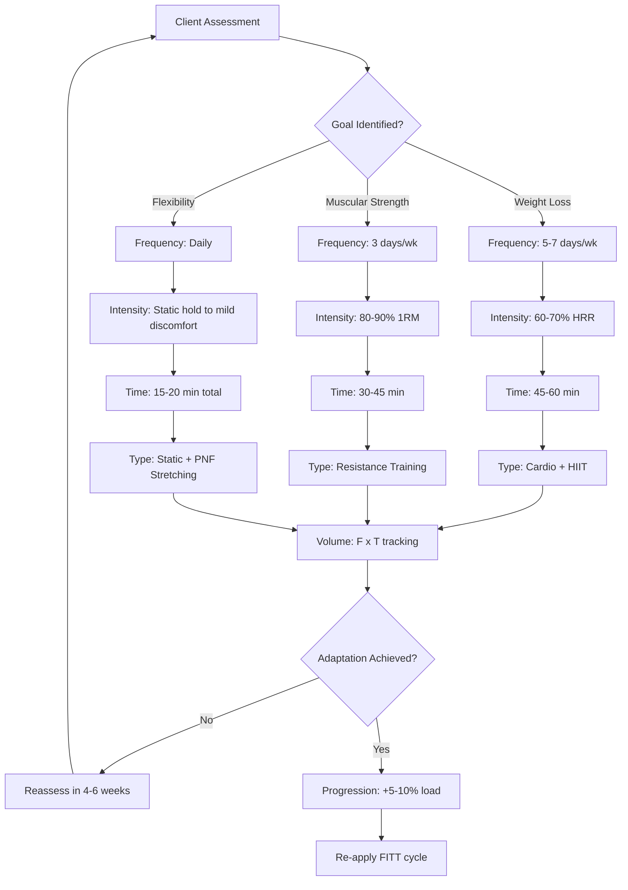
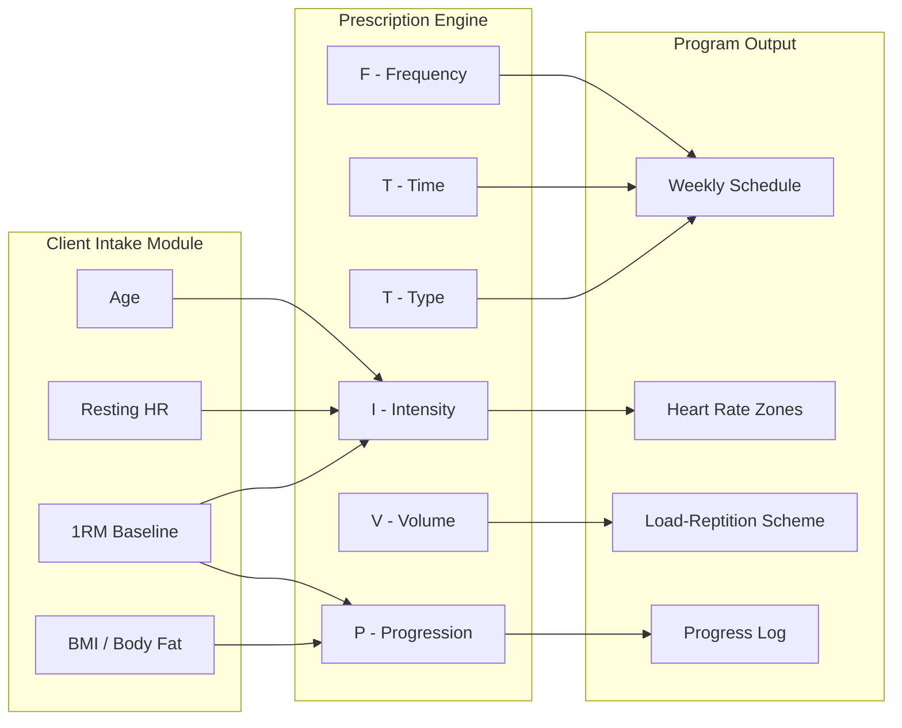
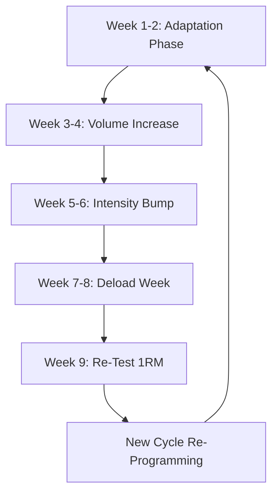

# FITT principle to design an Exercise programme

<!-- SECTION_1_START -->

# FITT Principle: Core Definition & Intuitive Overview

## Formal Academic Definition (KTU 2024 Aligned)

The **FITT Principle** is a foundational evidence-based framework used in exercise science and sports medicine to design, prescribe, and progressively modify individualized exercise programs. The acronym **FITT** stands for **Frequency**, **Intensity**, **Time**, and **Type** of physical activity. It serves as the cardinal prescription matrix recommended by global health authorities, including the **American College of Sports Medicine (ACSM)** and the **World Health Organization (WHO)**, for structuring safe and effective physical activity routines across diverse populations.

> [!IMPORTANT]
> **KTU 2024 Syllabus Highlight (Module 1 - UCHWT127):** The FITT principle forms the cornerstone of *Fitness Programming* in anatomy of physical activity. Students must be able to apply the FITT-VP (Volume + Progression) extended model to design sample exercise programs for cardiorespiratory endurance, muscular strength, flexibility, and body composition goals.

## Conceptual Analogy & Intuitive Understanding

Imagine you are a **chef preparing a balanced meal** for a customer. Before cooking, you must decide:

| Cooking Variable | Corresponding FITT Element | Rationale |
|---|---|---|
| **How many meals per day?** | Frequency | Number of exercise sessions per week |
| **How spicy / how strong?** | Intensity | How hard the exercise feels (HR, RPE) |
| **How long to cook?** | Time | Duration of each session |
| **Which cuisine / dish type?** | Type | Mode — cardio, resistance, flexibility, etc. |

Just as a chef adjusts the *spice level* and *cooking time* based on the customer's preference and health condition, a fitness trainer adjusts the **Intensity** and **Time** of exercise based on the client's **age, fitness level, and goals**.

> [!NOTE]
> **Geometric Intuition:** Think of FITT as the four adjustable *knobs on an audio equalizer* — Frequency (how often the beat hits), Intensity (volume), Time (length of song), Type (genre). Tweaking these knobs in the right proportion produces a perfectly balanced "workout soundtrack" for the body.

## Standard Reference Metrics

- **Standard Adult Recommendation (WHO 2020):** **150–300 minutes/week** of moderate-intensity, or **75–150 minutes/week** of vigorous-intensity aerobic activity.
- **Resting Heart Rate (RHR) Norm:** **60–100 beats per minute (bpm)** for healthy adults.
- **Maximum Heart Rate (HRmax) Estimate:** **HRmax = 220 − Age (years)** — Tanaka formula refinement: **HRmax = 208 − (0.7 × Age)**.
- **Karvonen Heart Rate Reserve (HRR) Method:** **Target HR = [(HRmax − HRRrest) × %Intensity] + HRRrest**.

> [!TIP]
> **GeoGebra / Desmos Visualization Concept**
> **Concept:** Karvonen Heart Rate Target Zones by Age
> **GeoGebra Input Equations:**
> * `f(x) = 208 - 0.7*x` (HRmax curve, where x = age in years)
> * `g1(x) = 0.5*(f(x) - 70) + 70` (50% intensity — lower bound)
> * `g2(x) = 0.85*(f(x) - 70) + 70` (85% intensity — upper bound)
> **Visual Description:** Students should observe a downward-sloping HRmax line, with two parallel offset curves forming a "training zone band" that narrows as age increases. The shaded region between $g_1$ and $g_2$ represents the safe aerobic training zone.

---

<!-- SECTION_1_END -->

<!-- SECTION_2_START -->

# Deep Theoretical Analysis & KTU High-Yield Formula Sheet

## The Four Pillars of the FITT Principle — Structural Breakdown

### 1. Frequency (F)
**Definition:** The *number of times* exercise sessions are performed per week.

- For **aerobic/cardiorespiratory training:** **3–5 days/week** for general health; up to **5–7 days/week** for advanced athletes.
- For **resistance/strength training:** **2–3 non-consecutive days/week** per muscle group to allow **48–72 hours** of recovery.
- For **flexibility training:** **Daily** or at minimum **2–3 days/week** is recommended.

### 2. Intensity (I)
**Definition:** The *level of effort* or *physiological demand* placed on the body during exercise.

Two widely accepted methods to quantify intensity:

**Method A — Heart Rate (HR) Based:**
- **%HRmax Method:** Target HR = (% Intensity) × HRmax
- **Karvonen / HRR Method:** Target HR = ((HRmax − HRrest) × %Intensity) + HRrest

**Method B — Rating of Perceived Exertion (RPE) — Borg Scale (6–20):**

| RPE Value | Verbal Anchor | % HRmax Equivalent |
|---|---|---|
| 9 | Very light | < 35% |
| 11 | Light | 35–54% |
| 13 | Somewhat hard | 55–69% |
| 15 | Hard | 70–89% |
| 17 | Very hard | 90–99% |
| 19 | Extremely hard | ~100% |

### 3. Time (T)
**Definition:** The *duration* (length) of each exercise session or the total weekly volume.

- **Moderate-intensity aerobic:** **30–60 minutes/session** (can be accumulated in 10-minute bouts).
- **Vigorous-intensity aerobic:** **20–60 minutes/session**.
- **Resistance training:** **20–45 minutes/session**, depending on program design (full-body vs. split).
- **Flexibility:** Static stretches held for **15–30 seconds**, repeated **2–4 times** per muscle group.

### 4. Type (T)
**Definition:** The *mode* or *category* of physical activity performed.

| Training Type | Examples | Primary Fitness Component |
|---|---|---|
| Aerobic / Cardiorespiratory | Brisk walking, cycling, swimming, jogging | $VO_2$ max, cardiovascular endurance |
| Resistance / Strength | Free weights, machines, bodyweight, bands | Muscular strength \& endurance |
| Flexibility | Static, dynamic, PNF stretching | Range of motion (ROM) |
| Neuromotor / Balance | Yoga, tai chi, BOSU drills | Coordination, proprioception |

## Extended Model — FITT-VP (ACSM Updated Framework)

The modern ACSM prescription matrix extends FITT to include **V**olume and **P**rogression:

- **Volume (V):** Total amount of work performed — calculated as **Sets × Reps × Load** for resistance training, or **Frequency × Duration** for aerobic training.
- **Progression (P):** The gradual, systematic increase in any FITT variable to continue producing training adaptations. The **2-for-1 rule**: do not increase more than one FITT variable per week, and only by approximately **5–10% incremental load**.

## KTU Formula Cheat Sheet

| Formula / Metric | Expression | Application Context |
|---|---|---|
| Maximum Heart Rate (Age-predicted) | $HR_{max} = 220 - Age$ | Quick estimate for healthy adults |
| Tanaka Refined HRmax | $HR_{max} = 208 - 0.7 \times Age$ | More accurate across age ranges |
| Target HR (\%HRmax) | $THR = \% Intensity \times HR_{max}$ | Direct intensity prescription |
| Karvonen HRR Formula | $THR = [(HR_{max} - HR_{rest}) \times \%I] + HR_{rest}$ | Gold standard for cardiac patients |
| Weekly Aerobic Volume | $V = F \times T$ (sessions × minutes) | Total exercise dose |
| Resistance Volume | $V = Sets \times Reps \times Load$ | Workload quantification |
| Progression Increment | $\Delta_{new} = 1.05 \times \Delta_{old}$ to $1.10 \times \Delta_{old}$ | Safe weekly overload |
| Body Mass Index | $BMI = \frac{Weight(kg)}{Height(m)^2}$ | Body composition screening |
| Estimated $VO_2$ max (Rockport walk test) | $VO_2 = 132.853 - 0.0769 \times W - 0.3877 \times A + 6.315 \times G - 3.2649 \times T$ | Field-based aerobic capacity |

> Where $W$ = weight (lbs), $A$ = age (yrs), $G$ = gender factor (1 = male, 0 = female), $T$ = walk time (min).

## Real-World Engineering \& Health Utility

The FITT principle is the **core programming algorithm** in:
- **Clinical cardiac rehabilitation** (post-MI, post-bypass surgery patients).
- **Corporate wellness platforms** (Fitbit, Apple Health, Google Fit APIs).
- **Sports performance analytics** (athlete periodization software).
- **AI-based fitness recommendation engines** (personalized adaptive training).

It functions as a **dose-response equation** for physical activity, paralleling how a *software developer writes a function with controllable parameters* — every variable (F, I, T, Type) can be independently tuned to yield a *desired output* (specific adaptation).

---

<!-- SECTION_2_END -->

<!-- SECTION_3_START -->

# Step-by-Step Derivations \& Practical Implementation

## Worked Example 1: Designing an Aerobic Program Using Karvonen Formula

**Given Scenario:**
A **40-year-old sedentary male office worker** joins a fitness program. His resting heart rate is **78 bpm**. The trainer prescribes a **moderate-intensity (60% HRR)** walking program.

**Step 1 — Compute HRmax using Tanaka formula:**
$$\begin{aligned}
HR_{max} &= 208 - (0.7 \times Age) \\
&= 208 - (0.7 \times 40) \\
&= 208 - 28 \\
&= 180 \text{ bpm}
\end{aligned}$$

**Step 2 — Compute Heart Rate Reserve (HRR):**
$$\begin{aligned}
HRR &= HR_{max} - HR_{rest} \\
&= 180 - 78 \\
&= 102 \text{ bpm}
\end{aligned}$$

**Step 3 — Compute Target Heart Rate (THR) at 60% intensity:**
$$\begin{aligned}
THR &= [(HR_{max} - HR_{rest}) \times \%I] + HR_{rest} \\
&= [102 \times 0.60] + 78 \\
&= 61.2 + 78 \\
&= 139.2 \approx 139 \text{ bpm}
\end{aligned}$$

**Step 4 — Assign FITT variables:**

| Variable | Prescription | Rationale |
|---|---|---|
| **Frequency** | 4 days/week | Beginner — 3 to 5 days optimal |
| **Intensity** | 60% HRR (\~139 bpm), RPE 12–13 | Moderate zone per ACSM |
| **Time** | 30 minutes/session (continuous) | ACSM minimum for moderate |
| **Type** | Treadmill walking + 1 day cycling | Aerobic, low-impact |

**Step 5 — Compute weekly Volume:**
$$\begin{aligned}
V_{weekly} &= F \times T \\
&= 4 \text{ sessions} \times 30 \text{ min} \\
&= 120 \text{ min/week (moderate intensity)}
\end{aligned}$$

This satisfies the WHO lower threshold of **150 min/week moderate** when combined with light incidental activity.

## Worked Example 2: Designing a Resistance Program with Progression

**Scenario:** A **25-year-old female** wants to build muscular endurance. She is a beginner with no chronic conditions.

**Step 1 — Establish baseline 1RM (One-Repetition Maximum) test** for the squat. Suppose her 1RM is **60 kg**.

**Step 2 — Calculate training load for endurance (50–60% 1RM):**
$$\begin{aligned}
Load_{endurance} &= 0.55 \times 1RM \\
&= 0.55 \times 60 \\
&= 33 \text{ kg}
\end{aligned}$$

**Step 3 — Assign FITT for muscular endurance:**

| Variable | Prescription |
|---|---|
| **Frequency** | 3 non-consecutive days/week (Mon/Wed/Fri) |
| **Intensity** | 50–60% 1RM (\~33 kg), RPE 12–14 |
| **Time** | 30–40 min total session |
| **Type** | Full-body circuit — squat, push-up, row, plank |

**Step 4 — Volume per session (example leg day):**
$$\begin{aligned}
V_{session} &= Sets \times Reps \times Load \\
&= 3 \text{ sets} \times 15 \text{ reps} \times 33 \text{ kg} \\
&= 1485 \text{ kg total leg work}
\end{aligned}$$

**Step 5 — Progression (Week 4 onwards) — apply 5% rule:**
$$\begin{aligned}
New Load &= 1.05 \times 33 \\
&= 34.65 \text{ kg} \approx 35 \text{ kg}
\end{aligned}$$

She progresses by adding **1–2 reps per set first**, then once she hits the upper rep range (e.g., 18 reps), she **increases load by ~5%**.

## Symbolic Python Implementation — FITT Calculator

```python
from dataclasses import dataclass
from typing import Literal
import logging

logging.basicConfig(level=logging.INFO, format="%(levelname)s: %(message)s")

@dataclass(frozen=True)
class ClientProfile:
    age: int
    resting_hr: int
    weight_kg: float
    height_m: float
    one_rm_kg: float

    def __post_init__(self) -> None:
        if not (10 <= self.age <= 100):
            raise ValueError("Age must be between 10 and 100 years.")
        if not (30 <= self.resting_hr <= 120):
            raise ValueError("Resting HR must be physiologically plausible (30-120 bpm).")
        if self.weight_kg <= 0 or self.height_m <= 0:
            raise ValueError("Weight and height must be positive.")


class FITTPrescriber:
    """Encapsulates the FITT-VP prescription algorithm."""

    def __init__(self, client: ClientProfile) -> None:
        self.client = client

    def hr_max(self, method: Literal["tanaka", "traditional"] = "tanaka") -> int:
        if method == "tanaka":
            return int(208 - 0.7 * self.client.age)
        return int(220 - self.client.age)

    def target_hr(self, intensity_pct: float, method: str = "karvonen") -> int:
        if not (0.0 < intensity_pct < 1.0):
            raise ValueError("Intensity must be a decimal between 0 and 1.")
        hrmax = self.hr_max()
        hrr = hrmax - self.client.resting_hr
        if method == "karvonen":
            return int((hrr * intensity_pct) + self.client.resting_hr)
        return int(hrmax * intensity_pct)

    def resistance_load(self, training_goal: str) -> float:
        goal_map: dict[str, tuple[float, str]] = {
            "endurance":  (0.50, "50% 1RM"),
            "hypertrophy":(0.75, "75% 1RM"),
            "strength":   (0.85, "85% 1RM"),
            "power":      (0.90, "90% 1RM"),
        }
        if training_goal not in goal_map:
            raise KeyError(f"Unknown goal. Use: {list(goal_map.keys())}")
        pct, label = goal_map[training_goal]
        prescribed = round(self.client.one_rm_kg * pct, 2)
        logging.info(f"Prescribed load for {training_goal}: {prescribed} kg ({label})")
        return prescribed

    def bmi(self) -> float:
        return round(self.client.weight_kg / (self.client.height_m ** 2), 2)

    def progression(self, current_load: float, increment_pct: float = 0.05) -> float:
        if not (0.01 <= increment_pct <= 0.15):
            raise ValueError("Progression increment must be between 1% and 15%.")
        return round(current_load * (1 + increment_pct), 2)


# --- Demonstration Run ---
if __name__ == "__main__":
    client = ClientProfile(age=30, resting_hr=72, weight_kg=70.0, height_m=1.72, one_rm_kg=80.0)
    prescriber = FITTPrescriber(client)

    print(f"HRmax (Tanaka): {prescriber.hr_max()} bpm")
    print(f"Target HR @ 70% HRR (Karvonen): {prescriber.target_hr(0.70)} bpm")
    print(f"BMI: {prescriber.bmi()} kg/m^2")
    print(f"Load for hypertrophy: {prescriber.resistance_load('hypertrophy')} kg")
    print(f"Next-week load (+5%): {prescriber.progression(60.0)} kg")
```

**Sample Output:**

```
HRmax (Tanaka): 187 bpm
Target HR @ 70% HRR (Karvonen): 152 bpm
BMI: 23.66 kg/m^2
INFO: Prescribed load for hypertrophy: 60.0 kg (75% 1RM)
Next-week load (+5%): 63.0 kg
```

## Laboratory/Field Tool Profiles for FITT Assessment

| Assessment Tool | Parameter Measured | FITT Variable Mapped | Precaution |
|---|---|---|---|
| Heart Rate Monitor (Polar H10) | HR (bpm) | Intensity | Check chest strap skin contact |
| Borg RPE Scale (Printed Card) | Subjective exertion 6–20 | Intensity | Validate client's literacy |
| Pedometer / Accelerometer | Step count | Frequency, Volume | Calibrate stride length |
| Stopwatch | Session duration | Time | Synchronize with HR monitor |
| 1RM Test Rack | Max strength | Intensity, Progression | Mandatory spotter for safety |
| Goniometer | Joint ROM (degrees) | Type (flexibility) | Align anatomical landmarks |
| Skinfold Caliper | Body fat % | Progression (outcome) | Same-site, same-time measurements |

---

<!-- SECTION_3_END -->

<!-- SECTION_4_START -->

# Structural Diagrams \& Schematics

## Diagram 1: FITT-VP Decision Flow (Mermaid Flowchart)



## Diagram 2: FITT-VP Modularity via Subgraphs



## Diagram 3: Progressive Overload Timeline (Sequential Processing Topology)



> [!NOTE]
> **Diagram Interpretation Note:** The above Mermaid schematics represent the **algorithmic decision architecture** of the FITT-VP prescription process. They abstract the human physiological training cycle into modular data-flow steps, similar to a control system in process engineering.

---

<!-- SECTION_4_END -->

<!-- SECTION_5_START -->

# KTU 2024 Scheme Examination Question Bank \& Topic Recap

## Part A — Short Answer Questions (3 Marks Each)

### Question 1
**[KTU University Exam — July 2024]** Define the FITT principle. List its four components. (CO1, Remember)

**Model Answer (3 Marks):**
The **FITT principle** is a foundational exercise prescription framework used to design safe and effective physical activity programs. Its four components are:

1. **F** — Frequency: number of exercise sessions per week.
2. **I** — Intensity: level of physiological effort or workload.
3. **T** — Time: duration of each exercise session.
4. **T** — Type: mode or category of exercise (aerobic, resistance, flexibility).

> **[Valuation Key: Definition 1 Mark, Listing all 4 components 2 Marks]**

### Question 2
**[KTU University Exam — Dec 2023]** Differentiate between the %HRmax method and the Karvonen (HRR) method of prescribing exercise intensity. (CO1, Understand)

**Model Answer (3 Marks):**

| Feature | %HRmax Method | Karvonen / HRR Method |
|---|---|---|
| Formula | $THR = \%I \times HR_{max}$ | $THR = [(HR_{max} - HR_{rest}) \times \%I] + HR_{rest}$ |
| Uses Resting HR? | No | Yes |
| Accuracy | Lower | Higher (accounts for fitness level) |
| Preferred For | Healthy adults | Cardiac patients, athletes |

> **[Valuation Key: 1 Mark for each differentiation row, 1 Mark for the formula distinction]**

---

## Part B — Long Answer Questions (14 Marks, Internal Choice)

### Question A (14 Marks) — **[KTU University Exam — July 2024 Model Paper]**

**(a)** Explain the **FITT-VP principle** in detail with the **expanded Volume and Progression** components. State the **ACSM recommendations** for aerobic and resistance training. **(7 Marks)** (CO1, Understand)

**(b)** A **35-year-old female** with a resting heart rate of **74 bpm** wishes to begin a moderate-intensity aerobic program. Using the **Tanaka formula** and **Karvonen method**, calculate her target heart rate at **65% HRR intensity**. Design a **one-week sample program** using the FITT variables. **(7 Marks)** (CO2, Apply)

### Model Solution A

#### Part (a) — FITT-VP Detailed Explanation (7 Marks)

**FITT-VP** is the modernized ACSM framework. The two added components are:

- **V — Volume:** Total work performed. For aerobic training, $V = F \times T$ (sessions × minutes/week). For resistance training, $V = Sets \times Reps \times Load$. [2 Marks]
- **P — Progression:** Gradual increase in any FITT variable to maintain overload. Recommended at **5–10% per week**, with only **one variable** changed at a time. [2 Marks]

**ACSM Recommendations:**

| Component | Aerobic | Resistance |
|---|---|---|
| Frequency | 5 days/week (moderate) or 3 days/week (vigorous) | 2–3 non-consecutive days/week |
| Intensity | 64–76% HRmax (moderate) / 77–95% HRmax (vigorous) | 60–80% 1RM |
| Time | 30–60 min/day | 20–45 min/session |
| Type | Walking, cycling, swimming | Multi-joint + single-joint exercises |

> **[Valuation Key: Volume + Progression explanation 4 Marks, ACSM table 3 Marks]**

#### Part (b) — Karvonen Calculation + Program Design (7 Marks)

**Step 1 — Tanaka HRmax:**
$$HR_{max} = 208 - (0.7 \times 35) = 208 - 24.5 = 183.5 \approx 184 \text{ bpm}$$ [1 Mark]

**Step 2 — Heart Rate Reserve:**
$$HRR = 184 - 74 = 110 \text{ bpm}$$ [1 Mark]

**Step 3 — Target HR at 65% HRR:**
$$THR = (110 \times 0.65) + 74 = 71.5 + 74 = 145.5 \approx 146 \text{ bpm}$$ [2 Marks]

**Step 4 — One-Week Program (Sample):**

| Day | Type | Intensity | Time | Frequency Slot |
|---|---|---|---|---|
| Mon | Brisk walking | 146 bpm / RPE 13 | 35 min | 1/5 |
| Tue | Yoga (flexibility) | RPE 9 | 25 min | 1/2 |
| Wed | Cycling (stationary) | 146 bpm | 30 min | 2/5 |
| Thu | Resistance (full body) | 60% 1RM | 30 min | 1/2 |
| Fri | Brisk walking | 146 bpm | 35 min | 3/5 |
| Sat | Swimming | 146 bpm | 30 min | 4/5 |
| Sun | Active recovery walk | RPE 9 | 20 min | 5/5 |

> **[Valuation Key: Tanaka calculation 1 Mark, HRR 1 Mark, THR 2 Marks, Program table 3 Marks]**

---

### Question B (14 Marks) — Alternative Choice

**(a)** Define the **FITT principle** and explain the **Borg RPE Scale (6–20)** as a method to prescribe exercise intensity. State its correlation with %HRmax. **(7 Marks)** (CO1, Understand)

**(b)** A **45-year-old sedentary male** is advised to begin a fitness program for **weight loss**. His resting HR is **80 bpm** and estimated 1RM for leg press is **100 kg**. Design a **4-week progressive aerobic + resistance program** using the FITT-VP framework, applying the **2-for-1 progression rule** and **5% overload principle**. **(7 Marks)** (CO2, Apply)

### Model Solution B (Outline)

**Part (a):** Explain FITT (2 Marks); describe Borg 6–20 scale with anchors (3 Marks); state the RPE-to-%HRmax correlation (e.g., RPE 13 ≈ 70% HRmax) (2 Marks). [7 Marks total]

**Part (b):**
- Tanaka HRmax = 208 − 0.7×45 = 176.5 ≈ 177 bpm. [1 Mark]
- HRR = 177 − 80 = 97 bpm. [1 Mark]
- Weight loss intensity = 70% HRR: THR = (97 × 0.70) + 80 = 67.9 + 80 = 148 bpm. [1 Mark]
- Resistance load at 60% 1RM (endurance bias) = 60 kg. [1 Mark]
- 4-week progression table showing +5% per week on load, +1 rep on volume, **only one variable** changed at a time. [3 Marks]

> **[Valuation Key: 2-for-1 rule and 5% principle explicitly mentioned 2 Marks, final week loads 1 Mark]**

---

> [!WARNING]
> **KTU Examiner's Pitfall Callout — Common Mark Losers**
> 1. **Forgetting to use Tanaka (208 − 0.7 × Age)** when the question specifies it — using the older 220 − Age formula costs **1 full mark**.
> 2. **Skipping HRR step** in the Karvonen method and directly multiplying % by HRmax — KTU examiners specifically test for the reserve-based calculation. **[−2 Marks]**
> 3. **Failing to state units (bpm, kg, min, days/wk)** in the final FITT table — board evaluators deduct **0.5 to 1 mark** for unit omission.
> 4. **Modifying more than one FITT variable per week** during progression — violates the **2-for-1 rule** and shows conceptual weakness. **[−1 Mark]**
> 5. **Not specifying "non-consecutive days"** for resistance training — the 48-hour recovery window is a syllabus mandate. **[−0.5 Mark]**

---

## Topic Recap \& Important Things to Remember

- **FITT** = **Frequency, Intensity, Time, Type** — the four universally accepted exercise prescription parameters.
- **FITT-VP** adds **Volume** ($F \times T$ for aerobic; $Sets \times Reps \times Load$ for resistance) and **Progression** (5–10% weekly increment, one variable at a time).
- **Two intensity prescription methods:** %HRmax (simple) and Karvonen HRR (accurate, used for cardiac rehab).
- **Tanaka formula** ($HR_{max} = 208 - 0.7 \times Age$) is the **modern preferred** formula over 220 − Age.
- **WHO baseline:** 150 min/week moderate or 75 min/week vigorous aerobic activity.
- **ACSM aerobic frequency:** 3–5 days/week; **resistance frequency:** 2–3 non-consecutive days/week per muscle group.
- **RPE 12–14** corresponds to **moderate intensity** (60–75% HRmax).
- **Flexibility:** static stretches held **15–30 seconds**, **2–4 repetitions**, minimum **2–3 days/week** (daily is optimal).
- **Progression rule:** change **only one FITT variable at a time**, by **5–10%**, to allow safe adaptation.
- **Rest interval** between resistance sets: **30–90 seconds** for endurance, **2–3 minutes** for heavy strength work.
- **Exercise order** in resistance training: **large muscle groups before small**, **multi-joint before single-joint**, **higher intensity before lower intensity**.
- **Cool-down** is mandatory: **5–10 minutes** of low-intensity activity post-exercise to prevent venous pooling.
- **Hydration cue:** **400–800 mL water 2 hours pre-exercise**, then **150–350 mL every 15–20 min** during prolonged activity.
- The FITT framework is the **bridge** between *anatomy* (Module 1's body systems) and *program design* (Module 2's application phases).

---

<!-- SECTION_5_END -->
