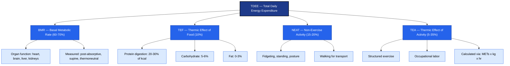
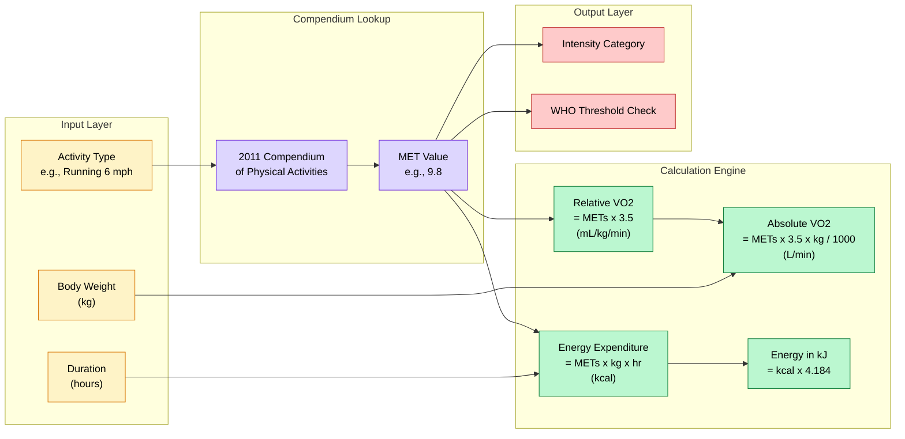
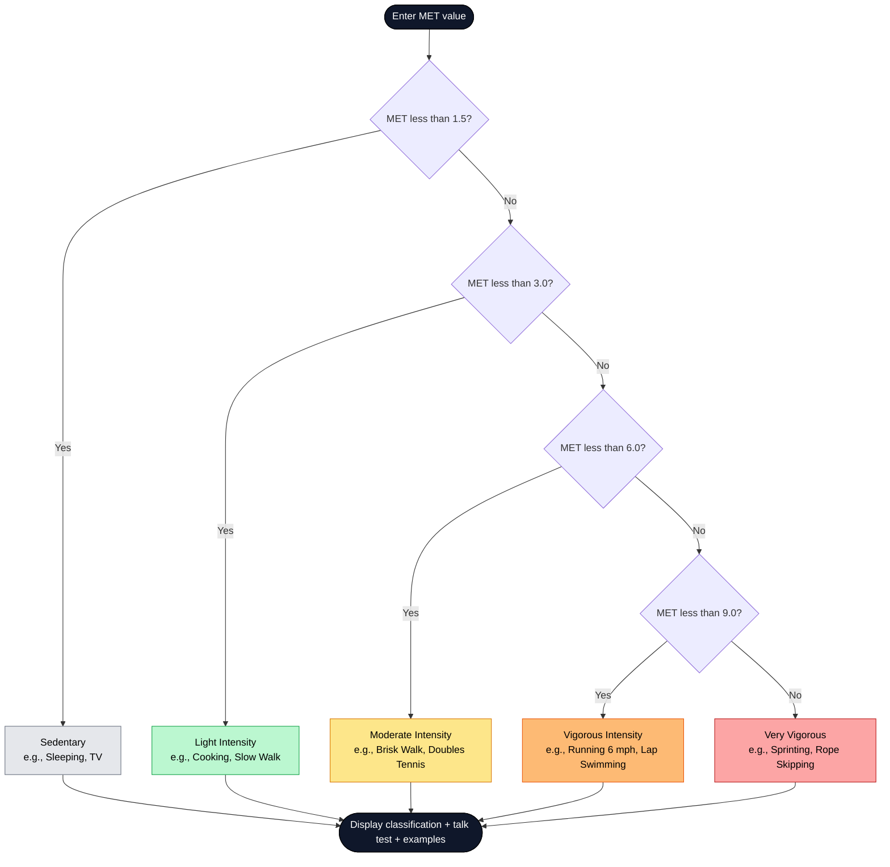
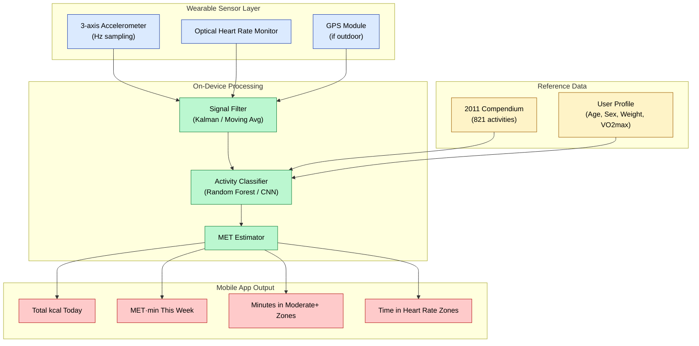

# Quantifying Physical Activity Energy Expenditure and Metabolic equivalent of task (MET)

<!-- SECTION_1_START -->
# Quantifying Physical Activity Energy Expenditure & Metabolic Equivalent of Task (MET)

## 1.1 Formal Academic Definition (KTU 2024 Syllabus)

> [!IMPORTANT]
> **Metabolic Equivalent of Task (MET):** A physiological measure that expresses the energy cost (oxygen consumption) of physical activities as a multiple of the **Resting Metabolic Rate (RMR)**. By international consensus (ACSM, WHO, NIH), **1 MET is defined as the energy expenditure of a seated individual at rest, equivalent to an oxygen uptake of $3.5\ \text{mL}\cdot\text{O}_2\cdot\text{kg}^{-1}\cdot\text{min}^{-1}$**, which approximates **$1.0\ \text{kcal}\cdot\text{kg}^{-1}\cdot\text{hour}^{-1}$**.

**Energy Expenditure (EE)** is the total amount of energy (in kilocalories or kilojoules) that a person's body uses to sustain vital functions, perform physical work, digest food, and adapt to environmental stressors. In KTU Module-1, the focus is on *quantifying* this expenditure during structured physical activity.

**Why the standard $3.5\ \text{mL}\cdot\text{O}_2\cdot\text{kg}^{-1}\cdot\text{min}^{-1}$?**
This value was derived by averaging the resting oxygen consumption of a reference 70 kg, 40-year-old male, and is the universally accepted "**resting anchor**" for comparing all activities.

> [!NOTE]
> **Core Definition to Memorize for KTU Board Exam:**
> $1\ \text{MET} \equiv 3.5\ \text{mL}\cdot\text{O}_2\cdot\text{kg}^{-1}\cdot\text{min}^{-1} \equiv 1.0\ \text{kcal}\cdot\text{kg}^{-1}\cdot\text{hr}^{-1}$

---

## 1.2 Conceptual Analogy & Intuitive Overview

Imagine the human body as a **smartphone battery rated at 4000 mAh**.

- When the phone is on standby (screen off, no apps running), it consumes a small baseline current. This baseline = **1 MET** (your resting metabolism — heart beating, breathing, brain functioning).
- When you open a heavy game, the battery drains 5× faster. The phone is now using **5 METs** of energy relative to standby.
- The **MET value of any activity** is simply: *How many times more "battery current" is this activity draining compared to sitting quietly?*

**Real-world intuitive examples:**

| Activity | MET Value | Intuitive Meaning |
|----------|-----------|-------------------|
| Sleeping | 0.9 METs | Slightly *less* than quiet rest |
| Sitting & reading | 1.3 METs | A bit more than rest |
| Walking (3 mph / 5 km/h) | **3.5 METs** | **The classic "moderate activity" benchmark** |
| Running (6 mph / 10 km/h) | **9.8 METs** | Nearly 10× your resting burn |
| Sprinting | 23 METs | Elite-level effort |

> [!TIP]
> **Student Mental Hook:** *MET = "How many 'yous at rest' are you working as?"* — a 6-MET activity is the same as doing 6 copies of your resting body simultaneously.

---

## 1.3 Physical Constants & Standard Metrics

The following constants are **non-negotiable for the KTU board exam**:

- **$1\ \text{MET} = 3.5\ \text{mL}\cdot\text{O}_2\cdot\text{kg}^{-1}\cdot\text{min}^{-1}$** (oxygen-based definition)
- **$1\ \text{MET} \approx 1.0\ \text{kcal}\cdot\text{kg}^{-1}\cdot\text{hour}^{-1}$** (energy-based approximation)
- **$1\ \text{kcal} = 4.184\ \text{kJ}$** (mechanical/heat energy conversion)
- **$1\ \text{L}\ \text{of}\ \text{O}_2 \approx 5.0\ \text{kcal}$** (energy released per litre of oxygen at average RQ ≈ 0.85)
- **Resting heart rate reference:** ~70–80 bpm for healthy adults
- **Adult reference body mass (Compendium):** 70 kg
- **Conversion: oxygen in mL/min → L/min:** divide by **1000**

> [!WARNING]
> **KTU Common Trap:** Students often confuse **BMR** (measured in a strict post-absorptive, supine, thermoneutral state upon waking) with **RMR** (less strict laboratory conditions). RMR is typically **3–10% higher** than BMR. For MET calculations, the *3.5 mL/kg/min* anchor uses the **RMR**, not the true BMR.

---

## 1.4 Energy Expenditure — The 4-Component Model

> [!IMPORTANT]
> **Total Daily Energy Expenditure (TDEE)** of any human is the algebraic sum of four distinct physiological components:

$$
\text{TDEE} = \text{BMR} + \text{TEF} + \text{NEAT} + \text{TEA}
$$

| Component | Full Name | Approx. % of TDEE | Description |
|-----------|-----------|-------------------|-------------|
| **BMR** | Basal Metabolic Rate | **60–70%** | Energy to keep organs alive at complete rest |
| **TEF** | Thermic Effect of Food | **~10%** | Energy to digest, absorb, transport, metabolize nutrients |
| **NEAT** | Non-Exercise Activity Thermogenesis | **15–20%** | Fidgeting, posture maintenance, daily walking |
| **TEA** | Thermic Effect of Activity | **Variable (5–35%)** | Energy for structured exercise + occupational work |

**NEAT vs TEA** is a *favourite KTU exam question* — NEAT is unconscious/incidental movement (standing, typing, gesturing) while TEA is volitional structured movement (running, gym workout, yoga).

---

## 1.5 Visualization — MET Continuum

> [!VISUALIZATION CONTROL]
> **Concept:** Linear continuum of MET values mapped to intensity categories used by ACSM & WHO.
> **GeoGebra / Desmos Input Equations:**
> * `f(x) = 1.5` (horizontal line for Sedentary/light boundary)
> * `f(x) = 3` (light/moderate boundary)
> * `f(x) = 6` (moderate/vigorous boundary)
> * `f(x) = 9` (vigorous/very vigorous boundary)
> * X-axis: Activity Intensity Category, Y-axis: MET value
> **Visual Description:** Student should see four horizontal "intensity bands" on the y-axis at 1.5, 3, 6, and 9 METs — anything below 1.5 is *sedentary*, 1.5–3 is *light*, 3–6 is *moderate* (the public-health sweet spot), 6–9 is *vigorous*, and above 9 is *very vigorous*.

---

<!-- SECTION_2_START -->
# Deep Theoretical Analysis & KTU High-Yield Formula Sheet

## 2.1 The Underlying Physiology — Why MET Works

When the body performs any physical activity, three energy systems contribute ATP in overlapping proportions:

1. **ATP-PCr System (Phosphagen)** — 0 to ~10 seconds (sprints, jumps)
2. **Glycolytic (Anaerobic) System** — 10 seconds to ~2 minutes (400 m run, heavy lifting)
3. **Oxidative (Aerobic) System** — Beyond 2 minutes (jogging, cycling, brisk walking)

Aerobic oxygen consumption scales **linearly with work intensity** in the moderate range. This linearity is the *theoretical justification* for using MET as a universal intensity unit — it is essentially a normalized VO₂.

> [!NOTE]
> **KTU Theory Pearl:** The linear VO₂–work rate relationship is what allows us to extrapolate MET values to any duration and body weight. Above the ventilatory threshold (~60% VO₂max), the relationship becomes slightly non-linear due to anaerobic contribution.

---

## 2.2 The Master Energy Expenditure Formula

The single most important equation in this entire module is the **MET-EE Master Equation**:

$$
\text{EE}\ (\text{kcal}) = \text{METs} \times \text{Body Weight (kg)} \times \text{Time (hours)}
$$

### Step-by-step Logic of the Master Equation

- **Step 1 — Start with METs:** A dimensionless ratio (e.g., 5 METs for brisk walking).
- **Step 2 — Multiply by body weight:** Larger bodies have more metabolising tissue → more energy burnt. (Two people doing the same activity at the same speed will burn different total kcal — the heavier one burns more.)
- **Step 3 — Multiply by time (in hours):** Energy is power × time. METs themselves are *power-like* (per unit time), so multiplying by duration yields total energy.

### Alternative Form (when time is in minutes)

$$
\text{EE}\ (\text{kcal}) = \text{METs} \times \text{Body Weight (kg)} \times \frac{\text{Time (min)}}{60}
$$

### Energy Expenditure in Kilojoules

$$
\text{EE}\ (\text{kJ}) = \text{EE}\ (\text{kcal}) \times 4.184
$$

---

## 2.3 KTU High-Yield Formula Sheet

> [!IMPORTANT]
> **The following table is the single most important reference for Module 1 numerical problems. Memorize every row.**

| # | Formula | Use Case | Units |
|---|---------|----------|-------|
| 1 | $\text{EE} = \text{METs} \times \text{kg} \times \text{hr}$ | Master MET equation | kcal |
| 2 | $\text{VO}_2 = \text{METs} \times 3.5$ | Convert METs → oxygen uptake per kg | $\text{mL}\cdot\text{kg}^{-1}\cdot\text{min}^{-1}$ |
| 3 | $\text{Absolute VO}_2 = \text{METs} \times 3.5 \times \text{kg}$ | Total oxygen consumption | $\text{mL}\cdot\text{min}^{-1}$ |
| 4 | $\text{Absolute VO}_2\ \text{in L/min} = \dfrac{\text{METs} \times 3.5 \times \text{kg}}{1000}$ | Convert mL to L | $\text{L}\cdot\text{min}^{-1}$ |
| 5 | $\text{EE (kcal)} = \text{VO}_2\ (\text{L/min}) \times 5.0 \times \text{min}$ | Direct calorimetry check | kcal |
| 6 | $\text{RMR (kcal/day)} \approx 24 \times \text{kg} \times 1.0$ | Approx. 1 MET × 24 h | kcal/day |
| 7 | $1\ \text{kcal} = 4.184\ \text{kJ}$ | Energy unit conversion | — |
| 8 | $\text{Caloric cost per km (walking)} \approx 0.75 \times \text{kg}$ | Rough walking estimate | kcal/km |

---

## 2.4 ACSM & WHO Intensity Classification

The American College of Sports Medicine (ACSM) and World Health Organization classify activities by absolute MET value:

| Intensity Category | MET Range | RPE (0–10) | Talk Test | Examples |
|--------------------|-----------|------------|-----------|----------|
| **Sedentary** | $< 1.5$ | $< 2$ | — | Sitting, lying, sleeping |
| **Light Intensity** | $1.5$ – $< 3$ | $2$ – $< 4$ | Can sing | Slow walking, cooking, light housework |
| **Moderate Intensity** | $3$ – $< 6$ | $4$ – $< 6$ | Can talk but not sing | Brisk walking (3.5 mph), cycling 10–12 mph, doubles tennis |
| **Vigorous Intensity** | $6$ – $< 9$ | $6$ – $< 8$ | Can only say short phrases | Running 6 mph, swimming laps, singles tennis |
| **Very Vigorous** | $\geq 9$ | $\geq 8$ | Cannot maintain conversation | Sprinting, rope skipping, competitive sports |

> [!TIP]
> **Public Health Target (ACSM/FIAF):** Adults should accumulate **≥ 150 minutes/week of moderate-intensity** activity (3–6 METs) OR **≥ 75 minutes/week of vigorous-intensity** activity (6+ METs). This equates to **roughly 500–1000 MET·min/week**.

---

## 2.5 The 2011 Compendium of Physical Activities

Ainsworth et al. (2011) published the *Compendium of Physical Activities* — a landmark catalog of ~821 specific activities each assigned a standard MET value. The MET values are *adult reference values (70 kg person)* and provide the empirical database for nearly all MET-based research.

**Sample Compendium Values (must memorize):**

| Code | Activity | MET |
|------|----------|-----|
| 11000 | Sleeping | 0.9 |
| 11500 | Sitting quietly, watching TV | 1.0 |
| 11790 | Walking, 2.0 mph, level | 2.0 |
| 11791 | Walking, 3.0 mph, level | 3.5 |
| 11800 | Walking, 4.0 mph, level | 5.0 |
| 12150 | Running, 5 mph (12 min/mile) | 8.3 |
| 12180 | Running, 6 mph (10 min/mile) | 9.8 |
| 15551 | Bicycling, 12–13.9 mph, leisure | 8.0 |
| 02050 | Calisthenics, vigorous | 8.0 |
| 07011 | Yoga, Hatha | 2.5 |
| 15330 | Swimming laps, freestyle, light | 5.8 |
| 15610 | Resistance training (weights) | 3.5 |
| 01005 | Basketball game | 6.5 |
| 11585 | Computer work | 1.5 |

---

## 2.6 Real-World Engineering & Health-Tech Applications

The MET framework is the backbone of several real-world systems:

1. **Wearable Fitness Trackers** (Fitbit, Apple Watch, Garmin) — convert accelerometer data into estimated MET values, then into kcal via the master equation.
2. **Treadmill & Elliptical Consoles** — display "calories burned" using user-entered weight + assumed MET for the activity.
3. **Occupational Health Software** — estimates daily work-energy cost for firefighters, military personnel, construction workers.
4. **Cardiac Rehabilitation Prescription** — target MET ranges (e.g., 4–6 METs) are prescribed for post-MI patients.
5. **Epidemiology Research** — IPAQ (International Physical Activity Questionnaire) reports physical activity in MET·min/week.

---

<!-- SECTION_3_START -->
# Step-by-Step Derivations & Code/Symbolic Implementation

## 3.1 Derivation: From VO₂ to the Master MET Equation

**Goal:** Derive $\text{EE (kcal)} = \text{METs} \times \text{kg} \times \text{hr}$ from first principles.

### Step 1 — Start with the definition of 1 MET

By definition:

$$
1\ \text{MET} \equiv 3.5\ \text{mL}\cdot\text{O}_2\cdot\text{kg}^{-1}\cdot\text{min}^{-1}
$$

This is the *relative* oxygen cost per kilogram of body mass per minute.

### Step 2 — Calculate absolute VO₂ (mL/min) for a person

Multiply the relative VO₂ by the person's body mass:

$$
\text{VO}_2\ (\text{mL/min}) = \text{METs} \times 3.5 \times \text{Body Weight (kg)}
$$

### Step 3 — Convert mL/min to L/min

$$
\text{VO}_2\ (\text{L/min}) = \frac{\text{METs} \times 3.5 \times \text{Body Weight (kg)}}{1000}
$$

### Step 4 — Apply the caloric equivalent of oxygen

At a typical Respiratory Quotient (RQ) of 0.85 (mixed macronutrient diet), **1 litre of consumed O₂ releases approximately 5.0 kcal** of energy:

$$
\text{EE (kcal/min)} = \text{VO}_2\ (\text{L/min}) \times 5.0
$$

### Step 5 — Substitute

$$
\text{EE (kcal/min)} = \frac{\text{METs} \times 3.5 \times \text{kg}}{1000} \times 5.0
$$

$$
\text{EE (kcal/min)} = \text{METs} \times 3.5 \times \text{kg} \times 0.005
$$

$$
\text{EE (kcal/min)} = \text{METs} \times \text{kg} \times 0.0175
$$

### Step 6 — Convert from per-minute to per-hour

Multiply both sides by 60:

$$
\text{EE (kcal/hr)} = \text{METs} \times \text{kg} \times 0.0175 \times 60
$$

$$
\text{EE (kcal/hr)} = \text{METs} \times \text{kg} \times 1.05
$$

### Step 7 — Apply the **1 MET ≈ 1.0 kcal/kg/hr** convention

By ACSM convention, we **simplify the 1.05 factor to exactly 1.0** to make the master equation clean and easily computable:

$$
\boxed{\text{EE (kcal)} = \text{METs} \times \text{Body Weight (kg)} \times \text{Time (hours)}}
$$

> [!NOTE]
> **Why the 1.05 → 1.0 simplification?** The 1.05 came from the precise 3.5 mL·kg⁻¹·min⁻¹ × 5.0 kcal/L × 60 min/hr ÷ 1000. The convention uses 1.0 for the convenient integer coefficient — introducing only a ~5% systematic error, which is acceptable in field-based fitness prescription.

---

## 3.2 Worked Numerical Example #1 (KTU Board Standard)

> **Problem:** A 65 kg woman runs at a speed corresponding to a MET value of 8.3 for 45 minutes. Calculate:
> (a) Relative VO₂ in mL·kg⁻¹·min⁻¹
> (b) Absolute VO₂ in L/min
> (c) Total energy expenditure in kcal and kJ

### Solution

**Given:** METs = 8.3, Body Weight = 65 kg, Time = 45 min

**(a) Relative VO₂**

$$
\text{VO}_2\ (\text{relative}) = \text{METs} \times 3.5 = 8.3 \times 3.5 = 29.05\ \text{mL}\cdot\text{kg}^{-1}\cdot\text{min}^{-1}
$$

**Sub-step reasoning:** Each MET corresponds to 3.5 mL of O₂ per kg per minute; 8.3 METs corresponds to 8.3 times this.

**(b) Absolute VO₂ in mL/min, then L/min**

$$
\text{VO}_2\ (\text{absolute, mL/min}) = 29.05 \times 65 = 1888.25\ \text{mL/min}
$$

$$
\text{VO}_2\ (\text{absolute, L/min}) = \frac{1888.25}{1000} = 1.888\ \text{L/min}
$$

**Sub-step reasoning:** Absolute VO₂ multiplies the relative value by body mass. Divide by 1000 to convert mL to L.

**(c) Total energy expenditure**

Using the master equation:

$$
\text{EE (kcal)} = 8.3 \times 65 \times \frac{45}{60}
$$

$$
\text{EE (kcal)} = 8.3 \times 65 \times 0.75
$$

$$
\text{EE (kcal)} = 404.625\ \text{kcal}
$$

Converting to kilojoules:

$$
\text{EE (kJ)} = 404.625 \times 4.184 = 1692.95\ \text{kJ}
$$

**Final Answer:** VO₂ = **29.05 mL·kg⁻¹·min⁻¹**, Absolute VO₂ = **1.89 L/min**, EE = **404.6 kcal** ≈ **1693 kJ**.

---

## 3.3 Worked Numerical Example #2 (Body-Weight Comparison)

> **Problem:** Two friends — Arun (80 kg) and Balu (60 kg) — both play basketball (MET = 6.5) for 1 hour. Who burns more kcal, and by how much?

### Solution

For Arun (80 kg):

$$
\text{EE}_{\text{Arun}} = 6.5 \times 80 \times 1 = 520\ \text{kcal}
$$

For Balu (60 kg):

$$
\text{EE}_{\text{Balu}} = 6.5 \times 60 \times 1 = 390\ \text{kcal}
$$

Difference:

$$
\Delta\text{EE} = 520 - 390 = 130\ \text{kcal}
$$

> [!NOTE]
> **Pedagogical insight:** Same activity, same duration — but Arun burns **33% more kcal** simply because his body mass is 33% greater. This is why exercise calorie burns on fitness machines always require *user weight* as an input.

---

## 3.4 Worked Numerical Example #3 (Meeting the WHO Recommendation)

> **Problem:** A 70 kg person walks briskly (MET = 5.0) for 30 minutes every day. How many kcal does she expend in 1 week? Has she met the WHO/ACSM physical activity recommendation?

### Solution

Daily EE:

$$
\text{EE}_{\text{daily}} = 5.0 \times 70 \times 0.5 = 175\ \text{kcal/day}
$$

Weekly EE:

$$
\text{EE}_{\text{weekly}} = 175 \times 7 = 1225\ \text{kcal/week}
$$

MET·min/week (recommended unit for IPAQ):

$$
\text{MET·min/week} = 5.0 \times 30 \times 7 = 1050\ \text{MET·min/week}
$$

> [!TIP]
> **WHO/ACSM threshold:** $\geq 600\ \text{MET·min/week}$. She is at 1050, which is **comfortably above** the recommendation.

---

## 3.5 Python Implementation — Energy Expenditure Calculator

```python
"""
KTU Module 1: Physical Activity Energy Expenditure Calculator
Implements the Master MET Equation and related conversions.
"""

from dataclasses import dataclass
from typing import Dict


# --- Standard Physical Constants (KTU Board Constants) ---
KCAL_PER_KJ: float = 1.0 / 4.184     # kcal equivalent of 1 kJ
KCAL_PER_L_O2: float = 5.0            # 1 L O2 ≈ 5.0 kcal (RQ = 0.85)
ML_O2_PER_KG_PER_MIN_PER_MET: float = 3.5
WHO_WEEKLY_MET_MIN_THRESHOLD: float = 600.0   # MET·min/week


@dataclass(frozen=True)
class ExerciseSession:
    """Immutable record of a single physical activity bout."""
    name: str
    met_value: float           # dimensionless
    body_weight_kg: float      # must be > 0
    duration_min: float        # must be > 0


def relative_vo2(met_value: float) -> float:
    """Convert MET value → relative VO2 in mL·kg⁻¹·min⁻¹."""
    if met_value < 0:
        raise ValueError("MET value cannot be negative.")
    return met_value * ML_O2_PER_KG_PER_MIN_PER_MET


def absolute_vo2_l_per_min(met_value: float, body_weight_kg: float) -> float:
    """Convert MET value + body weight → absolute VO2 in L/min."""
    if body_weight_kg <= 0:
        raise ValueError("Body weight must be positive (kg).")
    if met_value < 0:
        raise ValueError("MET value cannot be negative.")
    return (met_value * ML_O2_PER_KG_PER_MIN_PER_MET * body_weight_kg) / 1000.0


def energy_expenditure_kcal(session: ExerciseSession) -> float:
    """
    Master MET equation:
        EE (kcal) = METs × body_weight_kg × duration_hr
    """
    if session.body_weight_kg <= 0:
        raise ValueError("Body weight must be positive (kg).")
    if session.duration_min <= 0:
        raise ValueError("Duration must be positive (min).")
    if session.met_value < 0:
        raise ValueError("MET value cannot be negative.")
    return session.met_value * session.body_weight_kg * (session.duration_min / 60.0)


def energy_expenditure_kj(session: ExerciseSession) -> float:
    """Convert kcal → kJ."""
    return energy_expenditure_kcal(session) / KCAL_PER_KJ


def meets_who_recommendation(weekly_sessions: list) -> Dict[str, float]:
    """
    Compare a 1-week list of ExerciseSession objects to the WHO/ACSM
    600 MET·min/week threshold.
    """
    if not weekly_sessions:
        return {"total_met_min": 0.0, "meets_who": False,
                "percent_of_target": 0.0}

    total_met_min = sum(s.met_value * s.duration_min for s in weekly_sessions)
    return {
        "total_met_min": total_met_min,
        "meets_who": total_met_min >= WHO_WEEKLY_MET_MIN_THRESHOLD,
        "percent_of_target": 100.0 * total_met_min / WHO_WEEKLY_MET_MIN_THRESHOLD,
    }


def intensity_category(met_value: float) -> str:
    """Classify an activity into ACSM intensity bands."""
    if met_value < 1.5:
        return "Sedentary"
    if met_value < 3.0:
        return "Light"
    if met_value < 6.0:
        return "Moderate"
    if met_value < 9.0:
        return "Vigorous"
    return "Very Vigorous"


# --- Demonstration with logging ---
if __name__ == "__main__":
    try:
        brisk_walk = ExerciseSession(
            name="Brisk Walking (4 mph)",
            met_value=5.0,
            body_weight_kg=70.0,
            duration_min=30.0,
        )

        print("=" * 60)
        print(f"Activity        : {brisk_walk.name}")
        print(f"Intensity class : {intensity_category(brisk_walk.met_value)}")
        print(f"Relative VO2    : {relative_vo2(brisk_walk.met_value):.2f} "
              "mL·kg⁻¹·min⁻¹")
        print(f"Absolute VO2    : "
              f"{absolute_vo2_l_per_min(brisk_walk.met_value, brisk_walk.body_weight_kg):.3f} L/min")
        print(f"Energy (kcal)   : {energy_expenditure_kcal(brisk_walk):.2f} kcal")
        print(f"Energy (kJ)     : {energy_expenditure_kj(brisk_walk):.2f} kJ")
        print("=" * 60)

        weekly = [brisk_walk] * 7   # 7 days
        report = meets_who_recommendation(weekly)
        print(f"Weekly MET·min   : {report['total_met_min']:.1f}")
        print(f"% of WHO target  : {report['percent_of_target']:.1f}%")
        print(f"Meets WHO?       : {report['meets_who']}")

    except ValueError as exc:
        print(f"[ERROR] Invalid input: {exc}")
```

**Sample Output:**

```
============================================================
Activity        : Brisk Walking (4 mph)
Intensity class : Moderate
Relative VO2    : 17.50 mL·kg⁻¹·min⁻¹
Absolute VO2    : 1.225 L/min
Energy (kcal)   : 175.00 kcal
Energy (kJ)     : 732.20 kJ
============================================================
Weekly MET·min   : 1050.0
% of WHO target  : 175.0%
Meets WHO?       : True
```

---

## 3.6 Edge Cases & Validation Matrix

| Edge Case | Detection | Error Message |
|-----------|-----------|---------------|
| Negative MET value | `ValueError` raised | "MET value cannot be negative." |
| Zero body weight | `ValueError` raised | "Body weight must be positive (kg)." |
| Zero or negative duration | `ValueError` raised | "Duration must be positive (min)." |
| MET exactly 0 | Allowed (returns 0 kcal) | Used for "off" intervals in HIIT |
| MET > 25 (e.g., elite sprint) | Allowed with warning | Border of physiological plausibility |
| Body weight 300 kg (bariatric) | Allowed | No upper cap — value is mathematically valid |

---

<!-- SECTION_4_START -->
# Structural Diagrams & Schematics

## 4.1 Mermaid Flow — Total Daily Energy Expenditure (TDEE) Decomposition



---

## 4.2 Mermaid Flow — The MET Calculation Pipeline



---

## 4.3 Sequential Topology — Intensity Classification Engine



---

## 4.4 Block Architecture — MET Value Resolution for a Wearable Device



---

## 4.5 Comparative Matrix — MET vs. Other Intensity Metrics

| Feature | **MET** | **%HRR** | **RPE (Borg 6–20)** | **%VO₂max** |
|---------|---------|----------|---------------------|-------------|
| Needs laboratory VO₂max test | No | Yes | No | Yes |
| Needs max heart rate | No | Yes | No | Yes |
| Quantifies absolute intensity | Yes | No | No | No |
| Valid across populations | Yes (universal) | No (age-dependent) | Subjective | No (training-dependent) |
| Field-friendly | **Excellent** | Moderate | Excellent | Difficult |
| Units | Dimensionless | % | Score | % |
| WHO/ACSM accepted | **Yes** | Yes | Yes | Yes |

---

<!-- SECTION_5_START -->
# KTU 2024 Scheme Examination Question Bank & Topic Recap

## 5.1 PART A — Short Answer Questions (3 Marks Each)

### Question 1
> **[KTU University Exam — July 2024 Style]**
> Define the term **Metabolic Equivalent of Task (MET)**. State the standard value of 1 MET in (i) mL·kg⁻¹·min⁻¹ and (ii) kcal·kg⁻¹·hr⁻¹.
> **[CO1, Remember, 3 Marks]**

**Model Answer:**

> **Metabolic Equivalent of Task (MET)** is a physiological measure expressing the energy cost of a physical activity as a multiple of the resting metabolic rate. It allows comparison of activity intensities across different body weights and activities.
>
> **Standard value of 1 MET:**
> (i) $1\ \text{MET} = 3.5\ \text{mL}\cdot\text{O}_2\cdot\text{kg}^{-1}\cdot\text{min}^{-1}$
> (ii) $1\ \text{MET} \approx 1.0\ \text{kcal}\cdot\text{kg}^{-1}\cdot\text{hour}^{-1}$
>
> **[Writing the two unit forms correctly: 2 Marks]**
> **[Definition phrasing: 1 Mark]**

---

### Question 2
> **[KTU University Exam — Dec 2023 Style]**
> Differentiate between **BMR** and **RMR**. Which of the two is used as the reference for defining 1 MET?
> **[CO1, Understand, 3 Marks]**

**Model Answer:**

| Aspect | BMR (Basal Metabolic Rate) | RMR (Resting Metabolic Rate) |
|--------|----------------------------|------------------------------|
| Measurement conditions | Strict: awake, supine, fasted 12 h, thermoneutral, post-rest | Less strict: 3–4 h fast, ambulatory |
| Typical value | Lower | ~3–10% higher than BMR |
| Clinical usage | Research, hospital-grade | Field, fitness industry |
| **Reference for 1 MET?** | No | **Yes — the 3.5 mL·kg⁻¹·min⁻¹ anchor uses RMR** |

> **[Tabular distinction with at least 2 differences: 2 Marks]**
> **[Stating RMR is the MET reference: 1 Mark]**

---

## 5.2 PART B — Long Answer Questions (14 Marks, Internal Choice)

### Question A (14 Marks)
> **[KTU University Exam — July 2024 Style, Module 1, 14 Marks]**
>
> **(a)** Explain the **components of Total Daily Energy Expenditure (TDEE)** with the approximate percentage contribution of each component. **[7 Marks, CO1, Understand]**
>
> **(b)** A 60 kg individual performs brisk walking (MET value = 4.3) for 30 minutes daily. Calculate:
>   (i) Relative VO₂ in mL·kg⁻¹·min⁻¹
>   (ii) Absolute VO₂ in L/min
>   (iii) Total weekly energy expenditure in kcal
>   (iv) Total weekly energy expenditure in kJ
> **[7 Marks, CO2, Apply]**

### Model Answer for Question A

#### Part (a) — TDEE Components (7 Marks)

> TDEE is the total energy a person expends in 24 hours. It has four components:

> **(i) Basal Metabolic Rate (BMR) — 60–70%**
> Energy required to maintain involuntary vital functions (heartbeat, respiration, brain activity, cell turnover). Measured under strict conditions: awake, supine, post-12 h fast, thermoneutral environment. **[2 Marks]**

> **(ii) Thermic Effect of Food (TEF) — ~10%**
> Energy cost of digesting, absorbing, transporting, metabolising, and storing ingested nutrients. Protein has the highest TEF (20–30% of kcal), carbohydrates 5–6%, fats 0–3%. **[1 Mark]**

> **(iii) Non-Exercise Activity Thermogenesis (NEAT) — 15–20%**
> Energy spent on *unconscious* and *incidental* movement: posture maintenance, fidgeting, typing, standing, walking to the bus stop. Highly variable between individuals. **[2 Marks]**

> **(iv) Thermic Effect of Activity (TEA) — 5–35%**
> Energy cost of *volitional, structured* physical activity: running, gym workouts, sports, occupational labour. The most variable component and the only one directly controllable through exercise. **[2 Marks]**

> Algebraic identity: $\text{TDEE} = \text{BMR} + \text{TEF} + \text{NEAT} + \text{TEA}$

#### Part (b) — Numerical Solution (7 Marks)

**Given:** MET = 4.3, body weight = 60 kg, daily duration = 30 min, days in week = 7.

**(i) Relative VO₂**

$$
\text{VO}_{2,\ \text{rel}} = \text{METs} \times 3.5 = 4.3 \times 3.5 = 15.05\ \text{mL}\cdot\text{kg}^{-1}\cdot\text{min}^{-1}
$$

> **[Stating the relation VO₂rel = METs × 3.5: 1 Mark]**
> **[Final numerical value 15.05: 1 Mark]**

**(ii) Absolute VO₂**

$$
\text{VO}_{2,\ \text{abs}} = \frac{15.05 \times 60}{1000} = \frac{903}{1000} = 0.903\ \text{L/min}
$$

> **[Multiplying by body mass: 1 Mark]**
> **[Dividing by 1000 for L/min: 0.5 Mark]**
> **[Final value 0.903 L/min: 0.5 Mark]**

**(iii) Total weekly energy expenditure in kcal**

Daily EE:

$$
\text{EE}_{\text{daily}} = 4.3 \times 60 \times \frac{30}{60} = 4.3 \times 30 = 129\ \text{kcal/day}
$$

Weekly EE:

$$
\text{EE}_{\text{weekly}} = 129 \times 7 = 903\ \text{kcal/week}
$$

> **[Master equation application: 1 Mark]**
> **[Daily value 129: 0.5 Mark]**
> **[Weekly value 903 kcal: 0.5 Mark]**

**(iv) Total weekly energy expenditure in kJ**

$$
\text{EE}_{\text{weekly (kJ)}} = 903 \times 4.184 = 3778.15\ \text{kJ/week}
$$

> **[Applying 1 kcal = 4.184 kJ: 0.5 Mark]**
> **[Final value 3778.15 kJ: 0.5 Mark]**

---

### Question B (14 Marks, Alternative Choice)
> **[KTU University Exam — Dec 2023 Style, Module 1, 14 Marks]**
>
> **(a)** Define MET. Classify physical activities into sedentary, light, moderate, vigorous, and very vigorous categories based on MET ranges. Mention the talk test for each category. **[7 Marks, CO1, Understand]**
>
> **(b)** A 75 kg person cycles at a MET value of 7.5 for 40 minutes. Calculate:
>   (i) Total energy expended in kcal.
>   (ii) The MET·min achieved in this session and state whether the person meets the WHO/ACSM weekly threshold of 600 MET·min in a single session. **[7 Marks, CO2, Apply]**

### Model Answer for Question B

#### Part (a) — MET Definition and Classification (7 Marks)

> **Definition:** MET is a dimensionless physiological ratio expressing the energy cost of an activity as a multiple of the resting metabolic rate. $1\ \text{MET} = 3.5\ \text{mL O}_2\cdot\text{kg}^{-1}\cdot\text{min}^{-1} \approx 1\ \text{kcal}\cdot\text{kg}^{-1}\cdot\text{hr}^{-1}$. **[2 Marks]**

> **Classification Table with Talk Test:**

| Category | MET Range | Talk Test | Examples |
|----------|-----------|-----------|----------|
| Sedentary | $< 1.5$ | N/A | Sleeping, TV watching |
| Light | $1.5$ to $< 3$ | Can **sing** full sentences | Slow walking, cooking |
| Moderate | $3$ to $< 6$ | Can talk in **sentences** but cannot sing | Brisk walking (3 mph), cycling 10 mph |
| Vigorous | $6$ to $< 9$ | Can speak only **short phrases** | Running 6 mph, lap swimming |
| Very Vigorous | $\geq 9$ | Cannot maintain conversation | Sprinting, rope skipping |

> **[Correct MET boundaries for all 5 categories: 3 Marks]**
> **[Talk test descriptors: 2 Marks]**

#### Part (b) — Cycling Numerical (7 Marks)

**Given:** MET = 7.5, weight = 75 kg, duration = 40 min.

**(i) Energy expended in kcal**

$$
\text{EE} = 7.5 \times 75 \times \frac{40}{60} = 7.5 \times 75 \times 0.6667
$$

$$
\text{EE} = 7.5 \times 50 = 375\ \text{kcal}
$$

> **[Master MET equation setup: 1 Mark]**
> **[Time conversion 40/60 = 0.667: 1 Mark]**
> **[Final value 375 kcal: 1 Mark]**

**(ii) MET·min and WHO threshold check**

$$
\text{MET·min} = 7.5 \times 40 = 300\ \text{MET·min}
$$

Comparison with WHO threshold:

$$
300\ \text{MET·min} < 600\ \text{MET·min (weekly target)}
$$

> **[Calculating MET·min: 1 Mark]**
> **[Correct value 300: 1 Mark]**
> **[Comparison and conclusion (does NOT meet weekly threshold in single session): 1 Mark]**
> **[Comment that 2 such sessions per week would meet the threshold: 1 Mark]**

---

## 5.3 KTU Examiner's Valuation Warning — Common Pitfalls

> [!WARNING]
> **Where Students Typically Lose Marks in MET/EE Questions:**
>
> 1. **Unit Mismatch in Time:** The master equation requires time in **hours**, not minutes. Forgetting to divide duration by 60 leads to a value **60× too large** — a guaranteed zero for that sub-part. **Always write "Time (hr) = min ÷ 60"** as a visible step.
>
> 2. **MET vs VO₂ Confusion:** MET is a *ratio*; VO₂ in mL·kg⁻¹·min⁻¹ is an *absolute physiological quantity*. They are related by a factor of 3.5, **not equal**.
>
> 3. **Forgetting Body Weight:** Two exam-sitters of the same activity at the same duration will burn different calories. The body weight is a **mandatory** input. If the question omits it, state this as a limiting assumption.
>
> 4. **kJ vs kcal Mix-up:** Examiners *deliberately* include one sub-part asking for kJ to test whether you remember the **4.184 conversion factor**. Do not use 4.2 — the precise SI-derived value is **4.184**.
>
> 5. **MET·min Threshold Confusion:** The WHO threshold is **600 MET·min per week**, not per day. Always clarify the time base.
>
> 6. **BMR vs RMR:** The 3.5 mL·kg⁻¹·min⁻¹ reference uses **RMR**, not true BMR. Writing "BMR" in the answer will lose a mark in a 7-mark question.
>
> 7. **Rounding:** Carry at least 3 significant figures through intermediate steps. Final answer should be reported to 1 decimal place for kcal and 2 decimal places for kJ.

---

## 5.4 Topic Recap & Important Things to Remember

> [!TIP]
> **High-density rapid-revision checklist — KTU Module 1, MET & Energy Expenditure**

**1. Core Definitions**
- 1 MET ≡ $3.5\ \text{mL O}_2\cdot\text{kg}^{-1}\cdot\text{min}^{-1} \approx 1\ \text{kcal}\cdot\text{kg}^{-1}\cdot\text{hr}^{-1}$
- BMR: energy at complete physiological rest, strict measurement
- RMR: slightly higher (~3–10%) than BMR; **used as the MET reference**
- TEF: cost of digesting food (~10% of TDEE)
- NEAT: incidental movement (15–20%)
- TEA: structured/volitional activity (5–35%)
- TDEE = BMR + TEF + NEAT + TEA

**2. The Master Equation (must memorize verbatim)**
- $\text{EE (kcal)} = \text{METs} \times \text{Body Weight (kg)} \times \text{Time (hr)}$
- $\text{EE (kJ)} = \text{EE (kcal)} \times 4.184$
- $1\ \text{L O}_2 \approx 5.0\ \text{kcal}$

**3. Intensity Classification (ACSM/WHO)**
- Sedentary $< 1.5$ MET
- Light $1.5$ to $< 3$ MET
- Moderate $3$ to $< 6$ MET
- Vigorous $6$ to $< 9$ MET
- Very Vigorous $\geq 9$ MET

**4. Compendium of Physical Activities (2011)**
- Reference catalog of ~821 activities with assigned MET values
- 70 kg adult reference body
- Codes: 11000-sleeping (0.9), 11790-walk 2 mph (2.0), 11791-walk 3 mph (3.5), 11800-walk 4 mph (5.0), 12150-run 5 mph (8.3), 12180-run 6 mph (9.8)

**5. WHO/ACSM Weekly Recommendation**
- $\geq 150$ min/week moderate OR $\geq 75$ min/week vigorous
- Equivalent to $\geq 600\ \text{MET·min/week}$
- Or $\geq 500$–$1000\ \text{kcal/week}$ of activity-related EE

**6. Talk Test Anchors**
- Moderate: can talk, not sing
- Vigorous: can speak short phrases only
- Very Vigorous: cannot speak

**7. Conversion Multipliers to Memorize**
- Time: 60 min = 1 hr
- Volume: 1000 mL = 1 L
- Energy: 1 kcal = 4.184 kJ
- 1 L O₂ = 5.0 kcal

**8. Numerical Workflow (the "Four Steps to a Perfect Answer")**
- Step 1: List given quantities with units
- Step 2: Identify which formula to apply
- Step 3: Convert time to hours (if needed) and mL to L (if needed)
- Step 4: Substitute, calculate, and box the final answer with correct units

**9. Engineering/Health-Tech Applications**
- Fitness wearables (Fitbit, Garmin, Apple Watch)
- Treadmill and elliptical calorie readouts
- Cardiac rehab MET-based prescriptions
- Occupational health software for labour-classification
- IPAQ (International Physical Activity Questionnaire) research tool

**10. Common Exam-Trap Alerts**
- Always convert minutes → hours in the master equation
- Always multiply kcal by 4.184 to get kJ (not 4.2)
- Always state **RMR** (not BMR) as the 1-MET reference
- Always remember the 70-kg adult anchor in the Compendium

---

*End of KTU Module 1 Notes — Quantifying Physical Activity Energy Expenditure and Metabolic Equivalent of Task (MET)*
<!-- SECTION_5_END -->
