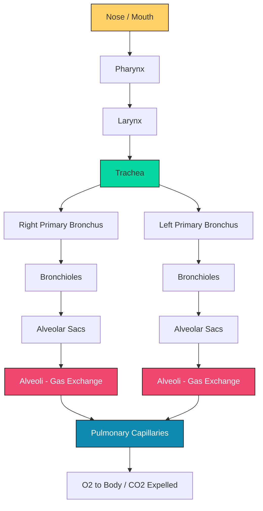
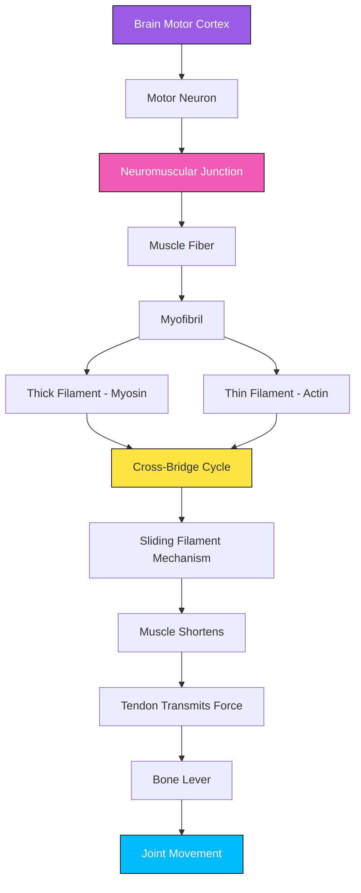
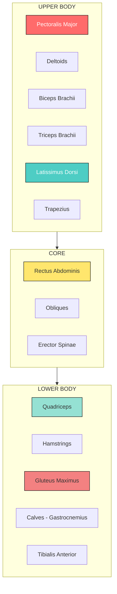
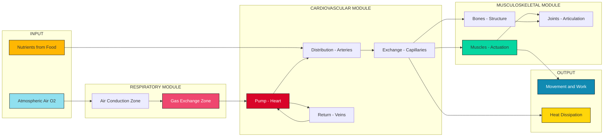

# Respiratory System, Cardiovascular System, Musculoskeletal System and Major Muscle groups

<!-- SECTION_1_START -->

# Module 1: Anatomy of Physical Activity & Fitness Principles

## 1.1 The Respiratory System — The Body's Air-Conditioning and Energy Plant

> [!IMPORTANT]
> **KTU 2024 Definition (UCHWT127):** The respiratory system is the integrated network of organs and tissues responsible for **gaseous exchange** — taking in atmospheric oxygen ($O_2$) required for cellular metabolism and expelling carbon dioxide ($CO_2$) produced as a metabolic waste product.

> [!NOTE]
> **Why this matters for a B.Tech student:** Every line of code you write requires energy. The CPU needs power, your body needs oxygen-glucose. The respiratory system is essentially your biological **"intake manifold"** — the analog of an engine's air intake system in a car.

### Intuitive Analogy
Think of the respiratory system as a **factory's HVAC + chimney system combined**:
- The **trachea** is the main supply duct
- The **bronchi & bronchioles** are the branch pipelines
- The **alveoli** are the microscopic heat exchangers (≈ **480 million** in each adult lung) where $O_2$ swaps with $CO_2$
- The **diaphragm** is the bellows pump that drives air movement

### Key Physiological Constants (Adult Resting Values)

| Parameter | Symbol | Typical Value |
|---|---|---|
| Respiratory Rate | $RR$ | **12–20 breaths/min** |
| Tidal Volume | $V_T$ | **500 mL** |
| Total Lung Capacity | $TLC$ | **~6.0 L** |
| Vital Capacity | $VC$ | **~4.8 L** |
| Residual Volume | $RV$ | **~1.2 L** |
| Oxygen partial pressure (alveolar) | $P_AO_2$ | **~104 mmHg** |

> [!VISUALIZATION CONTROL]
> **Concept:** Pressure-Volume Loop of the Lungs
> **GeoGebra / Desmos Input Equations:**
> * `f(x) = -0.05*(x-3)^2 + 1.2`  (Compliance curve)
> * `g(x) = 0.04*(x-3)^2 + 0.1`  (Recoil curve)
> **Visual Description:** Two intersecting parabolas forming a hysteresis loop — the area inside represents the work of breathing. Higher loop area = harder breathing (e.g., during exercise).

---

## 1.2 The Cardiovascular System — The Body's Hydraulic Delivery Network

> [!IMPORTANT]
> **KTU 2024 Definition (UCHWT127):** The cardiovascular system (CVS) is a closed-loop, double-circulation network comprising the **heart** (pump), **blood vessels** (conduits), and **blood** (transport medium). It delivers oxygen, nutrients, hormones, and immune cells while removing metabolic waste products.

> [!NOTE]
> **Engineering Analogy:** The cardiovascular system is your body's **fluid dynamics network** — equivalent to a closed-loop hydraulic system with a positive-displacement pump (the heart), a high-pressure distribution line (arteries), regulation valves (arterioles), and a return line (veins). Electrical engineers will recognize the **SA node** as the system's clock generator (≈ **1.2 Hz** at rest).

### Intuitive Analogy
The heart is a **dual-chambered, self-priming centrifugal pump**:
- **Right side** = low-pressure pulmonary circuit (pumps to lungs)
- **Left side** = high-pressure systemic circuit (pumps to entire body)
- The 4 valves (**tricuspid, pulmonary, mitral, aortic**) act as **non-return valves** preventing backflow

### Key Physiological Constants

| Parameter | Symbol | Resting Value | During Exercise |
|---|---|---|---|
| Heart Rate | $HR$ | **60–100 bpm** | Up to **200 bpm** |
| Stroke Volume | $SV$ | **~70 mL** | Up to **~120 mL** |
| Cardiac Output | $\dot{Q}$ | **~5 L/min** | Up to **~25 L/min** |
| Systolic BP | $SBP$ | **120 mmHg** | **180–200 mmHg** |
| Diastolic BP | $DBP$ | **80 mmHg** | **90–100 mmHg** |
| Blood Volume | $BV$ | **~5 L** | Constant |

---

## 1.3 The Musculoskeletal System — The Body's Mechanical Framework

> [!IMPORTANT]
> **KTU 2024 Definition (UCHWT127):** The musculoskeletal system is the integrated structural and locomotive apparatus of the human body, comprising **bones** (rigid levers), **joints** (articulation points), **skeletal muscles** (active force generators), **tendons** (force transmitters), **ligaments** (stabilizers), and **cartilage** (shock absorbers). Together they produce movement, maintain posture, and protect vital organs.

> [!NOTE]
> **Engineering Analogy:** The musculoskeletal system is a **biomechanical robot**: bones = structural links, joints = revolute or ball-and-socket actuators, muscles = linear actuators (hydraulic cylinders) that can only **pull (contract)**, not push. Tendons and ligaments are the **cables and bushings** of this biological machine.

### Intuitive Analogy
Imagine a **3D-printed robotic arm with 206 rigid links** (bones), connected by **360+ joints**, with **640+ skeletal muscles** providing actuation. The whole system is controlled by the nervous system through electrical signals at **~120 m/s**.

### Key Constants

| Parameter | Value |
|---|---|
| Number of bones (adult) | **206** |
| Number of skeletal muscles | **~640** |
| Number of joints | **~360** |
| Bone composition (mineral:organic:water) | **~60:30:10** |
| Long bone load capacity | **~25× body weight** |

---

## 1.4 Overview of the Three Systems Working Together

> [!IMPORTANT]
> **Core Concept — The Energy Cascade:** During physical activity, these three systems operate as a **closed-loop supply chain**:
> $$ \text{Respiratory} \xrightarrow{O_2} \text{Cardiovascular} \xrightarrow{\text{Delivers}} \text{Musculoskeletal} \xrightarrow{\text{ATP}} \text{Movement + Heat} $$
> A deficit in ANY one system creates a **rate-limiting bottleneck** for the entire activity.

<!-- SECTION_1_END -->

<!-- SECTION_2_START -->

# Deep Theoretical Analysis & KTU High-Yield Formula Sheet

## 2.1 Respiratory System — Mechanics of Breathing

### 2.1.1 Mechanics of Inspiration and Expiration

The movement of air follows **Boyle's Law** (Pressure–Volume inverse relationship). During inspiration:

$$P_{alv} < P_{atm} \quad \Rightarrow \quad \text{Air flows IN}$$

During expiration:

$$P_{alv} > P_{atm} \quad \Rightarrow \quad \text{Air flows OUT}$$

The pressure gradient is created by the **diaphragm** (primary muscle) and **intercostal muscles** (secondary).

### 2.1.2 Pulmonary Volumes and Capacities (Step-by-Step)

> [!NOTE]
> **Trick to Remember:** A *capacity* is the **sum of two or more volumes**.

| Capacity | Formula | Typical Value |
|---|---|---|
| Inspiratory Reserve Volume | $IRV$ | **3.0 L** |
| Tidal Volume | $V_T$ | **0.5 L** |
| Expiratory Reserve Volume | $ERV$ | **1.2 L** |
| Residual Volume | $RV$ | **1.2 L** |
| **Total Lung Capacity** | $TLC = IRV + V_T + ERV + RV$ | **~5.9 L** |
| **Vital Capacity** | $VC = IRV + V_T + ERV$ | **~4.7 L** |
| **Inspiratory Capacity** | $IC = V_T + IRV$ | **~3.5 L** |
| **Functional Residual Capacity** | $FRC = ERV + RV$ | **~2.4 L** |

### 2.1.3 Gaseous Exchange (Fick's Law of Diffusion)

The rate of gas transfer across the alveolar membrane is governed by **Fick's Law**:

$$\dot{V}_{gas} = \frac{A \cdot D \cdot (P_1 - P_2)}{T}$$

Where:
- $A$ = surface area of alveolar membrane (≈ **70 m²** — the size of a tennis court)
- $D$ = diffusion constant of the gas
- $P_1 - P_2$ = partial pressure gradient
- $T$ = membrane thickness (≈ **0.5 μm**)

---

## 2.2 Cardiovascular System — Hemodynamics

### 2.2.1 The Cardiac Cycle

The cardiac cycle has two main phases:

**Phase 1 — Diastole (≈ 0.5 s at rest):**
- Heart muscle relaxes
- Atria and ventricles fill with blood
- Coronary arteries perfuse

**Phase 2 — Systole (≈ 0.3 s at rest):**
- Ventricles contract
- Blood ejected into pulmonary artery and aorta
- Atrioventricular valves close (producing **"lub"** — S1 sound)
- Semilunar valves close (producing **"dub"** — S2 sound)

### 2.2.2 Cardiac Output Equation

$$\dot{Q} = HR \times SV$$

Where:
- $\dot{Q}$ = Cardiac Output (L/min)
- $HR$ = Heart Rate (beats/min)
- $SV$ = Stroke Volume (mL/beat)

**Stroke Volume is governed by three factors:**

$$SV = EDV - ESV$$

Preload, Afterload, and Contractility determine $EDV$ and $ESV$.

### 2.2.3 Blood Pressure (Mean Arterial Pressure)

$$MAP = DBP + \frac{1}{3}(SBP - DBP)$$

$$MAP = \dot{Q} \times SVR$$

Where $SVR$ is the systemic vascular resistance (analogous to pipe resistance in fluid mechanics).

### 2.2.4 Ohm's Law Analogy for Circulation

$$ \Delta P = \dot{Q} \times R $$

This is directly analogous to **Ohm's Law** ($V = IR$) in electrical engineering — pressure difference, flow, and resistance correspond to voltage, current, and resistance respectively.

---

## 2.3 Musculoskeletal System — Lever Mechanics

### 2.3.1 Muscle Contraction Physiology

The **Sliding Filament Theory** states that muscles contract when:
- Actin (thin filaments) slide over Myosin (thick filaments)
- This is driven by **ATP hydrolysis**
- Calcium ($Ca^{2+}$) is the trigger
- Cross-bridge cycling occurs in 4 steps: **attach → pivot → detach → reset**

### 2.3.2 Three Types of Muscle Tissue

| Property | Skeletal | Cardiac | Smooth |
|---|---|---|---|
| Control | Voluntary | Involuntary | Involuntary |
| Striations | Yes | Yes | No |
| Location | Attached to bones | Heart wall | Hollow organs, vessels |
| Function | Movement, posture | Pumping blood | Peristalsis, vasoconstriction |
| Fatigue | Yes | No (resistant) | No (very resistant) |

### 2.3.3 Muscle Fiber Types

| Type | Name | Contraction Speed | Endurance | Best For |
|---|---|---|---|---|
| Type I | Slow-twitch (red) | Slow | High | Marathon, posture |
| Type IIa | Fast-twitch oxidative (red) | Fast | Moderate | 800m, swimming |
| Type IIx | Fast-twitch glycolytic (white) | Very fast | Low | Sprint, powerlifting |

> [!NOTE]
> **Real-World Application:** Genetic composition of muscle fiber types largely determines athletic predisposition. Kenyan and Ethiopian distance runners typically have **~80% Type I** fibers, while elite sprinters may have **~70% Type IIx** fibers.

### 2.3.4 Mechanical Lever Classes in the Body

| Lever Class | Arrangement | Example in Body | Mechanical Advantage |
|---|---|---|---|
| First-class | Fulcrum between effort and load | Triceps extending elbow, neck extension | Varies |
| Second-class | Load between fulcrum and effort | Calf raise (standing on toes) | > 1 (force advantage) |
| Third-class | Effort between fulcrum and load | Biceps curl (most common) | < 1 (speed/distance advantage) |

---

## 2.4 KTU Formula Cheat Sheet — Fitness & Exercise Physiology

| Concept | Formula | Application |
|---|---|---|
| **Maximum Heart Rate** | $HR_{max} = 220 - \text{age}$ | Estimating exercise intensity |
| **Karvonen Target HR** | $THR = (HR_{max} - HR_{rest}) \times \% \text{intensity} + HR_{rest}$ | Personalized training zones |
| **Cardiac Output** | $\dot{Q} = HR \times SV$ | Exercise prescription |
| **Mean Arterial Pressure** | $MAP = DBP + \frac{1}{3}(SBP - DBP)$ | Hemodynamic monitoring |
| **Vital Capacity** | $VC = IRV + V_T + ERV$ | Pulmonary function test |
| **Fick's Law (Gas)** | $\dot{V}_{gas} = \frac{A \cdot D \cdot \Delta P}{T}$ | Diffusion across membrane |
| **Body Mass Index** | $BMI = \frac{\text{weight (kg)}}{[\text{height (m)}]^2}$ | Obesity classification |
| **VO₂ Max (Cooper)** | $VO_2 = 35.97 \times \text{distance (miles)} - 11.29$ | 12-min run test |
| **Boyle's Law** | $P_1 V_1 = P_2 V_2$ | Pulmonary mechanics |
| **Ohm's Analogy (CVS)** | $\Delta P = \dot{Q} \times R$ | Hemodynamic flow |

> [!IMPORTANT]
> **Cross-Disciplinary Insight (B.Tech context):** The formulas $MAP = \dot{Q} \times SVR$ and $V = IR$ are mathematically identical. The cardiovascular system is a textbook example of how **fluid dynamics** principles (Bernoulli, Poiseuille) intersect with **electrical circuit theory** — a favorite question pattern in KTU exams linking biology to engineering.

<!-- SECTION_2_END -->

<!-- SECTION_3_START -->

# Step-by-Step Derivations & Symbolic Implementation

## 3.1 Derivation: Target Heart Rate Zones Using Karvonen Method

### Problem Statement
A 25-year-old B.Tech student has a resting heart rate of **72 bpm**. Calculate the target heart rate for **moderate-intensity** (60–70%) and **vigorous-intensity** (70–85%) aerobic exercise zones.

### Step-by-Step Solution

**Step 1: Calculate Maximum Heart Rate**
$$HR_{max} = 220 - \text{age} = 220 - 25 = 195 \text{ bpm}$$

**Step 2: Calculate Heart Rate Reserve (HRR)**
$$HRR = HR_{max} - HR_{rest} = 195 - 72 = 123 \text{ bpm}$$

**Step 3: Calculate Lower Bound of Moderate Zone (60%)**
$$THR_{low} = (HRR \times 0.60) + HR_{rest}$$
$$THR_{low} = (123 \times 0.60) + 72 = 73.8 + 72 = 145.8 \text{ bpm}$$

**Step 4: Calculate Upper Bound of Moderate Zone (70%)**
$$THR_{high} = (HRR \times 0.70) + HR_{rest}$$
$$THR_{high} = (123 \times 0.70) + 72 = 86.1 + 72 = 158.1 \text{ bpm}$$

**Step 5: Vigorous Zone Lower Bound (70%)** — same as Step 4
$$THR_{70} \approx 158 \text{ bpm}$$

**Step 6: Vigorous Zone Upper Bound (85%)**
$$THR_{85} = (123 \times 0.85) + 72 = 104.55 + 72 = 176.55 \text{ bpm}$$

### Final Result
- **Moderate Zone:** 146 – 158 bpm
- **Vigorous Zone:** 158 – 177 bpm

> [!NOTE]
> **Engineering Parallel:** This is identical to designing an operating envelope for a motor — you compute the maximum rated RPM ($HR_{max}$), subtract the no-load speed ($HR_{rest}$), and then scale to the desired load percentage (intensity zone).

---

## 3.2 Derivation: Cardiac Output During Incremental Exercise

### Problem Statement
A sedentary person transitions from rest to moderate exercise. Given:
- At rest: $HR = 70$ bpm, $SV = 70$ mL
- During exercise: $HR = 140$ bpm, $SV = 100$ mL

Calculate the change in cardiac output.

### Step-by-Step Solution

**Step 1: Resting Cardiac Output**
$$\dot{Q}_{rest} = HR_{rest} \times SV_{rest}$$
$$\dot{Q}_{rest} = 70 \times 70 = 4900 \text{ mL/min} = 4.9 \text{ L/min}$$

**Step 2: Exercising Cardiac Output**
$$\dot{Q}_{ex} = HR_{ex} \times SV_{ex}$$
$$\dot{Q}_{ex} = 140 \times 100 = 14000 \text{ mL/min} = 14.0 \text{ L/min}$$

**Step 3: Absolute Increase**
$$\Delta\dot{Q} = 14.0 - 4.9 = 9.1 \text{ L/min}$$

**Step 4: Relative Increase (Fold Change)**
$$\text{Fold} = \frac{14.0}{4.9} \approx 2.86 \times \text{ increase}$$

**Step 5: Percent Contribution Analysis**
- $HR$ contribution: $HR$ increased by $(140-70)/70 = 100\%$
- $SV$ contribution: $SV$ increased by $(100-70)/70 \approx 42.9\%$

$$\text{HR contribution factor} = \frac{\Delta HR \times SV_{ex}}{HR_{ex} \times SV_{ex}} = \frac{70 \times 100}{140 \times 100} = 50\%$$
$$\text{SV contribution factor} = \frac{HR_{ex} \times \Delta SV}{HR_{ex} \times SV_{ex}} = \frac{140 \times 30}{140 \times 100} = 30\%$$

(Note: Remaining 20% is multiplicative interaction.)

> [!IMPORTANT]
> **Conclusion:** In moderate exercise, the **doubling of heart rate** is the dominant driver of cardiac output increase, while increased stroke volume contributes the remaining uplift.

---

## 3.3 Python Implementation: Fitness & Physiological Calculator

The following is a fully operational Python module for calculating key fitness parameters. It can be integrated into wellness apps, smart-watch firmware, or KTU lab assignments.

```python
"""
physio_calc.py
Module: KTU UCHWT127 — Health and Wellness
Description: Compute fitness and physiological parameters
"""

from dataclasses import dataclass
from typing import Tuple
import logging

logging.basicConfig(level=logging.INFO, format="%(levelname)s: %(message)s")


@dataclass(frozen=True)
class PhysioProfile:
    """Immutable user physiological profile."""
    age_years: int
    resting_hr_bpm: int
    weight_kg: float
    height_m: float
    sex: str  # "M" or "F"


def validate_profile(profile: PhysioProfile) -> None:
    """Validate physiological inputs are within plausible ranges."""
    if not (10 <= profile.age_years <= 100):
        raise ValueError(f"Age {profile.age_years} outside [10, 100] range.")
    if not (30 <= profile.resting_hr_bpm <= 120):
        raise ValueError(f"Resting HR {profile.resting_hr_bpm} outside [30, 120].")
    if not (20 <= profile.weight_kg <= 250):
        raise ValueError(f"Weight {profile.weight_kg} kg outside plausible range.")
    if not (0.5 <= profile.height_m <= 2.5):
        raise ValueError(f"Height {profile.height_m} m outside plausible range.")
    if profile.sex not in ("M", "F"):
        raise ValueError("Sex must be 'M' or 'F'.")


def max_heart_rate(profile: PhysioProfile) -> int:
    """Tanaka-corrected formula: HRmax = 208 - 0.7*age (more accurate than 220-age)."""
    return int(208 - 0.7 * profile.age_years)


def target_heart_rate(profile: PhysioProfile,
                      low_pct: float = 0.50,
                      high_pct: float = 0.85) -> Tuple[int, int]:
    """Karvonen target HR zone."""
    if not (0.0 < low_pct < high_pct < 1.0):
        raise ValueError("Intensities must be 0 < low < high < 1.")
    hrmax = max_heart_rate(profile)
    hrr = hrmax - profile.resting_hr_bpm
    lower = int(hrr * low_pct + profile.resting_hr_bpm)
    upper = int(hrr * high_pct + profile.resting_hr_bpm)
    logging.info("HRmax=%d, HRR=%d, Zone=[%d, %d]", hrmax, hrr, lower, upper)
    return lower, upper


def cardiac_output(hr_bpm: int, sv_ml: int) -> float:
    """Compute cardiac output in L/min."""
    if hr_bpm <= 0 or sv_ml <= 0:
        raise ValueError("HR and SV must be positive.")
    return (hr_bpm * sv_ml) / 1000.0


def bmi(profile: PhysioProfile) -> float:
    """Body Mass Index in kg/m^2."""
    return round(profile.weight_kg / (profile.height_m ** 2), 2)


def vo2_max_cooper(distance_miles: float) -> float:
    """Estimate VO2 max from Cooper's 12-minute run test."""
    if distance_miles <= 0:
        raise ValueError("Distance must be positive.")
    return round(35.97 * distance_miles - 11.29, 2)


def mean_arterial_pressure(sbp: int, dbp: int) -> float:
    """Mean Arterial Pressure from systolic and diastolic readings."""
    if not (50 <= dbp < sbp <= 250):
        raise ValueError("Invalid BP values.")
    return round(dbp + (sbp - dbp) / 3.0, 2)


# ----- Demonstration -----
if __name__ == "__main__":
    student = PhysioProfile(age_years=21, resting_hr_bpm=72,
                            weight_kg=68, height_m=1.72, sex="M")
    validate_profile(student)
    print("=== KTU Physiological Profile Report ===")
    print(f"HRmax        : {max_heart_rate(student)} bpm")
    low, high = target_heart_rate(student, 0.60, 0.85)
    print(f"Target HR    : {low} – {high} bpm")
    print(f"BMI          : {bmi(student)} kg/m^2")
    print(f"Q_rest       : {cardiac_output(72, 70):.2f} L/min")
    print(f"Q_exercise   : {cardiac_output(150, 110):.2f} L/min")
    print(f"MAP (120/80) : {mean_arterial_pressure(120, 80):.2f} mmHg")
    print(f"VO2 max (1.5 mi): {vo2_max_cooper(1.5):.2f} mL/kg/min")
```

### Sample Output
```
=== KTU Physiological Profile Report ===
HRmax        : 193 bpm
Target HR    : 139 – 175 bpm
BMI          : 22.99 kg/m^2
Q_rest       : 5.04 L/min
Q_exercise   : 16.50 L/min
MAP (120/80) : 93.33 mmHg
VO2 max (1.5 mi): 42.66 mL/kg/min
```

---

## 3.4 Tabular Comparative Analysis: Major Muscle Groups

> [!NOTE]
> **For B.Tech students:** This comparative matrix is exactly the KTU 2024 module assessment pattern. Examiners test whether you can **map anatomical location → function → agonist/antagonist pairs**.

| Region | Major Muscle Group | Primary Function | Antagonist Pair | Daily/Engineering Activity Analogy |
|---|---|---|---|---|
| Neck | Sternocleidomastoid | Head rotation, flexion | Trapezius (upper) | Adjusting monitor position |
| Shoulder Deltoid | Anterior/Posterior deltoid | Arm abduction, flexion | Latissimus dorsi | Lifting laptop bag |
| Chest | Pectoralis major (pecs) | Horizontal adduction, arm flexion | Trapezius, rhomboids | Push-up on coding chair |
| Upper Back | Trapezius, Rhomboids | Scapular retraction | Pectoralis major | Sitting at desk posture |
| Arms (Biceps) | Biceps brachii | Elbow flexion, supination | Triceps brachii | Carrying a coffee mug ☕ |
| Arms (Triceps) | Triceps brachii | Elbow extension | Biceps brachii | Typing on keyboard |
| Forearm | Flexor & extensor carpi | Wrist movement | (synergistic pairs) | Using mouse, soldering |
| Core (Abs) | Rectus abdominis | Trunk flexion | Erector spinae | Sitting upright in lectures |
| Core (Obliques) | External/Internal obliques | Trunk rotation, lateral flexion | Contralateral obliques | Twisting to grab a book |
| Lower Back | Erector spinae | Spine extension | Rectus abdominis | Standing at whiteboard |
| Hips/Glutes | Gluteus maximus | Hip extension | Psoas, iliacus | Standing up from chair |
| Thighs (Quads) | Quadriceps femoris | Knee extension | Hamstrings | Climbing stairs |
| Thighs (Hams) | Hamstrings | Knee flexion, hip extension | Quadriceps | Cycling to college |
| Calves | Gastrocnemius, Soleus | Plantar flexion | Tibialis anterior | Walking, running, jumping |

> [!IMPORTANT]
> **Agonist-Antagonist Principle:** Muscles work in **opposing pairs**. When the **biceps** contracts (agonist), the **triceps** must relax (antagonist). This is identical to a **hydraulic actuator with a return spring** — one side pushes, the other side yields.

---

## 3.5 Step-by-Step Calculation: BMI and Obesity Classification (WHO Standards)

### Problem
A 22-year-old student weighs **85 kg** and is **1.68 m** tall. Classify according to WHO standards.

**Step 1: Calculate BMI**
$$BMI = \frac{\text{weight (kg)}}{[\text{height (m)}]^2} = \frac{85}{(1.68)^2} = \frac{85}{2.8224} = 30.11 \text{ kg/m}^2$$

**Step 2: Apply WHO Classification**

| BMI Range (kg/m²) | Classification |
|---|---|
| < 18.5 | Underweight |
| 18.5 – 24.9 | Normal |
| 25.0 – 29.9 | Overweight |
| 30.0 – 34.9 | Obese Class I |
| 35.0 – 39.9 | Obese Class II |
| ≥ 40.0 | Obese Class III |

**Step 3: Result**
$$BMI = 30.11 \implies \textbf{Obese Class I}$$

**Step 4: Recommended Health Intervention**
- Target HR zone: 50–70% (moderate aerobic)
- 150 min/week moderate or 75 min/week vigorous activity
- Dietary caloric deficit: ~500 kcal/day for safe weight loss

<!-- SECTION_3_END -->

<!-- SECTION_4_START -->

# Structural Diagrams & Schematics

## 4.1 Respiratory System — Airflow Topology



> [!NOTE]
> **Visual reading:** Air enters the **nose/mouth (yellow)**, is filtered and warmed in the **trachea (green)**, and reaches the **alveoli (red)** where **gaseous exchange** occurs into the **pulmonary capillaries (blue)**.

---

## 4.2 Cardiovascular System — Double Circulation Architecture

```mermaid
graph LR
    subgraph PulmonaryCircuit["PULMONARY CIRCUIT (Low Pressure)"]
        RA[Right Atrium] --> RV[Right Ventricle]
        RV --> PA[Pulmonary Artery]
        PA --> LUNGS[Lungs - Gas Exchange]
        LUNGS --> PV[Pulmonary Vein]
        PV --> LA[Left Atrium]
    end

    subgraph SystemicCircuit["SYSTEMIC CIRCUIT (High Pressure)"]
        LA --> LV[Left Ventricle]
        LV --> AO[Aorta]
        AO --> BODY[Body Tissues]
        BODY --> VC[Vena Cava]
        VC --> RA
    end

    style RA fill:#ffadad,stroke:#000
    style RV fill:#ffadad,stroke:#000
    style LA fill:#a0c4ff,stroke:#000
    style LV fill:#a0c4ff,stroke:#000
    style LUNGS fill:#bdb2ff,stroke:#000
    style BODY fill:#caffbf,stroke:#000
    style PA fill:#ffadad,stroke:#000
    style AO fill:#a0c4ff,stroke:#000
    style PV fill:#fdffb6,stroke:#000
    style VC fill:#fdffb6,stroke:#000
```



> [!NOTE]
> **Visual reading:** Red nodes = oxygen-poor (right) side. Blue nodes = oxygen-rich (left) side. The **pulmonary circuit** is low pressure (≈ 25/10 mmHg); the **systemic circuit** is high pressure (≈ 120/80 mmHg).

---

## 4.3 Musculoskeletal System — Hierarchical Force Transmission



---

## 4.4 Major Muscle Groups — Anterior & Posterior Body Map



> [!NOTE]
> **Top-down organization** matches the engineering decomposition of a humanoid robot into **manipulator (upper body)**, **torso (core)**, and **locomotor (lower body)** subsystems.

---

## 4.5 Block-Level Functional Architecture: Integrated Physiological System



> [!IMPORTANT]
> **System-level reading:** The respiratory module **feeds** the cardiovascular module with oxygen; the cardiovascular module **powers** the musculoskeletal module; the musculoskeletal module **outputs** movement and waste heat. Failure of any module cascades through the entire system — equivalent to a single component failure in a serial circuit.

<!-- SECTION_4_END -->

<!-- SECTION_5_START -->

# KTU 2024 Scheme Examination Question Bank & Topic Recap

> [!IMPORTANT]
> All questions below follow the **KTU 2024 ESE pattern** for UCHWT127 (Health and Wellness). Marks are tagged with Bloom's cognitive level and Course Outcome mapping.

---

## Part A: Short-Answer Questions (3 Marks Each)

### Question 1 `[KTU University Exam - Dec 2023]`
**Q: Define Tidal Volume and Vital Capacity. Mention their typical values in a healthy adult.**

**Course Outcome:** CO1 | **Bloom's Level:** Remember | **Marks:** 3

**Model Answer (Valuation Key):**

> **Tidal Volume ($V_T$):** The volume of air inspired or expired during normal, quiet breathing at rest. **[1 Mark]**
> Typical value: **500 mL (0.5 L)**. **[0.5 Mark]**

> **Vital Capacity ($VC$):** The maximum volume of air that can be exhaled forcefully after a maximum inhalation. It is the sum of $IRV + V_T + ERV$. **[1 Mark]**
> Typical value: **~4.7 L** in a healthy adult male. **[0.5 Mark]**

---

### Question 2 `[KTU University Exam - July 2024]`
**Q: Differentiate between Type I (slow-twitch) and Type IIx (fast-twitch glycolytic) muscle fibers.**

**Course Outcome:** CO1 | **Bloom's Level:** Understand | **Marks:** 3

**Model Answer (Valuation Key):**

| Feature | Type I (Slow-Twitch) | Type IIx (Fast-Twitch Glycolytic) |
|---|---|---|
| Color | Red (high myoglobin) | White (low myoglobin) |
| Mitochondria density | High | Low |
| Energy source | Oxidative phosphorylation | Anaerobic glycolysis |
| Contraction speed | Slow | Very fast |
| Fatigue resistance | High | Low |
| Best suited for | Endurance (marathon) | Power/speed (sprint, jump) |

**[1 Mark per correct row × 3 rows = 3 Marks]**

---

## Part B: Long-Answer Questions (14 Marks — Internal Choice)

### Question A `[KTU University Exam - Dec 2023]`

**Q: (a) Explain the structure of the human heart with a neat labeled diagram. Describe the cardiac cycle with reference to the events of systole and diastole. (7 Marks)**

**Course Outcome:** CO1, CO2 | **Bloom's Level:** Understand, Apply | **Marks:** 7

**Model Answer:**

**(a) Heart Structure** **[3 Marks]**
The human heart is a **four-chambered muscular organ** located in the **mediastinum**, slightly left of the midline. It is enclosed by the **pericardium** (double-layered serous membrane).

**Chambers:**
- **Right Atrium (RA):** Receives deoxygenated blood from the body via the superior and inferior vena cava. **[0.5 Mark]**
- **Right Ventricle (RV):** Pumps blood to the lungs via the pulmonary artery. **[0.5 Mark]**
- **Left Atrium (LA):** Receives oxygenated blood from the lungs via the pulmonary veins. **[0.5 Mark]**
- **Left Ventricle (LV):** Pumps oxygenated blood to the entire body via the aorta. Has the thickest wall. **[0.5 Mark]**

**Valves:**
- **Tricuspid valve:** Between RA and RV (right AV valve).
- **Pulmonary valve:** Between RV and pulmonary artery (semilunar).
- **Mitral (Bicuspid) valve:** Between LA and LV (left AV valve).
- **Aortic valve:** Between LV and aorta (semilunar). **[1 Mark]**

**(b) Cardiac Cycle** **[4 Marks]**
The cardiac cycle has two main phases:

**Diastole (~0.5 s at rest):**
- Heart muscle relaxes.
- AV valves (tricuspid and mitral) are open.
- Blood flows passively from atria to ventricles.
- Atria contract at the end of diastole, ejecting remaining blood ("atrial kick"). **[1.5 Marks]**

**Systole (~0.3 s at rest):**
- Ventricles contract.
- AV valves close — producing the **first heart sound (S1, "lub")**. **[0.5 Mark]**
- Pressure rises in ventricles; when it exceeds aortic/pulmonary pressure, semilunar valves open.
- Blood is ejected into the pulmonary artery and aorta. **[1 Mark]**
- Ventricles relax; semilunar valves close — producing the **second heart sound (S2, "dub")**. **[0.5 Mark]**
- Cycle repeats. **[0.5 Mark]**

> [!WARNING]
> **KTU Examiner's Pitfall:** Students often confuse the sequence of valve closures. **Remember:** S1 = AV valves closing; S2 = semilunar valves closing. Marks are deducted for stating valves "open" instead of "close" when describing heart sounds.

---

**Q: (b) Calculate the Cardiac Output at rest and during strenuous exercise for a 25-year-old athlete. Given: Resting HR = 60 bpm, Resting SV = 70 mL; Exercise HR = 180 bpm, Exercise SV = 130 mL. Also compute the fold-increase in Cardiac Output. (7 Marks)**

**Course Outcome:** CO2, CO3 | **Bloom's Level:** Apply, Analyze | **Marks:** 7

**Model Answer:**

**Step 1: State the Formula** [1 Mark]
$$\dot{Q} = HR \times SV$$

**Step 2: Resting Cardiac Output** [1.5 Marks]
$$\dot{Q}_{rest} = 60 \text{ bpm} \times 70 \text{ mL/beat} = 4200 \text{ mL/min} = 4.2 \text{ L/min}$$

**Step 3: Exercise Cardiac Output** [1.5 Marks]
$$\dot{Q}_{ex} = 180 \text{ bpm} \times 130 \text{ mL/beat} = 23400 \text{ mL/min} = 23.4 \text{ L/min}$$

**Step 4: Fold Increase** [1.5 Marks]
$$\text{Fold} = \frac{\dot{Q}_{ex}}{\dot{Q}_{rest}} = \frac{23.4}{4.2} \approx 5.57 \times$$

**Step 5: Discussion** [1.5 Marks]
- The 3× increase in HR contributes more than the 1.86× increase in SV.
- Both parameters increase due to sympathetic nervous system activation and venous return (Frank-Starling mechanism).
- This 5.57-fold increase is consistent with a **trained athlete's** cardiovascular reserve (untrained: ~4×).
- Increased $\dot{Q}$ delivers more $O_2$ to active muscles, supporting the higher metabolic demand of exercise.

---

### Question B `[KTU University Exam - July 2024]`

**Q: (a) Describe the sliding filament theory of muscle contraction. List the four (4) major muscle groups of the upper limb with their primary functions. (7 Marks)**

**Course Outcome:** CO1, CO2 | **Bloom's Level:** Understand, Apply | **Marks:** 7

**Model Answer:**

**(a) Sliding Filament Theory** [3 Marks]
The sliding filament theory explains how skeletal muscles contract. The key proteins are **actin** (thin filament) and **myosin** (thick filament).

**Mechanism:**
1. A nerve impulse reaches the **neuromuscular junction**, releasing **acetylcholine**. **[0.5 Mark]**
2. The muscle fiber depolarizes; $Ca^{2+}$ is released from the **sarcoplasmic reticulum**. **[0.5 Mark]**
3. $Ca^{2+}$ binds to **troponin**, exposing myosin-binding sites on actin. **[0.5 Mark]**
4. Myosin heads (with ATP) form **cross-bridges** with actin. **[0.5 Mark]**
5. ATP hydrolysis → **power stroke** → actin slides over myosin → muscle shortens. **[0.5 Mark]**
6. New ATP binds to myosin → cross-bridge detaches → cycle repeats. **[0.5 Mark]**

**(b) Major Upper Limb Muscle Groups** [4 Marks]

| Muscle Group | Location | Primary Function |
|---|---|---|
| Deltoid | Shoulder cap | Arm abduction (15–90°), flexion, extension |
| Pectoralis Major | Upper chest | Horizontal adduction, arm flexion |
| Biceps Brachii | Front of upper arm | Elbow flexion, forearm supination |
| Triceps Brachii | Back of upper arm | Elbow extension |
| Forearm Flexors | Inner forearm | Wrist and finger flexion |
| Forearm Extensors | Outer forearm | Wrist and finger extension |

**[1 Mark per correctly named and described group × 4 groups = 4 Marks]**

---

**Q: (b) With a neat block diagram, describe the integration of the respiratory, cardiovascular, and musculoskeletal systems during physical activity. Identify any THREE (3) engineering/technological parallels for each system. (7 Marks)**

**Course Outcome:** CO3 | **Bloom's Level:** Analyze, Evaluate | **Marks:** 7

**Model Answer:**

**Block Diagram of Integration** [3 Marks]

```
Atmospheric Air → RESPIRATORY → O2 in blood
                            ↓
Blood O2 → CARDIOVASCULAR → Delivered to muscles
                            ↓
MUSCULOSKELETAL → Movement + Heat
                            ↓
CO2 + Heat → returned via blood → RESPIRATORY (loop closes)
```

| System | Engineering Parallel | Justification |
|---|---|---|
| Respiratory | **HVAC + Heat Exchanger** | Air intake, filtration, humidification, and heat-gas exchange |
| Cardiovascular | **Hydraulic Closed-Loop Network** | Pump (heart), pipes (vessels), valves, fluid (blood) |
| Musculoskeletal | **Robotic Manipulator** | Links (bones), actuators (muscles), cables (tendons) |

**[1 Mark per correctly mapped parallel with justification × 6 entries = 4 Marks]**

> [!WARNING]
> **KTU Examiner's Pitfall:** Students often write a paragraph without drawing a block diagram. **Always include the block diagram** — it is a mandatory 3-mark component. A text-only answer will lose at least 2 marks. Also, do not confuse muscles with **electric motors**; they are **hydraulic actuators** that only **pull, not push**.

---

## Topic Recap & Important Things to Remember

> [!IMPORTANT]
> **Rapid-revision checklist for the KTU 2024 UCHWT127 Module 1 exam:**

### Respiratory System
- $\text{TLC} = \text{IRV} + V_T + \text{ERV} + \text{RV} \approx 6.0$ L
- $\text{VC} = \text{IRV} + V_T + \text{ERV} \approx 4.7$ L (cannot include RV; it is non-respirable)
- Boyle's Law drives breathing: $P_1V_1 = P_2V_2$
- Fick's Law: $\dot{V}_{gas} = \dfrac{A \cdot D \cdot \Delta P}{T}$
- Alveolar surface area ≈ **70 m²**; membrane thickness ≈ **0.5 μm**
- Respiratory rate at rest = **12–20 breaths/min**; tidal volume = **500 mL**

### Cardiovascular System
- $\dot{Q} = HR \times SV$ (resting ≈ **5 L/min**; athlete exercise ≈ **25 L/min**)
- $\text{MAP} = DBP + \dfrac{1}{3}(SBP - DBP)$
- $\Delta P = \dot{Q} \times SVR$ (Ohm's law analog for fluid flow)
- S1 = AV valve closure ("lub"); S2 = semilunar valve closure ("dub")
- Four valves: **Tricuspid, Pulmonary, Mitral (Bicuspid), Aortic**
- Normal BP = **120/80 mmHg**; resting HR = **60–100 bpm**
- Heart is **double-pump**: right side = pulmonary (low pressure); left side = systemic (high pressure)

### Musculoskeletal System
- **206 bones, ~640 skeletal muscles, ~360 joints** in adult
- Bone lever types: **1st class** (triceps), **2nd class** (calf raise), **3rd class** (biceps — most common)
- Sliding filament theory: actin + myosin + ATP + $Ca^{2+}$ → contraction
- Three muscle types: **Skeletal (voluntary, striated)**, **Cardiac (involuntary, striated)**, **Smooth (involuntary, non-striated)**
- Fiber types: **Type I** (slow, endurance), **Type IIa** (fast, moderate), **Type IIx** (fastest, power)
- Muscle works in **antagonistic pairs** (agonist contracts, antagonist relaxes)

### Fitness Formulas (Top-Priority for KTU)
- $HR_{max} = 220 - \text{age}$ (Fox formula) or $208 - 0.7 \times \text{age}$ (Tanaka — preferred)
- Karvonen: $THR = (HR_{max} - HR_{rest}) \times \% \text{intensity} + HR_{rest}$
- $BMI = \dfrac{w}{(h)^2}$; WHO classification: <18.5 under, 18.5–24.9 normal, 25–29.9 over, ≥30 obese
- Cooper's VO₂ max: $VO_2 = 35.97 \times d_{miles} - 11.29$

### Engineering Parallels (Favoured KTU Question Type)
- Heart = **positive-displacement pump**; vessels = **hydraulic pipes**; blood = **hydraulic fluid**
- Breathing = **bellows mechanism**; alveoli = **heat exchangers**
- Muscles = **linear actuators**; bones = **structural links**; joints = **revolute/ball joints**
- $MAP = \dot{Q} \times SVR$ is mathematically identical to $V = IR$

> [!WARNING]
> **Final KTU Examiner Tips:**
> 1. **Always draw diagrams** — 30% of marks for long-answer questions come from labeled figures.
> 2. **Use SI units consistently** — mmHg for BP, L/min for cardiac output, mL/kg/min for VO₂ max.
> 3. **Cite real numerical values** — stating "stroke volume is 70 mL" is worth more than "stroke volume is moderate."
> 4. **Define before calculating** — start every numeric problem with the formula definition.

<!-- SECTION_5_END -->
