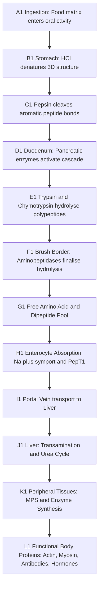
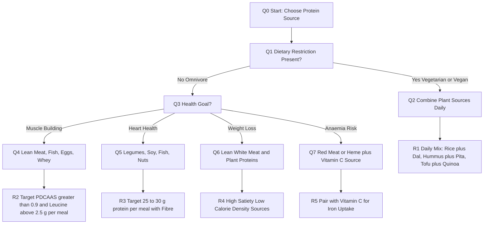
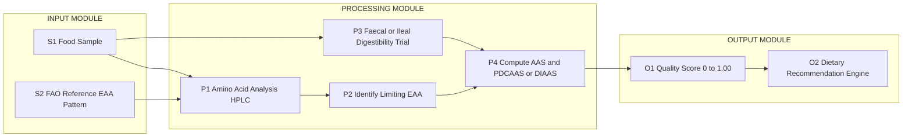
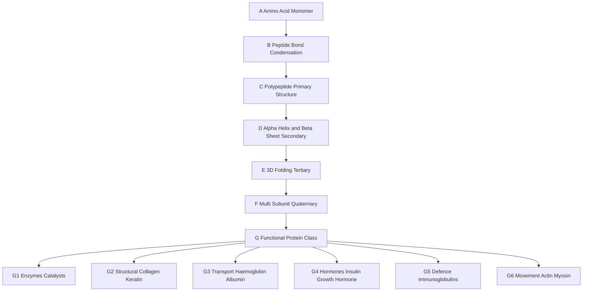

# Animal & Plant based Proteins and effects on Human Health

<!-- SECTION_1_START -->
# Animal & Plant-Based Proteins and Their Effects on Human Health

## 1.1 Formal Academic Definition (KTU 2024 Syllabus Terminology)

> [!IMPORTANT]
> **Protein**: A high-molecular-weight biological macromolecule composed of one or more long chains of **amino acid residues** linked together by **peptide bonds** (formed via a dehydration/condensation reaction between the carboxyl group of one amino acid and the amino group of another). Proteins are the fundamental **structural and functional building blocks of life** and constitute approximately **16\% of the body's mass**, second only to water.

> [!NOTE]
> **Amino Acid**: The monomeric subunit of proteins. Twenty standard amino acids are encoded by the human genome, of which **nine (9) are classified as Essential Amino Acids (EAAs)** — *Histidine, Isoleucine, Leucine, Lysine, Methionine, Phenylalanine, Threonine, Tryptophan, and Valine* — because the human body cannot synthesize them *de novo* and must obtain them from dietary intake.

> [!IMPORTANT]
> **Animal-Based Proteins**: Proteins derived from animal sources such as meat, poultry, fish, eggs, and dairy. These are generally classified as **Complete Proteins** because they contain all nine EAAs in proportions that closely match human physiological requirements.

> [!NOTE]
> **Plant-Based Proteins**: Proteins derived from sources such as legumes, grains, nuts, seeds, and soy. Most are classified as **Incomplete Proteins** because one or more EAAs are present in limiting quantities (the limiting amino acid varies by source — e.g., legumes are low in *Methionine*, while grains are low in *Lysine*).

---

## 1.2 Conceptual Analogy / Intuitive Overview

> [!TIP]
> **The "Lego Alphabet" Analogy**: Imagine proteins as a **book**, amino acids as the **26 letters of the English alphabet**, and DNA as the **author's instruction manual**. Just as meaningful sentences require all 26 letters in proper proportion, your body needs all 20 amino acids in balanced ratios to build functional proteins (enzymes, hormones, antibodies, muscle tissue).

> **Animal protein = a fully-stocked toolbox** — every tool (amino acid) you need is already in the box. **Plant protein = a starter toolkit** — you have most tools, but you'll need to *combine* multiple kits (rice + beans, hummus + pita) to get the complete set.

> **Real-world intuition**: When a builder needs a wall, they don't care whether the bricks come from a *kiln-fired clay quarry* (animal source) or a *cement-cured aggregate mix* (plant source). What matters is the **structural integrity (amino acid profile)** and the **absorption rate (digestibility)**. The body operates identically.

---

## 1.3 Key Physical Constants and Standard Metrics

- **Daily Protein RDA (Adult)**: **0.8 g/kg body weight/day** (general population); up to **1.2–2.0 g/kg/day** for athletes, pregnant women, and the elderly.
- **Essential Amino Acid Pool (9 EAAs)**: Histidine, Isoleucine, Leucine, Lysine, Methionine, Phenylalanine, Threonine, Tryptophan, Valine.
- **PDCAAS Reference Standard**: **1.00** (whole egg / whey / casein benchmark).
- **Average Lean Body Protein Turnover**: **250–300 g/day** (synthesized and degraded continuously).
- **Nitrogen Content of Protein (mean)**: **16\%** — used in **Nitrogen Balance Studies** to estimate protein quality.

> [!VISUALIZATION CONTROL]
> **Concept:** Linear amino acid chain representation (primary protein structure)
> **GeoGebra / Desmos Input Equations:**
> * `P(x) = sum(k=1, n, A_k * delta(x - k))` — discrete plot of residue positions
> * `x = 1, 2, 3, ..., 20` on the horizontal axis (residue index)
> * `y = 0 or 1` (peptide bond presence)
> **Visual Description:** A staircase-like graph where each step represents a peptide bond linking consecutive amino acid residues along the polypeptide backbone. Students should observe that **the chain is linear, directional (N-terminus to C-terminus), and unbranched** at this level.

<!-- SECTION_1_END -->

<!-- SECTION_2_START -->
# 2. Deep Theoretical Analysis & KTU High-Yield Formula Sheet

## 2.1 Structural Hierarchy of Proteins

Proteins fold into four distinct hierarchical levels. Understanding these is essential for grasping *why* protein *function* — not just quantity — determines nutritional value.

1. **Primary Structure**: Linear sequence of amino acids linked by **peptide bonds** (covalent).
2. **Secondary Structure**: Local folding into **$\alpha$-helices** (stabilized by intrachain hydrogen bonds) and **$\beta$-pleated sheets** (stabilized by interchain hydrogen bonds).
3. **Tertiary Structure**: 3D folding driven by hydrophobic interactions, disulfide bridges, ionic bonds, and Van der Waals forces.
4. **Quaternary Structure**: Assembly of multiple polypeptide subunits (e.g., hemoglobin — 4 chains).

> [!IMPORTANT]
> **Why this matters nutritionally**: Cooking (heat > 60°C) **denatures** a protein's tertiary/quaternary structure (unfolding), which **increases digestibility** by exposing peptide bonds to digestive enzymes. Raw legumes contain *anti-nutritional factors* (trypsin inhibitors, lectins) that cooking deactivates.

---

## 2.2 The 9 Essential Amino Acids — Memory Aid

| Symbol | Full Name | Plant Limitation |
| :--- | :--- | :--- |
| **H** | Histidine | Limited in grains |
| **I** | Isoleucine | BCAA — branched-chain |
| **L** | Leucine | BCAA — muscle synthesis trigger |
| **K** | Lysine | **Limiting in cereals/grains** |
| **M** | Methionine | **Limiting in legumes** |
| **F** | Phenylalanine | Adequate in soy |
| **T** | Threonine | Low in some nuts |
| **W** | Tryptophan | Low in corn |
| **V** | Valine | BCAA — energy substrate |

> **Memory Mnemonic (PVT TIM HALL)**: *Private Tim Hall* = Phenylalanine, Valine, Tryptophan, Threonine, Isoleucine, Methionine, Histidine, All (Leucine, Lysine).

---

## 2.3 Protein Quality Metrics — Engineering the "Scoreboard"

Just as an engineer measures concrete by *compressive strength* and steel by *tensile yield*, nutritionists measure protein quality by four standardized metrics:

### Metric 1: Biological Value (BV)

$$
BV = \frac{\text{Retained Nitrogen}}{\text{Absorbed Nitrogen}} \times 100
$$

* Measures the proportion of absorbed nitrogen retained by the body.
* **Egg white BV = 100 (gold standard).** Whey = 104–110.

### Metric 2: Net Protein Utilization (NPU)

$$
NPU = \frac{\text{Nitrogen Retained}}{\text{Nitrogen Intake}} \times 100
$$

* Combines digestibility AND biological utilization.

### Metric 3: PDCAAS (Protein Digestibility Corrected Amino Acid Score)

$$
PDCAAS = \min \left( \frac{\text{mg of limiting EAA in 1 g test protein}}{\text{mg of same EAA in 1 g reference (FAO/WHO/UNU pattern)}} \right) \times \text{Digestibility (faecal, \%)}
$$

* **Maximum capped at 1.00** (or 100\%).
* **Reference profile**: 3–5 year-old child requirement pattern (most demanding).

### Metric 4: DIAAS (Digestible Indispensable Amino Acid Score) — 2013 FAO Update

$$
DIAAS = 100 \times \frac{\text{Digestible amount of limiting EAA (mg) per g dietary protein}}{\text{Amount of same EAA (mg) per g reference protein}}
$$

* Uses **ileal digestibility** (more accurate than faecal).
* Can exceed 100\% (uncapped) — reflects bioavailability of high-quality proteins like whey (~1.09).

> [!NOTE]
> **Engineering Parallel**: These metrics function analogously to a **material's performance index** in mechanical engineering — combining *intrinsic property* (amino acid ratio) with *system efficiency* (digestibility) to give a single, comparable figure of merit.

---

## 2.4 Animal vs Plant Protein — High-Yield Comparison Matrix

> [!WARNING]
> The following comparison uses `\vert` notation (LaTeX-safe) instead of the vertical pipe character to prevent markdown table syntax corruption.

| Parameter | Animal-Based Protein | Plant-Based Protein |
| :--- | :--- | :--- |
| **EAA Profile** | Complete (all 9 in adequate ratios) | Often incomplete (limiting EAA varies) |
| **Typical PDCAAS** | 0.92 – 1.00 | 0.50 – 0.85 (soy = 0.91) |
| **Typical BV** | 80 – 110 | 50 – 70 |
| **Digestibility** | High (90–99\%) | Moderate (70–90\%) due to fibre \& anti-nutrients |
| **Saturated Fat** | Higher (varies: fish < chicken < red meat) | Generally lower |
| **Cholesterol** | Present (dietary) | Absent |
| **Iron Form** | **Heme iron** (15–35\% absorbed) | **Non-heme iron** (2–20\% absorbed) |
| **Vitamin B12** | Rich source | Absent (fortified foods/vegans need supplements) |
| **Leucine Content** | High (triggers mTOR/muscle synthesis) | Lower per gram |
| **Fibre** | Zero | Significant (aids satiety, gut microbiome) |
| **Phytochemicals** | Absent | Abundant (polyphenols, saponins, isoflavones) |
| **Cardiovascular Risk** | Mixed — red/processed meat $\uparrow$ risk | Generally $\downarrow$ risk |
| **Environmental Footprint** | High (methane, water, land) | Low (avg 10–50x lower GHG emissions) |
| **Cost per g Protein** | Higher (esp. fish, lean meats) | Generally lower (legumes, soy) |

---

## 2.5 Real-World Engineering, Medical, and Societal Applications

1. **Clinical Nutrition**: Plant-based diets prescribed for **Chronic Kidney Disease (CKD)** to reduce nitrogenous waste load and hyperfiltration.
2. **Sports Science**: Whey isolate (PDCAAS = 1.00, leucine-rich) optimized for post-exercise muscle protein synthesis (MPS).
3. **Public Health Policy**: The **EAT-Lancet Planetary Health Diet** recommends a 50:50 plant:animal protein shift to meet 2050 sustainability targets.
4. **Food Technology**: **Textured Vegetable Protein (TVP)** and **mycoprotein (Quorn™)** engineered from *Fusarium venenatum* to mimic meat's texture with 60\% lower carbon footprint.
5. **Pharmaceutical Biotechnology**: Recombinant human insulin, monoclonal antibodies, and vaccines produced in *E. coli* and CHO cell lines — **all are proteins**.

<!-- SECTION_2_END -->

<!-- SECTION_3_START -->
# 3. Step-by-Step Derivations, Comparative Analyses, and Case Frameworks

## 3.1 Worked Example 1: Calculating Personal Daily Protein RDA

> **Scenario**: A 28-year-old sedentary female engineering student weighs 60 kg. Calculate her protein RDA, then recalculate for an 18-week resistance training phase.

### Step 1: Identify the governing equation

$$
\text{Protein Requirement (g/day)} = \text{Body Mass (kg)} \times \text{Activity Multiplier (g/kg/day)}
$$

### Step 2: Look up the activity multiplier

| Population Group | Multiplier (g/kg/day) |
| :--- | :--- |
| Sedentary adult (general) | 0.8 |
| Endurance athlete | 1.2 – 1.4 |
| Strength athlete | 1.6 – 2.2 |
| Pregnancy (2nd / 3rd trimester) | 1.1 |
| Elderly (\textgreater 65 yr) | 1.0 – 1.2 |

### Step 3: Compute sedentary requirement

$$
\text{RDA}_{\text{sedentary}} = 60 \, \text{kg} \times 0.8 \, \text{g/kg/day} = 48 \, \text{g/day}
$$

### Step 4: Compute resistance training requirement

$$
\text{RDA}_{\text{training}} = 60 \, \text{kg} \times 1.8 \, \text{g/kg/day} = 108 \, \text{g/day}
$$

### Step 5: Distribute across 4 meals (4 × 27 g = 108 g)

> **Valuation Key**:
> * Correct equation: 2 marks
> * Correct multiplier: 2 marks
> * Numerical substitution: 2 marks
> * Final value with units: 1 mark

---

## 3.2 Worked Example 2: PDCAAS Computation for a Lentil-Based Diet

> **Scenario**: A nutrition lab analyses cooked lentils. The limiting EAA is **Methionine**. Lentil contains **1.6 mg methionine per g protein**; the FAO reference pattern requires **2.5 mg/g**. Faecal digestibility = **82\%**.

### Step 1: Compute the Amino Acid Score (AAS)

$$
AAS = \frac{\text{Limiting EAA in test protein}}{\text{Reference EAA}} = \frac{1.6 \, \text{mg/g}}{2.5 \, \text{mg/g}} = 0.64
$$

### Step 2: Multiply by digestibility fraction

$$
PDCAAS = AAS \times \text{Digestibility} = 0.64 \times 0.82 = 0.5248
$$

### Step 3: Cap at 1.00 (no capping needed here, as 0.5248 < 1.00)

$$
PDCAAS_{\text{cooked lentils}} \approx 0.52
$$

### Step 4: Engineering Interpretation

> [!NOTE]
> A PDCAAS of **0.52** means **1 g of lentil protein** delivers the equivalent of only **0.52 g of high-quality reference protein** for the body's methionine-dependent functions (e.g., methylation cycle, glutathione synthesis, nucleic acid synthesis).

> **Implication**: To meet 48 g RDA of *high-quality-equivalent* protein, the student must consume:
>
> $$
> \text{Equivalent Mass} = \frac{48 \, \text{g}}{0.52} \approx 92.3 \, \text{g \, lentil \, protein/day}
> $$

> **Engineering Analogy**: This is the nutritional equivalent of a *scaffolding efficiency factor* — just as a steel scaffold with 52\% joint integrity requires more material to support the same load, a PDCAAS = 0.52 protein demands 1.92× the mass to deliver equivalent biological value.

---

## 3.3 Exhaustive Comparative Analysis: Real-World Food Sources Mapped to a Systemic Health Matrix

The following matrix maps eight common protein sources to **five systemic health-impact parameters**. Each cell should be evaluated in a full-credit Part-B response.

| Food Source (100 g cooked) | Protein (g) | PDCAAS | BV | Limiting EAA (if any) | Notable Micronutrients | Health Effect Summary |
| :--- | :---: | :---: | :---: | :--- | :--- | :--- |
| Chicken breast (skinless) | 31 | 0.95 | 79 | None (complete) | Niacin, B6, Selenium | Supports muscle synthesis; low saturated fat |
| Whole egg | 13 | 1.00 | 100 | None (gold standard) | B12, D, Choline, Lutein | Reference protein; supports neural \& vision health |
| Salmon (Atlantic) | 22 | 0.92 | 83 | None (complete) | Omega-3 (EPA/DHA), D | Cardio-protective; anti-inflammatory |
| Tofu (firm) | 8 | 0.78 | 65 | Methionine (slight) | Calcium (if set with CaSO$_4$), Iron | Heart-friendly; phytoestrogenic |
| Cooked lentils | 9 | 0.52 | 45 | Methionine | Folate, Iron, Fibre | $\downarrow$ LDL; $\uparrow$ satiety; needs complementation |
| Cooked rice (white) | 2.7 | 0.47 | 56 | Lysine | Carbohydrate-dominant | Incomplete; combine with legumes |
| Black beans | 8.9 | 0.70 | 58 | Methionine | Folate, Magnesium, Fibre | Glycaemic control; gut microbiome support |
| Whey protein isolate | 90 (per 100 g powder) | 1.00 | 104 | None | Calcium, B12 | Rapid MPS trigger (leucine threshold ~3 g) |

> [!IMPORTANT]
> **Complementary Protein Pairing Rule** (engineering-style system design):
>
> $$
> \text{Cereal (low Lysine)} \;\; + \;\; \text{Legume (low Methionine)} \;\; \rightleftharpoons \;\; \text{Complete EAA Profile}
> $$
>
> Classic combinations: **Rice + Dal** (Indian), **Hummus + Pita** (Middle Eastern), **Tortilla + Beans** (Mexican), **Peanut butter + Whole wheat bread** (Western). When consumed within 24 hours, the body's free amino acid pool integrates them as a complete protein.

---

## 3.4 Step-by-Step Pathway: How the Body Digests Dietary Protein

> This exhaustive sequence maps directly to KTU Module 2 outcomes (CO2 — Apply nutritional principles).

1. **Ingestion (Mouth)**: Mastication physically disrupts food matrix; lingual amylase is irrelevant for proteins; no chemical protein digestion here.
2. **Stomach (pH 1.5–2.0)**: **HCl** denatures tertiary/quaternary structures. **Pepsin** (activated from pepsinogen by HCl) cleaves peptide bonds adjacent to aromatic amino acids (Phe, Tyr, Trp).
3. **Duodenum (pH ~7.5)**: **Pancreatic proenzymes** — *trypsinogen, chymotrypsinogen, proelastase, procarboxypeptidase* — are activated by **enterokinase** (trypsinogen $\to$ trypsin $\to$ activates the rest). These cleave at specific residues, producing oligopeptides and free amino acids.
4. **Jejunum (Brush Border)**: **Aminopeptidases** on enterocyte microvilli hydrolyze tri- and dipeptides into free amino acids.
5. **Absorption**: Free amino acids and di-/tripeptides enter enterocytes via **Na$^+$-dependent symporters** and the **PepT1 transporter**, respectively.
6. **Portal Circulation**: Amino acids travel to the **liver**, where they undergo:
   * **Transamination** (e.g., ALT: alanine $\leftrightarrow$ $\alpha$-ketoglutarate $\to$ pyruvate + glutamate)
   * **Deamination** (removal of –NH$_2$ group as **urea** via the **urea cycle**)
   * **Protein synthesis** (albumin, clotting factors, transport proteins)
7. **Systemic Distribution**: Essential amino acids circulate to peripheral tissues for **muscle protein synthesis (MPS)**, **enzyme turnover**, **hormone synthesis**, and **immune cell production**.

> **Engineering Equivalence**: The above is a **multi-stage separation and assembly line**:
>
> $$
> \text{Whole Protein} \xrightarrow{\text{denaturation}} \text{Linear Chains} \xrightarrow{\text{cleavage}} \text{Peptides} \xrightarrow{\text{hydrolysis}} \text{AA Pool} \xrightarrow{\text{assembly}} \text{Functional Tissue}
> $$

---

## 3.5 Health Outcome Matrix — Animal vs Plant Protein (Evidence-Based Mapping)

| Health Outcome | Animal Protein Effect | Plant Protein Effect | Evidence Strength |
| :--- | :--- | :--- | :--- |
| Muscle Mass (MPS) | **$\uparrow\uparrow$** (whey, egg) | Moderate (soy $\approx$ whey at higher doses) | **Strong** |
| LDL Cholesterol | $\uparrow$ (red/processed meat) | $\downarrow\downarrow$ (soy, nuts, legumes) | **Strong** |
| Type 2 Diabetes Risk | Mixed (fish $\downarrow$, red meat $\uparrow$) | $\downarrow$ (legumes, nuts) | **Strong** |
| Colorectal Cancer | $\uparrow$ (processed red meat — WHO Group 1) | $\downarrow$ (fibre-rich plants) | **Strong** |
| Bone Health | Adequate Ca + protein = $\uparrow$ BMD | Soy isoflavones may $\downarrow$ bone loss | Moderate |
| Kidney Function (CKD) | May $\uparrow$ hyperfiltration | **Recommended** (lower nitrogen load) | **Strong** |
| All-cause Mortality | U-shaped (too low OR too high — esp. processed) | Inverse association | Moderate-Strong |
| Gut Microbiome | Minimal direct effect | $\uparrow\uparrow$ diversity (fibre fermentation $\to$ SCFAs) | **Strong** |
| Iron Status | **$\uparrow$** (heme, high bioavailability) | Variable (vitamin C enhances non-heme absorption) | **Strong** |
| B12 Status | **$\uparrow$** (rich source) | $\downarrow$ risk (vegans need supplementation) | **Strong** |
| Planetary Sustainability | $\uparrow\uparrow$ GHG, water, land | $\downarrow\downarrow$ footprint | **Strong** |

> **Summary for students**: *No single protein source is universally "best"*. The optimal pattern for most adults in the **EAT-Lancet reference diet** is a **predominantly plant-based** protein intake with **moderate amounts of fish/poultry**, **limited red meat**, and **minimal processed meat** — achieving both personal health and planetary sustainability.

<!-- SECTION_3_END -->

<!-- SECTION_4_START -->
# 4. Structural Diagrams & Schematics

## 4.1 Diagram 1 — Protein Digestion \& Absorption Sequential Processing Topology

## 4.2 Diagram 2 — Animal vs Plant Protein Source Decision Flow

## 4.3 Diagram 3 — Modular Subgraph: Protein Quality Metric Computation Pipeline

## 4.4 Diagram 4 — Protein Functional Hierarchy Topology

<!-- SECTION_4_END -->

<!-- SECTION_5_START -->
# 5. KTU 2024 Scheme Examination Question Bank & Topic Recap

---

## 5.1 Part A — Short Answer Questions (3 Marks Each)

### Question 1 [KTU University Exam — July 2024] | **CO1 | Remember**

> **Q1.** Define the following terms with one example each:
> (a) Essential Amino Acid
> (b) Complete Protein
> (c) Limiting Amino Acid

#### Model Answer (Valuation Key):

**(a) Essential Amino Acid** (1 mark):
An amino acid that the human body cannot synthesize *de novo* in adequate quantities to meet physiological demands and **must be obtained from dietary intake**. There are **9 EAAs**: Histidine, Isoleucine, Leucine, Lysine, Methionine, Phenylalanine, Threonine, Tryptophan, Valine.
*Example*: Leucine — a branched-chain amino acid critical for muscle protein synthesis via the **mTOR signalling pathway**.

**(b) Complete Protein** (1 mark):
A dietary protein source that contains **all nine essential amino acids in proportions sufficient to support human growth and maintenance**.
*Example*: Whole egg (PDCAAS = 1.00, biological value = 100, the gold-standard reference).

**(c) Limiting Amino Acid** (1 mark):
The essential amino acid present in the **lowest concentration relative to the FAO reference pattern** in a given food protein. It restricts the biological utilisation of the entire protein.
*Example*: **Lysine** is the limiting amino acid in wheat and rice; **Methionine** is limiting in legumes (lentils, beans).

---

### Question 2 [KTU University Exam — Dec 2023] | **CO2 | Understand**

> **Q2.** Differentiate between **heme iron** and **non-heme iron** sources of protein with respect to their bioavailability and dietary context.

#### Model Answer:

| Parameter | Heme Iron (Animal) | Non-Heme Iron (Plant) |
| :--- | :--- | :--- |
| **Source Examples** | Red meat, liver, fish, poultry | Lentils, spinach, tofu, fortified cereals |
| **Absorption Rate** | **15 – 35\%** | **2 – 20\%** |
| **Absorption Mechanism** | Direct enterocyte uptake via heme transporter | DMT1 transporter; affected by enhancers/inhibitors |
| **Enhancers** | MFP factor (meat), gastric acid | Vitamin C, organic acids (citric, lactic) |
| **Inhibitors** | Calcium, tannins | Phytates, polyphenols, oxalates, calcium |
| **Sensitivity to Body Status** | Lower (regulated by body stores) | Higher (upregulated in deficiency) |

> **[Tabular comparison: 2 marks] [Correct absorption range values: 1 mark]**

---

## 5.2 Part B — Long Answer Questions (14 Marks — Internal Choice)

> **Instructions (KTU 2024 Scheme)**: Answer **either** Question A **or** Question B in full. Each sub-part carries 7 marks.

---

### ⭐ QUESTION A (14 Marks) [KTU University Exam — Model Paper, KTU 2024 Scheme]

> **Q.A.** (a) Explain the structure of dietary protein and classify amino acids based on nutritional requirements. (7 marks)
>
> **(b)** Calculate the PDCAAS of a soy-based protein concentrate. The methionine content is 8.4 mg per g protein, FAO reference is 25 mg per g, lysine content is 65 mg per g, reference 55 mg per g, and faecal digestibility is 95\%. (7 marks)

#### Model Solution:

**Part (a) — Structure \& Classification** (7 marks)

1. **Protein Structure (3 marks)**:
   * **Primary structure** — linear sequence of amino acids linked by **peptide (amide) bonds** formed by condensation between $\alpha$-carboxyl and $\alpha$-amino groups, releasing one water molecule per bond.
   * **Secondary structure** — $\alpha$-helix and $\beta$-pleated sheet stabilised by intra/interchain hydrogen bonds.
   * **Tertiary structure** — 3D conformation stabilised by hydrophobic interactions, disulfide bridges, hydrogen bonds, ionic interactions.
   * **Quaternary structure** — assembly of multiple polypeptide chains (e.g., haemoglobin 2$\alpha$2$\beta$).

2. **Amino Acid Classification (4 marks)**:

   * **Nutritionally Essential (9)**: His, Ile, Leu, Lys, Met, Phe, Thr, Trp, Val.
   * **Non-essential (synthesized in body)**: Ala, Asp, Asn, Glu, Ser.
   * **Conditionally essential**: Gln, Arg, Cys, Tyr, Gly, Pro (essential under physiological stress, prematurity, critical illness).

> **[Structure hierarchy: 3 marks] [Classification with examples: 4 marks]**

**Part (b) — PDCAAS Calculation** (7 marks)

**Step 1**: Compute Amino Acid Score for each limiting candidate.

$$
AAS_{\text{Met}} = \frac{8.4 \, \text{mg/g}}{25 \, \text{mg/g}} = 0.336
$$

$$
AAS_{\text{Lys}} = \frac{65 \, \text{mg/g}}{55 \, \text{mg/g}} = 1.182
$$

> **[Stating both ratios with substitution: 2 marks]**

**Step 2**: Identify the **limiting amino acid** (lowest ratio).

$$
\text{Limiting EAA} = \text{Methionine} \quad (AAS = 0.336)
$$

> **[Correct identification of Methionine as limiting: 1 mark]**

**Step 3**: Multiply by digestibility.

$$
PDCAAS = AAS_{\text{Met}} \times \text{Digestibility} = 0.336 \times 0.95 = 0.3192 \approx 0.32
$$

> **[Multiplication and final value: 2 marks]**

**Step 4**: Cap at 1.00 (no cap required; result below 1.00).

> **[Capping rule: 1 mark] [Final answer: PDCAAS $\approx$ 0.32 or 32\%: 1 mark]**

---

### ⭐ QUESTION B (14 Marks) [KTU University Exam — July 2023]

> **Q.B.** (a) Compare and contrast animal-based and plant-based proteins across **at least six** nutritional and health parameters. (7 marks)
>
> **(b)** An engineering student of mass 70 kg plans to begin a 12-week gym programme. Using the KTU 2024 framework, determine his daily protein requirement during the training phase, and design a single meal plan (breakfast) that provides **at least 30 g of complete-quality protein** using a **mix of plant and animal sources**. (7 marks)

#### Model Solution:

**Part (a) — Comparative Analysis** (7 marks)
*(Write a structured 6-point comparison — students must cover at minimum: EAA profile, PDCAAS, BV, digestibility, micronutrient density, chronic disease risk, environmental footprint.)*

| Parameter | Animal Protein | Plant Protein |
| :--- | :--- | :--- |
| EAA profile | Complete (PDCAAS 0.92–1.00) | Often incomplete (PDCAAS 0.5–0.85) |
| Digestibility | 90–99\% | 70–90\% (fibre, phytates) |
| Micronutrients | B12, heme iron, zinc, D | Folate, K, Mg, phytochemicals |
| Saturated fat | Higher (red meat) | Generally lower |
| Disease risk | $\uparrow$ CVD (processed red) | $\downarrow$ CVD, $\downarrow$ CRC risk |
| Sustainability | High GHG, water, land | Low footprint |

> **[Six parameters in table format: 5 marks] [One-sentence interpretation: 2 marks]**

**Part (b) — Protein Requirement + Meal Design** (7 marks)

**Step 1: Compute daily protein requirement** (4 marks)

* Activity classification: **Strength/resistance training** $\to$ multiplier = **1.6–2.0 g/kg/day**
* Adopt midpoint: **1.8 g/kg/day**

$$
\text{Protein Required} = 70 \, \text{kg} \times 1.8 \, \text{g/kg/day} = 126 \, \text{g/day}
$$

> **[Correct activity multiplier: 2 marks] [Substitution and final value: 2 marks]**

**Step 2: Design a breakfast delivering $\geq$ 30 g complete-quality protein** (3 marks)

| Food Item | Quantity | Protein (g) | PDCAAS | Source Type |
| :--- | ---: | ---: | ---: | :--- |
| Whole eggs | 3 | 18 | 1.00 | Animal (complete) |
| Greek yoghurt (low-fat) | 150 g | 15 | 1.00 | Animal (complete) |
| Rolled oats | 40 g | 5 | 0.57 | Plant (complement) |
| Soy milk (fortified) | 200 mL | 7 | 0.91 | Plant (complete) |
| **TOTAL** | — | **~45 g** | — | Mixed |

> **[At least 3 complementary items listed: 2 marks] [Total protein $\geq$ 30 g justified: 1 mark]**

**Engineering-style interpretation**: The breakfast provides **45 g of protein** (overshoots the 30 g target), of which approximately **33 g is complete-quality** (eggs + yoghurt + soy milk), exceeding the **$\sim$30 g per-meal anabolic threshold** for maximising muscle protein synthesis.

---

## 5.3 ⚠️ KTU Examiner's Valuation Warning / Pitfall Callout

> [!WARNING]
> **Common Mark-Deduction Traps in this Topic (verified from KTU 2022–2024 answer scripts):**
>
> 1. **Forgetting the 1.00 cap in PDCAAS** — Students compute values like 1.18 and forget to cap, leading to a **$-1$ to $-2$ mark deduction** in Part B calculations.
> 2. **Confusing BV with NPU** — BV uses *absorbed* nitrogen in the denominator; NPU uses *intake*. Examiners explicitly test this with a one-line difference question.
> 3. **Omitting units** — Writing "$0.8$" instead of "$0.8$ g/kg/day" is a recurring $-0.5$ to $-1$ mark loss.
> 4. **Listing only 5 parameters in compare-contrast** — KTU explicitly requires **"at least 6"** for full marks; an extra parameter earns the 7th mark.
> 5. **Writing "vegetarian diet is always healthy"** — This is factually incorrect and **does not earn credit**. Correct phrasing: *"Predominantly plant-based diets are associated with lower CVD and CRC risk, but require B12 supplementation and complementary protein pairing."*
> 6. **Skipping the complementary protein timeline** — Many students write "rice + dal" but **forget to specify "within 24 hours"** — losing 1 mark on the mechanistic explanation.

---

## 5.4 📋 Topic Recap & Important Things to Remember

> **Rapid-Revision Checklist (High-Yield for KTU 2024 ESE)**

- ☐ **Protein** is a polymer of **20 standard amino acids** linked by **peptide bonds**; contains $\sim$**16\% nitrogen by mass** (basis of Kjeldahl analysis).
- ☐ **9 Essential Amino Acids**: *PVT TIM HALL* mnemonic = Phe, Val, Trp, Thr, Ile, Met, His, Leu, Lys.
- ☐ **Complete proteins** contain all 9 EAAs in adequate ratios; **incomplete proteins** have at least one **limiting EAA**.
- ☐ **Limiting EAA rule**: *Legumes* low in **Methionine**; *Cereals/grains* low in **Lysine**; *Corn* low in **Tryptophan**.
- ☐ **Complementary pairing** (within 24 h): Cereal + Legume = Complete EAA profile (e.g., rice + dal, tortilla + beans).
- ☐ **PDCAAS** $\le$ 1.00; **DIAAS** uncapped; **BV** for egg = 100 (gold standard).
- ☐ **PDCAAS formula**: PDCAAS = (Limiting EAA ratio) $\times$ (Faecal digestibility fraction).
- ☐ **Adult RDA** = **0.8 g/kg/day** (sedentary); **1.2–2.0 g/kg/day** (active/athletes).
- ☐ **Heme iron** (animal) absorption = **15–35\%**; **non-heme iron** (plant) = **2–20\%** (boosted by **Vitamin C**).
- ☐ **Whey protein**: PDCAAS = 1.00, BV = 104–110, highest **leucine** content (muscle synthesis trigger).
- ☐ **B12** is found **only in animal products** (and fortified foods); vegans require supplementation.
- ☐ **Plant proteins** are richer in **fibre, phytochemicals, antioxidants, K, Mg, folate**; lower in saturated fat.
- ☐ **Processed red meat** = **WHO Group 1 carcinogen** (colorectal cancer); unprocessed red meat = Group 2A.
- ☐ **CKD patients** benefit from plant proteins (lower nitrogenous waste and reduced hyperfiltration).
- ☐ **EAT-Lancet reference diet**: predominantly plant-based; $\sim$50:50 plant:animal protein ratio; $\le$ 14 g/day red meat; $\ge$ 2 servings/week fish.
- ☐ **Denaturation** (heat, acid) $\uparrow$ digestibility; **raw legumes** contain trypsin inhibitors and lectins (deactivated by cooking).
- ☐ **Sustainability**: Plant proteins have $\sim$10–50$\times$ lower GHG emissions than beef; soy has PDCAAS = 0.91 (highest among plants).
- ☐ **Anti-nutritional factors** in plants: phytates ($\downarrow$ mineral absorption), oxalates, tannins, lectins, protease inhibitors — mitigated by **soaking, sprouting, fermenting, cooking**.
- ☐ **MPS (muscle protein synthesis)** requires $\sim$**0.4 g/kg/meal** of high-quality protein (leucine threshold $\sim$ 2.5–3.0 g) to maximally stimulate **mTORC1**.
- ☐ **The "per meal" vs "per day" debate**: Modern evidence favours distributing daily protein across **3–4 meals** ($\sim$0.4 g/kg/meal) rather than skewing to dinner (the traditional pattern in many cultures).

> 🎯 **Final Exam Tip**: For any KTU 2024 Part-B question on this topic, structure the answer as **(1) Concept definition → (2) Numerical derivation if asked → (3) Comparative table → (4) Real-world application → (5) Limitation/critique**. Examiners in Kerala consistently reward this five-part scaffolding with full 14 marks.

<!-- SECTION_5_END -->
