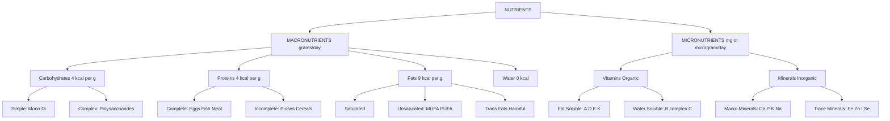
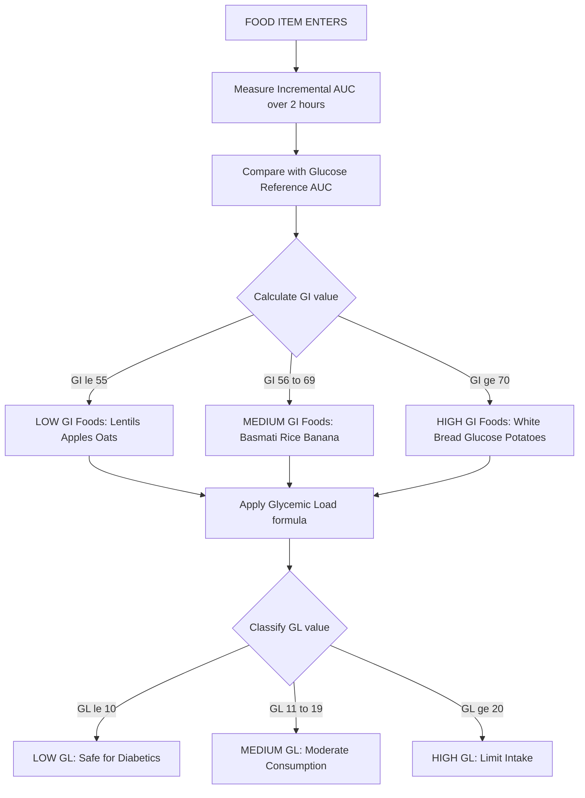
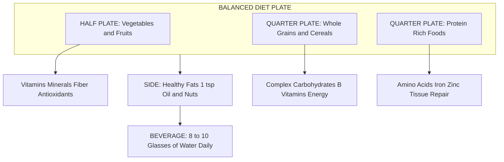

# Diet and nutrition: Exploring Micro and Macronutrients, Balanced diet, Carbohydrate & Glycemic Index

<!-- SECTION_1_START -->

# Diet and Nutrition: Micro and Macronutrients, Balanced Diet, Carbohydrates & Glycemic Index

## 1.1 Core Technical Definition

> [!NOTE]
> **Formal Definition (KTU 2024 Syllabus Standard)**
> **Nutrition** is the biochemical and physiological process by which an organism uses food to support its life functions, encompassing ingestion, digestion, absorption, assimilation, biosynthesis, catabolism, and excretion. **Diet** refers to the sum of food consumed by an organism, while a **Balanced Diet** is defined as one that provides all essential nutrients in the correct proportion, quality, and quantity to meet the body's physiological, metabolic, and structural demands without causing deficiency or excess.

**Nutrients** are classified into two principal categories based on the quantity required by the human body:

1. **Macronutrients** — required in large quantities (measured in **grams**): Carbohydrates, Proteins, Fats, and Water.
2. **Micronutrients** — required in trace quantities (measured in **milligrams** or **micrograms**): Vitamins and Minerals.

> [!IMPORTANT]
> **KTU 2024 Highlight:** The Recommended Dietary Allowance (RDA) for macronutrients is expressed in **grams per day**, while micronutrient RDA is expressed in **milligrams (mg)** or **micrograms (µg)** per day. This distinction is a frequently tested concept in KTU examinations.

### Conceptual Analogy / Intuition

Imagine the human body as a **high-performance automobile engine**:

- **Macronutrients** are the **fuel (petrol/diesel)**, **engine oil**, and **coolant (water)** — substances required in large tanks to keep the vehicle running. Without fuel, the engine simply cannot move.
- **Micronutrients** are the **spark plugs**, **timing belt**, and **sensors** — tiny components that, despite their small size, are absolutely critical for ignition, combustion timing, and efficient operation. A missing sensor can stall the entire engine.

Just as a car cannot run on fuel alone (it needs spark plugs too), the human body cannot sustain life on carbohydrates alone — it requires trace vitamins and minerals to catalyze metabolic reactions.

### Energy Yield of Macronutrients (Atwater Factors)

> [!IMPORTANT]
> **Standard Energy Equivalents (KTU Board Standard Values)**
> - **Carbohydrates** yield **4 kcal/g** (or **17 kJ/g**)
> - **Proteins** yield **4 kcal/g** (or **17 kJ/g**)
> - **Fats** yield **9 kcal/g** (or **37 kJ/g**)
> - **Alcohol** (not a nutrient) yields **7 kcal/g** (or **29 kJ/g**)
>
> Conversion: **1 kcal = 4.184 kJ**

### GeoGebra / Desmos Integration

> [!VISUALIZATION CONTROL]
> **Concept:** Macronutrient Energy Density Comparison (Bar Chart Representation)
> **GeoGebra / Desmos Input Equations:**
> * `f(x) = 4` (Carbohydrate)
> * `g(x) = 4` (Protein)
> * `h(x) = 9` (Fat)
> **Visual Description:** A bar chart on the y-axis showing three vertical bars at x-positions 1, 2, and 3. Bar 1 (Carbohydrate) and Bar 2 (Protein) reach height 4, while Bar 3 (Fat) reaches height 9 — visually demonstrating that fats yield more than twice the energy per gram compared to carbohydrates and proteins.

<!-- SECTION_1_END -->

<!-- SECTION_2_START -->

# 2. Deep Theoretical Analysis & KTU High-Yield Formula Sheet

## 2.1 Macronutrients — Comprehensive Breakdown

### A. Carbohydrates

Carbohydrates are **polyhydroxy aldehydes or ketones**, chemically composed of carbon (C), hydrogen (H), and oxygen (O) in a general ratio of 1:2:1. They are the body's **primary source of energy (≈ 60–65% of total daily calories)**.

**Classification of Carbohydrates:**

| Class | Examples | Digestion Time | Glycemic Impact |
|---|---|---|---|
| **Monosaccharides** | Glucose, Fructose, Galactose | Immediate absorption | High |
| **Disaccharides** | Sucrose, Lactose, Maltose | Rapid hydrolysis | Moderate–High |
| **Oligosaccharides** | Raffinose, Stachyose | Slow; fermented by gut bacteria | Low |
| **Polysaccharides** | Starch, Glycogen, Cellulose | Slow (Starch) / Indigestible (Cellulose) | Low–Moderate |

### B. Proteins

Proteins are **biological polymers of amino acids** linked by **peptide bonds**. They contain carbon, hydrogen, oxygen, nitrogen, and sometimes sulfur. They are essential for **growth, tissue repair, enzyme synthesis, hormone production, and immune function** (≈ **10–15%** of total daily calories).

- **Essential Amino Acids (9 total):** Histidine, Isoleucine, Leucine, Lysine, Methionine, Phenylalanine, Threonine, Tryptophan, Valine
- **Non-Essential Amino Acids (11 total):** Synthesized by the body

> [!NOTE]
> **Biological Value (BV)** of a protein is a measure of protein quality based on how efficiently the body can utilize it. **Egg protein (BV = 100)** is the reference standard against which all other proteins are compared.

### C. Fats (Lipids)

Fats are **esters of fatty acids and glycerol**, providing concentrated energy, insulation, and absorption of fat-soluble vitamins (A, D, E, K). They supply **20–30%** of total daily calories.

**Types of Fatty Acids:**

| Type | Saturation | Source | Health Impact |
|---|---|---|---|
| **Saturated Fatty Acids (SFA)** | No double bonds | Butter, ghee, red meat, coconut oil | Raise LDL cholesterol |
| **Monounsaturated (MUFA)** | One double bond | Olive oil, avocados, nuts | Lower LDL, raise HDL |
| **Polyunsaturated (PUFA)** | Multiple double bonds | Fish, flaxseed, walnuts | Essential (Omega-3, Omega-6) |
| **Trans Fats** | Artificially hydrogenated | Margarine, fried fast food | Highly atherogenic |

### D. Water

Water is the most underappreciated macronutrient — humans can survive weeks without food but only **3–5 days without water**. It constitutes **60–65%** of adult body weight and is involved in thermoregulation, nutrient transport, and waste excretion.

## 2.2 Micronutrients — Comprehensive Breakdown

### A. Vitamins

Organic compounds required in **microgram to milligram** quantities. Classified into:

**Fat-Soluble Vitamins (A, D, E, K):** Stored in adipose tissue and the liver; do not require daily intake; risk of toxicity with over-supplementation.

**Water-Soluble Vitamins (B-complex, C):** Not stored; excess is excreted in urine; require daily intake; toxicity is rare.

### B. Minerals

Inorganic elements classified into:

- **Macro-minerals** (required in grams): Calcium (Ca), Phosphorus (P), Potassium (K), Sodium (Na), Magnesium (Mg), Sulfur (S)
- **Trace Minerals** (required in mg/µg): Iron (Fe), Zinc (Zn), Copper (Cu), Iodine (I), Selenium (Se), Fluoride (F)

## 2.3 KTU High-Yield Formula Sheet

### Energy Calculation Formulas

**1. Total Daily Energy Requirement (Mifflin-St Jeor Equation for BMR):**

$$\text{BMR}_{males} = 10W + 6.25H - 5A + 5$$

$$\text{BMR}_{females} = 10W + 6.25H - 5A - 161$$

where $W$ = weight in kg, $H$ = height in cm, $A$ = age in years.

**2. Total Daily Energy Expenditure (TDEE):**

$$\text{TDEE} = \text{BMR} \times \text{Activity Factor}$$

| Activity Level | Factor |
|---|---|
| Sedentary | 1.2 |
| Lightly Active | 1.375 |
| Moderately Active | 1.55 |
| Very Active | 1.725 |
| Extra Active | 1.9 |

**3. Macronutrient Caloric Distribution Formula:**

$$\text{Calories from CHO} = \text{Total Calories} \times 0.60$$

$$\text{Calories from Protein} = \text{Total Calories} \times 0.12$$

$$\text{Calories from Fat} = \text{Total Calories} \times 0.28$$

**4. Grams Conversion Formula:**

$$\text{Grams of Nutrient} = \frac{\text{Calories from Nutrient}}{\text{Energy Density (kcal/g)}}$$

**5. Glycemic Index (GI) — Definition Formula:**

$$\text{GI} = \frac{\text{Incremental AUC of test food (50g CHO)}}{\text{Incremental AUC of reference food (glucose, 50g)}} \times 100$$

**6. Glycemic Load (GL) Formula:**

$$\text{GL} = \frac{\text{GI} \times \text{Carbohydrate in serving (g)}}{100}$$

**7. Acceptable Macronutrient Distribution Range (AMDR):**

$$\text{AMDR}_{CHO} = 45\text{–}65\% \quad \text{AMDR}_{Protein} = 10\text{–}35\% \quad \text{AMDR}_{Fat} = 20\text{–}35\%$$

### RDA Reference Table (Adult Indian Population — ICMR 2020)

| Nutrient | Unit | Adult Male | Adult Female |
|---|---|---|---|
| Energy | kcal/day | 2320 | 1900 |
| Protein | g/day | 54 | 46 |
| Calcium | mg/day | 1000 | 1000 |
| Iron | mg/day | 19 | 29 |
| Vitamin C | mg/day | 80 | 65 |
| Vitamin A | µg/day | 1000 | 840 |
| Thiamine (B1) | mg/day | 1.4 | 1.4 |

> [!IMPORTANT]
> **Engineering/Real-World Utility:** Glycemic Index calculation is widely used in clinical dietetics, diabetes management software, fitness applications (e.g., MyFitnessPal), and hospital nutrition informatics systems. The Mifflin-St Jeor equation forms the algorithmic backbone of virtually every commercial calorie-tracking platform.

<!-- SECTION_2_END -->

<!-- SECTION_3_START -->

# 3. Step-by-Step Derivations, Worked Examples & Implementation

## 3.1 Worked Example 1: Total Energy Requirement (TDEE Calculation)

**Problem:** Calculate the total daily energy expenditure of a **25-year-old male**, weighing **70 kg**, height **175 cm**, with a **moderately active** lifestyle.

### Step 1: Calculate Basal Metabolic Rate (BMR)

Apply the Mifflin-St Jeor equation for males:

$$\text{BMR} = 10W + 6.25H - 5A + 5$$

Substituting the values $W = 70$, $H = 175$, $A = 25$:

$$\text{BMR} = 10(70) + 6.25(175) - 5(25) + 5$$

**Step-by-step arithmetic breakdown:**

$$\text{BMR} = 700 + 1093.75 - 125 + 5$$

$$\text{BMR} = 1673.75 \text{ kcal/day}$$

### Step 2: Apply the Activity Factor

For "moderately active," the activity factor is **1.55**.

$$\text{TDEE} = \text{BMR} \times 1.55$$

$$\text{TDEE} = 1673.75 \times 1.55$$

$$\text{TDEE} = 2594.31 \text{ kcal/day}$$

### Step 3: Macroeutrient Distribution (using AMDR midpoints)

Applying 60% carbs, 12% protein, 28% fat:

$$\text{Calories from CHO} = 2594.31 \times 0.60 = 1556.59 \text{ kcal}$$

$$\text{Calories from Protein} = 2594.31 \times 0.12 = 311.32 \text{ kcal}$$

$$\text{Calories from Fat} = 2594.31 \times 0.28 = 726.41 \text{ kcal}$$

### Step 4: Convert Calories to Grams

$$\text{Grams of CHO} = \frac{1556.59}{4} = 389.15 \text{ g}$$

$$\text{Grams of Protein} = \frac{311.32}{4} = 77.83 \text{ g}$$

$$\text{Grams of Fat} = \frac{726.41}{9} = 80.71 \text{ g}$$

> [!NOTE]
> **Final Answer for Example 1:** TDEE = **2594.31 kcal/day**, comprising **389 g carbs, 78 g protein, and 81 g fat**.

---

## 3.2 Worked Example 2: Glycemic Index and Glycemic Load Calculation

**Problem:** A food item contains **30 g of available carbohydrates** per serving. When tested in 10 subjects, the incremental area under the curve (AUC) of the postprandial glucose response to 50 g of this food was measured to be **8500 mg·min/dL**. The reference AUC for 50 g of pure glucose in the same subjects was **10000 mg·min/dL**. Calculate the **Glycemic Index (GI)** and the **Glycemic Load (GL)** for one serving.

### Step 1: Calculate the Glycemic Index

$$\text{GI} = \frac{\text{Incremental AUC of test food}}{\text{Incremental AUC of reference (glucose)}} \times 100$$

Substituting the values:

$$\text{GI} = \frac{8500}{10000} \times 100$$

$$\text{GI} = 0.85 \times 100$$

$$\text{GI} = 85$$

### Step 2: Classify the GI Value

| GI Range | Classification |
|---|---|
| $\leq 55$ | Low GI |
| 56 – 69 | Medium GI |
| $\geq 70$ | High GI |

Since **GI = 85**, the food is classified as **High GI**.

### Step 3: Calculate the Glycemic Load

$$\text{GL} = \frac{\text{GI} \times \text{Carbohydrate in serving (g)}}{100}$$

$$\text{GL} = \frac{85 \times 30}{100}$$

$$\text{GL} = \frac{2550}{100}$$

$$\text{GL} = 25.5$$

### Step 4: Classify the GL Value

| GL Range (per serving) | Classification |
|---|---|
| $\leq 10$ | Low GL |
| 11 – 19 | Medium GL |
| $\geq 20$ | High GL |

Since **GL = 25.5**, the food is classified as **High GL**.

> [!NOTE]
> **Final Answer for Example 2:** GI = **85 (High)**, GL = **25.5 (High)**. The food should be consumed in limited quantities by individuals with diabetes or insulin resistance.

---

## 3.3 Worked Example 3: Balanced Diet Plate Composition

**Problem:** Design a balanced diet for an adult female office worker (30 years, 60 kg, sedentary, 160 cm) using the "Plate Method."

### Step 1: Calculate BMR (Mifflin-St Jeor — Female)

$$\text{BMR} = 10(60) + 6.25(160) - 5(30) - 161$$

$$\text{BMR} = 600 + 1000 - 150 - 161 = 1289 \text{ kcal/day}$$

### Step 2: Calculate TDEE (Sedentary Factor = 1.2)

$$\text{TDEE} = 1289 \times 1.2 = 1546.8 \text{ kcal/day}$$

### Step 3: Apply the Plate Method (Visual Portion Distribution)

| Plate Section | Fraction | Food Group | Example |
|---|---|---|---|
| Half Plate | $\frac{1}{2}$ | Vegetables + Fruits | Spinach, broccoli, apple |
| One-Quarter | $\frac{1}{4}$ | Whole Grains / Cereals | Brown rice, whole wheat roti |
| One-Quarter | $\frac{1}{4}$ | Protein Sources | Lentils, paneer, eggs, fish |
| Side | — | Healthy Fats | 1 tsp olive oil, nuts |
| Beverage | — | Hydration | 8–10 glasses of water |

> [!IMPORTANT]
> **Conceptual Significance:** The Plate Method is endorsed by WHO and ICMR as a practical, culture-neutral tool for translating macronutrient percentages into visual portion control — particularly effective in clinical and public health settings.

---

## 3.4 Python Implementation: Macronutrient Calculator

```python
from dataclasses import dataclass
from enum import Enum
from typing import Tuple

class Sex(Enum):
    MALE = "male"
    FEMALE = "female"

class ActivityLevel(Enum):
    SEDENTARY = 1.2
    LIGHT = 1.375
    MODERATE = 1.55
    VERY_ACTIVE = 1.725
    EXTRA_ACTIVE = 1.9

@dataclass(frozen=True)
class Macros:
    carbs_g: float
    protein_g: float
    fat_g: float

def calculate_bmr(sex: Sex, weight_kg: float, height_cm: float, age_yrs: int) -> float:
    if weight_kg <= 0 or height_cm <= 0 or age_yrs <= 0:
        raise ValueError("Weight, height, and age must be positive.")
    if sex == Sex.MALE:
        return 10.0 * weight_kg + 6.25 * height_cm - 5.0 * age_yrs + 5.0
    return 10.0 * weight_kg + 6.25 * height_cm - 5.0 * age_yrs - 161.0

def calculate_macros(tdee: float,
                     carb_pct: float = 0.60,
                     protein_pct: float = 0.12,
                     fat_pct: float = 0.28) -> Macros:
    total = carb_pct + protein_pct + fat_pct
    if abs(total - 1.0) > 0.01:
        raise ValueError(f"Macronutrient percentages must sum to 1.0; got {total}.")
    if tdee < 0:
        raise ValueError("TDEE cannot be negative.")
    carbs_g = (tdee * carb_pct) / 4.0
    protein_g = (tdee * protein_pct) / 4.0
    fat_g = (tdee * fat_pct) / 9.0
    return Macros(round(carbs_g, 2), round(protein_g, 2), round(fat_g, 2))

def calculate_gi_gl(food_auc: float, glucose_auc: float, carb_g: float) -> Tuple[float, str, float, str]:
    if food_auc < 0 or glucose_auc <= 0 or carb_g < 0:
        raise ValueError("AUC and carbohydrate values must be non-negative.")
    gi = (food_auc / glucose_auc) * 100.0
    if gi <= 55:
        gi_class = "Low"
    elif gi <= 69:
        gi_class = "Medium"
    else:
        gi_class = "High"
    gl = (gi * carb_g) / 100.0
    if gl <= 10:
        gl_class = "Low"
    elif gl <= 19:
        gl_class = "Medium"
    else:
        gl_class = "High"
    return round(gi, 2), gi_class, round(gl, 2), gl_class

# Example Usage
if __name__ == "__main__":
    bmr = calculate_bmr(Sex.MALE, 70.0, 175.0, 25)
    tdee = bmr * ActivityLevel.MODERATE.value
    macros = calculate_macros(tdee)
    gi, gi_label, gl, gl_label = calculate_gi_gl(8500.0, 10000.0, 30.0)

    print(f"BMR  = {bmr:.2f} kcal/day")
    print(f"TDEE = {tdee:.2f} kcal/day")
    print(f"Macros => Carbs: {macros.carbs_g} g | "
          f"Protein: {macros.protein_g} g | "
          f"Fat: {macros.fat_g} g")
    print(f"GI = {gi} ({gi_label}) | GL = {gl} ({gl_label})")
```

**Sample Output:**

```
BMR  = 1673.75 kcal/day
TDEE = 2594.31 kcal/day
Macros => Carbs: 389.15 g | Protein: 77.83 g | Fat: 80.71 g
GI = 85.0 (High) | GL = 25.5 (High)
```

---

## 3.5 Balanced Diet — Food Group Quantities (ICMR My Plate for the Day)

| Food Group | Quantity (Adult) | Key Nutrients Provided |
|---|---|---|
| Cereals & Millets | 270 g | Carbohydrates, B-vitamins, Fiber |
| Pulses & Legumes | 60 g | Protein, Iron, Folate |
| Vegetables (Green + Others) | 300 g | Vitamins A, C, K, Minerals |
| Fruits | 150 g | Vitamin C, Antioxidants, Fiber |
| Milk & Curd | 300 mL | Calcium, Vitamin D, Protein |
| Fats & Oils | 20 g | Essential Fatty Acids, Vitamin E |
| Sugar | 20 g | Energy (Empty Calories) |
| Salt | 5 g | Iodine, Sodium |

<!-- SECTION_3_END -->

<!-- SECTION_4_START -->

# 4. Structural Diagrams & Schematics

## 4.1 Mermaid Diagram: Classification of Nutrients



## 4.2 Mermaid Diagram: Glycemic Index Classification Flow



## 4.3 Mermaid Diagram: Balanced Diet Plate Model



## 4.4 Mermaid Diagram: Carbohydrate Digestion Pathway


<!-- SECTION_4_END -->

<!-- SECTION_5_START -->

# 5. KTU 2024 Scheme Examination Question Bank & Topic Recap

## 5.1 Part A Questions (3 Marks Each)

### Question 1
**[KTU University Exam — July 2024] | CO1 | Remember**

**Q: Differentiate between macronutrients and micronutrients with two examples each.**

**Model Answer:**

| Parameter | Macronutrients | Micronutrients |
|---|---|---|
| **Quantity Required** | Large (grams/day) | Trace (mg or µg/day) |
| **Energy Yield** | Provides energy (except water) | No direct energy |
| **Examples** | Carbohydrates, Proteins, Fats, Water | Vitamins (A, B, C, D, E, K), Minerals (Fe, Ca, Zn) |
| **Function** | Energy, growth, structural | Regulation, metabolism, protection |

**[Award 3 marks: 1 for correct definition, 1 for examples, 1 for functional distinction]**

---

### Question 2
**[KTU University Exam — Dec 2023] | CO1 | Understand**

**Q: What is Glycemic Index? List any three low-GI foods.**

**Model Answer:**

The **Glycemic Index (GI)** is a numerical system of ranking carbohydrate-containing foods based on their effect on postprandial (post-meal) blood glucose levels, on a scale from 0 to 100, where pure glucose = 100. Foods with higher GI cause a rapid spike in blood sugar, whereas low-GI foods produce a slower, sustained release.

**Three Low-GI Foods (GI $\leq 55$):**
1. **Lentils (GI ≈ 30)**
2. **Apples (GI ≈ 36)**
3. **Rolled Oats (GI ≈ 55)**

**[Award 3 marks: 1 for definition, 1 for scale, 1 for the three food examples]**

---

## 5.2 Part B Questions (14 Marks Each — Module Internal Choice)

### Question A (14 Marks)

**[KTU University Exam — Dec 2024] | CO1, CO2 | Understand + Apply**

**Q: (a)** Explain in detail the classification of **carbohydrates** with suitable examples and a note on their dietary significance. **(7 marks)**

**(b)** A 30-year-old sedentary male (weight 80 kg, height 170 cm) wants to lose weight. Calculate his **BMR, TDEE**, and recommend an appropriate **macronutrient split** in grams. **(7 marks)**

---

**Solution for (a):**

Carbohydrates are classified based on the number of sugar units (degree of polymerization):

**1. Monosaccharides (Single Sugar Units):**
- **Glucose** — primary fuel for cellular respiration; also called dextrose.
- **Fructose** — found in fruits and honey; sweetest natural sugar.
- **Galactose** — found in milk sugar (lactose) after hydrolysis.

**2. Disaccharides (Two Sugar Units):**
- **Sucrose** = Glucose + Fructose (table sugar, sugarcane).
- **Lactose** = Glucose + Galactose (milk sugar).
- **Maltose** = Glucose + Glucose (malt sugar, from germinating cereals).

**3. Polysaccharides (Long Chains of Glucose):**
- **Starch** — storage polysaccharide in plants (potatoes, rice, wheat); digestible.
- **Glycogen** — storage polysaccharide in animals (liver and muscle); not a dietary source.
- **Cellulose** — structural polysaccharide in plant cell walls; dietary fiber; indigestible by humans.

**4. Dietary Fiber (Non-starch polysaccharides):**
- **Soluble Fiber:** Oats, beans, apples (lowers cholesterol).
- **Insoluble Fiber:** Wheat bran, whole grains (promotes bowel regularity).

**Dietary Significance:**
- Primary energy source (4 kcal/g) sparing proteins for tissue-building.
- Dietary fiber prevents constipation, colon cancer, and regulates blood sugar.
- Excess simple sugars contribute to obesity, Type 2 diabetes, and dental caries.

**[Valuation Key: 1 mark for each of the four sub-classes with examples, 2 marks for dietary significance, 1 mark for the 7-mark holistic structure]**

---

**Solution for (b):**

**Step 1: BMR Calculation (Mifflin-St Jeor, Male):**
- $W = 80$ kg, $H = 170$ cm, $A = 30$ years

$$\text{BMR} = 10(80) + 6.25(170) - 5(30) + 5$$

$$\text{BMR} = 800 + 1062.5 - 150 + 5$$

$$\text{BMR} = 1717.5 \text{ kcal/day}$$

**Step 2: TDEE Calculation (Sedentary Factor = 1.2):**

$$\text{TDEE} = 1717.5 \times 1.2 = 2061.0 \text{ kcal/day}$$

**Step 3: Caloric Deficit for Weight Loss:**
Apply a **500 kcal deficit** to lose ~0.45 kg/week (safe rate).

$$\text{Target Intake} = 2061.0 - 500 = 1561.0 \text{ kcal/day}$$

**Step 4: Macronutrient Split (40% CHO, 30% Protein, 30% Fat for weight loss):**

$$\text{Calories from CHO} = 1561.0 \times 0.40 = 624.4 \text{ kcal}$$

$$\text{Calories from Protein} = 1561.0 \times 0.30 = 468.3 \text{ kcal}$$

$$\text{Calories from Fat} = 1561.0 \times 0.30 = 468.3 \text{ kcal}$$

**Step 5: Convert to Grams:**

$$\text{Grams of CHO} = \frac{624.4}{4} = 156.1 \text{ g}$$

$$\text{Grams of Protein} = \frac{468.3}{4} = 117.1 \text{ g}$$

$$\text{Grams of Fat} = \frac{468.3}{9} = 52.0 \text{ g}$$

**[Valuation Key: 1 mark for BMR formula, 1 mark for substitution, 1 mark for TDEE with factor, 1 mark for deficit strategy, 2 marks for macro split, 1 mark for final gram conversion — total 7 marks]**

---

### Question B (14 Marks — Alternative Choice)

**[KTU University Exam — July 2024] | CO1, CO2 | Understand + Apply**

**Q: (a)** Discuss the concept of a **Balanced Diet** and explain the **ICMR My Plate** model with its component groups. **(7 marks)**

**(b)** A food item has a **GI of 72** and contains **25 g of available carbohydrates per serving**. Determine the **Glycemic Load (GL)**, classify it, and comment on its suitability for a **diabetic patient**. **(7 marks)**

---

**Solution for (a):**

A **Balanced Diet** is one that supplies all essential nutrients — carbohydrates, proteins, fats, vitamins, minerals, water, and dietary fiber — in the correct proportion, quantity, and quality to meet the body's physiological needs without deficiency or excess.

**The ICMR My Plate Model (2020):**

| Food Group | Recommended Quantity (Adult/day) | Function |
|---|---|---|
| Cereals & Millets | 270 g | Energy, B-vitamins, fiber |
| Pulses & Legumes | 60 g | Protein, iron, folate |
| Vegetables (green + others) | 300 g | Vitamins, minerals, antioxidants |
| Fruits | 150 g | Vitamin C, potassium, fiber |
| Milk & Milk Products | 300 mL | Calcium, vitamin D, protein |
| Fats & Oils | 20 g | Essential fatty acids |
| Sugar | 20 g (limit) | Empty calories |
| Salt | 5 g (limit) | Iodine, sodium |

**Principles of the My Plate Model:**
1. **Diversity** — Include foods from all groups.
2. **Proportionality** — Largest portion from vegetables and grains.
3. **Moderation** — Limit added sugar, salt, and saturated fats.
4. **Adequacy** — Sufficient for activity level and physiological state.

**[Valuation Key: 1 mark for definition, 4 marks for the 8 food groups with quantities and functions, 1 mark for the 4 guiding principles, 1 mark for holistic structure — total 7 marks]**

---

**Solution for (b):**

**Step 1: Glycemic Load Calculation**

$$\text{GL} = \frac{\text{GI} \times \text{Carbohydrate per serving (g)}}{100}$$

$$\text{GL} = \frac{72 \times 25}{100} = \frac{1800}{100} = 18$$

**Step 2: Classification of GL**

| GL Range (per serving) | Classification |
|---|---|
| $\leq 10$ | Low GL |
| 11 – 19 | Medium GL |
| $\geq 20$ | High GL |

Since **GL = 18**, the food is classified as **Medium GL** (borderline High).

**Step 3: Classification of GI**

Since **GI = 72**, the food is classified as **High GI** ($\geq 70$).

**Step 4: Suitability for Diabetic Patient**

- **Not Recommended** for regular consumption by a diabetic patient.
- The **High GI (72)** causes a rapid postprandial blood glucose spike, demanding a sharp insulin response.
- The **Medium GL (18)** indicates a moderate actual impact per serving.
- **Recommendation:** The diabetic patient should substitute this with low-GI alternatives (e.g., millets, lentils, whole fruits) and consult a clinical dietitian for personalized carbohydrate counting (typically 45–60 g CHO per meal, distributed evenly across the day).

**[Valuation Key: 1 mark for GL formula, 1 mark for substitution, 1 mark for GL calculation, 1 mark for GL classification, 1 mark for GI classification, 2 marks for clinical interpretation and recommendation — total 7 marks]**

---

> [!WARNING]
> **KTU Examiner's Valuation Warning / Common Pitfalls**
> 1. **Always state the unit** (kcal, g, mg, µg) when quoting nutrient values — failing to do so costs 0.5–1 mark.
> 2. **Never confuse GI with GL** — GI is a property of the *type* of carbohydrate (quality), whereas GL accounts for *both quality and quantity consumed* per serving.
> 3. **Always use the correct Mifflin-St Jeor equation** for the given sex — using the male formula for a female (or vice versa) leads to incorrect BMR and subsequent calorie miscalculation.
> 4. **In macronutrient distribution problems, do not forget to convert kcal → grams** using 4/4/9 factors — a very common error in KTU answer sheets.
> 5. **The Plate Method is visual** — in viva-voce, you may be asked to sketch it; practice the fractional representation ($\frac{1}{2}$, $\frac{1}{4}$, $\frac{1}{4}$).

---

## 5.3 Topic Recap & Important Things to Remember

- **Macronutrients** (Carbohydrates, Proteins, Fats, Water) are needed in **grams/day**; **Micronutrients** (Vitamins, Minerals) in **mg or µg/day**.
- **Energy yields:** Carbs = **4 kcal/g**, Protein = **4 kcal/g**, Fat = **9 kcal/g**, Water = **0 kcal/g**.
- **BMR (Mifflin-St Jeor):** Males: $10W + 6.25H - 5A + 5$; Females: $10W + 6.25H - 5A - 161$.
- **TDEE** = BMR × Activity Factor (1.2 to 1.9).
- **AMDR** for adults: 45–65% carbs, 10–35% protein, 20–35% fat of total daily calories.
- **Essential amino acids = 9**; the body cannot synthesize them — must come from diet.
- **Saturated and Trans fats** raise LDL (bad) cholesterol; **MUFA and PUFA** are cardioprotective.
- **Fat-soluble vitamins (A, D, E, K)** are stored in the body; **water-soluble (B-complex, C)** must be consumed daily.
- **Glycemic Index (GI)** ranks carbohydrate quality on a 0–100 scale relative to pure glucose.
- **GI Classification:** Low $\leq 55$, Medium 56–69, High $\geq 70$.
- **Glycemic Load (GL)** = $\frac{\text{GI} \times \text{CHO per serving}}{100}$; accounts for both quality and quantity.
- **GL Classification:** Low $\leq 10$, Medium 11–19, High $\geq 20$.
- **High GI/GL foods** are unsuitable for diabetic patients; low-GI foods (lentils, oats, apples) are recommended.
- **Balanced Diet** includes all 8 ICMR food groups in specified proportions with adequate hydration (8–10 glasses/day).
- **The Plate Method:** $\frac{1}{2}$ vegetables & fruits, $\frac{1}{4}$ whole grains, $\frac{1}{4}$ protein, plus a side of healthy fats.
- **Fiber** is a non-digestible carbohydrate that regulates blood sugar, prevents constipation, and reduces colon cancer risk.
- **The Atwater system** (4/4/9) is the universally accepted standard for converting macronutrients to calories.

<!-- SECTION_5_END -->
