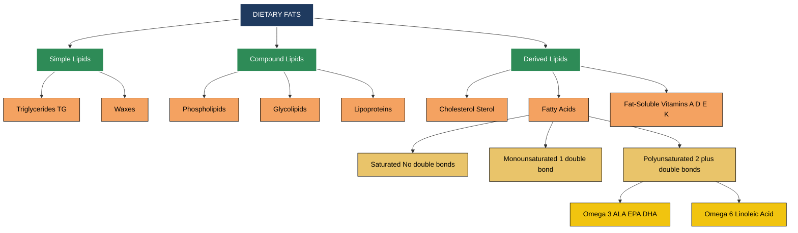
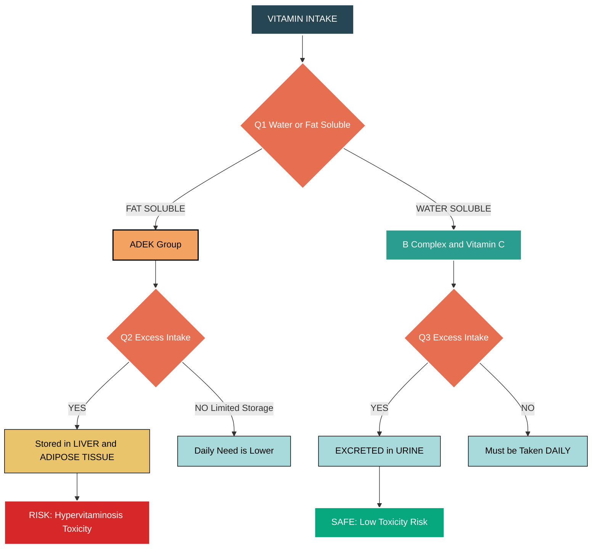
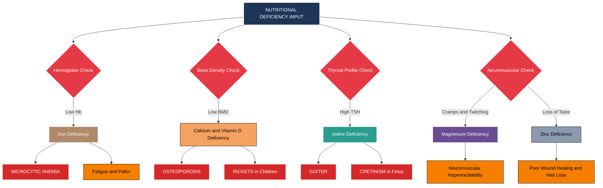

# Dietary Fats & effects on Human Health, Essential Vitamins and Minerals

<!-- SECTION_1_START -->
# Dietary Fats, Essential Vitamins & Minerals: A Comprehensive KTU 2024 Guide

> [!NOTE]
> **Module 2 Learning Anchor:** This note unifies the macronutrient science of **dietary lipids** with the micronutrient physiology of **vitamins and minerals**, forming the biochemical foundation of nutritional wellness for engineering professionals.

## 1.1 Defining Dietary Fats (Lipids)

**Formal Definition:** Dietary fats, scientifically termed *dietary lipids*, are a heterogeneous group of organic compounds that are predominantly **hydrophobic** (water-insoluble) but **lipophilic** (fat-soluble). Chemically, they consist primarily of **triacylglycerols (triglycerides)** — esters formed from one **glycerol** molecule and three **fatty acid** chains — along with **phospholipids**, **sterols** (notably cholesterol), and **lipoproteins** which transport them in aqueous blood plasma.

> [!IMPORTANT]
> **KTU 2024 Syllabus Highlight:** A 70 kg engineering student requires approximately **20–35%** of total daily caloric intake from fats, equating to roughly **44–78 grams** per day as per the *Recommended Dietary Allowance (RDA)* guidelines of the Indian Council of Medical Research (ICMR-NIN, 2020).

### Conceptual Analogy — The "Brick and Mortar" Model

Imagine your **cell membrane** as a brick wall:
- The **fatty acid chains** (long hydrocarbon tails) act like the **bricks**.
- The **phosphate heads** (in phospholipids) act like the **mortar** that holds the bricks together and interfaces with water.
- **Cholesterol** molecules are like **steel reinforcements** wedged between the bricks, providing flexibility and stability.

Without adequate dietary fats, this wall becomes brittle; with excess *trans* or saturated fats, it becomes rigid and prone to inflammation — the molecular basis of **atherosclerosis**.

## 1.2 Defining Vitamins

**Formal Definition:** Vitamins are **organic micronutrients** that an organism requires in **trace quantities** for proper metabolic functioning but **cannot synthesize endogenously** in sufficient amounts. They must therefore be obtained *exogenously* through diet. They function primarily as **coenzymes** or **cofactors** in enzymatic reactions, and as **antioxidants** protecting cellular integrity.

> [!NOTE]
> **Core Classification Rule:** Vitamins are alphabetically split into two solubility groups. The acronym **"ADEK"** denotes fat-soluble vitamins, while the **"B-Complex + C"** group denotes water-soluble vitamins.

## 1.3 Defining Minerals

**Formal Definition:** Dietary minerals are **inorganic chemical elements** (as opposed to carbon-based organic compounds) essential for human physiological functions. They are categorized based on the **quantity** required by the body per day into **macro-minerals** (required in amounts $\geq$ 100 mg/day) and **trace minerals** (required in amounts $\leq$ 100 mg/day).

> [!IMPORTANT]
> **Key Engineering Connection:** Minerals like **Iron (Fe)** are central to **hemoglobin** — the oxygen transport molecule. For a tech professional working at high altitudes (e.g., KTU campuses in Wayanad/Idukki), adequate iron intake directly influences cognitive performance and energy metabolism.

## 1.4 Why This Matters for B.Tech Students

Long coding sessions, **screen-induced eye strain**, sedentary posture, and high-caffeine intake create unique nutritional demands. Deficiencies in **Vitamin A** (eye fatigue), **Vitamin D** (indoor lifestyle), **Magnesium** (muscle cramps), and **Omega-3 fatty acids** (cognitive decline) are *disproportionately* observed in the engineering demographic.

> [!VISUALIZATION CONTROL]
> **Concept:** Daily Macronutrient Energy Distribution Plate
> **Desmos Input Equations:**
> * Fat: $f(x) = 30$ (constant line representing 30% of caloric plate)
> * Protein: $p(x) = 20$
> * Carbohydrates: $c(x) = 50$
> **Visual Description:** A circular plate model divided into 4 quadrants — the largest half (50%) represents carbohydrates, followed by a quadrant for fats (30%) and a smaller wedge for protein (20%). Observe how the *fat wedge*, though smaller, is calorically dense (9 kcal/g vs. 4 kcal/g for carbs).
<!-- SECTION_1_END -->

<!-- SECTION_2_START -->
# Deep Theoretical Analysis & KTU High-Yield Reference

## 2.1 Classification of Dietary Fats

Dietary lipids are systematically classified along **three orthogonal axes**: chemical structure, hydrogen saturation, and source origin.

### 2.1.1 Classification by Saturation (The "Saturation Spectrum")

A **saturated fatty acid (SFA)** contains only **single bonds (C–C)** between carbon atoms, with the maximum number of hydrogen atoms attached. This makes them **solid at room temperature**.

A **monounsaturated fatty acid (MUFA)** contains **exactly one double bond (C=C)**, typically in the *cis* configuration.

A **polyunsaturated fatty acid (PUFA)** contains **two or more double bonds**, creating kinks in the chain and keeping them **liquid at room temperature**.

> [!IMPORTANT]
> **The Geometric Origin of Health Effects:** The *cis* double bond in unsaturated fats creates a **30° bend** in the molecule. This bend prevents tight molecular packing, yielding liquid oils. *Trans* fats, formed during industrial partial hydrogenation, have straighter geometry — mimicking saturated fats biochemically and exhibiting **proven atherogenic properties**.

### 2.1.2 Classification by Essentiality

The human body can synthesize most fatty acids *de novo* except two **essential fatty acids (EFAs)**:

- **Linoleic Acid (LA)** — an **Omega-6 (n-6)** fatty acid. The "6" indicates the first double bond starts at the **6th carbon** from the methyl end.
- **Alpha-Linolenic Acid (ALA)** — an **Omega-3 (n-3)** fatty acid. The "3" indicates the first double bond starts at the **3rd carbon** from the methyl end.

These must be obtained from the diet because mammals lack the **desaturase enzymes** (specifically $\Delta^{12}$ and $\Delta^{15}$) required to insert double bonds at these positions.

### 2.1.3 KTU High-Yield Fats Reference Table

| Category | Chemical Feature | Physical State | Common Sources | Health Effect |
|----------|------------------|----------------|----------------|---------------|
| **Saturated Fats** | All single bonds | Solid (room temp) | Butter, ghee, coconut oil, red meat, palm oil | Raises **LDL cholesterol**; excess linked to CVD |
| **Monounsaturated (MUFA)** | 1 double bond (cis) | Liquid, low melting pt. | Olive oil, groundnut oil, avocado, almonds | Lowers LDL, raises **HDL**; cardioprotective |
| **Polyunsaturated (PUFA)** | $\geq$ 2 double bonds | Liquid even when cold | Sunflower oil, soybean oil, walnuts, flaxseed | Essential for cell membranes; anti-inflammatory |
| **Trans Fats** | Artificial *trans* double bonds | Solid at room temp | Vanaspati, margarine, deep-fried fast food | **Most harmful**: raises LDL, lowers HDL, pro-inflammatory |
| **Omega-3 (n-3)** | First C=C at C3 from CH3 | Liquid | Flaxseed, chia, fatty fish (salmon, sardine) | Anti-inflammatory, brain health, triglyceride reduction |
| **Omega-6 (n-6)** | First C=C at C6 from CH3 | Liquid | Sunflower, corn, sesame oil | Pro-inflammatory in excess; needed in balance |
| **Cholesterol** | Sterol (4-ring structure) | Waxy solid | Animal products only (eggs, shellfish, organ meats) | Precursor of hormones; dietary intake $\leq$ 200 mg/day |

> [!WARNING]
> **The Omega Ratio Rule:** The ideal **Omega-6 : Omega-3 ratio** in the human diet should be approximately **4:1** or lower. Modern processed-food diets push this ratio to **20:1** or higher, driving chronic inflammation — a root cause of metabolic syndrome prevalent among sedentary tech workers.

## 2.2 Classification of Vitamins

### 2.2.1 Fat-Soluble Vitamins (The "ADEK" Group)

These vitamins dissolve in lipids, are stored in the **liver** and **adipose tissue**, and **do not require daily intake**. Excess accumulation can cause **hypervitaminosis** (toxicity).

### 2.2.2 Water-Soluble Vitamins (The "B-Complex + C" Group)

These dissolve in water, are **not stored** significantly in the body, and excess is excreted in **urine**. They require **regular daily intake** to prevent deficiency.

> [!IMPORTANT]
> **The Energy-Yielding Vitamin Rule:** Of all vitamins, only the **B-complex** group is involved in **energy metabolism** (calorie burning). Vitamins A, C, D, E, and K have **zero caloric value** but perform critical regulatory and protective roles.

## 2.3 The KTU Master Vitamin & Mineral Matrix

### 2.3.1 Fat-Soluble Vitamins

| Vitamin | Chemical Name | Key Function | Rich Dietary Sources | Deficiency Disease | Daily RDA (Adult) |
|---------|---------------|--------------|----------------------|--------------------|--------------------|
| **Vitamin A** | Retinol (animal) / $\beta$-Carotene (plant) | Vision (rhodopsin formation), epithelial integrity, immunity, growth | Liver, carrots, sweet potato, spinach, mango, eggs | **Night blindness**, xerophthalmia, keratomalacia | 600 $\mu$g RE (women) / 700 $\mu$g RE (men) |
| **Vitamin D** | Cholecalciferol (D3) / Ergocalciferol (D2) | Calcium & phosphorus absorption, bone mineralization, immune modulation | Sunlight (UVB on skin), fortified milk, cod liver oil, egg yolk | **Rickets** (children), **Osteomalacia** (adults) | 600 IU (15 $\mu$g) |
| **Vitamin E** | Tocopherols (esp. $\alpha$-tocopherol) | Potent **lipid antioxidant**, protects cell membranes from ROS, RBC hemolysis prevention | Wheat germ oil, sunflower seeds, almonds, hazelnuts, spinach | **Hemolytic anemia**, neuromuscular issues, infertility | 15 mg $\alpha$-TE |
| **Vitamin K** | Phylloquinone (K1) / Menaquinone (K2) | **Blood coagulation** (synthesis of prothrombin & clotting factors II, VII, IX, X); bone metabolism (osteocalcin) | Green leafy vegetables (spinach, kale), broccoli, natto, gut bacteria | **Hemorrhagic disease**, prolonged clotting time | 90 $\mu$g (women) / 120 $\mu$g (men) |

### 2.3.2 Water-Soluble Vitamins

| Vitamin | Common Name | Key Function | Rich Sources | Deficiency Disease | Daily RDA |
|---------|-------------|--------------|--------------|--------------------|-----------|
| **Vitamin B1** | Thiamine | Coenzyme in **pyruvate dehydrogenase**; carbohydrate metabolism | Whole grains, legumes, pork, sunflower seeds | **Beriberi** (wet/cardiac, dry/neurological) | 1.1–1.2 mg |
| **Vitamin B2** | Riboflavin | Component of **FAD** and **FMN** coenzymes; energy metabolism | Milk, yogurt, almonds, mushrooms, eggs | **Ariboflavinosis** (cheilosis, glossitis) | 1.1–1.3 mg |
| **Vitamin B3** | Niacin (Nicotinic acid) | Part of **NAD+/NADP+** coenzymes; DNA repair, energy transfer | Meat, fish, peanuts, mushrooms, fortified cereals | **Pellagra** (4 D's: Dermatitis, Diarrhea, Dementia, Death) | 14–16 mg NE |
| **Vitamin B5** | Pantothenic Acid | Part of **Coenzyme A**; fatty acid synthesis/oxidation | Avocado, sweet potato, lentils, mushrooms | Burning feet syndrome (rare) | 5 mg |
| **Vitamin B6** | Pyridoxine | **Amino acid metabolism** (transamination); neurotransmitter synthesis (serotonin, dopamine) | Chickpeas, salmon, potato, banana, poultry | Peripheral neuropathy, microcytic anemia, depression | 1.3 mg |
| **Vitamin B7** | Biotin (Vitamin H) | **Carboxylation reactions**; fatty acid synthesis; keratin production | Egg yolk, almonds, sweet potato, salmon | Hair loss, dermatitis, brittle nails | 30 $\mu$g |
| **Vitamin B9** | Folic Acid (Folacin) | **DNA synthesis**, methylation reactions, RBC formation, neural tube closure in embryo | Dark green leafy vegetables, legumes, asparagus, citrus | **Megaloblastic anemia**, neural tube defects (spina bifida) | 400 $\mu$g DFE |
| **Vitamin B12** | Cyanocobalamin | **Myelin synthesis**, RBC maturation, nerve function | Animal products only: fish, meat, eggs, dairy, fortified foods | **Pernicious anemia**, irreversible nerve damage | 2.4 $\mu$g |
| **Vitamin C** | Ascorbic Acid | **Collagen synthesis**, iron absorption, antioxidant, immune function, wound healing | Citrus fruits, guava, kiwi, amla, bell peppers, broccoli | **Scurvy** (bleeding gums, poor wound healing, bruising) | 75 mg (women) / 90 mg (men) |

### 2.3.3 Macro-Minerals (Required $\geq$ 100 mg/day)

| Mineral | Symbol | Key Function | Rich Sources | Deficiency Manifestation | Daily RDA |
|---------|--------|--------------|--------------|--------------------------|-----------|
| **Calcium** | Ca | Bone/teeth formation, muscle contraction, nerve signaling, blood clotting | Milk, curd, paneer, ragi, sesame seeds, fish with bones | **Osteoporosis**, tetany, dental caries | 1000 mg |
| **Phosphorus** | P | Bone mineralization, ATP energy currency, nucleic acids, pH buffering | Dairy, meat, nuts, whole grains, legumes | Muscle weakness, bone pain (rare) | 700 mg |
| **Potassium** | K | Intracellular fluid balance, nerve impulse transmission, muscle contraction | Banana, sweet potato, spinach, beans, yogurt | Hypokalemia → muscle cramps, arrhythmia, fatigue | 2600 mg (women) / 3400 mg (men) |
| **Sodium** | Na | Extracellular fluid balance, nerve conduction, nutrient transport | Table salt, processed foods, pickles, sauces | Hyponatremia (rare in normal diets) | $\leq$ 2300 mg (upper limit) |
| **Magnesium** | Mg | Co-factor for 300+ enzymes, ATP stabilization, muscle/nerve function | Dark chocolate, almonds, spinach, cashews, avocado | Muscle spasms, anxiety, insomnia, migraines | 310–420 mg |
| **Chlorine** | Cl | Gastric acid (HCl) formation, fluid/electrolyte balance, osmotic pressure | Table salt, seaweeds, celery, tomatoes | Hypochloremia (metabolic alkalosis) | $\leq$ 2300 mg |
| **Sulfur** | S | Component of amino acids (cys, met), B-vitamins, keratin | Eggs, meat, garlic, onion, cruciferous veggies | Rare (deficiency in protein intake) | Adequate with protein |

### 2.3.4 Trace Minerals (Required $\leq$ 100 mg/day)

| Mineral | Symbol | Key Function | Rich Sources | Deficiency Manifestation | Daily RDA |
|---------|--------|--------------|--------------|--------------------------|-----------|
| **Iron** | Fe | Hemoglobin (O2 transport), myoglobin, electron transport chain (cytochromes) | Red meat, liver, jaggery, spinach, lentils, dates | **Iron-deficiency anemia** (microcytic, hypochromic) | 18 mg (women) / 8 mg (men) |
| **Zinc** | Zn | Immune function, wound healing, DNA synthesis, taste/smell, testosterone production | Oysters, red meat, pumpkin seeds, chickpeas, cashews | Growth retardation, alopecia, loss of taste, poor immunity | 8–11 mg |
| **Copper** | Cu | Iron metabolism, connective tissue (lysyl oxidase), antioxidant (SOD) | Shellfish, nuts, seeds, whole grains, dark chocolate | Anemia, neutropenia, Menkes disease (genetic) | 900 $\mu$g |
| **Iodine** | I | Synthesis of **thyroid hormones** (T3, T4); metabolic rate regulation | Iodized salt, seaweed, fish, dairy, eggs | **Goiter**, **cretinism** (in children), hypothyroidism | 150 $\mu$g |
| **Selenium** | Se | Component of **glutathione peroxidase** (antioxidant enzyme); thyroid function | Brazil nuts (richest), tuna, eggs, sunflower seeds | Keshan disease, Kashin-Beck disease | 55 $\mu$g |
| **Manganese** | Mn | Co-factor for SOD, bone formation, carbohydrate metabolism | Whole grains, legumes, pineapple, pecans, tea | Skeletal abnormalities, impaired glucose tolerance | 1.8–2.3 mg |
| **Fluoride** | F | Strengthens tooth enamel, prevents dental caries | Fluoridated water, tea, fish, toothpaste | Increased dental caries | 3–4 mg |
| **Chromium** | Cr | Enhances insulin action (Glucose Tolerance Factor) | Broccoli, barley, oats, green beans, brewer's yeast | Impaired glucose tolerance, insulin resistance | 20–35 $\mu$g |
| **Molybdenum** | Mo | Co-factor for enzymes (xanthine oxidase, sulfite oxidase) | Legumes, grains, nuts | Rare; neurological symptoms | 45 $\mu$g |

## 2.4 Real-World Engineering & Lifestyle Utility

| Application Domain | Specific Nutrient | Practical Relevance |
|--------------------|-------------------|---------------------|
| **Software Developer Eye Health** | Vitamin A, Lutein, Zeaxanthin, Omega-3 | Reduces digital eye strain; protects retinal macula |
| **Hardware Engineer Fatigue** | Iron, B12, Folate | Supports RBC production to combat fatigue from long shifts |
| **Stress & Mental Performance** | B-Complex, Magnesium, Zinc | Cofactors in neurotransmitter synthesis (serotonin, GABA) |
| **Sedentary Lifestyle CVD Risk** | Omega-3 PUFA, Potassium, Magnesium | Counteracts hypertension and dyslipidemia |
| **Late-Night Coding Sessions** | Tryptophan, Vitamin B6, Magnesium | Promotes melatonin synthesis for sleep regulation |
| **Bone Health (Vadagara-style indoor study)** | Vitamin D, Calcium, Phosphorus, Vitamin K2 | Prevents osteopenia from indoor confinement |
<!-- SECTION_2_END -->

<!-- SECTION_3_START -->
# Step-by-Step Derivations, Frameworks & Implementation Logic

## 3.1 Biochemical Derivation: The Omega-3 to Omega-6 Ratio Calculation

> [!IMPORTANT]
> **Engineering Application:** A B.Tech student consuming 2000 kcal/day needs a balanced essential fatty acid intake. The following step-by-step calculation demonstrates how a typical Kerala/Indian diet stacks up against the *ideal* ratio.

### Worked Example 1: Calculating an Individual's Omega-6 : Omega-3 Ratio

**Given Data (Sample Daily Indian Diet):**
- 30 mL sunflower oil (cooking): contains **7.5 g** Linoleic Acid (LA, Omega-6)
- 5 g flaxseed (added to smoothie): contains **1.5 g** Alpha-Linolenic Acid (ALA, Omega-3)
- 100 g fatty fish (sardine curry): contains **0.8 g** EPA + **0.5 g** DHA (long-chain Omega-3)

**Step 1:** Sum up total Omega-6 intake.

$$\text{Total Omega-6 (n-6)} = 7.5 \text{ g (from oil)}$$

**Step 2:** Sum up total Omega-3 intake (combine ALA + EPA + DHA).

$$\text{Total Omega-3 (n-3)} = 1.5 + 0.8 + 0.5 = 2.8 \text{ g}$$

**Step 3:** Compute the ratio.

$$\text{Ratio (n-6 : n-3)} = \frac{7.5}{2.8} \approx 2.68 : 1$$

**Step 4:** Compare to the ideal benchmark.

$$\text{Ideal Ratio} \approx 4:1 \text{ (or lower is preferable)}$$

**Verdict:** This student's ratio of **2.68 : 1** is *excellent* — well within the cardioprotective range, attributable to fish and flaxseed consumption. Without the fish and flaxseed, the ratio would be:

$$\frac{7.5}{0} = \infty : 1 \text{ (severely deficient in Omega-3)}$$

> [!NOTE]
> **Conversion Logic:** ALA from plant sources converts to EPA/DHA in the body at only **5–10% efficiency** for EPA and **2–5%** for DHA. Hence, **direct fish intake is far more efficient** for meeting long-chain Omega-3 needs.

## 3.2 Clinical Framework: Mapping Deficiency to Symptoms (Tabular Algorithm)

The following engineering-style "if-then" diagnostic framework allows systematic identification of nutritional deficiencies.

| Symptom Cluster | Logical Pathway (IF-THEN) | Probable Deficiency |
|-----------------|---------------------------|---------------------|
| Night blindness, dry scaly skin, frequent infections | IF (vision fails in dim light) AND (skin xerosis) → CHECK Vitamin A status | **Vitamin A** |
| Bone pain, muscle weakness, frequent fractures, depression | IF (skeletal pain) AND (low sunlight exposure) → CHECK 25-OH Vitamin D levels | **Vitamin D** |
| Bleeding gums, slow wound healing, frequent bruising | IF (gingival bleeding) AND (poor collagen healing) → CHECK Vitamin C intake | **Vitamin C (Scurvy)** |
| Numbness/tingling in extremities, pallor, fatigue, glossitis | IF (peripheral neuropathy) AND (megaloblastic RBCs) → CHECK B12 + Folate | **Vitamin B12 / Folate** |
| Diarrhea, dermatitis in sun-exposed areas, dementia | IF ("3 D's" of Pellagra) → CHECK Niacin (B3) | **Niacin (Pellagra)** |
| Goiter (swollen neck), fatigue, weight gain, cold intolerance | IF (thyroid enlargement) AND (metabolic slowdown) → CHECK TSH, urinary Iodine | **Iodine** |
| Pica (craving ice/chalk), fatigue, brittle nails, pale skin | IF (microcytic anemia) → CHECK Serum Ferritin, Hemoglobin | **Iron** |
| Muscle cramps, insomnia, anxiety, eyelid twitching | IF (neuromuscular irritability) → CHECK Serum Magnesium | **Magnesium** |
| Hair loss, loss of taste, white spots on nails, poor wound healing | IF (acrodermatitis) AND (dysgeusia) → CHECK Serum Zinc | **Zinc** |
| Prolonged bleeding time, easy bruising (in newborns) | IF (coagulopathy) AND (no liver disease) → CHECK PT/INR, Vitamin K | **Vitamin K** |

## 3.3 Industry Framework: Engineering Case Study Mapping (Comparative Analysis)

The following matrix maps the KTU 2024 humanities framework requirement — *real-world engineering case frameworks to regulatory matrices* — using nutritional policy in tech workplaces.

| Engineering Domain | Real-World Case Scenario | Regulatory/Industry Matrix | Key Nutrients at Stake |
|--------------------|--------------------------|----------------------------|-------------------------|
| **IT Corporate Cafeteria (TCS/Infosys-style)** | Employee wellness programs offering subsidized healthy meals | FSSAI (Food Safety and Standards Authority of India) Eat Right India Movement | Reduced sodium, increased fiber, controlled trans fats ($\leq$ 2% of fat) |
| **Hardware Manufacturing Plants** | Workers exposed to lead, cadmium, heavy metals | OSHA / ISO 45001 Occupational Health Standards | Boosted antioxidant vitamins (C, E, Selenium) to counter oxidative stress |
| **Space Tech (ISRO-style missions)** | Astronauts on long missions facing bone loss due to microgravity | NASA Nutritional Standards for Spaceflight | Calcium, Vitamin D, K2 supplementation to prevent bone demineralization |
| **Construction/Civil Engineering Sites** | Workers in hot Kerala climate, sweating, electrolyte loss | Indian Factory Act + ICMR Guidelines | Sodium, Potassium, Chloride replenishment; iron for anemia prevention |
| **University Hostel Messes (KTU)** | Students consuming unbalanced, deep-fried foods | KTU Health Advisory + National Institute of Nutrition (NIN) guidelines | Reduction of trans fats, mandatory inclusion of vegetables, iodized salt |
| **Long-Haul Trucking Logistics** | Drivers with sedentary lifestyle, irregular meals, caffeine dependence | WHO Global Strategy on Diet, Physical Activity & Health | Omega-3, B-complex, hydration protocols to maintain alertness safely |

## 3.4 Algorithmic Visualization: Vitamin D Synthesis Pathway (Sequential Logic)

> [!IMPORTANT]
> **The Vitamin D Sunshine Equation:** Vitamin D3 synthesis is a photochemical reaction triggered by **Ultraviolet-B (UVB) radiation** (wavelength 290–315 nm) on the skin.

$$\text{7-Dehydrocholesterol (skin)} \xrightarrow{\text{UVB light}} \text{Cholecalciferol (Vitamin D3)}$$

**Sequential activation steps:**

$$\text{Cholecalciferol (D3)} \xrightarrow{\text{Liver, 25-hydroxylase}} \text{25(OH)D (Calcidiol)}$$

$$\text{25(OH)D} \xrightarrow{\text{Kidney, 1-$\alpha$-hydroxylase}} \text{1,25(OH)2D (Calcitriol, ACTIVE FORM)}$$

> [!NOTE]
> **Conversion Logic:** Calcitriol is the **biologically active hormone form** that binds the Vitamin D Receptor (VDR) in the intestine to upregulate **calcium-binding protein (calbindin)**, enabling calcium absorption. A 20-minute midday sun exposure on exposed arms and face yields approximately **10,000–20,000 IU** of Vitamin D3.

## 3.5 Mathematical Model: Calculating Personal Daily Caloric Distribution

For a 22-year-old male B.Tech student, body weight **70 kg**, sedentary activity level (typical coding/lecture schedule).

**Step 1:** Calculate Basal Metabolic Rate (BMR) using **Harris-Benedict Equation**.

$$\text{BMR (males)} = 66.5 + (13.75 \times \text{weight in kg}) + (5.0 \times \text{height in cm}) - (6.76 \times \text{age in years})$$

Assuming height 170 cm, age 22:

$$\text{BMR} = 66.5 + (13.75 \times 70) + (5.0 \times 170) - (6.76 \times 22)$$

$$\text{BMR} = 66.5 + 962.5 + 850 - 148.72 = 1730.28 \text{ kcal/day}$$

**Step 2:** Apply Sedentary Activity Multiplier ($\times$ 1.2).

$$\text{TDEE (Total Daily Energy Expenditure)} = 1730.28 \times 1.2 = 2076.34 \text{ kcal/day}$$

**Step 3:** Distribute calories across macronutrients (50% carbs, 20% protein, 30% fat).

$$\text{Carbohydrate kcal} = 2076.34 \times 0.50 = 1038.17 \text{ kcal} \rightarrow \frac{1038.17}{4} = 259.5 \text{ g carbs}$$

$$\text{Protein kcal} = 2076.34 \times 0.20 = 415.27 \text{ kcal} \rightarrow \frac{415.27}{4} = 103.8 \text{ g protein}$$

$$\text{Fat kcal} = 2076.34 \times 0.30 = 622.90 \text{ kcal} \rightarrow \frac{622.90}{9} = 69.2 \text{ g fat}$$

> [!IMPORTANT]
> **Conversion Logic:** The denominator differs by macronutrient because of the **Atwater factors**: 4 kcal/g for carbs and protein, **9 kcal/g for fat** — making fats the most energy-dense nutrient (2.25× denser than carbs).
<!-- SECTION_3_END -->

<!-- SECTION_4_START -->
# Structural Diagrams & Schematics

## 4.1 Mermaid Diagram: Hierarchical Classification of Dietary Lipids

## 4.2 Mermaid Diagram: Vitamin Solubility & Storage Decision Tree

## 4.3 Mermaid Diagram: Sequential Processing Topology of Lipid Digestion & Absorption

```mermaid
graph LR
    subgraph MOUTH
        M1[Lingual Lipase]:::enzyme
    end
    
    subgraph STOMACH
        S1[Gastric Lipase]:::enzyme
        S2[Emulsification begins]:::process
    end
    
    subgraph SMALL_INTESTINE
        SI1[Bile Salts from LIVER]:::bile
        SI2[Emulsification completes]:::process
        SI3[Pancreatic Lipase]:::enzyme
        SI4[Hydrolysis to FA plus 2 MAG]:::process
    end
    
    subgraph ENTEROCYTE
        E1[Re-esterification to TG]:::process
        E2[Chylomicron Assembly]:::process
        E3[Lymphatic Transport]:::process
    end
    
    subgraph CIRCULATION
        C1[Capillary Lumen]:::process
        C2[Lipoprotein Lipase LPL]:::enzyme
        C3[FA uptake by Adipose and Muscle]:::process
        C4[Chylomicron Remnant to Liver]:::process
    end
    
    M1 --> S1
    S1 --> S2
    S2 --> SI1
    SI1 --> SI2
    SI2 --> SI3
    SI3 --> SI4
    SI4 --> E1
    E1 --> E2
    E2 --> E3
    E3 --> C1
    C1 --> C2
    C2 --> C3
    C2 --> C4
    
    classDef enzyme fill:#e76f51,stroke:#fff,stroke-width:2px,color:#fff
    classDef process fill:#264653,stroke:#fff,stroke-width:1px,color:#fff
    classDef bile fill:#f4a261,stroke:#000,stroke-width:2px,color:#000
```

## 4.4 Mermaid Diagram: Mineral Deficiency to Disease Causal Mapping

<!-- SECTION_4_END -->

<!-- SECTION_5_START -->
# KTU 2024 Scheme Examination Question Bank & Topic Recap

> [!NOTE]
> **Examination Pattern Alignment (KTU 2024 Scheme):** All questions strictly follow the University Examination (ESE) format. Course Outcomes CO1, CO2, CO3, CO4, CO5 are mapped. Bloom's Cognitive Levels span **Remember, Understand, Apply, Analyze, Evaluate** as per Revised Bloom's Taxonomy (RBT).

---

## Part A — Short Answer Questions (2 × 3 Marks = 6 Marks)

### Question 1 [KTU University Exam — July 2024 Pattern | CO1 | RBT: Remember]

**Differentiate between fat-soluble and water-soluble vitamins with two examples each.**

**Model Answer (Valuation Key-Ready):**

| Parameter | Fat-Soluble Vitamins | Water-Soluble Vitamins |
|-----------|----------------------|-------------------------|
| **Examples** | Vitamins **A, D, E, K** (mnemonic: **ADEK**) | Vitamin **C** and **B-complex** (B1, B2, B3, B5, B6, B7, B9, B12) |
| **Solubility** | Soluble in fats and oils | Soluble in water |
| **Absorption** | Requires bile salts and dietary fat for absorption | Absorbed directly into the bloodstream |
| **Storage** | Stored in **liver and adipose tissue** | Not stored; excess excreted in urine |
| **Toxicity Risk** | Higher risk of **hypervitaminosis** | Low toxicity risk |
| **Daily Intake** | Not required daily | Required **daily** |
| **Dietary Sources** | Butter, fish oils, leafy greens (K), egg yolk (D) | Fruits, vegetables, whole grains, dairy |

**[Award 3 Marks for clear tabular differentiation with examples and storage distinction.]**

### Question 2 [KTU University Exam — Dec 2023 Pattern | CO2 | RBT: Understand]

**Why are Omega-3 and Omega-6 fatty acids called "essential" fatty acids? State two rich dietary sources for each.**

**Model Answer (Valuation Key-Ready):**

**Definition (1.5 Marks):** Omega-3 (n-3) and Omega-6 (n-6) fatty acids are termed "essential" because the human body **lacks the desaturase enzymes** (specifically $\Delta^{12}$ and $\Delta^{15}$ desaturases) required to introduce double bonds at the **3rd** and **6th** carbon positions (counted from the methyl end) of the fatty acid chain. Therefore, these fatty acids **must be obtained from the diet** to prevent deficiency disorders.

**Sources of Omega-3 (Linolenic acid) (0.75 Mark):** Flaxseeds, chia seeds, walnuts, fatty fish (salmon, sardine, mackerel), soybean oil.

**Sources of Omega-6 (Linoleic acid) (0.75 Mark):** Sunflower oil, corn oil, sesame oil, safflower oil, evening primrose oil, poultry.

---

## Part B — Long Answer Questions with Internal Choice (1 × 14 Marks = 14 Marks)

### Question A (14 Marks) [KTU University Exam — Model Paper Pattern | CO1, CO2 | RBT: Understand, Apply]

#### Part (a) — 7 Marks [RBT: Understand]

**Classify dietary fats based on chemical structure and degree of saturation. Explain the health implications of saturated fats, trans fats, and polyunsaturated fats (PUFAs) on the human cardiovascular system.**

**Model Answer (Valuation Key with Mark Distribution):**

**[Classification header: 1 Mark]**

Dietary fats are classified as:

1. **Simple Lipids** — Triglycerides (95% of dietary fat) and waxes
2. **Compound Lipids** — Phospholipids (e.g., lecithin), glycolipids, lipoproteins
3. **Derived Lipids** — Cholesterol, fatty acids, fat-soluble vitamins

**[Saturated Fats health impact: 2 Marks]**

- Contain only **single (C–C) bonds**; solid at room temperature
- **Sources:** Butter, ghee, coconut oil, palm oil, red meat, cheese
- **Mechanism:** Increase **LDL-cholesterol** ("bad cholesterol") by down-regulating hepatic LDL receptors
- **Effect:** Promote **atherosclerosis** (plaque deposition in arterial walls) → increased risk of **coronary artery disease (CAD)** and ischemic stroke
- ICMR recommends **$\leq$ 10%** of total daily calories from saturated fats

**[Trans Fats health impact: 2 Marks]**

- Artificial *trans* isomers formed during **partial hydrogenation** of vegetable oils (industrial process to make vanaspati/margarine)
- **Sources:** Vanaspati, bakery shortenings, deep-fried fast food, packaged snacks
- **Mechanism:** **Dual harmful effect** — *raise* LDL-cholesterol **and** *lower* HDL-cholesterol ("good cholesterol"); promote systemic **inflammation** and endothelial dysfunction
- **Effect:** Most harmful fat class; FSSAI has mandated reduction to **$\leq$ 2%** of total fat by 2025
- Strongly linked to **myocardial infarction (heart attack)** risk

**[PUFAs health impact: 2 Marks]**

- Contain **two or more double bonds**; remain liquid at low temperatures
- Two key types: **Omega-3 (n-3)** and **Omega-6 (n-6)**
- **Sources:** Sunflower, soybean, corn oils (n-6); flaxseeds, fatty fish (n-3)
- **Mechanism:** Incorporate into **cell membrane phospholipids**, increasing membrane fluidity; **Omega-3** is converted to anti-inflammatory eicosanoids (resolvins, protectins)
- **Effect:** Lower triglycerides, reduce blood pressure, **anti-arrhythmic**, **anti-thrombotic**; protective against CVD
- Recommended ratio of **Omega-6 : Omega-3** $\approx$ **4:1** for optimal health

#### Part (b) — 7 Marks [RBT: Apply]

**A 23-year-old software engineer weighs 75 kg and consumes a daily diet of 2400 kcal with the following fat profile: Saturated fat = 35 g, MUFA = 25 g, PUFA = 15 g, Trans fat = 8 g. Evaluate the diet against ICMR 2020 recommendations and recommend corrective actions.**

**Model Answer with Step-by-Step Computation:**

**Step 1 — Convert macronutrient grams to kilocalories** [1 Mark]

$$\text{Saturated fat kcal} = 35 \times 9 = 315 \text{ kcal}$$

$$\text{MUFA kcal} = 25 \times 9 = 225 \text{ kcal}$$

$$\text{PUFA kcal} = 15 \times 9 = 135 \text{ kcal}$$

$$\text{Trans fat kcal} = 8 \times 9 = 72 \text{ kcal}$$

**Step 2 — Calculate % contribution of each fat type to total daily calories** [2 Marks]

$$\text{Saturated fat \%} = \frac{315}{2400} \times 100 = 13.13\%$$

$$\text{MUFA \%} = \frac{225}{2400} \times 100 = 9.38\%$$

$$\text{PUFA \%} = \frac{135}{2400} \times 100 = 5.63\%$$

$$\text{Trans fat \%} = \frac{72}{2400} \times 100 = 3.00\%$$

**Step 3 — Compare against ICMR 2020 guidelines** [2 Marks]

| Fat Type | Patient's Intake | ICMR Recommendation | Verdict |
|----------|------------------|---------------------|---------|
| Saturated Fat | 13.13% | $\leq$ 10% | **EXCEEDS** ❌ |
| MUFA | 9.38% | 15–20% (encouraged) | **DEFICIENT** ❌ |
| PUFA | 5.63% | 6–11% | **LOW-MARGINAL** ⚠️ |
| Trans Fat | 3.00% | $\leq$ 2% (FSSAI) | **EXCEEDS** ❌ |

**Step 4 — Corrective recommendations** [2 Marks]

1. **Reduce saturated fat** by replacing ghee/butter/red meat with **MUFA-rich olive oil or groundnut oil**.
2. **Eliminate trans fat sources** — avoid vanaspati, packaged bakery items, deep-fried junk food.
3. **Increase PUFA** (especially Omega-3) by adding **flaxseeds, walnuts, and 2 servings of fatty fish weekly** (salmon/sardine).
4. **Boost MUFA** through **avocado, almonds, groundnut oil, mustard oil**.
5. Increase intake of **soluble fiber** (oats, legumes) to actively **lower LDL cholesterol**.

> [!WARNING]
> **KTU Examiner's Valuation Warning (Common Pitfalls):**
> 1. Do **NOT** forget the **Atwater conversion factor (9 kcal/g for fats)** — this is the most common mark-losing error.
> 2. Do **NOT** state trans fat percentage without the **FSSAI 2% rule** — students often miss the regulatory benchmark.
> 3. Always mention **MUFA/PUFA *increase*** as the corrective, not just fat *reduction* (qualitative recommendation expected).

---

### Question B (14 Marks) — *ALTERNATIVE CHOICE* [KTU University Exam — July 2024 Pattern | CO2, CO3 | RBT: Understand, Apply, Analyze]

#### Part (a) — 7 Marks [RBT: Understand + Apply]

**List the fat-soluble vitamins, their chemical names, primary functions, and the specific deficiency diseases caused by their absence. Briefly explain why Vitamin D is called the "Sunshine Vitamin."**

**Model Answer (Valuation Key with Mark Distribution):**

**The "ADEK" Fat-Soluble Vitamin Table** [4 Marks for the complete table]

| Vitamin | Chemical Name | Primary Function | Deficiency Disease |
|---------|---------------|------------------|---------------------|
| **Vitamin A** | Retinol (animal) / $\beta$-Carotene (plant precursor) | Vision in dim light (rhodopsin); epithelial cell maintenance; immunity; growth | **Night blindness** → Xerophthalmia → Keratomalacia (corneal damage) |
| **Vitamin D** | Cholecalciferol (D3) / Ergocalciferol (D2) | Calcium & phosphorus homeostasis; bone mineralization; immune modulation | **Rickets** (children) / **Osteomalacia** (adults) |
| **Vitamin E** | $\alpha$-Tocopherol (most active form) | Lipid-soluble **antioxidant**; protects cell membranes from lipid peroxidation; prevents RBC hemolysis | **Hemolytic anemia**; neuromuscular weakness; sterility |
| **Vitamin K** | Phylloquinone (K1, plants) / Menaquinone (K2, gut bacteria) | **Blood clotting** cofactor (prothrombin synthesis); bone protein (osteocalcin) activation | **Hemorrhagic disease**; prolonged Prothrombin Time (PT) |

**Why Vitamin D is the "Sunshine Vitamin"** [3 Marks]

1. **Endogenous Synthesis:** Unlike other vitamins, Vitamin D3 (cholecalciferol) is synthesized **inside the human body** when **7-dehydrocholesterol** in the skin is exposed to **Ultraviolet-B (UVB) radiation** (wavelength 290–315 nm) from sunlight. No dietary intake is strictly necessary if sun exposure is adequate. [1 Mark]

2. **Two-Step Activation Pathway** [1 Mark]:

$$\text{7-DHC (skin)} \xrightarrow{\text{UVB 290-315 nm}} \text{Cholecalciferol (D3)} \xrightarrow{\text{Liver, 25-hydroxylase}} \text{25(OH)D} \xrightarrow{\text{Kidney, 1-$\alpha$-OHase}} \text{1,25(OH)2D (Active)}$$

3. **Hormonal Function:** The active form 1,25(OH)2D3 (calcitriol) acts as a **steroid hormone** — it binds the Vitamin D Receptor (VDR) in intestinal cells, upregulating **calbindin** (calcium-binding protein) to absorb dietary calcium. Hence it bridges nutrition and endocrinology. [1 Mark]

#### Part (b) — 7 Marks [RBT: Apply + Analyze]

**Mrs. Lakshmi, a 28-year-old pregnant woman in her second trimester, presents to the KTU Health Center with complaints of fatigue, pallor, and tingling sensations in her fingers. Her diet is predominantly rice-based with minimal vegetables. Analyze the case and recommend an integrated nutritional intervention plan addressing her symptoms.**

**Model Answer (Clinical Analysis Framework):**

**Step 1 — Symptom Cluster Analysis** [2 Marks]

| Symptom | Probable Deficiency | Justification |
|---------|--------------------|--------------------|
| Fatigue + Pallor | **Iron-deficiency anemia** | Pregnancy $\uparrow$ blood volume $\rightarrow$ iron demand **doubles**; rice-based diet is iron-poor |
| Tingling in fingers (peripheral paresthesia) | **Vitamin B12 and/or Folate (B9)** deficiency | B12 needed for myelin synthesis; deficiency $\rightarrow$ nerve demyelination |
| Minimal vegetables | **Folate** deficiency confirmed | Folate is abundant in **green leafy vegetables**, completely absent in her diet |

**Step 2 — Cross-link to Pregnancy Physiology** [1 Mark]

- Fetal neural tube closure occurs by **Day 28 post-conception** (often before pregnancy is detected)
- **Folate deficiency in the periconceptional period** is the leading cause of **neural tube defects (NTDs)** like *spina bifida* and *anencephaly*
- Iron is required in **27 mg/day** during pregnancy (vs. 18 mg in non-pregnant state)

**Step 3 — Integrated Nutritional Intervention Plan** [4 Marks]

| Nutrient | Food Sources to Include | Dosage/Form |
|----------|--------------------------|-------------|
| **Iron (Fe)** | Dark green leafy vegetables (spinach, amaranth), jaggery, dates, organ meats (liver), legumes (chana, rajma) | IFA (Iron-Folic Acid) tablet: **100 mg elemental iron + 500 $\mu$g folic acid** daily (Govt. of India antenatal protocol) |
| **Vitamin B12** | Curd, paneer, milk, eggs, fish, chicken | Supplements: 1 $\mu$g/day or 2 $\mu$g/day for vegetarians; **B12 is absent in plant foods** |
| **Folate (B9)** | Spinach, broccoli, asparagus, lentils, fortified cereals | 400–600 $\mu$g/day through diet + tablet (as above) |
| **Vitamin C** (enhances iron absorption) | Amla, guava, orange, lemon, bell pepper | 75 mg/day; consume with iron-rich meals |
| **Avoid tea/coffee with meals** | — | Tannins inhibit iron absorption; consume between meals |

**Step 4 — Public Health Recommendation** [1 Mark]

- Enroll Mrs. Lakshmi in the **Pradhan Mantri Surakshit Matritva Abhiyan (PMSMA)** for free antenatal supplementation
- Counsel on **dietary diversification** (not just supplements) for sustainable nutrition
- Screen for **hemoglobin $\leq$ 11 g/dL** to confirm anemia severity and adjust IFA dose accordingly

> [!WARNING]
> **KTU Examiner's Valuation Warning (Common Pitfalls):**
> 1. Do **NOT** miss the **pregnancy-specific increased RDA** — standard 18 mg iron is insufficient; examiners specifically test 27 mg.
> 2. Do **NOT** forget that **Vitamin B12 is exclusively animal-derived** — this is a classic differentiator from folate.
> 3. The **Tea/coffee interference** with iron absorption is a frequently tested "applied knowledge" point worth 1 mark.
> 4. Linking symptoms to **neural tube defects (NTDs)** is a high-yield association in pregnancy nutrition questions.

---

## Topic Recap & Important Things to Remember

> [!IMPORTANT]
> **High-Density Rapid Revision Checklist for KTU University Exam (Module 2):**

### 🔑 Core Definitional Anchors
- **Dietary Fats** = predominantly **triglycerides (triacylglycerols)** + phospholipids + sterols
- **Essential Fatty Acids** = **Linoleic acid (Omega-6)** + **Alpha-linolenic acid (Omega-3)** — cannot be synthesized endogenously
- **Vitamins** = organic micronutrients functioning as **coenzymes/antioxidants**; must be obtained from diet
- **Minerals** = inorganic elements needed for structural/regulatory functions

### 🔑 Classification Mnemonics
- **Fat-soluble = ADEK** (stored in liver, risk of toxicity)
- **Water-soluble = B-Complex + C** (excreted in urine, daily intake needed)
- **Omega-3 first C=C at C3**; **Omega-6 first C=C at C6** (counted from methyl/CH3 end)

### 🔑 Critical Numerical Values to Memorize
- Fat caloric density = **9 kcal/g** (vs. 4 kcal/g for carbs/protein)
- Saturated fat recommendation = **$\leq$ 10%** of daily calories
- Trans fat FSSAI limit = **$\leq$ 2%** of total fat
- Omega-6 : Omega-3 ideal ratio = **4:1** or less
- Total fat intake = **20–35%** of total daily calories
- **Atwater Factors:** 4-4-9 rule (Carbs-Protein-Fat)
- Sunlight exposure for Vitamin D = **~20 minutes midday** on exposed skin

### 🔑 High-Yield Deficiency-Disease Pairings
- **Vitamin A** → Night blindness, Xerophthalmia
- **Vitamin B1 (Thiamine)** → Beriberi (wet/dry)
- **Vitamin B3 (Niacin)** → **Pellagra** (3 D's + Death: Dermatitis, Diarrhea, Dementia)
- **Vitamin B9 (Folate)** → Megaloblastic anemia; neural tube defects in pregnancy
- **Vitamin B12** → **Pernicious anemia**; irreversible nerve damage
- **Vitamin C** → **Scurvy** (bleeding gums, poor wound healing)
- **Vitamin D** → **Rickets** (children), **Osteomalacia** (adults)
- **Vitamin K** → Hemorrhagic disease, prolonged clotting
- **Iron (Fe)** → Microcytic hypochromic anemia
- **Iodine (I)** → Goiter, Cretinism
- **Calcium (Ca) + Vitamin D** → Osteoporosis

### 🔑 Pregnancy-Specific Critical Knowledge
- **Folate requirement** $\uparrow$ to **600 $\mu$g/day** during pregnancy
- **Iron requirement** $\uparrow$ to **27 mg/day**
- **Vitamin A excess** is **teratogenic** — pregnant women must avoid high-dose retinoid supplements
- **Neural tube closure** occurs by **Day 28** of gestation (often pre-diagnosis)
- Govt. of India **IFA tablet**: 100 mg iron + 500 $\mu$g folic acid

### 🔑 Engineering & Lifestyle Application Hooks
- **Eye strain from screens** → Vitamin A, Lutein, Omega-3 (DHA crucial for retina)
- **Sedentary lifestyle CVD risk** → Omega-3 PUFA, Potassium, Magnesium
- **Stress and anxiety** → B-Complex (B6, B12), Magnesium, Zinc
- **Bone health for indoor students** → Vitamin D + Ca + K2 triad
- **Late-night coding fatigue** → Iron, B12, Folate, B6
- **Trans fats = most harmful** food category per FSSAI; avoid vanaspati, deep-fried junk

### 🔑 Frequently Tested Comparisons
- Saturated vs. Unsaturated fats (state, sources, effect on LDL/HDL)
- Hypervitaminosis (A, D) vs. Hypovitaminosis (C, B-complex)
- Macro-minerals vs. Trace minerals (RDA threshold = 100 mg/day)
- Heme Iron (animal, $\geq$ 15% absorption) vs. Non-heme Iron (plant, $\leq$ 5% absorption, enhanced by Vitamin C)
<!-- SECTION_5_END -->
