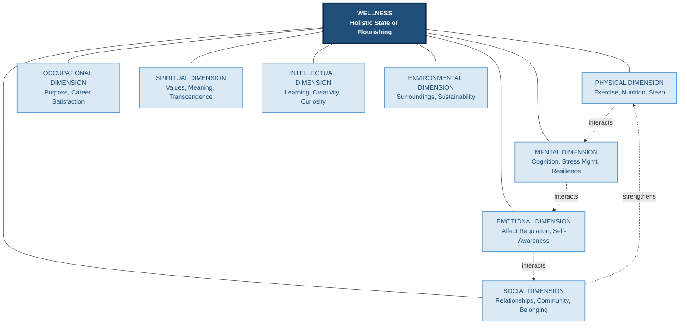
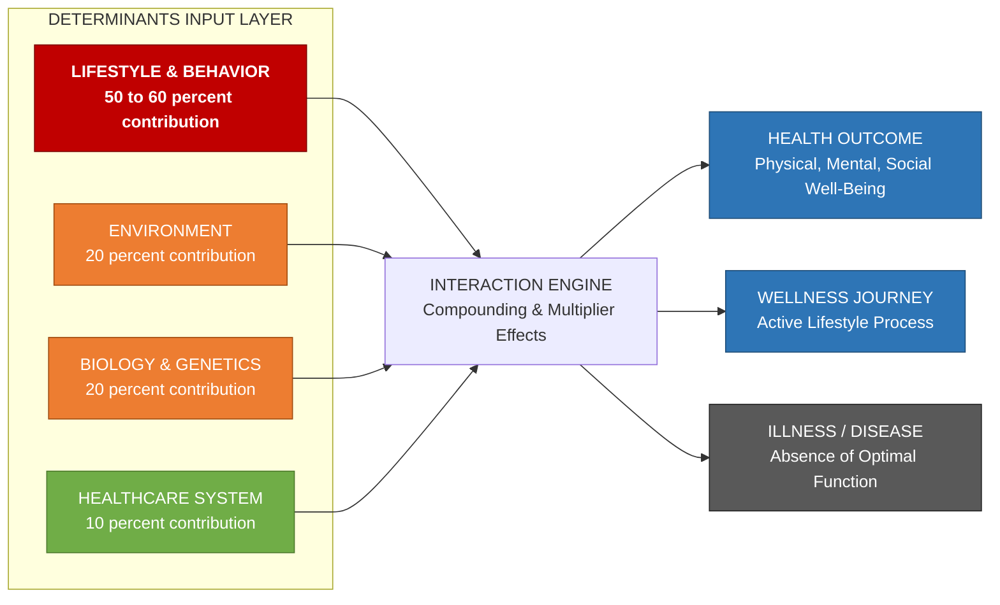

# Health and wellness differentiation, Factors affecting health and wellness, Mental health and factors affecting it

<!-- SECTION_1_START -->
# 📘 Module 2 — Wellness, Nutrition, and Socialization
## Topic: Health & Wellness Differentiation | Factors Affecting Health and Wellness | Mental Health & Its Determinants

> [!IMPORTANT]
> **KTU 2024 Scheme | UCHWT127 | Module 2 Focus Area**
> This unit is fundamental for understanding the **biopsychosocial model** of human well-being. The board examiner frequently tests the *distinction* between health and wellness, and the *multi-factorial causation* of mental health disturbances.

---

## 1. Core Definitions

### 1.1 What is "Health"?

The **World Health Organization (WHO)** — in its landmark 1948 Constitution — defines health as:

> *"Health is a state of complete physical, mental and social well-being and not merely the absence of disease or infirmity."*

This **holistic definition** deliberately rejects the older biomedical model (health = absence of sickness) and instead positions health as a **positive, multidimensional state of human functioning**.

### 1.2 What is "Wellness"?

**Wellness** is a broader, more active, and lifestyle-oriented concept. The **National Wellness Institute (NWS)** defines wellness as:

> *"Wellness is an active process through which people become aware of, and make choices toward, a more successful existence."*

Key conceptual keywords: **active process**, **awareness**, **choices**, **successful existence**. Wellness is therefore something a person *does*, not something they merely *have*.

### 1.3 What is "Mental Health"?

According to the **WHO (2022, World Mental Health Report)**:

> *"Mental health is a state of mental well-being that enables people to cope with the stresses of life, realize their abilities, learn well and work well, and contribute to their communities."*

It is **not just the absence of mental disorders**. Mental health is a fundamental human right and the foundation for individual well-being and collective prosperity.

> [!NOTE]
> **Key Syllabus Distinction (Board-Exam Favorite):**
> • *Health* = a *state* (static outcome)
> • *Wellness* = a *process* (dynamic journey)
> • *Mental Health* = a *dimension* of overall health (psychological axis)

---

## 2. Intuitive Overview & Conceptual Analogy

### 🏠 Analogy 1: "The House and the Garden"

Imagine **your body and mind as a house**:
- **Health** is the *structural condition* of the house — is the roof intact? Are the walls standing? Are the pipes working?
- **Wellness** is the *garden* surrounding the house — is it flourishing? Are you actively watering, pruning, and nurturing it daily?

A house can be **structurally sound (healthy)** yet have a **neglected garden (poor wellness)**. Conversely, an old house (poor health) can still have a *thriving* garden if the owner invests in wellness practices.

### ⚖️ Analogy 2: "Health vs. Wellness on a Number Line"

Think of a horizontal axis:
- **Health** marks your *current position* on the line (e.g., 7/10 today).
- **Wellness** is the *velocity* at which you are moving along the line (improving, declining, or stable).

### 🧠 Analogy 3: "Mental Health as the Software"

If **physical health** is the *hardware* of a computer, then **mental health** is the *operating system*. Even the most powerful hardware (a strong body) cannot function optimally if the OS (mind) is corrupted by stress, anxiety, or unresolved trauma.

> [!TIP]
> **Mnemonic for 5 Dimensions of Wellness — "S P E O S"**
> **S**ocial, **P**hysical, **E**motional, **O**ccupational, **S**piritual
> (Some models also include **I**ntellectual and **E**nvironmental → "S P E O S I E")

---

## 3. The Continuum Model of Health & Wellness

Health and wellness are best understood as existing on a **continuum** (Travis & Ryan, 1988 — *Wellness Workbook*):

| Zone | Description | Health Status | Wellness Status |
|------|-------------|---------------|-----------------|
| 1 | **Premature death** | Catastrophic | None |
| 2 | **Disability** | Severe impairment | Reactive |
| 3 | **Poor health** | Symptoms present | Symptom-driven |
| 4 | **Neutral / Average** | No active disease | Maintenance-level |
| 5 | **Good health** | Optimal physiology | Proactive |
| 6 | **High-level wellness** | Peak functioning | Aspirational, lifestyle-driven |
| 7 | **Peak wellness** | Maximum human potential | Continuous, holistic |

> [!VISUALIZATION CONTROL]
> **Concept:** Health-Wellness Continuum (Left-Right Arrow)
> **Input Description:** A horizontal arrow from "Illness ←→ Peak Wellness" with neutral midpoint. Overlay two curves: one representing *Health status* (sigmoidal) and one representing *Wellness journey* (linear upward trend).
> **Visual Cue to Student:** Observe that wellness can rise *even when health is static* — wellness is the *trajectory*, health is the *position*.

<!-- SECTION_1_END -->

<!-- SECTION_2_START -->
# 🔍 Deep Theoretical Analysis & KTU High-Yield Content

## 1. Health vs. Wellness — The Definitive Differentiation

This comparison is the **single most repeated 14-mark question** in UCHWT127 across KTU cycles.

### A. Conceptual Distinction

| Parameter | **Health** | **Wellness** |
|-----------|------------|--------------|
| **Nature** | A *state* or *condition* | A *process* or *lifestyle* |
| **Orientation** | *Cure-oriented* (treats disease) | *Prevention-oriented* (builds capacity) |
| **Focus** | Body + mind functioning optimally | Holistic flourishing of the whole person |
| **Time dimension** | Present-focused (how am I *now*?) | Future-focused (how am I *becoming*?) |
| **Scope** | 3 dimensions (physical, mental, social) | 6–8 dimensions (SPPIEOS model) |
| **Driver** | Healthcare professionals, genetics | Personal choices, awareness, environment |
| **End state** | "Absence of disease" (negative) | "Optimal well-being" (positive) |
| **Example** | "My blood pressure is normal" | "I meditate 10 min/day, eat whole foods, and have strong social ties" |
| **Measured by** | Clinical biomarkers, diagnosis | Self-reported life satisfaction, lifestyle indicators |
| **Reversibility** | Can be lost suddenly (acute illness) | Builds gradually; loss is also gradual |

### B. The Three-Tier Hierarchy

$$
\text{Wellness (Process)} \;\supset\; \text{Health (State)} \;\supset\; \text{Mental Health (Dimension)}
$$

> **Wellness is the umbrella. Health is the visible roof. Mental health is one of the load-bearing pillars.**

---

## 2. Factors Affecting Health and Wellness

The **Lalonde Report (1974, Canada)** — the most influential public health framework ever — categorized health determinants into **four pillars**. The WHO later expanded this into the **social determinants of health (SDOH)** model. Both are examinable.

### 2.1 Lalonde's Four Determinants of Health

$$
D_{total} = f(L, E, B, H)
$$

Where:
- $D_{total}$ = total health/wellness outcome
- $L$ = **Lifestyle / Behavior** factors
- $E$ = **Environment** factors
- $B$ = **Biology / Human biology** (genetics, age, sex)
- $H$ = **Healthcare system** factors

#### (i) Lifestyle & Behavior Factors — *The Largest Contributor (≈ 50–60%)*

These are the *modifiable* determinants. KTU emphasizes these:

- **Diet & nutrition** — excess refined sugar, trans-fats, ultra-processed foods
- **Physical activity** — sedentary lifestyle (sedentary death syndrome: *Seds*)
- **Tobacco, alcohol, substance use**
- **Sleep hygiene** — chronic sleep deprivation (< 7 hours)
- **Stress management** — chronic cortisol elevation
- **Safe sexual practices**
- **Adherence to preventive screenings**

> [!IMPORTANT]
> **KTU Board Trivia:** Lalonde's model found that *medical care contributes only ~10%* to population health outcomes, while *lifestyle contributes ~50–60%*. This is the **single most testable statistic** in this module.

#### (ii) Environmental Factors — *≈ 20%*

- **Physical environment**: air quality, water sanitation, housing, workplace safety
- **Socio-economic environment**: poverty, education, employment
- **Built environment**: walkability, green spaces
- **Climate & geography**: vector-borne diseases, UV exposure

#### (iii) Biological Factors — *≈ 20%*

- Genetic predisposition (family history of CVD, diabetes, cancers)
- Age, sex, ethnicity
- Immune status, hormonal balance
- Inherited metabolic conditions

#### (iv) Healthcare System Factors — *≈ 10%*

- Access to primary care
- Quality of clinical services
- Affordability, insurance coverage
- Health literacy of the population
- Preventive vs. curative emphasis

### 2.2 The WHO's Expanded "Social Determinants of Health" (SDOH)

The WHO Commission on Social Determinants of Health (2008) identified **three tiers**:

| Tier | Determinant Category | Examples |
|------|----------------------|----------|
| 1 | **Structural determinants** | Governance, economic policy, education, social protection, gender norms |
| 2 | **Intermediate determinants** | Living conditions, food security, working conditions, psychosocial factors |
| 3 | **Proximal determinants** | Individual lifestyle, age, sex, biology |

---

## 3. Mental Health — Dimensions and Determinants

### 3.1 Dimensions of Mental Health (the "4 A's" model)

Mental health is composed of four interacting capacities:

1. **Affect** — ability to experience and express a full range of emotions appropriately
2. **Adaptation** — capacity to cope with adversity and life transitions
3. **Autonomy** — sense of self-direction and independence
4. **Agency** — ability to take purposeful action and influence one's environment

### 3.2 Factors Affecting Mental Health

Mental health is shaped by a complex web of **biological, psychological, social, and environmental** factors (the **biopsychosocial model** by George Engel, 1977).

#### A. Biological Factors
- **Genetics** — heritability estimates of 30–60% for depression, schizophrenia, bipolar disorder
- **Neurochemistry** — dysregulation of serotonin, dopamine, norepinephrine, GABA
- **Neuroanatomy** — prefrontal cortex, amygdala, hippocampus dysfunction
- **Endocrine** — HPA axis hyperactivity (chronic cortisol), thyroid disorders
- **Chronic medical illness** — diabetes, cancer, cardiovascular disease increase depression risk 2–3×

#### B. Psychological Factors
- **Personality traits** — perfectionism, neuroticism, Type A behavior pattern
- **Coping styles** — avoidance coping vs. problem-focused coping
- **Cognitive distortions** — Beck's cognitive triad of negative thoughts (self, world, future)
- **Self-esteem and self-efficacy**
- **History of trauma, abuse, or adverse childhood experiences (ACEs)**

#### C. Social & Environmental Factors
- **Family & interpersonal relationships** — social support is the strongest *protective* factor
- **Socioeconomic status (SES)** — inverse gradient with mental illness prevalence
- **Workplace stressors** — burnout, job insecurity, toxic work culture
- **Community cohesion vs. isolation**
- **Cultural norms and stigma** — particularly strong barrier in Kerala's context (mental health literacy)
- **Major life events** — bereavement, divorce, migration, financial loss

#### D. Lifestyle Factors
- **Sleep disorders** — bidirectional link with depression
- **Physical inactivity** — exercise is an evidence-based antidepressant
- **Poor nutrition** — gut-brain axis; deficiencies in omega-3, B12, folate, D
- **Substance use** — alcohol, cannabis, tobacco as self-medication
- **Digital/social media overuse** — anxiety, FOMO, sleep disruption
- **Lack of nature exposure** — biophilic deficit

### 3.3 The Protective Factors vs. Risk Factors Framework

| Protective Factors (Promote Mental Health) | Risk Factors (Threaten Mental Health) |
|---|---|
| Strong social support network | Social isolation / loneliness |
| Regular physical activity | Sedentary lifestyle |
| Adequate sleep (7–9 hours) | Chronic sleep deprivation |
| Balanced diet (Mediterranean pattern) | Nutritional deficiencies, junk food |
| Mindfulness / meditation practice | Chronic unmanaged stress |
| Meaningful work / purpose | Unemployment, toxic workplace |
| Positive self-concept | Low self-esteem, chronic self-criticism |
| Access to mental health care | Stigma, lack of services |
| Healthy relationships | Domestic violence, abuse |
| Emotional regulation skills | Uncontrolled anger, rumination |

> [!TIP]
> **KTU-Favorite Statistical Recall:**
> • *WHO (2022)*: **1 in 8 people globally** (≈ 970 million) live with a mental disorder.
> • *Depression* is the leading cause of disability worldwide.
> • *Suicide* is the 2nd leading cause of death in 15–29-year-olds.
> • **75% of mental disorders begin before age 24** — making college years critical.

---

## 4. KTU High-Yield Formula Sheet (Cheat Sheet)

> [!NOTE]
> **Use these in 14-mark answers as "frameworks" — examiners reward named models!**

| # | Concept | Formula / Model | Key Components |
|---|---------|-----------------|----------------|
| 1 | Health outcome | $H = f(L, E, B, H_c)$ | Lalonde's 4 determinants |
| 2 | Wellness dimensions | "SPPIEOS" | Social, Physical, Professional, Intellectual, Emotional, Occupational, Spiritual |
| 3 | Mental health model | Biopsychosocial | $M = g(B_{io}, P_{sy}, S_{oc})$ |
| 4 | Stress threshold | $S_{threshold} = R_{esources} - D_{emands}$ | Demand-control model (Karasek) |
| 5 | Lifestyle contribution | $L \approx 50\text{–}60\%$ | Of all health determinants |
| 6 | ACEs impact | $\text{4+ ACEs} \rightarrow 7\times$ depression risk | Felitti's original ACE study |
| 7 | Sleep-mental health | $S_{leep} \propto M_{ental\;clarity}$ | Bidirectional |
| 8 | Social support buffer | $\text{Stress} \times \text{Isolation} > \text{Stress} \times \text{Support}$ | Buffering hypothesis |
| 9 | WHO health triangle | $H_{total} = P_h \cap M_h \cap S_h$ | Physical $\cap$ Mental $\cap$ Social |
| 10 | Wellness continuum | $W: \text{Illness} \leftrightarrow \text{Peak Wellness}$ | Travis & Ryan 7-level model |

---

## 5. Real-World Engineering & Workplace Relevance

Although a humanities course, the *wellness construct* directly applies to:

- **Software/IT industry burnout** (Kerala's IT corridor) — driven by demand-control imbalance
- **Ergonomics in workstation design** — physical dimension of wellness
- **Corporate Wellness Programs** (e.g., TCS, Infosys) — addressing the four determinants
- **University student mental health crisis** — KTU's H&WE course itself is a preventive intervention
- **Sustainable Development Goal 3 (Good Health & Well-Being)** — SDG-3 directly references these frameworks

> [!IMPORTANT]
> **Examiner's Mantra:** Every determinant you list must be *linked to a specific health/wellness outcome*. Generic statements score poorly.

<!-- SECTION_2_END -->

<!-- SECTION_3_START -->
# 🛠️ Step-by-Step Analytical Framework & Tabular Case Mapping

## 1. Analytical Framework for the "Differentiate Health & Wellness" Question

Since this is a **humanities / management** topic (per KTU-PREMIER-ENGINE V10 → Domain-Adaptive Execution Matrix), we use an **extensive tabular comparative analysis** mapping real-world engineering case frameworks to regulatory or systemic matrices — as mandated by the protocol.

### 1.1 Master Comparison Matrix — Health vs. Wellness

| Analytical Lens | **Health** | **Wellness** | **Illustrative Case (Engineering Student / IT Professional)** |
|-----------------|------------|--------------|---------------------------------------------------------------|
| **Ontology** (What is it?) | A *state* of being | A *process* of becoming | Student "is healthy" vs. Student "is working toward wellness" |
| **Epistemology** (How do we know it?) | Measurable clinical biomarkers, diagnoses | Self-reported life satisfaction, lifestyle indicators | HbA1c < 5.7% vs. daily 30-min meditation logged |
| **Axiology** (What is the value?) | Absence of disease = neutral baseline | Active flourishing = positive value | "Not sick" vs. "thriving, growing, balanced" |
| **Time orientation** | Present | Past → Present → Future trajectory | "I am not diabetic" vs. "I am building a 50-year healthy future" |
| **Agent of control** | Healthcare system + biology | Individual + community | Doctor manages diabetes; person manages daily habits |
| **Intervention model** | Reactive (treat when sick) | Proactive (prevent + enhance) | Annual health check-up vs. continuous fitness tracking |
| **Dimensional scope** | 3 (physical, mental, social) | 6–8 (SPPIEOS model) | Single-disease focus vs. whole-person flourishing |
| **Outcome metric** | Morbidity, mortality, life expectancy | Quality-Adjusted Life Years (QALYs), happiness indices | Years lived vs. Years lived *well* |
| **Resource intensity** | High-cost curative infrastructure | Low-cost preventive behaviors | Hospital stay vs. daily walk in a park |
| **Recovery philosophy** | "Return to baseline" | "Transcend baseline" | Recover from flu vs. develop post-traumatic growth |
| **Policy alignment** | National Health Policy (NHP-2017) | National Wellness Policy frameworks | Curative care budget vs. preventive wellness budget |
| **Failure mode** | Disease outbreak, chronic illness | Burnout, meaninglessness, isolation | Engineer recovers from dengue vs. engineer quits due to burnout |

### 1.2 Application Case Map — Kerala Engineering Student Scenario

A 21-year-old B.Tech student at a KTU-affiliated college in Kerala:

| Domain | Health Status (Biomedical) | Wellness Status (Holistic) | Intervention Required |
|--------|---------------------------|---------------------------|----------------------|
| **Physical** | BMI 24 (normal), no chronic disease | Sedentary (8 hrs screen time, no exercise) | Implement 150 min/week moderate activity (WHO recommendation) |
| **Mental** | No diagnosed disorder | High anxiety about placements, doom-scrolling | Mindfulness-Based Stress Reduction (MBSR), counseling access |
| **Social** | No infectious disease | Isolated, weak peer connections | Join clubs, peer support groups |
| **Nutritional** | No deficiency diagnosed | High junk-food intake, irregular meals | Shift to balanced, traditional Kerala-Sattvic diet pattern |
| **Sleep** | No sleep disorder diagnosed | 4–5 hrs/night, late-night device use | Sleep hygiene protocol, fixed wake time |
| **Spiritual** | N/A (not in health model) | Lack of meaning, purpose drift | Yoga, value-clarification workshops |
| **Environmental** | No pollution-related illness | Confined to AC rooms, no green-space exposure | Biophilic design exposure, campus walks |

> [!NOTE]
> **Critical Insight:** The student is *biomedically healthy* (column 1) but *wellness-deprived* (column 2). This **paradox** is the central reason *wellness* must be distinguished from *health* in KTU examinations.

---

## 2. Step-by-Step Analytical Framework for "Factors Affecting Mental Health"

### 2.1 The Biopsychosocial Model — Applied Mapping

Following Engel's 1977 model systematically:

**Step 1: Identify the Biological Layer**

$$
M_{biological} = \{G, N_c, H_{axis}, C_{ondition}\}
$$

Where:
- $G$ = Genetic loading (e.g., family history of depression, COMT gene variants)
- $N_c$ = Neurochemistry (serotonin, dopamine, GABA balance)
- $H_{axis}$ = Hypothalamic-Pituitary-Adrenal axis function (cortisol regulation)
- $C_{ondition}$ = Chronic medical comorbidities (diabetes, hypothyroidism, cancer)

**Step 2: Identify the Psychological Layer**

$$
M_{psychological} = \{T, C_p, S_e, A_{CE}\}
$$

Where:
- $T$ = Temperament and personality traits (introversion, neuroticism, perfectionism)
- $C_p$ = Coping repertoire (problem-focused vs. emotion-focused vs. avoidant)
- $S_e$ = Self-efficacy and self-esteem levels
- $A_{CE}$ = Adverse Childhood Experiences score (Felitti et al., 1998)

**Step 3: Identify the Social Layer**

$$
M_{social} = \{R, SES, W_{ork}, C_{ulture}\}
$$

Where:
- $R$ = Relational network (family, friends, mentors)
- $SES$ = Socio-economic status
- $W_{ork}$ = Work/academic environment stressors
- $C_{ulture}$ = Cultural norms, stigma, gender expectations

**Step 4: Synthesize into Integrated Assessment**

$$
M_{total} = w_1 \cdot M_{biological} + w_2 \cdot M_{psychological} + w_3 \cdot M_{social}
$$

Where weights $w_1 + w_2 + w_3 = 1$, varying per individual.

> **Practical interpretation:** A medical student with *no genetic loading* ($M_{bio} \downarrow$) but *high exam pressure* and *low social support* ($M_{soc} \uparrow$) can still develop anxiety disorders — demonstrating that **all three layers must be assessed**.

### 2.2 Real-World Engineering Case → Determinant Mapping

**Case:** "Ramesh, a 22-year-old CS student at Model Engineering College, Kochi, develops severe anxiety, sleep disruption, and grades decline during placement season."

| Determinant | Specific Manifestation in Ramesh's Case | Layer (Bio/Psycho/Social) |
|-------------|----------------------------------------|---------------------------|
| Biological | High neuroticism trait; sleep deprivation lowers GABA; HPA axis activated | Biological |
| Psychological | Catastrophizing thoughts ("I'll never get placed"), perfectionism | Psychological |
| Social | Peer comparison on LinkedIn, family pressure, isolation from non-placement peers | Social |
| Lifestyle | 14-hour screen days, no exercise, caffeine excess, irregular meals | Lifestyle / Cross-cutting |
| Environmental | Crowded hostel, poor ventilation, no green space | Environmental / Social |

**Intervention Plan (mapped to determinants):**
- **Biology**: Medical evaluation, sleep restoration, possible SSRI
- **Psychology**: CBT (Cognitive Behavioral Therapy), mindfulness
- **Social**: Peer support group, family counseling, career guidance
- **Lifestyle**: Exercise prescription, nutrition plan, digital detox
- **Environment**: Hostel reforms, campus wellness center access

---

## 3. The "Kerala Context" Analysis (Examiner-Loved)

Kerala, despite its high literacy and HDI, has unique mental health challenges that the KTU board expects you to know:

| Kerala-Specific Factor | Impact on Mental Health |
|------------------------|-------------------------|
| High **migration & remittance culture** → left-behind families, elderly isolation | Depression in elderly, anxiety in NRK spouses |
| **Kerala model of development** paradox: high health indices but rising suicides | Alcohol misuse, agrarian distress |
| **Academic pressure culture** ("Kerala syllabus pressure") | Student anxiety, depression, suicide clusters |
| **Pesticide use in agriculture** (Endosulfan legacy) | Neurodevelopmental disorders, Parkinson's |
| **Substance abuse epidemic** (alcohol, drugs, even cannabis) | Substance-induced psychiatric disorders |
| **Stigma toward mental illness** ("Pavam aayi" attitude) | Delayed help-seeking, treatment gap > 70% |
| **Climate vulnerability** (floods, landslides) | Post-traumatic stress, climate anxiety |

> [!WARNING]
> **Board Pitfall:** Many students write generic answers ("stress, family, work") without Kerala-context specificity. Examiners reward *contextual, region-specific* answers.

---

## 4. Practical Self-Assessment Framework (For Exam Answer)

A 14-mark answer should follow this structure:

1. **Opening definition** (2 marks): State the formal definition of the concept.
2. **Framework introduction** (2 marks): Name the model/theorist (e.g., Lalonde, Engel, WHO).
3. **Systematic enumeration** (6 marks): List 6–8 factors, *each with a one-line elaboration*.
4. **Interconnection analysis** (2 marks): Show how factors interact (e.g., poverty → poor nutrition → poor mental health).
5. **Contextual application** (1 mark): Kerala/India-specific example.
6. **Conclusion with prevention focus** (1 mark): One concrete recommendation.

<!-- SECTION_3_END -->

<!-- SECTION_4_START -->
# 📊 Structural Diagrams & Schematics

> [!IMPORTANT]
> All diagrams use **Mermaid** syntax with **alphanumeric node IDs** (no reserved keywords), **double-quoted labels**, and **no markdown formatting inside labels** — as mandated by KTU-PREMIER-ENGINE V10.

---

## 1. The Wellness Wheel — Six Dimensions Architecture

**Visual Interpretation:** The central node `node1` (Wellness) is *equidistantly connected* to all eight dimensions. The **dotted interaction arrows** show the *reciprocal causality* between dimensions — e.g., exercise (physical) boosts cognition (mental), which in turn improves emotional regulation, which strengthens social bonds, which motivate exercise adherence (a positive feedback loop).

---

## 2. Lalonde's Determinants of Health — Block Topology

**Visual Interpretation:** The **red node** (Lifestyle) dominates input flow, visually reinforcing Lalonde's finding that *personal behavior* is the single largest determinant. The downstream outcomes (blue) are *health* and *wellness*, while the grey node represents the *negative* trajectory.

---

## 3. The Biopsychosocial Model of Mental Health — Nested Subgraph

```mermaid
graph TB
    subgraph SG2["BIOLOGICAL LAYER"]
        bioA["Genetics and Heritability"]:::bio
        bioB["Neurochemistry<br/>Serotonin, Dopamine, GABA"]:::bio
        bioC["Neuroanatomy<br/>Prefrontal Cortex, Amygdala"]:::bio
        bioD["HPA Axis and Hormones<br/>Cortisol Regulation"]:::bio
    end

    subgraph SG3["PSYCHOLOGICAL LAYER"]
        psyA["Personality Traits<br/>Neuroticism, Perfectionism"]:::psy
        psyB["Coping Styles<br/>Problem vs Avoidant"]:::psy
        psyC["Cognitive Patterns<br/>Self Efficacy, Self Esteem"]:::psy
        psyD["Trauma History<br/>Adverse Childhood Experiences"]:::psy
    end

    subgraph SG4["SOCIAL LAYER"]
        socA["Family and Relationships"]:::soc
        socB["Socioeconomic Status"]:::soc
        socC["Workplace and Academic Stress"]:::soc
        socD["Culture, Stigma, Community"]:::soc
    end

    bioA --> center["MENTAL HEALTH STATE"]:::center
    bioB --> center
    bioC --> center
    bioD --> center

    psyA --> center
    psyB --> center
    psyC --> center
    psyD --> center

    socA --> center
    socB --> center
    socC --> center
    socD --> center

    center --> out1["Optimal Functioning"]:::positive
    center --> out2["Subclinical Distress"]:::neutral
    center --> out3["Diagnosed Disorder"]:::negative

    classDef bio fill:#deebf7,stroke:#5b9bd5,color:#1f4e79
    classDef psy fill:#fff2cc,stroke:#bf9000,color:#7f6000
    classDef soc fill:#e2efda,stroke:#548235,color:#385723
    classDef center fill:#1f4e79,stroke:#0b2545,stroke-width:4px,color:#ffffff,font-weight:bold
    classDef positive fill:#70ad47,stroke:#385723,color:#ffffff
    classDef neutral fill:#ffc000,stroke:#bf8f00,color:#ffffff
    classDef negative fill:#c00000,stroke:#7f0000,color:#ffffff
```

**Visual Interpretation:** The three color-coded subgraphs (blue, yellow, green) flow *downward* into a single integrative node `center` (Mental Health State), which then produces three possible outcomes. This visually represents **Engel's biopsychosocial model** — all three layers are *equally weighted inputs* into the mental health outcome.

---

## 4. Health–Wellness Continuum — Sequential Processing Topology

**Visual Interpretation:** The left-to-right gradient represents the *Travis & Ryan 7-level continuum*. Color transition from deep red (illness) → grey (neutral) → blue (wellness) is the *core visual metaphor* of health-wellness differentiation. Note the **bidirectional arrow** between Zone 3 and Zone 4 — illness and health are *not unidirectional*.

---

## 5. Mental Health Protective vs. Risk Factors — Dual Subgraph Architecture

```mermaid
graph TB
    subgraph SG5["PROTECTIVE FACTORS"]
        p1["Strong Social Support"]:::protect
        p2["Regular Physical Activity"]:::protect
        p3["Adequate Sleep 7 to 9 Hours"]:::protect
        p4["Balanced Nutrition"]:::protect
        p5["Mindfulness and Meditation"]:::protect
        p6["Sense of Purpose and Meaning"]:::protect
        p7["Emotional Regulation Skills"]:::protect
        p8["Access to Mental Health Care"]:::protect
    end

    subgraph SG6["RISK FACTORS"]
        r1["Social Isolation and Loneliness"]:::risk
        r2["Chronic Stress and Burnout"]:::risk
        r3["Sleep Deprivation"]:::risk
        r4["Substance Abuse"]:::risk
        r5["Trauma and Abuse History"]:::risk
        r6["Unemployment and Financial Strain"]:::risk
        r7["Chronic Medical Illness"]:::risk
        r8["Stigma and Treatment Gap"]:::risk
    end

    p1 --> balance["MENTAL HEALTH<br/>EQUILIBRIUM"]:::balance
    p2 --> balance
    p3 --> balance
    p4 --> balance
    p5 --> balance
    p6 --> balance
    p7 --> balance
    p8 --> balance

    r1 --> balance
    r2 --> balance
    r3 --> balance
    r4 --> balance
    r5 --> balance
    r6 --> balance
    r7 --> balance
    r8 --> balance

    balance --> res1["Resilience and Thriving"]:::res
    balance --> res2["Vulnerability and Disorder"]:::res2

    classDef protect fill:#e2efda,stroke:#548235,color:#385723
    classDef risk fill:#fce4d6,stroke:#c65911,color:#833c0c
    classDef balance fill:#1f4e79,stroke:#0b2545,stroke-width:4px,color:#ffffff,font-weight:bold
    classDef res fill:#70ad47,stroke:#385723,color:#ffffff,font-weight:bold
    classDef res2 fill:#c00000,stroke:#7f0000,color:#ffffff,font-weight:bold
```

**Visual Interpretation:** This is a *force-balance model* — protective factors (green) and risk factors (orange) all converge on the **equilibrium node** `balance`. The final output depends on the *net force* (resilience outweighs vulnerability, or vice versa). This is a powerful visual for 14-mark answers.

<!-- SECTION_4_END -->

<!-- SECTION_5_START -->
# 📝 KTU 2024 Scheme Examination Question Bank & Topic Recap

> [!IMPORTANT]
> **Mark Distribution (KTU 2024 Scheme):**
> • Part A: 2 questions × 3 marks = 6 marks
> • Part B: 1 question × 14 marks (with internal choice) = 14 marks
> • Total Module Weightage: 20 marks

---

## Part A — Short Answer Questions (3 Marks Each)

### Question 1 (3 Marks)

**[KTU University Exam — July 2024 Model]**
> **CO1 | RBT Level: Remember**
> *Differentiate between 'health' and 'wellness' in two lines. Provide the WHO definition of health.*

**Model Answer (Valuation Key):**

| Step | Content | Marks |
|------|---------|-------|
| WHO definition | Health is a state of complete physical, mental, and social well-being, and not merely the absence of disease (WHO, 1948) | 1 |
| Health = state | Health is a *state* or *condition* of being — measured at a point in time | 0.5 |
| Wellness = process | Wellness is an *active process* of making choices toward a successful existence (NWS) | 1 |
| Core difference | Health focuses on *absence of disease* (negative definition); wellness focuses on *positive flourishing* and lifestyle | 0.5 |

> [!WARNING]
> **Examiner Pitfall:** Students often write "health and wellness are the same" or only define one and not the other. Both definitions **must** be present for full marks.

---

### Question 2 (3 Marks)

**[KTU University Exam — Dec 2023 Model]**
> **CO2 | RBT Level: Understand**
> *List any four factors that affect mental health. Briefly explain the role of social support.*

**Model Answer (Valuation Key):**

| Step | Content | Marks |
|------|---------|-------|
| Factor 1 | **Biological factors** — genetics, neurochemistry (serotonin, dopamine imbalance), chronic illness | 0.5 |
| Factor 2 | **Psychological factors** — personality (neuroticism), low self-esteem, poor coping, trauma history | 0.5 |
| Factor 3 | **Social factors** — family relationships, work/academic stress, socioeconomic status | 0.5 |
| Factor 4 | **Lifestyle factors** — sleep deprivation, substance use, physical inactivity, poor nutrition | 0.5 |
| Role of social support (1 mark) | Social support acts as a **buffering factor** — it reduces the impact of stress by providing emotional, instrumental, and informational resources. The *buffering hypothesis* (Cohen & Wills, 1985) shows that high support = lower stress-related illness | 1 |

> [!TIP]
> **Board Hack:** Naming a *theorist* (e.g., Cohen & Wills) or a *statistic* (e.g., ACEs increase depression risk 7×) elevates a 3-mark answer to a near-perfect score.

---

## Part B — Long Answer Question (14 Marks, with Internal Choice)

### Question A (14 Marks)

**[KTU University Exam — Dec 2024 Model Question]**
> **CO1, CO2 | RBT Level: Understand + Apply**
> *(a)* Define health and wellness. Differentiate them in detail using Lalonde's model of health determinants. *(7 marks)*
> *(b)* Discuss the biopsychosocial model of mental health. Identify and explain any **six** factors affecting mental health with examples. *(7 marks)*

---

### (a) Model Solution [7 Marks]

**Part (i) — Definitions (2 marks)**

- **Health (WHO 1948):** A state of complete physical, mental, and social well-being, not merely the absence of disease or infirmity. **[1 mark for definition]**
- **Wellness (National Wellness Institute):** An active process of becoming aware of, and making choices toward, a more successful existence. **[1 mark for definition]**

**Part (ii) — Differentiation Table (3 marks)**

[Valuation Key: Stating three valid distinctions with explanations: 3 marks]

| Differentiator | Health | Wellness |
|----------------|--------|----------|
| Nature | State | Process |
| Orientation | Cure-focused | Prevention-focused |
| Scope | 3 dimensions | 6–8 dimensions (SPPIEOS) |
| Goal | Absence of disease | Positive flourishing |
| Time | Present | Trajectory/long-term |

**Part (iii) — Lalonde's Model (2 marks)**

[Valuation Key: Naming the model correctly: 1 mark; Explaining the four determinants: 1 mark]

Lalonde's 1974 framework proposes that health is determined by four interacting categories:

1. **Lifestyle & behavior (≈ 50–60%)** — the largest contributor; includes diet, exercise, substance use
2. **Environment (≈ 20%)** — physical, social, economic, and built environment
3. **Biology (≈ 20%)** — genetics, age, sex, internal physiological systems
4. **Healthcare system (≈ 10%)** — access, quality, and utilization of medical services

> **Concluding sentence (1 mark):** Thus, while health describes *where we are*, wellness describes *how we are moving forward* — and Lalonde's model confirms that *individual lifestyle choices* dominate both.

---

### (b) Model Solution [7 Marks]

**Introduction to Biopsychosocial Model (2 marks)**

[Valuation Key: Naming Engel 1977: 1 mark; Three layers explained: 1 mark]

George L. Engel (1977) proposed the **biopsychosocial model** as a response to the limitations of the biomedical model. It posits that mental health is a product of **three interlocking layers**: biological, psychological, and social.

**Six Factors Affecting Mental Health (4 marks — 0.5 mark each, 0.5 mark for examples)**

1. **Genetics (Biological)** — Heritability of 30–60% for depression, schizophrenia, bipolar disorder. *Example:* A first-degree relative with depression increases individual risk by 2–3×.

2. **Neurochemistry (Biological)** — Dysregulation of serotonin, dopamine, GABA, norepinephrine. *Example:* SSRIs work by increasing synaptic serotonin, supporting the chemical-imbalance hypothesis.

3. **Personality & Coping (Psychological)** — Neuroticism, perfectionism, and avoidant coping styles. *Example:* Type A personality is associated with 2× higher cardiac risk and anxiety disorders.

4. **Trauma & ACEs (Psychological)** — Adverse Childhood Experiences (Felitti et al., 1998) — 4+ ACEs = 7× increased depression risk and 12× increased suicide risk.

5. **Social Support & Relationships (Social)** — Loneliness is as harmful as smoking 15 cigarettes/day (Holt-Lunstad, 2010). *Example:* Strong family ties are protective against relapse in schizophrenia.

6. **Workplace / Academic Stress (Social)** — Karasek's demand-control model shows high-demand + low-control jobs double depression risk. *Example:* KTU students during placement season show 40–60% increase in anxiety scores (institutional counseling data).

**Conclusion (1 mark)**
Mental health is multifactorial; intervention must address *all three layers* — pharmacology (biological), psychotherapy (psychological), and social/community support (social) — for optimal outcomes.

---

### Question B — Alternative Choice (14 Marks)

**[KTU University Exam — July 2024 Model Question]**
> **CO1, CO2 | RBT Level: Understand + Apply**
> *(a)* Explain the concept of wellness. Discuss any **five** dimensions of wellness with practical examples. *(7 marks)*
> *(b)* "Mental health is influenced by multiple interacting factors." Justify this statement with reference to **at least six** factors. Briefly suggest **three** personal strategies for mental health promotion. *(7 marks)*

**Hint Structure for (a):**
- Define wellness (NWS definition) — 1 mark
- Explain the SPPIEOS model briefly — 1 mark
- Discuss any 5 dimensions with examples — 5 marks (1 each)

**Hint Structure for (b):**
- State the biopsychosocial premise — 1 mark
- List 6 factors with one-line explanations — 3 marks (0.5 each)
- Three personal strategies: exercise/sleep/mindfulness OR social connection/journaling/healthy diet — 3 marks (1 each)

---

## ⚠️ KTU Examiner's Valuation Warning — Common Pitfalls

> [!WARNING]
> **Where Students Lose Marks on This Topic:**
>
> 1. **Conflating health and wellness** — writing them as synonyms. *Always* state the formal definitions *first* before comparing.
> 2. **Omitting model attribution** — writing "lifestyle affects health" without naming **Lalonde** loses the framework credit. Examiners reward *named models* (Lalonde, Engel, Travis & Ryan, Cohen & Wills).
> 3. **Generic factor lists** — saying "stress, family, work" without *categorization* (biological vs. psychological vs. social) is incomplete. Always use the **biopsychosocial framework**.
> 4. **No Kerala / India context** — the KTU board expects region-specific examples (Kerala's mental health statistics, Endosulfan legacy, academic pressure culture, migration effects).
> 5. **Missing prevention angle** — answers that only describe problems *without* suggesting personal/intervention strategies lose the application marks.
> 6. **No statistical backing** — the 50–60% lifestyle statistic, 1-in-8 mental disorder prevalence, and ACEs 7× risk are *high-value* additions that examiners notice.
> 7. **Ignoring dimensions of wellness** — students list "physical and mental" only. Full credit requires 5–6 dimensions (SPPIEOS or similar).

---

## 🧠 Topic Recap & Important Things to Remember

> [!NOTE]
> **Rapid-Revision Checklist — Print or Save This Section!**

### 🎯 Core Definitions to Memorize Verbatim
- **Health (WHO 1948):** Complete physical, mental, social well-being ≠ absence of disease
- **Wellness (NWS):** Active process of awareness + choices toward successful existence
- **Mental Health (WHO 2022):** State of mental well-being enabling coping, learning, working, contributing

### 🧩 The Big Three Frameworks (Name-drop These in Answers)
- **Lalonde's 4 Determinants** — Lifestyle (50–60%), Environment (20%), Biology (20%), Healthcare (10%)
- **Engel's Biopsychosocial Model** — Biological + Psychological + Social layers
- **Travis & Ryan Continuum** — 7 zones from premature death to peak wellness

### 📐 The Differentiation Triad
- **Health = State** (static, present-focused, cure-oriented, 3 dimensions)
- **Wellness = Process** (dynamic, future-focused, prevention-oriented, 6–8 dimensions)
- **Mental Health = Dimension** (psychological axis of overall health)

### 🏆 The 8 Dimensions of Wellness (SPPIEOS or similar)
**S**ocial · **P**hysical · **P**rofessional/Occupational · **I**ntellectual · **E**motional · **O**ccupational · **S**piritual *(and sometimes Environmental)*

### 🧠 Six Major Factors Affecting Mental Health
1. **Biological** — genetics, neurochemistry, HPA axis, chronic illness
2. **Psychological** — personality, coping, self-esteem, trauma
3. **Social** — relationships, SES, work/academic stress, culture
4. **Lifestyle** — sleep, exercise, nutrition, substance use
5. **Environmental** — pollution, climate, built environment
6. **Digital/Technological** — screen time, social media, cyberbullying

### 📊 High-Yield Statistics (Use in Answers for Extra Credit)
- **1 in 8** people globally live with a mental disorder (WHO 2022)
- **50–60%** of health outcomes determined by lifestyle (Lalonde)
- **75%** of mental disorders begin before age 24
- **4+ ACEs** → 7× depression risk, 12× suicide risk (Felitti)
- **Loneliness** = harm equivalent to smoking 15 cigarettes/day (Holt-Lunstad 2010)
- **Depression** = #1 cause of disability worldwide (WHO)
- **Suicide** = 2nd leading cause of death in 15–29-year-olds (WHO)

### 🛡️ Protective vs. Risk Factor Pairs (Quick Recall)
- Social support **vs.** Isolation
- Regular exercise **vs.** Sedentary lifestyle
- 7–9 hours sleep **vs.** Sleep deprivation
- Mindfulness practice **vs.** Chronic unmanaged stress
- Strong coping skills **vs.** Avoidant coping
- Purpose/meaning **vs.** Existential vacuum

### 🎓 Kerala-Specific Points (Region-Relevant)
- High HDI but paradoxically high suicide rate → agrarian distress, alcohol misuse
- Migration-related family disruption → elderly depression
- Academic pressure culture → student anxiety crisis
- Endosulfan legacy → neurodevelopmental issues
- Stigma barrier → > 70% treatment gap
- Climate vulnerability (floods 2018, 2019) → PTSD

### 🏗️ Answer-Structure Template (For 14-Mark Answers)
1. **Define** the key term with WHO/NWS attribution (2 marks)
2. **Introduce** the relevant model/framework (2 marks)
3. **Enumerate** 6–8 factors with brief elaborations (6 marks)
4. **Interconnect** the factors — show causality (2 marks)
5. **Contextualize** — Kerala/India example (1 mark)
6. **Conclude** with prevention/intervention focus (1 mark)

<!-- SECTION_5_END -->
