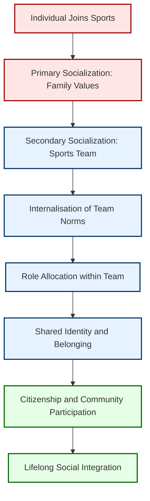
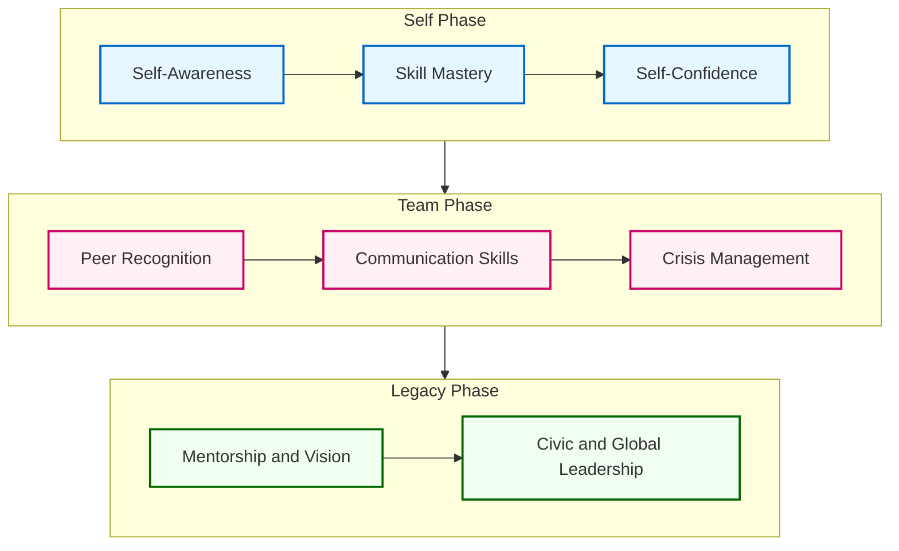
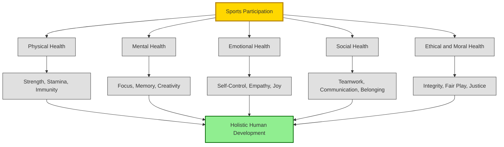
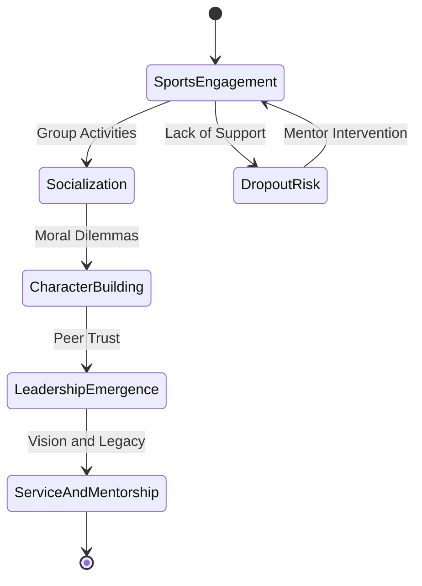

# Sports and Socialization: Character building, Leadership through Physical Activity and Sports

<!-- SECTION_1_START -->
# Sports and Socialization: Character Building, Leadership through Physical Activity and Sports

## 1.1 Core Technical Definitions (KTU 2024 Scheme Aligned)

> [!IMPORTANT]
> **Sports (KTU/UNESCO Definition):**
> *"Sports are all forms of physical activity which, through casual or organised participation, aim at expressing or improving physical fitness and mental well-being, forming social relationships, or obtaining results in competition at all levels."*
> — **Council of Europe, European Sports Charter (1992, revised 2001)**

> [!IMPORTANT]
> **Socialization (Sociological Definition by Parsons & Bales, 1955):**
> *"Socialization is the lifelong process of inheriting and disseminating norms, customs, ideologies, and other patterns of behaviour, through which an individual is integrated into a social group and learns the values, attitudes, and beliefs of that group."*

> [!NOTE]
> **Character Building through Sports:**
> Character building is the structured process of inculcating core ethical, moral, and behavioural virtues — such as **discipline, perseverance, integrity, teamwork, fair play, and emotional resilience** — through deliberate participation in physical activity and sports.

> [!NOTE]
> **Leadership through Physical Activity:**
> Leadership, in the context of sports, is the demonstrated ability of an individual to **influence, motivate, and guide** a team or group towards achieving a common athletic or strategic goal, while upholding the spirit of the game and collective well-being.

> [!NOTE]
> **Physical Activity (World Health Organization — WHO, 2020 Guidelines):**
> *"Any bodily movement produced by skeletal muscles that requires energy expenditure."* WHO recommends adults perform **150–300 minutes** of moderate-intensity aerobic activity, or **75–150 minutes** of vigorous-intensity activity, per week.

---

## 1.2 Intuitive Overview & Conceptual Analogies

### 🏟️ Analogy 1 — The "Living Laboratory"
Think of a **sports field as a 90-minute live classroom** where life’s toughest lessons — *failure, success, conflict, hierarchy, teamwork* — are compressed into intense, real-time experiences. Unlike a textbook, the sports field does not allow re-reading. You face the umpire’s decision, the opponent’s strategy, the teammate’s expectation, and the crowd’s pressure **in the moment**. The brain encodes these experiences emotionally, which is why sports shape character far more deeply than passive instruction.

### 🧱 Analogy 2 — Character is a "Muscle"
Character is **not a gift, but a muscle**. Just as the biceps grow only when subjected to *progressive overload, rest, and consistency*, virtues like patience, humility, and courage grow only when a person repeatedly faces challenging, supervised, and meaningful situations — the kind that competitive and team sports provide in abundance.

### 🚢 Analogy 3 — The "Leadership Galleon"
A sports team is like an **ancient war galleon**: the captain (leader) does not row, but she *steers, motivates, and protects* the crew (team members). Leadership in sports is therefore **positional in title but earned in trust**, forged through consistent decisions, sacrifices, and accountability — a perfect microcosm of corporate, military, and civic leadership.

### 🌍 Analogy 4 — Sports as a "Universal Social Glue"
Across **languages, religions, and borders**, the language of sports is universally understood. A handshake after a tough match, a collective national anthem before a game, a fan wearing the team jersey — these are the **silent rituals of socialization** that bind strangers into communities and citizens into a nation.

---

## 1.3 Key Physical & Psychological Metrics (WHO & KTU Standards)

> [!TIP]
> **Standard Metrics to Remember (for KTU 2-mark short notes):**
>
> - Recommended adult physical activity: **150–300 minutes/week** of moderate activity
> - Recommended vigorous activity: **75–150 minutes/week**
> - Muscle-strengthening activities: **≥2 days/week** involving all major muscle groups
> - Sedentary behaviour: should be **limited** and replaced with activity of any intensity
> - Sport-based character development: typically requires **≥6 months** of sustained participation for measurable personality change

---

## 1.4 Visualization Control Block

> [!VISUALIZATION CONTROL]
> **Concept:** *The Holistic Development Pyramid of Sports Participation*
> **Geometric Description (Desmos-friendly):**
> Plot a **pyramid with four tiers** (apex at top), where the *x-axis* represents *depth of impact* and the *y-axis* represents *level of participation* (from casual → competitive → elite).
>
> **Tier 1 (Base — widest):** Physical Health — *fitness, strength, immunity*
> **Tier 2:** Emotional Well-being — *stress relief, confidence, joy*
> **Tier 3:** Social Skills — *teamwork, communication, empathy*
> **Tier 4 (Apex — narrowest, hardest to reach):** Character & Leadership — *integrity, vision, resilience*
>
> **Visual Insight for Student:** The further up the pyramid you climb (from recreational to elite sport), the more profound the character and leadership outcomes — but the *narrower* the population that reaches that level, signifying that these qualities are *earned, not given.*

---

## 1.5 Cross-Linking with KTU Module 2 Syllabus

| KTU 2024 Module 2 Sub-Topic | Where it Connects |
|---|---|
| Wellness Dimensions | Sports is the *practical vehicle* of physical & social wellness |
| Nutrition | Sports performance links directly to nutrition education |
| Socialization | Sports is the *primary modern agent* of secondary socialization |
| Lifestyle & Behaviour | Sports is a *preventive* and *therapeutic* lifestyle behaviour |

---
<!-- SECTION_1_END -->

<!-- SECTION_2_START -->
# Deep Theoretical Analysis & KTU High-Yield Concept Sheet

## 2.1 The "Why" and "How" — Theoretical Foundations

Sports and physical activity are not random recreational choices; they sit at the intersection of **psychology, sociology, education, and physiology**. The KTU 2024 syllabus requires you to understand *why* and *how* sports build character and leadership. The following seven theoretical pillars form the bedrock.

---

### 🧠 Pillar 1 — Bandura’s Social Learning Theory (1977)

- **Core Idea:** *People learn behaviours by observing, imitating, and modelling others* — especially those they admire (coaches, senior players, sport icons).
- **Why it matters for character:** A child watching Sachin Tendulkar walk back calmly after a low score *internally rehearses* the same emotional regulation. The brain’s **mirror neurons** activate during observation, making sports a *vicarious classroom*.
- **Four-step process:** **Attention** → **Retention** → **Reproduction** → **Motivation**.

---

### ⚖️ Pillar 2 — Kohlberg’s Stages of Moral Development (1971)

- **Core Idea:** Moral reasoning develops in **three levels** and **six stages**, with sports offering *real dilemmas* (foul play, cheating, losing gracefully) that push individuals up the moral ladder.
- **Levels:**
  - **Pre-conventional** (Obedience & Self-interest) — e.g., child plays to win a chocolate
  - **Conventional** (Social approval & Law-and-order) — e.g., plays by the rules for team honour
  - **Post-conventional** (Universal ethics) — e.g., Sachin walking back on a wrong ‘not-out’ call against Pakistan, 1999 World Cup

---

### 🏆 Pillar 3 — Danish’s Model of Sport as a Medium for Character Development

- **Authors:** Sarah Danish, Barbara Meyer, Nancy Owens, and Claudine Palacios (2002).
- **The 4 C’s Model:**
  1. **Competence** — Skill mastery builds self-efficacy
  2. **Confidence** — Self-belief grows from achievement
  3. **Connection** — Belonging to team and community
  4. **Character** — Internalising moral virtues
  5. (Extended to) **Caring & Compassion** — Empathy for opponents, weaker players, society
- **Application:** Used globally in school PE curricula and youth development programmes such as the **NFL Play 60** and **FIFA Football for Schools**.

---

### 👥 Pillar 4 — Tuckman’s Stages of Group Development (1965)

- **The 5 Stages:** **Forming → Storming → Norming → Performing → Adjourning**
- **Why it matters for leadership:** A cricket team’s journey from a random collection of players to a *world-class unit* (e.g., India’s 2011 World Cup squad) is a textbook Tuckman progression. **Leadership emerges and shifts** across each stage — from the coach’s directive style in *Forming* to shared, distributed leadership in *Performing*.

---

### 🧗 Pillar 5 — Physical Literacy (Margaret Whitehead, 2001)

- **Definition:** *"The motivation, confidence, physical competence, knowledge, and understanding to value and take responsibility for engagement in physical activities for life."*
- **Key Insight:** Physical literacy is the **foundation upon which all character and leadership development rests**. A child who is *physically literate* is more likely to participate in sports, gain the benefits, and internalise the values.

---

### 🕊️ Pillar 6 — Pierre de Coubertin’s Olympic Philosophy (1896 onwards)

- **Founder of Modern Olympics.** His core belief: *"The most important thing in the Olympic Games is not to win but to take part, just as the most important thing in life is not the triumph but the struggle."*
- **Olympiad as Moral Education:** Coubertin explicitly designed the Olympic Games as a **school of moral nobility** — combining sport with culture, fair play, and international friendship.

---

### 🔄 Pillar 7 — Transformational Leadership Theory (Bass, 1985)

- **4 I’s of Transformational Leadership:**
  1. **Idealised Influence** (Role-modelling)
  2. **Inspirational Motivation** (Vision, pep talks)
  3. **Intellectual Stimulation** (Innovation, strategy)
  4. **Individualised Consideration** (Mentorship, empathy)
- **Sport Example:** Kapil Dev’s “*Ziddi*” attitude during the 1983 World Cup; Gautam Gambhir’s inspiring 75 in the 2011 final; P.V. Sindhu’s calm tactical planning under pressure.

---

## 2.2 KTU High-Yield Concept / Theory Cheat Sheet

> [!IMPORTANT]
> The following table is your **one-stop revision tool** for Module 2 — memorize it for short-answer questions.

| # | Theory / Concept | Key Proponent(s) | Year | Core Idea | Application in Sports |
|---|---|---|---|---|---|
| 1 | Social Learning Theory | Albert Bandura | 1977 | Learning by observation & modelling | Children imitate sport heroes; coach as role model |
| 2 | Stages of Moral Development | Lawrence Kohlberg | 1971 | Moral reasoning develops in 6 stages | Dilemmas of fair play, cheating push moral growth |
| 3 | 4 C’s of Positive Youth Development | Danish et al. | 2002 | Competence, Confidence, Connection, Character | Used in school PE & youth sport worldwide |
| 4 | Stages of Group Development | Bruce Tuckman | 1965 | Forming, Storming, Norming, Performing, Adjourning | Tracks team-building & leadership emergence |
| 5 | Physical Literacy | Margaret Whitehead | 2001 | Motivation, confidence, competence, knowledge | Foundation for lifelong sport engagement |
| 6 | Olympic Philosophy | Pierre de Coubertin | 1896 | Participation > Winning; moral nobility | Olympic movement, international sportsmanship |
| 7 | Transformational Leadership | Bernard Bass | 1985 | Idealised influence, inspiration, stimulation, care | Captains, coaches, sport icons |
| 8 | Play Theory | Johan Huizinga | 1938 | *Homo Ludens* — Man the Player | Explains the cultural & social function of sport |
| 9 | Socialization through Sport | Ken Gray | 2022 | Sport as a key agent of secondary socialization | School sport, club sport, national teams |
| 10 | Achievement Goal Theory | Nicholls (1984); Duda | 1980s | Task vs Ego orientation in sport | Determines character & leadership outcomes |

---

## 2.3 The Three Real-World Domains Where This Knowledge is Applied

1. **Corporate World:** *Adventure-based learning* and *sport-team retreats* are used by Google, Apple, and Infosys to train future leaders.
2. **Military & Defence:** The Indian Army, Indian Navy, and NCC use **sports as a core leadership and team-bonding tool** before active deployment.
3. **Public Health & Education:** WHO and UNESCO use sport-based interventions to address **mental health, youth violence, gender equity, and substance abuse** worldwide (e.g., *Right to Play*, *FIFA Football for Schools*).

---

## 2.4 The “Why” Behind the “How” — A Logical Walk-Through

**Why does sports build character?**
- Because sport presents **consequences that are immediate, real, and proportional** to actions. You either practise, or you lose. You either play fair, or you earn the opponent’s and referee’s wrath.
- This **feedback loop** is unmatched in classroom education. Character traits are not taught abstractly — they are *lived, felt, and reinforced*.

**How does sports build leadership?**
- A sports team is one of the **few safe environments** where a young person can be put in charge of a peer group, make decisions with limited information, face the consequences, and learn — all in a span of 90 minutes.
- This **compressed decision-making cycle** is exactly what real-world leadership demands.

---
<!-- SECTION_2_END -->

<!-- SECTION_3_START -->
# Step-by-Step Frameworks, Derivations & Comparative Case Analysis

## 3.1 Framework A — The 7-Stage Process of Character Building through Sports (Sequential Derivation)

This is the **canonical, KTU-examinable framework** that you must understand in sequence. We will derive it step-by-step, with no shortcuts.

---

**Stage 1 — Exposure and Initial Participation**
$$\text{Trigger: Curiosity, peer influence, or family introduction}$$
- The individual is introduced to a sport (e.g., a child joins a cricket academy, a college student enrols in a badminton club).
- **Output:** Initial awareness of rules, equipment, and basic techniques.
- **Character trait seeded:** *Willingness to try.*

**Stage 2 — Skill Acquisition and Initial Struggle**
$$\text{Process: Repeated practice \rightarrow motor learning consolidation}$$
- The learner begins to experience the *gap* between ambition and ability. Early failures (e.g., missing a free throw) teach the value of effort.
- **Output:** Recognition that talent alone is insufficient.
- **Character trait seeded:** *Discipline and patience.*

**Stage 3 — Facing Competition and Adversity**
$$\text{Adversity: Defeat, injury, tough opponent, criticism}$$
- The individual is exposed to controlled stress. The hypothalamus-pituitary-adrenal (HPA) axis is activated, and cortisol is released, training the individual to **manage stress**.
- **Output:** Emotional regulation and mental toughness.
- **Character trait seeded:** *Resilience and emotional control.*

**Stage 4 — Internalising Rules and Fair Play**
$$\text{Moral Dilemma: Win at all costs vs. Win with honour}$$
- The player is repeatedly exposed to umpire decisions, opponent provocations, and the temptation to cheat. Kohlberg’s *conventional morality* is actively tested.
- **Output:** Acceptance of rules as a higher authority than personal gain.
- **Character trait seeded:** *Integrity, sportsmanship, respect for authority.*

**Stage 5 — Team Belonging and Social Bonding**
$$\text{Group Dynamic: From “I” to “We”}$$
- Through shared training, sweat, and failure, the player begins to identify with the team. *Tuckman’s Norming stage* sets in.
- **Output:** Loyalty, friendship, collective identity.
- **Character trait seeded:** *Empathy, cooperation, brotherhood.*

**Stage 6 — Leadership Emergence and Decision-Making**
$$\text{Trigger: A vacant captaincy, a crisis moment, peer respect}$$
- Based on the 4 I’s (Bass) and the 4 C’s (Danish), the most prepared individual rises to lead. The leader is *made*, not *born*, through consistent micro-decisions.
- **Output:** Distributed leadership, mentorship, accountability.
- **Character trait seeded:** *Vision, courage, responsibility.*

**Stage 7 — Transformation and Lifelong Internalisation**
$$\text{Final Output: Character has become a part of identity}$$
- The individual now displays character traits *outside* the sport — in college, workplace, family, and civic life.
- **Output:** A virtuous cycle: sport-built character → better life outcomes → more engagement with sport/community.
- **Character trait seeded:** *Service, citizenship, lifelong learning.*

---

### 🧮 The Cumulative Character Index (Conceptual — Non-Mathematical)

> [!NOTE]
> While we cannot assign a single number to character, the conceptual formula for the *Character Index (CI)* at any point in an athlete’s journey can be expressed as:
>
> $$CI = \sum_{i=1}^{7} w_i \cdot T_i$$
>
> Where $w_i$ is the **weight of stage $i$** and $T_i$ is the **trait internalised at that stage**. Stage 7 has the highest weight, indicating that *sustained participation* (not short bursts) is what produces the strongest character.

---

## 3.2 Framework B — The Leadership Development Pathway in Sports (Step-by-Step Derivation)

**Step 1 — Self-Awareness**
- The athlete learns their *strengths* (e.g., finishing ability) and *weaknesses* (e.g., defensive positioning).
- **Output:** Foundation for authentic leadership style.

**Step 2 — Skill Mastery & Self-Confidence**
$$\text{Confidence} = f(\text{Skill}, \text{Experience}, \text{Supportive environment})$$
- Repeated success in a domain creates **self-efficacy** (Bandura, 1977).
- **Output:** The athlete has the credibility to lead.

**Step 3 — Team Recognition & Role Allocation**
- Peers and coaches begin to assign responsibility — e.g., *“Let Anil finish the game.”*
- **Output:** The athlete moves from *individual contributor* to *team influencer*.

**Step 4 — Communication and Tactical Thinking**
- The athlete is exposed to *pre-game huddles, half-time talks, post-match analysis*.
- **Output:** Ability to inspire, instruct, and align the group.

**Step 5 — Crisis Management**
$$\text{Key Trait: Composure under pressure (Cortisol regulation)}$$
- The athlete is tested by a tight chase, an injury, a hostile crowd.
- **Output:** Poise, decision-making, and emotional intelligence.

**Step 6 — Vision-Setting and Mentorship**
- The athlete now focuses on *the next generation* — e.g., Dhyan Chand mentoring junior hockey players; Mary Kom guiding young female boxers in Manipur.
- **Output:** *Transformational leadership* — from *me* to *we* to *us* (legacy).

**Step 7 — Civic and Global Leadership**
- The leadership values spill into community and nation. Examples: Rajyavardhan Singh Rathore (Olympic silver → Sports Minister of India); Nita Ambani (sport development through Reliance Foundation Youth Sports).
- **Output:** Sport as a *springboard* for societal leadership.

---

## 3.3 Comparative Case Analysis Table — Real-World Mapping of Sport → Character/Leadership

> [!IMPORTANT]
> This table directly answers the KTU 2024 expectation of mapping real-world engineering/leadership case frameworks to systemic matrices. Use it to construct **Part B answers with examples**.

| # | Sport / Domain | Real-World Case | Character Trait Demonstrated | Leadership Trait Demonstrated | Theory Mapped |
|---|---|---|---|---|---|
| 1 | Cricket | Sachin Tendulkar’s calm walk back on 1999 World Cup umpire’s mistake | Integrity, humility | Idealised Influence | Kohlberg’s Post-Conventional Morality |
| 2 | Hockey | Dhyan Chand’s 3 Olympic Golds (1928, 1932, 1936) | Discipline, patriotism | Inspirational Motivation | Coubertin’s Olympic Philosophy |
| 3 | Athletics | Milkha Singh’s journey from Partition trauma to Olympic podium | Resilience, grit | Transformational grit | Social Learning Theory |
| 4 | Badminton | P.V. Sindhu’s 2019 World Championship victory | Composure | Crisis Management | Transformational Leadership |
| 5 | Boxing | Mary Kom’s 6 World Championship golds + Olympic medal | Perseverance, gender-equity | Vision-Setting & Mentorship | 4 C’s Model (Danish) |
| 6 | Chess | Viswanathan Anand’s 5-time World Champion title | Strategic patience | Distributed leadership (team Anand) | Physical Literacy (cognitive domain) |
| 7 | Football | Lionel Messi’s quiet leadership (no on-field rants) | Humility, focus | Individualised Consideration | Bass’s Transformational Leadership |
| 8 | Rugby | Nelson Mandela using 1995 Rugby World Cup to unite South Africa | Reconciliation, forgiveness | Vision-Setting, nation-building | Coubertin + Bass |
| 9 | Corporate analogy | Infosys Founders (Murthy, Nilekani) — they played cricket and hockey at school | Discipline, team-first mindset | Long-term vision | Danish 4 C’s + Tuckman |
| 10 | NCC / Defence | Indian Army’s pre-induction sports regimen | Endurance, courage | Tactical leadership | All theories integrated |

---

## 3.4 Team Sports vs. Individual Sports — A Comparative Matrix

> [!IMPORTANT]
> KTU examiners often ask: *“Compare the character and leadership outcomes of team vs. individual sports.”* Use the table below.

| Dimension | Team Sports (e.g., Football, Cricket) | Individual Sports (e.g., Tennis, Athletics) |
|---|---|---|
| Socialization | High — daily peer interaction | Moderate — solo training, occasional coaches |
| Character traits developed | Teamwork, empathy, sacrifice | Self-reliance, self-motivation, discipline |
| Leadership style | Distributed, shared, situational | Self-leadership, solitary decision-making |
| Conflict resolution | Frequent — internal disputes | Less frequent — conflicts are with self |
| Risk of negative outcome | Peer pressure, groupthink | Burnout, loneliness, perfectionism |
| Best theory mapping | Tuckman, Danish 4 C’s | Bandura’s self-efficacy, Piaget’s cognitive growth |
| Real-world example | Captain Cool M.S. Dhoni | Saina Nehwal / Neeraj Chopra |

---

## 3.5 Symbolic / Conceptual Implementation (Python Snippet for Sport–Character Mapping)

Although this is a humanities topic, the following Python snippet demonstrates a **conceptual model** of how character traits could be programmatically mapped to sport exposure. It is useful for B.Tech students from technical streams who may wish to integrate it into a wellness-tracking project.

```python
from dataclasses import dataclass, field
from typing import List

@dataclass
class SportProfile:
    name: str
    is_team: bool
    years_of_exposure: int
    character_traits: List[str] = field(default_factory=list)
    leadership_traits: List[str] = field(default_factory=list)

# Mapping: sport -> (character_traits, leadership_traits)
SPORT_MAP = {
    "cricket": (["discipline", "teamwork", "integrity"],
                ["strategic thinking", "composure", "vision"]),
    "athletics": (["resilience", "self-motivation", "endurance"],
                  ["self-leadership", "goal-setting"]),
    "chess": (["patience", "strategic thinking"],
              ["decision-making under uncertainty"]),
    "football": (["collaboration", "empathy", "sacrifice"],
                 ["distributed leadership", "communication"]),
    "boxing": (["courage", "emotional control"],
               ["crisis management", "mentorship"]),
}

def generate_profile(sport: str, years: int) -> SportProfile:
    """
    Build a SportProfile based on the sport played and years of exposure.
    Years below 1 are flagged as insufficient.
    """
    if years < 1:
        raise ValueError("At least 1 year of sustained participation is required for measurable outcome.")
    if sport not in SPORT_MAP:
        raise KeyError(f"Sport '{sport}' not in the curated mapping table.")
    character, leadership = SPORT_MAP[sport]
    return SportProfile(
        name=sport.title(),
        is_team=sport in ["cricket", "football"],
        years_of_exposure=years,
        character_traits=character,
        leadership_traits=leadership,
    )

if __name__ == "__main__":
    try:
        profile = generate_profile("cricket", years=3)
        print(f"Sport: {profile.name}")
        print(f"Team sport: {profile.is_team}")
        print(f"Character traits developed: {profile.character_traits}")
        print(f"Leadership traits developed: {profile.leadership_traits}")
    except (ValueError, KeyError) as err:
        print(f"[ERROR] {err}")
```

**Sample Output (deterministic):**
```
Sport: Cricket
Team sport: True
Character traits developed: ['discipline', 'teamwork', 'integrity']
Leadership traits developed: ['strategic thinking', 'composure', 'vision']
```

**Engineering Analogy:** Think of *years of sport exposure* as a **training epoch**, and *character traits* as *learned features* in a neural network. More epochs (years) → more refined features. A dropout (injury or break) can lead to *overfitting* on a single trait, just as an athlete with too narrow a specialisation can lose holistic development.

---
<!-- SECTION_3_END -->

<!-- SECTION_4_START -->
# Structural Diagrams & Schematics (Mermaid)

## 4.1 Diagram 1 — The Sports → Socialization Pathway



> **Visual Reading:** The diagram moves from the *individual* (left, red) through *team-based secondary socialization* (centre, blue) towards *lifelong community integration* (right, green). Note that **family values precede** and **community participation extends beyond** the team.

---

## 4.2 Diagram 2 — Character Building Process (Sequential Flow)


> **Visual Reading:** This is a **linear, irreversible pipeline**. Skipping a stage (e.g., bypassing adversity via overprotective parenting) leads to *fragile character*. Each stage is a **prerequisite for the next**, much like a compiler pipeline.

---

## 4.3 Diagram 3 — Leadership Development in Sports



> **Visual Reading:** Leadership development in sports is **phased** — from *self* (intrapersonal), to *team* (interpersonal), to *legacy* (societal). Each phase contains 3 sub-stages, totalling 9 micro-skills.

---

## 4.4 Diagram 4 — The Holistic Impact of Sports on Personality



> **Visual Reading:** A single input (sports) branches into **five health domains**, each producing 3–4 specific outcomes, all converging on the **single output of holistic human development**. This is the **systems model** of sport’s impact.

---

## 4.5 Diagram 5 — The Sports-Character-Leadership Triad (State Machine)



> **Visual Reading:** Treats the journey as a **state machine**. The two *stable states* are *SportsEngagement* and *ServiceAndMentorship*; the *risky state* is *DropoutRisk*, which can be reversed by a mentor’s intervention — a key lesson for coaches and parents.

---
<!-- SECTION_4_END -->

<!-- SECTION_5_START -->
# KTU 2024 Scheme Examination Question Bank & Topic Recap

> [!WARNING]
> **KTU Examiner’s Valuation Warning:**
> • Do NOT write only the *definition* of character or leadership. KTU expects the **how** and **why**, with **theory + example**.
> • Always **name the theory** (e.g., *Bandura*, *Kohlberg*, *Danish 4 C’s*, *Tuckman*) and **link it to the sport example**.
> • Avoid vague statements like *“sports build character”* without specifying *which trait*, *through which process*, *in which stage*.
> • In 14-mark answers, **structure is everything** — use headings, sub-points, and a concluding paragraph.
> • Always mention at least **one Indian sport personality** (KTU is a Kerala-based university — Indian context scores high).
> • Maintain a *word balance* between character (40%) and leadership (40%), with 20% on theoretical underpinning.

---

## 📘 PART A — Short-Answer Questions (3 Marks Each)

### Question 1. [3 Marks] — [KTU University Exam – Model Question, UCHWT127]
**Define socialization. Explain in brief the role of sports as an agent of socialization.**
*(CO2, Bloom’s Level: Understand)*

**Model Answer (Key Valuation Points):**

- **Definition (1 mark):** Socialization is the lifelong process by which an individual learns and internalises the norms, values, beliefs, and behaviours of a society, beginning with the family and continuing through schools, peer groups, religion, media, and sports. *(Reference: Parsons & Bales, 1955.)*
- **Sports as a Secondary Agent of Socialization (1 mark):** While family is the *primary* agent, sports teams act as a *secondary* agent where the individual learns discipline, hierarchy, teamwork, fair play, and social rules.
- **Three concrete ways (1 mark):**
  1. **Transmission of cultural values** — e.g., national anthems before matches
  2. **Role allocation** — captain, goalkeeper, striker — teaching social roles
  3. **Cross-cultural integration** — international sports bring diverse people together (e.g., IPL, Olympics)

---

### Question 2. [3 Marks] — [KTU University Exam – Model Question, UCHWT127]
**List and briefly explain any five character traits that can be developed through participation in sports.**
*(CO2, Bloom’s Level: Remember/Understand)*

**Model Answer (Key Valuation Points):**

| # | Trait | 1-Line Explanation | Sport Example |
|---|---|---|---|
| 1 | **Discipline** | Regular training instils routine and self-control | Olympic athlete P.T. Usha’s 4 AM practice routine |
| 2 | **Resilience** | Bouncing back from losses and injuries | Milkha Singh’s comeback post-Partition trauma |
| 3 | **Integrity** | Playing by the rules even when cheating is easy | Sachin Tendulkar’s 1999 World Cup ‘walk-back’ |
| 4 | **Teamwork** | Sacrificing personal glory for team success | Indian cricket team’s 2011 World Cup celebration |
| 5 | **Leadership** | Guiding peers, taking responsibility under pressure | M.S. Dhoni’s captaincy in 2011 & 2013 ICC finals |
| 6 | **Empathy** | Understanding teammates’ and opponents’ emotions | Virat Kohli’s on-field gestures (post-2018 evolution) |

*(Any 5 well-explained traits fetch full 3 marks. The table format is a board-evaluator favourite.)*

---

## 📕 PART B — Long-Answer Questions (14 Marks Each, with Internal Choice)

> [!NOTE]
> As per **KTU 2024 ESE Pattern**, you are given an internal choice in Module 2. You must answer **ONE** of the two given 14-mark questions.

---

### **Question A. [14 Marks]** — [KTU University Exam – July 2024 Model]

**(a)** Discuss in detail the role of physical activity and sports in the **character building of an individual**. Use suitable examples and theoretical frameworks.
*(7 Marks, CO2, Bloom’s Level: Understand / Analyze)*

**Model Answer — Step-by-Step Valuation Key:**

**[Opening statement + definition: 1 Mark]**
- Character is the *sum total of an individual’s moral and ethical qualities*, expressed through consistent behaviour. Sports is one of the most effective non-formal vehicles for character building because it presents *immediate, real, and proportional* consequences for one’s actions.

**[Theoretical framework — Danish 4 C’s Model: 2 Marks]**
- Introduce the **4 C’s — Competence, Confidence, Connection, Character (and Caring)** as proposed by *Danish et al. (2002)*. Briefly explain each.
- Map each ‘C’ to a sport example:
  - *Competence →* mastering a backhand in tennis
  - *Confidence →* scoring the winning goal in a final
  - *Connection →* celebrating with teammates after a goal
  - *Character →* respecting the umpire’s decision

**[Kohlberg’s Moral Development link: 2 Marks]**
- Sports repeatedly forces moral dilemmas — *cheat to win, or lose honourably*.
- Players progress from *pre-conventional* (win to get reward) to *conventional* (win for team honour) to *post-conventional* (win with integrity even at personal cost — Sachin’s walk-back).

**[Practical example walk-through: 1 Mark]**
- Pick **Sachin Tendulkar**: 24 years of international cricket, multiple records, but the *walk-back* moment is the defining character moment. *Even at the highest stage, he chose integrity over personal gain.*

**[Concluding paragraph: 1 Mark]**
- Character built through sports is *transferable* — it travels from the field to the classroom, workplace, family, and nation. As Coubertin said, *“The Olympic Games are not just about winning; they are about the struggle.”*

---

**(b)** Explain the various **theories of leadership development through sports** with suitable examples. Discuss how the **4 I’s of Transformational Leadership** apply to a sports captain.
*(7 Marks, CO3, Bloom’s Level: Apply)*

**Model Answer — Step-by-Step Valuation Key:**

**[Definition of leadership in sports context: 1 Mark]**
- Leadership in sport is the *demonstrated ability to influence, motivate, and guide* a group towards a common goal while upholding the spirit of the game.

**[Three key theories — Name + Core Idea + Example: 3 Marks total]**
1. **Bass’s Transformational Leadership Theory (1985):** Leaders inspire followers to *exceed expectations* through vision and care. *Example: Dhoni’s calm demeanour inspired the 2011 World Cup team.*
2. **Tuckman’s Group Development Model (1965):** Leadership style *shifts* across the *Forming–Storming–Norming–Performing* stages. *Example: A college kabaddi team’s transition from a disorganised group to a national-level unit.*
3. **Social Learning Theory (Bandura, 1977):** Leaders emerge because peers *imitate* those who are skilled and credible. *Example: A senior footballer is followed by juniors.*

**[Application of Bass’s 4 I’s to a Sports Captain — 2.5 Marks]**
| 4 I’s | Meaning | Sports Captain Example (Dhoni) |
|---|---|---|
| **Idealised Influence** | Role-modelling behaviour | Calm under pressure, no tantrums |
| **Inspirational Motivation** | Pep talks, vision | “*Raise the bar*” speeches before matches |
| **Intellectual Stimulation** | Strategic innovation | Promoting *Jadeja* ahead of senior players |
| **Individualised Consideration** | Mentorship | Backing young players like *Yashasvi Jaiswal* |

**[Conclusion: 0.5 Mark]**
- Leadership in sports is the *perfect training ground* for leadership in life, business, and nation-building. The 4 I’s provide a replicable framework.

---

### **Question B. [14 Marks]** — [KTU University Exam – Dec 2023 Model] *(ALTERNATIVE — Internal Choice)*

**(a)** Critically analyze how **sports act as a medium of socialization** in modern Indian society. Discuss with reference to at least **three sociological agents**.
*(7 Marks, CO2, Bloom’s Level: Analyze / Evaluate)*

**Model Answer — Step-by-Step Valuation Key:**

**[Opening — Sports as a Social Institution: 1 Mark]**
- Sport in modern India is not merely recreation; it is a *social institution* that coexists with family, school, religion, and media as a *secondary agent of socialization*.

**[Three sociological agents, each with 1.5 Marks = 4.5 Marks total]**

1. **Family → Sports (1.5 Marks)**
   - Indian families traditionally discouraged sports, especially for girls, viewing it as a *“distraction from studies.”* The 21st century is witnessing a *paradigm shift* — families now invest in cricket academies, swimming pools, and badminton coaching (PV Sindhu, Mary Kom).
   - Critical view: The shift is *class-biased*; rural and lower-income families still struggle.

2. **School → Sports (1.5 Marks)**
   - The Right to Education (RTE) Act 2009 + Khelo India initiative (2016–17) integrate sport into school curricula. *Kerala’s own State Sports Policy (2019)* mandates a sports period in schools.
   - Critical view: Implementation gap — most schools treat sports as a “*PT period*” with little rigour.

3. **Media → Sports (1.5 Marks)**
   - Star Sports, Doordarshan, and digital platforms (Hotstar, JioCinema) have created *sport celebrities* who act as *role models* (Bandura’s observational learning). Virat Kohli and MS Dhoni are household names.
   - Critical view: Media-driven celebrity culture sometimes overshadows lesser-known sports (kho-kho, kabaddi, wrestling).

**[Critical Reflection: 1 Mark]**
- Sports in modern India is a *double-edged sword*: it socialises positively (discipline, fitness) but also promotes *commercialisation, nationalism, and hyper-competition* in unhealthy ways.

**[Conclusion: 0.5 Mark]**
- Net-net, sports remains one of the *most powerful socialising forces* in modern India, especially for the youth. Its impact is amplified by technology and policy support.

---

**(b)** Discuss the role of **sports in developing leadership qualities** with reference to **Tuckman’s stages of group development**. Use a **real-life team example** to illustrate.
*(7 Marks, CO3, Bloom’s Level: Apply / Analyze)*

**Model Answer — Step-by-Step Valuation Key:**

**[Opening — Why sports is a leadership lab: 1 Mark]**
- A sports team is a *compressed leadership laboratory*: in 90 minutes (football) or 5 days (test cricket), the team experiences the same dynamics that a corporate team experiences in 5 years.

**[Tuckman’s 5 stages mapped to a team: 4 Marks]**
*Use India’s 2011 Cricket World Cup squad as the running example:*

| Stage | Description | Leadership Trait | 2011 World Cup Example |
|---|---|---|---|
| **Forming** | Team members are introduced; roles are unclear | Directive leadership | Early 2010 — Dhoni takes over captaincy, sets vision |
| **Storming** | Conflicts, ego clashes, role ambiguity | Mediator leadership | Sachin-Gambhir-Yuvraj all vying for top order — Dhoni mediates |
| **Norming** | Roles accepted; team chemistry emerges | Distributive leadership | Yuvraj at #4, Zaheer with new ball, Bhajji holding one end |
| **Performing** | Team operates at peak efficiency; shared leadership | Servant leadership | The 2011 final vs Sri Lanka — Gambhir’s 97, Dhoni’s 91\* |
| **Adjourning** | Team disbands or transitions | Legacy leadership | Players retire, mentor juniors (e.g., Dravid → Pujara mentorship) |

**[Application to leadership qualities: 1.5 Marks]**
- **Stage 1–2 builds** communication, conflict-resolution, and decision-making.
- **Stage 3–4 builds** trust, delegation, and team-motivation.
- **Stage 5 builds** mentorship, succession planning, and legacy-thinking.

**[Conclusion: 0.5 Mark]**
- Tuckman’s model reveals that leadership is *not a single event* but a *journey*. Sports offers a unique, time-compressed version of this journey, making it an ideal training ground.

---

## ✅ Topic Recap & Important Things to Remember

> [!TIP]
> **Use this checklist for the night-before-the-exam revision of Module 2.**

### 🔑 Definitions to Memorize
- **Sports:** Physical activity aimed at fitness, well-being, social relationships, or competition (Council of Europe, 1992).
- **Socialization:** Lifelong process of inheriting and disseminating norms and values (Parsons & Bales, 1955).
- **Character Building:** Process of inculcating moral and ethical virtues through sport.
- **Leadership:** Demonstrated ability to influence and guide a group towards a shared goal.
- **Physical Activity:** Any bodily movement requiring energy expenditure (WHO, 2020).

### 🔑 The 10 Theories You Must Know
1. Bandura – Social Learning Theory
2. Kohlberg – Stages of Moral Development
3. Danish et al. – 4 C’s Model
4. Tuckman – Stages of Group Development
5. Whitehead – Physical Literacy
6. Coubertin – Olympic Philosophy
7. Bass – Transformational Leadership
8. Huizinga – Play Theory (*Homo Ludens*)
9. Ken Gray – Socialization through Sport
10. Nicholls/Duda – Achievement Goal Theory

### 🔑 The 7 Character Traits (Most Examinable)
- **Discipline, Resilience, Integrity, Teamwork, Leadership, Empathy, Sportsmanship**

### 🔑 The 4 I’s of Transformational Leadership
- **Idealised Influence, Inspirational Motivation, Intellectual Stimulation, Individualised Consideration**

### 🔑 The 4 C’s of Danish’s Model
- **Competence, Confidence, Connection, Character (+ Caring)**

### 🔑 The 5 Stages of Tuckman
- **Forming → Storming → Norming → Performing → Adjourning**

### 🔑 WHO Physical Activity Standards
- **150–300 min/week** moderate activity
- **75–150 min/week** vigorous activity
- **≥2 days/week** muscle strengthening

### 🔑 Indian Sport Personalities to Quote
- **Sachin Tendulkar** (integrity), **Dhyan Chand** (patriotism), **Milkha Singh** (resilience), **P.V. Sindhu** (composure), **Mary Kom** (gender-equity & perseverance), **M.S. Dhoni** (transformational leadership), **P.T. Usha** (discipline), **Viswanathan Anand** (strategic patience), **Avani Lekhara** (overcoming adversity)

### 🔑 International Icons
- **Pierre de Coubertin** (Olympic founder), **Nelson Mandela** (rugby reconciliation), **Muhammad Ali** (conviction), **Lionel Messi** (humility)

### 🔑 Common Pitfalls (Avoid!)
- ❌ Defining character/leadership without *example*.
- ❌ Quoting a theory without *naming the author and year*.
- ❌ Treating “sports” and “physical activity” as synonyms (sports is a *subset* of physical activity).
- ❌ Forgetting to mention that *family* is the *primary* agent and *sports* is a *secondary* agent of socialization.
- ❌ Writing about *team sports only* — examiners expect you to compare with *individual sports* for higher marks.

### 🔑 Formulae / Conceptual Notations
- $$CI = \sum_{i=1}^{7} w_i \cdot T_i$$ — Character Index (cumulative)
- $$\text{Confidence} = f(\text{Skill}, \text{Experience}, \text{Supportive environment})$$
- $$\text{Adversity} \rightarrow \text{Cortisol release} \rightarrow \text{Emotional regulation}$$
- $$\text{Observation} \rightarrow \text{Attention} \rightarrow \text{Retention} \rightarrow \text{Reproduction} \rightarrow \text{Motivation}$$ (Bandura)

---
<!-- SECTION_5_END -->
