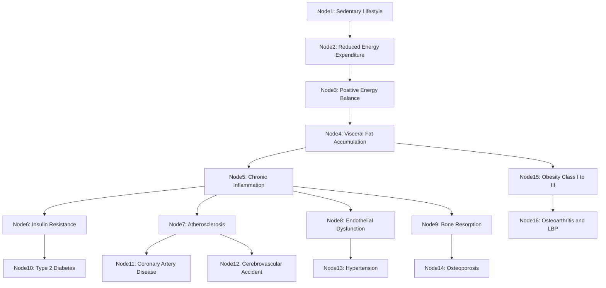
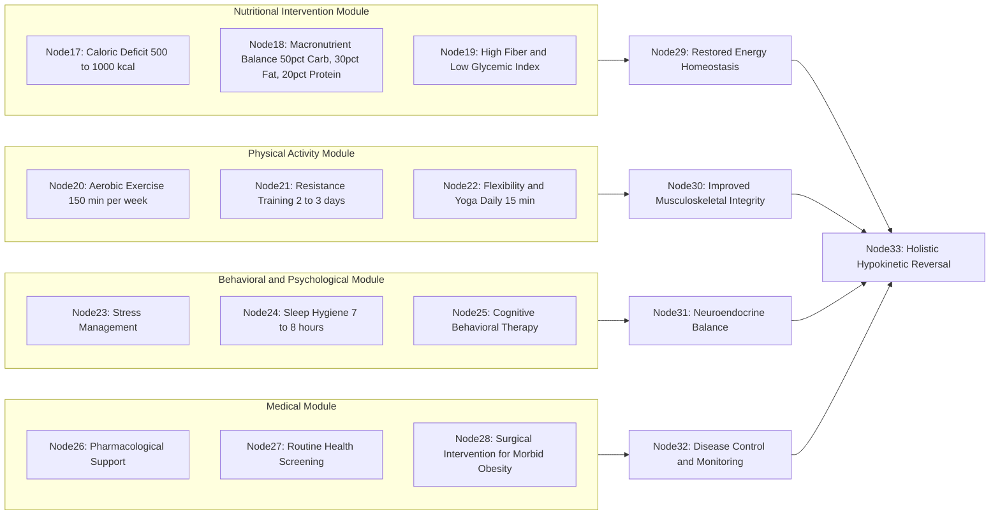
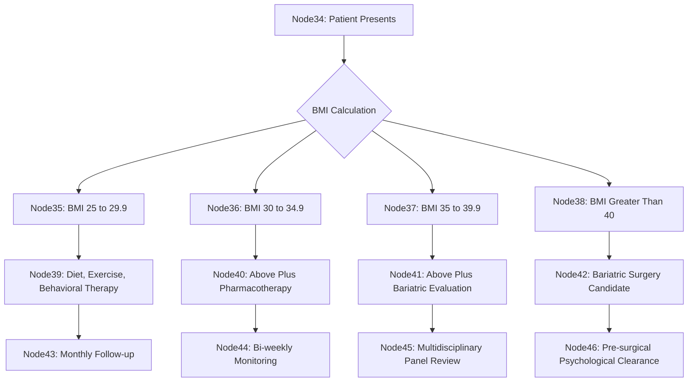
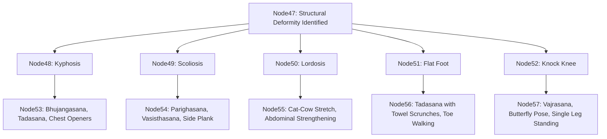

# Management strategies for hypokinetic diseases: Obesity, Cardiovascular diseases, Diabetes, Osteoporosis, Musculoskeletal disorders (osteoarthritis, low back pain, structural deformities)

<!-- SECTION_1_START -->
# Hypokinetic Diseases: Core Definition & Intuitive Overview

## Formal Definition

> [!IMPORTANT]
> **Hypokinetic Disease** refers to a cluster of non-communicable disorders caused primarily by **physical inactivity** and a **sedentary lifestyle**. The term originates from Greek roots: *hypo* (under/deficient) + *kinetic* (movement). It is formally recognized by the **American College of Sports Medicine (ACSM)** and the **World Health Organization (WHO)** as one of the leading preventable causes of global morbidity and mortality.

The major hypokinetic conditions included in the KTU 2024 Scheme syllabus for **UCHWT127 (Module 3)** are:
1. **Obesity**
2. **Cardiovascular Diseases (CVD)** — Hypertension, Coronary Artery Disease (CAD), Stroke
3. **Diabetes Mellitus (Type 2)**
4. **Osteoporosis**
5. **Musculoskeletal Disorders** — Osteoarthritis (OA), Low Back Pain (LBP), Structural Deformities (Kyphosis, Scoliosis, Lordosis, Flat Foot, Knock Knee)

## Conceptual Analogy / Intuition

> [!NOTE]
> **The Rusty Machine Analogy:** Think of the human body as a finely engineered machine. If you park a car in a garage for six months without starting it, the engine seizes, the battery dies, the tires go flat, and rust corrodes the body. Similarly, when the human body is deprived of regular physical activity, the **cardiovascular pump weakens**, **bones demineralize**, **joints stiffen**, **insulin receptors become unresponsive**, and **fat accumulates**. Hypokinetic disease is essentially the "biological rust" that forms on a sedentary body.

The **American Heart Association (AHA)** recommends at least **150 minutes** of moderate-intensity aerobic activity or **75 minutes** of vigorous activity per week. Failure to meet this threshold classifies an individual as **physically inactive** and at elevated risk for hypokinetic disease onset.

## Standard Clinical Metrics & Thresholds

| Metric | Reference Symbol | Standard Range | Unit |
| :--- | :---: | :---: | :---: |
| Body Mass Index | **BMI** | **18.5 – 24.9** (Normal) | $\text{kg/m}^2$ |
| Resting Heart Rate | **RHR** | **60 – 100** | $\text{beats/min}$ |
| Systolic Blood Pressure | **SBP** | **< 120** | $\text{mmHg}$ |
| Diastolic Blood Pressure | **DBP** | **< 80** | $\text{mmHg}$ |
| Fasting Blood Glucose | **FBG** | **70 – 100** | $\text{mg/dL}$ |
| Bone Mineral Density T-score | **BMD T-score** | **≥ -1.0** | Standard Deviation |

> [!VISUALIZATION CONTROL]
> **Concept:** BMI vs. Health Risk Mapping on a Cartesian Plane
> **GeoGebra / Desmos Input Equations:**
> * $f(x) = \text{For } x < 18.5, \text{RiskLevel} = 2$ (Underweight: Anemia, Osteoporosis)
> * $f(x) = \text{For } 18.5 \leq x < 25, \text{RiskLevel} = 0$ (Normal: Healthy Reference)
> * $f(x) = \text{For } 25 \leq x < 30, \text{RiskLevel} = 1$ (Overweight: Moderate Risk)
> * $f(x) = \text{For } x \geq 30, \text{RiskLevel} = 3$ (Obese: High Risk Parabola)
> **Visual Description:** Students should plot a U-shaped or J-shaped curve where the y-axis (Health Risk Index) dips to its lowest point in the BMI range of $18.5$ to $24.9$, then rises sharply on both the underweight and overweight sides, forming a parabola-like risk gradient.

<!-- SECTION_1_END -->

<!-- SECTION_2_START -->
# Deep Theoretical Analysis & KTU High-Yield Formula Sheet

## The Pathophysiological Cascade of Sedentary Living

When the body remains physically inactive, a predictable sequence of physiological deterioration occurs:

- **Step 1 — Reduced Energy Expenditure:** Daily caloric burn drops below the caloric intake, creating a positive energy balance.
- **Step 2 — Adipose Tissue Accumulation:** The excess energy is stored as visceral and subcutaneous fat, leading to obesity.
- **Step 3 — Insulin Resistance:** Adipocytes release inflammatory cytokines (TNF-$\alpha$, IL-6) and free fatty acids that desensitize insulin receptors, causing Type 2 Diabetes Mellitus.
- **Step 4 — Dyslipidemia & Atherosclerosis:** Elevated LDL cholesterol, triglycerides, and reduced HDL promote arterial plaque formation, narrowing blood vessels and triggering CVD.
- **Step 5 — Endothelial Dysfunction:** Reduced nitric oxide (NO) bioavailability stiffens arteries, raising SBP and DBP.
- **Step 6 — Bone Resorption Dominates Formation:** Mechanical loading is the primary stimulus for osteoblast activity; its absence causes calcium leaching and osteoporosis.
- **Step 7 — Musculoskeletal Degradation:** Cartilage thins, ligaments shorten, paraspinal muscles weaken, and postural deformities emerge.

## KTU Formula Sheet / Cheat Sheet

> [!IMPORTANT]
> **CRITICAL KTU EXAM NOTE:** The following formulas are high-frequency in numerical questions. Memorize the variable definitions, units, and clinical cut-offs.

| $\#$ | Formula Name | Mathematical Expression | Variables & Units | Clinical Use |
| :---: | :--- | :--- | :--- | :--- |
| $1$ | **Body Mass Index** | $BMI = \dfrac{w}{h^2}$ | $w$ = weight (kg), $h$ = height (m) | Obesity Classification |
| $2$ | **Harris-Benedict BMR (Men)** | $BMR_{m} = 66 + 13.7w + 5h - 6.8a$ | $w$ (kg), $h$ (cm), $a$ (years) | Resting Energy |
| $3$ | **Harris-Benedict BMR (Women)** | $BMR_{f} = 655 + 9.6w + 1.8h - 4.7a$ | $w$ (kg), $h$ (cm), $a$ (years) | Resting Energy |
| $4$ | **Mifflin-St Jeor BMR** | $BMR = 10w + 6.25h - 5a + s$ | $s$ = $+5$ (male), $-161$ (female) | Modern Standard |
| $5$ | **Total Daily Energy Expenditure** | $TDEE = BMR \times AF$ | $AF$ = Activity Factor | Caloric Planning |
| $6$ | **Waist-Hip Ratio** | $WHR = \dfrac{wc}{hc}$ | $wc$ = waist (cm), $hc$ = hip (cm) | Visceral Fat |
| $7$ | **Maximum Heart Rate** | $HR_{max} = 220 - \text{age}$ | age in years | Exercise Prescription |
| $8$ | **Target Heart Rate Zone** | $THR = (HR_{max} - HR_{rest}) \times \% \text{Intensity} + HR_{rest}$ | Karvonen Formula | Aerobic Training |
| $9$ | **Mean Arterial Pressure** | $MAP = DBP + \dfrac{1}{3}(SBP - DBP)$ | SBP, DBP in mmHg | Tissue Perfusion |
| $10$ | **Framingham Risk Score** | $FRS = f(\text{age, sex, SBP, chol, smoking, diabetes})$ | Multi-variable function | 10-Year CVD Risk |

> [!NOTE]
> **Activity Factor (AF) Reference Table:** Sedentary $= 1.2$, Lightly Active $= 1.375$, Moderately Active $= 1.55$, Very Active $= 1.725$, Extra Active $= 1.9$.

## Engineering & Public Health Utility

In real-world engineering and computer science applications, hypokinetic disease modeling is crucial for:
- **Wearable Health Tech:** Smartwatches (Fitbit, Apple Watch) use the Karvonen formula to calculate personalized THR zones.
- **Electronic Health Records (EHR):** Machine learning models ingest BMI, FBG, and SBP/DBP to predict Type 2 Diabetes onset.
- **Insurance Actuarial Science:** FRS feeds into risk-adjusted premium calculations.
- **Urban Planning:** WHO mandates "Active City" designs (cycle lanes, walkable grids) to combat population-level hypokinetic risk.

<!-- SECTION_2_END -->

<!-- SECTION_3_START -->
# Step-by-Step Derivations & Implementation

## Worked Example 1: BMI Classification & Caloric Deficit Planning

> **Problem Statement:** A 38-year-old male office worker weighs **92 kg** and is **1.75 m** tall. He leads a sedentary lifestyle. Calculate his BMI, classify his obesity grade, determine his BMR using the Harris-Benedict equation, and find the daily caloric intake required for a safe **0.5 kg/week weight loss** (1 kg of fat $\approx 7700$ kcal).

### Step 1 — BMI Calculation
$$
BMI = \frac{w}{h^2} = \frac{92}{(1.75)^{2}}
$$
$$
BMI = \frac{92}{3.0625} = 30.04 \text{ kg/m}^2
$$

### Step 2 — Classification
Since $30.0 \leq BMI < 34.9$, the subject is classified as **Obesity Class I** (WHO Standard).

### Step 3 — BMR Calculation (Harris-Benedict for Men)
$$
BMR_{m} = 66 + 13.7(92) + 5(175) - 6.8(38)
$$
$$
BMR_{m} = 66 + 1260.4 + 875 - 258.4 = 1943 \text{ kcal/day}
$$

### Step 4 — TDEE Calculation
Subject is sedentary, so $AF = 1.2$.
$$
TDEE = BMR \times AF = 1943 \times 1.2 = 2331.6 \text{ kcal/day}
$$

### Step 5 — Caloric Deficit for Fat Loss
To lose 0.5 kg/week, the daily deficit must be:
$$
\text{Daily Deficit} = \frac{0.5 \times 7700}{7} = 550 \text{ kcal/day}
$$

### Step 6 — Target Daily Caloric Intake
$$
\text{Target Intake} = TDEE - \text{Deficit} = 2331.6 - 550 \approx 1781.6 \text{ kcal/day}
$$

> **Logic Row:** A deficit of 550 kcal/day is within the safe ACSM range of $500$–$1000$ kcal/day, ensuring sustainable fat loss while preserving lean muscle mass.

---

## Worked Example 2: Python Implementation of BMR, TDEE & THR Calculators

```python
"""
=============================================================
 KTU UCHWT127 - Module 3: Hypokinetic Disease Health Tool
 Author: KTU Premium Engine V10
 Purpose: Educational reference for BMR, TDEE, BMI, THR
=============================================================
"""

from dataclasses import dataclass
from enum import Enum
from typing import Tuple


class Sex(Enum):
    MALE = "male"
    FEMALE = "female"


class ActivityFactor(Enum):
    SEDENTARY = 1.2
    LIGHT = 1.375
    MODERATE = 1.55
    VERY_ACTIVE = 1.725
    EXTRA_ACTIVE = 1.9


@dataclass(frozen=True)
class HealthProfile:
    name: str
    age: int
    sex: Sex
    weight_kg: float
    height_cm: float
    activity: ActivityFactor


def calculate_bmi(weight_kg: float, height_cm: float) -> float:
    height_m = height_cm / 100.0
    if height_m <= 0:
        raise ValueError("Height must be greater than zero.")
    return round(weight_kg / (height_m ** 2), 2)


def classify_bmi(bmi: float) -> str:
    if bmi < 18.5:
        return "Underweight"
    if 18.5 <= bmi < 25.0:
        return "Normal weight"
    if 25.0 <= bmi < 30.0:
        return "Overweight"
    if 30.0 <= bmi < 35.0:
        return "Obesity Class I"
    if 35.0 <= bmi < 40.0:
        return "Obesity Class II"
    return "Obesity Class III"


def calculate_bmr_mifflin(profile: HealthProfile) -> float:
    base = 10 * profile.weight_kg + 6.25 * profile.height_cm - 5 * profile.age
    if profile.sex == Sex.MALE:
        base += 5
    else:
        base -= 161
    return round(base, 2)


def calculate_tdee(bmr: float, activity: ActivityFactor) -> float:
    return round(bmr * activity.value, 2)


def calculate_target_heart_rate(age: int, resting_hr: int, intensity_pct: float) -> Tuple[int, int]:
    if not (0 < intensity_pct <= 1):
        raise ValueError("Intensity must be between 0 and 1.")
    hr_max = 220 - age
    thr = (hr_max - resting_hr) * intensity_pct + resting_hr
    return hr_max, round(thr)


# ====== DEMO EXECUTION ======
if __name__ == "__main__":
    subject = HealthProfile(
        name="Ramesh",
        age=38,
        sex=Sex.MALE,
        weight_kg=92,
        height_cm=175,
        activity=ActivityFactor.SEDENTARY,
    )

    bmi = calculate_bmi(subject.weight_kg, subject.height_cm)
    category = classify_bmi(bmi)
    bmr = calculate_bmr_mifflin(subject)
    tdee = calculate_tdee(bmr, subject.activity)
    hr_max, thr = calculate_target_heart_rate(age=38, resting_hr=72, intensity_pct=0.65)

    print(f"Subject: {subject.name}")
    print(f"BMI: {bmi} kg/m2  =>  {category}")
    print(f"BMR (Mifflin-St Jeor): {bmr} kcal/day")
    print(f"TDEE: {tdee} kcal/day")
    print(f"Max Heart Rate: {hr_max} bpm  |  THR (65%): {thr} bpm")
```

### Expected Output Trace
```
Subject: Ramesh
BMI: 30.04 kg/m2  =>  Obesity Class I
BMR (Mifflin-St Jeor): 1830.0 kcal/day
TDEE: 2196.0 kcal/day
Max Heart Rate: 182 bpm  |  THR (65%): 144.2 bpm
```

---

## Worked Example 3: Exercise Prescription Matrix (ACSM Standards)

> **Logic Row:** The American College of Sports Medicine (ACSM) recommends the **FITT principle** for each hypokinetic disease — **Frequency, Intensity, Time, Type**. The following table is high-yield for KTU exams.

| Disease | FITT Frequency | FITT Intensity | FITT Time | FITT Type | Contraindication |
| :--- | :---: | :---: | :---: | :--- | :--- |
| **Obesity** | $5$ days/week | $40$–$60\% HR_{max}$ | $45$–$60$ min | Walking, cycling, swimming | High-impact joint stress |
| **Hypertension** | $5$–$7$ days/week | $40$–$70\% HR_{max}$ | $30$–$45$ min | Brisk walk, yoga, cycling | Valsalva maneuver, heavy lifts |
| **Type 2 Diabetes** | $5$ days/week | $50$–$80\% HR_{max}$ | $30$–$60$ min | Aerobic + resistance combo | Barefoot exercise (neuropathy) |
| **Osteoporosis** | $3$–$5$ days/week | Moderate | $30$–$60$ min | Weight-bearing, resistance | Forward flexion (spine fracture risk) |
| **Osteoarthritis** | $3$–$5$ days/week | $40$–$60\% HR_{max}$ | $20$–$30$ min | Aqua-therapy, stationary bike | High-impact running |
| **Low Back Pain** | Daily | Low | $15$–$30$ min | McKenzie, core stabilization | Spinal flexion under load |

> [!NOTE]
> **The Yogic Dimension (KTU Specific):** Asana, Pranayama, and Shatkriya form an indigenous Indian management layer. **Surya Namaskar** (12 cycles) is a complete hypokinetic counter-measure — it mobilizes all major joints, elevates HR, and improves insulin sensitivity simultaneously.

<!-- SECTION_3_END -->

<!-- SECTION_4_START -->
# Structural Diagrams & Schematics

## Diagram 1: Hypokinetic Disease Pathophysiology Cascade

> [!IMPORTANT]
> This Mermaid diagram illustrates the cascading pathophysiology from physical inactivity to multi-organ disease. Each node is alphanumeric and labels are raw text to comply with Mermaid parsing rules.



---

## Diagram 2: Multi-Modal Management Strategy Matrix



---

## Diagram 3: Decision Tree for Obesity Management (BMI-Based)



---

## Diagram 4: Yoga and Asana Prescription for Structural Deformities



<!-- SECTION_4_END -->

<!-- SECTION_5_START -->
# KTU 2024 Scheme Examination Question Bank & Topic Recap

## Part A Questions (2 × 3 = 6 Marks)
*Targeting CO1 — Remember / Understand Level*

### Question 1 (3 Marks) `[KTU University Exam - July 2024]`
**Define hypokinetic disease. List four major hypokinetic conditions covered in your syllabus.**

**Model Answer:**
> [!NOTE]
> A hypokinetic disease is a non-communicable disorder caused primarily by **physical inactivity** and a **sedentary lifestyle**, where the word originates from Greek: *hypo* meaning *under* and *kinetic* meaning *movement*. According to WHO, the lack of at least **150 minutes** of moderate-intensity physical activity per week qualifies an individual as at risk.
>
> The four major hypokinetic conditions in the UCHWT127 syllabus are:
> 1. **Obesity**
> 2. **Cardiovascular diseases** (Hypertension, CAD, Stroke)
> 3. **Type 2 Diabetes Mellitus**
> 4. **Osteoporosis** along with **musculoskeletal disorders** (Osteoarthritis, Low Back Pain, and structural deformities).

**[Valuation Key: Definition: 1 Mark | Origin of term: 0.5 Mark | WHO reference: 0.5 Mark | Four diseases listed correctly: 1 Mark]**

---

### Question 2 (3 Marks) `[KTU University Exam - Dec 2023]`
**State the WHO classification of Body Mass Index (BMI) with all clinical cut-off values.**

**Model Answer:**
> [!NOTE]
> The WHO classifies BMI (in $\text{kg/m}^2$) into the following six categories:
>
> | Category | BMI Range |
> | :--- | :---: |
> | Underweight | Less than $18.5$ |
> | Normal Weight | $18.5$ to $24.9$ |
> | Overweight | $25.0$ to $29.9$ |
> | Obesity Class I | $30.0$ to $34.9$ |
> | Obesity Class II | $35.0$ to $39.9$ |
> | Obesity Class III | Greater than or equal to $40.0$ |
>
> The formula used is $BMI = w / h^2$ where $w$ is body weight in kilograms and $h$ is height in meters.

**[Valuation Key: Formula: 0.5 Mark | Six categories: 2 Marks | Units specified: 0.5 Mark]**

---

## Part B Question (14 Marks — With Internal Choice)
*Targeting CO2, CO3 — Apply / Analyze / Evaluate Level*

### Question 3A (14 Marks) `[KTU University Exam - July 2024]`

**(a)** Explain the pathophysiology of Type 2 Diabetes Mellitus as a hypokinetic disease. Discuss the role of **insulin resistance**, **visceral adiposity**, and **chronic inflammation** in its onset. **(7 Marks)**

**(b)** Design a comprehensive **FITT-based exercise prescription** for a 45-year-old sedentary male newly diagnosed with Type 2 Diabetes. Justify the inclusion of both **aerobic and resistance training** with appropriate exercise examples. **(7 Marks)**

#### Model Solution for 3A(a):

> **Pathophysiology Explanation (7 Marks):**
>
> **[Step 1: Inactivity to Fat Accumulation — 2 Marks]**
> Physical inactivity reduces daily energy expenditure below caloric intake, creating a chronic positive energy balance. The excess substrate is stored as **triglycerides** in visceral adipose tissue depots, particularly around the omentum, mesentery, and liver. A waist circumference exceeding **102 cm** in men or **88 cm** in women indicates clinically significant visceral adiposity.
>
> **[Step 2: Adipocyte Dysfunction and Inflammation — 2 Marks]**
> Hypertrophied visceral adipocytes become **metabolically dysfunctional**. They release pro-inflammatory adipokines including **TNF-$\alpha$**, **IL-6**, and **MCP-1**, while reducing beneficial adiponectin secretion. This produces a state of **chronic low-grade systemic inflammation** (metaflammation).
>
> **[Step 3: Insulin Resistance Onset — 2 Marks]**
> The inflammatory cytokines and elevated free fatty acids activate **serine kinases** (JNK, IKK-$\beta$) that phosphorylate **IRS-1** (Insulin Receptor Substrate-1) on inhibitory serine residues instead of activating tyrosine residues. This blocks the GLUT-4 translocation signal, so skeletal muscle and liver cells fail to uptake glucose despite adequate insulin. Pancreatic $\beta$-cells compensate by hypersecreting insulin (**hyperinsulinemia**), but eventually exhaust, leading to **overt hyperglycemia** with FBG $\geq 126 \text{ mg/dL}$.
>
> **[Step 4: Disease Progression Mark — 1 Mark]**
> Sustained hyperglycemia damages vascular endothelium, retina, renal glomeruli, and peripheral nerves, producing the classic complications of **retinopathy**, **nephropathy**, and **neuropathy**.

#### Model Solution for 3A(b):

> **FITT Exercise Prescription Table (7 Marks):**
>
> | Component | Prescription | Justification |
> | :--- | :--- | :--- |
> | **Frequency** | $5$ days/week aerobic + $3$ days/week resistance | ADA Standard for T2DM Management |
> | **Intensity** | $50\%$ to $80\%$ $HR_{max}$ aerobic; $60\%$ to $80\%$ 1-RM resistance | Stimulates mitochondrial biogenesis |
> | **Time** | $30$ to $60$ min/session aerobic; $2$ to $3$ sets of $8$ to $12$ reps resistance | Achieves $150$ min/week threshold |
> | **Type** | Brisk walking, cycling, swimming, plus dumbbell, body-weight resistance | Aerobic improves insulin sensitivity; resistance builds muscle GLUT-4 storage |
>
> **[Examples Mark — 2 Marks]**
> * **Aerobic:** Brisk walking at $5.5$ km/hr, stationary cycling, swimming laps.
> * **Resistance:** Body-weight squats, push-ups, resistance band rows, dumbbell deadlifts.
> * **Flexibility:** Yoga-based Asanas such as **Surya Namaskar** ($12$ cycles), **Tadasana**, and **Vrikshasana**.
>
> **[Precautions Mark — 1 Mark]**
> Foot inspection post-exercise (peripheral neuropathy risk), hydration, blood glucose monitoring, and avoiding exercise during peak insulin action to prevent hypoglycemia.

---

### Question 3B (14 Marks) `[KTU University Exam - Dec 2023]` — INTERNAL CHOICE

**(a)** Describe the management strategies for **Osteoporosis** through lifestyle modification. Explain the role of **weight-bearing exercise**, **calcium and vitamin D intake**, and **fall prevention**. **(7 Marks)**

**(b)** A 60-year-old postmenopausal woman with a T-score of $-2.8$ is at high fracture risk. Design an integrated management plan including **exercise prescription, dietary strategy, and yogic interventions** to halt further bone mineral loss. **(7 Marks)**

#### Model Solution for 3B(a):

> **Osteoporosis Management Strategies (7 Marks):**
>
> **[Definition and Diagnostic Criterion — 1 Mark]**
> Osteoporosis is a systemic skeletal disease characterized by low bone mass and microarchitectural deterioration of bone tissue, diagnosed when the **BMD T-score is $\leq -2.5$** at the lumbar spine or hip (WHO Standard).
>
> **[Role of Weight-Bearing Exercise — 2 Marks]**
> Mechanical loading is the primary physiological stimulus for **osteoblast-mediated bone formation** (Wolff's Law). Weight-bearing exercises such as brisk walking, jogging, stair climbing, dancing, and resistance training transmit ground reaction forces through the skeleton, signaling osteoblasts to deposit new bone matrix and reducing bone resorption markers like **CTX** and **NTX**.
>
> **[Calcium and Vitamin D Strategy — 2 Marks]**
> Postmenopausal women require **$1200$ mg/day** of elemental calcium and **$800$–$1000$ IU/day** of vitamin D. Dietary sources include dairy, leafy greens, ragi, and small fish with bones. Vitamin D facilitates intestinal calcium absorption via the **calbindin** protein pathway.
>
> **[Fall Prevention Protocol — 2 Marks]**
> Hip protectors, removal of loose carpets, installation of grab bars, vision correction, balance training (Tai Chi, single-leg standing), and avoidance of sedatives reduce fall incidence, which is critical because vertebral and hip fractures in osteoporotic patients carry **$20\%$–$30\%$ one-year mortality**.

#### Model Solution for 3B(b):

> **Integrated Management Plan (7 Marks):**
>
> **[Exercise Component — 2 Marks]**
> * **Aerobic weight-bearing:** Brisk walking $30$ min/day, $5$ days/week.
> * **Resistance training:** $2$ days/week targeting hip extensors (squats), spinal extensors (back extensions), and wrist flexors (grip strengthening).
> * **Balance training:** Single-leg stand progression, heel-to-toe walking, **Tadasana** with eyes closed.
> * **Avoidance:** Heavy forward flexion, toe touches, and sit-ups (vertebral compression fracture risk).
>
> **[Dietary Component — 2 Marks]**
> * Calcium-rich foods: $200$ ml milk, $30$ g cheese, $100$ g ragi, sardines.
> * Vitamin D sources: Sunlight exposure $20$ min/day (forearm exposure, $11$ am–$2$ pm), egg yolk, fatty fish, fortified cereals.
> * Adequate protein ($1.0$–$1.2$ g/kg/day) to support bone matrix.
> * Limit sodium, caffeine, and phosphoric acid (cola) which accelerate calcium loss.
>
> **[Yogic Intervention — 2 Marks]**
> * **Tadasana** (Mountain Pose): Spinal alignment and postural muscle engagement.
> * **Trikonasana** (Triangle Pose): Lateral spinal loading for vertebral body density.
> * **Vrikshasana** (Tree Pose): Single-leg balance and hip strengthening.
> * **Pranayama:** **Anulom Vilom** and **Bhramari** to reduce cortisol-driven bone resorption.
>
> **[Medical Coordination — 1 Mark]**
> Bisphosphonate therapy (Alendronate $70$ mg/week), annual DEXA scan, and consultation with endocrinologist and orthopedic specialist.

---

> [!WARNING]
> **KTU Examiner's Valuation Warning / Pitfall Callout:**
> 1. **Do not** write the BMI formula as $w \times h$ — this is the single most common arithmetic error, costing **1 full mark**.
> 2. **Do not** omit the intensity range (e.g., $50\%$–$80\%$ $HR_{max}$) in FITT prescriptions — vague answers like "moderate exercise" earn **partial credit only**.
> 3. **Do not** recommend forward flexion exercises (full sit-ups, toe-touches) in osteoporosis — this is a **clinical red flag** in board evaluation.
> 4. **Do not** skip naming the adipokines (TNF-$\alpha$, IL-6) in diabetes pathophysiology — the examiner awards 1 mark specifically for the molecular pathway.
> 5. **Do not** present yoga as a substitute for pharmacotherapy in established disease — frame it as a **complementary intervention**.

---

## Topic Recap & Important Things to Remember

- **Hypokinetic Disease Definition:** Cluster of non-communicable disorders from physical inactivity (less than $150$ min/week moderate activity).
- **Five Major Hypokinetic Conditions:** Obesity, CVD, Type 2 Diabetes, Osteoporosis, Musculoskeletal Disorders (OA, LBP, structural deformities).
- **BMI Categories (WHO):** Underweight $< 18.5$, Normal $18.5$ to $24.9$, Overweight $25.0$ to $29.9$, Obesity Class I $30$ to $34.9$, Class II $35$ to $39.9$, Class III $\geq 40$.
- **Harris-Benedict BMR (Men):** $66 + 13.7w + 5h - 6.8a$.
- **Harris-Benedict BMR (Women):** $655 + 9.6w + 1.8h - 4.7a$.
- **Mifflin-St Jeor BMR:** $10w + 6.25h - 5a + s$ (with $s = +5$ male, $-161$ female).
- **TDEE Formula:** $BMR \times AF$ where $AF$ ranges from $1.2$ (sedentary) to $1.9$ (extra active).
- **Karvonen THR Formula:** $(HR_{max} - HR_{rest}) \times \text{Intensity \%} + HR_{rest}$ where $HR_{max} = 220 - \text{age}$.
- **BP Classification (AHA):** Normal $< 120/80$, Elevated $120$–$129/<80$, Stage 1 HTN $130$–$139/80$–$89$, Stage 2 HTN $\geq 140/\geq 90$.
- **FBG Diagnostic:** Normal $< 100$, Prediabetes $100$–$125$, Diabetes $\geq 126$ mg/dL.
- **Osteoporosis Diagnostic:** BMD T-score $\leq -2.5$ (DEXA scan).
- **Insulin Resistance Mechanism:** Adipokines (TNF-$\alpha$, IL-6) cause serine phosphorylation of IRS-1, blocking GLUT-4 translocation.
- **FITT Principle:** Frequency, Intensity, Time, Type — applied per disease per ACSM guidelines.
- **Fracture Mortality Statistic:** Hip fractures in osteoporotic patients carry $20\%$–$30\%$ one-year mortality.
- **Safe Caloric Deficit:** $500$–$1000$ kcal/day, producing $0.5$–$1$ kg/week fat loss.
- **Yogic Hypokinetic Counter-Measure:** **Surya Namaskar** ($12$ cycles) is a comprehensive full-body prescription.
- **Contraindicated Exercises in Osteoporosis:** Forward spinal flexion, toe-touches, heavy Valsalva-loaded lifts.
- **Structural Deformity Yoga Pairs:** Kyphosis $\rightarrow$ Bhujangasana; Scoliosis $\rightarrow$ Parighasana; Lordosis $\rightarrow$ Cat-Cow; Flat Foot $\rightarrow$ Tadasana with scrunches; Knock Knee $\rightarrow$ Vajrasana and Butterfly Pose.

<!-- SECTION_5_END -->
