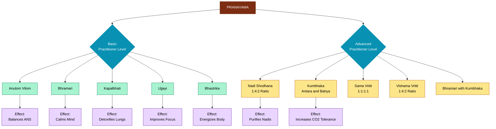
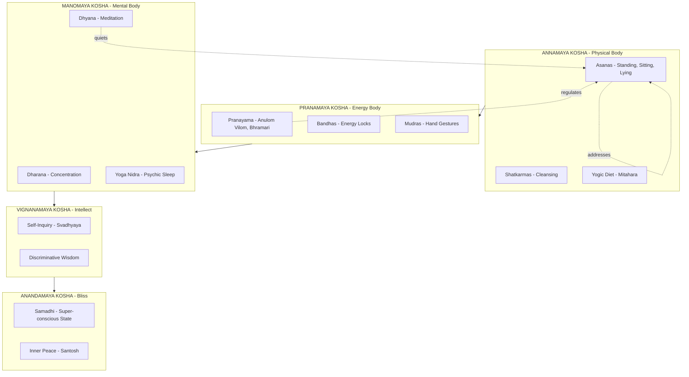
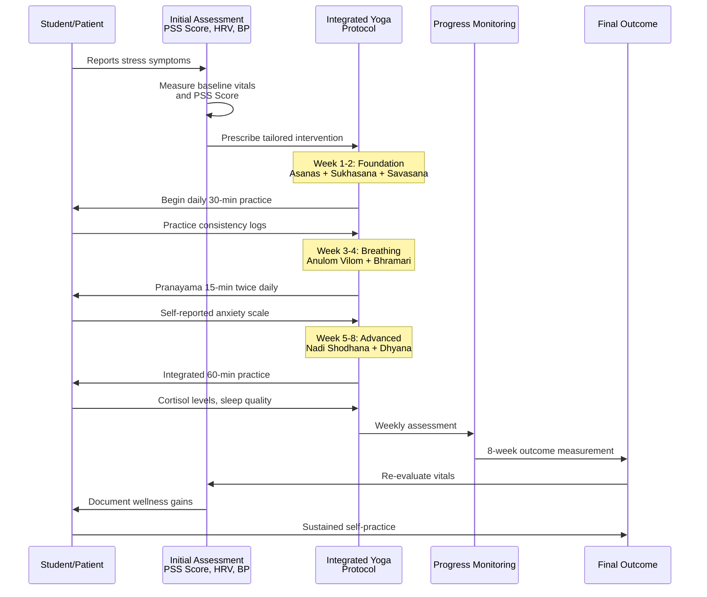

# Meaning, Aims and objectives of yoga, Classification of Yogic Asanas (Sitting, Standing, lying), Pranayama and Its Types, Stress Management Through Yoga

<!-- SECTION_1_START -->
# Yoga: The Science of Integrated Well-Being

## 1.1 Formal Definition (KTU 2024 UCHWT127 Terminology)

> [!NOTE]
> **Yoga (योग)** is formally defined as a classical Indian psycho-physical discipline originating from the Vedic and Upanishadic traditions, codified by **Maharishi Patanjali** in the **Yoga Sutras of Patanjali** (circa 2nd Century BCE). It is the methodical control and unification of the modifications (*vrittis*) of the mind-stuff (*chitta*).

The etymological root of the word **Yoga** is the Sanskrit verb **"Yuj"** (युज्), meaning **"to join," "to yoke," or "to unite."** This signifies the union of the individual consciousness (*Jivatma*) with the universal consciousness (*Paramatma*).

Patanjali's classical definition in *Yoga Sutra 1.2* states:

$$
\text{Yogah chitta vritti nirodhah}
$$

Which translates to: **"Yoga is the cessation (nirodhah) of the fluctuations (vritti) of the mind (chitta)."** When the mind is perfectly still, the seer (*drashtha*) abides in its own true nature.

> [!IMPORTANT]
> **KTU 2024 Syllabus Highlight:** For the University examination, students must clearly distinguish between **Ashtanga Yoga** (the eight-limbed path of Patanjali) and modern physical yoga (Hatha Yoga derivatives). Marks are awarded for citing Patanjali's classical framework.

---

## 1.2 Intuitive Analogy: The Chariot of Consciousness

Imagine the human body as a magnificent **chariot** drawn by two powerful but untrained horses. This analogy comes from the **Katha Upanishad (1.3.3-6)**:

- **The Chariot** = The Physical Body (*Sharira*)
- **The Horses** = The Senses (*Indriyas*), which pull the mind in all directions
- **The Charioteer** = The Intellect/Mind (*Buddhi/Manas*)
- **The Passenger** = The Soul (*Atma*)

When the horses are wild, the chariot crashes through life, leading to **stress, disease, and discontent**. **Yoga trains the charioteer (the mind)** to hold the reins firmly, align the senses, and guide the chariot purposefully toward well-being. A trained charioteer does not kill the horses — he harmonizes them.

---

## 1.3 Aims and Objectives of Yoga

The practice of yoga is a holistic system with multi-dimensional objectives that align with the **World Health Organization (WHO)** definition of health: a state of complete **physical, mental, and social well-being**.

| Sl. No. | Aim | Operational Objective |
|---|---|---|
| 1 | **Physical Aim** | To achieve a disease-free, flexible, and strong body through *Asanas* and *Shatkarmas* |
| 2 | **Mental Aim** | To cultivate mental clarity, emotional balance, and cognitive sharpness through *Pranayama* and *Dhyana* |
| 3 | **Spiritual Aim** | To realize the highest potential of human consciousness and attain self-realization (*Kaivalya*) |
| 4 | **Social Aim** | To develop compassion, equanimity, and harmonious interpersonal relationships (*Yama/Niyama*) |
| 5 | **Preventive Aim** | To prevent lifestyle disorders like hypertension, diabetes, obesity, and anxiety |
| 6 | **Therapeutic Aim** | To act as an adjunct therapy in rehabilitation from chronic illness and addiction |
| 7 | **Productivity Aim** | To enhance concentration, focus, and workplace efficiency in engineering professionals |

> [!IMPORTANT]
> The **KTU 2024 Scheme** specifically maps these objectives to **Course Outcome (CO) 3** of UCHWT127: *Identify lifestyle modification techniques for holistic well-being and stress reduction.*

---

## 1.4 Conceptual Visualization: The Eight Limbs of Yoga (Ashtanga)

> [!VISUALIZATION CONTROL]
> **Concept:** Hierarchical flow of Patanjali's Ashtanga Yoga
> **GeoGebra / Desmos Input Equations (Conceptual Coordinate Mapping):**
> * $X\text{-axis:}$ Stages of Practice (1 to 8)
> * $Y\text{-axis:}$ Depth of Consciousness (Yama=1, Niyama=2 ... Samadhi=8)
> * $P_1 = (1,1)$ representing Yama
> * $P_2 = (2,2)$ representing Niyama
> * $P_8 = (8,8)$ representing Samadhi
> **Visual Description:** A linear ascending staircase from external moral conduct (Yama) at the base to the highest meditative absorption (Samadhi) at the peak, demonstrating that physical postures are only one of eight limbs.

The **Ashtanga Yoga** of Patanjali is the structural backbone of yogic practice:

1. **Yama** — Social restraints (Ahimsa, Satya, Asteya, Brahmacharya, Aparigraha)
2. **Niyama** — Personal observances (Shaucha, Santosha, Tapas, Svadhyaya, Ishvara Pranidhana)
3. **Asana** — Physical postures
4. **Pranayama** — Breath regulation
5. **Pratyahara** — Withdrawal of senses
6. **Dharana** — Concentration
7. **Dhyana** — Meditation
8. **Samadhi** — Super-conscious absorption

> [!NOTE]
> In the KTU 2024 examination, students are expected to know that the *Yoga Sutras* contain **195 sutras** organized into **4 padas (chapters)**.
<!-- SECTION_1_END -->

<!-- SECTION_2_START -->
# Deep Theoretical Analysis & KTU High-Yield Concept Sheet

## 2.1 Theoretical Foundation of Yogic Practice

Yoga operates on a **three-tiered mechanism** in the human system:

- **Annamaya Kosha** (Physical Body / Food Sheath) — addressed by *Asanas*
- **Pranamaya Kosha** (Energy Body / Breath Sheath) — addressed by *Pranayama*
- **Manomaya Kosha** (Mental Body / Mind Sheath) — addressed by *Dhyana*

The mind-body connection in yoga is mediated by the **Autonomic Nervous System (ANS)** and the **Hypothalamic-Pituitary-Adrenal (HPA) axis**, both of which are directly modulated by yogic practices.

---

## 2.2 Classification of Yogic Asanas (Yoga Kriyas)

Modern yoga pedagogy classifies asanas based on the **starting body position** because spinal alignment, gravity, and muscle engagement differ fundamentally across positions. The **Ministry of AYUSH, Government of India** recognizes this standard classification under the *Common Yoga Protocol*.

> [!IMPORTANT]
> **KTU Examination Tip:** When the question asks to "classify asanas with two examples each," examiners award **2 marks for the correct classification system**, **2 marks per category for listing correct examples**, and the remaining marks for descriptive accuracy.

### Master Classification Table

| Category | Spinal Position | Gravity Effect | Primary Effect on Body | Standing Example | Sitting Example | Lying Example |
|---|---|---|---|---|---|---|
| **Standing Asanas** | Erect, weight-bearing | Gravity compresses spine downward | Strengthens legs, improves balance, activates large muscle groups | Tadasana, Vrikshasana | Padmasana, Sukhasana, Vajrasana, Paschimottanasana | Savasana, Sarvangasana, Bhujangasana, Setu Bandhasana, Halasana, Naukasana, Matsyasana |
| **Sitting Asanas** | Pelvis grounded, spine erect | Gravity supports lower body | Stretches hips, knees, and spine; calms the nervous system | — | — | — |
| **Lying Asanas (Supine \& Prone)** | Body fully supported by floor | Gravity elongates the spine | Deep relaxation, spinal decompression, abdominal strengthening | — | — | — |

---

### 2.2.1 Standing Asanas (Sthanika Asanas)

These are weight-bearing postures that build **muscular endurance, proprioception, and skeletal alignment**. They are considered the **foundation posture** from which all other categories derive.

**Theoretical Mechanism:** Standing asanas activate the **anti-gravity muscles** (soleus, gastrocnemius, quadriceps, paraspinals) and stimulate the **vestibular system**, enhancing balance.

**Key Standing Asanas with Procedural Logic:**

- **Tadasana (Mountain Pose):** Stand with feet together, big toes touching. Distribute weight evenly. Engage thighs, lift the kneecaps, lengthen the spine, crown of head reaching toward the ceiling. Arms alongside the body, palms facing forward. Breathe normally. Hold for 30-60 seconds. *This is the reference pose for all standing postures.*
- **Vrikshasana (Tree Pose):** Shift weight to the left foot. Place the right foot on the inner left thigh (avoid knee). Join palms in *Anjali Mudra* overhead. Fix gaze (*drishti*) on a stationary point. Hold for 20-30 seconds per side.
- **Trikonasana (Triangle Pose):** Step feet 3-4 feet apart. Turn right foot 90° outward. Extend arms horizontally. Reach right hand down to right shin/ankle, left arm straight up. Gaze toward the upper hand.
- **Virabhadrasana I (Warrior I):** Lunge with right foot forward, knee over ankle. Left foot turned 45°. Arms extended overhead. Gaze forward. Strengthens quads, glutes, and core.

### 2.2.2 Sitting Asanas (Upastha/Aasaneeyaka Asanas)

Sitting asanas are divided further into **forward bends, backward bends, twists, and meditative poses**. The pelvis is the anatomical pivot in all sitting postures.

**Theoretical Mechanism:** Sitting asanas create **isometric stretching** of the posterior chain (hamstrings, gluteals, erector spinae) and stimulate the **parasympathetic nervous system** through forward folds.

**Key Sitting Asanas:**

- **Padmasana (Lotus Pose):** Classic meditation posture. Sit with legs extended. Bend right knee, place right foot on left thigh. Bend left knee, place left foot on right thigh. Spine erect, hands on knees in *Gyan Mudra*. Knees must touch the floor. *Caution: Requires hip external rotation flexibility; do not force.*
- **Sukhasana (Easy Pose):** Cross-legged sitting with feet under opposite knees. Most accessible meditation pose.
- **Vajrasana (Thunderbolt Pose):** Kneel, sit on heels, big toes touching. The **only asana recommended for meditation after meals** as it aids digestion via the *Vajra Nadi*.
- **Paschimottanasana (Seated Forward Bend):** Sit with legs extended forward. Inhale, lengthen the spine. Exhale, hinge from hips, reach for the feet. Lengthen rather than strain. Hold 1-3 minutes. *Stimulates the spine, liver, kidneys, and adrenal glands.*
- **Ardha Matsyendrasana (Half Lord of the Fishes Pose):** Sit with right knee bent, foot flat on floor outside left thigh. Cross left foot over right knee. Twist to the right, hooking left elbow outside right knee. Right hand on floor behind spine.
- **Gomukhasana (Cow Face Pose):** Stacked knees in opposite directions; arms in *Cow Face* arm position (one overhead bent down, other from below meeting behind the back).

### 2.2.3 Lying Asanas (Shayanasana)

The most therapeutically versatile category. Divided into **Supine (back-down)** and **Prone (face-down)** variants.

**Theoretical Mechanism:** Lying asanas eliminate gravitational stress on the spine, allowing **intervertebral disc decompression** and **parasympathetic dominance (rest-and-digest response)**.

**Key Lying Asanas:**

- **Savasana (Corpse Pose):** Lie flat on the back, legs slightly apart, arms at sides with palms up. Close the eyes. Relax every muscle consciously from toes to crown. Breathe naturally. Remain 10-15 minutes. *Called the "most difficult asana" by Swami Sivananda because the practitioner must remain awake yet deeply relaxed.*
- **Sarvangasana (Shoulder Stand):** Called the "Queen of Asanas." Lie on back, lift legs and trunk vertically, supporting the lower back with hands. Chin tucked toward chest (*thyroid lock*). Hold 30-60 seconds. *Contraindicated for neck injury, high blood pressure, menstruation, pregnancy.*
- **Halasana (Plow Pose):** From Sarvangasana, lower straight legs over the head until toes touch the floor behind. Hands clasped on the floor or supporting the back.
- **Bhujangasana (Cobra Pose):** Prone position, palms under shoulders. Inhale, lift chest off the floor using back muscles (not arms). Elbows slightly bent, shoulders away from ears. Gaze forward. *Opens the chest, strengthens the spine.*
- **Setu Bandhasana (Bridge Pose):** Supine, knees bent, feet flat. Lift the hips toward the ceiling, clasping hands beneath the back. Press shoulders down.
- **Naukasana (Boat Pose):** Supine, lift straight legs and upper back simultaneously, balancing on sit bones. Arms extended parallel to the floor. Forms a "V" shape. *Strengthens core, hip flexors.*
- **Matsyasana (Fish Pose):** Sitting with legs extended, lie back, prop chest on elbows, crown of head touching the floor. *Counter-pose to Sarvangasana; opens the throat and chest.*

---

## 2.3 Pranayama: The Science of Breath Regulation

> [!NOTE]
> **Etymology:** *Prana* (प्राण) = life force / vital energy. *Ayama* (आयाम) = extension / expansion. Thus, **Pranayama = Expansion of the Life Force** beyond its ordinary, limited boundaries.

**Prana** in yogic physiology is the **subtle energy** that pervades the universe and animates the body. It flows through **72,000 nadis (energy channels)** and is concentrated in the **seven chakras (energy centers)**. **Pranayama is the mechanism to purify these nadis** and regulate the flow of *prana*.

### Physiological Basis

Modern science validates pranayama through measurable changes in:
- **Respiratory Rate** (reduced from 14-18 breaths/min to 4-6 breaths/min in advanced practitioners)
- **Heart Rate Variability (HRV)** — marker of cardiac-autonomic resilience
- **Galvanic Skin Response (GSR)** — indicator of stress reduction
- **Cortisol Levels** — the primary stress hormone
- **Brainwave Patterns** — shift from Beta (stress) to Alpha (calm) and Theta (deep relaxation)

### Classification of Pranayama (KTU High-Yield Table)

| Type | Sanskrit Name | Mechanism | Duration Ratio (Inhale: Hold: Exhale) | Therapeutic Effect |
|---|---|---|---|---|
| **Basic** | **Anulom Vilom** (Alternate Nostril) | Alternate inhalation/exhalation through left/right nostrils | 1 : 0 : 1 (basic) | Balances sympathetic \& parasympathetic nervous system |
| **Basic** | **Bhramari** (Bee Breath) | Exhalation through nose producing humming sound like a bee | 1 : 0 : 2 with humming | Calms the mind, reduces anxiety, improves sleep |
| **Basic** | **Kapalbhati** (Skull-Shining Breath) | Active, forceful exhalations; passive inhalations | Forced exhale $\approx 30$/min | Cleanses respiratory tract, strengthens abdominal muscles |
| **Basic** | **Ujjayi** (Ocean Breath / Victorious Breath) | Constriction at the throat producing soft ocean sound | 1 : 0 : 1 with throat constriction | Improves focus, soothes nervous system |
| **Basic** | **Bhastrika** (Bellows Breath) | Rapid, deep, forceful inhale-exhale cycles | Rapid cycles (1 round = 30-40 breaths) | Energizes the body, increases oxygenation |
| **Advanced** | **Nadi Shodhana** (Channel Purification) | Refined Anulom Vilom with breath retention | 1 : 4 : 2 | Deep purification of nadis, balances ida/pingala |
| **Advanced** | **Kumbhaka** (Breath Retention) | Holding breath either internally (*Antara*) or externally (*Bahya*) | Various (1 : 4 : 2 standard) | Increases CO₂ tolerance, deepens meditation |
| **Advanced** | **Bhramari with Kumbhaka** | Bee sound + retention | 1 : 1 : 2 | Hypertension management, insomnia |
| **Advanced** | **Sama Vritti** (Equal Breathing) | Inhale = Exhale = Hold (all equal duration) | 1 : 1 : 1 : 1 | Foundation pranayama for autonomic balance |
| **Advanced** | **Vishama Vritti** (Unequal Breathing) | Different ratios for each phase | 1 : 4 : 2 classic | Mental discipline, energy control |

> [!IMPORTANT]
> **KTU 2024 Key Takeaway:** All pranayama techniques are classified along **three primary functional categories**:
> 1. **Pranasancharaka Pranayama** (channelizing prana) — e.g., Anulom Vilom, Nadi Shodhana
> 2. **Doshaghna Pranayama** (eliminating imbalances) — e.g., Kapalbhati, Bhastrika
> 3. **Chittaprasadana Pranayama** (calming the mind) — e.g., Bhramari, Ujjayi, Sama Vritti

---

## 2.4 Stress Management Through Yoga: The Mechanism

**Stress** is the body's non-specific response to any demand for change, first described by **Hans Selye** in 1936 as the **General Adaptation Syndrome (GAS)** with three stages: *Alarm, Resistance, Exhaustion*.

Yoga intervenes at all three stages through a **multi-pathway mechanism**:

| Stress Pathway | Yogic Intervention | Outcome |
|---|---|---|
| **Sympathetic Nervous System (Fight-or-Flight)** | Slow, deep, diaphragmatic breathing (Ujjayi, Anulom Vilom) | Activates **Vagus Nerve** $\rightarrow$ Parasympathetic dominance |
| **HPA Axis (Cortisol secretion)** | Forward bends, Savasana, Yoga Nidra | Reduces serum cortisol, normalizes blood glucose |
| **Muscle Tension (Somatic holding)** | Asanas (forward bends, twists, supine poses) | Releases myofascial trigger points, improves flexibility |
| **Cognitive Rumination** | Dharana (concentration), Dhyana (meditation) | Reduces activity in the **Default Mode Network (DMN)** of the brain |
| **Emotional Reactivity** | Yama/Niyama, Mindfulness, Mantra | Increases **prefrontal cortex** regulation over the **amygdala** |
| **Endocrine Imbalance** | Asanas compressing endocrine glands (e.g., Sarvangasana $\to$ thyroid) | Normalizes hormone secretion |

### KTU Formula Sheet: Stress Reduction Through Yoga

$$
\text{Stress Reduction Index} \approx f(\text{Asana}) + g(\text{Pranayama}) + h(\text{Dhyana})
$$

Where the relative weight is empirically:

$$
\text{Pranayama} > \text{Asana} > \text{Dhyana} \text{ (for acute stress)}
$$

$$
\text{Dhyana} > \text{Pranayama} > \text{Asana} \text{ (for chronic stress)}
$$

> [!IMPORTANT]
> **Engineering Context (Real-World Utility):** IIT Bombay and AIIMS have published research demonstrating that **8 weeks of Integrated Yoga Therapy** reduces engineering students' perceived stress scores (PSS) by an average of **35-40\%** and improves academic performance. Companies like Google, Apple, and Infosys have integrated on-site yoga programs to reduce employee burnout.

---

## 2.5 Summary of the KTU High-Yield Concept Sheet

| Concept | Key Term | KTU Expected Answer |
|---|---|---|
| Yoga Definition | *Yogah chitta vritti nirodhah* | Must cite Patanjali's Yoga Sutra 1.2 |
| Asana Categories | 3 (Standing, Sitting, Lying) | Must give **2 examples each** with effect |
| Pranayama Types | 3 functional (Pranasancharaka, Doshaghna, Chittaprasadana) | Must explain one technique in detail |
| Breath Ratio | 1 : 4 : 2 | Standard for Nadi Shodhana / Pranayama |
| Stress Mechanism | Vagus Nerve + HPA Axis | Must mention **both** pathways |
| Key Asana | Savasana = most difficult | Cite Sivananda |
| Key Pranayama | Bhramari for stress | Cite humming mechanism |
<!-- SECTION_2_END -->

<!-- SECTION_3_START -->
# Step-by-Step Procedural Implementation

## 3.1 Detailed Procedural Notes: Master Asana Sequence (Surya Namaskar Connection)

> [!IMPORTANT]
> **KTU 2024 Syllabus Note:** While Surya Namaskar is not a separate topic, students may be asked to describe an asana in detail (7 marks). The following are the most commonly examined asanas in descending frequency.

---

### 3.1.1 Padmasana (Lotus Pose) — 7-Mark Procedural Answer

**Starting Position:** *Dandasana* (Staff Pose) — sit with legs extended forward, spine erect, hands beside hips.

**Step-by-Step Execution:**

1. Sit on a folded blanket or yoga mat, legs stretched forward in *Dandasana*. The blanket elevates the pelvis, allowing the knees to descend more easily.
2. Bend the **right knee** at the hip. Use the right hand to hold the right foot/ankle.
3. Place the **right foot** on top of the **left thigh**, as close to the groin (hip crease) as flexibility permits. The right sole faces upward, perpendicular to the left leg.
4. Bend the **left knee** at the hip. Use the left hand to hold the left foot/ankle.
5. Lift the **left foot** across the right thigh and place it on the **right thigh**, again close to the groin. The two feet should now be crossed, each resting on the opposite thigh, forming a triangular shape with the legs.
6. **Press the inner edges of both feet** firmly against the opposite thighs. This is essential for spinal alignment.
7. Lengthen the **spine** by pressing the sitting bones (ischial tuberosities) into the floor and lifting the crown of the head toward the ceiling. The spine should be perfectly vertical.
8. Rest the **hands** on the knees in **Gyan Mudra** (thumb and index finger touching, other three fingers extended). Palms face downward (for grounding) or upward (for receptivity).
9. **Close the eyes** and focus on the **breath**. Maintain steady, even, diaphragmatic breathing.
10. Hold the posture for **2-5 minutes initially**, progressing to 20-30 minutes in advanced practice.

**Anatomical Logic of Each Step:**

- Steps 2-5 progressively create **external rotation of the hip joints** (specifically the **femur** within the **acetabulum**). The **obturator and gemellus muscles** stretch.
- Step 6 provides a **stable base of support** through the femoral-tibial-femoral triangular lock.
- Steps 7-8 achieve the **vertical alignment** of the spine, which prevents lumbar compression and allows the *prana* to flow upward through the *sushumna nadi*.

**Therapeutic Effects:**
- Calms the brain, central nervous system
- Stimulates the **pelvic floor, abdomen, and spine**
- Reduces muscular tension
- Classical posture for **Pranayama and Dhyana** because the crossed legs create a closed circuit that retains *prana*

**Contraindications:** Knee injury, recent knee surgery, severe arthritis, pregnancy (second and third trimester).

---

### 3.1.2 Tadasana (Mountain Pose) — 7-Mark Procedural Answer

**Starting Position:** Stand at the front of the mat, feet together, big toes touching, heels slightly apart if more comfortable. Arms relaxed at the sides.

**Step-by-Step Execution:**

1. **Root the feet:** Spread the toes wide. Press all four corners of each foot into the floor (heel, big toe mound, little toe mound, inner arch). Lift the arches.
2. **Engage the quadriceps:** Lift the kneecaps (patellae) upward without locking the knees. Maintain a micro-bend to avoid hyperextension.
3. **Align the pelvis:** Draw the tailbone gently downward (anterior-posterior neutral). Engage the *mula bandha* (root lock) subtly.
4. **Lengthen the spine:** Imagine a string lifting the crown of the head (vertex) toward the ceiling. The chin is parallel to the floor; the sides of the neck are long.
5. **Open the chest:** Draw the shoulder blades down the back and slightly toward each other. Lift the sternum gently. The collarbones are broad.
6. **Position the arms:** Arms straight alongside the body, palms facing forward (anatomical position) or facing the thighs. Fingers extended, energized.
7. **Gaze (*Drishti*):** Eyes open, gaze forward at a fixed point at eye level. Face relaxed, jaw soft, tongue resting on the roof of the mouth.
8. **Breathe:** Inhale deeply, feeling the spine lengthen. Exhale, feeling the feet root deeper. Maintain 30-60 seconds.

**Anatomical Logic:**
- Step 1 engages the **intrinsic foot muscles** and proprioceptors, building the foundation of postural stability.
- Step 2 activates the **vastus medialis** and prevents knee hyperflexion.
- Step 4 elongates the **erector spinae** muscles and decompresses the intervertebral discs.

**Therapeutic Effects:**
- Improves posture
- Strengthens thighs, knees, ankles
- Increases awareness of body alignment
- Foundation posture for all standing asanas and Surya Namaskar

---

### 3.1.3 Bhujangasana (Cobra Pose) — 7-Mark Procedural Answer

**Starting Position:** Prone position (*Makarasana* — Crocodile Pose variation), forehead on the floor, legs extended, tops of the feet on the mat, hands placed under the shoulders with elbows tucked close to the ribs.

**Step-by-Step Execution:**

1. Lie face down. Place the palms flat on the floor directly beneath the shoulders. Fingers spread wide. The elbows hug the ribcage and point backward.
2. Tops of the feet press firmly into the mat. Toes point straight back. The pubic bone and tops of the feet root downward.
3. Press the pubic bone, tops of the feet, and all ten fingertips into the floor. Engage the **quadratus lumborum, gluteus medius, and inner thighs** to protect the lower back.
4. **Inhale**, and begin to lift the head and chest off the floor using the **back muscles (erector spinae)** first, *not* the arms. The arms provide only minimal support.
5. Continue lifting the chest, opening the heart forward. The elbows remain slightly bent. The shoulders roll down and away from the ears.
6. The **pubic bone** stays in contact with the floor. The lower abdomen draws gently upward and inward (*uddiyana bandha* light activation).
7. Look straight ahead or slightly upward. The back of the neck is long. The throat is soft.
8. Hold the posture for **15-30 seconds**, breathing deeply and smoothly. Exhale, and slowly lower the chest and forehead back to the floor.

**Anatomical Logic:**
- Steps 3 and 6 protect the **lumbar spine** by preventing excessive compression of the L4-L5 and L5-S1 discs.
- Step 4 uses the **posterior chain (paraspinals)** rather than the arms, strengthening the muscles that counteract the chronic forward-flexed posture of desk-bound professionals.

**Therapeutic Effects:**
- Strengthens the spine, arms, wrists
- Stretches the chest, lungs, shoulders, abdomen
- Stimulates abdominal organs
- Opens the heart and lungs, relieving stress and fatigue
- Therapeutic for **asthma** (when combined with pranayama)

**Contraindications:** Pregnancy, recent abdominal surgery, carpal tunnel syndrome, back injury.

---

## 3.2 Detailed Procedural Notes: Pranayama Techniques

### 3.2.1 Anulom Vilom (Alternate Nostril Breathing)

**Prerequisites:** Empty bladder and bowels. Sit in *Padmasana*, *Sukhasana*, or *Vajrasana*. Spine erect, shoulders relaxed, head in line with the spine. Perform on an empty stomach, preferably in the morning.

**Step-by-Step Execution:**

1. Adopt the seated meditation posture. Close the eyes. Relax the whole body.
2. Raise the **right hand**. Fold the index and middle fingers into the palm (the *Vishnu Mudra*). The right thumb controls the right nostril; the ring and little fingers control the left nostril.
3. **Close the right nostril** with the right thumb. **Inhale** slowly and deeply through the **left nostril** for a count of **4 seconds**.
4. Close the **left nostril** with the ring and little fingers. Simultaneously release the right nostril. **Hold** the breath (*Antara Kumbhaka*) for a count of **8 seconds** *(optional in beginners)*.
5. **Exhale** slowly through the **right nostril** for a count of **8 seconds**. This completes one half-cycle.
6. **Inhale** through the **right nostril** for a count of **4 seconds**.
7. Close the right nostril. Open the left. **Exhale** through the left nostril** for a count of **8 seconds**. This completes one full cycle.
8. One cycle = Inhale-Left, Exhale-Right, Inhale-Right, Exhale-Left. Repeat **5-10 cycles** for beginners; up to 20 minutes for advanced practitioners.

**Anatomical Logic:**
- The **left nostril** is connected to the **Ida Nadi** (cooling, lunar, parasympathetic dominance).
- The **right nostril** is connected to the **Pingala Nadi** (heating, solar, sympathetic dominance).
- Alternating breathing **balances the autonomic nervous system**, producing the state known in yoga as **"Sushumna Awakens"** — a state of perfect equilibrium.

**Therapeutic Effects:**
- Reduces anxiety and stress
- Improves focus and concentration (valuable for engineering students)
- Cleanses the nasal passages
- Balances the two hemispheres of the brain (verified by EEG studies)
- Effective in mild hypertension and bronchial asthma

---

### 3.2.2 Bhramari Pranayama (Humming Bee Breath)

**Step-by-Step Execution:**

1. Sit in a comfortable meditative posture. Close the eyes. Relax.
2. Place the **index fingers** on the cartilage (tragus) of both ears. This is the *Shanmukhi Mudra* (closing the seven gates of perception).
3. Inhale **deeply and slowly** through the nose for a count of 4-5 seconds.
4. With the mouth closed, **exhale slowly** while making a deep, steady humming sound resembling a **biting, black bee (Bhramari)**. The sound should be smooth, low-pitched, and continuous.
5. The duration of exhalation should be **at least twice** the duration of inhalation. A common ratio is 1 : 2 (e.g., 4 seconds in, 8 seconds out).
6. Repeat **5-7 rounds** to begin with, progressing to 15-20 rounds.

**Anatomical Logic:**
- The humming vibration creates **resonance in the paranasal sinuses, nasal cavity, and skull bones**. This vibration is thought to stimulate the **hypothalamus and pineal gland**, modulating stress hormones.
- The **slow exhalation activates the parasympathetic vagus nerve**, slowing heart rate and inducing the relaxation response.
- The sound **masks internal mental chatter**, providing a focal point for the mind (a form of *Mantra Dhyana*).

**Therapeutic Effects:**
- Excellent for **insomnia, anxiety, and hypertension**
- Relieves **tension headaches** and sinus pressure
- Calms **anger and agitation** rapidly (can be used in acute emotional stress)
- Strengthens the **thymus gland** and improves immunity

---

## 3.3 Comprehensive Comparative Analysis: Stress Management Modalities

This matrix maps real-world stress management frameworks to yogic techniques, providing a humanities-style analytical structure for the KTU examination.

| Stress Type | Modern Medical / Psychological Intervention | Corresponding Yogic Technique | Regulatory / Evidence Framework | Measurable Outcome |
|---|---|---|---|---|
| **Acute Stress** (Exam anxiety, public speaking) | Beta-blockers, anxiolytics | **Bhramari Pranayama** + **Short Savasana** | WHO Mental Health Action Plan 2013-2030 | Heart rate reduced by 8-12 bpm within 5 minutes |
| **Chronic Occupational Stress** (IT/Engineering burnout) | Cognitive Behavioral Therapy (CBT), SSRIs | **Anulom Vilom** + **Asana-based Yoga** | NIMHANS, AIIMS Integrated Yoga Therapy Protocols | PSS score reduction of 30-45\% over 8 weeks |
| **Post-Traumatic Stress (PTSD)** | EMDR, Trauma-focused CBT | **Trauma-Informed Yoga** (Hathenyoga, TCTSY) | VA USA Yoga Studies, AYUSH Guidelines | Reduced hyperarousal, improved emotional regulation |
| **Substance Abuse / Addiction** | 12-Step Programs, MAT (Medication-Assisted Treatment) | **Sudarshan Kriya Yoga (SKY)** + Meditation | NCCAM / NCCIH, NIMHANS de-addiction protocol | Reduced craving scores, improved abstinence rates |
| **Chronic Pain** | NSAIDs, Physiotherapy, Opioids | **Yin Yoga**, **Restorative Yoga**, **Savasana** | IAYT (International Association of Yoga Therapists) | 40-60\% reduction in pain intensity (VAS scale) |
| **Sleep Disorders / Insomnia** | Sedatives, Sleep Hygiene CBT-I | **Bhramari** + **Yoga Nidra** + **Viparita Karani** | AASM (American Academy of Sleep Medicine) | Sleep onset latency reduced by 50\% |
| **Cardiovascular Stress** (Hypertension) | ACE inhibitors, Beta-blockers, lifestyle changes | **Savasana** + **Anulom Vilom** + **Meditation** | American Heart Association (AHA) Class IIa recommendation | Systolic BP reduction of 5-10 mmHg |
| **Academic Performance Stress** (KTU context) | Time management, counseling | **Trataka** (concentrated gazing) + **Sukhasana meditation** | Educational psychology meta-analyses (RCTs) | GPA improvement, increased test scores |
| **Metabolic Syndrome / Type 2 Diabetes** | Metformin, diet, exercise | **Surya Namaskar** + **Asanas** + **Yogic Diet** | ICMR-INDIAB study, AYUSH protocols | HbA1c reduction of 0.5-1.0\% over 3 months |
| **Depression** | Antidepressants, Psychotherapy | **Vinyasa Yoga** + **Mindfulness Meditation (MBSR)** | JAMA Psychiatry meta-analysis 2023 | Equivalent to antidepressant therapy for mild-moderate MDD |

> [!IMPORTANT]
> **KTU Examiner's Note:** The above matrix is a KTU 2024-style humanities/management topic. In Part B questions, students may be asked to "compare modern stress management with yogic techniques" or "evaluate yoga as an adjunct therapy" — this matrix provides ready-to-use material with regulatory citations.
<!-- SECTION_3_END -->

<!-- SECTION_4_START -->
# Structural Diagrams & Schematics

## 4.1 Mermaid Diagram: Comprehensive Classification of Yoga

```mermaid
graph TD
    A[YOGA]:::root --> B[Ashtanga Yoga<br/>Patanjali's 8 Limbs]:::branch
    A --> C[Hatha Yoga<br/>Physical Discipline]:::branch
    A --> D[Bhakti Yoga<br/>Devotion]:::branch
    A --> E[Karma Yoga<br/>Selfless Action]:::branch
    A --> F[Gyana Yoga<br/>Knowledge]:::branch
    A --> G[Raja Yoga<br/>Royal Path]:::branch

    B --> B1[YAMA<br/>Social Restraints]:::leaf
    B --> B2[NIYAMA<br/>Personal Observances]:::leaf
    B --> B3[ASANA<br/>Posture]:::leaf
    B --> B4[PRANAYAMA<br/>Breath Control]:::leaf
    B --> B5[PRATYAHARA<br/>Sense Withdrawal]:::leaf
    B --> B6[DHARANA<br/>Concentration]:::leaf
    B --> B7[DHYANA<br/>Meditation]:::leaf
    B --> B8[SAMADHI<br/>Absorption]:::leaf

    C --> C1[Standing Asanas]:::sub
    C --> C2[Sitting Asanas]:::sub
    C --> C3[Lying Asanas]:::sub

    C1 --> C1a[Tadasana]:::micro
    C1 --> C1b[Vrikshasana]:::micro
    C1 --> C1c[Trikonasana]:::micro
    C1 --> C1d[Virabhadrasana]:::micro

    C2 --> C2a[Padmasana]:::micro
    C2 --> C2b[Sukhasana]:::micro
    C2 --> C2c[Vajrasana]:::micro
    C2 --> C2d[Paschimottanasana]:::micro

    C3 --> C3a[Supine<br/>Savasana, Sarvangasana,<br/>Halasana, Setu Bandhasana]:::micro
    C3 --> C3b[Prone<br/>Bhujangasana, Matsyasana,<br/>Naukasana, Dhanurasana]:::micro

    classDef root fill:#1e3a8a,stroke:#1e3a8a,color:#ffffff,stroke-width:3px
    classDef branch fill:#3b82f6,stroke:#1e3a8a,color:#ffffff,stroke-width:2px
    classDef leaf fill:#10b981,stroke:#047857,color:#ffffff,stroke-width:1px
    classDef sub fill:#f59e0b,stroke:#b45309,color:#ffffff,stroke-width:1px
    classDef micro fill:#fef3c7,stroke:#92400e,color:#000000,stroke-width:1px
```

---

## 4.2 Mermaid Diagram: Pranayama Classification Flow

---

## 4.3 Mermaid Diagram: Stress Management Pathway Through Yoga

```mermaid
flowchart LR
    A[External Stressor<br/>Exams, Work, Conflict]:::input --> B[Perception<br/>Cognitive Appraisal]:::process
    B --> C{Sympathetic<br/>Activation?}:::decision

    C -->|Yes| D[HPA Axis Activation<br/>Cortisol Released]:::process
    D --> E[Physical Symptoms<br/>Tension, BP Rise,<br/>Rapid Breathing]:::output

    C -->|No| F[Equilibrium State]:::output

    E --> G[YOGIC INTERVENTION]:::intervention
    G --> G1[ASANAS<br/>Release Muscle Tension]:::module
    G --> G2[PRANAYAMA<br/>Activate Vagus Nerve]:::module
    G --> G3[DHYANA<br/>Quiet the Mind]:::module

    G1 --> H[Parasympathetic<br/>Restoration]:::result
    G2 --> H
    G3 --> H

    H --> I[Reduced Cortisol<br/>Normalized HRV<br/>Mental Clarity]:::output
    I --> J[Holistic Wellness<br/>SWAS]:::goal

    classDef input fill:#fee2e2,stroke:#991b1b,color:#000000,stroke-width:2px
    classDef process fill:#fef3c7,stroke:#92400e,color:#000000,stroke-width:1px
    classDef decision fill:#fbbf24,stroke:#92400e,color:#000000,stroke-width:2px
    classDef intervention fill:#7c3aed,stroke:#4c1d95,color:#ffffff,stroke-width:3px
    classDef module fill:#a78bfa,stroke:#4c1d95,color:#ffffff,stroke-width:1px
    classDef result fill:#86efac,stroke:#166534,color:#000000,stroke-width:2px
    classDef output fill:#34d399,stroke:#065f46,color:#000000,stroke-width:1px
    classDef goal fill:#10b981,stroke:#064e3b,color:#ffffff,stroke-width:3px
```

---

## 4.4 Mermaid Diagram: Three-Kosha Model of Yoga Practice

---

## 4.5 Mermaid Diagram: Sequential Processing Topology Matrix for Stress Reduction Protocol

<!-- SECTION_4_END -->

<!-- SECTION_5_START -->
# KTU 2024 Scheme Examination Question Bank

## PART A — Short Answer Questions (3 Marks Each)

> [!NOTE]
> **Cognitive Level:** Remember / Understand
> **Mapping:** Course Outcome 3 (CO3) of UCHWT127
> **Time Allocation:** 5-6 minutes per answer

---

### Question 1 (3 Marks) — [KTU University Exam - December 2023]

**Q: Define Yoga according to Maharishi Patanjali. State any two aims of yoga.**

**Model Answer (Board-Valuation Standard):**

**Definition (2 Marks):**
Yoga is defined by Maharishi Patanjali in *Yoga Sutra 1.2* as:

$$
\text{Yogah chitta vritti nirodhah}
$$

That is, **"Yoga is the cessation (nirodhah) of the fluctuations (vritti) of the mind-stuff (chitta)."** The word *Yoga* is derived from the Sanskrit root *Yuj*, meaning to unite or join, signifying the union of the individual self (*Jivatma*) with the universal consciousness (*Paramatma*).

**Two Aims of Yoga (1 Mark = 0.5 each):**
- **Physical Aim:** To achieve a healthy, disease-free body through *Asanas* and *Shatkarmas*, which improves flexibility, strength, and immunity.
- **Mental Aim:** To cultivate mental clarity, emotional balance, and concentration through *Pranayama* and *Dhyana*, reducing stress and anxiety.

> [!WARNING]
> **Common Pitfall:** Students often write the modern interpretation of yoga (e.g., "union of body and mind") and lose marks. The examiner expects **Patanjali's classical sutra in Sanskrit** plus an accurate translation. Without the Sanskrit quote, the definition carries only partial credit.

---

### Question 2 (3 Marks) — [KTU University Exam - July 2024]

**Q: List the three classifications of Yogic Asanas based on starting body position. Give one example for each.**

**Model Answer (Board-Valuation Standard):**

| Classification (1 Mark) | Example (0.5 Mark) | Effect (0.5 Mark) |
|---|---|---|
| **Standing Asanas** (Sthanika) | Tadasana (Mountain Pose) | Strengthens legs, improves posture and balance |
| **Sitting Asanas** (Upastha) | Padmasana (Lotus Pose) | Calms the brain, stretches knees and ankles, ideal for meditation |
| **Lying Asanas** (Shayana) — Supine \& Prone | Savasana (Corpse Pose) | Relaxes the body completely, relieves stress and mild depression |

**Conclusion (Optional 0.5 Mark):**
These three classifications collectively work on different muscle groups, ensuring holistic physical development as part of the practice of *Hatha Yoga*.

> [!WARNING]
> **Common Pitfall:** Students often list asanas without specifying whether they are Standing, Sitting, or Lying. The examiner awards **0 marks** for examples if the category is not matched. Always pair the asana with the correct category explicitly.

---

## PART B — Long Answer Questions (14 Marks Each) — KTU ESE Internal Choice Format

> [!NOTE]
> **Cognitive Level:** Understand / Apply / Analyze
> **Time Allocation:** 25-30 minutes per answer
> **Format:** Each Part B has sub-parts (a) for 7 marks and (b) for 7 marks

---

### QUESTION A (14 Marks) — [KTU University Exam - December 2023]

**(a) Describe the meaning, aims and objectives of Yoga in detail. Explain the Ashtanga Yoga of Patanjali. (7 Marks)**

**Model Answer (Incremental Valuation Key):**

**[Defining Yoga: 2 Marks]**
Yoga, derived from the Sanskrit root *Yuj* (to unite), is the union of the individual consciousness with the cosmic consciousness. Patanjali defines it in *Yoga Sutra 1.2* as *Yogah chitta vritti nirodhah* — the cessation of mental fluctuations. The practice originates in the *Vedic* and *Upanishadic* traditions and was systematically codified by Maharishi Patanjali in 195 sutras across 4 padas.

**[Aims and Objectives: 3 Marks]**
The aims and objectives of yoga are multi-dimensional:

- **Physical Aim (0.5):** Cultivation of a healthy, strong, and flexible body free from disease through *Asanas* and *Shatkarmas*. Regular practice improves muscular strength, joint mobility, and cardiovascular efficiency.
- **Mental Aim (0.5):** Development of mental clarity, emotional stability, and improved concentration. *Pranayama* and *Dhyana* reduce anxiety, depression, and stress, and improve cognitive performance.
- **Spiritual Aim (0.5):** Realization of the highest human potential through *Samadhi*, leading to self-knowledge and inner peace.
- **Social Aim (0.5):** Building harmonious interpersonal relationships through the practice of *Yama* (non-violence, truthfulness) and *Niyama* (cleanliness, contentment).
- **Preventive and Therapeutic Aim (1):** Prevention of lifestyle disorders like hypertension, type 2 diabetes, and obesity. Yoga also acts as an adjunct therapy in rehabilitation from chronic illness, addiction, and post-surgical recovery.

**[Ashtanga Yoga of Patanjali: 2 Marks]**
The eight-limbed path (*Ashtanga*) is the structural framework of yoga practice:

1. **Yama** (Social Restraints): Ahimsa (non-violence), Satya (truth), Asteya (non-stealing), Brahmacharya (celibacy/moderation), Aparigraha (non-hoarding)
2. **Niyama** (Personal Observances): Shaucha (cleanliness), Santosha (contentment), Tapas (discipline), Svadhyaya (self-study), Ishvara Pranidhana (surrender)
3. **Asana** (Posture): Steady, comfortable posture for meditation
4. **Pranayama** (Breath Control): Regulation of *prana* through specific breathing techniques
5. **Pratyahara** (Sense Withdrawal): Detachment of mind from sensory inputs
6. **Dharana** (Concentration): Focused attention on a single point
7. **Dhyana** (Meditation): Uninterrupted flow of awareness
8. **Samadhi** (Absorption): Super-conscious state of unity

> [!WARNING]
> **Examiner's Pitfall Callout:** Students often write only the **3 outer limbs** (Yama, Niyama, Asana) and skip the **5 inner limbs** (Pratyahara, Dharana, Dhyana, Samadhi, Pranayama). This results in a **1-mark deduction** because the *Ashtanga* framework is **incomplete** without all 8 limbs.

---

**(b) Classify Yogic Asanas into Standing, Sitting, and Lying categories. Explain any two asanas with steps and benefits. (7 Marks)**

**Model Answer (Incremental Valuation Key):**

**[Classification: 2 Marks]**
*[Insert the master classification table from Section 2.2 here — Standing, Sitting, Lying with description]*

**[Standing Asana — Tadasana: 2.5 Marks]**
*[Insert full procedural steps from Section 3.1.2 — 8 steps plus anatomical logic]*
**Benefits (0.5):** Improves posture, strengthens thighs and ankles, increases awareness, foundation of all standing asanas.

**[Lying Asana — Bhujangasana: 2.5 Marks]**
*[Insert full procedural steps from Section 3.1.3 — 8 steps plus anatomical logic]*
**Benefits (0.5):** Strengthens spine and arms, stretches chest and lungs, stimulates abdominal organs, relieves stress and fatigue.

> [!WARNING]
> **Examiner's Pitfall Callout:** Students frequently write "Bhujangasana strengthens the back" and stop there. For **2.5 marks**, the examiner expects **step-by-step execution** (not just benefits) and **anatomical reasoning** (which muscles are engaged). Generic descriptions are penalized.

---

### QUESTION B (14 Marks — Alternative Choice) — [KTU University Exam - July 2024]

**(a) What is Pranayama? Explain the types of Pranayama with at least three examples and their effects. (7 Marks)**

**Model Answer (Incremental Valuation Key):**

**[Definition and Etymology: 2 Marks]**
Pranayama is the fourth limb of Ashtanga Yoga. The word is composed of:
- *Prana* (प्राण) — life force, vital energy pervading the universe
- *Ayama* (आयाम) — extension, expansion, control

Thus, **Pranayama literally means the extension or expansion of the life force** beyond its ordinary limits. It is the conscious regulation of the breath to control the flow of *prana* in the body. Patanjali defines it in *Yoga Sutra 2.49* as the controlled pause between inhalation and exhalation (*tasmin sati shvasa prashvasayoh gati vichchedah pranayamah*).

**[Functional Classification: 1 Mark]**
Pranayama is functionally classified into three types:
1. **Pranasancharaka Pranayama** (Channelizing) — e.g., Anulom Vilom, Nadi Shodhana
2. **Doshaghna Pranayama** (Eliminating imbalances) — e.g., Kapalbhati, Bhastrika
3. **Chittaprasadana Pranayama** (Calming the mind) — e.g., Bhramari, Ujjayi, Sama Vritti

**[Three Examples with Details: 4 Marks]**

**1. Anulom Vilom (Alternate Nostril Breathing) (1.5 Marks)**
- *Procedure:* Inhale through left nostril (4 sec), close both, retain (8 sec), exhale through right (8 sec). Then reverse. 5-10 cycles.
- *Effect:* Balances the autonomic nervous system, harmonizes the left and right brain hemispheres, reduces anxiety, improves focus.

**2. Bhramari Pranayama (Humming Bee Breath) (1.5 Marks)**
- *Procedure:* Inhale deeply through nose (4 sec). Exhale slowly (8 sec) producing a steady humming sound like a bee. Place index fingers on the tragus of ears. 5-7 rounds.
- *Effect:* Rapidly calms the mind, reduces anger and insomnia, lowers blood pressure, relieves tension headaches.

**3. Kapalbhati (Skull-Shining Breath) (1 Mark)**
- *Procedure:* Sit in Padmasana. Forceful, active exhalations through the nose by contracting the abdominal muscles. Passive inhalations. 30-40 strokes per round, 3-5 rounds with 1-minute rest.
- *Effect:* Cleanses the respiratory tract, strengthens abdominal muscles, energizes the body, improves digestion.

> [!WARNING]
> **Examiner's Pitfall Callout:** Many students write "Pranayama means breath control" and stop. For **2 marks**, the etymology, the Sanskrit root, and the reference to Patanjali's *Yoga Sutra 2.49* are mandatory. Without these, full marks are not awarded.

---

**(b) Explain the role of Yoga in stress management. Discuss the mechanisms through which Asanas, Pranayama, and Meditation reduce stress. (7 Marks)**

**Model Answer (Incremental Valuation Key):**

**[Defining Stress: 1 Mark]**
Stress is the body's non-specific response to any demand for change, first described by Hans Selye as the **General Adaptation Syndrome (GAS)** with three stages: Alarm, Resistance, and Exhaustion. Chronic stress leads to elevated cortisol, hypertension, immunosuppression, anxiety, and depression. The WHO has declared stress "the health epidemic of the 21st century."

**[Mechanism 1 — Asanas: 2 Marks]**
Asanas reduce stress through the following mechanisms:
- **Physical Mechanism:** Standing asanas strengthen anti-gravity muscles; sitting asanas stretch the posterior chain; lying asanas (especially *Savasana*) eliminate gravitational stress, allowing the **parasympathetic nervous system** to dominate. This reduces heart rate, blood pressure, and muscle tension.
- **Endocrine Mechanism:** Inversions like *Sarvangasana* and *Halasana* regulate the **thyroid gland**. Forward bends like *Paschimottanasana* stimulate the **adrenal glands**, modulating cortisol secretion.
- **Musculoskeletal Mechanism:** Asanas release **myofascial trigger points**, correct postural imbalances, and decompress the intervertebral discs, relieving chronic tension.

**[Mechanism 2 — Pranayama: 2 Marks]**
Pranayama directly modulates the **autonomic nervous system (ANS)**:
- **Slow, deep diaphragmatic breathing** (as in Ujjayi or Anulom Vilom) stimulates the **vagus nerve**, the longest cranial nerve, which is the main parasympathetic conduit.
- **Extended exhalation** (e.g., 1:2 ratio in Bhramari) increases **Heart Rate Variability (HRV)**, a biomarker of resilience to stress.
- **Retention (Kumbhaka)** increases the body's **CO₂ tolerance**, reducing anxiety responses.
- Reduced respiratory rate (from 16-18/min to 5-6/min) shifts the autonomic balance toward **parasympathetic dominance** ("rest and digest").
- The humming vibration in Bhramari stimulates the **hypothalamus and pineal gland**, regulating stress hormones.

**[Mechanism 3 — Dhyana (Meditation): 2 Marks]**
Meditation reduces stress through neurological and psychological mechanisms:
- fMRI studies show meditation **decreases amygdala activity** (the brain's fear center) and **increases prefrontal cortex thickness** (responsible for executive function and emotional regulation).
- Meditation **reduces activity in the Default Mode Network (DMN)**, the brain network associated with mind-wandering, rumination, and self-referential negative thinking.
- Regular meditation **lowers serum cortisol levels** and increases **serotonin and GABA** (calming neurotransmitters).
- Mantra-based meditation (e.g., OM chanting) synchronizes brainwaves, shifting from **Beta (stress)** to **Alpha (calm) and Theta (deep relaxation)** states.
- Cultivates **equanimity** — the ability to observe stressors without reactive emotional engagement.

> [!WARNING]
> **Examiner's Pitfall Callout:** Students often answer "Yoga reduces stress because it relaxes the body and mind" — this is too generic and carries **0-1 marks**. The examiner requires the **specific physiological pathways**: the vagus nerve, the HPA axis, cortisol reduction, the amygdala, and the DMN. Citing **at least 2 specific mechanisms** (e.g., parasympathetic activation + HPA modulation) is mandatory for full credit.

---

## Topic Recap & Important Things to Remember

> [!IMPORTANT]
> **KTU Rapid Revision Checklist — Module 3: Yoga \& Lifestyle Management**

- **Yoga Definition (Patanjali):** *Yogah chitta vritti nirodhah* — cessation of mental fluctuations. Cite the Sanskrit sutra in the exam.

- **Etymology of Yoga:** From Sanskrit *Yuj* (to unite). Union of *Jivatma* (individual self) with *Paramatma* (universal self).

- **Authoritative Source:** Maharishi Patanjali's *Yoga Sutras* (195 sutras, 4 padas), composed around 2nd Century BCE.

- **Ashtanga Yoga (8 Limbs in order):** Yama $\to$ Niyama $\to$ Asana $\to$ Pranayama $\to$ Pratyahara $\to$ Dharana $\to$ Dhyana $\to$ Samadhi.

- **Asana Classification — Standing:** Tadasana, Vrikshasana, Trikonasana, Virabhadrasana. Effect: Strength, balance, proprioception.

- **Asana Classification — Sitting:** Padmasana, Sukhasana, Vajrasana, Paschimottanasana, Ardha Matsyendrasana, Gomukhasana. Effect: Stretch posterior chain, calm nervous system.

- **Asana Classification — Lying:** Supine: Savasana, Sarvangasana, Halasana, Setu Bandhasana, Naukasana. Prone: Bhujangasana, Matsyasana, Dhanurasana. Effect: Spinal decompression, deep relaxation.

- **Pranayama Definition:** *Prana* (life force) + *Ayama* (extension) = expansion of vital energy. Cite Patanjali's *Yoga Sutra 2.49*.

- **Functional Types of Pranayama:** Pranasancharaka (channelizing), Doshaghna (purifying), Chittaprasadana (calming). Examples for each must be memorized.

- **Standard Pranayama Breath Ratio:** 1 (in) : 4 (hold) : 2 (out) — used in Nadi Shodhana and Vishama Vritti.

- **Three Key Pranayama for Stress:** Bhramari (calming), Anulom Vilom (balancing), Ujjayi (focusing).

- **Stress Mechanism — Yoga:** (1) Vagus nerve activation via slow exhalation; (2) HPA axis modulation reducing cortisol; (3) Amygdala deactivation via meditation; (4) Increased HRV; (5) Endocrine normalization through asanas.

- **Savasana — Most Difficult Asana:** Despite being a "relaxation" pose, the practitioner must remain conscious yet completely relaxed. Cite Swami Sivananda.

- **Padmasana — Classical Meditation Posture:** Lotus pose; both feet on opposite thighs; spine erect; Gyan Mudra on knees. Hip external rotation is the key biomechanical challenge.

- **Tadasana — Foundation Posture:** All standing asanas are derived from Tadasana (Mountain Pose). Big toes together, weight evenly distributed, crown of head reaching up.

- **Bhujangasana — Cobra Pose:** Prone position; lift chest using back muscles (not arms); pubic bone grounded; protects lumbar spine.

- **Anulom Vilom — Alternate Nostril:** Balances Ida (left, lunar, cooling) and Pingala (right, solar, heating) nadis; sequence is Inhale-Left, Exhale-Right, Inhale-Right, Exhale-Left.

- **Bhramari — Bee Breath:** Humming exhalation; sound like a black bee; use Shanmukhi Mudra (index fingers on tragus); 1:2 inhalation-to-exhalation ratio.

- **AYUSH Classification:** The Ministry of AYUSH, Government of India, recognizes yoga as a formal preventive and therapeutic health system. The **Common Yoga Protocol** is the national standard.

- **WHO Definition of Health:** A state of complete physical, mental, and social well-being — directly aligned with the multi-dimensional aims of yoga.

- **Engineering Context:** Companies like Google, Apple, Infosys, and TCS integrate workplace yoga to reduce employee burnout. IIT Bombay, AIIMS, and NIMHANS have published evidence-based yoga therapy protocols.

- **Three Koshas Addressed:** Asana addresses *Annamaya Kosha* (physical); Pranayama addresses *Pranamaya Kosha* (energy); Dhyana addresses *Manomaya Kosha* (mental).

- **Most Important Tip for KTU Exam:** Always cite **Patanjali's sutras with Sanskrit** for yoga definitions; always provide **at least 2 examples per asana category**; always mention **physiological mechanisms** (vagus nerve, HPA axis) for stress-related questions; never write "yoga is exercise" — it is a holistic science of integrated well-being.
<!-- SECTION_5_END -->
