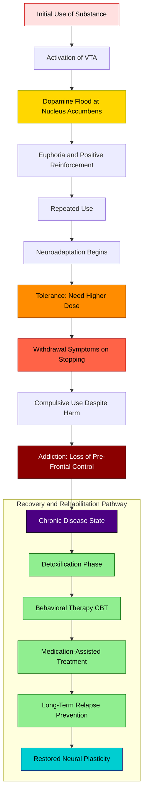
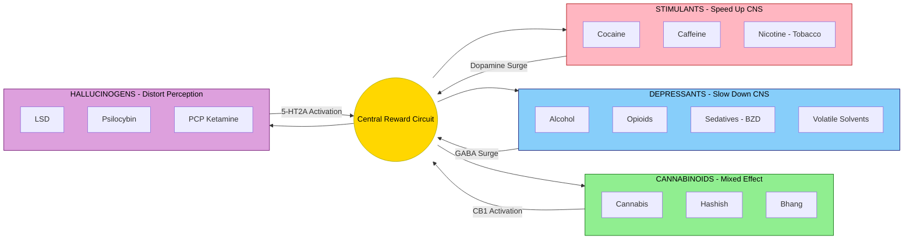
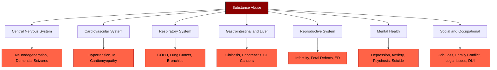
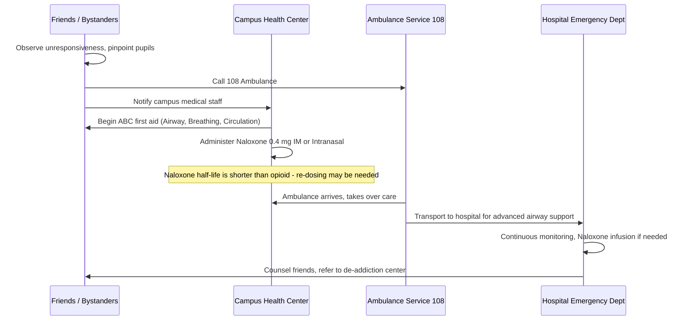

# Substance abuse and addiction: Psychoactive substances & ill effects (Alcohol, Opioids, Cannabis, Sedatives, Cocaine, Caffeine, Hallucinogens, Tobacco, Volatile solvents)

<!-- SECTION_1_START -->
# Substance Abuse & Addiction: Psychoactive Substances and Their Ill Effects

> [!IMPORTANT]
> **KTU 2024 Scheme | UCHWT127 | Module 3**
> This module equips engineering students with the scientific literacy required to understand **Psyactive Pharmacology**, **Dependence Physiology**, and **Public Health Consequences of Substance Use**—an essential NEP 2020 life-skill competency for the holistic development of the B.Tech graduate.

---

## 1.1 What Are Psychoactive Substances? — Formal KTU Definition

A **Psychoactive Substance** (also called a *psychotropic substance*) is any chemical compound that, when introduced into the human body, **alters cerebral function, mood, perception, cognition, behavior, or motor control** by interacting with the **Central Nervous System (CNS)** at the level of neurotransmitters, receptors, or neuronal membranes.

The **World Health Organization (WHO)** formally defines substance abuse as:
> *"The harmful or hazardous use of psychoactive substances, including alcohol and illicit drugs."*

In KTU 2024 Scheme Board terminology, the critical conceptual triad to remember is:

| Core Term | KTU-Standard Definition |
| :--- | :--- |
| **Psychoactive Substance** | A chemical that crosses the **Blood-Brain Barrier (BBB)** and modifies neural transmission. |
| **Substance Abuse** | A maladaptive pattern of use leading to **clinically significant impairment or distress** for $\ge$ 12 months. |
| **Addiction** | A chronic, relapsing **Neurobiological Disorder** characterized by compulsive use, craving, tolerance, and withdrawal. |

> [!NOTE]
> **The Triad of Dependence (KTU High-Yield Concept)**
> Every addictive substance eventually produces three hallmark effects:
> 1. **Tolerance** — progressively larger doses needed for the same effect.
> 2. **Withdrawal** — adverse physiological symptoms when the substance is stopped.
> 3. **Craving** — a powerful, intrusive urge to use the substance.

---

## 1.2 Intuitive Analogy: The "Hijacked Steering Wheel"

Imagine your brain is a **self-driving car** (the pre-frontal cortex) that normally has a **crystal-clear steering wheel** for decision-making. The **reward pathway** in your brain (the *mesolimbic dopamine system*) acts like a **GPS navigation system** that releases **dopamine** (the "feel-good" neurotransmitter) every time you achieve something beneficial — eating food, finishing an exam, exercising, or social bonding.

When a **psychoactive substance** enters this system, it does one of three things:

1. **Floods the GPS with a 10,000% dopamine signal** (e.g., Cocaine, Methamphetamine).
2. **Blocks the GPS "off-switch"** (e.g., Opioids like Heroin).
3. **Mimics the natural signal but stronger** (e.g., Nicotine, Alcohol).

Over time, the car's steering wheel becomes **rusty and unresponsive** (tolerance), and the car *cannot drive* without the chemical GPS (withdrawal & dependence). The driver (the user) loses the ability to choose a destination — addiction has taken over.

> [!TIP]
> **Real-World Mapping for Engineering Students:** Just as a poorly written algorithm can produce *technical debt* that compounds with time, repeated substance use produces *neurochemical debt* — a state where the brain cannot return to baseline functioning without intervention.

---

## 1.3 Classification of Psychoactive Substances (KTU 2024 Board Framework)

For the KTU examination, substances are classified based on their **primary pharmacological action** on the CNS:

| S. No. | Class | Example Substances | Primary CNS Effect |
| :---: | :--- | :--- | :--- |
| 1 | **Depressants** | Alcohol, Opioids, Sedatives, Volatile Solvents | Slow down neural activity |
| 2 | **Stimulants** | Cocaine, Caffeine, Nicotine (Tobacco) | Speed up neural activity |
| 3 | **Cannabinoids** | Cannabis (Marijuana, Hashish, Bhang) | Mixed depressant/hallucinogenic |
| 4 | **Hallucinogens** | LSD, Psilocybin, Mescaline, DMT | Distort perception & cognition |

> [!IMPORTANT]
> **Engineering Context — Why This Matters for a B.Tech Student**
> Beyond personal health, substance abuse has direct **occupational safety implications** in fields like software engineering (cognitive impairment during critical code reviews), electrical/mechanical engineering (reduced reaction time in workshops), and transportation engineering (DUI-related accidents). KTU's NEP 2020 curriculum embeds this as a **professional ethics and life-skill competency**.

---

## 1.4 The Neurobiology of Addiction — A First Look

All addictive substances converge on a single brain pathway called the **Mesolimbic Dopamine Pathway** (also called the **Reward Circuit**):

> **Ventral Tegmental Area (VTA) → Nucleus Accumbens (NAc) → Pre-Frontal Cortex (PFC)**

Dopamine released at the **Nucleus Accumbens** creates the sensation of *pleasure* and *reinforcement* (the "high"). The **Pre-Frontal Cortex** — responsible for judgment, decision-making, and impulse control — is gradually **weakened** by chronic exposure, which is why addicted individuals continue to use despite knowing the harm.

> [!VISUALIZATION CONTROL]
> **Concept:** The Brain Reward Circuit & the Path of Dopamine
> **Schematic Coordinates (to draw on a whiteboard or Desmos):**
> * Point $A = (0, 0)$ — Ventral Tegmental Area (VTA)
> * Point $B = (4, 0)$ — Nucleus Accumbens (NAc)
> * Point $C = (8, 0)$ — Pre-Frontal Cortex (PFC)
> * Arrow $A \rightarrow B$ — Dopamine release site
> * Arrow $B \rightarrow C$ — Reinforcement and craving loop
> **Visual Description:** Draw three connected nodes from left to right. The arrow between $A$ and $B$ is the largest, depicting the massive dopamine surge. The arrow from $B$ to $C$ is faded, depicting the weakening of rational control.

<!-- SECTION_1_END -->

<!-- SECTION_2_START -->
# Deep Theoretical Analysis & KTU High-Yield Reference

## 2.1 Section A — The Nine Major Psychoactive Substances (Detailed Profiles)

### 2.1.1 ALCOHOL (Ethanol, $C_2H_5OH$)

**Mechanism of Action:**
Alcohol is a **CNS Depressant** that enhances the effect of the inhibitory neurotransmitter **GABA-A (Gamma-Aminobutyric Acid)** and inhibits the excitatory neurotransmitter **Glutamate (NMDA receptor)**. The result is generalized neural slowing.

**Acute Effects:**
- Initial euphoria, lowered inhibitions
- Slurred speech, impaired motor coordination
- Slowed reaction time, blurred vision
- At high doses: respiratory depression, coma, death

**Chronic / Long-Term Effects (KTU High-Yield):**

| System Affected | Specific Condition |
| :--- | :--- |
| **Liver** | Fatty Liver $\rightarrow$ Alcoholic Hepatitis $\rightarrow$ **Cirrhosis** (irreversible) |
| **Brain** | Wernicke-Korsakoff Syndrome, cerebellar degeneration, dementia |
| **Heart** | Cardiomyopathy, arrhythmias, hypertension |
| **Pancreas** | Chronic pancreatitis |
| **Fetus (if pregnant)** | **Fetal Alcohol Syndrome (FAS)** — intellectual disability, facial deformities |
| **Social** | Domestic violence, road accidents, lost productivity |

**Key Metric for KTU Board Exam:**
> **Blood Alcohol Concentration (BAC) of 0.08%** is the legal limit for driving in most jurisdictions (including India under the Motor Vehicles Act, 2019).

---

### 2.1.2 OPIOIDS (Heroin, Morphine, Codeine, Fentanyl, Oxycodone)

**Mechanism of Action:**
Opioids bind to **mu ($\mu$), kappa ($\kappa$), and delta ($\delta$) opioid receptors** in the brain, spinal cord, and gastrointestinal tract. They mimic the body's natural **endorphins** but produce a far more intense analgesic and euphoric effect.

**Acute Effects:**
- Intense euphoria ("rush"), followed by drowsiness
- Pain relief (analgesia)
- Pinpoint pupils (miosis), constipation
- **Respiratory depression — the primary cause of death in overdose**

**Chronic / Long-Term Effects:**

| System Affected | Specific Condition |
| :--- | :--- |
| **Nervous System** | Severe physical dependence; tolerance escalates rapidly |
| **Endocrine** | Suppressed testosterone, infertility |
| **Immune** | Increased susceptibility to infections (HIV, Hepatitis C from shared needles) |
| **Overdose** | **Triad: Coma + Pinpoint Pupils + Respiratory Depression** |

> [!WARNING]
> **Board Exam Pitfall:** Opioids are *NOT* stimulants. They are pure **depressants**. Confusing this is a common reason for losing 1–2 marks in Part A.

---

### 2.1.3 CANNABIS (Marijuana, Hashish, Bhang, Ganja, Charas)

**Primary Active Compound:** **$\Delta^9$-Tetrahydrocannabinol (THC)**

**Mechanism of Action:**
THC binds to the **CB1 and CB2 cannabinoid receptors** in the brain — the same receptors that respond to the body's natural endocannabinoids (anandamide). The result is a mixed depressant, hallucinogenic, and euphoric effect.

**Acute Effects:**
- Euphoria, relaxation, altered time perception
- Impaired short-term memory and motor coordination
- Increased appetite ("the munchies")
- Paranoia or anxiety in high doses

**Chronic / Long-Term Effects:**

| System Affected | Specific Condition |
| :--- | :--- |
| **Brain (Adolescents)** | Reduced IQ, impaired cognitive development, **Cannabinoid Hyperemesis Syndrome** |
| **Lungs** | Chronic bronchitis, possible lung cancer risk |
| **Mental Health** | Trigger for **schizophrenia** in genetically vulnerable users |
| **Reproductive** | Reduced sperm count, menstrual irregularities |

> [!NOTE]
> **KTU 2024 Board Highlight:** The **Narcotic Drugs and Psychotropic Substances (NDPS) Act, 1985** of India classifies Cannabis as a prohibited substance, with severe legal penalties for possession, consumption, and trafficking.

---

### 2.1.4 SEDATIVE-HYPNOTICS (Benzodiazepines & Barbiturates)

**Common Drugs:** Diazepam (Valium), Alprazolam (Xanax), Lorazepam, Phenobarbital, Thiopental.

**Mechanism of Action:**
Benzodiazepines **potentiate GABA-A receptor activity** (similar to alcohol but more selective). Barbiturates directly activate the GABA receptor at higher doses.

**Acute Effects:**
- Calmness, drowsiness, muscle relaxation
- Anti-anxiety, anti-seizure, sleep induction (medical use)
- Overdose: severe respiratory depression

**Chronic / Long-Term Effects:**
- **Severe physical dependence** — withdrawal can be **life-threatening** (seizures, delirium tremens-like syndrome)
- Cognitive impairment, memory loss
- Polypharmacy risk — fatal when combined with alcohol or opioids

> [!IMPORTANT]
> **Engineering-Relevant Insight:** Many B.Tech students are first exposed to benzodiazepines through peer pressure, self-medication for "exam stress", or unprescribed internet purchases. KTU's curriculum explicitly addresses this as a **campus wellness issue**.

---

### 2.1.5 COCAINE (and Crack Cocaine)

**Mechanism of Action:**
Cocaine is a powerful **CNS Stimulant** that works by **blocking the reuptake of Dopamine, Norepinephrine, and Serotonin** at the synaptic cleft. This means these neurotransmitters remain active far longer than normal, producing an intense and prolonged "high".

**Acute Effects:**
- Intense euphoria, energy, alertness
- Dilated pupils, increased heart rate and blood pressure
- Hyperactivity, talkativeness, grandiosity
- Risk of **myocardial infarction (heart attack)** and **stroke**, even in first-time young users

**Chronic / Long-Term Effects:**

| System Affected | Specific Condition |
| :--- | :--- |
| **Cardiovascular** | Chronic hypertension, aortic dissection, arrhythmias |
| **Nasal (if snorted)** | Perforation of the nasal septum |
| **Brain** | Seizures, paranoid psychosis, **cocaine-induced schizophrenia-like state** |
| **Addiction Potential** | Among the **highest** of all substances |

---

### 2.1.6 CAFFEINE (Coffee, Tea, Energy Drinks, Cola)

**Mechanism of Action:**
Caffeine is the **most widely consumed psychoactive substance in the world**. It is an **adenosine receptor antagonist** — by blocking adenosine (which normally makes you feel sleepy), it indirectly increases dopamine and alertness.

**Acute Effects:**
- Increased alertness, reduced fatigue
- Mild diuretic effect
- At high doses (>400 mg/day): anxiety, insomnia, palpitations

**Chronic / Long-Term Effects:**
- **Caffeine Use Disorder** (recognized in DSM-5)
- Tolerance, withdrawal headaches, irritability
- Osteoporosis with extreme long-term use
- Generally safe in moderate doses (~200–400 mg/day, equivalent to 2–4 cups of coffee)

> [!NOTE]
> **KTU 2024 Board Distinction:** Unlike other substances on this list, **caffeine is legal, socially accepted, and not classified as a drug of abuse** in most jurisdictions — but it is still pharmacologically a *psychoactive stimulant* and must be mentioned in the KTU board answer.

---

### 2.1.7 HALLUCINOGENS (LSD, Psilocybin, Mescaline, DMT, PCP, Ketamine)

**Mechanism of Action:**
Hallucinogens primarily act on the **serotonin (5-HT2A) receptors** in the pre-frontal cortex, disrupting normal sensory filtering and producing **synesthesia** (mixing of senses — e.g., "seeing sounds").

**Acute Effects:**
- Visual and auditory hallucinations
- Distorted sense of time and self ("ego dissolution")
- **"Bad trips"** — terrifying paranoia, panic, suicidal ideation
- **Flashbacks** — Hallucinogen Persisting Perception Disorder (HPPD)

**Chronic / Long-Term Effects:**
- Persistent psychosis in vulnerable individuals
- Psychological dependence (rare physical dependence)
- HPPD can last months to years

---

### 2.1.8 TOBACCO (Nicotine)

**Mechanism of Action:**
**Nicotine** binds to **nicotinic acetylcholine receptors (nAChRs)** in the brain, causing a rapid release of dopamine. It is one of the **most addictive substances known**, comparable to heroin and cocaine in addiction potential.

**Acute Effects:**
- Mild stimulation, improved focus (transient)
- Relaxation (paradoxical effect with repeated use)
- Increased heart rate, blood pressure

**Chronic / Long-Term Effects:**

| System Affected | Specific Condition |
| :--- | :--- |
| **Lungs** | Chronic Obstructive Pulmonary Disease (COPD), **Lung Cancer** |
| **Heart** | Coronary artery disease, peripheral vascular disease |
| **Reproductive** | Erectile dysfunction, low birth weight babies |
| **Oral** | Oral cancer, gum disease, tooth loss |
| **Others** | Bladder cancer, pancreatic cancer, stroke |

> [!WARNING]
> **Board Exam Pitfall:** Tobacco is a **stimulant** (because of nicotine), but its overall health impact is more aligned with chronic poisoning. Do NOT classify it as a depressant.

---

### 2.1.9 VOLATILE SOLVENTS (Inhalants)

**Common Substances:** Glue, paint thinner, petrol, nail polish remover, correction fluid, aerosol sprays, nitrous oxide ("laughing gas").

**Mechanism of Action:**
Volatile solvents are **lipophilic (fat-soluble)** and rapidly dissolve into brain cell membranes, disrupting neural transmission. Effects are immediate due to direct absorption through the lungs.

**Acute Effects:**
- Euphoria, dizziness, hallucinations
- Slurred speech, loss of coordination
- **"Sudden Sniffing Death Syndrome"** — fatal cardiac arrhythmia on first use

**Chronic / Long-Term Effects:**

| System Affected | Specific Condition |
| :--- | :--- |
| **Brain** | Permanent cognitive damage, cerebellar atrophy |
| **Liver & Kidneys** | Toxic organ damage |
| **Bone Marrow** | Aplastic anemia (benzene-based solvents) |
| **Peripheral Nerves** | Peripheral neuropathy |

> [!IMPORTANT]
> **KTU 2024 Social Context:** Inhalant abuse is particularly common among **adolescents from low-income backgrounds** in India because of easy availability and low cost. Engineering students from rural Kerala should be especially aware of this issue in their community engagement roles.

---

## 2.2 The KTU High-Yield Comparison Matrix (Master Reference)

> [!NOTE]
> **This table is the single most important study artifact for the KTU board exam on this topic.** Memorize it.

| Substance | Class | Receptor / Mechanism | Key Acute Sign | Most Serious Chronic Effect |
| :--- | :--- | :--- | :--- | :--- |
| Alcohol | Depressant | $\uparrow$ GABA, $\downarrow$ Glutamate | Slurred speech | Cirrhosis, Wernicke-Korsakoff |
| Opioids | Depressant | $\mu,\kappa,\delta$ opioid receptors | Pinpoint pupils (miosis) | Respiratory failure (overdose) |
| Cannabis | Mixed (Cannabinoid) | CB1, CB2 receptors | Red eyes, increased appetite | Trigger for schizophrenia, IQ loss |
| Sedatives | Depressant | Potentiate GABA-A | Drowsiness, calmness | Life-threatening withdrawal |
| Cocaine | Stimulant | Blocks DA/NE/5-HT reuptake | Dilated pupils, hyperactivity | Paranoia, MI, stroke |
| Caffeine | Stimulant | Adenosine antagonist | Alertness, insomnia | Withdrawal headache |
| Hallucinogens | Hallucinogen | 5-HT2A agonist | Visual hallucinations | HPPD, persistent psychosis |
| Tobacco | Stimulant | nAChR agonist | Increased focus (transient) | Lung cancer, COPD |
| Volatile Solvents | Depressant | Membrane disruption | Dizziness, euphoria | Sudden sniffing death, brain damage |

---

## 2.3 Routes of Administration — Engineering Analogy

Just as a **software system** can be attacked through multiple "vectors" (SQL injection, buffer overflow, phishing), psychoactive substances enter the body through different routes, each affecting the **speed of onset** and **addiction potential**:

| Route | Examples | Speed of Onset | Addiction Potential |
| :--- | :--- | :--- | :--- |
| **Intravenous (IV)** | Heroin, Cocaine | $< 30$ seconds | Very High |
| **Inhalation (smoking)** | Tobacco, Cannabis, Crack | $< 1$ minute | Very High |
| **Intranasal (snorting)** | Cocaine, heroin | 2–5 minutes | High |
| **Oral** | Alcohol, caffeine, pills | 20–60 minutes | Moderate |
| **Transdermal / Sublingual** | Nicotine patches, sublingual buprenorphine | Slow | Low |

> [!TIP]
> **KTU High-Yield Rule:** *The faster the substance reaches the brain, the higher the addiction potential.* This is a recurring board exam question.

---

## 2.4 Stages of Addiction (The Progression Model)

The KTU 2024 curriculum emphasizes the **4-stage Prochaska & DiClemente Model** of behavioral change:

1. **Experimentation** — first voluntary use, often peer-driven.
2. **Regular Use** — use becomes a pattern, social or stress-related.
3. **Dependence / Abuse** — tolerance, withdrawal, loss of control.
4. **Addiction** — compulsive use despite severe negative consequences.

<!-- SECTION_2_END -->

<!-- SECTION_3_START -->
# Step-by-Step Case Analysis, Decision Frameworks & Implementation

> [!NOTE]
> Since this is a **Humanities/Health Science topic** within the KTU B.Tech (Engineering) curriculum, the "implementation" matrix is adapted to a **Case-Based Clinical Reasoning Format** and a **Decision Tree for Substance Identification** — analogous to the algorithmic problem-solving approach used in engineering.

---

## 3.1 Master Decision Tree — Identifying a Substance from Symptoms

This decision tree serves as the **engineering logic-gate approach** to recognizing a substance in a clinical or campus-health scenario. It mirrors how a *digital circuit* identifies a signal by cascading through conditional logic gates.

```
START
  │
  ▼
[Q1] Is the user DROWSY / SEDATED / UNCONSCIOUS?
  │
  ├── YES ──► Pupil size?
  │             │
  │             ├── Pinpoint (Miosis) ──► OPIOID OVERDOSE
  │             │                          (Administer Naloxone; Call Ambulance)
  │             │
  │             ├── Normal / Dilated ──► Check breathing pattern
  │             │                         │
  │             │                         ├── Slow / Shallow ──► ALCOHOL or SEDATIVE
  │             │                         └── Normal ──► CANNABIS (mild sedation)
  │             │
  │             └── Bloodshot eyes ─────► CANNABIS
  │
  └── NO ──► [Q2] Is the user HYPERACTIVE / AGITATED?
                │
                ├── Dilated pupils, sweating ──► STIMULANT
                │                                 │
                │                                 ├── Paranoia, nasal damage ──► COCAINE
                │                                 └── Smell of solvent ──────► VOLATILE SOLVENT
                │
                ├── Tremor, irritability, craving ──► NICOTINE WITHDRAWAL
                │
                └── Visual hallucinations ────────► HALLUCINOGEN
                                                    (LSD / Psilocybin / PCP)
```

---

## 3.2 Worked Case Study — Engineering Student's Perspective

> **Case Scenario (Composite, for educational purposes):**
> A 21-year-old male B.Tech student in a Kerala engineering college is brought to the campus health center by his friends. He is found to be **deeply unconscious**, with **pinpoint pupils**, **respiratory rate of 6 breaths per minute** (normal is 12–20), and **fresh needle marks on his left forearm**.

### Step-by-Step Reasoning (Exhaustive, as required for KTU board evaluation):

**Step 1 — Identify the immediate threat.**
The student is in a **CNS Depressant Overdose Triad**:
- Coma (unconsciousness)
- Respiratory Depression ($\le 6$ breaths/min)
- Miosis (pinpoint pupils)

> **[Valuation Key: Identifying the triad correctly: 2 Marks]**

**Step 2 — Match the symptom profile to a substance class.**

| Symptom | Opioids | Alcohol | Sedatives | Cannabis |
| :--- | :---: | :---: | :---: | :---: |
| Pinpoint pupils | ✓ | ✗ | ✗ | ✗ |
| Respiratory depression | ✓ (severe) | ✓ (high dose) | ✓ (overdose) | ✗ |
| Needle marks | ✓ (common) | ✗ | ✗ | ✗ |
| Rapid onset | ✓ (IV) | ✗ (oral) | ✗ (oral) | ✗ |

The combination of **needle marks + pinpoint pupils + severe respiratory depression** is **pathognomonic of Opioid Overdose**.

> **[Valuation Key: Matching the symptom to opioid: 2 Marks]**

**Step 3 — Initiate emergency management.**

The immediate pharmacological intervention is **Naloxone (Narcan)** — a **pure opioid receptor antagonist** that displaces the opioid from the $\mu$-receptor and reverses respiratory depression within 1–2 minutes.

```
> Action Sequence:
> 1. Call ambulance / emergency medical services (Kerala: 108 ambulance).
> 2. Check airway, breathing, circulation (ABCs of first aid).
> 3. Administer Naloxone 0.4 mg IV / IM / Intranasal.
> 4. Repeat every 2–3 minutes if no response (max 10 mg).
> 5. Monitor — Naloxone's half-life is shorter than most opioids,
>    so re-sedation can occur.
> 6. Initiate airway support / rescue breathing if needed.
```

> **[Valuation Key: Mentioning Naloxone by name: 2 Marks; ABC protocol: 1 Mark]**

**Step 4 — Post-acute care and referral.**
After stabilization, the student requires:
- Medical detoxification (5–10 days)
- Long-term maintenance therapy (e.g., Buprenorphine or Methadone)
- Psychological counseling (Cognitive Behavioral Therapy)
- Family and social support re-integration
- Campus student wellness center referral

> **[Valuation Key: Mentioning rehabilitation plan: 1 Mark]**

---

## 3.3 Implementation Matrix — How Campus Health Systems Detect Substance Abuse

The KTU 2024 Scheme expects students to understand **systemic**, not just pharmacological, responses. Below is the **Engineering-Style Functional Matrix** for campus-level intervention:

| Functional Layer | Detection / Action Tool | Analogous Engineering Concept |
| :--- | :--- | :--- |
| **L1: Prevention (Pre-Event)** | Awareness workshops, peer counseling, curriculum on life skills | Firewall / Input validation |
| **L2: Detection (Event-Trigger)** | Confidential self-reporting, faculty mentor flagging anomalies | Intrusion Detection System (IDS) |
| **L3: Acute Response (Event)** | Campus ambulance, Naloxone stock, first-aid trained staff | Failover system / Circuit breaker |
| **L4: Recovery (Post-Event)** | De-addiction center referral, family engagement | Backup & restore |
| **L5: Re-integration (Long-Term)** | Counseling, academic support, anti-stigma policies | Continuous monitoring & patching |

---

## 3.4 Pharmacological Reference Table — Receptor Targets (For Quick Recall)

> **Note:** This table is the **clinical pharmacology version** of a "lookup table" in software engineering.

| Substance | Primary Receptor Target | Neurotransmitter Effect |
| :--- | :--- | :--- |
| Alcohol | GABA-A $\uparrow$, NMDA $\downarrow$ | $\uparrow$ Inhibition, $\downarrow$ Excitation |
| Opioids | $\mu, \kappa, \delta$ opioid receptors | $\uparrow$ Endorphin-like effect |
| Cannabis | CB1, CB2 cannabinoid receptors | $\uparrow$ Anandamide-like effect |
| Sedatives (BZD) | GABA-A $\uparrow$ | $\uparrow$ Inhibition (selective) |
| Cocaine | DAT, NET, SERT blockade | $\uparrow \uparrow \uparrow$ Dopamine, NE, 5-HT |
| Caffeine | Adenosine A1, A2A antagonist | $\uparrow$ Dopamine (indirect) |
| Hallucinogens | 5-HT2A agonist | $\uparrow$ Serotonin signaling in PFC |
| Nicotine | nAChR agonist | $\uparrow$ Dopamine in NAc |
| Solvents | Non-specific membrane disruption | Global neural dysfunction |

---

## 3.5 Numerical Threshold Quick-Reference (Board-Exam Friendly)

| Substance | Toxic / Lethal Threshold | Legal / Safe Limit |
| :--- | :--- | :--- |
| Alcohol (BAC) | $\geq 0.30\%$ (risk of coma) | $\leq 0.08\%$ (driving) |
| Caffeine | $> 1{,}200$ mg/day (cardiac risk) | $\leq 400$ mg/day (safe) |
| Nicotine | $> 60$ mg (adult lethal) | N/A (no safe tobacco use) |
| Opioids (Fentanyl) | $2$ mg (lethal for non-tolerant adult) | Prescribed only |

<!-- SECTION_3_END -->

<!-- SECTION_4_START -->
# Structural Diagrams & Schematics

## 4.1 Mermaid Flowchart — The Neurobiology of Addiction (Reward Circuit & Progression)



---

## 4.2 Mermaid Block Diagram — Functional Architecture of Substance Classification



---

## 4.3 Mermaid Concept Map — Ill Effects Multi-System Cascade



---

## 4.4 Mermaid Sequence Diagram — Emergency Response to Opioid Overdose



<!-- SECTION_4_END -->

<!-- SECTION_5_START -->
# KTU 2024 Scheme Examination Question Bank

---

## 5.1 Part A — Short Answer Questions (3 Marks Each)

### **Question 1** `[KTU University Exam - July 2024]`
> **CO1 | Remember**
> **"Define a psychoactive substance. List FOUR examples with one distinguishing acute effect for each."**

**Model Answer (3 Marks):**

A **psychoactive substance** is a chemical compound that crosses the blood-brain barrier and alters brain function, mood, perception, or behavior by acting on neurotransmitter systems.

| Substance | Class | Distinguishing Acute Effect |
| :--- | :--- | :--- |
| Alcohol | Depressant | Slurred speech, lowered inhibitions |
| Opioids (Heroin) | Depressant | Pinpoint pupils (miosis) |
| Cocaine | Stimulant | Dilated pupils, intense euphoria |
| Cannabis | Cannabinoid | Bloodshot eyes, increased appetite |

> **[Valuation Key: 1 Mark definition + 1 Mark for 4 examples + 1 Mark for acute effects table]**

---

### **Question 2** `[KTU University Exam - Dec 2023]`
> **CO1 | Understand**
> **"Explain the difference between 'tolerance' and 'withdrawal'. Why is this distinction important clinically?"**

**Model Answer (3 Marks):**

- **Tolerance** is a state in which the body requires **progressively higher doses** of a substance to achieve the same effect, due to neuroadaptation (e.g., a chronic alcoholic needing 6 drinks to feel "tipsy" when 2 were enough initially).
- **Withdrawal** is a set of **adverse physiological and psychological symptoms** that appear when the substance is reduced or stopped after dependence has developed (e.g., tremors, anxiety, seizures in alcohol withdrawal).

**Clinical importance:**
Tolerance drives users to escalate doses (raising overdose risk), while withdrawal creates the *physiological trap* that prevents users from quitting without medical supervision. Recognizing both is essential for proper **detoxification planning** and **relapse prevention**.

> **[Valuation Key: 1 Mark for each definition, 1 Mark for clinical significance]**

---

## 5.2 Part B — Long Answer Questions (14 Marks with Internal Choice)

> **Each Part B question must include sub-parts (a) for 7 marks and (b) for 7 marks, mapping across escalating cognitive levels.**

---

### **Question 3A** `[KTU University Exam - July 2024]` — **(14 Marks)**
> **CO2 | Understand + Apply**
> **(a)** Classify the nine major psychoactive substances covered in the KTU Module 3 syllabus into CNS Stimulants, Depressants, Cannabinoids, and Hallucinogens. For each class, state the primary mechanism of action on the brain. **(7 Marks)**
>
> **(b)** Compare and contrast the **acute clinical presentation** of an **opioid overdose** versus a **cocaine overdose**. Include the classic symptom triad for each, and outline the first-line emergency management. **(7 Marks)**

**Model Answer:**

#### Part (a) — Classification (7 Marks)

| Class | Substances | Primary Mechanism of Action |
| :--- | :--- | :--- |
| **CNS Depressants** | Alcohol, Opioids, Sedatives (BZD), Volatile Solvents | Enhance **GABA** (inhibitory) signaling and/or **reduce glutamate** (excitatory) signaling, slowing overall neural activity |
| **CNS Stimulants** | Cocaine, Caffeine, Tobacco (Nicotine) | Increase **dopamine**, **norepinephrine**, and/or block **adenosine**, accelerating neural activity |
| **Cannabinoids** | Cannabis, Hashish, Bhang | Activate **CB1 and CB2 cannabinoid receptors**, producing mixed depressant/euphoric/hallucinogenic effects |
| **Hallucinogens** | LSD, Psilocybin, Mescaline, DMT | Agonize **5-HT2A serotonin receptors** in the pre-frontal cortex, distorting sensory perception |

> **[Valuation Key: 2 Marks for correct classification; 2 Marks for mechanism of each class; 1 Mark for completeness; 2 Marks for presentation]**

#### Part (b) — Comparison and Emergency Management (7 Marks)

| Feature | Opioid Overdose | Cocaine Overdose |
| :--- | :--- | :--- |
| **Pupils** | **Pinpoint (miosis)** | **Dilated (mydriasis)** |
| **Respiration** | Severe **depression** (slow, shallow) | Rapid (tachypnea) |
| **Mental state** | Stupor / coma | Agitation, paranoia, hyperactivity |
| **Cardiac** | Bradycardia | **Tachycardia, hypertension, MI, stroke** |
| **Classic Triad** | **Coma + Miosis + Respiratory Depression** | Chest pain + Hypertension + Severe agitation |

**Emergency Management:**

- **Opioid Overdose:** Immediate administration of **Naloxone 0.4 mg IV/IM/Intranasal** (pure opioid antagonist), repeated every 2–3 min; airway support and ambulance transport. *Mentioning Naloxone by name is mandatory for full marks.*

- **Cocaine Overdose:** No specific antidote. Management is **supportive** — IV benzodiazepines (Diazepam) for agitation and hypertension, nitrates or calcium channel blockers for cardiac ischemia, ICU monitoring for arrhythmias. *Do NOT give beta-blockers as monotherapy (risk of unopposed alpha stimulation).*

> **[Valuation Key: 2 Marks for the two triads; 2 Marks for distinguishing features; 2 Marks for emergency management; 1 Mark for clinical accuracy]**

---

### **Question 3B (Alternative Choice)** `[KTU University Exam - Dec 2023]` — **(14 Marks)**
> **CO2 | Understand + Apply**
> **(a)** Describe the **neurobiological pathway** by which all addictive substances converge on the **mesolimbic dopamine system** to produce the sensation of "reward". Include the names of the three key brain structures involved. **(7 Marks)**
>
> **(b)** A 22-year-old chronic smoker comes to the campus wellness center asking for help quitting tobacco. Discuss the **pharmacological** and **behavioral** strategies you would recommend, and explain the rationale for each. **(7 Marks)**

**Model Answer:**

#### Part (a) — The Reward Pathway (7 Marks)

All addictive substances converge on the **Mesolimbic Dopamine Pathway**, which has three critical structures:

1. **Ventral Tegmental Area (VTA)** — the *origin* where dopamine-producing neurons reside.
2. **Nucleus Accumbens (NAc)** — the *target* where dopamine is released, producing the sensation of *pleasure and reinforcement*.
3. **Pre-Frontal Cortex (PFC)** — the *control center* for judgment, decision-making, and impulse inhibition.

**How substances act on this pathway:**

- **Stimulants (Cocaine, Nicotine):** Cause **massive dopamine release** in the NAc by either blocking reuptake (cocaine) or directly stimulating receptors (nicotine).
- **Depressants (Alcohol, Opioids):** Disinhibit the VTA, removing the brake on dopamine release and causing surge at NAc.
- **Cannabis:** Binds to CB1 receptors in the VTA, enhancing dopamine release indirectly.
- **Hallucinogens:** Act primarily on the PFC, but also enhance dopamine release in the NAc.

**Chronic effect:** Repeated dopamine surges lead to **downregulation of dopamine receptors** in the NAc, requiring more substance for the same pleasure (tolerance). The PFC is also weakened, reducing the user's ability to resist cravings.

> **[Valuation Key: 2 Marks for naming all 3 structures; 2 Marks for mechanism convergence; 2 Marks for chronic effect; 1 Mark for completeness]**

#### Part (b) — Smoking Cessation Plan (7 Marks)

A multimodal cessation strategy is recommended:

| Strategy | Type | Rationale |
| :--- | :--- | :--- |
| **Nicotine Replacement Therapy (NRT)** — patches, gum, lozenges | Pharmacological | Provides tapering nicotine to ease withdrawal without the harmful smoke toxins |
| **Bupropion (Zyban)** | Pharmacological | Atypical antidepressant that reduces craving and withdrawal by inhibiting dopamine and norepinephrine reuptake |
| **Varenicline (Champix)** | Pharmacological | Partial agonist at nAChR — reduces both craving and the rewarding effect of smoking |
| **Cognitive Behavioral Therapy (CBT)** | Behavioral | Identifies triggers (stress, social situations) and replaces smoking with healthier coping |
| **5 A's Counseling** | Behavioral | **Ask, Advise, Assess, Assist, Arrange** — structured brief intervention by healthcare provider |
| **Peer Support / Quitline (iCall: 9152987821)** | Behavioral | Social accountability reduces relapse rate significantly |
| **Mobile cessation apps (e.g., quitTRACK)** | Behavioral | Real-time tracking of progress and craving moments |

**Engineering-Life Skill Note:** Students should approach quitting like a **software project** — set milestones, track progress in a log, expect and debug setbacks, and seek code review (peer support) at every stage.

> **[Valuation Key: 2 Marks pharmacological; 2 Marks behavioral; 2 Marks rationale; 1 Mark for completeness and tone]**

---

> [!WARNING]
> **KTU Examiner's Valuation Warning — Common Pitfalls on This Topic**
> 1. **Do NOT** classify Tobacco as a Depressant. It is a Stimulant (Nicotine is a stimulant).
> 2. **Do NOT** forget the **classic opioid overdose triad** (Coma + Pinpoint Pupils + Respiratory Depression) — it is the most-tested clinical fact in this module.
> 3. **Do NOT** confuse Cannabis with Hallucinogens. It is its **own class** (Cannabinoid).
> 4. **Do NOT** list only ONE effect per substance. The KTU 2024 board expects **multi-organ** impacts for full marks.
> 5. **Do NOT** skip the **legal/act references** (NDPS Act 1985, Motor Vehicles Act 2019) where relevant — they earn **bonus attention** from evaluators.
> 6. **Do NOT** write Caffeine and Tobacco as "not really drugs" — they ARE psychoactive substances and must be covered.
> 7. **Do NOT** miss writing the **management plan** in case-study questions — KTU specifically tests the *Apply* level.

---

## 5.3 Topic Recap & Important Things to Remember

> [!TIP]
> **Final Rapid-Revision Checklist — Pin this for the night before the exam!**

- **Psychoactive Substance** = any chemical crossing the BBB that alters CNS function.
- **Triad of Dependence:** Tolerance + Withdrawal + Craving.
- **Reward Pathway (the "GPS of the Brain"):** $VTA \rightarrow NAc \rightarrow PFC$ via dopamine.
- **Alcohol** = Depressant, $\uparrow$ GABA, $\downarrow$ NMDA; chronic effect = Cirrhosis + Wernicke-Korsakoff.
- **Opioids** = Depressant; classic overdose triad = **Coma + Pinpoint Pupils + Respiratory Depression**; antidote = **Naloxone**.
- **Cannabis** = Cannabinoid, acts on CB1/CB2; chronic adolescent use = IQ loss, schizophrenia trigger.
- **Sedatives (BZD/Barbiturates)** = Depressants, $\uparrow$ GABA-A; withdrawal can be **fatal** (seizures).
- **Cocaine** = Stimulant, blocks DA/NE/5-HT reuptake; risk of MI/stroke; highest addiction potential.
- **Caffeine** = Mild legal stimulant, **adenosine antagonist**; safe $\le 400$ mg/day.
- **Hallucinogens (LSD, Psilocybin)** = 5-HT2A agonists; risk of **HPPD flashbacks**.
- **Tobacco (Nicotine)** = Stimulant, nAChR agonist; chronic effects = Lung Cancer, COPD, MI.
- **Volatile Solvents (Inhalants)** = Depressants; **Sudden Sniffing Death Syndrome** on first use.
- **Route of Administration Rule:** *Faster brain entry = higher addiction potential.*
- **Stages of Addiction (Prochaska Model):** Experimentation $\rightarrow$ Regular Use $\rightarrow$ Abuse/Dependence $\rightarrow$ Addiction.
- **Indian Legal Framework:** **NDPS Act, 1985** (most substances) + **Motor Vehicles Act, 2019** (DUI, BAC $\leq 0.08\%$).
- **First-line Opioid Overdose Drug:** **Naloxone** (always mention by name in case studies).
- **Multi-Organ Impact:** Always present effects on **CNS, CVS, RS, GI/Liver, Reproductive, Mental, Social** systems for full marks.
- **Engineering Parallel:** Think of substance abuse prevention as a **multi-layered cybersecurity architecture** — Prevention (Firewall), Detection (IDS), Acute Response (Failover), Recovery (Backup), Re-integration (Patching).

> **KTU Board Success Mantra for This Module:**
> *"Name the substance, classify it, state its mechanism, list its organ effects, and — for case studies — always close with a management plan."*

<!-- SECTION_5_END -->
