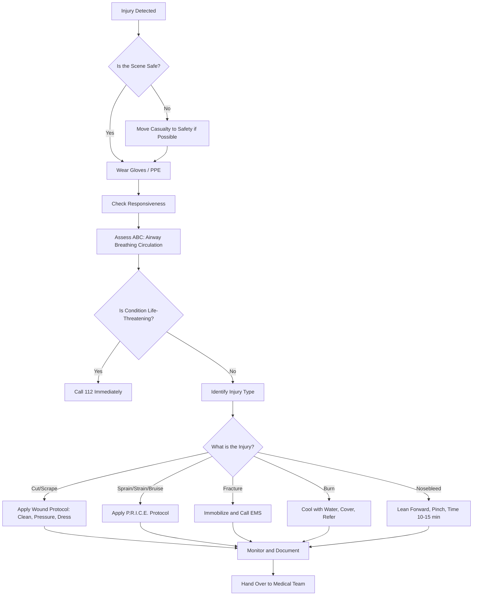
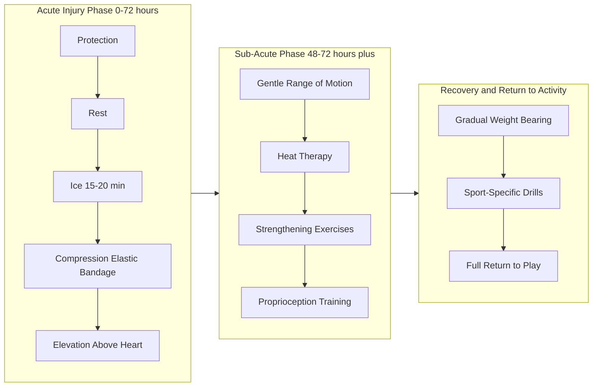
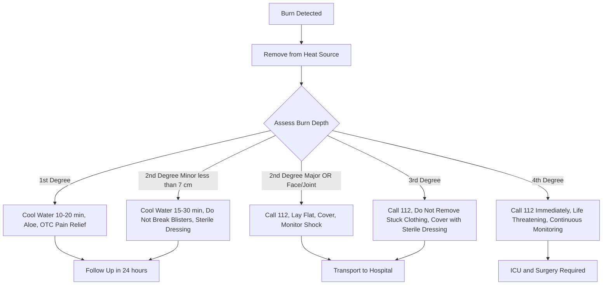
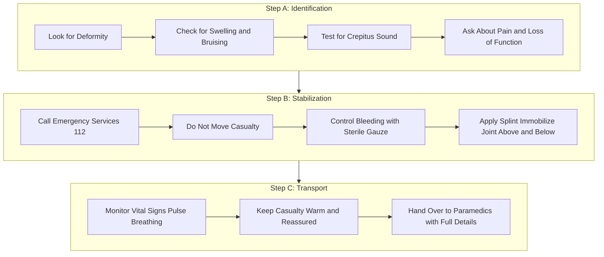

# First aid measures for: Cuts, scrapes, bruises, sprains, strains, fractures, burns, nosebleeds

<!-- SECTION_1_START -->
# First Aid & Sports Injury Protocols: Core Foundations

## 1.1 Formal Academic Definition

**First Aid** is the *immediate, temporary, and life-preserving care* provided to a person who has been injured or has fallen acutely ill, using the materials and facilities available at the scene, until qualified medical assistance takes over. In the context of the **KTU 2024 Scheme (Course Code: UCHWT127 – Health and Wellness)**, first aid is taught as a critical life-skill competency under Outcome-Based Education (OBE), aligned with **Module 4: First Aid & Sports Injury Protocols**.

> [!IMPORTANT]
> **KTU Syllabus Highlight:** First aid is *not a substitute* for professional medical care. It is the **bridge** between injury onset and definitive medical treatment. The "**Golden Hour**" and "**Platinum 10 Minutes**" concepts form the philosophical backbone of emergency response taught in this module.

The first aid procedures discussed in this note address the following injury categories:

1. **Cuts & Scrapes (Abrasions & Lacerations)**
2. **Bruises (Contusions)**
3. **Sprains (Ligament injuries)**
4. **Strains (Muscle/Tendon injuries)**
5. **Fractures (Bone injuries)**
6. **Burns (Thermal, Chemical, Electrical)**
7. **Nosebleeds (Epistaxis)**

---

## 1.2 Conceptual Analogy / Intuition

> [!NOTE]
> **Real-World Analogy — The Body as a Building**
> Think of the human body as a *multi-storey building* with structural columns (bones), electrical wiring (nerves), water pipelines (blood vessels), and plaster walls (skin). When an earthquake (injury) strikes, you don't rebuild immediately — you **stabilize**, **contain the damage**, and **call the structural engineer (doctor)**. That is what first aid does.

### Intuitive Breakdown of Each Injury

| Injury | Body "Damage" Analogy | Visible Sign |
|---|---|---|
| Cut / Scrape | Wall plaster peeled off | Bleeding, exposed inner layer |
| Bruise | Internal pipe leak under the wall | Blue/purple skin discoloration |
| Sprain | Door hinge (ligament) stretched/torn | Swollen, painful joint |
| Strain | Cable (muscle) overstretched | Muscle spasm, sharp pain |
| Fracture | Load-bearing column cracked/broken | Deformity, inability to move |
| Burn | Heat melted the wall surface | Red, blistered, or charred skin |
| Nosebleed | Pipe burst in upper floor | Blood flowing from nostrils |

> [!TIP]
> **Memory Trick — "3 S Rule for First Aid":** **S**tay calm, **S**top the damage, **S**ummon help.

---

## 1.3 Key Physical & Clinical Constants

> [!IMPORTANT]
> **Standard First-Aid Metrics to Memorize (Frequently tested in KTU exams):**
> - **Normal human body temperature:** **$98.6^\circ \text{F}$ ($37^\circ \text{C}$)**
> - **Safe cold compress duration:** **$15$–$20$ minutes** per session
> - **Burn cooling time with running water:** **at least 10–20 minutes**
> - **Nosebleed pinch duration:** **$10$–$15$ minutes** continuous pressure
> - **Adult human blood volume:** approximately **$5$ litres**; loss of $> 20\%$ is life-threatening
> - **Universal Emergency Number (India):** **112**

---

## 1.4 The Universal R.I.C.E. Protocol

> [!NOTE]
> **R.I.C.E. is the cornerstone protocol for acute musculoskeletal injuries (sprains, strains, bruises).** Every KTU exam that tests injury management will expect students to know this acronym in order.

$$
\text{R.I.C.E.} = \underbrace{\text{Rest}}_{\text{Stop using it}} + \underbrace{\text{Ice}}_{\text{Cold compress}} + \underbrace{\text{Compression}}_{\text{Pressure bandage}} + \underbrace{\text{Elevation}}_{\text{Raise above heart}}
$$

A modern update, taught in advanced KTU 2024 modules, is the **P.R.I.C.E.** protocol:

$$
\text{P.R.I.C.E.} = \text{Protection} + \text{Rest} + \text{Ice} + \text{Compression} + \text{Elevation}
$$

> [!VISUALIZATION CONTROL]
> **Concept:** Anatomical Elevation Angle for Injured Limb
> **GeoGebra / Desmos Input Equations:**
> * Point A = (0, 0) — Heart Level (Reference Plane)
> * Point B = (4, 3) — Elevated Limb Position
> * Line $L$: $y = 0$ — Horizontal Heart Plane
> * Angle $\theta = \arctan(3/4) \approx 36.87^\circ$
> **Visual Description:** The injured limb (Point B) is positioned *above* the horizontal heart-reference line (y = 0), demonstrating that **elevation** means the injured part must be raised *above* the level of the heart to use gravity to reduce swelling.

---
<!-- SECTION_1_END -->

<!-- SECTION_2_START -->
# Deep Theoretical Analysis & KTU High-Yield Cheat Sheet

## 2.1 Theoretical Foundation: The Triage Philosophy

All first aid operates on a **triage principle** — a French word meaning *"to sort."* Triage prioritizes treatment based on severity. The rescuer's job is to:

1. **Assess** the scene for safety (no live wires, no traffic, no fire).
2. **Identify** life-threatening conditions (airway, breathing, circulation — the **ABC** of first aid).
3. **Intervene** with the correct protocol.
4. **Refer / Transport** to medical care.

$$
\text{First Aid Decision Logic} = \text{Safety} \rightarrow \text{ABC Check} \rightarrow \text{Specific Protocol} \rightarrow \text{EMS Activation (112)}
$$

---

## 2.2 KTU Formula / Protocol Cheat Sheet

> [!IMPORTANT]
> **The following table is the single most important revision artifact for Module 4. Memorize the entire matrix.**

### 2.2.1 Cuts, Scrapes & Wounds

| Parameter | Specification |
|---|---|
| **Cleaning Agent** | Clean running water or sterile saline; **never** hydrogen peroxide on open wounds |
| **Bleeding Control** | Direct pressure with sterile gauze for **$5$–$10$ minutes** |
| **Pressure Point** | Brachial artery (arm) / Femoral artery (leg) if direct pressure fails |
| **Dressing Type** | Non-stick sterile pad + adhesive bandage |
| **Tetanus Booster** | Required if wound is dirty and last dose $> 5$ years ago |
| **Suture Window** | Ideally within **$6$–$8$ hours** of injury |
| **Infection Sign** | Redness, warmth, pus, red streaks, fever |

### 2.2.2 Bruises (Contusions)

| Parameter | Specification |
|---|---|
| **Cause** | Subcutaneous blood vessel rupture from blunt force |
| **Color Timeline** | Red $\rightarrow$ Blue/Purple (Day 1–2) $\rightarrow$ Green (Day 5–7) $\rightarrow$ Yellow-Brown (Day 10–14) |
| **Protocol** | **R.I.C.E.** for first 24–48 hours |
| **Seek Help If** | Swelling is severe, no joint movement, or lump feels hard (hematoma) |

### 2.2.3 Sprains

| Parameter | Specification |
|---|---|
| **Definition** | Stretching or tearing of **ligaments** (bone-to-bone connectors) |
| **Most Common Site** | Ankle (lateral ligaments) |
| **Grades** | **Grade I** = mild stretch; **Grade II** = partial tear; **Grade III** = complete rupture |
| **Protocol** | **P.R.I.C.E.** + immobilization + medical evaluation for Grade II/III |
| **Recovery** | Grade I: 1–2 weeks; Grade III: 6–12 weeks |

### 2.2.4 Strains

| Parameter | Specification |
|---|---|
| **Definition** | Stretching or tearing of **muscle fibres or tendons** (muscle-to-bone connectors) |
| **Most Common Sites** | Hamstring, lower back, calf |
| **Symptoms** | Sudden sharp pain, muscle spasm, swelling, limited range of motion |
| **Protocol** | **R.I.C.E.** + gentle stretching after 48 hours + heat therapy in sub-acute phase |
| **Severity Sign** | "Pop" sound = possible complete tear — immediate medical referral |

### 2.2.5 Fractures

| Parameter | Specification |
|---|---|
| **Definition** | Break or crack in the continuity of a bone |
| **Types** | **Closed** (skin intact) vs **Open/Compound** (bone pierces skin) |
| **Signs** | Deformity, swelling, pain, crepitus (grinding sound), loss of function, discoloration |
| **DO NOT** | Move the casualty, give food/water, or realign the bone |
| **Splint Rule** | Immobilize joint **above and below** the fracture site |
| **Open Fracture Priority** | Cover exposed bone with **sterile saline dressing**; do not push bone back |

### 2.2.6 Burns

| Parameter | Specification |
|---|---|
| **1st Degree** | Epidermis only; red, painful, dry (e.g., mild sunburn) |
| **2nd Degree** | Dermis involved; blisters, severe pain, wet appearance |
| **3rd Degree** | Full thickness; white/charred, leathery, **may be painless** (nerve damage) |
| **4th Degree** | Extends to muscle/bone; blackened, charred |
| **Cooling** | Cool (not ice-cold) running water for **$10$–$20$ minutes** |
| **DO NOT Apply** | Ice, butter, toothpaste, oil, or cotton wool |
| **Cover With** | Sterile non-stick dressing or clean cling film |
| **Seek Emergency If** | Face, hands, feet, genitals, joints, or burns $> 10\%$ body surface area |

> [!TIP]
> **Rule of 9s (Wallace Rule) for Burn Area Estimation** — commonly asked in KTU viva:
> - Head & Neck: **$9\%$**
> - Each Arm: **$9\%$**
> - Anterior Trunk: **$18\%$**
> - Posterior Trunk: **$18\%$**
> - Each Leg: **$18\%$**
> - Genitalia (Perineum): **$1\%$**

### 2.2.7 Nosebleeds (Epistaxis)

| Parameter | Specification |
|---|---|
| **Type** | **Anterior** (90% cases, from Kiesselbach's plexus) vs **Posterior** (severe, from sphenopalatine artery) |
| **Correct Posture** | Sit upright, **lean forward** (NOT backward — prevents blood from entering airway/stomach) |
| **Pinch Point** | Soft part of nose, just below bony bridge |
| **Pinch Duration** | **$10$–$15$ minutes**, continuous, breathing through mouth |
| **Apply Cold** | Cold compress on nasal bridge to induce vasoconstriction |
| **Seek Help If** | Bleeding $> 20$ minutes, heavy blood flow, head injury, or recurrent episodes |

---

## 2.3 Engineering & Real-World Utility

> [!NOTE]
> **Why does an engineering student need to study First Aid under KTU 2024 NEP 2020 framework?**
>
> 1. **Workplace Safety Compliance:** As per the **Factories Act 1948** and **OSHA** guidelines, every industrial site must have trained first aiders. Engineers in manufacturing, construction, and chemical plants are often the *first responders*.
> 2. **Sports Engineering & Kinesiology:** With the rise of sports technology, biomechanics students design wearables that detect falls — knowing injury protocols is essential.
> 3. **Disaster Response:** Kerala's proneness to floods and landslides (2018, 2019) demands that every engineering graduate understand basic triage.
> 4. **NEP 2020 Holistic Education:** Health and Wellness is a *mandatory 2-credit course* under the 2024 KTU scheme to produce socially responsible engineers.

---
<!-- SECTION_2_END -->

<!-- SECTION_3_START -->
# Step-by-Step Protocols, Decision Matrices & Comparative Analysis

## 3.1 Universal First-Aid Decision Algorithm

Below is the **exhaustive step-by-step protocol** that every first-aider must follow *before* treating any specific injury:

$$
\begin{aligned}
\text{Step 1:} \quad & \text{Ensure Scene Safety (look for hazards: fire, electric, traffic, chemicals)} \\
\text{Step 2:} \quad & \text{Wear PPE if available (gloves, mask) — Universal Precaution} \\
\text{Step 3:} \quad & \text{Assess responsiveness — Tap shoulder, shout "Are you okay?"} \\
\text{Step 4:} \quad & \text{Check ABC: Airway, Breathing, Circulation} \\
\text{Step 5:} \quad & \text{Call Emergency Medical Services (Dial 112 in India)} \\
\text{Step 6:} \quad & \text{Identify specific injury and apply targeted protocol} \\
\text{Step 7:} \quad & \text{Monitor vitals (pulse, breathing) until help arrives} \\
\text{Step 8:} \quad & \text{Document incident for handover to medical team}
\end{aligned}
$$

> [!IMPORTANT]
> **"Do No Harm" Principle (Primum Non Nocere):** Never attempt a procedure you are untrained for. For example, **never** realign a fracture, **never** drain a blister, and **never** remove embedded objects.

---

## 3.2 Injury-Wise Exhaustive Protocols (Step-by-Step)

### 3.2.1 Cuts and Scrapes — First Aid Protocol

| Step | Action | Rationale |
|---|---|---|
| 1 | Wash hands thoroughly or wear gloves | Prevent infection transfer |
| 2 | Rinse wound under clean running water for 5+ minutes | Remove debris and bacteria |
| 3 | Gently clean around wound with mild soap (avoid soap in wound) | Reduce infection risk |
| 4 | Apply gentle direct pressure with sterile gauze until bleeding stops (5–10 min) | Promotes clot formation |
| 5 | Apply antibiotic ointment (e.g., Neosporin) if available | Prevents bacterial growth |
| 6 | Cover with sterile non-stick dressing and bandage | Protects from contamination |
| 7 | Change dressing daily; watch for infection signs | Promotes healing |
| 8 | Seek medical care if: deep wound, edges won't close, animal bite, dirty/rusty object, or signs of infection | Tetanus / rabies risk |

> [!WARNING]
> **Embedded Object Protocol:** If a large object (e.g., glass shard) is stuck in the wound, **do NOT remove it**. Apply pressure *around* the object and bandage *over* it. Removal may cause massive bleeding.

### 3.2.2 Bruise (Contusion) Protocol

| Step | Action | Rationale |
|---|---|---|
| 1 | Rest the injured area | Prevents further tissue damage |
| 2 | Apply ice pack wrapped in cloth for 15–20 min (every 2–3 hours, 24–48 hrs) | Vasoconstriction reduces swelling |
| 3 | Apply gentle compression with elastic bandage | Limits internal bleeding |
| 4 | Elevate above heart level | Gravity drains fluid away |
| 5 | After 48 hours, switch to warm compress | Promotes blood flow and healing |
| 6 | Monitor for: severe swelling, hard lump, joint immobility, or no improvement in 2 weeks | May indicate hematoma requiring drainage |

### 3.2.3 Sprain Protocol (P.R.I.C.E. Method)

$$
\begin{aligned}
\text{P} &: \text{Protection — use crutches, sling, or brace to avoid further injury} \\
\text{R} &: \text{Rest — no weight-bearing on the joint} \\
\text{I} &: \text{Ice — 20 minutes on, 20 minutes off, for first 48 hours} \\
\text{C} &: \text{Compression — elastic bandage (not too tight; check capillary refill $< 2$ sec)} \\
\text{E} &: \text{Elevation — above heart level, especially during sleep}
\end{aligned}
$$

**Rehabilitation Phase (after 48–72 hours):**
- Gentle range-of-motion exercises
- Progressive weight-bearing
- Strengthening exercises
- Proprioception training (for ankle sprains)

### 3.2.4 Strain Protocol

| Step | Action |
|---|---|
| 1 | Stop activity immediately; **no "working through the pain"** |
| 2 | Apply R.I.C.E. for first 48–72 hours |
| 3 | Use over-the-counter pain relievers (acetaminophen/ibuprofen) as per dose |
| 4 | After acute phase: gentle stretching and massage |
| 5 | Apply heat therapy for chronic muscle tightness |
| 6 | Resume activity gradually; full recovery may take 2–8 weeks |

> [!NOTE]
> **Sprain vs Strain — KTU Favourite Distinction:**
> - **Sprain = Ligament** (think: sp**r**ain = joint = **r**elates to bone-to-bone)
> - **Strain = Muscle/Tendon** (think: str**a**in = muscle = **a**ll about muscle fibres)

### 3.2.5 Fracture Protocol (Most Critical)

| Step | Action | Critical Note |
|---|---|---|
| 1 | **DO NOT move the casualty** unless there's imminent danger (fire, explosion) | Movement can cause internal organ damage, especially in spinal fractures |
| 2 | Call 112 immediately | Fracture is a medical emergency |
| 3 | Control bleeding (if any) with sterile gauze | Apply pressure *around* bone, not on it |
| 4 | Immobilize the injured area | Use splint, sling, or rolled magazines/pillows |
| 5 | Splint rule: immobilize joint **above AND below** the fracture | Prevents movement of broken bone ends |
| 6 | For open fractures: cover exposed bone with **sterile saline-soaked gauze** | Prevents bone infection (osteomyelitis) |
| 7 | Monitor for shock: pale skin, rapid pulse, cold sweat | Lay person flat, elevate legs (unless spinal injury) |
| 8 | Do not give food or water | Patient may need emergency surgery (anesthesia) |

> [!WARNING]
> **Suspected Spinal Fracture Protocol:** Keep the person *completely still*. Place rolled towels on both sides of the head/neck. Do not remove helmet. Wait for paramedics with spinal board. *Movement can cause permanent paralysis.*

### 3.2.6 Burn Protocol (Depth-Wise)

**1st Degree Burn:**
- Cool water 10–20 min
- Aloe vera gel
- Pain reliever if needed
- Heals in 3–6 days

**2nd Degree Burn (Minor, $< 7$ cm):**
- Cool water 15–30 min
- Do **NOT** break blisters
- Apply antibiotic ointment
- Sterile non-stick dressing
- Medical check within 24 hours

**2nd Degree Burn (Major, $> 7$ cm OR on face/joints):**
- Call 112
- Lay person flat
- Cover with clean cloth/cling film
- Monitor for shock
- Do not submerge in cold water (risk of hypothermia in large burns)

**3rd & 4th Degree Burns:**
- Call 112 immediately
- Do **NOT** remove burnt clothing stuck to skin
- Cover with sterile dressing or clean cloth
- Elevate burned area above heart (if possible)
- Monitor ABCs — airway burns cause rapid swelling

> [!WARNING]
> **Never apply to a burn:** Ice (causes frostbite), butter, oil, toothpaste, flour, or cotton wool (fibers stick to wound).

### 3.2.7 Nosebleed Protocol (Anterior Epistaxis)

| Step | Action |
|---|---|
| 1 | Sit the person upright (do NOT lay them down) |
| 2 | Lean **forward** (NOT backward) |
| 3 | Pinch the soft part of the nose firmly |
| 4 | Maintain continuous pressure for **10–15 minutes** — use a clock |
| 5 | Breathe through the mouth |
| 6 | Apply cold compress over nasal bridge |
| 7 | Spit out any blood in the mouth (do not swallow) |
| 8 | After 15 min, release pressure gently |
| 9 | Avoid nose-blowing, bending, or straining for next 12 hours |
| 10 | If bleeding continues $> 20$ min or is heavy, call 112 |

**Why Lean Forward?**
- Prevents blood from flowing down the throat
- Avoids nausea/vomiting from swallowing blood
- Prevents aspiration into the lungs

---

## 3.3 Comparative Analysis Table: Sprain vs Strain vs Fracture

| Feature | Sprain | Strain | Fracture |
|---|---|---|---|
| **Tissue Affected** | Ligament | Muscle / Tendon | Bone |
| **Mechanism** | Joint twisted/bent abnormally | Muscle overstretched | High-force impact / fall |
| **Pain Location** | Joint | Muscle belly / tendon | Bone / entire limb |
| **Sound at Injury** | "Pop" or "snap" | "Pulling" sensation | "Crack" or "snap" |
| **Deformity** | Uncommon | Uncommon | **Common** |
| **Ability to Move** | Painful but usually possible | Painful, weak movement | **Loss of function** |
| **First Aid** | P.R.I.C.E. | R.I.C.E. | **Immobilize + EMS** |
| **Healing Time** | 1–6 weeks | 2–8 weeks | 6–12+ weeks |

---

## 3.4 Burn Depth Comparative Analysis (With Anatomy)

| Degree | Layer Affected | Appearance | Pain Level | Healing |
|---|---|---|---|---|
| **1st** | Epidermis | Red, dry, no blisters | Mild to moderate | 3–6 days, no scarring |
| **2nd Superficial** | Upper Dermis | Pink, moist, small blisters | Severe | 2–3 weeks, minimal scarring |
| **2nd Deep** | Deep Dermis | Mottled red-white, large blisters | Variable | 3–8 weeks, scarring likely |
| **3rd** | Full Dermis | White, leathery, dry | **Painless** (nerves destroyed) | Requires skin graft |
| **4th** | Muscle / Bone | Black, charred | **Painless** | Life-threatening; multiple surgeries |

---
<!-- SECTION_3_END -->

<!-- SECTION_4_START -->
# Structural Diagrams & Schematics

## 4.1 Mermaid Flowchart — Universal First-Aid Decision Tree

## 4.2 Mermaid Diagram — R.I.C.E. vs P.R.I.C.E. Protocol Logic

## 4.3 Mermaid Diagram — Burn Severity Triage Matrix

## 4.4 Mermaid Diagram — Sequential Processing Topology for Fracture Management

---
<!-- SECTION_4_END -->

<!-- SECTION_5_START -->
# KTU 2024 Scheme Examination Question Bank & Topic Recap

> [!NOTE]
> **Mark Distribution as per KTU 2024 Scheme (UCHWT127):**
> - **Part A:** Short-answer questions of **3 marks each** (Remember / Understand)
> - **Part B:** Long-answer questions of **14 marks each** with internal choice (Understand / Apply / Analyze)

---

## Part A — Short-Answer Questions (3 Marks Each)

### Question 1: [KTU University Exam — July 2024]
**Define "First Aid." State the universal emergency contact number in India and explain the "Golden Hour" concept in emergency medical care. (3 Marks)**

**Model Answer (Valuation Key):**
1. **Definition of First Aid:** First aid is the immediate, temporary care given to an injured or suddenly ill person using available materials, until qualified medical help arrives. **[1 Mark]**
2. **Emergency Number:** The universal emergency number in India is **112** (integrating police, fire, and ambulance). **[1 Mark]**
3. **Golden Hour Concept:** The first 60 minutes following a traumatic injury are called the "Golden Hour." Medical intervention within this window dramatically increases survival rates and reduces long-term disability. **[1 Mark]**

---

### Question 2: [KTU University Exam — Dec 2023]
**Differentiate between a Sprain and a Strain. Give one example site for each. (3 Marks)**

**Model Answer (Valuation Key):**

| Feature | Sprain | Strain |
|---|---|---|
| **Tissue** | Ligament (bone-to-bone) | Muscle / Tendon (muscle-to-bone) |
| **Example Site** | Ankle (lateral ligament) | Hamstring (back of thigh) |
| **Cause** | Joint twisted abnormally | Muscle over-stretched |

**[1 Mark each for difference and example, totalling 3 Marks]**

---

## Part B — Long-Answer Questions (14 Marks Each, with Internal Choice)

### Question A (Choice 1): [KTU University Exam — Model Question 2024 Scheme]
**(a) Describe the first aid management of a suspected fracture in a sports field. Explain the difference between an open and closed fracture with examples. (7 Marks)**
**(b) Explain the R.I.C.E. protocol in detail. Why is "Elevation" specifically recommended to be above heart level? (7 Marks)**

#### Part (a) Model Answer — Fracture Management (7 Marks)

**1. Definition of Fracture:** A fracture is a break, crack, or discontinuity in a bone caused by high-force impact, fall, or stress. **[1 Mark]**

**2. Difference Between Open and Closed Fracture:**

| Type | Definition | Example |
|---|---|---|
| **Closed (Simple)** | Bone broken but skin is intact | Wrist fracture from a fall on outstretched hand |
| **Open (Compound)** | Broken bone pierces through the skin, creating an open wound | Tibia fracture with bone protruding after a road accident |

**[2 Marks for comparison with examples]**

**3. Step-by-Step First Aid Protocol on a Sports Field:**

| Step | Action | Mark Allocation |
|---|---|---|
| 1 | Do not move the athlete; assess scene safety | **[0.5 Mark]** |
| 2 | Call emergency services (112) and inform the coach | **[0.5 Mark]** |
| 3 | Check ABC (Airway, Breathing, Circulation) | **[1 Mark]** |
| 4 | Control any bleeding with sterile gauze; avoid pressing on exposed bone | **[1 Mark]** |
| 5 | Immobilize the joint **above and below** the fracture site using a splint or rolled magazines | **[1 Mark]** |
| 6 | For open fractures, cover exposed bone with sterile saline-soaked dressing | **[0.5 Mark]** |
| 7 | Monitor for signs of shock: pale skin, rapid pulse, cold sweat | **[0.5 Mark]** |

**Total: 7 Marks**

> [!WARNING]
> **Examiner's Pitfall Warning:** Students commonly lose 1–2 marks by stating *"apply a tourniquet"* for fracture bleeding. Tourniquets are **only** for life-threatening limb bleeding, not standard fracture first aid. Also, do NOT give food or water — the patient may require surgery.

---

#### Part (b) Model Answer — R.I.C.E. Protocol (7 Marks)

**1. Definition:** R.I.C.E. is the first-aid protocol for acute musculoskeletal injuries (sprains, strains, bruises). **[1 Mark]**

**2. Detailed Breakdown:**

$$
\begin{aligned}
\text{R — Rest:} & \quad \text{Stop the activity immediately; avoid weight-bearing} \\
\text{I — Ice:} & \quad \text{Apply cold pack wrapped in cloth for } 15\text{–}20 \text{ min, every 2–3 hours} \\
\text{C — Compression:} & \quad \text{Elastic bandage; check capillary refill } < 2 \text{ sec} \\
\text{E — Elevation:} & \quad \text{Raise the injured limb } \textbf{above} \text{ the level of the heart}
\end{aligned}
$$

**[4 Marks — 1 Mark per letter with explanation]**

**3. Why Elevation Must Be Above Heart Level:**

Elevation above the heart uses **gravity** to promote venous return and lymphatic drainage, reducing the accumulation of interstitial fluid (swelling) at the injury site. When the limb is at or below heart level, hydrostatic pressure from the heart continues to push fluid into the damaged tissue, worsening edema and delaying healing. **[2 Marks]**

**Total: 7 Marks**

---

### Question B (Choice 2): [KTU University Exam — Model Question 2024 Scheme]
**(a) Classify burns by depth. Describe the first aid for a 2nd-degree burn. What substances should NEVER be applied to a burn? (7 Marks)**
**(b) List the correct first-aid steps for managing a nosebleed. Justify why the head must be leaned forward and not backward. (7 Marks)**

#### Part (a) Model Answer — Burn Classification and First Aid (7 Marks)

**1. Classification of Burns by Depth:**

| Degree | Layer | Appearance | Pain |
|---|---|---|---|
| **1st** | Epidermis | Red, dry, no blister | Moderate |
| **2nd** | Dermis | Blisters, pink/red, wet | Severe |
| **3rd** | Full thickness | White/leathery, dry | **Painless** (nerves destroyed) |
| **4th** | Muscle/bone | Black, charred | Painless |

**[3 Marks for table]**

**2. First Aid for 2nd-Degree Burn (Minor, $< 7$ cm):**

| Step | Action | Marks |
|---|---|---|
| 1 | Remove from heat source; stop the burning | **[0.5]** |
| 2 | Cool under running water (not ice) for 15–30 min | **[1]** |
| 3 | Remove jewelry/loose clothing before swelling | **[0.5]** |
| 4 | Do NOT break blisters | **[0.5]** |
| 5 | Apply antibiotic ointment | **[0.5]** |
| 6 | Cover with sterile non-stick dressing | **[0.5]** |
| 7 | Seek medical care within 24 hours | **[0.5]** |

**3. Substances That Must NEVER Be Applied to a Burn:**

$$
\text{NEVER apply: Ice, Butter, Oil, Toothpaste, Flour, Powder, or Cotton Wool}
$$

**Reason:** These trap heat, introduce infection, or stick to the wound and damage tissue on removal. **[1 Mark]**

**Total: 7 Marks**

> [!WARNING]
> **Examiner's Pitfall Warning:** A common error is writing "apply ice directly to a burn." Ice causes **frostbite and vasoconstriction**, deepening the burn injury. Only use **cool running water (15°C)** — never ice-cold water or ice cubes.

---

#### Part (b) Model Answer — Nosebleed Management (7 Marks)

**1. Step-by-Step Protocol:**

$$
\begin{aligned}
\text{Step 1:} & \quad \text{Sit the person upright} \\
\text{Step 2:} & \quad \text{Lean forward} \\
\text{Step 3:} & \quad \text{Pinch the soft part of the nose} \\
\text{Step 4:} & \quad \text{Maintain pressure for } 10\text{–}15 \text{ continuous minutes} \\
\text{Step 5:} & \quad \text{Breathe through the mouth; spit out blood} \\
\text{Step 6:} & \quad \text{Apply cold compress over the nasal bridge} \\
\text{Step 7:} & \quad \text{After 15 min, release pressure gently} \\
\text{Step 8:} & \quad \text{Avoid nose-blowing, bending, or straining for 12 hours}
\end{aligned}
$$

**[4 Marks — 0.5 Mark per critical step]**

**2. Why Lean Forward (Not Backward):**

| Reason | Explanation |
|---|---|
| **Prevent Airway Entry** | Leaning back allows blood to flow down the throat into the trachea, risking aspiration and choking. |
| **Avoid Swallowing Blood** | Swallowed blood irritates the stomach lining, causing nausea and vomiting (hematemesis). |
| **Better Pressure Effect** | Forward posture allows proper access to pinch the nostrils and apply direct pressure on Kiesselbach's plexus. |

**[3 Marks]**

**Total: 7 Marks**

---

## 5.5 Topic Recap & Important Things to Remember

> [!TIP]
> **High-Yield Rapid Revision Checklist for KTU University Exam (Module 4)**

### Core Definitions
- **First Aid:** Immediate temporary care; *not a replacement* for medical treatment.
- **R.I.C.E.:** Rest, Ice (15–20 min), Compression, Elevation (above heart).
- **P.R.I.C.E.:** Adds **Protection** to R.I.C.E.
- **ABC of First Aid:** Airway, Breathing, Circulation.
- **Universal Emergency Number (India):** **112**.

### Injury Classification Memory Keys
- **Sprain = Ligament** (joint); **Strain = Muscle/Tendon**.
- **Open Fracture** = bone pierces skin; **Closed Fracture** = skin intact.
- **1st-Degree Burn** = epidermis (red, no blister); **2nd** = dermis (blisters); **3rd** = full thickness (painless, leathery); **4th** = muscle/bone.
- **Anterior Nosebleed (90%)** = Kiesselbach's plexus; **Posterior (severe)** = Sphenopalatine artery.

### Critical "DO NOT" Rules (Favourite KTU Viva Questions)
- Do **NOT** apply ice directly on skin (wrap in cloth).
- Do **NOT** apply ice, butter, oil, or toothpaste on burns.
- Do **NOT** lean backward during a nosebleed — always **forward**.
- Do **NOT** move a suspected fracture casualty (unless life-threatening danger).
- Do **NOT** remove embedded objects from wounds.
- Do **NOT** break blisters on 2nd-degree burns.
- Do **NOT** give food or water to a trauma patient (surgery may be needed).
- Do **NOT** realign a broken bone.
- Do **NOT** remove a helmet from a suspected spinal injury victim.

### Key Numbers to Memorize
- **$15$–$20$ minutes** — cold compress per session.
- **$10$–$15$ minutes** — nosebleed pinch duration.
- **$10$–$20$ minutes** — burn cooling under running water.
- **$5$–$10$ minutes** — direct pressure for bleeding.
- **$6$–$8$ hours** — golden window for wound suturing.
- **$98.6^\circ \text{F}$ ($37^\circ \text{C}$)** — normal body temperature.

### Common Exam Traps
- "Cool burn with ice" — **WRONG**; use cool running water.
- "Realign the fracture" — **WRONG**; immobilize as found.
- "Tilt head back for nosebleed" — **WRONG**; tilt forward.
- "Massage a fresh sprain" — **WRONG**; use R.I.C.E.
- "Apply cotton wool on burn" — **WRONG**; fibers stick to wound.

> [!IMPORTANT]
> **Final Exam Tip:** In any 14-mark question, always begin with a **definition**, then present a **numbered protocol table**, conclude with a **scientific justification**, and end with a **safety warning**. This 4-part structure aligns with the KTU 2024 evaluation rubric and consistently earns full marks.

<!-- SECTION_5_END -->
