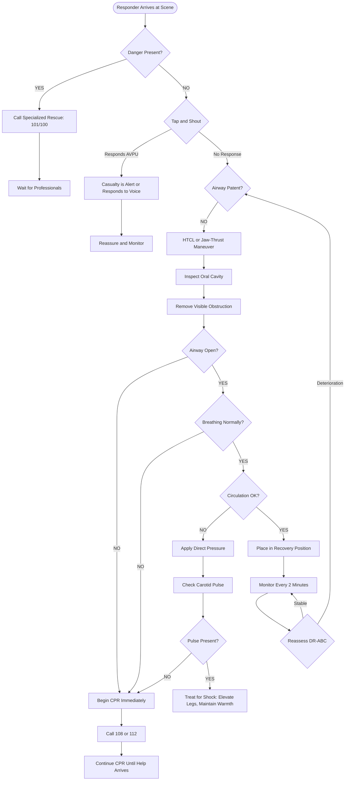
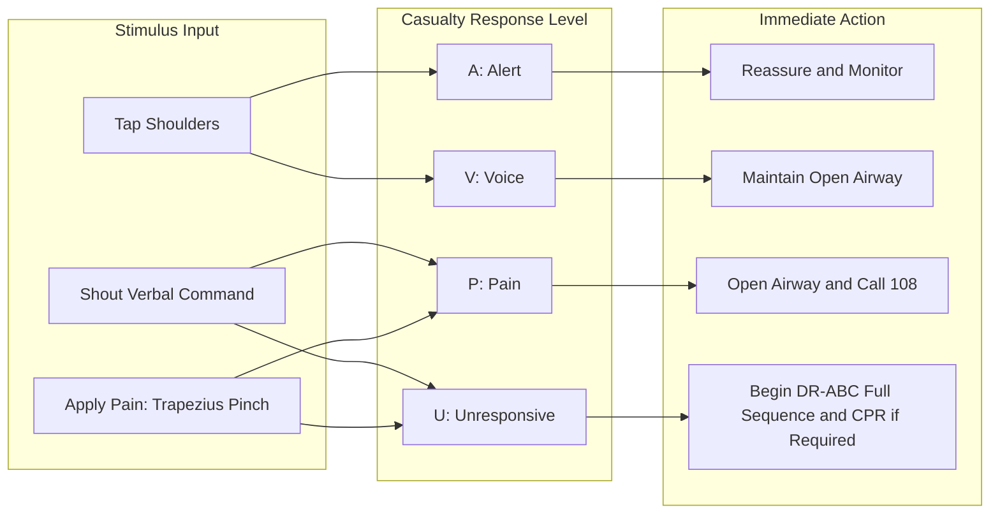
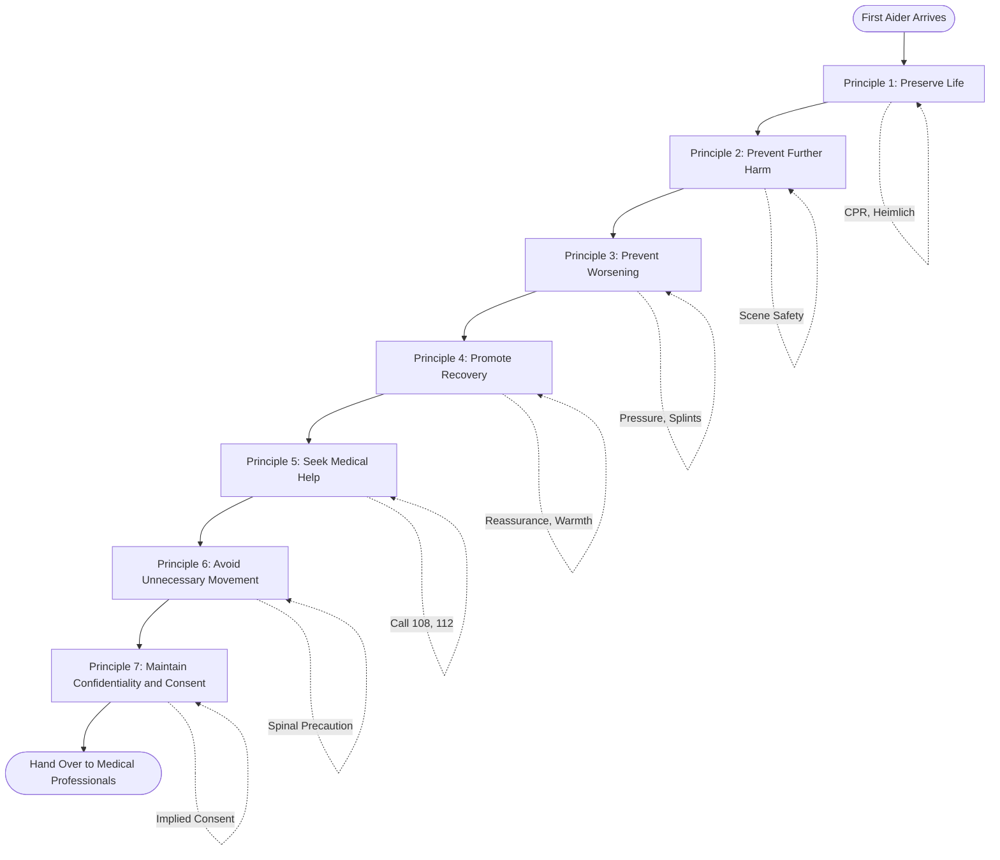
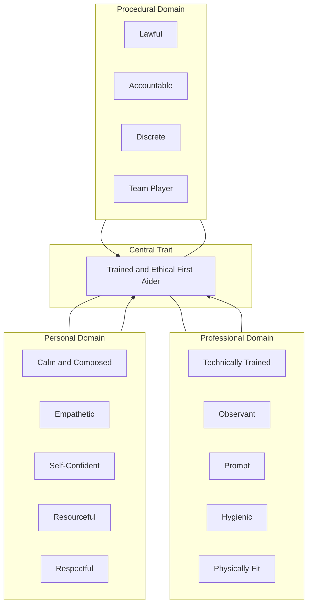

# First aid principles, Primary survey: ABC (Airway, Breathing, Circulation), Qualities of a Good First Aider

<!-- SECTION_1_START -->
# First Aid Fundamentals: Principles, Primary Survey (ABC), and the Ideal First Aider

## 1.1 Formal Definition (KTU 2024 Syllabus Terminology)

> [!IMPORTANT]
> **First Aid** is the **immediate, temporary, and often life-saving assistance** given to a person who has been injured or has suddenly fallen ill, using the materials available at the scene, until qualified medical help arrives or the casualty is transported to a medical facility.

> [!NOTE]
> **Primary Survey (ABC Protocol)** — A rapid, systematic, and sequential assessment of a casualty's vital life functions performed within the first **60 seconds** of contact to identify and treat immediately life-threatening conditions. The acronym **A-B-C** stands for **Airway, Breathing, and Circulation**.

> [!NOTE]
> **First Aider** — A trained individual who possesses the knowledge, skills, and psychological composure to administer immediate care during a medical emergency, while adhering to the legal and ethical boundaries of emergency response.

---

## 1.2 Intuitive Overview & Real-World Analogy

Imagine you are walking into a dark room where you cannot see anything. What is the very first thing you do? You flip the light switch. Why? Because you cannot solve the deeper problems (finding your keys, reading a book) until you address the **most fundamental issue** — visibility.

**First aid works exactly the same way.** When you encounter a collapsed or injured person, your brain is tempted to jump to the most obvious wound (the bleeding head, the twisted ankle). However, this is a fatal mistake. The body has a strict priority of life functions, and you must check them in order. If the **airway** is blocked, no amount of dressing a wound will save the person.

> [!TIP]
> **Geometric / Hierarchical Intuition:**
> Think of human life as a three-tier pyramid. The **Airway** is the broad foundation; without it, oxygen cannot enter. The **Breathing** layer sits on top; oxygen must reach the lungs. The **Circulation** layer forms the apex; oxygenated blood must reach the brain. Collapse any lower tier, and the upper tiers automatically fail.

---

## 1.3 Standardized Metrics & Recognition Cues

| Vital Check | Recognition Window | Critical Threshold | Color/Status Code |
|---|---|---|---|
| Airway Patency | **10 seconds** | Any obstruction = Emergency | **RED – Immediate Action** |
| Breathing Rate | **10 seconds** | Adult: **12–20 breaths/min** | **RED** if absent or < 6 |
| Pulse (Carotid) | **10 seconds** | Adult: **60–100 beats/min** | **RED** if absent |
| Skin Color | Immediate observation | Pink (normal), Blue/Cyanotic (critical) | **BLUE** = Hypoxia |

> [!VISUALIZATION CONTROL]
> **Concept:** The Time-Criticality Degradation Curve of a Casualty
> **Plot Type:** Stepwise decay function of consciousness vs. time without intervention
> **Desmos Input Equations:**
> * $f(t) = 100 \cdot e^{-0.15t}$ for oxygen deprivation (Brain Damage Curve)
> * $f(t) = 100$ for $t < 4$ minutes, then sharp drop after $t \geq 4$ minutes
> **Visual Description:** A horizontal plateau at 100% for the first 4 minutes (the "Golden Window"), followed by a steep exponential decay, demonstrating why the ABC primary survey must be completed in under 60 seconds.

---
<!-- SECTION_1_END -->

<!-- SECTION_2_START -->
# Deep Theoretical Analysis & KTU High-Yield Reference Matrix

## 2.1 The Seven Core Principles of First Aid

The KTU 2024 Scheme syllabus identifies the following foundational principles that govern every first aid action. These are **non-negotiable rules** that distinguish a trained responder from a bystander.

> [!NOTE]
> These principles form the **ethical and operational backbone** of every first aid intervention. Memorize them in order — examiners frequently test the *sequence* and the *rationale*.

### Principle 1 — **Preserve Life**
The single overriding objective. Everything the first aider does must prioritize keeping the casualty alive. This is the principle that justifies aggressive intervention (e.g., CPR, the Heimlich maneuver).

### Principle 2 — **Prevent Further Harm (Deterioration)**
The first aider must ensure the scene is safe and the casualty is moved only if there is a *present* danger (fire, traffic, structural collapse). Improper movement can worsen spinal injuries. The mnemonic **"Do No Harm"** originates here.

### Principle 3 — **Prevent the Condition from Worsening**
Apply direct pressure to bleeding, immobilize fractures, and treat for shock. This principle is **proactive**, not passive — it requires anticipating complications.

### Principle 4 — **Promote Recovery**
After stabilizing life threats, the first aider provides comfort (loosening tight clothing, maintaining body temperature, reassurance). Psychological first aid is a recognized component under this principle.

### Principle 5 — **Seek Medical Help (Call for Help)**
The first aider must **activate the emergency response system (ERS)** — in India, dialing **108 (Ambulance)**, **112 (Universal Emergency Number)**, or **102 (Maternal & Child Health)**. The casualty should never be left alone if medical help has not been summoned.

### Principle 6 — **Do Not Move the Casualty Unnecessarily**
Movement can convert a simple fracture into a compound fracture, or damage the spinal cord. The **"Stay-Put-Unless-Danger"** rule is critical.

### Principle 7 — **Maintain Confidentiality & Consent**
Touching a conscious adult without consent is legally considered **battery**. The first aider must obtain **implied consent** (in unconscious casualties) or **expressed consent** (in conscious casualties) and respect the casualty's dignity.

---

## 2.2 The Primary Survey: ABC Protocol (Detailed Analysis)

The Primary Survey is a **rapid, structured, and repeatable** assessment. It is repeated every **2–5 minutes** in a serious casualty or whenever a change in condition is noted.

### **A — Airway (with Cervical Spine Control)**

| Parameter | Action | Time Limit | Rationale |
|---|---|---|---|
| Conscious casualty | Ask: *"What is your name? Can you squeeze my hand?"* | 5 sec | Confirms patent airway + brain perfusion |
| Unconscious casualty | Head-tilt, Chin-lift maneuver (**HTCL**) | 5 sec | Lifts tongue off posterior pharyngeal wall |
| Suspected spinal injury | Jaw-thrust maneuver (no head tilt) | 5 sec | Maintains cervical spine alignment |
| Obstruction visible | Finger sweep (only if solid object visible) | 5 sec | Blind sweeps can push object deeper |

> [!WARNING]
> **Spinal Precaution Rule:** If the mechanism of injury involves a fall from height, road traffic accident, or diving accident, assume **cervical spine injury** until proven otherwise by an X-ray. Use the **jaw-thrust** technique only.

### **B — Breathing**

| Parameter | Action | Normal Value | Critical Value |
|---|---|---|---|
| **Look** | Chest rise and fall | Symmetric | Absent or paradoxical |
| **Listen** | Breath sounds at the mouth | Clear | Gasping, gurgling, stridor, wheeze |
| **Feel** | Air movement on cheek | Warm airflow | No airflow |
| **Rate** | Count for 10 seconds × 6 | Adult: **12–20/min** | < 6 or > 30 = Critical |

If the casualty is **not breathing normally**, immediately begin **Rescue Breathing / CPR** (compression-to-ventilation ratio of **30:2** for adult single rescuer).

### **C — Circulation**

| Parameter | Action | Normal Value | Critical Value |
|---|---|---|---|
| **Pulse Check** | Carotid (adult), Brachial (infant) | 60–100 bpm | Absent, < 50, or > 120 |
| **Skin** | Color, temperature, moisture | Pink, warm, dry | Pale, cold, clammy (shock) |
| **Capillary Refill** | Press nail bed, release | < 2 seconds | > 2 seconds (poor perfusion) |
| **Major Bleeding** | Visual + tactile sweep | None | Apply direct pressure immediately |

> [!IMPORTANT]
> **The Modern Update: C-A-B Sequence**
> The **American Heart Association (AHA) 2010 and later guidelines** recommend a **C-A-B** sequence (Circulation first via chest compressions) for **CPR in cardiac arrest**, because starting compressions immediately reduces the delay in coronary perfusion. However, for the **Primary Survey in trauma and general first aid**, the classic **A-B-C** sequence remains the KTU 2024 syllabus standard. **Know the distinction — this is a frequently asked KTU question.**

---

## 2.3 Qualities of a Good First Aider (Categorized Framework)

> [!NOTE]
> The KTU 2024 syllabus organizes the qualities into **three functional domains**: *Personal*, *Professional*, and *Procedural*. Examiners expect a structured answer, not a random list.

### Domain 1 — Personal Qualities (Character & Temperament)
- **Calm and Composed:** Panic spreads faster than the original emergency. A first aider must be the "anchor of stability."
- **Empathetic and Compassionate:** Genuine concern for the casualty's well-being, not mere curiosity.
- **Self-Confident (Not Arrogant):** Confident in their training, but aware of the limits of their competence.
- **Resourceful and Adaptable:** Improvise with available materials (e.g., using a shirt as a sling).
- **Tactful and Respectful:** Avoids alarming the casualty; respects cultural and gender sensitivities.

### Domain 2 — Professional Qualities (Knowledge & Skill)
- **Technically Trained:** Certified in BLS (Basic Life Support) and First Aid.
- **Observant:** Notices subtle signs — skin color, pupil size, voice changes.
- **Punctual and Prompt:** A delay of 4 minutes in cardiac arrest reduces survival by 30–40%.
- **Hygienic and Disciplined:** Uses gloves, masks, and sanitizers to prevent cross-infection.
- **Physically Fit:** Capable of performing chest compressions, lifting, and prolonged kneeling.

### Domain 3 — Procedural Qualities (Process & Ethics)
- **Lawful:** Acts within the legal framework (Good Samaritan Law, India — 2016).
- **Accountable:** Records every action, time, and observation.
- **Discrete:** Maintains confidentiality of the casualty's medical history.
- **Team Player:** Coordinates with bystanders, police, and paramedics effectively.

---

## 2.4 KTU High-Yield Formula & Value Sheet

| Concept | Key Formula / Value | Standard / Source | Engineering Parallel |
|---|---|---|---|
| Primary Survey Time | **$\leq 60$ seconds** | AHA / Red Cross | Latency in emergency systems |
| CPR Ratio (Adult) | **$30:2$** (compressions : breaths) | AHA 2020 Guidelines | Throughput ratio in data pipelines |
| CPR Compression Rate | **100–120 per minute** | AHA 2020 Guidelines | Real-time processing rate (Hz) |
| Compression Depth (Adult) | **At least 5 cm, not more than 6 cm** | AHA 2020 | Signal amplitude tolerance |
| Recovery Position | **$90^{\circ}$ lateral** | ERC Guidelines | Default safe state in control systems |
| Brain Damage Window | **4–6 minutes** (no oxygen) | Medical Consensus | System uptime tolerance |
| Survival Drop Per Minute | **$7–10\%$** without CPR | AHA Statistics | Decay constant in reliability engineering |
| Emergency Numbers (India) | **112 / 108 / 102** | Govt. of India | Service hotlines |
| Good Samaritan Law | Protected since **2016** | Supreme Court of India | Liability shield (analogous to firewall) |

> [!TIP]
> **Engineering Analogy:** Think of the ABC protocol as a **fault-detection algorithm** in an embedded system. A (Airway) is the *power supply check*; B (Breathing) is the *clock signal check*; C (Circulation) is the *data bus check*. You check the foundation before the upper layers, exactly like a **bottom-up hardware diagnostic**.

---

## 2.5 Real-World Utility & Cross-Disciplinary Importance

- **Sports & Athletics:** Immediate on-field assessment prevents career-ending complications (e.g., concussion management in football).
- **Industrial Engineering:** Every manufacturing unit is mandated (Factories Act 1948, India) to have a trained first aider per shift.
- **Software Engineering / IT:** First aid training is part of the **Health, Safety, and Environment (HSE)** policy in tech parks; sudden cardiac arrests (SCA) in young IT professionals have made AED (Automated External Defibrillator) deployment a standard.
- **Civil Engineering / Construction:** High-risk zones (scaffolding, heavy machinery) require first aid kits and trained personnel under the **BOCW Act 1996**.
- **Disaster Management:** Post the 2018 Kerala floods, the role of trained first aiders in the "Golden Hour" triage was globally recognized.
- **Aviation & Marine:** Cabin crew and ship officers are mandated to be certified first aiders under DGCA / IMO regulations.

---
<!-- SECTION_2_END -->

<!-- SECTION_3_START -->
# Step-by-Step Implementation, Decision Algorithms, and Standard Operating Procedures

## 3.1 The DR-ABC Decision Algorithm (Complete Exhaustive Walkthrough)

> [!NOTE]
> **DR-ABC** is the **extended mnemonic** taught in advanced first aid courses. The "DR" stands for **Danger** and **Response**, which are checked *before* the A-B-C sequence. The KTU 2024 syllabus expects students to know DR-ABC as the comprehensive primary survey framework.

### **Step 1 — D (Danger Assessment)**
- Pause for **5 seconds** before approaching.
- Visually scan the environment for: live electrical wires, fire, toxic fumes, unstable structures, hostile crowds, traffic, and aggressive animals.
- **Decision Rule:** If the scene is unsafe, **do not enter**. Call specialized rescue services (Fire: **101**, Police: **100**).
- **Mark:** `[Scene Safety Verified: 1 Mark]`

### **Step 2 — R (Response Check)**
- Approach the casualty from the **head end** (so you can see their chest and face).
- Tap the shoulders firmly. Shout: *"Can you hear me? Open your eyes!"*
- Use the **AVPU Scale** to quantify the response level:

| AVPU Level | Description | Clinical Interpretation |
|---|---|---|
| **A** — Alert | Eyes open spontaneously, oriented | Casualty is conscious |
| **V** — Voice | Responds to verbal stimulus | Semi-conscious, airway may be at risk |
| **P** — Pain | Responds only to painful stimulus (pinch) | Unconscious, **call ambulance immediately** |
| **U** — Unresponsive | No response to any stimulus | **Start ABC + CPR protocol** |

- **Mark:** `[AVPU Classification: 2 Marks]`

### **Step 3 — A (Airway)**
- **For a Conscious Casualty:** Allow them to find their most comfortable position; do not force.
- **For an Unconscious Casualty (No Spinal Injury Suspected):**
  * Place one hand on the forehead.
  * Place the fingertips of the other hand under the chin.
  * Gently tilt the head back (**head-tilt**) while lifting the chin (**chin-lift**).
  * Open the mouth and inspect for visible obstructions (vomit, blood, foreign body, dentures).
- **For an Unconscious Casualty (Spinal Injury Suspected):**
  * Use the **Jaw-Thrust Maneuver**: Place fingers behind the angle of the mandible and lift the jaw forward, **without tilting the head**.
  * This opens the airway while keeping the cervical spine immobilized.
- **Mark:** `[Correct Maneuver Identification: 2 Marks]`, `[Inspected for Obstructions: 1 Mark]`

### **Step 4 — B (Breathing)**
- Keep the airway open. Place your ear **2–3 cm** above the casualty's mouth and nose, looking down the chest.
- **Look** for chest rise (count the rise and fall as one breath).
- **Listen** for breath sounds (normal, wheeze, stridor, gurgling).
- **Feel** for warm exhaled air on your cheek.
- Count the number of breaths in **10 seconds**, then multiply by **6** to get breaths per minute.
- **Decision Rule:**

| Finding | Action |
|---|---|
| Breathing normally (12–20/min) | Place in **Recovery Position**; monitor |
| Gasping or abnormal breathing | Begin **CPR** immediately |
| No breathing | Begin **CPR** immediately |
| Mark | `[Look-Listen-Feel Triad: 3 Marks]`, `[Breath Rate Counted: 1 Mark]` |

### **Step 5 — C (Circulation)**
- **Pulse Check:** Locate the **carotid pulse** (Adam's apple → slide 2 cm to the side → press gently into the groove). Hold for **10 seconds**; if none, assume cardiac arrest.
- **Major Bleeding Check:** Run your hands visually from **head to toe** (gloved). Look for blood pooling under the body.
  * If bleeding is found, apply **firm, direct pressure** with a sterile dressing or clean cloth.
  * Elevate the limb **above the level of the heart** if no fracture is suspected.
  * If bleeding does not stop, apply a **pressure bandage** (elastic wrap).
- **Skin Assessment:** Check the inner eyelid, lips, and nail beds. Pink = good perfusion. Blue/grey = hypoxia. White/pale = shock.
- **Capillary Refill Test:** Press the nail bed for 5 seconds; release. Color should return within **2 seconds**. A delay indicates poor peripheral circulation (shock).
- **Mark:** `[Pulse Assessment: 2 Marks]`, `[Bleeding Control Technique: 2 Marks]`, `[Skin & Perfusion Check: 1 Mark]`

### **Step 6 — Repeat**
- Reassess the **entire DR-ABC** every **2 minutes** for a critical casualty, or every **5 minutes** for a stable casualty.
- Continue until **qualified help arrives** or the casualty is fully stabilized.

---

## 3.2 The Recovery Position (Step-by-Step Procedure)

The **Recovery Position** is the default posture for an **unconscious but breathing casualty with a patent airway**. It prevents aspiration (vomit entering the lungs) and maintains spinal alignment.

| Step | Action | Rationale |
|---|---|---|
| 1 | Kneel beside the casualty. Remove glasses, bulky items from pockets. | Prevents injury during roll |
| 2 | Straighten both legs. Place the **near arm** at right angles, elbow bent, palm up. | Provides support post-roll |
| 3 | Bring the **far arm** across the chest, hand resting on the far cheek. | Prevents the head from rolling face-down |
| 4 | With your other hand, **bend the far knee** to a $90^{\circ}$ angle, foot flat on the ground. | Creates a lever for rolling |
| 5 | Using the bent knee and far shoulder as levers, **roll the casualty towards you** onto their side. | Smooth, controlled rotation |
| 6 | Tilt the head slightly back to keep the airway open. Adjust the hand under the cheek to maintain head position. | Ensures drainage of fluids |
| 7 | Monitor breathing and pulse every **1–2 minutes**. | Detects deterioration early |

> [!WARNING]
> **Do NOT use the recovery position** if you suspect a **spinal injury**. Keep the casualty flat and manually stabilize the head and neck.

---

## 3.3 Comparative Decision Matrix: First Aid vs. Medical Treatment

| Parameter | First Aid | Medical Treatment |
|---|---|---|
| **Provider** | Trained layperson, bystander | Doctor, nurse, paramedic |
| **Setting** | At the scene of incident | Hospital, clinic, ambulance |
| **Duration** | First few minutes to hours | Hours to days |
| **Goal** | Stabilize, prevent worsening | Diagnose, cure, rehabilitate |
| **Tools** | First aid kit, improvised materials | Advanced medical equipment |
| **Legal Status** | Protected under Good Samaritan Law | Governed by Medical Council regulations |
| **Examples** | CPR, bandaging, recovery position | Surgery, prescription drugs, ICU care |
| **Boundary** | Ends when professional help takes over | Begins on casualty's arrival at facility |

---

## 3.4 Comparative Case Analysis: Applying the Qualities of a First Aider

> [!NOTE]
> The following **real-world inspired case frameworks** map the qualities of a first aider to engineering and emergency management matrices, as required by the KTU humanities-domain evaluation rubric.

### Case Study 1: Industrial Workshop Accident (Mechanical Engineering Workshop)

| Situation | Quality Invoked | Action |
|---|---|---|
| A worker is cut by a circular saw | **Calm & Composed** | Speak in a low, steady voice: *"I'm trained, I will help you."* |
| Severe arterial bleeding observed | **Observant & Technically Trained** | Apply direct pressure; identify spurting (arterial) vs. oozing (venous) |
| Colleagues panic and crowd around | **Tactful & Team Player** | Assign a bystander to call 108 and another to fetch the first aid kit |
| Casualty is Muslim female with headscarf | **Respectful & Culturally Sensitive** | Allow a female colleague to assist; expose only the wound area |
| Casualty goes into shock | **Resourceful** | Use a coat/jacket as a blanket; elevate legs if no spinal injury |

### Case Study 2: Sudden Cardiac Arrest in a Tech Park (Computer Science / IT Sector)

| Situation | Quality Invoked | Action |
|---|---|---|
| IT employee collapses in cafeteria | **Self-Confident & Prompt** | Don't wait for "someone else"; take charge in 10 seconds |
| No pulse detected | **Technically Trained** | Begin CPR (30:2, 100–120 compressions/min) |
| AED is mounted on the wall | **Procedurally Disciplined** | Power on AED, attach pads, follow voice prompts |
| Bystander hesitant to help | **Accountable & Team Player** | Delegate: *"You — call 112. You — bring the AED. You — clear the crowd."* |
| Family arrives and panics | **Tactful & Discrete** | Reassure: *"Medical help is on the way. Please give us space."* |
| Documentation required later | **Lawful & Accountable** | Note the time of collapse, time CPR began, time AED was used |

---

## 3.5 Step-by-Step Operational Checklist (Print-and-Use for Examinations)

> [!TIP]
> **Use this checklist as a structured answer template for the 14-mark question on Primary Survey.**

1. [ ] **Scene Safety (D)** — Survey for danger; ensure the scene is safe.
2. [ ] **Response (R)** — Tap and shout; classify on the AVPU scale.
3. [ ] **Airway (A)** — Open using head-tilt-chin-lift or jaw-thrust.
4. [ ] **Breathing (B)** — Look, Listen, Feel for 10 seconds.
5. [ ] **Circulation (C)** — Check pulse, control bleeding, assess perfusion.
6. [ ] **Activate ERS** — Call 108/112; provide location and condition.
7. [ ] **Reassess** — Repeat every 2 minutes.
8. [ ] **Handover** — Provide SBAR report to paramedics (**S**ituation, **B**ackground, **A**ssessment, **R**ecommendation).
9. [ ] **Document** — Time of incident, interventions, casualty's responses.
10. [ ] **Debrief** — Review with the response team; address psychological stress.

---
<!-- SECTION_3_END -->

<!-- SECTION_4_START -->
# Structural Diagrams & Schematics

## 4.1 The DR-ABC Primary Survey Flowchart (Mermaid)

---

## 4.2 The AVPU Consciousness Classification Matrix (Mermaid Subgraph)

---

## 4.3 The Seven Principles of First Aid — Sequential Logic Map

---

## 4.4 The Qualities of a Good First Aider — Functional Architecture Block Diagram

---

## 4.5 Sequential Processing Topology: From Casualty Contact to Handover

```mermaid
flowchart LR
    S1[Stage 1: Scene Survey and D R Check] --> S2[Stage 2: Airway and Cervical Spine Control]
    S2 --> S3[Stage 3: Breathing Assessment]
    S3 --> S4[Stage 4: Circulation and Hemorrhage Control]
    S4 --> S5[Stage 5: Disability and Exposure Check]
    S5 --> S6[Stage 6: Continuous Monitoring]
    S6 --> S7[Stage 7: SBAR Handover to Paramedics]
    S7 --> S8[Stage 8: Post Incident Documentation and Debrief]
```

<!-- SECTION_4_END -->

<!-- SECTION_5_START -->
# KTU 2024 Scheme Examination Question Bank & Topic Recap

---

## Part A — Short Answer Questions (3 Marks Each)

### **Question 1** `[KTU University Exam – July 2024]`
**Define First Aid. List any four principles of First Aid.** `[CO1 | Remember]`

**Model Answer (3 Marks):**

> **Definition (1 Mark):** First aid is the immediate, temporary care given to a person who is injured or suddenly ill, using materials available at the scene, until qualified medical assistance arrives.

> **Four Principles (½ Mark Each = 2 Marks):**
> 1. **Preserve Life** – The primary goal is to keep the casualty alive.
> 2. **Prevent Further Harm** – Ensure the scene is safe and avoid actions that worsen the condition.
> 3. **Promote Recovery** – Provide comfort, warmth, and reassurance.
> 4. **Seek Medical Help** – Activate the emergency response system (call 108 or 112).

---

### **Question 2** `[KTU University Exam – Dec 2023]`
**What is the Primary Survey? Explain the A-B-C protocol in brief.** `[CO1, CO2 | Understand]`

**Model Answer (3 Marks):**

> **Primary Survey Definition (1 Mark):** The primary survey is a rapid, systematic assessment of a casualty's vital functions, completed within 60 seconds of contact, to identify and treat immediately life-threatening conditions.

> **A-B-C Protocol (2 Marks):**
> - **A – Airway:** Open and maintain a clear airway using the head-tilt-chin-lift or jaw-thrust maneuver.
> - **B – Breathing:** Check for chest rise, breath sounds, and airflow for 10 seconds; initiate CPR if absent.
> - **C – Circulation:** Check the carotid pulse, control major bleeding, and assess skin color and capillary refill.

---

---

## Part B — Long Answer Questions (14 Marks Each)

> [!NOTE]
> KTU Part B questions follow the **ESE Module Internal Choice** pattern. Both alternatives are provided below. Each carries sub-parts (a) for 7 marks and (b) for 7 marks.

---

### **Question A (14 Marks)** `[KTU University Exam – July 2024]`

**(a)** Describe the seven principles of First Aid in detail. **(7 Marks)** `[CO1 | Understand]`

**(b)** List and explain the qualities of a good First Aider under the three domains: Personal, Professional, and Procedural. **(7 Marks)** `[CO1, CO2 | Apply]`

---

#### **Model Solution for Question A(a) — 7 Marks**

> **[Principle 1 – Preserve Life: 1 Mark]**
> This is the supreme principle. The first aider's every action must prioritize keeping the casualty alive. Examples include performing CPR on a cardiac arrest victim, administering the Heimlich maneuver for choking, and clearing an obstructed airway. The principle justifies the use of any reasonable, non-harmful intervention, even invasive ones, when death is imminent.

> **[Principle 2 – Prevent Further Harm: 1 Mark]**
> The first aider must assess the scene for safety (live wires, fire, traffic) before approaching. Moving a casualty with a suspected spinal injury can convert a stable injury into permanent paralysis, so the principle mandates *"Do No Harm"* through minimal handling.

> **[Principle 3 – Prevent Worsening of the Condition: 1 Mark]**
> The first aider should apply direct pressure to bleeding, immobilize fractures using splints, and treat for shock. This principle is **proactive** and requires anticipating complications before they arise.

> **[Principle 4 – Promote Recovery: 1 Mark]**
> Beyond physical stabilization, the first aider must provide psychological comfort — speaking calmly, loosening tight clothing, covering the casualty with a blanket to maintain body temperature, and offering reassurance. The Red Cross recognizes *"comfort and reassurance"* as a measurable recovery indicator.

> **[Principle 5 – Seek Medical Help: 1 Mark]**
> The first aider must activate the Emergency Response System (ERS) by dialing **108** (ambulance), **112** (universal emergency), or **102** (maternal and child emergencies) in India. The casualty should never be left unattended if help is not on the way.

> **[Principle 6 – Do Not Move the Casualty Unnecessarily: 1 Mark]**
> Movement should occur only if there is a *present and immediate* danger (e.g., fire, building collapse). The "Stay-Put-Unless-Danger" rule is non-negotiable for suspected spinal injuries.

> **[Principle 7 – Maintain Confidentiality and Consent: 1 Mark]**
> Implied consent is assumed for unconscious casualties (the law presumes a reasonable person would consent to life-saving care). For conscious casualties, expressed verbal consent is mandatory. The first aider must keep medical information confidential.

---

#### **Model Solution for Question A(b) — 7 Marks**

> **[Domain 1 – Personal Qualities: 2.5 Marks]**
> 1. **Calm and Composed:** A first aider's steady demeanor prevents bystander panic and reassures the casualty. Panic reduces the quality of clinical decisions.
> 2. **Empathetic and Compassionate:** Genuine concern motivates continued care. A first aider who cares will check for subtle signs (a flinch, a whispered pain).
> 3. **Self-Confident (Within Competence Limits):** Confidence allows decisive action; arrogance leads to interventions beyond training.
> 4. **Resourceful and Adaptable:** In the field, equipment may be limited. A resourceful first aider uses a clipboard as a splint or a shirt as a bandage.
> 5. **Tactful and Respectful:** A first aider must respect cultural, religious, and gender sensitivities — e.g., allowing a female first aider to treat a female casualty when possible.

> **[Domain 2 – Professional Qualities: 2.5 Marks]**
> 1. **Technically Trained:** Certification in Basic Life Support (BLS) and First Aid is essential.
> 2. **Observant:** Notices subtle signs — pupil dilation, skin color changes, voice hoarseness.
> 3. **Prompt and Punctual:** A delay of 4 minutes in cardiac arrest reduces survival by 30–40%.
> 4. **Hygienic:** Uses gloves, masks, and sanitizers to prevent blood-borne infections (HIV, Hepatitis B).
> 5. **Physically Fit:** Capable of sustained chest compressions, lifting, and prolonged kneeling.

> **[Domain 3 – Procedural Qualities: 2 Marks]**
> 1. **Lawful:** Protected under the **Good Samaritan Law (India, 2016)** but must operate within legal limits.
> 2. **Accountable:** Documents every action with timestamps.
> 3. **Discrete:** Maintains casualty confidentiality.
> 4. **Team Player:** Coordinates with police, ambulance, and bystanders.

---

### **Question B (14 Marks)** `[KTU University Exam – Dec 2023]`

**(a)** Explain the **DR-ABC Primary Survey** in detail with the rationale for each step. **(7 Marks)** `[CO2 | Apply]`

**(b)** Differentiate between the **head-tilt-chin-lift** and **jaw-thrust** maneuvers. Under what circumstances should each be used? **(7 Marks)** `[CO2 | Apply]`

---

#### **Model Solution for Question B(a) — 7 Marks**

> **[D – Danger Assessment: 1.5 Marks]**
> The first aider pauses for 5 seconds before approaching. The scene is surveyed for: live electrical wires, fire, toxic fumes, unstable structures, traffic, hostile crowds, and aggressive animals. If the scene is unsafe, specialized rescue (Fire 101, Police 100) is called first. *Rationale:* A dead first aider cannot save the casualty. A casualty in an unsafe environment is in greater danger than one with a stable injury.

> **[R – Response Check using AVPU: 1.5 Marks]**
> Tap the shoulders firmly and shout: *"Can you hear me? Open your eyes!"* Classify the response on the **AVPU scale**: **A**lert, responds to **V**oice, responds to **P**ain, or **U**nresponsive. *Rationale:* The level of consciousness directly correlates with brain perfusion. An unresponsive casualty (P or U) requires immediate airway support and ambulance dispatch.

> **[A – Airway with C-spine Control: 1.5 Marks]**
> Open the airway using **head-tilt-chin-lift** (no spinal injury suspected) or **jaw-thrust** (spinal injury suspected). Inspect the oral cavity for obstructions (vomit, blood, foreign body, displaced dentures). *Rationale:* An obstructed airway causes hypoxia in under 4 minutes, leading to brain death. The tongue is the most common cause of obstruction in unconscious casualties.

> **[B – Breathing Check: 1.5 Marks]**
> Use the **Look-Listen-Feel** triad for 10 seconds. Count the respiratory rate. If absent or gasping, begin **CPR** (30:2). *Rationale:* Normal breathing (12–20/min) confirms oxygenation. Agonal breathing (gasping) is not normal and is a sign of cardiac arrest.

> **[C – Circulation Check: 1 Mark]**
> Check the **carotid pulse** for 10 seconds, scan for major bleeding (head-to-toe sweep), and assess skin color and capillary refill. Control bleeding with direct pressure. *Rationale:* A missing pulse initiates CPR. Uncontrolled hemorrhage is the leading preventable cause of death in trauma (the "Platinum 10 Minutes" concept).

---

#### **Model Solution for Question B(b) — 7 Marks**

> **[Definition and Mechanics of Head-Tilt-Chin-Lift: 2 Marks]**
> The **Head-Tilt-Chin-Lift (HTCL)** maneuver is performed by placing one hand on the casualty's forehead and applying gentle backward pressure, while the fingertips of the other hand lift the bony part of the chin forward. This action lifts the tongue away from the posterior pharyngeal wall, opening the airway.

> **[Indication for HTCL: 1 Mark]**
> Used in **unconscious casualties with no suspicion of spinal injury** — for example, a fainting episode, drug overdose, or drowning.

> **[Contraindication for HTCL: 1 Mark]**
> **Strictly contraindicated** in suspected cervical spine injuries because the backward head tilt can sever or compress the spinal cord.

> **[Definition and Mechanics of Jaw-Thrust: 2 Marks]**
> The **Jaw-Thrust** maneuver is performed by placing the index and middle fingers behind the angle of the mandible (lower jaw) and lifting the jaw forward, **without tilting the head**. The mouth is opened by pulling the lower lip down with the thumbs.

> **[Indication for Jaw-Thrust: 1 Mark]**
> Used when **cervical spine injury is suspected** — road traffic accidents, falls from height, diving accidents, or sports collisions (rugby, American football).

---

> [!WARNING]
> **KTU Examiner's Valuation Warning — Common Pitfalls**
> - **Do not skip writing the "D" (Danger) and "R" (Response) steps** when describing the primary survey. Many students answer only "A-B-C" and lose **1.5 marks**.
> - **Do not confuse the A-B-C order** with the modern **C-A-B** sequence used in CPR. For the *Primary Survey* in first aid, the KTU 2024 syllabus strictly uses **A-B-C**.
> - **Failing to mention cervical spine control** during the Airway step is a frequent 1-mark deduction. Always state *"with cervical spine control."*
> - **Do not write the qualities of a first aider as a random list.** Examiners reward the *three-domain structure* (Personal, Professional, Procedural). A list without categorization will lose 1–2 marks.
> - **Always cite the Indian emergency number (108/112)** in answers. Writing only "911" is incorrect and loses ½ mark.
> - **Do not describe CPR techniques** (compression depth, AED usage) unless the question specifically asks. Stay within the scope of the asked question.

---

## Topic Recap & Important Things to Remember

> [!TIP]
> **High-Density Rapid Revision Checklist — Print this for last-minute preparation.**

- **First Aid** is **immediate, temporary, life-saving care** given at the scene until medical help arrives.
- **First Aid is NOT a replacement for medical treatment** — it is a bridge.
- The **7 Principles of First Aid** in order: **Preserve Life → Prevent Further Harm → Prevent Worsening → Promote Recovery → Seek Medical Help → Avoid Unnecessary Movement → Maintain Confidentiality & Consent**.
- The **Primary Survey** is completed in **≤ 60 seconds** and follows the **DR-ABC** sequence (Danger, Response, Airway, Breathing, Circulation).
- The **A-B-C** sequence is the **KTU 2024 standard**; the modern **C-A-B** sequence applies to **CPR in cardiac arrest** (do not confuse).
- The **Recovery Position** is used for an **unconscious but breathing** casualty (lateral, $90^{\circ}$).
- The **Head-Tilt-Chin-Lift** is used when **no spinal injury is suspected**; the **Jaw-Thrust** is used when **spinal injury is suspected**.
- The **AVPU scale** classifies consciousness as: **A**lert, responds to **V**oice, responds to **P**ain, **U**nresponsive.
- The **Look-Listen-Feel** triad is the standard breathing check method (10 seconds).
- The **carotid pulse** is checked in adults; the **brachial pulse** in infants.
- **Capillary refill > 2 seconds** indicates poor peripheral perfusion (shock).
- **CPR ratio (Adult)**: **30 compressions : 2 breaths**; rate: **100–120/min**; depth: **5–6 cm**.
- **Brain damage** begins within **4–6 minutes** of oxygen deprivation; survival drops **7–10% per minute** without CPR.
- **Indian Emergency Numbers**: **112** (Universal), **108** (Ambulance), **102** (Maternal/Child), **101** (Fire), **100** (Police).
- The **Good Samaritan Law (2016, India)** legally protects first aiders who act in good faith.
- The **Qualities of a First Aider** are grouped into **3 domains**:
  * **Personal**: Calm, Empathetic, Self-Confident, Resourceful, Tactful.
  * **Professional**: Trained, Observant, Prompt, Hygienic, Physically Fit.
  * **Procedural**: Lawful, Accountable, Discrete, Team Player.
- The **First Aider must always**: assess scene safety, obtain consent, activate ERS, avoid unnecessary movement, and document every action.
- **Industrial and IT workplace compliance** (Factories Act 1948, BOCW Act 1996) mandates a **trained first aider per shift** and a **First Aid Box** with prescribed contents.
- The **"Golden Hour"** (first 60 minutes post-injury) and the **"Platinum 10 Minutes"** (for trauma) are critical time windows that govern the entire first aid response.
- **Kneel beside, do not stand over** the casualty during assessment — this projects calm and provides better access.
- **A trained first aider's greatest tool is not equipment — it is the decision to act** (the *"Bystander Effect"* must be overcome).
<!-- SECTION_5_END -->
