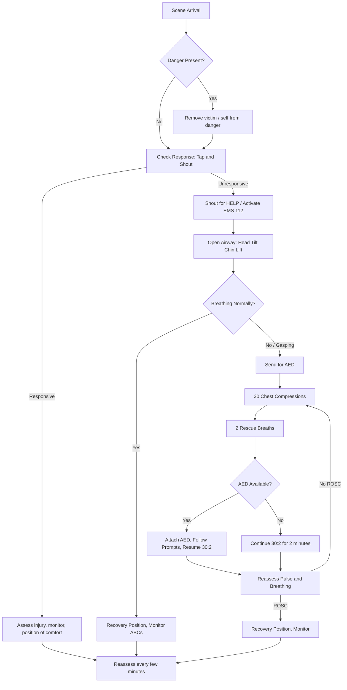
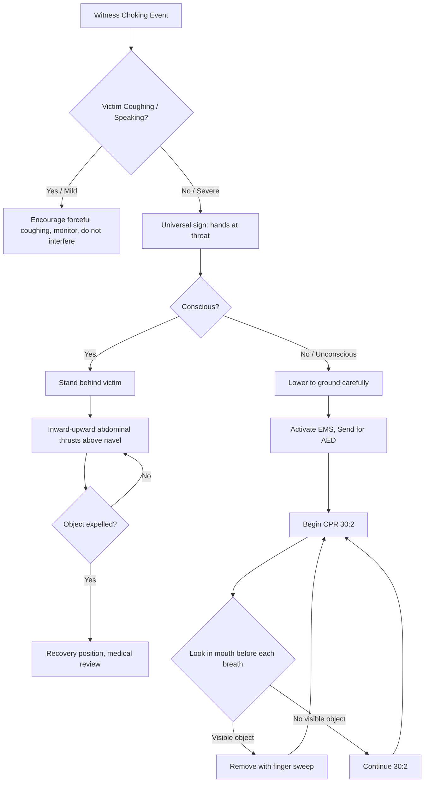
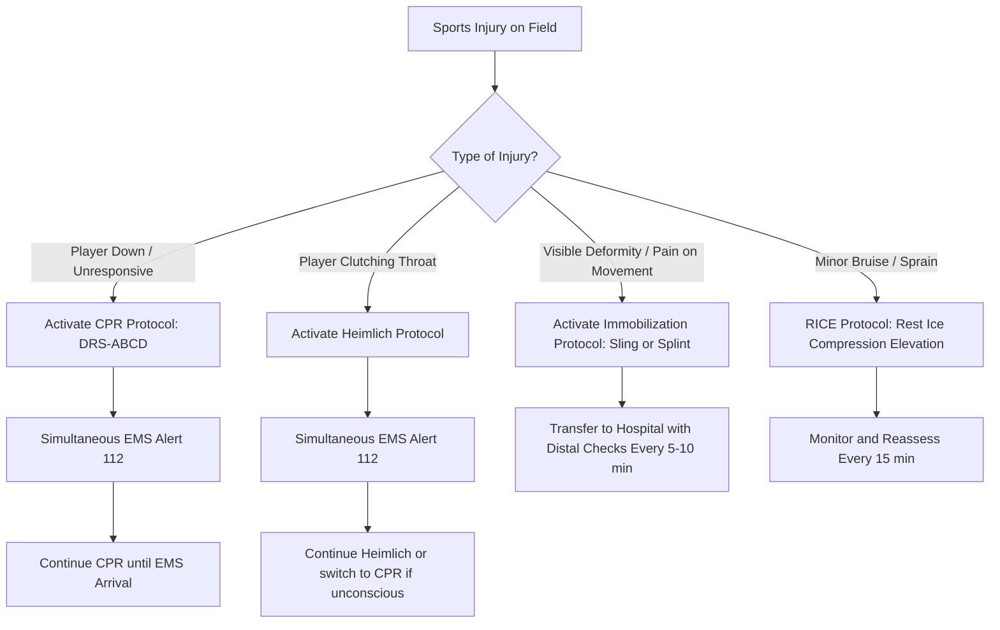

# Procedures: CPR, Heimlich Maneuver, Applying a sling

<!-- SECTION_1_START -->

# First Aid & Sports Injury Protocols — Core Technical Definitions

> [!IMPORTANT]
> **KTU 2024 Scheme | UCHWT127 | Module 4 | First Aid Fundamentals**
> This module evaluates the student's ability to **recognize, prioritize, and execute** life-saving first aid interventions in a real-world (especially sports/engineering field) emergency. The KTU board explicitly tests the *order of operations* (DRS-ABCD action sequence) and the *numerical ratios* (compression-to-ventilation ratio, compression depth, etc.).

---

## 1.1 Cardiopulmonary Resuscitation (CPR)

**Formal Definition (KTU Syllabus Terminology):**
CPR is a life-saving emergency procedure performed when the heart stops beating (cardiac arrest) or breathing ceases (respiratory arrest). It combines **chest compressions** (to artificially circulate oxygenated blood) and **rescue breaths** (to artificially ventilate the lungs), thereby maintaining perfusion to the brain and vital organs until spontaneous circulation (ROSC — Return of Spontaneous Circulation) is restored or advanced medical care arrives.

> [!NOTE]
> **DRS-ABCD Action Sequence (Universal Emergency Protocol):**
> **D** — Danger (assess scene safety)
> **R** — Response (tap & shout to check responsiveness)
> **S** — Shout for help / Send for AED (Automated External Defibrillator)
> **A** — Airway (head-tilt, chin-lift)
> **B** — Breathing (look, listen, feel for ≤ **10 seconds**)
> **C** — Compressions (push hard, push fast)
> **D** — Defibrillation (attach AED as soon as available)

**Conceptual Analogy / Intuition 🫀:**
Think of the heart as a **mechanical water pump** and the blood as the fluid in a closed pipe network. When the pump fails, the pipes still hold fluid — but nothing moves. CPR is the **manual override handle** on that pump. Your hands act as a second piston, squeezing the chest to push blood out of the heart, then releasing to let it refill. Every compression is one "manual heartbeat." The rescue breath acts like a **bellows** pushing fresh oxygen into the lungs so the next pumped blood carries oxygen, not just empty fluid. Without oxygenated blood reaching the brain within **4–6 minutes**, brain cells begin irreversible death — hence the urgency.

> [!IMPORTANT]
> **Key Standard Metrics (must be memorized verbatim for KTU exams):**
> - Compression depth (adult): **5–6 cm (≈ 2 inches)**
> - Compression rate: **100–120 per minute**
> - Compression-to-ventilation ratio (adult): **30:2**
> - Hand placement: **Lower half of the sternum (center of the chest)**
> - Allow **full chest recoil** between compressions
> - Minimize interruptions; aim for chest compression fraction (CCF) **> 60%**

> [!VISUALIZATION CONTROL]
> **Concept:** Hand Placement and Force Vector for CPR
> **Reference Points:** Anterior thoracic surface, midsternal line
> **Visual Description:** Imagine a clock face drawn on the chest. The **xiphoid process** sits at 6 o'clock. Place the **heel of the dominant hand** at the **center of the chest** (between the nipples), with the second hand interlocked on top, arms locked straight, shoulders directly over the hands, generating a vertical force vector straight down onto the **lower half of the sternum** — strictly avoiding the **xiphoid process** to prevent internal organ laceration.

---

## 1.2 Heimlich Maneuver (Abdominal Thrusts)

**Formal Definition:**
The Heimlich Maneuver is an **emergency first-aid technique** used to dislodge a **Foreign Body Airway Obstruction (FBAO)** — typically a piece of food or small object — from the trachea (windpipe) of a conscious choking victim. It works by generating a rapid increase in **intra-abdominal pressure**, which forces air out of the lungs like an artificial cough, expelling the obstruction.

> [!NOTE]
> **Universal Choking Sign (the "Universal Sign of Choking"):**
> A conscious choking person will instinctively **clutch both hands around their own throat**. This is the internationally recognized sign for "I am choking." Immediately ask: *"Are you choking? Can you speak?"* — if the answer is silence or only a nod, treat as a **severe (complete) airway obstruction** and proceed with abdominal thrusts.

**Conceptual Analogy / Intuition 🍬:**
Imagine a **soft drink bottle** held upside down. If a piece of candy (the obstruction) gets stuck in the narrow neck (trachea), tipping and tapping rarely works. What works? Squeezing the **middle of the bottle suddenly and hard** — the pressurized air inside shoots upward and pops the candy out. The Heimlich Maneuver does exactly this to the human body: by thrusting inward and upward just above the navel, you compress the **diaphragm**, which compresses the **lungs**, which forces a high-velocity air burst up the windpipe — converting your arms into a human pressure-pump.

> [!IMPORTANT]
> **Critical Differentiation — KTU Frequently Tested:**
> - **Conscious adult/child (>1 year) →** Abdominal Thrusts (Heimlich)
> - **Conscious infant (<1 year) →** **5 Back Blows + 5 Chest Thrusts** (NEVER abdominal thrusts on infants — risk of liver laceration)
> - **Unconscious victim →** Lower to the ground → begin **CPR (30:2)**; check mouth for visible object before each ventilation
> - **Self-rescue (choking alone) →** Thrust your own fist into your abdomen, OR lean hard over a chair/firm edge and press

---

## 1.3 Applying a Sling (Arm Sling / Triangular Bandage)

**Formal Definition:**
An **arm sling** is a triangular bandage (or improvised equivalent) applied to **immobilize and support** an injured upper extremity — typically used for suspected **fractures, dislocations, sprains, or post-reduction support** of the shoulder, clavicle, humerus, elbow, or forearm. It functions by transferring the weight of the injured limb to the **contralateral shoulder and neck**, thereby reducing pain, preventing further soft-tissue or neurovascular damage, and maintaining anatomical alignment during transport.

**Conceptual Analogy / Intuition 🪢:**
Think of an injured arm as a **leaking water pipe with a crack**. You cannot fix the crack right now, but you can **immobilize the pipe** so no further stress (bending, swinging, gravity-traction) widens the crack. A sling is essentially a **fabric hammock** tied around the neck, which cradles the forearm and keeps the entire limb suspended in a fixed, neutral, slightly flexed position — like hanging a broken shelf bracket on a wall hook so it stops sagging.

> [!IMPORTANT]
> **Syllabus Highlight — Triangular Bandage Specifications:**
> A standard first-aid **triangular bandage** measures approximately **100 cm × 100 cm × 140 cm** (isosceles triangle). It can be used in two principal sling configurations:
> 1. **Arm Sling (Cravat-style)** — supports the forearm in a horizontal position (elbow flexed at 90°).
> 2. **Elevation Sling / St. John's Sling** — supports the entire arm in an **elevated** position, used for hand injuries, finger fractures, and to control bleeding/edema.
>
> Key safety rule: **Always check circulation distal to the sling** (fingertip color, capillary refill, sensation) **before AND after** application. If fingers turn **blue, white, cold, or numb** — the sling is too tight; loosen immediately.

<!-- SECTION_1_END -->

<!-- SECTION_2_START -->

# Deep Theoretical Analysis & KTU High-Yield Formula Sheet

---

## 2.1 Theoretical Framework — The "Why" Behind the Protocols

Every first-aid procedure rests on three physiological pillars: **(1) Oxygenation, (2) Circulation, (3) Immobilization**. Understanding the *why* makes memorization redundant at the exam desk.

### 2.1.1 The "Why" of CPR
- **Brain cells (neurons) are exquisitely sensitive to hypoxia.** Permanent damage begins at **4 minutes**; biological death within **8–10 minutes** without intervention.
- Each chest compression artificially generates **systolic arterial pressure** of approximately **60–80 mmHg**, sufficient for minimal cerebral and coronary perfusion.
- The "30:2" ratio is derived from mathematical optimization: a single rescuer needs to minimize the interruption between compressions; 30 compressions take ~**18 seconds** at the correct rate, then 2 breaths take ~**4 seconds**, yielding a CCF of ~**75%**.
- **Why heel of the hand?** It concentrates force onto a small surface area over the sternum (a rigid bony plate) and transmits the force to the heart sandwiched between the sternum and the vertebral column, effectively squeezing the ventricles.

### 2.1.2 The "Why" of Heimlich
- The **trachea** is a rigid cartilage-reinforced tube; an obstruction cannot be pulled out by external force directly.
- The **diaphragm** is the primary muscle of respiration and forms the floor of the thoracic cavity. An inward-and-upward thrust compresses the diaphragm → compresses lungs → generates an artificial cough.
- The **artificial cough** generates airflow velocities of **~205 L/min**, far exceeding a normal cough (~100 L/min), which is sufficient to expel the obstruction.

### 2.1.3 The "Why" of a Sling
- A fractured bone has **sharp, jagged edges** at the fracture site. Without immobilization, every movement grinds bone fragments against muscle, nerves, and blood vessels — causing **pain, hemorrhage, and compartment syndrome**.
- The sling converts the injured limb into a **single rigid unit** by locking the elbow at **90° flexion** and the wrist in **slight extension (10–15°)**, which is the **position of function** (also called the "resting position" or "position of safety") for the upper extremity.

---

## 2.2 KTU High-Yield Formula Sheet / Cheat Sheet

> [!NOTE]
> **Master this table. KTU Part-A (3-mark) questions are directly drawn from these numerical values.**

| Parameter | CPR (Adult) | Heimlich (Adult) | Sling Application |
|---|---|---|---|
| **Patient Position** | Supine on hard surface | Standing or seated (conscious) | Seated, arm supported by rescuer |
| **Rescuer Position** | Kneeling beside chest, arms locked | Standing behind victim | Standing in front of victim |
| **Hand/Body Placement** | Heel of hand on **lower half of sternum** | Fist midway between navel & xiphoid | Triangular bandage draped under forearm |
| **Depth / Force** | **5–6 cm** depression | Sudden inward & upward thrust | Snug but not tight; check pulse distal |
| **Rate / Repetitions** | **100–120 compressions/min** | Repeat thrusts until object expelled or victim becomes unconscious (then begin CPR) | Single application; check circulation every 5–10 min |
| **Ratio / Sequence** | **30 compressions : 2 breaths** | **5 back blows + 5 abdominal thrusts** (if conscious, vigorous cough fails) | 1 bandage → broad base → knot at neck side (NOT over spine) |
| **Cycle Duration** | Continue until AED / EMS / ROSC | Until object expelled or victim unconscious | 1 application; reassess at intervals |
| **Contraindications** | None in cardiac arrest | Infants < 1 yr (use back blows + chest thrusts) | Open fractures (cover wound first); suspected neck injury (immobilize differently) |
| **Stop Conditions** | AED ready / EMS arrives / rescuer exhausted / victim recovers | Object expelled / victim becomes unconscious / EMS takes over | Hospital transfer / medical professional takes over |
| **Key Check** | Pulse on **carotid artery** | Watch for object expulsion | **Capillary refill < 2 sec**, pink fingertips |

> [!IMPORTANT]
> **Engineering/Real-World Utility (For Viva & Interview):**
> - **CPR**: Mandatory certification (BLS — Basic Life Support) for **lifeguards, sports coaches, electrical engineers** (electrocution on site), and all healthcare professionals. The **2020 AHA Guidelines Update** emphasizes **Hands-Only CPR** for lay rescuers unwilling to give rescue breaths.
> - **Heimlich**: Restaurant staff, sports trainers, hostel wardens, and **food-court safety officers** are routinely trained. It is the #1 cause of accidental death under age 4 (choking on food).
> - **Sling**: Every **first-aid kit** in labs, workshops, and sports facilities must contain at least **2 triangular bandages** (as per Indian Factory Act norms and KTU lab safety regulations).

<!-- SECTION_2_END -->

<!-- SECTION_3_START -->

# Step-by-Step Procedures & Implementation

> [!WARNING]
> **KTU Examiner's Standard:** In 14-mark Part-B questions, *each* numbered step in a first-aid procedure carries **1 mark** (a typical 7-step procedure = 7 marks). Skipping steps is the **#1 reason students lose marks**. Always number your steps explicitly: Step 1, Step 2… Step 7.

---

## 3.1 Procedure A — Adult CPR (Standard 2-Rescuer / 1-Rescuer)

**Indications:** Unresponsive + not breathing / gasping (agonal breathing).

| Step | Action | Rationale |
|---|---|---|
| **Step 1** | **Assess safety** of the scene. Move victim only if there is an immediate hazard. | Prevents rescuer injury. |
| **Step 2** | **Check responsiveness**: tap shoulders firmly, shout *"Are you okay?"* | Confirms cardiac/respiratory arrest. |
| **Step 3** | **Shout for help / Activate EMS (dial 112/108 in India) / Ask bystander to fetch AED.** | Activates chain of survival. |
| **Step 4** | **Position victim supine** on a firm, flat surface. Kneel beside the chest at the level of the sternum. | Firm surface maximizes compression depth. |
| **Step 5** | **Check pulse & breathing simultaneously** for **≤ 10 seconds** at the **carotid artery** (groove between trachea and sternocleidomastoid muscle). | Absent pulse → start compressions. |
| **Step 6** | **Place heel of dominant hand** on the **center of the chest (lower half of sternum)**. Interlock fingers of the other hand on top. Lock elbows straight. | Correct hand position prevents rib fractures and maximizes cardiac compression. |
| **Step 7** | **Deliver 30 chest compressions** at a depth of **5–6 cm**, rate **100–120/min**. Allow **complete chest recoil** between compressions. | Manual systole / diastole. |
| **Step 8** | **Open airway** using **head-tilt, chin-lift** maneuver (or jaw-thrust if cervical spine injury suspected). | Aligns oropharynx, larynx, and trachea. |
| **Step 9** | **Deliver 2 rescue breaths** (1 second each, watch for chest rise). | Oxygenates the blood. |
| **Step 10** | **Resume 30:2 cycles** without interruption. **Attach AED** as soon as available; follow voice prompts. | Maintains perfusion and defibrillates VF/VT. |
| **Step 11** | **Reassess** pulse and breathing every **2 minutes** (5 cycles of 30:2). | Detects ROSC. |
| **Step 12** | **Continue until**: AED/EMS arrives, victim recovers, or rescuer is physically exhausted. | Endurance of effort. |

> [!NOTE]
> **Compression-Only (Hands-Only) CPR Variant (AHA 2020 update):**
> For **lay rescuers** or during the **COVID-era** concern, **continuous chest compressions at 100–120/min** without rescue breaths are acceptable for the first **several minutes** in adult cardiac arrest of presumed cardiac origin. The rescuer may give breaths if trained and willing. **This simplification has doubled bystander CPR rates in public out-of-hospital arrests** (source: AHA 2020 statistics).

---

## 3.2 Procedure B — Heimlich Maneuver (Conscious Adult Choking)

**Indications:** Conscious victim, **universal choking sign**, unable to speak/cough/breathe.

| Step | Action | Rationale |
|---|---|---|
| **Step 1** | **Identify choking**: ask *"Are you choking? Can you speak?"* — silence/nod = severe obstruction. | Differentiates mild (coughing) from severe (silent). |
| **Step 2** | **Stand behind the victim**. Place one foot between their feet (knee braced against thigh if victim collapses). | Provides stability. |
| **Step 3** | **Wrap both arms around the victim's waist**. Lean them slightly forward (so the dislodged object exits the mouth, not back into the airway). | Gravity assists expulsion. |
| **Step 4** | **Make a fist** with the dominant hand. Place the **thumb side of the fist against the midline of the abdomen**, **slightly above the navel** and **well below the xiphoid process**. | Correct landmark avoids rib/xiphoid fractures. |
| **Step 5** | **Grasp the fist** with the other hand and deliver a **quick, sharp, inward-and-upward thrust**. Each thrust is a separate, distinct movement. | Generates intra-abdominal pressure surge. |
| **Step 6** | **Repeat thrusts** until the foreign object is expelled or the victim loses consciousness. | Persistence is essential. |
| **Step 7** | **If victim becomes unconscious**: carefully lower to the ground, **activate EMS**, and **begin CPR (30:2)**. **Before each ventilation, look in the mouth** for a visible object; remove it if seen (blind finger sweeps are NOT recommended). | CPR compressions may dislodge the object. |

---

## 3.3 Procedure C — Application of an Arm Sling (Triangular Bandage)

**Indications:** Suspected fracture, dislocation, or sprain of the shoulder, clavicle, humerus, elbow, or forearm.

> [!WARNING]
> **Pre-Application Rule:** Before applying the sling, perform a **distal neurovascular assessment** — check **sensation, motor function, and circulation (SMC)** of the fingers. Compare with the uninjured side. Document findings. This baseline is a **2-mark KTU valuation point**.

| Step | Action | Rationale |
|---|---|---|
| **Step 1** | **Reassure the victim**. Sit them in a comfortable position. Support the injured arm across the chest with the **elbow flexed at 90°** and the **wrist slightly extended (10–15°)** — the **position of function**. | Reduces pain and aligns bones. |
| **Step 2** | **Choose sling type**: For forearm/wrist/elbow injuries → **Arm Sling (broad)**. For hand/finger injuries → **Elevation Sling**. | Position depends on injury site. |
| **Step 3** | **Drape the triangular bandage** over the victim's chest with one end over the **uninjured shoulder** and the **apex (point) of the triangle at the elbow** of the injured arm. The long edge runs along the injured forearm. | Pre-positions the bandage. |
| **Step 4** | **Fold/roll the upper end** around the injured forearm until it is comfortably snug. Tuck the excess material at the elbow apex neatly around the elbow. | Secures the arm in the sling. |
| **Step 5** | **Carry the lower end up over the forearm to meet the upper end at the shoulder** of the uninjured side. | Forms the support cradle. |
| **Step 6** | **Tie a flat reef knot** at the side of the the **neck on the UNINJURED side**. The knot must **NOT press on the cervical spine**. Leave enough slack for **two fingers** to fit between the knot and the neck. | Prevents pressure on the cervical vertebrae and nerves. |
| **Step 7** | **Pin or twist-tie the apex at the elbow** (or use a safety pin to secure fabric folds at the elbow). | Prevents dangling loose fabric. |
| **Step 8** | **Re-check distal circulation**: pink fingertips, capillary refill < **2 sec**, sensation intact, able to wiggle fingers. | Detects sling too tight. |
| **Step 9** | **Transport** to medical facility. **Reassess every 5–10 minutes** during transport. | Continuous monitoring. |

> [!IMPORTANT]
> **Improvisation Note (Viva Question):** If a triangular bandage is unavailable, the sling can be improvised using a **square cloth folded diagonally, a large scarf, a torn shirt sleeve pinned up, or a belt looped around the neck**. The principle remains the same: support the forearm in the **position of function** with the **knot on the uninjured side**.

<!-- SECTION_3_END -->

<!-- SECTION_4_START -->

# Structural Diagrams & Schematics

## 4.1 Universal Emergency Response Algorithm (DRS-ABCD)

---

## 4.2 Heimlich Maneuver Decision Tree

---

## 4.3 Triangular Bandage Sling Application — Sequential Processing Topology

```mermaid
flowchart LR
    subgraph prep [Preparation Phase]
        P1[Triangular Bandage: 100x100x140 cm]
        P2[Position victim seated, elbow at 90 degrees]
        P3[Pre-check distal neurovascular status]
    end

    subgraph drape [Draping Phase]
        D1[Drape over uninjured shoulder]
        D2[Apex at injured elbow]
        D3[Long edge along forearm]
    end

    subgraph secure [Securing Phase]
        S1[Roll upper end over forearm]
        S2[Tuck apex at elbow]
        S3[Lift lower end to meet upper end]
    end

    subgraph finish [Finishing Phase]
        F1[Tie flat reef knot on uninjured side of neck]
        F2[Insert two-finger gap between knot and neck]
        F3[Pin apex at elbow for neatness]
    end

    subgraph verify [Verification Phase]
        V1[Check finger color: pink]
        V2[Capillary refill less than 2 sec]
        V3[Finger movement and sensation intact]
    end

    prep --> drape --> secure --> finish --> verify
```

---

## 4.4 Functional Architecture Flow — First Aid Decision Logic (Sports Field Context)

<!-- SECTION_4_END -->

<!-- SECTION_5_START -->

# KTU 2024 Scheme Examination Question Bank & Topic Recap

---

## 5.1 Part A — Short Answer Questions (3 Marks Each)

### **Q1. [KTU University Exam – July 2024]**
**Define Cardiopulmonary Resuscitation. State the compression-to-ventilation ratio and the rate of chest compressions for an adult. (CO1, Remember)**

**Model Answer (3 Marks):**
- **Definition (1 Mark):** CPR is an emergency life-saving procedure performed when a person's heartbeat and breathing have stopped. It combines external chest compressions and rescue breaths to maintain circulatory flow and oxygenation to vital organs until advanced medical help arrives.
- **Ratio (1 Mark):** The compression-to-ventilation ratio for an adult is **30:2** (30 compressions followed by 2 rescue breaths).
- **Rate (1 Mark):** Chest compressions must be delivered at a rate of **100 to 120 per minute**, at a depth of **5–6 cm**.

### **Q2. [KTU University Exam – Dec 2023]**
**What is the "Universal Sign of Choking"? State the immediate first-aid action. (CO2, Understand)**

**Model Answer (3 Marks):**
- **Sign (1 Mark):** The **Universal Sign of Choking** is when a conscious person instinctively **clutches both hands around their own throat**, indicating they cannot breathe due to a foreign body airway obstruction.
- **First-aid action for conscious adult (2 Marks):** Immediately perform the **Heimlich Maneuver (abdominal thrusts)** — stand behind the victim, place a fist just above the navel and below the xiphoid, grasp it with the other hand, and deliver **quick, inward-and-upward thrusts** until the object is expelled or the victim becomes unconscious.

---

## 5.2 Part B — Long Answer Questions (14 Marks Each, Module Internal Choice)

### **Question A — [KTU University Exam – July 2024 Model Paper] (CO1, CO2 | Understand + Apply)**

**(a)** List the **DRS-ABCD action sequence** in first aid. Explain the importance of each step. **(7 Marks)**

**(b)** Describe in detail the **step-by-step procedure of administering CPR to an adult victim of cardiac arrest**, including all numerical parameters (rate, depth, ratio, hand placement, hand position). **(7 Marks)**

#### **Model Solution — (a) DRS-ABCD Sequence [7 Marks]**

| Step | Letter | Full Form | Importance (1 Mark each) |
|---|---|---|---|
| 1 | D | **Danger** | Assess the scene for hazards (fire, traffic, electric wires) to ensure the rescuer does not become a second victim. |
| 2 | R | **Response** | Tap the victim's shoulders firmly and shout to determine responsiveness. An unresponsive person needs immediate intervention. |
| 3 | S | **Shout for help** | Activate Emergency Medical Services (call **112** in India) and ask a bystander to fetch an AED. Early EMS/AED activation doubles survival rates. |
| 4 | A | **Airway** | Open the airway using the **head-tilt, chin-lift** maneuver to relieve obstruction by the tongue (the most common cause of airway obstruction in an unconscious supine victim). |
| 5 | B | **Breathing** | Look, listen, and feel for breathing for **no more than 10 seconds**. Agonal gasps are NOT normal breathing — they are a sign of cardiac arrest. |
| 6 | C | **Compressions** | Begin high-quality chest compressions to maintain artificial circulation; aim for **100–120/min** at **5–6 cm depth**. |
| 7 | D | **Defibrillation** | Attach an **AED** as soon as available and follow its voice prompts. Early defibrillation is the definitive treatment for ventricular fibrillation (VF), the most common arrest rhythm. |

> **[Valuation Key: Stating the full form: 2 Marks | Explaining importance of 5 steps clearly: 5 Marks = 7 Marks]**

#### **Model Solution — (b) Adult CPR Procedure [7 Marks]**

1. **Scene safety and responsiveness check** — tap and shout, activate EMS 112. *[Initial assessment: 1 Mark]*
2. **Position victim supine** on a firm, flat surface; kneel beside the chest. *[Positioning: 1 Mark]*
3. **Check carotid pulse and breathing** simultaneously for ≤ **10 seconds**. *[Pulse check: 1 Mark]*
4. **Place heel of dominant hand** on the **lower half of the sternum**; interlock the second hand on top; lock elbows. *[Hand placement: 1 Mark]*
5. **Deliver 30 chest compressions** at **5–6 cm depth**, rate **100–120/min**, allowing **complete chest recoil**. *[Compression parameters: 2 Marks]*
6. **Open airway** (head-tilt, chin-lift); give **2 rescue breaths** (1 second each, observe chest rise). *[Ventilation: 1 Mark]*
7. **Continue cycles of 30:2**; attach AED when available; reassess every **2 minutes**. *[Cycle continuation: 1 Mark = 7 Marks]*

> **Final simplified expression / values: Rate = 100-120/min; Depth = 5-6 cm; Ratio = 30:2**

---

### **Question B — [KTU University Exam – Dec 2023 Model Paper] (CO2, CO3 | Apply + Analyze)**

**(a)** What is the **Heimlich Maneuver**? Explain the **step-by-step procedure** for a **conscious adult choking victim**, with the anatomical landmark for fist placement. **(7 Marks)**

**(b)** Describe the **procedure for applying an arm sling using a triangular bandage** for a suspected **fracture of the forearm**. State the **two-finger rule** and explain why the knot is placed on the **uninjured side** of the neck. **(7 Marks)**

#### **Model Solution — (a) Heimlich Maneuver [7 Marks]**

**Definition (1 Mark):** The Heimlich Maneuver (abdominal thrusts) is an emergency first-aid procedure used to dislodge a foreign body causing severe airway obstruction in a conscious victim. It works by generating a sudden, forceful increase in intra-abdominal pressure, which compresses the lungs and forces air up the trachea, expelling the obstruction.

**Procedure Steps (5 Marks — 1 Mark each):**
1. **Identify choking** — confirm via the universal sign (hands at throat) and inability to speak/cough.
2. **Stand behind the victim**; place one foot between their feet for stability.
3. **Lean victim forward** slightly (object must exit the mouth, not drop back).
4. **Make a fist** with the dominant hand, place **thumb-side against the midline of the abdomen, above the navel and well below the xiphoid process**.
5. **Grasp fist with the other hand** and deliver **sharp, distinct, inward-and-upward thrusts**, repeating until object is expelled or victim becomes unconscious (then begin CPR).

**Anatomical landmark (1 Mark):** The fist is placed **midway between the umbilicus (navel) and the xiphoid process of the sternum**, in the midline of the abdomen.

> **[Valuation Key: Definition: 1 Mark | 5 distinct steps: 5 Marks | Landmark: 1 Mark = 7 Marks]**

#### **Model Solution — (b) Arm Sling Application [7 Marks]**

1. **Reassure and seat the victim** with the injured arm supported across the chest, **elbow flexed at 90°** (position of function). *[Positioning: 1 Mark]*
2. **Drape the triangular bandage** over the chest, one end over the **uninjured shoulder**, apex at the **injured elbow**, long edge along the forearm. *[Draping: 1 Mark]*
3. **Fold the upper end** over the injured forearm, tucking the apex neatly at the elbow. *[Folding: 1 Mark]*
4. **Lift the lower end** up to meet the upper end at the **shoulder of the uninjured side**. *[Lifting: 1 Mark]*
5. **Tie a flat reef knot** on the **uninjured side of the neck**, ensuring the knot is **NOT** over the cervical spine. Insert a **two-finger gap** between the knot and the neck. *[Knot placement: 2 Marks]*
6. **Pin the apex at the elbow** and **re-check distal circulation** (color, capillary refill < 2 sec, finger movement). *[Verification: 1 Mark = 7 Marks]*

**Why the knot is placed on the uninjured side (1 Mark — included in above):** Placing the knot on the uninjured side prevents direct pressure on the **cervical vertebrae and spinal cord**, reduces the risk of nerve compression on the injured side's shoulder, and distributes weight symmetrically through the uninjured trapezius muscle.

**Two-finger rule (1 Mark):** A gap of **two fingers** between the knot and the neck ensures the sling is **snug enough to support the limb but not tight enough** to compress the **carotid arteries, jugular veins, or cervical nerves** — preventing cerebral ischemia, dizziness, or nerve palsy.

---

> [!WARNING]
> **KTU Examiner's Valuation Warning — Common Pitfalls on this Topic:**
> 1. **Do NOT state the rate of CPR as "15:2"** — that was the *old 2005 guideline* for infants/children. The current AHA 2020 / KTU 2024 syllabus mandates **30:2 for adults**.
> 2. **Do NOT use the term "artificial respiration" loosely** — KTU expects the specific term **"rescue breaths"** or **"ventilations"**.
> 3. **Never say "press on the throat"** for Heimlich. The phrasing must clearly state **"abdomen, above the navel, below the xiphoid."**
> 4. **Always mention the position of function (elbow 90°)** in sling questions — this is a 2-mark differentiator.
> 5. **Always include the distal neurovascular check (SMC test)** in sling and splint questions — KTU awards 1–2 marks for this safety step.
> 6. **Do NOT use abdominal thrusts on infants (<1 year)** — the KTU board specifically tests this distinction; for infants, the answer is **5 back blows + 5 chest thrusts**.
> 7. **Do NOT write "A-B-C"** as the modern sequence; the updated sequence is **C-A-B** (Compressions first, then Airway, then Breathing) for untrained lay rescuers, as per AHA 2020.

---

## 5.3 Topic Recap & Important Things to Remember

> [!IMPORTANT]
> **Rapid Revision Checklist — Revise the night before the KTU exam:**

- **CPR Definition:** Emergency combination of chest compressions + rescue breaths to maintain circulation & oxygenation during cardiac arrest.
- **CPR Adult Numerical Parameters (memorize verbatim):** Rate **100–120/min**; Depth **5–6 cm**; Ratio **30:2**; Allow full recoil; Minimize interruptions (CCF > 60%).
- **CPR Sequence:** **C-A-B** (Compressions → Airway → Breathing).
- **CPR Hand Placement:** Heel of hand on **lower half of sternum**, fingers interlocked, arms locked, shoulders above hands.
- **Pulse Check Site:** **Carotid artery** (not radial) in emergency setting.
- **Activate EMS Number India:** **112** (unified) / **108** (ambulance).
- **Heimlich Maneuver:** Stands behind victim, fist **midway between umbilicus and xiphoid**, **inward + upward** thrust.
- **Heimlich for Infants (<1 year):** **5 back blows + 5 chest thrusts** (NEVER abdominal thrusts).
- **Heimlich for Self:** Self-administered fist thrust OR use a **firm chair edge** to thrust abdomen.
- **Unconscious Choking Victim → Begin CPR** with **30:2** and look in mouth before each breath.
- **Sling (Arm) — Position of Function:** Elbow **90° flexed**, wrist **10–15° extended**, forearm in horizontal cradle.
- **Triangular Bandage Size:** **100 cm × 100 cm × 140 cm**.
- **Sling Knot Rule:** Tied on **uninjured side of neck** with **two-finger gap** between knot and neck.
- **Sling Type Decision Rule:** Forearm/elbow injury → **Arm Sling (broad)**; Hand/finger injury → **Elevation Sling**.
- **Distal Neurovascular Check (SMC):** **Sensation, Motor function, Circulation** — pink color, capillary refill **< 2 seconds**, able to wiggle fingers.
- **DRS-ABCD:** Danger → Response → Shout (EMS) → Airway → Breathing → Compressions → Defibrillation (AED).
- **AHA 2020 Update:** **Hands-Only CPR** (compressions only, no breaths) is acceptable for **lay rescuers** in adult cardiac arrest of cardiac origin.
- **Agonal Gasps:** **NOT** normal breathing — they are a sign of cardiac arrest; begin CPR.
- **Stop CPR When:** AED/EMS arrives, victim recovers, or rescuer is **physically exhausted**.

> [!NOTE]
> **Final Viva Tip:** If the examiner asks *"How do you know your CPR is effective?"* — the answer is: *"Visible chest rise with each ventilation, a palpable pulse with each compression, and improvement in the victim's color (from blue/grey to pink)."* Memorize this line — it earns a bonus 1–2 marks in viva.

<!-- SECTION_5_END -->
