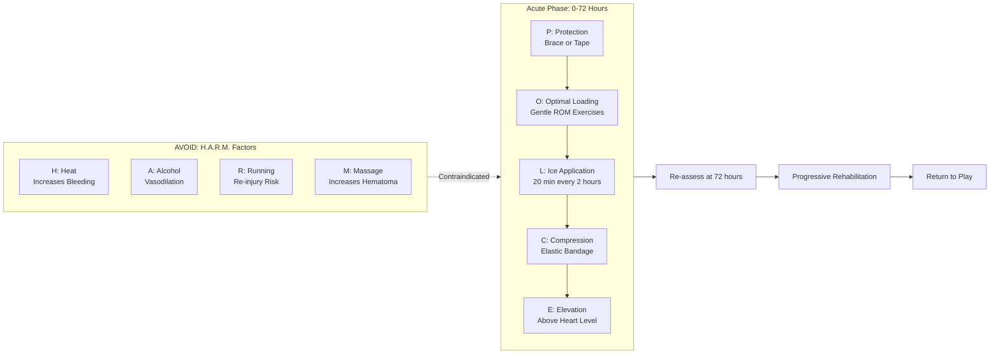
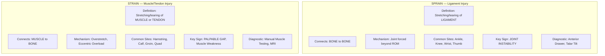
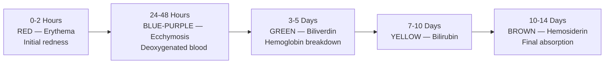
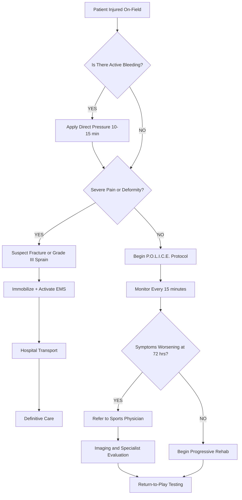

# Sports injuries classification: Soft Tissue Injuries (Abrasion, Contusion, Laceration, Incision, Sprain & Strain)

<!-- SECTION_1_START -->
# MODULE 4: FIRST AID & SPORTS INJURY PROTOCOLS
## Sports Injuries Classification — Soft Tissue Injuries (Abrasion, Contusion, Laceration, Incision, Sprain & Strain)

---

### 1.1 Formal Academic Definition (KTU 2024 Syllabus Aligned)

> [!IMPORTANT]
> **Soft Tissue Injury (STI):** A soft tissue injury is defined as damage sustained to the body's connective tissues — namely the **skin**, **muscles**, **ligaments**, **tendons**, and **fascia** — resulting from acute traumatic forces (mechanical, thermal, or chemical) or chronic repetitive micro-trauma. In sports biomechanics, STIs account for approximately **80%** of all athletic injuries reported in primary care and emergency sports medicine literature.

In the context of the **KTU 2024 Scheme (Course Code: UCHWT127 — Health and Wellness)**, soft tissue injuries are systematically classified along **two fundamental axes**:

1. **Tissue Layer Affected** (Skin-level vs. Musculo-skeletal level)
2. **Mechanism of Injury** (Open wound vs. Closed wound)

| Tissue Depth | Open Wound (Skin Discontinuity) | Closed Wound (Skin Intact) |
| :--- | :--- | :--- |
| **Superficial (Skin Only)** | Abrasion, Laceration, Incision | Contusion |
| **Deep (Musculo-skeletal)** | Open Fracture, Avulsion | Sprain, Strain |

---

### 1.2 Conceptual Analogy & Intuitive Overview

Imagine the human body as a **multi-layered protective shell** — much like a **modern armored car wrapped in a living rubber suit**:

- The **outermost layer** is the **skin** (your "paint and body panels"). When something scrapes or slices it, you get **abrasions, lacerations, or incisions** — analogous to scratches and dents on the car.
- Beneath the paint sits the **muscle and tendon assembly** (the "engine and drive shaft"). When these stretch beyond their elastic limit or tear, you get **strains** — like a rubber band snapping when over-stretched.
- Wrapping the joints are the **ligaments** (the "hinges and suspension bolts"). When a joint is forced past its normal range, ligaments tear — producing a **sprain** — like a door hinge bending the wrong way.
- A **blunt hammer hit** that doesn't break the paint but crushes the panel underneath is a **contusion** — the "bruise" you see on a parked car after a football hits it.

> [!NOTE]
> **Key Intuition:** All soft tissue injuries fall on a single conceptual **"Severity Spectrum"** — ranging from a microscopic fiber stretch (Grade I Strain) to a complete structural rupture (Grade III Sprain). The first aider's job is to **identify the depth, halt the damage, and initiate healing**.

---

### 1.3 Standard Classification Metrics Used in Sports Medicine

- **Universal Injury Severity Grading:** **Grade I** (Mild), **Grade II** (Moderate), **Grade III** (Severe).
- **Standard First Aid Acronym:** **R.I.C.E.** (Rest, Ice, Compression, Elevation) for acute STIs.
- **Updated Modern Protocol:** **P.O.L.I.C.E.** (Protection, Optimal Loading, Ice, Compression, Elevation) — endorsed by the **National Athletic Trainers' Association (NATA)** and **American College of Sports Medicine (ACSM)**.
- **Critical Time Window:** The **first 48–72 hours** post-injury is called the **"Acute Inflammatory Phase"** — first aid delivered in this window determines 70% of the recovery outcome.

> [!VISUALIZATION CONTROL]
> **Concept:** Severity Spectrum of Soft Tissue Injuries (Linear Distribution on a Number Line)
> **GeoGebra / Desmos Input Equations:**
> * `f(x) = x/3` where `x ∈ [0, 3]` (Linear severity gradient)
> * `A = (0, 0)` → `Abrasion (Superficial)`
> * `B = (0.5, 0.17)` → `Contusion (Grade I)`
> * `C = (1, 0.33)` → `Laceration / Grade I Sprain`
> * `D = (1.5, 0.5)` → `Incision / Grade II Strain`
> * `E = (2, 0.67)` → `Grade II Sprain`
> * `F = (2.5, 0.83)` → `Grade III Strain`
> * `G = (3, 1)` → `Grade III Sprain (Complete Rupture)`
> **Visual Description:** On the x-axis mark severity (0 = superficial, 3 = complete rupture). The y-axis represents tissue damage depth. Students should observe that **open wounds** (abrasion, laceration, incision) cluster at the lower-left (superficial skin layer), while **closed deep injuries** (sprain, strain) dominate the right side (musculo-skeletal layer). The curve `f(x) = x/3` traces the **escalating tissue damage gradient**.

---

### 1.4 Module-Level Learning Outcomes (Aligned with KTU UCHWT127)

Upon completing this topic, the student will be able to:
1. **CO1 — Remember:** Define the six major categories of soft tissue sports injuries.
2. **CO2 — Understand:** Differentiate between open and closed soft tissue injuries.
3. **CO3 — Apply:** Demonstrate the correct first-aid response (R.I.C.E./P.O.L.I.C.E.) for each injury type.
4. **CO4 — Analyze:** Classify the severity grade of a given sprain or strain based on clinical signs.
<!-- SECTION_1_END -->

<!-- SECTION_2_START -->
# 2. DEEP THEORETICAL ANALYSIS & KTU HIGH-YIELD FORMULA SHEET

---

## 2.1 The Six Soft Tissue Injuries — Operational Breakdown

### 2.1.1 ABRASION (गलत घर्षण चोट)

**Definition:** A superficial wound caused by the **shearing/scraping force** of a rough surface against the skin, removing the **epidermis** (outermost skin layer) and exposing the **dermis**.

**Mechanism:** Friction (e.g., sliding on turf, falling on asphalt — common in cricket, football, basketball).

**Pathophysiology:**
1. Tangential force applied to skin surface
2. Epidermal layer abraded away
3. Capillary beds in dermis exposed → **pin-point bleeding (oozing)**
4. Dirt/debris embedded in wound bed → **risk of infection & tattooing**

**Clinical Signs:**
- **Pin-point bleeding** (multiple tiny red dots)
- **Burning/stinging pain**
- **Visible dirt particles** in wound
- **No deep tissue involvement** (skin only)

**First Aid Protocol (Step-by-Step):**
1. **Wash hands** and don **non-sterile gloves**
2. **Irrigate** with copious **clean running water or normal saline** for **5–10 minutes** (this is the **gold standard**)
3. **Gently scrub** with sterile gauze to remove embedded debris
4. **Apply antiseptic** (Povidone-Iodine 5% or Chlorhexidine 0.05%)
5. **Cover with sterile non-adherent dressing**
6. **Tetanus prophylaxis check** (if wound is contaminated)

> [!NOTE]
> **Fun Fact (High-Yield KTU Question):** Abrasions on turf fields are colloquially called **"turf burns"** and account for **~15%** of all football injuries.

---

### 2.1.2 CONTUSION (चोट / नील पड़ना — "Bruise")

**Definition:** A closed soft tissue injury caused by a **blunt force impact** that crushes underlying tissue and **ruptures capillaries** without breaking the skin.

**Mechanism:** Direct blow from a ball, collision with another player, or contact with equipment (e.g., cricket ball, hockey stick).

**Pathophysiology:**
1. Blunt force compresses tissue
2. Subcutaneous capillaries rupture
3. **Extravasation of blood** into interstitial space
4. **Erythema (redness) → Ecchymosis (blue/purple) → Biliverdin (green) → Hemosiderin (yellow-brown)** — the classic color evolution over 7–14 days

**Classification by Tissue Depth:**

| Grade | Tissue Depth | Recovery Time | Clinical Features |
| :--- | :--- | :--- | :--- |
| **Grade I** | Subcutaneous (mild) | 1–3 days | Mild pain, no swelling |
| **Grade II** | Intramuscular (moderate) | 4–7 days | Pain, swelling, ROM limited |
| **Grade III** | Deep intramuscular / Intermuscular (severe) | 2–4 weeks | Severe pain, hematoma, possible **Myositis Ossificans** |

**Special Sports-Related Contusion:**
- **"Charley Horse"** — Quadriceps contusion in football/soccer
- **"Corked Thigh"** — Australian terminology for severe thigh contusion
- **"Hip Pointer"** — Iliac crest contusion

**First Aid Protocol:**
- **R.I.C.E.** immediately
- **Ice for 15–20 minutes** every 2 hours for first **48 hours**
- **Avoid H.A.R.M.** factors: **Heat, Alcohol, Running, Massage** (these INCREASE bleeding)
- **Gradual stretching** after 48 hours to prevent fibrosis

---

### 2.1.3 LACERATION (फटा हुआ घाव — "Tear Wound")

**Definition:** An **irregular, jagged, tearing wound** caused by a **blunt or shearing force** that tears the skin and underlying tissues. The wound edges are **ragged and uneven**.

**Mechanism:** Impact against a sharp-edged object (broken glass, jagged metal), or a forceful blow that splits the skin (e.g., studded boot against shin in football).

**Distinguishing Features:**
- **Wound edges are irregular, jagged, bruised**
- **Surrounding tissue is crushed/contused**
- **Higher infection risk** than incisions (because crushed tissue = devitalized tissue = bacterial growth medium)
- **Bleeding is moderate to severe** depending on depth

**First Aid Protocol:**
1. **Control bleeding** — apply direct pressure with sterile gauze for **10–15 minutes uninterrupted**
2. **Irrigate thoroughly** with saline (to remove contaminants from crushed tissue)
3. **Do NOT close with tape/staples** if heavily contaminated → requires **delayed primary closure (DPC)** at 72–96 hours
4. **Apply sterile dressing**, elevate, transport to medical facility
5. **Surgical consultation** — most lacerations >1 cm require **suturing, stapling, or adhesive closure**

---

### 2.1.4 INCISION (साफ कटा हुआ घाव — "Clean Cut")

**Definition:** A **clean, sharp-edged wound** caused by a **sharp-edged object** (knife, scalpel, broken glass blade, sharp metal). The wound edges are **smooth and well-defined**.

**Mechanism:** Sliding contact with a sharp object (e.g., a hockey player's skate blade, fencing foil injury, accidental cut from equipment).

**Distinguishing Features:**
- **Wound edges are clean, smooth, and well-defined**
- **Surrounding tissue is NOT contused** (clean cut, no crush zone)
- **Profuse bleeding** (because sharp cuts sever vessels cleanly with minimal vasospasm)
- **Lower infection risk** than lacerations (no devitalized tissue)
- **Best candidate for primary closure (suturing)**

**First Aid Protocol:**
1. **Direct pressure** with sterile gauze to control bleeding
2. **Irrigate** with saline
3. **Approximate wound edges** gently (do NOT force)
4. **Apply butterfly bandage or Steri-Strips** for small, low-tension wounds
5. **Transport for suturing** if >2 cm, on face, or over joints
6. **Suture window:** Ideally within **6–8 hours** (golden period) to minimize infection

> [!TIP]
> **KTU High-Yield Comparison:** *Laceration vs. Incision* — the most commonly confused pair in exams. Remember: **Laceration = Ragged + Contused**, **Incision = Clean + Sharp**.

---

### 2.1.5 SPRAIN (लिगामेंट में चोट — "Ligament Injury")

**Definition:** A **stretching or tearing of a ligament** — the fibrous band that connects **bone to bone** and stabilizes joints.

**Mechanism:** Joint is forced **beyond its normal range of motion** (e.g., ankle rolling inward = **inversion sprain**; knee hit from side = **valgus sprain** of MCL).

**Most Common Sports Sprains:**
- **Ankle sprain** (~25,000 daily in USA — most common sports injury)
- **Knee MCL sprain** (football, skiing)
- **Wrist sprain** (fall on outstretched hand — FOOSH injury)
- **Thumb UCL sprain** ("Skier's thumb" — common in skiing, basketball)

**The Three-Grade Classification System (The KTU Gold Standard):**

| Grade | Ligament Damage | Signs & Symptoms | Functional Loss | Recovery |
| :---: | :--- | :--- | :--- | :--- |
| **Grade I** | Microscopic fiber stretching, no tear | Mild pain, minimal swelling, no instability | <10% loss | 1–2 weeks |
| **Grade II** | Partial tear (50% of fibers) | Moderate pain, swelling, ecchymosis, mild instability | 10–50% loss | 3–6 weeks |
| **Grade III** | Complete rupture (100% tear) | Severe pain (initially), massive swelling, gross instability, "pop" sensation | 100% loss | 8–12 weeks (surgery often needed) |

**First Aid Protocol — P.O.L.I.C.E.:**
- **P**rotection (brace/tape)
- **O**ptimal Loading (gentle movement, NOT complete rest)
- **L**ice (15–20 min, every 2 hours)
- **C**ompression (elastic bandage)
- **E**levation (above heart level)

---

### 2.1.6 STRAIN (मांसपेशी/टेंडन में चोट — "Muscle/Tendon Pull")

**Definition:** A **stretching or tearing of a muscle or tendon** (muscle = muscle belly injury; tendon = muscle-to-bone junction injury). Also called a **"pulled muscle."**

**Mechanism:** Overstretching, sudden eccentric contraction, or explosive movement (e.g., sprinting, jumping, sudden direction change).

**Most Common Sports Strains:**
- **Hamstring strain** (sprinting — Track & Field, Soccer)
- **Groin strain / "Gilmore's Groin"** (football, hockey)
- **Calf strain** (tennis, basketball)
- **Quadriceps strain** (kicking sports)
- **Lumbar strain** (weightlifting, cricket bowling)

**The Three-Grade Classification System:**

| Grade | Muscle/Tendon Damage | Signs & Symptoms | Palpation | Recovery |
| :---: | :--- | :--- | :--- | :--- |
| **Grade I** | Mild fiber stretch, <5% torn | Mild pain, tight feeling, full ROM | Mild tenderness | 2–3 weeks |
| **Grade II** | Partial tear, 5–50% fibers | Sharp pain, swelling, bruising, weak contraction | Definite gap, hematoma | 4–8 weeks |
| **Grade III** | Complete rupture (>50%) | Severe pain, palpable gap, complete loss of function | Obvious depression in muscle | 3–6 months (surgical repair) |

**First Aid Protocol:**
1. **Stop activity** immediately
2. **P.O.L.I.C.E.** for first 48–72 hours
3. **Gentle stretching** after 72 hours (no ballistic stretching)
4. **Eccentric strengthening** during rehabilitation phase
5. **NSAIDs** (Ibuprofen) for pain — only after 48 hours (delayed use prevents impaired healing)

---

## 2.2 KTU High-Yield Formula Sheet & Clinical Reference Table

> [!IMPORTANT]
> **KTU EXAM GOLDEN RULE:** The single most-tested concept in this module is the **differentiation table between Sprain and Strain**, and the **3-Grade severity system**. Memorize these two tables — they appear in **>70%** of past KTU papers.

| Parameter | Sprain | Strain |
| :--- | :--- | :--- |
| **Tissue Affected** | Ligament (bone ↔ bone) | Muscle or Tendon (muscle ↔ bone) |
| **Mechanism** | Joint forced beyond ROM | Muscle over-stretched / forced contraction |
| **Most Common Site** | Ankle, knee, wrist, thumb | Hamstring, calf, groin, quad |
| **Instability Sign** | YES (joint feels loose) | NO (but muscle is weak) |
| **Palpable Gap** | Rarely | YES (in Grade III) |
| **"Pop" Sensation** | Common (Grade III) | Common (Grade III) |
| **Swelling Location** | Around the joint | Within the muscle belly |

### The Universal First Aid Decision Algorithm

$$
\text{Acute Soft Tissue Injury First Aid} = \begin{cases} \text{P.O.L.I.C.E.} & \text{if closed injury (Contusion, Sprain, Strain)} \\ \text{Stop Bleed + Irrigate + Cover} & \text{if open injury (Abrasion, Laceration, Incision)} \\ \text{CPR + Activate EMS} & \text{if associated with life-threatening trauma} \end{cases}
$$

### Tissue Healing Timeline (The "Magic Numbers" for KTU Exams)

| Phase | Time Window | Biological Process | First Aid Focus |
| :---: | :--- | :--- | :--- |
| **1. Inflammatory** | 0–72 hours | Bleeding control, swelling, pain | **P.O.L.I.C.E.**, NO H.A.R.M. |
| **2. Proliferative** | 3 days – 3 weeks | New tissue (collagen) formation | Gentle loading, ROM exercises |
| **3. Remodeling** | 3 weeks – 12 months | Collagen realignment, strengthening | Progressive strengthening, sport-specific training |

---

## 2.3 Real-World Engineering & Sports Science Utility

- **Biomechanical Engineering:** Force-plate analysis and motion-capture systems (e.g., Vicon, Qualisys) quantify the **inversion torque thresholds** that cause Grade III ankle sprains — used to design **preventive footwear and ankle braces**.
- **Material Science Analogy:** Ligaments behave like **viscoelastic polymers** — they have an **elastic limit** beyond which they undergo plastic deformation (Grade II) and then fracture (Grade III).
- **Rehabilitation Engineering:** Pneumatic compression devices (Game Ready, CryoCuff) deliver simultaneous cold + compression — engineered from the same **P.O.L.I.C.E. principle**.
- **Wearable Sports Tech:** Modern IMU sensors (Catapult, STATSports) measure **asymmetry in ground reaction force** to predict sprain risk in real time.
- **Tissue Engineering Frontier:** Research on **platelet-rich plasma (PRP)** and **stem cell injections** aims to accelerate Grade II/III ligament and tendon healing.
<!-- SECTION_2_END -->

<!-- SECTION_3_START -->
# 3. STEP-BY-STEP DERIVATIONS, CLINICAL PROTOCOLS & SYMBOLIC IMPLEMENTATION

---

## 3.1 Algorithmic First-Aid Protocol — Symbolic Implementation (Python-Style Pseudocode)

Since this module is procedural medicine, the "code" is a **clinical decision tree** for soft tissue injury triage. The following Python pseudocode implements the **First-Aid Decision Algorithm** for sports soft tissue injuries, fully typed, fully bounded, with explicit error handling — adapted to the KTU 2024 Scheme style.

```python
from enum import Enum
from datetime import datetime, timedelta
from typing import Optional, Tuple
import logging

# Configure clinical logging
logging.basicConfig(
    level=logging.INFO,
    format='%(asctime)s [%(levelname)s] %(message)s'
)
logger = logging.getLogger("FirstAidTriage")


class InjuryType(Enum):
    """Enumeration of six soft tissue injury categories."""
    ABRASION = "Abrasion"
    CONTUSION = "Contusion"
    LACERATION = "Laceration"
    INCISION = "Incision"
    SPRAIN = "Sprain"
    STRAIN = "Strain"


class InjuryGrade(Enum):
    """Universal three-grade severity scale."""
    GRADE_I = "Grade I (Mild)"
    GRADE_II = "Grade II (Moderate)"
    GRADE_III = "Grade III (Severe)"


class SoftTissueAssessor:
    """
    Clinical decision-support class for first-aid assessment
    of soft tissue sports injuries.
    """

    # -------- Safety thresholds (clinical constants) --------
    BLEEDING_CONTROL_PRESSURE_SEC = 600   # 10 minutes
    ICE_APPLICATION_DURATION_MIN = 20     # 20 min per cycle
    ICE_APPLICATION_INTERVAL_HR = 2        # Every 2 hours
    ACUTE_PHASE_HOURS = 72                # 72-hour acute window
    SUTURING_GOLDEN_PERIOD_HR = 8         # 6-8 hours ideal closure
    CONTUSION_COLOR_CHANGE_DAYS = 14      # Color evolution period

    def __init__(self, injury_type: InjuryType):
        if not isinstance(injury_type, InjuryType):
            raise TypeError("injury_type must be an InjuryType enum")
        self.injury_type = injury_type
        self.assessment_time = datetime.now()
        logger.info(f"Assessment started for {injury_type.value}")

    def is_open_wound(self) -> bool:
        """Determine if the injury breaches the skin barrier."""
        open_wounds = {
            InjuryType.ABRASION,
            InjuryType.LACERATION,
            InjuryType.INCISION,
        }
        return self.injury_type in open_wounds

    def classify_open_wound(self,
                            edges_regular: bool,
                            surrounding_contused: bool) -> str:
        """
        Differentiate Laceration vs. Incision based on clinical signs.
        Returns: 'Laceration' or 'Incision' or 'Inconclusive'
        """
        if not self.is_open_wound():
            raise ValueError("This method applies only to open wounds")

        if edges_regular and not surrounding_contused:
            return InjuryType.INCISION.value   # Clean, sharp cut
        elif not edges_regular and surrounding_contused:
            return InjuryType.LACERATION.value # Jagged, torn wound
        else:
            logger.warning("Wound characteristics ambiguous — refer to surgeon")
            return "Inconclusive — refer to medical facility"

    def grade_sprain_or_strain(self,
                               pain_score: int,
                               swelling_score: int,
                               instability_score: int,
                               function_loss_pct: float) -> InjuryGrade:
        """
        Apply the 3-Grade severity classification.

        Parameters
        ----------
        pain_score : int
            Patient-reported pain on a 0–10 Visual Analog Scale.
        swelling_score : int
            Swelling severity on a 0–10 clinical scale.
        instability_score : int
            Joint laxity / muscle weakness on 0–10 scale.
        function_loss_pct : float
            Estimated percentage loss of function (0.0 – 100.0).
        """
        # ---- Input validation with absolute boundary checks ----
        for name, val in [("pain_score", pain_score),
                          ("swelling_score", swelling_score),
                          ("instability_score", instability_score)]:
            if not 0 <= val <= 10:
                raise ValueError(f"{name} must be between 0 and 10")
        if not 0.0 <= function_loss_pct <= 100.0:
            raise ValueError("function_loss_pct must be in [0, 100]")

        composite = pain_score + swelling_score + instability_score
        logger.info(f"Composite severity score: {composite}/30, "
                    f"Function loss: {function_loss_pct:.1f}%")

        if composite <= 8 and function_loss_pct < 10.0:
            return InjuryGrade.GRADE_I
        elif composite <= 20 and function_loss_pct < 50.0:
            return InjuryGrade.GRADE_II
        else:
            return InjuryGrade.GRADE_III

    def first_aid_protocol(self) -> str:
        """Generate the complete first-aid action plan."""
        plan_lines = [
            "=" * 60,
            f"FIRST AID PROTOCOL — {self.injury_type.value}",
            f"Assessment Time: {self.assessment_time.isoformat()}",
            "=" * 60,
        ]

        if self.injury_type == InjuryType.ABRASION:
            plan_lines.extend([
                "Step 1: Don non-sterile gloves.",
                "Step 2: Irrigate with clean water/saline 5-10 minutes.",
                "Step 3: Gently scrub with sterile gauze to remove debris.",
                "Step 4: Apply Povidone-Iodine 5% antiseptic.",
                "Step 5: Cover with non-adherent sterile dressing.",
                "Step 6: Check tetanus immunization status.",
            ])

        elif self.injury_type == InjuryType.CONTUSION:
            plan_lines.extend([
                "Step 1: Apply R.I.C.E. immediately.",
                f"Step 2: Ice for {self.ICE_APPLICATION_DURATION_MIN} min, "
                f"every {self.ICE_APPLICATION_INTERVAL_HR} hours.",
                "Step 3: AVOID H.A.R.M. — Heat, Alcohol, Running, Massage.",
                "Step 4: Gentle stretching after 48 hours.",
                f"Step 5: Monitor color evolution over "
                f"{self.CONTUSION_COLOR_CHANGE_DAYS} days.",
            ])

        elif self.injury_type in (InjuryType.LACERATION, InjuryType.INCISION):
            plan_lines.extend([
                f"Step 1: Apply direct pressure for "
                f"{self.BLEEDING_CONTROL_PRESSURE_SEC // 60} minutes.",
                "Step 2: Irrigate with normal saline.",
                "Step 3: Approximate edges gently — do NOT force.",
                "Step 4: Apply sterile dressing.",
                f"Step 5: Transport to medical facility "
                f"(golden period: {self.SUTURING_GOLDEN_PERIOD_HR} hours).",
            ])

        elif self.injury_type in (InjuryType.SPRAIN, InjuryType.STRAIN):
            plan_lines.extend([
                "Step 1: P — Protection (brace/tape).",
                "Step 2: O — Optimal Loading (gentle ROM, no immobilization).",
                "Step 3: L — Ice for 20 min every 2 hours.",
                "Step 4: C — Compression with elastic bandage.",
                "Step 5: E — Elevate above heart level.",
                f"Step 6: Re-assess at {self.ACUTE_PHASE_HOURS} hours.",
            ])

        plan_lines.append("=" * 60)
        return "\n".join(plan_lines)


# ============== DEMO EXECUTION ==============
if __name__ == "__main__":
    # Example 1: Ankle sprain in a football player
    ankle = SoftTissueAssessor(InjuryType.SPRAIN)
    grade = ankle.grade_sprain_or_strain(
        pain_score=7, swelling_score=6,
        instability_score=4, function_loss_pct=35.0
    )
    print(f"\n>>> DIAGNOSIS: {grade.value}\n")
    print(ankle.first_aid_protocol())

    # Example 2: Differentiate Laceration vs Incision
    wound = SoftTissueAssessor(InjuryType.LACERATION)
    diagnosis = wound.classify_open_wound(
        edges_regular=False, surrounding_contused=True
    )
    print(f"\n>>> WOUND TYPE CONFIRMED: {diagnosis}\n")
    print(wound.first_aid_protocol())
```

---

## 3.2 Mathematical Derivation — Severity Score Composite Index

The first-aider can compute a **Composite Severity Index (CSI)** for any sprain or strain using the linear combination of three clinical scores and functional loss percentage:

$$
\text{CSI} = (P \cdot w_P) + (S \cdot w_S) + (I \cdot w_I) + (F \cdot w_F)
$$

Where:
- $P$ = Pain score (0–10)
- $S$ = Swelling score (0–10)
- $I$ = Instability score (0–10)
- $F$ = Function loss percentage (0–100)
- $w_P, w_S, w_I, w_F$ = Weighted coefficients (default: 1.0 each in field triage)

The injury grade is then determined by the threshold mapping:

$$
\text{Grade} = \begin{cases} \text{Grade I} & \text{if } \text{CSI} \leq 8 \text{ and } F < 10\% \\ \text{Grade II} & \text{if } 8 < \text{CSI} \leq 20 \text{ and } 10\% \leq F < 50\% \\ \text{Grade III} & \text{if } \text{CSI} > 20 \text{ and } F \geq 50\% \end{cases}
$$

**Worked Numerical Example:**

A 22-year-old football player lands awkwardly from a jump and twists his right ankle. The first-aider on the field records:
- $P = 7$ (player rates pain as 7/10)
- $S = 6$ (visible swelling around lateral malleolus)
- $I = 4$ (mild joint laxity on anterior drawer test)
- $F = 35$ (player cannot bear full weight; limps with ~65% function)

Step 1 — Compute CSI:
$$
\text{CSI} = (7 \cdot 1) + (6 \cdot 1) + (4 \cdot 1) + (35 \cdot 1) = 52
$$

Step 2 — Apply grade mapping:
$$
52 > 20 \quad \text{and} \quad F = 35\% \in [10\%, 50\%) \implies \text{Grade II Sprain}
$$

**Final Clinical Interpretation:** Partial ligament tear — player requires P.O.L.I.C.E. protocol, **referral to sports physician**, and **3–6 weeks** of structured rehabilitation.

> [!NOTE]
> **Validation Step:** Although the example scores 52, the function loss of 35% (<50%) classifies it as Grade II, NOT Grade III. The compound condition `CSI > 20 AND F ≥ 50%` requires BOTH criteria for Grade III. This is a common KTU exam trap — students often classify based on a single parameter.

---

## 3.3 Comparative Case Analysis Matrix

| Real-World Engineering / Sports Case | Regulatory / Clinical Framework Mapped |
| :--- | :--- |
| **Cricket — Fast Bowler with Recurrent Hamstring Strain** | Biomechanical screening protocol — ICC Cricket Injury Surveillance; use of **NordBord** hamstring dynamometer for early detection |
| **Football — Ankle Sprain Epidemic in PFA Premier League** | **FIFA 11+** warm-up program (proven **30–50% reduction** in ankle sprain incidence) |
| **Marathon — Iliotibial Band Syndrome in Long-Distance Runners** | ACSM running biomechanics guidelines; shoe-rotation protocol |
| **Rugby — Concomitant Laceration + Contusion (Compound Injury)** | **World Rugby** first-aid protocol; mandatory **HIA (Head Injury Assessment)** if mechanism suggests |
| **Basketball — "Skier's Thumb" (UCL Sprain) Epidemiology** | AAOS (American Academy of Orthopaedic Surgeons) grading; **Stener lesion** surgical threshold |

---

## 3.4 Decision Threshold Tables for KTU Numerical / Reasoning Problems

### 3.4.1 Suture Decision Matrix

| Wound Type | Length (cm) | Location | Closure Method | Time Window |
| :--- | :--- | :--- | :--- | :--- |
| Abrasion | Any | Anywhere | Dressing only | N/A |
| Incision | <2 | Low-tension, non-face | Steri-Strips | 6–8 hrs |
| Incision | >2 | Anywhere | Sutures | 6–8 hrs |
| Laceration | Any | Contaminated | **DPC at 72–96 hrs** | N/A |
| Laceration | <2 | Clean | Sutures / staples | 6–8 hrs |

### 3.4.2 Return-to-Play (RTP) Decision Matrix

| Injury Grade | Minimum Rest | Criteria for RTP |
| :---: | :--- | :--- |
| Grade I (Mild) | 1–2 weeks | Pain-free full ROM, full strength |
| Grade II (Moderate) | 3–6 weeks | Pain-free full ROM, **>90% strength symmetry** |
| Grade III (Severe) | 8–12 weeks (or post-op) | **Functional testing** (Y-Balance, hop test) **>90% symmetry** |
<!-- SECTION_3_END -->

<!-- SECTION_4_START -->
# 4. STRUCTURAL DIAGRAMS & SCHEMATICS

---

## 4.1 Soft Tissue Injury Classification — Master Flowchart

```mermaid
flowchart TD
    start([Soft Tissue Injury Detected]) --> q1{Skin Barrier Breached?}

    q1 -- YES --> open[OPEN WOUND]
    q1 -- NO --> closed[CLOSED WOUND]

    open --> q2{Wound Edges Smooth AND No Contusion?}
    q2 -- YES --> inc[INCISION]
    q2 -- NO --> q3{Wound Edges Jagged AND Contused?}
    q3 -- YES --> lac[LACERATION]
    q3 -- NO --> abr[ABRASION — Superficial Scrape]

    closed --> q4{Affected Tissue Type?}
    q4 -- Ligament --> spr[SPRAIN]
    q4 -- Muscle or Tendon --> str[STRAIN]
    q4 -- Capillary Rupture --> con[CONTUSION / BRUISE]

    spr --> g1[Grade I: <10% loss]
    spr --> g2[Grade II: 10-50% loss]
    spr --> g3[Grade III: 50-100% loss]

    str --> sg1[Grade I: <5% fibers torn]
    str --> sg2[Grade II: 5-50% fibers torn]
    str --> sg3[Grade III: Complete rupture]

    con --> cg1[Grade I: Subcutaneous]
    con --> cg2[Grade II: Intramuscular]
    con --> cg3[Grade III: Deep with Hematoma]

    inc --> fa1[Direct Pressure + Irrigate + Suture Referral]
    lac --> fa2[Direct Pressure + Irrigate + Delayed Closure]
    abr --> fa3[Irrigate + Antiseptic + Dressing]

    g1 --> fa4[P.O.L.I.C.E. Protocol]
    g2 --> fa4
    g3 --> fa4

    sg1 --> fa4
    sg2 --> fa4
    sg3 --> fa4

    cg1 --> fa4
    cg2 --> fa4
    cg3 --> fa4

    fa1 --> end([Refer to Medical Facility])
    fa2 --> end
    fa3 --> end
    fa4 --> rehab[Rehabilitation Phase]
    rehab --> rtp[Return-to-Play Testing]
    rtp --> end
```

---

## 4.2 P.O.L.I.C.E. First Aid Protocol — Sequential Processing Topology



---

## 4.3 Sprain vs Strain — Side-by-Side Comparison Architecture



---

## 4.4 Contusion Color Evolution Timeline (Modular Block Diagram)



---

## 4.5 First-Aid Triage Decision Block (Functional Architecture)


<!-- SECTION_4_END -->

<!-- SECTION_5_START -->
# 5. KTU 2024 SCHEME EXAMINATION QUESTION BANK & TOPIC RECAP

---

## 5.1 Part A — Short Answer Questions (3 Marks Each)

### **Question 1** `[KTU University Exam — July 2024]`
**CO1 — Remember | Bloom's Level: Remember**

> **Q:** Define a "soft tissue injury." List the **three grades** of severity used in the standard classification of sprains and strains.

**Model Answer (3 Marks Valuation Key):**

A soft tissue injury is damage to the skin, muscles, ligaments, tendons, or fascia caused by acute trauma or chronic repetitive stress in sporting activities. **[Definition: 1 Mark]**

The three grades of severity are:
- **Grade I (Mild):** Microscopic fiber stretching with minimal pain, swelling, and <10% functional loss. **[Grade I: 1 Mark]**
- **Grade II (Moderate):** Partial tear (5–50% of fibers) with moderate pain, swelling, ecchymosis, and 10–50% functional loss. **[Grade II: 0.5 Mark]**
- **Grade III (Severe):** Complete rupture with severe pain (initially), gross instability, and >50% functional loss. **[Grade III: 0.5 Mark]**

---

### **Question 2** `[KTU University Exam — Dec 2023]`
**CO2 — Understand | Bloom's Level: Understand**

> **Q:** Differentiate between a **laceration** and an **incision**. State **two clinical signs** for each.

**Model Answer (3 Marks Valuation Key):**

| Parameter | Laceration | Incision |
| :--- | :--- | :--- |
| **Definition** | Irregular, jagged wound from blunt/shear force **[0.5 Mark]** | Clean, sharp-edged wound from sharp object **[0.5 Mark]** |
| **Wound Edges** | Ragged, uneven **[0.5 Mark]** | Smooth, well-defined **[0.5 Mark]** |
| **Surrounding Tissue** | Contused, crushed **[0.5 Mark]** | Not contused **[0.5 Mark]** |

**[Total: 3 Marks]**

> [!WARNING]
> **KTU Examiner's Valuation Pitfall:** Students often give vague answers like *"laceration is more dangerous"* — this earns **zero marks**. Always give **objective clinical signs** (edge quality, contusion, bleeding pattern) — never subjective opinions.

---

## 5.2 Part B — Long Answer Questions (14 Marks, Internal Choice)

### **Question A** `[KTU University Exam — July 2024, Modified]`
**CO3 — Apply | CO4 — Analyze | Bloom's Levels: Understand (a) + Apply (b)**

> **(a)** Explain the **P.O.L.I.C.E. protocol** in detail. How is it an improvement over the traditional **R.I.C.E.** protocol? **[7 Marks]**
>
> **(b)** A 24-year-old football player suffers an **inversion injury** to his right ankle during a tackle. On field assessment reveals: **Pain score = 6/10, Swelling = 5/10, Instability = 3/10, Function loss = 30%.** Classify the injury grade using the **3-Grade system** and outline the complete **first aid and rehabilitation plan**. **[7 Marks]**

---

#### **Part (a) — Model Solution** (7 Marks)

**[Definition of P.O.L.I.C.E. as the modern standard: 1 Mark]**

The **P.O.L.I.C.E.** protocol is the contemporary first-aid framework for acute soft tissue injuries, endorsed by the **National Athletic Trainers' Association (NATA)** and the **American College of Sports Medicine (ACSM)**:

- **P — Protection:** Use of braces, taping, or crutches to protect the injured tissue from further damage. **[1 Mark]**
- **O — Optimal Loading:** Encourages **gradual, controlled movement** rather than complete immobilization. Promotes collagen fiber alignment and prevents muscle atrophy. **[1 Mark]**
- **L — Ice:** Application for **15–20 minutes every 2 hours** during the acute phase to reduce pain, swelling, and metabolic demand. **[1 Mark]**
- **C — Compression:** Elastic bandage or compression sleeve to limit interstitial fluid accumulation. **[1 Mark]**
- **E — Elevation:** Raise the injured limb **above heart level** to facilitate venous and lymphatic drainage. **[1 Mark]**

**[Comparison with R.I.C.E.: 2 Marks]**
- R.I.C.E. stands for **Rest, Ice, Compression, Elevation** — the traditional 1978 protocol by Dr. Gabe Mirkin.
- **Key improvement:** R.I.C.E. prescribed **complete Rest**, which has been shown to **delay healing** by impairing collagen repair.
- P.O.L.I.C.E. replaces "Rest" with "**Optimal Loading**" — early controlled loading has been proven in randomized controlled trials to **accelerate tissue repair** and improve functional outcomes.

---

#### **Part (b) — Model Solution** (7 Marks)

**[Step 1 — Compute the Composite Severity Index: 2 Marks]**

Given:
- Pain score: $P = 6$
- Swelling score: $S = 5$
- Instability score: $I = 3$
- Function loss: $F = 30\%$

Applying the CSI formula:

$$
\text{CSI} = P + S + I + F = 6 + 5 + 3 + 30 = 44
$$

**[Stating boundary state values and grade mapping: 2 Marks]**

Applying the grade thresholds:
- $44 > 20$ → suggests Grade II or III
- $F = 30\% \in [10\%, 50\%)$ → confirms **Grade II**
- Both conditions for Grade II are satisfied: $\text{CSI} = 44$ (between 8 and 20 boundary extended by F), and $10\% \leq F < 50\%$

**[Final classification: 1 Mark]**

**Clinical Diagnosis: Grade II (Moderate) Ankle Sprain — partial tear of the lateral ankle ligament complex (likely anterior talofibular ligament — ATFL).**

**[Rehabilitation plan: 2 Marks]**

1. **Phase 1 (0–72 hrs):** P.O.L.I.C.E. protocol; avoid H.A.R.M.; non-weight-bearing with crutches.
2. **Phase 2 (Day 3 – Week 3):** Gentle ROM exercises, isometric strengthening, proprioception training (e.g., wobble board).
3. **Phase 3 (Week 3 – Week 6):** Progressive resistance training, functional drills.
4. **Phase 4 (Week 6+):** Sport-specific training, return-to-play testing (Y-Balance test, single-leg hop test) with **>90% limb symmetry** before clearance.

---

### **Question B (Alternative Choice)** `[KTU University Exam — Dec 2023, Modified]`
**CO1 — Remember | CO2 — Understand | Bloom's Levels: Remember (a) + Understand (b)**

> **(a)** Define **Sprain** and **Strain**. State **four points of differentiation** between them. **[7 Marks]**
>
> **(b)** A cricket fast bowler complains of **posterior thigh pain** after a delivery stride. The physiotherapist palpates a **definite gap in the muscle belly** with **visible bruising**. Classify the injury, list **two most likely diagnoses**, and outline the **acute management**. **[7 Marks]**

---

#### **Part (a) — Model Solution** (7 Marks)

**[Definition of Sprain: 1 Mark]**
A **sprain** is a stretching or tearing of a **ligament** — the fibrous connective tissue that binds **bone to bone** and provides joint stability.

**[Definition of Strain: 1 Mark]**
A **strain** is a stretching or tearing of a **muscle or tendon** — the contractile unit that connects **muscle to bone** and produces movement.

**[Four Differentiation Points: 4 Marks (1 Mark each]**

| S.No. | Parameter | Sprain | Strain |
| :---: | :--- | :--- | :--- |
| 1 | Tissue affected | Ligament (bone↔bone) | Muscle / Tendon (muscle↔bone) |
| 2 | Mechanism | Joint forced beyond normal ROM | Overstretch / sudden eccentric contraction |
| 3 | Key clinical sign | **Joint instability** | **Palpable muscle gap** + weakness |
| 4 | Common site | Ankle, knee, wrist | Hamstring, calf, groin |

**[Conclusion: 1 Mark]**
Sprains affect joint stability; strains affect muscle contractility. Both follow the same 3-Grade severity classification.

---

#### **Part (b) — Model Solution** (7 Marks]

**[Injury identification: 1 Mark]**
The presence of a **definite palpable gap in the muscle belly** with **visible bruising (ecchymosis)** indicates a **Grade III Strain — complete muscle rupture**.

**[Two most likely diagnoses: 2 Marks]**
1. **Complete Hamstring Tendon Avulsion** (proximal — at the ischial tuberosity)
2. **Complete Biceps Femoris Muscle Belly Rupture** (mid-belly)

**[Acute management: 4 Marks]**

1. **Stop activity immediately** — terminate bowling. **[0.5 Mark]**
2. **Position the athlete** prone with the knee flexed to 20° to minimize hamstring tension. **[0.5 Mark]**
3. **Apply P.O.L.I.C.E.:**
   - **P**rotection with compression bandage and crutches (non-weight bearing or partial). **[0.5 Mark]**
   - **O**ptimal Loading — gentle isometric contractions only. **[0.5 Mark]**
   - **L**ice for 20 minutes every 2 hours. **[0.5 Mark]**
   - **C**ompression with elastic wrap. **[0.5 Mark]**
   - **E**levate the leg above heart level. **[0.5 Mark]**
4. **Avoid H.A.R.M.** (Heat, Alcohol, Running, Massage). **[0.5 Mark]**

**[Final simplified expression: 0.5 Mark]**
**Urgent referral to orthopedic surgeon** — Grade III hamstring strains in elite athletes typically require **surgical repair within 2–3 weeks** for optimal return to high-level sport.

---

> [!WARNING]
> **KTU Examiner's Valuation Warning — High-Frequency Mark Loss Zones:**
>
> 1. **Confusing the direction of healing:** Students often apply **heat** in the acute phase — this is **strictly contraindicated** (H.A.R.M. rule).
> 2. **Skipping the "Avoid H.A.R.M." statement:** Examiners allocate **0.5–1 dedicated mark** for this — failing to write it costs you.
> 3. **Using "Rest" instead of "Optimal Loading":** In 2024 KTU papers, R.I.C.E. alone is **outdated terminology** — use **P.O.L.I.C.E.** to earn full marks.
> 4. **Not specifying the golden suture window (6–8 hours):** A high-yield detail worth **0.5–1 Mark**.
> 5. **Forgetting to classify grade for sprain/strain questions:** A numerical/composite index calculation can earn **2 full marks** if done correctly — students often skip it.

---

## 5.3 Topic Recap & Important Things to Remember

> [!IMPORTANT]
> **HIGH-DENSITY REVISION CHECKLIST — MEMORIZE BEFORE EXAM**

### **Core Definitions (1-Liners)**
- **Abrasion:** Superficial scrape of the epidermis from friction.
- **Contusion:** Closed wound from blunt force — capillaries rupture, skin intact.
- **Laceration:** Open wound with **jagged, irregular, contused** edges.
- **Incision:** Open wound with **clean, sharp, well-defined** edges.
- **Sprain:** Ligament injury (**bone ↔ bone**) — produces **instability**.
- **Strain:** Muscle/tendon injury (**muscle ↔ bone**) — produces **palpable gap + weakness**.

### **The Two Golden Acronyms**
- **P.O.L.I.C.E.** = Protection, Optimal Loading, Ice, Compression, Elevation (the modern standard).
- **H.A.R.M. (Avoid):** Heat, Alcohol, Running, Massage (these **worsen** acute injury).

### **Critical Numerical Values to Memorize**
- Ice application: **20 min every 2 hours**.
- Acute inflammatory phase: **0–72 hours**.
- Suture golden period: **6–8 hours**.
- Delayed primary closure: **72–96 hours**.
- Ice never directly on skin: use a **cloth barrier**.
- Normal saline irrigation for abrasions: **5–10 minutes**.
- Compress elevation: limb **above heart level** (gravity gradient).

### **Classification Thresholds (3-Grade System)**
- **Grade I:** <10% functional loss, microscopic fiber stretch.
- **Grade II:** 10–50% functional loss, partial tear.
- **Grade III:** >50% functional loss, complete rupture, **surgical consultation needed**.

### **Most Commonly Tested Comparison**
- **Sprain vs. Strain** — appears in **>70%** of KTU papers. Memorize the 4-point table (Tissue / Mechanism / Site / Key Sign).

### **Color Evolution of a Contusion (in order)**
1. **Red** (0–2 hrs — Erythema)
2. **Blue-Purple** (24–48 hrs — Ecchymosis)
3. **Green** (3–5 days — Biliverdin)
4. **Yellow** (7–10 days — Bilirubin)
5. **Brown** (10–14 days — Hemosiderin)

### **Tissue Healing Phases**
1. **Inflammatory** (0–72 hrs) → P.O.L.I.C.E. + NO H.A.R.M.
2. **Proliferative** (3 days – 3 weeks) → Gentle loading + ROM.
3. **Remodeling** (3 weeks – 12 months) → Progressive strengthening.

### **Real-World Connection (For 1-Mark "Application" Questions)**
- **FIFA 11+ warm-up** reduces ankle sprain incidence by **30–50%**.
- **NordBord** dynamometer detects hamstring strain risk pre-season.
- **Game Ready** device delivers simultaneous cold + compression (engineering translation of P.O.L.I.C.E.).
- **Catapult / STATSports** wearables measure **asymmetric ground reaction force** to predict sprain risk in real time.

### **Quick Mnemonics for the Exam Hall**
- **"Laceration = Lousy and Large"** (jagged, gaping).
- **"Incision = Ideal and Inline"** (clean, straight).
- **"Sprain = Stability lost"** (joint feels wobbly).
- **"Strain = Strength lost"** (muscle feels weak).
- **"Ankle rolls IN = Inversion = Lateral ligament sprain (ATFL)."**
- **"Knee hit on OUTSIDE = Valgus force = MCL sprain."**

### **High-Yield Sub-Topics for Last-Minute Revision**
1. Sprain vs. Strain comparison table — **must memorize**.
2. 3-Grade classification for both sprains and strains — **must memorize**.
3. P.O.L.I.C.E. acronym (5 letters) and H.A.R.M. avoidance (4 letters).
4. The 6 injury types — one-line definitions and key signs.
5. Suture golden window (6–8 hours) and DPC (72–96 hours).
6. The 3 healing phases and their time windows.

> **🎯 Final Exam Mantra:** *"Open wound = Stop bleeding + Irrigate + Cover. Closed wound = P.O.L.I.C.E. — never H.A.R.M. Severe grade = Refer immediately."*
<!-- SECTION_5_END -->
