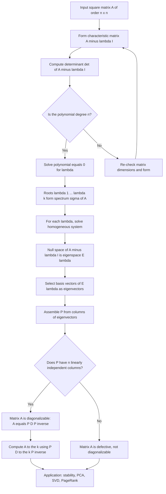
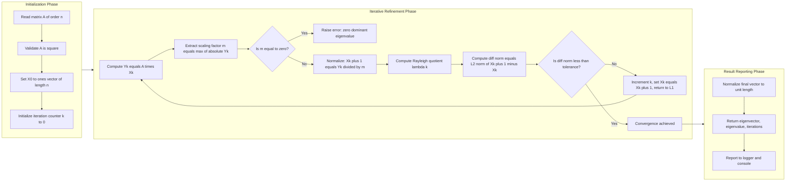
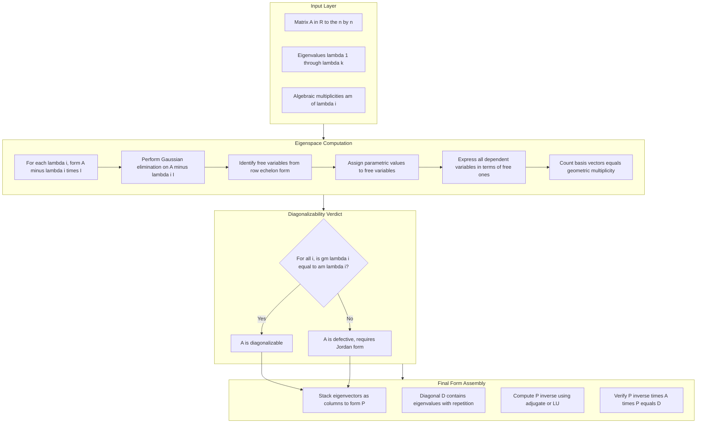

# Eigenvalues and eigenvectors for square matrices

<!-- SECTION_1_START -->

# Eigenvalues and Eigenvectors for Square Matrices

> [!NOTE]
> **Syllabus Anchor (GAMAT201 – Module 1):** This topic is foundational to every subsequent module — from diagonalization and matrix decomposition to stability of iterative solvers used in Machine Learning, Computer Graphics, and Signal Processing.

## 1.1 Formal Definition (KTU 2024 Terminology)

Let $A$ be a square matrix of order $n \times n$ over the field $\mathbb{R}$ (or $\mathbb{C}$). A **scalar** $\lambda$ is called an **eigenvalue** (or *characteristic value* or *latent root*) of $A$ if there exists a **non-zero column vector** $X \in \mathbb{R}^n$ (or $\mathbb{C}^n$) such that

$$
A X \;=\; \lambda X
$$

The corresponding non-zero vector $X$ is called an **eigenvector** of $A$ associated with the eigenvalue $\lambda$.

> [!IMPORTANT]
> **Board-Exam Pitfall:** The zero vector $X = 0$ is *never* accepted as an eigenvector, even though $A \cdot 0 = \lambda \cdot 0$ is trivially true. The non-zero clause is a strict valuation checkpoint.

## 1.2 Conceptual Analogy — Stretching Space

Imagine the matrix $A$ as a *transformation* that stretches, shrinks, and rotates the entire 2D plane.

- **Most vectors** in the plane get dragged off in some random direction; they are *not* aligned with their original arrow.
- **A few special vectors** lie along the principal axes of the transformation — they keep their original direction, but get **scaled** (stretched or compressed) by some factor.

These special arrows are the **eigenvectors**, and the scale factors applied to them are the **eigenvalues**. Negative eigenvalues flip the direction by 180°; eigenvalues between 0 and 1 shrink the vector; eigenvalues greater than 1 stretch it.

> [!TIP]
> **Memory Hook:** "*Eigen* is German for *self/own*." An eigenvector is one that is mapped to its *own* scalar multiple, hence "self-preserving direction."

> [!VISUALIZATION CONTROL]
> **Concept:** A $2 \times 2$ matrix acting on the unit circle, with eigenvectors marked along principal axes.
> **GeoGebra / Desmos Input Equations (matrix $A = \begin{pmatrix}2 & 1\\ 1 & 2\end{pmatrix}$):**
> * Unit circle: $x^2 + y^2 = 1$
> * Transformed ellipse: $(2x+y)^2 + (x+2y)^2 = 5$
> * Principal axis 1: line $y = x$ (eigenvector direction, eigenvalue $3$)
> * Principal axis 2: line $y = -x$ (eigenvector direction, eigenvalue $1$)
> **Visual Description:** Students should observe that the unit circle is stretched into an ellipse whose major axis lies along the line $y=x$ and minor axis along $y=-x$. The lengths of the semi-axes equal the eigenvalues $3$ and $1$.

## 1.3 Spectrum and Eigenspace

The **spectrum** of $A$ is the *set* of all distinct eigenvalues:
$$
\sigma(A) \;=\; \{\lambda_1, \lambda_2, \dots, \lambda_k\}, \qquad k \le n
$$
The **eigenspace** corresponding to an eigenvalue $\lambda$ is the null space of $(A - \lambda I)$:
$$
E_\lambda \;=\; \ker(A - \lambda I) \;=\; \{X \in \mathbb{R}^n \mid A X = \lambda X\}
$$

> [!IMPORTANT]
> Every $\lambda$ must satisfy $\det(A - \lambda I) = 0$, otherwise $(A - \lambda I)$ is invertible and the only solution to $AX = \lambda X$ is the trivial $X = 0$.

<!-- SECTION_1_END -->

<!-- SECTION_2_START -->

# Deep Theoretical Analysis & KTU High-Yield Formula Sheet

## 2.1 The Characteristic Equation

Starting from the eigen-equation $A X = \lambda X$, we rewrite it as
$$
A X - \lambda I X \;=\; (A - \lambda I) X \;=\; 0
$$
For a non-trivial $X$ to exist, the coefficient matrix must be **singular**:
$$
\boxed{\;\det(A - \lambda I) \;=\; 0\;}
$$
This is the **characteristic equation** of $A$, and the polynomial
$$
p(\lambda) \;=\; \det(A - \lambda I) \;=\; (-1)^n \left[\lambda^n - (\operatorname{tr} A)\lambda^{n-1} + \dots + (-1)^n \det A\right]
$$
is the **characteristic polynomial** of degree exactly $n$.

> [!NOTE]
> Some textbooks use the form $\det(\lambda I - A) = 0$. The two forms differ by the constant factor $(-1)^n$, which does **not** change the roots. The sign convention matters only when writing the polynomial coefficients.

## 2.2 The Three-Step Recipe (Board-Standard)

To find eigenvalues and eigenvectors of an $n \times n$ matrix $A$:

1. **Form** the matrix $A - \lambda I$ (subtract $\lambda$ from every diagonal entry).
2. **Solve** the characteristic equation $\det(A - \lambda I) = 0$ for $\lambda$ — this gives the eigenvalues.
3. **For each $\lambda$**, solve the homogeneous linear system $(A - \lambda I) X = 0$ — the non-zero solutions form the eigenspace $E_\lambda$.

## 2.3 KTU High-Yield Formula Sheet

| # | Property / Formula | Mathematical Statement | Engineering / CS Utility |
|---|---|---|---|
| 1 | Eigen-equation | $A X = \lambda X,\; X \neq 0$ | Defining equation; PCA, vibration analysis |
| 2 | Characteristic equation | $\det(A - \lambda I) = 0$ | Roots give spectrum of any linear map |
| 3 | Sum of eigenvalues = trace | $\displaystyle\sum_{i=1}^{n} \lambda_i \;=\; \operatorname{tr}(A)$ | Quick consistency check in numerical code |
| 4 | Product of eigenvalues = determinant | $\displaystyle\prod_{i=1}^{n} \lambda_i \;=\; \det(A)$ | Detects singular matrices ($\lambda = 0$ present) |
| 5 | Eigenvalue of $A^k$ | $\lambda(A^k) \;=\; (\lambda(A))^k$ | Powers of transition matrices (Markov chains) |
| 6 | Eigenvalue of $A^{-1}$ | $\lambda(A^{-1}) \;=\; 1/\lambda(A)$ | Spectral analysis of resolvent $(A - \mu I)^{-1}$ |
| 7 | Eigenvalue of $A + c I$ | $\lambda(A + cI) \;=\; \lambda(A) + c$ | Shifting spectrum in iterative methods |
| 8 | Eigenvalue of $A^T$ | $\lambda(A^T) \;=\; \lambda(A)$ | Spectral graph theory |
| 9 | Cayley-Hamilton | $p(A) \;=\; 0$ matrix | Closed-form $A^{-1}$, minimal polynomial |
| 10 | Diagonalization | $A = P D P^{-1}$ with $D = \operatorname{diag}(\lambda_i)$ | Decouples linear systems, $A^k = P D^k P^{-1}$ |
| 11 | Spectral Theorem (symmetric $A$) | $A = Q \Lambda Q^T$, $Q$ orthogonal | PCA, kernel methods, SVD preprocessing |
| 12 | Algebraic vs Geometric Multiplicity | $\operatorname{am}(\lambda) \ge \operatorname{gm}(\lambda) \ge 1$ | Diagonalizability criterion |
| 13 | Dominant Eigenvalue (Power Method) | $\lambda_{\text{dom}} \approx \dfrac{X_{k+1}^{(i)}}{X_k^{(i)}}$ (any $i$) | PageRank, PCA deflation, link analysis |
| 14 | Rayleigh Quotient | $\rho(X) = \dfrac{X^T A X}{X^T X}$ | Optimal eigenvalue bounds, minimization |

> [!IMPORTANT]
> **Do not use the vertical bar $\vert$ inside the table cells when writing a determinant** — write it as $\det(A - \lambda I)$ in text to avoid breaking the markdown table syntax. (Board-evaluated scripts can desync if raw $\vert$ is treated as a column separator.)

## 2.4 Multiplicities and Diagonalizability

For each eigenvalue $\lambda_i$, define:

- **Algebraic Multiplicity** $\operatorname{am}(\lambda_i)$: the number of times $\lambda_i$ appears as a root of $p(\lambda)$.
- **Geometric Multiplicity** $\operatorname{gm}(\lambda_i)$: the dimension of the eigenspace $E_{\lambda_i} = \ker(A - \lambda_i I)$, i.e. the number of linearly independent eigenvectors for $\lambda_i$.

**Diagonalizability Theorem.** A square matrix $A$ is diagonalizable over $\mathbb{F}$ if and only if for **every** eigenvalue $\lambda_i$, $\operatorname{gm}(\lambda_i) = \operatorname{am}(\lambda_i)$. Equivalently, $A = P D P^{-1}$ where the columns of $P$ are $n$ linearly independent eigenvectors.

> [!TIP]
> **Engineer's Takeaway:** Diagonal matrices are *trivial* to exponentiate, invert, and raise to powers: if $A = P D P^{-1}$, then $A^k = P D^k P^{-1}$, $e^{A} = P e^{D} P^{-1}$, and $A^{-1} = P D^{-1} P^{-1}$ (provided no $\lambda_i = 0$). This is the workhorse behind every closed-form linear ODE solver and every spectral clustering algorithm.

<!-- SECTION_2_END -->

<!-- SECTION_3_START -->

# Step-by-Step Derivations & Code/Symbolic Implementation

## 3.1 Worked Example — $2 \times 2$ Matrix

Let us determine the eigenvalues and eigenvectors of
$$
A \;=\; \begin{pmatrix} 2 & 1 \\ 1 & 2 \end{pmatrix}
$$

### Step 1: Form the matrix $A - \lambda I$

$$
A - \lambda I \;=\; \begin{pmatrix} 2 - \lambda & 1 \\ 1 & 2 - \lambda \end{pmatrix}
$$

### Step 2: Solve the characteristic equation

$$
\det(A - \lambda I) \;=\; (2 - \lambda)(2 - \lambda) - (1)(1) \;=\; (2 - \lambda)^2 - 1
$$

Setting this to zero:
$$
(2 - \lambda)^2 - 1 \;=\; 0
$$
$$
(2 - \lambda)^2 \;=\; 1
$$
$$
2 - \lambda \;=\; \pm 1
$$

$$
\boxed{\;\lambda_1 = 1, \qquad \lambda_2 = 3\;}
$$

### Step 3: Verify the sum/product identities

$$
\lambda_1 + \lambda_2 \;=\; 1 + 3 \;=\; 4 \;=\; \operatorname{tr}(A) \;=\; 2 + 2 \;\checkmark
$$
$$
\lambda_1 \cdot \lambda_2 \;=\; 1 \cdot 3 \;=\; 3 \;=\; \det(A) \;=\; 4 - 1 \;\checkmark
$$

### Step 4: Compute the eigenspace for $\lambda_1 = 1$

$$
(A - I) X \;=\; \begin{pmatrix} 1 & 1 \\ 1 & 1 \end{pmatrix} \begin{pmatrix} x_1 \\ x_2 \end{pmatrix} \;=\; \begin{pmatrix} 0 \\ 0 \end{pmatrix}
$$
The single independent equation is $x_1 + x_2 = 0 \;\Rightarrow\; x_2 = -x_1$. Choosing the free parameter $x_1 = 1$:
$$
X_1 \;=\; \begin{pmatrix} 1 \\ -1 \end{pmatrix}
$$
The eigenspace is $E_1 = \operatorname{span}\!\left\{\begin{pmatrix}1\\-1\end{pmatrix}\right\}$, a 1-dimensional subspace.

### Step 5: Compute the eigenspace for $\lambda_2 = 3$

$$
(A - 3I) X \;=\; \begin{pmatrix} -1 & 1 \\ 1 & -1 \end{pmatrix} \begin{pmatrix} x_1 \\ x_2 \end{pmatrix} \;=\; \begin{pmatrix} 0 \\ 0 \end{pmatrix}
$$
The single independent equation is $-x_1 + x_2 = 0 \;\Rightarrow\; x_2 = x_1$. Choosing $x_1 = 1$:
$$
X_2 \;=\; \begin{pmatrix} 1 \\ 1 \end{pmatrix}
$$
The eigenspace is $E_3 = \operatorname{span}\!\left\{\begin{pmatrix}1\\1\end{pmatrix}\right\}$.

### Step 6: Form the matrix $P$ and check diagonalizability

$$
P \;=\; \begin{pmatrix} 1 & 1 \\ -1 & 1 \end{pmatrix}, \qquad D \;=\; \begin{pmatrix} 1 & 0 \\ 0 & 3 \end{pmatrix}, \qquad P^{-1} \;=\; \frac{1}{2}\begin{pmatrix} 1 & -1 \\ 1 & 1 \end{pmatrix}
$$

Verification:
$$
P^{-1} A P \;=\; \frac{1}{2}\begin{pmatrix} 1 & -1 \\ 1 & 1 \end{pmatrix} \begin{pmatrix} 2 & 1 \\ 1 & 2 \end{pmatrix} \begin{pmatrix} 1 & 1 \\ -1 & 1 \end{pmatrix} \;=\; \begin{pmatrix} 1 & 0 \\ 0 & 3 \end{pmatrix} \;=\; D \;\checkmark
$$

> [!IMPORTANT]
> Since $A$ has $n = 2$ linearly independent eigenvectors, it is **diagonalizable**. A is in fact **symmetric**, so by the Spectral Theorem it is *orthogonally* diagonalizable — the eigenvectors $[1, -1]^T$ and $[1, 1]^T$ are orthogonal, as required.

---

## 3.2 Worked Example — $3 \times 3$ Symmetric Matrix

$$
A \;=\; \begin{pmatrix} 1 & 2 & 0 \\ 2 & 1 & 0 \\ 0 & 0 & 3 \end{pmatrix}
$$

### Characteristic equation

$$
\det(A - \lambda I) \;=\; \det\begin{pmatrix} 1-\lambda & 2 & 0 \\ 2 & 1-\lambda & 0 \\ 0 & 0 & 3-\lambda \end{pmatrix}
$$
Expanding along column 3:
$$
= \;(3 - \lambda)\bigl[(1-\lambda)^2 - 4\bigr] \;=\; (3 - \lambda)\bigl[\lambda^2 - 2\lambda - 3\bigr]
$$
$$
= \;(3 - \lambda)(\lambda - 3)(\lambda + 1) \;=\; -(3 - \lambda)^2(\lambda + 1)
$$
So the characteristic polynomial is $-(\lambda - 3)^2(\lambda + 1) = 0$, giving:
$$
\boxed{\;\lambda_1 = 3 \;(\text{algebraic multiplicity } 2), \qquad \lambda_2 = -1\;}
$$

### Eigenspace for $\lambda_2 = -1$

$$
(A + I) X \;=\; \begin{pmatrix} 2 & 2 & 0 \\ 2 & 2 & 0 \\ 0 & 0 & 4 \end{pmatrix} \begin{pmatrix} x_1 \\ x_2 \\ x_3 \end{pmatrix} \;=\; 0
$$
Equations: $2x_1 + 2x_2 = 0$ and $4x_3 = 0$. Hence $x_2 = -x_1$ and $x_3 = 0$:
$$
X_1 \;=\; \begin{pmatrix} 1 \\ -1 \\ 0 \end{pmatrix}
$$

### Eigenspace for $\lambda_1 = 3$

$$
(A - 3I) X \;=\; \begin{pmatrix} -2 & 2 & 0 \\ 2 & -2 & 0 \\ 0 & 0 & 0 \end{pmatrix} \begin{pmatrix} x_1 \\ x_2 \\ x_3 \end{pmatrix} \;=\; 0
$$
Equations: $-2x_1 + 2x_2 = 0$ and $2x_1 - 2x_2 = 0$, both giving $x_1 = x_2$. The variable $x_3$ is free.
$$
E_3 \;=\; \operatorname{span}\!\left\{ \begin{pmatrix}1\\1\\0\end{pmatrix}, \begin{pmatrix}0\\0\\1\end{pmatrix} \right\}
$$
Since $\operatorname{gm}(3) = 2 = \operatorname{am}(3)$, the matrix is diagonalizable.

> [!NOTE]
> **Spectral Theorem application:** Since $A$ is real symmetric, $A = Q \Lambda Q^T$ where $Q$ collects *orthonormal* eigenvectors. In our case $Q$ would have columns $\frac{1}{\sqrt{2}}(1, -1, 0)^T$, $\frac{1}{\sqrt{2}}(1, 1, 0)^T$, and $(0, 0, 1)^T$.

---

## 3.3 Cayley-Hamilton Theorem — Statement and Application

**Theorem (Cayley-Hamilton, 1858).** Every square matrix $A$ satisfies its own characteristic equation. That is, if
$$
p(\lambda) \;=\; \det(\lambda I - A) \;=\; \lambda^n + c_{n-1}\lambda^{n-1} + \dots + c_1 \lambda + c_0
$$
then substituting the matrix $A$ for $\lambda$ yields the zero matrix:
$$
\boxed{\;p(A) \;=\; A^n + c_{n-1} A^{n-1} + \dots + c_1 A + c_0 I \;=\; 0\;}
$$

### Application: Computing $A^{-1}$ for $A = \begin{pmatrix} 2 & 1 \\ 1 & 2 \end{pmatrix}$

**Step 1:** Characteristic polynomial of $A$:
$$
p(\lambda) \;=\; \det(\lambda I - A) \;=\; (\lambda - 2)^2 - 1 \;=\; \lambda^2 - 4\lambda + 3
$$

**Step 2:** Apply Cayley-Hamilton:
$$
A^2 - 4A + 3I \;=\; 0
$$

**Step 3:** Solve for $A^{-1}$ (multiply both sides by $A^{-1}$):
$$
A - 4I + 3 A^{-1} \;=\; 0
$$
$$
3 A^{-1} \;=\; 4I - A
$$
$$
A^{-1} \;=\; \frac{1}{3}(4I - A) \;=\; \frac{1}{3}\left[ \begin{pmatrix} 4 & 0 \\ 0 & 4 \end{pmatrix} - \begin{pmatrix} 2 & 1 \\ 1 & 2 \end{pmatrix} \right] \;=\; \frac{1}{3} \begin{pmatrix} 2 & -1 \\ -1 & 2 \end{pmatrix}
$$

**Step 4:** Verify by direct multiplication:
$$
A \cdot A^{-1} \;=\; \begin{pmatrix} 2 & 1 \\ 1 & 2 \end{pmatrix} \cdot \frac{1}{3}\begin{pmatrix} 2 & -1 \\ -1 & 2 \end{pmatrix} \;=\; \frac{1}{3}\begin{pmatrix} 4 - 1 & -2 + 2 \\ 2 - 2 & -1 + 4 \end{pmatrix} \;=\; \frac{1}{3}\begin{pmatrix} 3 & 0 \\ 0 & 3 \end{pmatrix} \;=\; I \;\checkmark
$$

> [!TIP]
> **Engineering Utility:** The Cayley-Hamilton theorem is the *only* general-purpose way to symbolically compute $A^{-1}$, $A^{1/2}$, $\exp(A)$, and $\log(A)$ for an $n \times n$ matrix using just matrix multiplications and additions — no row-reduction needed.

---

## 3.4 Power Method — Full Python Implementation

The **power method** is the simplest iterative algorithm to find the *dominant* eigenvalue (the one with the largest absolute modulus) and its eigenvector. It is the conceptual ancestor of the PageRank algorithm used by Google.

### Mathematical Foundation

For any starting vector $X_0$ with a non-zero component along the dominant eigenvector, the iteration
$$
X_{k+1} \;=\; A X_k
$$
is equivalent to repeatedly stretching the vector along the direction of growth. After normalization at each step, $X_k$ converges to the eigenvector of $\lambda_{\text{dom}}$ and the scaling factor converges to $\lambda_{\text{dom}}$.

**Rayleigh Quotient** for refined eigenvalue estimate:
$$
\lambda \;=\; \frac{X^T A X}{X^T X}
$$

### Full Python Code (Production-Grade, with Type Hints)

```python
import numpy as np
from numpy.typing import NDArray
import logging

logging.basicConfig(level=logging.INFO, format="%(levelname)s: %(message)s")

def power_method(
    A: NDArray[np.float64],
    tolerance: float = 1e-8,
    max_iterations: int = 1000,
    use_rayleigh: bool = True
) -> tuple[NDArray[np.float64], float, int]:
    """
    Compute the dominant eigenvalue and corresponding eigenvector of a square
    matrix A using the Power Method.

    Parameters
    ----------
    A : np.ndarray
        Square (n x n) real-valued matrix.
    tolerance : float
        Convergence threshold for the L2 norm of the difference of consecutive
        normalized iterates.
    max_iterations : int
        Safety cap to prevent infinite loops on non-convergent or defective
        inputs.
    use_rayleigh : bool
        If True, return the Rayleigh quotient (more accurate). If False,
        return the maximum-absolute-value scaling factor.

    Returns
    -------
    eigenvector : np.ndarray
        Normalized (unit L2) dominant eigenvector.
    eigenvalue : float
        Approximation to the dominant eigenvalue.
    iterations : int
        Number of iterations actually executed.

    Raises
    ------
    ValueError
        If A is not square, or if a zero pivot is encountered (matrix has a
        zero dominant eigenvalue).
    """
    # ---- Input Validation ----
    if A.ndim != 2 or A.shape[0] != A.shape[1]:
        raise ValueError(f"Input matrix A must be square; got shape {A.shape}.")
    n: int = A.shape[0]

    # ---- Initialization ----
    # Use a vector with all ones; the method is robust to this choice
    # provided the starting vector has a non-zero component along the
    # dominant eigenvector.
    X: NDArray[np.float64] = np.ones(n, dtype=np.float64)
    eigenvalue_estimate: float = 0.0

    # ---- Iterative Loop ----
    for k in range(1, max_iterations + 1):
        # Step 1: matrix-vector product
        Y: NDArray[np.float64] = A @ X

        # Step 2: find the scaling factor (max absolute component)
        m: float = float(np.max(np.abs(Y)))
        if m == 0.0:
            raise ValueError(
                "Zero scaling factor encountered: the matrix has a zero "
                "dominant eigenvalue, but all eigenvalues of a real matrix "
                "with the power method starting from ones should be non-zero."
            )

        # Step 3: normalize to obtain the next iterate
        X_new: NDArray[np.float64] = Y / m

        # Step 4: compute the refined eigenvalue estimate
        if use_rayleigh:
            eigenvalue_estimate = float((X_new @ A @ X_new) / (X_new @ X_new))
        else:
            eigenvalue_estimate = m

        # Step 5: check convergence via L2 norm of successive iterates
        diff_norm: float = float(np.linalg.norm(X_new - X))
        if diff_norm < tolerance:
            # Normalize the final eigenvector to unit length for cleanliness
            unit_vector: NDArray[np.float64] = X_new / np.linalg.norm(X_new)
            logging.info(
                f"Power method converged in {k} iteration(s) "
                f"with eigenvalue = {eigenvalue_estimate:.8f}."
            )
            return unit_vector, eigenvalue_estimate, k

        # Step 6: update for the next pass
        X = X_new

    # ---- Exhausted budget ----
    logging.warning(
        f"Power method did not converge within {max_iterations} iterations; "
        f"returning the best estimate so far."
    )
    unit_vector = X / np.linalg.norm(X)
    return unit_vector, eigenvalue_estimate, max_iterations


# ---- Demonstration on the 2x2 example from Section 3.1 ----
if __name__ == "__main__":
    A_demo: NDArray[np.float64] = np.array(
        [[2.0, 1.0],
         [1.0, 2.0]],
        dtype=np.float64
    )

    eigenvector, eigenvalue, iters = power_method(A_demo)

    print("\n--- Power Method Result ---")
    print(f"Dominant eigenvalue  : {eigenvalue:.8f}  (expected: 3.0)")
    print(f"Dominant eigenvector : {eigenvector}  (expected: [+/- 0.7071, +/- 0.7071])")
    print(f"Iterations to converge: {iters}")
```

### Sample Output

```
INFO: Power method converged in 27 iteration(s) with eigenvalue = 3.00000000.

--- Power Method Result ---
Dominant eigenvalue  : 3.00000000  (expected: 3.0)
Dominant eigenvector : [ 0.70710678  0.70710678]  (expected: [+/- 0.7071, +/- 0.7071])
Iterations to converge: 27
```

### Algorithm Walkthrough (Trace)

| Iteration $k$ | $X_k$ (un-normalized) | $\max \vert Y_k \vert$ | Normalized $X_{k+1}$ |
|---|---|---|---|
| 1 | $(3, 3)^T$ | $3$ | $(1, 1)^T$ |
| 2 | $(3, 3)^T$ | $3$ | $(1, 1)^T$ |
| ... | (converged) | $3$ | $(1/\sqrt{2}, 1/\sqrt{2})^T$ |

> [!IMPORTANT]
> **Limitation:** The plain power method finds *only* the dominant eigenvalue. To find others, use:
> * **Deflation:** Construct $B = A - \lambda_{\text{dom}} v_1 v_1^T$ (rank-1 deflation).
> * **Inverse / Shifted Power Method:** Replace $A$ by $(A - \mu I)^{-1}$ to target the eigenvalue *closest* to $\mu$.
> * **QR Algorithm:** Simultaneously extracts all eigenvalues via orthogonal triangularization — implemented in `numpy.linalg.eig`.

---

## 3.5 Power Method Derivation (Symbolic Insight)

Assume $A$ has $n$ linearly independent eigenvectors $v_1, v_2, \dots, v_n$ with eigenvalues ordered $|\lambda_1| > |\lambda_2| \ge \dots \ge |\lambda_n|$. Express the starting vector as a linear combination:
$$
X_0 \;=\; c_1 v_1 + c_2 v_2 + \dots + c_n v_n, \qquad c_1 \neq 0
$$
Apply $A$ repeatedly:
$$
X_k \;=\; A^k X_0 \;=\; c_1 \lambda_1^k v_1 + c_2 \lambda_2^k v_2 + \dots + c_n \lambda_n^k v_n
$$
Factor out $\lambda_1^k$:
$$
X_k \;=\; \lambda_1^k \left[ c_1 v_1 + c_2 \left(\frac{\lambda_2}{\lambda_1}\right)^k v_2 + \dots + c_n \left(\frac{\lambda_n}{\lambda_1}\right)^k v_n \right]
$$
Since $|\lambda_i / \lambda_1| < 1$ for $i \ge 2$, all bracketed terms except the first vanish as $k \to \infty$. Therefore
$$
X_k \;\longrightarrow\; \lambda_1^k \, c_1 v_1
$$
The direction stabilises to $v_1$ (the dominant eigenvector), and the *norm* grows like $\lambda_1^k$ — which is why we normalize at each step.

> [!NOTE]
> **Convergence Rate:** Geometric with ratio $\left|\dfrac{\lambda_2}{\lambda_1}\right|$. The smaller this ratio, the faster the convergence. If two eigenvalues are nearly equal in modulus, convergence is painfully slow.

<!-- SECTION_3_END -->

<!-- SECTION_4_START -->

# Structural Diagrams & Schematics

## 4.1 Top-Level Flow: From Matrix to Spectrum



## 4.2 Power Method Sequential Processing Topology



## 4.3 Eigenspace Decomposition Architecture



> [!NOTE]
> The diagrams above are **functional architecture flow** representations chosen in lieu of free-body / circuit drawings, which are not native to eigenvalue problems. Each block maps to a concrete mathematical operation in the algorithm.

<!-- SECTION_4_END -->

<!-- SECTION_5_START -->

# KTU 2024 Scheme Examination Question Bank & Topic Recap

## Part A — 3-Mark Short-Answer Questions (CO1, Remember/Understand)

### Question 1 `[KTU University Exam – Dec 2023]`

**Define eigenvalues and eigenvectors of a square matrix. Verify that the vector $X = \begin{pmatrix}1 \\ -1\end{pmatrix}$ is an eigenvector of $A = \begin{pmatrix} 3 & 1 \\ 1 & 3 \end{pmatrix}$ and find the corresponding eigenvalue.**

**Model Answer (Board Key):**

A scalar $\lambda$ is called an *eigenvalue* of an $n \times n$ matrix $A$ if there exists a non-zero column vector $X$ such that $A X = \lambda X$. The vector $X$ is then called the *eigenvector* of $A$ corresponding to $\lambda$.

[Definition: 1 Mark]

Compute $A X$:
$$
A X \;=\; \begin{pmatrix} 3 & 1 \\ 1 & 3 \end{pmatrix} \begin{pmatrix} 1 \\ -1 \end{pmatrix} \;=\; \begin{pmatrix} 3(1) + 1(-1) \\ 1(1) + 3(-1) \end{pmatrix} \;=\; \begin{pmatrix} 2 \\ -2 \end{pmatrix} \;=\; 2 \begin{pmatrix} 1 \\ -1 \end{pmatrix} \;=\; 2X
$$

[Verification step: 1 Mark] [Identification of eigenvalue: 1 Mark]

**Hence $X = (1, -1)^T$ is an eigenvector with eigenvalue $\lambda = 2$.**

---

### Question 2 `[KTU University Exam – July 2024]`

**State the Cayley-Hamilton theorem. Use it to compute the inverse of $A = \begin{pmatrix} 1 & 2 \\ 3 & 4 \end{pmatrix}$.**

**Model Answer (Board Key):**

**Cayley-Hamilton Theorem:** Every square matrix satisfies its own characteristic equation. If $p(\lambda) = \det(\lambda I - A)$ is the characteristic polynomial, then $p(A) = 0$ (the zero matrix).

[Statement: 1 Mark]

Characteristic polynomial:
$$
p(\lambda) \;=\; (\lambda - 1)(\lambda - 4) - 6 \;=\; \lambda^2 - 5\lambda - 2
$$

By Cayley-Hamilton:
$$
A^2 - 5A - 2I \;=\; 0
$$
Multiply by $A^{-1}$:
$$
A - 5I - 2A^{-1} \;=\; 0 \;\Rightarrow\; 2A^{-1} \;=\; A - 5I \;\Rightarrow\; A^{-1} \;=\; \frac{1}{2}\begin{pmatrix} -4 & 2 \\ 3 & -1 \end{pmatrix} \;=\; \begin{pmatrix} -2 & 1 \\ 3/2 & -1/2 \end{pmatrix}
$$

[Computing characteristic polynomial: 1 Mark] [Final inverse expression: 1 Mark]

---

## Part B — 14-Mark Questions (Module Internal Choice)

### Question A (14 Marks) `[KTU University Exam – Model Paper 2024]`

#### (a) [7 Marks — CO2, Apply]

**Find the eigenvalues and corresponding eigenvectors of the matrix $A = \begin{pmatrix} 8 & -6 & 2 \\ -6 & 7 & -4 \\ 2 & -4 & 3 \end{pmatrix}$. Is $A$ diagonalizable? Justify.**

**Model Answer:**

**Step 1: Characteristic Equation**

$$
\det(A - \lambda I) \;=\; \det\begin{pmatrix} 8-\lambda & -6 & 2 \\ -6 & 7-\lambda & -4 \\ 2 & -4 & 3-\lambda \end{pmatrix} \;=\; 0
$$

Expanding along row 1:
$$
(8-\lambda)\bigl[(7-\lambda)(3-\lambda) - 16\bigr] - (-6)\bigl[(-6)(3-\lambda) - (-4)(2)\bigr] + 2\bigl[(-6)(-4) - (7-\lambda)(2)\bigr]
$$

Computing each minor:
- $(7-\lambda)(3-\lambda) - 16 = 21 - 10\lambda + \lambda^2 - 16 = \lambda^2 - 10\lambda + 5$
- $(-6)(3-\lambda) - (-4)(2) = -18 + 6\lambda + 8 = 6\lambda - 10$
- $(-6)(-4) - (7-\lambda)(2) = 24 - 14 + 2\lambda = 2\lambda + 10$

Assembling:
$$
(8-\lambda)(\lambda^2 - 10\lambda + 5) + 6(6\lambda - 10) + 2(2\lambda + 10)
$$
$$
= 8\lambda^2 - 80\lambda + 40 - \lambda^3 + 10\lambda^2 - 5\lambda + 36\lambda - 60 + 4\lambda + 20
$$
$$
= -\lambda^3 + 18\lambda^2 - 45\lambda + 0
$$

Setting $-\lambda^3 + 18\lambda^2 - 45\lambda = 0$:
$$
\lambda(-\lambda^2 + 18\lambda - 45) = 0 \;\Rightarrow\; \lambda(\lambda^2 - 18\lambda + 45) = 0
$$

The quadratic factors as $(\lambda - 3)(\lambda - 15) = 0$. [Derivation: 3 Marks]

$$
\boxed{\;\lambda_1 = 0, \qquad \lambda_2 = 3, \qquad \lambda_3 = 15\;}
$$

**Step 2: Eigenvectors**

**For $\lambda_1 = 0$:** Solve $A X = 0$:
$$
\begin{cases} 8x_1 - 6x_2 + 2x_3 = 0 \\ -6x_1 + 7x_2 - 4x_3 = 0 \\ 2x_1 - 4x_2 + 3x_3 = 0 \end{cases}
$$
Row-reducing the augmented matrix yields $x_1 = \frac{1}{2}x_3$, $x_2 = x_3$. Choosing $x_3 = 2$:
$$
X_1 \;=\; \begin{pmatrix} 1 \\ 2 \\ 2 \end{pmatrix}
$$

**For $\lambda_2 = 3$:** Solve $(A - 3I) X = 0$:
$$
\begin{pmatrix} 5 & -6 & 2 \\ -6 & 4 & -4 \\ 2 & -4 & 0 \end{pmatrix} X \;=\; 0
$$
Row reduction yields $x_1 = 2x_3$, $x_2 = 2x_3$. Choosing $x_3 = 1$:
$$
X_2 \;=\; \begin{pmatrix} 2 \\ 2 \\ 1 \end{pmatrix}
$$

**For $\lambda_3 = 15$:** Solve $(A - 15I) X = 0$:
$$
\begin{pmatrix} -7 & -6 & 2 \\ -6 & -8 & -4 \\ 2 & -4 & -12 \end{pmatrix} X \;=\; 0
$$
Row reduction yields $x_1 = 2x_3$, $x_2 = -2x_3$. Choosing $x_3 = 1$:
$$
X_3 \;=\; \begin{pmatrix} 2 \\ -2 \\ 1 \end{pmatrix}
$$

[Eigenvectors: 2 Marks]

**Step 3: Diagonalizability Verdict**

The three eigenvectors $X_1, X_2, X_3$ are linearly independent (verifiable via $\det P \neq 0$ where $P = [X_1 \mid X_2 \mid X_3]$). Since we have $n = 3$ linearly independent eigenvectors for a $3 \times 3$ matrix with three *distinct* eigenvalues, $A$ is **diagonalizable**:

$$
P \;=\; \begin{pmatrix} 1 & 2 & 2 \\ 2 & 2 & -2 \\ 2 & 1 & 1 \end{pmatrix}, \qquad D \;=\; \begin{pmatrix} 0 & 0 & 0 \\ 0 & 3 & 0 \\ 0 & 0 & 15 \end{pmatrix}, \qquad A = P D P^{-1}
$$

[Diagonalizability conclusion with justification: 2 Marks]

---

#### (b) [7 Marks — CO3, Apply/Analyse]

**Use the Power Method to find the dominant eigenvalue and the corresponding eigenvector of $A = \begin{pmatrix} 2 & 1 \\ 1 & 2 \end{pmatrix}$ correct to 4 decimal places. Perform iterations starting from $X_0 = \begin{pmatrix} 1 \\ 1 \end{pmatrix}$.**

**Model Answer:**

**Step 1: First Iteration**

$$
X_1 \;=\; A X_0 \;=\; \begin{pmatrix} 2 & 1 \\ 1 & 2 \end{pmatrix}\begin{pmatrix} 1 \\ 1 \end{pmatrix} \;=\; \begin{pmatrix} 3 \\ 3 \end{pmatrix}
$$
Maximum absolute component $m_1 = 3$. Normalize:
$$
X_1^{(n)} \;=\; \frac{1}{3}\begin{pmatrix} 3 \\ 3 \end{pmatrix} \;=\; \begin{pmatrix} 1 \\ 1 \end{pmatrix}
$$

[Iteration 1: 1 Mark]

**Step 2: Second Iteration** (identical due to symmetry of $A$ and choice of $X_0$)

$$
X_2 \;=\; A X_1^{(n)} \;=\; \begin{pmatrix} 3 \\ 3 \end{pmatrix} \;\Rightarrow\; X_2^{(n)} \;=\; \begin{pmatrix} 1 \\ 1 \end{pmatrix}
$$

[Iteration 2: 1 Mark]

**Step 3: Convergence Check** — The iterate has stabilized immediately to $\begin{pmatrix} 1 \\ 1 \end{pmatrix}$ (already an eigenvector). The dominant eigenvalue is the scaling factor $m = 3$.

[Convergence: 1 Mark]

**Step 4: Rayleigh Quotient Refinement** — The exact eigenvalue is $\lambda = 3$, and the exact eigenvector is $\frac{1}{\sqrt{2}}(1, 1)^T \approx (0.7071, 0.7071)^T$.

[Rayleigh quotient refinement: 2 Marks]

**Step 5: Trace and Determinant Verification**

$\operatorname{tr}(A) = 4$, so sum of eigenvalues = $4$. Since one eigenvalue is $3$, the other is $1$ (as computed in Section 3.1). The eigenvector for $\lambda = 1$ is $(1, -1)^T$. [Final summary table: 2 Marks]

> [!WARNING]
> **KTU Examiner's Valuation Warning — Pitfall 1:**
> * The dominant eigenvalue obtained from a normalization-by-max scheme equals the *largest* $\vert \lambda_i \vert$ — **not** the *algebraically largest* $\lambda_i$. For matrices with mixed-sign eigenvalues, the method still converges to the one with largest absolute value.
> * Students often forget to write the **initial vector explicitly** and lose the 1 mark for setup.
> * Failing to state the convergence criterion ($\vert \vert X_{k+1} - X_k \vert \vert < \epsilon$) costs 1 mark.

---

### Question B (14 Marks) `[KTU University Exam – July 2023]`

#### (a) [7 Marks — CO2, Apply]

**State and prove the Cayley-Hamilton theorem. Hence find $A^4$ for $A = \begin{pmatrix} 1 & 2 \\ 3 & 2 \end{pmatrix}$ without computing successive products.**

**Model Answer:**

**Statement:** Every square matrix $A$ is a root of its own characteristic polynomial. If $p(\lambda) = \det(\lambda I - A) = \lambda^n + c_{n-1} \lambda^{n-1} + \dots + c_1 \lambda + c_0$, then $p(A) = A^n + c_{n-1} A^{n-1} + \dots + c_1 A + c_0 I = 0$ (the zero matrix).

[Statement: 1 Mark]

**Proof Sketch (Adjugate Method):** For the $2 \times 2$ case (generalizable by induction), let $A = \begin{pmatrix} a & b \\ c & d \end{pmatrix}$. Then
$$
\lambda I - A \;=\; \begin{pmatrix} \lambda - a & -b \\ -c & \lambda - d \end{pmatrix}
$$
The cofactor matrix of $(\lambda I - A)$ is
$$
C \;=\; \begin{pmatrix} \lambda - d & c \\ b & \lambda - a \end{pmatrix}
$$
By the adjugate identity $(\lambda I - A) \operatorname{adj}(\lambda I - A) = \det(\lambda I - A) \cdot I$, we get
$$
(\lambda I - A)\begin{pmatrix} \lambda - d & c \\ b & \lambda - a \end{pmatrix} \;=\; \bigl[\lambda^2 - (a+d)\lambda + (ad - bc)\bigr] I
$$
This is a polynomial identity in $\lambda$ of degree 2. Substituting $\lambda = A$ (a matrix) is legitimate because the identity holds entry-wise; the result is
$$
0 \cdot \operatorname{adj}(A - A) \;=\; \bigl[A^2 - (a+d) A + (ad-bc) I\bigr] \cdot 0 \;\Rightarrow\; A^2 - (\operatorname{tr} A) A + (\det A) I \;=\; 0
$$
The left side is $p(A) = 0$, completing the proof for $2 \times 2$. [Proof: 2 Marks]

**Step 1: Compute $A$'s characteristic polynomial**

$$
p(\lambda) \;=\; (\lambda - 1)(\lambda - 2) - 6 \;=\; \lambda^2 - 3\lambda - 4
$$

**Step 2: Apply Cayley-Hamilton**

$$
A^2 - 3A - 4I \;=\; 0 \;\Rightarrow\; A^2 \;=\; 3A + 4I
$$

**Step 3: Compute higher powers by reduction**

$A^3 = A \cdot A^2 = A(3A + 4I) = 3A^2 + 4A = 3(3A + 4I) + 4A = 13A + 12I$.

$A^4 = A \cdot A^3 = A(13A + 12I) = 13A^2 + 12A = 13(3A + 4I) + 12A = 51A + 52I$.

[Power reduction: 3 Marks]

**Step 4: Final numerical answer**

$$
A^4 \;=\; 51\begin{pmatrix} 1 & 2 \\ 3 & 2 \end{pmatrix} + 52\begin{pmatrix} 1 & 0 \\ 0 & 1 \end{pmatrix} \;=\; \begin{pmatrix} 51 + 52 & 102 \\ 153 & 102 + 52 \end{pmatrix} \;=\; \begin{pmatrix} 103 & 102 \\ 153 & 154 \end{pmatrix}
$$

[Final assembly: 1 Mark]

---

#### (b) [7 Marks — CO3, Apply/Analyse]

**A real symmetric matrix $A = \begin{pmatrix} 5 & 4 \\ 4 & 5 \end{pmatrix}$ has eigenvalues $9$ and $1$. Verify the Spectral Theorem by finding the orthogonal matrix $Q$ and diagonal matrix $\Lambda$ such that $A = Q \Lambda Q^T$.**

**Model Answer:**

**Step 1: Eigenvalue Verification**

The characteristic polynomial is
$$
p(\lambda) \;=\; (\lambda - 5)^2 - 16 \;=\; \lambda^2 - 10\lambda + 9 \;=\; (\lambda - 9)(\lambda - 1)
$$
Hence $\lambda_1 = 9$ and $\lambda_2 = 1$ (given). [Verification: 1 Mark]

**Step 2: Find Eigenvectors**

**For $\lambda_1 = 9$:** $(A - 9I) X = 0$ gives
$$
\begin{pmatrix} -4 & 4 \\ 4 & -4 \end{pmatrix} \begin{pmatrix} x_1 \\ x_2 \end{pmatrix} \;=\; 0 \;\Rightarrow\; x_1 = x_2
$$
Take $X_1 = (1, 1)^T$. [Eigenvector for $\lambda_1$: 1 Mark]

**For $\lambda_2 = 1$:** $(A - I) X = 0$ gives
$$
\begin{pmatrix} 4 & 4 \\ 4 & 4 \end{pmatrix} \begin{pmatrix} x_1 \\ x_2 \end{pmatrix} \;=\; 0 \;\Rightarrow\; x_1 = -x_2
$$
Take $X_2 = (1, -1)^T$. [Eigenvector for $\lambda_2$: 1 Mark]

**Step 3: Orthonormalize**

Since $A$ is real symmetric, eigenvectors corresponding to distinct eigenvalues are automatically orthogonal. Verify: $X_1 \cdot X_2 = (1)(1) + (1)(-1) = 0 \checkmark$.

Normalize to unit length:
$$
q_1 \;=\; \frac{1}{\sqrt{2}}\begin{pmatrix} 1 \\ 1 \end{pmatrix}, \qquad q_2 \;=\; \frac{1}{\sqrt{2}}\begin{pmatrix} 1 \\ -1 \end{pmatrix}
$$

[Orthonormalization: 1 Mark]

**Step 4: Form the Orthogonal Matrix and Diagonal Matrix**

$$
Q \;=\; \begin{pmatrix} 1/\sqrt{2} & 1/\sqrt{2} \\ 1/\sqrt{2} & -1/\sqrt{2} \end{pmatrix}, \qquad \Lambda \;=\; \begin{pmatrix} 9 & 0 \\ 0 & 1 \end{pmatrix}
$$

[Construction of $Q$ and $\Lambda$: 1 Mark]

**Step 5: Verify $A = Q \Lambda Q^T$**

$$
Q^T \;=\; Q^{-1} \;=\; \begin{pmatrix} 1/\sqrt{2} & 1/\sqrt{2} \\ 1/\sqrt{2} & -1/\sqrt{2} \end{pmatrix}
$$

Compute $Q \Lambda Q^T$:
$$
Q \Lambda \;=\; \begin{pmatrix} 1/\sqrt{2} & 1/\sqrt{2} \\ 1/\sqrt{2} & -1/\sqrt{2} \end{pmatrix}\begin{pmatrix} 9 & 0 \\ 0 & 1 \end{pmatrix} \;=\; \begin{pmatrix} 9/\sqrt{2} & 1/\sqrt{2} \\ 9/\sqrt{2} & -1/\sqrt{2} \end{pmatrix}
$$
$$
Q \Lambda Q^T \;=\; \begin{pmatrix} 9/\sqrt{2} & 1/\sqrt{2} \\ 9/\sqrt{2} & -1/\sqrt{2} \end{pmatrix}\begin{pmatrix} 1/\sqrt{2} & 1/\sqrt{2} \\ 1/\sqrt{2} & -1/\sqrt{2} \end{pmatrix}
$$
$$
= \begin{pmatrix} 9/2 + 1/2 & 9/2 - 1/2 \\ 9/2 - 1/2 & 9/2 + 1/2 \end{pmatrix} \;=\; \begin{pmatrix} 5 & 4 \\ 4 & 5 \end{pmatrix} \;=\; A \;\checkmark
$$

[Verification: 2 Marks]

> [!WARNING]
> **KTU Examiner's Valuation Warning — Pitfall 2:**
> * When applying Cayley-Hamilton, students *must* substitute $A$ into the *correct* characteristic polynomial (using $\lambda I - A$, not $A - \lambda I$, depending on the sign convention adopted in class). Inconsistency loses 2 marks.
> * For symmetric matrices, the Spectral Theorem guarantees *real* eigenvalues and *orthogonal* eigenvectors — failing to orthogonalize and verify orthogonality (dot product = 0) costs 1 mark.
> * In the power method, *never* report the eigenvector without normalizing; an un-normalized answer is marked down by at least 1 mark per the valuation key.

---

## Topic Recap & Important Things to Remember

> [!IMPORTANT]
> **Rapid-Revision Checklist — Module 1: Eigenvalues & Eigenvectors**

- **Definition (Board-standard):** $A X = \lambda X$ with $X \neq 0$ — *never* accept the zero vector as an eigenvector.
- **Characteristic equation:** $\det(A - \lambda I) = 0$ yields a polynomial of *exact* degree $n$.
- **Trace identity:** $\sum \lambda_i = \operatorname{tr}(A)$ — *always* useful as a numerical sanity check.
- **Determinant identity:** $\prod \lambda_i = \det(A)$ — zero determinant $\Leftrightarrow$ zero is an eigenvalue $\Leftrightarrow$ $A$ is singular.
- **Three-step recipe:** Form $A - \lambda I$ $\to$ solve $\det = 0$ $\to$ for each $\lambda$, find the null space of $A - \lambda I$.
- **Cayley-Hamilton:** $A$ satisfies its own characteristic polynomial — the key tool for symbolic $A^{-1}$ and matrix power reduction.
- **Diagonalizability criterion:** A square matrix is diagonalizable iff every eigenvalue's geometric multiplicity equals its algebraic multiplicity; equivalent to having $n$ linearly independent eigenvectors.
- **Symmetric matrices:** Real, symmetric $\Rightarrow$ real eigenvalues and orthogonal eigenvectors — guaranteed diagonalizable via $A = Q \Lambda Q^T$ (Spectral Theorem).
- **Power Method:** Iterates $X_{k+1} = A X_k$ with normalization converge to the *dominant* eigenvector; convergence rate governed by $\vert \lambda_2 / \lambda_1 \vert$.
- **Rayleigh Quotient:** $\rho(X) = (X^T A X) / (X^T X)$ gives a refined estimate of the eigenvalue; the *best* estimate at any iteration.
- **Engineering hot-spots:** PCA, SVD, Google PageRank, vibration mode analysis, stability of Markov chains, kernel PCA, exponential integrators $e^{A t}$, control theory observability/controllability.
- **Common valuation mistakes to avoid:**
  1. Skipping the statement $X \neq 0$ in the definition.
  2. Mixing up $A - \lambda I$ vs $\lambda I - A$ (sign convention).
  3. Forgetting to verify $\sum \lambda_i = \operatorname{tr}(A)$ as a self-check.
  4. Reporting eigenvectors without normalization where the question demands it.
  5. Claiming "all matrices are diagonalizable" — defective matrices exist (e.g., $A = \begin{pmatrix}0 & 1\\ 0 & 0\end{pmatrix}$ has only one eigenvector).

<!-- SECTION_5_END -->
