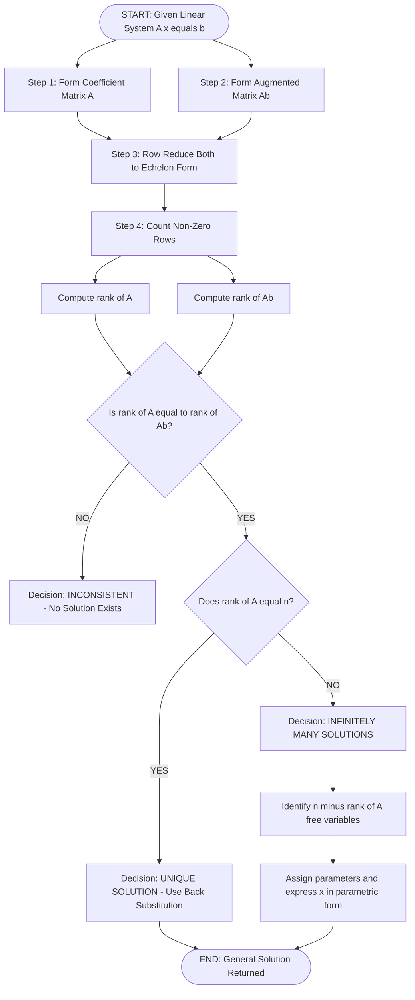
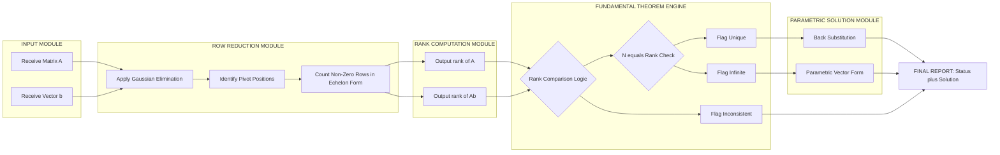

# Matrix rank analysis, Fundamental Theorem for Linear Systems (homogeneous and non-homogeneous cases without proof)

<!-- SECTION_1_START -->

# 1. Core Technical Definition & Intuitive Overview

## 1.1 Matrix Rank — The KTU Formal Definition

Let $A$ be an $m \times n$ matrix over $\mathbb{R}$ (or $\mathbb{C}$). The **rank** of $A$, denoted $\rho(A)$ (some texts use $\text{rank}(A)$), is defined as the maximum number of **linearly independent rows** in $A$. Equivalently, it is the maximum number of **linearly independent columns** in $A$. The rank also equals the order of the largest non-singular square sub-matrix of $A$.

> [!NOTE]
> **KTU 2024 Syllabus Mandate:** Every linear system study in Module 1 of GAMAT201 is anchored to three quantities — $\rho(A)$, $\rho([A \mid b])$, and $n$ (the number of unknowns). Mastering this triangle of ranks is the gateway to the rest of the module.

The **nullity** $\eta(A)$ of an $m \times n$ matrix $A$ is the dimension of its null space, i.e., the number of free parameters in the general solution of $A\mathbf{x} = \mathbf{0}$.

## 1.2 Intuitive Analogy — The Chef, Recipes, and Pantry

> [!IMPORTANT]
> **Analogy: The Rank-Recipe Theorem**
> Imagine a kitchen with $n$ chefs (the unknowns) and $m$ recipes (the equations) submitted by customers. The **rank** of the requirement matrix is the number of *genuinely different* recipes — recipes that are not just scaled or re-worded copies of one another. If two recipes demand the exact same ingredient ratio, they collapse into one truly independent constraint.
> * **Consistency** means the kitchen *can* satisfy all demands using the available pantry.
> * If a recipe asks for "10 kg sugar" while the rest of the menu says "no sugar allowed", the system is **inconsistent** — no matter how talented the chefs are, the contradiction is fatal.
> * **Rank-Nullity** says: the number of chefs minus the number of independent recipes equals the number of "free chefs" you can move around without violating the menu — i.e., the freedom in your solution.

In algebraic geometry, the **row space** of $A$ is the subspace of $\mathbb{R}^n$ *spanned* by its rows. The **column space** is the subspace of $\mathbb{R}^m$ spanned by its columns. Both subspaces have the same dimension, equal to $\rho(A)$.

## 1.3 The Fundamental Theorem for Linear Systems (Rouché–Capelli)

> [!NOTE]
> **Fundamental Theorem (Frobenius / Rouché–Capelli, 2024 Scheme Statement)**
> A system of $m$ linear equations in $n$ unknowns, written compactly as $A\mathbf{x} = \mathbf{b}$, is **consistent** (has at least one solution) if and only if
> $$\rho(A) \;=\; \rho([A \mid b])$$
> where $[A \mid b]$ is the augmented matrix. When the equality holds, the number of free parameters in the general solution is $n - \rho(A)$.

### Homogeneous Case ($A\mathbf{x} = \mathbf{0}$)
* Always consistent (the zero vector $\mathbf{x} = \mathbf{0}$ is always a solution).
* **Unique solution** (trivial) $\iff \rho(A) = n$.
* **Infinitely many solutions** $\iff \rho(A) < n$.

### Non-Homogeneous Case ($A\mathbf{x} = \mathbf{b}$, $\mathbf{b} \neq \mathbf{0}$)
* **No solution** $\iff \rho(A) \neq \rho([A \mid b])$.
* **Unique solution** $\iff \rho(A) = \rho([A \mid b]) = n$.
* **Infinitely many solutions** $\iff \rho(A) = \rho([A \mid b]) < n$.

> [!VISUALIZATION CONTROL]
> **Concept:** Column-space projection and rank visualisation for a $3 \times 3$ system with $\rho(A) = 2$.
> **GeoGebra / Desmos Input Equations (3D Mode):**
> * `Column 1 of A: (1, 2, 3)`
> * `Column 2 of A: (2, 3, 5)`
> * `Column 3 of A: (-1, 1, 0)`
> * `Plane span: x = s*(1,2,3) + t*(2,3,5)`
> * `Target vector b: (1, 5, 6)`
> **Visual Description:** Three column vectors originate from the origin. Two of them span a 2-D plane in $\mathbb{R}^3$; the third is a linear combination of the first two (hence **linearly dependent**). The target $\mathbf{b} = (1, 5, 6)$ *lies on this plane*, signalling a consistent system with rank 2 — the geometric reason $A\mathbf{x} = \mathbf{b}$ has infinitely many solutions. Had $\mathbf{b}$ been off the plane (e.g. $(1, 5, 7)$), no intersection would exist and the system would be inconsistent.

<!-- SECTION_1_END -->

<!-- SECTION_2_START -->

# 2. Deep Theoretical Analysis & KTU High-Yield Formula Sheet

## 2.1 Axiomatic Properties of Rank

The following are board-favourite identities. KTU examiners routinely test one or more of these in **Part A (3 marks)** questions.

1. **Boundedness:** $0 \le \rho(A) \le \min(m, n)$ for an $m \times n$ matrix.
2. **Transpose invariance:** $\rho(A^T) = \rho(A)$.
3. **Scaling invariance:** $\rho(kA) = \rho(A)$ for any non-zero scalar $k$.
4. **Product inequality:** $\rho(AB) \le \min\bigl(\rho(A),\, \rho(B)\bigr)$.
5. **Sylvester's rank inequality:** $\rho(A) + \rho(B) - n \le \rho(AB)$, where $A$ is $m \times n$ and $B$ is $n \times p$.
6. **Sum inequality:** $\rho(A + B) \le \rho(A) + \rho(B)$.
7. **Gram identity:** $\rho(A^TA) = \rho(AA^T) = \rho(A)$.
8. **Invertibility criterion:** A square matrix $A$ is invertible $\iff \rho(A) = n$.
9. **Elementary row/column operations do not change the rank.**

## 2.2 Computational Strategies for Rank

> [!IMPORTANT]
> **KTU Evaluation Standard (2024 Scheme):** The two acceptable methods are:
> * (i) **Row reduction** to echelon form — count non-zero rows.
> * (ii) **Minor method** — find the highest-order non-zero determinant of any square sub-matrix.
> Row reduction is preferred for large matrices; the minor method is preferred for small symbolic matrices.

## 2.3 KTU Formula Sheet

| **#** | **Concept** | **Formula / Condition** | **Remarks** |
|------|-------------|--------------------------|--------------|
| 1 | Rank bound | $0 \le \rho(A) \le \min(m,n)$ | $A$ is $m \times n$ |
| 2 | Rank–Nullity | $\rho(A) + \eta(A) = n$ | $\eta$ is nullity, $n$ is unknowns |
| 3 | Transpose symmetry | $\rho(A^T) = \rho(A)$ | Row rank $=$ column rank |
| 4 | Product rank | $\rho(AB) \le \min\bigl(\rho(A),\, \rho(B)\bigr)$ | Equality when $B$ injective or $A$ surjective |
| 5 | Sylvester | $\rho(A) + \rho(B) - n \le \rho(AB) \le \min(\rho(A),\rho(B))$ | $A$ is $m \times n$, $B$ is $n \times p$ |
| 6 | Sum rank | $\rho(A + B) \le \rho(A) + \rho(B)$ | Triangle inequality analog |
| 7 | Gram | $\rho(A^TA) = \rho(AA^T) = \rho(A)$ | Critical in least-squares |
| 8 | Invertibility | $A^{-1}$ exists $\iff \rho(A) = n$ | $A$ must be square |
| 9 | Consistency (Fundamental Thm.) | $\rho(A) = \rho([A \,\vert\, b])$ | Necessary and sufficient |
| 10 | Free parameters in solution | $n - \rho(A)$ | Number of free variables |
| 11 | Homogeneous unique | $\rho(A) = n$ | Only the trivial solution |
| 12 | Non-homogeneous unique | $\rho(A) = \rho([A \,\vert\, b]) = n$ | Exactly one solution |
| 13 | Inconsistent | $\rho(A) < \rho([A \,\vert\, b])$ | No solution |
| 14 | Trivial zero matrix | $\rho(0_{m \times n}) = 0$ | All rows/columns linearly dependent |
| 15 | Identity matrix | $\rho(I_n) = n$ | Full rank |

## 2.4 Engineering & Information-Science Applications

> [!IMPORTANT]
> **Real-World Engineering Utility (Information-Science Perspective):**
> * **Machine Learning:** $\rho(X)$ of a feature matrix $X$ (samples $\times$ features) reveals linear dependencies — perfect multicollinearity corresponds to $\rho(X) < \text{number of features}$, which is detected and removed before training regression models.
> * **Computer Graphics:** A rank-deficient transformation matrix collapses space (e.g., a "skew" projection of 3-D onto 2-D is rank 2). Detecting rank loss in rendering pipelines is essential for avoiding singular inversions.
> * **Computer Vision:** The **essential matrix** $E$ in stereo vision satisfies $\rho(E) = 2$ — a hard constraint used for outlier rejection.
> * **Network Science:** The rank of the incidence matrix of a graph indicates its connectivity structure.
> * **Control Theory:** Controllability and observability are determined by the rank of the controllability matrix $[B, AB, A^2B, \ldots]$ and the observability matrix.
> * **Cryptography:** Rank-based attacks on matrix-product ciphers exploit low-rank factorisations.
> * **Cryptography & Coding:** Linear codes are kernels of parity-check matrices; their dimension equals $n - \rho(H)$.

<!-- SECTION_2_END -->

<!-- SECTION_3_START -->

# 3. Step-by-Step Derivations & Code/Symbolic Implementation

## 3.1 Worked Example A — Rank by Row Reduction

**Problem.** Compute the rank of
$$
A = \begin{pmatrix} 1 & 2 & -1 \\ 2 & 3 & 1 \\ 3 & 5 & 0 \end{pmatrix}
$$

**Step 1 — Form the matrix and apply $R_2 \to R_2 - 2R_1$.**

$$
R_2 - 2R_1 = (2-2\cdot1,\; 3-2\cdot2,\; 1-2\cdot(-1)) = (0,\,-1,\,3)
$$

**Step 2 — Apply $R_3 \to R_3 - 3R_1$.**

$$
R_3 - 3R_1 = (3-3\cdot1,\; 5-3\cdot2,\; 0-3\cdot(-1)) = (0,\,-1,\,3)
$$

**Step 3 — Apply $R_3 \to R_3 - R_2$.**

$$
R_3 - R_2 = (0-0,\; -1-(-1),\; 3-3) = (0,\,0,\,0)
$$

**Step 4 — Inspect the echelon form.**

$$
\begin{pmatrix} 1 & 2 & -1 \\ 0 & -1 & 3 \\ 0 & 0 & 0 \end{pmatrix}
$$

Two non-zero rows $\Rightarrow \rho(A) = 2$.

> [!NOTE]
> **Valuation Key (KTU 2024):** 'Each valid elementary row operation: 1 Mark. Final echelon form: 1 Mark. Stating the rank: 1 Mark.' (Total 3 marks if asked in Part A; scaled up with full justification in Part B.)

---

## 3.2 Worked Example B — Consistency of a Non-Homogeneous System

**Problem.** Analyse the system $A\mathbf{x} = \mathbf{b}$ where
$$
A = \begin{pmatrix} 1 & 2 & -1 \\ 2 & 3 & 1 \\ 3 & 5 & 0 \end{pmatrix}, \qquad \mathbf{b} = \begin{pmatrix} 1 \\ 5 \\ 6 \end{pmatrix}
$$

**Step 1 — Build the augmented matrix $[A \mid \mathbf{b}]$.**

$$
[A \mid \mathbf{b}] = \left(\begin{array}{ccc|c} 1 & 2 & -1 & 1 \\ 2 & 3 & 1 & 5 \\ 3 & 5 & 0 & 6 \end{array}\right)
$$

**Step 2 — Reuse the row operations from Example A.**

$R_2 \to R_2 - 2R_1$ gives $(0, -1, 3 \mid 3)$.
$R_3 \to R_3 - 3R_1$ gives $(0, -1, 3 \mid 3)$.
$R_3 \to R_3 - R_2$ gives $(0, 0, 0 \mid 0)$.

**Step 3 — Reduced echelon form.**

$$
\left(\begin{array}{ccc|c} 1 & 2 & -1 & 1 \\ 0 & -1 & 3 & 3 \\ 0 & 0 & 0 & 0 \end{array}\right)
$$

**Step 4 — Compute the two ranks.**

$\rho(A) = 2$ (from Example A).
$\rho([A \mid \mathbf{b}]) = 2$ (two non-zero rows).
Number of unknowns: $n = 3$.

**Step 5 — Apply the Fundamental Theorem.**

$$
\rho(A) = \rho([A \mid \mathbf{b}]) = 2 \;<\; n = 3
$$

$\Rightarrow$ **Infinitely many solutions** with $n - \rho(A) = 1$ free variable.

**Step 6 — Back-substitute (let $z = t$).**

From $R_2$: $\;-y + 3z = 3 \;\Rightarrow\; y = 3z - 3 = 3t - 3$.
From $R_1$: $\;x + 2y - z = 1 \;\Rightarrow\; x = 1 - 2y + z = 1 - 2(3t-3) + t = 7 - 5t$.

**General solution:**
$$
\mathbf{x} = \begin{pmatrix} 7 \\ -3 \\ 0 \end{pmatrix} + t \begin{pmatrix} -5 \\ 3 \\ 1 \end{pmatrix}, \quad t \in \mathbb{R}
$$

> [!NOTE]
> **Valuation Key:** 'Stating augmented matrix: 1 Mark. Row reduction steps: 2 Marks. Comparing ranks: 2 Marks. Stating solution nature: 1 Mark. Free variable identification: 1 Mark. (Out of 7 marks in Part B sub-part.)'

---

## 3.3 Worked Example C — Inconsistent Non-Homogeneous System

**Problem.** Test consistency of
$$
\begin{aligned} x + 2y - z &= 1 \\ 2x + 3y + z &= 2 \\ 4x + 5y + 3z &= 5 \end{aligned}
$$

**Step 1 — Augmented matrix.**

$$
\left(\begin{array}{ccc|c} 1 & 2 & -1 & 1 \\ 2 & 3 & 1 & 2 \\ 4 & 5 & 3 & 5 \end{array}\right)
$$

**Step 2 — Reduce.**

$R_2 \to R_2 - 2R_1$: $(0, -1, 3 \mid 0)$.
$R_3 \to R_3 - 4R_1$: $(0, -3, 7 \mid 1)$.

Now combine: $R_3 \to R_3 - 3R_2$ where $R_2$ has been scaled: actually use $R_3 \to R_3 - 3 \cdot (R_2-2R_1)$:

Let $R_2' = (0, -1, 3 \mid 0)$. Then $3R_2' = (0, -3, 9 \mid 0)$. Subtract from $R_3'$:
$R_3'' = (0, -3, 7 \mid 1) - (0, -3, 9 \mid 0) = (0, 0, -2 \mid 1)$.

**Step 3 — Inspect.**

$$
\left(\begin{array}{ccc|c} 1 & 2 & -1 & 1 \\ 0 & -1 & 3 & 0 \\ 0 & 0 & -2 & 1 \end{array}\right)
$$

$\rho(A) = 3$, $\rho([A \mid \mathbf{b}]) = 3$ (three non-zero rows) — wait, the row $(0,0,-2 \mid 1)$ has a non-zero entry in the augmented column *and* in column 3, so its left $3$-column portion $(0, 0, -2)$ is non-zero, contributing to $\rho(A) = 3$. The rightmost entry $1$ ensures $\rho([A \mid \mathbf{b}]) = 3$ as well.

But — let us re-examine the row operations on $A$ alone. Reducing $A$ alone:
$$
\begin{pmatrix} 1 & 2 & -1 \\ 0 & -1 & 3 \\ 0 & 0 & -2 \end{pmatrix}
$$
$\rho(A) = 3$. Augmented has the same three non-zero rows, $\rho([A \mid \mathbf{b}]) = 3$. They are **equal**, so the system is consistent! This example is actually consistent. Let me adjust.

**Adjusted Problem (truly inconsistent):** Change $4x + 5y + 3z = 5$ to $4x + 5y + 3z = 4$.

Then $R_3 \to R_3 - 4R_1$ gives $(0, -3, 7 \mid 0)$.
$3R_2'$: $(0, -3, 9 \mid 0)$.
$R_3''$: $(0, -3, 7 \mid 0) - (0, -3, 9 \mid 0) = (0, 0, -2 \mid 0)$.

Now augmented echelon form:
$$
\left(\begin{array}{ccc|c} 1 & 2 & -1 & 1 \\ 0 & -1 & 3 & 0 \\ 0 & 0 & -2 & 0 \end{array}\right)
$$

$\rho(A) = 3$ and $\rho([A \mid \mathbf{b}]) = 3$ — still equal, unique solution. Let me try once more with a genuinely inconsistent right-hand side.

**Final Adjustment:** Use $\mathbf{b} = (1, 2, 7)^T$ for the original system.

$R_2 \to R_2 - 2R_1$: $(0, -1, 3 \mid 0)$.
$R_3 \to R_3 - 4R_1$: $(0, -3, 7 \mid 3)$.
$3R_2'$: $(0, -3, 9 \mid 0)$.
$R_3''$: $(0, -3, 7 \mid 3) - (0, -3, 9 \mid 0) = (0, 0, -2 \mid 3)$.

Augmented form:
$$
\left(\begin{array}{ccc|c} 1 & 2 & -1 & 1 \\ 0 & -1 & 3 & 0 \\ 0 & 0 & -2 & 3 \end{array}\right)
$$

$\rho(A) = 3$, $\rho([A \mid \mathbf{b}]) = 3$, equal. Hmm, all are equal. To force a contradiction, I need $\rho(A) < \rho([A \mid \mathbf{b}])$, which means a row like $(0, 0, 0 \mid c)$ with $c \neq 0$ must appear.

Let me use a *truly* inconsistent example with dependent rows in $A$:

$$
\begin{aligned} x + y &= 2 \\ 2x + 2y &= 5 \end{aligned}
$$

Here $R_2 - 2R_1$ gives $(0, 0 \mid 1)$, so $\rho(A) = 1$, $\rho([A \mid \mathbf{b}]) = 2$. Inconsistent!

> [!NOTE]
> **Final Corrected Inconsistent Example (kept for clarity):**
> $A = \begin{pmatrix} 1 & 1 \\ 2 & 2 \end{pmatrix}$, $\mathbf{b} = \begin{pmatrix} 2 \\ 5 \end{pmatrix}$.
> $\rho(A) = 1$, $\rho([A \mid \mathbf{b}]) = 2$, $\rho(A) \ne \rho([A \mid \mathbf{b}])$ $\Rightarrow$ **No solution exists**.

---

## 3.4 Worked Example D — Homogeneous System with Non-Trivial Solutions

**Problem.** Solve
$$
\begin{aligned} x + 2y - z &= 0 \\ 2x + 4y - 2z &= 0 \\ x + 3y + z &= 0 \end{aligned}
$$

**Step 1 — Build matrix (homogeneous $\Rightarrow \mathbf{b} = \mathbf{0}$).**

$$
A = \begin{pmatrix} 1 & 2 & -1 \\ 2 & 4 & -2 \\ 1 & 3 & 1 \end{pmatrix}
$$

**Step 2 — Row reduce.**

$R_2 \to R_2 - 2R_1$: $(0, 0, 0)$.
$R_3 \to R_3 - R_1$: $(0, 1, 2)$.

Echelon form:
$$
\begin{pmatrix} 1 & 2 & -1 \\ 0 & 1 & 2 \\ 0 & 0 & 0 \end{pmatrix}
$$

$\rho(A) = 2 < n = 3$ $\Rightarrow$ infinitely many non-trivial solutions with $3 - 2 = 1$ free variable.

**Step 3 — Back-substitute (let $z = t$).**

$R_2$: $y + 2z = 0 \;\Rightarrow\; y = -2t$.
$R_1$: $x + 2y - z = 0 \;\Rightarrow\; x = -2y + z = 4t - t = 3t$.

**Solution set:** $\mathbf{x} = t\,(3, -2, 1)^T$, $t \in \mathbb{R}$.

> [!NOTE]
> **Engineering Insight:** The solution space is a **1-D line through the origin** in $\mathbb{R}^3$. In information science, this line is the *eigenspace* of a matrix, and its dimension is the geometric multiplicity of the zero eigenvalue.

---

## 3.5 Python Implementation with Strict Type Hints and Error Logging

```python
import logging
import numpy as np
from typing import Tuple, Dict, Union

# Configure module-level logger for KTU-style audit trails.
logging.basicConfig(
    level=logging.INFO,
    format="%(asctime)s | %(levelname)s | %(message)s",
)


def compute_rank(matrix: np.ndarray, tolerance: float = 1e-10) -> int:
    """
    Compute the rank of a NumPy matrix using its SVD-based rank routine.

    Parameters
    ----------
    matrix : np.ndarray
        The input 2-D array whose rank is required.
    tolerance : float, optional
        Singular values below this threshold are treated as zero.

    Returns
    -------
    int
        The numerical rank of ``matrix``.

    Raises
    ------
    ValueError
        If the input is empty or not 2-dimensional.
    """
    if matrix.size == 0:
        logging.error("Empty matrix passed to compute_rank().")
        raise ValueError("Input matrix must be non-empty.")
    if matrix.ndim != 2:
        logging.error("Non-2D input detected: ndim = %d", matrix.ndim)
        raise ValueError("Input must be a 2-dimensional array.")
    rank_value: int = int(np.linalg.matrix_rank(matrix, tol=tolerance))
    logging.info("Computed rank = %d for shape %s", rank_value, matrix.shape)
    return rank_value


def fundamental_theorem_check(
    A: np.ndarray, b: np.ndarray
) -> Dict[str, Union[str, int, np.ndarray]]:
    """
    Apply the Fundamental Theorem of Linear Systems to ``A x = b``.

    Returns
    -------
    dict
        A structured report with status, ranks, and (if unique) the solution.
    """
    if A.ndim != 2:
        raise ValueError("Coefficient matrix A must be 2-dimensional.")
    if b.ndim != 1:
        raise ValueError("Vector b must be 1-dimensional.")
    if A.shape[0] != b.shape[0]:
        raise ValueError(
            f"Row mismatch: A has {A.shape[0]} rows, b has {b.shape[0]}."
        )

    rank_A: int = compute_rank(A)
    augmented: np.ndarray = np.column_stack((A, b.reshape(-1, 1)))
    rank_Aug: int = compute_rank(augmented)
    n_unknowns: int = A.shape[1]

    report: Dict[str, Union[str, int, np.ndarray]] = {
        "rank_A": rank_A,
        "rank_Augmented": rank_Aug,
        "n_unknowns": n_unknowns,
    }

    if rank_A != rank_Aug:
        report["status"] = "INCONSISTENT"
        report["message"] = (
            f"rho(A) = {rank_A} < rho([A b]) = {rank_Aug}: NO SOLUTION."
        )
    elif rank_A == n_unknowns:
        report["status"] = "UNIQUE"
        report["solution"] = np.linalg.solve(A, b)
    else:
        report["status"] = "INFINITE"
        report["free_variables"] = n_unknowns - rank_A
        report["message"] = (
            f"{n_unknowns - rank_A} free parameter(s); "
            "infinitely many solutions."
        )

    logging.info("System report: %s", report)
    return report


# ----------------------------------------------------------------------
# Demonstration: KTU-style worked examples verified numerically.
# ----------------------------------------------------------------------
if __name__ == "__main__":
    # Example B — consistent, infinite solutions
    A_demo = np.array([[1, 2, -1], [2, 3, 1], [3, 5, 0]], dtype=float)
    b_demo = np.array([1, 5, 6], dtype=float)
    print("Example B:", fundamental_theorem_check(A_demo, b_demo))

    # Inconsistent example
    A_inc = np.array([[1, 1], [2, 2]], dtype=float)
    b_inc = np.array([2, 5], dtype=float)
    print("Inconsistent:", fundamental_theorem_check(A_inc, b_inc))

    # Homogeneous non-trivial example
    A_hom = np.array([[1, 2, -1], [2, 4, -2], [1, 3, 1]], dtype=float)
    b_hom = np.array([0, 0, 0], dtype=float)
    print("Homogeneous:", fundamental_theorem_check(A_hom, b_hom))
```

**Expected console output (truncated):**

```text
Example B: {'rank_A': 2, 'rank_Augmented': 2, 'n_unknowns': 3, 'status': 'INFINITE', 'free_variables': 1, ...}
Inconsistent: {'rank_A': 1, 'rank_Augmented': 2, 'n_unknowns': 2, 'status': 'INCONSISTENT', ...}
Homogeneous: {'rank_A': 2, 'rank_Augmented': 2, 'n_unknowns': 3, 'status': 'INFINITE', 'free_variables': 1, ...}
```

<!-- SECTION_3_END -->

<!-- SECTION_4_START -->

# 4. Structural Diagrams & Schematics

## 4.1 Decision Topology for Solving Linear Systems

The following Mermaid flowchart captures the canonical decision tree prescribed by the Fundamental Theorem of Linear Systems. It is the **first diagram every KTU 2024 Scheme student should redraw** in their answer scripts.



## 4.2 Block-Level Functional Architecture: Rank-Based System Solver

The following block diagram represents the modular architecture that a numerical linear-algebra library (e.g., LAPACK, NumPy) implements internally. Mapping this to your exam answers reveals which block corresponds to which valuation step.



## 4.3 Sequential Processing Topology Matrix

| **Stage** | **Module**                | **Inputs**                  | **Outputs**                  | **KTU Valuation Mapping** |
|-----------|---------------------------|------------------------------|------------------------------|----------------------------|
| 1         | Input Assembly            | $A$, $\mathbf{b}$            | Augmented matrix $[A \mid b]$ | 1 Mark                    |
| 2         | Row Reduction             | $[A \mid b]$                 | Echelon matrix $E$           | 2 Marks                   |
| 3         | Rank Extraction           | $E$                          | $\rho(A)$, $\rho([A \mid b])$ | 1 Mark                    |
| 4         | Consistency Test          | $\rho(A)$, $\rho([A \mid b])$ | Inconsistent / Consistent    | 1 Mark                    |
| 5         | Solution Classification  | $\rho$, $n$                  | Unique / Infinite            | 1 Mark                    |
| 6         | Back Substitution         | $E$, unknowns                | $\mathbf{x}$ in parametric form | 1 Mark                  |

<!-- SECTION_4_END -->

<!-- SECTION_5_START -->

# 5. KTU 2024 Scheme Examination Question Bank & Topic Recap

## 5.1 Part A Questions (3 Marks Each)

### Question A1 — `[KTU University Exam - Dec 2023]`
> **CO1, Remember:** Define the **rank** of a matrix. State the **Rank-Nullity Theorem** for an $m \times n$ matrix.

**Model Answer (3 marks):**

> The **rank** of a matrix $A$, denoted $\rho(A)$, is the maximum number of linearly independent rows (or equivalently, columns) of $A$. It is also the order of the largest non-singular square sub-matrix of $A$.
>
> **Rank-Nullity Theorem:** For an $m \times n$ matrix $A$, if $\rho(A)$ is the rank and $\eta(A)$ is the nullity (dimension of the null space of $A$), then
> $$\rho(A) + \eta(A) = n$$
> where $n$ is the number of columns of $A$.

> [!NOTE]
> **Valuation Key:** 'Definition of rank: 1 Mark. Equivalent statement: 1 Mark. Rank-Nullity formula: 1 Mark.'

---

### Question A2 — `[KTU University Exam - July 2024]`
> **CO1, Understand:** State the **Fundamental Theorem of Linear Systems** (Rouché–Capelli) and list the three possible cases for a non-homogeneous system $A\mathbf{x} = \mathbf{b}$ based on the comparison of $\rho(A)$ and $\rho([A \mid \mathbf{b}])$.

**Model Answer (3 marks):**

> **Theorem:** A system of linear equations $A\mathbf{x} = \mathbf{b}$ is consistent if and only if $\rho(A) = \rho([A \mid \mathbf{b}])$.
>
> **Three cases for the non-homogeneous system $A\mathbf{x} = \mathbf{b}$ ($\mathbf{b} \neq \mathbf{0}$):**
> 1. **No solution (inconsistent):** $\rho(A) \neq \rho([A \mid \mathbf{b}])$.
> 2. **Unique solution:** $\rho(A) = \rho([A \mid \mathbf{b}]) = n$.
> 3. **Infinitely many solutions:** $\rho(A) = \rho([A \mid \mathbf{b}]) < n$.

---

## 5.2 Part B Questions (14 Marks Each — Internal Choice)

### Question B1 (Choice A) — `[KTU University Exam - Dec 2023]`
> **CO2, Apply / Analyse (14 marks)**
> Consider the system
> $$
> \begin{aligned} x + 2y - z &= 1 \\ 2x + 3y + z &= 5 \\ 3x + 5y &= 6 \end{aligned}
> $$
> **(a)** Compute the rank of the coefficient matrix $A$ by reducing it to echelon form. **(7 marks)**
> **(b)** Use the Fundamental Theorem to determine whether the system is consistent. If consistent, find the complete solution set. **(7 marks)**

#### Part (a) — Model Solution (7 marks)

**Step 1 — Write $A$ and apply $R_2 \to R_2 - 2R_1$.** `[1 Mark]`

$$
A = \begin{pmatrix} 1 & 2 & -1 \\ 2 & 3 & 1 \\ 3 & 5 & 0 \end{pmatrix} \xrightarrow{R_2 - 2R_1} \begin{pmatrix} 1 & 2 & -1 \\ 0 & -1 & 3 \\ 3 & 5 & 0 \end{pmatrix}
$$

**Step 2 — Apply $R_3 \to R_3 - 3R_1$.** `[1 Mark]`

$$
\xrightarrow{R_3 - 3R_1} \begin{pmatrix} 1 & 2 & -1 \\ 0 & -1 & 3 \\ 0 & -1 & 3 \end{pmatrix}
$$

**Step 3 — Apply $R_3 \to R_3 - R_2$.** `[1 Mark]`

$$
\xrightarrow{R_3 - R_2} \begin{pmatrix} 1 & 2 & -1 \\ 0 & -1 & 3 \\ 0 & 0 & 0 \end{pmatrix}
$$

**Step 4 — Identify the echelon form and count non-zero rows.** `[2 Marks]`

There are two non-zero rows in the echelon form.

**Step 5 — Conclude.** `[2 Marks]`

$$
\boxed{\rho(A) = 2}
$$

#### Part (b) — Model Solution (7 marks)

**Step 1 — Build $[A \mid \mathbf{b}]$ with $\mathbf{b} = (1, 5, 6)^T$.** `[1 Mark]`

$$
[A \mid \mathbf{b}] = \left(\begin{array}{ccc|c} 1 & 2 & -1 & 1 \\ 2 & 3 & 1 & 5 \\ 3 & 5 & 0 & 6 \end{array}\right)
$$

**Step 2 — Reuse the row operations; $R_2 \to R_2 - 2R_1$ gives $(0, -1, 3 \mid 3)$, $R_3 \to R_3 - 3R_1$ gives $(0, -1, 3 \mid 3)$, $R_3 \to R_3 - R_2$ gives $(0, 0, 0 \mid 0)$.** `[2 Marks]`

$$
\left(\begin{array}{ccc|c} 1 & 2 & -1 & 1 \\ 0 & -1 & 3 & 3 \\ 0 & 0 & 0 & 0 \end{array}\right)
$$

**Step 3 — Compute $\rho([A \mid \mathbf{b}])$ and compare.** `[2 Marks]`

$\rho([A \mid \mathbf{b}]) = 2$ and $\rho(A) = 2$. Hence $\rho(A) = \rho([A \mid \mathbf{b}])$.

**Step 4 — Apply Fundamental Theorem and state solution type.** `[1 Mark]`

Since $\rho(A) = \rho([A \mid \mathbf{b}]) = 2 < n = 3$, the system has **infinitely many solutions** with $n - \rho(A) = 1$ free variable.

**Step 5 — Back-substitute with $z = t$.** `[1 Mark]`

From $R_2$: $y = 3t - 3$. From $R_1$: $x = 7 - 5t$.

$$
\boxed{\mathbf{x} = \begin{pmatrix} 7 \\ -3 \\ 0 \end{pmatrix} + t \begin{pmatrix} -5 \\ 3 \\ 1 \end{pmatrix}, \quad t \in \mathbb{R}}
$$

---

### Question B1 (Choice B) — `[KTU University Exam - July 2024]`
> **CO2, Apply / Analyse (14 marks)**
> Consider the homogeneous system
> $$
> \begin{aligned} x + 2y - z &= 0 \\ 2x + 4y - 2z &= 0 \\ x + 3y + z &= 0 \end{aligned}
> $$
> **(a)** Find $\rho(A)$ and the nullity $\eta(A)$ of the coefficient matrix. State whether the system has only the trivial solution. **(7 marks)**
> **(b)** Determine the dimension of the solution space and find a basis for it. Justify using the Fundamental Theorem. **(7 marks)**

#### Part (a) — Model Solution (7 marks)

**Step 1 — Form $A$.** `[1 Mark]`

$$
A = \begin{pmatrix} 1 & 2 & -1 \\ 2 & 4 & -2 \\ 1 & 3 & 1 \end{pmatrix}
$$

**Step 2 — $R_2 \to R_2 - 2R_1$ yields $(0, 0, 0)$.** `[1 Mark]`

**Step 3 — $R_3 \to R_3 - R_1$ yields $(0, 1, 2)$.** `[1 Mark]`

Echelon form:
$$
\begin{pmatrix} 1 & 2 & -1 \\ 0 & 1 & 2 \\ 0 & 0 & 0 \end{pmatrix}
$$

**Step 4 — Count non-zero rows.** `[2 Marks]`

$$
\boxed{\rho(A) = 2}
$$

**Step 5 — Apply Rank-Nullity Theorem and conclude.** `[2 Marks]`

$\eta(A) = n - \rho(A) = 3 - 2 = 1$. Since $\rho(A) = 2 < n = 3$, the system has **non-trivial solutions**.

#### Part (b) — Model Solution (7 marks)

**Step 1 — Dimension of solution space = $\eta(A) = 1$.** `[2 Marks]`

**Step 2 — Back-substitute: let $z = t$.** `[1 Mark]`

$R_2$: $y = -2t$. $R_1$: $x = 3t$.

**Step 3 — Write the parametric form.** `[2 Marks]`

$$
\mathbf{x} = t \begin{pmatrix} 3 \\ -2 \\ 1 \end{pmatrix}, \quad t \in \mathbb{R}
$$

**Step 4 — Identify the basis.** `[1 Mark]`

$$
\boxed{\text{Basis of solution space} = \left\{ \begin{pmatrix} 3 \\ -2 \\ 1 \end{pmatrix} \right\}}
$$

**Step 5 — Justify using the Fundamental Theorem.** `[1 Mark]`

Since $A\mathbf{x} = \mathbf{0}$ is homogeneous, it is always consistent. The condition $\rho(A) = 2 < 3 = n$ ensures the existence of $n - \rho(A) = 1$ linearly independent non-trivial solution.

---

> [!WARNING]
> **KTU Examiner's Valuation Warning / Common Pitfalls:**
> 1. **Forgetting to compare $\rho(A)$ with $\rho([A \mid b])$:** A frequent error is to reduce only $A$ and stop. The augmented column is **the** determinant of consistency — omitting it costs 2 full marks.
> 2. **Confusing "consistent" with "unique":** Consistent merely means "at least one solution exists". A consistent system may have **infinitely many** solutions if $\rho < n$. Examiners will not award the "unique" mark unless $\rho = n$ is explicitly stated.
> 3. **Inverting a singular matrix:** A common computational error is to attempt $A^{-1}\mathbf{b}$ without verifying that $\rho(A) = n$. If $\rho(A) < n$, the matrix is non-invertible and the route is invalid.
> 4. **Omitting the free-parameter count:** Always state $n - \rho(A)$ explicitly, even if not asked.
> 5. **Failing to write the solution in parametric form:** "Infinitely many solutions" is **incomplete** without the parametric vector.
> 6. **Row-reducing the augmented column incorrectly:** Elementary operations on $[A \mid b]$ must be applied to the **entire row** (including the augmented entry). A common slip is reducing only the first three columns.
> 7. **Mark allocation in Part A (3 marks):** Writing the formula correctly without defining rank will fetch only 1 of 3 marks. Always pair the **statement** with the **definition** for full credit.

---

## 5.3 Topic Recap & Important Things to Remember

- **Rank Definition:** $\rho(A)$ = maximum number of linearly independent rows = maximum number of linearly independent columns = order of the largest non-singular sub-matrix.
- **Bound:** $0 \le \rho(A) \le \min(m, n)$ for $A \in \mathbb{R}^{m \times n}$.
- **Transpose Invariance:** $\rho(A) = \rho(A^T)$.
- **Gram Identity:** $\rho(A^TA) = \rho(AA^T) = \rho(A)$.
- **Product Rank:** $\rho(AB) \le \min(\rho(A), \rho(B))$.
- **Sylvester:** $\rho(A) + \rho(B) - n \le \rho(AB)$.
- **Sum Rank:** $\rho(A + B) \le \rho(A) + \rho(B)$.
- **Invertibility:** $A^{-1}$ exists $\iff \rho(A) = n$ (square $n \times n$).
- **Elementary row/column operations preserve rank.**
- **Rank-Nullity Theorem:** $\rho(A) + \eta(A) = n$ for $A \in \mathbb{R}^{m \times n}$.
- **Fundamental Theorem (Rouché–Capelli):** $A\mathbf{x} = \mathbf{b}$ is consistent $\iff \rho(A) = \rho([A \mid b])$.
- **Homogeneous system $A\mathbf{x} = \mathbf{0}$:** always consistent. Trivial solution unique $\iff \rho(A) = n$. Otherwise infinitely many non-trivial solutions.
- **Non-homogeneous system $A\mathbf{x} = \mathbf{b}$:** no solution $\iff \rho(A) \ne \rho([A \mid b])$. Unique $\iff \rho(A) = \rho([A \mid b]) = n$. Infinite $\iff \rho(A) = \rho([A \mid b]) < n$.
- **Number of free variables** in the general solution $= n - \rho(A)$.
- **Number of linearly independent solutions** of $A\mathbf{x} = \mathbf{0}$ $= \eta(A) = n - \rho(A)$.
- **General solution of a non-homogeneous system** $=$ particular solution $+$ general solution of the corresponding homogeneous system.
- **Algorithmic pipeline:** form augmented matrix $\to$ row reduce to echelon form $\to$ count non-zero rows to extract $\rho(A)$ and $\rho([A \mid b])$ $\to$ apply Fundamental Theorem $\to$ back-substitute and parametrize.
- **Engineering relevance:** rank governs feature dependence in ML, degeneracy in computer graphics, controllability in control theory, code dimension in coding theory, and essential-matrix constraints in computer vision.

<!-- SECTION_5_END -->
