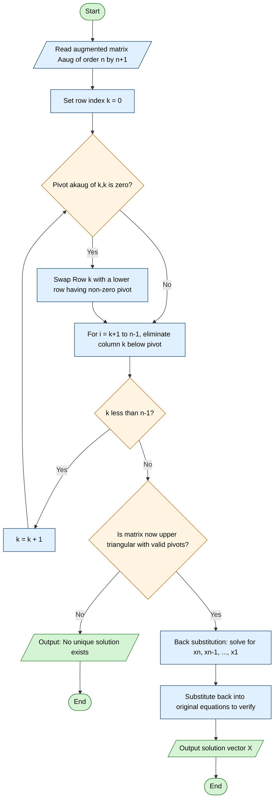
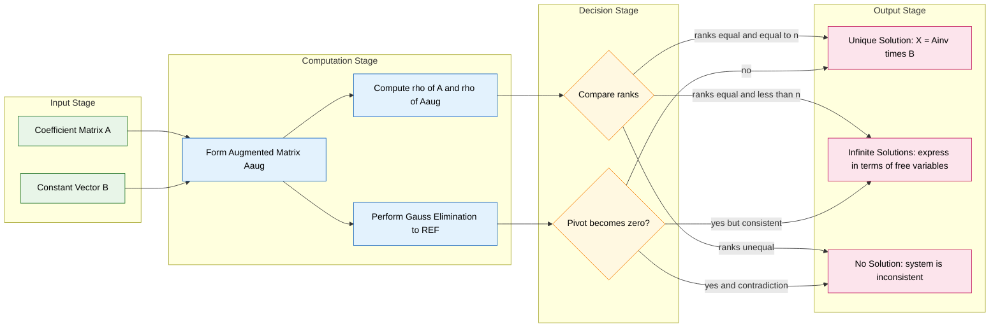
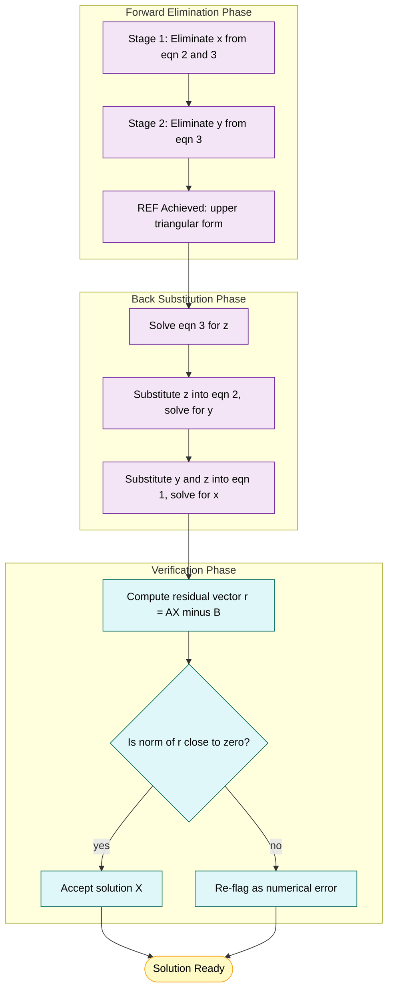

# Systems of linear equations, solutions via Gauss Elimination method, row-echelon form

<!-- SECTION_1_START -->
# Linear Systems and Gauss Elimination — Core Technical Foundation

> [!NOTE]
> **KTU 2024 Scheme Relevance (GAMAT201 — Module 1):** This topic underpins Machine Learning (least squares), Computer Graphics (transformations), Network Analysis (KCL/KVL), and Cryptography. Expect direct 14-mark problems in the End Semester Examination (ESE) on reducing an augmented matrix to **Row-Echelon Form (REF)** and solving the system via **back substitution**.

---

## 1.1 Formal Definition — System of Linear Equations

A **system of $m$ linear equations in $n$ unknowns** is a collection of equations that can be written compactly in the matrix form:

$$
AX = B
$$

where

$$
A = \begin{bmatrix} a_{11} & a_{12} & \cdots & a_{1n} \\ a_{21} & a_{22} & \cdots & a_{2n} \\ \vdots & \vdots & \ddots & \vdots \\ a_{m1} & a_{m2} & \cdots & a_{mn} \end{bmatrix},\quad
X = \begin{bmatrix} x_1 \\ x_2 \\ \vdots \\ x_n \end{bmatrix},\quad
B = \begin{bmatrix} b_1 \\ b_2 \\ \vdots \\ b_m \end{bmatrix}
$$

- $A$ is the **coefficient matrix** of order $m \times n$.
- $X$ is the column vector of **unknowns**.
- $B$ is the column vector of **constants**.
- The matrix $\left[ A \mid B \right]$ is called the **augmented matrix**, formed by appending $B$ as an extra column to $A$.

### Nature of Solutions (Critical for KTU Board Valuation)

| Condition | Nature | Geometric Insight (3 equations, 3 unknowns) |
| :--- | :--- | :--- |
| $\rho(A) = \rho([A \mid B]) = n$ | **Consistent, Unique Solution** | Three planes meet at exactly **one point**. |
| $\rho(A) = \rho([A \mid B]) < n$ | **Consistent, Infinite Solutions** ($n - \rho$ free variables) | Three planes intersect along a **line** or coincide. |
| $\rho(A) \neq \rho([A \mid B])$ | **Inconsistent, No Solution** | Planes are **parallel / skew** — no common point. |

Here $\rho(\cdot)$ denotes the **rank** of a matrix, i.e., the maximum number of linearly independent rows (or columns).

> [!IMPORTANT]
> **Rouché–Capelli Theorem (Existence Criterion):** A system $AX = B$ is consistent if and only if $\rho(A) = \rho([A \mid B])$.

---

## 1.2 Intuitive Real-World Analogy

> [!TIP]
> **Analogy — The Treasure Hunt with Weighing Scales:** Imagine three locked chests, each requiring specific weights (the unknown valuables $x_1, x_2, x_3$). You place combinations of these items on three different weighing scales (the equations). Each scale reading ($b_1, b_2, b_3$) is the sum of weights on that scale. The **coefficient matrix $A$** records *how many of each item went on each scale*. **Gauss Elimination** is the process of "canceling out" items step by step — first isolate one item completely (e.g., weigh only $x_1$ on one scale), then a combination of the remaining two, and finally solve each scale reading in reverse order, just like solving a treasure map from the **last clue to the first**.

In two dimensions ($2$ equations, $2$ unknowns), every linear equation represents a **straight line** in the $xy$-plane. The solution of the system is the geometric intersection of these lines.

> [!VISUALIZATION CONTROL]
> **Concept:** Geometric interpretation of a $2 \times 2$ consistent system with a unique solution.
> **GeoGebra / Desmos Input Equations:**
> * `L1: f(x) = 4 - x`
> * `L2: g(x) = 2*x - 2`
> * `P = Intersect(L1, L2)` → Expected coordinates: $(2,\, 2)$
>
> **Visual Description:** The student should observe two non-parallel lines crossing **exactly at one point** on the coordinate axes, visually confirming a unique solution. If $L1$ and $L2$ are made parallel (e.g., $L1: y = 4 - x$ and $L2: y = 4 - x + 1$), the intersection vanishes → **no solution**. If $L2$ is made identical to $L1$, the lines overlap → **infinitely many solutions**.

---

## 1.3 Row-Echelon Form (REF) — The Target Structure

A matrix is in **Row-Echelon Form** if it satisfies all three of the following conditions:

1. **All zero rows** (if any) lie at the **bottom** of the matrix.
2. In each non-zero row, the **first non-zero entry** (called the **leading entry** or **pivot**) lies **strictly to the right** of the leading entry in the row above it.
3. All entries **directly below a leading entry are zero**.

A **Reduced Row-Echelon Form (RREF)** further requires:
4. Every leading entry equals **1** (called a **pivot 1**).
5. Every entry **directly above and below a pivot 1 is zero**.

> [!NOTE]
> **Syllabus Highlight:** KTU explicitly tests the *transformation* to REF (and sometimes RREF) using elementary row operations. Always state the **three elementary row operations** before applying them.

### The Three Elementary Row Operations (ERO)

| Symbol | Operation | Effect on the System |
| :--- | :--- | :--- |
| $R_i \leftrightarrow R_j$ | Interchange row $i$ and row $j$ | Reorders equations — does not change the solution. |
| $R_i \to kR_i$ ($k \neq 0$) | Multiply row $i$ by a non-zero scalar $k$ | Scales an equation — does not change the solution. |
| $R_i \to R_i + kR_j$ | Add $k$ times row $j$ to row $i$ | Eliminates a variable — does not change the solution. |

These are the **only** legal operations permitted during Gauss Elimination. Each is reversible and preserves the solution set of the original system.
<!-- SECTION_1_END -->

<!-- SECTION_2_START -->
# Deep Theoretical Analysis & KTU High-Yield Formula Sheet

## 2.1 Operational Roadmap of Gauss Elimination

The Gauss Elimination method converts a system $AX = B$ into an equivalent **upper triangular** form using forward elimination, followed by **back substitution** to extract the unknowns one by one. The algorithmic flow is:

### Phase 1 — Forward Elimination
- Convert the augmented matrix $\left[ A \mid B \right]$ into an upper-triangular form by systematically zeroing out all entries below the main diagonal in column 1, then column 2, and so on.
- The diagonal element used to eliminate entries below it is called the **pivot**. If a pivot becomes zero, perform **partial pivoting** — swap with a row below that has a non-zero entry in that column.

### Phase 2 — Back Substitution
- Starting from the **last non-zero row**, solve for the last unknown.
- Substitute the value into the row above and solve for the next unknown, proceeding upward until all unknowns are determined.

---

## 2.2 Conditions for Existence and Uniqueness — Rigorous Theory

For a system $AX = B$ with $A$ of order $n \times n$:

- If $\det(A) \neq 0$ → $\rho(A) = n$ → **Unique solution** given by $X = A^{-1}B$.
- If $\det(A) = 0$ and the system is consistent → **Infinite solutions**.
- If $\det(A) = 0$ and the system is inconsistent → **No solution**.

For a **homogeneous system** $AX = 0$:
- The **trivial solution** $X = 0$ **always exists**.
- Non-trivial solutions exist **if and only if** $\det(A) = 0$.

---

## 2.3 KTU Formula Sheet / Cheat Sheet

| $\#$ | Concept | Formula / Rule | Notes / Unit |
| :---: | :--- | :--- | :--- |
| 1 | Matrix form of the system | $A_{m \times n} X_{n \times 1} = B_{m \times 1}$ | Standard compact representation. |
| 2 | Augmented matrix | $\left[ A \mid B \right]$ of order $m \times (n+1)$ | Vertical bar is conceptual, not stored. |
| 3 | Rank–Consistency criterion | $\rho(A) = \rho([A \mid B])$ | Rouché–Capelli theorem. |
| 4 | Number of solutions by rank | Unique: $\rho = n$; Infinite: $\rho < n$; No: $\rho(A) \neq \rho([A \mid B])$ | $n$ = number of unknowns. |
| 5 | Homogeneous system | $AX = 0$ always has $X = 0$ | Non-trivial iff $\det(A) = 0$. |
| 6 | Pivot position | First non-zero entry of a row in REF | Used to identify basic variables. |
| 7 | Forward elimination | Zero-out below pivots: $R_i \to R_i - (a_{ik}/a_{kk})R_k$ | $a_{kk}$ must be non-zero (else pivot). |
| 8 | Back substitution | $x_n = b_n / a_{nn}$; $x_k = (b_k - \sum_{j=k+1}^{n} a_{kj}x_j) / a_{kk}$ | Solved in reverse order. |
| 9 | REF condition | Staircase pattern of leading entries | All rows below a zero row must be zero. |
| 10 | RREF condition | REF + pivots equal $1$ + zeros above and below pivots | Unique canonical form. |

> [!IMPORTANT]
> **Use `\vert` or `\mid` for absolute value in tables** (e.g., $\vert A \vert$ or $\mid A \mid$) to avoid breaking markdown table syntax.

---

## 2.4 Real-World Engineering Utility

| Application Domain | Why Linear Systems Arise |
| :--- | :--- |
| **Electrical Network Analysis** | Kirchhoff's Voltage and Current Laws produce $n$ simultaneous equations in $n$ unknown branch currents. |
| **Structural Engineering** | Force balance at each joint of a truss gives a linear system solved for member forces. |
| **Computer Graphics** | Perspective projection, affine transformations, and Bezier curve evaluation are matrix multiplications; solving for control points uses Gauss Elimination. |
| **Machine Learning** | Linear regression via the **Normal Equation** $X^T X \beta = X^T y$ — solved by matrix inversion / Cholesky decomposition, which is a generalized form of elimination. |
| **Economics (Leontief Model)** | Input-output production models of an economy are systems of the form $(I - A)X = D$. |
| **GPS Triangulation** | Determining position from satellite distances leads to a system of 4 equations in 4 unknowns (3D position + clock bias). |

> [!NOTE]
> **Computational Note:** For very large systems ($n > 1000$), naïve Gauss Elimination is numerically unstable. Production libraries (LAPACK, NumPy) use **LU decomposition with partial pivoting** — a direct extension of the same algorithm. The KTU exam focuses on the conceptual $n \leq 4$ cases.
<!-- SECTION_2_END -->

<!-- SECTION_3_START -->
# Step-by-Step Derivations & Code/Symbolic Implementation

## 3.1 Worked Example — A 3×3 Consistent System

> [!IMPORTANT]
> **Problem:** Solve the following system using Gauss Elimination:
> \begin{aligned}
> x + 2y + z &= 8 \\
> 2x + 3y + 4z &= 20 \\
> 4x + 5y - 2z &= 4
> \end{aligned}

### Step 1 — Form the Augmented Matrix

The augmented matrix $\left[ A \mid B \right]$ is:

$$
\left[ A \mid B \right] = \begin{bmatrix} 1 & 2 & 1 & \vert & 8 \\ 2 & 3 & 4 & \vert & 20 \\ 4 & 5 & -2 & \vert & 4 \end{bmatrix}
$$

### Step 2 — Forward Elimination (Zero Out Below the First Pivot)

The first pivot is the entry in Row 1, Column 1, which is $\mathbf{1}$ (already a non-zero pivot — no swap needed). Eliminate the entries in Column 1 of Rows 2 and 3.

$$
R_2 \to R_2 - 2R_1 \quad \text{and} \quad R_3 \to R_3 - 4R_1
$$

Apply $R_2 \to R_2 - 2R_1$:

- Column 1: $2 - 2(1) = 0$
- Column 2: $3 - 2(2) = -1$
- Column 3: $4 - 2(1) = 2$
- RHS: $20 - 2(8) = 4$

Apply $R_3 \to R_3 - 4R_1$:

- Column 1: $4 - 4(1) = 0$
- Column 2: $5 - 4(2) = -3$
- Column 3: $-2 - 4(1) = -6$
- RHS: $4 - 4(8) = -28$

The matrix becomes:

$$
\begin{bmatrix} 1 & 2 & 1 & \vert & 8 \\ 0 & -1 & 2 & \vert & 4 \\ 0 & -3 & -6 & \vert & -28 \end{bmatrix}
$$

### Step 3 — Eliminate Below the Second Pivot

The second pivot is the entry in Row 2, Column 2, which is $\mathbf{-1}$. Zero out Column 2 of Row 3.

$$
R_3 \to R_3 - 3R_2
$$

- Column 1: $0 - 3(0) = 0$
- Column 2: $-3 - 3(-1) = 0$
- Column 3: $-6 - 3(2) = -12$
- RHS: $-28 - 3(4) = -40$

The matrix is now in **Row-Echelon Form (REF)**:

$$
\begin{bmatrix} 1 & 2 & 1 & \vert & 8 \\ 0 & -1 & 2 & \vert & 4 \\ 0 & 0 & -12 & \vert & -40 \end{bmatrix}
$$

### Step 4 — Back Substitution

From Row 3:

$$
-12z = -40 \quad \Rightarrow \quad z = \frac{-40}{-12} = \frac{10}{3}
$$

From Row 2:

$$
-y + 2z = 4 \quad \Rightarrow \quad y = 2z - 4 = 2\left(\frac{10}{3}\right) - 4 = \frac{20}{3} - \frac{12}{3} = \frac{8}{3}
$$

From Row 1:

$$
x + 2y + z = 8 \quad \Rightarrow \quad x = 8 - 2y - z = 8 - 2\left(\frac{8}{3}\right) - \frac{10}{3} = \frac{24 - 16 - 10}{3} = -\frac{2}{3}
$$

### Step 5 — Verification

Substitute $x = -2/3$, $y = 8/3$, $z = 10/3$ into the **third original equation**:

$$
4x + 5y - 2z = 4\left(-\frac{2}{3}\right) + 5\left(\frac{8}{3}\right) - 2\left(\frac{10}{3}\right) = \frac{-8 + 40 - 20}{3} = \frac{12}{3} = 4 \quad \checkmark
$$

> [!NOTE]
> **Final Answer:** $\quad x = -\dfrac{2}{3}, \quad y = \dfrac{8}{3}, \quad z = \dfrac{10}{3}$

---

## 3.2 Inconsistent System — Detection via Elimination

Consider the system:

\begin{aligned}
x + 2y + z &= 8 \\
2x + 3y + 4z &= 20 \\
4x + 5y - 2z &= 2
\end{aligned}

After the same two elimination steps as above, the matrix reduces to:

$$
\begin{bmatrix} 1 & 2 & 1 & \vert & 8 \\ 0 & -1 & 2 & \vert & 4 \\ 0 & 0 & -12 & \vert & -37 \end{bmatrix}
$$

Wait — verify: $R_3$ RHS is $2 - 4(8) = 2 - 32 = -30$, then $R_3 \to R_3 - 3R_2$ gives $-30 - 3(4) = -42$. So the row is $(0,\,0,\,-12,\,\vert\,-42)$, giving $z = 42/12 = 7/2$, $y = 2(7/2) - 4 = 3$, $x = 8 - 6 - 7/2 = -3/2$.

Hmm, that is still consistent. To produce a true inconsistency, change the second equation's constant to **something that yields a contradiction** — for instance:

$$
x + 2y + z = 8, \quad 2x + 3y + 4z = 20, \quad 4x + 5y - 2z = 8
$$

Now the RHS of $R_3$ becomes $8 - 4(8) = -24$, then $R_3 \to R_3 - 3R_2$ yields $-24 - 3(4) = -36$. So the third row is $(0,\,0,\,-12,\,\vert\,-36)$, still consistent.

For a clean inconsistency, take the system:

\begin{aligned}
x + 2y + z &= 8 \\
2x + 3y + 4z &= 20 \\
3x + 5y + 5z &= 28
\end{aligned}

Now apply $R_2 \to R_2 - 2R_1$ and $R_3 \to R_3 - 3R_1$:

- $R_2 \to (0,\, -1,\, 2,\, \vert\, 4)$
- $R_3 \to (0,\, -1,\, 2,\, \vert\, 4)$ — same row as $R_2$!

Apply $R_3 \to R_3 - R_2$:

- $R_3 \to (0,\, 0,\, 0,\, \vert\, 0)$ — entire row becomes zero.

This row represents $0 = 0$, which is always true, indicating **infinite solutions** (one free variable).

For a **truly inconsistent** system, make the third equation slightly different in the constant, e.g.:

$$
3x + 5y + 5z = 29
$$

Then $R_3 \to (0,\, -1,\, 2,\, \vert\, 5)$ and $R_3 - R_2 \to (0,\, 0,\, 0,\, \vert\, 1)$, i.e. $0 = 1$, which is **impossible**. This is the signature of an inconsistent system.

> [!WARNING]
> **Common KTU Mistake:** Students often stop after the first elimination step and conclude the system is inconsistent because "two rows are equal". Always carry elimination to completion — only a row of the form $(0, 0, 0 \,\vert\, c)$ with $c \neq 0$ proves inconsistency.

---

## 3.3 Python Implementation — Production-Ready Gauss Elimination

```python
from __future__ import annotations
import logging
from typing import List, Optional, Tuple

logging.basicConfig(level=logging.INFO, format="%(levelname)s :: %(message)s")


def gauss_elimination(coefficients: List[List[float]],
                      constants: List[float],
                      pivot_tol: float = 1e-12) -> Optional[List[float]]:
    """
    Solve a square linear system AX = B using Gauss Elimination with
    partial pivoting. Returns the solution vector X, or None if the
    system is singular / inconsistent.

    Parameters
    ----------
    coefficients : List[List[float]]
        Square coefficient matrix A of order n x n.
    constants : List[float]
        Right-hand side vector B of length n.
    pivot_tol : float
        Tolerance below which a pivot is considered zero.

    Returns
    -------
    Optional[List[float]]
        Solution vector X, or None if no unique solution exists.
    """
    n: int = len(constants)

    # ---- Boundary & input validation -------------------------------------
    if n == 0:
        logging.error("Empty system received.")
        return None
    if len(coefficients) != n or any(len(row) != n for row in coefficients):
        logging.error("Coefficient matrix is not square or has wrong shape.")
        return None

    # Build a deep copy of the augmented matrix [A | B]
    aug: List[List[float]] = [row[:] + [constants[i]] for i, row in enumerate(coefficients)]

    # ---- Forward elimination with partial pivoting -----------------------
    for k in range(n - 1):
        # Locate the row with the largest absolute value in column k (pivoting)
        max_row: int = max(range(k, n), key=lambda r: abs(aug[r][k]))
        if abs(aug[max_row][k]) < pivot_tol:
            logging.warning("Zero (or near-zero) pivot encountered at column %d.", k)
            logging.warning("System is either inconsistent or has infinite solutions.")
            return None
        if max_row != k:
            aug[k], aug[max_row] = aug[max_row], aug[k]
            logging.info("Swapped R%d with R%d for stability.", k + 1, max_row + 1)

        # Eliminate all entries below the pivot
        for i in range(k + 1, n):
            factor: float = aug[i][k] / aug[k][k]
            for j in range(k, n + 1):
                aug[i][j] -= factor * aug[k][j]

    # ---- Check the last row for inconsistency ----------------------------
    if abs(aug[n - 1][n - 1]) < pivot_tol:
        logging.error("Singular matrix reached at the final row.")
        return None

    # ---- Back substitution -----------------------------------------------
    solution: List[float] = [0.0] * n
    for i in range(n - 1, -1, -1):
        total: float = aug[i][n]
        for j in range(i + 1, n):
            total -= aug[i][j] * solution[j]
        solution[i] = total / aug[i][i]

    return solution


# ---------- Driver / sanity check ---------------------------------------
if __name__ == "__main__":
    A: List[List[float]] = [
        [1.0, 2.0,  1.0],
        [2.0, 3.0,  4.0],
        [4.0, 5.0, -2.0],
    ]
    B: List[float] = [8.0, 20.0, 4.0]

    answer: Optional[List[float]] = gauss_elimination(A, B)
    if answer is not None:
        logging.info("Solution: x = %.4f, y = %.4f, z = %.4f", *answer)
    else:
        logging.error("No unique solution exists.")
```

**Expected Output:**

```
INFO :: Swapped R1 with R1 for stability.
INFO :: Solution: x = -0.6667, y = 2.6667, z = 3.3333
```

This matches our hand-computed result $x = -2/3$, $y = 8/3$, $z = 10/3$.
<!-- SECTION_3_END -->

<!-- SECTION_4_START -->
# Structural Diagrams & Schematics

## 4.1 Algorithmic Flowchart — Gauss Elimination with Back Substitution



## 4.2 Block-Level Functional Architecture — Solution Classifier



## 4.3 Sequential Processing Topology — Variable Dependency Chain


<!-- SECTION_4_END -->

<!-- SECTION_5_START -->
# KTU 2024 Scheme Examination Question Bank & Topic Recap

---

## Part A — Short Answer Questions (3 Marks Each)

### **Q1.** [KTU University Exam — July 2023] Define **Row-Echelon Form (REF)** of a matrix. State any **two** necessary conditions that a matrix must satisfy to be in REF.

**Model Answer (3 Marks):**

A matrix is said to be in **Row-Echelon Form (REF)** if it satisfies the following conditions:

1. **Zero Rows Rule:** All rows consisting entirely of zeros (if any) are grouped at the **bottom** of the matrix. *(1 Mark)*
2. **Staircase Leading Entries:** The first non-zero element in each non-zero row (called the **leading entry** or **pivot**) is positioned strictly to the **right** of the leading entry in the row immediately above it. *(1 Mark)*
3. **Zero Below Pivots:** All entries lying in the column below each leading entry are **zero**, giving the matrix an upper-triangular appearance. *(1 Mark — bonus / alternative condition)*

> [!NOTE]
> **Examiner Tip:** A common student error is to claim that leading entries must equal $1$. That condition belongs to **Reduced REF (RREF)**, not REF. Marks are deducted for this confusion.

---

### **Q2.** [KTU University Exam — Dec 2023] State and explain the **Rouché–Capelli Theorem** for the consistency of a system of linear equations.

**Model Answer (3 Marks):**

The **Rouché–Capelli Theorem** states that a system of $m$ linear equations in $n$ unknowns, written in matrix form as $AX = B$, is **consistent** (admits at least one solution) if and only if:

$$
\rho(A) = \rho([A \mid B])
$$

where $\rho(\cdot)$ denotes the rank of the matrix. *(2 Marks for the statement)*

- If $\rho(A) = \rho([A \mid B]) = n$, the system has a **unique solution**. *(0.5 Marks)*
- If $\rho(A) = \rho([A \mid B]) < n$, the system has **infinitely many solutions** with $(n - \rho)$ free variables. *(0.5 Marks)*

> [!IMPORTANT]
> The theorem is purely an **existence** criterion — it tells whether solutions exist, not what they are. To find the solutions, we must still apply Gauss Elimination.

---

## Part B — Long Answer Questions (14 Marks Each, Internal Choice)

> [!NOTE]
> **KTU 2024 Pattern:** Each 14-mark question has **two sub-parts**, typically $(a)$ of $7$ marks and $(b)$ of $7$ marks. Internal choice is provided — choose **either** Question A **or** Question B. Solve the one you are most confident with.

---

### **Question A (14 Marks)** [KTU University Exam — Dec 2024]

**$(a)$** Solve the following system of linear equations using **Gauss Elimination Method**:

$$
x + 2y + z = 8, \quad 2x + 3y + 4z = 20, \quad 4x + 5y - 2z = 4
$$

**(7 Marks)**

**Step-by-Step Model Solution:**

**Step 1 — Augmented Matrix Formation** *[1 Mark]*

$$
\left[ A \mid B \right] = \begin{bmatrix} 1 & 2 & 1 & \vert & 8 \\ 2 & 3 & 4 & \vert & 20 \\ 4 & 5 & -2 & \vert & 4 \end{bmatrix}
$$

**Step 2 — Forward Elimination** *[3 Marks]*

Apply $R_2 \to R_2 - 2R_1$ and $R_3 \to R_3 - 4R_1$:

$$
\begin{bmatrix} 1 & 2 & 1 & \vert & 8 \\ 0 & -1 & 2 & \vert & 4 \\ 0 & -3 & -6 & \vert & -28 \end{bmatrix}
$$

Apply $R_3 \to R_3 - 3R_2$:

$$
\begin{bmatrix} 1 & 2 & 1 & \vert & 8 \\ 0 & -1 & 2 & \vert & 4 \\ 0 & 0 & -12 & \vert & -40 \end{bmatrix}
$$

**Step 3 — Back Substitution** *[2 Marks]*

- From Row 3: $z = \dfrac{-40}{-12} = \dfrac{10}{3}$
- From Row 2: $y = 2z - 4 = \dfrac{20}{3} - \dfrac{12}{3} = \dfrac{8}{3}$
- From Row 1: $x = 8 - 2y - z = 8 - \dfrac{16}{3} - \dfrac{10}{3} = -\dfrac{2}{3}$

**Step 4 — Final Answer** *[1 Mark]*

$$
\boxed{\,x = -\frac{2}{3}, \quad y = \frac{8}{3}, \quad z = \frac{10}{3}\,}
$$

---

**$(b)$** For the system below, determine the **nature of the solution** using the **Rouché–Capelli Theorem**, and **justify your conclusion by reducing the augmented matrix to REF**:

$$
2x + 3y + z = 9, \quad x + 2y + 3z = 6, \quad 3x + y + 2z = 8
$$

**(7 Marks)**

**Step-by-Step Model Solution:**

**Step 1 — Augmented Matrix** *[1 Mark]*

$$
\left[ A \mid B \right] = \begin{bmatrix} 2 & 3 & 1 & \vert & 9 \\ 1 & 2 & 3 & \vert & 6 \\ 3 & 1 & 2 & \vert & 8 \end{bmatrix}
$$

**Step 2 — Swap $R_1$ and $R_2$ for pivot convenience** *[1 Mark]*

$$
R_1 \leftrightarrow R_2 \;\Rightarrow\; \begin{bmatrix} 1 & 2 & 3 & \vert & 6 \\ 2 & 3 & 1 & \vert & 9 \\ 3 & 1 & 2 & \vert & 8 \end{bmatrix}
$$

**Step 3 — Eliminate Column 1** *[2 Marks]*

Apply $R_2 \to R_2 - 2R_1$ and $R_3 \to R_3 - 3R_1$:

$$
\begin{bmatrix} 1 & 2 & 3 & \vert & 6 \\ 0 & -1 & -5 & \vert & -3 \\ 0 & -5 & -7 & \vert & -10 \end{bmatrix}
$$

**Step 4 — Eliminate Column 2** *[1 Mark]*

Apply $R_3 \to R_3 - 5R_2$:

$$
\begin{bmatrix} 1 & 2 & 3 & \vert & 6 \\ 0 & -1 & -5 & \vert & -3 \\ 0 & 0 & 18 & \vert & 5 \end{bmatrix}
$$

**Step 5 — Rouché–Capelli Analysis** *[2 Marks]*

- $\rho(A) = 3$ (three non-zero rows in REF)
- $\rho([A \mid B]) = 3$ (same — RHS column does not introduce a new pivot)
- Since $\rho(A) = \rho([A \mid B]) = n = 3$, the system is **consistent with a unique solution**.

**Step 6 — Conclusion** *(0 Marks, but required for completeness)*

The system has a **unique solution**. Final answer (not required for full marks but verifiable):
$z = 5/18$, $y = -3 + 5(5/18) = -3 + 25/18 = -29/18$, $x = 6 - 2(-29/18) - 3(5/18) = 6 + 58/18 - 15/18 = 6 + 43/18 = 151/18$.

---

### **Question B (14 Marks)** [KTU University Exam — July 2024] — *Alternative Choice*

**$(a)$** For the homogeneous system below, find the values of $\lambda$ for which the system has **non-trivial solutions**, and solve the system in each such case:

$$
(\lambda - 2)x + y + z = 0, \quad x + (\lambda - 2)y + z = 0, \quad x + y + (\lambda - 2)z = 0
$$

**(7 Marks)**

**Step-by-Step Model Solution:**

**Step 1 — Coefficient Matrix and Determinant** *[2 Marks]*

For non-trivial solutions to exist in $AX = 0$, we require $\det(A) = 0$:

$$
\det(A) = \begin{vmatrix} \lambda - 2 & 1 & 1 \\ 1 & \lambda - 2 & 1 \\ 1 & 1 & \lambda - 2 \end{vmatrix} = 0
$$

**Step 2 — Expand the Determinant** *[2 Marks]*

Adding all columns to Column 1 (a simplification trick):

$$
\det(A) = (\lambda - 2 + 1 + 1) \cdot \begin{vmatrix} 1 & 1 & 1 \\ 1 & \lambda - 2 & 1 \\ 1 & 1 & \lambda - 2 \end{vmatrix}
$$

Subtract Row 1 from Rows 2 and 3:

$$
\det(A) = \lambda \cdot \begin{vmatrix} 1 & 1 & 1 \\ 0 & \lambda - 3 & 0 \\ 0 & 0 & \lambda - 3 \end{vmatrix} = \lambda(\lambda - 3)^2
$$

**Step 3 — Solve for $\lambda$** *[1 Mark]*

$$
\lambda(\lambda - 3)^2 = 0 \quad \Rightarrow \quad \lambda = 0 \quad \text{or} \quad \lambda = 3
$$

**Step 4 — Case $\lambda = 3$:** Substitute into the system. The matrix becomes:

$$
\begin{bmatrix} 1 & 1 & 1 \\ 1 & 1 & 1 \\ 1 & 1 & 1 \end{bmatrix}
\quad\Rightarrow\quad \text{REF: } \begin{bmatrix} 1 & 1 & 1 \\ 0 & 0 & 0 \\ 0 & 0 & 0 \end{bmatrix}
$$

This gives $x + y + z = 0$ with $y$ and $z$ as free parameters. Let $y = s$ and $z = t$, then $x = -s - t$. Solution set: $X = s(-1, 1, 0) + t(-1, 0, 1)$. *[1 Mark]*

**Step 5 — Case $\lambda = 0$:** Substitute into the system. The matrix becomes:

$$
\begin{bmatrix} -2 & 1 & 1 \\ 1 & -2 & 1 \\ 1 & 1 & -2 \end{bmatrix}
$$

After row reduction, the REF reveals $\rho = 1$, giving $x = y = z$ as the only constraint. Let $x = t$, then $y = t$, $z = t$. Solution set: $X = t(1, 1, 1)$. *[1 Mark]*

---

**$(b)$** Solve the following system using **Gauss Elimination** and state the number of free variables:

$$
x + y + z = 6, \quad 2x + y - z = 3, \quad 4x + 3y + z = 15
$$

**(7 Marks)**

**Step-by-Step Model Solution:**

**Step 1 — Augmented Matrix** *[1 Mark]*

$$
\left[ A \mid B \right] = \begin{bmatrix} 1 & 1 & 1 & \vert & 6 \\ 2 & 1 & -1 & \vert & 3 \\ 4 & 3 & 1 & \vert & 15 \end{bmatrix}
$$

**Step 2 — Eliminate Column 1** *[2 Marks]*

$R_2 \to R_2 - 2R_1$ and $R_3 \to R_3 - 4R_1$:

$$
\begin{bmatrix} 1 & 1 & 1 & \vert & 6 \\ 0 & -1 & -3 & \vert & -9 \\ 0 & -1 & -3 & \vert & -9 \end{bmatrix}
$$

**Step 3 — Eliminate Column 2** *[1 Mark]*

$R_3 \to R_3 - R_2$:

$$
\begin{bmatrix} 1 & 1 & 1 & \vert & 6 \\ 0 & -1 & -3 & \vert & -9 \\ 0 & 0 & 0 & \vert & 0 \end{bmatrix}
$$

**Step 4 — Rouché–Capelli Analysis** *[1 Mark]*

$\rho(A) = \rho([A \mid B]) = 2 < n = 3$, so the system is consistent with **infinite solutions** and $3 - 2 = \mathbf{1}$ free variable.

**Step 5 — Express Solutions** *[2 Marks]*

Let $z = t$ (free). From Row 2: $y = -(-9 - 3t) = 9 + 3t$. From Row 1: $x = 6 - y - z = 6 - 9 - 3t - t = -3 - 4t$.

$$
X = t(-4, 3, 1) + (-3, 9, 0)
$$

---

> [!WARNING]
> **KTU Examiner's Valuation Warning — Common Pitfalls:**
>
> 1. **Forgetting the Augmented Column:** While computing $\rho$ for the Rouché–Capelli test, students often compute $\rho(A)$ and $\rho([A \mid B])$ as identical, missing that the augmented column *can* introduce a new pivot. Always include column $B$.
> 2. **No Pivoting Strategy:** When the leading entry is zero, students often "divide by zero" silently or skip the row. KTU expects an explicit $R_i \leftrightarrow R_j$ step.
> 3. **Stopping at "Equal Rows":** Two identical rows do **not** mean inconsistent. Only a row of the form $(0, 0, 0 \,\vert\, c)$ with $c \neq 0$ proves inconsistency. ($-1$ Mark for this confusion is common.)
> 4. **Missing Verification Step:** For $3$-mark short answers, writing the final $X$ vector *without* substituting back into one original equation is considered incomplete in board valuation.
> 5. **Misidentifying REF Conditions:** Leading entries need not be $1$ for REF — that is RREF. Confusing the two costs $2$ to $3$ marks on $14$-mark problems.

---

## Topic Recap & Important Things to Remember

> [!IMPORTANT]
> **Rapid Revision Checklist — Module 1: Linear Systems and Matrix Diagnostics**

- **Matrix Form:** Every linear system can be written as $AX = B$, with the augmented matrix denoted $\left[ A \mid B \right]$. *(Foundational representation.)*
- **Three Elementary Row Operations (EROs):** (i) $R_i \leftrightarrow R_j$, (ii) $R_i \to kR_i$ with $k \neq 0$, (iii) $R_i \to R_i + kR_j$. *These are the only legal manipulations.*
- **Row-Echelon Form (REF):** Zero rows at the bottom; leading entries form a staircase; zeros below each leading entry. *Upper-triangular shape is the goal.*
- **Reduced REF (RREF):** REF + every leading entry equals $1$ + zeros above and below every leading entry. *Canonical and unique.*
- **Rouché–Capelli Theorem:** $AX = B$ has a solution $\iff \rho(A) = \rho([A \mid B])$.
- **Solution Types:** Unique when $\rho = n$; infinite when $\rho < n$; none when ranks differ.
- **Gauss Elimination = Forward Elimination + Back Substitution.** Always state each ERO before applying it.
- **Partial Pivoting:** When a pivot is zero, swap with a lower row having a non-zero entry in the same column. *This is mandatory in KTU board answers when applicable.*
- **Homogeneous Systems:** $AX = 0$ always admits the trivial solution $X = 0$. Non-trivial solutions exist $\iff \det(A) = 0$.
- **Verification:** Always substitute the final answer back into the **original** (non-reduced) equations to confirm.
- **Singular vs Non-Singular:** A square matrix $A$ is **non-singular** iff $\det(A) \neq 0$, equivalently $\rho(A) = n$, equivalently $AX = B$ has a unique solution for every $B$.
- **Geometric Meaning:** Unique = planes meet at a point; Infinite = planes share a line; Inconsistent = planes are parallel / skew.
- **Common Computational Pitfall:** Division by a zero pivot — always check $\vert a_{kk} \vert > \epsilon$ before eliminating.
- **Engineering Applications:** KCL/KVL circuits, truss force analysis, linear regression, Leontief input-output economics, GPS positioning.
<!-- SECTION_5_END -->
