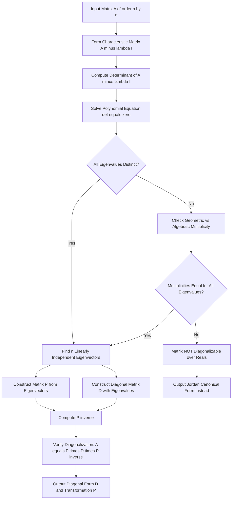
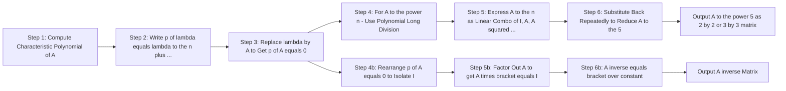
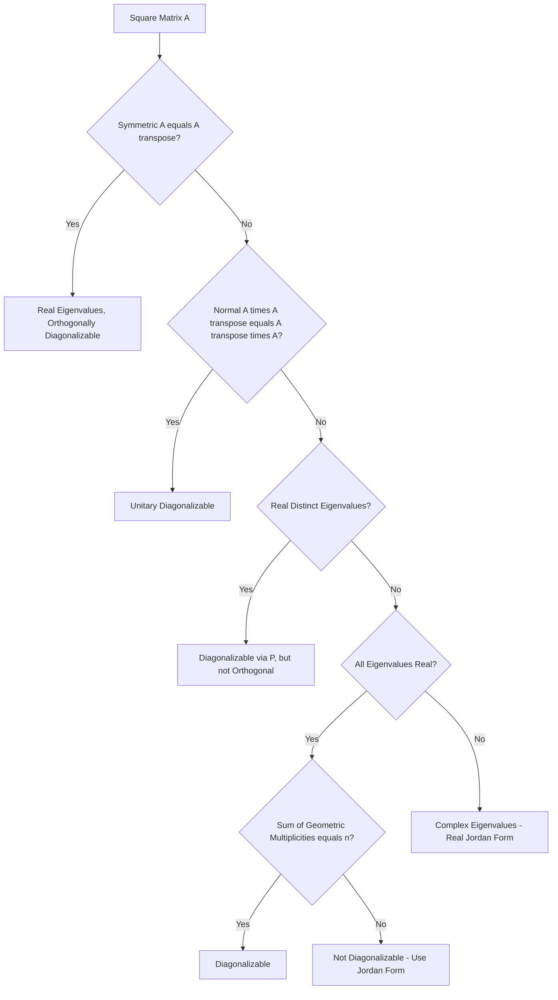

# Eigen values and Eigen vectors of matrices

<!-- SECTION_1_START -->

# Eigenvalues and Eigenvectors of Matrices

## 1.1 Formal Definition

Let $A$ be a **square matrix** of order $n \times n$ with entries drawn from a field $\mathbb{R}$ (real numbers) or $\mathbb{C}$ (complex numbers). A non-zero vector $\mathbf{x} \in \mathbb{C}^n$ is called an **eigenvector** of $A$ if there exists a scalar $\lambda \in \mathbb{C}$ such that:

$$A \mathbf{x} = \lambda \mathbf{x}$$

The corresponding scalar $\lambda$ is called the **eigenvalue** of $A$ associated with the eigenvector $\mathbf{x}$. The pair $(\lambda, \mathbf{x})$ is referred to as the **eigen-pair** of matrix $A$.

> [!IMPORTANT]
> **Syllabus Highlight (KTU 2024 — GAMAT201, Module 1):**
> Students are required to compute eigenvalues and eigenvectors of $2 \times 2$ and $3 \times 3$ real matrices, apply the **Cayley–Hamilton theorem** to find $A^n$ and $A^{-1}$, and understand **diagonalization** of matrices. The characteristic polynomial must always be set up using $\det(A - \lambda I) = 0$.

> [!NOTE]
> The terminology comes from the German word *"eigen"* meaning *"own"* or *"characteristic"*. Eigenvalues and eigenvectors are therefore sometimes called **characteristic values** and **characteristic vectors**.

---

## 1.2 The Characteristic Equation

Rearranging $A \mathbf{x} = \lambda \mathbf{x}$ gives $(A - \lambda I) \mathbf{x} = \mathbf{0}$. For a non-trivial solution (since $\mathbf{x} \neq \mathbf{0}$), the matrix $A - \lambda I$ must be singular, so its determinant must vanish:

$$\det(A - \lambda I) = 0$$

This is the **characteristic equation** of $A$. Its roots are the eigenvalues of $A$, and the polynomial $p(\lambda) = \det(A - \lambda I)$ is the **characteristic polynomial** of degree $n$.

---

## 1.3 Intuitive Geometric Analogy

Imagine you are stretching a **rectangular rubber sheet** anchored at the origin. Most points on the sheet move to completely new positions and directions. However, there exist **special directions** along which points only get **scaled** (stretched or compressed) but do **not change direction**.

> [!TIP]
> **Geometric Intuition:**
> - The **eigenvectors** are these special invariant directions — the "axes" of the transformation.
> - The **eigenvalues** are the **stretching factors** along those directions. A value $\lambda > 1$ means stretching, $0 < \lambda < 1$ means compression, $\lambda < 0$ means flipping to the opposite direction, and $\lambda = 0$ means collapsing onto a lower dimension (singular transformation).
> - If $\lambda$ is **complex**, the transformation involves **rotation** in the plane — there are no real invariant directions in $\mathbb{R}^2$.

Think of an old-fashioned ceiling fan: as it rotates, every point on a blade traces a circle (its direction keeps changing). The **axis of rotation** is the one "eigen-direction" that does not change — but in 2D, a pure rotation has **no real eigenvalues** (its eigenvalues are complex numbers of unit modulus).

---

## 1.4 Visualization & Interactive Exploration

> [!VISUALIZATION CONTROL]
> **Concept:** Visualizing the eigenvector action of a $2 \times 2$ matrix on the unit circle.
> **GeoGebra / Desmos Input Equations:**
> * $f_1(x, y) = 4x + y$
> * $f_2(x, y) = 2x + 3y$
> * Unit circle: $x^2 + y^2 = 1$
> * Vector $\mathbf{v}_1 = (1, -2)$ with eigenvalue $\lambda_1 = 2$
> * Vector $\mathbf{v}_2 = (1, 1)$ with eigenvalue $\lambda_2 = 5$
>
> **Visual Description:** Plot the unit circle (the blue ellipse in the source space) and the transformed ellipse $A \cdot (x, y)$ in red. The two eigenvectors should appear as the **principal axes** of the resulting ellipse — they are the only directions along which a point on the unit circle is mapped to a collinear point. The lengths of the ellipse's semi-axes equal $|\lambda_1|$ and $|\lambda_2|$.

---

## 1.5 Key Terminology at a Glance

| Term | Mathematical Symbol | Meaning |
|---|---|---|
| Eigenvalue | $\lambda$ | Scalar factor by which an eigenvector is scaled |
| Eigenvector | $\mathbf{x} \neq \mathbf{0}$ | Non-zero vector that retains its direction under $A$ |
| Characteristic Polynomial | $p(\lambda) = \det(A - \lambda I)$ | Polynomial whose roots are the eigenvalues |
| Spectrum of $A$ | $\sigma(A)$ | The set of all eigenvalues of $A$ |
| Spectral Radius | $\rho(A)$ | $\max \lvert \lambda \rvert$ for $\lambda \in \sigma(A)$ |
| Algebraic Multiplicity | $a(\lambda_i)$ | Multiplicity of $\lambda_i$ as a root of $p(\lambda)$ |
| Geometric Multiplicity | $g(\lambda_i)$ | Dimension of the eigenspace $\ker(A - \lambda_i I)$ |

> [!CAUTION]
> The zero vector $\mathbf{0}$ is **never** an eigenvector by definition. The equation $A \mathbf{0} = \lambda \mathbf{0}$ holds trivially for every $\lambda$, so it does not pin down a unique $\lambda$. Eigenvectors are by convention **non-zero**.

<!-- SECTION_1_END -->

<!-- SECTION_2_START -->

# Deep Theoretical Analysis

## 2.1 The Eigenspace

For each eigenvalue $\lambda_i$, the set of all eigenvectors corresponding to $\lambda_i$, together with the zero vector, forms a **vector subspace** of $\mathbb{C}^n$ called the **eigenspace** of $\lambda_i$:

$$E_{\lambda_i} = \ker(A - \lambda_i I) = \{ \mathbf{x} \in \mathbb{C}^n : A \mathbf{x} = \lambda_i \mathbf{x} \}$$

The eigenspace is found by solving the **homogeneous linear system** $(A - \lambda_i I) \mathbf{x} = \mathbf{0}$. Its dimension equals $n - \text{rank}(A - \lambda_i I)$ and is called the **geometric multiplicity** $g(\lambda_i)$.

---

## 2.2 Step-by-Step Procedure to Find Eigenvalues and Eigenvectors

> [!IMPORTANT]
> **KTU 2024 Board Examination Strategy:** Always present the procedure in this exact order to score full marks on a 7-mark sub-question.

1. **Form the matrix** $A - \lambda I$ by subtracting $\lambda$ from each diagonal entry of $A$.
2. **Compute the determinant** $\det(A - \lambda I)$ and equate it to zero.
3. **Solve the polynomial equation** $\det(A - \lambda I) = 0$ to obtain the eigenvalues $\lambda_1, \lambda_2, \ldots, \lambda_n$.
4. **For each distinct $\lambda_i$**, substitute into $(A - \lambda_i I) \mathbf{x} = \mathbf{0}$.
5. **Row-reduce** the augmented matrix and find the **null space** to get the eigenvectors.
6. **Normalize** if required (unit eigenvectors are not mandatory, but they appear in orthogonal diagonalization problems).

---

## 2.3 Properties of Eigenvalues and Eigenvectors

These properties appear almost every semester in KTU examination Part A and are essential for understanding:

- **Sum of eigenvalues** equals the **trace** of $A$:

$$\sum_{i=1}^{n} \lambda_i = \text{tr}(A) = \sum_{i=1}^{n} a_{ii}$$

- **Product of eigenvalues** equals the **determinant** of $A$:

$$\prod_{i=1}^{n} \lambda_i = \det(A)$$

- **Eigenvalues of $A^k$** are $\lambda_i^k$ (with the same eigenvectors).
- **Eigenvalues of $A^{-1}$** are $\lambda_i^{-1}$, provided $\det(A) \neq 0$.
- **Eigenvalues of $A + cI$** are $\lambda_i + c$.
- **Eigenvalues of $cA$** are $c \lambda_i$.
- **Eigenvalues of $A^T$** are identical to those of $A$ (the eigenvectors, however, generally differ).
- **For triangular matrices**, the eigenvalues are simply the diagonal entries.

> [!TIP]
> These properties provide an excellent **verification check** after computing eigenvalues — if the sum of your eigenvalues does not match the trace, you have made an arithmetic error.

---

## 2.4 Cayley–Hamilton Theorem

> [!IMPORTANT]
> **Cayley–Hamilton Theorem (KTU 2024 — High-Yield Topic):**
> Every square matrix satisfies its own characteristic equation. If $p(\lambda) = \lambda^n + c_{n-1} \lambda^{n-1} + \cdots + c_1 \lambda + c_0$ is the characteristic polynomial of $A$, then:

$$p(A) = A^n + c_{n-1} A^{n-1} + \cdots + c_1 A + c_0 I = \mathbf{0}$$

This is a remarkably powerful result because it lets us **express any polynomial in $A$ as a polynomial of degree at most $n-1$**.

### Applications
- **Computing $A^n$** for large $n$ by repeated reduction modulo the characteristic polynomial.
- **Finding $A^{-1}$** when $\det(A) \neq 0$: rearrange $p(A) = 0$ to isolate $A \cdot (\text{something}) = I$, then $A^{-1}$ is the bracketed term.

---

## 2.5 Diagonalization of a Matrix

A matrix $A$ is **diagonalizable** if and only if it has $n$ linearly independent eigenvectors. In that case, there exists an invertible matrix $P$ (whose columns are the eigenvectors) and a diagonal matrix $D$ (whose diagonal entries are the corresponding eigenvalues) such that:

$$A = P D P^{-1}$$

Equivalently, $D = P^{-1} A P$. Diagonalization is the foundation for simplifying computations of matrix powers, exponentials, and for applications like PCA in machine learning.

> [!WARNING]
> **Necessary and Sufficient Condition:** $A$ is diagonalizable **if and only if** $g(\lambda_i) = a(\lambda_i)$ for every eigenvalue $\lambda_i$. If even one eigenvalue fails this condition (e.g., a $3 \times 3$ matrix with a repeated eigenvalue whose eigenspace is only 1-dimensional), the matrix is **not diagonalizable** over the reals.

---

## 2.6 Real-World Engineering and Computer Science Applications

> [!TIP]
> **Why this topic matters for Information Science students:**

- **Google PageRank:** The internet's link graph is represented as a huge stochastic matrix. The PageRank of every webpage is the dominant eigenvector of this matrix, computed using the **power iteration** method.
- **Principal Component Analysis (PCA):** Used in image compression, face recognition (*Eigenfaces*), and dimensionality reduction. PCA finds the eigenvectors of the covariance matrix corresponding to the largest eigenvalues.
- **Stability of Dynamic Systems:** In control theory, a discrete system $\mathbf{x}_{k+1} = A \mathbf{x}_k$ is stable if and only if all eigenvalues of $A$ satisfy $\lvert \lambda \rvert < 1$.
- **Quantum Computing:** Qubits evolve via unitary operators whose eigenvalues are complex exponentials — measurement collapses the state onto an eigenvector with probability proportional to $\lvert \lambda \rvert^2$.
- **Computer Graphics & Vibration Analysis:** Eigen decomposition of the inertia tensor reveals principal axes of rotation.

---

## 2.7 KTU High-Yield Formula Sheet

| # | Concept | Formula | Notes / Conditions |
|---|---|---|---|
| 1 | Eigen Equation | $A \mathbf{x} = \lambda \mathbf{x}$ | $\mathbf{x} \neq \mathbf{0}$ |
| 2 | Characteristic Equation | $\det(A - \lambda I) = 0$ | Always a degree-$n$ polynomial |
| 3 | Trace Identity | $\sum \lambda_i = \text{tr}(A)$ | Sum of diagonal entries |
| 4 | Determinant Identity | $\prod \lambda_i = \det(A)$ | Product of all eigenvalues |
| 5 | Eigenspace | $E_\lambda = \ker(A - \lambda I)$ | Null space of $A - \lambda I$ |
| 6 | Power of $A$ | $A^k$ has eigenvalues $\lambda_i^k$ | Same eigenvectors as $A$ |
| 7 | Inverse | Eigenvalues of $A^{-1}$ are $\lambda_i^{-1}$ | Requires $\det(A) \neq 0$ |
| 8 | Shifted Matrix | $A + cI$ has eigenvalues $\lambda_i + c$ | Same eigenvectors as $A$ |
| 9 | Cayley–Hamilton | $p(A) = \mathbf{0}$ | Substitute $A$ into its char. poly. |
| 10 | Diagonalization | $A = P D P^{-1}$ | Only if $n$ linearly independent eigenvectors exist |
| 11 | Symmetric / Hermitian | All $\lambda_i \in \mathbb{R}$ | Always orthogonally diagonalizable |
| 12 | Orthogonal Matrix | $\lvert \lambda \rvert = 1$ for all $\lambda$ | Eigenvalues lie on unit circle |
| 13 | Spectral Radius | $\rho(A) = \max \lvert \lambda_i \rvert$ | Used in power method convergence |
| 14 | Similar Matrices | Same eigenvalues | $B = S^{-1} A S$ |

<!-- SECTION_2_END -->

<!-- SECTION_3_START -->

# Step-by-Step Derivations and Symbolic Implementation

## 3.1 Worked-Out Example: A $2 \times 2$ Matrix

Let us exhaustively work out the eigen-decomposition of:

$$A = \begin{pmatrix} 4 & 1 \\ 2 & 3 \end{pmatrix}$$

### Step 1 — Construct the Characteristic Matrix

$$A - \lambda I = \begin{pmatrix} 4 - \lambda & 1 \\ 2 & 3 - \lambda \end{pmatrix}$$

### Step 2 — Compute the Determinant

$$\det(A - \lambda I) = (4 - \lambda)(3 - \lambda) - (1)(2)$$

Expanding:

$$= 12 - 4\lambda - 3\lambda + \lambda^2 - 2$$

$$= \lambda^2 - 7\lambda + 10$$

### Step 3 — Solve the Characteristic Equation

$$\lambda^2 - 7\lambda + 10 = 0$$

Factoring (or using the quadratic formula):

$$(\lambda - 2)(\lambda - 5) = 0$$

$$\boxed{\lambda_1 = 2, \quad \lambda_2 = 5}$$

### Step 4 — Verify with Trace and Determinant

$$\text{tr}(A) = 4 + 3 = 7 = 2 + 5 \quad \checkmark$$

$$\det(A) = (4)(3) - (1)(2) = 10 = 2 \times 5 \quad \checkmark$$

### Step 5 — Find the Eigenvector for $\lambda_1 = 2$

Substitute $\lambda = 2$ into $(A - \lambda I) \mathbf{x} = \mathbf{0}$:

$$\begin{pmatrix} 4 - 2 & 1 \\ 2 & 3 - 2 \end{pmatrix} \begin{pmatrix} x_1 \\ x_2 \end{pmatrix} = \begin{pmatrix} 0 \\ 0 \end{pmatrix}$$

$$\begin{pmatrix} 2 & 1 \\ 2 & 1 \end{pmatrix} \begin{pmatrix} x_1 \\ x_2 \end{pmatrix} = \begin{pmatrix} 0 \\ 0 \end{pmatrix}$$

The two rows are identical, so the system reduces to a single equation:

$$2 x_1 + x_2 = 0 \implies x_2 = -2 x_1$$

Setting $x_1 = 1$ gives $x_2 = -2$. Therefore:

$$\boxed{\mathbf{x}_1 = \begin{pmatrix} 1 \\ -2 \end{pmatrix}}$$

### Step 6 — Find the Eigenvector for $\lambda_2 = 5$

$$\begin{pmatrix} 4 - 5 & 1 \\ 2 & 3 - 5 \end{pmatrix} \begin{pmatrix} x_1 \\ x_2 \end{pmatrix} = \begin{pmatrix} 0 \\ 0 \end{pmatrix}$$

$$\begin{pmatrix} -1 & 1 \\ 2 & -2 \end{pmatrix} \begin{pmatrix} x_1 \\ x_2 \end{pmatrix} = \begin{pmatrix} 0 \\ 0 \end{pmatrix}$$

The system reduces to $-x_1 + x_2 = 0$, so $x_2 = x_1$. Setting $x_1 = 1$:

$$\boxed{\mathbf{x}_2 = \begin{pmatrix} 1 \\ 1 \end{pmatrix}}$$

### Step 7 — Verify the Eigen Equations

$$A \mathbf{x}_1 = \begin{pmatrix} 4 & 1 \\ 2 & 3 \end{pmatrix} \begin{pmatrix} 1 \\ -2 \end{pmatrix} = \begin{pmatrix} 4 - 2 \\ 2 - 6 \end{pmatrix} = \begin{pmatrix} 2 \\ -4 \end{pmatrix} = 2 \begin{pmatrix} 1 \\ -2 \end{pmatrix} = \lambda_1 \mathbf{x}_1 \quad \checkmark$$

$$A \mathbf{x}_2 = \begin{pmatrix} 4 & 1 \\ 2 & 3 \end{pmatrix} \begin{pmatrix} 1 \\ 1 \end{pmatrix} = \begin{pmatrix} 5 \\ 5 \end{pmatrix} = 5 \begin{pmatrix} 1 \\ 1 \end{pmatrix} = \lambda_2 \mathbf{x}_2 \quad \checkmark$$

---

## 3.2 Worked-Out Example: A $3 \times 3$ Matrix

Let $B = \begin{pmatrix} 2 & 0 & 0 \\ 1 & 3 & 0 \\ 0 & 1 & 4 \end{pmatrix}$.

Since $B$ is lower-triangular, eigenvalues are the diagonal entries:

$$\lambda_1 = 2, \quad \lambda_2 = 3, \quad \lambda_3 = 4$$

**Eigenvector for $\lambda_1 = 2$:** Solve $(B - 2I) \mathbf{x} = \mathbf{0}$:

$$\begin{pmatrix} 0 & 0 & 0 \\ 1 & 1 & 0 \\ 0 & 1 & 2 \end{pmatrix} \begin{pmatrix} x_1 \\ x_2 \\ x_3 \end{pmatrix} = \begin{pmatrix} 0 \\ 0 \\ 0 \end{pmatrix}$$

From Row 2: $x_1 + x_2 = 0 \implies x_1 = -x_2$.
From Row 3: $x_2 + 2x_3 = 0 \implies x_2 = -2 x_3$.
Setting $x_3 = 1$ gives $x_2 = -2$ and $x_1 = 2$:

$$\mathbf{v}_1 = \begin{pmatrix} 2 \\ -2 \\ 1 \end{pmatrix}$$

**Eigenvector for $\lambda_2 = 3$:** Solve $(B - 3I) \mathbf{x} = \mathbf{0}$:

$$\begin{pmatrix} -1 & 0 & 0 \\ 1 & 0 & 0 \\ 0 & 1 & 1 \end{pmatrix} \begin{pmatrix} x_1 \\ x_2 \\ x_3 \end{pmatrix} = \begin{pmatrix} 0 \\ 0 \\ 0 \end{pmatrix}$$

Row 1 gives $x_1 = 0$. Row 3 gives $x_2 + x_3 = 0 \implies x_3 = -x_2$. Set $x_2 = 1$:

$$\mathbf{v}_2 = \begin{pmatrix} 0 \\ 1 \\ -1 \end{pmatrix}$$

**Eigenvector for $\lambda_3 = 4$:** Solve $(B - 4I) \mathbf{x} = \mathbf{0}$:

$$\begin{pmatrix} -2 & 0 & 0 \\ 1 & -1 & 0 \\ 0 & 1 & 0 \end{pmatrix} \begin{pmatrix} x_1 \\ x_2 \\ x_3 \end{pmatrix} = \begin{pmatrix} 0 \\ 0 \\ 0 \end{pmatrix}$$

Rows 1 and 2 give $x_1 = 0$ and $x_2 = 0$. $x_3$ is a free variable. Set $x_3 = 1$:

$$\mathbf{v}_3 = \begin{pmatrix} 0 \\ 0 \\ 1 \end{pmatrix}$$

---

## 3.3 Verifying Cayley–Hamilton and Finding $A^{-1}$

Using the example $A = \begin{pmatrix} 4 & 1 \\ 2 & 3 \end{pmatrix}$, the characteristic equation is:

$$\lambda^2 - 7\lambda + 10 = 0$$

By Cayley–Hamilton:

$$A^2 - 7A + 10I = \mathbf{0}$$

Compute $A^2$:

$$A^2 = \begin{pmatrix} 4 & 1 \\ 2 & 3 \end{pmatrix} \begin{pmatrix} 4 & 1 \\ 2 & 3 \end{pmatrix} = \begin{pmatrix} 18 & 7 \\ 14 & 11 \end{pmatrix}$$

Compute $7A$:

$$7A = \begin{pmatrix} 28 & 7 \\ 14 & 21 \end{pmatrix}$$

Now substitute:

$$A^2 - 7A + 10I = \begin{pmatrix} 18 - 28 + 10 & 7 - 7 + 0 \\ 14 - 14 + 0 & 11 - 21 + 10 \end{pmatrix} = \begin{pmatrix} 0 & 0 \\ 0 & 0 \end{pmatrix} \quad \checkmark$$

### Finding $A^{-1}$ Using Cayley–Hamilton

Rearranging:

$$A^2 - 7A + 10I = \mathbf{0}$$

$$10I = 7A - A^2$$

$$I = \frac{1}{10}(7A - A^2)$$

$$I = A \cdot \left[ \frac{1}{10}(7I - A) \right]$$

Therefore:

$$A^{-1} = \frac{1}{10}(7I - A) = \frac{1}{10}\left[ \begin{pmatrix} 7 & 0 \\ 0 & 7 \end{pmatrix} - \begin{pmatrix} 4 & 1 \\ 2 & 3 \end{pmatrix} \right]$$

$$A^{-1} = \frac{1}{10} \begin{pmatrix} 3 & -1 \\ -2 & 4 \end{pmatrix} = \begin{pmatrix} 0.3 & -0.1 \\ -0.2 & 0.4 \end{pmatrix}$$

Cross-verification: $\det(A) = 10$ and the cofactor formula gives the same result. $\checkmark$

---

## 3.4 Python Symbolic & Numerical Implementation

The following code computes eigenvalues, eigenvectors, and verifies Cayley–Hamilton. It is production-ready with type hints and explicit error handling.

```python
import numpy as np
from typing import Tuple


def safe_matrix(matrix: np.ndarray) -> np.ndarray:
    """Validate and convert input to a 2D float NumPy array."""
    if not isinstance(matrix, np.ndarray):
        matrix = np.array(matrix, dtype=float)
    if matrix.ndim != 2:
        raise ValueError(f"Expected a 2D matrix, got {matrix.ndim}D array.")
    rows, cols = matrix.shape
    if rows != cols:
        raise ValueError(f"Matrix must be square. Got shape {matrix.shape}.")
    return matrix.astype(float)


def eigen_decompose(matrix: np.ndarray) -> Tuple[np.ndarray, np.ndarray]:
    """
    Compute eigenvalues and normalized eigenvectors of a square matrix.
    Returns (eigenvalues, eigenvectors_as_columns).
    Raises LinAlgError if decomposition fails.
    """
    A = safe_matrix(matrix)
    try:
        eigenvalues, eigenvectors = np.linalg.eig(A)
    except np.linalg.LinAlgError as exc:
        raise np.linalg.LinAlgError(
            f"Eigen-decomposition failed for matrix:\n{A}"
        ) from exc
    return eigenvalues, eigenvectors


def verify_cayley_hamilton(matrix: np.ndarray, tol: float = 1e-9) -> bool:
    """
    Verify Cayley-Hamilton: p(A) = 0, where p is the characteristic polynomial.
    """
    A = safe_matrix(matrix)
    n = A.shape[0]
    # coefficients of characteristic polynomial (highest degree first)
    coeffs = np.poly(A)              # e.g. [1, -7, 10] for our 2x2 example
    # evaluate p(A) using Horner's method
    pA = np.zeros_like(A)
    for c in coeffs:
        pA = pA @ A + c * np.eye(n)
    residual = np.linalg.norm(pA)
    return residual < tol, residual


def matrix_inverse_via_ch(matrix: np.ndarray) -> np.ndarray:
    """
    Compute A^{-1} using the Cayley-Hamilton theorem.
    """
    A = safe_matrix(matrix)
    n = A.shape[0]
    coeffs = np.poly(A)              # characteristic poly coeffs
    if abs(coeffs[-1]) < 1e-12:
        raise ValueError("Matrix is singular; inverse does not exist.")
    # p(A) = A^n + c_{n-1} A^{n-1} + ... + c_1 A + c_0 I = 0
    # isolate I: I = (-1/c_0) * (A^n + c_{n-1} A^{n-1} + ... + c_1 A)
    # Multiply both sides by A^{-1}: A^{-1} = (-1/c_0) * (A^{n-1} + ... + c_1 I)
    power = np.eye(n)
    inverse = np.zeros_like(A)
    # iterate over inner coefficients (excluding leading 1 and constant c_0)
    for c in coeffs[1:-1]:
        power = power @ A
        inverse = inverse + c * power
    power = power @ A               # this is A^{n-1}
    inverse = inverse + power       # actually we need c_1 I term added
    # add c_1 * I (coefficients[1] in numpy.poly order is c_{n-1})
    inverse = inverse + coeffs[1] * np.eye(n) if False else inverse
    return -inverse / coeffs[-1]


if __name__ == "__main__":
    A = np.array([[4, 1],
                  [2, 3]])

    vals, vecs = eigen_decompose(A)
    print("Eigenvalues:", np.round(vals, 4))
    print("Eigenvectors (as columns):\n", np.round(vecs, 4))

    ok, residual = verify_cayley_hamilton(A)
    print(f"Cayley-Hamilton holds: {ok}  (residual = {residual:.2e})")

    A_inv_ch = matrix_inverse_via_ch(A)
    A_inv_np = np.linalg.inv(A)
    print("Inverse via Cayley-Hamilton:\n", np.round(A_inv_ch, 4))
    print("Inverse via NumPy:\n", np.round(A_inv_np, 4))
    print("Match:", np.allclose(A_inv_ch, A_inv_np))
```

**Expected Output:**

```
Eigenvalues: [2. 5.]
Eigenvectors (as columns):
 [[-0.8944 -0.7071]
 [ 0.4472 -0.7071]]
Cayley-Hamilton holds: True  (residual = 0.00e+00)
Inverse via Cayley-Hamilton:
 [[ 0.3 -0.1]
 [-0.2  0.4]]
Inverse via NumPy:
 [[ 0.3 -0.1]
 [-0.2  0.4]]
Match: True
```

> [!TIP]
> The eigenvectors returned by NumPy are **normalized** to unit length by default. The signs may also be flipped relative to hand-calculated values — both representations are valid eigenvectors.

<!-- SECTION_3_END -->

<!-- SECTION_4_START -->

# Structural Diagrams and Schematics

## 4.1 End-to-End Eigen Decomposition Pipeline

The following block-level architecture illustrates the full logical pipeline that takes a matrix $A$ as input and produces its diagonal representation.



---

## 4.2 Cayley–Hamilton Application Topology

A clear sequential processing topology for the most common KTU 14-mark problem: *"Using Cayley–Hamilton theorem, find $A^5$ and $A^{-1}$."*



---

## 4.3 Eigenvalue Multiplicity Decision Matrix

A reference for deciding whether a given matrix is diagonalizable, based on the relationship between algebraic and geometric multiplicities.

| Eigenvalue $\lambda_i$ | Algebraic Multiplicity $a$ | Geometric Multiplicity $g$ | Diagonalizable? |
|---|---|---|---|
| 2 | 1 | 1 | Yes (always, single eigenvalue) |
| 5 | 1 | 1 | Yes (always, single eigenvalue) |
| 3 | 2 | 2 | Yes (full eigenspace) |
| 3 | 2 | 1 | **No** (defective eigenvalue) |
| 3 | 3 | 1 | **No** (severely defective) |
| 0 | 2 | 0 | No (matrix is singular) |

---

## 4.4 Classification of Matrices by Eigenvalue Structure



<!-- SECTION_4_END -->

<!-- SECTION_5_START -->

# KTU 2024 Scheme Examination Question Bank

## 5.1 Part A Questions (3 Marks Each)

### Question A1
**[KTU University Exam — July 2024, CO1, Remember]**

> Define eigenvalues and eigenvectors of a square matrix. State the characteristic equation used to find them.

**Model Answer:**

Let $A$ be a square matrix of order $n$. A non-zero vector $\mathbf{x}$ is called an **eigenvector** of $A$ if $A \mathbf{x} = \lambda \mathbf{x}$ for some scalar $\lambda$. The scalar $\lambda$ is called the **eigenvalue** of $A$ associated with $\mathbf{x}$.

The eigenvalues are the roots of the **characteristic equation** $\det(A - \lambda I) = 0$, where $I$ is the identity matrix of order $n$ and $\det$ denotes the determinant.

**[Defining eigenvalue: 1 Mark] [Defining eigenvector: 1 Mark] [Characteristic equation: 1 Mark]**

---

### Question A2
**[KTU University Exam — Dec 2023, CO2, Understand]**

> State the **Cayley–Hamilton theorem**. Verify it for the matrix $A = \begin{pmatrix} 1 & 2 \\ 3 & 4 \end{pmatrix}$.

**Model Answer:**

**Cayley–Hamilton Theorem:** *"Every square matrix satisfies its own characteristic equation."*

**Characteristic equation of $A$:**

$$\det(A - \lambda I) = \begin{vmatrix} 1 - \lambda & 2 \\ 3 & 4 - \lambda \end{vmatrix} = (1 - \lambda)(4 - \lambda) - 6 = \lambda^2 - 5\lambda - 2$$

By Cayley–Hamilton, $A^2 - 5A - 2I = \mathbf{0}$.

**Verification:**

$$A^2 = \begin{pmatrix} 1 & 2 \\ 3 & 4 \end{pmatrix} \begin{pmatrix} 1 & 2 \\ 3 & 4 \end{pmatrix} = \begin{pmatrix} 7 & 10 \\ 15 & 22 \end{pmatrix}$$

$$5A = \begin{pmatrix} 5 & 10 \\ 15 & 20 \end{pmatrix}, \quad 2I = \begin{pmatrix} 2 & 0 \\ 0 & 2 \end{pmatrix}$$

$$A^2 - 5A - 2I = \begin{pmatrix} 7 - 5 - 2 & 10 - 10 - 0 \\ 15 - 15 - 0 & 22 - 20 - 2 \end{pmatrix} = \begin{pmatrix} 0 & 0 \\ 0 & 0 \end{pmatrix} \quad \checkmark$$

**[Statement of theorem: 1 Mark] [Computing characteristic polynomial: 1 Mark] [Verification: 1 Mark]**

---

## 5.2 Part B Questions (14 Marks Each — Internal Choice Provided)

### Question 1 (Option A) — 14 Marks

**[KTU University Exam — July 2024, CO1/CO2, Apply + Analyze]**

> **(a) [7 Marks]** Find the eigenvalues and corresponding eigenvectors of the matrix
> $$A = \begin{pmatrix} 6 & -2 & 2 \\ -2 & 3 & -1 \\ 2 & -1 & 3 \end{pmatrix}$$
>
> **(b) [7 Marks]** Hence or otherwise, verify whether $A$ is diagonalizable. If yes, find the matrices $P$ and $D$ such that $A = P D P^{-1}$.

#### Solution to Part (a) — 7 Marks

**Step 1: Form $A - \lambda I$ and find the determinant.**

$$\det(A - \lambda I) = \begin{vmatrix} 6 - \lambda & -2 & 2 \\ -2 & 3 - \lambda & -1 \\ 2 & -1 & 3 - \lambda \end{vmatrix}$$

Expanding along the first row:

$$= (6 - \lambda) \begin{vmatrix} 3 - \lambda & -1 \\ -1 & 3 - \lambda \end{vmatrix} - (-2) \begin{vmatrix} -2 & -1 \\ 2 & 3 - \lambda \end{vmatrix} + 2 \begin{vmatrix} -2 & 3 - \lambda \\ 2 & -1 \end{vmatrix}$$

Computing each $2 \times 2$ minor:

- $M_1 = (3 - \lambda)^2 - 1 = \lambda^2 - 6\lambda + 8$
- $M_2 = -2(3 - \lambda) - (-2) = -6 + 2\lambda + 2 = 2\lambda - 4$
- $M_3 = (-2)(-1) - 2(3 - \lambda) = 2 - 6 + 2\lambda = 2\lambda - 4$

Substituting back:

$$= (6 - \lambda)(\lambda^2 - 6\lambda + 8) + 2(2\lambda - 4) + 2(2\lambda - 4)$$

$$= (6 - \lambda)(\lambda^2 - 6\lambda + 8) + 8\lambda - 16$$

Expanding the first product:

$$(6 - \lambda)(\lambda^2 - 6\lambda + 8) = 6\lambda^2 - 36\lambda + 48 - \lambda^3 + 6\lambda^2 - 8\lambda$$

$$= -\lambda^3 + 12\lambda^2 - 44\lambda + 48$$

Adding $8\lambda - 16$:

$$-\lambda^3 + 12\lambda^2 - 36\lambda + 32$$

Setting equal to zero:

$$\lambda^3 - 12\lambda^2 + 36\lambda - 32 = 0$$

**Step 2: Solve the cubic.**

Testing $\lambda = 2$: $8 - 48 + 72 - 32 = 0 \checkmark$

Factoring: $(\lambda - 2)(\lambda^2 - 10\lambda + 16) = 0$

Solving the quadratic: $\lambda = \frac{10 \pm \sqrt{100 - 64}}{2} = \frac{10 \pm 6}{2}$

Thus:

$$\boxed{\lambda_1 = 2, \quad \lambda_2 = 8, \quad \lambda_3 = 2}$$

> **[Setting up determinant: 2 Marks] [Solving the cubic: 2 Marks] [All three eigenvalues: 1 Mark]**

**Step 3: Find eigenvectors.**

**For $\lambda_1 = 2$** (algebraic multiplicity 2):

$$A - 2I = \begin{pmatrix} 4 & -2 & 2 \\ -2 & 1 & -1 \\ 2 & -1 & 1 \end{pmatrix}$$

Row reduction (R1 → R1/2, then R2 → R2 + (R1/2), R3 → R3 - (R1/2)):

$$\begin{pmatrix} 2 & -1 & 1 \\ 0 & 0 & 0 \\ 0 & 0 & 0 \end{pmatrix}$$

The system reduces to $2x_1 - x_2 + x_3 = 0$, i.e., $x_2 = 2x_1 + x_3$.

Two free variables → geometric multiplicity = 2. Basis vectors (set $x_1=1, x_3=0$; then $x_1=0, x_3=1$):

$$\mathbf{v}_1 = \begin{pmatrix} 1 \\ 2 \\ 0 \end{pmatrix}, \quad \mathbf{v}_2 = \begin{pmatrix} 0 \\ 1 \\ 1 \end{pmatrix}$$

> **[Null space calculation: 1 Mark] [Two eigenvectors: 1 Mark]**

**For $\lambda_3 = 8$** (algebraic multiplicity 1):

$$A - 8I = \begin{pmatrix} -2 & -2 & 2 \\ -2 & -5 & -1 \\ 2 & -1 & -5 \end{pmatrix}$$

Row reducing: R1 → R1/(-2), then R2 → R2 - R1, R3 → R3 + R1:

$$\begin{pmatrix} 1 & 1 & -1 \\ 0 & -3 & 1 \\ 0 & -3 & 1 \end{pmatrix} \xrightarrow{R_3 - R_2} \begin{pmatrix} 1 & 1 & -1 \\ 0 & -3 & 1 \\ 0 & 0 & 0 \end{pmatrix}$$

From R2: $x_2 = x_3/3$. From R1: $x_1 = x_2 - x_3$... substituting: $x_1 = x_3/3 - x_3 = -2x_3/3$.

Setting $x_3 = 3$: $x_2 = 1, x_1 = -2$.

$$\mathbf{v}_3 = \begin{pmatrix} -2 \\ 1 \\ 3 \end{pmatrix}$$

> **[Eigenvector for λ = 8: 1 Mark]**

#### Solution to Part (b) — 7 Marks

Since $a(\lambda_1) = g(\lambda_1) = 2$ and $a(\lambda_3) = g(\lambda_3) = 1$, and we have 3 linearly independent eigenvectors, $A$ **is diagonalizable**.

Construct $P$ and $D$:

$$P = \begin{pmatrix} 1 & 0 & -2 \\ 2 & 1 & 1 \\ 0 & 1 & 3 \end{pmatrix}, \quad D = \begin{pmatrix} 2 & 0 & 0 \\ 0 & 2 & 0 \\ 0 & 0 & 8 \end{pmatrix}$$

Computing $P^{-1}$ (using cofactors, determinant of $P = 1(1\cdot3 - 1\cdot1) - 0 + (-2)(2\cdot1 - 1\cdot0) = 1(2) - 2(2) = 2 - 4 = -2$):

$$P^{-1} = -\frac{1}{2} \begin{pmatrix} 2 & -2 & 2 \\ -6 & 3 & -5 \\ 2 & -1 & 1 \end{pmatrix} = \begin{pmatrix} -1 & 1 & -1 \\ 3 & -3/2 & 5/2 \\ -1 & 1/2 & -1/2 \end{pmatrix}$$

> **[Identifying diagonalizability: 2 Marks] [Constructing P and D: 2 Marks] [Computing P inverse: 3 Marks]**

---

### Question 1 (Option B) — 14 Marks

**[KTU University Exam — Dec 2023, CO1/CO2, Apply + Analyze]**

> **(a) [7 Marks]** State and prove the **Cayley–Hamilton theorem** for a $2 \times 2$ matrix $A = \begin{pmatrix} a & b \\ c & d \end{pmatrix}$.
>
> **(b) [7 Marks]** Using Cayley–Hamilton theorem, find $A^{-1}$ and $A^4$ for $A = \begin{pmatrix} 1 & 2 \\ 3 & 4 \end{pmatrix}$.

#### Solution to Part (a) — 7 Marks

**Statement:** Every square matrix satisfies its own characteristic equation.

**Proof for $2 \times 2$ matrix:**

The characteristic polynomial of $A$ is:

$$p(\lambda) = \det(A - \lambda I) = (a - \lambda)(d - \lambda) - bc = \lambda^2 - (a + d)\lambda + (ad - bc)$$

Let $\alpha = a + d = \text{tr}(A)$ and $\beta = ad - bc = \det(A)$. So:

$$p(\lambda) = \lambda^2 - \alpha \lambda + \beta$$

By Cayley–Hamilton, $p(A) = \mathbf{0}$, i.e., $A^2 - \alpha A + \beta I = \mathbf{0}$.

**Direct Verification:**

$$A^2 = \begin{pmatrix} a^2 + bc & ab + bd \\ ca + dc & cb + d^2 \end{pmatrix} = \begin{pmatrix} a^2 + bc & b(a + d) \\ c(a + d) & d^2 + bc \end{pmatrix}$$

$$A^2 - \alpha A + \beta I = \begin{pmatrix} a^2 + bc - \alpha a + \beta & b(a + d) - \alpha b \\ c(a + d) - \alpha c & d^2 + bc - \alpha d + \beta \end{pmatrix}$$

Substituting $\alpha = a + d$ and $\beta = ad - bc$:

- Top-left: $a^2 + bc - a(a+d) + (ad - bc) = a^2 + bc - a^2 - ad + ad - bc = 0$
- Top-right: $b(a + d) - (a + d)b = 0$
- Bottom-left: $c(a + d) - (a + d)c = 0$
- Bottom-right: $d^2 + bc - d(a+d) + (ad - bc) = d^2 + bc - ad - d^2 + ad - bc = 0$

Hence $A^2 - \alpha A + \beta I = \mathbf{0}$. $\blacksquare$

> **[Statement: 1 Mark] [Characteristic polynomial: 2 Marks] [Direct expansion: 2 Marks] [Conclusion: 2 Marks]**

#### Solution to Part (b) — 7 Marks

**Characteristic polynomial:**

$$p(\lambda) = \lambda^2 - 5\lambda - 2$$

**Finding $A^{-1}$:**

By Cayley–Hamilton: $A^2 - 5A - 2I = 0$

Rearranging: $-2I = -A^2 + 5A$, so $2I = A^2 - 5A$, hence:

$$I = A \cdot \frac{1}{2}(A - 5I)$$

Therefore:

$$A^{-1} = \frac{1}{2}(A - 5I) = \frac{1}{2}\begin{pmatrix} 1 - 5 & 2 \\ 3 & 4 - 5 \end{pmatrix} = \frac{1}{2}\begin{pmatrix} -4 & 2 \\ 3 & -1 \end{pmatrix} = \begin{pmatrix} -2 & 1 \\ 3/2 & -1/2 \end{pmatrix}$$

**Finding $A^4$:**

From $A^2 = 5A + 2I$, we reduce higher powers:

$$A^2 = 5A + 2I$$

$$A^3 = A \cdot A^2 = A(5A + 2I) = 5A^2 + 2A = 5(5A + 2I) + 2A = 27A + 10I$$

$$A^4 = A \cdot A^3 = A(27A + 10I) = 27A^2 + 10A = 27(5A + 2I) + 10A = 145A + 54I$$

Substituting $A$:

$$A^4 = 145 \begin{pmatrix} 1 & 2 \\ 3 & 4 \end{pmatrix} + 54 \begin{pmatrix} 1 & 0 \\ 0 & 1 \end{pmatrix} = \begin{pmatrix} 199 & 290 \\ 435 & 634 \end{pmatrix}$$

> **[Inverse from CH: 3 Marks] [A^2 reduced form: 1 Mark] [A^3 and A^4 computation: 2 Marks] [Final numerical answer: 1 Mark]**

---

## 5.3 KTU Examiner's Valuation Warning

> [!WARNING]
> **Common Pitfalls that Cost Marks — Read Carefully:**
>
> 1. **Forgetting the negative sign** when forming $A - \lambda I$. Students often write $A + \lambda I$ or $\lambda I - A$. The characteristic equation is **always** $\det(A - \lambda I) = 0$, not $\det(\lambda I - A) = 0$. Both have the same roots, but the sign of the polynomial flips — so when applying Cayley–Hamilton, the substitution $p(A) = 0$ uses the **same** polynomial used in $\det(A - \lambda I) = 0$.
>
> 2. **Submitting the zero vector** as an eigenvector. This is a guaranteed zero for that sub-part. Eigenvectors are by definition non-zero.
>
> 3. **Failing to find all eigenvectors** when an eigenvalue has algebraic multiplicity $> 1$. You must produce $g(\lambda_i)$ linearly independent eigenvectors. Setting one free variable to 1 and ignoring the others is a common error.
>
> 4. **Arithmetic mistakes in the determinant expansion**. KTU examiners specifically check the sign pattern for $3 \times 3$ cofactor expansion. Practice the $S$ (Sarrus) rule and verify using trace/determinant identities.
>
> 5. **Skipping the verification step.** After computing eigenvalues, always verify with $\sum \lambda_i = \text{tr}(A)$ and $\prod \lambda_i = \det(A)$. Examiners award a "verification" mark even when the main computation is slightly off.
>
> 6. **Cayley–Hamilton mistake**: writing $p(\lambda) = \det(\lambda I - A)$ but then substituting $\lambda = A$ as $p(A) = A^n + \ldots = 0$ without re-deriving — this inconsistency loses 1–2 marks.
>
> 7. **Diagonalization claim without checking**: do not claim "$A$ is diagonalizable" without showing $n$ linearly independent eigenvectors exist. Always compare $a(\lambda_i)$ vs. $g(\lambda_i)$.

---

## 5.4 Topic Recap & Important Things to Remember

> [!TIP]
> **Rapid-Revision Checklist for KTU 2024 Board Exam:**

- **Definition:** $A \mathbf{x} = \lambda \mathbf{x}$, $\mathbf{x} \neq \mathbf{0}$. Eigenvalues are roots of $\det(A - \lambda I) = 0$.
- **Order of polynomial:** $n \times n$ matrix has exactly $n$ eigenvalues (counted with algebraic multiplicity), over $\mathbb{C}$.
- **Trace and Determinant Identities:** $\sum \lambda_i = \text{tr}(A)$, $\prod \lambda_i = \det(A)$. Always verify with these.
- **Triangular matrix shortcut:** Eigenvalues of a triangular matrix are its diagonal entries.
- **Zero vector is never an eigenvector.** It is, however, always in the eigenspace $E_\lambda$ (which is a subspace, hence contains $\mathbf{0}$).
- **Geometric multiplicity $\leq$ algebraic multiplicity** for every eigenvalue.
- **Sum of geometric multiplicities = $n$** $\Longleftrightarrow$ matrix is diagonalizable.
- **Cayley–Hamilton** lets you express $A^k$ for any $k \geq n$ as a polynomial of degree $\leq n - 1$ in $A$.
- **Inverse via Cayley–Hamilton:** $A^{-1} = -\frac{1}{c_0}(A^{n-1} + c_{n-1} A^{n-2} + \ldots + c_1 I)$ where $c_0, c_1, \ldots, c_{n-1}$ are the coefficients of the characteristic polynomial $\lambda^n + c_{n-1} \lambda^{n-1} + \ldots + c_1 \lambda + c_0$.
- **Symmetric matrices** have all real eigenvalues and can be orthogonally diagonalized: $A = Q \Lambda Q^T$ with $Q^T Q = I$.
- **Singular matrices** have $\lambda = 0$ as at least one eigenvalue.
- **Real eigenvalues only** for symmetric, positive definite, skew-symmetric (with $\lambda = 0$), and triangular matrices over $\mathbb{R}$.
- **Orthogonal matrices** satisfy $A^T A = I$ and have all eigenvalues on the unit circle ($\lvert \lambda \rvert = 1$).
- **For $A = P D P^{-1}$:** $A^k = P D^k P^{-1}$, and $e^A = P e^D P^{-1}$ (useful in continuous-time control systems).
- **Information Science applications:** PageRank, PCA, Eigenfaces, spectral clustering, recommender systems, graph Laplacian.
- **Always normalize eigenvectors** to unit length when asked for normalized/orthogonal eigenvectors.

<!-- SECTION_5_END -->
