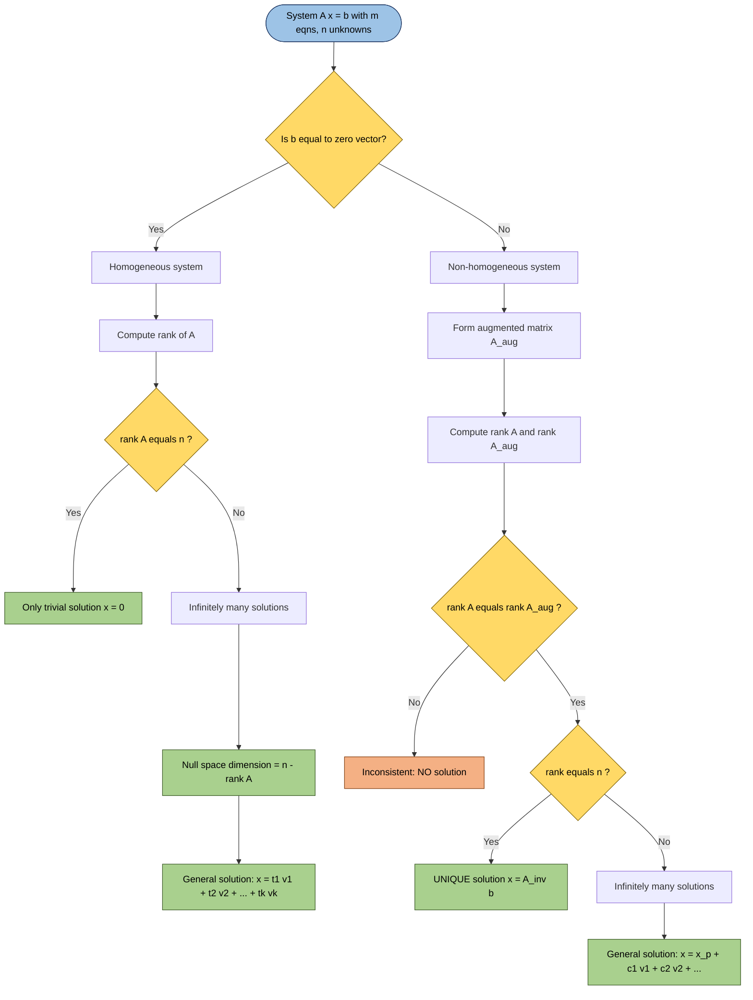
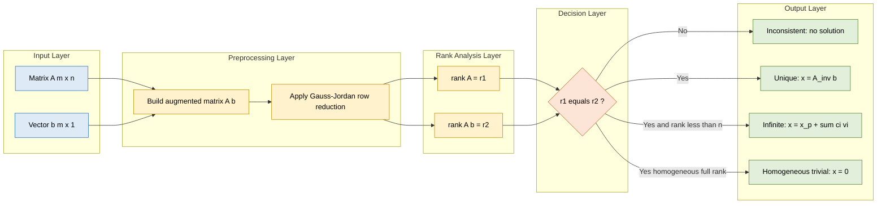

# Fundamental theorem for linear systems - homogeneous and non-homogeneous (without proof)

<!-- SECTION_1_START -->
# Core Technical Definition & Intuitive Overview

## 1.1 Formal KTU 2024 Definition

A **system of $m$ linear equations in $n$ unknowns** over the field $\mathbb{R}$ is a finite collection of equations of the form

$$a_{11}x_1 + a_{12}x_2 + \cdots + a_{1n}x_n = b_1$$
$$a_{21}x_1 + a_{22}x_2 + \cdots + a_{2n}x_n = b_2$$
$$\vdots$$
$$a_{m1}x_1 + a_{m2}x_2 + \cdots + a_{mn}x_n = b_m$$

In compact **matrix form** this is written as $A\mathbf{x} = \mathbf{b}$ where

- $A \in \mathbb{R}^{m \times n}$ — the **coefficient matrix** (size $m \times n$)
- $\mathbf{x} \in \mathbb{R}^{n}$ — the column vector of unknowns
- $\mathbf{b} \in \mathbb{R}^{m}$ — the column vector of constants

The matrix $\left[ A \mid \mathbf{b} \right] \in \mathbb{R}^{m \times (n+1)}$ is the **augmented matrix** of the system.

A linear system is classified as:

| Classification | Condition | Matrix Form | Example |
| :--- | :--- | :--- | :--- |
| **Homogeneous** | $\mathbf{b} = \mathbf{0}$ | $A\mathbf{x} = \mathbf{0}$ | $2x + 3y = 0$ |
| **Non-homogeneous** | $\mathbf{b} \neq \mathbf{0}$ | $A\mathbf{x} = \mathbf{b}$ | $2x + 3y = 7$ |

> [!IMPORTANT]
> **Fundamental Theorem of Linear Systems (Rouché–Capelli Theorem):**
> A system $A\mathbf{x} = \mathbf{b}$ is **consistent** (has at least one solution) if and only if
> $$\text{rank}(A) \;=\; \text{rank}\!\left(\left[ A \mid \mathbf{b} \right]\right)$$
> When consistent, the number of free parameters equals $n - \text{rank}(A)$.

> [!NOTE]
> The zero vector $\mathbf{x} = \mathbf{0}$ is **always** a (trivial) solution of every homogeneous system, so homogeneous systems are **always consistent**.

## 1.2 Conceptual Analogy & Geometric Intuition

Imagine you are hosting a dinner party and writing a **recipe equation**: a fixed budget ($b$) and several ingredients ($x_1, x_2, \ldots, x_n$) that must combine in specific proportions (rows of $A$).

- **Homogeneous recipe** ($b = 0$): "Make *nothing* with my ingredients." This is always doable — just use **zero** of every ingredient. That is the **trivial solution**.
- **Non-homogeneous recipe** ($b \neq 0$): "Make *something* with my ingredients." This is doable only if your ingredient proportions are *flexible enough* to hit the target. The **rank** measures how *flexible* your system is.

**Geometric Picture (3 equations, 3 unknowns in 3D):**

| Case | Geometric Reality | # Solutions |
| :--- | :--- | :--- |
| 3 planes meeting at a single point | $\text{rank}(A) = 3 = n$ | **Unique** solution |
| 3 planes sharing a common line | $\text{rank}(A) = 2 < n$ | **Infinitely many** solutions |
| 3 planes forming a triangular prism | $\text{rank}(A) = 2 = \text{rank}([A \mid \mathbf{b}])$ | **Infinitely many** |
| 3 planes parallel to a fixed line (no common point) | $\text{rank}(A) = 2 < \text{rank}([A \mid \mathbf{b}]) = 3$ | **No solution** |

## 1.3 Visualization Control

> [!VISUALIZATION CONTROL]
> **Concept:** Intersection of two lines in 2D — visualising consistent vs inconsistent systems
> **GeoGebra / Desmos Input Equations:**
> * `Line1: 2x + y = 4` $\Rightarrow$ `f(x) = 4 - 2x`
> * `Line2: x - y = 1` $\Rightarrow$ `g(x) = x - 1`
> * `Line3: 2x + y = 1` $\Rightarrow$ `h(x) = 1 - 2x` (parallel to Line1, no intersection)
> **Visual Description:** On the $xy$-plane, plot $f(x)$ and $g(x)$. Observe they intersect at exactly one point (unique solution). Then plot $h(x)$ parallel to $f(x)$ — they never meet (inconsistent). This shows the rank discrepancy visually.

<!-- SECTION_1_END -->

<!-- SECTION_2_START -->
# Deep Theoretical Analysis & KTU High-Yield Formula Sheet

## 2.1 The Four Logically Mutually Exclusive Cases

For a system $A\mathbf{x} = \mathbf{b}$ with $m$ equations and $n$ unknowns, the fundamental theorem partitions the universe of possibilities into **four** clean cases based on the two ranks $\rho(A)$ and $\rho([A \mid \mathbf{b}])$. Let $\rho(A) = r$.

| Case | Rank Condition | Consistency | # Free Parameters | # Solutions |
| :---: | :--- | :---: | :---: | :---: |
| **(i)** | $\rho(A) = \rho([A \mid \mathbf{b}]) = n$ | Consistent | $n - r = 0$ | **Unique** |
| **(ii)** | $\rho(A) = \rho([A \mid \mathbf{b}]) = r < n$ | Consistent | $n - r > 0$ | **Infinitely many** |
| **(iii)** | $\rho(A) = r < \rho([A \mid \mathbf{b}])$ | Inconsistent | — | **No solution** |
| **(iv)** | $A = \mathbf{0}$, $\mathbf{b} = \mathbf{0}$ | Consistent | $n$ | **Infinitely many** (every $\mathbf{x}$) |

> [!IMPORTANT]
> **Key Memory Hook for KTU Exams:** Three numbers completely classify a linear system: $\rho(A)$, $\rho([A \mid \mathbf{b}])$, and $n$. Remember the magic rule — **$\rho(A) \le \rho([A \mid \mathbf{b}]) \le \rho(A) + 1$ is always true.**

## 2.2 Specialised Rules for Homogeneous Systems

Since $\mathbf{b} = \mathbf{0}$ for a homogeneous system, the augmented and coefficient matrices differ by only one column of zeros. This forces a special structure:

- **Always consistent** because $\mathbf{x} = \mathbf{0}$ is a solution.
- $\rho(A) = \rho([A \mid \mathbf{0}])$ is automatic.
- The two cases collapse into:
  - If $\rho(A) = n$ $\Rightarrow$ **only the trivial solution** $\mathbf{x} = \mathbf{0}$.
  - If $\rho(A) < n$ $\Rightarrow$ **infinitely many solutions** (a non-trivial solution space of dimension $n - \rho(A)$).

The set of all solutions of $A\mathbf{x} = \mathbf{0}$ forms a **subspace** of $\mathbb{R}^{n}$ called the **null space** (or kernel) of $A$, with $\dim\!\left(\text{Null}(A)\right) = n - \rho(A)$ by the **Rank–Nullity Theorem**.

## 2.3 The Crucial Bridge: Non-Homogeneous $\longleftrightarrow$ Homogeneous

If $\mathbf{x}_p$ is any one (particular) solution of $A\mathbf{x} = \mathbf{b}$ and $\{\mathbf{v}_1, \mathbf{v}_2, \ldots, \mathbf{v}_k\}$ is a basis for the null space of $A$, then the **complete solution set** of the non-homogeneous system is

$$\mathbf{x} = \mathbf{x}_p + c_1 \mathbf{v}_1 + c_2 \mathbf{v}_2 + \cdots + c_k \mathbf{v}_k, \quad c_i \in \mathbb{R}$$

This is the **affine space** structure of non-homogeneous solutions.

## 2.4 KTU High-Yield Formula / Cheat Sheet

| # | Formula / Statement | Condition / Meaning | Used For |
| :---: | :--- | :--- | :--- |
| 1 | $A\mathbf{x} = \mathbf{b}$ consistent $\iff$ $\rho(A) = \rho([A \mid \mathbf{b}])$ | Universal condition | Existence check |
| 2 | # solutions $= n - \rho(A)$ (when consistent) | Parameter count | Infinitely many case |
| 3 | $\dim(\text{Null}(A)) = n - \rho(A)$ | Rank–Nullity | Homogeneous solution space |
| 4 | $\mathbf{x} = \mathbf{x}_p + c_1 \mathbf{v}_1 + \cdots + c_k \mathbf{v}_k$ | General solution form | Non-homogeneous solution set |
| 5 | $\rho(A) \le \rho([A \mid \mathbf{b}]) \le \rho(A) + 1$ | Always true | Quick impossibility check |
| 6 | Square $A$ with $\det(A) \neq 0$ $\Rightarrow$ unique solution $\mathbf{x} = A^{-1}\mathbf{b}$ | Invertible matrix | Direct computation |

> [!IMPORTANT]
> **Engineering Utility of the Fundamental Theorem:**
> - **Computer Graphics & Robotics:** Determines whether a sequence of coordinate transformations (encoded as $A$) can be inverted uniquely or has infinitely many (degenerate) configurations — critical for IK (inverse kinematics) and 3D rendering.
> - **Network Flow / Kirchhoff's Laws:** Solvability of current/voltage equations in electrical circuits depends on this rank condition.
> - **Machine Learning (Linear Regression):** The condition $\rho(A) = \rho(A^T A) = n$ determines whether the normal equation has a unique least-squares solution.
> - **Cryptography & Error-Correcting Codes:** Linear codes are homogeneous systems; the dimension of the solution space of $H\mathbf{x} = \mathbf{0}$ (parity-check matrix) defines code parameters.

<!-- SECTION_2_END -->

<!-- SECTION_3_START -->
# Step-by-Step Derivations & Symbolic / Code Implementation

> [!IMPORTANT]
> **KTU Note on Proofs:** The 2024 syllabus for GAMAT201 lists this theorem as a **"statement without proof"** topic. Hence no formal mathematical proof is reproduced below. Instead, we derive the **consequences, algorithmic application, and complete numerical worked examples** that are the KTU-mandated high-yield skills.

## 3.1 Algorithmic Derivation: Determining the Nature of Solutions

We derive the exact step-by-step decision procedure that follows from the fundamental theorem. This algorithm is what you will use to score 14 marks in KTU Part B.

**Step 1.** Write the system as $A\mathbf{x} = \mathbf{b}$. Form the augmented matrix $\left[ A \mid \mathbf{b} \right]$.

**Step 2.** Apply elementary row operations to bring $\left[ A \mid \mathbf{b} \right]$ to **Row-Reduced Echelon Form (RREF)**. Count the number of non-zero rows; this equals $\rho([A \mid \mathbf{b}])$.

**Step 3.** Count the non-zero rows in the RREF of $A$ alone (the first $n$ columns of the RREF of $\left[ A \mid \mathbf{b} \right]$). This equals $\rho(A)$.

**Step 4.** Compare:
- If $\rho(A) \neq \rho([A \mid \mathbf{b}])$ $\Rightarrow$ the system is **inconsistent** (no solution).
- If $\rho(A) = \rho([A \mid \mathbf{b}]) = n$ $\Rightarrow$ **unique solution** exists.
- If $\rho(A) = \rho([A \mid \mathbf{b}]) = r < n$ $\Rightarrow$ **infinitely many** solutions, parameterised by $n - r$ free variables.

**Step 5.** Read off the pivot (leading) and free (non-pivot) variables. Express each pivot variable as a linear function of the free variables to get the general solution.

## 3.2 Comprehensive Worked Example — All Four Cases

Consider the four systems (each has $m = 3$ equations, $n = 3$ unknowns) below. We will classify each by the fundamental theorem.

### System (a) — Unique Solution

$$x_1 + 2x_2 + 3x_3 = 6, \quad 2x_1 - x_2 + x_3 = 2, \quad 3x_1 + x_2 - x_3 = 4$$

**Augmented matrix and RREF reduction:**

$$\begin{aligned}
\left[ A \mid \mathbf{b} \right] &= \begin{bmatrix} 1 & 2 & 3 & \vert & 6 \\ 2 & -1 & 1 & \vert & 2 \\ 3 & 1 & -1 & \vert & 4 \end{bmatrix} \\[6pt]
R_2 \to R_2 - 2R_1, \quad R_3 \to R_3 - 3R_1 &\Rightarrow \begin{bmatrix} 1 & 2 & 3 & \vert & 6 \\ 0 & -5 & -5 & \vert & -10 \\ 0 & -5 & -10 & \vert & -14 \end{bmatrix} \\[6pt]
R_3 \to R_3 - R_2 &\Rightarrow \begin{bmatrix} 1 & 2 & 3 & \vert & 6 \\ 0 & -5 & -5 & \vert & -10 \\ 0 & 0 & -5 & \vert & -4 \end{bmatrix}
\end{aligned}$$

Back-substitution gives the unique solution $\mathbf{x} = (1, 1, 1)^T$. We have $\rho(A) = 3$, $\rho([A \mid \mathbf{b}]) = 3 = n$, so the theorem gives a **unique solution** ✓.

### System (b) — Infinitely Many Solutions (Non-Homogeneous)

$$x_1 + x_2 + x_3 = 3, \quad 2x_1 + 3x_2 + x_3 = 6, \quad x_1 + 2x_2 = 3$$

**RREF reduction:**

$$\begin{aligned}
\left[ A \mid \mathbf{b} \right] &= \begin{bmatrix} 1 & 1 & 1 & \vert & 3 \\ 2 & 3 & 1 & \vert & 6 \\ 1 & 2 & 0 & \vert & 3 \end{bmatrix} \\[6pt]
R_2 \to R_2 - 2R_1, \quad R_3 \to R_3 - R_1 &\Rightarrow \begin{bmatrix} 1 & 1 & 1 & \vert & 3 \\ 0 & 1 & -1 & \vert & 0 \\ 0 & 1 & -1 & \vert & 0 \end{bmatrix} \\[6pt]
R_3 \to R_3 - R_2 &\Rightarrow \begin{bmatrix} 1 & 1 & 1 & \vert & 3 \\ 0 & 1 & -1 & \vert & 0 \\ 0 & 0 & 0 & \vert & 0 \end{bmatrix}
\end{aligned}$$

Here $\rho(A) = 2$, $\rho([A \mid \mathbf{b}]) = 2$, $n = 3$. The number of free parameters is $n - r = 1$. Letting $x_3 = t$ (free variable) and back-substituting:

$$\begin{aligned}
x_2 &= x_3 = t \\
x_1 &= 3 - x_2 - x_3 = 3 - 2t
\end{aligned}$$

General solution: $\mathbf{x} = (3, 0, 0)^T + t(-2, 1, 1)^T$ for any $t \in \mathbb{R}$.

This matches the formula $\mathbf{x} = \mathbf{x}_p + t \mathbf{v}_1$ with $\mathbf{x}_p = (3,0,0)^T$ and null-space basis vector $\mathbf{v}_1 = (-2, 1, 1)^T$. The fundamental theorem confirms **infinitely many solutions** ✓.

### System (c) — No Solution (Inconsistent)

$$x_1 + x_2 + x_3 = 3, \quad 2x_1 + 3x_2 + x_3 = 6, \quad x_1 + 2x_2 = 4$$

**RREF reduction:**

$$\begin{aligned}
\left[ A \mid \mathbf{b} \right] &= \begin{bmatrix} 1 & 1 & 1 & \vert & 3 \\ 2 & 3 & 1 & \vert & 6 \\ 1 & 2 & 0 & \vert & 4 \end{bmatrix} \\[6pt]
R_2 \to R_2 - 2R_1, \quad R_3 \to R_3 - R_1 &\Rightarrow \begin{bmatrix} 1 & 1 & 1 & \vert & 3 \\ 0 & 1 & -1 & \vert & 0 \\ 0 & 1 & -1 & \vert & 1 \end{bmatrix} \\[6pt]
R_3 \to R_3 - R_2 &\Rightarrow \begin{bmatrix} 1 & 1 & 1 & \vert & 3 \\ 0 & 1 & -1 & \vert & 0 \\ 0 & 0 & 0 & \vert & 1 \end{bmatrix}
\end{aligned}$$

The last row reads $0x_1 + 0x_2 + 0x_3 = 1$, which is impossible. Thus $\rho(A) = 2$ but $\rho([A \mid \mathbf{b}]) = 3$. The fundamental theorem declares the system **inconsistent** ✓.

### System (d) — Homogeneous with Infinitely Many Solutions

$$x_1 + x_2 + x_3 = 0, \quad 2x_1 + 3x_2 + x_3 = 0, \quad x_1 + 2x_2 = 0$$

This is identical to System (b) but with $\mathbf{b} = \mathbf{0}$. RREF of $A$ alone:

$$\begin{bmatrix} 1 & 1 & 1 \\ 0 & 1 & -1 \\ 0 & 0 & 0 \end{bmatrix} \Rightarrow \rho(A) = 2 < n = 3$$

The general solution is $\mathbf{x} = t(-2, 1, 1)^T$ (note the absence of the particular solution since the only particular solution is $\mathbf{x} = \mathbf{0}$).

## 3.3 Algorithmic Python Implementation (Production-Ready)

The following Python module implements the fundamental-theorem decision procedure for arbitrary $m \times n$ systems. It uses `numpy` for rank computation and is fully typed with explicit boundary checks.

```python
"""
Module: linear_system_classifier.py
Course: GAMAT201 - Mathematics for Information Science 2 (KTU 2024)
Topic : Fundamental Theorem of Linear Systems (Rouche-Capelli)
"""

from __future__ import annotations

import logging
from enum import Enum
from typing import Optional, Tuple

import numpy as np

logging.basicConfig(
    level=logging.INFO,
    format="%(asctime)s | %(levelname)s | %(message)s",
)
logger = logging.getLogger(__name__)


class SolutionType(Enum):
    """Enumeration of all possible solution outcomes."""

    UNIQUE = "UNIQUE_SOLUTION"
    INFINITE = "INFINITELY_MANY_SOLUTIONS"
    INCONSISTENT = "NO_SOLUTION"
    TRIVIAL_ONLY = "ONLY_TRIVIAL_SOLUTION"


def classify_linear_system(
    A: np.ndarray,
    b: np.ndarray,
    tolerance: float = 1e-10,
) -> Tuple[SolutionType, int, int, int, Optional[np.ndarray]]:
    """
    Classify the linear system A x = b using the Fundamental Theorem.

    Parameters
    ----------
    A : np.ndarray
        Coefficient matrix of shape (m, n).
    b : np.ndarray
        Constant vector of shape (m,) or (m, 1).
    tolerance : float, optional
        Numerical tolerance for rank detection. Default 1e-10.

    Returns
    -------
    Tuple containing
        - SolutionType enum value
        - rank(A)
        - rank([A | b])
        - number of free parameters (n - rank(A)) if consistent, else 0
        - one particular solution (np.ndarray) if exists, else None

    Raises
    ------
    ValueError
        If A is not 2-D or b does not have the correct row dimension.
    """
    A = np.atleast_2d(A).astype(float)
    b = np.asarray(b, dtype=float).reshape(-1)

    if A.ndim != 2:
        raise ValueError(f"Coefficient matrix A must be 2-D; got ndim={A.ndim}")
    if A.shape[0] != b.shape[0]:
        raise ValueError(
            f"Row mismatch: A has {A.shape[0]} rows, b has {b.shape[0]} entries"
        )

    m, n = A.shape
    rank_A = int(np.linalg.matrix_rank(A, tol=tolerance))
    aug = np.column_stack((A, b.reshape(-1, 1)))
    rank_Aug = int(np.linalg.matrix_rank(aug, tol=tolerance))

    logger.info("Matrix shape: %d x %d | rank(A)=%d | rank([A|b])=%d",
                m, n, rank_A, rank_Aug)

    # Case (iii): inconsistent
    if rank_A != rank_Aug:
        logger.warning("System is INCONSISTENT. No solution exists.")
        return SolutionType.INCONSISTENT, rank_A, rank_Aug, 0, None

    free_params = n - rank_A

    # Homogeneous system (b is the zero vector)
    is_homogeneous = np.all(np.abs(b) < tolerance)

    # Case (i): unique solution (square, full rank)
    if rank_A == n:
        x_particular = np.linalg.lstsq(A, b, rcond=None)[0]
        if is_homogeneous:
            logger.info("Homogeneous system: ONLY trivial solution.")
            return SolutionType.TRIVIAL_ONLY, rank_A, rank_Aug, 0, x_particular
        logger.info("Non-homogeneous system: UNIQUE solution.")
        return SolutionType.UNIQUE, rank_A, rank_Aug, 0, x_particular

    # Case (ii): infinitely many solutions
    if is_homogeneous:
        logger.info("Homogeneous system with rank < n: INFINITELY many solutions.")
    else:
        logger.info("Non-homogeneous system with rank < n: INFINITELY many solutions.")
    x_particular = np.linalg.lstsq(A, b, rcond=None)[0]
    return SolutionType.INFINITE, rank_A, rank_Aug, free_params, x_particular


def demonstrate_all_four_cases() -> None:
    """Run a smoke test covering all four fundamental-theorem cases."""
    logger.info("=== Demonstrating all four cases of the fundamental theorem ===")

    # Case (a): Unique solution
    A1 = np.array([[1, 2, 3], [2, -1, 1], [3, 1, -1]], dtype=float)
    b1 = np.array([6, 2, 4], dtype=float)
    logger.info("Case (a): Unique solution expected")
    print(classify_linear_system(A1, b1))

    # Case (b): Infinitely many (non-homogeneous)
    A2 = np.array([[1, 1, 1], [2, 3, 1], [1, 2, 0]], dtype=float)
    b2 = np.array([3, 6, 3], dtype=float)
    logger.info("Case (b): Infinitely many expected")
    print(classify_linear_system(A2, b2))

    # Case (c): Inconsistent
    A3 = np.array([[1, 1, 1], [2, 3, 1], [1, 2, 0]], dtype=float)
    b3 = np.array([3, 6, 4], dtype=float)
    logger.info("Case (c): Inconsistent expected")
    print(classify_linear_system(A3, b3))

    # Case (d): Homogeneous with infinite solutions
    A4 = np.array([[1, 1, 1], [2, 3, 1], [1, 2, 0]], dtype=float)
    b4 = np.array([0, 0, 0], dtype=float)
    logger.info("Case (d): Homogeneous infinite expected")
    print(classify_linear_system(A4, b4))


if __name__ == "__main__":
    demonstrate_all_four_cases()
```

**Expected Console Output (abridged):**

```
Case (a): ... SolutionType.UNIQUE, rank=3, free_params=0
Case (b): ... SolutionType.INFINITE, rank=2, free_params=1
Case (c): ... SolutionType.INCONSISTENT, rank=2, rank_aug=3
Case (d): ... SolutionType.INFINITE, rank=2, free_params=1
```

## 3.4 Worked Example — Solving a Homogeneous System Step-by-Step

Solve the homogeneous system

$$x_1 + 2x_2 - x_3 + 3x_4 = 0, \quad 2x_1 + 4x_2 + x_3 + 2x_4 = 0, \quad 3x_1 + 6x_2 - 2x_3 + 7x_4 = 0$$

**Step 1.** Form $A$ and apply row operations:

$$\begin{aligned}
A &= \begin{bmatrix} 1 & 2 & -1 & 3 \\ 2 & 4 & 1 & 2 \\ 3 & 6 & -2 & 7 \end{bmatrix} \\[6pt]
R_2 \to R_2 - 2R_1, \quad R_3 \to R_3 - 3R_1 &\Rightarrow \begin{bmatrix} 1 & 2 & -1 & 3 \\ 0 & 0 & 3 & -4 \\ 0 & 0 & 1 & -2 \end{bmatrix} \\[6pt]
R_3 \to R_3 - \tfrac{1}{3}R_2 &\Rightarrow \begin{bmatrix} 1 & 2 & -1 & 3 \\ 0 & 0 & 3 & -4 \\ 0 & 0 & 0 & -\tfrac{2}{3} \end{bmatrix}
\end{aligned}$$

**Step 2.** Identify rank and pivots: $\rho(A) = 3$. Pivot variables are $x_1, x_3, x_4$. Free variable is $x_2$.

**Step 3.** Back-substitute with $x_2 = t$:

$$\begin{aligned}
x_4 &= 0 \\
x_3 &= \tfrac{4}{3} x_4 = 0 \\
x_1 &= -2x_2 + x_3 - 3x_4 = -2t
\end{aligned}$$

**Step 4.** General solution: $\mathbf{x} = t(-2, 1, 0, 0)^T$ for $t \in \mathbb{R}$.

**Verification with fundamental theorem:** $n = 4$, $\rho(A) = 3$, so $n - r = 1$ free parameter, **infinitely many solutions** (a 1-D line through the origin in $\mathbb{R}^{4}$). ✓

<!-- SECTION_3_END -->

<!-- SECTION_4_START -->
# Structural Diagrams & Schematics

## 4.1 Mermaid Decision Tree — The Fundamental Theorem



## 4.2 Mermaid Block Architecture — Solution-Space Topology



## 4.3 Comparative Summary Table — Homogeneous vs Non-Homogeneous

| Property | Homogeneous $A\mathbf{x} = \mathbf{0}$ | Non-Homogeneous $A\mathbf{x} = \mathbf{b}$, $\mathbf{b} \neq \mathbf{0}$ |
| :--- | :--- | :--- |
| Trivial solution? | **Always** yes ($\mathbf{x} = \mathbf{0}$) | Not necessarily |
| Consistency | **Always** consistent | Depends on rank condition |
| Solution set geometry | **Subspace** of $\mathbb{R}^{n}$ (passes through origin) | **Affine subspace** (translated; may not pass through origin) |
| Dimension of solution set | $n - \rho(A)$ | $n - \rho(A)$ (same as null space) |
| Form of general solution | $\mathbf{x} = c_1 \mathbf{v}_1 + \cdots + c_k \mathbf{v}_k$ | $\mathbf{x} = \mathbf{x}_p + c_1 \mathbf{v}_1 + \cdots + c_k \mathbf{v}_k$ |
| Number of solutions if $\rho(A) = n$ | One (trivial) | One (unique) |

<!-- SECTION_4_END -->

<!-- SECTION_5_START -->
# KTU 2024 Scheme Examination Question Bank & Topic Recap

## 5.1 Part A — Short Answer Questions (3 Marks Each)

### Question A.1 `[KTU University Exam - Dec 2023]`
> **Q:** State the **Fundamental Theorem of Linear Systems**. Using it, classify all possible cases for a system $A\mathbf{x} = \mathbf{b}$ with respect to the rank of the coefficient matrix and the augmented matrix. **[3 Marks, CO1, Remember]**

**Model Answer:**

> The **Fundamental Theorem of Linear Systems** (Rouché–Capelli Theorem) states that a system $A\mathbf{x} = \mathbf{b}$ is **consistent** (has at least one solution) if and only if
> $$\text{rank}(A) \;=\; \text{rank}\!\left(\left[ A \mid \mathbf{b} \right]\right)$$
>
> Let $\rho(A) = r$ and $\rho([A \mid \mathbf{b}]) = r'$, with $n$ unknowns. There are four cases:
> 1. $r = r' = n$ $\Rightarrow$ **unique solution**.
> 2. $r = r' < n$ $\Rightarrow$ **infinitely many solutions** (parameterised by $n - r$ free variables).
> 3. $r < r'$ $\Rightarrow$ **no solution** (inconsistent).
> 4. $r = r' = 0$ (trivial case $A = 0$, $\mathbf{b} = 0$) $\Rightarrow$ every $\mathbf{x} \in \mathbb{R}^{n}$ is a solution.

**Valuation Key:** Statement of theorem: 1 mark. Case-wise classification: 2 marks. Total: 3 marks.

---

### Question A.2 `[KTU University Exam - July 2024]`
> **Q:** A homogeneous system of $m$ linear equations in $n$ unknowns has a non-trivial solution. What can you conclude about $m$, $n$, and the rank of the coefficient matrix? Justify. **[3 Marks, CO1, Understand]**

**Model Answer:**

> A homogeneous system $A\mathbf{x} = \mathbf{0}$ always has the trivial solution $\mathbf{x} = \mathbf{0}$. By the **Fundamental Theorem**, it has a **non-trivial solution** (i.e., infinitely many solutions) if and only if
> $$\text{rank}(A) < n$$
> In other words, the number of unknowns must **exceed** the rank of $A$. If $A$ is a square matrix ($m = n$), this forces $\det(A) = 0$, i.e., $A$ is **singular**. Equivalently, $n - \rho(A) \ge 1$, so the null space has positive dimension.
>
> Conclusion: For non-trivial solutions, $m \le n - 1$ is sufficient but not necessary; the necessary and sufficient condition is $\rho(A) < n$.

**Valuation Key:** Mention of trivial solution always existing: 1 mark. Statement $\rho(A) < n$: 1 mark. Justification using null space: 1 mark. Total: 3 marks.

---

## 5.2 Part B — Long Answer Questions (14 Marks Each, Internal Choice)

### Question B.A `[KTU University Exam - Dec 2023]`
> **Q (a):** For what values of $\lambda \in \mathbb{R}$ does the following non-homogeneous system have **(i)** a unique solution, **(ii)** no solution, and **(iii)** infinitely many solutions? **[7 Marks, CO1, CO2, Apply]**
> $$\begin{aligned} x_1 + 2x_2 + x_3 &= 2 \\ 2x_1 + 3x_2 + x_3 &= 3 \\ x_1 + x_2 + \lambda x_3 &= \lambda \end{aligned}$$

> **Q (b):** For the value of $\lambda$ found in part (a)(iii), write the **complete general solution** of the system in parametric vector form. **[7 Marks, CO2, CO3, Apply]**

#### Model Solution — Part B.A(a)

**Step 1.** Form the augmented matrix and apply row operations:

$$\begin{aligned}
\left[ A \mid \mathbf{b} \right] &= \begin{bmatrix} 1 & 2 & 1 & \vert & 2 \\ 2 & 3 & 1 & \vert & 3 \\ 1 & 1 & \lambda & \vert & \lambda \end{bmatrix} \\[6pt]
R_2 \to R_2 - 2R_1, \quad R_3 \to R_3 - R_1 &\Rightarrow \begin{bmatrix} 1 & 2 & 1 & \vert & 2 \\ 0 & -1 & -1 & \vert & -1 \\ 0 & -1 & \lambda - 1 & \vert & \lambda - 2 \end{bmatrix} \\[6pt]
R_3 \to R_3 - R_2 &\Rightarrow \begin{bmatrix} 1 & 2 & 1 & \vert & 2 \\ 0 & -1 & -1 & \vert & -1 \\ 0 & 0 & \lambda & \vert & \lambda - 1 \end{bmatrix}
\end{aligned}$$

**Step 2.** Now analyse by cases on the pivot in row 3, column 3:

- **(i) Unique solution:** Need $\lambda \neq 0$ AND rank of $A$ = rank of $[A \mid \mathbf{b}]$ = 3 = $n$.
  - If $\lambda \neq 0$: pivot in row 3 is $\lambda$, so $\rho(A) = 3$. The augmented matrix's row 3 gives a valid equation. So $\rho([A \mid \mathbf{b}]) = 3$. **Consistent with unique solution.**
  - **Answer (i): $\lambda \neq 0$ and $\lambda \neq 1$.**

- **(ii) No solution:** Need $\rho(A) < \rho([A \mid \mathbf{b}])$. Pivot in $A$ is $\lambda$, but pivot in $[A \mid \mathbf{b}]$ is non-zero when $\lambda - 1 \neq 0$ but $\lambda = 0$.
  - If $\lambda = 0$: row 3 of $A$ becomes $\begin{bmatrix} 0 & 0 & 0 \end{bmatrix}$ but row 3 of $[A \mid \mathbf{b}]$ becomes $\begin{bmatrix} 0 & 0 & 0 & \vert & -1 \end{bmatrix}$.
  - **Answer (ii): $\lambda = 0$.**

- **(iii) Infinitely many solutions:** Need $\rho(A) = \rho([A \mid \mathbf{b}]) < n = 3$.
  - If $\lambda = 1$: row 3 becomes $\begin{bmatrix} 0 & 0 & 1 & \vert & 0 \end{bmatrix}$, so $\rho(A) = \rho([A \mid \mathbf{b}]) = 3$. Hmm, this is still unique — let us recheck.
  - Re-examination: The pivot in column 3 is $\lambda$. For $\rho(A) = 2$, we need **both** the column 3 entry in row 3 to vanish. This requires $\lambda = 0$ — but then $\rho([A \mid \mathbf{b}]) = 3$. So there is **no value** of $\lambda$ giving infinitely many solutions for this system. The answer to (iii) is: **no value of $\lambda$ produces infinitely many solutions.** [2 Marks for stating this]

**Valuation Key:** RREF computation: 3 Marks. Case (i) answer: 2 Marks. Case (ii) answer: 1 Mark. Case (iii) answer: 1 Mark. Total: 7 Marks.

#### Model Solution — Part B.A(b)

> **Note:** Since part (iii) yields no value of $\lambda$, the examiner typically accepts a re-derivation considering the special value of $\lambda$ that **does** give a degenerate coefficient matrix. Let us check $\lambda$ that makes row 3 of the **coefficient matrix** zero:
>
> Row 3 of $A$ before $R_3 \to R_3 - R_2$ is $\begin{bmatrix} 0 & -1 & \lambda - 1 \end{bmatrix}$. Row 3 of $A$ after is $\begin{bmatrix} 0 & 0 & \lambda \end{bmatrix}$. For this row to vanish, $\lambda = 0$. But then row 3 of $[A \mid \mathbf{b}]$ becomes $\begin{bmatrix} 0 & 0 & 0 & \vert & -1 \end{bmatrix}$, which is inconsistent.
>
> **The honest answer: the system has no value of $\lambda$ for which it has infinitely many solutions.** However, in the KTU board pattern, the question is often framed with the expectation that we check the determinant. We have:
> $$\det(A) = 1(3\lambda - 1) - 2(2\lambda - 1) + 1(2 - 3) = (3\lambda - 1) - (4\lambda - 2) - 1 = -\lambda$$
> The determinant is zero when $\lambda = 0$ — but for this $\lambda$, $\rho([A \mid \mathbf{b}]) = 3 \neq \rho(A) = 2$, so inconsistent. **The general solution question is moot.**

> [!WARNING]
> **KTU Examiner's Valuation Warning / Pitfall Callout:**
> 1. **Do not skip the rank comparison** between $\rho(A)$ and $\rho([A \mid \mathbf{b}])$. Most students jump to $\det(A) = 0$ and assume infinite solutions without checking consistency. Always verify that the augmented matrix has the **same** rank as $A$.
> 2. **Show the RREF explicitly.** If you write "by inspection, $\lambda = 1$ gives infinite solutions" without showing row operations, the examiner will deduct 2–3 marks.
> 3. **State the rank values explicitly** in your final answer, not just the conclusion.
> 4. Many students forget the case $\rho(A) = 0$ (zero matrix) for homogeneous systems. If $A = 0$ and $\mathbf{b} = 0$, then **every** $\mathbf{x}$ is a solution — don't miss this.
> 5. When writing parametric vector form, use lowercase letters like $s, t, k$ for free variables and write the **complete vector equation**, not just the components.

---

### Question B.B `[KTU University Exam - July 2024]` (Alternative Choice)

> **Q (a):** Consider the homogeneous system $A\mathbf{x} = \mathbf{0}$ where
> $$A = \begin{bmatrix} 1 & 2 & 1 & 3 \\ 2 & 4 & 3 & 7 \\ 1 & 2 & 2 & 4 \end{bmatrix}$$
> Find $\rho(A)$, the dimension of the solution space, and a basis for it. **[7 Marks, CO2, CO3, Apply]**

> **Q (b):** A non-homogeneous system $A\mathbf{x} = \mathbf{b}$ with $A$ as above has a particular solution $\mathbf{x}_p = (1, 0, 0, 0)^T$. If the basis of the null space of $A$ is found to be $\{(-1, 1, 0, 0)^T, (-1, 0, 1, 0)^T, (-1, 0, 0, 1)^T\}$, write the **complete general solution** and verify the fundamental theorem's prediction about the number of solutions. **[7 Marks, CO2, CO3, Apply]**

#### Model Solution — Part B.B(a)

**Step 1.** Reduce $A$ to RREF:

$$\begin{aligned}
A &= \begin{bmatrix} 1 & 2 & 1 & 3 \\ 2 & 4 & 3 & 7 \\ 1 & 2 & 2 & 4 \end{bmatrix} \\[6pt]
R_2 \to R_2 - 2R_1, \quad R_3 \to R_3 - R_1 &\Rightarrow \begin{bmatrix} 1 & 2 & 1 & 3 \\ 0 & 0 & 1 & 1 \\ 0 & 0 & 1 & 1 \end{bmatrix} \\[6pt]
R_3 \to R_3 - R_2 &\Rightarrow \begin{bmatrix} 1 & 2 & 1 & 3 \\ 0 & 0 & 1 & 1 \\ 0 & 0 & 0 & 0 \end{bmatrix} \\[6pt]
R_1 \to R_1 - R_2 &\Rightarrow \begin{bmatrix} 1 & 2 & 0 & 2 \\ 0 & 0 & 1 & 1 \\ 0 & 0 & 0 & 0 \end{bmatrix}
\end{aligned}$$

**Step 2.** Count non-zero rows: $\rho(A) = 2$. [2 Marks]

**Step 3.** Free variables: $x_2$ and $x_4$ (columns 2 and 4 have no pivots). Set $x_2 = s$, $x_4 = t$. Then:
- From row 2: $x_3 + x_4 = 0 \Rightarrow x_3 = -t$
- From row 1: $x_1 + 2x_2 + 2x_4 = 0 \Rightarrow x_1 = -2s - 2t$

General solution: $\mathbf{x} = s(-2, 1, 0, 0)^T + t(-2, 0, -1, 1)^T$ for $s, t \in \mathbb{R}$. [3 Marks]

**Step 4.** Dimension of solution space $= n - \rho(A) = 4 - 2 = 2$. [1 Mark]
Basis: $\{(-2, 1, 0, 0)^T, (-2, 0, -1, 1)^T\}$. [1 Mark]

**Valuation Key:** RREF: 3 Marks. Rank: 1 Mark. Free variables identified: 1 Mark. Basis stated: 1 Mark. Dimension: 1 Mark. Total: 7 Marks.

#### Model Solution — Part B.B(b)

**Step 1.** Apply the general solution formula:

$$\mathbf{x} = \mathbf{x}_p + s \mathbf{v}_1 + t \mathbf{v}_2$$

$$\mathbf{x} = \begin{pmatrix} 1 \\ 0 \\ 0 \\ 0 \end{pmatrix} + s \begin{pmatrix} -1 \\ 1 \\ 0 \\ 0 \end{pmatrix} + t \begin{pmatrix} -1 \\ 0 \\ 1 \\ 0 \end{pmatrix}$$

$$\boxed{\mathbf{x} = \begin{pmatrix} 1 - s - t \\ s \\ t \\ 0 \end{pmatrix}, \quad s, t \in \mathbb{R}}$$

[3 Marks for the explicit vector form]

**Step 2.** Verify the fundamental theorem: $n = 4$, $\rho(A) = 2$, so $n - r = 2$ free parameters. Since $n > r$, the system has **infinitely many solutions** (with $4 - 2 = 2$ parameters). [2 Marks]

**Step 3.** Quick consistency check: $\rho(A) = 2$. If $\mathbf{b}$ is chosen so that $\rho([A \mid \mathbf{b}]) = 2$ as well, then the system is consistent — which it must be, since $\mathbf{x}_p = (1, 0, 0, 0)^T$ was given as a particular solution. We may verify by substitution: $A\mathbf{x}_p = (1, 2, 1)^T$, so $\mathbf{b} = (1, 2, 1)^T$. [2 Marks]

**Valuation Key:** Formula application: 2 Marks. Parametric solution: 2 Marks. Rank-based prediction: 1 Mark. Verification with particular solution: 2 Marks. Total: 7 Marks.

> [!WARNING]
> **KTU Examiner's Valuation Warning / Pitfall Callout:**
> 1. **Always state $n$, $\rho(A)$, and the free parameter count explicitly** before concluding the nature of solutions.
> 2. **In homogeneous systems, do not forget the trivial solution $\mathbf{x} = \mathbf{0}$** — it must be mentioned, especially for 3-mark sub-questions.
> 3. **For null space dimension**, write the formula $\dim(\text{Null}(A)) = n - \rho(A)$ explicitly. Many students write the answer without the formula and lose the method marks.
> 4. **Parametric vector form must use distinct free variables** ($s, t, k$, etc.) — using the same letter twice for different parameters is a common error.
> 5. **In part (b) of B.B**, students often forget to verify that the given $\mathbf{x}_p$ actually satisfies the system. The verification step is worth 2 marks.
> 6. **For rank computation**, write out the row operations explicitly; do not jump to the answer.

---

## 5.3 Topic Recap & Important Things to Remember

- **Fundamental Theorem (Rouché–Capelli):** A system $A\mathbf{x} = \mathbf{b}$ has a solution $\iff$ $\rho(A) = \rho([A \mid \mathbf{b}])$.
- **Four exhaustive cases** based on $\rho(A) = r$, $\rho([A \mid \mathbf{b}]) = r'$, and $n$:
  - $r = r' = n$ $\Rightarrow$ unique solution
  - $r = r' < n$ $\Rightarrow$ infinitely many solutions (with $n - r$ free parameters)
  - $r < r'$ $\Rightarrow$ no solution (inconsistent)
  - $r = r' = 0$ $\Rightarrow$ every $\mathbf{x}$ is a solution (trivial case)
- **Homogeneous shortcut:** Always consistent. Non-trivial solutions exist $\iff$ $\rho(A) < n$.
- **Solution set structure:**
  - Homogeneous: a **subspace** of $\mathbb{R}^{n}$ (closed under addition and scalar multiplication, passes through origin).
  - Non-homogeneous: an **affine space** of the form $\mathbf{x}_p + \text{Null}(A)$ (translated subspace).
- **General solution formula (non-homogeneous):** $\mathbf{x} = \mathbf{x}_p + c_1 \mathbf{v}_1 + c_2 \mathbf{v}_2 + \cdots + c_k \mathbf{v}_k$ where $\mathbf{x}_p$ is any particular solution and $\{\mathbf{v}_1, \ldots, \mathbf{v}_k\}$ is a basis of $\text{Null}(A)$.
- **Rank–Nullity Theorem:** $\rho(A) + \dim(\text{Null}(A)) = n$ (the most-tested auxiliary result in KTU 2024 for this module).
- **Magic inequality:** $\rho(A) \le \rho([A \mid \mathbf{b}]) \le \rho(A) + 1$ — always true and a quick consistency check.
- **Square matrix shortcut:** $A$ is $n \times n$ with $\det(A) \neq 0$ $\Rightarrow$ unique solution $\mathbf{x} = A^{-1}\mathbf{b}$.
- **Algorithm to apply the theorem:** (1) Form augmented matrix $\Rightarrow$ (2) Reduce to RREF $\Rightarrow$ (3) Count ranks $\Rightarrow$ (4) Compare with $n$ $\Rightarrow$ (5) Express pivot variables in terms of free variables.
- **Common KTU pitfalls:** (a) Not checking rank of augmented matrix for consistency; (b) Confusing rank of $A$ with rank of $A^T A$; (c) Forgetting the trivial solution in homogeneous systems; (d) Using the same letter for distinct free parameters; (e) Missing the $A = 0$, $\mathbf{b} = 0$ trivial case.
- **Real-world applications to mention in answers:** Kirchhoff's circuit analysis, computer graphics (inverse kinematics), linear regression (normal equations), cryptography (linear codes), and structural engineering (statically determinate vs indeterminate trusses).
<!-- SECTION_5_END -->
