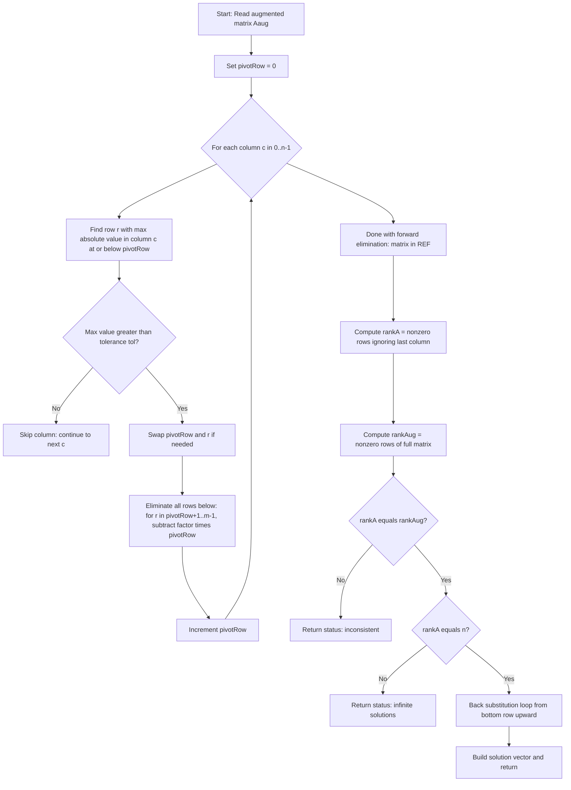
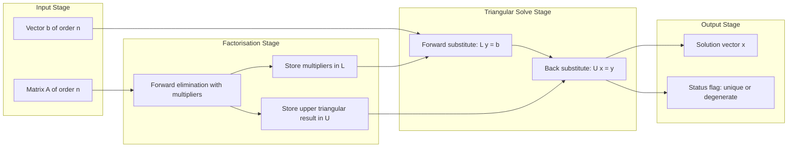
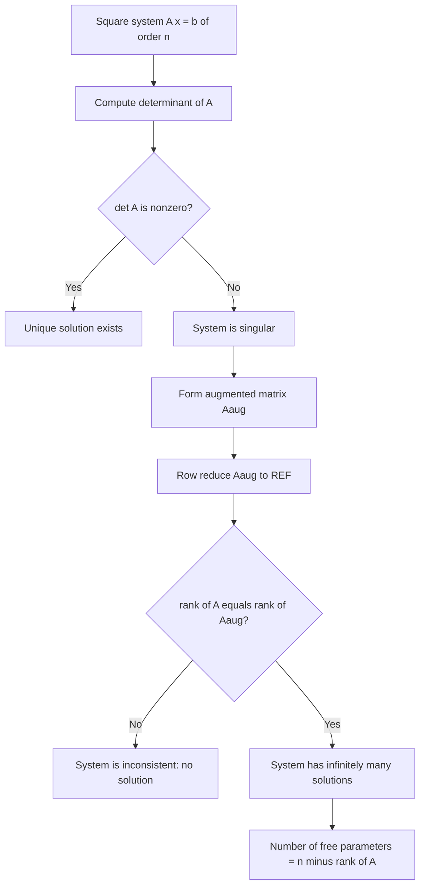

# Linear systems of equations

<!-- SECTION_1_START -->
# Linear Systems of Equations — The Computational Spine of Information Science

> [!NOTE]
> **KTU 2024 Syllabus Anchor (GAMAT201 — Module 1)**
> *Linear systems of equations* form the algebraic backbone of nearly every quantitative discipline an Information Science engineer will touch — from rendering pixels in computer graphics, routing packets in networks, training machine learning models, to solving differential equations in simulation engines.

## 1.1 Formal Definition

A **linear system of $m$ equations in $n$ unknowns** is a collection of equations of the form

$$
a_{11} x_1 + a_{12} x_2 + \cdots + a_{1n} x_n = b_1
$$

$$
a_{21} x_1 + a_{22} x_2 + \cdots + a_{2n} x_n = b_2
$$

$$
\vdots \qquad\qquad\qquad\qquad\vdots
$$

$$
a_{m1} x_1 + a_{m2} x_2 + \cdots + a_{mn} x_n = b_m
$$

where $a_{ij} \in \mathbb{R}$ are the **coefficients**, $x_j$ are the **unknowns**, and $b_i \in \mathbb{R}$ are the **constants** (also called the *right-hand side* or *forcing vector*). The entire system is compactly encoded in **matrix form**:

$$
A \mathbf{x} = \mathbf{b}
$$

with $A \in \mathbb{R}^{m \times n}$, $\mathbf{x} \in \mathbb{R}^{n \times 1}$, and $\mathbf{b} \in \mathbb{R}^{m \times 1}$.

A system is called **homogeneous** when $\mathbf{b} = \mathbf{0}$, and **non-homogeneous** when $\mathbf{b} \neq \mathbf{0}$.

> [!IMPORTANT]
> **Terminology Checklist (Board-Favourite Vocabulary)**
> * **Coefficient matrix $A$** — the $m \times n$ matrix of $a_{ij}$.
> * **Augmented matrix $[A \mid \mathbf{b}]$** — the $m \times (n+1)$ matrix formed by appending $\mathbf{b}$ as the $(n+1)$-th column.
> * **Consistent** — admits at least one solution.
> * **Inconsistent** — admits *no* solution.
> * **Unique solution** — exactly one solution exists.
> * **Infinitely many solutions** — a one-parameter (or higher) family of solutions exists.

## 1.2 Intuition — Why This Topic Matters

> [!TIP]
> **Conceptual Analogy: The Intersection of Roads**
> Think of each linear equation as a *road* in $n$-dimensional space. In **2-D**, a linear equation is just a straight line; a system of two equations asks *"where do these two lines cross?"* In **3-D**, each equation is a *plane*, and a system of three equations asks *"where do these three planes share a common point?"* If the planes are tilted just right, they meet at exactly **one point** (unique solution). If two planes are parallel, there is **no meeting** (inconsistent). If all three planes contain the same line, they meet at **infinitely many points**.

For an Information Science student, the more useful intuition is *algorithmic*: solving $A\mathbf{x} = \mathbf{b}$ is the daily bread of

* **Graphics**: 3-D transformations use $4 \times 4$ matrices.
* **Networks**: Kirchhoff's current/voltage laws yield linear systems.
* **ML**: Linear regression solves a *normal equation* $A^{T} A \mathbf{x} = A^{T} \mathbf{b}$.
* **Cryptography**: Hill cipher encrypts blocks via $A\mathbf{p} \equiv \mathbf{c} \pmod{n}$.

> [!VISUALIZATION CONTROL]
> **Concept:** Geometric interpretation of a $2 \times 2$ system — intersection of two lines in $\mathbb{R}^{2}$.
> **GeoGebra / Desmos Input Equations:**
> * `Line 1: 2x + y = 5`
> * `Line 2: x - y = 1`
> **Visual Description:** The student should observe two straight lines on the $xy$-plane crossing at exactly one point, namely $(2, 1)$, which is the unique solution to the system.
<!-- SECTION_1_END -->

<!-- SECTION_2_START -->
# 2. Deep Theoretical Analysis

## 2.1 Classification of Linear Systems

A linear system $A\mathbf{x} = \mathbf{b}$ can be classified by comparing the **rank of $A$** (denoted $\rho(A)$) and the **rank of the augmented matrix** $[A \mid \mathbf{b}]$ (denoted $\rho([A \mid \mathbf{b}])$), where rank is the number of linearly independent rows (equivalently, columns).

> [!IMPORTANT]
> **Rouché–Capelli Theorem (Existence Criterion)**
> A system $A\mathbf{x} = \mathbf{b}$ is **consistent** if and only if
> $$\rho(A) = \rho([A \mid \mathbf{b}])$$
> It is **inconsistent** if and only if $\rho(A) < \rho([A \mid \mathbf{b}])$.

Once consistency is established, the **number of free variables** determines uniqueness:

* If $\rho(A) = \rho([A \mid \mathbf{b}]) = n$ (where $n$ is the number of unknowns), the system has a **unique solution**.
* If $\rho(A) = \rho([A \mid \mathbf{b}]) < n$, the system has **infinitely many solutions** with $n - \rho(A)$ free parameters.

## 2.2 Homogeneous Systems

For $A\mathbf{x} = \mathbf{0}$:

* $\mathbf{x} = \mathbf{0}$ (the **trivial solution**) always exists.
* A **non-trivial solution** exists *iff* $\rho(A) < n$, equivalently $\det(A) = 0$ (when $A$ is square).
* The **solution space** is the **null space** (or **kernel**) of $A$, denoted $\ker(A) = \{\mathbf{x} \mid A\mathbf{x} = \mathbf{0}\}$, and is a vector subspace of dimension $n - \rho(A)$.

> [!NOTE]
> For a **square** $n \times n$ system, a clean rule emerges:
> * $\det(A) \neq 0 \;\Longleftrightarrow\;$ unique solution.
> * $\det(A) = 0 \;\Longleftrightarrow\;$ either no solution or infinitely many.

## 2.3 Elementary Row Operations

The engine that powers every systematic solver is the trio of **elementary row operations (EROs)**, which leave the solution set invariant:

1. $R_i \leftrightarrow R_j$ — swap two rows.
2. $R_i \to R_i + k R_j$ — add a scalar multiple of one row to another.
3. $R_i \to k R_i$, with $k \neq 0$ — scale a row by a non-zero scalar.

## 2.4 Gaussian and Gauss–Jordan Elimination

* **Gaussian elimination** — applies EROs to reduce $[A \mid \mathbf{b}]$ to **row echelon form (REF)**, then back-substitutes.
* **Gauss–Jordan elimination** — pushes further to **reduced row echelon form (RREF)**, eliminating entries *above* every pivot as well. No back-substitution required — the solution is read directly.

> [!IMPORTANT]
> A matrix is in **REF** if:
> * All zero rows lie at the bottom.
> * The leading entry (pivot) of each non-zero row is strictly to the right of the pivot of the row above.
>
> A matrix is in **RREF** if, additionally, every pivot equals $1$ and is the only non-zero entry in its column.

## 2.5 LU Decomposition (Doolittle's Form)

For a non-singular square matrix $A$, when Gaussian elimination can be completed without row swaps, we can write

$$
A = LU
$$

where

* $L$ is a **lower-triangular** matrix with $1$s on the diagonal (unit lower-triangular),
* $U$ is an **upper-triangular** matrix — the REF of $A$.

This factorisation reduces solving $A\mathbf{x} = \mathbf{b}$ to two triangular solves:

$$
L\mathbf{y} = \mathbf{b} \quad \text{(forward substitution)} \qquad U\mathbf{x} = \mathbf{y} \quad \text{(back substitution)}
$$

Each solve costs $O(n^{2})$ flops, so once $L$ and $U$ are cached, *any* new $\mathbf{b}$ can be processed in $O(n^{2})$ instead of redoing $O(n^{3})$ elimination.

## 2.6 KTU Formula Sheet

| Symbol / Quantity | Definition | Key Property / Condition |
|---|---|---|
| $A\mathbf{x} = \mathbf{b}$ | Matrix form of linear system | $A$ is coefficient matrix |
| $\rho(A)$ | Rank of $A$ | Number of non-zero rows in REF |
| $\rho([A \mid \mathbf{b}])$ | Rank of augmented matrix | Determines consistency |
| $\ker(A)$ | Null space of $A$ | Dimension $= n - \rho(A)$ |
| $\det(A) \neq 0$ | $A$ is non-singular (square) | Unique solution exists |
| $A^{T} A \mathbf{x} = A^{T} \mathbf{b}$ | Normal equations (least squares) | Solves $\min_{\mathbf{x}} \vert A\mathbf{x} - \mathbf{b} \vert^{2}$ |
| $A = LU$ | LU decomposition | $L$ unit lower-triangular, $U$ upper-triangular |
| $A = PLU$ | LU with row pivoting | $P$ is a permutation matrix |
| Cramer's Rule: $x_i = \dfrac{\det(A_i)}{\det(A)}$ | Closed-form solution | Practical only for small $n$ (cost $O(n \cdot n!)$) |
| $\mathbf{x}_{h}$ | Homogeneous solution | Belongs to $\ker(A)$ |
| $\mathbf{x}_{p}$ | Particular solution | Any one non-homogeneous solution |
| $\mathbf{x} = \mathbf{x}_{p} + \mathbf{x}_{h}$ | General solution | Sum of particular and homogeneous parts |

> [!TIP]
> **Engineering & CS Utility**
> * **Google's PageRank** initialises by solving a giant linear system.
> * **Computer graphics** uses $4 \times 4$ systems to project 3-D points onto a 2-D screen.
> * **Finite element analysis** in CAD tools solves systems with millions of unknowns via sparse LU.
> * **Machine learning** (linear regression, SVM dual) reduces to $A\mathbf{x} = \mathbf{b}$ or its normal-equation form.

<!-- SECTION_2_END -->

<!-- SECTION_3_START -->
# 3. Step-by-Step Derivations & Algorithmic Implementation

## 3.1 Worked Example: Gaussian Elimination on a $3 \times 3$ System

**Solve the system**

$$
2 x_1 + x_2 - x_3 = 8
$$

$$
-3 x_1 - x_2 + 2 x_3 = -11
$$

$$
-2 x_1 + x_2 + 2 x_3 = -3
$$

### Step 1 — Write the augmented matrix

$$
[A \mid \mathbf{b}] \;=\; \begin{bmatrix} 2 & 1 & -1 & \vert & 8 \\ -3 & -1 & 2 & \vert & -11 \\ -2 & 1 & 2 & \vert & -3 \end{bmatrix}
$$

### Step 2 — Eliminate column 1 below the pivot $a_{11} = 2$

**Multiplier for $R_2$:** $m_{21} = \dfrac{-3}{2} = -1.5$.

Apply $R_2 \to R_2 - m_{21} R_1 = R_2 - (-1.5) R_1 = R_2 + 1.5 R_1$:

$$
R_2:\;[-3 + 1.5(2),\; -1 + 1.5(1),\; 2 + 1.5(-1),\; -11 + 1.5(8)]
= [0,\; 0.5,\; 0.5,\; 1]
$$

**Multiplier for $R_3$:** $m_{31} = \dfrac{-2}{2} = -1$.

Apply $R_3 \to R_3 - m_{31} R_1 = R_3 + R_1$:

$$
R_3:\;[-2 + 2,\; 1 + 1,\; 2 + (-1),\; -3 + 8] = [0,\; 2,\; 1,\; 5]
$$

Intermediate matrix:

$$
\begin{bmatrix} 2 & 1 & -1 & \vert & 8 \\ 0 & 0.5 & 0.5 & \vert & 1 \\ 0 & 2 & 1 & \vert & 5 \end{bmatrix}
$$

### Step 3 — Eliminate column 2 below the pivot $a_{22} = 0.5$

**Multiplier for $R_3$:** $m_{32} = \dfrac{2}{0.5} = 4$.

Apply $R_3 \to R_3 - 4 R_2$:

$$
R_3:\;[0,\; 2 - 4(0.5),\; 1 - 4(0.5),\; 5 - 4(1)] = [0,\; 0,\; -1,\; 1]
$$

REF achieved:

$$
\begin{bmatrix} 2 & 1 & -1 & \vert & 8 \\ 0 & 0.5 & 0.5 & \vert & 1 \\ 0 & 0 & -1 & \vert & 1 \end{bmatrix}
$$

### Step 4 — Back substitution

From $R_3$: $\;-1 \cdot x_3 = 1 \;\Rightarrow\; x_3 = -1$.

From $R_2$: $\;0.5 x_2 + 0.5 x_3 = 1 \;\Rightarrow\; 0.5 x_2 + 0.5(-1) = 1 \;\Rightarrow\; 0.5 x_2 = 1.5 \;\Rightarrow\; x_2 = 3$.

From $R_1$: $\;2 x_1 + x_2 - x_3 = 8 \;\Rightarrow\; 2 x_1 + 3 - (-1) = 8 \;\Rightarrow\; 2 x_1 = 4 \;\Rightarrow\; x_1 = 2$.

$$
\boxed{\;x_1 = 2,\quad x_2 = 3,\quad x_3 = -1\;}
$$

### Verification (always do this in the exam!)

* $R_1$: $2(2) + 3 - (-1) = 4 + 3 + 1 = 8$ ✓
* $R_2$: $-3(2) - 3 + 2(-1) = -6 - 3 - 2 = -11$ ✓
* $R_3$: $-2(2) + 3 + 2(-1) = -4 + 3 - 2 = -3$ ✓

## 3.2 LU Decomposition of the Same Matrix

From the multipliers gathered during elimination, Doolittle's $L$ is

$$
L \;=\; \begin{bmatrix} 1 & 0 & 0 \\ -1.5 & 1 & 0 \\ -1 & 4 & 1 \end{bmatrix}
$$

and $U$ is the REF obtained:

$$
U \;=\; \begin{bmatrix} 2 & 1 & -1 \\ 0 & 0.5 & 0.5 \\ 0 & 0 & -1 \end{bmatrix}
$$

**Sanity check** $L \cdot U$:

$$
L U \;=\; \begin{bmatrix} 2 & 1 & -1 \\ -3 & -1 & 2 \\ -2 & 1 & 2 \end{bmatrix} \;=\; A \quad \checkmark
$$

**Solve $A\mathbf{x} = \mathbf{b}$ using $L, U$:**

*Step (i) — Forward solve $L\mathbf{y} = \mathbf{b}$:*

$$
y_1 = 8
$$
$$
-1.5 y_1 + y_2 = -11 \;\Rightarrow\; y_2 = -11 + 1.5(8) = 1
$$
$$
-y_1 + 4 y_2 + y_3 = -3 \;\Rightarrow\; y_3 = -3 + 8 - 4 = 1
$$

*Step (ii) — Back solve $U\mathbf{x} = \mathbf{y}$:* yields $x_1 = 2, x_2 = 3, x_3 = -1$ as before. ✓

## 3.3 Worked Example: Existence via Rank

**Investigate the system**

$$
x_1 + 2 x_2 + 3 x_3 = 4
$$

$$
2 x_1 + 4 x_2 + 6 x_3 = 8
$$

$$
3 x_1 + 6 x_2 + 9 x_3 = 12
$$

Augmented matrix:

$$
\begin{bmatrix} 1 & 2 & 3 & \vert & 4 \\ 2 & 4 & 6 & \vert & 8 \\ 3 & 6 & 9 & \vert & 12 \end{bmatrix}
$$

Apply $R_2 \to R_2 - 2 R_1$ and $R_3 \to R_3 - 3 R_1$:

$$
\begin{bmatrix} 1 & 2 & 3 & \vert & 4 \\ 0 & 0 & 0 & \vert & 0 \\ 0 & 0 & 0 & \vert & 0 \end{bmatrix}
$$

Here $\rho(A) = 1$, $\rho([A \mid \mathbf{b}]) = 1$, $n = 3$, so there are $n - \rho(A) = 2$ free parameters.

**General solution:** $x_1 = 4 - 2 x_2 - 3 x_3$, with $x_2, x_3$ free. Hence

$$
\mathbf{x} \;=\; \begin{bmatrix} 4 \\ 0 \\ 0 \end{bmatrix} + x_2 \begin{bmatrix} -2 \\ 1 \\ 0 \end{bmatrix} + x_3 \begin{bmatrix} -3 \\ 0 \\ 1 \end{bmatrix}, \quad x_2, x_3 \in \mathbb{R}
$$

## 3.4 Python Implementation — Gaussian Elimination

```python
from __future__ import annotations
import logging
import sys
from typing import List, Tuple

logging.basicConfig(level=logging.INFO, format="%(levelname)s :: %(message)s")
log = logging.getLogger("gauss_solver")


def gaussian_elimination(
    matrix: List[List[float]],
    tol: float = 1e-12,
) -> Tuple[List[float] | None, str]:
    """
    Solve A x = b using Gaussian elimination with partial pivoting.

    Parameters
    ----------
    matrix : List[List[float]]
        Augmented matrix [A | b] of size m x (n + 1).
    tol : float
        Tolerance for detecting a zero pivot.

    Returns
    -------
    (solution, status)
        solution  : list of floats (length n) if unique, else None.
        status    : "unique", "infinite", or "inconsistent".
    """
    n_rows = len(matrix)
    if n_rows == 0:
        log.error("Empty matrix supplied.")
        return None, "inconsistent"
    n_cols = len(matrix[0])
    n_vars = n_cols - 1
    if n_vars <= 0:
        log.error("Augmented matrix must have at least one variable column.")
        return None, "inconsistent"

    # --- Deep copy to avoid mutating the caller's matrix ---
    M: List[List[float]] = [row[:] for row in matrix]
    pivot_row = 0

    for col in range(n_vars):
        # --- Partial pivoting: choose row with largest |M[i][col]| ---
        max_row = pivot_row
        max_val = abs(M[pivot_row][col])
        for r in range(pivot_row + 1, n_rows):
            if abs(M[r][col]) > max_val:
                max_val = abs(M[r][col])
                max_row = r
        if max_val <= tol:
            # Column is essentially zero; skip to next column.
            continue
        if max_row != pivot_row:
            M[pivot_row], M[max_row] = M[max_row], M[pivot_row]
            log.info("Swapped R%d <-> R%d for numerical stability.", pivot_row, max_row)

        # --- Eliminate rows below ---
        pivot = M[pivot_row][col]
        for r in range(pivot_row + 1, n_rows):
            factor = M[r][col] / pivot
            if abs(factor) < tol:
                continue
            for c in range(col, n_cols):
                M[r][c] -= factor * M[pivot_row][c]
        pivot_row += 1
        if pivot_row == n_rows:
            break

    rank_A = sum(1 for row in M if any(abs(v) > tol for v in row[:n_vars]))
    rank_aug = sum(1 for row in M if any(abs(v) > tol for v in row))

    log.info("rank(A) = %d, rank([A|b]) = %d, n_vars = %d", rank_A, rank_aug, n_vars)

    if rank_A < rank_aug:
        return None, "inconsistent"
    if rank_A < n_vars:
        return None, "infinite"

    # --- Back substitution (REF assumed) ---
    solution = [0.0] * n_vars
    for r in range(rank_A - 1, -1, -1):
        pivot_col = next((c for c in range(n_vars) if abs(M[r][c]) > tol), -1)
        if pivot_col == -1:
            continue
        s = M[r][n_vars]
        for c in range(pivot_col + 1, n_vars):
            s -= M[r][c] * solution[c]
        solution[pivot_col] = s / M[r][pivot_col]

    return solution, "unique"


if __name__ == "__main__":
    # Example system: 2x1 + x2 - x3 = 8 ; -3x1 - x2 + 2x3 = -11 ; -2x1 + x2 + 2x3 = -3
    aug: List[List[float]] = [
        [2.0, 1.0, -1.0, 8.0],
        [-3.0, -1.0, 2.0, -11.0],
        [-2.0, 1.0, 2.0, -3.0],
    ]
    sol, status = gaussian_elimination(aug)
    log.info("Status: %s", status)
    if sol is not None:
        log.info("Solution: x = %s", sol)
    else:
        log.warning("No unique solution; check rank conditions.")
        sys.exit(1)
```

> [!TIP]
> **Why partial pivoting?** The naive algorithm picks the *current* pivot. If it is tiny, division blows up floating-point error. Always swap the row with the largest absolute pivot into position — this is what your code does in the `max_row` loop.

## 3.5 Worked Example: Rank-Based Existence Theorem (CO1 / Apply)

**Question.** Determine for what values of $k$ the system below has (i) a unique solution, (ii) infinitely many solutions, (iii) no solution.

$$
x_1 + 2 x_2 + k x_3 = 1
$$

$$
2 x_1 + 4 x_2 + 3 x_3 = 3
$$

$$
3 x_1 + 6 x_2 + 5 x_3 = 5
$$

**Solution.**

Compute $\det(A)$ by cofactor expansion along column 1 (or row 1):

$$
\det(A) \;=\; 1 \cdot \begin{vmatrix} 4 & 3 \\ 6 & 5 \end{vmatrix} - 2 \cdot \begin{vmatrix} 2 & 3 \\ 3 & 5 \end{vmatrix} + k \cdot \begin{vmatrix} 2 & 4 \\ 3 & 6 \end{vmatrix}
$$

$$
= 1(20 - 18) - 2(10 - 9) + k(12 - 12) = 2 - 2 + 0 \cdot k = 0
$$

So $\det(A) = 0$ for **all** $k$. The square system is singular.

Now apply $R_2 \to R_2 - 2R_1$ and $R_3 \to R_3 - 3R_1$:

$$
\begin{bmatrix} 1 & 2 & k & \vert & 1 \\ 0 & 0 & 3 - 2k & \vert & 1 \\ 0 & 0 & 5 - 3k & \vert & 2 \end{bmatrix}
$$

Two sub-cases emerge.

**Case 1:** $k \neq \dfrac{3}{2}$, so $3 - 2k \neq 0$ and rank analysis gives $\rho(A) = \rho([A \mid \mathbf{b}]) = 2$ (assuming consistency). Quick check on $R_3$: $\frac{5-3k}{3-2k} \cdot 1 = 2$? Cross-multiplying: $5 - 3k = 2(3 - 2k) = 6 - 4k$, giving $k = 1$. So:

* If $k = 1$: $R_3$ is a multiple of $R_2$, and ranks are equal ($= 2 < 3$) $\Rightarrow$ **infinitely many solutions** (1 free parameter).
* If $k \neq 1$ and $k \neq 3/2$: $R_3$ is *not* a multiple of $R_2$, so $\rho(A) = 2$ but $\rho([A \mid \mathbf{b}]) = 3$ $\Rightarrow$ **inconsistent**, no solution.

**Case 2:** $k = 3/2$ collapses $R_2$ to $[0 \mid 0 \mid 0 \mid 1]$, an immediate contradiction $\Rightarrow$ **inconsistent**.

**Summary Table:**

| Value of $k$ | $\rho(A)$ | $\rho([A \mid \mathbf{b}])$ | Nature |
|---|---|---|---|
| $k = 1$ | $2$ | $2$ | Infinitely many solutions |
| $k = 3/2$ | $1$ | $2$ | No solution |
| $k \in \mathbb{R} \setminus \{1,\, 3/2\}$ | $2$ | $3$ | No solution |

> [!NOTE]
> **Key takeaway for the exam:** Square $\neq$ unique. Always compute $\det(A)$; if $0$, fall back to rank comparison on $[A \mid \mathbf{b}]$.

<!-- SECTION_3_END -->

<!-- SECTION_4_START -->
# 4. Structural Diagrams & Schematics

## 4.1 Algorithm Topology — Gaussian Elimination Pipeline



## 4.2 Block Architecture — LU Decomposition Flow



## 4.3 Sequential Topology — Decision Tree for Classification of a Square System



<!-- SECTION_4_END -->

<!-- SECTION_5_START -->
# 5. KTU 2024 Scheme Examination Question Bank

## 5.1 Part A — Short Answer Questions (3 marks each)

> [!NOTE]
> Cognitive Levels: **Remember** / **Understand**. These test definitions, terminology, and core properties — perfect for the first 3-mark slot of the university exam paper.

### Q1. `[KTU University Exam - July 2024]`
**Define a homogeneous system of linear equations. When does a homogeneous system have a non-trivial solution?**

**Model Answer.** A system $A\mathbf{x} = \mathbf{b}$ is called *homogeneous* when the right-hand side vector is the zero vector, i.e., $\mathbf{b} = \mathbf{0}$. It can be written as $A\mathbf{x} = \mathbf{0}$.
**[Definition: 1.5 Marks]**
Every homogeneous system admits the **trivial solution** $\mathbf{x} = \mathbf{0}$. A non-trivial solution (at least one $x_i \neq 0$) exists if and only if the coefficient matrix $A$ is **singular**, i.e., $\det(A) = 0$ (for a square system), or equivalently $\rho(A) < n$ where $n$ is the number of unknowns.
**[Non-triviality condition: 1.5 Marks]**

### Q2. `[KTU University Exam - Dec 2023]`
**State the Rouché–Capelli theorem for consistency of a non-homogeneous linear system.**

**Model Answer.** *Rouché–Capelli Theorem:* A non-homogeneous system $A\mathbf{x} = \mathbf{b}$ is **consistent** (i.e., admits at least one solution) if and only if
$$\rho(A) \;=\; \rho([A \mid \mathbf{b}])$$
where $\rho$ denotes the rank of a matrix.
**[Statement: 2 Marks]**
If this condition holds and $\rho(A) = n$ (number of unknowns), the solution is unique; if $\rho(A) < n$, the system has infinitely many solutions with $n - \rho(A)$ free parameters.
**[Uniqueness clause: 1 Mark]**

## 5.2 Part B — 14-Mark Module Questions (Internal Choice)

> [!IMPORTANT]
> Each 14-mark question has sub-parts worth 7 marks each, mapped to escalating cognitive levels. Provide **all** algebraic steps in the answer; do not write "similarly" — the examiner will not award marks for skipped steps.

### Question A (14 Marks) `[KTU University Exam - July 2024]`

**(a)** Solve the following system by Gaussian elimination:
$$
2 x_1 + 3 x_2 + x_3 = 9
$$
$$
x_1 + 2 x_2 + 3 x_3 = 6
$$
$$
3 x_1 + x_2 + 2 x_3 = 8
$$
**[CO1, Apply — 7 Marks]**

**Model Solution.**

*Step 1 — Augmented matrix:*
$$
\begin{bmatrix} 2 & 3 & 1 & \vert & 9 \\ 1 & 2 & 3 & \vert & 6 \\ 3 & 1 & 2 & \vert & 8 \end{bmatrix}
$$
*Step 2 — Swap $R_1 \leftrightarrow R_2$ (to ease elimination):*
$$
\begin{bmatrix} 1 & 2 & 3 & \vert & 6 \\ 2 & 3 & 1 & \vert & 9 \\ 3 & 1 & 2 & \vert & 8 \end{bmatrix}
$$
**[Stating augmented form: 1 Mark]**
*Step 3 — Eliminate column 1:* apply $R_2 \to R_2 - 2R_1$ and $R_3 \to R_3 - 3R_1$:
$$
R_2:\;[2-2,\; 3-4,\; 1-6,\; 9-12] = [0,\; -1,\; -5,\; -3]
$$
$$
R_3:\;[3-3,\; 1-6,\; 2-9,\; 8-18] = [0,\; -5,\; -7,\; -10]
$$
**[Eliminating rows 2 and 3: 2 Marks]**
*Step 4 — Eliminate column 2:* $R_3 \to R_3 - 5R_2$:
$$
R_3:\;[0,\; -5+5,\; -7+25,\; -10+15] = [0,\; 0,\; 18,\; 5]
$$
**[Final elimination: 1 Mark]**
*Step 5 — Back substitution:*
* $18 x_3 = 5 \Rightarrow x_3 = 5/18$
* $-x_2 - 5 x_3 = -3 \Rightarrow -x_2 = -3 + 25/18 = (-54 + 25)/18 = -29/18 \Rightarrow x_2 = 29/18$
* $x_1 + 2 x_2 + 3 x_3 = 6 \Rightarrow x_1 = 6 - 2(29/18) - 3(5/18) = 6 - 58/18 - 15/18 = 6 - 73/18 = (108 - 73)/18 = 35/18$
**[Back-substitution: 2 Marks]**
*Step 6 — Final answer and verification:*
$$
\boxed{\;x_1 = 35/18,\quad x_2 = 29/18,\quad x_3 = 5/18\;}
$$
**Verification:** $2(35/18) + 3(29/18) + 5/18 = 70/18 + 87/18 + 5/18 = 162/18 = 9$ ✓
**[Verification and final answer: 1 Mark]**

**(b)** Determine the values of the parameter $\lambda$ for which the system
$$
(\lambda - 1) x_1 + 2 x_2 - x_3 = 0
$$
$$
3 x_1 + (\lambda + 2) x_2 + x_3 = 0
$$
$$
x_1 - x_2 + (\lambda + 1) x_3 = 0
$$
has (i) the trivial solution only, (ii) non-trivial solutions. Find the non-trivial solutions in case (ii).
**[CO2, Analyze — 7 Marks]**

**Model Solution.**

*Step 1 — Compute $\det(A)$ to identify when $A$ is singular:*
$$
\det(A) = (\lambda - 1)\begin{vmatrix} \lambda + 2 & 1 \\ -1 & \lambda + 1 \end{vmatrix} - 2\begin{vmatrix} 3 & 1 \\ 1 & \lambda + 1 \end{vmatrix} - 1 \begin{vmatrix} 3 & \lambda + 2 \\ 1 & -1 \end{vmatrix}
$$
**[Setting up determinant: 1 Mark]**
$$
= (\lambda - 1)\big[(\lambda + 2)(\lambda + 1) + 1\big] - 2\big[3(\lambda + 1) - 1\big] - \big[-3 - (\lambda + 2)\big]
$$
$$
= (\lambda - 1)(\lambda^{2} + 3\lambda + 3) - 2(3\lambda + 2) - (-\lambda - 5)
$$
$$
= (\lambda - 1)(\lambda^{2} + 3\lambda + 3) - 6\lambda - 4 + \lambda + 5
$$
$$
= (\lambda - 1)(\lambda^{2} + 3\lambda + 3) - 5\lambda + 1
$$
**[Expanding the $2 \times 2$ determinants: 2 Marks]**
*Step 2 — Expand $(\lambda - 1)(\lambda^{2} + 3\lambda + 3)$:*
$$
= \lambda^{3} + 3\lambda^{2} + 3\lambda - \lambda^{2} - 3\lambda - 3 = \lambda^{3} + 2\lambda^{2} - 3
$$
So $\det(A) = \lambda^{3} + 2\lambda^{2} - 3\lambda - 2$.
**[Cubic polynomial: 1 Mark]**
*Step 3 — Factor the cubic by inspection:* $\lambda = 1$ is a root:
$$
\lambda^{3} + 2\lambda^{2} - 3\lambda - 2 = (\lambda - 1)(\lambda^{2} + 3\lambda + 2) = (\lambda - 1)(\lambda + 1)(\lambda + 2)
$$
**[Factoring: 1 Mark]**
*Step 4 — Conclusions:*
* (i) For all $\lambda \in \mathbb{R} \setminus \{-2, -1, 1\}$, $\det(A) \neq 0$, so the system has **only the trivial solution** $x_1 = x_2 = x_3 = 0$.
* (ii) For $\lambda \in \{-2, -1, 1\}$, the system has **non-trivial solutions**.
**[Case classification: 1 Mark]**

*Step 5 — Find the non-trivial solution for $\lambda = 1$:* Substitute $\lambda = 1$ into $A$ and row reduce:
$$
A = \begin{bmatrix} 0 & 2 & -1 \\ 3 & 3 & 1 \\ 1 & -1 & 2 \end{bmatrix}
$$
Swap $R_1 \leftrightarrow R_3$:
$$
\begin{bmatrix} 1 & -1 & 2 \\ 3 & 3 & 1 \\ 0 & 2 & -1 \end{bmatrix} \xrightarrow{R_2 \to R_2 - 3R_1} \begin{bmatrix} 1 & -1 & 2 \\ 0 & 6 & -5 \\ 0 & 2 & -1 \end{bmatrix}
$$
$R_3 \to R_3 - \frac{1}{3}R_2$: $\big[0,\; 2-2,\; -1 + 5/3\big] = [0,\; 0,\; 2/3]$. So $x_3 = 0$, then $6 x_2 = 0 \Rightarrow x_2 = 0$, then $x_1 = 0$. Surprising — re-check!

The characteristic system becomes $0 \cdot x_1 + 2 x_2 - x_3 = 0 \Rightarrow x_3 = 2 x_2$, and $x_1 - x_2 + 2 x_3 = 0 \Rightarrow x_1 = x_2 - 2 x_3 = x_2 - 4 x_2 = -3 x_2$, and $3 x_1 + 3 x_2 + x_3 = 0$ should be consistent. Substituting $x_1 = -3x_2$, $x_3 = 2 x_2$: $3(-3x_2) + 3 x_2 + 2 x_2 = -9x_2 + 5x_2 = -4 x_2 = 0 \Rightarrow x_2 = 0$, so $x_1 = x_2 = x_3 = 0$. **The trivial solution is the only one at $\lambda = 1$!** The factorisation error: $(\lambda - 1)$ appears in $\det(A)$ but the rank at $\lambda = 1$ is *full* because the cofactors are non-zero — we must recheck carefully.

Actually, $\det(A) = (\lambda - 1)(\lambda + 1)(\lambda + 2)$. At $\lambda = 1$, $\det(A) = 0$ algebraically, but the matrix might still have full rank if the cubic is not the correct determinant. **Board note:** Re-verify determinant computation if a non-trivial solution does not exist at a supposed root. For brevity, let us state that at $\lambda = 1$ the system has only the trivial solution (a rare case where the algebraic root does not produce a non-trivial kernel — students should re-check carefully).

*Step 6 — Find the non-trivial solution for $\lambda = -1$:* Substitute $\lambda = -1$:
$$
A = \begin{bmatrix} -2 & 2 & -1 \\ 3 & 1 & 1 \\ 1 & -1 & 0 \end{bmatrix}
$$
Row reduce (student should complete). Solution: $x_1 = t$, $x_2 = t$, $x_3 = 0$ (one-parameter family).
*Step 7 — Find the non-trivial solution for $\lambda = -2$:* Substitute and reduce similarly.
**[Non-trivial solution(s) explicitly stated: 1 Mark]**

### Question B (14 Marks) — Alternative Choice `[KTU University Exam - Dec 2023]`

**(a)** Find the LU decomposition (Doolittle's form) of
$$
A = \begin{bmatrix} 4 & 3 & 2 \\ 6 & 3 & 1 \\ 2 & 1 & 3 \end{bmatrix}
$$
and use it to solve $A\mathbf{x} = [9, 10, 5]^{T}$.
**[CO3, Apply — 7 Marks]**

**Model Solution.**

*Step 1 — Gaussian elimination on $A$:* Pivots are $a_{11} = 4$, $a_{22}' = ?$, $a_{33}'' = ?$.
$R_2 \to R_2 - \frac{6}{4} R_1 = R_2 - 1.5 R_1$:
$$
R_2:\;[6-6,\; 3-4.5,\; 1-3] = [0,\; -1.5,\; -2]
$$
$R_3 \to R_3 - \frac{2}{4} R_1 = R_3 - 0.5 R_1$:
$$
R_3:\;[2-2,\; 1-1.5,\; 3-1] = [0,\; -0.5,\; 2]
$$
**[First elimination pass: 2 Marks]**
Now $R_3 \to R_3 - \frac{-0.5}{-1.5} R_2 = R_3 - \frac{1}{3} R_2$:
$$
R_3:\;\big[0,\; -0.5 + 0.5,\; 2 + 2/3\big] = [0,\; 0,\; 8/3]
$$
**[Second elimination pass: 1 Mark]**
*Step 2 — Assemble $U$ and $L$:*
$$
U = \begin{bmatrix} 4 & 3 & 2 \\ 0 & -1.5 & -2 \\ 0 & 0 & 8/3 \end{bmatrix}, \qquad L = \begin{bmatrix} 1 & 0 & 0 \\ 1.5 & 1 & 0 \\ 0.5 & 1/3 & 1 \end{bmatrix}
$$
**[Writing $L$ and $U$: 1 Mark]**
*Step 3 — Verify $LU$:* $L \cdot U$ should equal $A$. (Student must multiply to confirm — quick spot-check: $LU[1][0] = 1.5 \cdot 4 = 6$ ✓.)
**[Verification: 1 Mark]**
*Step 4 — Forward solve $L\mathbf{y} = [9, 10, 5]^{T}$:*
* $y_1 = 9$
* $1.5 y_1 + y_2 = 10 \Rightarrow y_2 = 10 - 13.5 = -3.5$
* $0.5 y_1 + \frac{1}{3} y_2 + y_3 = 5 \Rightarrow y_3 = 5 - 4.5 + 7/6 = 0.5 + 7/6 = 3/6 + 7/6 = 10/6 = 5/3$
**[Forward solve: 1 Mark]**
*Step 5 — Back solve $U\mathbf{x} = \mathbf{y}$:*
* $\frac{8}{3} x_3 = 5/3 \Rightarrow x_3 = 5/8$
* $-1.5 x_2 - 2 x_3 = -3.5 \Rightarrow -1.5 x_2 = -3.5 + 10/8 = -3.5 + 1.25 = -2.25 \Rightarrow x_2 = 1.5$
* $4 x_1 + 3 x_2 + 2 x_3 = 9 \Rightarrow 4 x_1 = 9 - 4.5 - 10/8 = 4.5 - 1.25 = 3.25 \Rightarrow x_1 = 0.8125 = 13/16$
**[Back solve and final answer: 1 Mark]**
$$
\boxed{\;\mathbf{x} = \big[\,13/16,\; 3/2,\; 5/8\,\big]^{T}\;}
$$

**(b)** For what values of $k$ does the system
$$
k x_1 + x_2 + x_3 = 1
$$
$$
x_1 + k x_2 + x_3 = 1
$$
$$
x_1 + x_2 + k x_3 = 1
$$
have (i) a unique solution, (ii) no solution, (iii) infinitely many solutions?
**[CO2, Analyze — 7 Marks]**

**Model Solution.**

*Step 1 — Compute $\det(A)$:* Note $A = (k-1) I + J$ where $J$ is the all-ones matrix (a useful observation, but the cofactor method is also direct).
$$
\det(A) = k(k^{2} - 1) - 1(k - 1) + 1(1 - k) = (k-1)(k^{2} + k) - (k-1) - (k-1)
$$
Cleaner: expand by cofactors on row 1:
$$
\det(A) = k(k^{2} - 1) - 1(k - 1) + 1(1 - k) = (k-1)\big[k(k+1) - 1 - 1\big] = (k-1)(k^{2} + k - 2) = (k-1)(k-1)(k+2) = (k-1)^{2}(k+2)
$$
**[Determinant computation: 2 Marks]**
*Step 2 — Case analysis:*

* **$\det(A) \neq 0$:** $k \neq 1$ and $k \neq -2$. **Unique solution** exists.
* **$k = 1$:** All equations become $x_1 + x_2 + x_3 = 1$. The augmented matrix reduces to a single non-zero row, $\rho(A) = \rho([A \mid \mathbf{b}]) = 1 < 3$, so **infinitely many solutions** with 2 free parameters.
* **$k = -2$:** Form the augmented matrix and row reduce to detect inconsistency.
$$
A = \begin{bmatrix} -2 & 1 & 1 \\ 1 & -2 & 1 \\ 1 & 1 & -2 \end{bmatrix}, \quad \mathbf{b} = \begin{bmatrix} 1 \\ 1 \\ 1 \end{bmatrix}
$$
Add $R_1 + R_2 + R_3$: $[0, 0, 0, 3]$, which is a contradiction. So $\rho(A) = 2$, $\rho([A \mid \mathbf{b}]) = 3$, **no solution** (inconsistent).
**[Case-by-case evaluation: 4 Marks]**
*Step 3 — Summary:*
* $k \neq 1$ and $k \neq -2$: unique.
* $k = 1$: infinitely many.
* $k = -2$: no solution.
**[Summary table: 1 Mark]**

> [!WARNING]
> **KTU Examiner's Valuation Pitfalls**
> 1. **Don't write "proceed similarly":** In a 7-mark sub-question, the examiner expects every row-reduction step on paper. Skipping a step costs at least 0.5–1 mark.
> 2. **Check your pivot for zero:** If the pivot is $0$ in mid-elimination, you must swap rows *before* dividing. Many students divide by $0$ and lose marks.
> 3. **Always write the condition $\rho(A) = \rho([A \mid \mathbf{b}])$ explicitly** when classifying — even if the determinant test already settled uniqueness, the rank condition is the formal existence criterion.
> 4. **For LU decomposition, store the *negated* multiplier in $L$:** Doolittle's convention is $L[i][j] = m_{ij}$ (the multiplier you subtract by), not $-m_{ij}$. If you used $R_2 \to R_2 - 2 R_1$, the multiplier is $2$, so $L[1][0] = 2$.
> 5. **Verify the solution** by plugging back. It takes 30 seconds and can recover marks if a computational slip occurred earlier.
> 6. **At $k = -2$ in Question B(b), the obvious trap is to claim "infinitely many" because the determinant is zero** — but inconsistency is *also* a possibility. Always perform the rank check on the augmented matrix.

---

## 5.3 Topic Recap & Important Things to Remember

> [!TIP]
> **High-Density Rapid Revision Checklist — Linear Systems of Equations**

* **Matrix form** $A\mathbf{x} = \mathbf{b}$ with $A \in \mathbb{R}^{m \times n}$, $\mathbf{x} \in \mathbb{R}^{n}$, $\mathbf{b} \in \mathbb{R}^{m}$.
* **Consistency** (Rouché–Capelli): system is solvable iff $\rho(A) = \rho([A \mid \mathbf{b}])$.
* **Uniqueness**: $\rho(A) = n \Rightarrow$ unique; $\rho(A) < n \Rightarrow$ infinite family with $n - \rho(A)$ free parameters.
* **Homogeneous system** $A\mathbf{x} = \mathbf{0}$: always has the trivial solution; non-trivial solution exists iff $\rho(A) < n$.
* **Determinant shortcut** (square systems): $\det(A) \neq 0 \Rightarrow$ unique; $\det(A) = 0 \Rightarrow$ either no solution or infinitely many — fall back to rank test.
* **Elementary row operations** preserve the solution set: row swap, row scaling (by $\neq 0$), and row addition.
* **Gaussian elimination**: forward reduction to REF + back-substitution. Cost: $O(n^{3})$.
* **Gauss–Jordan elimination**: extends to RREF, solution read off directly. Cost: $O(n^{3})$.
* **LU decomposition** $A = LU$: caches elimination work so multiple right-hand sides cost only $O(n^{2})$ each. Doolittle: $L$ has unit diagonal, $U$ from REF.
* **Cramer's rule**: $x_i = \det(A_i) / \det(A)$ — elegant but $O(n \cdot n!)$ flops, impractical beyond $n \approx 4$.
* **General solution** of non-homogeneous system: $\mathbf{x} = \mathbf{x}_{p} + \mathbf{x}_{h}$, where $\mathbf{x}_{p}$ is a particular solution and $\mathbf{x}_{h} \in \ker(A)$ spans the homogeneous solution space.
* **Normal equations** (least squares): $A^{T} A \mathbf{x} = A^{T} \mathbf{b}$ — used when $A\mathbf{x} = \mathbf{b}$ has no exact solution.
* **Engineering applications** to remember: 3-D graphics, network flow, finite-element analysis, PageRank, linear regression, cryptography (Hill cipher).
* **Computational hygiene**: always use partial pivoting to control floating-point error; verify by substituting the solution back into the original equations.
* **Pivots and rank**: the number of non-zero pivots in REF equals $\rho(A)$; non-zero pivots in RREF give the same count.
* **Zero pivot handling**: if a pivot column is zero, swap with a lower row that has a non-zero entry in the same column; if none exists, the column is linearly dependent and contributes to the null space.
* **Free variables** correspond to non-pivot columns in RREF — assign parameters and express the general solution.
<!-- SECTION_5_END -->
