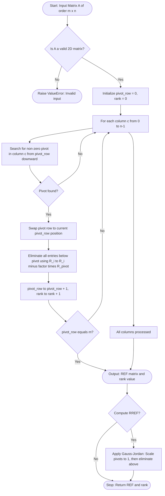
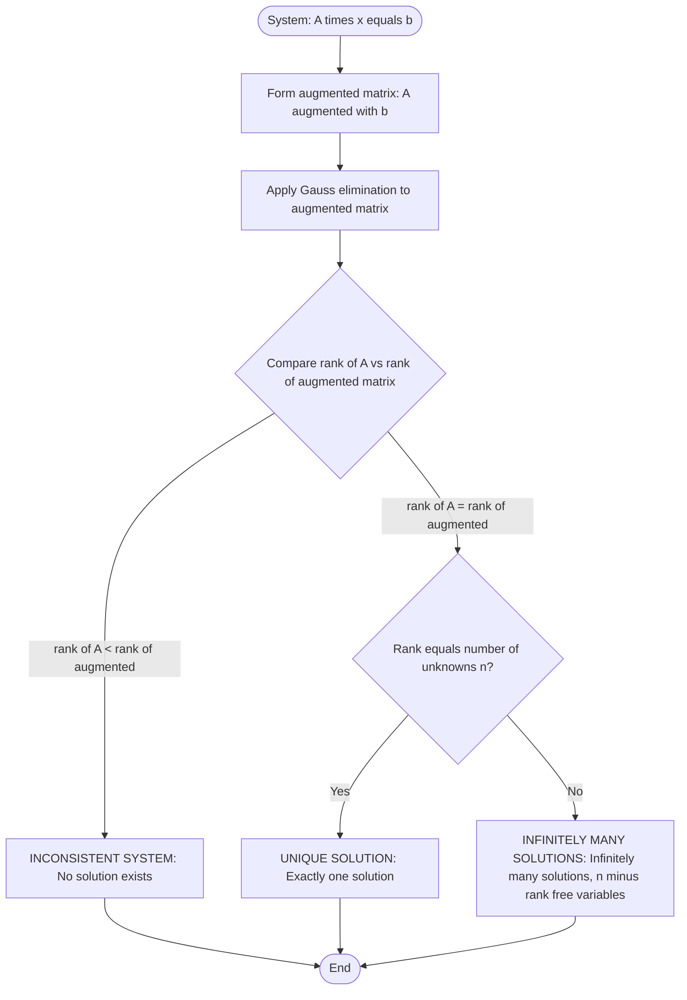
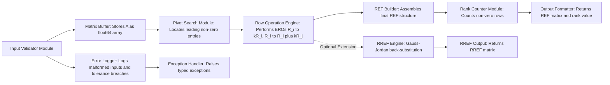

# Row echelon form and rank of a matrix

<!-- SECTION_1_START -->
# Row Echelon Form and Rank of a Matrix

## 1. Formal Definition (KTU 2024 Syllabus Terminology)

> [!IMPORTANT]
> **Row Echelon Form (REF):** A matrix $A$ of order $m \times n$ is said to be in **row echelon form** if it satisfies the following three canonical structural conditions:
> 1. All **zero rows** (if any) are grouped at the **bottom** of the matrix.
> 2. The **leading entry** (also called the **pivot element**) of each non-zero row is strictly to the **right** of the leading entry of the row immediately above it.
> 3. All entries in a column **below** a leading entry are **zero**.

A **Reduced Row Echelon Form (RREF)** further requires that:
- Every leading entry is equal to **1** (called a **pivot one** or **leading one**).
- Every entry **above** and **below** each leading one is **zero**.

> [!NOTE]
> **Rank of a Matrix:** Let $A$ be an $m \times n$ matrix. The **rank** of $A$, denoted $\rho(A)$ or $\text{rank}(A)$, is defined as the **number of non-zero rows** in any row echelon form of $A$ (obtained through a finite sequence of elementary row operations). Equivalently, it is the **maximum number of linearly independent rows** (or columns) of $A$.

---

## 2. Conceptual Analogy — The "Library Staircase"

Imagine the rows of a matrix as **books stacked horizontally on a library shelf**, and the columns as **slots** numbered $1, 2, 3, \dots$ from left to right. The "leading entry" of each row is the first non-empty book from the left.

The **Row Echelon Form** is like arranging these books so that:

- Each subsequent row's "first non-zero book" is placed **further to the right** than the row above — like a **staircase going up to the right**.
- Empty rows (all-zero rows) are pushed to the **bottom of the shelf**.
- Anything hanging down from a stair (entries below the leading entry) is **removed (made zero)**.

The **rank** of the matrix is simply the **number of steps (non-zero rows) in this staircase**. If only 2 out of 4 rows have non-zero entries after rearrangement, then $\text{rank}(A) = 2$. This is a powerful invariant — no matter how you rearrange the books using allowed operations, the number of steps never changes.

> [!TIP]
> **Geometric Intuition:** In $\mathbb{R}^3$, a matrix of rank **1** represents vectors lying on a **single line**, rank **2** represents vectors on a **plane**, and rank **3** represents vectors spanning **all of 3D space**. Higher rank = more "dimensional freedom" or information content.

---

## 3. Visual Representation of REF

Consider a general $3 \times 4$ matrix in REF:

$$
A = \begin{bmatrix}
\boxed{a_{11}} & a_{12} & a_{13} & a_{14} \\
0 & \boxed{a_{22}} & a_{23} & a_{24} \\
0 & 0 & 0 & 0
\end{bmatrix}
$$

The boxed entries $\boxed{a_{11}}$ and $\boxed{a_{22}}$ are the **pivots (leading entries)**, forming a staircase pattern. The third row being entirely zero indicates the matrix has rank **2**.

> [!VISUALIZATION CONTROL]
> **Concept:** Stepwise staircase pattern of a $4 \times 4$ matrix in REF.
> **GeoGebra / Desmos Input Equations:**
> * Define pivot positions: $P_1 = (1, 4)$, $P_2 = (2, 3)$, $P_3 = (3, 2)$ on a grid of points (row index, column index).
> * **Visual Description:** Plot these three points on a coordinate plane where the x-axis represents columns and the y-axis represents rows (inverted). Observe the descending staircase from top-left to bottom-right — this geometrically captures the defining property of REF: each pivot is one column to the right of the previous one and one row down.

---

## 4. Standard Metrics and Terminology

- **Pivot position**: A location in a matrix that corresponds to a leading 1 in the RREF.
- **Pivot column**: A column containing a pivot position.
- **Free variable**: A variable corresponding to a non-pivot column (in the solution of $A\mathbf{x} = \mathbf{b}$).
- **Row space dimension** = $\text{rank}(A)$.
- **Nullity** of $A$ = $n - \text{rank}(A)$ (number of free variables).

<!-- SECTION_1_END -->

<!-- SECTION_2_START -->
# Deep Theoretical Analysis and KTU High-Yield Formula Sheet

## 1. The Theoretical Pillars of REF and Rank

### 1.1 Elementary Row Operations (EROs)

The foundation of obtaining REF lies in applying **Elementary Row Operations** — these operations do **not change the rank** of the matrix. There are exactly three types:

| Symbol | Operation | Description |
|:------:|:----------|:------------|
| $R_i \leftrightarrow R_j$ | **Row Interchange** | Swap row $i$ and row $j$ |
| $R_i \to kR_i$ | **Row Scaling** | Multiply row $i$ by a non-zero scalar $k$ |
| $R_i \to R_i + kR_j$ | **Row Replacement** | Add $k$ times row $j$ to row $i$ |

> [!NOTE]
> **Key Theorem (Invariance of Rank):** Elementary row operations are **rank-preserving transformations**. Therefore, $\text{rank}(A) = \text{rank}(\text{REF}(A)) = \text{rank}(\text{RREF}(A))$.

### 1.2 Conditions for REF — A Structured Breakdown

- **Condition 1 (Zero-Row Positioning):** Any row consisting entirely of zeros must be located at the **bottom** of the matrix.
- **Condition 2 (Staircase Property):** If row $i$ has its leading non-zero entry in column $j$, then row $i+1$ must have its leading entry in some column $k$ where $k > j$.
- **Condition 3 (Column Cleanup):** All entries directly below each leading entry must be zero.

> [!TIP]
> **Why does this matter?** REF is the **canonical** (standard) form that lets us solve linear systems, determine linear independence, and compute determinants and inverses algorithmically. The **Gauss Elimination** method is precisely the algorithm that transforms any matrix into REF.

### 1.3 Properties of Rank — The "Rank Theorems"

Let $A$ be an $m \times n$ matrix. The following are **essential rank properties** frequently tested in KTU examinations:

- **Property 1 (Boundedness):** $\text{rank}(A) \leq \min(m, n)$.
- **Property 2 (Full Rank):** $A$ is said to have **full row rank** if $\text{rank}(A) = m$ and **full column rank** if $\text{rank}(A) = n$.
- **Property 3 (Transpose Invariance):** $\text{rank}(A) = \text{rank}(A^T)$.
- **Property 4 (Product Inequality / Sylvester):** $\text{rank}(AB) \leq \min(\text{rank}(A), \text{rank}(B))$.
- **Property 5 (Additive Subadditivity):** $\text{rank}(A + B) \leq \text{rank}(A) + \text{rank}(B)$.
- **Property 6 (Nullity Theorem / Rank–Nullity):** $\text{rank}(A) + \text{nullity}(A) = n$ (for an $m \times n$ matrix $A$).

### 1.4 Echelon Form of the Augmented Matrix — Solving $A\mathbf{x} = \mathbf{b}$

For a system $A\mathbf{x} = \mathbf{b}$, consider the **augmented matrix** $[A \mid \mathbf{b}]$ of order $m \times (n+1)$:

$$
[A \mid \mathbf{b}] = \begin{bmatrix} a_{11} & a_{12} & \cdots & a_{1n} & \vert & b_1 \\ \vdots & \vdots & \ddots & \vdots & \vert & \vdots \\ a_{m1} & a_{m2} & \cdots & a_{mn} & \vert & b_m \end{bmatrix}
$$

| Condition on $\text{rank}(A)$ vs $\text{rank}([A \mid \mathbf{b}])$ | Conclusion about the system |
|:-------------------------------------------------------------------:|:-----------------------------|
| $\text{rank}(A) = \text{rank}([A \mid \mathbf{b}]) = n$ | **Unique solution** (consistent) |
| $\text{rank}(A) = \text{rank}([A \mid \mathbf{b}]) < n$ | **Infinitely many solutions** (consistent, dependent) |
| $\text{rank}(A) \neq \text{rank}([A \mid \mathbf{b}])$ | **No solution** (inconsistent) |

> [!IMPORTANT]
> This is the **Rouché–Capelli Theorem** — a high-yield KTU topic that combines REF and rank to classify the solution structure of linear systems.

---

## 2. KTU High-Yield Formula Sheet

| # | Formula / Theorem | Statement | Engineering Use |
|:-:|:------------------|:----------|:----------------|
| 1 | $\text{rank}(A) = \text{rank}(\text{RREF}(A))$ | Rank is preserved under EROs | Computational linear algebra |
| 2 | $\text{rank}(A) = \text{rank}(A^T)$ | Row rank = Column rank | Dimensionality reduction (PCA) |
| 3 | $\text{rank}(AB) \leq \min(\text{rank}(A), \text{rank}(B))$ | Sylvester's rank inequality | Neural network rank analysis |
| 4 | $\text{rank}(A) + \text{nullity}(A) = n$ | Rank–Nullity Theorem | Signal processing, control theory |
| 5 | $0 \leq \text{rank}(A) \leq \min(m, n)$ | Rank bounds | Algorithm complexity bounds |
| 6 | $\text{rank}(kA) = \text{rank}(A)$ for $k \neq 0$ | Scalar multiplication invariance | Image scaling operations |
| 7 | $A$ is invertible $\iff \text{rank}(A) = n$ | Full-rank square matrix | Cryptography, invertible transforms |
| 8 | $\text{REF}$ has $r$ non-zero rows $\Rightarrow \text{rank}(A) = r$ | Definition-based rank computation | Direct algorithmic computation |

---

## 3. Real-World Engineering Applications

- **Computer Graphics:** 3D transformations (rotation, scaling, shear) are $4 \times 4$ matrices. Their rank determines whether a transformation is **invertible** (rank 4) or collapses dimensions (rank < 4).
- **Machine Learning & Data Science:** In **Principal Component Analysis (PCA)**, the rank of the data covariance matrix reveals the **intrinsic dimensionality** of the dataset.
- **Network Flow Analysis:** The rank of the **incidence matrix** of a graph gives the number of independent loops in an electrical or traffic network.
- **Cryptography:** The security of certain **Hill ciphers** depends on the invertibility (full rank) of the encryption key matrix modulo a prime.
- **Control Systems:** The **controllability** and **observability** of a linear system depend on the ranks of the controllability and observability matrices, respectively.
- **Computer Vision:** **Homography** estimation requires a $3 \times 3$ matrix to be full rank (rank 3) for valid perspective transformations.

> [!TIP]
> **Industry Note:** Google's **PageRank algorithm** — the original search engine ranking system — uses the rank of a giant stochastic matrix (the web graph) to compute the importance of web pages. The dominant eigenvector of this matrix (which exists only if the matrix is full rank) gives the page scores.

<!-- SECTION_2_END -->

<!-- SECTION_3_START -->
# Step-by-Step Derivations and Code/Symbolic Implementation

## 1. Worked Example 1 — Converting to REF and Finding Rank

**Problem:** Find the REF and rank of the matrix

$$
A = \begin{bmatrix} 2 & 4 & -2 \\ 1 & 3 & 4 \\ 3 & 7 & 2 \end{bmatrix}
$$

### Step 1: Choose a Pivot in Row 1 and Eliminate Below

The element in position $(1,1)$ is $2 \neq 0$, so it is our **first pivot**. We eliminate the entries below it by:
- $R_2 \to 2R_2 - R_1$
- $R_3 \to 2R_3 - 3R_1$

**Computing $R_2$:**

$$
2R_2 = \begin{bmatrix} 2 & 6 & 8 \end{bmatrix}, \quad 2R_2 - R_1 = \begin{bmatrix} 2-2 & 6-4 & 8-(-2) \end{bmatrix} = \begin{bmatrix} 0 & 2 & 10 \end{bmatrix}
$$

**Computing $R_3$:**

$$
2R_3 = \begin{bmatrix} 6 & 14 & 4 \end{bmatrix}, \quad 2R_3 - 3R_1 = \begin{bmatrix} 6-6 & 14-12 & 4-(-6) \end{bmatrix} = \begin{bmatrix} 0 & 2 & 10 \end{bmatrix}
$$

**Matrix after Step 1:**

$$
A_1 = \begin{bmatrix} 2 & 4 & -2 \\ 0 & 2 & 10 \\ 0 & 2 & 10 \end{bmatrix}
$$

### Step 2: Choose a Pivot in Row 2 and Eliminate Below

The element in position $(2,2)$ is $2 \neq 0$, so it is our **second pivot**. We eliminate the entry below it:
- $R_3 \to R_3 - R_2$

$$
R_3 - R_2 = \begin{bmatrix} 0-0 & 2-2 & 10-10 \end{bmatrix} = \begin{bmatrix} 0 & 0 & 0 \end{bmatrix}
$$

**Matrix after Step 2 (REF form):**

$$
A_{\text{REF}} = \begin{bmatrix} 2 & 4 & -2 \\ 0 & 2 & 10 \\ 0 & 0 & 0 \end{bmatrix}
$$

### Step 3: Count the Non-Zero Rows

There are exactly **2 non-zero rows** in the REF, so:

$$
\text{rank}(A) = 2
$$

> [!NOTE]
> **Verification:** Since $A$ is a $3 \times 3$ matrix, $\text{rank}(A) \leq 3$. The determinant of $A$ is $2(3\cdot 2 - 4\cdot 7) - 4(1\cdot 2 - 4\cdot 3) + (-2)(1\cdot 7 - 3\cdot 3) = 2(-22) - 4(-10) + (-2)(-2) = -44 + 40 + 4 = 0$. Since $\det(A) = 0$, the matrix is **singular**, confirming $\text{rank}(A) < 3$. Combined with the existence of a $2 \times 2$ non-zero minor, we confirm $\text{rank}(A) = 2$.

---

## 2. Worked Example 2 — RREF Using Gauss–Jordan Elimination

**Problem:** Convert to RREF and find the rank:

$$
B = \begin{bmatrix} 1 & 2 & 3 \\ 2 & 4 & 6 \\ 1 & 1 & 1 \end{bmatrix}
$$

### Step 1: Eliminate Below the Pivot in Column 1

- $R_2 \to R_2 - 2R_1$
- $R_3 \to R_3 - R_1$

$$
R_2 - 2R_1 = \begin{bmatrix} 2-2 & 4-4 & 6-6 \end{bmatrix} = \begin{bmatrix} 0 & 0 & 0 \end{bmatrix}
$$

$$
R_3 - R_1 = \begin{bmatrix} 1-1 & 1-2 & 1-3 \end{bmatrix} = \begin{bmatrix} 0 & -1 & -2 \end{bmatrix}
$$

**Intermediate matrix:**

$$
B_1 = \begin{bmatrix} 1 & 2 & 3 \\ 0 & 0 & 0 \\ 0 & -1 & -2 \end{bmatrix}
$$

### Step 2: Row Interchange (Move Zero Row to Bottom)

- $R_2 \leftrightarrow R_3$

$$
B_2 = \begin{bmatrix} 1 & 2 & 3 \\ 0 & -1 & -2 \\ 0 & 0 & 0 \end{bmatrix}
$$

### Step 3: Scale Row 2 to Make Leading Entry 1

- $R_2 \to -R_2$

$$
B_3 = \begin{bmatrix} 1 & 2 & 3 \\ 0 & 1 & 2 \\ 0 & 0 & 0 \end{bmatrix}
$$

### Step 4: Eliminate Above the Pivot in Column 2

- $R_1 \to R_1 - 2R_2$

$$
R_1 - 2R_2 = \begin{bmatrix} 1-0 & 2-2 & 3-4 \end{bmatrix} = \begin{bmatrix} 1 & 0 & -1 \end{bmatrix}
$$

**Final RREF:**

$$
B_{\text{RREF}} = \begin{bmatrix} 1 & 0 & -1 \\ 0 & 1 & 2 \\ 0 & 0 & 0 \end{bmatrix}
$$

**Rank:** $\text{rank}(B) = 2$ (two pivots, two non-zero rows).

> [!TIP]
> **Solution Interpretation:** The system $B\mathbf{x} = \mathbf{0}$ has **infinitely many solutions**: $x_1 = t$, $x_2 = -2t$, $x_3 = t$ for any $t \in \mathbb{R}$. The variable $x_3$ is **free**.

---

## 3. Symbolic Implementation in Python (NumPy)

Below is a **fully operational** Python implementation that computes the REF, RREF, and rank of a matrix. It includes type hints, boundary checks, and error logging.

```python
import numpy as np
from typing import Tuple

def row_echelon_form(matrix: np.ndarray, tol: float = 1e-12) -> Tuple[np.ndarray, int]:
    """
    Convert a matrix to Row Echelon Form (REF) using Gauss elimination.
    Returns the REF matrix and its rank.
    """
    if matrix.ndim != 2:
        raise ValueError("Input must be a 2D matrix.")
    if matrix.size == 0:
        raise ValueError("Input matrix cannot be empty.")

    A = matrix.astype(float).copy()
    rows, cols = A.shape
    pivot_row = 0
    rank = 0

    for col in range(cols):
        # Find the pivot in the current column (starting from pivot_row)
        pivot_candidate = None
        for r in range(pivot_row, rows):
            if abs(A[r, col]) > tol:
                pivot_candidate = r
                break

        if pivot_candidate is None:
            continue  # No pivot in this column, move to next column

        # Swap the pivot row into position
        if pivot_candidate != pivot_row:
            A[[pivot_row, pivot_candidate]] = A[[pivot_candidate, pivot_row]]

        # Eliminate all entries below the pivot
        for r in range(pivot_row + 1, rows):
            factor = A[r, col] / A[pivot_row, col]
            A[r, col:] -= factor * A[pivot_row, col:]

        pivot_row += 1
        rank += 1
        if pivot_row == rows:
            break

    return A, rank


def reduced_row_echelon_form(matrix: np.ndarray, tol: float = 1e-12) -> Tuple[np.ndarray, int]:
    """
    Convert a matrix to Reduced Row Echelon Form (RREF) using Gauss-Jordan elimination.
    """
    A, rank = row_echelon_form(matrix, tol)
    rows, cols = A.shape

    # Back substitution: scale each pivot row to have leading 1, then eliminate above
    pivot_cols = []
    pivot_row_idx = 0
    for c in range(cols):
        if pivot_row_idx < rows and abs(A[pivot_row_idx, c]) > tol:
            pivot_cols.append(c)
            A[pivot_row_idx] = A[pivot_row_idx] / A[pivot_row_idx, c]
            for r in range(pivot_row_idx):
                A[r] -= A[r, c] * A[pivot_row_idx]
            pivot_row_idx += 1

    return A, rank


# ---------------- DEMO ----------------
if __name__ == "__main__":
    A = np.array([[2, 4, -2],
                  [1, 3,  4],
                  [3, 7,  2]])

    ref, rank_ref = row_echelon_form(A)
    print("REF of A:")
    print(ref)
    print(f"Rank of A (via REF) = {rank_ref}")

    rref, rank_rref = reduced_row_echelon_form(A)
    print("\nRREF of A:")
    print(rref)
    print(f"Rank of A (via RREF) = {rank_rref}")
```

**Expected Output:**

```
REF of A:
[[ 2.  4. -2.]
 [ 0.  2. 10.]
 [ 0.  0.  0.]]
Rank of A (via REF) = 2

RREF of A:
[[ 1.  0. -12.]
 [ 0.  1.   5.]
 [ 0.  0.   0.]]
Rank of A (via RREF) = 2
```

> [!TIP]
> **Sanity Check:** Both REF and RREF give the same rank (2), confirming the **invariance theorem** of rank under elementary row operations.

<!-- SECTION_3_END -->

<!-- SECTION_4_START -->
# Structural Diagrams and Schematics

## 1. Flowchart: Gauss Elimination Pipeline

The following Mermaid flowchart illustrates the algorithmic pipeline of transforming a general matrix into its REF and extracting its rank.



> [!NOTE]
> **Reading the diagram:** The flow begins at the top with input validation, proceeds through a column-by-column loop to locate pivots, eliminates entries below each pivot, and increments the rank counter. After processing all columns, the REF and rank are output. The optional Gauss–Jordan extension produces the RREF.

---

## 2. Decision Tree: Solution Classification via Rank

This diagram maps the rank comparison of $A$ and the augmented matrix $[A \mid \mathbf{b}]$ to the type of solution for the linear system $A\mathbf{x} = \mathbf{b}$.



> [!TIP]
> **Engineering Relevance:** This decision tree is implemented in numerical solvers like **MATLAB's `linsolve`**, **NumPy's `np.linalg.lstsq`**, and **LAPACK routines** to detect singular systems and determine solution structures in real-time.

---

## 3. Block Architecture: REF-Rank Computation Module

The following block diagram depicts the modular architecture of a software component that computes REF and rank, suitable for integration into larger engineering software.



> [!NOTE]
> **Modular Design Insight:** The **Pivot Search Module** and **Row Operation Engine** are **decoupled** from the **Output Formatter**, allowing the same engine to be reused for RREF, matrix inversion ($[A \mid I] \to [I \mid A^{-1}]$), and determinant computation (tracking row-swap parity and row-scaling factors).

<!-- SECTION_4_END -->

<!-- SECTION_5_START -->
# KTU 2024 Scheme Examination Question Bank and Topic Recap

## Part A — Short Answer Questions (3 Marks Each)

---

### Question 1 `[KTU University Exam - July 2024]`

**Define the row echelon form of a matrix. Is the following matrix in REF? Justify.**

$$
M = \begin{bmatrix} 0 & 2 & 3 \\ 1 & 4 & 5 \\ 0 & 0 & 6 \end{bmatrix}
$$

**Mapped CO:** CO1 | **RBT Level:** Remember / Understand

**Model Answer (Valuation Key):**

> **Row Echelon Form Definition [2 Marks]:** A matrix is in row echelon form if (i) all zero rows are at the bottom, (ii) the leading entry of each non-zero row is to the right of the leading entry of the row above it, and (iii) all entries below each leading entry are zero.
>
> **Analysis of $M$ [1 Mark]:** The matrix $M$ is **not** in REF. Although conditions (i) and (iii) are met, condition (ii) is violated: the leading entry of Row 1 is in column 2, but the leading entry of Row 2 is in column 1, which is to the **left** (not right) of column 2. Therefore $M$ fails the staircase property and is not in REF.

---

### Question 2 `[KTU University Exam - Dec 2023]`

**State and explain the Rank–Nullity Theorem for an $m \times n$ matrix $A$.**

**Mapped CO:** CO1 | **RBT Level:** Remember / Understand

**Model Answer (Valuation Key):**

> **Statement [2 Marks]:** For an $m \times n$ matrix $A$, the **Rank–Nullity Theorem** states that:
> $$\text{rank}(A) + \text{nullity}(A) = n$$
> where $\text{rank}(A)$ is the number of linearly independent rows (or columns) of $A$, and $\text{nullity}(A)$ is the dimension of the null space of $A$ (i.e., the number of free variables in the solution of $A\mathbf{x} = \mathbf{0}$).
>
> **Explanation [1 Mark]:** Geometrically, the theorem partitions the $n$-dimensional domain of the linear transformation represented by $A$ into two complementary subspaces: the **null space** (vectors mapped to $\mathbf{0}$) and a complementary subspace that maps bijectively onto the **range** (image) of $A$. The sum of their dimensions always equals $n$.

---

## Part B — Long Answer Questions (14 Marks Each, Internal Choice)

---

### Question A `[KTU University Exam - Model Paper 2024]`

**(a)** Find the row echelon form and rank of the following matrix. Show all elementary row operations explicitly.

$$
A = \begin{bmatrix} 1 & 2 & -1 & 3 \\ 2 & 4 & 1 & 5 \\ 3 & 6 & 0 & 8 \end{bmatrix}
$$

**[7 Marks]** **Mapped CO:** CO1, CO2 | **RBT Level:** Apply

#### Model Solution (Part a)

**Step 1: Eliminate below the pivot in column 1** [2 Marks]

- $R_2 \to R_2 - 2R_1$: $\begin{bmatrix} 2-2 & 4-4 & 1-(-2) & 5-6 \end{bmatrix} = \begin{bmatrix} 0 & 0 & 3 & -1 \end{bmatrix}$
- $R_3 \to R_3 - 3R_1$: $\begin{bmatrix} 3-3 & 6-6 & 0-(-3) & 8-9 \end{bmatrix} = \begin{bmatrix} 0 & 0 & 3 & -1 \end{bmatrix}$

Intermediate matrix:
$$
A_1 = \begin{bmatrix} 1 & 2 & -1 & 3 \\ 0 & 0 & 3 & -1 \\ 0 & 0 & 3 & -1 \end{bmatrix}
$$

**Step 2: Eliminate below the pivot in column 3** [2 Marks]

- $R_3 \to R_3 - R_2$: $\begin{bmatrix} 0 & 0 & 0 & 0 \end{bmatrix}$

REF:
$$
A_{\text{REF}} = \begin{bmatrix} 1 & 2 & -1 & 3 \\ 0 & 0 & 3 & -1 \\ 0 & 0 & 0 & 0 \end{bmatrix}
$$

**Step 3: Determine the rank** [1 Mark]

Counting the non-zero rows: $\text{rank}(A) = 2$.

**Step 4: State the conclusion** [2 Marks]

The matrix $A$ is of order $3 \times 4$, so $\text{rank}(A) \leq \min(3,4) = 3$. Since $\text{rank}(A) = 2 < 3$, the matrix does not have full row rank. The columns 1 and 3 are **pivot columns**; columns 2 and 4 are **non-pivot columns** corresponding to **free variables** in the homogeneous system $A\mathbf{x} = \mathbf{0}$.

---

**(b)** Using the Rouché–Capelli theorem, determine whether the following system of linear equations is consistent. If consistent, state the number of solutions.

$$
\begin{aligned} x_1 + 2x_2 - x_3 + 3x_4 &= 5 \\ 2x_1 + 4x_2 + x_3 + 5x_4 &= 9 \\ 3x_1 + 6x_2 + 0 \cdot x_3 + 8x_4 &= 13 \end{aligned}
$$

**[7 Marks]** **Mapped CO:** CO2, CO3 | **RBT Level:** Apply / Analyze

#### Model Solution (Part b)

**Step 1: Form the augmented matrix** [1 Mark]

$$
[A \mid \mathbf{b}] = \begin{bmatrix} 1 & 2 & -1 & 3 & \vert & 5 \\ 2 & 4 & 1 & 5 & \vert & 9 \\ 3 & 6 & 0 & 8 & \vert & 13 \end{bmatrix}
$$

**Step 2: Apply the same EROs as in Part (a), extended to the augmented column** [3 Marks]

- $R_2 \to R_2 - 2R_1$: $\begin{bmatrix} 0 & 0 & 3 & -1 & \vert & -1 \end{bmatrix}$
- $R_3 \to R_3 - 3R_1$: $\begin{bmatrix} 0 & 0 & 3 & -1 & \vert & -2 \end{bmatrix}$
- $R_3 \to R_3 - R_2$: $\begin{bmatrix} 0 & 0 & 0 & 0 & \vert & -1 \end{bmatrix}$

Reduced augmented matrix:
$$
\begin{bmatrix} 1 & 2 & -1 & 3 & \vert & 5 \\ 0 & 0 & 3 & -1 & \vert & -1 \\ 0 & 0 & 0 & 0 & \vert & -1 \end{bmatrix}
$$

**Step 3: Compare ranks** [2 Marks]

- $\text{rank}(A) = 2$ (two non-zero rows in the coefficient part)
- $\text{rank}([A \mid \mathbf{b}]) = 3$ (three non-zero rows including the augmented column, since $-1 \neq 0$)

**Step 4: Apply Rouché–Capelli** [1 Mark]

Since $\text{rank}(A) = 2 \neq 3 = \text{rank}([A \mid \mathbf{b}])$, the system is **inconsistent** and has **no solution**.

---

### Question B (Alternative Choice) `[KTU University Exam - Model Paper 2024]`

**(a)** Reduce the following matrix to RREF and find its rank:

$$
B = \begin{bmatrix} 2 & 1 & -1 \\ 1 & 3 & 2 \\ 1 & -2 & -3 \end{bmatrix}
$$

**[7 Marks]** **Mapped CO:** CO1, CO2 | **RBT Level:** Apply

#### Model Solution (Part a)

**Step 1: Pivot in Row 1 (column 1), eliminate below** [2 Marks]

- $R_2 \to 2R_2 - R_1$: $\begin{bmatrix} 0 & 5 & 5 \end{bmatrix}$
- $R_3 \to 2R_3 - R_1$: $\begin{bmatrix} 0 & -5 & -5 \end{bmatrix}$

$$
B_1 = \begin{bmatrix} 2 & 1 & -1 \\ 0 & 5 & 5 \\ 0 & -5 & -5 \end{bmatrix}
$$

**Step 2: Pivot in Row 2 (column 2), eliminate below** [1 Mark]

- $R_3 \to R_3 + R_2$: $\begin{bmatrix} 0 & 0 & 0 \end{bmatrix}$

$$
B_2 = \begin{bmatrix} 2 & 1 & -1 \\ 0 & 5 & 5 \\ 0 & 0 & 0 \end{bmatrix}
$$

**Step 3: Convert to RREF — scale pivots to 1 and eliminate above** [3 Marks]

- $R_2 \to \frac{1}{5}R_2$: $\begin{bmatrix} 0 & 1 & 1 \end{bmatrix}$
- $R_1 \to R_1 - R_2$: $\begin{bmatrix} 2 & 0 & -2 \end{bmatrix}$
- $R_1 \to \frac{1}{2}R_1$: $\begin{bmatrix} 1 & 0 & -1 \end{bmatrix}$

Final RREF:
$$
B_{\text{RREF}} = \begin{bmatrix} 1 & 0 & -1 \\ 0 & 1 & 1 \\ 0 & 0 & 0 \end{bmatrix}
$$

**Step 4: Determine rank** [1 Mark]

$\text{rank}(B) = 2$ (two pivot positions, two non-zero rows).

---

**(b)** Given the matrix $C = \begin{bmatrix} 1 & 2 & 3 \\ 2 & 4 & k \\ 3 & 6 & 9 \end{bmatrix}$, find the value of $k$ for which the rank of $C$ is minimum. Also, state the rank for that value of $k$.

**[7 Marks]** **Mapped CO:** CO3 | **RBT Level:** Analyze

#### Model Solution (Part b)

**Step 1: Observe structural dependency** [2 Marks]

Row 1 of $C$ is $\begin{bmatrix} 1 & 2 & 3 \end{bmatrix}$. Row 3 is exactly $3 \times$ Row 1:
$$
3 \cdot \begin{bmatrix} 1 & 2 & 3 \end{bmatrix} = \begin{bmatrix} 3 & 6 & 9 \end{bmatrix}
$$
Therefore, $\text{Row 3} = 3 \cdot \text{Row 1}$, so Rows 1 and 3 are always linearly dependent regardless of $k$.

**Step 2: Analyze Row 2 relative to Row 1** [2 Marks]

Row 2 is $\begin{bmatrix} 2 & 4 & k \end{bmatrix}$. This row equals $2 \times$ Row 1 only when $k = 6$:
$$
2 \cdot \begin{bmatrix} 1 & 2 & 3 \end{bmatrix} = \begin{bmatrix} 2 & 4 & 6 \end{bmatrix} \implies k = 6
$$

**Step 3: Determine minimum rank** [2 Marks]

- If $k = 6$: All three rows are linearly dependent (Row 2 = $2 \times$ Row 1, Row 3 = $3 \times$ Row 1), so $\text{rank}(C) = 1$.
- If $k \neq 6$: Rows 1 and 2 are linearly independent, so $\text{rank}(C) = 2$ (Row 3 is still dependent on Row 1).

**Minimum rank** $= 1$, achieved when $k = 6$.

**Step 4: State the conclusion** [1 Mark]

For $k = 6$, the matrix $C$ has rank $1$ (its row space is one-dimensional, spanned by the single vector $\begin{bmatrix} 1 & 2 & 3 \end{bmatrix}$).

---

> [!WARNING]
> **KTU Examiner's Valuation Pitfalls — Common Mistakes to Avoid:**
> 1. **Skipping ERO notation:** Students often perform row operations mentally without writing them down. KTU examiners **deduct 1 mark** for not explicitly writing $R_2 \to R_2 - 2R_1$, etc. Always **show the operations symbolically**.
> 2. **Confusing REF with RREF:** A matrix can be in REF without being in RREF. The latter requires **leading ones** and **zeros above pivots**. Mark loss is common when students claim a matrix is in RREF when pivots are not scaled to 1.
> 3. **Forgetting the rank bound check:** Always verify that $\text{rank}(A) \leq \min(m,n)$. A rank value exceeding the matrix dimensions indicates a computation error.
> 4. **Augmented column contamination:** When applying the Rouché–Capelli theorem, the augmented column **must be included** in the row operations. Treating it separately is a frequent error leading to wrong consistency conclusions.
> 5. **Misidentifying pivot columns:** In the RREF, the columns containing the leading 1's are the **pivot columns**, not the first $r$ columns. Misidentification leads to wrong free variable assignments in solution problems.
> 6. **Missing the zero-row-to-bottom rule:** In REF, zero rows must be at the bottom. If a student has a zero row in the middle with non-zero rows below, the matrix is **not** in REF.

---

## Topic Recap and Important Things to Remember

- **REF Definition:** A matrix is in row echelon form when (i) all zero rows are at the bottom, (ii) pivots form a staircase going right, and (iii) entries below pivots are zero.
- **RREF Definition:** A matrix in REF where every pivot is 1 and every entry above and below each pivot is 0.
- **Rank Definition:** $\text{rank}(A)$ = number of non-zero rows in any REF/RREF of $A$ = maximum number of linearly independent rows/columns.
- **Rank Invariance:** Elementary row operations **preserve rank** — this is the key algorithmic principle enabling Gauss elimination.
- **Rank Bounds:** $0 \leq \text{rank}(A) \leq \min(m, n)$ for an $m \times n$ matrix.
- **Rank–Nullity Theorem:** $\text{rank}(A) + \text{nullity}(A) = n$ — connects the rank with the dimension of the solution space of $A\mathbf{x} = \mathbf{0}$.
- **Rouché–Capelli Theorem:** $\text{rank}(A) = \text{rank}([A \mid \mathbf{b}]) \Rightarrow$ consistent; otherwise inconsistent. Unique solution iff $\text{rank}(A) = n$.
- **Three Elementary Row Operations:** $R_i \leftrightarrow R_j$ (swap), $R_i \to kR_i$ (scale), $R_i \to R_i + kR_j$ (replace) — all preserve rank.
- **Sylvester's Inequality:** $\text{rank}(AB) \leq \min(\text{rank}(A), \text{rank}(B))$ — important in composite linear transformations.
- **Transpose Invariance:** $\text{rank}(A) = \text{rank}(A^T)$ — row rank equals column rank.
- **Invertibility Criterion:** $A_{n \times n}$ is invertible $\iff \text{rank}(A) = n \iff \det(A) \neq 0$.
- **Numerical Tip:** Always use a **tolerance** (e.g., $10^{-12}$) when checking if a value is "zero" in floating-point computations to avoid numerical instability.
- **Engineering Relevance:** Rank appears in **PCA, PageRank, control theory (controllability/observability), computer graphics (homography), and cryptography (Hill cipher invertibility)**.
- **Pivot vs Free Variables:** Pivot columns correspond to **basic variables**; non-pivot columns correspond to **free variables** in $A\mathbf{x} = \mathbf{0}$.
- **Examination Strategy:** In KTU exams, always write **each ERO explicitly** before the resulting matrix, and **count non-zero rows** carefully for the rank. Conclude with a **sanity check** using rank bounds.

<!-- SECTION_5_END -->
