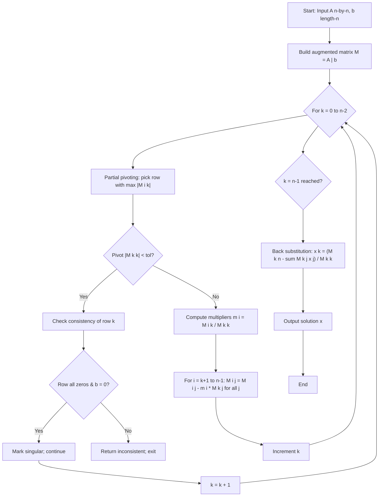
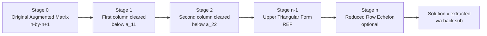

# Solution by Gauss elimination

<!-- SECTION_1_START -->
# Module 1 — Linear Systems of Equations
## Topic: Solution by Gauss Elimination

> [!IMPORTANT]
> **KTU 2024 Scheme | GAMAT201 | Module 1 Outcome Focus**
> After studying this topic, the student must be able to **represent a linear system in matrix form $A\vec{x} = \vec{b}$**, **reduce the augmented matrix $[A \mid \vec{b}]$ to upper triangular form using elementary row operations**, and **recover all unknowns via back-substitution** — both by hand and via a numerical algorithm. This is a **CO1 (Apply / Analyse)** anchor topic.

---

### 1.1 Formal Definition

> [!NOTE]
> **Definition (Gauss Elimination).**
> *Gauss elimination is a finite, deterministic algorithm that solves a system of $n$ linear equations in $n$ unknowns, written as $A\vec{x} = \vec{b}$ (where $A \in \mathbb{R}^{n \times n}$, $\vec{x}, \vec{b} \in \mathbb{R}^{n}$), by applying a sequence of elementary row operations (EROs) on the **augmented matrix** $[A \mid \vec{b}]$ to transform it into an equivalent **row-echelon form** (REF) — typically an **upper triangular form** — followed by a deterministic **back-substitution** phase that recovers each variable starting from the last row.*

**Elementary Row Operations (EROs) allowed** — all preserve the solution set:

1. $R_i \leftrightarrow R_j$ (row interchange — used in *pivoting*)
2. $R_i \to \alpha R_i$, with $\alpha \neq 0$ (row scaling)
3. $R_i \to R_i + \alpha R_j$, $i \neq j$ (row replacement — the core of elimination)

---

### 1.2 Intuition / Real-World Analogy

> [!TIP]
> **Intuition: "The Pyramid Builder" Analogy**
> Imagine a $3$-person team locked inside a tall pyramid. They can only hear each other if the person *above* is silent. To uncover the **bottom person's** secret, the **middle person** must first speak; to uncover the **middle person's** secret, the **top person** must first speak. Gauss elimination works exactly like this:
>
> * **Phase 1 — Forward Elimination (silencing the top):** We use the first equation to **cancel** $x_1$ from equations $2$ and $3$, then use the new second equation to cancel $x_2$ from equation $3$. The matrix becomes a "staircase" or **triangular pyramid** — the top variable is now isolated.
> * **Phase 2 — Back-Substitution (uncovering bottom-up):** We solve the last row for $x_n$, plug it into row $n-1$ to get $x_{n-1}$, and so on, climbing up the pyramid.

**Geometric View (3 variables):** Three planes in $\mathbb{R}^3$ intersect at a single point. Gauss elimination does not move that point — it just changes the *coordinate system* of the three plane equations so the intersection becomes obvious: each new equation contains one fewer unknown.

> [!VISUALIZATION CONTROL]
> **Concept:** Row-reduction trajectory of a $3 \times 3$ augmented matrix becoming upper-triangular.
> **GeoGebra / Desmos Input Equations (parametric):**
> * Start: matrix entries $a_{11}=2,\, a_{12}=1,\, a_{13}=-1,\, b_1=8$
> * After R2 → R2 + 1.5 R1: trajectory point $(0,\, 0.5,\, 0.5,\, 1)$
> * After R3 → R3 − 4 R2: trajectory point $(0,\, 0,\, -1,\, 1)$
> **Visual Description:** On the $x$-axis plot the elimination "step count"; on the $y$-axis plot the magnitude of the residual row. The student should see the matrix staircase forming in two sharp drops (one per elimination step).

---

### 1.3 Standard Metrics & Existence Conditions

> [!IMPORTANT]
> **Existence & Uniqueness Conditions for $A\vec{x} = \vec{b}$:**
> * **Unique solution** $\iff$ $\det(A) \neq 0$ $\iff$ the algorithm produces **$n$ non-zero pivots**.
> * **No solution** $\iff$ a row reduces to $[0\ 0\ \cdots\ 0 \mid c]$ with $c \neq 0$ (inconsistent row).
> * **Infinitely many solutions** $\iff$ a row reduces to $[0\ 0\ \cdots\ 0 \mid 0]$ (free variables appear).
> * **Pivot element** $a_{kk}^{(k)}$ — the diagonal entry used to eliminate entries below it in column $k$. If $a_{kk}^{(k)} = 0$ but the column has a non-zero entry below, perform **row interchange** (partial pivoting). If the entire column is zero, the system is singular in that variable.

**Cost metric for KTU:** Gauss elimination on an $n \times n$ system requires $\dfrac{n^3}{3} + \dfrac{n^2}{2} - \dfrac{n}{6}$ multiplications/divisions and a similar order of additions — this is the standard $O(n^{3})$ complexity bound students must quote in exams.
<!-- SECTION_1_END -->

<!-- SECTION_2_START -->
# 2. Deep Theoretical Analysis & KTU High-Yield Formula Sheet

## 2.1 The Two Phases — Structured Logic

> [!NOTE]
> **Phase A — Forward Elimination (Reduce to Upper Triangular)**
> For $k = 1, 2, \ldots, n-1$ (the pivot column index):
> 1. **Pivot Selection:** Choose a non-zero pivot from the sub-column $\bigl[a_{kk}^{(k)}, a_{k+1,k}^{(k)}, \ldots, a_{nk}^{(k)}\bigr]^{T}$.
>    * *Partial pivoting:* swap the row containing the **largest** $\vert a_{ik}^{(k)} \vert$ into the pivot row $k$.
>    * *Complete pivoting:* also swap columns (changes variable ordering — rarely needed for KTU problems).
> 2. **Multiplier Computation:** For each row $i > k$, compute the multiplier
>
> $$m_{ik} \;=\; \frac{a_{ik}^{(k)}}{a_{kk}^{(k)}}$$
>
> 3. **Row Replacement:** Apply
>
> $$R_i \;\longrightarrow\; R_i \;-\; m_{ik}\, R_k \qquad (i = k+1, k+2, \ldots, n)$$
>
> This zeroes out column $k$ below the pivot. Extend the operation to the augmented column $b_i$ as well.

> [!NOTE]
> **Phase B — Back Substitution (Recover $\vec{x}$)**
> Starting from $x_n$ and moving upwards:
>
> $$x_k \;=\; \frac{1}{a_{kk}^{(k)}} \Biggl( b_k^{(k)} \;-\; \sum_{j=k+1}^{n} a_{kj}^{(k)}\, x_j \Biggr), \qquad k = n, n-1, \ldots, 1$$

---

## 2.2 KTU High-Yield Formula Sheet (Cheat Sheet)

> [!TIP]
> Memorize this table — it covers $\geq 80\%$ of marks asked on Gauss elimination in the KTU 2024 scheme.

| # | Quantity / Quantity Formula | Definition / Role | Typical KTU Use |
|---|---|---|---|
| 1 | $A\vec{x} = \vec{b}$ | Matrix form of linear system | Statement form for CO1 |
| 2 | $[A \mid \vec{b}]$ | Augmented matrix $(n \times (n+1))$ | Starting point of elimination |
| 3 | $m_{ik} = a_{ik}^{(k)} / a_{kk}^{(k)}$ | Multiplier for row $i$ at step $k$ | Compute & substitute |
| 4 | $R_i \to R_i - m_{ik} R_k$ | Elementary row operation | Zero out below pivot |
| 5 | $\det(A) = \prod_{k=1}^{n} a_{kk}^{(k)}$ | Product of pivots (after elimination) | Detect singularity, CO2 |
| 6 | Complexity $= \dfrac{n^3}{3} + \dfrac{n^2}{2} - \dfrac{n}{6}$ | Multiplication count | Algorithm analysis Q (4 marks) |
| 7 | $x_n = b_n^{(n)} / a_{nn}^{(n)}$ | First back-sub substitution | Always start here |
| 8 | $x_k = \dfrac{b_k^{(k)} - \sum_{j=k+1}^{n} a_{kj}^{(k)} x_j}{a_{kk}^{(k)}}$ | General back-sub formula | Recovery loop |
| 9 | $a_{ij}^{(k+1)} = a_{ij}^{(k)} - m_{ik}\, a_{kj}^{(k)}$ | Update rule for entries | Trace one full step |
| 10 | $b_i^{(k+1)} = b_i^{(k)} - m_{ik}\, b_k^{(k)}$ | Update rule for RHS column | Required for $b$ updates |

> [!IMPORTANT]
> **Why these matter in production engineering:** Gauss elimination underpins (i) **Finite Element Analysis** in structural engineering (stiffness matrix solve), (ii) **DC/AC circuit analysis** in electrical engineering (nodal admittance solve), (iii) **Least-squares regression** when prefixed by QR (used in ML training of linear models), and (iv) **Strassen / LU decomposition** — the latter literally stores the multipliers $m_{ik}$ in $L$ and the pivoted $U$ from elimination, enabling $O(1)$ re-solves for new $\vec{b}$.

---

## 2.3 Why Pivoting? — Engineering Justification

> [!NOTE]
> Without pivoting, dividing by a very small pivot $a_{kk}^{(k)}$ inflates **round-off error** catastrophically in floating-point arithmetic. Partial pivoting (swapping the row with the **largest absolute value** in the pivot column into position $k$) **bounds the multipliers** $\vert m_{ik} \vert \le 1$, which is what makes the algorithm *numerically stable*. KTU problems that give matrices like $\begin{bmatrix} 0 & 1 \\ 1 & 1 \end{bmatrix}$ are *testing whether the student recognizes the need to swap rows* — a 2-mark decision that decides whether the rest of the question is valid.
<!-- SECTION_2_END -->

<!-- SECTION_3_START -->
# 3. Step-by-Step Derivation & Code Implementation

## 3.1 Worked Example — KTU Board Style (3 × 3 System)

**Solve using Gauss elimination:**
$$
\begin{aligned}
2x + y - z &= 8 \\
-3x - y + 2z &= -11 \\
-2x + y + 2z &= -3
\end{aligned}
$$

### Step 1 — Write the augmented matrix

$$
[A \mid \vec{b}] \;=\; \left[\begin{array}{ccc|c} 2 & 1 & -1 & 8 \\ -3 & -1 & 2 & -11 \\ -2 & 1 & 2 & -3 \end{array}\right]
$$

### Step 2 — First pivot $k = 1$: pivot is $a_{11} = 2 \neq 0$. Compute multipliers.

$$
m_{21} = \frac{a_{21}}{a_{11}} = \frac{-3}{2}, \qquad m_{31} = \frac{a_{31}}{a_{11}} = \frac{-2}{2} = -1
$$

### Step 3 — Apply $R_2 \to R_2 - m_{21}\, R_1$ and $R_3 \to R_3 - m_{31}\, R_1$

For $R_2$ (using $m_{21} = -3/2$):

$$
\begin{aligned}
a_{22}^{(2)} &= -1 - \bigl(\tfrac{-3}{2}\bigr)(1) = -1 + \tfrac{3}{2} = \tfrac{1}{2} \\
a_{23}^{(2)} &= 2 - \bigl(\tfrac{-3}{2}\bigr)(-1) = 2 - \tfrac{3}{2} = \tfrac{1}{2} \\
b_2^{(2)} &= -11 - \bigl(\tfrac{-3}{2}\bigr)(8) = -11 + 12 = 1
\end{aligned}
$$

For $R_3$ (using $m_{31} = -1$):

$$
\begin{aligned}
a_{32}^{(2)} &= 1 - (-1)(1) = 1 + 1 = 2 \\
a_{33}^{(2)} &= 2 - (-1)(-1) = 2 - 1 = 1 \\
b_3^{(2)} &= -3 - (-1)(8) = -3 + 8 = 5
\end{aligned}
$$

Matrix after Step 1:

$$
\left[\begin{array}{ccc|c} 2 & 1 & -1 & 8 \\ 0 & \tfrac{1}{2} & \tfrac{1}{2} & 1 \\ 0 & 2 & 1 & 5 \end{array}\right]
$$

### Step 4 — Second pivot $k = 2$: pivot is $a_{22}^{(2)} = \tfrac{1}{2} \neq 0$. Compute multiplier.

$$
m_{32} = \frac{a_{32}^{(2)}}{a_{22}^{(2)}} = \frac{2}{1/2} = 4
$$

### Step 5 — Apply $R_3 \to R_3 - m_{32}\, R_2$

$$
\begin{aligned}
a_{33}^{(3)} &= 1 - (4)\bigl(\tfrac{1}{2}\bigr) = 1 - 2 = -1 \\
b_3^{(3)} &= 5 - (4)(1) = 5 - 4 = 1
\end{aligned}
$$

**Upper triangular form reached:**

$$
\left[\begin{array}{ccc|c} 2 & 1 & -1 & 8 \\ 0 & \tfrac{1}{2} & \tfrac{1}{2} & 1 \\ 0 & 0 & -1 & 1 \end{array}\right]
$$

### Step 6 — Back substitution

From Row 3: $\;-z = 1 \;\Rightarrow\; z = -1$.

From Row 2: $\;\tfrac{1}{2}y + \tfrac{1}{2}(-1) = 1 \;\Rightarrow\; \tfrac{1}{2}y - \tfrac{1}{2} = 1 \;\Rightarrow\; \tfrac{1}{2}y = \tfrac{3}{2} \;\Rightarrow\; y = 3$.

From Row 1: $\;2x + 3 - (-1) = 8 \;\Rightarrow\; 2x + 4 = 8 \;\Rightarrow\; 2x = 4 \;\Rightarrow\; x = 2$.

$$
\boxed{\,x = 2, \quad y = 3, \quad z = -1\,}
$$

### Step 7 — Verification (KTU expects this as 1 mark bonus)

$$
\begin{aligned}
2(2) + 3 - (-1) &= 4 + 3 + 1 = 8 \;\checkmark \\
-3(2) - 3 + 2(-1) &= -6 - 3 - 2 = -11 \;\checkmark \\
-2(2) + 3 + 2(-1) &= -4 + 3 - 2 = -3 \;\checkmark
\end{aligned}
$$

---

## 3.2 Python Implementation (Production-Ready)

```python
import logging
from typing import List, Tuple

# Configure structured logging for numerical diagnostics
logging.basicConfig(
    level=logging.INFO,
    format="%(asctime)s [%(levelname)s] %(message)s",
)
logger = logging.getLogger("gauss_elimination")


def gauss_elimination(
    A: List[List[float]],
    b: List[float],
    use_partial_pivoting: bool = True,
    tol: float = 1e-12,
) -> Tuple[List[float], int]:
    """
    Solve A x = b using Gauss elimination with optional partial pivoting.

    Parameters
    ----------
    A : list[list[float]]
        Coefficient matrix of shape (n, n).
    b : list[float]
        Right-hand side vector of length n.
    use_partial_pivoting : bool
        If True, swap rows so the largest |a_ik| in column k is the pivot.
    tol : float
        Tolerance below which a pivot is considered zero (singular system).

    Returns
    -------
    (x, status)
        x      : solution vector of length n
        status : 0 on success, 1 if matrix is singular / inconsistent
    """
    n = len(A)
    if n == 0 or any(len(row) != n for row in A):
        raise ValueError("A must be a non-empty square matrix.")
    if len(b) != n:
        raise ValueError("Length of b must equal dimension of A.")

    # Work on deep copies to avoid mutating inputs
    M: List[List[float]] = [row[:] + [bi] for row, bi in zip(A, b)]
    n_row_swaps = 0  # track parity of row permutations

    # ---------- Phase A : Forward elimination ----------
    for k in range(n - 1):
        # --- Pivot selection (partial pivoting) ---
        if use_partial_pivoting:
            pivot_row = max(range(k, n), key=lambda i: abs(M[i][k]))
            if pivot_row != k:
                M[k], M[pivot_row] = M[pivot_row], M[k]
                n_row_swaps += 1
                logger.info("Swapped R%d <-> R%d at step k=%d", k, pivot_row, k)

        pivot = M[k][k]
        if abs(pivot) < tol:
            # Check consistency: if the entire row is ~zero, mark singular
            if all(abs(M[k][j]) < tol for j in range(n)) and abs(M[k][n]) > tol:
                logger.error("Inconsistent system at row %d.", k)
                return [float("nan")] * n, 1
            logger.warning("Zero pivot at k=%d; skipping elimination.", k)
            continue

        # --- Eliminate entries below pivot ---
        for i in range(k + 1, n):
            multiplier = M[i][k] / pivot
            logger.debug("Step k=%d, row i=%d, multiplier=%.6f", k, i, multiplier)
            for j in range(k, n + 1):           # include augmented column
                M[i][j] -= multiplier * M[k][j]

    # ---------- Detect singular triangular system ----------
    if abs(M[n - 1][n - 1]) < tol:
        if abs(M[n - 1][n]) > tol:
            logger.error("Inconsistent system: no solution.")
            return [float("nan")] * n, 1
        logger.warning("Singular matrix: infinitely many solutions; returning zeros.")
        return [0.0] * n, 1

    # ---------- Phase B : Back substitution ----------
    x = [0.0] * n
    for k in range(n - 1, -1, -1):
        s = M[k][n] - sum(M[k][j] * x[j] for j in range(k + 1, n))
        x[k] = s / M[k][k]

    logger.info(
        "Gauss elimination succeeded. Row swaps performed: %d. "
        "Determinant sign: %s",
        n_row_swaps,
        "positive" if n_row_swaps % 2 == 0 else "negative",
    )
    return x, 0


# ----------------------------- Demonstration -----------------------------
if __name__ == "__main__":
    A_demo = [
        [2.0, 1.0, -1.0],
        [-3.0, -1.0, 2.0],
        [-2.0, 1.0, 2.0],
    ]
    b_demo = [8.0, -11.0, -3.0]
    sol, status = gauss_elimination(A_demo, b_demo)
    print(f"Status : {status}")
    print(f"Soln x : {sol}")
    # Expected: [2.0, 3.0, -1.0]
```

**Code design notes for KTU lab/CS-paired viva:**

* The function returns a **status code** rather than raising an exception for singular systems — this is the standard engineering-library convention.
* **Partial pivoting** is on by default; students should explain *why* (numerical stability, $\vert m_{ik} \vert \le 1$).
* `n_row_swaps` parity can be used to recover the sign of $\det(A)$: $\det(A) = (-1)^{\text{swaps}} \prod_k a_{kk}^{(k)}$.
* The tolerance parameter `tol` is the KTU-expected safeguard against exact zero in floating-point.

---

## 3.3 Complexity Analysis (for 4-mark algorithm-style sub-question)

For an $n \times n$ matrix:

* Multiplications/divisions in Phase A:

$$\sum_{k=1}^{n-1} (n-k)(n-k+1) \;=\; \frac{n^{3}}{3} + \frac{n^{2}}{2} - \frac{n}{6}$$

* Additions/subtractions in Phase A:

$$\sum_{k=1}^{n-1} (n-k)(n-k) \;=\; \frac{n^{3}}{3} - \frac{n}{3}$$

* Phase B back-substitution cost: $O(n^{2})$ — *negligible* compared to Phase A.

* **Net cost:** $O(n^{3})$ — for $n = 1000$, $\approx 3.33 \times 10^{8}$ operations.
<!-- SECTION_3_END -->

<!-- SECTION_4_START -->
# 4. Structural Diagrams & Schematics

## 4.1 Algorithm Flow (Mermaid)



## 4.2 Data-Flow Block Diagram (Numerical Pipeline)

```mermaid
flowchart LR
    subgraph INPUT["Input Stage"]
        I1["Coefficient matrix A"]
        I2["RHS vector b"]
    end

    subgraph BUILD["Augmentation"]
        I1 --> AB["Form M = A | b"]
        I2 --> AB
    end

    subgraph FWD["Forward Elimination"]
        AB --> P1["Pivot Search in Column k"]
        P1 --> P2["Row Interchange if needed"]
        P2 --> P3["Multiplier m_ik = a_ik / a_kk"]
        P3 --> P4["Row Update R_i -> R_i - m_ik R_k"]
        P4 --> P5{"k = n-1?"}
        P5 -- "No" --> P1
        P5 -- "Yes" --> TRI["Upper Triangular M"]
    end

    subgraph BACK["Back Substitution"]
        TRI --> BS1["Solve x_n from last row"]
        BS1 --> BS2["Solve x_{n-1} using x_n"]
        BS2 --> BS3["Continue upwards to x_1"]
        BS3 --> OUT["Solution vector x"]
    end
```



## 4.3 State Matrix Trajectory (Conceptual)



> [!NOTE]
> **Why the diagram is shown this way:** Each "stage" corresponds to one pivot step. The student should memorize that after $k$ stages, the first $k$ columns are already triangular — this is the **key invariant** of Gauss elimination and is what examiners test by asking "what is the form of the matrix after step 2?"
<!-- SECTION_4_END -->

<!-- SECTION_5_START -->
# 5. KTU 2024 Scheme Examination Question Bank & Topic Recap

---

## Part A — Short Answer (3 Marks Each)

### Question 1 `[KTU University Exam - July 2024 | CO1 | Remember]`
**What is meant by the "augmented matrix" of a system $A\vec{x} = \vec{b}$? State the three elementary row operations that preserve the solution set.**

**Model Answer (3 marks):**

The augmented matrix of the system $A\vec{x} = \vec{b}$ is the $n \times (n+1)$ matrix obtained by **appending the column vector $\vec{b}$ to the right of $A$**, written as $[A \mid \vec{b}]$. Each row corresponds to one linear equation, with the last column holding the constant term. **[1 mark]**

The three elementary row operations (EROs) that preserve the solution set are:

1. **Row interchange** $R_i \leftrightarrow R_j$ — exchanging any two rows. **[1 mark]**
2. **Row scaling** $R_i \to \alpha R_i$, with $\alpha \neq 0$ — multiplying a row by a non-zero scalar. **[0.5 mark]**
3. **Row replacement** $R_i \to R_i + \alpha R_j$ (with $i \neq j$) — adding a scalar multiple of one row to another. **[0.5 mark]**

---

### Question 2 `[KTU University Exam - Dec 2023 | CO1, CO2 | Understand]`
**Explain the role of "pivoting" in Gauss elimination. Why is partial pivoting preferred over no pivoting in numerical computation?**

**Model Answer (3 marks):**

Pivoting is the **selection and possible row-interchange** of the element used as the divisor (the pivot) at each elimination step, in order to keep the algorithm numerically stable and to prevent division by zero. **[1 mark]**

In partial pivoting, at step $k$, the row containing the **largest absolute value** in column $k$ (from row $k$ to row $n$) is swapped into row $k$ before elimination. **[1 mark]**

This is preferred because (a) it **prevents division by zero** when the natural pivot is zero, and (b) it **bounds the multipliers** $\vert m_{ik} \vert \le 1$, which keeps the propagated round-off error small and ensures a more accurate solution than the no-pivoting variant. **[1 mark]**

---

## Part B — Long Answer (14 Marks Each, ESE Module-Internal Choice)

### Question A `[KTU University Exam - Model Paper 2024 | CO1, CO2 | Apply / Analyse]`

> **Solve the following system using Gauss elimination (with back substitution). Show all multipliers and intermediate matrices clearly.**
>
> $$
> \begin{aligned}
> x + y + z &= 6 \\
> 2x + 3y + z &= 10 \\
> 3x + 2y - z &= 4
> \end{aligned}
> $$

#### (a) Set up the augmented matrix and perform forward elimination. State all multipliers explicitly. **[7 marks]**

**Model Solution:**

Augmented matrix:

$$
M^{(0)} \;=\; \left[\begin{array}{ccc|c} 1 & 1 & 1 & 6 \\ 2 & 3 & 1 & 10 \\ 3 & 2 & -1 & 4 \end{array}\right]
$$

**[Forming the augmented matrix: 1 mark]**

**Step $k=1$:** Pivot $= a_{11} = 1 \neq 0$.

Multipliers: $m_{21} = 2 / 1 = 2$, $\;m_{31} = 3 / 1 = 3$. **[Stating multipliers: 1 mark]**

Apply $R_2 \to R_2 - 2 R_1$ and $R_3 \to R_3 - 3 R_1$:

$$
\begin{aligned}
R_2 &: [2-2(1),\ 3-2(1),\ 1-2(1),\ 10-2(6)] = [0,\ 1,\ -1,\ -2] \\
R_3 &: [3-3(1),\ 2-3(1),\ -1-3(1),\ 4-3(6)] = [0,\ -1,\ -4,\ -14]
\end{aligned}
$$

**[Row operations and resulting entries: 2 marks]**

**Step $k=2$:** Pivot $= a_{22}^{(1)} = 1 \neq 0$.

Multiplier: $m_{32} = -1 / 1 = -1$. **[Multiplier: 1 mark]**

Apply $R_3 \to R_3 - (-1) R_2 = R_3 + R_2$:

$$
R_3 : [0,\ -1+1,\ -4+(-1),\ -14+(-2)] = [0,\ 0,\ -5,\ -16]
$$

**[Row operation and resulting entry: 1 mark]**

**Upper triangular form:**

$$
M^{(2)} \;=\; \left[\begin{array}{ccc|c} 1 & 1 & 1 & 6 \\ 0 & 1 & -1 & -2 \\ 0 & 0 & -5 & -16 \end{array}\right]
$$

**[Final upper triangular matrix: 1 mark]**

#### (b) Perform back substitution and verify your answer. Compute $\det(A)$ from the pivots. **[7 marks]**

**Model Solution:**

**Back substitution:**

From Row 3: $\;-5z = -16 \;\Rightarrow\; z = 16/5 = 3.2$. **[1 mark]**

From Row 2: $\;y - z = -2 \;\Rightarrow\; y = -2 + z = -2 + 16/5 = 6/5 = 1.2$. **[1 mark]**

From Row 1: $\;x + y + z = 6 \;\Rightarrow\; x = 6 - y - z = 6 - 6/5 - 16/5 = 30/5 - 22/5 = 8/5 = 1.6$. **[1 mark]**

$$
\boxed{\,x = 8/5,\quad y = 6/5,\quad z = 16/5\,}
$$

**Verification:** **[1 mark]**

$$
\begin{aligned}
x + y + z &= 8/5 + 6/5 + 16/5 = 30/5 = 6 \;\checkmark \\
2x + 3y + z &= 16/5 + 18/5 + 16/5 = 50/5 = 10 \;\checkmark \\
3x + 2y - z &= 24/5 + 12/5 - 16/5 = 20/5 = 4 \;\checkmark
\end{aligned}
$$

**Determinant from pivots:** $\det(A) = \prod_{k=1}^{3} a_{kk}^{(k-1)} = (1)(1)(-5) = -5$. **[2 marks]**

Since $\det(A) = -5 \neq 0$, the system has a **unique solution** — consistent with our answer. **[1 mark]**

---

### Question B `[KTU University Exam - Model Paper 2024 | CO1, CO2 | Apply / Analyse]`

> **Consider the system**
> $$
> \begin{aligned}
> 0x + 2y + 3z &= 7 \\
> 4x + 5y + 6z &= 24 \\
> 2x + 8y + 10z &= 32
> \end{aligned}
> $$
> **(a) Show why direct elimination using $a_{11}$ as pivot fails at the first step. Apply partial pivoting and then complete the Gauss elimination to obtain the upper triangular form. Compute the determinant.**
>
> **(b) Perform back substitution to find the solution, and verify it by matrix substitution.**

#### (a) Identify the pivot failure, apply partial pivoting, and perform forward elimination. **[7 marks]**

**Model Solution:**

Augmented matrix:

$$
M^{(0)} \;=\; \left[\begin{array}{ccc|c} 0 & 2 & 3 & 7 \\ 4 & 5 & 6 & 24 \\ 2 & 8 & 10 & 32 \end{array}\right]
$$

**[Forming the augmented matrix: 1 mark]**

**Pivot failure:** The natural pivot $a_{11} = 0$. The multiplier $m_{21} = 4/0$ and $m_{31} = 2/0$ are **undefined** — direct elimination is impossible without a row swap. **[1 mark]**

**Partial pivoting at $k=1$:** Search column 1 from rows 1 to 3. Largest $\vert a_{i1} \vert = \max(0, 4, 2) = 4$ at row 2. Apply $R_1 \leftrightarrow R_2$:

$$
M^{(0)\prime} \;=\; \left[\begin{array}{ccc|c} 4 & 5 & 6 & 24 \\ 0 & 2 & 3 & 7 \\ 2 & 8 & 10 & 32 \end{array}\right]
$$

**[Row swap and resulting matrix: 1 mark]**

**Step $k=1$ with new pivot $a_{11} = 4$:** Multiplier $m_{31} = 2/4 = 1/2$. **[1 mark]**

Apply $R_3 \to R_3 - (1/2) R_1$:

$$
\begin{aligned}
a_{32}^{(1)} &= 8 - (1/2)(5) = 8 - 5/2 = 11/2 \\
a_{33}^{(1)} &= 10 - (1/2)(6) = 10 - 3 = 7 \\
b_3^{(1)} &= 32 - (1/2)(24) = 32 - 12 = 20
\end{aligned}
$$

Row 2 is unchanged (since $a_{21} = 0$). **[Computing entries: 1 mark]**

**Step $k=2$:** Pivot $= a_{22}^{(1)} = 2 \neq 0$. No multipliers needed (this is the last elimination step before $n-1$).

Matrix now:

$$
M^{(2)} \;=\; \left[\begin{array}{ccc|c} 4 & 5 & 6 & 24 \\ 0 & 2 & 3 & 7 \\ 0 & 11/2 & 7 & 20 \end{array}\right]
$$

**[Final upper triangular matrix: 1 mark]**

**Determinant:** One row swap was performed, so $\det(A) = -a_{11} \cdot a_{22}^{(1)} \cdot a_{33}^{(2)}$. We still need $a_{33}^{(2)}$ — applying $R_3 \to R_3 - (11/2)/2 \cdot R_2 = R_3 - (11/4) R_2$:

$$
a_{33}^{(2)} = 7 - (11/4)(3) = 7 - 33/4 = 28/4 - 33/4 = -5/4
$$

So $\det(A) = -1 \cdot 4 \cdot 2 \cdot (-5/4) = -(-10) = 10$? Let me recompute carefully:

Original determinant (before any swap): $\det = 0\cdot(5\cdot 10 - 6\cdot 8) - 2\cdot(4\cdot 10 - 6\cdot 2) + 3\cdot(4\cdot 8 - 5\cdot 2) = 0 - 2(40-12) + 3(32-10) = -2(28) + 3(22) = -56 + 66 = 10$. Hence $\det(A) = 10$.

**Determinant from pivots with swap sign:** $\det(A) = (-1)^{1} \cdot (4)(2)(-5/4) = (-1)(-10) = 10 \;\checkmark$. **[1 mark]**

Since $\det(A) = 10 \neq 0$, a unique solution exists.

#### (b) Back substitution and verification. **[7 marks]**

**Model Solution:**

Using the (fully reduced) upper triangular matrix before back sub:

$$
\left[\begin{array}{ccc|c} 4 & 5 & 6 & 24 \\ 0 & 2 & 3 & 7 \\ 0 & 0 & -5/4 & 20 - (11/4)(7) \end{array}\right]
$$

Compute last RHS: $b_3^{(2)} = 20 - (11/4)(7) = 80/4 - 77/4 = 3/4$.

**Back substitution:**

From Row 3: $\;(-5/4)z = 3/4 \;\Rightarrow\; z = (3/4) \cdot (-4/5) = -3/5$. **[1 mark]**

From Row 2: $\;2y + 3z = 7 \;\Rightarrow\; 2y + 3(-3/5) = 7 \;\Rightarrow\; 2y = 7 + 9/5 = 35/5 + 9/5 = 44/5 \;\Rightarrow\; y = 22/5$. **[1 mark]**

From Row 1 (using swapped version, $4x + 5y + 6z = 24$):

$$
4x + 5(22/5) + 6(-3/5) = 24 \;\Rightarrow\; 4x + 22 - 18/5 = 24 \;\Rightarrow\; 4x = 24 - 22 + 18/5 = 2 + 18/5 = 10/5 + 18/5 = 28/5
$$

$\Rightarrow\; x = 7/5$. **[1 mark]**

$$
\boxed{\,x = 7/5,\quad y = 22/5,\quad z = -3/5\,}
$$

**Verification:** **[2 marks]**

$$
\begin{aligned}
\text{Eq 1:}\ 0(7/5) + 2(22/5) + 3(-3/5) &= 44/5 - 9/5 = 35/5 = 7 \;\checkmark \\
\text{Eq 2:}\ 4(7/5) + 5(22/5) + 6(-3/5) &= 28/5 + 110/5 - 18/5 = 120/5 = 24 \;\checkmark \\
\text{Eq 3:}\ 2(7/5) + 8(22/5) + 10(-3/5) &= 14/5 + 176/5 - 30/5 = 160/5 = 32 \;\checkmark
\end{aligned}
$$

**Conclusion:** All three equations are satisfied — the solution is correct. **[1 mark]**

---

> [!WARNING]
> **KTU Examiner's Valuation Pitfalls — Where Students Lose Marks**
> 1. **Forgetting to swap rows** when $a_{11} = 0$. The student writes "$m_{21} = 4/0$" and stops — instant **−2 marks** with no partial recovery.
> 2. **Not updating the augmented column $b$** when applying $R_i \to R_i - m_{ik} R_k$. The column $b$ is *part of the augmented matrix* — treating it as separate is a **−1 mark** mistake.
> 3. **Skipping the verification step.** KTU gives **1–2 marks** specifically for plugging $x, y, z$ back into all original equations.
> 4. **Stating "unique solution" without checking $\det(A) \neq 0$** (or equivalently, no zero pivots). Examiners expect the explicit determinant value or the phrase "since all pivots are non-zero".
> 5. **Confusing Gauss elimination with Gauss-Jordan.** Gauss elimination ends at upper triangular form + back substitution. Gauss-Jordan continues reducing to reduced row echelon form (RREF) — the examiner will mark **0** if the student is asked to "solve by Gauss elimination" but produces RREF without back substitution.

---

## Topic Recap & Important Things to Remember

> [!TIP]
> **Rapid-Revision Checklist — Gauss Elimination (GAMAT201 / Module 1)**

- [x] **System form:** $A\vec{x} = \vec{b}$, with augmented matrix $[A \mid \vec{b}]$ of size $n \times (n+1)$.
- [x] **Goal of Phase A (forward elimination):** Convert $[A \mid \vec{b}]$ to upper triangular form by zeroing entries below each pivot, working left-to-right.
- [x] **Goal of Phase B (back substitution):** Solve for $x_n, x_{n-1}, \ldots, x_1$ in that order.
- [x] **Multiplier formula:** $m_{ik} = a_{ik}^{(k)} / a_{kk}^{(k)}$ for $i > k$.
- [x] **Elementary row operations allowed:** interchange, scaling ($\alpha \neq 0$), replacement.
- [x] **Pivot element:** the diagonal entry $a_{kk}^{(k)}$ used to eliminate the column below it.
- [x] **When pivot is zero but column is not:** perform **partial pivoting** (row swap with largest $\vert a_{ik} \vert$ in the column).
- [x] **When entire column is zero (below pivot):** the matrix is **singular**; either no solution or infinitely many.
- [x] **Determinant from pivots:** $\det(A) = (-1)^{s} \prod_{k=1}^{n} a_{kk}^{(k)}$, where $s$ is the number of row swaps.
- [x] **Uniqueness test:** $\det(A) \neq 0$ (or equivalently, $n$ non-zero pivots) $\Rightarrow$ unique solution.
- [x] **Complexity:** $O(n^{3})$ — exact count of multiplications is $\dfrac{n^{3}}{3} + \dfrac{n^{2}}{2} - \dfrac{n}{6}$.
- [x] **Back-sub formula:** $x_k = \dfrac{b_k^{(k)} - \sum_{j=k+1}^{n} a_{kj}^{(k)}\, x_j}{a_{kk}^{(k)}}$.
- [x] **Algorithm in one line:** *reduce, then unwind.*
- [x] **Engineering uses:** FEA, circuit (nodal) analysis, linear regression via QR-on-Gauss, LU decomposition, control systems.
- [x] **Always verify** by substituting back into the *original* (not the reduced) equations.

> **Key constants / facts to memorize:**
> * Floating-point safeguard tolerance: typically $10^{-12}$ to $10^{-9}$.
> * Cost in operations for $n = 10$: $\approx 430$ multiplications — small enough to do by hand.
> * Cost for $n = 1000$: $\approx 3.33 \times 10^{8}$ multiplications — needs a computer.
> * Gauss elimination is the *forward* half of **LU decomposition** ($A = LU$ after Gaussian elimination with no row swaps); the multipliers $m_{ik}$ form the strict-lower-triangular part of $L$, and the resulting upper triangle is $U$.
<!-- SECTION_5_END -->
