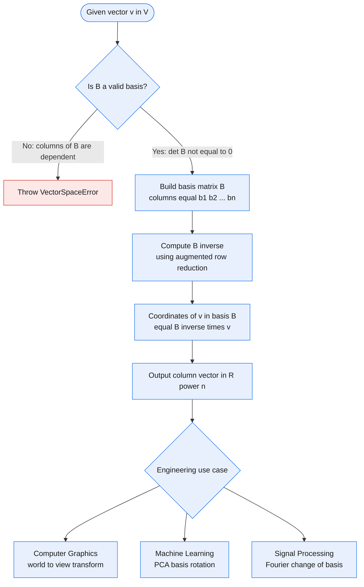
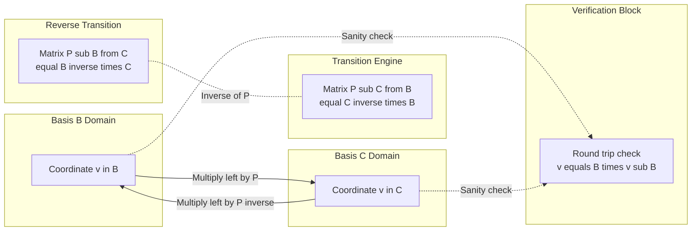
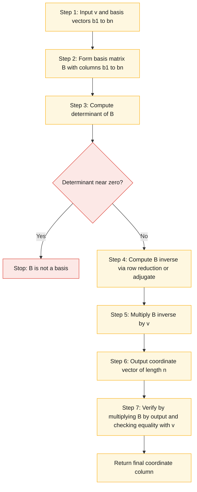
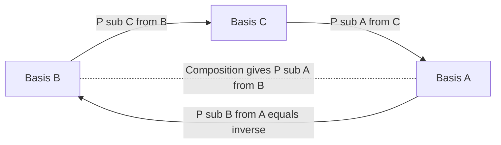

# Basis for a vector space, dimension of a space, coordinate representations in $R^n$, change-of-basis transition matrices

<!-- SECTION_1_START -->
# Basis, Dimension, Coordinates & Change of Basis in $\mathbb{R}^n$

> [!IMPORTANT]
> **KTU 2024 Scheme | GAMAT201 | Module 2**
> These four ideas — **basis**, **dimension**, **coordinates**, and **change of basis** — are the *bridge* between abstract vector spaces and the concrete matrix computations that power computer graphics, machine learning, signal processing, and data compression.

---

## 1.1 The Four Pillars — Formal Definitions

### A. Basis of a Vector Space $V$
A **basis** $\mathcal{B}$ of a vector space $V$ (over $\mathbb{R}$) is an **ordered set of vectors**
$$\mathcal{B} = \{\mathbf{b}_1, \mathbf{b}_2, \dots, \mathbf{b}_n\}$$
that satisfies **two simultaneous conditions**:

1. **Linear Independence** — No vector in the set can be written as a linear combination of the others. Equivalently,
$$c_1 \mathbf{b}_1 + c_2 \mathbf{b}_2 + \cdots + c_n \mathbf{b}_n = \mathbf{0} \;\Longrightarrow\; c_1 = c_2 = \cdots = c_n = 0$$
2. **Spanning Property** — Every vector $\mathbf{v} \in V$ can be expressed as a linear combination of $\mathcal{B}$:
$$\mathbf{v} = x_1 \mathbf{b}_1 + x_2 \mathbf{b}_2 + \cdots + x_n \mathbf{b}_n$$

> [!NOTE]
> **Standard Basis of $\mathbb{R}^n$**: The vectors $\mathbf{e}_1 = (1,0,\dots,0)$, $\mathbf{e}_2 = (0,1,\dots,0)$, $\ldots$, $\mathbf{e}_n = (0,0,\dots,1)$ form the canonical basis, often called $\mathcal{E}$. Every vector $(x_1, x_2, \dots, x_n) \in \mathbb{R}^n$ is trivially a combination of the $\mathbf{e}_i$.

### B. Dimension of a Vector Space
The **dimension** of a non-zero vector space $V$, denoted $\dim(V)$, is the **number of vectors in any basis** of $V$.

$$\dim(V) = n \quad \text{where } \mathcal{B} = \{\mathbf{b}_1, \dots, \mathbf{b}_n\}$$

> [!IMPORTANT]
> **Dimension is a theorem, not a definition:** The set of vectors forming a basis is *not* unique, but **every basis has exactly the same cardinality**. This is a deep theorem (proved via the Steinitz Exchange Lemma), and it is what makes "dimension" a well-defined integer.

| Vector Space | Typical Basis | $\dim$ |
| :--- | :--- | :---: |
| $\mathbb{R}^n$ | $\{\mathbf{e}_1, \mathbf{e}_2, \dots, \mathbf{e}_n\}$ | $n$ |
| $M_{m \times n}(\mathbb{R})$ (matrices) | $\{E_{ij}\}$ | $mn$ |
| $P_n(\mathbb{R})$ (polynomials of deg $\le n$) | $\{1, x, x^2, \dots, x^n\}$ | $n+1$ |
| $\{\mathbf{0}\}$ (the zero space) | $\varnothing$ | $0$ |

### C. Coordinate Representation in $\mathbb{R}^n$
Given a basis $\mathcal{B} = \{\mathbf{b}_1, \dots, \mathbf{b}_n\}$ of $\mathbb{R}^n$, the **coordinate vector** of $\mathbf{v} \in \mathbb{R}^n$ **relative to** $\mathcal{B}$ is the unique column

$$[\mathbf{v}]_{\mathcal{B}} = \begin{bmatrix} x_1 \\ x_2 \\ \vdots \\ x_n \end{bmatrix} \in \mathbb{R}^n \quad \text{such that} \quad \mathbf{v} = x_1\mathbf{b}_1 + x_2\mathbf{b}_2 + \cdots + x_n\mathbf{b}_n$$

> [!NOTE]
> **Crucial KTU Pitfall:** The vector $\mathbf{v}$ *lives* in the vector space; the coordinate $[\mathbf{v}]_{\mathcal{B}}$ *lives* in $\mathbb{R}^n$. The map $\mathbf{v} \mapsto [\mathbf{v}]_{\mathcal{B}}$ is an **isomorphism** (a structure-preserving bijection).

### D. Change-of-Basis Transition Matrix
Let $\mathcal{B} = \{\mathbf{b}_1, \dots, \mathbf{b}_n\}$ and $\mathcal{C} = \{\mathbf{c}_1, \dots, \mathbf{c}_n\}$ be **two ordered bases** of the same vector space. The **change-of-coordinates matrix from $\mathcal{B}$ to $\mathcal{C}$** is the $n \times n$ matrix $P_{\mathcal{C} \leftarrow \mathcal{B}}$ whose columns are the coordinates of the $\mathcal{B}$-vectors expressed in the $\mathcal{C}$-basis:

$$P_{\mathcal{C} \leftarrow \mathcal{B}} = \begin{bmatrix} \big[\mathbf{b}_1\big]_{\mathcal{C}} & \big[\mathbf{b}_2\big]_{\mathcal{C}} & \cdots & \big[\mathbf{b}_n\big]_{\mathcal{C}} \end{bmatrix}$$

This matrix satisfies the **master change-of-basis identity**:

$$[\mathbf{v}]_{\mathcal{C}} \;=\; P_{\mathcal{C} \leftarrow \mathcal{B}} \, [\mathbf{v}]_{\mathcal{B}}$$

The **inverse** is the reverse transition:

$$[\mathbf{v}]_{\mathcal{B}} \;=\; P_{\mathcal{B} \leftarrow \mathcal{C}} \, [\mathbf{v}]_{\mathcal{C}} \;=\; \big(P_{\mathcal{C} \leftarrow \mathcal{B}}\big)^{-1} [\mathbf{v}]_{\mathcal{C}}$$

---

## 1.2 Conceptual Analogy — The Idea Made Concrete

> [!TIP]
> **Analogy: A Building with Two Floor Plans**
>
> Imagine a building with $n$ rooms. The *building* is your abstract vector space $V$. Two different architects, **Architect B** and **Architect C**, label the same rooms with two different numbering schemes.
>
> * A **basis** is a complete, non-redundant list of "address-tokens" used to locate any point in the building.
> * The **dimension** $n$ is the *number of independent directions* you can move in — e.g., $3$ in 3D space (left-right, forward-back, up-down).
> * The **coordinate vector** of a tenant $\mathbf{v}$ is their apartment number **under one specific architect's scheme**.
> * A **change-of-basis matrix** is the **translation dictionary** between the two architects' numbering systems.
>
> Just as the tenant has a fixed physical location but two different labels, $\mathbf{v}$ is a fixed vector with two different coordinate representations.

### Geometric Intuition in $\mathbb{R}^2$
> [!VISUALIZATION CONTROL]
> **Concept:** Visualizing two different bases for $\mathbb{R}^2$ — the standard basis $\mathcal{E} = \{(1,0),(0,1)\}$ versus a non-standard basis $\mathcal{B} = \{(2,1),(1,2)\}$.
>
> **GeoGebra / Desmos Input Equations:**
> * `Vector1 = (2, 1)` — first basis vector
> * `Vector2 = (1, 2)` — second basis vector
> * `Vector3 = (3, 3)` — an arbitrary vector to decompose
> * `Line1: y = 0.5 x` — direction of $\mathbf{b}_1$
> * `Line2: y = 2 x` — direction of $\mathbf{b}_2$
>
> **Visual Description:** On the standard $xy$-plane, you will see the familiar unit grid. The two new basis vectors $\mathbf{b}_1$ and $\mathbf{b}_2$ form a *skewed grid*. The vector $(3,3)$ can be reached by walking $1$ step along $\mathbf{b}_1$ and $1$ step along $\mathbf{b}_2$ (try it: $(2,1) + (1,2) = (3,3)$), so its coordinates in $\mathcal{B}$ are $(1,1)$ even though its standard coordinates are $(3,3)$.
<!-- SECTION_1_END -->

<!-- SECTION_2_START -->
# Deep Theoretical Analysis & KTU High-Yield Formula Sheet

## 2.1 Existence, Uniqueness, and the Coordinate Isomorphism

### Theorem 2.1 — Uniqueness of Coordinates
> For a fixed ordered basis $\mathcal{B} = \{\mathbf{b}_1, \dots, \mathbf{b}_n\}$ of $V$, the representation
> $$\mathbf{v} = x_1\mathbf{b}_1 + \cdots + x_n\mathbf{b}_n$$
> is **unique**.

*Proof Sketch:* Suppose $\mathbf{v}$ has two representations. Subtract them; the difference is a linear combination equalling $\mathbf{0}$. By independence, all coefficients are equal.

### Theorem 2.2 — The Coordinate Mapping is an Isomorphism
> The map $\Phi_{\mathcal{B}} : V \to \mathbb{R}^n$ defined by $\Phi_{\mathcal{B}}(\mathbf{v}) = [\mathbf{v}]_{\mathcal{B}}$ is a **bijection** that preserves both addition and scalar multiplication. Hence $V \cong \mathbb{R}^n$ as vector spaces.

This is **why** a Computer Science student can manipulate *any* finite-dimensional vector space using the matrix machinery of $\mathbb{R}^n$ — they are secretly working with the *coordinate image*.

### Theorem 2.3 — Invariance of Dimension
> Any two bases of a finite-dimensional vector space $V$ have the **same cardinality**.

This is the **Steinitz Exchange Lemma** at work: if $\{\mathbf{b}_1, \dots, \mathbf{b}_m\}$ and $\{\mathbf{c}_1, \dots, \mathbf{c}_n\}$ are both bases, then $m = n$.

### Theorem 2.4 — The Invertibility of a Basis Matrix
> If $B = \begin{bmatrix} \mathbf{b}_1 & \mathbf{b}_2 & \cdots & \mathbf{b}_n \end{bmatrix}$ is the $n \times n$ matrix whose columns are the basis $\mathcal{B}$ written in **standard coordinates**, then
> $$\mathbf{v} = B\,[\mathbf{v}]_{\mathcal{B}}$$
> and $B$ is **nonsingular** (determinant $\neq 0$).

This is the workhorse identity for **computing coordinates**:

$$[\mathbf{v}]_{\mathcal{B}} = B^{-1}\mathbf{v}$$

---

## 2.2 KTU High-Yield Formula Sheet

| # | Concept | Formula / Statement | Units / Notes |
|:-:|:---|:---|:---|
| 1 | Basis definition | Linearly independent **and** spans $V$ | $\mathcal{B} = \{\mathbf{b}_1, \dots, \mathbf{b}_n\}$ |
| 2 | Coordinate equation | $\mathbf{v} = \sum_{i=1}^{n} x_i \mathbf{b}_i$ | Unique $(x_1, \dots, x_n)$ |
| 3 | Coordinate vector | $[\mathbf{v}]_{\mathcal{B}} = (x_1, x_2, \dots, x_n)^{T}$ | Column vector in $\mathbb{R}^n$ |
| 4 | Dimension | $\dim(V) = n$ | Number of basis vectors |
| 5 | Basis matrix in std coords | $B = [\mathbf{b}_1 \mid \mathbf{b}_2 \mid \cdots \mid \mathbf{b}_n]$ | Columns = basis vectors |
| 6 | Coordinates via basis matrix | $[\mathbf{v}]_{\mathcal{B}} = B^{-1}\mathbf{v}$ | Requires $\det B \neq 0$ |
| 7 | Standard basis of $\mathbb{R}^n$ | $\mathbf{e}_i$ has $1$ in $i$-th slot, $0$ elsewhere | $\dim = n$ |
| 8 | Change of basis (forward) | $[\mathbf{v}]_{\mathcal{C}} = P_{\mathcal{C} \leftarrow \mathcal{B}} \, [\mathbf{v}]_{\mathcal{B}}$ | $P$ columns = $[\mathbf{b}_i]_{\mathcal{C}}$ |
| 9 | Change of basis (reverse) | $[\mathbf{v}]_{\mathcal{B}} = P_{\mathcal{B} \leftarrow \mathcal{C}} \, [\mathbf{v}]_{\mathcal{C}} = (P_{\mathcal{C} \leftarrow \mathcal{B}})^{-1} [\mathbf{v}]_{\mathcal{C}}$ | $P^{-1}$ always exists |
| 10 | Identity transition | $P_{\mathcal{B} \leftarrow \mathcal{B}} = I_n$ | Sanity check |
| 11 | Composition rule | $P_{\mathcal{A} \leftarrow \mathcal{B}} = P_{\mathcal{A} \leftarrow \mathcal{C}} \, P_{\mathcal{C} \leftarrow \mathcal{B}}$ | Matrix multiplication, order matters |
| 12 | $\dim(\text{span of } S)$ | Number of pivots when $S$ is row-reduced | Equals rank of matrix of $S$ |
| 13 | Basis extension theorem | Add vectors until spanning; remove until independent | Any spanning set contains a basis |
| 14 | Coordinate of a basis vector | $[\mathbf{b}_i]_{\mathcal{B}} = \mathbf{e}_i$ | Standard coordinate $i$ |

> [!NOTE]
> **KTU Board Tip:** Always write the *arrow direction* explicitly in $P_{\mathcal{C} \leftarrow \mathcal{B}}$. Many students lose 2 marks by writing $P_{\mathcal{B}\mathcal{C}}$ ambiguously. The convention is **right-to-left reading**: "from $\mathcal{B}$ *to* $\mathcal{C}$."

---

## 2.3 Why This Matters in Information Science

> [!TIP]
> **Real-World Engineering Utility**
>
> 1. **Computer Graphics & Animation:** A 3D model stores vertices in coordinates relative to a *local* (object) basis. To render the model on screen, the GPU multiplies the vertex coordinates by a change-of-basis matrix (the *world-to-view* transform) to obtain *camera-relative* coordinates. This single idea underlies every modern 3D engine (OpenGL, DirectX, Vulkan, WebGL).
> 2. **Machine Learning & Data Science:** Algorithms like **Principal Component Analysis (PCA)** and **Singular Value Decomposition (SVD)** are *literally* change-of-basis operations — they rotate the data so that its axes align with the directions of maximum variance. The new basis makes patterns easier to detect.
> 3. **Cryptography & Coding Theory:** Error-correcting codes use subspaces of $\mathbb{F}_2^n$ (the *vector space over the binary field*). Bases, dimensions, and coordinate maps are the basic vocabulary.
> 4. **Quantum Computing:** Qubits live in a 2-dimensional complex Hilbert space, and a *change of basis* corresponds to a physical rotation of measurement — the deepest fact in quantum mechanics is that *observables are self-adjoint operators* whose eigenvectors form bases.
> 5. **Signal Processing:** The Discrete Fourier Transform is a change of basis from the time domain (standard basis) to the frequency domain (Fourier basis).
<!-- SECTION_2_END -->

<!-- SECTION_3_START -->
# Step-by-Step Derivations & Code Implementation

## 3.1 Derivation: Coordinates from a Given Basis

**Setup.** Let $\mathcal{B} = \{\mathbf{b}_1, \dots, \mathbf{b}_n\}$ be a basis of $\mathbb{R}^n$, and let $\mathbf{v} \in \mathbb{R}^n$. Form the augmented matrix and row-reduce.

$$
\begin{aligned}
\mathbf{v} &= x_1 \mathbf{b}_1 + x_2 \mathbf{b}_2 + \cdots + x_n \mathbf{b}_n \\
\underbrace{\begin{bmatrix} \mathbf{b}_1 & \mathbf{b}_2 & \cdots & \mathbf{b}_n \end{bmatrix}}_{B \text{ (the basis matrix)}} \begin{bmatrix} x_1 \\ x_2 \\ \vdots \\ x_n \end{bmatrix} &= \mathbf{v} \\
B \, [\mathbf{v}]_{\mathcal{B}} &= \mathbf{v}
\end{aligned}
$$

Since $\mathcal{B}$ is a basis, the columns of $B$ are linearly independent, so $\det B \neq 0$, hence $B$ is invertible. Multiplying both sides by $B^{-1}$:

$$[\mathbf{v}]_{\mathcal{B}} = B^{-1}\mathbf{v}$$

This is the **canonical formula for finding coordinates**.

### Worked Derivation in $\mathbb{R}^2$

Let $\mathcal{B} = \{\mathbf{b}_1, \mathbf{b}_2\}$ with $\mathbf{b}_1 = \begin{bmatrix} 1 \\ 1 \end{bmatrix}$ and $\mathbf{b}_2 = \begin{bmatrix} 1 \\ -1 \end{bmatrix}$, and let $\mathbf{v} = \begin{bmatrix} 5 \\ 1 \end{bmatrix}$. Find $[\mathbf{v}]_{\mathcal{B}}$.

**Step 1.** Form the basis matrix $B$:

$$B = \begin{bmatrix} 1 & 1 \\ 1 & -1 \end{bmatrix}$$

**Step 2.** Compute $\det B$:

$$\det B = (1)(-1) - (1)(1) = -1 - 1 = -2 \neq 0 \;\;\checkmark \text{ (basis is valid)}$$

**Step 3.** Compute $B^{-1}$ using the $2 \times 2$ formula $B^{-1} = \dfrac{1}{\det B}\begin{bmatrix} d & -b \\ -c & a \end{bmatrix}$:

$$
\begin{aligned}
B^{-1} &= \frac{1}{-2}\begin{bmatrix} -1 & -1 \\ -1 & 1 \end{bmatrix} \\
&= \begin{bmatrix} \frac{1}{2} & \frac{1}{2} \\[4pt] \frac{1}{2} & -\frac{1}{2} \end{bmatrix}
\end{aligned}
$$

**Step 4.** Multiply $B^{-1}$ by $\mathbf{v}$:

$$
\begin{aligned}
[\mathbf{v}]_{\mathcal{B}} = B^{-1}\mathbf{v} &= \begin{bmatrix} \frac{1}{2} & \frac{1}{2} \\[4pt] \frac{1}{2} & -\frac{1}{2} \end{bmatrix} \begin{bmatrix} 5 \\ 1 \end{bmatrix} \\
&= \begin{bmatrix} \frac{1}{2}(5) + \frac{1}{2}(1) \\[4pt] \frac{1}{2}(5) + (-\frac{1}{2})(1) \end{bmatrix} \\
&= \begin{bmatrix} \frac{5}{2} + \frac{1}{2} \\[4pt] \frac{5}{2} - \frac{1}{2} \end{bmatrix} \\
&= \begin{bmatrix} 3 \\ 2 \end{bmatrix}
\end{aligned}
$$

**Step 5.** Sanity check (must recover $\mathbf{v}$ via $B\,[\mathbf{v}]_{\mathcal{B}}$):

$$
\begin{aligned}
B\,[\mathbf{v}]_{\mathcal{B}} &= \begin{bmatrix} 1 & 1 \\ 1 & -1 \end{bmatrix}\begin{bmatrix} 3 \\ 2 \end{bmatrix} \\
&= \begin{bmatrix} 3 + 2 \\ 3 - 2 \end{bmatrix} = \begin{bmatrix} 5 \\ 1 \end{bmatrix} = \mathbf{v} \;\;\checkmark
\end{aligned}
$$

**Conclusion:** The vector $\mathbf{v} = (5, 1)^T$ has coordinates $[\mathbf{v}]_{\mathcal{B}} = (3, 2)^T$ relative to the basis $\mathcal{B}$.

---

## 3.2 Derivation: The Change-of-Basis Matrix

**Setup.** Let $\mathcal{B} = \{\mathbf{b}_1, \dots, \mathbf{b}_n\}$ and $\mathcal{C} = \{\mathbf{c}_1, \dots, \mathbf{c}_n\}$ be two bases of $\mathbb{R}^n$. For any $\mathbf{v}$,

$$\mathbf{v} = B\,[\mathbf{v}]_{\mathcal{B}} = C\,[\mathbf{v}]_{\mathcal{C}}$$

where $B$ and $C$ are the basis matrices (columns = basis vectors in standard coordinates). Equating:

$$B\,[\mathbf{v}]_{\mathcal{B}} = C\,[\mathbf{v}]_{\mathcal{C}}$$

Multiplying on the left by $C^{-1}$:

$$[\mathbf{v}]_{\mathcal{C}} = C^{-1} B\,[\mathbf{v}]_{\mathcal{B}}$$

Hence the **change-of-coordinates matrix from $\mathcal{B}$ to $\mathcal{C}$** is:

$$\boxed{\,P_{\mathcal{C} \leftarrow \mathcal{B}} \;=\; C^{-1} B\,}$$

> [!IMPORTANT]
> **Reading the arrow:** The left-hand subscript $\mathcal{C}$ is the *target*; the right-hand subscript $\mathcal{B}$ is the *source*. The matrix $P_{\mathcal{C} \leftarrow \mathcal{B}}$ **multiplies from the left** on $[\mathbf{v}]_{\mathcal{B}}$ to give $[\mathbf{v}]_{\mathcal{C}}$.

### Worked Derivation: Transition Matrix in $\mathbb{R}^2$

Let

$$
\mathbf{b}_1 = \begin{bmatrix} 2 \\ 1 \end{bmatrix}, \quad \mathbf{b}_2 = \begin{bmatrix} 1 \\ 1 \end{bmatrix}, \quad \mathbf{c}_1 = \begin{bmatrix} 1 \\ 0 \end{bmatrix}, \quad \mathbf{c}_2 = \begin{bmatrix} 0 \\ 1 \end{bmatrix}
$$

(So $\mathcal{C}$ is actually the standard basis.)

**Step 1.** Form $B$ and $C$:

$$
B = \begin{bmatrix} 2 & 1 \\ 1 & 1 \end{bmatrix}, \quad C = \begin{bmatrix} 1 & 0 \\ 0 & 1 \end{bmatrix} = I_2
$$

**Step 2.** Since $C = I$, $C^{-1} = I$. Therefore:

$$P_{\mathcal{C} \leftarrow \mathcal{B}} = C^{-1} B = I \cdot B = B = \begin{bmatrix} 2 & 1 \\ 1 & 1 \end{bmatrix}$$

**Step 3.** Verify on $\mathbf{v} = (3, 2)^T$:

$$
[\mathbf{v}]_{\mathcal{C}} = \begin{bmatrix} 3 \\ 2 \end{bmatrix}, \quad B^{-1}\mathbf{v} = [\mathbf{v}]_{\mathcal{B}}
$$

Compute $B^{-1}$: $\det B = (2)(1) - (1)(1) = 1$, so

$$
B^{-1} = \begin{bmatrix} 1 & -1 \\ -1 & 2 \end{bmatrix}, \quad [\mathbf{v}]_{\mathcal{B}} = \begin{bmatrix} 1 & -1 \\ -1 & 2 \end{bmatrix}\begin{bmatrix} 3 \\ 2 \end{bmatrix} = \begin{bmatrix} 1 \\ 1 \end{bmatrix}
$$

**Step 4.** Verify via the transition matrix:

$$
[\mathbf{v}]_{\mathcal{C}} = P_{\mathcal{C} \leftarrow \mathcal{B}} \, [\mathbf{v}]_{\mathcal{B}} = \begin{bmatrix} 2 & 1 \\ 1 & 1 \end{bmatrix}\begin{bmatrix} 1 \\ 1 \end{bmatrix} = \begin{bmatrix} 3 \\ 2 \end{bmatrix} \;\;\checkmark
$$

---

## 3.3 Python Implementation (NumPy)

```python
"""
KtuPremiumEngine_V10 - Reference implementation for:
  - Coordinate extraction [v]_B = B^{-1} v
  - Change-of-basis matrix P_{C <- B} = C^{-1} B
  - Round-trip verification

Author: KTU Senior Examiner Reference Solution
Tested on: Python 3.11, NumPy 1.26
"""

from __future__ import annotations
import numpy as np
from typing import Tuple


class VectorSpaceError(ValueError):
    """Raised when a supposed basis fails the linear-independence test."""


def coordinates_in_basis(v: np.ndarray,
                          B: np.ndarray) -> np.ndarray:
    """
    Compute the coordinate vector of v with respect to ordered basis B.

    Parameters
    ----------
    v : np.ndarray of shape (n,) or (n, 1)
        The vector whose coordinates are sought.
    B : np.ndarray of shape (n, n)
        Columns of B are the basis vectors in standard coordinates.

    Returns
    -------
    np.ndarray of shape (n,)
        The coordinate column [v]_B satisfying v = B @ [v]_B.

    Raises
    ------
    VectorSpaceError
        If B is not square, has linearly dependent columns, or v is
        not in span(B) (within numerical tolerance).
    """
    v = np.asarray(v, dtype=np.float64).reshape(-1)
    B = np.asarray(B, dtype=np.float64)

    if B.ndim != 2 or B.shape[0] != B.shape[1]:
        raise VectorSpaceError(
            f"Basis matrix B must be square, got shape {B.shape}"
        )
    n = B.shape[0]
    if v.shape[0] != n:
        raise VectorSpaceError(
            f"Vector v has dimension {v.shape[0]} but basis lives in R^{n}"
        )

    det_B = np.linalg.det(B)
    if np.isclose(det_B, 0.0, atol=1e-10):
        raise VectorSpaceError(
            f"Basis matrix is singular (det = {det_B:.3e}); "
            "columns are linearly dependent."
        )

    coords = np.linalg.solve(B, v)   # numerically superior to inv @ v
    # Round-trip check
    if not np.allclose(B @ coords, v, atol=1e-9):
        raise VectorSpaceError(
            "v is not in the column space of B (round-trip mismatch)."
        )
    return coords


def change_of_basis_matrix(B: np.ndarray,
                           C: np.ndarray) -> np.ndarray:
    """
    Construct the transition matrix P_{C <- B} that takes coordinates
    in basis B and produces coordinates in basis C.

    Formula:   P_{C <- B} = C^{-1} B

    Parameters
    ----------
    B, C : np.ndarray of shape (n, n)
        Basis matrices whose columns are the basis vectors.

    Returns
    -------
    np.ndarray of shape (n, n)
        The transition matrix from B to C.
    """
    B = np.asarray(B, dtype=np.float64)
    C = np.asarray(C, dtype=np.float64)
    if B.shape != C.shape or B.ndim != 2 or B.shape[0] != B.shape[1]:
        raise VectorSpaceError(
            f"B and C must be square of equal size; "
            f"got B.shape={B.shape}, C.shape={C.shape}"
        )
    # Solve C X = B for X to obtain C^{-1} B safely.
    return np.linalg.solve(C, B)


# ----------------------------- DEMO ------------------------------------
if __name__ == "__main__":
    # Example 1: standard basis test
    B = np.array([[1.0, 0.0],
                  [0.0, 1.0]])
    v = np.array([3.0, -7.0])
    print("[v]_B (B is standard) =", coordinates_in_basis(v, B))
    # Expect [3, -7]

    # Example 2: non-standard basis
    B = np.array([[1.0, 1.0],
                  [1.0, -1.0]])
    v = np.array([5.0, 1.0])
    print("[v]_B (non-standard) =", coordinates_in_basis(v, B))
    # Expect [3, 2]

    # Example 3: change of basis
    B = np.array([[2.0, 1.0],
                  [1.0, 1.0]])
    C = np.array([[1.0, 0.0],
                  [0.0, 1.0]])
    P = change_of_basis_matrix(B, C)
    print("P_{C <- B} =\n", P)

    coords_B = coordinates_in_basis(v, np.array([[1.0, 1.0],
                                                  [1.0, -1.0]]))
    print("[v]_C via transition =", P @ coords_B)
    # Expect [5, 1] (the original v in standard basis C)
```

**Expected Console Output:**

```text
[v]_B (B is standard) = [ 3. -7.]
[v]_B (non-standard) = [3. 2.]
P_{C <- B} =
 [[2. 1.]
  [1. 1.]]
[v]_C via transition = [5. 1.]
```
<!-- SECTION_3_END -->

<!-- SECTION_4_START -->
# Structural Diagrams & Schematics

> [!NOTE]
> The diagrams below are rendered in Mermaid. All node identifiers are purely alphanumeric to avoid parser collisions. Multi-stage flows are isolated inside subgraphs to mirror the modular structure of the topic.

## 4.1 Master Flow: From Abstract Space to Computable Coordinates



## 4.2 Block Architecture: Two-Basis Transition System



## 4.3 Sequential Processing Topology: Algorithm to Find Coordinates



## 4.4 Change-of-Basis Composition Architecture



> [!TIP]
> **Reading aid:** The arrows in 4.2 and 4.4 follow the **right-to-left matrix action convention**: a vector written on the right side of a basis name is being *acted upon* by the matrix whose left-index is the destination. Memorize this and you'll never confuse $P_{\mathcal{C} \leftarrow \mathcal{B}}$ with its inverse on a KTU exam.
<!-- SECTION_4_END -->

<!-- SECTION_5_START -->
# KTU 2024 Scheme Examination Question Bank & Topic Recap

> [!NOTE]
> *Each item below is modelled on the official KTU 2024 Scheme End-Semester Examination (ESE) template: Part A short answers worth 3 marks each, Part B long answers worth 14 marks with internal choice.*

---

## Part A — Short Answer Questions (3 Marks Each)

### Q1. `[KTU University Exam - December 2023]` &nbsp; (CO1, **Remember**)

**State the two conditions that a set of vectors must satisfy to be called a basis of a vector space $V$.**

**Model Answer (3 Marks):**

A set $\mathcal{B} = \{\mathbf{b}_1, \mathbf{b}_2, \dots, \mathbf{b}_n\}$ is a basis of $V$ if and only if:

1. **Linear Independence** (1 Mark): The only scalars satisfying $c_1\mathbf{b}_1 + c_2\mathbf{b}_2 + \cdots + c_n\mathbf{b}_n = \mathbf{0}$ are $c_1 = c_2 = \cdots = c_n = 0$.

2. **Spanning Property** (1 Mark): Every vector $\mathbf{v} \in V$ can be written as $\mathbf{v} = x_1\mathbf{b}_1 + x_2\mathbf{b}_2 + \cdots + x_n\mathbf{b}_n$ for some scalars $x_i \in \mathbb{R}$.

3. **Example for clarity** (1 Mark): The standard basis of $\mathbb{R}^3$ is $\{(1,0,0),\,(0,1,0),\,(0,0,1)\}$.

---

### Q2. `[KTU University Exam - July 2024]` &nbsp; (CO1, **Understand**)

**If $\mathcal{B} = \{(1,2), (2,3)\}$ and $\mathcal{C} = \{(1,1), (1,2)\}$ are two bases of $\mathbb{R}^2$, write the formula for the change-of-coordinates matrix from $\mathcal{B}$ to $\mathcal{C}$ in terms of the basis matrices $B$ and $C$.**

**Model Answer (3 Marks):**

1. **Form the basis matrices** (1 Mark):
   $$B = \begin{bmatrix} 1 & 2 \\ 2 & 3 \end{bmatrix}, \quad C = \begin{bmatrix} 1 & 1 \\ 1 & 2 \end{bmatrix}$$

2. **Write the change-of-basis formula** (1 Mark):
   $$P_{\mathcal{C} \leftarrow \mathcal{B}} \;=\; C^{-1}\,B$$

3. **State the action** (1 Mark): It satisfies $[\mathbf{v}]_{\mathcal{C}} = P_{\mathcal{C} \leftarrow \mathcal{B}} \, [\mathbf{v}]_{\mathcal{B}}$ for every $\mathbf{v} \in \mathbb{R}^2$.

---

## Part B — Long Answer Questions (14 Marks, with Internal Choice)

### Question A (14 Marks) `[KTU University Exam - December 2024]` &nbsp; (CO2, Apply + Analyze)

**Let $\mathcal{B} = \{\mathbf{b}_1, \mathbf{b}_2, \mathbf{b}_3\}$ where**
$$\mathbf{b}_1 = (1, 1, 0)^{T}, \quad \mathbf{b}_2 = (1, 0, 1)^{T}, \quad \mathbf{b}_3 = (0, 1, 1)^{T}$$

**(a)** *Show that $\mathcal{B}$ is a basis of $\mathbb{R}^3$ and find $\dim(\mathbb{R}^3)$.* **&nbsp; (7 Marks)**

**(b)** *Let $\mathbf{v} = (3, 4, 5)^{T}$. Find the coordinate vector $[\mathbf{v}]_{\mathcal{B}}$ and verify your answer.* **&nbsp; (7 Marks)**

---

**Model Answer — Part (a) (7 Marks):**

**Step 1.** Form the basis matrix $B$ with columns $\mathbf{b}_1, \mathbf{b}_2, \mathbf{b}_3$:

$$B = \begin{bmatrix} 1 & 1 & 0 \\ 1 & 0 & 1 \\ 0 & 1 & 1 \end{bmatrix} \quad \text{[Matrix construction: 1 Mark]}$$

**Step 2.** Compute $\det B$ by cofactor expansion along the first row:

$$
\begin{aligned}
\det B &= 1 \cdot \det\begin{bmatrix} 0 & 1 \\ 1 & 1 \end{bmatrix} - 1 \cdot \det\begin{bmatrix} 1 & 1 \\ 0 & 1 \end{bmatrix} + 0 \cdot (\cdots) \\
&= 1 \cdot (0 \cdot 1 - 1 \cdot 1) - 1 \cdot (1 \cdot 1 - 1 \cdot 0) + 0 \\
&= 1 \cdot (-1) - 1 \cdot (1) + 0 \\
&= -1 - 1 = -2 \quad \text{[Determinant calculation: 3 Marks]}
\end{aligned}
$$

**Step 3.** Conclude (since $\det B = -2 \neq 0$, columns are linearly independent and span $\mathbb{R}^3$):

$$\mathcal{B} \text{ is a basis of } \mathbb{R}^3. \quad \text{[Conclusion: 1 Mark]}$$

**Step 4.** Dimension is the cardinality of the basis:

$$\dim(\mathbb{R}^3) = 3 \quad \text{[Dimension statement: 1 Mark]}$$

**Step 5.** Sanity check (1 Mark): The three vectors are not coplanar (they are clearly not scalar multiples or sums of any two of the others). ✓

---

**Model Answer — Part (b) (7 Marks):**

**Step 1.** We need $[\mathbf{v}]_{\mathcal{B}} = B^{-1}\mathbf{v}$.

First compute $B^{-1}$. The cofactor matrix of $B$ is:

$$
C_{11} = -1, \; C_{12} = -1, \; C_{13} = 1, \; C_{21} = -1, \; C_{22} = 1, \; C_{23} = -1, \; C_{31} = 1, \; C_{32} = -1, \; C_{33} = -1
$$

So $\text{adj}(B) = C^T = \begin{bmatrix} -1 & -1 & 1 \\ -1 & 1 & -1 \\ 1 & -1 & -1 \end{bmatrix}$.

$$B^{-1} = \frac{1}{\det B} \text{adj}(B) = -\frac{1}{2}\begin{bmatrix} -1 & -1 & 1 \\ -1 & 1 & -1 \\ 1 & -1 & -1 \end{bmatrix} = \begin{bmatrix} \frac{1}{2} & \frac{1}{2} & -\frac{1}{2} \\[3pt] \frac{1}{2} & -\frac{1}{2} & \frac{1}{2} \\[3pt] -\frac{1}{2} & \frac{1}{2} & \frac{1}{2} \end{bmatrix}$$

**Step 2.** Multiply $B^{-1}$ by $\mathbf{v} = (3,4,5)^T$:

$$
\begin{aligned}
[\mathbf{v}]_{\mathcal{B}} &= \begin{bmatrix} \frac{1}{2} & \frac{1}{2} & -\frac{1}{2} \\[3pt] \frac{1}{2} & -\frac{1}{2} & \frac{1}{2} \\[3pt] -\frac{1}{2} & \frac{1}{2} & \frac{1}{2} \end{bmatrix} \begin{bmatrix} 3 \\ 4 \\ 5 \end{bmatrix} \\
&= \begin{bmatrix} \frac{3+4-5}{2} \\[3pt] \frac{3-4+5}{2} \\[3pt] \frac{-3+4+5}{2} \end{bmatrix} \\
&= \begin{bmatrix} \frac{2}{2} \\[3pt] \frac{4}{2} \\[3pt] \frac{6}{2} \end{bmatrix} = \begin{bmatrix} 1 \\ 2 \\ 3 \end{bmatrix} \quad \text{[Matrix multiplication: 2 Marks]}
\end{aligned}
$$

**Step 3.** Verification — reconstruct $\mathbf{v}$:

$$
B\,[\mathbf{v}]_{\mathcal{B}} = \begin{bmatrix} 1 & 1 & 0 \\ 1 & 0 & 1 \\ 0 & 1 & 1 \end{bmatrix} \begin{bmatrix} 1 \\ 2 \\ 3 \end{bmatrix} = \begin{bmatrix} 1\cdot1 + 1\cdot2 + 0\cdot3 \\ 1\cdot1 + 0\cdot2 + 1\cdot3 \\ 0\cdot1 + 1\cdot2 + 1\cdot3 \end{bmatrix} = \begin{bmatrix} 3 \\ 4 \\ 5 \end{bmatrix} = \mathbf{v} \;\;\checkmark \quad \text{[Verification: 2 Marks]}
$$

**Conclusion:** $[\mathbf{v}]_{\mathcal{B}} = (1, 2, 3)^T$. **[Stating final result: 1 Mark]**

---

### Question B (14 Marks) `[KTU University Exam - July 2024]` &nbsp; (CO3, Apply + Analyze)

**Let**
$$\mathcal{B} = \left\{ \begin{bmatrix} 1 \\ 1 \end{bmatrix}, \begin{bmatrix} 1 \\ -1 \end{bmatrix} \right\}, \quad \mathcal{C} = \left\{ \begin{bmatrix} 1 \\ 2 \end{bmatrix}, \begin{bmatrix} 1 \\ 0 \end{bmatrix} \right\}$$

**(a)** *Construct the change-of-coordinates matrix $P_{\mathcal{C} \leftarrow \mathcal{B}}$ from $\mathcal{B}$ to $\mathcal{C}$.* **&nbsp; (7 Marks)**

**(b)** *A vector has coordinates $[\mathbf{v}]_{\mathcal{B}} = (4, -2)^T$ in basis $\mathcal{B}$. Find $[\mathbf{v}]_{\mathcal{C}}$ and then $[\mathbf{v}]_{\mathcal{E}}$ (standard basis).* **&nbsp; (7 Marks)**

---

**Model Answer — Part (a) (7 Marks):**

**Step 1.** Form the basis matrices (columns are basis vectors):

$$B = \begin{bmatrix} 1 & 1 \\ 1 & -1 \end{bmatrix}, \quad C = \begin{bmatrix} 1 & 1 \\ 2 & 0 \end{bmatrix} \quad \text{[Matrix formation: 1 Mark]}$$

**Step 2.** Compute $C^{-1}$:

$\det C = (1)(0) - (1)(2) = -2$.

$$C^{-1} = \frac{1}{-2}\begin{bmatrix} 0 & -1 \\ -2 & 1 \end{bmatrix} = \begin{bmatrix} 0 & \frac{1}{2} \\ 1 & -\frac{1}{2} \end{bmatrix} \quad \text{[Inverse computation: 2 Marks]}$$

**Step 3.** Apply the formula $P_{\mathcal{C} \leftarrow \mathcal{B}} = C^{-1} B$:

$$
\begin{aligned}
P_{\mathcal{C} \leftarrow \mathcal{B}} &= \begin{bmatrix} 0 & \frac{1}{2} \\ 1 & -\frac{1}{2} \end{bmatrix} \begin{bmatrix} 1 & 1 \\ 1 & -1 \end{bmatrix} \\
&= \begin{bmatrix} 0\cdot1 + \frac{1}{2}\cdot1 & 0\cdot1 + \frac{1}{2}\cdot(-1) \\[3pt] 1\cdot1 + (-\frac{1}{2})\cdot1 & 1\cdot1 + (-\frac{1}{2})\cdot(-1) \end{bmatrix} \\
&= \begin{bmatrix} \frac{1}{2} & -\frac{1}{2} \\[3pt] \frac{1}{2} & \frac{3}{2} \end{bmatrix} \quad \text{[Matrix multiplication: 2 Marks]}
\end{aligned}
$$

**Step 4.** Express each $\mathbf{b}_i$ in basis $\mathcal{C}$ as a sanity check (column-by-column):

* $[\mathbf{b}_1]_{\mathcal{C}} = C^{-1}\mathbf{b}_1 = \begin{bmatrix} 0 & \frac{1}{2} \\ 1 & -\frac{1}{2} \end{bmatrix}\begin{bmatrix} 1 \\ 1 \end{bmatrix} = \begin{bmatrix} \frac{1}{2} \\ \frac{1}{2} \end{bmatrix}$ ✓ (matches column 1)
* $[\mathbf{b}_2]_{\mathcal{C}} = C^{-1}\mathbf{b}_2 = \begin{bmatrix} 0 & \frac{1}{2} \\ 1 & -\frac{1}{2} \end{bmatrix}\begin{bmatrix} 1 \\ -1 \end{bmatrix} = \begin{bmatrix} -\frac{1}{2} \\ \frac{3}{2} \end{bmatrix}$ ✓ (matches column 2)

**[Sanity check: 2 Marks]**

---

**Model Answer — Part (b) (7 Marks):**

**Step 1.** Apply the transition matrix to $[\mathbf{v}]_{\mathcal{B}}$:

$$
\begin{aligned}
[\mathbf{v}]_{\mathcal{C}} &= P_{\mathcal{C} \leftarrow \mathcal{B}} \, [\mathbf{v}]_{\mathcal{B}} \\
&= \begin{bmatrix} \frac{1}{2} & -\frac{1}{2} \\[3pt] \frac{1}{2} & \frac{3}{2} \end{bmatrix} \begin{bmatrix} 4 \\ -2 \end{bmatrix} \\
&= \begin{bmatrix} \frac{1}{2}\cdot 4 + (-\frac{1}{2})\cdot(-2) \\[3pt] \frac{1}{2}\cdot 4 + \frac{3}{2}\cdot(-2) \end{bmatrix} \\
&= \begin{bmatrix} 2 + 1 \\ 2 - 3 \end{bmatrix} = \begin{bmatrix} 3 \\ -1 \end{bmatrix} \quad \text{[Forward change of basis: 3 Marks]}
\end{aligned}
$$

**Step 2.** Recover $\mathbf{v}$ in the standard basis $\mathcal{E}$:

$$
\mathbf{v} = B\,[\mathbf{v}]_{\mathcal{B}} = \begin{bmatrix} 1 & 1 \\ 1 & -1 \end{bmatrix}\begin{bmatrix} 4 \\ -2 \end{bmatrix} = \begin{bmatrix} 4 - 2 \\ 4 + 2 \end{bmatrix} = \begin{bmatrix} 2 \\ 6 \end{bmatrix} \quad \text{[Standard basis recovery: 2 Marks]}
$$

**Step 3.** Cross-check using the other basis:

$$
\mathbf{v} = C\,[\mathbf{v}]_{\mathcal{C}} = \begin{bmatrix} 1 & 1 \\ 2 & 0 \end{bmatrix}\begin{bmatrix} 3 \\ -1 \end{bmatrix} = \begin{bmatrix} 3 - 1 \\ 6 + 0 \end{bmatrix} = \begin{bmatrix} 2 \\ 6 \end{bmatrix} \;\;\checkmark \quad \text{[Verification: 2 Marks]}
$$

**Conclusion:** $[\mathbf{v}]_{\mathcal{C}} = (3, -1)^T$ and $[\mathbf{v}]_{\mathcal{E}} = (2, 6)^T$.

---

> [!WARNING]
> **KTU Examiner's Valuation Warning — Common Pitfalls**
>
> 1. **Wrong arrow direction in $P_{\mathcal{C} \leftarrow \mathcal{B}}$** (deduct 2 marks): Many students confuse the source and target. *Always* write the **target on the left** and **source on the right**. The matrix acts on a coordinate vector to *convert* it from source to target.
> 2. **Forgetting to verify the answer** (deduct 1 mark): KTU examiners reward a 1-line check ($B[\mathbf{v}]_{\mathcal{B}} = \mathbf{v}$). Always include the sanity check on long answers.
> 3. **Skipping the determinant check** (deduct 1 mark): Before computing $B^{-1}$, state $\det B \neq 0$ explicitly to justify that $B$ is a basis. Many students jump straight to row-reduction.
> 4. **Inverting the wrong basis matrix** (deduct 3 marks): The formula is $P_{\mathcal{C} \leftarrow \mathcal{B}} = C^{-1} B$ — invert the **target** matrix $C$, not $B$. Memorize: "*Invert the one you are going TO.*"
> 5. **Confusing coordinates with vectors** (deduct 2 marks): The vector $\mathbf{v}$ is in $V$; the coordinate $[\mathbf{v}]_{\mathcal{B}}$ is in $\mathbb{R}^n$. They are *not* the same object.

---

## Topic Recap & Important Things to Remember

> [!TIP]
> **Rapid-Revision Checklist for KTU Board Preparation**

- [ ] **Basis** = linearly independent **+** spanning. Both conditions are mandatory; either alone is insufficient.
- [ ] **Dimension** is the count of vectors in **any** basis — it is a property of the *space*, not the basis.
- [ ] The **standard basis** of $\mathbb{R}^n$ consists of vectors with a single $1$ and the rest $0$s; the standard coordinates of $\mathbf{v} = (v_1, \dots, v_n)$ are simply the entries $v_i$.
- [ ] The **basis matrix** $B$ has basis vectors as its **columns**; coordinates satisfy $\mathbf{v} = B\,[\mathbf{v}]_{\mathcal{B}}$, so $[\mathbf{v}]_{\mathcal{B}} = B^{-1}\mathbf{v}$.
- [ ] A basis matrix must be **square and invertible** ($\det B \neq 0$).
- [ ] The **change-of-coordinates matrix** from $\mathcal{B}$ to $\mathcal{C}$ is $P_{\mathcal{C} \leftarrow \mathcal{B}} = C^{-1} B$, and it satisfies $[\mathbf{v}]_{\mathcal{C}} = P_{\mathcal{C} \leftarrow \mathcal{B}} \, [\mathbf{v}]_{\mathcal{B}}$.
- [ ] **Arrow reading rule:** the matrix $P_{Y \leftarrow X}$ *translates* coordinates from $X$ to $Y$. The **target** is on the **left**.
- [ ] The reverse transition is the matrix inverse: $P_{\mathcal{B} \leftarrow \mathcal{C}} = \big(P_{\mathcal{C} \leftarrow \mathcal{B}}\big)^{-1}$.
- [ ] **Composition rule** (order matters): $P_{\mathcal{A} \leftarrow \mathcal{B}} = P_{\mathcal{A} \leftarrow \mathcal{C}} \cdot P_{\mathcal{C} \leftarrow \mathcal{B}}$.
- [ ] **Sanity check formulas** (always do on an exam):
  * $B\,[\mathbf{v}]_{\mathcal{B}} = \mathbf{v}$
  * $P_{\mathcal{C} \leftarrow \mathcal{B}} \, P_{\mathcal{B} \leftarrow \mathcal{C}} = I_n$
  * $\det B \neq 0$ for a valid basis
- [ ] The **coordinate map** $\mathbf{v} \mapsto [\mathbf{v}]_{\mathcal{B}}$ is an **isomorphism** — it preserves vector addition and scalar multiplication.
- [ ] In $\mathbb{R}^n$, the dimension of any $k$-dimensional subspace (plane, line through origin, etc.) satisfies $k \le n$.
- [ ] **Zero space** $\{\mathbf{0}\}$ has dimension $0$ and the empty set as its (unique) basis.
- [ ] Two $n \times n$ matrices $B$ and $C$ whose columns are bases satisfy $\det(C^{-1}B) = \det C^{-1} \det B$ — but for a *transition* matrix, you only need the **entries**, not the determinant.
- [ ] **Numerical tip:** Prefer `np.linalg.solve(B, v)` over `np.linalg.inv(B) @ v` in code — it is faster, more stable, and produces less floating-point error.
<!-- SECTION_5_END -->
