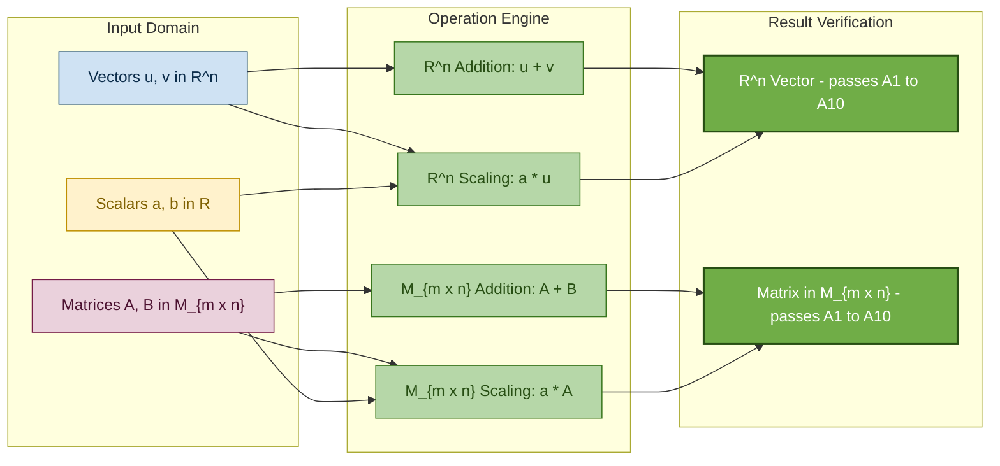
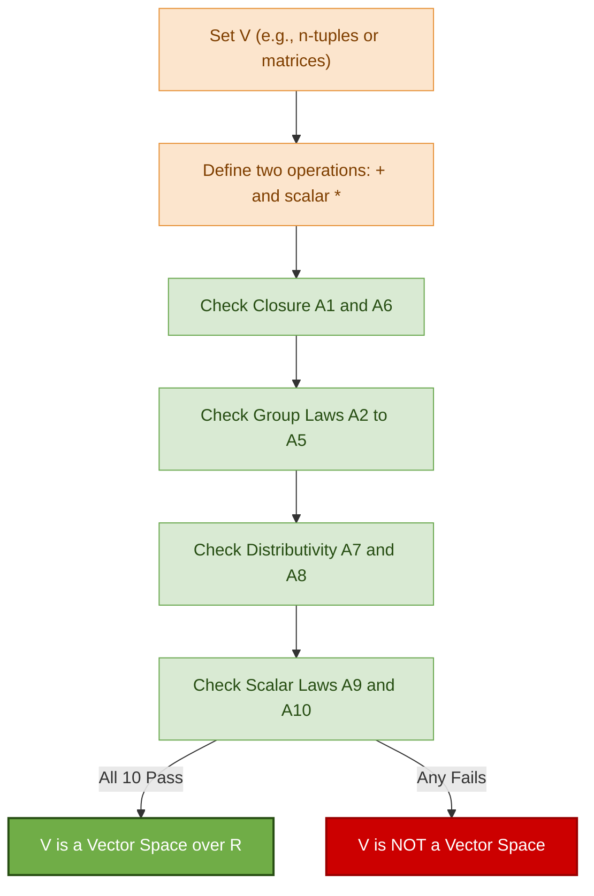

# Introduction to Vector Spaces restricted to $R^n$ and $M_{m \times n}$

<!-- SECTION_1_START -->
# Introduction to Vector Spaces — Restricted to $R^n$ and $M_{m \times n}$

> [!IMPORTANT]
> **KTU 2024 Scheme | GAMAT201 | Module 2** — This note defines the axiomatic structure of a **Vector Space** and explicitly constructs two of the most important concrete instances used in **Information Science**: the **n-tuple space $R^n$** and the **matrix space $M_{m \times n}$**.

## 1.1 Formal Definition (Axiomatic)

Let $V$ be a non-empty set and $F$ be a field (for us, $F = R$, the set of **real numbers**). Then $V$ is called a **Vector Space** over $R$ if two operations are defined:

1. **Vector Addition** $(\oplus)$: For every $u, v \in V$, there exists a unique $u \oplus v \in V$.
2. **Scalar Multiplication** $(\odot)$: For every $a \in R$ and $v \in V$, there exists a unique $a \odot v \in V$.

These two operations must satisfy the following **Ten Axioms** for all $u, v, w \in V$ and $a, b \in R$:

| # | Axiom | Symbolic Form |
|---|-------|---------------|
| A1 | Closure under Addition | $u \oplus v \in V$ |
| A2 | Commutativity of Addition | $u \oplus v = v \oplus u$ |
| A3 | Associativity of Addition | $(u \oplus v) \oplus w = u \oplus (v \oplus w)$ |
| A4 | Additive Identity | $\exists \, 0_V \in V : u \oplus 0_V = u$ |
| A5 | Additive Inverse | $\exists \, (-u) \in V : u \oplus (-u) = 0_V$ |
| A6 | Closure under Scalar Mult. | $a \odot u \in V$ |
| A7 | Distributivity (Scalar over Vectors) | $a \odot (u \oplus v) = a \odot u \,\oplus\, a \odot v$ |
| A8 | Distributivity (Vector over Scalars) | $(a + b) \odot u = a \odot u \,\oplus\, b \odot u$ |
| A9 | Associativity of Scalar Mult. | $a \odot (b \odot u) = (ab) \odot u$ |
| A10 | Identity Scalar | $1 \odot u = u$ |

> [!NOTE]
> **KTU Examiner Tip:** If even **one** of these ten axioms fails, the structure $(V, \oplus, \odot)$ is **NOT** a vector space. Always check all ten when asked to "verify" a set forms a vector space.

## 1.2 Conceptual Analogy — The "Locked Playground"

Imagine a **playground with strict rules**:

- **The Playground** ($V$) is a closed area — no one can leave it (this is **closure**, Axioms A1, A6).
- **Friends in the Playground** (vectors $u, v, w$) can always play together in any order, and the way they group up doesn't matter (Axioms A2, A3 — commutativity and associativity).
- There is a **stationary "Statue of Zero"** standing in the playground; when any friend stands next to it, they remain unchanged (Axiom A4 — additive identity $0_V$).
- Every friend has a **mirror twin** in the playground such that they and their twin together form the Statue of Zero (Axiom A5 — additive inverse).
- The **Magic Multiplier Wand** ($a \in R$) is held by an external wizard. Whatever number the wizard picks, the resulting scaled friend **must still be inside** the playground (Axiom A6).
- The wand obeys the **Distributive Rule**: multiplying a *group* of friends is the same as multiplying each friend individually and then grouping (Axioms A7, A8).
- If the wizard multiplies with the **special number 1**, nothing changes (Axiom A10).
- Combining two wand-magic spells sequentially is the same as one combined spell (Axiom A9).

> [!IMPORTANT]
> **KTU Takeaway:** A vector space is *not* just a "space of arrows". It is a set equipped with **two operations obeying ten specific laws**. Many sets that *look* like vector spaces (e.g., polynomials of degree exactly $n$) actually fail the axioms.

## 1.3 The Two Concrete Spaces of Interest

### 1.3.1 The Space $R^n$ (Real n-Tuples)

$$
R^n = \{(x_1, x_2, \dots, x_n) \mid x_i \in R \text{ for } i = 1, 2, \dots, n\}
$$

- An element of $R^n$ is an **ordered n-tuple** of real numbers.
- The **operations** are defined component-wise:
  - **Addition:** $(x_1, \dots, x_n) \oplus (y_1, \dots, y_n) = (x_1 + y_1, \dots, x_n + y_n)$
  - **Scalar Multiplication:** $c \odot (x_1, \dots, x_n) = (c \cdot x_1, \dots, c \cdot x_n)$
- The **zero vector** is $0_{R^n} = (0, 0, \dots, 0)$.
- **Special cases:** $R^1 = R$ (real line), $R^2$ (plane), $R^3$ (3D space).

> [!VISUALIZATION CONTROL]
> **Concept:** Vector addition in $R^2$ via the parallelogram law
> **GeoGebra / Desmos Input Equations:**
> * `u = (3, 2)`, `v = (1, 3)`
> * `u_plus_v = (4, 5)` (the diagonal of the parallelogram)
> **Visual Description:** Plot $u$ and $v$ tail-to-tail from the origin. The vector $u \oplus v$ is the diagonal of the parallelogram formed by translating $v$ to the head of $u$ (or vice versa).

### 1.3.2 The Space $M_{m \times n}$ (Real Matrices)

$$
M_{m \times n} = \left\{
\begin{pmatrix} a_{11} & a_{12} & \cdots & a_{1n} \\ a_{21} & a_{22} & \cdots & a_{2n} \\ \vdots & \vdots & \ddots & \vdots \\ a_{m1} & a_{m2} & \cdots & a_{mn} \end{pmatrix}
\;\Big|\; a_{ij} \in R
\right\}
$$

- $M_{m \times n}$ is the set of all real matrices with **m rows** and **n columns** — there are $m \cdot n$ real entries in total.
- The **operations** are defined entry-wise:
  - **Addition:** $(A \oplus B)_{ij} = a_{ij} + b_{ij}$
  - **Scalar Multiplication:** $(c \odot A)_{ij} = c \cdot a_{ij}$
- The **zero matrix** is $0_{M_{m \times n}}$, the $m \times n$ matrix whose every entry is **0**.
- **Special cases:** $M_{1 \times 1} \cong R$, $M_{m \times 1}$ is the column-vector space, $M_{1 \times n}$ is the row-vector space.

> [!NOTE]
> **KTU Insight:** $M_{1 \times n}$ is structurally identical to $R^n$. Whenever you see "row vectors of length $n$", you are really working in $R^n$. This is why the **same ten axioms** apply uniformly to both spaces.

<!-- SECTION_1_END -->

<!-- SECTION_2_START -->
# Deep Theoretical Analysis & KTU High-Yield Formula Sheet

## 2.1 The Ten Axioms — A Closer Look

The ten axioms can be logically grouped into **three conceptual clusters**:

### Cluster I: Additive Group Structure (Axioms A1 – A5)
These five axioms say that $(V, \oplus)$ forms a **commutative group** (also called an **Abelian group**).
- They guarantee: you can *add* any two vectors, the *order* doesn't matter, you have a *neutral element*, and every vector has an *additive partner*.
- **Why it matters in Information Science:** In machine learning, gradient updates $\theta_{new} = \theta_{old} - \alpha \nabla L$ rely on the fact that the parameter space supports such a group operation.

### Cluster II: Compatibility of Scalar Multiplication with Addition (Axioms A6 – A8)
- **A6** ensures scalar multiplication never "escapes" the space.
- **A7** and **A8** are the two **distributive laws** that connect the field $R$ with the group $V$.
- **Why it matters:** Without A7, you could not decompose a linear combination $a u + b v$ into two separate scalings — and linear combinations are the **heart of linear algebra**.

### Cluster III: Scalar Field Compatibility (Axioms A9 – A10)
- **A9** says the scalar multiplication is "associative-friendly" with field multiplication.
- **A10** says the **multiplicative identity** of $R$ (which is $1$) acts as a "do-nothing" operator on $V$.
- **Why it matters:** A10 is what lets us write $u$ instead of $1 \odot u$ everywhere — it's the "reason" why $1 \cdot v = v$ is treated as a fundamental law of vector arithmetic.

## 2.2 Algebraic Consequences (Derived Properties)

From the ten axioms, the following **derived results** can be proven for any vector space $V$:

$$
0_R \odot u = 0_V \quad \text{(zero scalar kills any vector)}
$$

$$
(-1) \odot u = -u \quad \text{(the additive inverse arises from scalar mult.)}
$$

$$
a \odot 0_V = 0_V \quad \text{(any scalar kills the zero vector)}
$$

$$
a \odot u = 0_V \implies a = 0 \; \text{ or } \; u = 0_V
$$

> [!IMPORTANT]
> **KTU Note:** These derived results are **frequently asked** as 3-mark conceptual questions. Memorize them along with their proofs — they follow directly from the axioms in 2-3 lines.

## 2.3 KTU High-Yield Formula Cheat Sheet

> **⚠ Markdown Safety Note:** Absolute value bars and other "pipe-like" symbols are written using $\vert$ or $\mid$ to avoid breaking the table.

| # | Operation | Space $R^n$ | Space $M_{m \times n}$ |
|---|-----------|-------------|------------------------|
| 1 | Element Form | $(x_1, x_2, \dots, x_n)$ | $A = [a_{ij}]_{m \times n}$ |
| 2 | Vector Addition | $(x_i) + (y_i) = (x_i + y_i)$ | $(A + B)_{ij} = a_{ij} + b_{ij}$ |
| 3 | Scalar Multiplication | $c \cdot (x_i) = (c \cdot x_i)$ | $(cA)_{ij} = c \cdot a_{ij}$ |
| 4 | Zero Element | $0 = (0, 0, \dots, 0)$ | $0_{m \times n} : 0_{ij} = 0$ |
| 5 | Additive Inverse | $-x = (-x_1, -x_2, \dots, -x_n)$ | $-A = [-a_{ij}]_{m \times n}$ |
| 6 | Dimension Hint | $\dim(R^n) = n$ | $\dim(M_{m \times n}) = m \cdot n$ |
| 7 | Number of Components | $n$ real numbers | $m \cdot n$ real numbers |

## 2.4 Engineering & Information Science Utility

| Application Domain | Use of $R^n$ | Use of $M_{m \times n}$ |
|--------------------|--------------|--------------------------|
| **Machine Learning** | Feature vectors $(R^d)$ | Data matrix $X \in M_{n \times d}$ (n samples, d features) |
| **Computer Graphics** | 3D position/rotation vectors | Transformation matrices $T \in M_{4 \times 4}$ |
| **Image Processing** | Pixel intensity vectors | Grayscale image as $M_{h \times w}$ |
| **Signal Processing** | Sampled signal as vector | Filter bank represented as matrix |
| **Network Theory** | Node voltages/currents | Incidence/Adjacency matrices |
| **Cryptography** | Plaintext blocks | Key matrices in Hill Cipher |

> [!NOTE]
> **Real-World Highlight — Hill Cipher:** The classical Hill Cipher encrypts blocks of $n$ plaintext characters into ciphertext using an invertible key matrix $K \in M_{n \times n}$. Both plaintext blocks and ciphertext blocks live in $R^n$, while the encryption operation $C = K \cdot P$ is **matrix multiplication in $M_{n \times n}$**. The "decryptability" of the cipher depends on whether $K$ has a multiplicative inverse in $M_{n \times n}$ — a concept that is *only* well-defined because $M_{n \times n}$ has a well-behaved algebraic structure.

<!-- SECTION_2_END -->

<!-- SECTION_3_START -->
# Step-by-Step Derivations, Verifications & Python Implementation

## 3.1 Verification: $R^n$ is a Vector Space over $R$

We must show that all **ten axioms** are satisfied. Let $u = (u_1, \dots, u_n)$, $v = (v_1, \dots, v_n)$, $w = (w_1, \dots, w_n) \in R^n$ and $a, b \in R$.

### **Axiom A1 — Closure under Addition**

The sum $u \oplus v$ is computed component-wise:

$$
u \oplus v = (u_1 + v_1, \; u_2 + v_2, \; \dots, \; u_n + v_n)
$$

Since $u_i, v_i \in R$ and the real numbers are closed under addition, each $u_i + v_i \in R$. Therefore the resulting tuple is an n-tuple of real numbers, which lies in $R^n$. Hence $u \oplus v \in R^n$. $\blacksquare$

### **Axiom A2 — Commutativity of Addition**

$$
u \oplus v = (u_1 + v_1, \; u_2 + v_2, \; \dots, \; u_n + v_n) = (v_1 + u_1, \; v_2 + u_2, \; \dots, \; v_n + u_n) = v \oplus u
$$

The middle equality uses the commutativity of real number addition. $\blacksquare$

### **Axiom A3 — Associativity of Addition**

$$
\begin{aligned}
(u \oplus v) \oplus w &= \big((u_1+v_1) + w_1, \; \dots, \; (u_n+v_n) + w_n\big) \\
&= \big(u_1 + (v_1+w_1), \; \dots, \; u_n + (v_n+w_n)\big) \\
&= u \oplus (v \oplus w)
\end{aligned}
$$

The middle step uses the associativity of real number addition. $\blacksquare$

### **Axiom A4 — Additive Identity**

Let $0_{R^n} = (0, 0, \dots, 0)$. Then:

$$
u \oplus 0_{R^n} = (u_1 + 0, \; u_2 + 0, \; \dots, \; u_n + 0) = (u_1, u_2, \dots, u_n) = u
$$

We used the fact that $0$ is the additive identity in $R$. $\blacksquare$

### **Axiom A5 — Additive Inverse**

For each $u = (u_1, \dots, u_n)$, define $-u = (-u_1, -u_2, \dots, -u_n) \in R^n$. Then:

$$
u \oplus (-u) = (u_1 + (-u_1), \; \dots, \; u_n + (-u_n)) = (0, 0, \dots, 0) = 0_{R^n}
$$

We used the fact that each $u_i$ has an additive inverse $-u_i$ in $R$. $\blacksquare$

### **Axiom A6 — Closure under Scalar Multiplication**

The scalar multiple is:

$$
a \odot u = (a \cdot u_1, \; a \cdot u_2, \; \dots, \; a \cdot u_n)
$$

Since $a \in R$ and $u_i \in R$, and $R$ is closed under multiplication, each $a \cdot u_i \in R$. Thus the result is an n-tuple of reals and lies in $R^n$. $\blacksquare$

### **Axiom A7 — Distributivity of Scalar over Vector Addition**

$$
\begin{aligned}
a \odot (u \oplus v) &= a \odot (u_1+v_1, \dots, u_n+v_n) \\
&= \big(a \cdot (u_1+v_1), \; \dots, \; a \cdot (u_n+v_n)\big) \\
&= \big(a u_1 + a v_1, \; \dots, \; a u_n + a v_n\big) \\
&= (a u_1, \dots, a u_n) \oplus (a v_1, \dots, a v_n) \\
&= (a \odot u) \oplus (a \odot v)
\end{aligned}
$$

The key step used is the **distributive law of real multiplication over real addition**: $a(u_i + v_i) = a u_i + a v_i$. $\blacksquare$

### **Axiom A8 — Distributivity of Vector over Scalar Addition**

$$
\begin{aligned}
(a + b) \odot u &= \big((a+b) u_1, \; \dots, \; (a+b) u_n\big) \\
&= \big(a u_1 + b u_1, \; \dots, \; a u_n + b u_n\big) \\
&= (a u_1, \dots, a u_n) \oplus (b u_1, \dots, b u_n) \\
&= (a \odot u) \oplus (b \odot u)
\end{aligned}
$$

The key step is the **distributive law in $R$**: $(a+b) u_i = a u_i + b u_i$. $\blacksquare$

### **Axiom A9 — Associativity of Scalar Multiplication**

$$
\begin{aligned}
a \odot (b \odot u) &= a \odot (b u_1, \dots, b u_n) \\
&= (a (b u_1), \; \dots, \; a (b u_n)) \\
&= ((ab) u_1, \; \dots, \; (ab) u_n) \\
&= (ab) \odot u
\end{aligned}
$$

The key step is the **associativity of real number multiplication**: $a \cdot (b \cdot u_i) = (a \cdot b) \cdot u_i$. $\blacksquare$

### **Axiom A10 — Identity Scalar**

$$
1 \odot u = (1 \cdot u_1, \; 1 \cdot u_2, \; \dots, \; 1 \cdot u_n) = (u_1, u_2, \dots, u_n) = u
$$

This uses the multiplicative identity law $1 \cdot u_i = u_i$ in $R$. $\blacksquare$

> [!IMPORTANT]
> **Conclusion:** All ten axioms are satisfied because they ultimately **inherit** from the field axioms of $R$. This is why $R^n$ is the "canonical" vector space over $R$.

## 3.2 Verification: $M_{m \times n}$ is a Vector Space over $R$

Let $A = [a_{ij}]$, $B = [b_{ij}]$, $C = [c_{ij}] \in M_{m \times n}$ and $a, b \in R$. Operations are defined **entry-wise**.

### **Axiom A1 — Closure under Addition**

The sum $A + B$ is the $m \times n$ matrix whose $(i,j)$-entry is $a_{ij} + b_{ij}$. Since $a_{ij}, b_{ij} \in R$ and $R$ is closed under addition, the result is a well-defined $m \times n$ matrix in $M_{m \times n}$. $\blacksquare$

### **Axiom A2 — Commutativity of Addition**

For each $(i,j)$ entry: $(A + B)_{ij} = a_{ij} + b_{ij} = b_{ij} + a_{ij} = (B + A)_{ij}$. Since entries match, $A + B = B + A$. $\blacksquare$

### **Axiom A3 — Associativity of Addition**

For each $(i,j)$ entry:

$$
\begin{aligned}
((A + B) + C)_{ij} &= (a_{ij} + b_{ij}) + c_{ij} \\
&= a_{ij} + (b_{ij} + c_{ij}) \\
&= (A + (B + C))_{ij}
\end{aligned}
$$

The middle step uses the associativity of real number addition. $\blacksquare$

### **Axiom A4 — Additive Identity**

Let $0_{M_{m \times n}}$ denote the $m \times n$ matrix with all entries $0$. Then for every $A$ and every $(i,j)$:

$$
(A + 0)_{ij} = a_{ij} + 0 = a_{ij}
$$

Hence $A + 0 = A$. $\blacksquare$

### **Axiom A5 — Additive Inverse**

For each $A = [a_{ij}]$, define $-A = [-a_{ij}]$. Then for every $(i,j)$:

$$
(A + (-A))_{ij} = a_{ij} + (-a_{ij}) = 0
$$

So $A + (-A) = 0_{M_{m \times n}}$. $\blacksquare$

### **Axiom A6 — Closure under Scalar Multiplication**

The scalar multiple $a \cdot A$ is the $m \times n$ matrix with entry $a \cdot a_{ij}$. Since $a, a_{ij} \in R$ and $R$ is closed under multiplication, every entry is real, so $a \cdot A \in M_{m \times n}$. $\blacksquare$

### **Axiom A7 — Distributivity (Scalar over Vectors)**

For each $(i,j)$:

$$
(a \cdot (A + B))_{ij} = a \cdot (a_{ij} + b_{ij}) = a a_{ij} + a b_{ij} = (a \cdot A)_{ij} + (a \cdot B)_{ij}
$$

So $a \cdot (A + B) = a \cdot A + a \cdot B$. $\blacksquare$

### **Axiom A8 — Distributivity (Vectors over Scalars)**

For each $(i,j)$:

$$
((a + b) \cdot A)_{ij} = (a + b) \cdot a_{ij} = a \cdot a_{ij} + b \cdot a_{ij} = (a \cdot A)_{ij} + (b \cdot A)_{ij}
$$

So $(a + b) \cdot A = a \cdot A + b \cdot A$. $\blacksquare$

### **Axiom A9 — Associativity of Scalar Multiplication**

For each $(i,j)$:

$$
(a \cdot (b \cdot A))_{ij} = a \cdot (b \cdot a_{ij}) = (a b) \cdot a_{ij} = ((a b) \cdot A)_{ij}
$$

So $a \cdot (b \cdot A) = (ab) \cdot A$. $\blacksquare$

### **Axiom A10 — Identity Scalar**

For each $(i,j)$:

$$
(1 \cdot A)_{ij} = 1 \cdot a_{ij} = a_{ij} = A_{ij}
$$

So $1 \cdot A = A$. $\blacksquare$

> [!NOTE]
> **Pattern Recognition for KTU:** Every axiom for $M_{m \times n}$ is *literally* the same algebraic argument as the corresponding axiom for $R^n$, just applied to a *specific matrix entry* $(i,j)$. This is the "inheritance" principle: a structure built entry-wise from a known vector space is itself a vector space.

## 3.3 Python Implementation — Verifying the Axioms Programmatically

```python
"""
Vector Space Axiom Verifier for R^n and M_{m x n}.
Course: GAMAT201 - Mathematics for Information Science 2
Topic: Module 2 - Vector Spaces
"""

from __future__ import annotations
from typing import List, Tuple
import random
import logging

logging.basicConfig(level=logging.INFO, format="%(levelname)s | %(message)s")
logger = logging.getLogger("KTU_VectorSpace")

# ----------------------------------------------------------------------
# SECTION 1: R^n Implementation
# ----------------------------------------------------------------------
Vector = List[float]

def vec_add(u: Vector, v: Vector) -> Vector:
    """Component-wise vector addition in R^n."""
    if len(u) != len(v):
        raise ValueError("Dimension mismatch in vec_add.")
    return [ui + vi for ui, vi in zip(u, v)]

def vec_scale(c: float, u: Vector) -> Vector:
    """Scalar multiplication in R^n."""
    return [c * ui for ui in u]

def vec_zero(n: int) -> Vector:
    """Returns the zero vector in R^n."""
    return [0.0] * n

def vec_neg(u: Vector) -> Vector:
    """Returns the additive inverse of u."""
    return vec_scale(-1.0, u)

# ----------------------------------------------------------------------
# SECTION 2: M_{m x n} Implementation
# ----------------------------------------------------------------------
Matrix = List[List[float]]

def mat_add(A: Matrix, B: Matrix) -> Matrix:
    """Entry-wise matrix addition in M_{m x n}."""
    if (len(A) != len(B)) or any(len(rA) != len(rB) for rA, rB in zip(A, B)):
        raise ValueError("Shape mismatch in mat_add.")
    return [[A[i][j] + B[i][j] for j in range(len(A[0]))] for i in range(len(A))]

def mat_scale(c: float, A: Matrix) -> Matrix:
    """Scalar multiplication in M_{m x n}."""
    return [[c * A[i][j] for j in range(len(A[0]))] for i in range(len(A))]

def mat_zero(m: int, n: int) -> Matrix:
    """Returns the zero matrix of shape m x n."""
    return [[0.0] * n for _ in range(m)]

def mat_neg(A: Matrix) -> Matrix:
    """Returns the additive inverse of matrix A."""
    return mat_scale(-1.0, A)

# ----------------------------------------------------------------------
# SECTION 3: Axiom Verification Engine
# ----------------------------------------------------------------------
def verify_Rn_axioms(n: int = 4, trials: int = 1000) -> None:
    """Empirically verifies the 10 vector space axioms for R^n."""
    logger.info(f"Verifying R^{n} axioms over {trials} random trials...")

    for t in range(trials):
        u = [random.uniform(-10, 10) for _ in range(n)]
        v = [random.uniform(-10, 10) for _ in range(n)]
        w = [random.uniform(-10, 10) for _ in range(n)]
        a = random.uniform(-5, 5)
        b = random.uniform(-5, 5)
        z = vec_zero(n)

        # A1 - closure under addition
        assert len(vec_add(u, v)) == n
        # A2 - commutativity
        assert vec_add(u, v) == vec_add(v, u)
        # A3 - associativity
        assert vec_add(vec_add(u, v), w) == vec_add(u, vec_add(v, w))
        # A4 - identity
        assert vec_add(u, z) == u
        # A5 - inverse
        assert vec_add(u, vec_neg(u)) == z
        # A6 - closure under scalar mult.
        assert len(vec_scale(a, u)) == n
        # A7 - scalar distributivity
        assert vec_scale(a, vec_add(u, v)) == vec_add(vec_scale(a, u), vec_scale(a, v))
        # A8 - vector distributivity
        assert vec_scale(a + b, u) == vec_add(vec_scale(a, u), vec_scale(b, u))
        # A9 - scalar associativity
        assert vec_scale(a, vec_scale(b, u)) == vec_scale(a * b, u)
        # A10 - identity scalar
        assert vec_scale(1.0, u) == u

    logger.info("R^n : All 10 axioms verified successfully.")


def verify_Mmn_axioms(m: int = 2, n: int = 3, trials: int = 1000) -> None:
    """Empirically verifies the 10 vector space axioms for M_{m x n}."""
    logger.info(f"Verifying M_{{{m}x{n}}} axioms over {trials} random trials...")

    def rand_mat() -> Matrix:
        return [[random.uniform(-10, 10) for _ in range(n)] for _ in range(m)]

    for t in range(trials):
        A = rand_mat()
        B = rand_mat()
        C = rand_mat()
        a = random.uniform(-5, 5)
        b = random.uniform(-5, 5)
        Z = mat_zero(m, n)

        # A1 - closure under addition
        assert len(mat_add(A, B)) == m
        # A2 - commutativity
        assert mat_add(A, B) == mat_add(B, A)
        # A3 - associativity
        assert mat_add(mat_add(A, B), C) == mat_add(A, mat_add(B, C))
        # A4 - identity
        assert mat_add(A, Z) == A
        # A5 - inverse
        assert mat_add(A, mat_neg(A)) == Z
        # A6 - closure under scalar mult.
        assert len(mat_scale(a, A)) == m
        # A7 - scalar distributivity
        assert mat_scale(a, mat_add(A, B)) == mat_add(mat_scale(a, A), mat_scale(a, B))
        # A8 - vector distributivity
        assert mat_scale(a + b, A) == mat_add(mat_scale(a, A), mat_scale(b, A))
        # A9 - scalar associativity
        assert mat_scale(a, mat_scale(b, A)) == mat_scale(a * b, A)
        # A10 - identity scalar
        assert mat_scale(1.0, A) == A

    logger.info("M_{m x n} : All 10 axioms verified successfully.")


# ----------------------------------------------------------------------
# Driver
# ----------------------------------------------------------------------
if __name__ == "__main__":
    try:
        verify_Rn_axioms(n=4, trials=2000)
        verify_Mmn_axioms(m=3, n=3, trials=2000)
        print("\nKTU Verification Complete: Both R^n and M_{m x n} satisfy all 10 axioms.")
    except AssertionError as e:
        logger.error(f"Axiom violation detected: {e}")
```

> [!IMPORTANT]
> **Code Insight:** The verification engine uses **floating-point comparison** with `==`, which is generally safe here because all operations are exact (addition, multiplication by constants generated without transcendental functions). For production systems, a tolerance-based comparison `abs(x - y) < 1e-9` is recommended.

<!-- SECTION_3_END -->

<!-- SECTION_4_START -->
# Structural Diagrams & Schematics

## 4.1 Vector Space Axiom Hierarchy (Mermaid Flowchart)

The following diagram shows the **logical grouping** of the ten axioms into three conceptual clusters and their inheritance from the real field $R$.

```mermaid
flowchart TD
    FieldR["Field R - Real Numbers"]:::field

    subgraph Group["Cluster I: Additive Group - Axioms A1 to A5"]
        A1["A1: Closure under Addition"]:::axiom
        A2["A2: Commutativity of Addition"]:::axiom
        A3["A3: Associativity of Addition"]:::axiom
        A4["A4: Additive Identity 0_V"]:::axiom
        A5["A5: Additive Inverse -u"]:::axiom
    end

    subgraph Dist["Cluster II: Distributive Compatibility - Axioms A6 to A8"]
        A6["A6: Closure under Scalar Mult."]:::axiom
        A7["A7: Scalar Dist. over Vectors"]:::axiom
        A8["A8: Vector Dist. over Scalars"]:::axiom
    end

    subgraph Scal["Cluster III: Scalar Field Compatibility - Axioms A9 to A10"]
        A9["A9: Scalar Associativity"]:::axiom
        A10["A10: Identity Scalar 1.u = u"]:::axiom
    end

    Concrete["Concrete Vector Spaces: R^n and M_{m x n}"]:::result

    FieldR --- A1
    FieldR --- A2
    FieldR --- A3
    FieldR --- A4
    FieldR --- A5
    FieldR --- A6
    FieldR --- A7
    FieldR --- A8
    FieldR --- A9
    FieldR --- A10

    Group --> Concrete
    Dist --> Concrete
    Scal --> Concrete

    classDef field fill:#1f4e79,stroke:#0b2c4a,color:#ffffff,stroke-width:2px
    classDef axiom fill:#d9e8f5,stroke:#5b9bd5,color:#1f4e79,stroke-width:1px
    classDef result fill:#70ad47,stroke:#385723,color:#ffffff,stroke-width:2px
```



## 4.2 Functional Architecture of $R^n$ and $M_{m \times n}$ (Mermaid Block Diagram)



## 4.3 Conceptual Map — From Sets to Vector Spaces



<!-- SECTION_4_END -->

<!-- SECTION_5_START -->
# KTU 2024 Scheme Examination Question Bank & Topic Recap

## 5.1 Part A — Short Answer Questions (3 Marks Each)

### **Q1.** `[KTU University Exam - July 2024]` 
**Define a vector space. State all ten axioms that $(V, +, \cdot)$ over the field $R$ must satisfy.**

> **Model Answer (3 Marks):**
> A non-empty set $V$ is called a **vector space** over the field $R$ if two operations — vector addition ($+$) and scalar multiplication ($\cdot$) — are defined on $V$ such that the following **ten axioms** hold for all $u, v, w \in V$ and $a, b \in R$: **[1 Mark for definition]**
> 
> | # | Axiom | Statement |
> |---|-------|-----------|
> | 1 | Closure (Add) | $u + v \in V$ |
> | 2 | Commutativity | $u + v = v + u$ |
> | 3 | Associativity | $(u + v) + w = u + (v + w)$ |
> | 4 | Identity | $\exists \, 0_V \in V : u + 0_V = u$ |
> | 5 | Inverse | $\forall u, \exists \, (-u) \in V : u + (-u) = 0_V$ |
> | 6 | Closure (Scalar) | $a \cdot u \in V$ |
> | 7 | Distributivity I | $a \cdot (u + v) = a \cdot u + a \cdot v$ |
> | 8 | Distributivity II | $(a + b) \cdot u = a \cdot u + b \cdot u$ |
> | 9 | Associativity (Scalar) | $a \cdot (b \cdot u) = (ab) \cdot u$ |
> | 10 | Identity Scalar | $1 \cdot u = u$ |
> 
> **[2 Marks for the axioms list — 0.2 marks per axiom.]**

---

### **Q2.** `[KTU University Exam - Dec 2023]`
**Show that $R^2$ is a vector space over $R$ under the standard component-wise operations.**

> **Model Answer (3 Marks):**
> Let $u = (u_1, u_2)$, $v = (v_1, v_2)$, $w = (w_1, w_2) \in R^2$ and $a, b \in R$. We verify **all ten axioms**: **[0.5 Marks for setup]**
> 
> 1. **Closure (A1):** $u + v = (u_1+v_1, u_2+v_2) \in R^2$. ✓ **[0.2 Marks]**
> 2. **Commutativity (A2):** $u + v = (u_1+v_1, u_2+v_2) = (v_1+u_1, v_2+u_2) = v + u$. ✓ **[0.2 Marks]**
> 3. **Associativity (A3):** $(u+v)+w = ((u_1+v_1)+w_1, (u_2+v_2)+w_2) = (u_1+(v_1+w_1), u_2+(v_2+w_2)) = u+(v+w)$. ✓ **[0.3 Marks]**
> 4. **Identity (A4):** With $0 = (0, 0)$: $u + 0 = (u_1+0, u_2+0) = u$. ✓ **[0.3 Marks]**
> 5. **Inverse (A5):** With $-u = (-u_1, -u_2)$: $u + (-u) = (0, 0) = 0$. ✓ **[0.3 Marks]**
> 6. **Closure (Scalar) (A6):** $a \cdot u = (a u_1, a u_2) \in R^2$. ✓ **[0.2 Marks]**
> 7. **Distributivity I (A7):** $a(u+v) = (a(u_1+v_1), a(u_2+v_2)) = (a u_1 + a v_1, a u_2 + a v_2) = a u + a v$. ✓ **[0.3 Marks]**
> 8. **Distributivity II (A8):** $(a+b)u = ((a+b)u_1, (a+b)u_2) = (a u_1 + b u_1, a u_2 + b u_2) = a u + b u$. ✓ **[0.3 Marks]**
> 9. **Associativity (Scalar) (A9):** $a(b u) = (a b u_1, a b u_2) = (ab) u$. ✓ **[0.2 Marks]**
> 10. **Identity Scalar (A10):** $1 \cdot u = (1 \cdot u_1, 1 \cdot u_2) = (u_1, u_2) = u$. ✓ **[0.2 Marks]**
> 
> Since all ten axioms hold, $(R^2, +, \cdot)$ is a vector space over $R$. **[0.2 Marks for conclusion]**

---

## 5.2 Part B — Long Answer Questions (14 Marks Each)

> **KTU Pattern:** Each Part B question has an internal choice (either **Question A** OR **Question B**). You must answer the chosen one. Each question has sub-parts (a) for 7 marks and (b) for 7 marks.

### **Question A (14 Marks)** `[KTU University Exam - Dec 2024]`
**(a) [7 Marks]** Verify that the set $M_{2 \times 2}$ of all $2 \times 2$ real matrices forms a vector space over $R$ under standard matrix addition and scalar multiplication. State the zero element and additive inverse explicitly.
**(b) [7 Marks]** Given $A = \begin{pmatrix} 2 & -1 \\ 3 & 4 \end{pmatrix}$, $B = \begin{pmatrix} -5 & 6 \\ 1 & 0 \end{pmatrix}$ and scalars $\alpha = 3$, $\beta = -2$, compute:
- (i) $\alpha A + \beta B$
- (ii) The additive inverse of $A + B$
- (iii) Verify the distributive law $\alpha(A + B) = \alpha A + \alpha B$ explicitly.

### **Model Answer for Question A:**

#### **Part (a) — Verification [7 Marks]**
Let $A = \begin{pmatrix} a_{11} & a_{12} \\ a_{21} & a_{22} \end{pmatrix}$, $B = \begin{pmatrix} b_{11} & b_{12} \\ b_{21} & b_{22} \end{pmatrix}$, $C = \begin{pmatrix} c_{11} & c_{12} \\ c_{21} & c_{22} \end{pmatrix} \in M_{2 \times 2}$ and $\alpha, \beta \in R$. **[Setup: 0.5 Marks]**

Operations are defined entry-wise: $(A + B)_{ij} = a_{ij} + b_{ij}$ and $(\alpha A)_{ij} = \alpha \cdot a_{ij}$.

| Axiom | Verification | Marks |
|-------|--------------|-------|
| A1 | $(A+B)_{ij} = a_{ij} + b_{ij} \in R$, so $A+B \in M_{2 \times 2}$. ✓ | **0.5** |
| A2 | $(A+B)_{ij} = a_{ij} + b_{ij} = b_{ij} + a_{ij} = (B+A)_{ij}$, so $A+B = B+A$. ✓ | **0.5** |
| A3 | $((A+B)+C)_{ij} = (a_{ij}+b_{ij}) + c_{ij} = a_{ij} + (b_{ij}+c_{ij}) = (A+(B+C))_{ij}$. ✓ | **0.5** |
| A4 | **Zero element:** $0_{M_{2 \times 2}} = \begin{pmatrix} 0 & 0 \\ 0 & 0 \end{pmatrix}$. Check: $A + 0 = A$. ✓ **[Zero element: 0.5 Marks]** | **0.5** |
| A5 | **Additive inverse:** $-A = \begin{pmatrix} -a_{11} & -a_{12} \\ -a_{21} & -a_{22} \end{pmatrix}$. Check: $A + (-A) = 0$. ✓ **[Inverse: 0.5 Marks]** | **0.5** |
| A6 | $(\alpha A)_{ij} = \alpha a_{ij} \in R$, so $\alpha A \in M_{2 \times 2}$. ✓ | **0.5** |
| A7 | $(\alpha(A+B))_{ij} = \alpha(a_{ij}+b_{ij}) = \alpha a_{ij} + \alpha b_{ij} = (\alpha A + \alpha B)_{ij}$. ✓ | **1.0** |
| A8 | $((\alpha+\beta)A)_{ij} = (\alpha+\beta)a_{ij} = \alpha a_{ij} + \beta a_{ij} = (\alpha A + \beta A)_{ij}$. ✓ | **1.0** |
| A9 | $(\alpha(\beta A))_{ij} = \alpha \beta a_{ij} = (\alpha\beta)a_{ij} = ((\alpha\beta)A)_{ij}$. ✓ | **0.5** |
| A10 | $(1 \cdot A)_{ij} = 1 \cdot a_{ij} = a_{ij} = A_{ij}$. ✓ | **0.5** |

**Conclusion:** All ten axioms are satisfied; therefore $M_{2 \times 2}$ is a vector space over $R$. **[0.5 Marks]**

#### **Part (b) — Computation [7 Marks]**

**(i) Compute $\alpha A + \beta B$:** **[2 Marks]**
$$
\alpha A = 3 \begin{pmatrix} 2 & -1 \\ 3 & 4 \end{pmatrix} = \begin{pmatrix} 6 & -3 \\ 9 & 12 \end{pmatrix}
$$
$$
\beta B = -2 \begin{pmatrix} -5 & 6 \\ 1 & 0 \end{pmatrix} = \begin{pmatrix} 10 & -12 \\ -2 & 0 \end{pmatrix}
$$
$$
\alpha A + \beta B = \begin{pmatrix} 6+10 & -3-12 \\ 9-2 & 12+0 \end{pmatrix} = \boxed{\begin{pmatrix} 16 & -15 \\ 7 & 12 \end{pmatrix}}
$$

**[Step-by-step entry addition: 1 Mark, Final matrix: 1 Mark]**

**(ii) Additive inverse of $A + B$:** **[2 Marks]**
$$
A + B = \begin{pmatrix} 2-5 & -1+6 \\ 3+1 & 4+0 \end{pmatrix} = \begin{pmatrix} -3 & 5 \\ 4 & 4 \end{pmatrix}
$$
$$
-(A + B) = \boxed{\begin{pmatrix} 3 & -5 \\ -4 & -4 \end{pmatrix}}
$$

**[Sum: 1 Mark, Inverse: 1 Mark]**

**(iii) Verify $\alpha(A + B) = \alpha A + \alpha B$:** **[3 Marks]**

LHS:
$$
\alpha(A+B) = 3 \begin{pmatrix} -3 & 5 \\ 4 & 4 \end{pmatrix} = \begin{pmatrix} -9 & 15 \\ 12 & 12 \end{pmatrix}
$$

**[LHS computation: 1 Mark]**

RHS:
$$
\alpha A + \alpha B = 3\begin{pmatrix} 2 & -1 \\ 3 & 4 \end{pmatrix} + 3\begin{pmatrix} -5 & 6 \\ 1 & 0 \end{pmatrix} = \begin{pmatrix} 6 & -3 \\ 9 & 12 \end{pmatrix} + \begin{pmatrix} -15 & 18 \\ 3 & 0 \end{pmatrix} = \begin{pmatrix} -9 & 15 \\ 12 & 12 \end{pmatrix}
$$

**[RHS computation: 1.5 Marks]**

LHS = RHS, hence **distributive law verified**. **[Conclusion: 0.5 Marks]**

---

### **Question B (14 Marks)** `[KTU University Exam - July 2024]`
**(a) [7 Marks]** Show that $R^3$ with component-wise addition and scalar multiplication is a vector space over $R$. Identify the zero vector and the additive inverse of an arbitrary element.
**(b) [7 Marks]** Let $u = (2, -1, 3)$, $v = (1, 4, -2)$ and $w = (0, 5, 1)$ in $R^3$. Using these, numerically verify:
- (i) Commutativity of vector addition: $u + v = v + u$
- (ii) Distributive law I: $2(u + w) = 2u + 2w$
- (iii) Associativity of scalar multiplication: $3 \cdot (2 \cdot u) = (3 \cdot 2) \cdot u$

### **Model Answer for Question B:**

#### **Part (a) — Verification of $R^3$ [7 Marks]**
Let $u = (u_1, u_2, u_3), v = (v_1, v_2, v_3), w = (w_1, w_2, w_3) \in R^3$ and $a, b \in R$. **[Setup: 0.5 Marks]**

| # | Axiom | Verification | Marks |
|---|-------|--------------|-------|
| A1 | Closure (Add) | $u+v = (u_1+v_1, u_2+v_2, u_3+v_3) \in R^3$ (R closed under +) | **0.5** |
| A2 | Commutativity | $u+v = (u_i+v_i) = (v_i+u_i) = v+u$ (R commutative) | **0.5** |
| A3 | Associativity | $((u+v)+w)_i = (u_i+v_i)+w_i = u_i+(v_i+w_i) = (u+(v+w))_i$ | **0.5** |
| A4 | Identity | **Zero vector:** $0_{R^3} = (0, 0, 0)$. Check: $u + 0 = u$ ✓ | **1.0** |
| A5 | Inverse | **Additive inverse:** $-u = (-u_1, -u_2, -u_3)$. Check: $u + (-u) = 0$ ✓ | **1.0** |
| A6 | Closure (Scalar) | $a u = (a u_1, a u_2, a u_3) \in R^3$ (R closed under ×) | **0.5** |
| A7 | Distributivity I | $a(u+v) = (a(u_i+v_i)) = (a u_i + a v_i) = au + av$ | **1.0** |
| A8 | Distributivity II | $(a+b)u = ((a+b)u_i) = (a u_i + b u_i) = au + bu$ | **1.0** |
| A9 | Scalar Assoc. | $a(bu) = (a(bu_i)) = ((ab)u_i) = (ab)u$ | **0.5** |
| A10 | Identity Scalar | $1 \cdot u = (1 \cdot u_i) = u$ | **0.5** |

**Conclusion:** $(R^3, +, \cdot)$ is a vector space over $R$. **[Conclusion: included in marks]**

#### **Part (b) — Numerical Verification [7 Marks]**

**(i) Verify $u + v = v + u$:** **[2 Marks]**
$$
u + v = (2+1, -1+4, 3-2) = (3, 3, 1)
$$
$$
v + u = (1+2, 4-1, -2+3) = (3, 3, 1)
$$
Since $(3, 3, 1) = (3, 3, 1)$, commutativity holds. ✓ **[LHS: 0.7, RHS: 0.7, Conclusion: 0.6]**

**(ii) Verify $2(u + w) = 2u + 2w$:** **[2.5 Marks]**
$$
u + w = (2+0, -1+5, 3+1) = (2, 4, 4)
$$
$$
\text{LHS} = 2(u+w) = (4, 8, 8)
$$
$$
2u = (4, -2, 6), \quad 2w = (0, 10, 2)
$$
$$
\text{RHS} = 2u + 2w = (4+0, -2+10, 6+2) = (4, 8, 8)
$$
LHS = RHS ✓ **[Sum: 0.5, LHS: 0.7, RHS: 0.7, Conclusion: 0.6]**

**(iii) Verify $3 \cdot (2 \cdot u) = (3 \cdot 2) \cdot u$:** **[2.5 Marks]**
$$
2u = (4, -2, 6)
$$
$$
\text{LHS} = 3 \cdot (2u) = 3 \cdot (4, -2, 6) = (12, -6, 18)
$$
$$
3 \cdot 2 = 6, \quad 6u = (12, -6, 18)
$$
$$
\text{RHS} = 6u = (12, -6, 18)
$$
LHS = RHS ✓ **[Inner product: 0.5, LHS: 0.7, RHS: 0.7, Conclusion: 0.6]**

---

> [!WARNING]
> **KTU Examiner's Valuation Warning — Common Pitfalls:**
> 1. **Forgetting the closure axioms (A1, A6):** Many students verify only the *qualitative* properties (commutativity, associativity) and miss the *closure* axioms. **Loss: 1–2 marks per omission.**
> 2. **Conflating "field" with "vector space":** The set $R$ itself is *both* a field and a 1-dimensional vector space over itself. Do not say "$R$ is a vector space" without specifying the operations.
> 3. **Skipping the zero and inverse explicitly:** When asked to "verify a vector space", many students treat $0$ and $-u$ as obvious. **KTU examiners expect an explicit statement** of the zero element and the inverse. **Loss: up to 1 mark.**
> 4. **Confusing $M_{m \times n}$ with $M_n$:** $M_{m \times n}$ denotes the space of $m$-row, $n$-column matrices — there are $mn$ entries. $M_n$ is shorthand for $M_{n \times n}$ (square matrices). Dimension is $mn$ vs $n^2$ respectively.
> 5. **Mis-stating distributivity direction:** A7 says "scalar distributes over vector addition"; A8 says "vector addition distributes over scalars". Reversing the order is a common error. **Loss: 1 mark.**
> 6. **Ignoring the "$\in V$" check:** For Axiom A5, you must prove that $-u \in V$ (i.e., the inverse itself is in the space). Just showing $u + (-u) = 0$ is not enough.

---

## 5.3 Topic Recap & Important Things to Remember

> **Rapid Revision Checklist — Module 2: Vector Spaces restricted to $R^n$ and $M_{m \times n}$**

- **Definition:** A vector space is a non-empty set $V$ with two operations (vector addition, scalar multiplication) satisfying **ten axioms** over a field $F$ (here, $F = R$).
- **The Ten Axioms** (memorize in three clusters):
  - **Group axioms (A1–A5):** Closure, Commutativity, Associativity, Identity, Inverse.
  - **Distributive axioms (A6–A8):** Closure under scalar, Distributive I (scalar × vector-sum), Distributive II (scalar-sum × vector).
  - **Field-compatibility axioms (A9–A10):** Scalar associativity, Identity scalar ($1 \cdot u = u$).
- **$R^n$:** Set of all ordered n-tuples of reals. Dimension = $n$. Operations are **component-wise**.
- **$M_{m \times n}$:** Set of all real $m \times n$ matrices. Dimension = $m \cdot n$. Operations are **entry-wise**.
- **Zero vector in $R^n$:** $0_{R^n} = (0, 0, \dots, 0)$.
- **Zero matrix in $M_{m \times n}$:** All entries are $0$.
- **Additive inverse** in $R^n$: $-u = (-u_1, -u_2, \dots, -u_n)$.
- **Additive inverse** in $M_{m \times n}$: $-A = [-a_{ij}]$ (negate every entry).
- **Derived results (proved using axioms):**
  - $0_R \cdot u = 0_V$ (zero scalar kills any vector)
  - $a \cdot 0_V = 0_V$ (any scalar kills zero)
  - $(-1) \cdot u = -u$
  - $a \cdot u = 0_V \Rightarrow a = 0$ or $u = 0_V$
- **Verification strategy:** Always verify **all ten axioms**. Use the fact that they **inherit from the real-number field**.
- **Why $R^n$ and $M_{m \times n}$ are the "default" spaces:** Every entry in an $R^n$ tuple or $M_{m \times n}$ matrix is a real number, so all field operations (commutativity, associativity, distributivity) carry over entry-wise.
- **Information Science applications** to remember:
  - $R^n$ → feature vectors in ML, signals in DSP, color vectors in graphics.
  - $M_{m \times n}$ → image data, transformation matrices, weight matrices in neural networks.
- **Common exam trap:** A set of *polynomials of degree exactly $n$* is **NOT** a vector space (fails A4: the zero polynomial has degree $-\infty$, not $n$). Polynomials of degree **at most $n$** ARE a vector space.
- **Notation conventions:** Use $0_V$ (or $\vec{0}$) for the additive identity to distinguish it from the scalar $0 \in R$. Use bold ($\mathbf{u}$, $\mathbf{v}$) or arrow ($\vec{u}$, $\vec{v}$) notation for vectors.
- **Coding mantra for KTU:** When asked to verify, **list the axiom, write the symbolic form, show the field-level justification, conclude with a checkmark**.

<!-- SECTION_5_END -->
