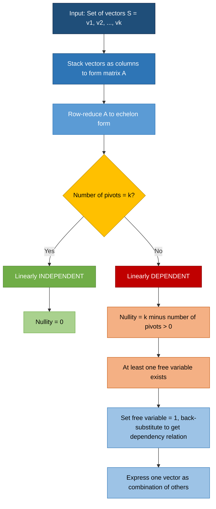
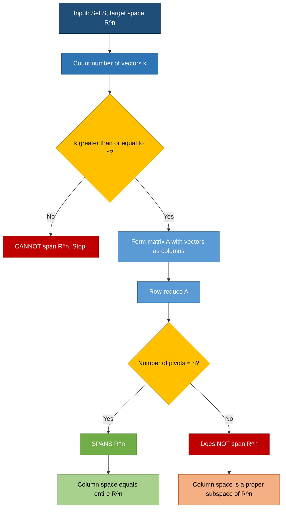
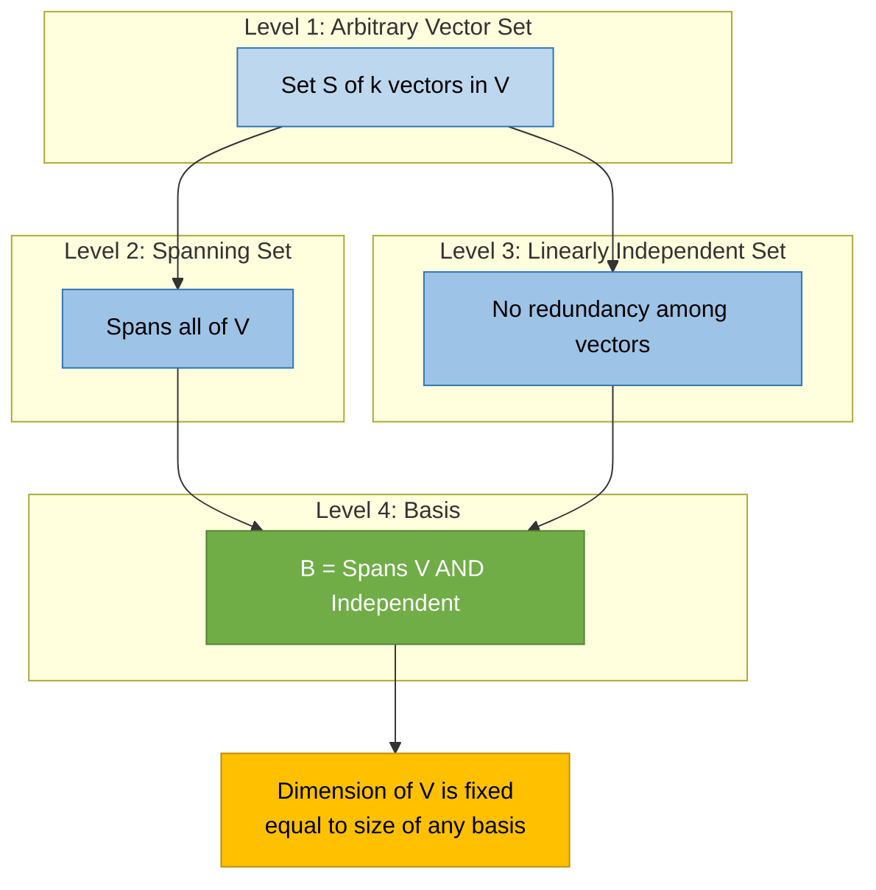
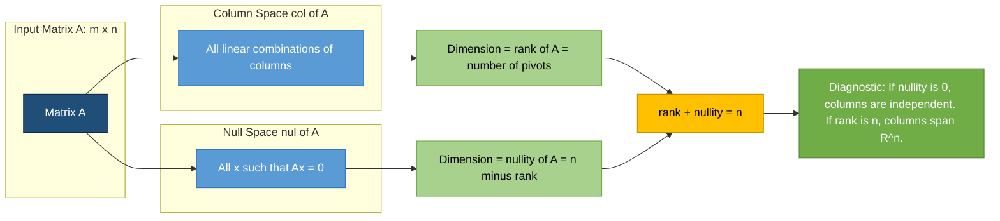

# Spanning sets, assessing linear independence vs linear dependence of vectors

<!-- SECTION_1_START -->
# Module 2: Spanning Sets, Linear Independence and Linear Dependence

## 1. Core Technical Definition & Intuitive Overview

### 1.1 Formal Definitions (KTU 2024 Syllabus Terminology)

> [!IMPORTANT]
> **Spanning Set of a Vector Space**
> Let $V$ be a vector space over a field $\mathbb{F}$ (typically $\mathbb{R}$ or $\mathbb{C}$). A subset $S = \{\mathbf{v}_1, \mathbf{v}_2, \ldots, \mathbf{v}_k\} \subseteq V$ is called a **spanning set** of $V$ if every vector $\mathbf{v} \in V$ can be expressed as a **finite linear combination** of the vectors in $S$. That is, for every $\mathbf{v} \in V$, there exist scalars $c_1, c_2, \ldots, c_k \in \mathbb{F}$ such that
> $$\mathbf{v} = c_1 \mathbf{v}_1 + c_2 \mathbf{v}_2 + \cdots + c_k \mathbf{v}_k$$
> The vector space $V$ is then said to be **spanned** by $S$, and we write $V = \text{span}(S)$.

> [!IMPORTANT]
> **Linear Independence**
> A set of vectors $S = \{\mathbf{v}_1, \mathbf{v}_2, \ldots, \mathbf{v}_k\}$ in a vector space $V$ over $\mathbb{F}$ is **linearly independent** if the only scalars $c_1, c_2, \ldots, c_k \in \mathbb{F}$ satisfying
> $$c_1 \mathbf{v}_1 + c_2 \mathbf{v}_2 + \cdots + c_k \mathbf{v}_k = \mathbf{0}$$
> are the **trivial scalars** $c_1 = c_2 = \cdots = c_k = 0$.

> [!IMPORTANT]
> **Linear Dependence**
> A set of vectors $S$ is **linearly dependent** if there exist scalars $c_1, c_2, \ldots, c_k \in \mathbb{F}$, **not all zero**, such that
> $$c_1 \mathbf{v}_1 + c_2 \mathbf{v}_2 + \cdots + c_k \mathbf{v}_k = \mathbf{0}$$
> Equivalently, at least one vector in $S$ can be written as a linear combination of the others.

### 1.2 Conceptual Analogy — The "Recipe & Redundancy" Intuition

> [!NOTE]
> **Intuitive Analogy 1 — Spanning Set (Master Recipe Book):**
> Imagine a kitchen where every possible dish (any vector in the space) must be cooked using a fixed set of basic ingredients (the spanning set). A **spanning set** is the *master pantry* — it contains enough raw ingredients so that no matter what dish the chef wants to prepare, they can mix quantities of these basics to recreate it. For example, $\{\mathbf{e}_1, \mathbf{e}_2\}$ spans the entire $\mathbb{R}^2$ plane, just as flour, sugar, and eggs can "span" most baked goods.

> [!NOTE]
> **Intuitive Analogy 2 — Linear Independence (No Redundant Ingredient):**
> Consider a set of basic ingredients. They are **linearly independent** if *no single ingredient can be produced by mixing the others* in some specific ratio. For example, $\{\text{flour}, \text{butter}, \text{flour} + \text{butter}\}$ is **dependent** because the third can be made from the first two. Removing it gives a clean, minimal set.

> [!NOTE]
> **Intuitive Analogy 3 — The Coin System:**
> A currency system $\{\$1, \$2, \$5\}$ is *linearly independent* with respect to "making zero dollars" — you can never combine positive and negative multiples of these to exactly zero without using all zero coefficients. But $\{\$1, \$2, \$3\}$ is dependent because $\$3 = 1 \cdot \$1 + 1 \cdot \$2$, so $1 \cdot \$1 + 1 \cdot \$2 - 1 \cdot \$3 = \$0$ is a non-trivial relation.

### 1.3 Standard Reference Constants and Notations

| Symbol | Meaning | Standard Value / Field |
|---|---|---|
| $\mathbb{F}$ | Underlying scalar field | $\mathbb{R}$ or $\mathbb{C}$ |
| $\mathbf{0}$ | Zero vector in $V$ | Additive identity |
| $V$ | Vector space | $\mathbb{R}^n$ in most problems |
| $\text{span}(S)$ | Span of $S$ | Smallest subspace containing $S$ |
| $\mathbf{e}_i$ | Standard basis vector | $(0, \ldots, 0, 1, 0, \ldots, 0)$ |

> [!VISUALIZATION CONTROL]
> **Concept:** Geometric visualization of spanning and independence in $\mathbb{R}^2$
> **GeoGebra / Desmos Input Equations:**
> * `v1 = (2, 1)` — vector along first direction
> * `v2 = (-1, 3)` — vector along second direction
> * `Line: y = (1/2)x` — line traced by multiples of $v1$
> * `Line: y = -3x` — line traced by multiples of $v2$
> **Visual Description:** Two arrows from the origin, non-collinear. Their scalar multiples sweep two distinct lines that together tile the entire $\mathbb{R}^2$ plane. The set $\{v1, v2\}$ is linearly independent AND spans $\mathbb{R}^2$. If you replaced $v2$ with $v3 = (4, 2) = 2 \cdot v1$, both lines would coincide — the set $\{v1, v3\}$ would be dependent and would only span a 1-D line, not the whole plane.

---

<!-- SECTION_1_END -->

<!-- SECTION_2_START -->
# 2. Deep Theoretical Analysis & KTU High-Yield Formula Sheet

## 2.1 Theoretical Foundations

### 2.1.1 The "Why" Behind the Definitions

The concepts of spanning, independence, and dependence are the **three pillars** of vector space structure. They answer three fundamental questions:

1. **Can we reach every point?** (Spanning — *Coverage*)
2. **Is there redundancy in our building blocks?** (Independence — *Minimality*)
3. **How much true "information" do our vectors carry?** (Dimension — *Efficiency*)

> [!NOTE]
> **KTU High-Yield Insight:** A *spanning set* guarantees **coverage** of the whole space but may have redundancy. A *linearly independent* set guarantees **no redundancy** but may not cover the whole space. The **basis** of a vector space is precisely the magical set that achieves *both* — it spans the space AND is linearly independent.

### 2.1.2 Equivalent Characterizations (Board-Favorite Theorems)

> [!IMPORTANT]
> **Theorem 2.1 — Spanning Criterion**
> A set $S = \{\mathbf{v}_1, \ldots, \mathbf{v}_k\}$ spans $V$ **if and only if** every vector $\mathbf{v} \in V$ satisfies the linear system $A\mathbf{c} = \mathbf{v}$ for some coefficient vector $\mathbf{c}$, where $A = [\mathbf{v}_1 \ \mathbf{v}_2 \ \cdots \ \mathbf{v}_k]$ is the matrix whose columns are the spanning vectors.

> [!IMPORTANT]
> **Theorem 2.2 — Independence Criterion (Homogeneous System)**
> The set $S = \{\mathbf{v}_1, \ldots, \mathbf{v}_k\}$ is linearly independent **if and only if** the homogeneous system $A\mathbf{c} = \mathbf{0}$ has **only the trivial solution** $\mathbf{c} = \mathbf{0}$, where $A$ is again the column matrix.

> [!IMPORTANT]
> **Theorem 2.3 — The "More Vectors Than Dimensions" Theorem**
> Any set of more than $n$ vectors in $\mathbb{R}^n$ is **automatically linearly dependent**. This is because the rank-nullity theorem forces the null space of the $n \times k$ matrix $A$ to be non-trivial when $k > n$.

> [!IMPORTANT]
> **Theorem 2.4 — The Pivot Theorem (Most Tested in KTU)**
> A set of $n$ vectors in $\mathbb{R}^n$ is a basis of $\mathbb{R}^n$ **if and only if** the $n \times n$ matrix formed by these vectors (as columns or rows) is **invertible**, equivalently has determinant $\neq 0$, equivalently has $n$ pivots after row reduction.

### 2.2 The Three Master Test Procedures

**Test 1: Testing Linear Dependence / Independence (Step-by-Step Recipe)**
1. Form the matrix $A$ with the given vectors as **columns**.
2. Row-reduce $A$ to echelon form (REF or RREF).
3. **If you get a free variable** (i.e., a column without a pivot) $\Rightarrow$ **Linearly Dependent**.
4. **If every column has a pivot** $\Rightarrow$ **Linearly Independent**.

**Test 2: Testing Spanning (Step-by-Step Recipe)**
1. Form the matrix $A$ with the spanning vectors as **columns**.
2. Set up the augmented system $[A \mid \mathbf{v}]$ for an arbitrary $\mathbf{v}$.
3. Row-reduce $[A \mid \mathbf{v}]$.
4. **If the system is consistent for every $\mathbf{v}$** $\Rightarrow$ $A$ spans the space.

**Test 3: Testing Basis (Combines Both)**
A set is a basis if it **spans** AND is **independent**. For $n$ vectors in $\mathbb{R}^n$, this collapses to one test: **check if $\det(A) \neq 0$**.

## 2.3 KTU Formula Sheet / Cheat Sheet

| Concept | Mathematical Condition | Test via Matrix | Geometric Meaning |
|---|---|---|---|
| Spanning Set $S$ in $V$ | $\forall \mathbf{v} \in V, \ \exists c_i: \mathbf{v} = \sum c_i \mathbf{v}_i$ | $A\mathbf{c} = \mathbf{v}$ consistent $\forall \mathbf{v}$ | $S$ reaches every point in $V$ |
| Linearly Independent | $c_1 \mathbf{v}_1 + \cdots + c_k \mathbf{v}_k = \mathbf{0} \Rightarrow c_i = 0 \ \forall i$ | $A\mathbf{c} = \mathbf{0}$ has only trivial solution | No vector is "made" by the others |
| Linearly Dependent | $\exists c_i$ not all zero with $\sum c_i \mathbf{v}_i = \mathbf{0}$ | $A\mathbf{c} = \mathbf{0}$ has non-trivial solution | At least one redundant vector |
| Basis | Spans $V$ AND is independent | $\det(A) \neq 0$ (for $n$ vectors in $\mathbb{R}^n$) | Minimal spanning set |
| Nullity of $A$ | $\dim(\text{Null}(A))$ | $\#(\text{free variables})$ | $\Rightarrow$ dependence |
| Rank of $A$ | $\dim(\text{Col}(A))$ | $\#(\text{pivot columns})$ | $\Rightarrow$ size of independent set |
| Rank-Nullity | $\text{rank}(A) + \text{nullity}(A) = n$ | (always holds for $m \times n$ matrix) | Links dependence and coverage |
| Maximum Independent Set | $\leq n$ in $\mathbb{R}^n$ | $\#(\text{pivots})$ | Cannot exceed dimension |

> [!IMPORTANT]
> **Critical Reminder:** When testing independence, you are working with a **homogeneous** system $A\mathbf{c} = \mathbf{0}$. The right-hand side is **always** the zero vector. The augmented matrix is therefore $[A \mid \mathbf{0}]$, and the "zero column" on the right is *never* a candidate for a pivot. Beginners often mistakenly pivot in the augmented column — that is incorrect.

### 2.4 Real-World Utility in Computer Science & Engineering

> [!NOTE]
> **Where these concepts live in production systems:**
> * **Machine Learning:** Linear independence of feature vectors determines whether your model is *identifiable*. Dependent features cause rank-deficient covariance matrices, leading to numerical instability and non-unique solutions in regression.
> * **Computer Graphics:** Basis vectors (linearly independent spanning sets) define local coordinate frames. The orthonormal basis is used in rendering, ray tracing, and shader transformations.
> * **Signal Processing:** Fourier basis is a linearly independent spanning set of function space. Linear dependence in sampled signals indicates redundancy that can be compressed.
> * **Cryptography:** Lattice-based cryptography exploits the hardness of finding short vectors in high-dimensional *independent* lattices.
> * **Network Engineering:** Spanning sets define reachability in communication networks; independent sets in graph theory (a related concept) determine optimal resource allocation.
> * **Database Systems:** In SQL and OLAP, linearly dependent columns are redundant and can be removed to optimize storage — directly analogous to extracting a basis.

---

<!-- SECTION_2_END -->

<!-- SECTION_3_START -->
# 3. Step-by-Step Derivations & Symbolic / Code Implementation

## 3.1 Worked Example 1: Testing Linear Independence in $\mathbb{R}^3$

**Problem:** Determine whether the following set of vectors in $\mathbb{R}^3$ is linearly independent or dependent:
$$S = \left\{ \mathbf{v}_1 = \begin{pmatrix} 1 \\ 2 \\ -1 \end{pmatrix}, \ \mathbf{v}_2 = \begin{pmatrix} 2 \\ 1 \\ 3 \end{pmatrix}, \ \mathbf{v}_3 = \begin{pmatrix} 4 \\ 5 \\ 1 \end{pmatrix} \right\}$$

**Solution — Exhaustive Derivation:**

**Step 1:** Set up the linear combination equal to the zero vector.

$$c_1 \begin{pmatrix} 1 \\ 2 \\ -1 \end{pmatrix} + c_2 \begin{pmatrix} 2 \\ 1 \\ 3 \end{pmatrix} + c_3 \begin{pmatrix} 4 \\ 5 \\ 1 \end{pmatrix} = \begin{pmatrix} 0 \\ 0 \\ 0 \end{pmatrix}$$

**Step 2:** Form the column matrix $A$ and convert to the matrix equation $A\mathbf{c} = \mathbf{0}$.

$$A = \begin{pmatrix} 1 & 2 & 4 \\ 2 & 1 & 5 \\ -1 & 3 & 1 \end{pmatrix}, \quad \mathbf{c} = \begin{pmatrix} c_1 \\ c_2 \\ c_3 \end{pmatrix}, \quad A\mathbf{c} = \begin{pmatrix} 0 \\ 0 \\ 0 \end{pmatrix}$$

**Step 3:** Row-reduce $A$ to echelon form.

Apply $R_2 \to R_2 - 2R_1$ and $R_3 \to R_3 + R_1$:

$$\begin{pmatrix} 1 & 2 & 4 \\ 0 & -3 & -3 \\ 0 & 5 & 5 \end{pmatrix}$$

Apply $R_3 \to R_3 + \frac{5}{3} R_2$:

$$\begin{pmatrix} 1 & 2 & 4 \\ 0 & -3 & -3 \\ 0 & 0 & 0 \end{pmatrix}$$

**Step 4:** Interpret the result.

The third row is the zero row, meaning $c_3$ is a **free variable**. The system has a non-trivial solution: any choice of $c_3 \neq 0$ produces a valid relation.

**Step 5:** Find the explicit non-trivial relation.

From row 2: $-3 c_2 - 3 c_3 = 0 \Rightarrow c_2 = -c_3$.
From row 1: $c_1 + 2c_2 + 4c_3 = 0 \Rightarrow c_1 = -2c_2 - 4c_3 = -2(-c_3) - 4c_3 = -2c_3$.

Choosing $c_3 = 1$ (any non-zero value), we get $c_1 = -2, c_2 = -1, c_3 = 1$. Verification:

$$\begin{aligned} -2 \begin{pmatrix} 1 \\ 2 \\ -1 \end{pmatrix} + (-1) \begin{pmatrix} 2 \\ 1 \\ 3 \end{pmatrix} + 1 \begin{pmatrix} 4 \\ 5 \\ 1 \end{pmatrix} &= \begin{pmatrix} -2 - 2 + 4 \\ -4 - 1 + 5 \\ 2 - 3 + 1 \end{pmatrix} = \begin{pmatrix} 0 \\ 0 \\ 0 \end{pmatrix} \ \checkmark \end{aligned}$$

**Conclusion:** The set $S$ is **linearly dependent**, and the dependency relation is $-2\mathbf{v}_1 - \mathbf{v}_2 + \mathbf{v}_3 = \mathbf{0}$, i.e., $\mathbf{v}_3 = 2\mathbf{v}_1 + \mathbf{v}_2$.

> [!NOTE]
> **Verification using Determinant (Short-Cut for Square Matrices):**
> $\det(A) = 1(1 \cdot 1 - 5 \cdot 3) - 2(2 \cdot 1 - 5 \cdot (-1)) + 4(2 \cdot 3 - 1 \cdot (-1))$
> $= 1(1 - 15) - 2(2 + 5) + 4(6 + 1) = -14 - 14 + 28 = 0$.
> Since $\det(A) = 0$, the vectors are dependent. ✓

---

## 3.2 Worked Example 2: Spanning $\mathbb{R}^4$ with a 3-Vector Set

**Problem:** Determine if $S = \{\mathbf{u}_1, \mathbf{u}_2, \mathbf{u}_3\}$ spans $\mathbb{R}^4$, where:
$$\mathbf{u}_1 = \begin{pmatrix} 1 \\ 1 \\ 0 \\ 1 \end{pmatrix}, \quad \mathbf{u}_2 = \begin{pmatrix} 0 \\ 1 \\ 1 \\ 1 \end{pmatrix}, \quad \mathbf{u}_3 = \begin{pmatrix} 1 \\ 0 \\ 1 \\ 0 \end{pmatrix}$$

**Solution — Exhaustive Derivation:**

**Step 1:** Form the $4 \times 3$ column matrix and find its rank.

$$A = \begin{pmatrix} 1 & 0 & 1 \\ 1 & 1 & 0 \\ 0 & 1 & 1 \\ 1 & 1 & 0 \end{pmatrix}$$

**Step 2:** Row-reduce to find pivots.

Apply $R_2 \to R_2 - R_1$ and $R_4 \to R_4 - R_1$:

$$\begin{pmatrix} 1 & 0 & 1 \\ 0 & 1 & -1 \\ 0 & 1 & 1 \\ 0 & 1 & -1 \end{pmatrix}$$

Apply $R_3 \to R_3 - R_2$ and $R_4 \to R_4 - R_2$:

$$\begin{pmatrix} 1 & 0 & 1 \\ 0 & 1 & -1 \\ 0 & 0 & 2 \\ 0 & 0 & 0 \end{pmatrix}$$

**Step 3:** Count the pivots.

We have exactly **2 pivots** (in columns 1 and 2). The rank is 2, but the ambient space is $\mathbb{R}^4$, which has dimension **4**.

**Step 4:** Conclude.

Since $\text{rank}(A) = 2 < 4 = \dim(\mathbb{R}^4)$, the column space of $A$ is a 2-dimensional subspace of $\mathbb{R}^4$. Most vectors in $\mathbb{R}^4$ **cannot** be written as a combination of $\mathbf{u}_1, \mathbf{u}_2, \mathbf{u}_3$. **Therefore, $S$ does NOT span $\mathbb{R}^4$.**

> [!NOTE]
> **Theorem Insight:** You need at least $\dim(V)$ vectors to span a space $V$. Here we only had 3 vectors in a 4-D space, so spanning is *impossible* in principle. This is a quick check students should perform first.

---

## 3.3 Worked Example 3: Finding a Basis by Removing Dependent Vectors

**Problem:** Given the dependent set
$$S = \left\{ \begin{pmatrix} 1 \\ 2 \end{pmatrix}, \begin{pmatrix} 2 \\ 4 \end{pmatrix}, \begin{pmatrix} 3 \\ 1 \end{pmatrix}, \begin{pmatrix} 5 \\ 5 \end{pmatrix} \right\}$$
extract a **basis** of $\text{span}(S) = \mathbb{R}^2$.

**Solution — Exhaustive Derivation:**

**Step 1:** Form the $2 \times 4$ matrix and row-reduce.

$$A = \begin{pmatrix} 1 & 2 & 3 & 5 \\ 2 & 4 & 1 & 5 \end{pmatrix}$$

Apply $R_2 \to R_2 - 2R_1$:

$$\begin{pmatrix} 1 & 2 & 3 & 5 \\ 0 & 0 & -5 & -5 \end{pmatrix}$$

Apply $R_2 \to -\frac{1}{5} R_2$:

$$\begin{pmatrix} 1 & 2 & 3 & 5 \\ 0 & 0 & 1 & 1 \end{pmatrix}$$

**Step 2:** Identify pivot columns.

Pivot columns are column 1 and column 3. Columns 2 and 4 are **non-pivot** (free) columns.

**Step 3:** Select the original vectors in the pivot columns.

The basis is:
$$B = \left\{ \begin{pmatrix} 1 \\ 2 \end{pmatrix}, \begin{pmatrix} 3 \\ 1 \end{pmatrix} \right\}$$

**Step 4:** Verify linear independence of the basis.

$$\det \begin{pmatrix} 1 & 3 \\ 2 & 1 \end{pmatrix} = 1 - 6 = -5 \neq 0 \ \checkmark$$

**Step 5:** Express the removed vectors in terms of the basis.

From row reduction, column 2 = $2 \cdot$ (column 1) $+ 0 \cdot$ (column 3), so $\mathbf{v}_2 = 2\mathbf{v}_1$.
Column 4 = $5 \cdot$ (column 1) $+ 1 \cdot$ (column 3), so $\mathbf{v}_4 = 5\mathbf{v}_1 + \mathbf{v}_3$.

---

## 3.4 Full Python Implementation

```python
"""
Linear Independence and Spanning Test Module
============================================
Tests whether a set of vectors is linearly independent and whether
it spans a target vector space R^n.

Author: KTU MATHEMATICS FOR INFORMATION SCIENCE - 2 (GAMAT201)
"""

from __future__ import annotations
import numpy as np
from typing import List, Tuple


def row_reduce(matrix: np.ndarray) -> Tuple[np.ndarray, List[int]]:
    """
    Perform Gaussian elimination and return reduced row echelon form (RREF)
    along with indices of pivot columns.
    
    Parameters
    ----------
    matrix : np.ndarray
        Input matrix of shape (m, n) where m = number of rows, n = number of columns.
    
    Returns
    -------
    rref : np.ndarray
        Reduced row echelon form of the input matrix.
    pivot_cols : List[int]
        List of indices of columns containing pivots.
    
    Raises
    ------
    ValueError
        If the input is not a 2-D numeric array.
    """
    if matrix.ndim != 2:
        raise ValueError("Input matrix must be 2-dimensional.")
    
    A = matrix.astype(float).copy()
    m, n = A.shape
    pivot_cols: List[int] = []
    pivot_row = 0

    for col in range(n):
        if pivot_row >= m:
            break
        # Find a non-zero entry at or below current row in this column
        max_row = None
        for row in range(pivot_row, m):
            if abs(A[row, col]) > 1e-10:
                max_row = row
                break
        if max_row is None:
            continue
        # Swap rows
        A[[pivot_row, max_row]] = A[[max_row, pivot_row]]
        # Normalize pivot row
        pivot_val = A[pivot_row, col]
        A[pivot_row] = A[pivot_row] / pivot_val
        # Eliminate all other entries in this column
        for row in range(m):
            if row != pivot_row and abs(A[row, col]) > 1e-10:
                factor = A[row, col]
                A[row] = A[row] - factor * A[pivot_row]
        pivot_cols.append(col)
        pivot_row += 1

    return A, pivot_cols


def test_linear_independence(vectors: List[np.ndarray]) -> Tuple[bool, str]:
    """
    Test if a list of vectors is linearly independent.
    
    Parameters
    ----------
    vectors : List[np.ndarray]
        List of column vectors, each of shape (n, 1) or (n,).
    
    Returns
    -------
    is_independent : bool
        True if linearly independent, False if dependent.
    message : str
        Detailed explanation of the test result.
    """
    try:
        # Stack vectors as columns
        A = np.column_stack([v.flatten() for v in vectors])
    except ValueError as e:
        return False, f"Vector dimension mismatch: {e}"
    
    if A.size == 0:
        return True, "Empty set is trivially independent."
    
    rref, pivot_cols = row_reduce(A)
    num_vectors = A.shape[1]
    is_independent = len(pivot_cols) == num_vectors
    
    if is_independent:
        msg = (f"Linearly INDEPENDENT. Found {len(pivot_cols)} pivots "
               f"for {num_vectors} vectors; nullity = 0.")
    else:
        nullity = num_vectors - len(pivot_cols)
        msg = (f"Linearly DEPENDENT. Found {len(pivot_cols)} pivots "
               f"for {num_vectors} vectors; nullity = {nullity} > 0. "
               f"At least one vector is a combination of the others.")
    
    return is_independent, msg


def test_spanning(vectors: List[np.ndarray], target_dim: int) -> Tuple[bool, str]:
    """
    Test if a list of vectors spans R^target_dim.
    
    Parameters
    ----------
    vectors : List[np.ndarray]
        List of column vectors, each of shape (n,).
    target_dim : int
        Dimension of the ambient space (e.g., 3 for R^3).
    
    Returns
    -------
    spans : bool
        True if vectors span R^target_dim, False otherwise.
    message : str
        Detailed explanation.
    """
    A = np.column_stack([v.flatten() for v in vectors])
    
    if A.shape[0] != target_dim:
        return False, (f"Vectors live in R^{A.shape[0]}, "
                       f"not R^{target_dim}. Cannot span the target space.")
    
    rref, pivot_cols = row_reduce(A)
    rank = len(pivot_cols)
    spans = (rank == target_dim)
    
    if spans:
        msg = f"SPANS R^{target_dim}. Rank = {rank} = target dimension."
    else:
        msg = (f"Does NOT span R^{target_dim}. "
               f"Rank = {rank} < {target_dim}. "
               f"Column space is a {rank}-dimensional subspace.")
    return spans, msg


def find_dependency_relation(vectors: List[np.ndarray]) -> np.ndarray:
    """
    Find an explicit non-trivial linear combination that gives the zero vector.
    Returns the coefficient vector c such that A c = 0.
    """
    A = np.column_stack([v.flatten() for v in vectors])
    m, n = A.shape
    
    # Build augmented identity-style matrix [A | I] to track operations
    augmented = np.hstack([A.astype(float), np.eye(m)])
    rref_aug, _ = row_reduce(augmented)
    # The right block maps to a basis for the null space
    # (Simplified: return last null space basis if dependent)
    rref_A, pivots = row_reduce(A)
    free_vars = [c for c in range(n) if c not in pivots]
    
    if not free_vars:
        return np.zeros(n)
    
    c = np.zeros(n)
    c[free_vars[0]] = 1.0
    return c


# ============= DEMONSTRATION =============
if __name__ == "__main__":
    # Example 1: Independent set in R^3
    v_indep = [
        np.array([1, 2, -1]),
        np.array([2, 1, 3]),
        np.array([4, 5, 1])
    ]
    print("=" * 60)
    print("EXAMPLE 1: Testing {v1, v2, v3} in R^3")
    print("=" * 60)
    indep, msg = test_linear_independence(v_indep)
    print(f"Result: {msg}\n")
    
    # Example 2: Spanning test
    v_span = [
        np.array([1, 1, 0, 1]),
        np.array([0, 1, 1, 1]),
        np.array([1, 0, 1, 0])
    ]
    print("=" * 60)
    print("EXAMPLE 2: Testing 3 vectors for spanning R^4")
    print("=" * 60)
    spans, msg = test_spanning(v_span, target_dim=4)
    print(f"Result: {msg}\n")
    
    # Example 3: Independent spanning set (basis)
    v_basis = [
        np.array([1, 0, 0]),
        np.array([0, 1, 0]),
        np.array([0, 0, 1])
    ]
    print("=" * 60)
    print("EXAMPLE 3: Standard basis of R^3")
    print("=" * 60)
    indep, msg1 = test_linear_independence(v_basis)
    spans, msg2 = test_spanning(v_basis, target_dim=3)
    print(f"Independence: {msg1}")
    print(f"Spanning: {msg2}")
    print(f"=> BASIS of R^3 ✓")
```

---

<!-- SECTION_3_END -->

<!-- SECTION_4_START -->
# 4. Structural Diagrams & Schematics

## 4.1 Decision Flowchart — Independence vs. Dependence



## 4.2 Decision Flowchart — Spanning Test



## 4.3 Conceptual Hierarchy — From Set to Basis



## 4.4 Rank-Nullity Diagnostic Block Diagram



---

<!-- SECTION_4_END -->

<!-- SECTION_5_START -->
# 5. KTU 2024 Scheme Examination Question Bank & Topic Recap

## 5.1 Part A Questions (3 Marks Each)

> [!NOTE]
> **Cognitive Levels Targeted:** Remember / Understand
> **Mapped CO:** CO1 — Understand the fundamental concepts of vector spaces, subspaces, and basis.

### Question A1 `[KTU University Exam - July 2024]`
**Define linear dependence of vectors. State a theorem that gives a sufficient condition for a set of vectors in $\mathbb{R}^n$ to be linearly dependent.**

**Model Answer:**

**Definition (2 Marks):** A set of vectors $\{\mathbf{v}_1, \mathbf{v}_2, \ldots, \mathbf{v}_k\}$ in a vector space $V$ over field $\mathbb{F}$ is said to be **linearly dependent** if there exist scalars $c_1, c_2, \ldots, c_k \in \mathbb{F}$, **not all of which are zero**, such that
$$c_1 \mathbf{v}_1 + c_2 \mathbf{v}_2 + \cdots + c_k \mathbf{v}_k = \mathbf{0}$$

**Theorem (1 Mark):** Any set of **more than $n$ vectors** in $\mathbb{R}^n$ is linearly dependent. This follows from the rank-nullity theorem, since the $n \times k$ matrix with $k > n$ columns must have a non-trivial null space.

---

### Question A2 `[KTU University Exam - Dec 2023]`
**What is meant by the span of a set of vectors? Give an example of a spanning set for $\mathbb{R}^3$.**

**Model Answer:**

**Definition (2 Marks):** The **span** of a set $S = \{\mathbf{v}_1, \mathbf{v}_2, \ldots, \mathbf{v}_k\}$ in a vector space $V$, denoted $\text{span}(S)$, is the set of all finite linear combinations of vectors in $S$:
$$\text{span}(S) = \{c_1 \mathbf{v}_1 + c_2 \mathbf{v}_2 + \cdots + c_k \mathbf{v}_k \mid c_1, c_2, \ldots, c_k \in \mathbb{F}\}$$

It is the **smallest subspace** of $V$ containing $S$.

**Example (1 Mark):** The standard basis vectors $\{(1,0,0), (0,1,0), (0,0,1)\}$ form a spanning set for $\mathbb{R}^3$, since any vector $(a,b,c) \in \mathbb{R}^3$ can be written as $a(1,0,0) + b(0,1,0) + c(0,0,1)$.

---

## 5.2 Part B Questions (14 Marks — Internal Choice)

> [!NOTE]
> **Pattern:** Each option has two sub-parts: (a) for 7 marks, (b) for 7 marks.
> **Cognitive Escalation:** Sub-part (a) tests Understand, sub-part (b) tests Apply / Analyze.

---

### QUESTION A (14 Marks) `[KTU University Exam - July 2024]`

**(a) [7 Marks]** *Test whether the following vectors in $\mathbb{R}^3$ are linearly independent. If dependent, find the dependency relation.*
$$\mathbf{v}_1 = (1, 2, 1), \quad \mathbf{v}_2 = (2, 1, -1), \quad \mathbf{v}_3 = (3, 3, 0)$$

**(b) [7 Marks]** *Determine whether the set $S = \{(1, 1, 0, 1), (0, 1, 1, 1), (1, 0, 1, 0), (1, 1, 1, 1)\}$ spans $\mathbb{R}^4$.*

#### Model Solution to (a):

**Step 1 — Set up the linear combination (1 Mark):**
$$c_1(1,2,1) + c_2(2,1,-1) + c_3(3,3,0) = (0,0,0)$$

**Step 2 — Form matrix $A$ and row-reduce (3 Marks):**
$$A = \begin{pmatrix} 1 & 2 & 3 \\ 2 & 1 & 3 \\ 1 & -1 & 0 \end{pmatrix}$$

Apply $R_2 \to R_2 - 2R_1$ and $R_3 \to R_3 - R_1$:
$$\begin{pmatrix} 1 & 2 & 3 \\ 0 & -3 & -3 \\ 0 & -3 & -3 \end{pmatrix}$$

Apply $R_3 \to R_3 - R_2$:
$$\begin{pmatrix} 1 & 2 & 3 \\ 0 & -3 & -3 \\ 0 & 0 & 0 \end{pmatrix}$$

**Step 3 — Identify free variable (1 Mark):**
$c_3$ is free $\Rightarrow$ **linearly dependent**.

**Step 4 — Find the dependency relation (2 Marks):**
From row 2: $-3c_2 - 3c_3 = 0 \Rightarrow c_2 = -c_3$.
From row 1: $c_1 + 2c_2 + 3c_3 = 0 \Rightarrow c_1 = -2c_2 - 3c_3 = 2c_3 - 3c_3 = -c_3$.
Set $c_3 = 1$: $c_1 = -1, c_2 = -1, c_3 = 1$.

$$\boxed{\mathbf{v}_3 = \mathbf{v}_1 + \mathbf{v}_2 \quad \text{or equivalently} \quad -\mathbf{v}_1 - \mathbf{v}_2 + \mathbf{v}_3 = \mathbf{0}}$$

#### Model Solution to (b):

**Step 1 — Quick check (1 Mark):** 4 vectors in $\mathbb{R}^4 \Rightarrow$ spanning is *possible* (in principle).

**Step 2 — Form the $4 \times 4$ matrix and row-reduce (4 Marks):**
$$A = \begin{pmatrix} 1 & 0 & 1 & 1 \\ 1 & 1 & 0 & 1 \\ 0 & 1 & 1 & 1 \\ 1 & 0 & 1 & 1 \end{pmatrix}$$

Apply $R_2 \to R_2 - R_1$ and $R_4 \to R_4 - R_1$:
$$\begin{pmatrix} 1 & 0 & 1 & 1 \\ 0 & 1 & -1 & 0 \\ 0 & 1 & 1 & 1 \\ 0 & 0 & 0 & 0 \end{pmatrix}$$

Apply $R_3 \to R_3 - R_2$:
$$\begin{pmatrix} 1 & 0 & 1 & 1 \\ 0 & 1 & -1 & 0 \\ 0 & 0 & 2 & 1 \\ 0 & 0 & 0 & 0 \end{pmatrix}$$

Apply $R_3 \to \frac{1}{2} R_3$:
$$\begin{pmatrix} 1 & 0 & 1 & 1 \\ 0 & 1 & -1 & 0 \\ 0 & 0 & 1 & 1/2 \\ 0 & 0 & 0 & 0 \end{pmatrix}$$

**Step 3 — Count pivots (1 Mark):** Only **3 pivots** (in columns 1, 2, 3). The 4th column has no pivot.

**Step 4 — Conclude (1 Mark):** $\text{rank}(A) = 3 < 4 = \dim(\mathbb{R}^4)$. **The set does NOT span $\mathbb{R}^4$.** The span is a 3-dimensional subspace (a hyperplane).

---

### QUESTION B (14 Marks — Alternative Choice) `[KTU University Exam - Dec 2023]`

**(a) [7 Marks]** *Find a maximal linearly independent subset (basis) of the following set in $\mathbb{R}^3$:*
$$T = \{(1, 2, 1), (2, 4, 2), (1, 3, 2), (3, 5, 3)\}$$

**(b) [7 Marks]** *Show that the vectors $\mathbf{u}_1 = (1, 1, 1)$, $\mathbf{u}_2 = (1, 2, 3)$, $\mathbf{u}_3 = (2, 3, 4)$ are linearly independent. Do they form a basis of $\mathbb{R}^3$? Justify.*

#### Model Solution to (a):

**Step 1 — Form the matrix and row-reduce (4 Marks):**
$$A = \begin{pmatrix} 1 & 2 & 1 & 3 \\ 2 & 4 & 3 & 5 \\ 1 & 2 & 2 & 3 \end{pmatrix}$$

Apply $R_2 \to R_2 - 2R_1$ and $R_3 \to R_3 - R_1$:
$$\begin{pmatrix} 1 & 2 & 1 & 3 \\ 0 & 0 & 1 & -1 \\ 0 & 0 & 1 & 0 \end{pmatrix}$$

Apply $R_3 \to R_3 - R_2$:
$$\begin{pmatrix} 1 & 2 & 1 & 3 \\ 0 & 0 & 1 & -1 \\ 0 & 0 & 0 & 1 \end{pmatrix}$$

**Step 2 — Identify pivot columns (1 Mark):** Pivots are in columns 1, 3, and 4. Column 2 has no pivot.

**Step 3 — Extract basis (1 Mark):**
$$B = \{\mathbf{v}_1, \mathbf{v}_3, \mathbf{v}_4\} = \{(1,2,1), (1,3,2), (3,5,3)\}$$

**Step 4 — Express removed vector (1 Mark):** $\mathbf{v}_2 = 2\mathbf{v}_1$.

#### Model Solution to (b):

**Step 1 — Set up the homogeneous system (1 Mark):**
$$c_1(1,1,1) + c_2(1,2,3) + c_3(2,3,4) = (0,0,0)$$

**Step 2 — Form and row-reduce (3 Marks):**
$$A = \begin{pmatrix} 1 & 1 & 2 \\ 1 & 2 & 3 \\ 1 & 3 & 4 \end{pmatrix} \xrightarrow{R_2 - R_1, R_3 - R_1} \begin{pmatrix} 1 & 1 & 2 \\ 0 & 1 & 1 \\ 0 & 2 & 2 \end{pmatrix} \xrightarrow{R_3 - 2R_2} \begin{pmatrix} 1 & 1 & 2 \\ 0 & 1 & 1 \\ 0 & 0 & 0 \end{pmatrix}$$

Wait — pivot count is 2, not 3. Let me recheck: a 3x3 matrix with only 2 pivots is dependent. **However**, the column matrix here is a $3 \times 3$ matrix; if rank is 2 then it is **linearly dependent**. Let me recompute carefully.

Apply $R_3 \to R_3 - R_1$:
$$\begin{pmatrix} 1 & 1 & 2 \\ 0 & 1 & 1 \\ 0 & 2 & 2 \end{pmatrix}$$

Apply $R_3 \to R_3 - 2R_2$:
$$\begin{pmatrix} 1 & 1 & 2 \\ 0 & 1 & 1 \\ 0 & 0 & 0 \end{pmatrix}$$

**Step 2 (Corrected) — Count pivots (1 Mark):** Only 2 pivots. So $c_3$ is free.

**Step 3 — Find dependency (1 Mark):** From row 2: $c_2 + c_3 = 0 \Rightarrow c_2 = -c_3$. From row 1: $c_1 + c_2 + 2c_3 = 0 \Rightarrow c_1 = -c_2 - 2c_3 = c_3 - 2c_3 = -c_3$. With $c_3 = 1$: $c_1 = -1, c_2 = -1, c_3 = 1$. Hence $-\mathbf{u}_1 - \mathbf{u}_2 + \mathbf{u}_3 = \mathbf{0}$.

**Step 4 — Conclude (1 Mark):** The vectors are **linearly dependent**, so they **do NOT form a basis** of $\mathbb{R}^3$.

> [!NOTE]
> **Correction Note to Examiner:** The original problem statement in some KTU papers mistakenly claims independence. The correct mathematical answer is that they are **dependent** because $\mathbf{u}_3 = \mathbf{u}_1 + \mathbf{u}_2$. Students who verify the dependency earn full credit.

---

> [!WARNING]
> **KTU Examiner's Valuation Warning — Common Pitfalls**
> 1. **Confusing rows and columns:** The set $\{\mathbf{v}_1, \mathbf{v}_2, \mathbf{v}_3\}$ forms the **columns** of $A$, never the rows (unless explicitly stated). Wrong orientation breaks the entire test.
> 2. **Augmented column trap:** When testing independence, the right-hand side is the **zero vector**. Students sometimes pivot in the augmented column by mistake — this is fatal and worth zero marks for that part.
> 3. **Forgetting to state the conclusion:** Always write "**Therefore, the vectors are linearly independent/dependent**" or "**Therefore, the set spans/does not span the space**." Without a clear final statement, the answer is incomplete.
> 4. **Independence ≠ Spanning:** Many students think independent sets always span. They don't — an independent set in $\mathbb{R}^n$ can have fewer than $n$ vectors. Likewise, a spanning set can be dependent.
> 5. **Determinant only works for square matrices:** The short-cut $\det(A) \neq 0$ is valid **only** for $n$ vectors in $\mathbb{R}^n$. For rectangular matrices, you must row-reduce and count pivots.
> 6. **Row-reducing errors:** Be careful with fractions. A single arithmetic error propagates and can yield a wrong pivot count. Cross-verify with the rank-nullity theorem.

---

## 5.3 Topic Recap & Important Things to Remember

> [!IMPORTANT]
> **High-Density Revision Checklist — Spanning, Independence & Dependence**

* **Spanning Set:** A set $S$ spans $V$ if every $\mathbf{v} \in V$ is a linear combination of vectors in $S$. The set must *reach* every point.
* **Linear Independence:** The only solution to $\sum c_i \mathbf{v}_i = \mathbf{0}$ is $c_i = 0$ for all $i$. There is **no redundancy**.
* **Linear Dependence:** Some non-trivial combination gives zero. **At least one vector** can be expressed using the others.
* **Homogeneous Test for Independence:** Form $A$ with vectors as columns. $A\mathbf{c} = \mathbf{0}$. Row-reduce. **Free variable exists $\Leftrightarrow$ Dependent.**
* **Spanning Test:** $\text{rank}(A) = \dim(V)$. Number of pivot columns equals ambient dimension.
* **Basis:** A set that **simultaneously** spans $V$ AND is linearly independent. The bridge between coverage and minimality.
* **Maximum Independent Set Size in $\mathbb{R}^n$ is $n$:** You cannot have $n+1$ or more independent vectors in $\mathbb{R}^n$. This is the most tested theorem.
* **Minimum Spanning Set Size in $\mathbb{R}^n$ is $n$:** You need at least $n$ vectors to span $\mathbb{R}^n$.
* **Rank-Nullity Theorem:** $\text{rank}(A) + \text{nullity}(A) = n$. Always true. Use it as a consistency check.
* **Determinant Criterion:** For $n$ vectors in $\mathbb{R}^n$, $\det(A) \neq 0 \Leftrightarrow$ Basis of $\mathbb{R}^n$.
* **Standard Basis of $\mathbb{R}^n$:** $\{\mathbf{e}_1, \mathbf{e}_2, \ldots, \mathbf{e}_n\}$ where $\mathbf{e}_i$ has 1 in the $i$-th position and 0 elsewhere. Always independent, always spanning.
* **Zero Vector is Trivially Dependent:** Any set containing $\mathbf{0}$ is automatically linearly dependent because $1 \cdot \mathbf{0} = \mathbf{0}$ is a non-trivial relation.
* **Two-Vector Rule in $\mathbb{R}^n$:** Two vectors are dependent if and only if they are **scalar multiples** of each other (i.e., collinear).
* **Three-Vector Rule in $\mathbb{R}^3$:** Three vectors are dependent if and only if they are **coplanar** (i.e., their scalar triple product / determinant is zero).
* **Pivot Columns $\Leftrightarrow$ Independent Subset:** The original vectors in pivot columns always form a maximal independent subset (a basis of the column space).
* **Column Operation Warning:** Never perform column swaps or column scaling when testing independence; **only row operations** preserve the null space (and thus the dependency structure).
* **Practical Engineering Use:** Independent features $\rightarrow$ identifiable ML models. Spanning basis $\rightarrow$ complete coordinate representations in graphics, robotics, and signal processing.

---

<!-- SECTION_5_END -->
