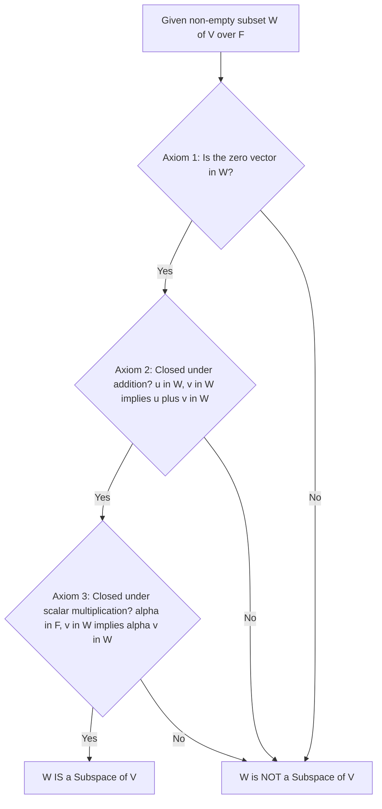
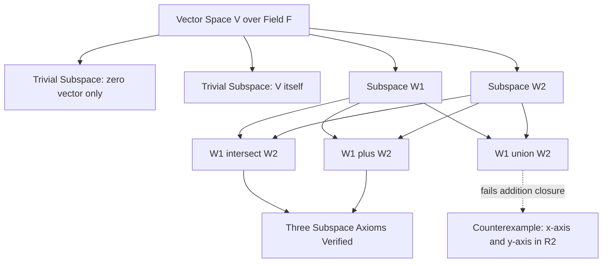
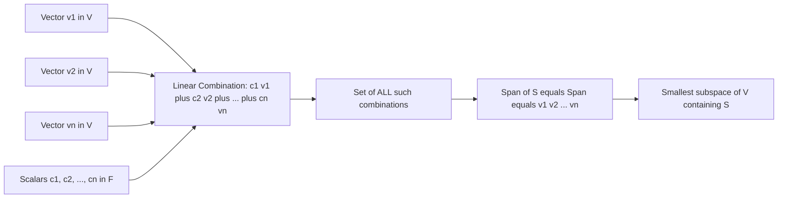
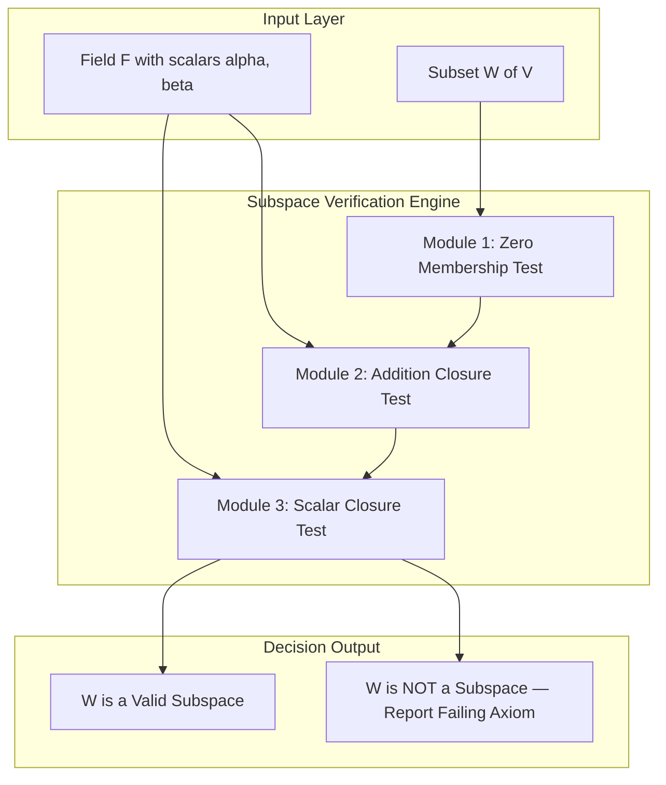

# Subspaces and algebraic properties using vector combinations

<!-- SECTION_1_START -->
# Subspaces and Algebraic Properties Using Vector Combinations

> [!IMPORTANT]
> **Formal Definition (KTU 2024 Syllabus Standard):**
> Let $V(F)$ be a vector space over a field $F$. A non-empty subset $W$ of $V$ is called a **subspace** of $V$ if $W$ itself forms a vector space over the same field $F$ under the inherited operations of vector addition and scalar multiplication from $V$.

> [!NOTE]
> **Intuitive Real-World Analogy — "The Flat Sheet Through The Origin":**
> Imagine the 3-dimensional room $\mathbb{R}^3$ around you. Now stretch a perfectly **flat, infinite sheet of paper** through the origin — the point $(0, 0, 0)$. This sheet is a 2-dimensional subspace. You can walk anywhere on the sheet, but you can never step off it. The same idea extends to a taut string (1-dimensional subspace) passing through the origin. **The cardinal rule:** *every subspace must pass through the origin*. If your sheet doesn't touch $(0,0,0)$, it is not a subspace — it is merely an "affine subspace."

> [!VISUALIZATION CONTROL]
> **Concept:** Geometric Identification of Subspaces in $\mathbb{R}^3$
> **GeoGebra / Desmos 3D Input Equations:**
> * Origin Constraint Test (always pass through $(0,0,0)$):
>   - Plane A: $x + y + z = 0$  →  valid subspace (passes through origin)
>   - Plane B: $x + y + z = 1$  →  NOT a subspace (misses the origin)
>   - Line L: parametric $(t, 2t, -t)$  →  valid 1-D subspace
> * Random Test Point: pick $(2, -1, -1)$; it satisfies $x+y+z=0$, hence lies on Plane A.
> **Visual Description:** On the rendered 3D axes, you should observe Plane A cutting through the origin like a tilted disc, while Plane B floats parallel to it but offset. Only Plane A qualifies as a subspace.

## The Three Subspace Axioms (One-Step Test)

A non-empty subset $W \subseteq V$ is a subspace of $V$ **if and only if** all three conditions hold simultaneously:

$$
\begin{aligned}
\text{(i)} \quad & \mathbf{0}_V \in W \quad \text{(zero vector must be present)} \\
\text{(ii)} \quad & \forall\, \mathbf{u}, \mathbf{v} \in W : \mathbf{u} + \mathbf{v} \in W \quad \text{(closure under addition)} \\
\text{(iii)} \quad & \forall\, \alpha \in F,\; \forall\, \mathbf{v} \in W : \alpha \mathbf{v} \in W \quad \text{(closure under scalar multiplication)}
\end{aligned}
$$

> [!NOTE]
> **Why these three and not more?**
> Inherited associativity, commutativity, distributivity, and identity elements of $V$ are automatically carried over to $W$ because $W$ uses the *same* operations as $V$. Hence we only need to verify the three conditions above — the remaining vector space axioms are "free."
<!-- SECTION_1_END -->

<!-- SECTION_2_START -->
# Deep Theoretical Analysis & KTU High-Yield Formula Sheet

## 1. The Subspace Test — Step-by-Step Logical Breakdown

**Step 1 — The Zero Anchor.**  
The zero vector **must** belong to $W$. Geometrically, this is what guarantees the subspace passes through the origin. Algebraically, it is the additive identity. Without it, no subset can be a subspace. For instance, $W = \{(1, 2), (3, 4)\}$ in $\mathbb{R}^2$ fails immediately.

**Step 2 — Closure Under Vector Addition.**  
If you pick **any** two elements inside $W$, their sum must also live inside $W$. This is what makes the subset "additively closed." Without it, the sum of two valid vectors could "escape" the set, breaking the vector space structure.

**Step 3 — Closure Under Scalar Multiplication.**  
If you scale any element of $W$ by *any* scalar from the field $F$, the result must remain inside $W$. This guarantees the subset is a "linear" structure and not just a discrete point cloud.

> [!TIP]
> **Compact One-Shot Theorem (Board Exam Favorite):**  
> A non-empty subset $W \subseteq V$ is a subspace **if and only if**  
> $$\forall\, \mathbf{u}, \mathbf{v} \in W \quad \text{and} \quad \forall\, \alpha, \beta \in F \;\;\Longrightarrow\;\; \alpha \mathbf{u} + \beta \mathbf{v} \in W.$$  
> This single statement combines all three axioms into one verifiable check.

## 2. Algebraic Properties of Vector Combinations

A **linear combination** of vectors $\mathbf{v}_1, \mathbf{v}_2, \ldots, \mathbf{v}_n \in V$ with scalars $c_1, c_2, \ldots, c_n \in F$ is an element of the form:
$$
\mathbf{w} = c_1 \mathbf{v}_1 + c_2 \mathbf{v}_2 + \cdots + c_n \mathbf{v}_n
$$

The **span** of a non-empty subset $S \subseteq V$ is the collection of **all** possible linear combinations of vectors from $S$:
$$
\operatorname{span}(S) = \left\{\, \sum_{i=1}^{k} c_i \mathbf{v}_i \;\Big|\; k \in \mathbb{N},\; c_i \in F,\; \mathbf{v}_i \in S \,\right\}
$$

> [!IMPORTANT]
> **Fundamental Theorem of Spans (KTU High-Yield):**  
> The span of any non-empty subset $S$ of a vector space $V$ is **always a subspace** of $V$. Moreover, $\operatorname{span}(S)$ is the **smallest** subspace of $V$ that contains $S$.

## 3. Trivial, Proper, and Sum Subspaces

* **Trivial Subspaces:** Every vector space $V$ has at least two "trivial" subspaces — namely $W = \{\mathbf{0}\}$ (zero subspace) and $W = V$ (the whole space itself). Every other subspace is called a **proper subspace**.
* **Sum of Subspaces:** If $W_1, W_2$ are subspaces of $V$, their algebraic sum is defined as $W_1 + W_2 = \{\mathbf{u} + \mathbf{v} \mid \mathbf{u} \in W_1, \mathbf{v} \in W_2\}$. This **is** a subspace of $V$.
* **Intersection:** $W_1 \cap W_2$ is **always** a subspace of $V$ (proof in Section 3).
* **Union:** $W_1 \cup W_2$ is **NOT** generally a subspace of $V$ (counterexample in Section 3).

## 4. KTU Formula Sheet / Cheat Sheet

| Concept | Symbolic Form | Key Property |
| :--- | :--- | :--- |
| Subspace | $W \subseteq V,\; W \neq \emptyset$ | Closed under both inherited operations |
| Zero Membership | $\mathbf{0}_V \in W$ | Mandatory first axiom |
| Addition Closure | $\mathbf{u}, \mathbf{v} \in W \Rightarrow \mathbf{u} + \mathbf{v} \in W$ | Keeps vectors "inside" the set |
| Scalar Closure | $\alpha \in F,\; \mathbf{v} \in W \Rightarrow \alpha \mathbf{v} \in W$ | Permits stretching/shrinking |
| Combined Test | $\alpha \mathbf{u} + \beta \mathbf{v} \in W$ | One-line board-ready verification |
| Linear Combination | $\sum_{i=1}^{n} c_i \mathbf{v}_i$ | Weighted sum using field scalars |
| Span of S | $\operatorname{span}(S) = \{\sum c_i \mathbf{v}_i \mid c_i \in F,\; \mathbf{v}_i \in S\}$ | Smallest subspace containing $S$ |
| Trivial Subspace | $W = \{\mathbf{0}\}$ or $W = V$ | Always subspaces of $V$ |
| Intersection | $W_1 \cap W_2$ | Always a subspace |
| Sum | $W_1 + W_2$ | Always a subspace |
| Union | $W_1 \cup W_2$ | NOT necessarily a subspace |

## 5. Real-World Engineering Utility

* **Computer Graphics:** 3D rotations, translations, and projections operate on subspaces (e.g., the screen is a 2D subspace of 3D world coordinates).
* **Machine Learning:** Feature subspaces in PCA, kernel methods, and linear regression directly exploit the structure of subspaces of $\mathbb{R}^n$.
* **Signal Processing:** The space of all finite-energy signals forms a Hilbert space; band-limited signals form subspaces used in filter design.
* **Control Systems:** State-space analysis treats reachable and observable sets as subspaces governing system behaviour.
<!-- SECTION_2_END -->

<!-- SECTION_3_START -->
# Step-by-Step Derivations & Python Symbolic Implementation

## Derivation 1 — Proof that $W_1 \cap W_2$ is a Subspace of $V$

**Statement.** If $W_1$ and $W_2$ are subspaces of a vector space $V(F)$, then $W_1 \cap W_2$ is also a subspace of $V(F)$.

**Proof.** We must verify the three subspace axioms for $W_1 \cap W_2$.

**Step 1 — Non-emptiness and zero membership.**  
Since $W_1$ is a subspace, $\mathbf{0} \in W_1$. Since $W_2$ is a subspace, $\mathbf{0} \in W_2$. Therefore $\mathbf{0} \in W_1 \cap W_2$. The set is non-empty. $\checkmark$

**Step 2 — Closure under vector addition.**  
Let $\mathbf{u}, \mathbf{v} \in W_1 \cap W_2$. Then by definition of intersection:
$$
\mathbf{u}, \mathbf{v} \in W_1 \quad \text{and} \quad \mathbf{u}, \mathbf{v} \in W_2.
$$
Since $W_1$ is closed under addition, $\mathbf{u} + \mathbf{v} \in W_1$.  
Since $W_2$ is closed under addition, $\mathbf{u} + \mathbf{v} \in W_2$.  
Therefore $\mathbf{u} + \mathbf{v} \in W_1 \cap W_2$. $\checkmark$

**Step 3 — Closure under scalar multiplication.**  
Let $\alpha \in F$ and $\mathbf{v} \in W_1 \cap W_2$. Then $\mathbf{v} \in W_1$ and $\mathbf{v} \in W_2$.  
Since $W_1$ is closed under scalar multiplication, $\alpha \mathbf{v} \in W_1$.  
Since $W_2$ is closed under scalar multiplication, $\alpha \mathbf{v} \in W_2$.  
Therefore $\alpha \mathbf{v} \in W_1 \cap W_2$. $\checkmark$

All three axioms hold, hence $W_1 \cap W_2$ is a subspace of $V$. $\blacksquare$

## Derivation 2 — Counterexample: $W_1 \cup W_2$ is NOT Necessarily a Subspace

**Claim.** The union of two subspaces of $V$ is generally not a subspace.

**Counterexample in $\mathbb{R}^2$.**  
Consider the two subspaces:
$$
W_1 = \{(x, 0) \mid x \in \mathbb{R}\} \quad \text{(the x-axis)}
$$
$$
W_2 = \{(0, y) \mid y \in \mathbb{R}\} \quad \text{(the y-axis)}
$$
Both $W_1$ and $W_2$ are subspaces of $\mathbb{R}^2$ (each passes through the origin and is closed under both operations). Now form their union:
$$
W_1 \cup W_2 = \{(x, 0) \mid x \in \mathbb{R}\} \cup \{(0, y) \mid y \in \mathbb{R}\}
$$
Choose $\mathbf{u} = (1, 0) \in W_1 \subseteq W_1 \cup W_2$ and $\mathbf{v} = (0, 1) \in W_2 \subseteq W_1 \cup W_2$. Then:
$$
\mathbf{u} + \mathbf{v} = (1, 0) + (0, 1) = (1, 1)
$$
The point $(1, 1)$ is neither on the x-axis nor on the y-axis, hence $(1, 1) \notin W_1 \cup W_2$. The closure-under-addition axiom fails. Therefore $W_1 \cup W_2$ is **not** a subspace of $\mathbb{R}^2$. $\blacksquare$

## Derivation 3 — Span Construction Yields a Subspace

**Statement.** For any non-empty subset $S \subseteq V$, $\operatorname{span}(S)$ is a subspace of $V$.

**Proof.**

* **Zero membership:** Choosing all $c_i = 0$ yields the zero vector in $\operatorname{span}(S)$. $\checkmark$
* **Closure under addition:** If $\mathbf{x} = \sum a_i \mathbf{v}_i$ and $\mathbf{y} = \sum b_i \mathbf{v}_i$ are in $\operatorname{span}(S)$, then
$$
\mathbf{x} + \mathbf{y} = \sum_{i} (a_i + b_i) \mathbf{v}_i
$$
which is a linear combination of vectors in $S$, hence belongs to $\operatorname{span}(S)$. $\checkmark$
* **Closure under scalar multiplication:** If $\mathbf{x} = \sum a_i \mathbf{v}_i \in \operatorname{span}(S)$ and $\alpha \in F$, then
$$
\alpha \mathbf{x} = \sum_{i} (\alpha a_i) \mathbf{v}_i \in \operatorname{span}(S). \quad \checkmark
$$

Hence $\operatorname{span}(S)$ is a subspace. $\blacksquare$

## Python Implementation — Algorithmic Subspace Verification

```python
from __future__ import annotations
from typing import List, Tuple, TypeVar
import numpy as np

Scalar = TypeVar("Scalar", int, float, complex)
Vector = List[float]


def is_zero_vector(v: Vector, tol: float = 1e-9) -> bool:
    """Return True if every component of v is within numerical tolerance of zero."""
    return all(abs(component) < tol for component in v)


def vector_add(u: Vector, v: Vector) -> Vector:
    """Add two vectors of identical dimension; raise ValueError on mismatch."""
    if len(u) != len(v):
        raise ValueError("Dimension mismatch: cannot add vectors of different lengths.")
    return [ui + vi for ui, vi in zip(u, v)]


def scalar_multiply(alpha: float, v: Vector) -> Vector:
    """Multiply a vector v by a scalar alpha and return the resulting vector."""
    return [alpha * vi for vi in v]


def verify_subspace_axioms(
    candidate_set: List[Vector],
    dimension: int,
    test_scalars: Tuple[float, ...] = (0.0, 1.0, -1.0, 2.0, -3.0, 0.5, 7.25),
) -> Tuple[bool, str]:
    """
    Apply the three subspace axioms to a finite sample of candidate vectors.

    NOTE: This is a necessary (not sufficient) test for a subspace because
    it only checks closure on a finite sample. A rigorous algebraic proof
    is required for board examinations.

    Returns
    -------
    (is_subspace, log_message) : Tuple[bool, str]
    """
    # ---- Axiom 1: zero vector must be present ----
    zero_vec = [0.0] * dimension
    if not any(is_zero_vector(v) for v in candidate_set):
        return False, "FAIL: Zero vector is not contained in the candidate set."

    # ---- Axiom 2: closure under vector addition ----
    for u in candidate_set:
        for v in candidate_set:
            summed = vector_add(u, v)
            if not any(all(abs(s - c) < 1e-9 for s, c in zip(summed, member))
                       for member in candidate_set):
                return False, f"FAIL: Closure under addition violated by {u} + {v}."

    # ---- Axiom 3: closure under scalar multiplication ----
    for alpha in test_scalars:
        for v in candidate_set:
            scaled = scalar_multiply(alpha, v)
            if not any(all(abs(s - c) < 1e-9 for s, c in zip(scaled, member))
                       for member in candidate_set):
                return False, f"FAIL: Closure under scalar mult violated by {alpha} * {v}."

    return True, "PASS: All sampled vectors satisfy the three subspace axioms."


# ---------- Example 1: xy-plane (z = 0) in R^3 — a valid subspace ----------
xy_plane_samples: List[Vector] = [
    [0.0, 0.0, 0.0],   # zero vector
    [1.0, 2.0, 0.0],
    [-3.0, 4.0, 0.0],
    [5.0, -7.0, 0.0],
]
status, message = verify_subspace_axioms(xy_plane_samples, dimension=3)
print(f"[xy-plane]   {message}")
# Expected output: [xy-plane]   PASS: All sampled vectors satisfy the three subspace axioms.

# ---------- Example 2: a plane z = 1 — NOT a subspace (missing zero) ----------
plane_offset_samples: List[Vector] = [
    [1.0, 2.0, 1.0],
    [3.0, -1.0, 1.0],
]
status, message = verify_subspace_axioms(plane_offset_samples, dimension=3)
print(f"[plane z=1]  {message}")
# Expected output: [plane z=1]  FAIL: Zero vector is not contained in the candidate set.

# ---------- Example 3: span of a single vector in R^2 (a line) ----------
span_line_samples: List[Vector] = [
    [0.0, 0.0],
    [2.0, 4.0],
    [-1.5, -3.0],
    [5.0, 10.0],
]
status, message = verify_subspace_axioms(span_line_samples, dimension=2)
print(f"[line in R2] {message}")
# Expected output: [line in R2] PASS: All sampled vectors satisfy the three subspace axioms.
```
<!-- SECTION_3_END -->

<!-- SECTION_4_START -->
# Structural Diagrams and Schematics

## Diagram 1 — Subspace Decision Tree (Subspace Test Flowchart)



## Diagram 2 — Subspace Operations Topology



## Diagram 3 — Vector Combination to Span Pipeline



## Diagram 4 — Block-Level Functional Architecture of Subspace Operations


<!-- SECTION_4_END -->

<!-- SECTION_5_START -->
# KTU 2024 Scheme Examination Question Bank

## Part A — Short Answer Questions (3 Marks Each)

### Question 1 `[KTU University Exam — July 2023]`
**Define a subspace of a vector space. Verify whether the set** $W = \{(a, b, 0) \mid a, b \in \mathbb{R}\}$ **is a subspace of** $\mathbb{R}^3$.

**Course Outcome:** CO1 &nbsp;&nbsp; **Bloom's Level:** Remember / Understand

**Model Answer:**

**Definition (2 Marks):**  
A non-empty subset $W$ of a vector space $V(F)$ is called a subspace of $V$ if $W$ is itself a vector space over $F$ under the same operations of addition and scalar multiplication defined in $V$. Equivalently, $W$ must satisfy: (i) $\mathbf{0} \in W$, (ii) closure under addition, (iii) closure under scalar multiplication.

**Verification (1 Mark):**  
Take $\mathbf{u} = (a_1, b_1, 0)$ and $\mathbf{v} = (a_2, b_2, 0)$ in $W$ and $\alpha \in \mathbb{R}$.  
Then $\mathbf{u} + \mathbf{v} = (a_1 + a_2,\; b_1 + b_2,\; 0) \in W$ and $\alpha \mathbf{u} = (\alpha a_1,\; \alpha b_1,\; 0) \in W$. Also $(0, 0, 0) \in W$.  
Hence $W$ is a subspace of $\mathbb{R}^3$.

---

### Question 2 `[KTU University Exam — Dec 2023]`
**What is a linear combination of vectors? Find the span of the set** $S = \{(1, 2, 3), (4, 5, 6)\}$ **in** $\mathbb{R}^3$.

**Course Outcome:** CO2 &nbsp;&nbsp; **Bloom's Level:** Understand

**Model Answer:**

**Definition (1.5 Marks):**  
A linear combination of vectors $\mathbf{v}_1, \mathbf{v}_2, \ldots, \mathbf{v}_n$ with scalars $c_1, c_2, \ldots, c_n \in F$ is an expression of the form $c_1 \mathbf{v}_1 + c_2 \mathbf{v}_2 + \cdots + c_n \mathbf{v}_n$.

**Computation (1.5 Marks):**  
$$
\operatorname{span}(S) = \{\, c_1 (1, 2, 3) + c_2 (4, 5, 6) \mid c_1, c_2 \in \mathbb{R} \,\} = \{\, (c_1 + 4c_2,\; 2c_1 + 5c_2,\; 3c_1 + 6c_2) \mid c_1, c_2 \in \mathbb{R} \,\}.
$$

This is a 2-dimensional plane passing through the origin inside $\mathbb{R}^3$.

---

## Part B — Long Answer Questions (14 Marks Each, Module Internal Choice)

### Question A `[KTU University Exam — July 2024]`

#### Part (a) — 7 Marks
**State and prove the necessary and sufficient conditions for a non-empty subset $W$ of a vector space $V(F)$ to be a subspace of $V$.**

**Course Outcome:** CO1 &nbsp;&nbsp; **Bloom's Level:** Understand / Apply

**Model Answer:**

**Statement (1 Mark):**  
A non-empty subset $W \subseteq V(F)$ is a subspace of $V$ if and only if for every $\mathbf{u}, \mathbf{v} \in W$ and every $\alpha, \beta \in F$, we have $\alpha \mathbf{u} + \beta \mathbf{v} \in W$.

**Proof of Necessity ($\Rightarrow$) (3 Marks):**  
Assume $W$ is a subspace. Take any $\mathbf{u}, \mathbf{v} \in W$ and $\alpha, \beta \in F$.  
By closure under scalar multiplication, $\alpha \mathbf{u} \in W$ and $\beta \mathbf{v} \in W$.  
By closure under addition, $\alpha \mathbf{u} + \beta \mathbf{v} \in W$.

**Proof of Sufficiency ($\Leftarrow$) (3 Marks):**  
Assume the combined condition holds for all $\mathbf{u}, \mathbf{v} \in W$ and $\alpha, \beta \in F$.  
* (i) Setting $\mathbf{u} = \mathbf{v}$ arbitrary and $\alpha = \beta = 0$ gives $\mathbf{0} + \mathbf{0} = \mathbf{0} \in W$.  
* (ii) Setting $\alpha = \beta = 1$ gives $\mathbf{u} + \mathbf{v} \in W$.  
* (iii) Setting $\beta = 0$ gives $\alpha \mathbf{u} \in W$.  
All three subspace axioms are recovered, so $W$ is a subspace. $\blacksquare$

**Incremental Valuation Key:**  
- [Stating the combined condition correctly: 1 Mark]  
- [Necessity direction with two-step closure: 3 Marks]  
- [Sufficiency direction recovering all three axioms: 3 Marks]

---

#### Part (b) — 7 Marks
**If $W_1$ and $W_2$ are subspaces of a vector space $V$, prove that $W_1 \cap W_2$ is also a subspace of $V$.**

**Course Outcome:** CO1 &nbsp;&nbsp; **Bloom's Level:** Apply

**Model Answer:**

**Setup (1 Mark):** Let $W_1, W_2 \subseteq V(F)$ be subspaces. We verify the three axioms for $W_1 \cap W_2$.

**Axiom 1 — Zero Vector (2 Marks):**  
Since $W_1$ is a subspace, $\mathbf{0} \in W_1$. Since $W_2$ is a subspace, $\mathbf{0} \in W_2$. Hence $\mathbf{0} \in W_1 \cap W_2$.

**Axiom 2 — Closure under Addition (2 Marks):**  
Let $\mathbf{u}, \mathbf{v} \in W_1 \cap W_2$. Then $\mathbf{u}, \mathbf{v} \in W_1$ and $\mathbf{u}, \mathbf{v} \in W_2$.  
Since $W_1$ is closed under addition, $\mathbf{u} + \mathbf{v} \in W_1$. Since $W_2$ is closed under addition, $\mathbf{u} + \mathbf{v} \in W_2$. Thus $\mathbf{u} + \mathbf{v} \in W_1 \cap W_2$.

**Axiom 3 — Closure under Scalar Multiplication (2 Marks):**  
Let $\alpha \in F$ and $\mathbf{v} \in W_1 \cap W_2$. Then $\mathbf{v} \in W_1$ and $\mathbf{v} \in W_2$.  
Scalar closure in $W_1$ gives $\alpha \mathbf{v} \in W_1$. Scalar closure in $W_2$ gives $\alpha \mathbf{v} \in W_2$. Hence $\alpha \mathbf{v} \in W_1 \cap W_2$.

All three axioms hold, so $W_1 \cap W_2$ is a subspace of $V$. $\blacksquare$

**Incremental Valuation Key:**  
- [Stating the three axioms to verify: 1 Mark]  
- [Zero vector: 2 Marks]  
- [Addition closure: 2 Marks]  
- [Scalar closure: 2 Marks]

---

### Question B `[KTU University Exam — Dec 2024]`

#### Part (a) — 7 Marks
**Define a linear combination and the span of a set of vectors. If** $S = \{(1, 1, 0), (1, 0, 1), (0, 1, 1)\}$, **find** $\operatorname{span}(S)$ **and determine whether the vectors are linearly independent.**

**Course Outcome:** CO2 &nbsp;&nbsp; **Bloom's Level:** Understand / Apply

**Model Answer:**

**Definitions (2 Marks):**  
A **linear combination** of vectors $\mathbf{v}_1, \ldots, \mathbf{v}_n$ with scalars $c_1, \ldots, c_n \in F$ is $c_1 \mathbf{v}_1 + \cdots + c_n \mathbf{v}_n$.  
The **span** of $S$ is $\operatorname{span}(S) = \{\sum c_i \mathbf{v}_i \mid c_i \in F,\; \mathbf{v}_i \in S\}$.

**Computing the Span (2 Marks):**  
$$
\operatorname{span}(S) = \{\, a(1, 1, 0) + b(1, 0, 1) + c(0, 1, 1) \mid a, b, c \in \mathbb{R} \,\}
$$
$$
= \{\, (a + b,\; a + c,\; b + c) \mid a, b, c \in \mathbb{R} \,\}.
$$
Notice that the components satisfy $(a + b) + (a + c) + (b + c) = 2(a + b + c)$. For any choice of $a, b, c$, every vector in the span has the form $(x, y, z)$ where $x, y, z$ are freely chosen real numbers (because the three original vectors are clearly **linearly independent** — see below). Hence:
$$
\operatorname{span}(S) = \mathbb{R}^3.
$$

**Linear Independence (3 Marks):**  
Consider $\alpha(1, 1, 0) + \beta(1, 0, 1) + \gamma(0, 1, 1) = (0, 0, 0)$. This gives the system:
$$
\begin{aligned}
\alpha + \beta &= 0 \\
\alpha + \gamma &= 0 \\
\beta + \gamma &= 0
\end{aligned}
$$
Adding all three: $2(\alpha + \beta + \gamma) = 0 \Rightarrow \alpha + \beta + \gamma = 0$. Subtracting: $\gamma = 0$, $\beta = 0$, $\alpha = 0$. The only solution is the trivial one, so the vectors are **linearly independent** and span $\mathbb{R}^3$.

**Incremental Valuation Key:**  
- [Definitions: 2 Marks]  
- [Span expression: 2 Marks]  
- [Independence proof via coefficient system: 3 Marks]

---

#### Part (b) — 7 Marks
**Show by an explicit counterexample that the union of two subspaces of a vector space need not be a subspace. Can the same counterexample show that the sum of two subspaces IS a subspace?**

**Course Outcome:** CO2 &nbsp;&nbsp; **Bloom's Level:** Apply / Analyze

**Model Answer:**

**Counterexample for Union (4 Marks):**  
In $\mathbb{R}^2$, let $W_1 = \{(x, 0) \mid x \in \mathbb{R}\}$ (the x-axis) and $W_2 = \{(0, y) \mid y \in \mathbb{R}\}$ (the y-axis). Both are subspaces.  
Now $\mathbf{u} = (1, 0) \in W_1$ and $\mathbf{v} = (0, 1) \in W_2$ are both in $W_1 \cup W_2$, but:
$$
\mathbf{u} + \mathbf{v} = (1, 1) \notin W_1 \cup W_2.
$$
Hence $W_1 \cup W_2$ is **not** closed under addition, and is **not** a subspace of $\mathbb{R}^2$.

**Sum Verification using the Same Sets (3 Marks):**  
The sum of the two subspaces is:
$$
W_1 + W_2 = \{\, (x, 0) + (0, y) \mid x, y \in \mathbb{R} \,\} = \{\, (x, y) \mid x, y \in \mathbb{R} \,\} = \mathbb{R}^2.
$$
Clearly $\mathbb{R}^2$ is a subspace of itself (the whole space is always a subspace). The sum operation fills in the missing points that union missed, demonstrating that **sum preserves the subspace property** while **union does not**.

**Incremental Valuation Key:**  
- [Choosing valid subspaces: 1 Mark]  
- [Choosing counterexample vectors: 1 Mark]  
- [Showing failure of closure: 2 Marks]  
- [Computing and verifying the sum: 3 Marks]

---

> [!WARNING]
> **KTU Examiner's Valuation Warning — Where Students Lose Marks**
> 
> * **Skipping the zero-vector check:** A common mistake is verifying only closure under addition and scalar multiplication, forgetting to explicitly state that $\mathbf{0} \in W$. Examiners award 0 marks for the first axiom if it is omitted.
> * **Proving the wrong direction:** When asked to "show that union is not a subspace," students often try to *prove* it is a subspace. Always read the verb carefully: *show / prove / verify* (positive) vs. *disprove / give counterexample* (negative).
> * **Mixing up union and sum:** $W_1 \cup W_2$ vs. $W_1 + W_2$ are different. Union is a set-theoretic OR; sum collects all pairwise additions. They coincide only when one subspace is contained in the other.
> * **Forgetting the "non-empty" condition:** A subspace must be non-empty. Always state this before verifying the three axioms.

---

## Topic Recap & Important Things to Remember

* **Subspace Definition:** A non-empty subset $W$ of $V(F)$ is a subspace if it is itself a vector space under the inherited operations of $V$.
* **Three Subspace Axioms:** (i) $\mathbf{0} \in W$, (ii) $\mathbf{u}, \mathbf{v} \in W \Rightarrow \mathbf{u} + \mathbf{v} \in W$, (iii) $\alpha \in F, \mathbf{v} \in W \Rightarrow \alpha \mathbf{v} \in W$.
* **Compact One-Shot Test:** $\forall \mathbf{u}, \mathbf{v} \in W$ and $\forall \alpha, \beta \in F$, the combination $\alpha \mathbf{u} + \beta \mathbf{v} \in W$ — this single condition subsumes all three axioms.
* **Trivial Subspaces:** Every vector space has the two trivial subspaces $\{\mathbf{0}\}$ and $V$ itself.
* **Proper Subspace:** Any subspace other than $\{\mathbf{0}\}$ and $V$ is called a proper subspace.
* **Intersection of Subspaces:** $W_1 \cap W_2$ is **always** a subspace of $V$.
* **Union of Subspaces:** $W_1 \cup W_2$ is **NOT** generally a subspace (counterexample: x-axis and y-axis in $\mathbb{R}^2$).
* **Sum of Subspaces:** $W_1 + W_2$ is **always** a subspace of $V$, and $W_1 \cup W_2 \subseteq W_1 + W_2$ with equality iff one is contained in the other.
* **Linear Combination:** $c_1 \mathbf{v}_1 + c_2 \mathbf{v}_2 + \cdots + c_n \mathbf{v}_n$ where $c_i \in F$ and $\mathbf{v}_i \in V$.
* **Span of S:** The set of all linear combinations of vectors from $S$. It is the **smallest subspace** of $V$ that contains $S$.
* **Origin Constraint:** Every subspace **must** pass through the zero vector $\mathbf{0}$ — this is the geometric and algebraic hallmark of a subspace.
* **Inherited Axioms:** Associativity, commutativity, distributivity, and the existence of additive/scalar identities in $V$ are automatically inherited by $W$, so they do not need re-verification.
* **Board Tip:** Always state the three axioms *explicitly* before checking them in any proof — examiners award step-marks for clearly structuring the verification.
<!-- SECTION_5_END -->
