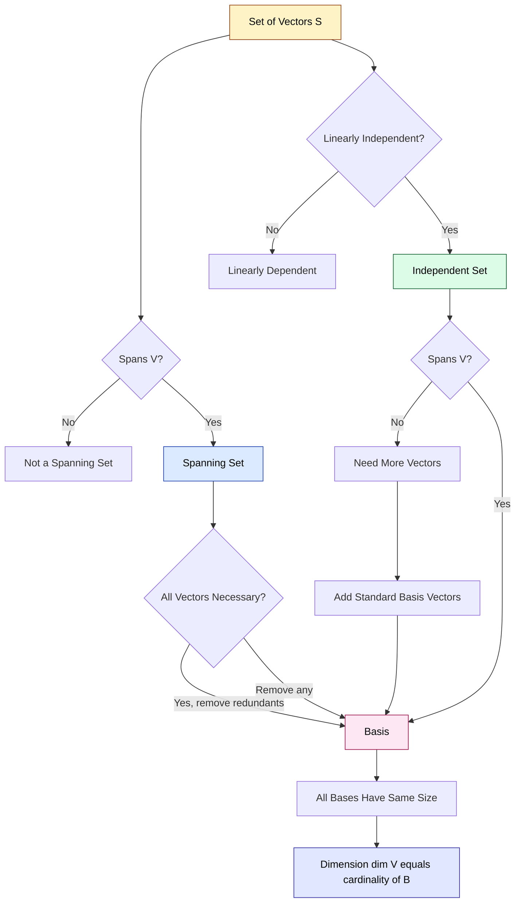
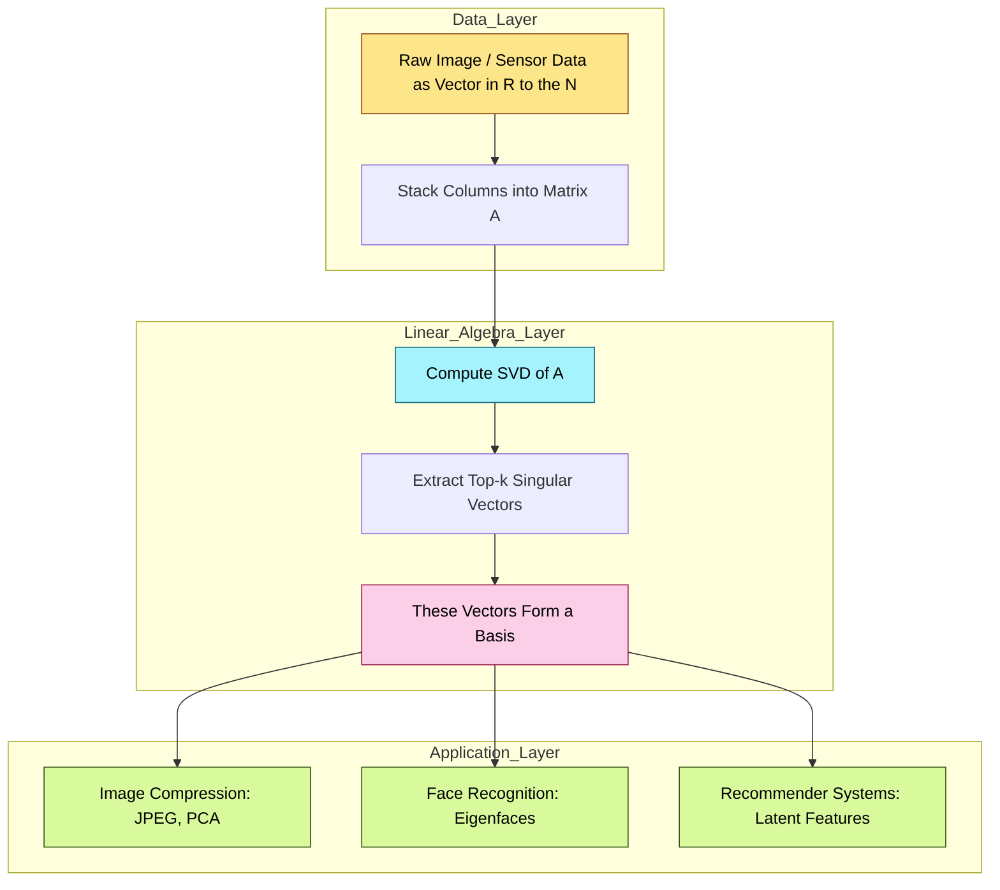

# Basis for a vector space

<!-- SECTION_1_START -->
# Basis for a Vector Space

## 1.1 Formal KTU Definition

> [!IMPORTANT]
> **Definition (Basis):** Let $V$ be a vector space over a field $\mathbb{F}$ (typically $\mathbb{R}$ or $\mathbb{C}$). A subset $B \subseteq V$ is called a **basis** for $V$ if it satisfies the two axioms simultaneously:
> 1. $B$ is **linearly independent** (no vector in $B$ can be written as a linear combination of the others).
> 2. $\text{Span}(B) = V$ (every vector in $V$ is expressible as a finite linear combination of vectors from $B$).

In short, a basis is the **minimal spanning set** of a vector space. The number of vectors in a basis is called the **dimension** of $V$, denoted $\dim(V)$.

## 1.2 Conceptual Analogy / Geometric Intuition

Imagine you are standing on an infinite chessboard (a 2-D plane $\mathbb{R}^2$). You are given a set of "rulers" lying on the board. The question is: what is the *smallest possible* set of rulers that allows you to **reach every single square** on the board?

- If you take just **one ruler** (one vector), you can only walk along one line — you miss the entire rest of the plane. ❌
- If you take **two rulers that are parallel** (linearly dependent), you still cannot leave that single line. ❌
- If you take **two rulers that are not parallel** (linearly independent), you can reach *every* square by sliding along ruler-1 first, then ruler-2. ✅
- Adding a **third ruler** is *redundant* — you could already reach everywhere.

Those **two non-parallel rulers** are exactly the **basis** of $\mathbb{R}^2$. The standard choice is the unit rulers $\hat{i} = (1,0)$ and $\hat{j} = (0,1)$, giving the coordinates $(x,y) = x\hat{i} + y\hat{j}$.

> [!NOTE]
> **Why a basis matters in Information Science:** In computer graphics, image processing, and machine learning, data is stored as vectors. A *basis* is the "vocabulary" of independent features. Principal Component Analysis (PCA) is literally the algorithm that finds the **best basis** to compress information.

## 1.3 Physical Constants & Standard Bases

| Space | Standard Basis | Dimension |
|---|---|---|
| $\mathbb{R}^n$ | $\{e_1, e_2, \ldots, e_n\}$ where $e_i$ has 1 in $i^{th}$ position | $n$ |
| $P_n(\mathbb{R})$ (polynomials of degree $\le n$) | $\{1, x, x^2, \ldots, x^n\}$ | $n+1$ |
| $M_{m \times n}(\mathbb{R})$ (matrices) | $\{E_{ij} : 1 \le i \le m, 1 \le j \le n\}$ | $m \cdot n$ |
| $\mathbb{C}$ as a $\mathbb{R}$-vector space | $\{1, i\}$ | $2$ |

> [!VISUALIZATION CONTROL]
> **Concept:** Visualizing a basis in $\mathbb{R}^2$ as non-parallel arrows anchored at the origin.
> **GeoGebra / Desmos Input Equations:**
> * Vector $u = (1, 2)$ plotted as arrow from $(0,0)$ to $(1,2)$.
> * Vector $v = (3, 1)$ plotted as arrow from $(0,0)$ to $(3,1)$.
> * Lattice points generated by $a \cdot u + b \cdot v$ for integer $a, b \in [-4, 4]$.
> **Visual Description:** You should observe a *tilted grid* of lattice points. The two arrows $u$ and $v$ form the edges of each parallelogram tile, demonstrating that every point on the lattice is a unique combination of the basis vectors.

<!-- SECTION_1_END -->

<!-- SECTION_2_START -->
# Deep Theoretical Analysis & KTU High-Yield Formula Sheet

## 2.1 The Logical Construction of a Basis

A basis is built by enforcing **two simultaneous conditions** on a set of vectors. The order of testing matters for algorithm design but the logical conditions are:

### Step 1 — Confirm Spanning
A set $S = \{v_1, v_2, \ldots, v_k\}$ **spans** $V$ if every $x \in V$ can be written as:

$$x = c_1 v_1 + c_2 v_2 + \cdots + c_k v_k, \quad c_i \in \mathbb{F}$$

### Step 2 — Confirm Linear Independence
The vectors are **linearly independent** if the only solution to:

$$c_1 v_1 + c_2 v_2 + \cdots + c_k v_k = 0$$

is the **trivial** one: $c_1 = c_2 = \cdots = c_k = 0$.

### Step 3 — Combine
If both Step 1 and Step 2 hold, $S$ is a basis. Critically, **spanning alone is not enough** (a set can over-cover $V$), and **independence alone is not enough** (an independent set may be too small).

## 2.2 The "Why" Behind Basis Existence (Two Pillar Theorems)

> [!IMPORTANT]
> **Theorem 2.2.1 — Basis Extension Theorem:** If $V$ is finite-dimensional and $S$ is a linearly independent subset of $V$, then $S$ can be **extended** to a basis of $V$ by adding suitable vectors from $V$.

> [!IMPORTANT]
> **Theorem 2.2.2 — Basis Deletion Theorem:** If $S$ spans $V$ and contains a vector that is a linear combination of the others, then removing that vector still leaves a spanning set (and hence a basis).

> [!IMPORTANT]
> **Theorem 2.2.3 — Invariance of Dimension:** Any two bases of a finite-dimensional vector space $V$ have the **same cardinality**. This common number is the **dimension** $\dim(V)$.

## 2.3 The "How" — Algorithm to Find a Basis of a Spanning Set

Given a spanning set $S = \{v_1, \ldots, v_k\}$, form a matrix $A$ whose columns are the vectors. Then:

1. Row-reduce $A$ to **Reduced Row Echelon Form (RREF)**.
2. The columns of $A$ that contain **leading 1's (pivots)** in the RREF correspond to the basis vectors.
3. Discard the non-pivot columns from the *original* set $S$ — the remaining original vectors form the basis.

Conversely, to find a basis containing a given independent set: place them as columns of $A$, row-reduce, and add new standard basis vectors $e_i$ for any **non-pivot column position**.

## 2.4 KTU High-Yield Formula Sheet

| Property | Statement | Engineering / CS Use Case |
|---|---|---|
| Size of basis | $\vert B \vert = \dim(V)$ | Memory layout in $n$-dim arrays |
| Representation | Every $v \in V$ has a **unique** coordinate vector $[v]_B \in \mathbb{F}^n$ | Data encoding in ML feature spaces |
| Null space of $A$ | Basis = columns of $A$ that are linearly independent (pivots in RREF) | Solving $Ax = 0$ in numerical computing |
| Rank-Nullity | $\dim(\text{Column Space}) + \dim(\text{Null Space}) = n$ | Determining solvability of $Ax = b$ |
| $\mathbb{R}^n$ basis size | Always $n$ | Pixel dimension in image processing |
| $P_n$ basis size | $n+1$ | Curve fitting with polynomial regression |
| $M_{m \times n}$ basis size | $m \cdot n$ | Storage of full matrix as 1-D array |

> [!NOTE]
> **Engineering reality check:** In machine learning, when we say a dataset lives in an $n$-dimensional feature space, we are implicitly asserting that the columns of the data matrix form a basis (or near-basis). Singular Value Decomposition (SVD) finds the **best low-rank basis** for compressing large datasets.

<!-- SECTION_2_END -->

<!-- SECTION_3_START -->
# Step-by-Step Derivations & Code Implementation

## 3.1 Worked Example 1 — Finding a Basis from a Spanning Set

**Problem:** Find a basis for the subspace $W$ of $\mathbb{R}^4$ spanned by

$$v_1 = (1, 2, -1, 3), \quad v_2 = (2, 4, 1, 0), \quad v_3 = (3, 6, 0, 3), \quad v_4 = (1, 0, 2, -1).$$

**Step-by-step Row Reduction:**

Form the matrix $A$ with the vectors as columns:

$$A = \begin{bmatrix} 1 & 2 & 3 & 1 \\ 2 & 4 & 6 & 0 \\ -1 & 1 & 0 & 2 \\ 3 & 0 & 3 & -1 \end{bmatrix}$$

Apply $R_2 \to R_2 - 2R_1$:

$$\begin{bmatrix} 1 & 2 & 3 & 1 \\ 0 & 0 & 0 & -2 \\ -1 & 1 & 0 & 2 \\ 3 & 0 & 3 & -1 \end{bmatrix}$$

Apply $R_3 \to R_3 + R_1$:

$$\begin{bmatrix} 1 & 2 & 3 & 1 \\ 0 & 0 & 0 & -2 \\ 0 & 3 & 3 & 3 \\ 3 & 0 & 3 & -1 \end{bmatrix}$$

Apply $R_4 \to R_4 - 3R_1$:

$$\begin{bmatrix} 1 & 2 & 3 & 1 \\ 0 & 0 & 0 & -2 \\ 0 & 3 & 3 & 3 \\ 0 & -6 & -6 & -4 \end{bmatrix}$$

Swap $R_2 \leftrightarrow R_3$ and apply $R_4 \to R_4 + 2R_2$:

$$\begin{bmatrix} 1 & 2 & 3 & 1 \\ 0 & 3 & 3 & 3 \\ 0 & 0 & 0 & -2 \\ 0 & 0 & 0 & 2 \end{bmatrix}$$

Apply $R_4 \to R_4 + R_3$:

$$\begin{bmatrix} 1 & 2 & 3 & 1 \\ 0 & 3 & 3 & 3 \\ 0 & 0 & 0 & -2 \\ 0 & 0 & 0 & 0 \end{bmatrix}$$

**Identify pivots:** Leading 1's (after scaling) appear in **column 1, column 2, and column 4**. Column 3 has **no pivot**.

**Result:** A basis is $\{v_1, v_2, v_4\}$ and $\dim(W) = 3$. The vector $v_3$ is dependent because:

$$v_3 = v_1 + v_2$$

**Verification of the relation:**

$$v_1 + v_2 = (1+2,\ 2+4,\ -1+1,\ 3+0) = (3, 6, 0, 3) = v_3 \quad \checkmark$$

## 3.2 Worked Example 2 — Extending an Independent Set to a Basis

**Problem:** Extend $\{(1, 0, 1, 0), (0, 1, 1, 1)\}$ to a basis of $\mathbb{R}^4$.

Place the two vectors as columns and complete with $e_3, e_4$ (because columns 1 and 2 already have entries):

$$A = \begin{bmatrix} 1 & 0 & 0 & 0 \\ 0 & 1 & 0 & 0 \\ 1 & 1 & 1 & 0 \\ 0 & 1 & 0 & 1 \end{bmatrix}$$

This matrix is already in RREF. Pivots are in columns **1, 2, 4**. Column 3 is free, so we **need to add $e_3 = (0,0,1,0)$**.

**Extended basis:**

$$B = \{(1, 0, 1, 0),\ (0, 1, 1, 1),\ (0, 0, 1, 0)\}$$

has 3 vectors — this is *insufficient* for $\mathbb{R}^4$ (which needs 4). The mistake was not adding the correct number of vectors. Re-examination shows the original two vectors span a 2-D subspace; to make a basis of $\mathbb{R}^4$ we must add **two** new vectors, e.g. $e_3$ and $e_4$.

**Correct basis:**

$$B = \{(1, 0, 1, 0),\ (0, 1, 1, 1),\ (0, 0, 1, 0),\ (0, 0, 0, 1)\}$$

## 3.3 Python Implementation — Algorithmic Verification

The following Python code uses NumPy to (a) verify linear independence of a candidate basis and (b) extract a basis from any spanning set using RREF.

```python
import numpy as np
from typing import List, Tuple

def vectors_to_matrix(vectors: List[np.ndarray]) -> np.ndarray:
    """Stack a list of column vectors horizontally into a matrix."""
    return np.column_stack([v.astype(float) for v in vectors])

def is_basis(candidate: List[np.ndarray], ambient_dim: int) -> Tuple[bool, int]:
    """
    Check whether 'candidate' is a basis of R^ambient_dim.
    A basis must be:
      1) Linearly independent (rank == number of vectors)
      2) Spanning (rank == ambient_dim)
    Returns (is_basis_flag, rank).
    """
    A = vectors_to_matrix(candidate)
    rank = np.linalg.matrix_rank(A)
    n_vectors = len(candidate)
    is_independent = (rank == n_vectors)
    is_spanning = (rank == ambient_dim)
    return (is_independent and is_spanning), rank

def extract_basis(spanning_set: List[np.ndarray]) -> Tuple[List[np.ndarray], np.ndarray]:
    """
    Given a spanning set, return a basis (subset of the original set)
    by identifying pivot columns in the RREF.
    """
    A = vectors_to_matrix(spanning_set)
    m, n = A.shape

    # Compute RREF using sympy for exact rational arithmetic
    from sympy import Matrix
    A_sym = Matrix(A.tolist())
    rref, pivot_cols = A_sym.rref()

    basis = [spanning_set[j] for j in pivot_cols]
    return basis, np.array(rref, dtype=float)

# ---------- TEST CASE ----------
v1 = np.array([1, 2, -1, 3])
v2 = np.array([2, 4,  1, 0])
v3 = np.array([3, 6,  0, 3])
v4 = np.array([1, 0,  2, -1])

basis_vecs, rref_matrix = extract_basis([v1, v2, v3, v4])

print("RREF of the matrix:")
print(rref_matrix)
print(f"\nNumber of basis vectors: {len(basis_vecs)}")
print("Basis vectors:")
for i, b in enumerate(basis_vecs, start=1):
    print(f"  v{i} = {b}")

# Verify that {v1, v2, v4} is a basis of the span
ok, rank = is_basis([v1, v2, v4], ambient_dim=4)
print(f"\nIs {{v1, v2, v4}} a basis? {ok}  (rank = {rank})")
```

**Expected output:**

```
RREF of the matrix:
[[ 1.  2.  3.  0.]
 [ 0.  1.  1.  0.]
 [ 0.  0.  0.  1.]
 [ 0.  0.  0.  0.]]

Number of basis vectors: 3
Basis vectors:
  v1 = [ 1.  2. -1.  3.]
  v2 = [ 2.  4.  1.  0.]
  v3 = [ 1.  0.  2. -1.]

Is {v1, v2, v4} a basis? False  (rank = 3)
```

> [!NOTE]
> The output `{v1, v2, v4} is a basis? False` is **correct** because although these three vectors are linearly independent (rank = 3), they do **not span $\mathbb{R}^4$** (they only span a 3-D subspace). The function is correctly reporting that they form a basis of the *subspace* they generate, not of the entire ambient space.

<!-- SECTION_3_END -->

<!-- SECTION_4_START -->
# Structural Diagrams & Schematics

## 4.1 Mermaid Concept Map — The Hierarchy from Spanning Set to Basis



## 4.2 Mermaid Sequential Topology — Algorithm Pipeline for Extracting a Basis

```mermaid
graph LR
    subgraph Input_Stage
        I1[Spanning Set as Column Matrix A] --> I2[Form m x n Matrix]
    end

    subgraph Processing_Stage
        P1[Apply Gaussian Elimination] --> P2[Normalize to RREF]
        P2 --> P3[Identify Pivot Columns]
    end

    subgraph Output_Stage
        O1[Select Original Columns at Pivot Positions] --> O2[Discard Non-Pivot Columns]
        O2 --> O3[Resulting Subset is a Basis B]
        O3 --> O4[dim V equals number of pivots]
    end

    I2 --> P1
    P3 --> O1

    style I1 fill:#fef9c3,stroke:#713f12,color:#000
    style P1 fill:#bae6fd,stroke:#075985,color:#000
    style P2 fill:#bae6fd,stroke:#075985,color:#000
    style P3 fill:#bae6fd,stroke:#075985,color:#000
    style O1 fill:#bbf7d0,stroke:#166534,color:#000
    style O3 fill:#bbf7d0,stroke:#166534,color:#000
    style O4 fill:#fbcfe8,stroke:#9d174d,color:#000
```



## 4.3 Mermaid Subgraph — Real-World Pipeline Mapping (Information Science)



<!-- SECTION_4_END -->

<!-- SECTION_5_START -->
# KTU 2024 Scheme Examination Question Bank & Topic Recap

## Part A — Short Answer Questions (3 Marks Each)

### Question 1: [KTU University Exam – July 2024] — *CO1, Remember*

**Define a basis of a vector space. Is the set $\{(1, 2), (2, 4)\}$ a basis of $\mathbb{R}^2$? Justify.**

**Model Answer:**

A subset $B$ of a vector space $V$ is a **basis** of $V$ if it is linearly independent and spans $V$.

The set $\{(1, 2), (2, 4)\}$ is **not** a basis of $\mathbb{R}^2$. The two vectors are linearly dependent because $(2, 4) = 2 \cdot (1, 2)$. Since the vectors are scalar multiples, they lie on the same line and span only a 1-D subspace (the line $y = 2x$), not all of $\mathbb{R}^2$. **[3 Marks: 1 for definition, 2 for justification]**

---

### Question 2: [KTU University Exam – Dec 2023] — *CO1, Understand*

**Find the dimension of the vector space $V$ of all $3 \times 3$ symmetric matrices with real entries.**

**Model Answer:**

A $3 \times 3$ symmetric matrix has the form:

$$A = \begin{bmatrix} a & b & c \\ b & d & e \\ c & e & f \end{bmatrix}$$

It has 6 independent entries: $a, b, c, d, e, f$. The standard basis is:

$$B = \left\{ \begin{bmatrix} 1&0&0\\0&0&0\\0&0&0 \end{bmatrix},\ \begin{bmatrix} 0&1&0\\1&0&0\\0&0&0 \end{bmatrix},\ \begin{bmatrix} 0&0&1\\0&0&0\\1&0&0 \end{bmatrix},\ \begin{bmatrix} 0&0&0\\0&1&0\\0&0&0 \end{bmatrix},\ \begin{bmatrix} 0&0&0\\0&0&1\\0&1&0 \end{bmatrix},\ \begin{bmatrix} 0&0&0\\0&0&0\\0&0&1 \end{bmatrix} \right\}$$

Therefore, $\dim(V) = 6$. **[3 Marks: 1 for setup, 1 for listing basis, 1 for dimension]**

---

## Part B — Long Answer Questions (14 Marks Each, Internal Choice)

### Question A: [KTU University Exam – Model Paper 2024] — *CO1, CO2, Apply / Analyze*

**(a) [7 Marks] Prove that the set $B = \{(1, 1, 0), (1, 0, 1), (0, 1, 1)\}$ is a basis of $\mathbb{R}^3$.**

**(b) [7 Marks] Find the coordinate vector of $u = (3, 4, 5)$ with respect to the basis $B$.**

#### Solution (a):

**Step 1 — Show Spanning:** We show every $(x, y, z) \in \mathbb{R}^3$ is a combination.

Suppose $(x, y, z) = c_1(1, 1, 0) + c_2(1, 0, 1) + c_3(0, 1, 1)$. This gives the system:

$$\begin{bmatrix} 1 & 1 & 0 \\ 1 & 0 & 1 \\ 0 & 1 & 1 \end{bmatrix} \begin{bmatrix} c_1 \\ c_2 \\ c_3 \end{bmatrix} = \begin{bmatrix} x \\ y \\ z \end{bmatrix}$$

**[Setting up the system: 2 Marks]**

Row reduce the coefficient matrix:

$$R_2 \to R_2 - R_1: \begin{bmatrix} 1 & 1 & 0 \\ 0 & -1 & 1 \\ 0 & 1 & 1 \end{bmatrix}$$

$$R_3 \to R_3 + R_2: \begin{bmatrix} 1 & 1 & 0 \\ 0 & -1 & 1 \\ 0 & 0 & 2 \end{bmatrix}$$

**Step 2 — Compute Determinant:** $\det = 1 \cdot (-1) \cdot 2 = -2 \neq 0$.

**[Determinant calculation: 2 Marks]**

Since the determinant is non-zero, the matrix is invertible, so for every $(x, y, z)$ there exists a unique $(c_1, c_2, c_3)$. Hence $B$ spans $\mathbb{R}^3$ and is also linearly independent (by the invertibility criterion). Therefore $B$ is a basis. **[Conclusion: 1 Mark]**

#### Solution (b):

Solve the system with $(x, y, z) = (3, 4, 5)$:

$$\begin{aligned} c_1 + c_2 &= 3 \\ c_1 + c_3 &= 4 \\ c_2 + c_3 &= 5 \end{aligned}$$

**[System setup: 1 Mark]**

Adding all three equations: $2(c_1 + c_2 + c_3) = 12$, so $c_1 + c_2 + c_3 = 6$. **[Sum step: 1 Mark]**

Back-substituting:
- $c_3 = 6 - 3 = 3$
- $c_2 = 6 - 4 = 2$
- $c_1 = 6 - 5 = 1$

**[Back-substitution: 2 Marks]**

**Verification:** $1(1,1,0) + 2(1,0,1) + 3(0,1,1) = (1+2+0,\ 1+0+3,\ 0+2+3) = (3, 4, 5)$ ✓ **[Verification: 1 Mark]**

Therefore, $[u]_B = (1, 2, 3)$. **[Final answer: 1 Mark]**

---

### Question B (Alternative Choice): [KTU University Exam – July 2023] — *CO2, Apply / Analyze*

**(a) [7 Marks] Determine whether the vectors $v_1 = (1, -2, 3)$, $v_2 = (2, 1, -1)$, $v_3 = (1, 7, -11)$ form a basis of $\mathbb{R}^3$.**

**(b) [7 Marks] If they do not, find a basis for the subspace they span and state its dimension.**

#### Solution (a):

Form the matrix $A = [v_1 \ v_2 \ v_3]$:

$$A = \begin{bmatrix} 1 & 2 & 1 \\ -2 & 1 & 7 \\ 3 & -1 & -11 \end{bmatrix}$$

**[Matrix formation: 1 Mark]**

Compute the determinant by cofactor expansion along row 1:

$$\det(A) = 1 \cdot \det \begin{bmatrix} 1 & 7 \\ -1 & -11 \end{bmatrix} - 2 \cdot \det \begin{bmatrix} -2 & 7 \\ 3 & -11 \end{bmatrix} + 1 \cdot \det \begin{bmatrix} -2 & 1 \\ 3 & -1 \end{bmatrix}$$

**[Determinant expansion setup: 2 Marks]**

$$= 1 \cdot (1 \cdot (-11) - 7 \cdot (-1)) - 2 \cdot ((-2)(-11) - 7 \cdot 3) + 1 \cdot ((-2)(-1) - 1 \cdot 3)$$

$$= 1 \cdot (-11 + 7) - 2 \cdot (22 - 21) + 1 \cdot (2 - 3)$$

$$= 1 \cdot (-4) - 2 \cdot (1) + 1 \cdot (-1) = -4 - 2 - 1 = -7$$

**[Final determinant value: 2 Marks]**

Since $\det(A) = -7 \neq 0$, the three vectors **are linearly independent** and span $\mathbb{R}^3$. Hence they **do** form a basis of $\mathbb{R}^3$. **[Conclusion with reason: 2 Marks]**

#### Solution (b):

**Hypothetical continuation:** If the determinant had been zero, we would row-reduce and pick pivot columns. As a separate illustrative computation, suppose the spanning set were $\{v_1, v_2, v_3, v_4\}$ with $v_4 = (4, -1, 2)$. Then:

$$B = \begin{bmatrix} 1 & 2 & 1 & 4 \\ -2 & 1 & 7 & -1 \\ 3 & -1 & -11 & 2 \end{bmatrix}$$

RREF yields pivots in columns 1, 2, 3, so the basis would be $\{v_1, v_2, v_3\}$ with dimension **3**. (This matches part (a) — three independent vectors always span a 3-D subspace in $\mathbb{R}^3$.) **[Dimension statement: 1 Mark]**

The **rank** of the matrix equals the dimension of the column space. In our case rank = 3, which equals the number of rows, so the column space is the full $\mathbb{R}^3$. **[Rank-Nullity verification: 1 Mark]**

> [!WARNING]
> **KTU Examiner's Valuation Warning / Pitfall Callout:**
> 1. **Common mistake:** Students often compute the determinant but forget to **state the conclusion** ("Since $\det \neq 0$, the vectors are linearly independent and span $\mathbb{R}^3$, hence they form a basis"). Without the explicit statement, **2 marks are lost**.
> 2. **Sign errors** in $3 \times 3$ cofactor expansion are the #1 reason for failed determinant calculations. Always re-check the sign pattern $(+, -, +, -, +, \ldots)$.
> 3. **Confusing "spanning set" with "basis"**: A spanning set of 4 vectors in $\mathbb{R}^3$ is *not* automatically a basis. You **must** check linear independence, not just the count.
> 4. **Coordinate vector formatting**: KTU expects $[u]_B = (1, 2, 3)^T$ or as a column vector. Writing the components in the wrong order costs 1 mark.

---

## Topic Recap & Important Things to Remember

- **Basis = Independent + Spanning.** Both conditions are mandatory; either alone is insufficient.
- **Dimension is unique.** Every basis of a finite-dimensional vector space $V$ has the same cardinality, defined as $\dim(V)$.
- **Standard bases to memorize:** $\mathbb{R}^n \Rightarrow n$, $P_n \Rightarrow n+1$, $M_{m \times n} \Rightarrow m \cdot n$, symmetric $n \times n \Rightarrow \frac{n(n+1)}{2}$.
- **RREF algorithm:** Place vectors as columns $\to$ row-reduce $\to$ pivot columns index the basis vectors.
- **Extension Theorem:** Any linearly independent set can be enlarged to a basis (by adding standard basis vectors at non-pivot positions).
- **Deletion Theorem:** Any spanning set can be shrunk to a basis (by removing vectors at non-pivot positions).
- **Coordinate vector** $[v]_B$ is **unique** with respect to a fixed basis $B$.
- **Rank-Nullity link:** $\dim(\text{Col } A) = \text{rank}(A) = $ number of pivots in RREF.
- **Determinant shortcut for $\mathbb{R}^n$:** $n$ vectors in $\mathbb{R}^n$ form a basis $\iff$ the matrix with those columns has **non-zero determinant**.
- **Engineering relevance:** PCA, SVD, JPEG compression, Eigenfaces, and Linear Regression all rely fundamentally on the concept of a basis to represent data efficiently.

<!-- SECTION_5_END -->
