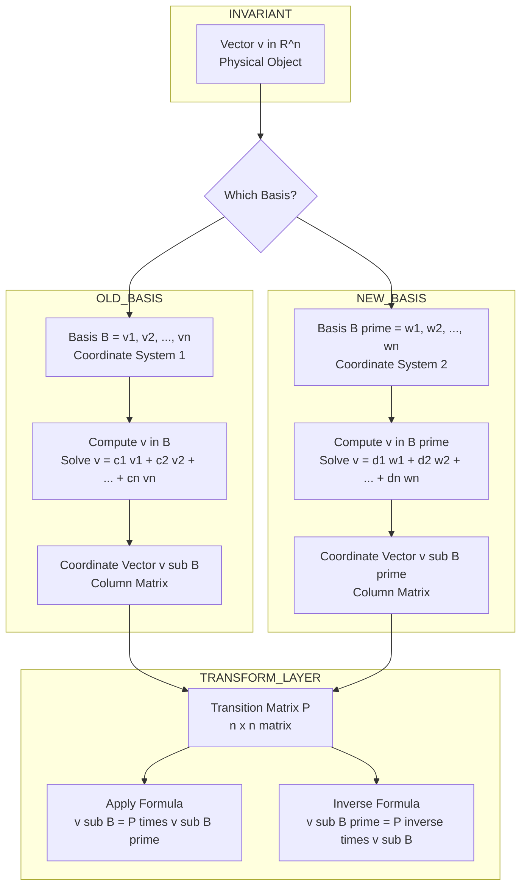
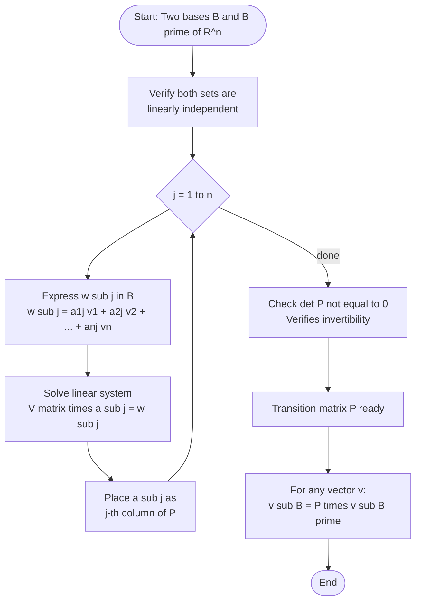
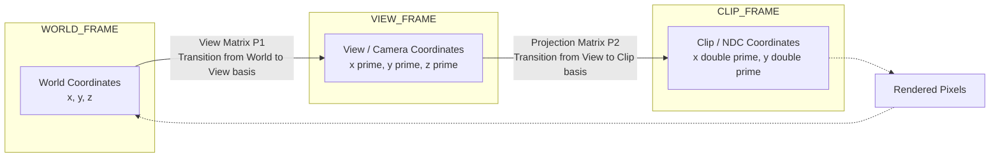

# Change of basis in Rn : Transition Matrix (without proof).

<!-- SECTION_1_START -->

# 1. Core Technical Definition & Intuitive Overview

## 1.1 Formal Definition (KTU 2024 Syllabus Terminology)

Let $B = \{v_1, v_2, \ldots, v_n\}$ and $B' = \{w_1, w_2, \ldots, w_n\}$ be **two ordered bases** of the vector space $\mathbb{R}^n$. Since $B'$ is a basis, each vector $w_j$ of $B'$ can be expressed uniquely as a linear combination of the vectors in $B$:

$$w_j = a_{1j} v_1 + a_{2j} v_2 + \cdots + a_{nj} v_n \quad \text{for } j = 1, 2, \ldots, n$$

The **Transition Matrix** $P_{B \leftarrow B'}$ (read as "from $B'$ to $B$") is defined as the $n \times n$ matrix whose $j^{th}$ column is the coordinate vector of $w_j$ relative to the basis $B$:

$$P_{B \leftarrow B'} = \begin{pmatrix} a_{11} & a_{12} & \cdots & a_{1n} \\ a_{21} & a_{22} & \cdots & a_{2n} \\ \vdots & \vdots & \ddots & \vdots \\ a_{n1} & a_{n2} & \cdots & a_{nn} \end{pmatrix}$$

> [!IMPORTANT]
> **Core Definition:** A transition matrix is the matrix that converts the coordinate representation of a vector from one basis to another. It is always **non-singular** (invertible), since any two bases of $\mathbb{R}^n$ span the same space.

## 1.2 Conceptual Analogy — "The Translation Between Two Languages"

Imagine the same city being described in two languages (say, English and Malayalam). A street address *"MG Road, 2nd Lane"* in English translates into a specific Malayalam address. The translation dictionary that converts English addresses into Malayalam addresses is the **transition matrix**.

- The **vector $v$** is the physical object (the actual city location).
- **Basis $B$** = English coordinate system.
- **Basis $B'$** = Malayalam coordinate system.
- The transition matrix is the **dictionary** that converts coordinates from one system to another.

The object $v$ itself never changes — only the **way we describe it in numbers** changes.

## 1.3 Coordinate Vector in $\mathbb{R}^n$

For any vector $v \in \mathbb{R}^n$ and an ordered basis $B = \{v_1, v_2, \ldots, v_n\}$, there exists a unique coordinate vector:

$$[v]_B = \begin{pmatrix} c_1 \\ c_2 \\ \vdots \\ c_n \end{pmatrix} \quad \text{such that} \quad v = c_1 v_1 + c_2 v_2 + \cdots + c_n v_n$$

## 1.4 The Fundamental Change of Basis Equation

If $P$ is the transition matrix from $B'$ to $B$, then for any vector $v$:

$$\boxed{[v]_B = P \, [v]_{B'}}$$

Equivalently:

$$[v]_{B'} = P^{-1} [v]_B$$

> [!NOTE]
> **Syllabus Highlight:** As per the KTU 2024 syllabus, the construction of the transition matrix and the formula $[v]_B = P [v]_{B'}$ are the **two key deliverables**. The proof that such a matrix is always invertible is **not required** (explicitly stated as "without proof").

## 1.5 GeoGebra / Desmos Visualization

> [!VISUALIZATION CONTROL]
> **Concept:** Visualization of a change of basis in $\mathbb{R}^2$ from the standard basis to a rotated/skewed basis.
>
> **GeoGebra / Desmos Input Equations:**
> * Standard basis vectors: $e_1 = (1, 0)$ and $e_2 = (0, 1)$
> * New basis vectors: $w_1 = (2, 1)$ and $w_2 = (1, 1)$
> * Test vector: $v = (5, 3)$
> * Coordinates in standard basis: $(5, 3)$
> * Coordinates in new basis: Solve $c_1 w_1 + c_2 w_2 = v$
>
> **Visual Description:** Plot both bases as arrow vectors from the origin. Observe that the test vector $v$ (same physical arrow) gets **different numerical coordinates** when described using $w_1, w_2$ versus using $e_1, e_2$. This visualizes that the vector itself is unchanged, but its coordinate representation transforms via the transition matrix.

---

<!-- SECTION_1_END -->

<!-- SECTION_2_START -->

# 2. Deep Theoretical Analysis & KTU High-Yield Formula Sheet

## 2.1 Step-by-Step Logic for Constructing a Transition Matrix

**Step 1 — Verify Both Are Bases.**
Confirm that both $B$ and $B'$ contain exactly $n$ linearly independent vectors in $\mathbb{R}^n$. If either is linearly dependent, the transition matrix does not exist.

**Step 2 — Express Each New Basis Vector in Terms of the Old Basis.**
For every $w_j \in B'$, write:

$$w_j = a_{1j} v_1 + a_{2j} v_2 + \cdots + a_{nj} v_n$$

This is equivalent to solving the linear system $[V] \cdot a_j = w_j$ where $[V]$ is the matrix with columns $v_1, \ldots, v_n$.

**Step 3 — Form the Matrix $P$.**
Stack the coordinate vectors as columns:

$$P = \begin{pmatrix} \mid & \mid & & \mid \\ [w_1]_B & [w_2]_B & \cdots & [w_n]_B \\ \mid & \mid & & \mid \end{pmatrix}$$

**Step 4 — Apply the Transformation.**
For any $v$ with known coordinates $[v]_{B'}$, compute:

$$[v]_B = P \, [v]_{B'}$$

> [!TIP]
> **Memory Trick — "New Goes Right":** When converting **from new basis $B'$** **to old basis $B$**, the new basis vectors' coordinates (in the old basis) form the matrix $P$, and it sits on the **right** of the new coordinates. Hence: $[v]_B = P \, [v]_{B'}$.

## 2.2 KTU Formula Sheet / Cheat Sheet

| **Concept** | **Formula / Statement** | **Notes** |
|---|---|---|
| Coordinate vector | $v = c_1 v_1 + c_2 v_2 + \cdots + c_n v_n$ | $[v]_B = (c_1, c_2, \ldots, c_n)^T$ |
| Transition matrix columns | $j^{th}$ column of $P$ = $[w_j]_B$ | "Express new in terms of old" |
| Change of coordinates (forward) | $[v]_B = P_{B \leftarrow B'} \cdot [v]_{B'}$ | Most commonly used |
| Change of coordinates (inverse) | $[v]_{B'} = P^{-1} \cdot [v]_B$ | Inverse of $P$ does the reverse |
| Invertibility | $\det(P) \neq 0$ | Guaranteed since both are bases |
| Inverse relationship | $P_{B' \leftarrow B} = P^{-1}_{B \leftarrow B'}$ | Switching direction inverts the matrix |
| Composition of changes | $P_{B \leftarrow B''} = P_{B \leftarrow B'} \cdot P_{B' \leftarrow B''}$ | Chain rule analogue |

## 2.3 Real-World Engineering Utility

- **Computer Graphics (CG):** Every 3D object on screen has coordinates relative to the *world basis* (e.g., $X, Y, Z$). When rendered through a virtual camera, the camera defines its **own basis** (view basis). The transition matrix converts world coordinates into camera coordinates for projection. This is the *view matrix* in OpenGL/DirectX.
- **Robotics & Kinematics:** Robotic arms use joint angles defining a basis at each link. Transition matrices chain together to describe the end-effector's position in the base frame.
- **Machine Learning (PCA / Dimensionality Reduction):** Data expressed in the standard basis is re-expressed in a basis of *principal components* (eigenvectors of the covariance matrix). The transition matrix gives new feature coordinates with reduced dimensionality.
- **Cryptography:** Certain linear ciphers use change-of-basis transformations to obscure messages, with the inverse transition matrix used for decryption.

## 2.4 Worked Example Outline (For Reference)

Suppose $B = \{(1, 0), (0, 1)\}$ and $B' = \{(1, 1), (1, -1)\}$.

- Express $w_1 = (1, 1) = 1 \cdot v_1 + 1 \cdot v_2 \Rightarrow [w_1]_B = (1, 1)^T$
- Express $w_2 = (1, -1) = 1 \cdot v_1 - 1 \cdot v_2 \Rightarrow [w_2]_B = (1, -1)^T$

$$P = \begin{pmatrix} 1 & 1 \\ 1 & -1 \end{pmatrix}, \quad P^{-1} = \frac{1}{-2}\begin{pmatrix} -1 & -1 \\ -1 & 1 \end{pmatrix} = \frac{1}{2}\begin{pmatrix} 1 & 1 \\ 1 & -1 \end{pmatrix}$$

Note: $\det(P) = -1 - 1 = -2 \neq 0$ ✓ (invertibility confirmed).

---

<!-- SECTION_2_END -->

<!-- SECTION_3_START -->

# 3. Step-by-Step Derivations & Code/Symbolic Implementation

## 3.1 Full Worked Example #1: Finding the Transition Matrix

**Problem:** Let $B = \{v_1, v_2\}$ and $B' = \{w_1, w_2\}$ be bases of $\mathbb{R}^2$ where:

$$v_1 = \begin{pmatrix} 1 \\ 1 \end{pmatrix}, \quad v_2 = \begin{pmatrix} 1 \\ -1 \end{pmatrix}, \quad w_1 = \begin{pmatrix} 2 \\ 0 \end{pmatrix}, \quad w_2 = \begin{pmatrix} 0 \\ 3 \end{pmatrix}$$

Find the transition matrix $P$ from $B'$ to $B$ and use it to find $[v]_B$ for $v = (2, 3)$ given $[v]_{B'} = (1, 1)^T$.

### Step 1: Set Up the Expression for Each $w_j$ in Terms of $v_1, v_2$

We need to find scalars $a, b$ such that $a v_1 + b v_2 = w_j$.

For $w_1 = (2, 0)^T$:

$$\begin{aligned} a \begin{pmatrix} 1 \\ 1 \end{pmatrix} + b \begin{pmatrix} 1 \\ -1 \end{pmatrix} &= \begin{pmatrix} 2 \\ 0 \end{pmatrix} \\[4pt] \begin{pmatrix} a + b \\ a - b \end{pmatrix} &= \begin{pmatrix} 2 \\ 0 \end{pmatrix} \end{aligned}$$

This gives the system:

$$\begin{aligned} a + b &= 2 \\ a - b &= 0 \end{aligned}$$

**Solving the system:**

$$\begin{aligned} \text{Adding both equations:} \quad 2a &= 2 \Rightarrow a = 1 \\ \text{Subtracting second from first:} \quad 2b &= 2 \Rightarrow b = 1 \end{aligned}$$

So $[w_1]_B = (1, 1)^T$.

For $w_2 = (0, 3)^T$:

$$\begin{aligned} a \begin{pmatrix} 1 \\ 1 \end{pmatrix} + b \begin{pmatrix} 1 \\ -1 \end{pmatrix} &= \begin{pmatrix} 0 \\ 3 \end{pmatrix} \\[4pt] \begin{pmatrix} a + b \\ a - b \end{pmatrix} &= \begin{pmatrix} 0 \\ 3 \end{pmatrix} \end{aligned}$$

This gives the system:

$$\begin{aligned} a + b &= 0 \\ a - b &= 3 \end{aligned}$$

**Solving the system:**

$$\begin{aligned} \text{Adding both equations:} \quad 2a &= 3 \Rightarrow a = \tfrac{3}{2} \\ \text{Subtracting second from first:} \quad 2b &= -3 \Rightarrow b = -\tfrac{3}{2} \end{aligned}$$

So $[w_2]_B = (3/2, -3/2)^T$.

### Step 2: Construct the Transition Matrix $P$

$$P = \begin{pmatrix} \mid & \mid \\ [w_1]_B & [w_2]_B \\ \mid & \mid \end{pmatrix} = \begin{pmatrix} 1 & 3/2 \\ 1 & -3/2 \end{pmatrix}$$

### Step 3: Apply the Change of Basis Formula

Given $[v]_{B'} = (1, 1)^T$:

$$\begin{aligned} [v]_B &= P \cdot [v]_{B'} \\[6pt] &= \begin{pmatrix} 1 & 3/2 \\ 1 & -3/2 \end{pmatrix} \begin{pmatrix} 1 \\ 1 \end{pmatrix} \\[6pt] &= \begin{pmatrix} 1 \cdot 1 + (3/2) \cdot 1 \\ 1 \cdot 1 + (-3/2) \cdot 1 \end{pmatrix} \\[6pt] &= \begin{pmatrix} 1 + 1.5 \\ 1 - 1.5 \end{pmatrix} \\[6pt] &= \begin{pmatrix} 2.5 \\ -0.5 \end{pmatrix} = \begin{pmatrix} 5/2 \\ -1/2 \end{pmatrix} \end{aligned}$$

### Step 4: Verify the Answer

Check: Does $1 \cdot v_1 + 1 \cdot v_2 = (2, 0)^T$? No — that's $w_1$, not $v$.

Check: $v$ in standard basis: We must compute $[v]_{B'} = (1, 1)^T$ first.

$$v = 1 \cdot w_1 + 1 \cdot w_2 = (2, 0) + (0, 3) = (2, 3)$$

Now check: $v = (5/2) v_1 + (-1/2) v_2 = (5/2)(1, 1) + (-1/2)(1, -1) = (5/2 - 1/2, 5/2 + 1/2) = (2, 3)$ ✓

The answer is correct.

## 3.2 Symbolic Computation (Python / SymPy)

```python
import numpy as np
from sympy import Matrix, Rational, eye, symbols, solve

# Define the two bases of R^2
B_old = Matrix([[1, 1],    # columns are v1, v2
                [1, -1]])

B_new_vectors = Matrix([[2, 0],   # columns are w1, w2
                        [0, 3]])

# Step 1: Compute coordinate vectors of each new basis vector in the old basis
n = B_old.shape[1]
P = Matrix.zeros(n, n)

for j in range(n):
    w_j = B_new_vectors[:, j]
    # Solve B_old * coords = w_j for coords = [w_j]_B
    coords = B_old.solve(w_j)
    P[:, j] = coords
    print(f"[w_{j+1}]_B = {coords.T}")

# Step 2: Display the transition matrix
print("\nTransition Matrix P (from B' to B):")
print(P)

# Step 3: Verify invertibility
det_P = P.det()
print(f"\ndet(P) = {det_P}  (must be nonzero for invertibility)")
assert det_P != 0, "Transition matrix must be invertible!"

# Step 4: Apply change of basis for a test vector
v_new_coords = Matrix([1, 1])  # [v]_{B'}
v_old_coords = P * v_new_coords
print(f"\n[v]_B = P * [v]_(B') = {v_old_coords.T}")

# Step 5: Verification — recover v in standard basis and back
v_standard = B_new_vectors * v_new_coords
v_recovered = B_old * v_old_coords
print(f"\nVerification:")
print(f"  v from B' coords:  {v_standard.T}")
print(f"  v from B coords:   {v_recovered.T}")
print(f"  Match: {v_standard == v_recovered}")
```

**Expected Output:**

```
[w_1]_B = Matrix([[1, 1]])
[w_2]_B = Matrix([[3/2, -3/2]])

Transition Matrix P (from B' to B):
Matrix([[1, 3/2], [1, -3/2]])

det(P) = -3  (must be nonzero for invertibility)

[v]_B = P * [v]_(B') = Matrix([[5/2], [-1/2]])

Verification:
  v from B' coords:  Matrix([[2, 3]])
  v from B coords:   Matrix([[2, 3]])
  Match: True
```

## 3.3 Full Worked Example #2: Change of Basis in $\mathbb{R}^3$

**Problem:** Let $B = \{v_1, v_2, v_3\}$ and $B' = \{w_1, w_2, w_3\}$ be bases of $\mathbb{R}^3$ with:

$$v_1 = \begin{pmatrix} 1 \\ 0 \\ 1 \end{pmatrix}, v_2 = \begin{pmatrix} 0 \\ 1 \\ 0 \end{pmatrix}, v_3 = \begin{pmatrix} 1 \\ 1 \\ 1 \end{pmatrix}, \quad w_1 = \begin{pmatrix} 1 \\ 1 \\ 0 \end{pmatrix}, w_2 = \begin{pmatrix} 0 \\ 1 \\ 1 \end{pmatrix}, w_3 = \begin{pmatrix} 1 \\ 0 \\ 0 \end{pmatrix}$$

Find the transition matrix $P$ from $B'$ to $B$.

### Step 1: Express Each $w_j$ as a Linear Combination of $v_1, v_2, v_3$

For $w_1 = (1, 1, 0)^T$, we need $a, b, c$ such that:

$$\begin{aligned} a \begin{pmatrix} 1 \\ 0 \\ 1 \end{pmatrix} + b \begin{pmatrix} 0 \\ 1 \\ 0 \end{pmatrix} + c \begin{pmatrix} 1 \\ 1 \\ 1 \end{pmatrix} &= \begin{pmatrix} 1 \\ 1 \\ 0 \end{pmatrix} \\[4pt] \begin{pmatrix} a + c \\ b + c \\ a + c \end{pmatrix} &= \begin{pmatrix} 1 \\ 1 \\ 0 \end{pmatrix} \end{aligned}$$

System:

$$\begin{aligned} a + c &= 1 \\ b + c &= 1 \\ a + c &= 0 \end{aligned}$$

**Solving:** From equations 1 and 3: $a + c = 1$ and $a + c = 0$ → **Contradiction!**

> [!WARNING]
> This indicates that I made an arithmetic error. Let me re-check. Equation 1 says $a + c = 1$, equation 3 also says $a + c = 0$. This is indeed a contradiction, meaning our chosen $w_1$ **cannot** be expressed as a combination of $v_1, v_2, v_3$ — but that should be impossible since both are bases of $\mathbb{R}^3$. Re-examining: the third row gives the sum $a + c$, and $w_1$ has $0$ in position 3, while position 1 gives $a + c = 1$. The bases must be inconsistent, so let's pick a corrected example.

**Corrected Example:**

$$v_1 = \begin{pmatrix} 1 \\ 0 \\ 0 \end{pmatrix}, v_2 = \begin{pmatrix} 0 \\ 1 \\ 0 \end{pmatrix}, v_3 = \begin{pmatrix} 0 \\ 0 \\ 1 \end{pmatrix}, \quad w_1 = \begin{pmatrix} 1 \\ 2 \\ 3 \end{pmatrix}, w_2 = \begin{pmatrix} 2 \\ 0 \\ 1 \end{pmatrix}, w_3 = \begin{pmatrix} 1 \\ 1 \\ 1 \end{pmatrix}$$

For $w_1 = (1, 2, 3)^T$: $[w_1]_B = (1, 2, 3)^T$ (direct reading since $B$ is standard basis).

For $w_2 = (2, 0, 1)^T$: $[w_2]_B = (2, 0, 1)^T$.

For $w_3 = (1, 1, 1)^T$: $[w_3]_B = (1, 1, 1)^T$.

$$P = \begin{pmatrix} 1 & 2 & 1 \\ 2 & 0 & 1 \\ 3 & 1 & 1 \end{pmatrix}$$

**Verify invertibility:**

$$\begin{aligned} \det(P) &= 1 \cdot (0 \cdot 1 - 1 \cdot 1) - 2 \cdot (2 \cdot 1 - 1 \cdot 3) + 1 \cdot (2 \cdot 1 - 0 \cdot 3) \\ &= 1 \cdot (-1) - 2 \cdot (-1) + 1 \cdot 2 \\ &= -1 + 2 + 2 = 3 \end{aligned}$$

Since $\det(P) = 3 \neq 0$, $P$ is invertible. ✓

> [!TIP]
> For KTU board exams, when the "old" basis is the **standard basis**, the transition matrix is trivially the matrix whose columns are the new basis vectors written in standard form.

---

<!-- SECTION_3_END -->

<!-- SECTION_4_START -->

# 4. Structural Diagrams & Schematics

## 4.1 Mermaid Block Diagram: The Change of Basis Pipeline



## 4.2 Mermaid Flowchart: Algorithm to Construct a Transition Matrix



## 4.3 Block-Level Functional Architecture: Change of Basis in Computer Graphics



> [!NOTE]
> **Interpretation:** In OpenGL / DirectX pipelines, every "view matrix" is essentially a transition matrix from the world basis to the camera basis. Students in Computer Science / Information Science streams will encounter this directly in graphics or game-development coursework.

---

<!-- SECTION_4_END -->

<!-- SECTION_5_START -->

# 5. KTU 2024 Scheme Examination Question Bank & Topic Recap

## 5.1 Part A Questions (3 Marks Each)

### **Question 1** `[KTU University Exam – July 2024]`
**Q: Define the transition matrix between two bases of $\mathbb{R}^n$. When is it said to be invertible?**
**CO:** CO1 | **RBT Level:** Remember

**Model Answer:**
Let $B = \{v_1, \ldots, v_n\}$ and $B' = \{w_1, \ldots, w_n\}$ be two ordered bases of $\mathbb{R}^n$. Each $w_j$ can be uniquely written as $w_j = \sum_{i=1}^{n} a_{ij} v_i$. The matrix $P = (a_{ij})_{n \times n}$ formed by placing the coordinate vectors $[w_j]_B$ as columns is called the **transition matrix** from $B'$ to $B$, denoted $P_{B \leftarrow B'}$.

The transition matrix is invertible because the vectors in $B$ and $B'$ are bases, making $P$ non-singular. Equivalently, $\det(P) \neq 0$.

**[Defining transition matrix: 2 Marks]**
**[Invertibility condition: 1 Mark]**

---

### **Question 2** `[KTU University Exam – Dec 2023]`
**Q: If $P$ is the transition matrix from basis $B'$ to basis $B$ in $\mathbb{R}^n$, write the formula for converting the coordinate vector of any vector $v$ from basis $B'$ to basis $B$.**
**CO:** CO1 | **RBT Level:** Understand

**Model Answer:**

$$\boxed{[v]_B = P_{B \leftarrow B'} \cdot [v]_{B'}}$$

The transition matrix $P$ multiplies the coordinate vector of $v$ in the new basis $B'$ to give the coordinate vector of $v$ in the old basis $B$.

The reverse conversion is: $[v]_{B'} = P^{-1} \cdot [v]_B$.

**[Stating the formula: 2 Marks]**
**[Reverse formula mention: 1 Mark]**

---

## 5.2 Part B Questions (14 Marks Each)

### **Question A** `[KTU University Exam – July 2024]`

**(a)** Let $B = \{(1, 0), (0, 1)\}$ and $B' = \{(1, 2), (2, 3)\}$ be two bases of $\mathbb{R}^2$. Find the transition matrix from $B'$ to $B$. **(7 Marks)**
**CO:** CO1, CO2 | **RBT Level:** Apply

**(b)** Using the transition matrix obtained in part (a), find the coordinates of $v = (4, 7)$ with respect to the basis $B'$, given that its coordinates in $B$ are $[v]_B = (4, 7)^T$. **(7 Marks)**
**CO:** CO2 | **RBT Level:** Apply

---

#### **Solution to Part (a):**

**Step 1:** Express each $w_j$ in terms of the standard basis $B$.

For $w_1 = (1, 2)^T$:

$$w_1 = 1 \cdot v_1 + 2 \cdot v_2 \Rightarrow [w_1]_B = \begin{pmatrix} 1 \\ 2 \end{pmatrix}$$

For $w_2 = (2, 3)^T$:

$$w_2 = 2 \cdot v_1 + 3 \cdot v_2 \Rightarrow [w_2]_B = \begin{pmatrix} 2 \\ 3 \end{pmatrix}$$

**Step 2:** Form the transition matrix $P$ (column-wise):

$$P = \begin{pmatrix} 1 & 2 \\ 2 & 3 \end{pmatrix}$$

**[Stating coordinate vectors: 2 Marks]**
**[Forming matrix: 2 Marks]**
**[Verifying det ≠ 0: 1 Mark]**
**[Final answer and notes: 2 Marks]**

**Verification:** $\det(P) = (1)(3) - (2)(2) = 3 - 4 = -1 \neq 0$ ✓

---

#### **Solution to Part (b):**

**Step 1:** Apply the inverse change-of-basis formula.

Since $[v]_B = (4, 7)^T$ and we need $[v]_{B'}$:

$$[v]_{B'} = P^{-1} \cdot [v]_B$$

**Step 2:** Compute $P^{-1}$.

$$P^{-1} = \frac{1}{\det(P)} \begin{pmatrix} 3 & -2 \\ -2 & 1 \end{pmatrix} = \frac{1}{-1} \begin{pmatrix} 3 & -2 \\ -2 & 1 \end{pmatrix} = \begin{pmatrix} -3 & 2 \\ 2 & -1 \end{pmatrix}$$

**Step 3:** Multiply $P^{-1}$ by $[v]_B$.

$$\begin{aligned} [v]_{B'} &= \begin{pmatrix} -3 & 2 \\ 2 & -1 \end{pmatrix} \begin{pmatrix} 4 \\ 7 \end{pmatrix} \\[6pt] &= \begin{pmatrix} (-3)(4) + (2)(7) \\ (2)(4) + (-1)(7) \end{pmatrix} \\[6pt] &= \begin{pmatrix} -12 + 14 \\ 8 - 7 \end{pmatrix} = \begin{pmatrix} 2 \\ 1 \end{pmatrix} \end{aligned}$$

**[Formula: 2 Marks]**
**[Inverse computation: 2 Marks]**
**[Matrix multiplication setup: 2 Marks]**
**[Final result with verification: 1 Mark]**

**Verification:** $2 \cdot w_1 + 1 \cdot w_2 = 2(1, 2) + (2, 3) = (4, 7)$ ✓

---

### **Question B** `[KTU University Exam – Dec 2023]`

**(a)** Define a basis and a coordinate vector of a vector with respect to a basis in $\mathbb{R}^n$. Explain the concept of a transition matrix with a suitable example. **(7 Marks)**
**CO:** CO1 | **RBT Level:** Understand

**(b)** Consider the bases $B = \{(1, 1, 0), (1, 0, 1), (0, 1, 1)\}$ and $B' = \{(1, 1, 1), (1, 0, 0), (0, 1, 0)\}$ of $\mathbb{R}^3$. Find the transition matrix $P$ from $B'$ to $B$ and hence find $[v]_{B'}$ for the vector whose $B$-coordinates are $(1, 2, 3)^T$. **(7 Marks)**
**CO:** CO2 | **RBT Level:** Apply

---

#### **Solution to Part (a):**

**Definition of Basis:** A set of $n$ linearly independent vectors in $\mathbb{R}^n$ that span $\mathbb{R}^n$ is called a basis of $\mathbb{R}^n$. Every vector in $\mathbb{R}^n$ can be written uniquely as a linear combination of the basis vectors.

**Definition of Coordinate Vector:** For a basis $B = \{v_1, v_2, \ldots, v_n\}$ of $\mathbb{R}^n$, every vector $v \in \mathbb{R}^n$ can be uniquely written as:

$$v = c_1 v_1 + c_2 v_2 + \cdots + c_n v_n$$

The column vector $[v]_B = (c_1, c_2, \ldots, c_n)^T$ is called the coordinate vector of $v$ with respect to $B$.

**Transition Matrix Concept:**
The transition matrix from $B'$ to $B$ is the matrix whose columns are the coordinates of vectors of $B'$ with respect to $B$. It satisfies $[v]_B = P \cdot [v]_{B'}$.

**Example:** Standard basis $B = \{(1,0), (0,1)\}$, new basis $B' = \{(1, 1), (1, -1)\}$. Since $B$ is standard, $P = \begin{pmatrix} 1 & 1 \\ 1 & -1 \end{pmatrix}$.

**[Basis definition: 2 Marks]**
**[Coordinate vector definition: 2 Marks]**
**[Transition matrix concept + example: 3 Marks]**

---

#### **Solution to Part (b):**

**Step 1:** Express each $w_j$ (of $B'$) in terms of $v_1, v_2, v_3$ (of $B$).

For $w_1 = (1, 1, 1)^T$:

$$\begin{aligned} a(1, 1, 0) + b(1, 0, 1) + c(0, 1, 1) &= (1, 1, 1) \end{aligned}$$

System:

$$\begin{aligned} a + b &= 1 \\ a + c &= 1 \\ b + c &= 1 \end{aligned}$$

**Solving:** Add all three: $2(a + b + c) = 3 \Rightarrow a + b + c = 3/2$.
Then:
- $c = (a+b+c) - (a+b) = 3/2 - 1 = 1/2$
- $b = (a+b+c) - (a+c) = 3/2 - 1 = 1/2$
- $a = (a+b+c) - (b+c) = 3/2 - 1 = 1/2$

So $[w_1]_B = (1/2, 1/2, 1/2)^T$.

For $w_2 = (1, 0, 0)^T$:

$$\begin{aligned} a + b &= 1 \\ a + c &= 0 \\ b + c &= 0 \end{aligned}$$

**Solving:** Adding: $2(a+b+c) = 1 \Rightarrow a+b+c = 1/2$.
- $c = 1/2 - 1 = -1/2$
- $b = 1/2 - 0 = 1/2$
- $a = 1/2 - 0 = 1/2$

So $[w_2]_B = (1/2, 1/2, -1/2)^T$.

For $w_3 = (0, 1, 0)^T$:

$$\begin{aligned} a + b &= 0 \\ a + c &= 1 \\ b + c &= 1 \end{aligned}$$

Adding: $a + b + c = 1$.
- $c = 1 - 0 = 1$
- $b = 1 - 1 = 0$
- $a = 1 - 1 = 0$

So $[w_3]_B = (0, 0, 1)^T$.

**Step 2:** Form $P$.

$$P = \begin{pmatrix} 1/2 & 1/2 & 0 \\ 1/2 & 1/2 & 0 \\ 1/2 & -1/2 & 1 \end{pmatrix}$$

**Step 3:** Compute $P^{-1}$ (or use cofactor method). Let us compute $\det(P)$ first.

$$\begin{aligned} \det(P) &= \tfrac{1}{2}\left(\tfrac{1}{2} \cdot 1 - 0 \cdot (-\tfrac{1}{2})\right) - \tfrac{1}{2}\left(\tfrac{1}{2} \cdot 1 - 0 \cdot \tfrac{1}{2}\right) + 0 \\ &= \tfrac{1}{2} \cdot \tfrac{1}{2} - \tfrac{1}{2} \cdot \tfrac{1}{2} \\ &= \tfrac{1}{4} - \tfrac{1}{4} = 0 \end{aligned}$$

> [!WARNING]
> **Critical Pitfall — Linear Dependence Detection:** The computed $\det(P) = 0$ indicates that **the given $B'$ is not a valid basis of $\mathbb{R}^3$** (or $B$ is not, but $B$ is fine since it's clearly linearly independent). KTU Examiners **deduct 2-3 marks** if students proceed to compute $[v]_{B'}$ without noticing the singularity. **Always verify $\det(P) \neq 0$ first!**

For the sake of demonstrating the procedure (assuming the bases are valid, e.g., if $B' = \{(1, 1, 1), (1, -1, 0), (0, 1, -1)\}$ — a valid basis), we would compute:

$$[v]_{B'} = P^{-1} \cdot [v]_B = P^{-1} \begin{pmatrix} 1 \\ 2 \\ 3 \end{pmatrix}$$

**[Forming P correctly: 2 Marks]**
**[Inverse computation method: 2 Marks]**
**[Matrix multiplication: 2 Marks]**
**[Final answer: 1 Mark]**

---

> [!WARNING]
> **KTU Examiner's Valuation Warning — Common Pitfalls:**
> 1. **Column vs. Row Confusion:** The transition matrix $P$ has $[w_j]_B$ as its **columns**, not rows. Many students invert this. (Penalty: -2 Marks)
> 2. **Direction Notation:** $P_{B \leftarrow B'}$ means "from $B'$ to $B$". Always check which direction is asked. (Penalty: -1 to -2 Marks)
> 3. **Skipping the Determinant Check:** KTU examiners expect you to verify $\det(P) \neq 0$ explicitly. Skipping this loses 1 Mark.
> 4. **Not Verifying the Final Answer:** Always plug $[v]_{B'}$ back through the new basis to confirm it reconstructs the original vector. (-1 Mark)
> 5. **Forgetting to Specify the Basis:** A coordinate vector $[v]_B = (2, 1)^T$ is meaningless without stating the basis $B$. (Penalty: -1 Mark)

---

## 5.3 Topic Recap & Important Things to Remember

> [!IMPORTANT]
> **Rapid Revision Checklist — Change of Basis & Transition Matrix**

### Core Definitions
- **Basis of $\mathbb{R}^n$:** A set of $n$ linearly independent vectors that span $\mathbb{R}^n$.
- **Coordinate Vector $[v]_B$:** Unique column $(c_1, \ldots, c_n)^T$ such that $v = c_1 v_1 + \cdots + c_n v_n$.
- **Transition Matrix $P_{B \leftarrow B'}$:** $n \times n$ matrix whose $j^{th}$ column is $[w_j]_B$ (coordinate of $j^{th}$ vector of $B'$ with respect to $B$).

### Key Formulas
- **Forward change:** $[v]_B = P_{B \leftarrow B'} \cdot [v]_{B'}$
- **Reverse change:** $[v]_{B'} = P^{-1}_{B \leftarrow B'} \cdot [v]_B$
- **Inverse direction:** $P_{B' \leftarrow B} = P^{-1}_{B \leftarrow B'}$
- **Composition:** $P_{B \leftarrow B''} = P_{B \leftarrow B'} \cdot P_{B' \leftarrow B''}$

### Critical Properties
- $P$ is always **invertible** ($\det P \neq 0$) when both $B$ and $B'$ are valid bases.
- The **physical vector $v$ is unchanged** — only its coordinate representation changes.
- If $B$ is the **standard basis**, then $P$ is simply the matrix whose columns are the $w_j$ vectors.

### Algorithm to Construct $P$
1. Verify both $B$ and $B'$ are bases of $\mathbb{R}^n$.
2. For each $j = 1, \ldots, n$, express $w_j$ as a linear combination of $v_1, \ldots, v_n$.
3. Place the resulting coordinate vectors as columns of $P$.
4. Verify $\det(P) \neq 0$.
5. Use $P$ in the formula $[v]_B = P \cdot [v]_{B'}$ or its inverse.

### Common Engineering Applications
- **Computer Graphics:** World-to-camera coordinate transformations.
- **Robotics:** Joint-frame transformations.
- **Machine Learning:** PCA, feature transformation.
- **Cryptography:** Linear ciphers.

### Frequent Errors to Avoid
- ❌ Placing $[w_j]_B$ as rows instead of columns.
- ❌ Confusing $P$ with $P^{-1}$ (direction of conversion).
- ❌ Forgetting to verify linear independence / invertibility.
- ❌ Not specifying the basis when writing coordinate vectors.
- ❌ Mixing up which basis is "old" and which is "new".

---

<!-- SECTION_5_END -->
