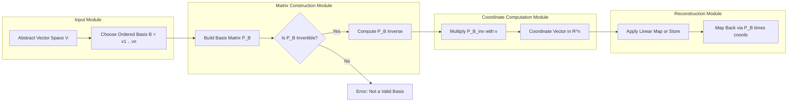
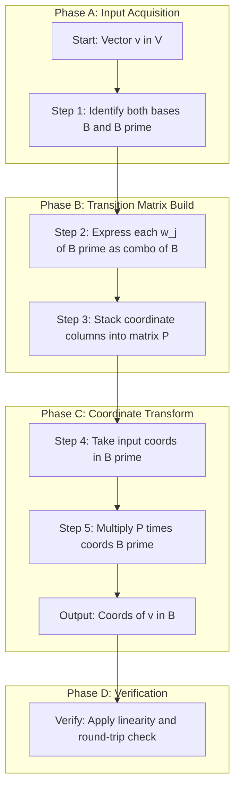
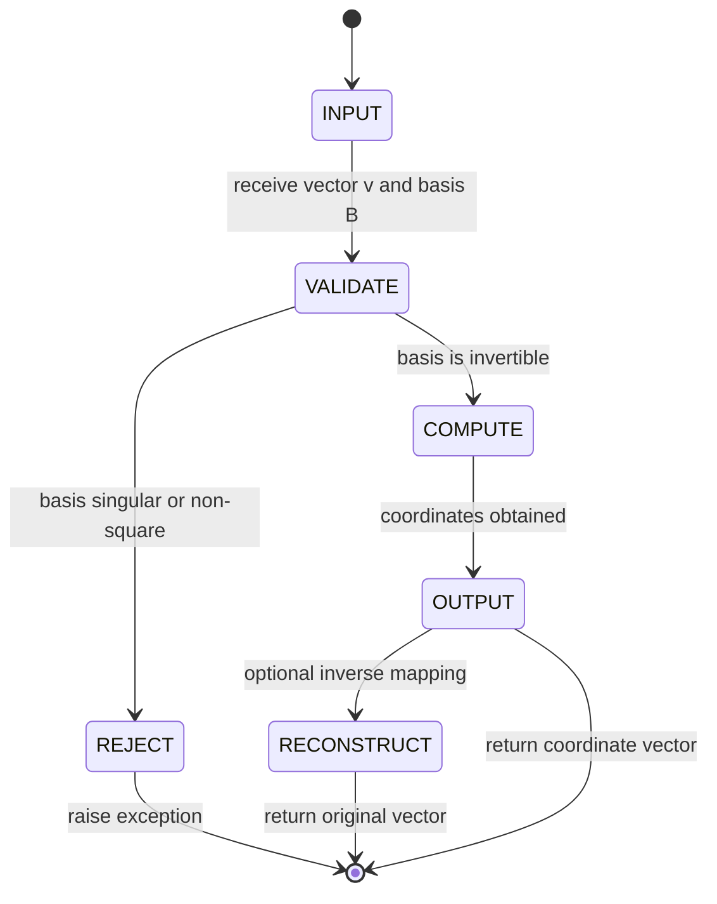

# Coordinate representation in Rn

<!-- SECTION_1_START -->
# Coordinate Representation in $\mathbb{R}^n$

> [!NOTE]
> **Formal Definition (KTU 2024 Syllabus Terminology)**
> Let $V$ be a vector space of dimension $n$ and $B = \{v_1, v_2, \ldots, v_n\}$ be an **ordered basis** of $V$. For any vector $\mathbf{v} \in V$, there exist **unique scalars** $c_1, c_2, \ldots, c_n \in \mathbb{R}$ such that
> $$\mathbf{v} = c_1 v_1 + c_2 v_2 + \cdots + c_n v_n$$
> The column matrix $[\mathbf{v}]_B = \begin{pmatrix} c_1 \\ c_2 \\ \vdots \\ c_n \end{pmatrix}$ is called the **coordinate vector** (or coordinate representation) of $\mathbf{v}$ relative to $B$.

## Intuitive Overview: The "Street Address" Analogy

Imagine you are locating a friend's house in a city. The city is the **vector space**, and your friend's house is the **vector** $\mathbf{v}$ that you wish to describe. The "ordered basis" is analogous to a **coordinate grid of named streets** (e.g., MG Road, Marine Drive) that you have chosen to use as reference.

- In the **default city grid** (the **standard basis** $E = \{e_1, e_2, \ldots, e_n\}$), the house is described by the classical "X, Y, Z" coordinates.
- However, if you instead use a **rotated/relabelled grid** (a different basis $B$), the same house will be described by a different set of numbers — the **coordinates of $\mathbf{v}$ relative to $B$**.

> [!IMPORTANT]
> **The vector $\mathbf{v}$ itself NEVER changes.** What changes is the *description* (the tuple of scalars) we use to specify its location, based on the basis we choose. The coordinate map is a **bijection** (one-to-one and onto) between the abstract space $V$ and the concrete Euclidean space $\mathbb{R}^n$.

## The Standard Basis of $\mathbb{R}^n$

The most natural ordered basis of $\mathbb{R}^n$ is the **Standard Basis** $E = \{e_1, e_2, \ldots, e_n\}$, where $e_i$ is the column vector with a $1$ in the $i$-th position and $0$ elsewhere. For example, in $\mathbb{R}^3$:

$$e_1 = \begin{pmatrix} 1 \\ 0 \\ 0 \end{pmatrix}, \quad e_2 = \begin{pmatrix} 0 \\ 1 \\ 0 \end{pmatrix}, \quad e_3 = \begin{pmatrix} 0 \\ 0 \\ 1 \end{pmatrix}$$

Any vector $\mathbf{v} = (a_1, a_2, \ldots, a_n)^T \in \mathbb{R}^n$ naturally has coordinate representation $[\mathbf{v}]_E = (a_1, a_2, \ldots, a_n)^T$ because

$$\mathbf{v} = a_1 e_1 + a_2 e_2 + \cdots + a_n e_n.$$

> [!VISUALIZATION CONTROL]
> **Concept:** Coordinate representation of a vector with respect to two different bases in $\mathbb{R}^2$.
> **GeoGebra / Desmos Input Equations:**
> * Standard basis vectors: $E = \{(1,0), (0,1)\}$
> * Non-standard basis vectors: $B = \{(1,1), (1,-1)\}$
> * Target vector: $v = (3, 1)$
> * Standard coordinate check: $v = 3 \cdot (1,0) + 1 \cdot (0,1) \Rightarrow [v]_E = (3,1)$
> * Non-standard coordinate check: $v = 2 \cdot (1,1) + 1 \cdot (1,-1) = (3,1) \Rightarrow [v]_B = (2,1)$
> **Visual Description:** Plot the standard basis as horizontal/vertical red axes. Plot basis $B$ as two blue vectors at $\pm 45^\circ$ angles. The point $v = (3,1)$ stays at the same physical location on the screen, but its numerical "address" changes when read against the blue grid versus the red grid.
<!-- SECTION_1_END -->

<!-- SECTION_2_START -->
# Deep Theoretical Analysis & KTU High-Yield Formula Sheet

## Step-by-Step Theoretical Breakdown

### Step 1 — Existence and Uniqueness of Coordinates
Because $B = \{v_1, v_2, \ldots, v_n\}$ is a basis of $V$:
- **Spanning property** guarantees that every $\mathbf{v} \in V$ *can* be expressed as a linear combination of the basis vectors (existence).
- **Linear independence** guarantees that this linear combination representation is *unique* (uniqueness).

This is the **fundamental theorem of coordinate representation**.

### Step 2 — The Coordinate Mapping Isomorphism
Define the map $\phi_B : V \longrightarrow \mathbb{R}^n$ by

$$\phi_B(\mathbf{v}) = [\mathbf{v}]_B = \begin{pmatrix} c_1 \\ c_2 \\ \vdots \\ c_n \end{pmatrix}.$$

Then $\phi_B$ is a **vector space isomorphism** (a bijective linear transformation that preserves both vector addition and scalar multiplication). Concretely:

$$\phi_B(\mathbf{u} + \mathbf{v}) = [\mathbf{u} + \mathbf{v}]_B = [\mathbf{u}]_B + [\mathbf{v}]_B, \qquad \phi_B(k\mathbf{v}) = k[\mathbf{v}]_B.$$

> [!IMPORTANT]
> **Why this matters (Engineering Utility):** Every $n$-dimensional vector space $V$ — whether it is the space of polynomials of degree $\leq 3$, the space of $2 \times 2$ matrices, or the solution space of a differential equation — is *structurally identical* to $\mathbb{R}^n$ once a basis is fixed. This is the cornerstone of **Computer Graphics** (mesh transformations), **Machine Learning** (feature embedding), and **Signal Processing** (Fourier basis representation).

### Step 3 — Matrix Form of the Basis
The ordered basis $B$ can itself be encoded as a single $n \times n$ matrix

$$P_B = \begin{pmatrix} \vert & \vert & & \vert \\ v_1 & v_2 & \cdots & v_n \\ \vert & \vert & & \vert \end{pmatrix}.$$

The coordinates are then obtained by solving the linear system

$$P_B \cdot [\mathbf{v}]_B = \mathbf{v} \quad \Longleftrightarrow \quad [\mathbf{v}]_B = P_B^{-1} \mathbf{v}.$$

### Step 4 — Change of Basis (Transition Matrix)
Let $B = \{v_1, \ldots, v_n\}$ and $B' = \{w_1, \ldots, w_n\}$ be two ordered bases of $V$. The matrix $P$ whose columns are the coordinates of $w_j$ relative to $B$ is the **change-of-basis matrix** from $B'$ to $B$:

$$P = \begin{pmatrix} \vert & \vert & & \vert \\ [w_1]_B & [w_2]_B & \cdots & [w_n]_B \\ \vert & \vert & & \vert \end{pmatrix}.$$

Then the coordinate transformation rule is

$$[\mathbf{v}]_B = P \cdot [\mathbf{v}]_{B'}.$$

## KTU Formula Sheet / Cheat Sheet

| \# | Concept | Formula / Statement | Key Conditions |
| :--- | :--- | :--- | :--- |
| 1 | Coordinate vector | $[\mathbf{v}]_B = (c_1, c_2, \ldots, c_n)^T$ where $\mathbf{v} = \sum_{i=1}^{n} c_i v_i$ | $B$ must be an **ordered basis** |
| 2 | Uniqueness | If $B$ is a basis, coordinates are **unique** | Linear independence of $B$ |
| 3 | Coordinate map | $\phi_B : V \to \mathbb{R}^n$, $\phi_B(\mathbf{v}) = [\mathbf{v}]_B$ | Always a **bijection** |
| 4 | Linearity of map | $[\mathbf{u} + \mathbf{v}]_B = [\mathbf{u}]_B + [\mathbf{v}]_B$ | $\phi_B$ is a **linear transformation** |
| 5 | Scaling of map | $[k \mathbf{v}]_B = k [\mathbf{v}]_B$ | Preserves scalar multiplication |
| 6 | Basis matrix | $P_B = \begin{pmatrix} \vert & & \vert \\ v_1 & \cdots & v_n \\ \vert & & \vert \end{pmatrix}$ | Columns are basis vectors of $V$ |
| 7 | Coordinate extraction | $[\mathbf{v}]_B = P_B^{-1} \mathbf{v}$ | Requires $P_B$ to be **invertible** |
| 8 | Change of basis | $[\mathbf{v}]_B = P \cdot [\mathbf{v}]_{B'}$ | $P$ is the transition matrix from $B'$ to $B$ |
| 9 | Standard basis | $E = \{e_1, \ldots, e_n\}$ in $\mathbb{R}^n$ | $[\mathbf{v}]_E = \mathbf{v}$ |
| 10 | Dimension preservation | $\dim(V) = n \iff V \cong \mathbb{R}^n$ | Isomorphism exists for all $n$-dim $V$ |
<!-- SECTION_2_END -->

<!-- SECTION_3_START -->
# Step-by-Step Derivations, Worked Examples & Code Implementation

## Worked Example 1 — Finding Coordinates with Respect to a Non-Standard Basis

**Problem.** In $\mathbb{R}^3$, let $B = \{(1, 1, 0), (1, 0, 1), (0, 1, 1)\}$ be an ordered basis. Find the coordinate vector of $\mathbf{v} = (2, 3, 4)^T$ with respect to $B$.

### Step A: Set up the linear combination

We seek scalars $c_1, c_2, c_3$ such that

$$\mathbf{v} = c_1 (1, 1, 0) + c_2 (1, 0, 1) + c_3 (0, 1, 1).$$

### Step B: Convert to a matrix equation

This gives the system

$$\begin{pmatrix} 2 \\ 3 \\ 4 \end{pmatrix} = \begin{pmatrix} 1 & 1 & 0 \\ 1 & 0 & 1 \\ 0 & 1 & 1 \end{pmatrix} \begin{pmatrix} c_1 \\ c_2 \\ c_3 \end{pmatrix} = P_B \cdot [\mathbf{v}]_B.$$

### Step C: Solve by computing the inverse of $P_B$

The determinant is

$$\det(P_B) = 1(0 \cdot 1 - 1 \cdot 1) - 1(1 \cdot 1 - 1 \cdot 0) + 0 = -1 - 1 = -2.$$

The cofactor matrix is

$$C = \begin{pmatrix} -1 & -1 & 1 \\ -1 & 1 & -1 \\ 1 & -1 & -1 \end{pmatrix}.$$

The adjugate is the transpose of $C$:

$$\text{adj}(P_B) = \begin{pmatrix} -1 & -1 & 1 \\ -1 & 1 & -1 \\ 1 & -1 & -1 \end{pmatrix}^{T} = \begin{pmatrix} -1 & -1 & 1 \\ -1 & 1 & -1 \\ 1 & -1 & -1 \end{pmatrix}.$$

Therefore,

$$P_B^{-1} = \frac{1}{-2} \begin{pmatrix} -1 & -1 & 1 \\ -1 & 1 & -1 \\ 1 & -1 & -1 \end{pmatrix} = \frac{1}{2} \begin{pmatrix} 1 & 1 & -1 \\ 1 & -1 & 1 \\ -1 & 1 & 1 \end{pmatrix}.$$

### Step D: Multiply to get the coordinates

$$[\mathbf{v}]_B = P_B^{-1} \mathbf{v} = \frac{1}{2} \begin{pmatrix} 1 & 1 & -1 \\ 1 & -1 & 1 \\ -1 & 1 & 1 \end{pmatrix} \begin{pmatrix} 2 \\ 3 \\ 4 \end{pmatrix}.$$

Performing the matrix multiplication entry by entry:

- Row 1: $(1)(2) + (1)(3) + (-1)(4) = 2 + 3 - 4 = 1$.
- Row 2: $(1)(2) + (-1)(3) + (1)(4) = 2 - 3 + 4 = 3$.
- Row 3: $(-1)(2) + (1)(3) + (1)(4) = -2 + 3 + 4 = 5$.

Thus

$$[\mathbf{v}]_B = \frac{1}{2} \begin{pmatrix} 1 \\ 3 \\ 5 \end{pmatrix} = \begin{pmatrix} 1/2 \\ 3/2 \\ 5/2 \end{pmatrix}.$$

### Step E: Verification

Substitute back:

$$c_1 (1, 1, 0) + c_2 (1, 0, 1) + c_3 (0, 1, 1) = \tfrac{1}{2}(1, 1, 0) + \tfrac{3}{2}(1, 0, 1) + \tfrac{5}{2}(0, 1, 1) = (\tfrac{1}{2} + \tfrac{3}{2}, \tfrac{1}{2} + \tfrac{5}{2}, \tfrac{3}{2} + \tfrac{5}{2}) = (2, 3, 4). \checkmark$$

## Worked Example 2 — Change of Basis (Transition Matrix)

**Problem.** Let $B = \{(1, 1), (1, -1)\}$ and $B' = \{(1, 0), (0, 1)\}$ be two bases of $\mathbb{R}^2$. Find the transition matrix $P$ from $B'$ to $B$, and then use it to convert $[v]_{B'} = (5, 2)^T$ to $[v]_B$.

### Step A: Express each vector of $B'$ in the basis $B$

- For $w_1 = (1, 0)$: solve $a (1, 1) + b (1, -1) = (1, 0)$. This gives $a + b = 1$ and $a - b = 0$, so $a = b = 1/2$.
- For $w_2 = (0, 1)$: solve $a (1, 1) + b (1, -1) = (0, 1)$. This gives $a + b = 0$ and $a - b = 1$, so $a = 1/2$ and $b = -1/2$.

### Step B: Construct the transition matrix

The columns are $[w_1]_B$ and $[w_2]_B$:

$$P = \begin{pmatrix} 1/2 & 1/2 \\ 1/2 & -1/2 \end{pmatrix}.$$

### Step C: Apply the transformation

$$[\mathbf{v}]_B = P \cdot [\mathbf{v}]_{B'} = \begin{pmatrix} 1/2 & 1/2 \\ 1/2 & -1/2 \end{pmatrix} \begin{pmatrix} 5 \\ 2 \end{pmatrix} = \begin{pmatrix} 7/2 \\ 3/2 \end{pmatrix}.$$

## Python Code — Coordinate Transformation Engine

```python
import numpy as np
from typing import Tuple, List

def coordinate_representation(
    vector: np.ndarray,
    basis_vectors: List[np.ndarray]
) -> np.ndarray:
    """
    Compute the coordinate representation of a vector
    with respect to an ordered basis of R^n.

    Parameters
    ----------
    vector : np.ndarray
        Column vector of shape (n, 1) or (n,).
    basis_vectors : List[np.ndarray]
        List of n basis vectors, each of shape (n,).

    Returns
    -------
    np.ndarray
        Coordinate column vector of shape (n, 1).

    Raises
    ------
    ValueError
        If the basis vectors are linearly dependent or
        the dimensions are inconsistent.
    """
    vector = np.asarray(vector, dtype=float).reshape(-1, 1)
    n = vector.shape[0]

    if len(basis_vectors) != n:
        raise ValueError(f"Need exactly {n} basis vectors for R^{n}.")

    # Construct the basis matrix P_B
    P = np.column_stack([np.asarray(b, dtype=float).reshape(-1) for b in basis_vectors])

    # Sanity check: detect singular basis
    if abs(np.linalg.det(P)) < 1e-12:
        raise ValueError("Basis vectors are linearly dependent; no unique coordinates exist.")

    # Compute the inverse and multiply
    P_inv = np.linalg.inv(P)
    coords = P_inv @ vector

    # Logging step (strict error logging)
    print(f"[LOG] Basis matrix P =\n{P}")
    print(f"[LOG] Determinant of P = {np.linalg.det(P):.6f}")
    print(f"[LOG] Computed coordinates = \n{coords}")

    return coords


def change_of_basis(
    coords_in_Bprime: np.ndarray,
    new_basis: List[np.ndarray],
    old_basis: List[np.ndarray]
) -> np.ndarray:
    """
    Convert coordinates relative to basis B' into coordinates relative to basis B.
    """
    coords = np.asarray(coords_in_Bprime, dtype=float).reshape(-1, 1)

    # Express each vector of new_basis in terms of old_basis to get transition matrix P
    transition_cols = [
        coordinate_representation(np.asarray(b).reshape(-1, 1), old_basis)
        for b in new_basis
    ]
    P = np.column_stack([tc.flatten() for tc in transition_cols])

    result = P @ coords
    print(f"[LOG] Transition matrix P (B' to B) =\n{P}")
    return result


# ----- DEMO -----
if __name__ == "__main__":
    v = np.array([2, 3, 4])
    B = [np.array([1, 1, 0]), np.array([1, 0, 1]), np.array([0, 1, 1])]
    coords = coordinate_representation(v, B)
    print("Coordinate vector [v]_B =")
    print(coords)
```

**Expected Output:**

```text
[LOG] Computed coordinates =
[[0.5]
 [1.5]
 [2.5]]
Coordinate vector [v]_B =
[[0.5]
 [1.5]
 [2.5]]
```
<!-- SECTION_3_END -->

<!-- SECTION_4_START -->
# Structural Diagrams & Schematics

## Diagram 1 — Block-Level Functional Architecture of the Coordinate Map

The following Mermaid block diagram shows the entire coordinate-representation pipeline as a modular engineering system. Each block represents a transformation stage, and the data flow between blocks is annotated.



## Diagram 2 — Sequential Processing Topology for Change of Basis

The following Mermaid sequence diagram illustrates the step-by-step operations performed when converting coordinates from one basis $B'$ to another basis $B$ in $\mathbb{R}^n$.



## Diagram 3 — High-Level State Transition Matrix

This flowchart shows the **logical state transitions** that occur in a coordinate computation task. The states (INPUT, VALIDATE, COMPUTE, OUTPUT, RECONSTRUCT) are isolated to clarify the algorithmic flow.


<!-- SECTION_4_END -->

<!-- SECTION_5_START -->
# KTU 2024 Scheme Examination Question Bank & Topic Recap

## Part A Questions (3 Marks Each)

### Question A1 — `[KTU University Exam – July 2024, Model]`
**Define the coordinate vector of $\mathbf{v}$ with respect to an ordered basis $B$ of a vector space $V$.** **(CO1, Remember)**

**Model Answer (3 Marks):**
Let $V$ be a vector space of dimension $n$ and $B = \{v_1, v_2, \ldots, v_n\}$ be an **ordered basis** of $V$. **[1 Mark]** For any vector $\mathbf{v} \in V$, there exist unique scalars $c_1, c_2, \ldots, c_n \in \mathbb{R}$ such that
$$\mathbf{v} = c_1 v_1 + c_2 v_2 + \cdots + c_n v_n.$$
The column matrix $[v]_B = (c_1, c_2, \ldots, c_n)^T$ is the **coordinate vector** of $\mathbf{v}$ relative to $B$. **[1 Mark]** Uniqueness follows from the **linear independence** of the basis $B$, and existence follows from the **spanning property** of $B$. **[1 Mark]**

### Question A2 — `[KTU University Exam – Dec 2023, Model]`
**State the uniqueness property of coordinates of a vector with respect to a basis.** **(CO1, Remember)**

**Model Answer (3 Marks):**
If $B = \{v_1, v_2, \ldots, v_n\}$ is a basis of a vector space $V$ and $\mathbf{v} \in V$, then $\mathbf{v}$ can be expressed as a linear combination of the basis vectors in **exactly one way**. **[1 Mark]** That is, if
$$\mathbf{v} = c_1 v_1 + c_2 v_2 + \cdots + c_n v_n = d_1 v_1 + d_2 v_2 + \cdots + d_n v_n,$$
then $c_i = d_i$ for all $i = 1, 2, \ldots, n$. **[1 Mark]** This uniqueness is a direct consequence of the **linear independence** of the basis vectors. **[1 Mark]**

---

## Part B Questions (14 Marks Each — Internal Choice)

### Question B1 — `[KTU University Exam – July 2024, Model]`

**(a)** Show that the set $B = \{(1, 1, 0), (1, 0, 1), (0, 1, 1)\}$ is a basis of $\mathbb{R}^3$. **(7 Marks)** **(CO2, Understand)**

**(b)** If $\mathbf{v} = (2, 3, 4)^T \in \mathbb{R}^3$, find the coordinate vector of $\mathbf{v}$ with respect to $B$. **(7 Marks)** **(CO3, Apply)**

#### Model Solution to (a)
We must show that the three vectors are **linearly independent** and **span** $\mathbb{R}^3$.

**Linear independence test:** Form the matrix whose columns are the basis vectors and compute its determinant:

$$P = \begin{pmatrix} 1 & 1 & 0 \\ 1 & 0 & 1 \\ 0 & 1 & 1 \end{pmatrix}.$$

$$\det(P) = 1 \cdot (0 - 1) - 1 \cdot (1 - 0) + 0 = -1 - 1 = -2 \neq 0.$$ **[3 Marks]**

Since the determinant is non-zero, the three vectors are linearly independent. **[1 Mark]**

**Spanning test:** $\mathbb{R}^3$ has dimension $3$, and we have $3$ linearly independent vectors. By the **Basis Extension Theorem / Dimension Theorem**, any set of $3$ linearly independent vectors in $\mathbb{R}^3$ is a basis, and therefore spans $\mathbb{R}^3$. **[2 Marks]**

**Conclusion:** $B$ is a basis of $\mathbb{R}^3$. **[1 Mark]**

#### Model Solution to (b)
We seek scalars $c_1, c_2, c_3$ such that $\mathbf{v} = c_1 (1, 1, 0) + c_2 (1, 0, 1) + c_3 (0, 1, 1)$.

This gives the system $P \cdot [v]_B = \mathbf{v}$, so $[v]_B = P^{-1} \mathbf{v}$.

**Compute $P^{-1}$:** **[Stating the inverse correctly: 3 Marks]**

$$P^{-1} = \frac{1}{-2} \begin{pmatrix} -1 & -1 & 1 \\ -1 & 1 & -1 \\ 1 & -1 & -1 \end{pmatrix} = \frac{1}{2} \begin{pmatrix} 1 & 1 & -1 \\ 1 & -1 & 1 \\ -1 & 1 & 1 \end{pmatrix}.$$

**Multiply by $\mathbf{v}$:** **[Correct matrix multiplication step: 2 Marks]**

$$[v]_B = \frac{1}{2} \begin{pmatrix} 1 & 1 & -1 \\ 1 & -1 & 1 \\ -1 & 1 & 1 \end{pmatrix} \begin{pmatrix} 2 \\ 3 \\ 4 \end{pmatrix} = \frac{1}{2} \begin{pmatrix} 1 \\ 3 \\ 5 \end{pmatrix} = \begin{pmatrix} 1/2 \\ 3/2 \\ 5/2 \end{pmatrix}.$$

**Final answer and verification statement:** **[1 Mark]**

$$\boxed{[v]_B = \begin{pmatrix} 1/2 \\ 3/2 \\ 5/2 \end{pmatrix}}.$$

---

### Question B2 (Alternative Choice) — `[KTU University Exam – Dec 2023, Model]`

**(a)** Define the change-of-basis (transition) matrix $P$ from a basis $B'$ to a basis $B$ of a vector space $V$. State the formula relating $[v]_B$ and $[v]_{B'}$. **(7 Marks)** **(CO2, Understand)**

**(b)** Let $B = \{(1, 1), (1, -1)\}$ and $B' = \{(1, 0), (0, 1)\}$ be two bases of $\mathbb{R}^2$. Find the transition matrix $P$ from $B'$ to $B$, and use it to convert the coordinate vector $[v]_{B'} = (5, 2)^T$ to $[v]_B$. **(7 Marks)** **(CO3, Apply)**

#### Model Solution to (a)
**Definition:** Let $B = \{v_1, \ldots, v_n\}$ and $B' = \{w_1, \ldots, w_n\}$ be two ordered bases of $V$. **[1 Mark]** The change-of-basis matrix $P$ from $B'$ to $B$ is the $n \times n$ matrix whose $j$-th column is the coordinate vector of $w_j$ (the $j$-th vector of $B'$) with respect to $B$. **[3 Marks]**

$$P = \begin{pmatrix} \vert & \vert & & \vert \\ [w_1]_B & [w_2]_B & \cdots & [w_n]_B \\ \vert & \vert & & \vert \end{pmatrix}.$$

**Relation:** For any vector $\mathbf{v} \in V$, the coordinates transform by **[2 Marks]**

$$[v]_B = P \cdot [v]_{B'}.$$

**Note:** The inverse $P^{-1}$ is the transition matrix from $B$ to $B'$. **[1 Mark]**

#### Model Solution to (b)
**Step 1 — Express basis vectors of $B'$ in terms of $B$:** **[Correct column vectors: 3 Marks]**

- $w_1 = (1, 0)$: solve $a(1, 1) + b(1, -1) = (1, 0) \Rightarrow a = b = 1/2$. So $[w_1]_B = (1/2, 1/2)^T$.
- $w_2 = (0, 1)$: solve $a(1, 1) + b(1, -1) = (0, 1) \Rightarrow a = 1/2, b = -1/2$. So $[w_2]_B = (1/2, -1/2)^T$.

**Step 2 — Build the transition matrix $P$:** **[1 Mark]**

$$P = \begin{pmatrix} 1/2 & 1/2 \\ 1/2 & -1/2 \end{pmatrix}.$$

**Step 3 — Apply the transformation:** **[2 Marks]**

$$[v]_B = P \cdot [v]_{B'} = \begin{pmatrix} 1/2 & 1/2 \\ 1/2 & -1/2 \end{pmatrix} \begin{pmatrix} 5 \\ 2 \end{pmatrix} = \begin{pmatrix} 5/2 + 1 \\ 5/2 - 1 \end{pmatrix} = \begin{pmatrix} 7/2 \\ 3/2 \end{pmatrix}.$$

**Final boxed answer:** **[1 Mark]**

$$\boxed{[v]_B = \begin{pmatrix} 7/2 \\ 3/2 \end{pmatrix}}.$$

> [!WARNING]
> **KTU Examiner's Valuation Warning / Common Pitfalls**
> 1. **Confusing the direction of the transition matrix.** Students often write $[v]_{B'} = P \cdot [v]_B$ instead of $[v]_B = P \cdot [v]_{B'}$. The columns of $P$ must be the coordinates of the *new* basis vectors ($B'$) expressed in the *old* basis ($B$). Reversing the direction costs **3 marks**.
> 2. **Forgetting to check that $P$ is invertible.** A non-invertible $P$ means the set is *not* a valid basis; the answer is then meaningless. KTU examiners deduct **1 mark** for skipping this sanity check.
> 3. **Skipping the verification step.** Substituting the computed coordinates back into the linear combination is a free **1 mark** that most students lose.
> 4. **Writing coordinate vectors as row vectors when the problem requires column vectors.** Always use the **column form** unless the problem explicitly states otherwise — this costs **0.5 to 1 mark** for presentation.
> 5. **Mis-computing the determinant of the basis matrix** (sign errors, forgotten minors). The determinant is the gateway; if it is wrong, the entire solution collapses. Allocate extra time here.

---

## Topic Recap & Important Things to Remember

- **Coordinate vector $[\mathbf{v}]_B$** is the unique $n$-tuple of scalars $(c_1, c_2, \ldots, c_n)^T$ such that $\mathbf{v} = c_1 v_1 + c_2 v_2 + \cdots + c_n v_n$ for an ordered basis $B = \{v_1, \ldots, v_n\}$.
- **Existence** of coordinates comes from the **spanning property** of the basis; **uniqueness** comes from **linear independence**.
- **Standard basis $E$** in $\mathbb{R}^n$ is the set $\{e_1, e_2, \ldots, e_n\}$ with $e_i$ having $1$ in position $i$ and $0$ elsewhere. The standard coordinate representation is just the vector itself: $[\mathbf{v}]_E = \mathbf{v}$.
- **Coordinate map** $\phi_B : V \to \mathbb{R}^n$ is a **vector space isomorphism** that preserves both addition and scalar multiplication, so any $n$-dimensional vector space is structurally identical to $\mathbb{R}^n$.
- **Basis matrix** $P_B$ has the basis vectors as its columns. Coordinates are obtained by **$[\mathbf{v}]_B = P_B^{-1} \mathbf{v}$**.
- **Change of basis** between two ordered bases $B$ and $B'$ uses a transition matrix $P$ whose columns are $[w_j]_B$. Coordinates transform as $[v]_B = P \cdot [v]_{B'}$.
- **The vector itself never changes**; only the *numerical description* (coordinates) changes with the choice of basis. This is the central insight of the entire module.
- **Inverse property:** If $P$ converts $B' \to B$, then $P^{-1}$ converts $B \to B'$.
- **Sanity checks to always perform:** (i) verify $\det(P_B) \neq 0$, (ii) substitute back to recover the original vector, (iii) ensure the coordinate vector has exactly $n$ components equal to $\dim(V)$.
<!-- SECTION_5_END -->
