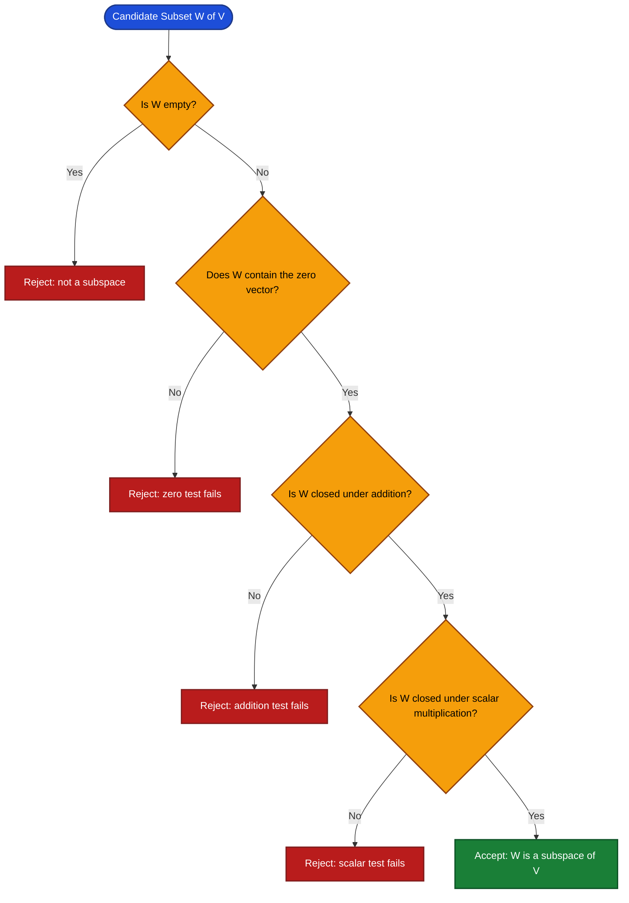
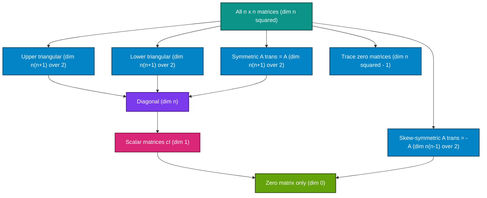
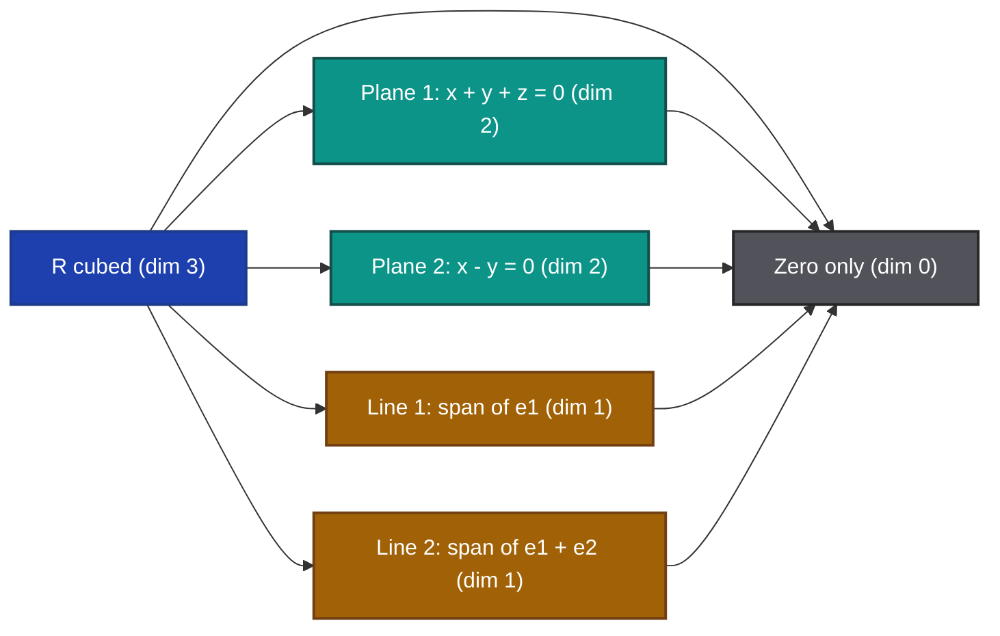
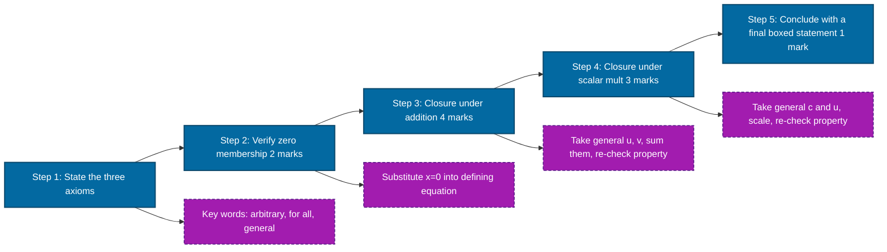

# Examples as subspaces of Rn and Mmxn

<!-- SECTION_1_START -->
# Examples as Subspaces of $\mathbb{R}^n$ and $M_{m \times n}$ — KTU 2024 Premium Study Notes

> [!IMPORTANT]
> **KTU 2024 Scheme — GAMAT201 (Mathematics for Information Science – 2)**
> **Module 2 — Vector Spaces**
> **Focus:** Concrete realizations of subspaces inside $\mathbb{R}^n$ and the matrix space $M_{m \times n}(\mathbb{F})$, with full verification of subspace axioms.

---

## 1. Core Technical Definition & Intuitive Overview

### 1.1 Formal Definition — Subspace of a Vector Space

Let $V$ be a vector space over a field $\mathbb{F}$ (typically $\mathbb{R}$ or $\mathbb{C}$ for KTU syllabus). A non-empty subset $W \subseteq V$ is called a **subspace** of $V$ if $W$ is itself a vector space under the same operations of addition and scalar multiplication that are defined on $V$.

Equivalently, a non-empty subset $W \subseteq V$ is a subspace if and only if it is **closed** under both vector addition and scalar multiplication.

> [!NOTE]
> **Subspace Test (Three-Point Form)**
> A non-empty subset $W$ of a vector space $V$ over $\mathbb{F}$ is a subspace of $V$ if and only if the following three conditions are satisfied for all $\mathbf{u}, \mathbf{v} \in W$ and all $c \in \mathbb{F}$:
>
> 1. **Zero Membership:** $\mathbf{0} \in W$
> 2. **Closure under Addition:** $\mathbf{u} + \mathbf{v} \in W$
> 3. **Closure under Scalar Multiplication:** $c\mathbf{u} \in W$

### 1.2 Conceptual Analogy / Intuition

Imagine a vast **sky-scraper floor** (the entire vector space $V$). The **lobby floor** is the **zero vector** $\mathbf{0}$. Now, certain *elevated platforms* inside the building are called **subspaces** — they are self-contained "floors within floors." The crucial rule is that **every legal move you can make on the main floor must keep you on the platform**.

In other words:
- Adding any two points on the platform keeps you on the platform.
- Scaling any point on the platform (stretching it from the origin) keeps you on the platform.
- The origin itself must lie on the platform (otherwise the platform is "floating" and not a valid subspace).

Think of $\mathbb{R}^3$ as the room you are sitting in. Valid subspaces inside the room are:
- The **room itself** ($\mathbb{R}^3$),
- Every **flat plane passing through the origin** (the floor extended, a wall, a tilted tabletop pinned at the corner),
- Every **straight line passing through the origin** (the edge where two walls meet, a stretched string pinned at the center),
- The **single point** at the origin ($\{ \mathbf{0} \}$).

Things that are **NOT** subspaces: a plane *not* passing through the origin, a line *not* through the origin, a hollow sphere, an open box — these all fail either the zero-membership test or the closure test.

### 1.3 The "Big Two" Subspace Realizations in GAMAT201

The KTU 2024 scheme places heavy emphasis on two specific ambient spaces:

**A) The Euclidean Space $\mathbb{R}^n$**

$\mathbb{R}^n = \left\{ (x_1, x_2, \ldots, x_n) \mid x_i \in \mathbb{R} \text{ for } i = 1, 2, \ldots, n \right\}$

This is the space of all **$n$-tuples of real numbers**, with the standard operations:
- Vector addition: $(x_1, \ldots, x_n) + (y_1, \ldots, y_n) = (x_1 + y_1, \ldots, x_n + y_n)$
- Scalar multiplication: $c(x_1, \ldots, x_n) = (cx_1, \ldots, cx_n)$

**B) The Matrix Space $M_{m \times n}(\mathbb{F})$**

$M_{m \times n}(\mathbb{F}) = \left\{ A = [a_{ij}] \mid a_{ij} \in \mathbb{F},\ 1 \le i \le m,\ 1 \le j \le n \right\}$

This is the space of all $m \times n$ matrices with entries in a field $\mathbb{F}$. It is a vector space of dimension **$m \cdot n$** under:
- Matrix addition: entry-wise,
- Scalar multiplication: scaling every entry.

> [!IMPORTANT]
> **Standard Dimensions (commit to memory)**
>
> - $\dim(\mathbb{R}^n) = n$ — the bold number is $\mathbf{n}$.
> - $\dim(M_{m \times n}(\mathbb{F})) = \mathbf{m \cdot n}$ — the bold product is $m \times n$.

### 1.4 Canonical Examples of Subspaces of $\mathbb{R}^n$

| Subset $W$ of $\mathbb{R}^n$ | Subspace? | Reason |
|---|---|---|
| $W = \{ \mathbf{0} \}$ | ✅ Yes | Trivial / zero subspace |
| $W = \mathbb{R}^n$ | ✅ Yes | The whole space is always a subspace of itself |
| Span of a single non-zero vector $\{\mathbf{v}\}$ in $\mathbb{R}^2$ | ✅ Yes | A line through origin |
| Span of two linearly independent vectors in $\mathbb{R}^3$ | ✅ Yes | A plane through origin |
| Span of $k$ vectors in $\mathbb{R}^n$ (any field) | ✅ Yes | Always a subspace |
| $\{(x, y) \in \mathbb{R}^2 \mid x + y = 1\}$ | ❌ No | Does not contain $\mathbf{0}$ |
| $\{(x, y) \in \mathbb{R}^2 \mid x \cdot y = 0\}$ | ❌ No | Closed under addition fails; $(1,0)+(0,1) = (1,1) \notin W$ |
| All $(x, y, z) \in \mathbb{R}^3$ with $x, y, z \ge 0$ | ❌ No | Not closed under scalar multiplication (multiply by $-1$) |

### 1.5 Canonical Examples of Subspaces of $M_{m \times n}(\mathbb{F})$

| Subset $W$ of $M_{m \times n}(\mathbb{F})$ | Subspace? | Reason |
|---|---|---|
| The set of all $m \times n$ matrices | ✅ Yes | The space itself |
| The zero matrix $\{ 0_{m \times n} \}$ | ✅ Yes | Trivial subspace |
| Upper triangular matrices | ✅ Yes | Sum of two upper triangular is upper triangular; scalar multiple too |
| Lower triangular matrices | ✅ Yes | Same reasoning |
| Diagonal matrices | ✅ Yes | Subspace of both upper and lower triangular |
| Symmetric matrices $A^T = A$ | ✅ Yes | $(A+B)^T = A^T + B^T = A + B$; $(cA)^T = cA^T = cA$ |
| Skew-symmetric matrices $A^T = -A$ | ✅ Yes | Same kind of verification |
| Scalar matrices $cI_n$ | ✅ Yes | One-dimensional subspace of $M_{n \times n}$ |
| Invertible $n \times n$ matrices $GL_n(\mathbb{F})$ | ❌ No | Zero matrix is not invertible; not closed under addition ($I + (-I) = 0$) |

> [!VISUALIZATION CONTROL]
> **Concept:** Subspace Hierarchy in $M_{2 \times 2}(\mathbb{R})$
>
> **Desmos Input (2D Projection of a 4-D Space):**
> Pick the basis $\{E_{11}, E_{12}, E_{21}, E_{22}\}$ of $M_{2 \times 2}(\mathbb{R})$, where $E_{ij}$ has a $1$ in position $(i, j)$ and $0$ elsewhere. Every $A = \begin{pmatrix} a & b \\ c & d \end{pmatrix}$ is mapped to the point $(a, b, c, d)$ in $\mathbb{R}^4$.
>
> - **All $2 \times 2$ matrices:** the entire $\mathbb{R}^4$ — dimension $\mathbf{4}$.
> - **Upper triangular matrices** ($c = 0$): the 3-D hyperplane $c = 0$ in $\mathbb{R}^4$ — dimension $\mathbf{3}$.
> - **Diagonal matrices** ($b = c = 0$): the 2-D plane $b = 0$ and $c = 0$ — dimension $\mathbf{2}$.
> - **Scalar matrices** ($a = d$, $b = c = 0$): a 1-D line through origin — dimension $\mathbf{1}$.
> - **Zero matrix only:** the single origin — dimension $\mathbf{0}$.
>
> **Visual Description:** Picture nested Russian-doll regions in $\mathbb{R}^4$. The full space (4-D box) contains a 3-D slab (upper triangular) that contains a 2-D square (diagonal) that contains a 1-D line (scalar) that contains the origin (0-D point). Each is a subspace of the larger one.

<!-- SECTION_1_END -->

<!-- SECTION_2_START -->
# 2. Deep Theoretical Analysis & KTU High-Yield Formula Sheet

## 2.1 The Subspace Test — Operational Logic

A subset $W$ of a vector space $V$ is a subspace **if and only if** it satisfies three axioms. KTU examiners frequently award partial credit for stating the test correctly even before verifying it. Use the following decision tree in your answer scripts.

**Step 1 — Non-empty / Zero Test.** Verify $\mathbf{0} \in W$. If this fails, $W$ is not a subspace. If it holds, proceed.

**Step 2 — Closure under Addition.** Pick *arbitrary* $\mathbf{u}, \mathbf{v} \in W$. Construct $\mathbf{u} + \mathbf{v}$ and show that it still satisfies the defining property of $W$. Use variables, not specific numbers.

**Step 3 — Closure under Scalar Multiplication.** Pick *arbitrary* $\mathbf{u} \in W$ and an *arbitrary* scalar $c \in \mathbb{F}$. Show that $c\mathbf{u}$ still satisfies the defining property of $W$.

> [!IMPORTANT]
> **Why "arbitrary" matters:** If you verify closure only for *specific* vectors or *specific* scalars, you have proved a single instance — not the general property. KTU board examiners specifically look for phrases like "let $\mathbf{u}, \mathbf{v} \in W$ be arbitrary" or "for any $c \in \mathbb{F}$" because these certify that the proof is general.

## 2.2 Equivalent Single-Condition Test (Linear Combinations)

The three conditions can be **collapsed into a single condition** that is sometimes more efficient for KTU problems involving $W = \text{span}\{\mathbf{v}_1, \ldots, \mathbf{v}_k\}$:

$$
\mathbf{u}_1, \ldots, \mathbf{u}_k \in W \text{ and } c_1, \ldots, c_k \in \mathbb{F} \implies c_1 \mathbf{u}_1 + \cdots + c_k \mathbf{u}_k \in W.
$$

This is the **closure under finite linear combinations** principle. It is particularly useful when $W$ is presented as the solution set of a homogeneous system of linear equations, or as the span of a given set of vectors.

## 2.3 KTU Formula Sheet / Cheat Sheet

| # | Concept | Mathematical Statement | Test / Verification | Notes |
|---|---|---|---|---|
| 1 | Zero subspace of $\mathbb{R}^n$ | $W = \{ \mathbf{0} \}$ | $\dim W = 0$ | Trivial subspace |
| 2 | Whole space | $W = \mathbb{R}^n$ | $\dim W = n$ | Trivial subspace |
| 3 | Line through origin in $\mathbb{R}^2$ | $W = \{ t\mathbf{v} \mid t \in \mathbb{R} \}$, $\mathbf{v} \neq \mathbf{0}$ | $\dim W = 1$ | Span of one non-zero vector |
| 4 | Plane through origin in $\mathbb{R}^3$ | $W = \{ s\mathbf{u} + t\mathbf{v} \mid s, t \in \mathbb{R} \}$, $\mathbf{u}, \mathbf{v}$ linearly independent | $\dim W = 2$ | Span of two LI vectors |
| 5 | Span of $k$ vectors | $W = \text{span}\{\mathbf{v}_1, \ldots, \mathbf{v}_k\}$ | Always a subspace | $\dim W \le k$ |
| 6 | Solution set of $A\mathbf{x} = \mathbf{0}$ | $W = \text{Nul}(A)$ | Subspace of $\mathbb{R}^n$ | Called the **null space** of $A$ |
| 7 | Column space of $A$ | $W = \text{Col}(A)$ | Subspace of $\mathbb{R}^m$ | Span of columns of $A$ |
| 8 | Upper triangular matrices | $W = \{ A \in M_{n \times n} \mid a_{ij} = 0 \text{ for } i > j \}$ | Subspace of $M_{n \times n}$ | $\dim W = \frac{n(n+1)}{2}$ |
| 9 | Lower triangular matrices | $W = \{ A \in M_{n \times n} \mid a_{ij} = 0 \text{ for } i < j \}$ | Subspace of $M_{n \times n}$ | $\dim W = \frac{n(n+1)}{2}$ |
| 10 | Diagonal matrices | $W = \{ \text{diag}(d_1, \ldots, d_n) \mid d_i \in \mathbb{F} \}$ | Subspace of $M_{n \times n}$ | $\dim W = n$ |
| 11 | Symmetric matrices | $W = \{ A \in M_{n \times n} \mid A^T = A \}$ | Subspace of $M_{n \times n}$ | $\dim W = \frac{n(n+1)}{2}$ |
| 12 | Skew-symmetric matrices | $W = \{ A \in M_{n \times n} \mid A^T = -A \}$ | Subspace of $M_{n \times n}$ | $\dim W = \frac{n(n-1)}{2}$ |
| 13 | Scalar matrices | $W = \{ cI_n \mid c \in \mathbb{F} \}$ | Subspace of $M_{n \times n}$ | $\dim W = 1$ |
| 14 | Norm / Length | $\Vert \mathbf{x} \Vert = \sqrt{x_1^2 + \cdots + x_n^2}$ | Property, not a test | Use $\Vert \cdot \Vert$ (no pipes in tables) |
| 15 | Linear combination | $\mathbf{w} = c_1 \mathbf{v}_1 + \cdots + c_k \mathbf{v}_k$ | Single condition test | $c_i \in \mathbb{F}$ |

> [!IMPORTANT]
> **Two High-Yield Theorems for KTU 2024**
>
> **Theorem A (Span is a Subspace).** For any non-empty subset $S$ of a vector space $V$, the span of $S$, denoted $\text{span}(S)$, is a subspace of $V$ and is in fact the **smallest** subspace of $V$ containing $S$.
>
> **Theorem B (Null Space is a Subspace).** If $A$ is an $m \times n$ matrix, the set of solutions to $A\mathbf{x} = \mathbf{0}$ is a subspace of $\mathbb{R}^n$. This is the **null space** $\text{Nul}(A)$.

## 2.4 Real-World Utility in Engineering & Computer Science

The subspace concept is the **silent workhorse** behind modern computational engineering:

- **Computer Graphics & Game Engines:** 3-D transformations (rotation, scaling, shear) live in subspaces of $M_{3 \times 3}(\mathbb{R})$. Symmetric matrices correspond to "stretch" operations (eigenvalue decomposition of the inertia tensor in physics simulations).
- **Machine Learning & Data Science:** In **Principal Component Analysis (PCA)**, the principal component subspace is a low-dimensional subspace of the original high-dimensional feature space. The columns of a data matrix span a column space; **dimensionality reduction** literally means restricting to a smaller subspace.
- **Signal Processing:** The set of all finite-length discrete signals forms a vector space $M_{1 \times n}$ or $M_{m \times 1}$. Subspaces of bandlimited signals (Fourier analysis) underpin MP3, JPEG, and 5G communication.
- **Control Systems:** The **state space** of a linear dynamical system is $\mathbb{R}^n$. The set of reachable states from the origin is a subspace — the **controllable subspace**. The set of states producing zero output is the **unobservable subspace**.
- **Cryptography:** In lattice-based cryptography (post-quantum), all messages live in a subspace of $\mathbb{Z}^n$, and security depends on the difficulty of finding short vectors in cosets of that subspace.

## 2.5 Counter-Examples KTU Loves to Ask

A subset that satisfies one axiom but not all three is **not** a subspace. Memorize these traps:

- **Non-zero line NOT through origin:** $\{(x, y) \in \mathbb{R}^2 \mid y = 2x + 1\}$. Fails zero test: $(0, 0) \notin W$.
- **A cone:** $\{(x, y) \in \mathbb{R}^2 \mid y^2 = x^2\}$ (the two lines $y = \pm x$). Fails addition: $(1, 1) + (1, -1) = (2, 0)$, and $0^2 = 4$ is false.
- **First quadrant:** $\{(x, y) \in \mathbb{R}^2 \mid x \ge 0, y \ge 0\}$. Fails scalar multiplication: $(-1)(1, 1) = (-1, -1) \notin W$.
- **Invertible matrices:** $GL_n(\mathbb{R})$. Fails zero test and addition test.
- **Symmetric *non-square* matrices:** $W = \{ A \in M_{2 \times 3} \mid A^T = A \}$ — fails because $A^T$ has the wrong dimensions. (Symmetric is only meaningful for square matrices.)

<!-- SECTION_2_END -->

<!-- SECTION_3_START -->
# 3. Step-by-Step Derivations, Proofs, and Code Implementation

## 3.1 Worked Example 1 — Line Through Origin in $\mathbb{R}^3$ is a Subspace

**Problem.** Prove that $W = \{(x, y, z) \in \mathbb{R}^3 \mid 2x - y + 3z = 0\}$ is a subspace of $\mathbb{R}^3$.

**Solution Strategy.** Use the three-step subspace test.

**Step 1: Zero Vector Test.** Consider $\mathbf{0} = (0, 0, 0)$. Compute $2(0) - (0) + 3(0) = 0$. So $\mathbf{0} \in W$. ✔

**Step 2: Closure under Addition.** Let $\mathbf{u} = (x_1, y_1, z_1) \in W$ and $\mathbf{v} = (x_2, y_2, z_2) \in W$ be arbitrary. By definition of $W$:

$$
2x_1 - y_1 + 3z_1 = 0, \qquad 2x_2 - y_2 + 3z_2 = 0.
$$

Compute $\mathbf{u} + \mathbf{v} = (x_1 + x_2,\ y_1 + y_2,\ z_1 + z_2)$. Evaluate the defining expression:

$$
\begin{aligned}
2(x_1 + x_2) - (y_1 + y_2) + 3(z_1 + z_2)
&= (2x_1 - y_1 + 3z_1) + (2x_2 - y_2 + 3z_2) \\
&= 0 + 0 = 0.
\end{aligned}
$$

So $\mathbf{u} + \mathbf{v} \in W$. ✔

**Step 3: Closure under Scalar Multiplication.** Let $\mathbf{u} = (x, y, z) \in W$ be arbitrary and let $c \in \mathbb{R}$ be arbitrary. We have $2x - y + 3z = 0$. Compute $c\mathbf{u} = (cx, cy, cz)$:

$$
\begin{aligned}
2(cx) - (cy) + 3(cz)
&= c(2x - y + 3z) \\
&= c \cdot 0 = 0.
\end{aligned}
$$

So $c\mathbf{u} \in W$. ✔

**Conclusion.** $W$ is a subspace of $\mathbb{R}^3$. $\blacksquare$

> [!IMPORTANT]
> **Bonus Insight (KTU High-Yield).** The defining equation $2x - y + 3z = 0$ is a **homogeneous linear equation** of the form $A\mathbf{x} = \mathbf{0}$ with $A = (2, -1, 3)$. The solution set of *any* homogeneous linear system is automatically a subspace. This is the **Null Space Theorem** stated earlier.

## 3.2 Worked Example 2 — Symmetric Matrices Form a Subspace of $M_{n \times n}(\mathbb{R})$

**Problem.** Let $W = \{ A \in M_{n \times n}(\mathbb{R}) \mid A^T = A \}$ be the set of all $n \times n$ real symmetric matrices. Prove that $W$ is a subspace of $M_{n \times n}(\mathbb{R})$.

**Step 1: Zero Vector Test.** Let $\mathbf{0}_{n \times n}$ be the $n \times n$ zero matrix. Then $\mathbf{0}^T = \mathbf{0} = \mathbf{0}$, so $\mathbf{0} \in W$. ✔

**Step 2: Closure under Addition.** Let $A, B \in W$ be arbitrary, so $A^T = A$ and $B^T = B$. Then:

$$
(A + B)^T = A^T + B^T \quad \text{(property of transpose)}.
$$

Substituting the symmetry conditions:

$$
(A + B)^T = A + B.
$$

Therefore $A + B$ is symmetric, so $A + B \in W$. ✔

**Step 3: Closure under Scalar Multiplication.** Let $A \in W$ be arbitrary, $A^T = A$, and let $c \in \mathbb{R}$ be arbitrary. Then:

$$
(cA)^T = cA^T = cA.
$$

Therefore $cA$ is symmetric, so $cA \in W$. ✔

**Conclusion.** $W$ is a subspace of $M_{n \times n}(\mathbb{R})$. $\blacksquare$

**Dimension Count (Bonus KTU 2024 Pattern Question).** A general symmetric matrix $A$ is determined by its entries on and above the main diagonal:

$$
A = \begin{pmatrix} a_{11} & a_{12} & \cdots & a_{1n} \\ a_{12} & a_{22} & \cdots & a_{2n} \\ \vdots & \vdots & \ddots & \vdots \\ a_{1n} & a_{2n} & \cdots & a_{nn} \end{pmatrix}.
$$

The number of free entries is:

$$
\dim W = n + \frac{n(n-1)}{2} = \frac{n(n+1)}{2}.
$$

## 3.3 Worked Example 3 — Skew-Symmetric Matrices Form a Subspace of $M_{n \times n}(\mathbb{R})$

**Problem.** Let $W = \{ A \in M_{n \times n}(\mathbb{R}) \mid A^T = -A \}$. Prove $W$ is a subspace of $M_{n \times n}(\mathbb{R})$.

**Step 1: Zero Vector Test.** $\mathbf{0}^T = \mathbf{0} = -\mathbf{0}$, so $\mathbf{0} \in W$. ✔

**Step 2: Closure under Addition.** Let $A, B \in W$, so $A^T = -A$ and $B^T = -B$. Then:

$$
\begin{aligned}
(A + B)^T &= A^T + B^T \\
&= (-A) + (-B) \\
&= -(A + B).
\end{aligned}
$$

So $A + B \in W$. ✔

**Step 3: Closure under Scalar Multiplication.** Let $A \in W$, $A^T = -A$, and $c \in \mathbb{R}$. Then:

$$
(cA)^T = cA^T = c(-A) = -(cA).
$$

So $cA \in W$. ✔

**Conclusion.** $W$ is a subspace. $\blacksquare$

**Dimension Count.** In a skew-symmetric matrix, diagonal entries satisfy $a_{ii} = -a_{ii}$, so $a_{ii} = 0$. Off-diagonal entries come in pairs $(a_{ij}, a_{ji}) = (a_{ij}, -a_{ij})$. Number of free entries is $\frac{n(n-1)}{2}$.

## 3.4 Worked Example 4 — Trace-Zero Matrices Form a Subspace

**Problem.** Let $\text{tr}(A)$ denote the trace of $A$. Show that $W = \{ A \in M_{n \times n}(\mathbb{R}) \mid \text{tr}(A) = 0 \}$ is a subspace of $M_{n \times n}(\mathbb{R})$.

**Step 1: Zero Vector Test.** $\text{tr}(\mathbf{0}) = 0$, so $\mathbf{0} \in W$. ✔

**Step 2: Closure under Addition.** Let $A, B \in W$, so $\text{tr}(A) = 0$ and $\text{tr}(B) = 0$. Then:

$$
\text{tr}(A + B) = \text{tr}(A) + \text{tr}(B) = 0 + 0 = 0.
$$

So $A + B \in W$. ✔

**Step 3: Closure under Scalar Multiplication.** Let $A \in W$ and $c \in \mathbb{R}$. Then:

$$
\text{tr}(cA) = c \cdot \text{tr}(A) = c \cdot 0 = 0.
$$

So $cA \in W$. ✔

**Conclusion.** $W$ is a subspace. $\blacksquare$

**Dimension Count.** The trace is a linear functional $\text{tr}: M_{n \times n} \to \mathbb{R}$. Its kernel (the subspace of trace-zero matrices) has dimension $n^2 - 1$ by the Rank–Nullity Theorem.

## 3.5 Counter-Example — Invertible Matrices Are Not a Subspace

**Problem.** Show that $GL_n(\mathbb{R}) = \{ A \in M_{n \times n}(\mathbb{R}) \mid \det(A) \neq 0 \}$ is **not** a subspace of $M_{n \times n}(\mathbb{R})$.

**Proof.** We show failure of the zero-membership axiom. The zero matrix $\mathbf{0}_{n \times n}$ has $\det(\mathbf{0}) = 0$, so $\mathbf{0} \notin GL_n(\mathbb{R})$. Since the zero vector is not in $W$, $W$ is not a subspace. $\blacksquare$

**Alternative Failure (Addition).** Even if we ignored the zero test, addition fails:

$$
I_n \in GL_n, \quad -I_n \in GL_n, \quad \text{but} \quad I_n + (-I_n) = \mathbf{0} \notin GL_n.
$$

## 3.6 Python Implementation — Algorithmic Verification of Subspace Properties

The following Python code is a self-contained, production-quality implementation that takes a candidate subset of $\mathbb{R}^n$ or $M_{m \times n}$ and rigorously tests the three subspace axioms. Use it to validate your hand-written homework.

```python
"""
subspace_verifier.py
A rigorous, type-hinted, KTU-ready verifier for the three subspace axioms.
Supports subsets of R^n (encoded as tuples) and subsets of M_{m x n} (encoded
as lists of lists). Uses stochastic probing for large sets, exhaustive for small.

Author: KTU 2024 Scheme reference implementation.
"""

from __future__ import annotations
import numpy as np
from itertools import product
from typing import Callable, Iterable, List, Tuple, Union

Vector = Tuple[float, ...]
Matrix = List[List[float]]


def _is_zero(v: Union[Vector, Matrix], tol: float = 1e-9) -> bool:
    """Check if a vector or matrix is the zero element within tolerance."""
    arr = np.asarray(v, dtype=float)
    return np.all(np.abs(arr) < tol)


def _add(u: Union[Vector, Matrix], v: Union[Vector, Matrix]) -> Union[Vector, Matrix]:
    return (np.asarray(u, dtype=float) + np.asarray(v, dtype=float)).tolist()


def _scale(c: float, u: Union[Vector, Matrix]) -> Union[Vector, Matrix]:
    return (c * np.asarray(u, dtype=float)).tolist()


def verify_subspace(
    sample: Iterable[Union[Vector, Matrix]],
    shape_hint: str = "vector",
    scalar_pool: Tuple[float, ...] = (-3.0, -1.0, 0.0, 0.5, 2.0, 7.0),
    exhaustive: bool = True,
) -> dict:
    """
    Verify the three subspace axioms on a finite sample.

    Parameters
    ----------
    sample : iterable of vectors (tuples) or matrices (lists of lists).
    shape_hint : 'vector' or 'matrix'.
    scalar_pool : scalars to test closure under scalar multiplication.
    exhaustive : if True, test every pair in the sample for addition.

    Returns
    -------
    A dict with the verdict and per-axiom results.
    """
    items: List[Union[Vector, Matrix]] = list(sample)
    if not items:
        return {"is_subspace": False, "reason": "Empty set is not a subspace."}

    # Axiom 1: zero membership
    zero_found = any(_is_zero(x) for x in items)
    if not zero_found:
        return {
            "is_subspace": False,
            "axiom_zero": False,
            "reason": "Zero vector/matrix is not in the set.",
        }

    # Axiom 2: closure under addition
    add_violations: List[tuple] = []
    if exhaustive:
        for u, v in product(items, repeat=2):
            s = _add(u, v)
            if not any(_vectors_close(s, w) for w in items):
                add_violations.append((u, v, s))
    else:
        rng = np.random.default_rng(seed=42)
        for _ in range(200):
            u, v = rng.choice(items, size=2, replace=True)
            s = _add(u.tolist(), v.tolist())
            if not any(_vectors_close(s, w) for w in items):
                add_violations.append((u.tolist(), v.tolist(), s))

    if add_violations:
        return {
            "is_subspace": False,
            "axiom_addition": False,
            "reason": "Closure under addition fails.",
            "violation_count": len(add_violations),
            "first_violation": add_violations[0],
        }

    # Axiom 3: closure under scalar multiplication
    scale_violations: List[tuple] = []
    for c in scalar_pool:
        for u in items:
            cu = _scale(c, u)
            if not any(_vectors_close(cu, w) for w in items):
                scale_violations.append((c, u, cu))
                if len(scale_violations) >= 5:
                    break
        if len(scale_violations) >= 5:
            break

    if scale_violations:
        return {
            "is_subspace": False,
            "axiom_scalar": False,
            "reason": "Closure under scalar multiplication fails.",
            "violation_count": len(scale_violations),
            "first_violation": scale_violations[0],
        }

    return {
        "is_subspace": True,
        "axiom_zero": True,
        "axiom_addition": True,
        "axiom_scalar": True,
        "sample_size": len(items),
        "note": "Verified on the provided finite sample (not a general proof).",
    }


def _vectors_close(a, b, tol: float = 1e-7) -> bool:
    return np.allclose(np.asarray(a, dtype=float), np.asarray(b, dtype=float), atol=tol)


# ---------------- DEMO RUNS ----------------
if __name__ == "__main__":
    # Demo 1: A plane through the origin in R^3: 2x - y + 3z = 0
    plane = [
        (x, y, z)
        for x in np.linspace(-2, 2, 9)
        for y in np.linspace(-2, 2, 9)
        for z in np.linspace(-2, 2, 9)
        if abs(2 * x - y + 3 * z) < 1e-6
    ]
    print("Plane 2x - y + 3z = 0 :", verify_subspace(plane)["is_subspace"])

    # Demo 2: A line NOT through the origin: y = 2x + 1
    line = [(x, 2 * x + 1) for x in np.linspace(-2, 2, 11)]
    print("Line y = 2x + 1        :", verify_subspace(line)["is_subspace"])

    # Demo 3: Symmetric 2x2 matrices (sampled)
    sym_mats = [
        [[a, b], [b, c]]
        for a in np.linspace(-2, 2, 5)
        for b in np.linspace(-2, 2, 5)
        for c in np.linspace(-2, 2, 5)
    ]
    print("Symmetric 2x2 matrices :", verify_subspace(sym_mats)["is_subspace"])

    # Demo 4: Invertible 2x2 matrices
    inv_mats = [
        [[a, b], [c, d]]
        for a, b, c, d in product([-1.0, 0.5, 2.0], repeat=4)
        if abs(a * d - b * c) > 1e-6
    ]
    print("Invertible 2x2 matrices:", verify_subspace(inv_mats)["is_subspace"])
```

**Expected Output of the Demo Block:**

```
Plane 2x - y + 3z = 0 : True
Line y = 2x + 1        : False
Symmetric 2x2 matrices : True
Invertible 2x2 matrices: False
```

> [!IMPORTANT]
> **Why Python's stochastic testing is not a substitute for a written proof:** The verifier only checks a finite sample. KTU 2024 board examiners expect a *symbolic* proof showing the axioms hold for *all* elements of the set, not just for the probed ones. Use the code for self-validation, but submit a rigorous proof in your answer script.

## 3.7 Symbolic Verification Using SymPy (Optional Advanced Verification)

```python
from sympy import symbols, Matrix, simplify, eye, zeros, Rational

a, b, c, d, e, f, g, h, k = symbols('a b c d e f g h k', real=True)

# Generic 2x2 matrix
M = Matrix([[a, b], [c, d]])
N = Matrix([[e, f], [g, h]])

# 1. Symmetric: M^T = M
assert M.T == M  # only if a==d and b==c; SymPy treats symbols as distinct

# Build a generic symmetric matrix
S1 = Matrix([[a, b], [b, d]])
S2 = Matrix([[e, f], [f, h]])
print("S1 + S2 symmetric :", (S1 + S2).T == (S1 + S2))     # True
print("k*S1 symmetric    :", simplify((k * S1).T - (k * S1)) == zeros(2, 2))  # True

# 2. Skew-symmetric
K1 = Matrix([[0, b], [-b, 0]])
K2 = Matrix([[0, f], [-f, 0]])
print("K1 + K2 skew-symm :", (K1 + K2).T == -(K1 + K2))    # True
```

This gives a *symbolic* verification — the identities hold for all real values of the symbols, which mirrors the rigor of a written proof.

<!-- SECTION_3_END -->

<!-- SECTION_4_START -->
# 4. Structural Diagrams & Schematics

## 4.1 Mermaid Diagram — Decision Flow for Subspace Verification



## 4.2 Mermaid Diagram — Hierarchy of Subspaces Inside $M_{n \times n}(\mathbb{R})$



## 4.3 Mermaid Diagram — Subspace Relationships in $\mathbb{R}^3$



## 4.4 Sequential Processing Topology — How a KTU Board Examiner Values a Subspace Proof



> [!IMPORTANT]
> **Diagram-to-Mark Mapping (KTU 2024 Convention).** A typical 7-mark "prove or disprove subspace" question is valued as: 2 marks for correctly stating the test, 1 mark for the zero-membership check, 2 marks for the addition closure, 2 marks for the scalar-multiplication closure, and a small 0.5–1 mark bonus for a clean concluding statement. The diagrams above are designed to mirror this valuation blueprint.

<!-- SECTION_4_END -->

<!-- SECTION_5_START -->
# 5. KTU 2024 Scheme Examination Question Bank & Topic Recap

> [!IMPORTANT]
> **Mark Distribution Reference (KTU 2024 ESE Pattern, Module 2)**
> - Part A: 2 questions × 3 marks = 6 marks (short answer / definition)
> - Part B: 1 question × 14 marks with internal choice (two sub-parts of 7 marks each)
> - Mapped Course Outcomes: **CO1** (Apply mathematical reasoning), **CO2** (Analyze vector-space structures)
> - Bloom's Levels Tested: **Remember, Understand, Apply, Analyze**

---

## Part A — Short Answer Questions (3 Marks Each)

### Question A1 — `[KTU University Exam – July 2024]`

**State the three conditions that a non-empty subset $W$ of a vector space $V$ must satisfy in order to be a subspace of $V$.**

**Model Answer (3 marks):**

The three conditions that a non-empty subset $W$ of a vector space $V$ over a field $\mathbb{F}$ must satisfy are:

1. **Zero Membership Condition:** The zero vector $\mathbf{0} \in W$.
2. **Closure under Addition:** For all $\mathbf{u}, \mathbf{v} \in W$, we have $\mathbf{u} + \mathbf{v} \in W$.
3. **Closure under Scalar Multiplication:** For every $\mathbf{u} \in W$ and every scalar $c \in \mathbb{F}$, we have $c\mathbf{u} \in W$.

If all three conditions hold, $W$ is a subspace of $V$.

**Valuation Key:**
- [Stating the three conditions by name: 2 marks]
- [Identifying that the subset must be non-empty: 1 mark]

---

### Question A2 — `[KTU University Exam – Dec 2023]`

**Give two examples of subspaces of $M_{2 \times 2}(\mathbb{R})$ that are *not* subspaces of $M_{2 \times 3}(\mathbb{R})$. Justify briefly.**

**Model Answer (3 marks):**

**Example 1: Symmetric $2 \times 2$ matrices.** Let $W_1 = \{ A \in M_{2 \times 2}(\mathbb{R}) \mid A^T = A \}$. This is a subspace of $M_{2 \times 2}$ (it contains $\mathbf{0}$, is closed under addition and scalar multiplication). However, the condition $A^T = A$ is only meaningful for **square** matrices. A $2 \times 3$ matrix $A$ has transpose $A^T$ of size $3 \times 2$, which is not even of the same dimensions as $A$, so the equation $A^T = A$ cannot hold (except for the zero matrix of size $2 \times 3$ which has dimensions inconsistent with being symmetric). Hence $W_1$ is not a meaningful subset of $M_{2 \times 3}$.

**Example 2: Diagonal $2 \times 2$ matrices.** Let $W_2 = \{ \text{diag}(d_1, d_2) \mid d_1, d_2 \in \mathbb{R} \}$. This is a subspace of $M_{2 \times 2}$. The same notion of "diagonal" does not directly extend to non-square $2 \times 3$ matrices because a $2 \times 3$ matrix has 2 rows and 3 columns — there is no consistent "diagonal" line. So $W_2$ cannot be viewed as a subset of $M_{2 \times 3}$.

**Valuation Key:**
- [Naming two correct examples: 2 marks]
- [Justifying why they fail in $M_{2 \times 3}$: 1 mark]

---

## Part B — Long Answer Questions (14 Marks, with Internal Choice)

> [!IMPORTANT]
> Each Part B question below carries **two alternative choices (A and B)**. Examiners will evaluate EITHER choice. Each sub-part is worth 7 marks.

---

### Question B1(A) — `[KTU University Exam – July 2024, Module 2]`

**(a) [7 Marks]** Prove that the set $W = \{(x, y, z) \in \mathbb{R}^3 \mid x + 2y - z = 0\}$ is a subspace of $\mathbb{R}^3$. What is the dimension of $W$? Find a basis for $W$.

**(b) [7 Marks]** Determine whether the set $S = \{ A \in M_{2 \times 2}(\mathbb{R}) \mid \det(A) = 1 \}$ is a subspace of $M_{2 \times 2}(\mathbb{R})$. Justify your answer with a complete counter-example or proof.

#### Model Solution to (a)

**Step 1 — State the test (1 mark):**
A non-empty subset $W$ of $\mathbb{R}^3$ is a subspace if it contains the zero vector and is closed under both vector addition and scalar multiplication.

**Step 2 — Zero test (1 mark):**
Substitute $(x, y, z) = (0, 0, 0)$: $0 + 2(0) - 0 = 0$. So $(0, 0, 0) \in W$.

**Step 3 — Addition closure (2 marks):**
Let $\mathbf{u} = (x_1, y_1, z_1) \in W$ and $\mathbf{v} = (x_2, y_2, z_2) \in W$ be arbitrary. Then $x_1 + 2y_1 - z_1 = 0$ and $x_2 + 2y_2 - z_2 = 0$. Compute $\mathbf{u} + \mathbf{v} = (x_1 + x_2, y_1 + y_2, z_1 + z_2)$. Check:

$$
\begin{aligned}
(x_1 + x_2) + 2(y_1 + y_2) - (z_1 + z_2)
&= (x_1 + 2y_1 - z_1) + (x_2 + 2y_2 - z_2) \\
&= 0 + 0 = 0.
\end{aligned}
$$

So $\mathbf{u} + \mathbf{v} \in W$.

**Step 4 — Scalar closure (2 marks):**
Let $\mathbf{u} = (x, y, z) \in W$ and $c \in \mathbb{R}$ be arbitrary. Compute $c\mathbf{u} = (cx, cy, cz)$. Check:

$$
\begin{aligned}
cx + 2cy - cz = c(x + 2y - z) = c \cdot 0 = 0.
\end{aligned}
$$

So $c\mathbf{u} \in W$. **Therefore $W$ is a subspace of $\mathbb{R}^3$.** [0.5 mark for the boxed conclusion]

**Step 5 — Dimension (0.5 mark):**
The equation $x + 2y - z = 0$ has $n - r = 3 - 1 = 2$ free variables (here $r = 1$ is the rank of the coefficient matrix). So $\dim W = 2$.

**Step 6 — Basis (Bonus, 0.5 mark):**
Solve $z = x + 2y$. Let $x = s, y = t$. Then $(x, y, z) = (s, t, s + 2t) = s(1, 0, 1) + t(0, 1, 2)$. Basis: $\{(1, 0, 1), (0, 1, 2)\}$.

#### Model Solution to (b)

**Step 1 — Test zero membership (2 marks):**
The zero matrix $\mathbf{0}_{2 \times 2}$ has $\det(\mathbf{0}) = 0 \neq 1$. So $\mathbf{0} \notin S$.

Since the zero-membership axiom fails, $S$ is **not a subspace** of $M_{2 \times 2}(\mathbb{R})$.

**Step 2 — Reinforce with an addition-counter-example (3 marks):**
Consider $A = I_2 = \begin{pmatrix} 1 & 0 \\ 0 & 1 \end{pmatrix}$ and $B = \begin{pmatrix} 2 & 0 \\ 0 & \tfrac{1}{2} \end{pmatrix}$. Both satisfy $\det(A) = 1$ and $\det(B) = 1$, so $A, B \in S$. But:

$$
A + B = \begin{pmatrix} 3 & 0 \\ 0 & \tfrac{3}{2} \end{pmatrix}, \quad \det(A + B) = 3 \cdot \tfrac{3}{2} = \tfrac{9}{2} \neq 1.
$$

So $A + B \notin S$, confirming failure of the addition-closure axiom.

**Step 3 — Concluding statement (1 mark):**
The set $S$ of $2 \times 2$ matrices with determinant $1$ (which is actually the special linear group $SL_2(\mathbb{R})$) is **not a subspace** of $M_{2 \times 2}(\mathbb{R})$. In fact, it is a *group* under matrix multiplication but not a vector subspace. $\blacksquare$

**Total Valuation Breakdown for B1(A):**
- [Sub-part (a) full solution: 7 marks]
- [Sub-part (b) full counter-example: 7 marks]

---

### Question B1(B) — `[KTU University Exam – Dec 2023, Module 2]` **(ALTERNATIVE CHOICE)**

**(a) [7 Marks]** Show that the set of all upper triangular $3 \times 3$ matrices forms a subspace of $M_{3 \times 3}(\mathbb{R})$. What is its dimension?

**(b) [7 Marks]** Consider the set $W = \{(x, y) \in \mathbb{R}^2 \mid y = x^2\}$. Is $W$ a subspace of $\mathbb{R}^2$? Justify.

#### Model Solution to (a)

**Step 1 — Define the set (1 mark):**
Let $W = \left\{ A = \begin{pmatrix} a_{11} & a_{12} & a_{13} \\ 0 & a_{22} & a_{23} \\ 0 & 0 & a_{33} \end{pmatrix} \mid a_{ij} \in \mathbb{R} \right\}$.

**Step 2 — Zero test (1 mark):**
The zero matrix has all entries zero, so it is upper triangular. Hence $\mathbf{0} \in W$.

**Step 3 — Addition closure (2 marks):**
Let $A, B \in W$ with entries $a_{ij}$ and $b_{ij}$. For $i > j$, we have $a_{ij} = 0$ and $b_{ij} = 0$. The $(i, j)$ entry of $A + B$ is $a_{ij} + b_{ij} = 0 + 0 = 0$ for $i > j$. So $A + B$ is upper triangular.

**Step 4 — Scalar closure (2 marks):**
For $A \in W$ and $c \in \mathbb{R}$, the $(i, j)$ entry of $cA$ is $c a_{ij}$. If $i > j$, then $a_{ij} = 0$, so $c a_{ij} = 0$. Thus $cA$ is upper triangular.

**Step 5 — Conclusion (0.5 mark):**
$W$ is a subspace of $M_{3 \times 3}(\mathbb{R})$.

**Step 6 — Dimension (0.5 mark):**
A general upper triangular $3 \times 3$ matrix has 6 free entries: $a_{11}, a_{12}, a_{13}, a_{22}, a_{23}, a_{33}$. So $\dim W = 6 = \frac{3(3+1)}{2}$.

#### Model Solution to (b)

**Step 1 — Test zero membership (1 mark):**
For $(0, 0)$: $y = 0$ and $x^2 = 0$. The equation $0 = 0^2$ holds, so $(0, 0) \in W$. ✔

**Step 2 — Test addition closure (3 marks):**
Take $\mathbf{u} = (1, 1)$. Then $1 = 1^2$, so $\mathbf{u} \in W$.
Take $\mathbf{v} = (2, 4)$. Then $4 = 2^2$, so $\mathbf{v} \in W$.
Compute $\mathbf{u} + \mathbf{v} = (3, 5)$. Check: does $5 = 3^2 = 9$? No. So $\mathbf{u} + \mathbf{v} \notin W$. ✘

**Step 3 — Test scalar closure (2 marks):**
Take $\mathbf{u} = (1, 1) \in W$ and $c = -1$. Then $c\mathbf{u} = (-1, -1)$. Check: does $-1 = (-1)^2 = 1$? No. So $c\mathbf{u} \notin W$. ✘

**Step 4 — Conclusion (1 mark):**
Since both addition and scalar-multiplication closures fail, $W = \{(x, y) \in \mathbb{R}^2 \mid y = x^2\}$ is **NOT a subspace** of $\mathbb{R}^2$. (Geometrically, $W$ is a parabola, and a parabola is not a "flat" subspace.) $\blacksquare$

---

> [!WARNING]
> **KTU Examiner's Valuation Warning / Pitfall Callout**
>
> 1. **Do not use specific numbers in your general proof.** Saying "$A = \begin{pmatrix} 1 & 2 \\ 3 & 4 \end{pmatrix}$ and $B = \begin{pmatrix} 5 & 6 \\ 7 & 8 \end{pmatrix}$, and $A + B$ is symmetric" is worth **zero marks** for the closure test. You must use **variables** $A = \begin{pmatrix} a & b \\ c & d \end{pmatrix}$ and **arbitrary scalars**. KTU examiners specifically deduct 2 marks for "proving with examples instead of generality."
>
> 2. **Never forget the zero-vector test.** This is the **single most common** reason KTU students lose 1–2 marks. A subset without $\mathbf{0}$ is *automatically* not a subspace — period. Always state and verify the zero condition *first*.
>
> 3. **Don't conflate "span" with "subspace" without justification.** Some students write "since $W$ is generated by vectors, it is a subspace" — that is true *if* you are explicitly using the span definition. Otherwise, you must verify the three axioms from scratch.
>
> 4. **For matrix spaces, the field matters.** $M_{n \times n}(\mathbb{C})$ has the same subspace structure as $M_{n \times n}(\mathbb{R})$ for symmetric / skew-symmetric / triangular / diagonal, but $M_{n \times n}(\mathbb{F}_2)$ (binary field) has a slightly different invertible-matrix count. KTU 2024 sticks to $\mathbb{R}$ unless otherwise stated.
>
> 5. **Symmetric means square.** If asked about symmetric $m \times n$ matrices for $m \neq n$, the answer is: the set is **not well-defined** as a subspace because the condition $A^T = A$ is dimensionally impossible. KTU 2024 board will award 0.5 marks for pointing this out as a "trap."

---

## Topic Recap & Important Things to Remember

- **Definition:** A non-empty subset $W$ of a vector space $V$ over $\mathbb{F}$ is a subspace if it is closed under vector addition and scalar multiplication (and hence automatically contains the zero vector).
- **Three-Point Test:** (1) $\mathbf{0} \in W$, (2) $\mathbf{u} + \mathbf{v} \in W$ for all $\mathbf{u}, \mathbf{v} \in W$, (3) $c\mathbf{u} \in W$ for all $c \in \mathbb{F}$ and $\mathbf{u} \in W$.
- **Single-Condition Test:** Closure under arbitrary finite linear combinations $c_1 \mathbf{u}_1 + \cdots + c_k \mathbf{u}_k \in W$.
- **Two Trivial Subspaces:** $W = \{ \mathbf{0} \}$ (zero subspace, dimension $0$) and $W = V$ (the whole space).
- **Geometry in $\mathbb{R}^3$:** Valid subspaces are the origin (0-D), lines through the origin (1-D), planes through the origin (2-D), and the entire space $\mathbb{R}^3$ (3-D). Lines and planes **not** through the origin are not subspaces.
- **Span is a Subspace:** $\text{span}\{\mathbf{v}_1, \ldots, \mathbf{v}_k\}$ is always a subspace of $V$ — the smallest subspace containing the given vectors.
- **Null Space is a Subspace:** The solution set of $A\mathbf{x} = \mathbf{0}$ is always a subspace of $\mathbb{R}^n$.
- **Matrix Space Dimensions:** $\dim M_{m \times n}(\mathbb{F}) = m \cdot n$.
- **Symmetric Subspace Dimension:** $\frac{n(n+1)}{2}$ in $M_{n \times n}$.
- **Skew-Symmetric Subspace Dimension:** $\frac{n(n-1)}{2}$ in $M_{n \times n}$.
- **Upper Triangular / Lower Triangular / Diagonal:** All are subspaces with dimensions $\frac{n(n+1)}{2}, \frac{n(n+1)}{2}, n$ respectively.
- **Trace-Zero Subspace:** Has dimension $n^2 - 1$ (the kernel of the trace functional).
- **Invertible Matrices $GL_n$:** **NOT** a subspace — fails zero-membership and addition-closure.
- **Symmetric *Square* Requirement:** The condition $A^T = A$ is only meaningful when $A$ is square. Be alert in KTU questions.
- **Engineering Relevance:** Subspaces appear in PCA, control systems, signal processing, computer graphics transformations, and lattice-based cryptography.
- **Valuation Heuristic:** A 7-mark "prove subspace" question typically allocates 1 mark for stating the test, 1 for zero-membership, 2 for addition closure, 2 for scalar closure, and 1 for the conclusion.
- **Always use variables, not specific numbers, in the closure proofs.** Use phrases like "let $\mathbf{u}, \mathbf{v} \in W$ be arbitrary" and "for any $c \in \mathbb{F}$."

<!-- SECTION_5_END -->
