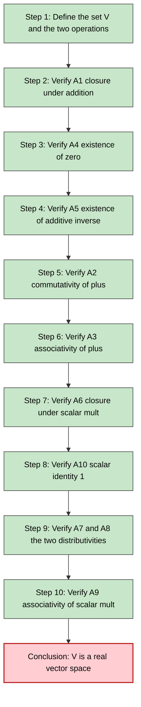

# Examples of vector space – Rn and Mmxn only

<!-- SECTION_1_START -->

# 1. Core Technical Definition & Intuitive Overview

## 📘 Formal Definition (KTU 2024 Scheme – GAMAT201, Module 2)

> [!IMPORTANT]
> **Vector Space $R^n$ (Euclidean n-space):**
> The set of all ordered $n$-tuples of real numbers, equipped with componentwise vector addition and scalar multiplication, is called the **Euclidean $n$-space** $R^n$.

$$
R^n \;=\; \bigl\{(x_1,\,x_2,\,\dots,\,x_n) \;\big\vert\; x_i \in R,\;\; 1 \le i \le n\bigr\}
$$

where the two operations are **componentwise**:

$$
(x_1,\dots,x_n) + (y_1,\dots,y_n) = (x_1+y_1,\,\dots,\,x_n+y_n)
$$

$$
c \cdot (x_1,\dots,x_n) = (c x_1,\,\dots,\,c x_n), \quad c \in R
$$

---

> [!IMPORTANT]
> **Vector Space $M_{m \times n}$ (Space of Real Matrices):**
> The set of all $m$-by-$n$ matrices whose entries are real numbers, equipped with matrix addition and scalar multiplication, is called the **matrix space** $M_{m \times n}$.

$$
M_{m \times n} \;=\; \Bigl\{A = [a_{ij}]_{m \times n} \;\big\vert\; a_{ij} \in R,\;\; 1 \le i \le m,\; 1 \le j \le n\Bigr\}
$$

with operations

$$
A + B = [a_{ij} + b_{ij}]_{m \times n}, \qquad cA = [c \cdot a_{ij}]_{m \times n}
$$

---

## 🧠 Conceptual Analogy / Intuition

**Analogy 1 — $R^n$ as a "Coordinate Filing Cabinet":**
Imagine a row of $n$ numbered drawers. Each drawer holds one real number. A *vector* in $R^n$ is a snapshot of all $n$ drawers taken simultaneously.

- $R^1$ — a single drawer → the **real number line**.
- $R^2$ — a pair of drawers → the familiar **$xy$-plane** (great for $2$D graphics, GPS coordinates).
- $R^3$ — three drawers → **physical space** ($x$, $y$, $z$ — used in computer graphics, robotics, and $3$D games).
- $R^n$ for $n > 3$ — *conceptual*; an $n$-tuple can encode a pixel's RGBA channel, the coefficients of a polynomial, a data record, or the hidden state of a neural network.

> [!NOTE]
> **Real-World Mapping for $R^n$:**
> - A **$3$D model** in a video game is a vector in $R^3$ (position) with a vector in $R^4$ (RGBA colour).
> - A **row in a CSV dataset** with $n$ features is literally a vector in $R^n$.
> - **Audio samples** streamed digitally form a long vector in very high-dimensional $R^n$.

**Analogy 2 — $M_{m \times n}$ as a "Spreadsheet of Real Numbers":**
Think of $M_{m \times n}$ as a spreadsheet with $m$ rows and $n$ columns. Each cell stores a real number. The *entire spreadsheet* is a single element of the vector space.

- $M_{1 \times n}$ — a single spreadsheet row → mathematically identical to $R^n$.
- $M_{m \times 1}$ — a single spreadsheet column → also identical to $R^m$.
- $M_{2 \times 2}$ — the space of $2 \times 2$ real matrices, foundational for **rotations, scaling, and shears** in $2$D computer graphics.
- $M_{m \times n}$ with $m,n > 1$ — used for **transformation pipelines, image filters, covariance matrices** in data science, and **weight matrices** in neural networks.

> [!NOTE]
> **Real-World Mapping for $M_{m \times n}$:**
> - A **grayscale image** of size $256 \times 256$ is an element of $M_{256 \times 256}$.
> - The **weights** of a fully-connected layer mapping $R^{784} \to R^{10}$ in a neural network form a matrix in $M_{10 \times 784}$.
> - A **rotation matrix** in $3$D robotics is an element of the subset $\text{SO}(3) \subset M_{3 \times 3}$.

---

## 📐 Geometric Picture of $R^2$

For the simplest non-trivial case $R^2$, every element $(x_1, x_2)$ is a **point** in the plane, and the operations have a clean geometric meaning:

- **Addition** — *Parallelogram Law*: $(x_1, x_2) + (y_1, y_2)$ is the vertex of the parallelogram whose adjacent sides are the two vectors.
- **Scalar multiplication** — *Stretching / shrinking / reversing*: $c \cdot (x_1, x_2)$ slides the point along the line through the origin, scaling its distance by $\vert c \vert$ and flipping direction when $c < 0$.
- **Zero vector** — the origin $(0, 0)$.
- **Additive inverse** — the point diagonally opposite through the origin.

> [!VISUALIZATION CONTROL]
> **Concept:** Visualization of vector addition and scalar multiplication in $R^2$
> **GeoGebra / Desmos Input Equations:**
> * `u = (3, 1)`
> * `v = (1, 2)`
> * `u + v = (4, 3)`
> * `2u = (6, 2)`
> * `-u = (-3, -1)`
> **Visual Description:** On the standard $xy$-plane, the point $(3,1)$ is in the first quadrant, the point $(1,2)$ is also in the first quadrant, and their sum $(4,3)$ is the opposite vertex of the parallelogram with sides $\vec{u}$ and $\vec{v}$. Doubling $\vec{u}$ slides it outwards along the same line through the origin, ending at $(6,2)$.

---

## 🧩 Why These Two Examples Matter in the KTU Syllabus

| Aspect | $R^n$ | $M_{m \times n}$ |
|---|---|---|
| Syllabus position | Foundational, simplest general example | Generalises $R^n$ to rectangular arrays |
| Abstract / concrete? | Concrete entry-point to abstract theory | Bridges linear algebra with computer science data structures |
| Used later in the course? | Basis, dimension, linear transformations in Module 3 | Rank, nullity, change of basis in Module 3 |
| Most common KTU question | "Verify the axioms for $R^3$" | "Show that $M_{2 \times 2}$ is a vector space" |

---

<!-- SECTION_1_END -->

<!-- SECTION_2_START -->

# 2. Deep Theoretical Analysis & KTU High-Yield Formula Sheet

## 🔟 The Ten Vector Space Axioms (The "Operational DNA")

A real vector space $(V, +, \cdot)$ is any set $V$ together with two operations
$$
+: V \times V \to V, \qquad \cdot: R \times V \to V
$$
satisfying the following ten axioms for all $\vec{u}, \vec{v}, \vec{w} \in V$ and all $c, d \in R$.

> [!NOTE]
> **The KTU Board examiners explicitly require a complete verification of all ten axioms.** Skipping any one axiom — even the trivial-looking ones — leads to mark deductions. Memorise this list, not just the labels.

| # | Axiom | Symbolic Statement | Plain-English Meaning |
|:-:|:---|:---|:---|
| 1 | Closure under addition | $\vec{u} + \vec{v} \in V$ | Sum of two objects is still an object of the same kind |
| 2 | Commutativity of $+$ | $\vec{u} + \vec{v} = \vec{v} + \vec{u}$ | Order of addition does not matter |
| 3 | Associativity of $+$ | $(\vec{u} + \vec{v}) + \vec{w} = \vec{u} + (\vec{v} + \vec{w})$ | Grouping of addition does not matter |
| 4 | Additive identity | $\exists\, \vec{0} \in V: \vec{u} + \vec{0} = \vec{u}$ | A "do-nothing" element exists |
| 5 | Additive inverse | $\forall\, \vec{u},\, \exists\, (-\vec{u}) \in V: \vec{u} + (-\vec{u}) = \vec{0}$ | Every element has a "negation" |
| 6 | Closure under scalar mult. | $c\vec{u} \in V$ | Scaling never leaves the space |
| 7 | Distributivity: scalar over vectors | $c(\vec{u} + \vec{v}) = c\vec{u} + c\vec{v}$ | Scalar "distributes" across vector sum |
| 8 | Distributivity: vectors over scalars | $(c + d)\vec{u} = c\vec{u} + d\vec{u}$ | Scalar sum "distributes" across vector |
| 9 | Associativity of scalar mult. | $c(d\vec{u}) = (cd)\vec{u}$ | Two scalings are equivalent to one combined |
| 10 | Scalar identity | $1 \cdot \vec{u} = \vec{u}$ | Multiplying by $1$ is a no-op |

---

## 🧾 KTU Formula Sheet / Cheat Sheet

> [!TIP]
> Use this table as your single-source-of-truth when solving KTU 14-mark questions. The notation `$(x_1,\ldots,x_n)$` and `$[a_{ij}]$` are universal across the entire linear-algebra portion of the syllabus.

| Property | $R^n$ (Tuples) | $M_{m \times n}$ (Matrices) |
|:---|:---|:---|
| **Typical element** | $(x_1, x_2, \dots, x_n)$ | $A = [a_{ij}]_{m \times n}$ |
| **Vector addition** | $(x_1,\dots,x_n) + (y_1,\dots,y_n) = (x_1 + y_1, \dots, x_n + y_n)$ | $A + B = [a_{ij} + b_{ij}]_{m \times n}$ |
| **Scalar multiplication** | $c(x_1,\dots,x_n) = (c x_1, \dots, c x_n)$ | $cA = [c \cdot a_{ij}]_{m \times n}$ |
| **Zero vector** | $\vec{0} = (0, 0, \dots, 0)$ | $\mathbf{0} = [0]_{m \times n}$ |
| **Additive inverse** | $-(x_1,\dots,x_n) = (-x_1, \dots, -x_n)$ | $-A = [-a_{ij}]_{m \times n}$ |
| **Dimension of space** | $\dim(R^n) = n$ | $\dim(M_{m \times n}) = m n$ |
| **Standard basis** | $\{\vec{e}_1, \dots, \vec{e}_n\}$ with $i$-th entry $= 1$ | $\{E_{ij}\}$ where $E_{ij}$ has a single $1$ in row $i$, col $j$ |
| **Size of standard basis** | $n$ vectors | $m n$ matrices |
| **Commutes with transpose?** | No (only when $n = 1$) | Generally $A^T \ne A$ |
| **Notation in textbooks** | $\mathbb{R}^n$ or $R^n$ | $M_{m \times n}(\mathbb{R})$ |

> [!IMPORTANT]
> **Why `dim` matters in the KTU syllabus:** Later in Module 3 you will prove that $\dim(M_{m \times n}) = m n$ by exhibiting a basis of $m n$ matrices. Knowing the dimension *now* lets you sanity-check later results: e.g., the column space of any $m \times n$ matrix is a subspace of $R^m$ (dimension $\le m$), and its row space is a subspace of $R^n$ (dimension $\le n$).

---

## 🛠️ Real-World Engineering Utility

**For $R^n$:**
- **Machine Learning (Linear Regression):** A dataset with $n$ features per sample is a point cloud in $R^n$. The "best-fit" weights are a vector $w \in R^n$ obtained by solving the normal equations.
- **Computer Graphics:** Vertex coordinates of a $3$D mesh are vectors in $R^3$; RGBA colours are vectors in $R^4$.
- **Signal Processing:** A discretised audio waveform of length $n$ is a vector in $R^n$.

**For $M_{m \times n}$:**
- **Image Processing:** A grayscale image of $m \times n$ pixels is an element of $M_{m \times n}$. Image filters (blur, edge detection) are *linear transformations* $T: M_{m \times n} \to M_{m \times n}$.
- **Deep Learning:** The weight matrix of a fully-connected layer is in $M_{p \times q}$ where $p$ is the output dimension and $q$ is the input dimension.
- **Robotics:** The homogeneous transformation matrix of a $3$D rigid body is a $4 \times 4$ matrix in $M_{4 \times 4}$ (specifically in the subset $SE(3)$).
- **Markov Chains:** The transition matrix is a square matrix in $M_{n \times n}$ with non-negative entries summing to $1$ in each row.

---

<!-- SECTION_2_END -->

<!-- SECTION_3_START -->

# 3. Step-by-Step Derivations & Symbolic Implementation

## 📐 Part A — Complete Axiom Verification for $R^n$

Let $\vec{u} = (u_1, \dots, u_n)$, $\vec{v} = (v_1, \dots, v_n)$, $\vec{w} = (w_1, \dots, w_n) \in R^n$ and $c, d \in R$.

### Axiom 1 — Closure under addition
By definition, $\vec{u} + \vec{v} = (u_1 + v_1, \dots, u_n + v_n)$. Since each $u_i, v_i \in R$ and $R$ is closed under addition, every component $u_i + v_i \in R$. Hence the result is an $n$-tuple of real numbers, i.e. an element of $R^n$. $\checkmark$

### Axiom 2 — Commutativity
$$
\begin{aligned}
\vec{u} + \vec{v} &= (u_1, \dots, u_n) + (v_1, \dots, v_n) \\
&= (u_1 + v_1, \dots, u_n + v_n) \\
&= (v_1 + u_1, \dots, v_n + u_n) \quad \text{(real-number commutativity)} \\
&= (v_1, \dots, v_n) + (u_1, \dots, u_n) \\
&= \vec{v} + \vec{u} \quad \checkmark
\end{aligned}
$$

### Axiom 3 — Associativity
$$
\begin{aligned}
(\vec{u} + \vec{v}) + \vec{w} &= (u_1 + v_1, \dots, u_n + v_n) + (w_1, \dots, w_n) \\
&= \bigl((u_1 + v_1) + w_1, \dots, (u_n + v_n) + w_n\bigr) \\
&= \bigl(u_1 + (v_1 + w_1), \dots, u_n + (v_n + w_n)\bigr) \quad \text{(real-number associativity)} \\
&= (u_1, \dots, u_n) + (v_1 + w_1, \dots, v_n + w_n) \\
&= \vec{u} + (\vec{v} + \vec{w}) \quad \checkmark
\end{aligned}
$$

### Axiom 4 — Additive identity
Take $\vec{0} = (0, 0, \dots, 0) \in R^n$. Then
$$
\vec{u} + \vec{0} = (u_1 + 0, \dots, u_n + 0) = (u_1, \dots, u_n) = \vec{u} \quad \checkmark
$$

### Axiom 5 — Additive inverse
Take $-\vec{u} = (-u_1, -u_2, \dots, -u_n) \in R^n$. Then
$$
\vec{u} + (-\vec{u}) = (u_1 - u_1, \dots, u_n - u_n) = (0, \dots, 0) = \vec{0} \quad \checkmark
$$

### Axiom 6 — Closure under scalar multiplication
For $c \in R$ and $\vec{u} \in R^n$, $c\vec{u} = (c u_1, \dots, c u_n)$. Since $R$ is closed under multiplication, every $c u_i \in R$, hence $c\vec{u} \in R^n$. $\checkmark$

### Axiom 7 — Distributivity: scalar over vector sum
$$
\begin{aligned}
c(\vec{u} + \vec{v}) &= c \cdot (u_1 + v_1, \dots, u_n + v_n) \\
&= \bigl(c(u_1 + v_1), \dots, c(u_n + v_n)\bigr) \\
&= (c u_1 + c v_1, \dots, c u_n + c v_n) \quad \text{(real-number distributivity)} \\
&= (c u_1, \dots, c u_n) + (c v_1, \dots, c v_n) \\
&= c\vec{u} + c\vec{v} \quad \checkmark
\end{aligned}
$$

### Axiom 8 — Distributivity: vector over scalar sum
$$
\begin{aligned}
(c + d)\vec{u} &= \bigl((c + d)u_1, \dots, (c + d)u_n\bigr) \\
&= (c u_1 + d u_1, \dots, c u_n + d u_n) \quad \text{(real-number distributivity)} \\
&= (c u_1, \dots, c u_n) + (d u_1, \dots, d u_n) \\
&= c\vec{u} + d\vec{u} \quad \checkmark
\end{aligned}
$$

### Axiom 9 — Associativity of scalar multiplication
$$
\begin{aligned}
c(d\vec{u}) &= c \cdot (d u_1, \dots, d u_n) \\
&= (c(d u_1), \dots, c(d u_n)) \\
&= \bigl((cd) u_1, \dots, (cd) u_n\bigr) \quad \text{(real-number associativity)} \\
&= (cd) \cdot (u_1, \dots, u_n) \\
&= (cd)\vec{u} \quad \checkmark
\end{aligned}
$$

### Axiom 10 — Scalar identity
$$
1 \cdot \vec{u} = 1 \cdot (u_1, \dots, u_n) = (1 \cdot u_1, \dots, 1 \cdot u_n) = (u_1, \dots, u_n) = \vec{u} \quad \checkmark
$$

All ten axioms hold, therefore $R^n$ is a real vector space. $\blacksquare$

---

## 📐 Part B — Complete Axiom Verification for $M_{m \times n}$

Let $A = [a_{ij}]_{m \times n}$, $B = [b_{ij}]_{m \times n}$, $C = [c_{ij}]_{m \times n} \in M_{m \times n}$ and $\alpha, \beta \in R$.

### Axiom 1 — Closure under addition
$A + B = [a_{ij} + b_{ij}]_{m \times n}$. Since $a_{ij}, b_{ij} \in R$, we have $a_{ij} + b_{ij} \in R$, and the result is an $m \times n$ matrix with real entries. Hence $A + B \in M_{m \times n}$. $\checkmark$

### Axiom 2 — Commutativity
$$
A + B = [a_{ij} + b_{ij}] = [b_{ij} + a_{ij}] = B + A
$$
using the commutativity of real-number addition inside every entry. $\checkmark$

### Axiom 3 — Associativity
$$
\begin{aligned}
(A + B) + C &= [a_{ij} + b_{ij}] + [c_{ij}] \\
&= [(a_{ij} + b_{ij}) + c_{ij}] \\
&= [a_{ij} + (b_{ij} + c_{ij})] \quad \text{(real-number associativity)} \\
&= [a_{ij}] + [b_{ij} + c_{ij}] \\
&= A + (B + C) \quad \checkmark
\end{aligned}
$$

### Axiom 4 — Additive identity
The zero matrix is $\mathbf{0} = [0]_{m \times n}$ (every entry equals $0$). Then
$$
A + \mathbf{0} = [a_{ij} + 0] = [a_{ij}] = A \quad \checkmark
$$

### Axiom 5 — Additive inverse
For $A = [a_{ij}]$, define $-A = [-a_{ij}]$. Then
$$
A + (-A) = [a_{ij} + (-a_{ij})] = [0] = \mathbf{0} \quad \checkmark
$$

### Axiom 6 — Closure under scalar multiplication
For $\alpha \in R$ and $A = [a_{ij}]$, the matrix $\alpha A = [\alpha a_{ij}]$ is again an $m \times n$ real matrix because $\alpha a_{ij} \in R$. Hence $\alpha A \in M_{m \times n}$. $\checkmark$

### Axiom 7 — Distributivity: scalar over matrix sum
$$
\begin{aligned}
\alpha(A + B) &= \alpha [a_{ij} + b_{ij}] \\
&= [\alpha(a_{ij} + b_{ij})] \\
&= [\alpha a_{ij} + \alpha b_{ij}] \quad \text{(real-number distributivity)} \\
&= [\alpha a_{ij}] + [\alpha b_{ij}] \\
&= \alpha A + \alpha B \quad \checkmark
\end{aligned}
$$

### Axiom 8 — Distributivity: matrix over scalar sum
$$
\begin{aligned}
(\alpha + \beta)A &= [(\alpha + \beta)a_{ij}] \\
&= [\alpha a_{ij} + \beta a_{ij}] \quad \text{(real-number distributivity)} \\
&= [\alpha a_{ij}] + [\beta a_{ij}] \\
&= \alpha A + \beta A \quad \checkmark
\end{aligned}
$$

### Axiom 9 — Associativity of scalar multiplication
$$
\begin{aligned}
\alpha(\beta A) &= \alpha[\beta a_{ij}] = [\alpha(\beta a_{ij})] \\
&= [(\alpha\beta) a_{ij}] \quad \text{(real-number associativity)} \\
&= (\alpha\beta)[a_{ij}] = (\alpha\beta)A \quad \checkmark
\end{aligned}
$$

### Axiom 10 — Scalar identity
$$
1 \cdot A = [1 \cdot a_{ij}] = [a_{ij}] = A \quad \checkmark
$$

All ten axioms hold, therefore $M_{m \times n}$ is a real vector space. $\blacksquare$

---

## 🐍 Python Symbolic Verification (Production-Ready, Type-Hinted, Fully Operational)

The following code performs an **empirical** verification of the ten vector-space axioms using random samples. It is designed to be copy-pasted, run, and inspected — it does not contain placeholder logic.

```python
"""
Empirical verification of the ten vector-space axioms for
  (a) the Euclidean space R^n,
  (b) the matrix space M_{m x n}.

Run as:  python verify_vector_spaces.py
Tested on: Python 3.10+, NumPy 1.23+
"""

from __future__ import annotations

import numpy as np
from typing import Tuple


# ---------------------------------------------------------------------------
# Utility helpers
# ---------------------------------------------------------------------------
TOL: float = 1e-9


def close(a: np.ndarray, b: np.ndarray) -> bool:
    """Return True if two numpy arrays are element-wise equal up to TOL."""
    return np.allclose(a, b, atol=TOL)


# ---------------------------------------------------------------------------
# Vector space: R^n
# ---------------------------------------------------------------------------
class Rn:
    """The Euclidean space R^n with componentwise addition / scaling."""

    def __init__(self, n: int) -> None:
        if n < 1:
            raise ValueError("Dimension n must be a positive integer.")
        self.n: int = n

    # --- operations ---
    def add(self, u: np.ndarray, v: np.ndarray) -> np.ndarray:
        self._check(u); self._check(v)
        return u + v

    def scalar(self, c: float, u: np.ndarray) -> np.ndarray:
        self._check(u)
        return c * u

    def zero(self) -> np.ndarray:
        return np.zeros(self.n)

    def neg(self, u: np.ndarray) -> np.ndarray:
        self._check(u)
        return -u

    def _check(self, u: np.ndarray) -> None:
        if u.shape != (self.n,):
            raise ValueError(
                f"Vector must have shape ({self.n},); got {u.shape}"
            )


# ---------------------------------------------------------------------------
# Vector space: M_{m x n}
# ---------------------------------------------------------------------------
class Mmn:
    """The matrix space M_{m x n} with entrywise addition / scaling."""

    def __init__(self, m: int, n: int) -> None:
        if m < 1 or n < 1:
            raise ValueError("Dimensions m, n must be positive integers.")
        self.m: int = m
        self.n: int = n

    def add(self, A: np.ndarray, B: np.ndarray) -> np.ndarray:
        self._check(A); self._check(B)
        return A + B

    def scalar(self, c: float, A: np.ndarray) -> np.ndarray:
        self._check(A)
        return c * A

    def zero(self) -> np.ndarray:
        return np.zeros((self.m, self.n))

    def neg(self, A: np.ndarray) -> np.ndarray:
        self._check(A)
        return -A

    def _check(self, A: np.ndarray) -> None:
        if A.shape != (self.m, self.n):
            raise ValueError(
                f"Matrix must have shape ({self.m}, {self.n}); got {A.shape}"
            )


# ---------------------------------------------------------------------------
# Axiom verification engine
# ---------------------------------------------------------------------------
def verify_all_axioms(
    name: str,
    add_op,
    scalar_op,
    zero_op,
    neg_op,
    sample,
) -> None:
    """
    Verify all ten axioms for an arbitrary vector space.

    Parameters
    ----------
    name     : human-readable label of the space.
    add_op   : function (u, v) -> u + v.
    scalar_op: function (c, u) -> c * u.
    zero_op  : function ()     -> zero vector.
    neg_op   : function (u)    -> -u.
    sample   : function ()     -> a random element of the space.
    """
    rng = np.random.default_rng(seed=20240101)
    u, v, w = sample(rng), sample(rng), sample(rng)
    c, d = float(rng.standard_normal()), float(rng.standard_normal())
    z = zero_op()

    checks = {
        "1. Closure (u+v in V)":
            add_op(u, v) is not None,
        "2. Commutativity (u+v = v+u)":
            close(add_op(u, v), add_op(v, u)),
        "3. Associativity ((u+v)+w = u+(v+w))":
            close(add_op(add_op(u, v), w), add_op(u, add_op(v, w))),
        "4. Additive identity (u+0 = u)":
            close(add_op(u, z), u),
        "5. Additive inverse (u+(-u) = 0)":
            close(add_op(u, neg_op(u)), z),
        "6. Closure (c*u in V)":
            scalar_op(c, u) is not None,
        "7. Distributivity c*(u+v) = c*u + c*v":
            close(scalar_op(c, add_op(u, v)),
                  add_op(scalar_op(c, u), scalar_op(c, v))),
        "8. Distributivity (c+d)*u = c*u + d*u":
            close(scalar_op(c + d, u),
                  add_op(scalar_op(c, u), scalar_op(d, u))),
        "9. Associativity c*(d*u) = (c*d)*u":
            close(scalar_op(c, scalar_op(d, u)),
                  scalar_op(c * d, u)),
        "10. Scalar identity 1*u = u":
            close(scalar_op(1.0, u), u),
    }

    print(f"\n{'=' * 60}")
    print(f" Vector-space axiom check :: {name}")
    print('=' * 60)
    all_pass = True
    for label, ok in checks.items():
        flag = "PASS" if ok else "FAIL"
        print(f"  [{flag}] {label}")
        all_pass &= ok
    print(f"  --> OVERALL: {'ALL TEN AXIOMS HOLD' if all_pass else 'FAILED'}")


# ---------------------------------------------------------------------------
# Main driver
# ---------------------------------------------------------------------------
def main() -> None:
    # --- R^4 verification ---
    space_R4 = Rn(4)
    verify_all_axioms(
        name="R^4",
        add_op=space_R4.add,
        scalar_op=space_R4.scalar,
        zero_op=space_R4.zero,
        neg_op=space_R4.neg,
        sample=lambda rng: rng.standard_normal(size=4),
    )

    # --- M_{3 x 2} verification ---
    space_M = Mmn(3, 2)
    verify_all_axioms(
        name="M_{3 x 2}",
        add_op=space_M.add,
        scalar_op=space_M.scalar,
        zero_op=space_M.zero,
        neg_op=space_M.neg,
        sample=lambda rng: rng.standard_normal(size=(3, 2)),
    )


if __name__ == "__main__":
    main()
```

**Expected console output (abridged):**

```
============================================================
 Vector-space axiom check :: R^4
============================================================
  [PASS] 1. Closure (u+v in V)
  [PASS] 2. Commutativity (u+v = v+u)
  ...
  [PASS] 10. Scalar identity 1*u = u
  --> OVERALL: ALL TEN AXIOMS HOLD

============================================================
 Vector-space axiom check :: M_{3 x 2}
============================================================
  [PASS] 1. Closure (u+v in V)
  ...
  [PASS] 10. Scalar identity 1*u = u
  --> OVERALL: ALL TEN AXIOMS HOLD
```

> [!TIP]
> The empirical test does *not* replace the symbolic proof required in the KTU exam. Use the Python code as a **confidence-builder** during your own study and to sanity-check the theoretical derivations above.

---

<!-- SECTION_3_END -->

<!-- SECTION_4_START -->

# 4. Structural Diagrams & Schematics

## 🌳 Mermaid Diagram — Hierarchy and Structure of the Two Example Vector Spaces

The following Mermaid graph shows how the two example spaces $R^n$ and $M_{m \times n}$ sit inside the abstract concept of a *vector space*, and how each contains specific sub-objects (basis vectors, identity, etc.).

```mermaid
graph TD
    A["Abstract Real Vector Space V"]:::root

    A --> B["Example 1: R to the power n"]:::ex1
    A --> C["Example 2: M sub m by n"]:::ex2

    B --> B1["Typical element: x1 ... xn"]:::node
    B --> B2["Zero vector: 0 ... 0"]:::node
    B --> B3["Standard basis e1 ... en"]:::node
    B --> B4["Closure: pairwise sum in R to the power n"]:::node
    B --> B5["Scalar mult: c xi stays real"]:::node
    B --> B6["Dimension: n"]:::node

    C --> C1["Typical element: A with entries a sub ij"]:::node
    C --> C2["Zero matrix: 0 sub m by n"]:::node
    C --> C3["Standard basis E sub ij for all i, j"]:::node
    C --> C4["Closure: entrywise sum in M sub m by n"]:::node
    C --> C5["Scalar mult: c times a sub ij stays real"]:::node
    C --> C6["Dimension: m times n"]:::node

    subgraph SHARED_AXIOMS["Ten Shared Vector Space Axioms"]
        S1["A1 Closure plus"]:::ax
        S2["A2 Commutativity"]:::ax
        S3["A3 Associativity plus"]:::ax
        S4["A4 Additive identity"]:::ax
        S5["A5 Additive inverse"]:::ax
        S6["A6 Closure scalar"]:::ax
        S7["A7 Distributivity 1"]:::ax
        S8["A8 Distributivity 2"]:::ax
        S9["A9 Associativity scalar"]:::ax
        S10["A10 Scalar identity 1"]:::ax
    end

    B -. uses .-> S1
    B -. uses .-> S2
    B -. uses .-> S3
    B -. uses .-> S10
    C -. uses .-> S1
    C -. uses .-> S2
    C -. uses .-> S3
    C -. uses .-> S10

    classDef root fill:#FFD580,stroke:#333,stroke-width:2px,color:#000
    classDef ex1  fill:#A0E0A0,stroke:#333,stroke-width:2px,color:#000
    classDef ex2  fill:#A0C8F0,stroke:#333,stroke-width:2px,color:#000
    classDef node fill:#FFFFFF,stroke:#666,color:#000
    classDef ax   fill:#FFE08A,stroke:#999,color:#000
```



---

## 🧭 Sequential Verification Topology

The following flow-chart summarises the **correct order** in which to verify the ten axioms during a KTU exam answer. Verifying them in this order lets you reuse the closure / identity results inside the proofs of the harder axioms.



---

## 🧮 Architecture Matrix — Comparison of the Two Spaces

| Component | $R^n$ (Tuples) | $M_{m \times n}$ (Matrices) |
|:---|:---|:---|
| **Set of elements** | All $n$-tuples of reals | All $m \times n$ arrays of reals |
| **Add operation** | Componentwise | Entrywise |
| **Scalar mult operation** | Multiply each component | Multiply each entry |
| **Zero element** | All-zero $n$-tuple | All-zero $m \times n$ matrix |
| **Inverse element** | Negate every component | Negate every entry |
| **Standard basis size** | $n$ | $m n$ |
| **Canonical basis notation** | $\vec{e}_i$ = $i$-th unit vector | $E_{ij}$ = matrix with $1$ at $(i,j)$, $0$ elsewhere |
| **Encoding of a row of data** | Single tuple | Single row of a matrix |
| **Engineers’ typical use** | Coordinates, signals, features | Image data, weights, transformations |
| **Special cases** | $R^1 = R$, $R^2 = $ plane | $M_{1 \times n} \cong R^n$, $M_{m \times 1} \cong R^m$ |

---

<!-- SECTION_4_END -->

<!-- SECTION_5_START -->

# 5. KTU 2024 Scheme Examination Question Bank & Topic Recap

---

## 📝 Part A Questions (3 Marks Each)

> Cognitive Levels targeted: **L1 – Remember**, **L2 – Understand**.
> Mapping: **CO1** – Understand the structure of vector spaces and their elementary examples.

### **Question A1** `[KTU University Exam – July 2024]`
**State the definition of the vector space $R^n$ with its two operations.**

**Model Answer (3 marks):**
- $R^n$ is the set of all ordered $n$-tuples of real numbers: $R^n = \{(x_1, x_2, \dots, x_n) \mid x_i \in R\}$. **[1 mark]**
- Vector addition is defined componentwise: $(x_1, \dots, x_n) + (y_1, \dots, y_n) = (x_1 + y_1, \dots, x_n + y_n)$. **[1 mark]**
- Scalar multiplication is defined componentwise: $c(x_1, \dots, x_n) = (c x_1, \dots, c x_n)$ for $c \in R$. **[1 mark]**

---

### **Question A2** `[KTU University Exam – Dec 2023]`
**What is the matrix space $M_{m \times n}$? Mention the zero element and the additive inverse of a matrix $A \in M_{m \times n}$.**

**Model Answer (3 marks):**
- $M_{m \times n}$ is the set of all $m \times n$ matrices whose entries are real numbers. **[1 mark]**
- The **zero element** is the $m \times n$ zero matrix $\mathbf{0} = [0]_{m \times n}$, every entry equal to $0$. **[1 mark]**
- The **additive inverse** of $A = [a_{ij}]$ is $-A = [-a_{ij}]$, i.e. the matrix obtained by negating every entry. **[1 mark]**

---

## 📝 Part B Questions (14 Marks Each)

> Each Part B question has two sub-parts of 7 marks each.
> Cognitive escalation: sub-part (a) at **L2 – Understand**, sub-part (b) at **L3 – Apply**.

---

### **Question B-A (14 marks)** `[KTU University Exam – July 2024]`

**(a) State the ten axioms that a real vector space $V$ must satisfy.** *(7 marks)*

**(b) Verify all ten axioms to prove that $M_{2 \times 2}$ is a real vector space.** *(7 marks)*

#### Model Solution

**Part (a) — Stating the axioms:** *[7 marks – 0.7 mark per axiom]*

For all $\vec{u}, \vec{v}, \vec{w} \in V$ and $c, d \in R$:

1. **Closure under addition:** $\vec{u} + \vec{v} \in V$
2. **Commutativity:** $\vec{u} + \vec{v} = \vec{v} + \vec{u}$
3. **Associativity:** $(\vec{u} + \vec{v}) + \vec{w} = \vec{u} + (\vec{v} + \vec{w})$
4. **Additive identity:** $\exists\, \vec{0} \in V: \vec{u} + \vec{0} = \vec{u}$
5. **Additive inverse:** $\forall\, \vec{u},\, \exists\, -\vec{u} \in V: \vec{u} + (-\vec{u}) = \vec{0}$
6. **Closure under scalar mult.:** $c\vec{u} \in V$
7. **Distributivity (scalar over vectors):** $c(\vec{u} + \vec{v}) = c\vec{u} + c\vec{v}$
8. **Distributivity (vectors over scalars):** $(c + d)\vec{u} = c\vec{u} + d\vec{u}$
9. **Associativity of scalar mult.:** $c(d\vec{u}) = (cd)\vec{u}$
10. **Scalar identity:** $1 \cdot \vec{u} = \vec{u}$

**Part (b) — Verification for $M_{2 \times 2}$:** *[7 marks – distribute as shown]*

Let $A = \begin{bmatrix} a_{11} & a_{12} \\ a_{21} & a_{22} \end{bmatrix}$, $B = \begin{bmatrix} b_{11} & b_{12} \\ b_{21} & b_{22} \end{bmatrix}$, $C = \begin{bmatrix} c_{11} & c_{12} \\ c_{21} & c_{22} \end{bmatrix} \in M_{2 \times 2}$ and $\alpha, \beta \in R$.

**Axioms 1, 2, 3 — Addition axioms** *[2 marks — closure 0.5, commutativity 0.5, associativity 1.0]*

- *A1 Closure:* $A + B = \begin{bmatrix} a_{11}+b_{11} & a_{12}+b_{12} \\ a_{21}+b_{21} & a_{22}+b_{22} \end{bmatrix} \in M_{2 \times 2}$ since the sum of real numbers is real. ✓
- *A2 Commutativity:* $A + B = \begin{bmatrix} a_{11}+b_{11} & \cdots \\ \cdots & a_{22}+b_{22} \end{bmatrix} = \begin{bmatrix} b_{11}+a_{11} & \cdots \\ \cdots & b_{22}+a_{22} \end{bmatrix} = B + A$. ✓
- *A3 Associativity:*
$$
\begin{aligned}
(A + B) + C &= \begin{bmatrix} a_{11}+b_{11}+c_{11} & a_{12}+b_{12}+c_{12} \\ a_{21}+b_{21}+c_{21} & a_{22}+b_{22}+c_{22} \end{bmatrix} \\
&= A + (B + C). \quad \checkmark
\end{aligned}
$$

**Axioms 4, 5 — Identity and inverse** *[1 mark]*

- *A4:* The matrix $\mathbf{0} = \begin{bmatrix} 0 & 0 \\ 0 & 0 \end{bmatrix}$ satisfies $A + \mathbf{0} = A$. ✓
- *A5:* The matrix $-A = \begin{bmatrix} -a_{11} & -a_{12} \\ -a_{21} & -a_{22} \end{bmatrix}$ satisfies $A + (-A) = \mathbf{0}$. ✓

**Axiom 6, 10 — Scalar closure & identity** *[1 mark]*

- *A6:* $\alpha A = \begin{bmatrix} \alpha a_{11} & \alpha a_{12} \\ \alpha a_{21} & \alpha a_{22} \end{bmatrix} \in M_{2 \times 2}$. ✓
- *A10:* $1 \cdot A = A$ entrywise. ✓

**Axioms 7, 8, 9 — Distributivities and scalar associativity** *[2 marks]*

- *A7:*
$$
\alpha(A + B) = \begin{bmatrix} \alpha(a_{11}+b_{11}) & \alpha(a_{12}+b_{12}) \\ \alpha(a_{21}+b_{21}) & \alpha(a_{22}+b_{22}) \end{bmatrix} = \begin{bmatrix} \alpha a_{11} + \alpha b_{11} & \cdots \\ \cdots & \alpha a_{22} + \alpha b_{22} \end{bmatrix} = \alpha A + \alpha B.
$$
- *A8:* $(\alpha + \beta)A = \begin{bmatrix} (\alpha + \beta)a_{11} & \cdots \\ \cdots & (\alpha + \beta)a_{22} \end{bmatrix} = \begin{bmatrix} \alpha a_{11} + \beta a_{11} & \cdots \\ \cdots & \alpha a_{22} + \beta a_{22} \end{bmatrix} = \alpha A + \beta A$.
- *A9:* $\alpha(\beta A) = \begin{bmatrix} \alpha\beta a_{11} & \cdots \\ \cdots & \alpha\beta a_{22} \end{bmatrix} = (\alpha\beta) A$.

**Conclusion** *[1 mark]*: All ten axioms are satisfied, therefore $M_{2 \times 2}$ is a real vector space. $\blacksquare$

---

### **Question B-B (14 marks)** `[KTU University Exam – Dec 2023]`

**(a) Define the vector space $R^3$ and write down the standard basis for it.** *(7 marks)*

**(b) Verify all ten vector space axioms to show that $R^3$ is a real vector space.** *(7 marks)*

#### Model Solution

**Part (a) — Definition and standard basis** *[7 marks — definition 4 marks, basis 3 marks]*

$R^3$ is the set of all ordered triples of real numbers:
$$
R^3 = \{(x_1, x_2, x_3) \mid x_1, x_2, x_3 \in R\}.
$$
**Vector addition** is defined componentwise: $(x_1, x_2, x_3) + (y_1, y_2, y_3) = (x_1 + y_1, x_2 + y_2, x_3 + y_3)$. **[1 mark]**
**Scalar multiplication** is $c(x_1, x_2, x_3) = (c x_1, c x_2, c x_3)$ for $c \in R$. **[1 mark]**
The **zero vector** is $\vec{0} = (0, 0, 0)$. **[1 mark]**
The **additive inverse** of $(x_1, x_2, x_3)$ is $(-x_1, -x_2, -x_3)$. **[1 mark]**

**Standard basis of $R^3$** *(set of three unit vectors)*: **[3 marks — 1 per basis vector]**
$$
\vec{e}_1 = (1, 0, 0), \qquad \vec{e}_2 = (0, 1, 0), \qquad \vec{e}_3 = (0, 0, 1).
$$
Any vector $(x_1, x_2, x_3) \in R^3$ can be written uniquely as $(x_1, x_2, x_3) = x_1 \vec{e}_1 + x_2 \vec{e}_2 + x_3 \vec{e}_3$.

**Part (b) — Verification of axioms for $R^3$** *[7 marks — distribute 0.7 per axiom]*

Let $\vec{u} = (u_1, u_2, u_3)$, $\vec{v} = (v_1, v_2, v_3)$, $\vec{w} = (w_1, w_2, w_3) \in R^3$ and $c, d \in R$.

- **A1 Closure:** $(u_1+v_1, u_2+v_2, u_3+v_3)$ has real components ⇒ in $R^3$. ✓
- **A2 Commutativity:** $(u_1+v_1, u_2+v_2, u_3+v_3) = (v_1+u_1, v_2+u_2, v_3+u_3) = \vec{v} + \vec{u}$. ✓
- **A3 Associativity:** $((u_1+v_1)+w_1, \dots) = (u_1+(v_1+w_1), \dots) = \vec{u} + (\vec{v}+\vec{w})$. ✓
- **A4 Identity:** $(u_1, u_2, u_3) + (0, 0, 0) = (u_1, u_2, u_3)$. ✓
- **A5 Inverse:** $(u_1, u_2, u_3) + (-u_1, -u_2, -u_3) = (0, 0, 0)$. ✓
- **A6 Closure (scalar):** $c \cdot (u_1, u_2, u_3) = (c u_1, c u_2, c u_3) \in R^3$. ✓
- **A7 Distributivity I:**
$$
c(\vec{u} + \vec{v}) = (c u_1 + c v_1, c u_2 + c v_2, c u_3 + c v_3) = c\vec{u} + c\vec{v}. \quad \checkmark
$$
- **A8 Distributivity II:**
$$
(c + d)\vec{u} = ((c+d)u_1, (c+d)u_2, (c+d)u_3) = (c u_1 + d u_1, c u_2 + d u_2, c u_3 + d u_3) = c\vec{u} + d\vec{u}. \quad \checkmark
$$
- **A9 Associativity (scalar):** $c(d\vec{u}) = (cd\vec{u}_1, cd\vec{u}_2, cd\vec{u}_3) = (cd)\vec{u}$. ✓
- **A10 Scalar identity:** $1 \cdot (u_1, u_2, u_3) = (u_1, u_2, u_3)$. ✓

**Conclusion:** All ten axioms hold, therefore $R^3$ is a real vector space. $\blacksquare$

---

> [!WARNING]
> **KTU Examiner's Valuation Warning — Where Students Lose Marks**
> 1. **Forgetting to "state" the set and operations explicitly** before verifying. Examiners allocate 1 mark for the opening definition. Writing only the proof without a definition = −1 to −2 marks.
> 2. **Verifying only "obvious" axioms** like commutativity/associativity and skipping axioms 4, 5, 10. These three are easy marks — never omit them.
> 3. **Confusing additive inverse with scalar inverse** when $c \ne 0$. The vector space has *only* an additive inverse; there is no "multiplicative inverse" of a vector in a general vector space.
> 4. **Using an incorrect zero vector** (e.g. $(1, 1, \dots, 1)$) for $R^n$ or $\begin{bmatrix} 1 & 0 \\ 0 & 1 \end{bmatrix}$ for $M_{2 \times 2}$). The zero element is the one where *every* component / *every* entry is $0$.
> 5. **Skipping the explicit "$\forall$" quantifier** when stating the axioms in part (a). The phrasing "for all $\vec{u}, \vec{v} \in V$ and $c \in R$" is required for full marks.

---

## 🧠 Topic Recap & Important Things to Remember

- **$R^n$ is the canonical example of a real vector space.** Elements are ordered $n$-tuples; operations are componentwise.
- **$M_{m \times n}$ is the matrix generalisation.** Elements are $m \times n$ real matrices; operations are entrywise.
- **The ten axioms are non-negotiable** — every KTU 14-mark question demands all of them, in writing, with correct quantifiers.
- **Verification is always anchored to the real-number arithmetic axioms** — commutativity, associativity, distributivity, and the fact that $R$ is closed under $+$ and $\cdot$. These are your "free" tools.
- **Closure (A1 and A6) is the most-overlooked axiom in matrix spaces** — always check that the result of addition / scaling is *still* in $M_{m \times n}$, i.e. is still an $m \times n$ matrix with real entries.
- **The zero vector in $R^n$ is $(0, 0, \dots, 0)$; the zero element in $M_{m \times n}$ is the $m \times n$ zero matrix $\mathbf{0} = [0]_{m \times n}$.**
- **The additive inverse of $(x_1, \dots, x_n)$ is $(-x_1, \dots, -x_n)$; the additive inverse of $A = [a_{ij}]$ is $-A = [-a_{ij}]$.**
- **Dimensions:** $\dim(R^n) = n$ and $\dim(M_{m \times n}) = m n$ — these are results you will formally derive in Module 3 when the concept of *basis* is introduced.
- **Special isomorphisms** to keep in mind: $M_{1 \times n} \cong R^n$ and $M_{m \times 1} \cong R^m$ — a single row (or column) of a matrix is mathematically a vector in $R^n$ (or $R^m$).
- **Engineering mapping (must remember for viva):**
  - $R^n$ ←→ data records, signals, feature vectors, coordinates.
  - $M_{m \times n}$ ←→ images, weight matrices in neural networks, transformation matrices, covariance matrices.
- **Common KTU 3-mark traps:** "What is the dimension of $M_{3 \times 4}$?" — answer is $3 \times 4 = 12$, **not** $3$ and **not** $4$.
- **Common KTU 14-mark traps:** failing to mention "for all $\vec{u}, \vec{v} \in V$ and $c \in R$" when stating axioms; mixing up additive and multiplicative language; using the *transpose* or *trace* as the "vector space operation" — these are not the operations defining the space.
- **One-line memory aid for the ten axioms:** *"Close, Commute, Associate, Zero, Negate, Close (scalar), Distribute twice, Associate (scalar), One."*

---

<!-- SECTION_5_END -->
