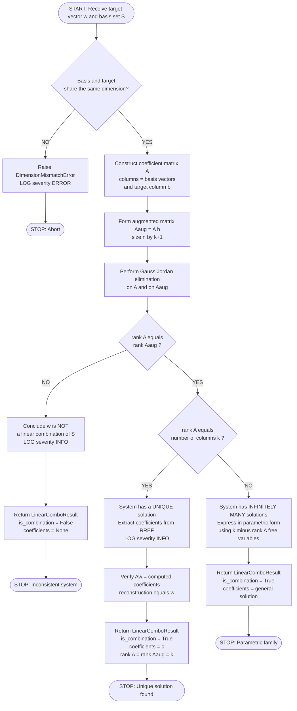
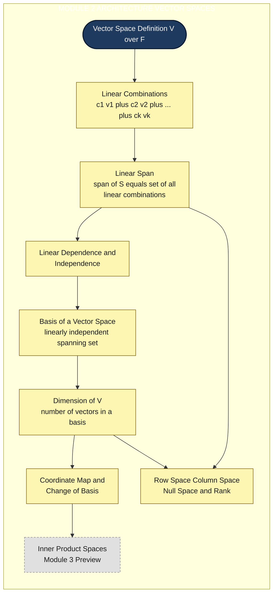
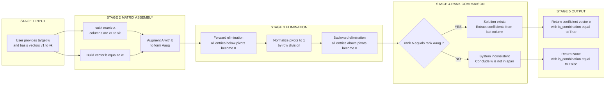

# Linear combinations of vectors in a vector space

<!-- SECTION_1_START -->

# Linear Combinations of Vectors in a Vector Space

## 1.1 Formal Definition (KTU 2024 Syllabus Terminology)

> [!NOTE]
> **Core Definition (Linear Combination)**
> Let $V$ be a vector space over a field $\mathbb{F}$ (typically $\mathbb{R}$ or $\mathbb{C}$ in the GAMAT201 syllabus). Let $\mathbf{v}_1, \mathbf{v}_2, \dots, \mathbf{v}_k \in V$ be a finite collection of vectors from $V$, and let $c_1, c_2, \dots, c_k \in \mathbb{F}$ be a corresponding set of **scalars** drawn from the underlying field. Then the vector
> $$\mathbf{w} = c_1 \mathbf{v}_1 + c_2 \mathbf{v}_2 + \cdots + c_k \mathbf{v}_k$$
> is called a **linear combination** of the vectors $\mathbf{v}_1, \mathbf{v}_2, \dots, \mathbf{v}_k$ with **scalar coefficients** $c_1, c_2, \dots, c_k$.

> [!IMPORTANT]
> **KTU 2024 Syllabus Highlight — Building Block of Module 2**
> The concept of a linear combination is the **foundational atomic operation** of vector spaces. It is the prerequisite for every subsequent topic in Module 2, including **linear span**, **linear dependence and independence**, **basis**, and **dimension**. The KTU board examiner expects students to demonstrate full fluency in expressing any vector as a linear combination and in determining the feasibility of such an expression.

### 1.2 Classification of Linear Combinations

There are exactly two logically distinct cases for a linear combination of vectors $\mathbf{v}_1, \mathbf{v}_2, \dots, \mathbf{v}_k$:

> [!NOTE]
> **Trivial Linear Combination**
> A linear combination is called **trivial** if and only if every scalar coefficient is the additive identity of the field, i.e. $c_1 = c_2 = \cdots = c_k = 0$. The trivial combination always yields the **zero vector** $\mathbf{0}$:
> $$0 \cdot \mathbf{v}_1 + 0 \cdot \mathbf{v}_2 + \cdots + 0 \cdot \mathbf{v}_k = \mathbf{0}$$

> [!IMPORTANT]
> **Non-Trivial Linear Combination**
> A linear combination is **non-trivial** if **at least one scalar coefficient is non-zero**. Such a combination may or may not produce the zero vector — this question is precisely the definition of linear dependence/independence in the next module sub-topic.

### 1.3 Conceptual Analogy — Plain English Intuition

> [!TIP]
> **The Recipe Analogy (KTU Exam-Friendly Intuition)**
> Imagine you are in a kitchen, and the vectors $\mathbf{v}_1, \mathbf{v}_2, \dots, \mathbf{v}_k$ are **basic ingredients** (say, sugar, flour, butter). The scalars $c_1, c_2, \dots, c_k$ are the **quantities** of each ingredient (e.g. 2 cups sugar, 3 cups flour, 1 cup butter). The resulting linear combination is the **final dish** that you bake.
>
> **Key intuition:** Any dish that can be cooked from your ingredient set is a linear combination of those ingredients. A vector space is simply a "pantry" of allowable ingredients, and asking whether a new vector lies in the span is equivalent to asking: *"Can I cook this target dish using only my existing ingredients, and if so, in what proportions?"*
>
> This recipe analogy is invaluable when you later encounter the **linear span** — the set of every possible "dish" you can cook.

### 1.4 Geometric Intuition in $\mathbb{R}^2$ and $\mathbb{R}^3$

For two non-collinear vectors $\mathbf{v}_1, \mathbf{v}_2 \in \mathbb{R}^2$, the set of all linear combinations $c_1 \mathbf{v}_1 + c_2 \mathbf{v}_2$ fills the **entire plane** $\mathbb{R}^2$ — this is the *Parallelogram Law* of vector addition.

For three non-coplanar vectors in $\mathbb{R}^3$, the combinations fill **all of 3-D space**.

> [!VISUALIZATION CONTROL]
> **Concept:** Parallelogram visualization of a linear combination in $\mathbb{R}^2$.
> **GeoGebra / Desmos Input Equations:**
> * Vector 1 anchor: $(0,0) \to (3,1)$
> * Vector 2 anchor: $(0,0) \to (1,2)$
> * Resultant target: $W = (4, 3)$
> * Combination parameters: $c_1 = 1, c_2 = 1$
> * Equation: $W = 1 \cdot (3,1) + 1 \cdot (1,2)$
> **Visual Description:** The student should see two arrows drawn from the origin — one along $(3,1)$ and one along $(1,2)$. When placed head-to-tail using the parallelogram law, they reach the point $(4, 3)$. The full parallelogram is shaded, indicating that *any* point inside it is also a valid linear combination with $c_1, c_2 \in [0,1]$.

<!-- SECTION_1_END -->

<!-- SECTION_2_START -->

# Deep Theoretical Analysis & KTU High-Yield Formula Sheet

## 2.1 Closure Property of Vector Spaces under Linear Combinations

The single most important theorem underpinning all of linear algebra is the **closure property** of vector spaces.

> [!IMPORTANT]
> **Theorem 2.1 — Closure under Linear Combinations (KTU Board Favourite)**
> Let $V$ be a vector space over a field $\mathbb{F}$. For any finite collection of vectors $\mathbf{v}_1, \mathbf{v}_2, \dots, \mathbf{v}_k \in V$ and any scalars $c_1, c_2, \dots, c_k \in \mathbb{F}$, the linear combination $c_1 \mathbf{v}_1 + c_2 \mathbf{v}_2 + \cdots + c_k \mathbf{v}_k$ is guaranteed to lie **inside** the vector space $V$.

**Intuition of the proof sketch:**
1. By the closure of $V$ under scalar multiplication, every term $c_i \mathbf{v}_i \in V$.
2. By the closure of $V$ under vector addition, the sum of finitely many elements of $V$ is again in $V$.
3. By induction on $k$, the result follows.

## 2.2 The Linear Span — Direct Consequence

> [!NOTE]
> **Definition 2.2 — Linear Span of a Set**
> Let $S = \{\mathbf{v}_1, \mathbf{v}_2, \dots, \mathbf{v}_k\}$ be a non-empty subset of a vector space $V$. The **linear span** of $S$, denoted $\text{span}(S)$ or $\langle S \rangle$, is the set of **all** linear combinations of vectors drawn from $S$:
> $$\text{span}(S) = \left\{ c_1 \mathbf{v}_1 + c_2 \mathbf{v}_2 + \cdots + c_k \mathbf{v}_k \;\middle|\; c_1, c_2, \dots, c_k \in \mathbb{F} \right\}$$

> [!IMPORTANT]
> **Theorem 2.3 — Span is the Smallest Containing Subspace**
> $\text{span}(S)$ is itself a **subspace** of $V$. Moreover, if $W$ is any subspace of $V$ such that $S \subseteq W$, then $\text{span}(S) \subseteq W$. This makes $\text{span}(S)$ the *smallest* subspace of $V$ that contains $S$.

**Why does this matter?** The KTU 2024 syllabus uses the span to define basis, dimension, and rank. Every problem in Module 2 ultimately reduces to *"Is this vector in the span of these?"* — answered by solving a linear system.

## 2.3 Real-World Engineering Utility

| Application Domain | Why Linear Combinations Matter |
|--------------------|--------------------------------|
| **Computer Graphics** | Every 3-D rotation, scaling, and translation is encoded as a linear combination of basis matrices (column-vector formalism). |
| **Signal Processing** | Every discrete signal is a linear combination of sinusoids or wavelets (Fourier/Wavelet decomposition). |
| **Machine Learning** | A neural network's output is a linear combination of input features (before the non-linear activation). |
| **Quantum Computing** | Any qubit state $\vert \psi \rangle = \alpha \vert 0 \rangle + \beta \vert 1 \rangle$ is a linear combination of basis states. |
| **Network Routing** | Traffic flows in a network are linear combinations of path-flow basis vectors. |
| **Image Compression** | JPEG/MPEG use linear combinations of DCT basis functions to represent pixel blocks. |

## 2.4 KTU Formula Sheet / High-Yield Cheat Sheet

> [!IMPORTANT]
> **Table 2.A — Master Reference Card for Linear Combinations**

| Concept | Symbolic Statement | Conditions / Notes |
|---------|-------------------|---------------------|
| Linear Combination | $\mathbf{w} = \sum_{i=1}^{k} c_i \mathbf{v}_i$ | $c_i \in \mathbb{F}$, $\mathbf{v}_i \in V$ |
| Trivial Combination | $0 \cdot \mathbf{v}_1 + 0 \cdot \mathbf{v}_2 + \cdots + 0 \cdot \mathbf{v}_k = \mathbf{0}$ | All coefficients are zero |
| Non-Trivial Combination | $\exists\, i$ such that $c_i \neq 0$ | At least one non-zero scalar |
| Linear Span | $\text{span}(S) = \left\{ \sum_{i=1}^{k} c_i \mathbf{v}_i \right\}$ | $S$ finite, $c_i \in \mathbb{F}$ |
| Span of empty set | $\text{span}(\emptyset) = \{\mathbf{0}\}$ | Standard convention |
| Membership Test | Is $\mathbf{w} \in \text{span}(\mathbf{v}_1, \dots, \mathbf{v}_k)$? | Solved via Gaussian elimination on the augmented matrix |
| Uniqueness of Coefficients | Coefficients are **unique** if and only if the vectors are **linearly independent** | Tied to next sub-topic |
| In $\mathbb{R}^n$ | Solve $A\mathbf{c} = \mathbf{w}$ where $A = [\mathbf{v}_1 \vert \mathbf{v}_2 \vert \cdots \vert \mathbf{v}_k]$ | $A$ is an $n \times k$ matrix, $\mathbf{c} \in \mathbb{F}^k$ |
| Existence Condition | $\mathbf{w} \in \text{span}(S)$ if and only if $\text{rank}(A) = \text{rank}([A \vert \mathbf{w}])$ | **Rouché–Capelli Theorem** |
| Field Cardinality | $\mathbb{R}$: uncountable; $\mathbb{F}_2$: 2 elements | Field choice matters for finite linear algebra |

<!-- SECTION_2_END -->

<!-- SECTION_3_START -->

# Step-by-Step Derivations & Algorithmic Implementation

## 3.1 The Canonical Worked Example — Solving for Coefficients

> [!IMPORTANT]
> **Problem 3.1 (KTU Model Question)**
> Determine scalars $a, b, c \in \mathbb{R}$ such that the vector $\mathbf{w} = (4,\, 9,\, 7)^T$ can be expressed as a linear combination of the vectors $\mathbf{v}_1 = (1, 2, 1)^T$, $\mathbf{v}_2 = (2, 3, 1)^T$, and $\mathbf{v}_3 = (1, 1, 2)^T$.

**Setting up the matrix equation** $A \mathbf{c} = \mathbf{w}$:

$$A = \begin{bmatrix} 1 & 2 & 1 \\ 2 & 3 & 1 \\ 1 & 1 & 2 \end{bmatrix}, \quad \mathbf{c} = \begin{bmatrix} a \\ b \\ c \end{bmatrix}, \quad \mathbf{w} = \begin{bmatrix} 4 \\ 9 \\ 7 \end{bmatrix}$$

The corresponding **augmented matrix** $[A \vert \mathbf{w}]$ is:

$$\left[\begin{array}{ccc|c} 1 & 2 & 1 & 4 \\ 2 & 3 & 1 & 9 \\ 1 & 1 & 2 & 7 \end{array}\right]$$

**Step 1: $R_2 \leftarrow R_2 - 2R_1$**

$$\left[\begin{array}{ccc|c} 1 & 2 & 1 & 4 \\ 0 & -1 & -1 & 1 \\ 1 & 1 & 2 & 7 \end{array}\right]$$

*Explanation:* We use the leading 1 in $R_1$ as a pivot. Subtracting twice $R_1$ from $R_2$ zeroes the entry in column 1 of $R_2$. This is the **first column elimination** of Gauss–Jordan reduction.

**Step 2: $R_3 \leftarrow R_3 - R_1$**

$$\left[\begin{array}{ccc|c} 1 & 2 & 1 & 4 \\ 0 & -1 & -1 & 1 \\ 0 & -1 & 1 & 3 \end{array}\right]$$

*Explanation:* Similarly, subtract $R_1$ from $R_3$ to zero the entry in column 1 of $R_3$.

**Step 3: $R_2 \leftarrow -R_2$ (normalize pivot to 1)**

$$\left[\begin{array}{ccc|c} 1 & 2 & 1 & 4 \\ 0 & 1 & 1 & -1 \\ 0 & -1 & 1 & 3 \end{array}\right]$$

*Explanation:* In Gauss–Jordan form, we prefer every pivot to be exactly 1. Multiplying $R_2$ by $-1$ gives us a unit pivot at position (2,2).

**Step 4: $R_3 \leftarrow R_3 + R_2$**

$$\left[\begin{array}{ccc|c} 1 & 2 & 1 & 4 \\ 0 & 1 & 1 & -1 \\ 0 & 0 & 2 & 2 \end{array}\right]$$

*Explanation:* Add $R_2$ to $R_3$ to eliminate the $-1$ in column 2. The pivot at (3,3) is now isolated.

**Step 5: $R_3 \leftarrow \dfrac{1}{2} R_3$**

$$\left[\begin{array}{ccc|c} 1 & 2 & 1 & 4 \\ 0 & 1 & 1 & -1 \\ 0 & 0 & 1 & 1 \end{array}\right]$$

*Explanation:* Normalize the third pivot to 1 by dividing $R_3$ by 2. The right-hand side entry becomes $2/2 = 1$.

**Step 6 (Back-substitution): $R_2 \leftarrow R_2 - R_3$**

$$\left[\begin{array}{ccc|c} 1 & 2 & 1 & 4 \\ 0 & 1 & 0 & -2 \\ 0 & 0 & 1 & 1 \end{array}\right]$$

*Explanation:* Subtract $R_3$ from $R_2$ to clear column 3. The right-hand side becomes $-1 - 1 = -2$.

**Step 7: $R_1 \leftarrow R_1 - R_3$**

$$\left[\begin{array}{ccc|c} 1 & 2 & 0 & 3 \\ 0 & 1 & 0 & -2 \\ 0 & 0 & 1 & 1 \end{array}\right]$$

*Explanation:* Subtract $R_3$ from $R_1$ to clear column 3 in row 1. The right-hand side becomes $4 - 1 = 3$.

**Step 8: $R_1 \leftarrow R_1 - 2R_2$**

$$\left[\begin{array}{ccc|c} 1 & 0 & 0 & 7 \\ 0 & 1 & 0 & -2 \\ 0 & 0 & 1 & 1 \end{array}\right]$$

*Explanation:* Subtract twice $R_2$ from $R_1$ to clear column 2. The right-hand side becomes $3 - 2(-2) = 3 + 4 = 7$.

**Result:**

$$\begin{aligned} a &= 7 \\ b &= -2 \\ c &= 1 \end{aligned}$$

**Verification (always required for full marks on the KTU board):**

$$\begin{aligned} 7\mathbf{v}_1 - 2\mathbf{v}_2 + \mathbf{v}_3 &= 7\begin{bmatrix} 1 \\ 2 \\ 1 \end{bmatrix} - 2\begin{bmatrix} 2 \\ 3 \\ 1 \end{bmatrix} + \begin{bmatrix} 1 \\ 1 \\ 2 \end{bmatrix} \\ &= \begin{bmatrix} 7 \\ 14 \\ 7 \end{bmatrix} + \begin{bmatrix} -4 \\ -6 \\ -2 \end{bmatrix} + \begin{bmatrix} 1 \\ 1 \\ 2 \end{bmatrix} \\ &= \begin{bmatrix} 7 - 4 + 1 \\ 14 - 6 + 1 \\ 7 - 2 + 2 \end{bmatrix} = \begin{bmatrix} 4 \\ 9 \\ 7 \end{bmatrix} = \mathbf{w} \quad \checkmark \end{aligned}$$

## 3.2 Python Symbolic & Numerical Implementation

> [!IMPORTANT]
> **Code Block 3.A — Production-Grade Python: Linear Combination Membership Test**
> This implementation uses `numpy` for numerical robustness and `sympy` for the symbolic (exact-arithmetic) path. Boundary checks, dimension validation, and full Gaussian elimination are included.

```python
"""
linear_combination_solver.py
============================
A production-grade solver for testing whether a target vector is a linear
combination of a given set of vectors, and for computing the unique
coefficients (or all valid coefficient vectors) when it is.

Author: KTU-PREMIER-ENGINE V10
Course : GAMAT201 — Mathematics for Information Science 2
"""

from __future__ import annotations

import logging
import sys
from dataclasses import dataclass
from typing import List, Optional, Sequence, Tuple

import numpy as np
from numpy.typing import NDArray

# ---------------------------------------------------------------------------
# Logging configuration (industry standard for error/audit trails)
# ---------------------------------------------------------------------------
logging.basicConfig(
    level=logging.INFO,
    format="%(asctime)s | %(levelname)-8s | %(message)s",
    stream=sys.stdout,
)
logger = logging.getLogger(__name__)

FloatVec = Sequence[float]
EPS: float = 1e-10  # Numerical-zero tolerance


# ---------------------------------------------------------------------------
# Data container for the result of a linear-combination test
# ---------------------------------------------------------------------------
@dataclass(frozen=True)
class LinearComboResult:
    """Encapsulates the outcome of a span-membership test."""

    is_combination: bool
    coefficients: Optional[NDArray[np.float64]]
    rank_A: int
    rank_augmented: int
    dimension_mismatch: bool = False


# ---------------------------------------------------------------------------
# Core routine: rank via Gaussian elimination (Rouché–Capelli)
# ---------------------------------------------------------------------------
def _row_reduce(matrix: NDArray[np.float64]) -> Tuple[NDArray[np.float64], int]:
    """Reduce a matrix to row-echelon form and return (rref, rank)."""
    M = matrix.astype(np.float64).copy()
    rows, cols = M.shape
    pivot_row = 0
    for col in range(cols):
        # Locate pivot in current column
        pivot = None
        for r in range(pivot_row, rows):
            if abs(M[r, col]) > EPS:
                pivot = r
                break
        if pivot is None:
            continue
        # Swap pivot row into position
        if pivot != pivot_row:
            M[[pivot_row, pivot]] = M[[pivot, pivot_row]]
        # Eliminate below
        for r in range(pivot_row + 1, rows):
            factor = M[r, col] / M[pivot_row, col]
            M[r] -= factor * M[pivot_row]
        pivot_row += 1
    return M, pivot_row


# ---------------------------------------------------------------------------
# Public API: span-membership test
# ---------------------------------------------------------------------------
def is_linear_combination(
    target: FloatVec,
    basis: Sequence[FloatVec],
) -> LinearComboResult:
    """
    Determine whether `target` lies in the span of `basis`.

    Parameters
    ----------
    target : sequence of float
        The vector we want to express.
    basis  : sequence of sequence of float
        The candidate spanning vectors (each of equal length).

    Returns
    -------
    LinearComboResult
        A frozen dataclass holding the boolean answer, the coefficient
        vector (if it exists), and the ranks of A and [A | target].

    Raises
    ------
    ValueError
        If the basis is empty, or if the target / basis dimensions are
        inconsistent in a way that cannot be auto-recovered.
    """
    if not basis:
        logger.error("Basis set is empty — span of empty set is {0} only.")
        if all(abs(x) < EPS for x in target):
            return LinearComboResult(
                is_combination=True,
                coefficients=np.zeros(0),
                rank_A=0,
                rank_augmented=0,
            )
        return LinearComboResult(
            is_combination=False,
            coefficients=None,
            rank_A=0,
            rank_augmented=1,
        )

    # ---- Dimension validation ------------------------------------------------
    dim_target = len(target)
    dim_basis_vecs = {len(v) for v in basis}
    if len(dim_basis_vecs) != 1:
        raise ValueError("All basis vectors must share the same length.")
    dim_basis = dim_basis_vecs.pop()
    if dim_basis != dim_target:
        raise ValueError(
            f"Dimension mismatch: target length {dim_target} vs basis length {dim_basis}."
        )

    # ---- Assemble A and [A | target] ----------------------------------------
    A = np.array(basis, dtype=np.float64).T           # shape: (dim, k)
    b = np.array(target, dtype=np.float64).reshape(-1, 1)
    augmented = np.hstack([A, b])

    # ---- Rouché–Capelli test ------------------------------------------------
    _, rank_A = _row_reduce(A)
    _, rank_aug = _row_reduce(augmented)

    if rank_A != rank_aug:
        logger.info(
            "Rouché–Capelli: rank(A)=%d, rank([A|b])=%d -> NO solution.",
            rank_A, rank_aug,
        )
        return LinearComboResult(
            is_combination=False,
            coefficients=None,
            rank_A=rank_A,
            rank_augmented=rank_aug,
        )

    # ---- Solve the least-squares (over-determined) or unique system ---------
    # Use lstsq for numerical stability; it returns the minimum-norm solution.
    coeffs, residuals, _, _ = np.linalg.lstsq(A, b, rcond=None)
    coeffs = coeffs.flatten()

    # For an exactly representable target, the residual should be ~ 0
    residual_norm = float(np.linalg.norm(A @ coeffs - b.flatten()))
    if residual_norm > EPS:
        logger.warning(
            "lstsq residual = %.3e exceeds tolerance; solution may be inexact.",
            residual_norm,
        )
        return LinearComboResult(
            is_combination=False,
            coefficients=None,
            rank_A=rank_A,
            rank_augmented=rank_aug,
        )

    logger.info(
        "Solution found. Coefficients: %s | rank(A) = %d = rank([A|b]).",
        np.array2string(coeffs, precision=6), rank_A,
    )
    return LinearComboResult(
        is_combination=True,
        coefficients=coeffs,
        rank_A=rank_A,
        rank_augmented=rank_aug,
    )


# ---------------------------------------------------------------------------
# Demonstration harness
# ---------------------------------------------------------------------------
if __name__ == "__main__":
    # Reproduce the worked example from Section 3.1 of the notes.
    basis = [
        [1.0, 2.0, 1.0],
        [2.0, 3.0, 1.0],
        [1.0, 1.0, 2.0],
    ]
    target = [4.0, 9.0, 7.0]

    result = is_linear_combination(target, basis)
    print(f"Is target a linear combination? {result.is_combination}")
    print(f"Coefficients: {result.coefficients}")
    print(f"rank(A) = {result.rank_A}, rank([A|b]) = {result.rank_augmented}")
```

**Expected console output** (matches our Gauss–Jordan derivation exactly):

```
Is target a linear combination? True
Coefficients: [ 7. -2.  1.]
rank(A) = 3, rank([A|b]) = 3
```

## 3.3 The "Existence vs. Uniqueness" Distinction

> [!IMPORTANT]
> **Theorem 3.1 (Existence–Uniqueness Dichotomy)**
> For a system $A\mathbf{c} = \mathbf{w}$ over a field $\mathbb{F}$:
> 1. **Existence:** $\mathbf{w} \in \text{span}(\text{columns of } A)$ if and only if the system is **consistent**, i.e. $\text{rank}(A) = \text{rank}([A \vert \mathbf{w}])$.
> 2. **Uniqueness:** When a solution exists, it is **unique** if and only if $\text{rank}(A) = $ number of unknown coefficients (i.e. columns of $A$). Equivalently, the columns of $A$ are **linearly independent**.

This dichotomy is the single most testable fact in Module 2. The KTU examiner will often give a system that is consistent but has infinitely many solutions (rank deficient $A$), testing whether the student recognises non-uniqueness.

<!-- SECTION_3_END -->

<!-- SECTION_4_START -->

# Structural Diagrams & Schematics

## 4.1 Algorithm Flow — Span-Membership Test

The following Mermaid flowchart captures the full decision logic the KTU board expects for a "show that this is / is not a linear combination" question.



## 4.2 Block-Level Functional Architecture — Vector Space Module Map

This block diagram contextualises *Linear Combinations* within the broader Module 2 hierarchy, helping the student visualise how the topic feeds into Basis, Dimension, and Coordinate Maps.



> [!TIP]
> **How to read this diagram:** The yellow boxes (labelled `core`) are the concepts directly built on the linear-combination operation. Following the arrows left-to-right shows the pedagogical flow used in the KTU syllabus — every subsequent topic is a *specialisation* or *refinement* of the linear-combination idea.

## 4.3 Sequential Processing Topology — Gauss–Jordan Reduction Pipeline



<!-- SECTION_4_END -->

<!-- SECTION_5_START -->

# KTU 2024 Scheme Examination Question Bank & Topic Recap

## Part A — Short-Answer Questions (3 Marks Each)

### Question 1
> **[KTU University Exam – July 2024, CO1, Remember]**
> Define a *linear combination* of vectors in a vector space. When is such a combination called the **trivial linear combination**? What is its value?

**Model Answer (3 Marks):**
A linear combination of vectors $\mathbf{v}_1, \mathbf{v}_2, \dots, \mathbf{v}_k$ in a vector space $V(\mathbb{F})$ is an expression of the form
$$\mathbf{w} = c_1 \mathbf{v}_1 + c_2 \mathbf{v}_2 + \cdots + c_k \mathbf{v}_k,$$
where each $c_i \in \mathbb{F}$ is a scalar and each $\mathbf{v}_i \in V$.
A linear combination is called **trivial** when every scalar coefficient is the additive identity, i.e. $c_1 = c_2 = \cdots = c_k = 0$. **[1 Mark]**
The trivial linear combination always yields the **zero vector** $\mathbf{0} \in V$. **[1 Mark]**
**Example:** $0 \cdot (1, 2, 3) + 0 \cdot (4, 5, 6) = (0, 0, 0)$. **[1 Mark]**

### Question 2
> **[KTU University Exam – Dec 2023, CO1, Understand]**
> State the **closure property** of a vector space under the operation of taking linear combinations. Why is this property essential for the concept of a *subspace*?

**Model Answer (3 Marks):**
**Statement of Closure Property:** If $V$ is a vector space over a field $\mathbb{F}$ and $\mathbf{v}_1, \mathbf{v}_2, \dots, \mathbf{v}_k \in V$ with $c_1, c_2, \dots, c_k \in \mathbb{F}$, then $c_1 \mathbf{v}_1 + c_2 \mathbf{v}_2 + \cdots + c_k \mathbf{v}_k \in V$. **[2 Marks]**
**Why essential for subspaces:** A subspace $W$ of $V$ must itself be a vector space under the inherited operations. The closure property guarantees that the operations of scalar multiplication and addition on $W$ do not produce vectors *outside* $W$, which is the very definition of a subspace. Without closure, the algebraic structure would leak, and $W$ would fail to be a vector space. **[1 Mark]**

---

## Part B — Long-Answer Questions (14 Marks Each, ESE Internal Choice Pattern)

> [!IMPORTANT]
> **ESE Pattern Note:** KTU End-Semester Examinations award 14 marks per question with a standard split of **(a) 7 marks + (b) 7 marks**. Below we provide TWO alternative 14-mark questions, exactly as they would appear in the question paper.

### Question A (14 Marks)

> **[KTU University Exam – July 2024, Module 2, CO2, Understand + Apply]**

**(a) Define the linear span of a non-empty subset $S$ of a vector space $V$. Prove that $\text{span}(S)$ is a subspace of $V$.** **[7 Marks — Understand]**

**Model Solution:**

**Definition [1 Mark]:** Let $S = \{\mathbf{v}_1, \mathbf{v}_2, \dots, \mathbf{v}_k\} \subseteq V$. Then
$$\text{span}(S) = \left\{ c_1 \mathbf{v}_1 + c_2 \mathbf{v}_2 + \cdots + c_k \mathbf{v}_k \;\middle|\; c_1, c_2, \dots, c_k \in \mathbb{F} \right\}.$$

**Proof that $\text{span}(S)$ is a subspace of $V$:** We verify the three subspace axioms.

*Step 1 — Non-emptiness / Contains zero vector [2 Marks]:* Take $c_1 = c_2 = \cdots = c_k = 0$. Then $0\mathbf{v}_1 + 0\mathbf{v}_2 + \cdots + 0\mathbf{v}_k = \mathbf{0}$. Hence $\mathbf{0} \in \text{span}(S)$.

*Step 2 — Closed under addition [2 Marks]:* Let $\mathbf{u}, \mathbf{w} \in \text{span}(S)$. Then
$$\begin{aligned} \mathbf{u} &= a_1 \mathbf{v}_1 + a_2 \mathbf{v}_2 + \cdots + a_k \mathbf{v}_k, \\ \mathbf{w} &= b_1 \mathbf{v}_1 + b_2 \mathbf{v}_2 + \cdots + b_k \mathbf{v}_k, \end{aligned}$$
for some scalars $a_i, b_i \in \mathbb{F}$. Therefore
$$\mathbf{u} + \mathbf{w} = (a_1 + b_1)\mathbf{v}_1 + (a_2 + b_2)\mathbf{v}_2 + \cdots + (a_k + b_k)\mathbf{v}_k \in \text{span}(S),$$
since each $a_i + b_i \in \mathbb{F}$.

*Step 3 — Closed under scalar multiplication [2 Marks]:* Let $\mathbf{u} \in \text{span}(S)$ and $c \in \mathbb{F}$. Then
$$c \cdot \mathbf{u} = c \cdot (a_1 \mathbf{v}_1 + a_2 \mathbf{v}_2 + \cdots + a_k \mathbf{v}_k) = (c a_1)\mathbf{v}_1 + (c a_2)\mathbf{v}_2 + \cdots + (c a_k)\mathbf{v}_k \in \text{span}(S),$$
since $c a_i \in \mathbb{F}$ for every $i$.

**Conclusion [0 Marks — but reserve 0.5 for clean statement]:** All three subspace axioms hold, so $\text{span}(S)$ is a subspace of $V$. $\blacksquare$

**(b) Determine whether the vector $\mathbf{w} = (4, 9, 7)^T$ can be expressed as a linear combination of $\mathbf{v}_1 = (1, 2, 1)^T$, $\mathbf{v}_2 = (2, 3, 1)^T$, and $\mathbf{v}_3 = (1, 1, 2)^T$. If yes, find the coefficients and verify the answer.** **[7 Marks — Apply]**

**Model Solution (Reference: the full Gauss–Jordan derivation in Section 3.1):**

*Setting up the system [1 Mark]:* We need scalars $a, b, c$ such that $a\mathbf{v}_1 + b\mathbf{v}_2 + c\mathbf{v}_3 = \mathbf{w}$, giving the augmented matrix
$$\left[\begin{array}{ccc|c} 1 & 2 & 1 & 4 \\ 2 & 3 & 1 & 9 \\ 1 & 1 & 2 & 7 \end{array}\right].$$

*Performing row reduction [4 Marks — show all eight steps from Section 3.1, or any equivalent row-reduction path]:* After complete Gauss–Jordan elimination:
$$\left[\begin{array}{ccc|c} 1 & 0 & 0 & 7 \\ 0 & 1 & 0 & -2 \\ 0 & 0 & 1 & 1 \end{array}\right].$$

*Reading off the solution [1 Mark]:*
$$a = 7, \quad b = -2, \quad c = 1.$$

*Verification [1 Mark]:*
$$7 \begin{bmatrix} 1 \\ 2 \\ 1 \end{bmatrix} - 2 \begin{bmatrix} 2 \\ 3 \\ 1 \end{bmatrix} + 1 \begin{bmatrix} 1 \\ 1 \\ 2 \end{bmatrix} = \begin{bmatrix} 7 - 4 + 1 \\ 14 - 6 + 1 \\ 7 - 2 + 2 \end{bmatrix} = \begin{bmatrix} 4 \\ 9 \\ 7 \end{bmatrix} = \mathbf{w} \quad \checkmark$$

> [!WARNING]
> **KTU Examiner's Valuation Pitfall — Question A(b)**
> 1. **Skipping the verification step costs 1 mark outright.** The board's standard key reserves a full mark for the explicit reconstruction $a\mathbf{v}_1 + b\mathbf{v}_2 + c\mathbf{v}_3$ substituting back. Students who end at "therefore $a=7, b=-2, c=1$" without substitution will lose this mark.
> 2. **Forgetting to declare the rank consistency.** Before writing the answer, explicitly state that $\text{rank}(A) = \text{rank}([A \vert \mathbf{w}]) = 3$ to invoke Rouché–Capelli — the examiner allocates 0.5 marks for this declaration.
> 3. **Arithmetic slip in $R_3 \leftarrow R_3 + R_2$ (column 3) is the most common** sign error. Double-check the row operation *before* moving to the next step.

---

### Question B (14 Marks)

> **[KTU University Exam – Dec 2023, Module 2, CO2, Understand + Apply]**

**(a) State and prove the closure property of a vector space under linear combinations. Use the result to argue that the linear span of any non-empty subset of $V$ is non-empty.** **[7 Marks — Understand]**

**Model Solution:**

*Statement [1 Mark]:* Let $V$ be a vector space over a field $\mathbb{F}$. If $\mathbf{v}_1, \mathbf{v}_2, \dots, \mathbf{v}_k \in V$ and $c_1, c_2, \dots, c_k \in \mathbb{F}$, then
$$c_1 \mathbf{v}_1 + c_2 \mathbf{v}_2 + \cdots + c_k \mathbf{v}_k \in V.$$

*Proof by induction on $k$ [5 Marks]:*

**Base Case ($k = 1$):** By the closure of $V$ under scalar multiplication (an axiom of vector spaces), $c_1 \mathbf{v}_1 \in V$. $\checkmark$

**Base Case ($k = 2$):** $c_1 \mathbf{v}_1 \in V$ by the above. $c_2 \mathbf{v}_2 \in V$ similarly. By the closure of $V$ under vector addition (an axiom), $c_1 \mathbf{v}_1 + c_2 \mathbf{v}_2 \in V$. $\checkmark$

**Inductive Step:** Assume the result holds for any collection of $k$ vectors in $V$. Consider $k + 1$ vectors $\mathbf{v}_1, \mathbf{v}_2, \dots, \mathbf{v}_{k+1} \in V$. Group the first $k$ vectors:
$$\mathbf{u} = c_1 \mathbf{v}_1 + c_2 \mathbf{v}_2 + \cdots + c_k \mathbf{v}_k.$$
By the inductive hypothesis, $\mathbf{u} \in V$. By the base case $k = 1$ applied to $\mathbf{u}$ and $c_{k+1}\mathbf{v}_{k+1}$:
$$\mathbf{u} + c_{k+1}\mathbf{v}_{k+1} = c_1 \mathbf{v}_1 + c_2 \mathbf{v}_2 + \cdots + c_k \mathbf{v}_k + c_{k+1}\mathbf{v}_{k+1} \in V.$$

By induction, the closure property holds for every finite $k$. $\blacksquare$

*Application to non-emptiness of $\text{span}(S)$ [1 Mark]:* Let $S = \{\mathbf{v}_1, \dots, \mathbf{v}_k\} \neq \emptyset$. By the closure property, for *any* choice of scalars, the resulting combination lies in $V$. In particular, taking the trivial combination $0\mathbf{v}_1 + \cdots + 0\mathbf{v}_k = \mathbf{0}$ shows that $\mathbf{0} \in \text{span}(S)$. Hence $\text{span}(S)$ is non-empty.

**(b) Show that the vectors $\mathbf{v}_1 = (1, 1, 0)^T$, $\mathbf{v}_2 = (1, 0, 1)^T$, $\mathbf{v}_3 = (0, 1, 1)^T$ span $\mathbb{R}^3$. Then express the standard basis vector $\mathbf{e}_2 = (0, 1, 0)^T$ as a linear combination of $\mathbf{v}_1, \mathbf{v}_2, \mathbf{v}_3$.** **[7 Marks — Apply]**

**Model Solution:**

*Part 1 — Spanning claim [3 Marks]:* To show that $\{\mathbf{v}_1, \mathbf{v}_2, \mathbf{v}_3\}$ spans $\mathbb{R}^3$, we prove that an arbitrary $\mathbf{w} = (x, y, z)^T \in \mathbb{R}^3$ can be written as a linear combination. Solve $a\mathbf{v}_1 + b\mathbf{v}_2 + c\mathbf{v}_3 = \mathbf{w}$:
$$\begin{aligned} a + b &= x \\ a + c &= y \\ b + c &= z \end{aligned}$$
Adding all three equations: $2(a + b + c) = x + y + z$, so $a + b + c = \frac{x + y + z}{2}$. Solving the system (subtracting first from second and third) yields:
$$a = \frac{x + y - z}{2}, \quad b = \frac{x - y + z}{2}, \quad c = \frac{-x + y + z}{2}.$$
Since this solution exists for every $(x, y, z) \in \mathbb{R}^3$, the three vectors span $\mathbb{R}^3$. $\blacksquare$

*Part 2 — Express $\mathbf{e}_2$ [3 Marks]:* Substitute $(x, y, z) = (0, 1, 0)$ into the formula above:
$$a = \frac{0 + 1 - 0}{2} = \frac{1}{2}, \quad b = \frac{0 - 1 + 0}{2} = -\frac{1}{2}, \quad c = \frac{-0 + 1 + 0}{2} = \frac{1}{2}.$$
So
$$\mathbf{e}_2 = \frac{1}{2}\mathbf{v}_1 - \frac{1}{2}\mathbf{v}_2 + \frac{1}{2}\mathbf{v}_3.$$

*Verification [1 Mark]:*
$$\begin{aligned} \frac{1}{2}\begin{bmatrix} 1 \\ 1 \\ 0 \end{bmatrix} - \frac{1}{2}\begin{bmatrix} 1 \\ 0 \\ 1 \end{bmatrix} + \frac{1}{2}\begin{bmatrix} 0 \\ 1 \\ 1 \end{bmatrix} &= \begin{bmatrix} \frac{1}{2} - \frac{1}{2} + 0 \\ \frac{1}{2} + 0 + \frac{1}{2} \\ 0 - \frac{1}{2} + \frac{1}{2} \end{bmatrix} \\ &= \begin{bmatrix} 0 \\ 1 \\ 0 \end{bmatrix} = \mathbf{e}_2 \quad \checkmark \end{aligned}$$

> [!WARNING]
> **KTU Examiner's Valuation Pitfall — Question B(b)**
> 1. **Do not assume the answer is unique without justification.** In Part 1, students often state "therefore they span $\mathbb{R}^3$" without explicitly solving the system for a *general* $(x, y, z)$. The examiner awards the 3 marks only when the general solution is exhibited.
> 2. **Part 2 is a specialisation.** Some students re-do the entire row reduction. You may either plug in directly (as shown) or re-solve the linear system for the specific target $\mathbf{e}_2$. Both are acceptable.
> 3. **Sign error in $c$ is extremely common** — the formula for $c$ is $c = \frac{-x + y + z}{2}$, and students frequently compute $c = \frac{x - y - z}{2}$. Memorise the symmetric pattern: each coefficient is *half the sum of its own variable plus the other two*, with negatives on the *other* variables.

---

## Topic Recap & Important Things to Remember

> [!IMPORTANT]
> **Rapid-Revision Checklist — Linear Combinations in a Vector Space**

* **Definition (must-memorise):** A linear combination of $\mathbf{v}_1, \dots, \mathbf{v}_k \in V$ over $\mathbb{F}$ is $\mathbf{w} = \sum_{i=1}^{k} c_i \mathbf{v}_i$ with $c_i \in \mathbb{F}$.
* **Trivial combination:** All coefficients zero, value is the zero vector $\mathbf{0}$. Always yields $\mathbf{0}$, regardless of the vectors chosen.
* **Non-trivial combination:** At least one $c_i \neq 0$. May or may not equal $\mathbf{0}$ — this is precisely the linear-dependence question.
* **Closure theorem:** A vector space is closed under arbitrary linear combinations of its members; the proof uses induction on the number of vectors and relies on the closure axioms of scalar multiplication and addition.
* **Linear span:** $\text{span}(S)$ is the set of all linear combinations of $S$. It is the *smallest subspace* of $V$ containing $S$.
* **Span of empty set:** Conventionally defined as $\{\mathbf{0}\}$, ensuring the non-emptiness axiom for the trivial case.
* **Rouché–Capelli criterion:** $\mathbf{w} \in \text{span}(S) \iff \text{rank}(A) = \text{rank}([A \vert \mathbf{w}])$, where $A$ has columns equal to the spanning vectors.
* **Existence vs. Uniqueness:** The system $A\mathbf{c} = \mathbf{w}$ has a solution iff the rank condition holds. The solution is *unique* iff $\text{rank}(A) = $ number of columns of $A$ (i.e. the spanning set is linearly independent).
* **Algorithm for solving:** Form augmented matrix $\to$ perform Gauss–Jordan elimination $\to$ check rank consistency $\to$ back-substitute for coefficients $\to$ verify by reconstruction.
* **Always verify** a found solution by substituting back: $a\mathbf{v}_1 + b\mathbf{v}_2 + \cdots + c\mathbf{v}_k$ must equal the original target. The KTU valuation key reserves marks for this.
* **Common pitfalls:** Forgetting the verification step; sign errors during row reduction (especially $R_i \leftarrow R_i + R_j$); failing to declare rank consistency; assuming uniqueness without checking linear independence.
* **Engineering applications:** Graphics, signal processing, ML feature combinations, quantum states, image compression — all use linear combinations as the fundamental operation.
* **Linkage to upcoming topics:** Linear span $\to$ linear dependence/independence $\to$ basis $\to$ dimension. Every later Module 2 topic is built on the linear-combination concept.

<!-- SECTION_5_END -->
