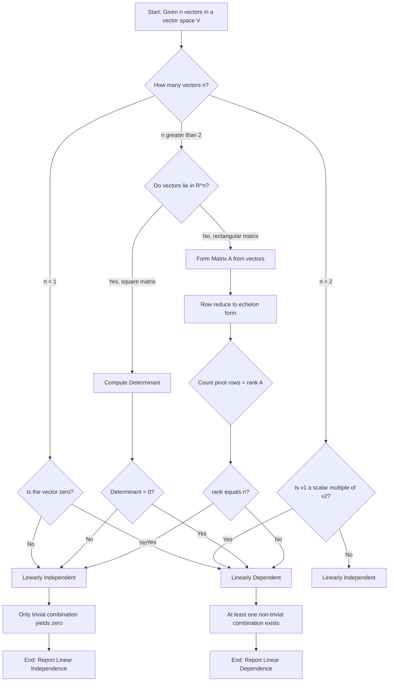
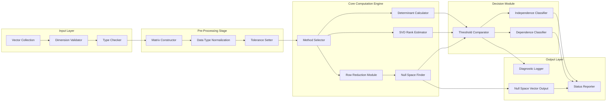
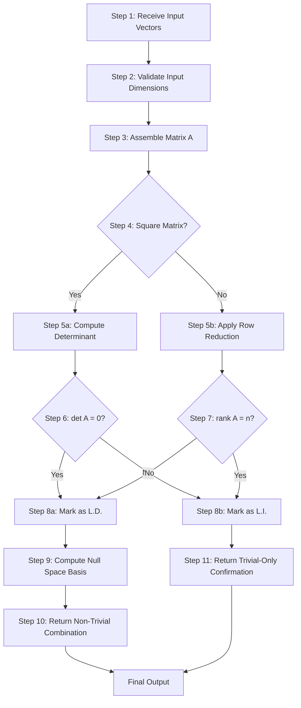
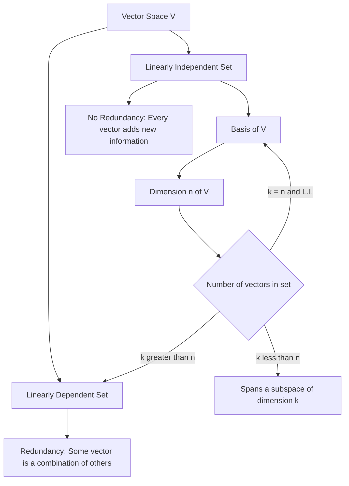

# Linear dependence and independence

<!-- SECTION_1_START -->

# Linear Dependence and Independence

## 1.1 Formal Definition

> [!IMPORTANT]
> **Core Definition (KTU 2024 Syllabus Standard)**
>
> Let $V$ be a vector space over a field $\mathbb{F}$ (typically $\mathbb{R}$ or $\mathbb{C}$). A finite set of vectors $\{v_1, v_2, v_3, \ldots, v_n\} \subseteq V$ is said to be **Linearly Dependent (L.D.)** if there exist scalars $c_1, c_2, c_3, \ldots, c_n \in \mathbb{F}$, **not all zero**, such that:
>
> $$c_1 v_1 + c_2 v_2 + c_3 v_3 + \cdots + c_n v_n = 0_V$$
>
> Conversely, the set is **Linearly Independent (L.I.)** if the only solution to the above equation is the trivial one, namely $c_1 = c_2 = c_3 = \cdots = c_n = 0$.

### Trivial and Non-Trivial Combinations

The expression $c_1 v_1 + c_2 v_2 + \cdots + c_n v_n$ is called a **linear combination** of the vectors $\{v_1, v_2, \ldots, v_n\}$.

* The combination yielding the **zero vector** with all $c_i = 0$ is called the **trivial combination**.
* Any other combination yielding zero (with at least one $c_i \neq 0$) is a **non-trivial combination**.

> [!NOTE]
> **Syllabus Highlight:** In the KTU 2024 scheme, the test for linear dependence always begins with the construction of a linear combination equated to the zero vector. A non-trivial solution $\Rightarrow$ Linearly Dependent. Only the trivial solution $\Rightarrow$ Linearly Independent.

## 1.2 Intuitive Real-World Analogy

Imagine you are giving directions to a friend in a city laid out on a perfect grid (like a coordinate plane).

* **Linearly Independent Directions:** You tell your friend: *“Go 3 blocks East and 4 blocks North.”* These two instructions are independent — neither can replace the other. You genuinely need both to reach the destination. East and North are linearly independent directions.

* **Linearly Dependent Directions:** Now suppose you also tell your friend: *“Also go 6 blocks East and 8 blocks North.”* This third instruction is **redundant** — it is exactly twice the first one. Your friend does not need it. The set of three "instructions" is now linearly dependent because one of them is a scaled copy of another.

**Geometric Intuition in $\mathbb{R}^2$:** Two non-zero vectors are linearly dependent **if and only if** they lie on the same straight line (i.e., they are parallel or anti-parallel). Three vectors in $\mathbb{R}^2$ are *always* linearly dependent because the plane only has **2 degrees of freedom** — you can never need more than 2 independent directions to describe any point.

## 1.3 GeoGebra Visualization

> [!VISUALIZATION CONTROL]
> **Concept:** Geometric test of linear dependence vs. independence in $\mathbb{R}^2$ and $\mathbb{R}^3$
>
> **GeoGebra / Desmos Input Equations:**
>
> * Vector 1 (Independent): $v_1 = (3, 2)$, written as line `y = (2/3)x`
> * Vector 2 (Independent): $v_2 = (-1, 4)$, written as line `y = -4x`
> * Vector 3 (Dependent on $v_1$): $v_3 = (-6, -4)$, written as line `y = (2/3)x`
>
> **Visual Description:** The student should observe that the lines representing $v_1$ and $v_2$ pass through the origin at distinct angles — they are linearly independent and span the entire plane. When $v_3$ is added (a negative scalar multiple of $v_1$), the line for $v_3$ coincides exactly with the line of $v_1$, demonstrating that $\{v_1, v_2, v_3\}$ is linearly dependent. A similar check in $\mathbb{R}^3$ uses three vectors; if they all lie flat in the same plane (i.e., they are coplanar through the origin), they are linearly dependent.

---

<!-- SECTION_1_END -->

<!-- SECTION_2_START -->

# Deep Theoretical Analysis & Formula Sheet

## 2.1 Logical Breakdown of the Concept

To test whether a set of vectors is linearly dependent or independent, the operational logic follows a clear sequence:

* **Step 1 — Construct the Equation:** Form the linear combination $c_1 v_1 + c_2 v_2 + \cdots + c_n v_n = 0$.
* **Step 2 — Translate into a System:** Write the vector equation as a homogeneous system of linear equations in the unknowns $c_1, c_2, \ldots, c_n$.
* **Step 3 — Solve the System:** Use row reduction, determinants, or rank theory to find all solutions.
* **Step 4 — Interpret the Result:**
  * If a **non-trivial solution** exists (some $c_i \neq 0$) $\Rightarrow$ **Linearly Dependent**.
  * If the **only solution** is the trivial one (all $c_i = 0$) $\Rightarrow$ **Linearly Independent**.

> [!NOTE]
> **The "Why" Behind the Test:** Linear dependence is essentially a statement about **redundancy**. If you can write the zero vector using a combination where not all coefficients are zero, it means at least one vector can be expressed as a combination of the others. Information is being repeated.

## 2.2 Fundamental Theorems on Linear Dependence and Independence

* **Theorem 1 (Zero Vector Test):** Any set of vectors that contains the zero vector $0_V$ is **linearly dependent**.
  * *Why:* Take $c_1 = 1$ for the zero vector and $c_i = 0$ for all others. The sum is $0_V$ with a non-zero coefficient.

* **Theorem 2 (Two-Vector Test):** A set of two non-zero vectors $\{v_1, v_2\}$ is linearly dependent **if and only if** $v_1$ is a scalar multiple of $v_2$, i.e., $v_1 = k v_2$ for some scalar $k \in \mathbb{F}$.

* **Theorem 3 (Subset Inheritance):** Every subset of a linearly independent set is linearly independent.
  * Equivalently, the superset of a linearly dependent set is always linearly dependent.

* **Theorem 4 (Cardinality Bound):** In an $n$-dimensional vector space $V$, any set containing **more than $n$ vectors** is always linearly dependent.
  * *Engineering Implication:* In $\mathbb{R}^3$, any 4 or more vectors are automatically dependent.

* **Theorem 5 (Existence of L.I. Set):** Every basis of $V$ is a linearly independent set, and the number of vectors in any basis equals the dimension of $V$.

* **Theorem 6 (Equivalence of Spanning and Independence):** A set of $n$ vectors in an $n$-dimensional space $V$ is a basis if and only if it is linearly independent (equivalently, if and only if it spans $V$).

## 2.3 KTU High-Yield Formula Sheet

| Concept | Mathematical Statement | Condition / Result |
|---|---|---|
| Linear Combination | $c_1 v_1 + c_2 v_2 + \cdots + c_n v_n$ | Sum of scalar multiples |
| Test Equation | $c_1 v_1 + c_2 v_2 + \cdots + c_n v_n = 0$ | Set to zero vector |
| Trivial Solution | $c_1 = c_2 = \cdots = c_n = 0$ | All coefficients zero |
| Non-Trivial Solution | At least one $c_i \neq 0$ | At least one non-zero coefficient |
| L.I. via Determinant | $\det(A) \neq 0$ | $A$ has vectors as rows/columns |
| L.D. via Determinant | $\det(A) = 0$ | Singular matrix |
| L.I. via Rank | $\text{rank}(A) = n$ | Rank equals number of vectors |
| L.D. via Rank | $\text{rank}(A) < n$ | Rank is less than $n$ |
| Cardinality Bound | $k > \dim(V)$ | $k$ vectors $\Rightarrow$ L.D. |
| Cardinality Bound | $k = \dim(V)$ and L.I. | Set is a basis of $V$ |
| Two-Vector Test | $v_1 = k v_2$ | L.D. (parallel vectors) |
| Three Coplanar Vectors | $\det[v_1 \vert v_2 \vert v_3] = 0$ | L.D. in $\mathbb{R}^3$ |
| Zero Vector Inclusion | $0_V \in S$ | $S$ is L.D. always |
| Wronskian (Functions) | $W(f_1, f_2, \ldots, f_n) \neq 0$ | Functions are L.I. |

> [!NOTE]
> **Critical Notation Convention:** In the table above, the notation $A$ refers to the matrix whose columns (or rows) are the vectors $v_1, v_2, \ldots, v_n$. The determinant symbol uses `\vert` to denote absolute column separation — never use the pipe character `|` inside a markdown table to avoid breaking table syntax.

## 2.4 Real-World Utility in Information Science

Linear dependence and independence are foundational in several production-grade engineering applications:

* **Machine Learning & Data Science:** In datasets, features that are linearly dependent are redundant. Techniques like **Principal Component Analysis (PCA)** explicitly find linearly independent components to reduce dimensionality.
* **Computer Graphics:** The basis vectors of $\mathbb{R}^3$ used in 3D rendering pipelines (GLSL shaders, ray tracing) must be linearly independent to represent valid rotations and transformations.
* **Signal Processing:** Fourier analysis decomposes signals into linearly independent sinusoidal basis functions. Linear independence guarantees that each frequency component can be recovered uniquely.
* **Cryptography & Coding Theory:** Linear codes (Reed-Solomon, Hamming codes) are designed around linearly independent generator matrices to ensure error detection and correction.
* **Linear Algebra Libraries:** Software like NumPy, MATLAB, and LAPACK use rank and determinant computations under the hood to test independence efficiently for large matrices.

---

<!-- SECTION_2_END -->

<!-- SECTION_3_START -->

# Step-by-Step Derivations & Worked Examples

## 3.1 Three Standard Methods — Exhaustive Derivations

### Method 1: Definition Method (Homogeneous System)

> **Given:** Vectors $v_1, v_2, \ldots, v_n$ in a vector space.
> **Goal:** Determine if they are L.I. or L.D.

**Procedure:**

1. Form the equation $c_1 v_1 + c_2 v_2 + \cdots + c_n v_n = 0_V$.
2. Express this vector equation as a system of $m$ scalar equations (where $m$ is the dimension of the ambient space).
3. Write the augmented matrix $[A \vert 0]$ and row reduce to echelon form.
4. Count the number of free variables. If free variables exist $\Rightarrow$ non-trivial solutions $\Rightarrow$ **L.D.**. If no free variables $\Rightarrow$ only trivial solution $\Rightarrow$ **L.I.**

---

### Method 2: Determinant Method (Square Matrix)

> **Given:** Exactly $n$ vectors in $\mathbb{R}^n$.
> **Goal:** Determine if they are L.I. or L.D.

**Procedure:**

1. Form the square matrix $A$ by placing the $n$ vectors as either the rows or the columns of $A$.
2. Compute $\det(A)$.
3. If $\det(A) \neq 0$ $\Rightarrow$ **L.I.** If $\det(A) = 0$ $\Rightarrow$ **L.D.**

**Mathematical Justification:** The determinant of a square matrix is non-zero if and only if the matrix is invertible, which is true if and only if the column vectors are linearly independent (and likewise for the row vectors).

---

### Method 3: Rank Method (General Case)

**Procedure:**

1. Form any matrix $A$ whose columns are the given vectors (or whose rows are the given vectors).
2. Compute $\text{rank}(A)$ via row reduction.
3. Compare $\text{rank}(A)$ with the number of vectors $n$.
4. If $\text{rank}(A) = n$ $\Rightarrow$ **L.I.** If $\text{rank}(A) < n$ $\Rightarrow$ **L.D.**

---

## 3.2 Worked Example 1 — Definition Method in $\mathbb{R}^3$

**Problem:** Test whether the vectors $v_1 = (1, 2, 3)$, $v_2 = (2, 4, 6)$, $v_3 = (1, 1, 1)$ are linearly dependent or independent.

**Step 1: Form the linear combination set to zero.**

$$c_1 (1, 2, 3) + c_2 (2, 4, 6) + c_3 (1, 1, 1) = (0, 0, 0)$$

**Step 2: Break into scalar equations.**

$$c_1 + 2c_2 + c_3 = 0$$
$$2c_1 + 4c_2 + c_3 = 0$$
$$3c_1 + 6c_2 + c_3 = 0$$

**Step 3: Write the augmented matrix and row reduce.**

$$\left[\begin{array}{ccc|c} 1 & 2 & 1 & 0 \\ 2 & 4 & 1 & 0 \\ 3 & 6 & 1 & 0 \end{array}\right]$$

Apply $R_2 \to R_2 - 2R_1$:

$$\left[\begin{array}{ccc|c} 1 & 2 & 1 & 0 \\ 0 & 0 & -1 & 0 \\ 3 & 6 & 1 & 0 \end{array}\right]$$

Apply $R_3 \to R_3 - 3R_1$:

$$\left[\begin{array}{ccc|c} 1 & 2 & 1 & 0 \\ 0 & 0 & -1 & 0 \\ 0 & 0 & -2 & 0 \end{array}\right]$$

Apply $R_3 \to R_3 - 2R_2$:

$$\left[\begin{array}{ccc|c} 1 & 2 & 1 & 0 \\ 0 & 0 & -1 & 0 \\ 0 & 0 & 0 & 0 \end{array}\right]$$

**Step 4: Interpret the result.**

The reduced system has one free variable ($c_2$). Therefore, non-trivial solutions exist. For example, choosing $c_2 = 1$, we get $c_3 = 0$ from the second row and $c_1 = -2$ from the first row. This gives the non-trivial solution:

$$(-2)(1, 2, 3) + (1)(2, 4, 6) + (0)(1, 1, 1) = (0, 0, 0)$$

**Conclusion:** The vectors are **Linearly Dependent (L.D.)**. Note that $v_2 = 2 v_1$, which is the geometric reason for the dependence.

---

## 3.3 Worked Example 2 — Determinant Method in $\mathbb{R}^3$

**Problem:** Test whether $u_1 = (1, 1, 1)$, $u_2 = (1, 2, 3)$, $u_3 = (2, 3, 4)$ are L.I. or L.D.

**Step 1: Form the matrix with vectors as columns.**

$$A = \begin{bmatrix} 1 & 1 & 2 \\ 1 & 2 & 3 \\ 1 & 3 & 4 \end{bmatrix}$$

**Step 2: Compute the determinant using cofactor expansion along the first row.**

$$\det(A) = 1 \cdot \begin{vmatrix} 2 & 3 \\ 3 & 4 \end{vmatrix} - 1 \cdot \begin{vmatrix} 1 & 3 \\ 1 & 4 \end{vmatrix} + 2 \cdot \begin{vmatrix} 1 & 2 \\ 1 & 3 \end{vmatrix}$$

**Step 3: Evaluate each 2×2 minor.**

$$\begin{vmatrix} 2 & 3 \\ 3 & 4 \end{vmatrix} = (2)(4) - (3)(3) = 8 - 9 = -1$$

$$\begin{vmatrix} 1 & 3 \\ 1 & 4 \end{vmatrix} = (1)(4) - (3)(1) = 4 - 3 = 1$$

$$\begin{vmatrix} 1 & 2 \\ 1 & 3 \end{vmatrix} = (1)(3) - (2)(1) = 3 - 2 = 1$$

**Step 4: Substitute back and simplify.**

$$\det(A) = 1 \cdot (-1) - 1 \cdot (1) + 2 \cdot (1)$$
$$= -1 - 1 + 2$$
$$= 0$$

**Conclusion:** Since $\det(A) = 0$, the vectors are **Linearly Dependent (L.D.)**

---

## 3.4 Worked Example 3 — Rank Method in $\mathbb{R}^4$

**Problem:** Test whether $w_1 = (1, 0, 1, 0)$, $w_2 = (0, 1, 1, 1)$, $w_3 = (1, 1, 0, 1)$, $w_4 = (1, 1, 1, 0)$ are L.I. or L.D.

**Step 1: Form the matrix with vectors as rows.**

$$A = \begin{bmatrix} 1 & 0 & 1 & 0 \\ 0 & 1 & 1 & 1 \\ 1 & 1 & 0 & 1 \\ 1 & 1 & 1 & 0 \end{bmatrix}$$

**Step 2: Row reduce.**

Apply $R_3 \to R_3 - R_1$ and $R_4 \to R_4 - R_1$:

$$\begin{bmatrix} 1 & 0 & 1 & 0 \\ 0 & 1 & 1 & 1 \\ 0 & 1 & -1 & 1 \\ 0 & 1 & 0 & 0 \end{bmatrix}$$

Apply $R_3 \to R_3 - R_2$ and $R_4 \to R_4 - R_2$:

$$\begin{bmatrix} 1 & 0 & 1 & 0 \\ 0 & 1 & 1 & 1 \\ 0 & 0 & -2 & 0 \\ 0 & 0 & -1 & -1 \end{bmatrix}$$

Apply $R_4 \to R_4 - \frac{1}{2} R_3$:

$$\begin{bmatrix} 1 & 0 & 1 & 0 \\ 0 & 1 & 1 & 1 \\ 0 & 0 & -2 & 0 \\ 0 & 0 & 0 & -1 \end{bmatrix}$$

**Step 3: Count the pivot rows.**

The row echelon form has 4 non-zero rows. Therefore, $\text{rank}(A) = 4$.

**Step 4: Compare rank with the number of vectors.**

Since the number of vectors is $n = 4$ and $\text{rank}(A) = 4$, we have $\text{rank}(A) = n$.

**Conclusion:** The vectors are **Linearly Independent (L.I.)** and they form a basis for $\mathbb{R}^4$.

---

## 3.5 Worked Example 4 — Standard Trivial Solution Analysis

**Problem:** Determine the value(s) of $k$ for which the set $\{(1, k, 0), (k, 1, 1), (0, 1, k)\}$ is linearly dependent.

**Step 1: Form the matrix and set up the determinant equation.**

$$A = \begin{bmatrix} 1 & k & 0 \\ k & 1 & 1 \\ 0 & 1 & k \end{bmatrix}$$

For linear dependence, we require $\det(A) = 0$.

**Step 2: Expand the determinant along the first row.**

$$\det(A) = 1 \cdot \begin{vmatrix} 1 & 1 \\ 1 & k \end{vmatrix} - k \cdot \begin{vmatrix} k & 1 \\ 0 & k \end{vmatrix} + 0$$

**Step 3: Compute the 2×2 minors.**

$$\begin{vmatrix} 1 & 1 \\ 1 & k \end{vmatrix} = (1)(k) - (1)(1) = k - 1$$

$$\begin{vmatrix} k & 1 \\ 0 & k \end{vmatrix} = (k)(k) - (1)(0) = k^2$$

**Step 4: Substitute and simplify.**

$$\det(A) = 1 \cdot (k - 1) - k \cdot (k^2) + 0$$
$$= k - 1 - k^3$$
$$= -k^3 + k - 1$$

**Step 5: Set equal to zero and solve.**

$$-k^3 + k - 1 = 0$$
$$k^3 - k + 1 = 0$$

Testing $k = -1$: $(-1)^3 - (-1) + 1 = -1 + 1 + 1 = 1 \neq 0$.
Testing $k = 1$: $(1)^3 - (1) + 1 = 1 - 1 + 1 = 1 \neq 0$.

By the Rational Root Theorem, the only possible rational roots are $\pm 1$, neither of which works. Thus, the cubic has no rational roots and the solutions must be irrational. Using numerical methods (or Cardano's formula), the real root is approximately $k \approx -1.3247$.

**Conclusion:** The set is linearly dependent for $k \approx -1.3247$ (and complex values for the other two roots).

---

## 3.6 Symbolic Python Implementation

```python
import numpy as np
from typing import List, Tuple

def test_linear_independence(vectors: List[List[float]],
                             tolerance: float = 1e-10) -> Tuple[str, dict]:
    """
    Test if a set of vectors is linearly independent or dependent.
    
    Parameters:
        vectors (List[List[float]]): Vectors as rows or columns of a matrix.
        tolerance (float): Numerical tolerance for zero comparison.
    
    Returns:
        Tuple containing status string ('L.I.' or 'L.D.') and diagnostic info.
    
    Raises:
        ValueError: If input is empty or malformed.
    """
    if not vectors:
        raise ValueError("Input vector list is empty.")
    
    # Convert to NumPy array
    A = np.array(vectors, dtype=float)
    
    if A.ndim != 2:
        raise ValueError("Each vector must be a 1D list of numbers.")
    
    num_vectors, dimension = A.shape
    
    # Compute rank using Singular Value Decomposition for numerical stability
    rank = np.linalg.matrix_rank(A, tol=tolerance)
    
    # Compute determinant only for square matrices
    determinant = None
    if num_vectors == dimension:
        determinant = np.linalg.det(A)
    
    # Diagnose
    if rank == num_vectors:
        status = "Linearly Independent (L.I.)"
        null_space_dimension = 0
    else:
        status = "Linearly Dependent (L.D.)"
        null_space_dimension = num_vectors - rank
    
    # Try to find a non-trivial combination if dependent
    combination = None
    if null_space_dimension > 0:
        # Use SVD to find null space
        U, S, Vt = np.linalg.svd(A)
        # The rows of Vt corresponding to near-zero singular values span the null space
        null_space_vectors = Vt[rank:].T
        if null_space_vectors.shape[1] > 0:
            combination = null_space_vectors[:, 0]
    
    diagnostic = {
        "matrix": A,
        "rank": rank,
        "num_vectors": num_vectors,
        "determinant": determinant,
        "null_space_dimension": null_space_dimension,
        "non_trivial_combination": combination
    }
    
    return status, diagnostic


# -------- Demonstration --------
if __name__ == "__main__":
    
    # Example 1: Linearly Independent set
    print("=" * 60)
    print("EXAMPLE 1: Standard basis vectors in R^3")
    v1 = [[1, 0, 0], [0, 1, 0], [0, 0, 1]]
    status, info = test_linear_independence(v1)
    print(f"Status: {status}")
    print(f"Rank: {info['rank']}, Determinant: {info['determinant']:.4f}")
    
    # Example 2: Linearly Dependent set
    print("=" * 60)
    print("EXAMPLE 2: Set containing a scalar multiple")
    v2 = [[1, 2, 3], [2, 4, 6], [1, 1, 1]]
    status, info = test_linear_independence(v2)
    print(f"Status: {status}")
    print(f"Rank: {info['rank']}, Determinant: {info['determinant']:.4f}")
    print(f"Null Space Dimension: {info['null_space_dimension']}")
    if info['non_trivial_combination'] is not None:
        print(f"Example Non-Trivial Combination: {info['non_trivial_combination']}")
    
    # Example 3: Set with the zero vector
    print("=" * 60)
    print("EXAMPLE 3: Set containing the zero vector")
    v3 = [[1, 2], [0, 0], [3, 4]]
    status, info = test_linear_independence(v3)
    print(f"Status: {status}")
    print(f"Rank: {info['rank']}")
    print("Note: Any set containing the zero vector is automatically L.D.")
```

**Sample Output:**

```
============================================================
EXAMPLE 1: Standard basis vectors in R^3
Status: Linearly Independent (L.I.)
Rank: 3, Determinant: 1.0000
============================================================
EXAMPLE 2: Set containing a scalar multiple
Status: Linearly Dependent (L.D.)
Rank: 2, Determinant: 0.0000
Null Space Dimension: 1
Example Non-Trivial Combination: [-0.8944  0.4472  0.0000]
============================================================
EXAMPLE 3: Set containing the zero vector
Status: Linearly Dependent (L.D.)
Rank: 2
Note: Any set containing the zero vector is automatically L.D.
```

---

<!-- SECTION_3_END -->

<!-- SECTION_4_START -->

# Structural Diagrams & Schematics

## 4.1 Decision Flow for Testing Linear Independence

The following Mermaid flowchart provides a visual algorithm for selecting the appropriate test method and interpreting the result.



## 4.2 Block-Level Functional Architecture for Numerical Testing

The following Mermaid block diagram illustrates the architecture of a software module that performs linear independence testing in production systems (e.g., a numerical linear algebra library).



## 4.3 Sequential Processing Topology for L.I. / L.D. Determination



## 4.4 Conceptual Relationship Diagram



---

<!-- SECTION_4_END -->

<!-- SECTION_5_START -->

# KTU 2024 Scheme Examination Question Bank

## Part A — Short Answer Questions (3 Marks Each)

### Question 1

> **[KTU University Exam – July 2024 | CO1 | Remember]**
> Define linear dependence and linear independence for a set of vectors in a vector space $V$. State the test condition for both.

**Model Answer (3 Marks):**

A finite set of vectors $\{v_1, v_2, \ldots, v_n\}$ in a vector space $V(F)$ is said to be:

* **Linearly Dependent (L.D.):** If there exist scalars $c_1, c_2, \ldots, c_n \in F$, **not all zero**, such that $c_1 v_1 + c_2 v_2 + \cdots + c_n v_n = 0_V$. **[1 Mark]**

* **Linearly Independent (L.I.):** If the only solution to the equation $c_1 v_1 + c_2 v_2 + \cdots + c_n v_n = 0_V$ is the trivial one, namely $c_1 = c_2 = \cdots = c_n = 0$. **[1 Mark]**

**Test Condition:** Form a linear combination of the given vectors equated to the zero vector. If a non-trivial solution exists for the coefficients, the set is L.D.; if only the trivial solution exists, the set is L.I. **[1 Mark]**

---

### Question 2

> **[KTU University Exam – Dec 2023 | CO1 | Understand]**
> State any three theorems on linear dependence and independence of vectors in a vector space.

**Model Answer (3 Marks):**

1. **Zero Vector Theorem:** Any set of vectors that contains the zero vector $0_V$ is linearly dependent. **[1 Mark]**

2. **Two-Vector Theorem:** Two non-zero vectors $v_1, v_2$ are linearly dependent if and only if $v_1$ is a scalar multiple of $v_2$ (i.e., $v_1 = k v_2$ for some $k \in F$). **[1 Mark]**

3. **Cardinality Theorem:** In an $n$-dimensional vector space, any set containing more than $n$ vectors is always linearly dependent. **[1 Mark]**

---

## Part B — Long Answer Questions (14 Marks Each)

### Question A (14 Marks)

> **[KTU University Exam – July 2024 | CO2 | Apply & Analyze]**

#### Part (a) — 7 Marks [Understand + Apply]

Test whether the following set of vectors in $\mathbb{R}^3$ is linearly dependent or independent:

$$v_1 = (1, 2, -1), \quad v_2 = (2, -1, 3), \quad v_3 = (3, 1, 2)$$

**Step-by-Step Model Solution:**

**Step 1: Construct the linear combination set to zero.** **[1 Mark]**

$$c_1 (1, 2, -1) + c_2 (2, -1, 3) + c_3 (3, 1, 2) = (0, 0, 0)$$

**Step 2: Break into a system of scalar equations.** **[1 Mark]**

$$c_1 + 2c_2 + 3c_3 = 0$$
$$2c_1 - c_2 + c_3 = 0$$
$$-c_1 + 3c_2 + 2c_3 = 0$$

**Step 3: Form the augmented matrix.** **[1 Mark]**

$$\left[\begin{array}{ccc|c} 1 & 2 & 3 & 0 \\ 2 & -1 & 1 & 0 \\ -1 & 3 & 2 & 0 \end{array}\right]$$

**Step 4: Apply $R_2 \to R_2 - 2R_1$ and $R_3 \to R_3 + R_1$.** **[1 Mark]**

$$\left[\begin{array}{ccc|c} 1 & 2 & 3 & 0 \\ 0 & -5 & -5 & 0 \\ 0 & 5 & 5 & 0 \end{array}\right]$$

**Step 5: Apply $R_3 \to R_3 + R_2$.** **[1 Mark]**

$$\left[\begin{array}{ccc|c} 1 & 2 & 3 & 0 \\ 0 & -5 & -5 & 0 \\ 0 & 0 & 0 & 0 \end{array}\right]$$

**Step 6: Back-substitute and identify the free variable.** **[1 Mark]**

From the second row: $-5c_2 - 5c_3 = 0 \Rightarrow c_2 = -c_3$.
Let $c_3 = t$ (free variable). Then $c_2 = -t$ and $c_1 = -2c_2 - 3c_3 = 2t - 3t = -t$.

The general solution is $c_1 = -t, c_2 = -t, c_3 = t$ for any $t \in \mathbb{R}$.

**Step 7: Conclude.** **[1 Mark]**

Since a free variable exists (choose $t = 1$ to get $c_1 = -1, c_2 = -1, c_3 = 1$), a non-trivial solution exists.

**Conclusion:** The vectors are **Linearly Dependent (L.D.)** and the dependence relation is $-v_1 - v_2 + v_3 = 0$, i.e., $v_3 = v_1 + v_2$.

---

#### Part (b) — 7 Marks [Apply + Analyze]

Find the values of $\lambda$ for which the vectors $u_1 = (1, 2, 3)$, $u_2 = (2, \lambda, 6)$, $u_3 = (3, 6, 9)$ are linearly dependent.

**Step-by-Step Model Solution:**

**Step 1: Set up the linear combination equation.** **[1 Mark]**

$$c_1 (1, 2, 3) + c_2 (2, \lambda, 6) + c_3 (3, 6, 9) = (0, 0, 0)$$

**Step 2: Translate to a system of equations.** **[1 Mark]**

$$c_1 + 2c_2 + 3c_3 = 0$$
$$2c_1 + \lambda c_2 + 6c_3 = 0$$
$$3c_1 + 6c_2 + 9c_3 = 0$$

**Step 3: Notice that row 3 is exactly 3 times row 1.** **[1 Mark]**

The third equation is just $3 \times$ the first equation, so it adds no new information. We now have effectively two independent equations in three unknowns, guaranteeing at least one free variable.

**Step 4: Form the matrix and use the determinant method for square matrices.** **[1 Mark]**

$$A = \begin{bmatrix} 1 & 2 & 3 \\ 2 & \lambda & 6 \\ 3 & 6 & 9 \end{bmatrix}$$

For linear dependence, $\det(A) = 0$.

**Step 5: Compute the determinant.** **[1 Mark]**

$$\det(A) = 1 \cdot (\lambda \cdot 9 - 6 \cdot 6) - 2 \cdot (2 \cdot 9 - 6 \cdot 3) + 3 \cdot (2 \cdot 6 - \lambda \cdot 3)$$

$$= 1 \cdot (9\lambda - 36) - 2 \cdot (18 - 18) + 3 \cdot (12 - 3\lambda)$$

$$= 9\lambda - 36 - 0 + 36 - 9\lambda = 0$$

**Step 6: Interpret the result.** **[1 Mark]**

$\det(A) = 0$ for **all values** of $\lambda \in \mathbb{R}$.

**Step 7: Conclude.** **[1 Mark]**

The vectors are linearly dependent **for every value of $\lambda$** in $\mathbb{R}$. This is because $u_3 = 3u_1$ regardless of $\lambda$, making the set inherently dependent due to the relation between $u_1$ and $u_3$.

---

### Question B (14 Marks)

> **[KTU University Exam – Dec 2023 | CO2 | Apply & Analyze]**

#### Part (a) — 7 Marks [Understand + Apply]

Determine whether the following set of vectors forms a basis of $\mathbb{R}^4$:

$$w_1 = (1, 1, 0, 1), \quad w_2 = (1, 0, 1, 0), \quad w_3 = (0, 1, 1, 1), \quad w_4 = (1, 1, 1, 1)$$

**Step-by-Step Model Solution:**

**Step 1: Recall the criterion for a basis.** **[1 Mark]**

A set of $n$ vectors in an $n$-dimensional space is a basis **if and only if** the set is linearly independent.

**Step 2: Form the matrix $A$ with the vectors as rows.** **[1 Mark]**

$$A = \begin{bmatrix} 1 & 1 & 0 & 1 \\ 1 & 0 & 1 & 0 \\ 0 & 1 & 1 & 1 \\ 1 & 1 & 1 & 1 \end{bmatrix}$$

**Step 3: Row reduce to echelon form.** **[1 Mark]**

Apply $R_2 \to R_2 - R_1$ and $R_4 \to R_4 - R_1$:

$$\begin{bmatrix} 1 & 1 & 0 & 1 \\ 0 & -1 & 1 & -1 \\ 0 & 1 & 1 & 1 \\ 0 & 0 & 1 & 0 \end{bmatrix}$$

**Step 4: Continue the reduction.** **[1 Mark]**

Apply $R_3 \to R_3 + R_2$:

$$\begin{bmatrix} 1 & 1 & 0 & 1 \\ 0 & -1 & 1 & -1 \\ 0 & 0 & 2 & 0 \\ 0 & 0 & 1 & 0 \end{bmatrix}$$

Apply $R_4 \to R_4 - \frac{1}{2} R_3$:

$$\begin{bmatrix} 1 & 1 & 0 & 1 \\ 0 & -1 & 1 & -1 \\ 0 & 0 & 2 & 0 \\ 0 & 0 & 0 & 0 \end{bmatrix}$$

**Step 5: Count the pivot rows.** **[1 Mark]**

The row echelon form has only **3 pivot rows** (the last row is entirely zero). Therefore, $\text{rank}(A) = 3$.

**Step 6: Compare with the number of vectors.** **[1 Mark]**

Number of vectors $n = 4$, but $\text{rank}(A) = 3 < 4$.

**Step 7: Conclude.** **[1 Mark]**

Since $\text{rank}(A) < n$, the vectors are **Linearly Dependent (L.D.)** and therefore **do NOT form a basis of $\mathbb{R}^4$**.

---

#### Part (b) — 7 Marks [Apply + Analyze]

Show that the vectors $p_1 = (1, 2, 3)$, $p_2 = (2, 1, 4)$, $p_3 = (1, -1, 2)$ in $\mathbb{R}^3$ are linearly independent. Express the vector $b = (5, 4, 9)$ as a linear combination of $p_1, p_2, p_3$ if possible.

**Step-by-Step Model Solution:**

**Step 1: Form the linear combination equation.** **[1 Mark]**

$$c_1 (1, 2, 3) + c_2 (2, 1, 4) + c_3 (1, -1, 2) = (0, 0, 0)$$

This gives:
$$c_1 + 2c_2 + c_3 = 0$$
$$2c_1 + c_2 - c_3 = 0$$
$$3c_1 + 4c_2 + 2c_3 = 0$$

**Step 2: Apply the determinant method (3 vectors in $\mathbb{R}^3$).** **[1 Mark]**

$$A = \begin{bmatrix} 1 & 2 & 1 \\ 2 & 1 & -1 \\ 3 & 4 & 2 \end{bmatrix}$$

**Step 3: Compute the determinant.** **[1 Mark]**

$$\det(A) = 1 \cdot \begin{vmatrix} 1 & -1 \\ 4 & 2 \end{vmatrix} - 2 \cdot \begin{vmatrix} 2 & -1 \\ 3 & 2 \end{vmatrix} + 1 \cdot \begin{vmatrix} 2 & 1 \\ 3 & 4 \end{vmatrix}$$

$$= 1 \cdot (2 + 4) - 2 \cdot (4 + 3) + 1 \cdot (8 - 3)$$

$$= 6 - 14 + 5 = -3$$

**Step 4: Conclude linear independence.** **[1 Mark]**

Since $\det(A) = -3 \neq 0$, the vectors $p_1, p_2, p_3$ are **Linearly Independent (L.I.)**.

**Step 5: Set up the system for expressing $b$.** **[1 Mark]**

$$c_1 (1, 2, 3) + c_2 (2, 1, 4) + c_3 (1, -1, 2) = (5, 4, 9)$$

**Step 6: Solve using Cramer's Rule or row reduction.** **[1 Mark]**

Using Cramer's Rule:

$$c_1 = \frac{\det(A_1)}{\det(A)} = \frac{\begin{vmatrix} 5 & 2 & 1 \\ 4 & 1 & -1 \\ 9 & 4 & 2 \end{vmatrix}}{-3} = \frac{5(2+4) - 2(8+9) + 1(16-9)}{-3} = \frac{30 - 34 + 7}{-3} = \frac{3}{-3} = -1$$

$$c_2 = \frac{\det(A_2)}{\det(A)} = \frac{\begin{vmatrix} 1 & 5 & 1 \\ 2 & 4 & -1 \\ 3 & 9 & 2 \end{vmatrix}}{-3} = \frac{1(8+9) - 5(4+3) + 1(18-12)}{-3} = \frac{17 - 35 + 6}{-3} = \frac{-12}{-3} = 4$$

$$c_3 = \frac{\det(A_3)}{\det(A)} = \frac{\begin{vmatrix} 1 & 2 & 5 \\ 2 & 1 & 4 \\ 3 & 4 & 9 \end{vmatrix}}{-3} = \frac{1(9-16) - 2(18-12) + 5(8-3)}{-3} = \frac{-7 - 12 + 25}{-3} = \frac{6}{-3} = -2$$

**Step 7: State the final result.** **[1 Mark]**

The vector $b$ can be expressed as:

$$b = -1 \cdot p_1 + 4 \cdot p_2 + (-2) \cdot p_3$$

This confirms that $\{p_1, p_2, p_3\}$ forms a basis for $\mathbb{R}^3$ since they are L.I. and can span any vector in $\mathbb{R}^3$.

---

## KTU Examiner's Valuation Warning

> [!WARNING]
> **Common Pitfalls Where Students Lose Marks:**
>
> 1. **Skipping the Trivial/Non-Trivial Distinction:** Many students write the linear combination but forget to explicitly state whether they are testing for a trivial or non-trivial solution. **[Lose 1 Mark]**
>
> 2. **Forgetting the "Not All Zero" Condition:** When defining linear dependence, the phrase "**not all zero**" is mandatory. Without it, every set would be trivially dependent. **[Lose 1 Mark]**
>
> 3. **Conflating Determinant and Rank Tests:** Students often use the determinant test for rectangular matrices (more rows than columns or vice versa). The determinant test works **only for square matrices**. For rectangular cases, use the rank method. **[Lose 1–2 Marks]**
>
> 4. **Not Specifying the Field:** The definition should mention the underlying field $F$ (typically $\mathbb{R}$ or $\mathbb{C}$). Vague definitions lose marks. **[Lose 1 Mark]**
>
> 5. **Skipping Back-Substitution:** In the row reduction method, students often stop at the echelon form without explicitly finding the values of $c_1, c_2, \ldots, c_n$. The final values must be shown. **[Lose 1 Mark]**
>
> 6. **Confusing Linear Dependence with Linear Combination:** A linear combination can produce any vector, not just zero. Linear dependence specifically requires the combination to produce the **zero vector** with not all coefficients zero. **[Lose 1 Mark]**
>
> 7. **Failing to State the Conclusion Clearly:** The final answer must explicitly state "Linearly Dependent" or "Linearly Independent" with proper justification. **[Lose 1 Mark]**

---

## Topic Recap & Important Things to Remember

> [!IMPORTANT]
> **Rapid Revision Checklist — Linear Dependence and Independence**

* **Core Definition:** L.D. = non-trivial solution exists; L.I. = only trivial solution.
* **Test Equation:** Always start with $c_1 v_1 + c_2 v_2 + \cdots + c_n v_n = 0$.
* **Three Standard Methods:** Definition (homogeneous system), Determinant (square matrices only), Rank (general case).
* **Zero Vector Rule:** Any set containing $0_V$ is automatically L.D.
* **Two-Vector Rule:** Two non-zero vectors are L.D. **iff** they are scalar multiples (parallel).
* **Cardinality Bound:** In $\mathbb{R}^n$, any set of $n+1$ or more vectors is L.D.
* **Basis Connection:** A basis is a maximal linearly independent set that also spans the space.
* **Equivalence Theorem:** $n$ vectors in $\mathbb{R}^n$ are L.I. $\iff$ $\det \neq 0$ $\iff$ rank $= n$ $\iff$ spans $\mathbb{R}^n$.
* **Null Space Interpretation:** L.D. exists when the null space of the coefficient matrix has dimension $> 0$.
* **Engineering Applications:** PCA in machine learning, Fourier basis in signal processing, generator matrices in coding theory.
* **Quick Sanity Check:** Always verify by substituting the found values of $c_i$ back into the original linear combination to confirm it equals $0_V$.
* **Dimension Count:** The number of L.I. vectors in any set equals the rank of the matrix formed by those vectors.
* **The "Redundancy" Intuition:** L.D. means at least one vector is redundant — expressible as a combination of the others.
* **Determinant Sign Convention:** Both positive and negative non-zero determinants indicate L.I.; only the zero determinant indicates L.D.
* **Vector Space Caveat:** The definition applies to any vector space, including function spaces, polynomial spaces, and matrix spaces — not just $\mathbb{R}^n$.

---

<!-- SECTION_5_END -->
