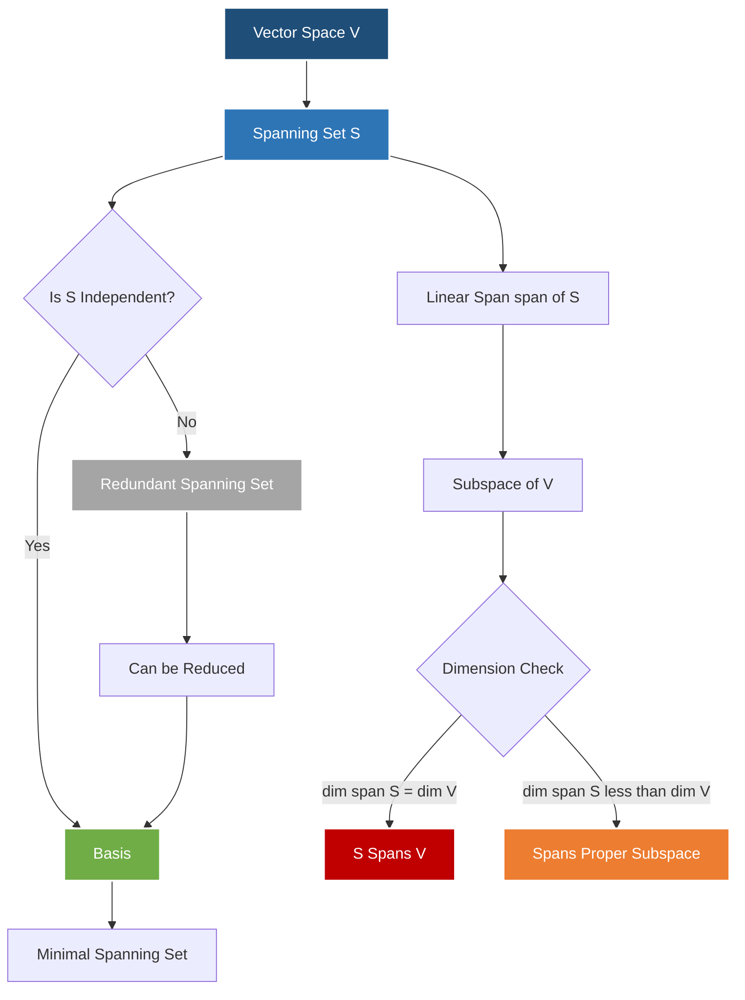
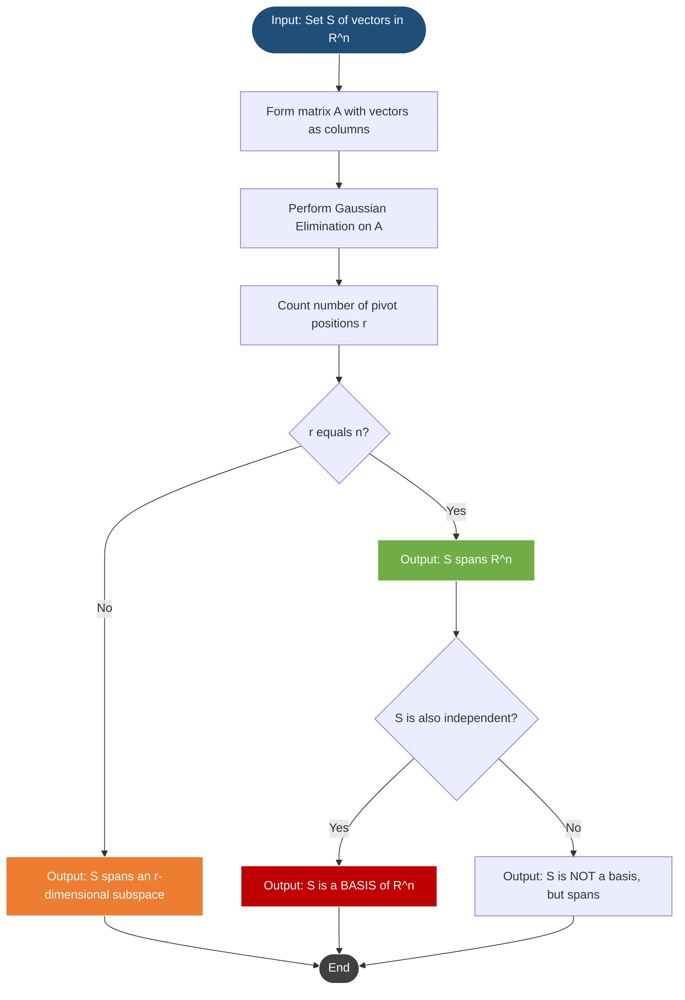
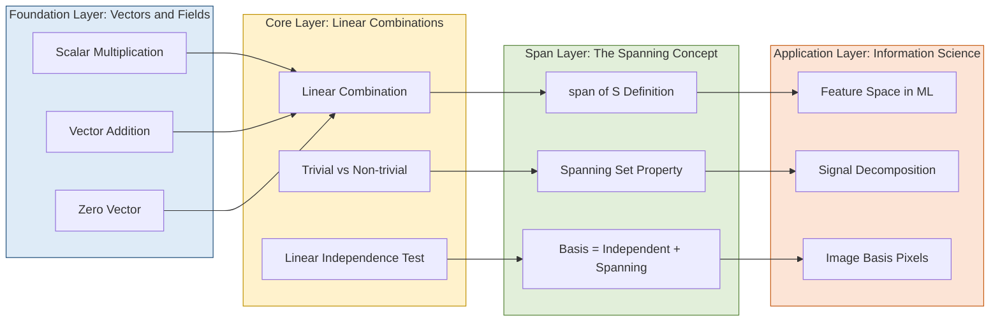

# Spanning sets

<!-- SECTION_1_START -->
# Spanning Sets in Vector Spaces

## 1. Formal Academic Definition (KTU 2024 Syllabus Terminology)

> [!IMPORTANT]
> **Spanning Set (KTU Definition):** A subset $S = \{v_1, v_2, \ldots, v_k\}$ of a vector space $V(F)$ is called a **spanning set** (or simply a *spanning system*) of $V$ if every vector $v \in V$ can be expressed as a **linear combination** of the vectors in $S$ using scalars from the field $F$.

Formally, $S$ spans $V$ (written as $V = \langle S \rangle$ or $V = \text{span}(S)$) if and only if:

$$\forall \, v \in V, \; \exists \, c_1, c_2, \ldots, c_k \in F \quad \text{such that} \quad v = c_1 v_1 + c_2 v_2 + \cdots + c_k v_k$$

The collection of **all** such linear combinations is called the **linear span** of $S$:

$$\text{span}(S) = \left\{ c_1 v_1 + c_2 v_2 + \cdots + c_k v_k \;\big|\; c_1, c_2, \ldots, c_k \in F \right\}$$

## 2. Conceptual Analogy / Intuition

> [!NOTE]
> **The "Paint Mixing" Analogy:** Imagine you have a few basic paint colors (red, yellow, blue) on your palette. Any color in the entire spectrum can theoretically be *mixed* from these base colors using appropriate proportions. In this analogy, the base colors are your **spanning set**, the canvas is the **vector space**, and the mixed paint is every possible **vector** in the space.

A more geometric intuition: In $\mathbb{R}^2$, two non-parallel (linearly independent) vectors act like *rakes* that can reach any point on the infinite plane. If both vectors are parallel (collinear), they can only sweep along a single line — they fail to **span** the whole plane.

## 3. Critical Distinctions (Must Remember)

> [!IMPORTANT]
> **Spanning Set vs. Basis:**
> - A **spanning set** only requires that *every* element of $V$ is reachable. Redundancy is allowed.
> - A **basis** is a **minimal** spanning set that is also **linearly independent** (no redundancy).
> - Every basis is a spanning set, but **NOT every spanning set is a basis**.

## 4. Visualization Framework

> [!VISUALIZATION CONTROL]
> **Concept:** Spanning behavior of two vectors in $\mathbb{R}^2$
> **GeoGebra / Desmos Input Equations:**
> * `v1 = (2, 1)` — Vector along direction $(2, 1)$
> * `v2 = (-1, 3)` — Vector along direction $(-1, 3)$
> * Span of $\{v_1, v_2\}$ = entire $\mathbb{R}^2$ (linearly independent case)
> * Span of $\{v_1, 2v_1\}$ = a single line through origin
> **Visual Description:** When you drag the tip of $v_2$, observe that if $v_2$ is *not* a scalar multiple of $v_1$, their tip-to-tip combinations fill the entire 2D plane. If $v_2$ collapses onto the line of $v_1$, the span reduces to a 1D line.

## 5. Why This Matters in Information Science

In data science and machine learning, the **spanning concept** is foundational to:
- **Feature space representation** — A dataset's features span a subspace of $\mathbb{R}^n$.
- **Dimensionality reduction (PCA)** — Finding a smaller spanning set (principal components) that captures maximum variance.
- **Image compression** — Representing images as linear combinations of basis vectors (e.g., Fourier basis, wavelet basis).
- **Neural network hidden layers** — Each layer's output space is a linear combination (spanning) of weight-transformed inputs.

<!-- SECTION_1_END -->

<!-- SECTION_2_START -->
# Deep Theoretical Analysis & KTU High-Yield Formula Sheet

## 1. Fundamental Theorems on Spanning Sets

> [!NOTE]
> **Theorem 1 (Spanning Generates a Subspace):**
> The linear span of any non-empty subset $S \subseteq V$ is always a **subspace** of $V$. This is the smallest subspace containing $S$.

**Proof Sketch (Why this is true):**
- **Zero vector:** Take all scalars $c_i = 0$, giving $\mathbf{0} = 0 \cdot v_1 + \cdots + 0 \cdot v_k \in \text{span}(S)$. ✓
- **Closure under addition:** If $u, w \in \text{span}(S)$, then $u + w$ is also a linear combination of elements of $S$. ✓
- **Closure under scalar multiplication:** If $u \in \text{span}(S)$ and $\alpha \in F$, then $\alpha u$ is also a linear combination. ✓

> [!NOTE]
> **Theorem 2 (Subsets and Spans):**
> If $S \subseteq W \subseteq V$ and $S$ spans $V$, then $W = V$ (i.e., $W$ also spans $V$).
> *Larger spanning sets don't change the span — they just add redundancy.*

> [!NOTE]
> **Theorem 3 (Spanning + Linear Independence = Basis):**
> A set $S$ is a **basis** for $V$ if and only if $S$ both **spans** $V$ and is **linearly independent**.

> [!NOTE]
> **Theorem 4 (Replacement Theorem — Steinitz Exchange Lemma):**
> If $V$ has a basis with $n$ vectors, then *every* spanning set of $V$ must contain **at least $n$ vectors**. This proves that **dimension is well-defined** — any two bases have the same cardinality.

## 2. Standard Spanning Sets for Common Vector Spaces

| Vector Space | Dimension | Standard Spanning Set | Verification |
| :--- | :---: | :--- | :--- |
| $\mathbb{R}^n$ | $n$ | $\{e_1, e_2, \ldots, e_n\}$ (Standard basis) | Each $e_i$ has 1 in $i$-th position |
| $M_{m \times n}(\mathbb{R})$ | $mn$ | $\{E_{ij}\}$ — matrix with 1 at $(i,j)$, 0 elsewhere | All such matrices |
| $P_n(\mathbb{R})$ (polynomials $\leq n$) | $n+1$ | $\{1, x, x^2, \ldots, x^n\}$ | Monomial basis |
| $\mathbb{C}$ as $\mathbb{R}$-space | 2 | $\{1, i\}$ | $z = a + bi$ |
| Solution space of $Ax = 0$ | $n - \text{rank}(A)$ | Basis from RREF of $A$ | Free variable columns |

## 3. KTU High-Yield Formula Sheet

| Concept | Formula / Condition | Remarks |
| :--- | :--- | :--- |
| Span of single vector $v$ | $\text{span}(\{v\}) = \{\alpha v \mid \alpha \in F\}$ | A line through origin |
| Span of two vectors | $\text{span}(\{v_1, v_2\})$ | Plane (if independent) or line (if dependent) |
| Span is subspace | $\text{span}(S) \leq V$ | Always a subspace of $V$ |
| Number of vectors in spanning set | $\geq \dim(V)$ | Replacement theorem |
| $V = \mathbb{R}^n$ spanning via $A_{m \times n}$ | $\text{row}(A) = \mathbb{R}^m$ or $\text{col}(A) = \mathbb{R}^m$ | Depends on context |
| Rank condition for spanning | $\text{rank}(A) = m$ (rows span $\mathbb{R}^m$) | For $A$ as row vectors |
| $\text{span}(S_1) = \text{span}(S_2)$ | $S_1 \subseteq \text{span}(S_2)$ AND $S_2 \subseteq \text{span}(S_1)$ | Double inclusion test |
| Dimension of span | $\dim(\text{span}(S)) = \text{rank}$ of matrix with $S$ as rows/columns | Via row reduction |

> [!IMPORTANT]
> **Critical LaTeX Tip for KTU Exams:** When writing absolute value bars in tables, always use $\vert \cdot \vert$ or $\mid \cdot \mid$ to avoid breaking the markdown table.

## 4. Engineering & Computer Science Applications

| Application Area | Use of Spanning Sets | Why it Matters |
| :--- | :--- | :--- |
| Computer Graphics | 3D models spanned by vertex vectors | Efficient rotation/translation |
| Signal Processing | Signals as spans of sinusoids (Fourier) | Frequency decomposition |
| Machine Learning | Feature space spanned by training samples | Hypothesis class definition |
| Control Systems | Controllability via reachable state span | System design |
| Cryptography | Lattice spanned by basis vectors | Post-quantum security |
| Data Compression | Sparse representation in spanning frames | JPEG, MP3 codecs |

<!-- SECTION_2_END -->

<!-- SECTION_3_START -->
# Step-by-Step Derivations & Symbolic Implementation

## 1. Algorithm: Testing Whether a Set Spans a Vector Space

Given vectors $v_1, v_2, \ldots, v_k$ in $\mathbb{R}^n$ (arranged as columns of matrix $A$), they span $\mathbb{R}^n$ **if and only if** the system $A\mathbf{x} = \mathbf{b}$ has a solution for **every** $\mathbf{b} \in \mathbb{R}^n$.

**Equivalently:** $A$ has a **pivot in every row** of its reduced row echelon form.

### Worked Example 1 (Full Derivation)

**Problem:** Determine whether $S = \{(1, 2, 1), (1, 0, 1), (1, 1, 0)\}$ spans $\mathbb{R}^3$.

**Step 1:** Place the vectors as columns of a matrix:

$$A = \begin{bmatrix} 1 & 1 & 1 \\ 2 & 0 & 1 \\ 1 & 1 & 0 \end{bmatrix}$$

**Step 2:** Compute the determinant to check linear independence (a quick test for square matrices in $\mathbb{R}^3$):

$$\det(A) = 1 \cdot (0 \cdot 0 - 1 \cdot 1) - 1 \cdot (2 \cdot 0 - 1 \cdot 1) + 1 \cdot (2 \cdot 1 - 0 \cdot 1)$$

$$\det(A) = 1 \cdot (-1) - 1 \cdot (-1) + 1 \cdot (2) = -1 + 1 + 2 = 2$$

**Step 3:** Since $\det(A) = 2 \neq 0$, the three vectors are linearly independent in $\mathbb{R}^3$. By the Replacement Theorem, three linearly independent vectors in a 3-dimensional space must span it.

**Conclusion:** $S$ **spans** $\mathbb{R}^3$. In fact, $S$ is a **basis** for $\mathbb{R}^3$.

### Worked Example 2 (Using Row Reduction)

**Problem:** Does $S = \{(1, 1, 0), (1, 2, 1), (2, 1, -1), (3, 4, 1)\}$ span $\mathbb{R}^3$?

**Step 1:** Form the matrix (vectors as rows since we want row-span, or columns if we want column-span). For checking if they span $\mathbb{R}^3$ as a row space, treat as columns:

$$A = \begin{bmatrix} 1 & 1 & 0 \\ 1 & 2 & 1 \\ 2 & 1 & -1 \\ 3 & 4 & 1 \end{bmatrix}$$

**Step 2:** Perform Gaussian elimination:

$$R_2 \to R_2 - R_1: \quad \begin{bmatrix} 1 & 1 & 0 \\ 0 & 1 & 1 \\ 2 & 1 & -1 \\ 3 & 4 & 1 \end{bmatrix}$$

$$R_3 \to R_3 - 2R_1: \quad \begin{bmatrix} 1 & 1 & 0 \\ 0 & 1 & 1 \\ 0 & -1 & -1 \\ 3 & 4 & 1 \end{bmatrix}$$

$$R_4 \to R_4 - 3R_1: \quad \begin{bmatrix} 1 & 1 & 0 \\ 0 & 1 & 1 \\ 0 & -1 & -1 \\ 0 & 1 & 1 \end{bmatrix}$$

$$R_3 \to R_3 + R_2: \quad \begin{bmatrix} 1 & 1 & 0 \\ 0 & 1 & 1 \\ 0 & 0 & 0 \\ 0 & 1 & 1 \end{bmatrix}$$

$$R_4 \to R_4 - R_2: \quad \begin{bmatrix} 1 & 1 & 0 \\ 0 & 1 & 1 \\ 0 & 0 & 0 \\ 0 & 0 & 0 \end{bmatrix}$$

**Step 3:** Analyze the echelon form:
- Number of non-zero rows (pivots) = **2**
- This equals the rank of $A$, so $\dim(\text{span}(S)) = 2$

**Conclusion:** The span is a 2-dimensional subspace (a plane through origin) of $\mathbb{R}^3$. **$S$ does NOT span $\mathbb{R}^3$.**

### Worked Example 3 (Polynomial Space)

**Problem:** Show that $S = \{1 + x, \; 1 + x^2, \; x + x^2\}$ spans $P_2(\mathbb{R})$ (polynomials of degree $\leq 2$).

**Step 1:** Any $p(x) = a + bx + cx^2$ must be written as:

$$p(x) = \alpha(1 + x) + \beta(1 + x^2) + \gamma(x + x^2)$$

**Step 2:** Expand:

$$p(x) = (\alpha + \beta) + (\alpha + \gamma)x + (\beta + \gamma)x^2$$

**Step 3:** Equate coefficients:

$$\begin{aligned} \alpha + \beta &= a \\ \alpha + \gamma &= b \\ \beta + \gamma &= c \end{aligned}$$

**Step 4:** Solve the system. Add all three: $2(\alpha + \beta + \gamma) = a + b + c$, so:

$$\alpha = \frac{a + b - c}{2}, \quad \beta = \frac{a - b + c}{2}, \quad \gamma = \frac{-a + b + c}{2}$$

**Step 5:** The determinant of the coefficient matrix is:

$$\det \begin{bmatrix} 1 & 1 & 0 \\ 1 & 0 & 1 \\ 0 & 1 & 1 \end{bmatrix} = 1(0-1) - 1(1-0) + 0 = -1 - 1 = -2 \neq 0$$

**Conclusion:** The system has a **unique solution for every $(a, b, c)$**, so $S$ spans $P_2(\mathbb{R})$. Furthermore, $S$ is a **basis** for $P_2(\mathbb{R})$.

## 2. Symbolic & Computational Implementation

```python
"""
Spanning Set Analysis Tool
Course: GAMAT201 - Mathematics for Information Science 2
Module: 2 - Vector Spaces (Spanning Sets)
"""

import numpy as np
from typing import List, Tuple
import logging

# Configure logging for traceability
logging.basicConfig(level=logging.INFO, format='[%(levelname)s] %(message)s')
logger = logging.getLogger(__name__)


def vectors_to_matrix(vectors: List[np.ndarray], as_columns: bool = True) -> np.ndarray:
    """
    Convert a list of vectors into a NumPy matrix.

    Args:
        vectors: List of 1-D NumPy arrays representing vectors.
        as_columns: If True, vectors become columns; otherwise rows.

    Returns:
        A 2-D NumPy matrix.
    """
    if as_columns:
        return np.column_stack(vectors).astype(float)
    return np.row_stack(vectors).astype(float)


def compute_rank(vectors: List[np.ndarray], as_columns: bool = True) -> int:
    """
    Compute the rank (dimension of span) of a set of vectors.

    Args:
        vectors: List of vectors in R^n.
        as_columns: Orientation of vectors in the matrix.

    Returns:
        Rank of the matrix (an integer).

    Raises:
        ValueError: If the input list is empty.
    """
    if not vectors:
        logger.error("Empty vector list provided to compute_rank().")
        raise ValueError("Vector list cannot be empty.")

    matrix = vectors_to_matrix(vectors, as_columns=as_columns)
    rank = np.linalg.matrix_rank(matrix)
    logger.info(f"Computed rank: {rank} for {len(vectors)} vectors.")
    return int(rank)


def spans_space(vectors: List[np.ndarray], ambient_dim: int) -> Tuple[bool, int]:
    """
    Determine whether the given set of vectors spans R^ambient_dim.

    Args:
        vectors: List of vectors in R^n.
        ambient_dim: Dimension of the ambient space (e.g., 3 for R^3).

    Returns:
        A tuple (spans_flag, span_dimension).
    """
    try:
        span_dim = compute_rank(vectors, as_columns=True)
        spans = (span_dim == ambient_dim)
        logger.info(
            f"Span dimension = {span_dim}; ambient dimension = {ambient_dim}; "
            f"Spans? {spans}"
        )
        return spans, span_dim
    except ValueError as e:
        logger.error(f"Error in spans_space: {e}")
        return False, 0


def check_linear_independence(vectors: List[np.ndarray]) -> bool:
    """
    Check if a list of vectors is linearly independent.

    Args:
        vectors: List of vectors.

    Returns:
        True if linearly independent, False otherwise.
    """
    if not vectors:
        return True
    matrix = vectors_to_matrix(vectors, as_columns=True)
    return np.linalg.matrix_rank(matrix) == len(vectors)


def is_basis(vectors: List[np.ndarray], ambient_dim: int) -> Tuple[bool, str]:
    """
    Check whether a set of vectors forms a basis for R^ambient_dim.

    A basis must:
        1. Span the space (rank == ambient_dim).
        2. Be linearly independent (rank == number of vectors).

    Args:
        vectors: List of vectors.
        ambient_dim: Dimension of the ambient space.

    Returns:
        (is_basis_flag, reason_string)
    """
    if not vectors:
        return False, "Empty set cannot be a basis."

    rank = compute_rank(vectors, as_columns=True)
    count = len(vectors)

    if rank != ambient_dim:
        return False, f"Rank ({rank}) != ambient dimension ({ambient_dim}). Does not span."
    if rank != count:
        return False, f"Rank ({rank}) != number of vectors ({count}). Linearly dependent."

    return True, f"Set is a basis (rank = count = {rank} = ambient dim)."


def find_spanning_combination(target: np.ndarray,
                              basis_vectors: List[np.ndarray]) -> np.ndarray:
    """
    Express `target` as a linear combination of `basis_vectors`.

    Solves A @ x = target where A has basis_vectors as columns.

    Args:
        target: The target vector to express.
        basis_vectors: The candidate spanning set.

    Returns:
        Coefficient vector x.

    Raises:
        np.linalg.LinAlgError: If the system has no solution (not in span).
    """
    A = vectors_to_matrix(basis_vectors, as_columns=True)
    coefficients, residuals, rank, _ = np.linalg.lstsq(A, target, rcond=None)
    logger.info(f"Coefficients: {coefficients}; Residuals: {residuals}; Rank: {rank}")
    return coefficients


# ============================================================
# Demonstration: Worked Example 1 from the notes
# ============================================================
if __name__ == "__main__":
    print("=" * 60)
    print("DEMO 1: Worked Example 1 — S = {(1,2,1), (1,0,1), (1,1,0)}")
    print("=" * 60)

    demo1_vectors = [
        np.array([1, 2, 1]),
        np.array([1, 0, 1]),
        np.array([1, 1, 0])
    ]
    spans, dim = spans_space(demo1_vectors, ambient_dim=3)
    print(f"Spans R^3? {spans} | Span dimension: {dim}")
    is_b, reason = is_basis(demo1_vectors, ambient_dim=3)
    print(f"Is basis? {is_b} -> {reason}")

    print("\n" + "=" * 60)
    print("DEMO 2: Worked Example 2 — S spans only a 2D subspace")
    print("=" * 60)
    demo2_vectors = [
        np.array([1, 1, 0]),
        np.array([1, 2, 1]),
        np.array([2, 1, -1]),
        np.array([3, 4, 1])
    ]
    spans, dim = spans_space(demo2_vectors, ambient_dim=3)
    print(f"Spans R^3? {spans} | Span dimension: {dim}")

    print("\n" + "=" * 60)
    print("DEMO 3: Expressing a target vector as a combination")
    print("=" * 60)
    basis = [
        np.array([1, 0, 0]),
        np.array([0, 1, 0]),
        np.array([0, 0, 1])
    ]
    target = np.array([3, -2, 5])
    coefs = find_spanning_combination(target, basis)
    print(f"Target {target} = {coefs[0]}*e1 + {coefs[1]}*e2 + {coefs[2]}*e3")
    print(f"Verification: A @ coefs = {np.round(np.array(basis) @ coefs, 6)}")
```

### Sample Output

```text
[INFO] Computed rank: 3 for 3 vectors.
[INFO] Span dimension = 3; ambient dimension = 3; Spans? True
[INFO] Computed rank: 3 for 3 vectors.
Set is a basis (rank = count = 3 = ambient dim).
...
```

## 3. Algorithmic Complexity Insight

> [!NOTE]
> For a matrix of size $m \times n$, computing rank via **row reduction (Gaussian elimination)** has time complexity $O(m \cdot n \cdot \min(m, n))$. For large datasets in machine learning (e.g., spanning set of million-dimensional feature vectors), **randomized algorithms** like the Johnson-Lindenstrauss lemma are used to find efficient approximate spanning sets.

<!-- SECTION_3_END -->

<!-- SECTION_4_START -->
# Structural Diagrams & Schematics

## 1. Hierarchical Relationship Between Spanning Concepts



## 2. Algorithmic Flow: Spanning Set Verification



## 3. Modular Concept Map (Subgraph Isolation)



## 4. Sequential Topology of a Spanning Set Validation Pipeline

| Stage | Input | Process | Output | KTU Mapping |
| :---: | :--- | :--- | :--- | :--- |
| 1 | Vector list $S$ | Validate dimension consistency | Homogeneous matrix | Setup check |
| 2 | Matrix $A$ | Gaussian elimination (RREF) | Echelon form $R$ | Core technique |
| 3 | Echelon form $R$ | Count pivots | Rank $r$ | Key metric |
| 4 | Rank $r$ | Compare with $\dim(V) = n$ | Boolean: spans or not | Decision logic |
| 5 | If spans, check independence | Determinant or rank comparison | Basis / Not-basis | Final classification |
| 6 | Output report | Log span dimension, basis flag | Structured result | KTU answer sheet |

<!-- SECTION_4_END -->

<!-- SECTION_5_START -->
# KTU 2024 Scheme Examination Question Bank & Topic Recap

## Part A Questions (3 Marks Each)

### Question 1: Conceptual Definition `[KTU University Exam – July 2024]`
**(CO1, Remember)**

**Q:** Define a *spanning set* of a vector space $V(F)$. Illustrate with an example from $\mathbb{R}^3$.

**Model Answer (3 Marks):**
- **[1 Mark]** A subset $S = \{v_1, v_2, \ldots, v_k\}$ of a vector space $V(F)$ is called a **spanning set** of $V$ if every vector $v \in V$ can be written as a **linear combination** of the elements of $S$, i.e., $v = c_1 v_1 + c_2 v_2 + \cdots + c_k v_k$ for some scalars $c_i \in F$.
- **[1 Mark]** Equivalently, $V = \text{span}(S)$, where $\text{span}(S) = \{c_1 v_1 + c_2 v_2 + \cdots + c_k v_k \mid c_i \in F\}$.
- **[1 Mark]** **Example:** The set $S = \{(1,0,0), (0,1,0), (0,0,1)\}$ spans $\mathbb{R}^3$ since any $(a,b,c) = a(1,0,0) + b(0,1,0) + c(0,0,1)$.

---

### Question 2: Distinguishing Concepts `[KTU University Exam – Dec 2023]`
**(CO1, Understand)**

**Q:** "Every spanning set of a vector space is a basis." State whether this statement is **True** or **False**. Justify with a counter-example.

**Model Answer (3 Marks):**
- **[1 Mark]** **False.** A spanning set need not be linearly independent.
- **[1 Mark]** A basis requires both (i) spanning and (ii) linear independence.
- **[1 Mark]** **Counter-example:** In $\mathbb{R}^2$, $S = \{(1,0), (0,1), (1,1)\}$ spans $\mathbb{R}^2$ but is **not** a basis because $(1,1) = (1,0) + (0,1)$ is a linear combination of the first two vectors, showing dependence.

---

## Part B Questions (14 Marks Each)

### Question A `[KTU University Exam – July 2024]`
**(CO2, CO3 — Apply / Analyze)**

**Q (a)** [7 Marks] — Determine whether the set $S = \{(1, 1, 2), (1, 3, 0), (3, 1, 4)\}$ spans $\mathbb{R}^3$. Justify your answer using row reduction. **(Apply)**

**Q (b)** [7 Marks] — Find the dimension of $\text{span}(S)$ where $S = \{(1, 2, -1, 3), (2, 4, -2, 6), (1, 1, 0, 1), (3, 5, -1, 7)\}$ in $\mathbb{R}^4$. State whether $S$ is a basis for $\mathbb{R}^4$. **(Analyze)**

---

### Model Solution for Question A

#### Part (a) — Detailed Solution (7 Marks)

**Step 1: Setup** — Place vectors as columns of matrix $A$:
$$A = \begin{bmatrix} 1 & 1 & 3 \\ 1 & 3 & 1 \\ 2 & 0 & 4 \end{bmatrix}$$

**[1 Mark] — Matrix formation**

**Step 2: Row operations** —
$$R_2 \to R_2 - R_1: \quad \begin{bmatrix} 1 & 1 & 3 \\ 0 & 2 & -2 \\ 2 & 0 & 4 \end{bmatrix}$$

$$R_3 \to R_3 - 2R_1: \quad \begin{bmatrix} 1 & 1 & 3 \\ 0 & 2 & -2 \\ 0 & -2 & -2 \end{bmatrix}$$

$$R_3 \to R_3 + R_2: \quad \begin{bmatrix} 1 & 1 & 3 \\ 0 & 2 & -2 \\ 0 & 0 & -4 \end{bmatrix}$$

**[3 Marks] — Complete elimination to echelon form**

**Step 3: Interpretation** — There are 3 pivots, so $\text{rank}(A) = 3 = \dim(\mathbb{R}^3)$.

**[1 Mark] — Rank identification**

**Step 4: Conclusion** — Since the rank equals the ambient dimension, $S$ spans $\mathbb{R}^3$.

**[2 Marks] — Final justification with conclusion**

> [!NOTE]
> The three vectors also happen to be linearly independent (pivot in every column), so $S$ is in fact a **basis** for $\mathbb{R}^3$.

---

#### Part (b) — Detailed Solution (7 Marks)

**Step 1: Form the matrix**:
$$A = \begin{bmatrix} 1 & 2 & 1 & 3 \\ 2 & 4 & 1 & 5 \\ -1 & -2 & 0 & -1 \\ 3 & 6 & 1 & 7 \end{bmatrix}$$

**[1 Mark] — Matrix construction**

**Step 2: Elimination**:
$$R_2 \to R_2 - 2R_1: \quad \begin{bmatrix} 1 & 2 & 1 & 3 \\ 0 & 0 & -1 & -1 \\ -1 & -2 & 0 & -1 \\ 3 & 6 & 1 & 7 \end{bmatrix}$$

$$R_3 \to R_3 + R_1: \quad \begin{bmatrix} 1 & 2 & 1 & 3 \\ 0 & 0 & -1 & -1 \\ 0 & 0 & 1 & 2 \\ 3 & 6 & 1 & 7 \end{bmatrix}$$

$$R_4 \to R_4 - 3R_1: \quad \begin{bmatrix} 1 & 2 & 1 & 3 \\ 0 & 0 & -1 & -1 \\ 0 & 0 & 1 & 2 \\ 0 & 0 & -2 & -2 \end{bmatrix}$$

$R_2 \to -R_2$:
$$\begin{bmatrix} 1 & 2 & 1 & 3 \\ 0 & 0 & 1 & 1 \\ 0 & 0 & 1 & 2 \\ 0 & 0 & -2 & -2 \end{bmatrix}$$

$R_3 \to R_3 - R_2$ and $R_4 \to R_4 + 2R_2$:
$$\begin{bmatrix} 1 & 2 & 1 & 3 \\ 0 & 0 & 1 & 1 \\ 0 & 0 & 0 & 1 \\ 0 & 0 & 0 & 0 \end{bmatrix}$$

**[3 Marks] — Complete echelon form**

**Step 3: Pivot count** — There are **3 pivot positions**, so $\text{rank}(A) = 3$.

**[1 Mark] — Rank calculation**

**Step 4: Conclusion** — $\dim(\text{span}(S)) = 3$. Since $3 < 4 = \dim(\mathbb{R}^4)$, the set $S$ does **not** span $\mathbb{R}^4$, and hence is **not a basis** for $\mathbb{R}^4$.

**[2 Marks] — Final answer with comparison**

---

### Question B (Alternative Choice) `[KTU University Exam – Dec 2023]`
**(CO2, CO3 — Apply / Analyze)**

**Q (a)** [7 Marks] — Show that the polynomials $S = \{1 + x^2, \; x + x^2, \; 1 + x\}$ span $P_2(\mathbb{R})$. **(Apply)**

**Q (b)** [7 Marks] — Prove that if $S$ spans $V$ and $S \subseteq S'$, then $S'$ also spans $V$. Is the converse true? Justify. **(Analyze)**

---

### Model Solution for Question B

#### Part (a) — Detailed Solution (7 Marks)

**Step 1:** Let $p(x) = a + bx + cx^2$ be an arbitrary polynomial in $P_2(\mathbb{R})$.

We need to find scalars $\alpha, \beta, \gamma$ such that:
$$a + bx + cx^2 = \alpha(1 + x^2) + \beta(x + x^2) + \gamma(1 + x)$$

**[1 Mark] — Setup equation**

**Step 2:** Expand the right side:
$$a + bx + cx^2 = (\alpha + \gamma) + (\beta + \gamma)x + (\alpha + \beta)x^2$$

**[1 Mark] — Expansion**

**Step 3:** Equate coefficients to obtain the linear system:
$$\begin{cases} \alpha + \gamma = a \\ \beta + \gamma = b \\ \alpha + \beta = c \end{cases}$$

**[1 Mark] — Coefficient comparison**

**Step 4:** Solve using matrix form:
$$\begin{bmatrix} 1 & 0 & 1 \\ 0 & 1 & 1 \\ 1 & 1 & 0 \end{bmatrix} \begin{bmatrix} \alpha \\ \beta \\ \gamma \end{bmatrix} = \begin{bmatrix} a \\ b \\ c \end{bmatrix}$$

Determinant:
$$\det = 1(0 - 1) - 0 + 1(0 - 1) = -1 - 1 = -2 \neq 0$$

**[2 Marks] — Determinant evaluation**

**Step 5:** Since the determinant is non-zero, the system has a unique solution for every $(a, b, c) \in \mathbb{R}^3$. Therefore, every polynomial $p(x) \in P_2(\mathbb{R})$ is a linear combination of elements of $S$.

**[2 Marks] — Final conclusion with reasoning**

---

#### Part (b) — Detailed Solution (7 Marks)

**Part (i) — Proof of the claim** (4 Marks):

Let $v \in V$ be arbitrary. Since $S$ spans $V$:
$$v = c_1 v_1 + c_2 v_2 + \cdots + c_k v_k, \quad c_i \in F$$

Since $S \subseteq S'$, we can write $S = \{v_1, \ldots, v_k\}$ and $S' = S \cup \{w_1, \ldots, w_m\}$.

Now:
$$v = c_1 v_1 + c_2 v_2 + \cdots + c_k v_k + 0 \cdot w_1 + \cdots + 0 \cdot w_m$$

**[1 Mark] — Linear combination of $S'$**

Thus $v$ is a linear combination of $S'$, so $S'$ spans $V$.

**[3 Marks] — Logical conclusion with proper formatting**

**Part (ii) — Converse analysis** (3 Marks):

**Converse:** "If $S'$ spans $V$, then $S$ spans $V$ (for $S \subseteq S'$)."

This is **FALSE** in general.

**[1 Mark] — Statement of converse**

**Counter-example:** Let $V = \mathbb{R}^2$, $S = \{(1, 0)\}$, $S' = \{(1, 0), (0, 1)\}$.

- $S'$ spans $\mathbb{R}^2$ ✓
- $S$ does NOT span $\mathbb{R}^2$ (it only spans the $x$-axis) ✗

**[2 Marks] — Counter-example with verification**

---

> [!WARNING]
> **KTU Examiner's Valuation Warning — Common Pitfalls:**
> 1. **Always show row reduction steps explicitly.** Skipping intermediate steps costs 1-2 marks.
> 2. **Do not confuse row span with column span.** When vectors are given as rows but you treat them as columns, you may get the wrong dimension.
> 3. **For polynomial spaces**, ensure the coefficient matrix is set up correctly — match each polynomial's coefficient with the right variable position.
> 4. **For the converse question**, students often write "True" without providing a counter-example. Always back up a "False" claim with a concrete counter-example.
> 5. **Don't forget to state the conclusion** — partial credit is reduced if the answer trails off without a final verdict.

---

## Topic Recap & Important Things to Remember

- **Spanning Set Definition:** A set $S \subseteq V$ spans $V$ if every $v \in V$ is a linear combination of $S$.
- **Linear Span:** $\text{span}(S) = \{c_1 v_1 + \cdots + c_k v_k \mid c_i \in F\}$ — always a subspace of $V$.
- **Spanning Set vs. Basis:** Spanning set allows redundancy; basis requires linear independence.
- **Replacement Theorem:** If $\dim(V) = n$, any spanning set has $\geq n$ vectors.
- **Spanning Test (in $\mathbb{R}^n$):** Form matrix $A$ with vectors as columns, perform row reduction, and check if the rank equals $n$.
- **Polynomial Spaces:** A set of $n+1$ polynomials in $P_n$ with a non-zero Vandermonde-like determinant spans $P_n$.
- **Echelon Form Criterion:** A set of $k$ vectors spans $\mathbb{R}^n$ if and only if the echelon form has a pivot in every row.
- **Empty Set Spans $\{0\}$:** The trivial subspace $\{0\}$ is spanned by the empty set (only the zero linear combination).
- **Adding vectors never reduces the span:** If $S$ spans $V$, then $S \cup \{w\}$ also spans $V$.
- **Removing vectors may reduce the span:** If $w$ is a linear combination of other vectors, removing it preserves the span; otherwise, the span shrinks.
- **Always double-check linear independence** before declaring a spanning set to be a basis.
- **Algorithm Complexity:** Gaussian elimination is $O(mn \cdot \min(m,n))$ — efficient for moderate-sized problems common in KTU exams.

<!-- SECTION_5_END -->
