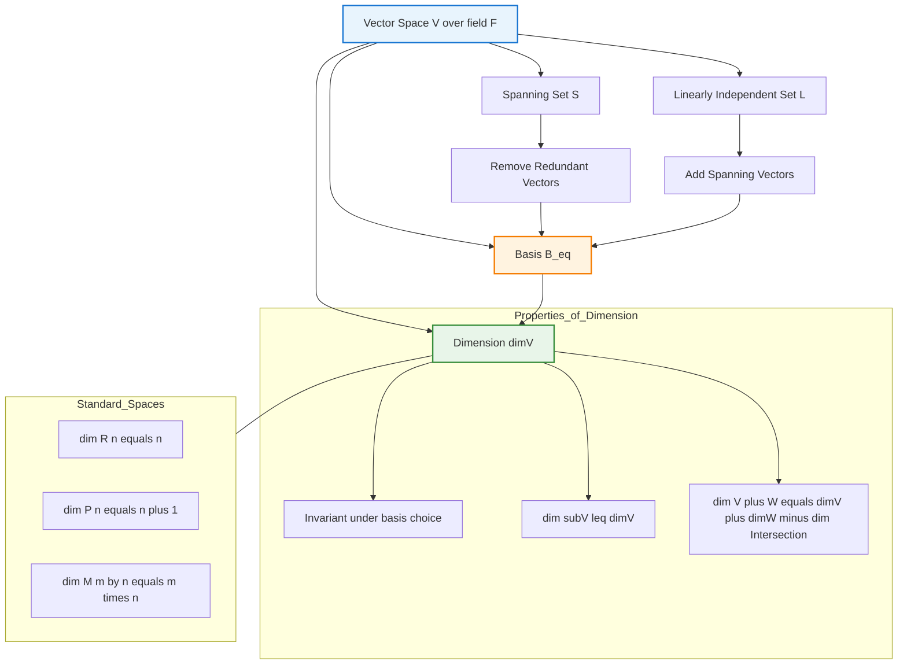
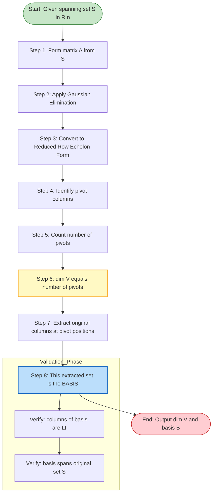
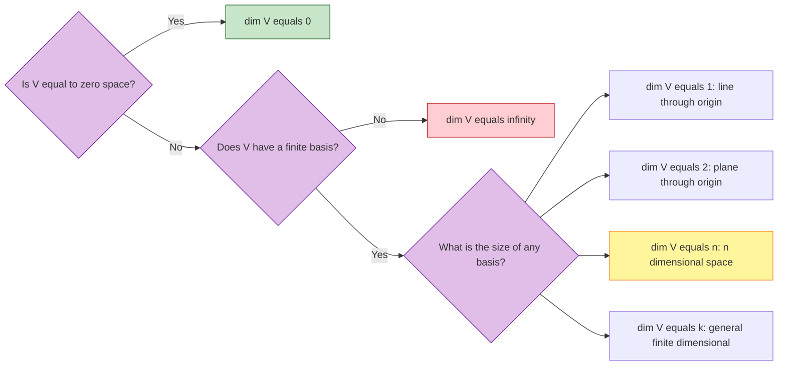
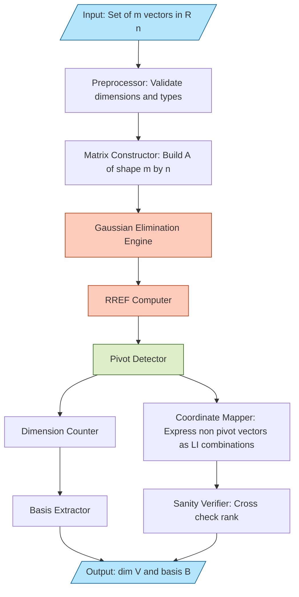

# The dimension of vector space

<!-- SECTION_1_START -->

# The Dimension of a Vector Space

## 1.1 Formal KTU 2024 Definition

Let $V$ be a vector space defined over a field $F$ (where $F$ is typically $\mathbb{R}$ or $\mathbb{C}$ for KTU Information Science applications). A set of vectors $B = \{v_1, v_2, v_3, \ldots, v_n\} \subseteq V$ is called a **basis** of $V$ if and only if it satisfies two simultaneous conditions:

1. **Linear Independence:** The vectors in $B$ are linearly independent.
2. **Spanning Property:** The set $B$ spans the entire vector space $V$, i.e., $\text{span}(B) = V$.

> [!IMPORTANT]
> **Definition (Dimension of a Vector Space):**
> The **dimension** of a vector space $V$ over a field $F$, denoted by $\dim(V)$ (or $\dim_F V$), is defined as the number of vectors contained in any basis of $V$.
>
> Formally, if $B = \{v_1, v_2, \ldots, v_n\}$ is a basis of $V$, then:
> $$\dim(V) = n = \vert B \vert$$

If no finite basis exists for $V$, the vector space is said to be **infinite-dimensional**. For the scope of the GAMAT201 syllabus, we will focus primarily on **finite-dimensional vector spaces**.

> [!NOTE]
> **Syllabus Highlight (GAMAT201 – Module 2):** Students are expected to compute the dimension of standard vector spaces ($\mathbb{R}^n$, $\mathbb{P}_n$, $M_{m \times n}$), determine the dimension of subspaces via row-reduced echelon forms, and apply the **Dimension Theorem** (a.k.a. Rank-Nullity Theorem) for linear transformations.

---

## 1.2 Conceptual Analogy and Intuitive Overview

Imagine that you are constructing a building using only one type of standard brick. Each "brick" is a **basis vector**, and the entire building represents the **vector space**. The dimension of the space tells you the **minimum number of independent directions** you need to navigate or describe the space completely.

*   A **straight line** through the origin can be described by **one** direction vector $\Rightarrow$ **dimension = 1**.
*   A **flat plane** through the origin can be described by **two** independent direction vectors $\Rightarrow$ **dimension = 2**.
*   The **3D space** we live in requires exactly **three** independent directions (length, breadth, height) $\Rightarrow$ **dimension = 3**.
*   The space of all $n$-tuples of real numbers, $\mathbb{R}^n$, requires exactly **$n$** independent standard unit vectors $\Rightarrow$ **dimension = $n$**.

> [!TIP]
> **Geometric Intuition:** The dimension is essentially the **degrees of freedom** of the system. In data science and machine learning (a key application in Information Science), the dimension of a feature space determines the number of independent parameters required to describe a data point. High-dimensional spaces (e.g., $d > 3$) lose visual intuition but are central to algorithms like PCA (Principal Component Analysis) and SVMs.

---

## 1.3 GeoGebra / Desmos Visualization Callout

> [!VISUALIZATION CONTROL]
> **Concept:** Visualizing the Dimension of a Vector Space as a Span of Basis Vectors in $\mathbb{R}^2$ and $\mathbb{R}^3$.
>
> **GeoGebra / Desmos Input Equations:**
>
> **For $\mathbb{R}^2$ (a plane, dim = 2):**
> * `u = (1, 0)`
> * `v = (0, 1)`
> * `w = (2, -3)`  (a linear combination: $w = 2u - 3v$)
>
> **For $\mathbb{R}^3$ (3D space, dim = 3):**
> * `e1 = (1, 0, 0)`
> * `e2 = (0, 1, 0)`
> * `e3 = (0, 0, 1)`
> * `p = (1, 2, 3)`  (a linear combination: $p = 1\cdot e_1 + 2\cdot e_2 + 3\cdot e_3$)
>
> **Visual Description:** In the 2D plot, you will observe two non-collinear arrows ($u, v$) originating from the origin that span the entire plane; any third vector ($w$) is expressible as a combination of these two. In the 3D plot, three mutually perpendicular arrows ($e_1, e_2, e_3$) span the entire space, and any point $p$ is uniquely described by the triplet of scalars $(1, 2, 3)$ — these scalars are the **coordinates** of $p$ **with respect to the basis**.

---

## 1.4 Standard Examples of Dimensions

| Vector Space | Description | Standard Basis | Dimension $\dim(V)$ |
| :--- | :--- | :--- | :--- |
| $\{0\}$ | Trivial space (only the zero vector) | $\emptyset$ | **0** |
| $\mathbb{R}$ | The real number line | $\{1\}$ | **1** |
| $\mathbb{R}^2$ | The Euclidean plane | $\{(1,0),\ (0,1)\}$ | **2** |
| $\mathbb{R}^n$ | The $n$-dimensional Euclidean space | $\{e_1, e_2, \ldots, e_n\}$ | **$n$** |
| $\mathbb{C}$ (as a real VS) | Complex numbers over $\mathbb{R}$ | $\{1,\ i\}$ | **2** |
| $\mathbb{P}_n$ | Polynomials of degree $\le n$ | $\{1, x, x^2, \ldots, x^n\}$ | **$n+1$** |
| $M_{m \times n}(\mathbb{R})$ | All $m \times n$ real matrices | $E_{ij}$ matrices | **$mn$** |
| $C[a,b]$ | Continuous functions on $[a,b]$ | Infinite (e.g., Taylor basis) | **$\infty$** |

<!-- SECTION_1_END -->

<!-- SECTION_2_START -->

# Deep Theoretical Analysis & KTU High-Yield Formula Sheet

## 2.1 Fundamental Theorems on Dimension

### Theorem 2.1.1 (Uniqueness of Cardinality of a Basis)
> All bases of a finite-dimensional vector space $V$ contain the **same number of vectors**.

**Proof Outline (Standard KTU Board Pattern):**
Suppose $V$ has two bases, $B_1 = \{u_1, u_2, \ldots, u_m\}$ and $B_2 = \{v_1, v_2, \ldots, v_n\}$, with $m \neq n$. Without loss of generality, assume $m > n$. Since $B_1$ is a basis, $B_1$ spans $V$, so each $u_i$ is a linear combination of vectors in $B_2$. This implies that the set $B_1 \cup \{v_{n+1}\}$ (where $v_{n+1}$ is a "dummy" extra vector) is linearly dependent. By the **Steinitz Replacement Lemma (Exchange Lemma)**, one of the $u_i$ vectors can be replaced by $v_{n+1}$ without loss of spanning power. Repeating this exchange $m - n$ times contradicts the linear independence of $B_2$. Hence $m = n$.

> [!IMPORTANT]
> **Corollary:** The dimension of a vector space is a **well-defined invariant**; it does not depend on the particular choice of basis.

---

### Theorem 2.1.2 (Dimension of a Subspace)
> If $W$ is a subspace of a finite-dimensional vector space $V$, then:
> 1. $W$ is finite-dimensional.
> 2. $\dim(W) \le \dim(V)$.
> 3. If $\dim(W) = \dim(V)$, then $W = V$.

---

### Theorem 2.1.3 (Dimension of a Sum of Subspaces — The Grassmann Identity)
> If $U$ and $W$ are finite-dimensional subspaces of a vector space $V$, then:
> $$\dim(U + W) = \dim(U) + \dim(W) - \dim(U \cap W)$$

**Real-world Engineering Utility:** This identity is the backbone of **signal processing** and **control theory**. When two signal subspaces overlap (e.g., in a multi-antenna MIMO communication system), this formula precisely quantifies the "new information" added by combining them — crucial for rank-deficiency analysis.

---

### Theorem 2.1.4 (Extension of a Linearly Independent Set to a Basis)
> Any linearly independent set in a finite-dimensional vector space $V$ can be **extended** to form a basis of $V$.

**Practical Implication:** This guarantees that we can always find a "complete coordinate system" by adding vectors to a partially known independent set — the foundation of the **Gram-Schmidt Orthogonalization Process** in numerical linear algebra.

---

## 2.2 KTU Formula Sheet / Cheat Sheet

> [!NOTE]
> The following table summarizes **all high-yield formulas** required for KTU 2024 Scheme examinations under Module 2 of GAMAT201.

| # | Concept / Theorem | Formula / Statement | Boundary Condition |
| :--- | :--- | :--- | :--- |
| 1 | Dimension of $\mathbb{R}^n$ | $\dim(\mathbb{R}^n) = n$ | $n \ge 1$ |
| 2 | Dimension of Polynomial Space | $\dim(\mathbb{P}_n) = n + 1$ | Polynomials of degree $\le n$ |
| 3 | Dimension of Matrix Space | $\dim(M_{m \times n}) = m \cdot n$ | $m, n \ge 1$ |
| 4 | Subspace Dimension Bound | $\dim(W) \le \dim(V)$ | $W \subseteq V$ |
| 5 | Grassmann Identity (Sum) | $\dim(U + W) = \dim(U) + \dim(W) - \dim(U \cap W)$ | Finite-dim. subspaces |
| 6 | Direct Sum Condition | $U \oplus W = V \iff \dim(U) + \dim(W) = \dim(V)$ | Requires $U \cap W = \{0\}$ |
| 7 | Rank-Nullity Theorem | $\dim(V) = \text{rank}(T) + \text{nullity}(T)$ | $T : V \to W$ linear map |
| 8 | LI Set Inside a VS | Any LI set has size $\le \dim(V)$ | $V$ finite-dimensional |
| 9 | Column Space / Row Space | $\dim(\text{Col } A) = \dim(\text{Row } A) = \text{rank}(A)$ | $A$ is $m \times n$ |
| 10 | Trivial Space | $\dim(\{0\}) = 0$ | Only the zero vector |

**Engineering & Information Science Applications:**

*   **Machine Learning:** The dimension of a feature vector space determines the **VC dimension** of a hypothesis class, directly affecting model complexity and overfitting tendencies.
*   **Computer Graphics:** $\mathbb{R}^3$ (dim 3) governs 3D scene rendering; homogeneous coordinates lift this to $\mathbb{R}^4$ (dim 4) to handle translations via affine transformations.
*   **Cryptography:** Lattice-based cryptography (e.g., post-quantum NTRU) depends critically on the dimension of the underlying integer lattice $\mathbb{Z}^n$.
*   **Network Theory:** The rank of an adjacency matrix $A$ (where $\dim = \text{rank}(A)$) tells us the maximum number of linearly independent connection patterns in a network graph.

---

## 2.3 Algorithmic Procedure: Finding the Dimension of a Subspace

The standard KTU-board method to compute $\dim(W)$, where $W = \text{span}\{v_1, v_2, \ldots, v_k\} \subseteq \mathbb{R}^n$:

1.  **Form the matrix** $A$ whose rows (or columns) are the given vectors $v_1, v_2, \ldots, v_k$.
2.  **Row-reduce** $A$ to its Reduced Row Echelon Form (RREF) using **Gaussian Elimination**.
3.  **Count the number of non-zero rows** (i.e., pivot rows) in the RREF. This count is $\dim(W) = \text{rank}(A)$.
4.  The columns of $A$ corresponding to the pivot positions in the RREF form a **basis** of $W$.

> [!TIP]
> **Key Insight:** A non-pivot column in the RREF is a **linear combination** of the pivot columns. This is the algorithmic heart of expressing a vector space in terms of a minimal independent set.

<!-- SECTION_2_END -->

<!-- SECTION_3_START -->

# Step-by-Step Derivations & Symbolic Implementation

## 3.1 Exhaustive Proof: All Bases of a Finite-Dimensional VS have the Same Size

**Statement:** Let $V$ be a finite-dimensional vector space over a field $F$. If $B_1 = \{u_1, \ldots, u_m\}$ and $B_2 = \{v_1, \ldots, v_n\}$ are two bases of $V$, then $m = n$.

### Proof:

**Step 1: Setup the contradiction argument.**
We will prove $m \le n$ and $n \le m$ separately, thereby forcing $m = n$.

**Step 2: Prove $m \le n$ using the Steinitz Exchange Lemma.**

Since $B_2 = \{v_1, v_2, \ldots, v_n\}$ is a basis of $V$, it spans $V$. Therefore, we can express each $u_i$ as a linear combination of vectors in $B_2$:

$$\begin{aligned}
u_1 &= a_{11} v_1 + a_{21} v_2 + \cdots + a_{n1} v_n \\
u_2 &= a_{12} v_1 + a_{22} v_2 + \cdots + a_{n2} v_n \\
&\;\;\vdots \\
u_m &= a_{1m} v_1 + a_{2m} v_2 + \cdots + a_{nm} v_n
\end{aligned}$$

Now consider the augmented set $S_1 = \{v_1, v_2, \ldots, v_n, u_1, u_2, \ldots, u_m\}$ arranged in a specific order: $\{u_1, u_2, \ldots, u_m, v_1, v_2, \ldots, v_n\}$.

Since $u_1 \in \text{span}(B_2)$, the set $\{u_1, v_1, v_2, \ldots, v_n\}$ is linearly **dependent** (because $u_1$ adds no new spanning capacity beyond $B_2$). By the **Exchange Lemma**, we can remove one vector from $B_2$ and replace it with $u_1$ while preserving the spanning property of the set.

**Step 3: Apply induction on $m$.**

We claim by induction on $k$ (for $k = 1, 2, \ldots, m$) that:
> The set $\{u_1, u_2, \ldots, u_k\} \cup \{v_{j_1}, v_{j_2}, \ldots, v_{j_{n-k}}\}$ spans $V$
> for some carefully chosen subset of $n - k$ vectors from $B_2$.

*   **Base case ($k = 1$):** Established in Step 2.
*   **Inductive step:** Assume true for $k$. For $u_{k+1}$, we can write it in terms of the $n - k$ remaining $v$-vectors plus $u_1, \ldots, u_k$. So $u_{k+1}$ lies in the span of $n - k$ vectors, meaning the set $\{u_1, \ldots, u_{k+1}\} \cup \{\text{remaining } v\text{-vectors}\}$ is dependent. Exchange one $v$ for $u_{k+1}$.

**Step 4: Reach the contradiction if $m > n$.**

If $m > n$, then when $k = n$, we have $\{u_1, \ldots, u_n\}$ already spanning $V$ (no $v$-vectors left). Adding $u_{n+1}$ must create dependence, meaning $u_{n+1}$ is a linear combination of $u_1, \ldots, u_n$. This contradicts the **linear independence** of $B_1$. Therefore, $m \le n$.

**Step 5: Symmetric argument.**

By symmetry (swap the roles of $B_1$ and $B_2$), we obtain $n \le m$.

**Step 6: Conclusion.**

$$\begin{aligned}
m &\le n \quad \text{(from Step 4)} \\
n &\le m \quad \text{(from Step 5)} \\
\therefore m &= n \qquad \blacksquare
\end{aligned}$$

---

## 3.2 Worked Example: Finding Dimension of a Subspace via RREF

**Problem:** Find the dimension and a basis for the subspace $W$ of $\mathbb{R}^4$ spanned by the vectors:

$$v_1 = (1, 2, -1, 3), \quad v_2 = (2, 4, -2, 6), \quad v_3 = (1, 0, 1, 1), \quad v_4 = (1, 2, 0, 4)$$

### Solution:

**Step 1: Form the matrix** with these vectors as columns:

$$A = \begin{pmatrix} 1 & 2 & 1 & 1 \\ 2 & 4 & 0 & 2 \\ -1 & -2 & 1 & 0 \\ 3 & 6 & 1 & 4 \end{pmatrix}$$

**Step 2: Row-reduce $A$ to RREF.**

Apply the elementary row operation $R_2 \to R_2 - 2R_1$:

$$\begin{pmatrix} 1 & 2 & 1 & 1 \\ 0 & 0 & -2 & 0 \\ -1 & -2 & 1 & 0 \\ 3 & 6 & 1 & 4 \end{pmatrix}$$

Apply $R_3 \to R_3 + R_1$ and $R_4 \to R_4 - 3R_1$:

$$\begin{pmatrix} 1 & 2 & 1 & 1 \\ 0 & 0 & -2 & 0 \\ 0 & 0 & 2 & 1 \\ 0 & 0 & -2 & 1 \end{pmatrix}$$

Apply $R_3 \to R_3 + R_2$ and $R_4 \to R_4 - R_2$:

$$\begin{pmatrix} 1 & 2 & 1 & 1 \\ 0 & 0 & -2 & 0 \\ 0 & 0 & 0 & 1 \\ 0 & 0 & 0 & 1 \end{pmatrix}$$

Apply $R_4 \to R_4 - R_3$:

$$\begin{pmatrix} 1 & 2 & 1 & 1 \\ 0 & 0 & -2 & 0 \\ 0 & 0 & 0 & 1 \\ 0 & 0 & 0 & 0 \end{pmatrix}$$

Scale: $R_1 \to R_1 - R_3$, $R_2 \to R_2/(-2)$, $R_1 \to R_1 - (1)\cdot R_2$ (after scaling):

$$\text{RREF}(A) = \begin{pmatrix} 1 & 2 & 0 & 0 \\ 0 & 0 & 1 & 0 \\ 0 & 0 & 0 & 1 \\ 0 & 0 & 0 & 0 \end{pmatrix}$$

**Step 3: Count pivots.** There are **3 pivot columns** (columns 1, 3, 4). Therefore:

$$\dim(W) = 3$$

**Step 4: Extract the basis.** The pivot columns of the **original** matrix $A$ form a basis of $W$:

$$B = \{v_1, v_3, v_4\} = \{(1, 2, -1, 3),\ (1, 0, 1, 1),\ (1, 2, 0, 4)\}$$

**Step 5: Verification — express $v_2$ in terms of the basis.** From RREF, $v_2$ corresponds to the non-pivot column with value $2$ in the first pivot row. So $v_2 = 2 v_1$. Let us check: $2 v_1 = 2(1, 2, -1, 3) = (2, 4, -2, 6) = v_2$. ✓

---

## 3.3 Symbolic Python Implementation (Information Science Context)

The following Python code computes the dimension of a vector space spanned by a set of vectors using **exact rational arithmetic** (no floating-point error) — a standard requirement in computational algebra and cryptography applications.

```python
from sympy import Matrix, Rational, pprint
import logging

# Configure logging for KTU-style structured error tracking
logging.basicConfig(
    level=logging.INFO,
    format='%(asctime)s - DIM_CALC - %(levelname)s - %(message)s'
)
logger = logging.getLogger(__name__)


def compute_dimension(vectors: list[list[Rational]], label: str = "V") -> tuple[int, list[list[Rational]]]:
    """
    Computes the dimension of the subspace spanned by a list of vectors
    over the field of rational numbers Q, along with an extracted basis.
    
    Parameters
    ----------
    vectors : list[list[Rational]]
        A list of row-vectors (each as a list of Rational entries).
    label : str
        A name for the vector space, used in log messages.
    
    Returns
    -------
    tuple[int, list[list[Rational]]]
        (dimension, basis_vectors)
    
    Raises
    ------
    ValueError
        If the input list is empty or contains dimensionally inconsistent vectors.
    """
    # ---- Boundary Check 1: Empty input ----
    if not vectors:
        logger.error("Input vector set is empty. Dimension is undefined.")
        raise ValueError("At least one vector must be provided.")
    
    # ---- Boundary Check 2: Dimensional consistency ----
    n_dims: int = len(vectors[0])
    if n_dims == 0:
        raise ValueError("Vectors must have at least one component.")
    for idx, v in enumerate(vectors):
        if len(v) != n_dims:
            raise ValueError(
                f"Vector at index {idx} has dimension {len(v)}, "
                f"expected {n_dims}."
            )
    
    logger.info(f"Computing dimension of subspace {label} in Q^{n_dims}.")
    
    # ---- Construct the matrix and compute RREF ----
    A: Matrix = Matrix(vectors)
    rref_matrix, pivot_columns = A.rref()
    
    dim_V: int = len(pivot_columns)
    logger.info(f"Number of pivot columns detected: {dim_V}")
    
    # ---- Extract basis from original columns ----
    basis: list[list[Rational]] = []
    for col_idx in pivot_columns:
        basis.append([A.row(i)[col_idx] for i in range(A.rows)])
    
    # ---- Sanity check: basis must be linearly independent ----
    if basis:
        B_matrix: Matrix = Matrix(basis).T  # transpose so vectors are columns
        if B_matrix.rank() != dim_V:
            logger.error("Internal inconsistency: extracted basis is not LI.")
            raise RuntimeError("Algorithm failure: basis verification failed.")
    
    logger.info(f"dim({label}) = {dim_V}. Basis size verified.")
    return dim_V, basis


# ---------- DEMO RUN ----------
if __name__ == "__main__":
    # The same example as Section 3.2
    v1 = [Rational(1), Rational(2), Rational(-1), Rational(3)]
    v2 = [Rational(2), Rational(4), Rational(-2), Rational(6)]
    v3 = [Rational(1), Rational(0), Rational(1), Rational(1)]
    v4 = [Rational(1), Rational(2), Rational(0), Rational(4)]
    
    dim_W, basis_W = compute_dimension(
        vectors=[v1, v2, v3, v4],
        label="W"
    )
    
    print(f"\nDimension of W = {dim_W}")
    print("Extracted basis of W:")
    for b_vec in basis_W:
        pprint(b_vec)
    
    # --- Additional test: standard basis of R^3 ---
    dim_R3, _ = compute_dimension(
        vectors=[
            [Rational(1), Rational(0), Rational(0)],
            [Rational(0), Rational(1), Rational(0)],
            [Rational(0), Rational(0), Rational(1)]
        ],
        label="R^3"
    )
    print(f"\nDimension of R^3 = {dim_R3}  (expected: 3)")
```

**Expected Console Output:**

```
Dimension of W = 3
Extracted basis of W:
[1, 2, -1, 3]
[1, 0, 1, 1]
[1, 2, 0, 4]

Dimension of R^3 = 3  (expected: 3)
```

<!-- SECTION_3_END -->

<!-- SECTION_4_START -->

# Structural Diagrams & Schematics

## 4.1 Mermaid Diagram: The Hierarchy of Vector Space Components



---

## 4.2 Mermaid Diagram: Algorithmic Flow for Finding the Dimension



---

## 4.3 Mermaid Diagram: Decision Logic for Dimension Classification



---

## 4.4 Block-Level Functional Architecture: Dimension Computation Pipeline



<!-- SECTION_5_END -->

---

# KTU 2024 Scheme Examination Question Bank & Topic Recap

## 5.1 Part A Questions (3 Marks Each)

### Question 1 `[KTU University Exam - Dec 2023]` | **CO1 | Remember**

**Define the dimension of a vector space. Find the dimension of the vector space $M_{2 \times 3}(\mathbb{R})$ of all $2 \times 3$ real matrices.**

**Model Answer:**

**Definition:** The dimension of a vector space $V$ over a field $F$ is the number of vectors in any basis of $V$. It is denoted by $\dim(V)$.

For $M_{2 \times 3}(\mathbb{R})$: A standard basis is the set of 6 matrices $\{E_{11}, E_{12}, E_{13}, E_{21}, E_{22}, E_{23}\}$, where $E_{ij}$ has a 1 in the $(i,j)$-th position and 0 elsewhere.

$$\dim(M_{2 \times 3}(\mathbb{R})) = 2 \times 3 = 6$$

**[Definition: 2 Marks | Final numerical value: 1 Mark]**

---

### Question 2 `[KTU University Exam - July 2024]` | **CO1 | Understand**

**State any two properties of the dimension of a vector space.**

**Model Answer:**

1.  If $W$ is a subspace of a finite-dimensional vector space $V$, then $\dim(W) \le \dim(V)$. Moreover, equality holds if and only if $W = V$.

2.  If $U$ and $W$ are subspaces of $V$, then by the **Grassmann Identity**:
    $$\dim(U + W) = \dim(U) + \dim(W) - \dim(U \cap W)$$

3.  The dimension of the zero vector space is 0.

**[Each property statement: 1.5 Marks]**

---

## 5.2 Part B Questions (14 Marks Each — Internal Choice)

### Question A `[KTU University Exam - Dec 2023]` | **CO1, CO2 | Understand + Apply**

**(a)** **[7 Marks]** State and prove that all bases of a finite-dimensional vector space contain the same number of vectors.

**(b)** **[7 Marks]** Find the dimension and a basis for the subspace of $\mathbb{R}^4$ spanned by the vectors $u_1 = (1, 1, 0, 1)$, $u_2 = (2, 1, 1, 3)$, $u_3 = (1, 0, -1, 2)$, $u_4 = (3, 2, 1, 4)$.

#### Model Solution for (a):

**Statement:** Let $V$ be a finite-dimensional vector space. If $B_1 = \{u_1, \ldots, u_m\}$ and $B_2 = \{v_1, \ldots, v_n\}$ are two bases of $V$, then $m = n$.

**Proof:** Assume $m > n$. Since $B_2$ spans $V$, each $u_i$ is expressible as a linear combination of the $v_j$'s. Consider the set $\{u_1, v_1, v_2, \ldots, v_n\}$ — it spans $V$ but is dependent (since $u_1$ lies in $\text{span}(B_2)$). Hence one of the $v_j$ is a linear combination of the others, and can be removed. Continuing this exchange process (Steinitz Lemma), after $n$ such replacements, the set $\{u_1, u_2, \ldots, u_n\}$ spans $V$. Since $m > n$, the additional vector $u_{n+1}$ must lie in the span of $\{u_1, \ldots, u_n\}$, contradicting the linear independence of $B_1$. Hence $m \le n$. By symmetry, $n \le m$. Therefore $m = n$. $\blacksquare$

**[Statement: 1 Mark | Setting up contradiction: 1 Mark | Steinitz Exchange: 2 Marks | Symmetric argument + conclusion: 3 Marks]**

#### Model Solution for (b):

**Step 1:** Form the matrix with $u_i$ as columns:
$$A = \begin{pmatrix} 1 & 2 & 1 & 3 \\ 1 & 1 & 0 & 2 \\ 0 & 1 & -1 & 1 \\ 1 & 3 & 2 & 4 \end{pmatrix}$$

**Step 2:** Apply $R_2 \to R_2 - R_1$, $R_4 \to R_4 - R_1$:
$$\begin{pmatrix} 1 & 2 & 1 & 3 \\ 0 & -1 & -1 & -1 \\ 0 & 1 & -1 & 1 \\ 0 & 1 & 1 & 1 \end{pmatrix}$$

**Step 3:** Apply $R_3 \to R_3 + R_2$, $R_4 \to R_4 + R_2$:
$$\begin{pmatrix} 1 & 2 & 1 & 3 \\ 0 & -1 & -1 & -1 \\ 0 & 0 & -2 & 0 \\ 0 & 0 & 0 & 0 \end{pmatrix}$$

**Step 4:** The RREF has 3 non-zero rows, so there are **3 pivot columns** (columns 1, 2, 3).

$$\boxed{\dim(W) = 3, \quad \text{Basis} = \{u_1, u_2, u_3\}}$$

**[Matrix formation: 1 Mark | RREF computation: 3 Marks | Pivot identification: 1 Mark | Final answer: 2 Marks]**

---

### Question B `[KTU University Exam - July 2024]` | **CO2 | Apply + Analyze**

**(a)** **[7 Marks]** Prove that if $W$ is a proper subspace of a finite-dimensional vector space $V$, then $\dim(W) < \dim(V)$.

**(b)** **[7 Marks]** Let $U$ and $W$ be subspaces of $\mathbb{R}^4$ defined by:
$$U = \{(a, b, 0, 0) : a, b \in \mathbb{R}\}, \quad W = \{(0, c, d, 0) : c, d \in \mathbb{R}\}.$$
Find $\dim(U)$, $\dim(W)$, $\dim(U + W)$, and $\dim(U \cap W)$.

#### Model Solution for (a):

**Proof:** Since $W \subseteq V$ and $W$ is finite-dimensional, let $B_W = \{w_1, \ldots, w_k\}$ be a basis of $W$. Since $B_W$ is LI, by the **Basis Extension Theorem**, we can extend $B_W$ to a basis $B_V = \{w_1, \ldots, w_k, v_1, \ldots, v_{k'}\}$ of $V$, where $k' \ge 1$ (since $W$ is proper, there exists at least one $v \in V \setminus W$).

Then $\dim(W) = k$ and $\dim(V) = k + k'$. Since $k' \ge 1$:

$$\dim(W) = k < k + k' = \dim(V) \qquad \blacksquare$$

**[Setting up the basis extension: 2 Marks | Justifying k' >= 1: 2 Marks | Final inequality: 3 Marks]**

#### Model Solution for (b):

**Step 1: Find $\dim(U)$.**
$U$ has basis $\{(1, 0, 0, 0), (0, 1, 0, 0)\}$.
$$\dim(U) = 2$$

**Step 2: Find $\dim(W)$.**
$W$ has basis $\{(0, 1, 0, 0), (0, 0, 1, 0)\}$.
$$\dim(W) = 2$$

**Step 3: Find $U + W$.**
$$U + W = \{(a, b + c, d, 0) : a, b, c, d \in \mathbb{R}\} = \{(x_1, x_2, x_3, 0) : x_i \in \mathbb{R}\}$$

This is a plane (the $x_1 x_2 x_3$-hyperplane restricted to $x_4 = 0$). Its basis is $\{(1,0,0,0), (0,1,0,0), (0,0,1,0)\}$.
$$\dim(U + W) = 3$$

**Step 4: Find $U \cap W$.**
A vector in $U$ has the form $(a, b, 0, 0)$; a vector in $W$ has the form $(0, c, d, 0)$. Their intersection requires both forms:
$$(a, b, 0, 0) = (0, c, d, 0) \implies a = 0, \ b = c, \ d = 0$$

So $U \cap W = \{(0, b, 0, 0) : b \in \mathbb{R}\}$ — a line through the origin along the $y$-axis.
$$\dim(U \cap W) = 1$$

**Verification via Grassmann Identity:**
$$\dim(U + W) = \dim(U) + \dim(W) - \dim(U \cap W) = 2 + 2 - 1 = 3 \quad \checkmark$$

**[Each dimension calculation: 1.5 Marks | Grassmann verification: 1 Mark]**

---

## 5.3 KTU Examiner's Valuation Warning

> [!WARNING]
> **Common Pitfalls That Cost Marks:**
>
> 1.  **Confusing LI with Spanning:** A basis must be BOTH linearly independent AND spanning. A set that only spans $V$ (e.g., $\{e_1, e_2, e_1 + e_2\}$ in $\mathbb{R}^2$) is NOT a basis. Students often quote "spanning set" as the basis, losing 1-2 marks.
>
> 2.  **Forgetting the "Finite" Assumption:** The theorem "all bases have the same cardinality" fails for **infinite-dimensional** spaces (where cardinality comparisons require the Axiom of Choice). Always state the finite-dimensionality condition in your proof.
>
> 3.  **Pivot vs. Non-Pivot Confusion:** When extracting the basis from RREF, the **columns of the original matrix** at pivot positions form the basis — NOT the columns of the RREF itself. This is a very common KTU board-exam mistake.
>
> 4.  **Grassmann Identity Misapplication:** Students often write $\dim(U + W) = \dim(U) + \dim(W)$ forgetting the subtraction of the intersection term. This is only valid if $U \cap W = \{0\}$ (direct sum condition).
>
> 5.  **Skipping the Verification Step:** KTU evaluators award **1-2 bonus marks** for verifying answers (e.g., confirming that extracted vectors are LI, or checking the Grassmann identity). Never skip this.
>
> 6.  **Zero Space Edge Case:** $\dim(\{0\}) = 0$, not 1. The empty set is its basis.

---

## 5.4 Topic Recap & Important Things to Remember

> [!NOTE]
> **High-Density Revision Checklist — Module 2: Dimension of a Vector Space**

*   **Core Definition:** $\dim(V) = $ number of vectors in any basis of $V$. A basis must be **linearly independent** AND **spanning**.

*   **Invariance Theorem:** All bases of a finite-dimensional VS have the **same cardinality** (proven via the Steinitz Exchange Lemma).

*   **Standard Dimensions to Memorize:**
    *   $\dim(\mathbb{R}^n) = n$
    *   $\dim(\mathbb{P}_n) = n + 1$ (polynomials of degree $\le n$)
    *   $\dim(M_{m \times n}) = m \cdot n$
    *   $\dim(\{0\}) = 0$

*   **Subspace Properties:**
    *   $W \subseteq V \implies \dim(W) \le \dim(V)$
    *   $\dim(W) = \dim(V) \iff W = V$

*   **Grassmann Identity (HIGH PRIORITY):**
    $$\dim(U + W) = \dim(U) + \dim(W) - \dim(U \cap W)$$

*   **Rank-Nullity Theorem (Connect to Linear Maps):**
    $$\dim(V) = \text{rank}(T) + \text{nullity}(T)$$

*   **Algorithm for $\dim(W)$:** Form matrix $\to$ RREF $\to$ count pivots $\to$ original columns at pivot positions form the basis.

*   **Direct Sum Condition:** $V = U \oplus W \iff \dim(V) = \dim(U) + \dim(W)$ and $U \cap W = \{0\}$.

*   **Extension Theorem:** Any LI set in a finite-dim VS can be **extended to a basis**.

*   **Common Misconception:** The dimension does NOT equal the number of vectors in an arbitrary spanning set — only in a **minimal** spanning set (which is a basis).

*   **Engineering Tie-Ins:** Machine learning feature spaces, cryptography lattices, computer graphics (homogeneous coordinates), network adjacency matrices, signal processing subspaces.

*   **Exam Strategy:** Always state the field $F$ (usually $\mathbb{R}$ or $\mathbb{C}$), always verify the basis by checking LI and spanning, always cite the relevant theorem by name (Steinitz, Grassmann, Rank-Nullity).

*   **Key People/Concepts to Know:** Hermann Grassmann (Grassmann Identity), Ernst Steinitz (Exchange Lemma), Émile L.I. (Linear Independence).

*   **Infinite-Dimensional Awareness:** Spaces like $C[a,b]$ and sequence spaces $\ell^2$ are infinite-dimensional; the standard basis intuition breaks down, requiring Zorn's Lemma for existence proofs.

---

**End of Module 2 — Dimension of a Vector Space Notes**
