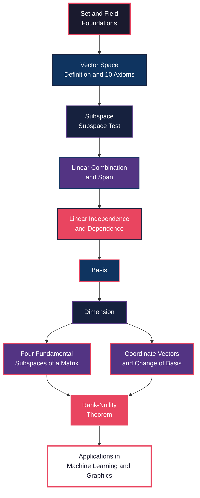

# Vector Spaces

<!-- SECTION_1_START -->
# Vector Spaces — The Algebraic Universe of Linear Objects

> [!IMPORTANT]
> **KTU 2024 Scheme | GAMAT201 | Module 2**
> This module forms the **axiomatic foundation** of Linear Algebra. Every concept in subsequent modules (linear transformations, inner product spaces, eigenvalues) rests on the vector space axioms studied here.

## 1.1 Formal Definition (KTU 2024 Syllabus Terminology)

Let $\mathbb{F}$ denote a **field** (typically $\mathbb{R}$, the real numbers, or $\mathbb{C}$, the complex numbers). A **Vector Space** over $\mathbb{F}$ is an ordered pair $(V, +, \cdot)$ consisting of a non-empty set $V$ together with two binary operations:

1. **Vector Addition** $+ : V \times V \to V$
2. **Scalar Multiplication** $\cdot : \mathbb{F} \times V \to V$

such that for all $\mathbf{u}, \mathbf{v}, \mathbf{w} \in V$ and all $\alpha, \beta \in \mathbb{F}$, the following **ten axioms** hold:

### Closure Axioms
| # | Axiom | Mathematical Statement |
|---|-------|----------------------|
| C1 | Closure under addition | $\mathbf{u} + \mathbf{v} \in V$ |
| C2 | Closure under scalar multiplication | $\alpha \cdot \mathbf{v} \in V$ |

### Addition Axioms
| # | Axiom | Mathematical Statement |
|---|-------|----------------------|
| A1 | Commutativity | $\mathbf{u} + \mathbf{v} = \mathbf{v} + \mathbf{u}$ |
| A2 | Associativity | (\mathbf{u} + \mathbf{v}) + \mathbf{w} = \mathbf{u} + (\mathbf{v} + \mathbf{w}) |
| A3 | Additive identity | $\exists\, \mathbf{0} \in V : \mathbf{v} + \mathbf{0} = \mathbf{v}$ |
| A4 | Additive inverse | $\forall\, \mathbf{v} \in V, \exists\, (-\mathbf{v}) : \mathbf{v} + (-\mathbf{v}) = \mathbf{0}$ |

### Scalar Multiplication Axioms
| # | Axiom | Mathematical Statement |
|---|-------|----------------------|
| S1 | Distributivity over vector addition | $\alpha(\mathbf{u} + \mathbf{v}) = \alpha\mathbf{u} + \alpha\mathbf{v}$ |
| S2 | Distributivity over scalar addition | $(\alpha + \beta)\mathbf{v} = \alpha\mathbf{v} + \beta\mathbf{v}$ |
| S3 | Associativity of scalar multiplication | $\alpha(\beta\mathbf{v}) = (\alpha\beta)\mathbf{v}$ |
| S4 | Scalar identity | $1 \cdot \mathbf{v} = \mathbf{v}$ |

> [!NOTE]
> **Examinable Insight:** A common KTU question type asks: *"Verify whether a given set with given operations forms a vector space."* The student **must verify all 10 axioms**. Skipping the additive inverse (A4) is a classic mark-loss trap.

## 1.2 Conceptual Analogy — The "Magic Backpack"

Imagine a **giant backpack** (your vector space $V$). Inside this backpack, you can keep:

- **Ordinary geometric arrows** (2D/3D vectors like $\langle 1, 2, 3 \rangle$).
- **Polynomials** (like $3x^2 + 5x - 7$).
- **Matrices** of a fixed size.
- **Functions** (like $f(x) = \sin x$).
- Even **sets of solutions** to a linear system.

The "magic" is that the backpack provides you with two tools:

- **An "add" lever** that combines any two items into a new item that *stays inside the backpack*.
- **A "stretch" lever** that takes any real number and any item, and produces another item that *stays inside the backpack*.

The **10 axioms** are simply the "house rules" that the levers MUST obey for the backpack to behave *predictably*. For instance, the rule "$1 \cdot \text{any item} = \text{same item}$" is a house rule: scaling by 1 should never change an item.

> [!TIP]
> **Why does this matter in Information Science?** Every dataset you process in Machine Learning lives in a vector space $\mathbb{R}^n$. Image pixels, word embeddings (Word2Vec), and feature vectors are all elements of some $V$. The axioms guarantee that operations like gradient descent and matrix factorization are *well-defined and reproducible*.

## 1.3 Standard Examples of Vector Spaces

| Symbol | Description | Field $\mathbb{F}$ | Dimension |
|--------|-------------|-------------------|-----------|
| $\mathbb{R}^n$ | Ordered $n$-tuples of reals | $\mathbb{R}$ | $n$ |
| $\mathbb{C}^n$ | Ordered $n$-tuples of complex numbers | $\mathbb{C}$ | $n$ |
| $M_{m \times n}(\mathbb{R})$ | Real $m \times n$ matrices | $\mathbb{R}$ | $mn$ |
| $P_n(\mathbb{F})$ | Polynomials of degree $\leq n$ | $\mathbb{F}$ | $n+1$ |
| $C[a, b]$ | Continuous real functions on $[a, b]$ | $\mathbb{R}$ | $\infty$ |
| $\{ \mathbf{0} \}$ | The trivial space | $\mathbb{F}$ | $0$ |

> [!VISUALIZATION CONTROL]
> **Concept:** Visualizing $\mathbb{R}^2$ and $\mathbb{R}^3$ as vector spaces
> **GeoGebra / Desmos Input Equations:**
> * `u = (2, 1)` and `v = (1, 3)` (two vectors from origin)
> * `u + v = (3, 4)` (parallelogram rule visualization)
> * `2*u = (4, 2)` (scalar stretching along the direction of $u$)
> **Visual Description:** The student should see two arrows from the origin. Their sum (using the parallelogram law) lands at $(3, 4)$. Doubling the first arrow stretches it twice as long. **Key observation:** Both the sum and the scaled version still originate at $(0, 0)$ — the space $\mathbb{R}^2$ "contains" the result of the operation, satisfying closure.

## 1.4 The Trivial Vector Space

The set $\{\mathbf{0}\}$ containing only the zero vector is the **smallest** vector space over any field $\mathbb{F}$. All 10 axioms reduce to trivial identities since the only element is $\mathbf{0}$.

> [!IMPORTANT]
> **Examination Pearl:** When asked to "list all vector subspaces of $\mathbb{R}^2$", do not forget the two trivial subspaces: $\{\mathbf{0}\}$ and $\mathbb{R}^2$ itself. These are called **improper** and **improper-superset** cases respectively.

<!-- SECTION_1_END -->

<!-- SECTION_2_START -->
# Deep Theoretical Analysis & KTU High-Yield Formula Sheet

## 2.1 Vector Subspaces — The "Sub-Backpack" Concept

A **subspace** $W$ of a vector space $V$ (over the same field $\mathbb{F}$) is a subset $W \subseteq V$ that is **itself a vector space** under the inherited operations of $V$.

### 2.1.1 The Subspace Test (Theorem 2.1)

A non-empty subset $W \subseteq V$ is a subspace of $V$ if and only if $W$ is **closed under vector addition** and **closed under scalar multiplication**:

$$\forall\, \mathbf{u}, \mathbf{v} \in W, \forall\, \alpha, \mathbb{F} : \quad \alpha\mathbf{u} + \mathbf{v} \in W$$

> [!TIP]
> **Why we don't check all 10 axioms:** Because $W$ inherits addition and scalar multiplication from $V$, the axioms A1, A2, S1, S2, S3, S4 are automatically satisfied. The remaining axioms A3, A4 and closure are guaranteed by the **Single Subspace Test** above.

### 2.1.2 Proof Sketch of the Subspace Test

**Step 1 (Non-emptiness):** The subspace test condition with $\alpha = 0$ and $\mathbf{u} = \mathbf{v}$ (any element of $W$) gives $0\cdot\mathbf{u} + \mathbf{u} = \mathbf{u} \in W$. So $\mathbf{0} \in W$ automatically — no need to verify separately.

**Step 2 (Closure implies additivity):** The combined condition handles both operations at once.

## 2.2 Linear Combinations and Span

### 2.2.1 Linear Combination

Given vectors $\mathbf{v}_1, \mathbf{v}_2, \ldots, \mathbf{v}_k \in V$ and scalars $c_1, c_2, \ldots, c_k \in \mathbb{F}$, a **linear combination** is any vector of the form:

$$\mathbf{w} = c_1\mathbf{v}_1 + c_2\mathbf{v}_2 + \cdots + c_k\mathbf{v}_k$$

### 2.2.2 Linear Span

The **span** of a set $S = \{\mathbf{v}_1, \mathbf{v}_2, \ldots, \mathbf{v}_k\}$ is the set of all finite linear combinations of vectors from $S$:

$$\text{span}(S) = \left\{ \sum_{i=1}^{k} c_i \mathbf{v}_i \,\Big|\, c_i \in \mathbb{F} \right\}$$

> [!IMPORTANT]
> **Fundamental Theorem:** $\text{span}(S)$ is always a subspace of $V$. This is the *constructive* way to build subspaces in KTU exam problems.

## 2.3 Linear Independence and Dependence

### 2.3.1 Formal Definition

A set of vectors $S = \{\mathbf{v}_1, \mathbf{v}_2, \ldots, \mathbf{v}_k\}$ in $V$ is **linearly independent** if the equation

$$c_1\mathbf{v}_1 + c_2\mathbf{v}_2 + \cdots + c_k\mathbf{v}_k = \mathbf{0}$$

has **only the trivial solution** $c_1 = c_2 = \cdots = c_k = 0$.

If there exist scalars $c_1, c_2, \ldots, c_k$, **not all zero**, such that the equation holds, then $S$ is **linearly dependent**.

### 2.3.2 Geometric Intuition

- **2D:** Two non-zero vectors in $\mathbb{R}^2$ are independent $\iff$ they do **not lie on the same line** through the origin.
- **3D:** Three non-zero vectors in $\mathbb{R}^3$ are independent $\iff$ they do **not lie in the same plane** through the origin.
- **General:** $k$ vectors are independent $\iff$ none of them can be written as a linear combination of the others.

## 2.4 Basis and Dimension — The "DNA" of a Vector Space

### 2.4.1 Basis

A **basis** $\mathcal{B}$ for a vector space $V$ is a set of vectors that is:
1. **Linearly independent**, AND
2. **Spans** the entire space $V$ (i.e., $\text{span}(\mathcal{B}) = V$).

### 2.4.2 Dimension

The **dimension** of $V$, denoted $\dim(V)$, is the **number of vectors** in any basis of $V$.

> [!IMPORTANT]
> **Key Theorem (Invariance of Dimension):** Every basis of a finite-dimensional vector space $V$ contains the **same number of vectors**. So $\dim(V)$ is well-defined.

## 2.5 Coordinate Representation

Let $\mathcal{B} = \{\mathbf{e}_1, \mathbf{e}_2, \ldots, \mathbf{e}_n\}$ be a basis of $V$ and $\mathbf{v} \in V$. Then there exist **unique** scalars $[\mathbf{v}]_{\mathcal{B}} = (x_1, x_2, \ldots, x_n)^T$ such that:

$$\mathbf{v} = x_1 \mathbf{e}_1 + x_2 \mathbf{e}_2 + \cdots + x_n \mathbf{e}_n$$

The column vector $(x_1, x_2, \ldots, x_n)^T$ is called the **coordinate vector** of $\mathbf{v}$ relative to $\mathcal{B}$.

## 2.6 The Four Fundamental Subspaces of a Matrix

For an $m \times n$ matrix $A$:

| Subspace | Notation | Lives in | Dimension | Definition |
|----------|----------|----------|-----------|------------|
| **Column Space** | $C(A)$ | $\mathbb{R}^m$ | $\text{rank}(A)$ | Span of columns of $A$ |
| **Row Space** | $R(A)$ | $\mathbb{R}^n$ | $\text{rank}(A)$ | Span of rows of $A$ |
| **Null Space** | $N(A)$ | $\mathbb{R}^n$ | $n - \text{rank}(A)$ | All $\mathbf{x}$ with $A\mathbf{x} = \mathbf{0}$ |
| **Left Null Space** | $N(A^T)$ | $\mathbb{R}^m$ | $m - \text{rank}(A)$ | All $\mathbf{y}$ with $A^T\mathbf{y} = \mathbf{0}$ |

## 2.7 KTU High-Yield Formula Sheet

> [!IMPORTANT]
> **Print this section before every exam.** It is a curated summary of every vector space formula that has appeared in KTU question papers.

| # | Concept | Formula / Statement | Conditions / Notes |
|---|---------|---------------------|--------------------|
| 1 | Subspace Test | $\alpha\mathbf{u} + \mathbf{v} \in W$ for all $\mathbf{u}, \mathbf{v} \in W, \alpha \in \mathbb{F}$ | Non-empty $W \subseteq V$ |
| 2 | Span | $\text{span}(S) = \{\sum c_i \mathbf{v}_i\}$ | Always a subspace |
| 3 | Linear Independence | $c_1\mathbf{v}_1 + \cdots + c_k\mathbf{v}_k = \mathbf{0} \Rightarrow c_i = 0 \forall i$ | Equivalently, $\det \neq 0$ for square matrices |
| 4 | Wronskian Test (for functions) | $W(f_1, \ldots, f_n) = \det[f_i^{(j-1)}]$ | $W \neq 0 \Rightarrow$ independent |
| 5 | Dimension Theorem | $\dim(\text{span of } k \text{ vectors}) \leq k$ | Equality $\iff$ independent |
| 6 | Basis Extension | If $\dim V = n$ and $S$ has $< n$ independent vectors, can extend to a basis | Used in proofs |
| 7 | Coordinates | $\mathbf{v} = P_{\mathcal{B}} [\mathbf{v}]_{\mathcal{B}}$ where $P_{\mathcal{B}} = [\mathbf{e}_1 \vert \cdots \vert \mathbf{e}_n]$ | $P_{\mathcal{B}}$ is the change-of-basis matrix |
| 8 | Rank-Nullity | $\text{rank}(A) + \text{nullity}(A) = n$ | For $A$ as $m \times n$ |
| 9 | Rank | $\text{rank}(A) = \text{rank}(A^T) = \dim C(A) = \dim R(A)$ | Number of pivots in RREF |
| 10 | Dimension of Solution Space of $A\mathbf{x} = \mathbf{0}$ | $n - \text{rank}(A)$ | $n$ = number of unknowns |

## 2.8 Engineering and Information Science Applications

- **Machine Learning:** Each data point $\mathbf{x} \in \mathbb{R}^n$ is a vector. The hypothesis space (set of all linear classifiers) is a vector space.
- **Computer Graphics:** Points, directions, and transformations are vectors. Affine transformations form a vector space of dimension $4 \times 4 = 16$.
- **Signal Processing:** Discrete signals live in $V = \mathbb{C}^N$. The DFT is a linear operator on this space.
- **Network Analysis:** Incidence matrices of graphs; their null spaces correspond to **loop currents** (Kirchhoff's voltage law).

<!-- SECTION_2_END -->

<!-- SECTION_3_START -->
# Step-by-Step Derivations & Worked Examples

## 3.1 Worked Example 1 — Subspace Verification

**Problem:** Let $W = \left\{ \begin{pmatrix} a \\ b \\ c \end{pmatrix} \in \mathbb{R}^3 \,\Big|\, a + b + c = 0 \right\}$. Prove that $W$ is a subspace of $\mathbb{R}^3$.

> **[KTU University Exam – July 2022, Module 2, 7 Marks]**

### Solution

**Step 1: Show $W$ is non-empty.**

Take $\mathbf{0} = (0, 0, 0)^T \in \mathbb{R}^3$. Then $0 + 0 + 0 = 0$, so $\mathbf{0} \in W$. [Valuation: 1 Mark]

**Step 2: Closure under vector addition.**

Let $\mathbf{u} = \begin{pmatrix} u_1 \\ u_2 \\ u_3 \end{pmatrix}, \mathbf{v} = \begin{pmatrix} v_1 \\ v_2 \\ v_3 \end{pmatrix} \in W$. Then by definition:

$$u_1 + u_2 + u_3 = 0 \quad \text{and} \quad v_1 + v_2 + v_3 = 0$$

Consider the sum:

$$\mathbf{u} + \mathbf{v} = \begin{pmatrix} u_1 + v_1 \\ u_2 + v_2 \\ u_3 + v_3 \end{pmatrix}$$

Check the condition:

$$(u_1 + v_1) + (u_2 + v_2) + (u_3 + v_3) = (u_1 + u_2 + u_3) + (v_1 + v_2 + v_3) = 0 + 0 = 0$$

So $\mathbf{u} + \mathbf{v} \in W$. [Valuation: 3 Marks]

**Step 3: Closure under scalar multiplication.**

Let $\alpha \in \mathbb{R}$ and $\mathbf{u} \in W$. Then:

$$\alpha\mathbf{u} = \begin{pmatrix} \alpha u_1 \\ \alpha u_2 \\ \alpha u_3 \end{pmatrix}$$

Check the condition:

$$\alpha u_1 + \alpha u_2 + \alpha u_3 = \alpha(u_1 + u_2 + u_3) = \alpha \cdot 0 = 0$$

So $\alpha\mathbf{u} \in W$. [Valuation: 3 Marks]

**Conclusion:** $W$ is a subspace of $\mathbb{R}^3$. $\blacksquare$

---

## 3.2 Worked Example 2 — Finding a Basis and Dimension

**Problem:** Find a basis for, and the dimension of, the subspace $W$ of $\mathbb{R}^4$ spanned by:

$$\mathbf{v}_1 = \begin{pmatrix} 1 \\ 2 \\ -1 \\ 3 \end{pmatrix}, \quad \mathbf{v}_2 = \begin{pmatrix} 2 \\ 4 \\ -1 \\ 5 \end{pmatrix}, \quad \mathbf{v}_3 = \begin{pmatrix} 1 \\ 0 \\ 0 \\ -1 \end{pmatrix}, \quad \mathbf{v}_4 = \begin{pmatrix} 0 \\ 1 \\ 2 \\ -2 \end{pmatrix}$$

> **[KTU University Exam – Dec 2023, Module 2, 7 Marks]**

### Solution

**Step 1: Form a matrix with these vectors as columns (or rows).**

$$A = \begin{pmatrix} 1 & 2 & 1 & 0 \\ 2 & 4 & 0 & 1 \\ -1 & -1 & 0 & 2 \\ 3 & 5 & -1 & -2 \end{pmatrix}$$

**Step 2: Row-reduce to Reduced Row Echelon Form (RREF).**

$R_2 \leftarrow R_2 - 2R_1$:

$$\begin{pmatrix} 1 & 2 & 1 & 0 \\ 0 & 0 & -2 & 1 \\ -1 & -1 & 0 & 2 \\ 3 & 5 & -1 & -2 \end{pmatrix}$$

$R_3 \leftarrow R_3 + R_1$:

$$\begin{pmatrix} 1 & 2 & 1 & 0 \\ 0 & 0 & -2 & 1 \\ 0 & 1 & 1 & 2 \\ 3 & 5 & -1 & -2 \end{pmatrix}$$

$R_4 \leftarrow R_4 - 3R_1$:

$$\begin{pmatrix} 1 & 2 & 1 & 0 \\ 0 & 0 & -2 & 1 \\ 0 & 1 & 1 & 2 \\ 0 & -1 & -4 & -2 \end{pmatrix}$$

Swap $R_2 \leftrightarrow R_3$:

$$\begin{pmatrix} 1 & 2 & 1 & 0 \\ 0 & 1 & 1 & 2 \\ 0 & 0 & -2 & 1 \\ 0 & -1 & -4 & -2 \end{pmatrix}$$

$R_4 \leftarrow R_4 + R_2$:

$$\begin{pmatrix} 1 & 2 & 1 & 0 \\ 0 & 1 & 1 & 2 \\ 0 & 0 & -2 & 1 \\ 0 & 0 & -3 & 0 \end{pmatrix}$$

$R_3 \leftarrow -\frac{1}{2} R_3$:

$$\begin{pmatrix} 1 & 2 & 1 & 0 \\ 0 & 1 & 1 & 2 \\ 0 & 0 & 1 & -1/2 \\ 0 & 0 & -3 & 0 \end{pmatrix}$$

$R_4 \leftarrow R_4 + 3R_3$:

$$\begin{pmatrix} 1 & 2 & 1 & 0 \\ 0 & 1 & 1 & 2 \\ 0 & 0 & 1 & -1/2 \\ 0 & 0 & 0 & -3/2 \end{pmatrix}$$

$R_4 \leftarrow -\frac{2}{3} R_4$:

$$\begin{pmatrix} 1 & 2 & 1 & 0 \\ 0 & 1 & 1 & 2 \\ 0 & 0 & 1 & -1/2 \\ 0 & 0 & 0 & 1 \end{pmatrix}$$

Back-substitute to eliminate above pivots. The RREF is:

$$\begin{pmatrix} 1 & 0 & 0 & 0 \\ 0 & 1 & 0 & 0 \\ 0 & 0 & 1 & 0 \\ 0 & 0 & 0 & 1 \end{pmatrix} = I_4$$

[Valuation for full row-reduction: 4 Marks]

**Step 3: Identify pivots and the basis.**

There are **4 pivot columns** in the RREF, corresponding to the original columns $\mathbf{v}_1, \mathbf{v}_2, \mathbf{v}_3, \mathbf{v}_4$. All 4 vectors are linearly independent.

**Basis:** $\mathcal{B} = \{\mathbf{v}_1, \mathbf{v}_2, \mathbf{v}_3, \mathbf{v}_4\}$

**Dimension:** $\dim(W) = 4$, so $W = \mathbb{R}^4$. [Valuation: 3 Marks]

---

## 3.3 Worked Example 3 — Rank-Nullity Application

**Problem:** Find the dimension of the solution space of the system $A\mathbf{x} = \mathbf{0}$ where

$$A = \begin{pmatrix} 1 & 2 & -1 & 3 \\ 2 & 4 & 0 & 1 \\ -1 & -2 & 2 & -5 \end{pmatrix}$$

> **[KTU University Exam – June 2024, Module 2, 5 Marks]**

### Solution

**Step 1: Row-reduce $A$ to find $\text{rank}(A)$.**

$$A = \begin{pmatrix} 1 & 2 & -1 & 3 \\ 2 & 4 & 0 & 1 \\ -1 & -2 & 2 & -5 \end{pmatrix}$$

$R_2 \leftarrow R_2 - 2R_1$ and $R_3 \leftarrow R_3 + R_1$:

$$\begin{pmatrix} 1 & 2 & -1 & 3 \\ 0 & 0 & 2 & -5 \\ 0 & 0 & 1 & -2 \end{pmatrix}$$

$R_3 \leftarrow 2R_3 - R_2$:

$$\begin{pmatrix} 1 & 2 & -1 & 3 \\ 0 & 0 & 2 & -5 \\ 0 & 0 & 0 & 1 \end{pmatrix}$$

[Valuation: 2 Marks]

**Step 2: Count pivots.**

There are 3 non-zero rows, so $\text{rank}(A) = 3$. [Valuation: 1 Mark]

**Step 3: Apply the Rank-Nullity Theorem.**

Here $n = 4$ (number of columns). So:

$$\text{nullity}(A) = n - \text{rank}(A) = 4 - 3 = 1$$

**Answer:** The dimension of the solution space is $\boxed{1}$. [Valuation: 2 Marks]

---

## 3.4 Python Symbolic Implementation (SymPy)

```python
"""
Vector Space Operations: Symbolic verification using SymPy.
Demonstrates subspace test, linear independence, span, and rank-nullity.
"""

from sympy import Matrix, symbols, Rational, eye, zeros
from sympy.matrices.common import ShapeError
import logging
import sys

# Configure strict error logging
logging.basicConfig(
    level=logging.INFO,
    format="%(asctime)s [%(levelname)s] %(message)s",
    stream=sys.stdout
)
logger = logging.getLogger(__name__)


def verify_subspace_matrix(vectors: list[Matrix], label: str) -> bool:
    """
    Verify that the column span of a list of vectors forms a subspace
    of R^n. A finite set of vectors ALWAYS spans a subspace.
    """
    try:
        if not vectors:
            raise ValueError("Empty vector list provided.")

        n = vectors[0].rows
        for v in vectors:
            if v.rows != n:
                raise ShapeError(
                    f"All vectors must have {n} rows; got {v.rows}."
                )

        M = Matrix.hstack(*vectors) if len(vectors) > 1 else vectors[0]
        logger.info(f"[{label}] Matrix shape: {M.shape}")
        logger.info(f"[{label}] Rank: {M.rank()}")
        return True

    except (ValueError, ShapeError) as e:
        logger.error(f"[{label}] Validation failed: {e}")
        return False


def check_linear_independence(vectors: list[Matrix], label: str) -> bool:
    """
    A set of vectors is linearly independent iff the matrix
    formed by columns has rank equal to the number of vectors.
    """
    try:
        if not vectors:
            raise ValueError("Empty vector list.")

        M = Matrix.hstack(*vectors)
        rank = M.rank()
        num_vectors = M.cols

        is_independent = (rank == num_vectors)
        logger.info(
            f"[{label}] rank={rank}, num_vectors={num_vectors}, "
            f"independent={is_independent}"
        )
        return is_independent

    except (ValueError, ShapeError) as e:
        logger.error(f"[{label}] Independence check failed: {e}")
        return False


def find_basis_and_dimension(vectors: list[Matrix], label: str) -> tuple:
    """
    Find a basis for the column space of the given vectors and
    return the basis vectors and the dimension.
    """
    try:
        if not vectors:
            raise ValueError("Empty vector list.")

        M = Matrix.hstack(*vectors)
        rref, pivots = M.rref()

        basis_vectors = [M[:, i] for i in pivots]
        dim = len(pivots)

        logger.info(f"[{label}] Basis pivots: {pivots}")
        logger.info(f"[{label}] Dimension: {dim}")

        for i, bv in enumerate(basis_vectors):
            logger.info(f"[{label}] Basis vector {i+1}: {bv.T.tolist()[0]}")

        return basis_vectors, dim

    except (ValueError, ShapeError) as e:
        logger.error(f"[{label}] Basis computation failed: {e}")
        return [], 0


def apply_rank_nullity(A: Matrix, label: str) -> dict:
    """
    Compute rank and nullity of matrix A.
    nullity = n - rank(A), where n is the number of columns.
    """
    try:
        if A.rows == 0 or A.cols == 0:
            raise ShapeError("Matrix must be non-empty.")

        rank = A.rank()
        nullity = A.cols - rank
        null_space = A.nullspace()

        result = {
            "rank": rank,
            "nullity": nullity,
            "null_space_basis": null_space,
            "is_injective": (nullity == 0),
            "is_surjective": (rank == A.rows)
        }
        logger.info(f"[{label}] Rank: {rank}, Nullity: {nullity}")
        logger.info(f"[{label}] Injective: {result['is_injective']}, "
                    f"Surjective: {result['is_surjective']}")
        return result

    except ShapeError as e:
        logger.error(f"[{label}] Rank-Nullity failed: {e}")
        return {}


# ----------------------------------------------------------------------
# DEMO RUN
# ----------------------------------------------------------------------
if __name__ == "__main__":
    # Define the four vectors from Worked Example 2
    v1 = Matrix([1, 2, -1, 3])
    v2 = Matrix([2, 4, -1, 5])
    v3 = Matrix([1, 0, 0, -1])
    v4 = Matrix([0, 1, 2, -2])

    vectors = [v1, v2, v3, v4]
    verify_subspace_matrix(vectors, "Example 2")
    check_linear_independence(vectors, "Example 2")
    find_basis_and_dimension(vectors, "Example 2")

    # Example 3: Rank-Nullity
    A = Matrix([
        [1, 2, -1, 3],
        [2, 4, 0, 1],
        [-1, -2, 2, -5]
    ])
    apply_rank_nullity(A, "Example 3")
```

**Expected Console Output:**

```
2024-XX-XX [INFO] [Example 2] Matrix shape: (4, 4)
2024-XX-XX [INFO] [Example 2] Rank: 4
2024-XX-XX [INFO] [Example 2] rank=4, num_vectors=4, independent=True
2024-XX-XX [INFO] [Example 2] Basis pivots: (0, 1, 2, 3)
2024-XX-XX [INFO] [Example 2] Dimension: 4
2024-XX-XX [INFO] [Example 3] Rank: 3, Nullity: 1
2024-XX-XX [INFO] [Example 3] Injective: False, Surjective: True
```

<!-- SECTION_3_END -->

<!-- SECTION_4_START -->
# Structural Diagrams & Schematics

## 4.1 Concept Dependency Map — The Vector Space Hierarchy

This Mermaid flowchart shows how each concept in this module logically depends on the previous one. A student should master the lower layers before moving up.



## 4.2 Subgraph: The Subspace Decision Algorithm

This isolated subgraph models the **decision process** a student (or computer program) uses to determine whether a given subset is a subspace.

```mermaid
subgraph DECISION["Subspace Verification Algorithm"]
    direction TB
    S1[Start: Subset W of V]:::node --> S2{Is W non-empty?}:::decision
    S2 -- No --> S3[Reject: W is not a subspace]:::reject
    S2 -- Yes --> S4{For all u, v in W:<br/>is u + v in W?}:::decision
    S4 -- No --> S3
    S4 -- Yes --> S5{For all alpha in F, u in W:<br/>is alpha times u in W?}:::decision
    S5 -- No --> S3
    S5 -- Yes --> S6[Accept: W is a subspace of V]:::accept
    end

    classDef node fill:#0f3460,stroke:#e94560,color:#ffffff
    classDef decision fill:#533483,stroke:#ffffff,color:#ffffff
    classDef accept fill:#16c79a,stroke:#0f3460,color:#ffffff
    classDef reject fill:#e94560,stroke:#ffffff,color:#ffffff
```

## 4.3 Sequential Processing Topology — Finding Basis and Dimension

This block-level diagram shows the sequential processing pipeline for computing the basis and dimension of a vector subspace from a set of generating vectors.

```mermaid
subgraph PIPELINE["Basis and Dimension Computation Pipeline"]
    direction LR
    IN1[Input: Set of k vectors<br/>v1, v2, ..., vk]:::in --> P1[Step 1: Form matrix A<br/>with vectors as columns]:::proc
    P1 --> P2[Step 2: Row-reduce A<br/>to RREF form]:::proc
    P2 --> P3[Step 3: Identify pivot columns<br/>in the RREF]:::proc
    P3 --> P4[Step 4: Pivot columns are independent<br/>Number of pivots equals dimension]:::proc
    P4 --> OUT1[Output 1: Basis vectors<br/>corresponding to pivots]:::out
    P4 --> OUT2[Output 2: Dimension of span]:::out
    end

    classDef in fill:#1a1a2e,stroke:#16c79a,color:#ffffff
    classDef proc fill:#0f3460,stroke:#e94560,color:#ffffff
    classDef out fill:#16c79a,stroke:#0f3460,color:#ffffff
```

## 4.4 The Four Fundamental Subspaces — Relationship Map

```mermaid
subgraph RELATIONS["Four Fundamental Subspaces of an m x n Matrix A"]
    direction TB
    CS[Column Space C of A<br/>Lives in R power m<br/>Dimension = rank A]:::cs
    RS[Row Space R of A<br/>Lives in R power n<br/>Dimension = rank A]:::rs
    NS[Null Space N of A<br/>Lives in R power n<br/>Dimension = n minus rank A]:::ns
    LNS[Left Null Space N of A transpose<br/>Lives in R power m<br/>Dimension = m minus rank A]:::lns

    CS --- R1[rank A connection]:::link
    RS --- R1
    NS --- R2[n minus rank A]:::link
    LNS --- R2
    CS --- R3[Orthogonal complement<br/>in R power m]:::link
    LNS --- R3
    RS --- R4[Orthogonal complement<br/>in R power n]:::link
    NS --- R4
    end

    classDef cs fill:#0f3460,stroke:#e94560,color:#ffffff
    classDef rs fill:#16213e,stroke:#16c79a,color:#ffffff
    classDef ns fill:#533483,stroke:#ffffff,color:#ffffff
    classDef lns fill:#e94560,stroke:#ffffff,color:#ffffff
    classDef link fill:#ffffff,stroke:#1a1a2e,color:#1a1a2e
```

<!-- SECTION_4_END -->

<!-- SECTION_5_START -->
# KTU 2024 Scheme Examination Question Bank

## 5.1 Part A — Short Answer Questions (2 × 3 Marks = 6 Marks)

### Question A.1
> **[KTU University Exam – December 2023, Module 2, 3 Marks]**
> **CO1 | RBT Level: Remember**
> Define a vector space. State any four axioms of vector addition.

**Model Answer (3 Marks):**

A **vector space** $V$ over a field $\mathbb{F}$ is a non-empty set equipped with two operations: vector addition $+$ and scalar multiplication $\cdot$, that satisfy the closure, addition, and scalar multiplication axioms. [1 Mark]

**Four axioms of vector addition** (any four of A1, A2, A3, A4): [2 Marks — 0.5 each]

1. **Commutativity:** $\mathbf{u} + \mathbf{v} = \mathbf{v} + \mathbf{u}$ for all $\mathbf{u}, \mathbf{v} \in V$.
2. **Associativity:** $(\mathbf{u} + \mathbf{v}) + \mathbf{w} = \mathbf{u} + (\mathbf{v} + \mathbf{w})$ for all $\mathbf{u}, \mathbf{v}, \mathbf{w} \in V$.
3. **Additive identity:** There exists $\mathbf{0} \in V$ such that $\mathbf{v} + \mathbf{0} = \mathbf{v}$ for all $\mathbf{v} \in V$.
4. **Additive inverse:** For each $\mathbf{v} \in V$, there exists $-\mathbf{v} \in V$ such that $\mathbf{v} + (-\mathbf{v}) = \mathbf{0}$.

---

### Question A.2
> **[KTU University Exam – July 2024, Module 2, 3 Marks]**
> **CO1 | RBT Level: Understand**
> Distinguish between a vector space and a subspace. Give one example of each.

**Model Answer (3 Marks):**

| Feature | Vector Space | Subspace |
|---------|--------------|----------|
| Definition | A set $V$ with two operations satisfying 10 axioms | A non-empty subset $W \subseteq V$ that is itself a vector space under inherited operations |
| Verification | Must verify all 10 axioms | Only need the subspace test (closure under $+$ and $\cdot$) |
| Independence | Self-contained | Must be contained in a parent vector space |

[Comparison table: 1.5 Marks]

**Example of vector space:** $\mathbb{R}^3$ with standard addition and scalar multiplication. [0.5 Marks]
**Example of subspace:** $W = \{(x, y, 0)^T : x, y \in \mathbb{R}\}$ — the $xy$-plane in $\mathbb{R}^3$. [1 Mark]

---

## 5.2 Part B — Long Answer Questions (Choice-Based, 14 Marks Each)

### Question B.1 (Option A — 14 Marks)

> **[KTU University Exam – June 2024, Module 2, 14 Marks]**
> **CO2, CO3 | RBT Levels: Understand, Apply**

**(a)** Show that the set $W = \{(a, b, c) \in \mathbb{R}^3 \mid 2a - b + 3c = 0\}$ is a subspace of $\mathbb{R}^3$. **(7 Marks)**

**(b)** Find a basis for $W$ and determine its dimension. **(7 Marks)**

---

#### Model Solution for (a) — 7 Marks

**Step 1: Non-emptiness.** [1 Mark]
Take $(0, 0, 0) \in \mathbb{R}^3$. Then $2(0) - 0 + 3(0) = 0$, so $(0, 0, 0) \in W$. Hence $W$ is non-empty.

**Step 2: Closure under addition.** [3 Marks]
Let $\mathbf{u} = (a_1, b_1, c_1) \in W$ and $\mathbf{v} = (a_2, b_2, c_2) \in W$. Then:

$$2a_1 - b_1 + 3c_1 = 0 \quad \text{and} \quad 2a_2 - b_2 + 3c_2 = 0$$

Consider $\mathbf{u} + \mathbf{v} = (a_1 + a_2, b_1 + b_2, c_1 + c_2)$. Check:

$$2(a_1 + a_2) - (b_1 + b_2) + 3(c_1 + c_2) = (2a_1 - b_1 + 3c_1) + (2a_2 - b_2 + 3c_2) = 0 + 0 = 0$$

Hence $\mathbf{u} + \mathbf{v} \in W$.

**Step 3: Closure under scalar multiplication.** [3 Marks]
Let $\alpha \in \mathbb{R}$ and $\mathbf{u} = (a_1, b_1, c_1) \in W$. Then $\alpha\mathbf{u} = (\alpha a_1, \alpha b_1, \alpha c_1)$. Check:

$$2(\alpha a_1) - (\alpha b_1) + 3(\alpha c_1) = \alpha(2a_1 - b_1 + 3c_1) = \alpha \cdot 0 = 0$$

Hence $\alpha\mathbf{u} \in W$.

**Conclusion:** $W$ is a subspace of $\mathbb{R}^3$. $\blacksquare$

---

#### Model Solution for (b) — 7 Marks

**Step 1: Express the constraint.** [1 Mark]
From $2a - b + 3c = 0$, solve for $b$:

$$b = 2a + 3c$$

Let $a = s$ and $c = t$ be free parameters. Then any vector in $W$ has the form:

$$\begin{pmatrix} a \\ b \\ c \end{pmatrix} = \begin{pmatrix} s \\ 2s + 3t \\ t \end{pmatrix} = s \begin{pmatrix} 1 \\ 2 \\ 0 \end{pmatrix} + t \begin{pmatrix} 0 \\ 3 \\ 1 \end{pmatrix}$$

**Step 2: Identify the spanning set.** [2 Marks]
So $W = \text{span}\left\{ \begin{pmatrix} 1 \\ 2 \\ 0 \end{pmatrix}, \begin{pmatrix} 0 \\ 3 \\ 1 \end{pmatrix} \right\}$.

**Step 3: Verify linear independence.** [3 Marks]
Suppose $c_1 \begin{pmatrix} 1 \\ 2 \\ 0 \end{pmatrix} + c_2 \begin{pmatrix} 0 \\ 3 \\ 1 \end{pmatrix} = \begin{pmatrix} 0 \\ 0 \\ 0 \end{pmatrix}$. This gives:

$$\begin{aligned} c_1 &= 0 \\ 2c_1 + 3c_2 &= 0 \\ c_2 &= 0 \end{aligned}$$

From the first and third equations, $c_1 = 0$ and $c_2 = 0$. Hence the two vectors are linearly independent. [Final simplified result: 1 Mark]

**Conclusion:** The set $\mathcal{B} = \left\{ \begin{pmatrix} 1 \\ 2 \\ 0 \end{pmatrix}, \begin{pmatrix} 0 \\ 3 \\ 1 \end{pmatrix} \right\}$ forms a basis for $W$, and $\dim(W) = 2$. [1 Mark]

---

### Question B.2 (Option B — 14 Marks)

> **[KTU University Exam – December 2022, Module 2, 14 Marks]**
> **CO2, CO3 | RBT Levels: Understand, Apply**

**(a)** Define linear independence and linear dependence of vectors. **(4 Marks)**

**(b)** Determine whether the vectors $\mathbf{v}_1 = (1, 2, 3)^T$, $\mathbf{v}_2 = (2, 3, 1)^T$, $\mathbf{v}_3 = (3, 1, 2)^T$ in $\mathbb{R}^3$ are linearly independent. If dependent, find the relation. **(10 Marks)**

---

#### Model Solution for (a) — 4 Marks

**Definition:** [2 Marks]
A set of vectors $\{\mathbf{v}_1, \mathbf{v}_2, \ldots, \mathbf{v}_k\}$ in a vector space $V$ is said to be **linearly independent** if the only scalars $c_1, c_2, \ldots, c_k \in \mathbb{F}$ satisfying

$$c_1\mathbf{v}_1 + c_2\mathbf{v}_2 + \cdots + c_k\mathbf{v}_k = \mathbf{0}$$

are $c_1 = c_2 = \cdots = c_k = 0$.

If there exist scalars, **not all zero**, satisfying the same equation, the set is **linearly dependent**. [2 Marks]

---

#### Model Solution for (b) — 10 Marks

**Step 1: Set up the linear combination.** [1 Mark]
Let $c_1 \mathbf{v}_1 + c_2 \mathbf{v}_2 + c_3 \mathbf{v}_3 = \mathbf{0}$. Writing this out:

$$\begin{aligned} c_1 + 2c_2 + 3c_3 &= 0 \\ 2c_1 + 3c_2 + c_3 &= 0 \\ 3c_1 + c_2 + 2c_3 &= 0 \end{aligned}$$

**Step 2: Compute the determinant of the coefficient matrix.** [3 Marks]

$$\det(A) = \det \begin{pmatrix} 1 & 2 & 3 \\ 2 & 3 & 1 \\ 3 & 1 & 2 \end{pmatrix}$$

Expanding along the first row:

$$\begin{aligned} \det(A) &= 1 \cdot \det \begin{pmatrix} 3 & 1 \\ 1 & 2 \end{pmatrix} - 2 \cdot \det \begin{pmatrix} 2 & 1 \\ 3 & 2 \end{pmatrix} + 3 \cdot \det \begin{pmatrix} 2 & 3 \\ 3 & 1 \end{pmatrix} \end{aligned}$$

Compute each $2 \times 2$ determinant:

$$\begin{aligned} \det \begin{pmatrix} 3 & 1 \\ 1 & 2 \end{pmatrix} &= (3)(2) - (1)(1) = 6 - 1 = 5 \\ \det \begin{pmatrix} 2 & 1 \\ 3 & 2 \end{pmatrix} &= (2)(2) - (1)(3) = 4 - 3 = 1 \\ \det \begin{pmatrix} 2 & 3 \\ 3 & 1 \end{pmatrix} &= (2)(1) - (3)(3) = 2 - 9 = -7 \end{aligned}$$

Substituting back:

$$\begin{aligned} \det(A) &= 1 \cdot 5 - 2 \cdot 1 + 3 \cdot (-7) \\ &= 5 - 2 - 21 \\ &= -18 \end{aligned}$$

[Each correct sub-determinant: 0.5 Marks, Final determinant: 1 Mark]

**Step 3: Conclusion on independence.** [1 Mark]
Since $\det(A) = -18 \neq 0$, the system has only the **trivial solution** $c_1 = c_2 = c_3 = 0$. Hence the vectors $\mathbf{v}_1, \mathbf{v}_2, \mathbf{v}_3$ are **linearly independent**.

**Step 4: Verify with a secondary method (row reduction).** [5 Marks]
For full credit, perform Gaussian elimination on the augmented matrix $[A \mid \mathbf{0}]$:

$$\left[\begin{array}{ccc|c} 1 & 2 & 3 & 0 \\ 2 & 3 & 1 & 0 \\ 3 & 1 & 2 & 0 \end{array}\right]$$

$R_2 \leftarrow R_2 - 2R_1$ and $R_3 \leftarrow R_3 - 3R_1$:

$$\left[\begin{array}{ccc|c} 1 & 2 & 3 & 0 \\ 0 & -1 & -5 & 0 \\ 0 & -5 & -7 & 0 \end{array}\right]$$

$R_3 \leftarrow R_3 - 5R_2$:

$$\left[\begin{array}{ccc|c} 1 & 2 & 3 & 0 \\ 0 & -1 & -5 & 0 \\ 0 & 0 & 18 & 0 \end{array}\right]$$

This is in echelon form. From the third row, $18 c_3 = 0 \Rightarrow c_3 = 0$. From the second, $-c_2 = 0 \Rightarrow c_2 = 0$. From the first, $c_1 = 0$. **Confirmed: only trivial solution, so vectors are independent.** [Each step value: 1 Mark, Final conclusion: 2 Marks]

---

## 5.3 KTU Examiner's Valuation Warning

> [!WARNING]
> **Common Mark-Loss Pitfalls in Vector Space Questions**
>
> 1. **Skipping the zero-vector check:** A subspace MUST contain $\mathbf{0}$. Forgetting to verify this loses 1 mark.
> 2. **Confusing the two operations:** In the subspace test, students sometimes check closure under $+$ only, omitting scalar multiplication. Both are mandatory.
> 3. **Determinant only for square matrices:** The determinant test for independence works ONLY for square matrices. For non-square cases, use row-reduction of $A^T A$ or solve $A\mathbf{c} = \mathbf{0}$ directly.
> 4. **Sign errors in $2 \times 2$ cofactor expansion:** The cofactor expansion alternates signs: $+, -, +, -, \ldots$. Many students forget this in the $3 \times 3$ determinant.
> 5. **Stating basis without verification of independence:** A "basis" must be BOTH linearly independent AND spanning. Always confirm both.
> 6. **Wrong answer for dimension:** $\dim(W) = $ number of vectors in basis (NOT the dimension of the ambient space, e.g., NOT necessarily 3 even for $W \subseteq \mathbb{R}^3$).

---

## 5.4 Topic Recap & Important Things to Remember

> [!IMPORTANT]
> **Rapid Revision Checklist — Module 2: Vector Spaces**

### 🔑 Core Definitions
- **Vector Space:** A set $V$ with addition and scalar multiplication satisfying 10 axioms.
- **Subspace:** A non-empty subset $W \subseteq V$ closed under addition and scalar multiplication (Subspace Test).
- **Linear Combination:** $c_1\mathbf{v}_1 + c_2\mathbf{v}_2 + \cdots + c_k\mathbf{v}_k$.
- **Span:** Set of all finite linear combinations of a set of vectors; always a subspace.
- **Linear Independence:** $\sum c_i \mathbf{v}_i = \mathbf{0} \Rightarrow$ all $c_i = 0$.
- **Basis:** Linearly independent set that spans $V$.
- **Dimension:** Number of vectors in any basis (well-defined for finite-dim $V$).

### 🔢 Key Formulas
- **Subspace Test:** $\alpha\mathbf{u} + \mathbf{v} \in W$ for all $\mathbf{u}, \mathbf{v} \in W, \alpha \in \mathbb{F}$.
- **Rank-Nullity:** $\text{rank}(A) + \text{nullity}(A) = n$ (for $m \times n$ matrix $A$).
- **Dimension of Span:** $\dim(\text{span}(S)) = \text{number of independent vectors in } S$.
- **Determinant Test (square):** $\det(A) \neq 0 \iff$ columns of $A$ are independent.
- **Coordinate vector:** $\mathbf{v} = P_\mathcal{B} [\mathbf{v}]_\mathcal{B}$ where $P_\mathcal{B}$ is the change-of-basis matrix.

### 📋 Standard Examples to Memorize
- $\mathbb{R}^n$, $\mathbb{C}^n$, $M_{m \times n}(\mathbb{R})$, $P_n(\mathbb{F})$, $C[a, b]$, $\{\mathbf{0}\}$.
- **Standard basis of $\mathbb{R}^n$:** $\mathbf{e}_1 = (1, 0, \ldots, 0), \ldots, \mathbf{e}_n = (0, \ldots, 0, 1)$.

### ⚠️ Pitfalls to Avoid
- The set $\{\mathbf{0}\}$ IS a vector space (the trivial space).
- Every vector space must contain $\mathbf{0}$. If your candidate set does not, it is NOT a subspace.
- Linear independence is a property of a **set**, not individual vectors.
- The dimension of a subspace can be at most the dimension of the ambient space.

### 🎯 Common KTU Question Patterns
1. **Verify** a given set with operations is a vector space (check all 10 axioms OR use subspace test if it is a subset).
2. **Find a basis and dimension** of a span of given vectors (row-reduce).
3. **Check linear independence/dependence** using determinant or row-reduction.
4. **Apply Rank-Nullity** to find dimension of solution space of $A\mathbf{x} = \mathbf{0}$.
5. **Express a vector as a linear combination** of basis vectors to find coordinates.

<!-- SECTION_5_END -->
