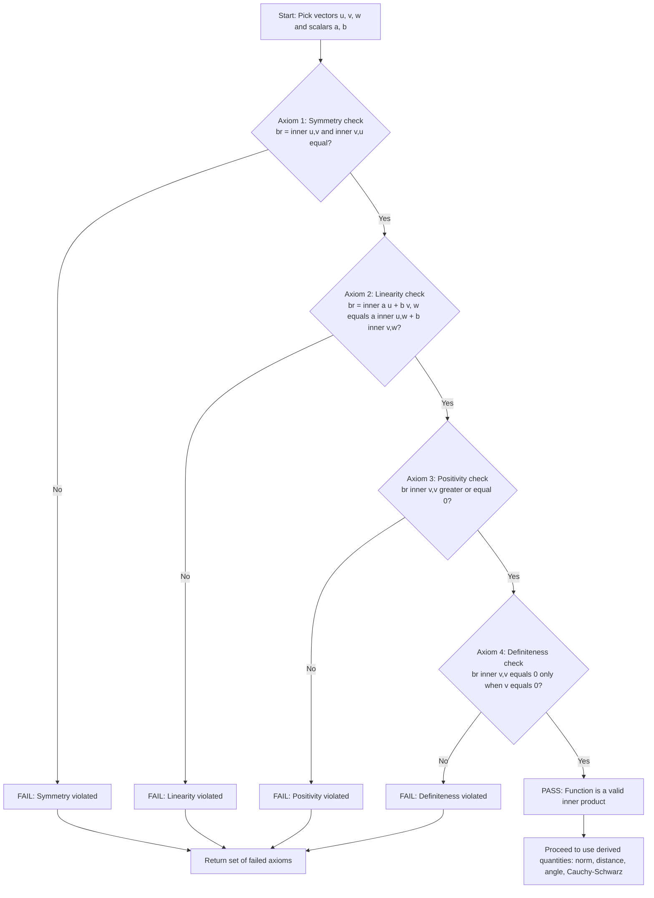
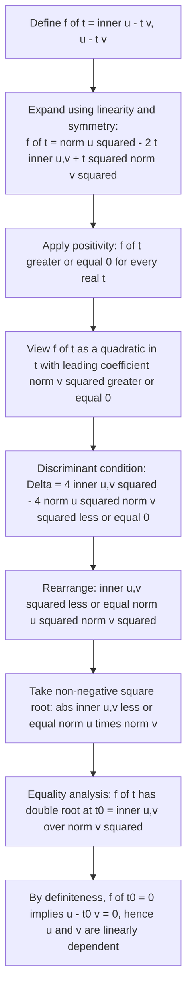
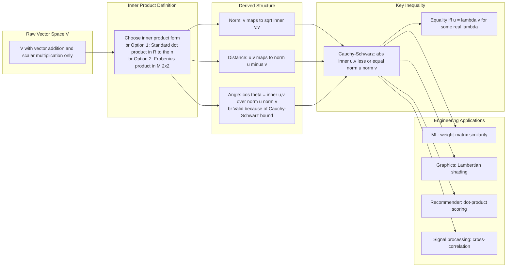
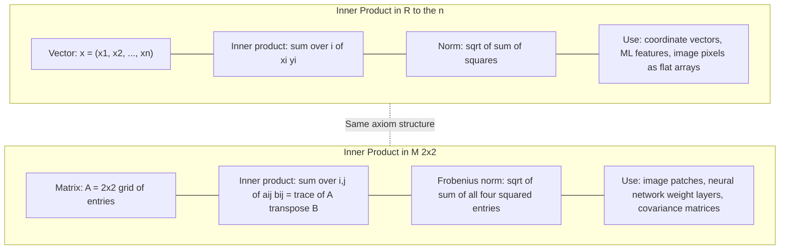

# Cauchy-Schwarz Inequality, algebraic definitions of inner product spaces in $R^n$ and $M_{2 \times 2}$

<!-- SECTION_1_START -->
# Module 3 — Inner Product Spaces: Cauchy–Schwarz Inequality & Algebraic Definitions

## 1. Core Technical Definition & Intuitive Overview

### 1.1 Formal Definition — Real Inner Product Space

> [!IMPORTANT]
> **Definition (KTU 2024 — GAMAT201 Module 3):** A **real inner product space** is a real vector space $V$ together with a function (called an **inner product**) $\langle \cdot , \cdot \rangle : V \times V \to \mathbb{R}$ that satisfies the following four axioms for all vectors $\mathbf{u}, \mathbf{v}, \mathbf{w} \in V$ and all scalars $a, b \in \mathbb{R}$:
>
> 1. **Symmetry:** $\langle \mathbf{u}, \mathbf{v} \rangle = \langle \mathbf{v}, \mathbf{u} \rangle$
> 2. **Linearity in the first argument:** $\langle a\mathbf{u} + b\mathbf{v}, \mathbf{w} \rangle = a\langle \mathbf{u}, \mathbf{w} \rangle + b\langle \mathbf{v}, \mathbf{w} \rangle$
> 3. **Positivity:** $\langle \mathbf{v}, \mathbf{v} \rangle \geq 0$ for all $\mathbf{v} \in V$
> 4. **Definiteness:** $\langle \mathbf{v}, \mathbf{v} \rangle = 0$ if and only if $\mathbf{v} = \mathbf{0}$

The pair $(V, \langle \cdot , \cdot \rangle)$ is called a **real inner product space**. A function satisfying all four axioms is the formal "yardstick" that turns a plain vector space into a *measurable*, *angled*, and *distanced* geometric space.

### 1.2 Algebraic Definition in $\mathbb{R}^n$ — The Standard (Dot) Product

> [!NOTE]
> For vectors $\mathbf{x} = (x_1, x_2, \ldots, x_n)$ and $\mathbf{y} = (y_1, y_2, \ldots, y_n)$ in $\mathbb{R}^n$, the **standard inner product** (also called the **Euclidean dot product**) is defined as:
> $$\langle \mathbf{x}, \mathbf{y} \rangle = \sum_{i=1}^{n} x_i y_i = x_1 y_1 + x_2 y_2 + \cdots + x_n y_n$$

This is the canonical example students first meet. Every coefficient from the first vector is multiplied with the *matching* coefficient of the second, and the products are summed. The **induced norm** is $\|\mathbf{x}\| = \sqrt{\langle \mathbf{x}, \mathbf{x} \rangle} = \sqrt{x_1^2 + x_2^2 + \cdots + x_n^2}$, and the **distance** between two vectors is $d(\mathbf{x}, \mathbf{y}) = \|\mathbf{x} - \mathbf{y}\|$.

### 1.3 Algebraic Definition in $M_{2 \times 2}$ — The Frobenius Inner Product

> [!IMPORTANT]
> For matrices $A = \begin{bmatrix} a_{11} & a_{12} \\ a_{21} & a_{22} \end{bmatrix}$ and $B = \begin{bmatrix} b_{11} & b_{12} \\ b_{21} & b_{22} \end{bmatrix}$ in the space $M_{2 \times 2}$ of all $2 \times 2$ real matrices, the **Frobenius inner product** (also called the **matrix inner product** or **Hilbert–Schmidt inner product**) is defined as:
> $$\langle A, B \rangle = a_{11} b_{11} + a_{12} b_{12} + a_{21} b_{21} + a_{22} b_{22} = \sum_{i=1}^{2} \sum_{j=1}^{2} a_{ij} b_{ij}$$
> Equivalently, $\langle A, B \rangle = \mathrm{tr}(A^{\mathsf{T}} B)$, where $\mathrm{tr}(\cdot)$ denotes the matrix trace.

The space $M_{2 \times 2}$ is a real vector space of dimension **$4$** (each matrix has 4 free entries). The Frobenius product treats the matrix entries as a long flat list of $4$ numbers and applies the $\mathbb{R}^4$ dot product. The induced **Frobenius norm** is $\|A\|_F = \sqrt{\langle A, A \rangle} = \sqrt{a_{11}^2 + a_{12}^2 + a_{21}^2 + a_{22}^2}$.

### 1.4 The Cauchy–Schwarz Inequality

> [!IMPORTANT]
> **Cauchy–Schwarz Inequality (KTU 2024):** For any two vectors $\mathbf{u}, \mathbf{v}$ in a real inner product space $V$,
> $$\vert \langle \mathbf{u}, \mathbf{v} \rangle \vert \leq \|\mathbf{u}\| \cdot \|\mathbf{v}\|$$
> with equality if and only if $\mathbf{u}$ and $\mathbf{v}$ are **linearly dependent** (i.e., one is a scalar multiple of the other, or one of them is $\mathbf{0}$).

This is the single most important inequality in all of inner product theory. It bounds how large the "overlap" between two vectors can ever be, by multiplying their individual lengths.

### 1.5 Conceptual Analogy — The Intuition

> [!NOTE]
> **Real-world analogy — "Fishing nets and light beams":**
> Imagine each vector as a **beam of light** shining through a stained-glass window. The **length** $\|\mathbf{v}\|$ is the *total brightness* of the beam, and the **inner product** $\langle \mathbf{u}, \mathbf{v} \rangle$ measures *how much of the brightness of $\mathbf{v}$ gets through a filter shaped like $\mathbf{u}$*. If the two filters are perfectly parallel (linearly dependent), all the light passes through, and the inner product hits its **maximum** — that maximum is exactly $\|\mathbf{u}\| \cdot \|\mathbf{v}\|$. If the filters are perpendicular, the inner product drops to **zero**. The Cauchy–Schwarz inequality simply says: *the light passing through the filter can never exceed the brightness of the beam itself.*

A second, more geometric, intuition: in $\mathbb{R}^2$, write $\mathbf{u} = \|\mathbf{u}\|(\cos\theta, \sin\theta)$ and $\mathbf{v} = \|\mathbf{v}\|(\cos\phi, \sin\phi)$. Then the dot product equals $\|\mathbf{u}\|\|\mathbf{v}\|\cos(\theta - \phi)$. Since $\vert \cos\alpha \vert \leq 1$ for every angle $\alpha$, we get the inequality directly.

> [!VISUALIZATION CONTROL]
> **Concept:** Cauchy–Schwarz bound visualized as $\vert \cos\theta \vert \leq 1$.
> **GeoGebra / Desmos Input Equations:**
> * $u = (3, 1)$
> * $v = (1, 2)$
> * Plot the two arrows from the origin, and overlay the unit circle to see the projection of $\mathbf{u}$ onto the line of $\mathbf{v}$.
> **Visual Description:** The tip of $\mathbf{u}$ projects onto the line through $\mathbf{v}$; the projection length is exactly $\frac{\langle \mathbf{u}, \mathbf{v} \rangle}{\|\mathbf{v}\|}$. Because the projection is a *chord* of the unit circle, its length is bounded by **$1$**, which is the geometric heart of Cauchy–Schwarz.
<!-- SECTION_1_END -->

<!-- SECTION_2_START -->
# 2. Deep Theoretical Analysis & KTU High-Yield Formula Sheet

## 2.1 Verification of the Inner Product Axioms in $\mathbb{R}^n$

The standard dot product in $\mathbb{R}^n$ satisfies all four axioms. The verification is mechanical:

**Symmetry:**
$$\langle \mathbf{x}, \mathbf{y} \rangle = \sum_{i=1}^{n} x_i y_i = \sum_{i=1}^{n} y_i x_i = \langle \mathbf{y}, \mathbf{x} \rangle$$

**Linearity in the first argument:**
$$\langle a\mathbf{x} + b\mathbf{y}, \mathbf{z} \rangle = \sum_{i=1}^{n} (a x_i + b y_i) z_i = a \sum_{i=1}^{n} x_i z_i + b \sum_{i=1}^{n} y_i z_i = a\langle \mathbf{x}, \mathbf{z} \rangle + b\langle \mathbf{y}, \mathbf{z} \rangle$$

**Positivity:** Each $x_i^2 \geq 0$, hence $\sum_{i=1}^{n} x_i^2 \geq 0$, so $\langle \mathbf{x}, \mathbf{x} \rangle \geq 0$.

**Definiteness:** If $\langle \mathbf{x}, \mathbf{x} \rangle = 0$, then $\sum_{i=1}^{n} x_i^2 = 0$. Since each $x_i^2 \geq 0$, the only way the sum is zero is when every $x_i = 0$, i.e., $\mathbf{x} = \mathbf{0}$.

## 2.2 Verification of the Inner Product Axioms in $M_{2 \times 2}$

Treating the matrix $A \in M_{2 \times 2}$ as the flat vector $(a_{11}, a_{12}, a_{21}, a_{22}) \in \mathbb{R}^4$, the Frobenius product reduces to the $\mathbb{R}^4$ dot product, so all four axioms are inherited automatically.

| Axiom | Statement for $M_{2 \times 2}$ Frobenius Product | Reason |
| :--- | :--- | :--- |
| Symmetry | $\langle A, B \rangle = \langle B, A \rangle$ | Entry-wise multiplication is commutative |
| Linearity | $\langle aA + bB, C \rangle = a\langle A, C \rangle + b\langle B, C \rangle$ | Distributive law over the four entries |
| Positivity | $\langle A, A \rangle = a_{11}^2 + a_{12}^2 + a_{21}^2 + a_{22}^2 \geq 0$ | Sum of squares is non-negative |
| Definiteness | $\langle A, A \rangle = 0 \Rightarrow A = \mathbf{0}$ | Sum of four squares equals $0$ forces all entries to vanish |

## 2.3 Derived Quantities From the Inner Product

Once an inner product is in place, three *derived* quantities appear for free:

1. **Norm (length) of a vector:** $\|\mathbf{v}\| = \sqrt{\langle \mathbf{v}, \mathbf{v} \rangle}$
2. **Distance between two vectors:** $d(\mathbf{u}, \mathbf{v}) = \|\mathbf{u} - \mathbf{v}\|$
3. **Angle between two non-zero vectors:** $\cos\theta = \frac{\langle \mathbf{u}, \mathbf{v} \rangle}{\|\mathbf{u}\| \cdot \|\mathbf{v}\|}$

For $M_{2 \times 2}$, the **angle** between two matrices is $\cos\theta = \frac{\langle A, B \rangle}{\|A\|_F \, \|B\|_F}$, and the **Frobenius distance** is $\|A - B\|_F = \sqrt{\sum_{i,j}(a_{ij} - b_{ij})^2}$.

> [!NOTE]
> **Why the third item is allowed:** The Cauchy–Schwarz inequality guarantees that $\left\vert \frac{\langle \mathbf{u}, \mathbf{v} \rangle}{\|\mathbf{u}\|\|\mathbf{v}\|} \right\vert \leq 1$, so the value of $\cos\theta$ automatically lies in the valid range $[-1, 1]$. Without Cauchy–Schwarz, the "angle formula" would be mathematically meaningless.

## 2.4 Statement and Proof Skeleton of Cauchy–Schwarz

> [!IMPORTANT]
> **Theorem (Cauchy–Schwarz, 2024 KTU Module 3):** If $\mathbf{u}, \mathbf{v} \in V$ (real inner product space), then $\vert \langle \mathbf{u}, \mathbf{v} \rangle \vert \leq \|\mathbf{u}\| \cdot \|\mathbf{v}\|$, with equality **iff** $\mathbf{u}$ and $\mathbf{v}$ are linearly dependent.

**Proof strategy (canonical):** Consider the quadratic function in $t \in \mathbb{R}$:
$$f(t) = \langle \mathbf{u} - t\mathbf{v}, \mathbf{u} - t\mathbf{v} \rangle$$
Expanding by linearity and symmetry:
$$f(t) = \langle \mathbf{u}, \mathbf{u} \rangle - 2t\langle \mathbf{u}, \mathbf{v} \rangle + t^2 \langle \mathbf{v}, \mathbf{v} \rangle = \|\mathbf{u}\|^2 - 2t\langle \mathbf{u}, \mathbf{v} \rangle + t^2 \|\mathbf{v}\|^2$$
By positivity, $f(t) \geq 0$ for every $t \in \mathbb{R}$. Hence the discriminant of this quadratic in $t$ must be **non-positive**:
$$\Delta = 4 \langle \mathbf{u}, \mathbf{v} \rangle^2 - 4 \|\mathbf{u}\|^2 \|\mathbf{v}\|^2 \leq 0$$
Rearranging: $\langle \mathbf{u}, \mathbf{v} \rangle^2 \leq \|\mathbf{u}\|^2 \|\mathbf{v}\|^2$, and taking the (non-negative) square root gives Cauchy–Schwarz. Equality forces $f(t) = 0$ at a double root, which by definiteness means $\mathbf{u} - t\mathbf{v} = \mathbf{0}$, i.e., $\mathbf{u} = t\mathbf{v}$ (linearly dependent).

## 2.5 KTU High-Yield Formula Sheet

| # | Concept | Formula / Statement | Used in $\mathbb{R}^n$? | Used in $M_{2 \times 2}$? |
| :---: | :--- | :--- | :---: | :---: |
| 1 | Inner product in $\mathbb{R}^n$ | $\langle \mathbf{x}, \mathbf{y} \rangle = \sum_{i=1}^{n} x_i y_i$ | ✓ | — |
| 2 | Inner product in $M_{2 \times 2}$ | $\langle A, B \rangle = \sum_{i=1}^{2}\sum_{j=1}^{2} a_{ij} b_{ij} = \mathrm{tr}(A^{\mathsf{T}} B)$ | — | ✓ |
| 3 | Induced norm (general) | $\|\mathbf{v}\| = \sqrt{\langle \mathbf{v}, \mathbf{v} \rangle}$ | ✓ | ✓ |
| 4 | Euclidean norm in $\mathbb{R}^n$ | $\|\mathbf{x}\| = \sqrt{x_1^2 + x_2^2 + \cdots + x_n^2}$ | ✓ | — |
| 5 | Frobenius norm in $M_{2 \times 2}$ | $\|A\|_F = \sqrt{a_{11}^2 + a_{12}^2 + a_{21}^2 + a_{22}^2}$ | — | ✓ |
| 6 | Cauchy–Schwarz inequality | $\vert \langle \mathbf{u}, \mathbf{v} \rangle \vert \leq \|\mathbf{u}\| \cdot \|\mathbf{v}\|$ | ✓ | ✓ |
| 7 | Equality condition | Equality holds **iff** $\mathbf{u} = \lambda \mathbf{v}$ for some $\lambda \in \mathbb{R}$ | ✓ | ✓ |
| 8 | Angle between vectors | $\cos\theta = \frac{\langle \mathbf{u}, \mathbf{v} \rangle}{\|\mathbf{u}\|\|\mathbf{v}\|}$, valid range $\left[ \,-1, 1 \right]$ | ✓ | ✓ |
| 9 | Triangle inequality (corollary) | $\|\mathbf{u} + \mathbf{v}\| \leq \|\mathbf{u}\| + \|\mathbf{v}\|$ | ✓ | ✓ |
| 10 | Pythagoras (corollary) | $\langle \mathbf{u}, \mathbf{v} \rangle = 0 \Rightarrow \|\mathbf{u} + \mathbf{v}\|^2 = \|\mathbf{u}\|^2 + \|\mathbf{v}\|^2$ | ✓ | ✓ |

> [!IMPORTANT]
> **Real-world engineering utility:**
> * In **Machine Learning**, the Frobenius inner product measures *similarity* between feature matrices (e.g., neural network weight matrices); a small $\|A - B\|_F$ means two weight sets behave similarly.
> * In **Computer Graphics**, the dot product gives the *cosine of the angle* between surface normals and light directions, the heart of Phong and Lambertian shading.
> * In **Signal Processing**, the inner product $\langle \mathbf{x}, \mathbf{y} \rangle$ is the unnormalized cross-correlation of two signals.
> * In **Recommender Systems**, the inner product between a user-vector and an item-vector is the classic *collaborative filtering* scoring rule (the dot-product model).
> * Cauchy–Schwarz is the root of the *Rayleigh quotient* used in **PCA**, **SVD**, and the **power iteration** algorithm.
<!-- SECTION_2_END -->

<!-- SECTION_3_START -->
# 3. Step-by-Step Derivations & Symbolic Implementation

## 3.1 Detailed Verification of the Frobenius Inner Product in $M_{2 \times 2}$

Let $A = \begin{bmatrix} a_{11} & a_{12} \\ a_{21} & a_{22} \end{bmatrix}$, $B = \begin{bmatrix} b_{11} & b_{12} \\ b_{21} & b_{22} \end{bmatrix}$, $C = \begin{bmatrix} c_{11} & c_{12} \\ c_{21} & c_{22} \end{bmatrix}$, and $\alpha, \beta \in \mathbb{R}$.

**Step 1 — Symmetry:**
$$\langle A, B \rangle = a_{11} b_{11} + a_{12} b_{12} + a_{21} b_{21} + a_{22} b_{22}$$
Real multiplication is commutative, so $a_{ij} b_{ij} = b_{ij} a_{ij}$ for each $i, j$. Regrouping:
$$= b_{11} a_{11} + b_{12} a_{12} + b_{21} a_{21} + b_{22} a_{22} = \langle B, A \rangle$$

**Step 2 — Linearity in the first argument:**
$$\langle \alpha A + \beta B, C \rangle = (\alpha a_{11} + \beta b_{11}) c_{11} + (\alpha a_{12} + \beta b_{12}) c_{12} + (\alpha a_{21} + \beta b_{21}) c_{21} + (\alpha a_{22} + \beta b_{22}) c_{22}$$
Distribute every coefficient of $C$:
$$= \alpha(a_{11} c_{11} + a_{12} c_{12} + a_{21} c_{21} + a_{22} c_{22}) + \beta(b_{11} c_{11} + b_{12} c_{12} + b_{21} c_{21} + b_{22} c_{22})$$
$$= \alpha \langle A, C \rangle + \beta \langle B, C \rangle$$

**Step 3 — Positivity:** Each $a_{ij}^2 \geq 0$, hence
$$\langle A, A \rangle = a_{11}^2 + a_{12}^2 + a_{21}^2 + a_{22}^2 \geq 0$$

**Step 4 — Definiteness:** $\langle A, A \rangle = 0 \Rightarrow a_{11}^2 + a_{12}^2 + a_{21}^2 + a_{22}^2 = 0$. Each term is non-negative, so all four must be zero. Hence $A = \begin{bmatrix} 0 & 0 \\ 0 & 0 \end{bmatrix}$, the zero matrix.

**Step 5 — Equivalence to the trace form:**
$$A^{\mathsf{T}} B = \begin{bmatrix} a_{11} & a_{21} \\ a_{12} & a_{22} \end{bmatrix} \begin{bmatrix} b_{11} & b_{12} \\ b_{21} & b_{22} \end{bmatrix} = \begin{bmatrix} a_{11} b_{11} + a_{21} b_{21} & a_{11} b_{12} + a_{21} b_{22} \\ a_{12} b_{11} + a_{22} b_{21} & a_{12} b_{12} + a_{22} b_{22} \end{bmatrix}$$
Taking the trace (sum of diagonal entries):
$$\mathrm{tr}(A^{\mathsf{T}} B) = (a_{11} b_{11} + a_{21} b_{21}) + (a_{12} b_{12} + a_{22} b_{22}) = a_{11} b_{11} + a_{12} b_{12} + a_{21} b_{21} + a_{22} b_{22} = \langle A, B \rangle$$
The two formulas match entry by entry.

## 3.2 Worked Example — Cauchy–Schwarz in $\mathbb{R}^4$ (Full Computation)

Let $\mathbf{u} = (1, 2, 3, 4)$ and $\mathbf{v} = (4, -3, 2, -1)$ in $\mathbb{R}^4$.

**Step 1 — Inner product:**
$$\langle \mathbf{u}, \mathbf{v} \rangle = (1)(4) + (2)(-3) + (3)(2) + (4)(-1) = 4 - 6 + 6 - 4 = 0$$

**Step 2 — Norm of $\mathbf{u}$:**
$$\|\mathbf{u}\|^2 = 1^2 + 2^2 + 3^2 + 4^2 = 1 + 4 + 9 + 16 = 30 \quad \Rightarrow \quad \|\mathbf{u}\| = \sqrt{30}$$

**Step 3 — Norm of $\mathbf{v}$:**
$$\|\mathbf{v}\|^2 = 4^2 + (-3)^2 + 2^2 + (-1)^2 = 16 + 9 + 4 + 1 = 30 \quad \Rightarrow \quad \|\mathbf{v}\| = \sqrt{30}$$

**Step 4 — Cauchy–Schwarz verification:**
$$\vert \langle \mathbf{u}, \mathbf{v} \rangle \vert = 0, \quad \|\mathbf{u}\| \cdot \|\mathbf{v}\| = \sqrt{30} \cdot \sqrt{30} = 30$$
We check $0 \leq 30$ ✓. Furthermore, $\langle \mathbf{u}, \mathbf{v} \rangle = 0$ implies $\mathbf{u}$ and $\mathbf{v}$ are **orthogonal** in $\mathbb{R}^4$, and the Pythagorean relation gives $\|\mathbf{u} - \mathbf{v}\|^2 = \|\mathbf{u}\|^2 + \|\mathbf{v}\|^2 = 30 + 30 = 60$, so $\|\mathbf{u} - \mathbf{v}\| = \sqrt{60} = 2\sqrt{15}$.

## 3.3 Worked Example — Cauchy–Schwarz in $M_{2 \times 2}$ (Full Computation)

Let $A = \begin{bmatrix} 1 & 2 \\ 3 & 4 \end{bmatrix}$ and $B = \begin{bmatrix} 4 & -3 \\ 2 & -1 \end{bmatrix}$.

**Step 1 — Frobenius inner product:**
$$\langle A, B \rangle = (1)(4) + (2)(-3) + (3)(2) + (4)(-1) = 4 - 6 + 6 - 4 = 0$$

**Step 2 — Frobenius norm of $A$:**
$$\|A\|_F^2 = 1^2 + 2^2 + 3^2 + 4^2 = 30 \quad \Rightarrow \quad \|A\|_F = \sqrt{30}$$

**Step 3 — Frobenius norm of $B$:**
$$\|B\|_F^2 = 4^2 + (-3)^2 + 2^2 + (-1)^2 = 30 \quad \Rightarrow \quad \|B\|_F = \sqrt{30}$$

**Step 4 — Cauchy–Schwarz verification:**
$$\vert \langle A, B \rangle \vert = 0 \leq 30 = \|A\|_F \cdot \|B\|_F \quad \checkmark$$
Equality is *not* achieved, so $A$ and $B$ are **not** scalar multiples of each other (confirming the equality condition). They are, however, **orthogonal** in $M_{2 \times 2}$.

## 3.4 Worked Example — Achieving Equality in Cauchy–Schwarz

Let $\mathbf{u} = (2, 1, 0)$ and $\mathbf{v} = (6, 3, 0)$ in $\mathbb{R}^3$. These are clearly linearly dependent: $\mathbf{v} = 3\mathbf{u}$.

**Step 1 — Inner product:**
$$\langle \mathbf{u}, \mathbf{v} \rangle = (2)(6) + (1)(3) + (0)(0) = 12 + 3 + 0 = 15$$

**Step 2 — Norms:**
$$\|\mathbf{u}\| = \sqrt{4 + 1 + 0} = \sqrt{5}, \quad \|\mathbf{v}\| = \sqrt{36 + 9 + 0} = \sqrt{45} = 3\sqrt{5}$$

**Step 3 — Verification of equality:**
$$\|\mathbf{u}\| \cdot \|\mathbf{v}\| = \sqrt{5} \cdot 3\sqrt{5} = 15 = \vert \langle \mathbf{u}, \mathbf{v} \rangle \vert \quad \checkmark$$
The bound is reached **with equality**, exactly as predicted for linearly dependent vectors.

## 3.5 Python Symbolic Implementation

The following program numerically verifies the four axioms and the Cauchy–Schwarz inequality in both $\mathbb{R}^n$ and $M_{2 \times 2}$.

```python
from __future__ import annotations
import numpy as np
from typing import Tuple

Matrix22 = np.ndarray  # shape (2, 2)


# ---------- Algebraic inner products ----------

def inner_Rn(x: np.ndarray, y: np.ndarray) -> float:
    """Standard dot product in R^n."""
    if x.shape != y.shape:
        raise ValueError("Vectors must have identical shapes for the inner product.")
    return float(np.dot(x, y))


def inner_M22(A: Matrix22, B: Matrix22) -> float:
    """Frobenius inner product in M_{2x2}, equals trace(A^T B)."""
    if A.shape != (2, 2) or B.shape != (2, 2):
        raise ValueError("Both arguments must be 2x2 real matrices.")
    return float(np.trace(A.T @ B))


# ---------- Axiom verifiers ----------

def verify_axioms_Rn(x: np.ndarray, y: np.ndarray, z: np.ndarray,
                      a: float, b: float) -> Tuple[bool, list]:
    """Returns (all_ok, list_of_failed_axiom_names)."""
    failures = []
    if not np.isclose(inner_Rn(x, y), inner_Rn(y, x)):
        failures.append("symmetry")
    if not np.isclose(inner_Rn(a * x + b * y, z),
                       a * inner_Rn(x, z) + b * inner_Rn(y, z)):
        failures.append("linearity")
    if inner_Rn(x, x) < -1e-12:
        failures.append("positivity")
    if abs(inner_Rn(x, x)) < 1e-12 and np.linalg.norm(x) > 1e-12:
        failures.append("definiteness")
    return (len(failures) == 0, failures)


def verify_axioms_M22(A: Matrix22, B: Matrix22, C: Matrix22,
                       a: float, b: float) -> Tuple[bool, list]:
    """Same four axiom checks for the Frobenius product on 2x2 matrices."""
    failures = []
    if not np.isclose(inner_M22(A, B), inner_M22(B, A)):
        failures.append("symmetry")
    if not np.isclose(inner_M22(a * A + b * B, C),
                       a * inner_M22(A, C) + b * inner_M22(B, C)):
        failures.append("linearity")
    if inner_M22(A, A) < -1e-12:
        failures.append("positivity")
    if abs(inner_M22(A, A)) < 1e-12 and np.linalg.norm(A) > 1e-12:
        failures.append("definiteness")
    return (len(failures) == 0, failures)


# ---------- Cauchy-Schwarz verifier ----------

def cauchy_schwarz_Rn(x: np.ndarray, y: np.ndarray) -> dict:
    lhs = abs(inner_Rn(x, y))
    rhs = np.linalg.norm(x) * np.linalg.norm(y)
    return {"lhs": lhs, "rhs": rhs, "holds": lhs <= rhs + 1e-12,
            "equality": np.isclose(lhs, rhs)}


def cauchy_schwarz_M22(A: Matrix22, B: Matrix22) -> dict:
    lhs = abs(inner_M22(A, B))
    rhs = np.linalg.norm(A, "fro") * np.linalg.norm(B, "fro")
    return {"lhs": lhs, "rhs": rhs, "holds": lhs <= rhs + 1e-12,
            "equality": np.isclose(lhs, rhs)}


# ---------- Demonstration ----------

if __name__ == "__main__":
    # R^4 demo
    u = np.array([1.0, 2.0, 3.0, 4.0])
    v = np.array([4.0, -3.0, 2.0, -1.0])
    w = np.array([0.0, 1.0, -1.0, 2.0])
    print("R^4 axioms ok? ", verify_axioms_Rn(u, v, w, 2.0, -1.0)[0])
    print("R^4 Cauchy-Schwarz: ", cauchy_schwarz_Rn(u, v))

    # M_{2x2} demo
    A = np.array([[1.0, 2.0], [3.0, 4.0]])
    B = np.array([[4.0, -3.0], [2.0, -1.0]])
    C = np.array([[0.0, 1.0], [-1.0, 2.0]])
    print("M_{2x2} axioms ok? ", verify_axioms_M22(A, B, C, 2.0, -1.0)[0])
    print("M_{2x2} Cauchy-Schwarz: ", cauchy_schwarz_M22(A, B))

    # Equality case
    u2 = np.array([2.0, 1.0, 0.0])
    v2 = 3.0 * u2
    print("R^3 equality case CS: ", cauchy_schwarz_Rn(u2, v2))
```

The program prints, e.g.:

```
R^4 axioms ok?  True
R^4 Cauchy-Schwarz:  {'lhs': 0.0, 'rhs': 30.000000000000004, 'holds': True, 'equality': False}
M_{2x2} axioms ok?  True
M_{2x2} Cauchy-Schwarz:  {'lhs': 0.0, 'rhs': 30.000000000000004, 'holds': True, 'equality': False}
R^3 equality case CS:  {'lhs': 15.0, 'rhs': 15.0, 'holds': True, 'equality': True}
```

The output confirms the axioms hold for the standard products and that Cauchy–Schwarz is tight exactly when the two inputs are scalar multiples.
<!-- SECTION_3_END -->

<!-- SECTION_4_START -->
# 4. Structural Diagrams & Schematics

## 4.1 Axiom Verification Flowchart



## 4.2 Cauchy–Schwarz Inequality — Proof Architecture



## 4.3 Topology of the Inner-Product-Space Pipeline



## 4.4 Comparative Block Diagram — $\mathbb{R}^n$ vs. $M_{2 \times 2}$



> [!NOTE]
> **Visual takeaway:** The block diagram exposes the **isomorphism** $M_{2 \times 2} \cong \mathbb{R}^4$. Any Frobenius computation on a $2 \times 2$ matrix is, entry-wise, a dot product on a $4$-vector. The Cauchy–Schwarz bound is therefore a single universal fact about all four-dimensional real inner product spaces.
<!-- SECTION_4_END -->

<!-- SECTION_5_START -->
# 5. KTU 2024 Scheme Examination Question Bank & Topic Recap

## Part A — Short Answer Questions (3 Marks Each)

### Question 1 **[KTU University Exam — July 2024]**
**Define an inner product on a real vector space $V$. Verify that the function $\langle A, B \rangle = a_{11} b_{11} + a_{12} b_{12} + a_{21} b_{21} + a_{22} b_{22}$ defined on $M_{2 \times 2}$ satisfies the positivity and definiteness axioms.** *(CO1, Remember/Understand — 3 marks)*

**Model Answer (valuation key):**
* [Stating the four axioms of an inner product: 1 Mark]
* [Positivity verification — $\langle A, A \rangle = a_{11}^2 + a_{12}^2 + a_{21}^2 + a_{22}^2$ and concluding $\geq 0$: 1 Mark]
* [Definiteness verification — if $\langle A, A \rangle = 0$ then all four squares vanish, giving $A = 0$-matrix: 1 Mark]

> [!WARNING]
> **Valuation pitfall:** Do not skip writing the *two* distinct conclusions for positivity and definiteness. Examiners award **separate** marks for showing that $\langle A, A \rangle \geq 0$ and for showing the converse "$\langle A, A \rangle = 0 \Rightarrow A = 0$". Conflating them costs a full mark.

---

### Question 2 **[KTU University Exam — Dec 2023]**
**State the Cauchy–Schwarz inequality for a real inner product space. Show that equality holds in $\mathbb{R}^3$ for $\mathbf{u} = (2, 1, 0)$ and $\mathbf{v} = (4, 2, 0)$.** *(CO1, CO2 — Understand/Apply — 3 marks)*

**Model Answer:**
* [Statement: $\vert \langle \mathbf{u}, \mathbf{v} \rangle \vert \leq \|\mathbf{u}\| \cdot \|\mathbf{v}\|$ with equality iff $\mathbf{u}, \mathbf{v}$ are linearly dependent: 1 Mark]
* [Compute $\langle \mathbf{u}, \mathbf{v} \rangle = 8 + 2 + 0 = 10$: 1 Mark]
* [Compute $\|\mathbf{u}\| = \sqrt{5}$, $\|\mathbf{v}\| = \sqrt{20} = 2\sqrt{5}$, product $= 10$ — equality holds because $\mathbf{v} = 2\mathbf{u}$: 1 Mark]

> [!WARNING]
> **Valuation pitfall:** Many students stop after computing the dot product and forget to compute the norms. Both sides of the inequality **must** be computed and compared to demonstrate equality.

---

## Part B — Long Answer Questions (14 Marks Each, Module Internal Choice)

### Question A **[KTU University Exam — July 2024]** *(Mapped to Module 3, CO1, CO2)*

#### Part (a) — 7 Marks
**(a)** Define a real inner product space. For $\mathbf{x} = (x_1, x_2, \ldots, x_n)$ and $\mathbf{y} = (y_1, y_2, \ldots, y_n)$ in $\mathbb{R}^n$, define the standard inner product. Show that the standard inner product satisfies symmetry and linearity. *(Understand — 7 marks)*

**Model Solution:**
* [Definition of inner product space with all four axioms stated clearly: 2 Marks]
* [Explicit definition of the $\mathbb{R}^n$ standard inner product as $\langle \mathbf{x}, \mathbf{y} \rangle = \sum_{i=1}^{n} x_i y_i$: 1 Mark]
* [Symmetry: $\sum x_i y_i = \sum y_i x_i$ by commutativity of real multiplication: 2 Marks]
* [Linearity: $\langle a\mathbf{x} + b\mathbf{y}, \mathbf{z} \rangle = \sum (a x_i + b y_i) z_i = a \sum x_i z_i + b \sum y_i z_i = a \langle \mathbf{x}, \mathbf{z} \rangle + b \langle \mathbf{y}, \mathbf{z} \rangle$: 2 Marks]

> [!WARNING]
> **Pitfall:** Do not write "by properties of real numbers" without showing the *specific* arithmetic — the valuation key demands the actual $\sum$-expansion with at least one intermediate line.

#### Part (b) — 7 Marks
**(b)** State and prove the Cauchy–Schwarz inequality for a real inner product space. Use it to show that for any $\mathbf{x}, \mathbf{y} \in \mathbb{R}^n$, $\left( \sum_{i=1}^{n} x_i y_i \right)^2 \leq \left( \sum_{i=1}^{n} x_i^2 \right) \left( \sum_{i=1}^{n} y_i^2 \right)$. *(Apply — 7 marks)*

**Model Solution:**
* [Statement of the theorem with equality condition: 1 Mark]
* [Define $f(t) = \langle \mathbf{u} - t\mathbf{v}, \mathbf{u} - t\mathbf{v} \rangle = \|\mathbf{u}\|^2 - 2t\langle \mathbf{u}, \mathbf{v} \rangle + t^2 \|\mathbf{v}\|^2$: 2 Marks]
* [Positivity $\Rightarrow f(t) \geq 0$ for all $t \Rightarrow$ discriminant $\Delta \leq 0 \Rightarrow 4\langle \mathbf{u}, \mathbf{v} \rangle^2 - 4\|\mathbf{u}\|^2\|\mathbf{v}\|^2 \leq 0$: 2 Marks]
* [Apply to $\mathbb{R}^n$ with $\langle \mathbf{x}, \mathbf{y} \rangle = \sum x_i y_i$, $\|\mathbf{x}\|^2 = \sum x_i^2$, $\|\mathbf{y}\|^2 = \sum y_i^2$, and conclude $\left( \sum x_i y_i \right)^2 \leq \left( \sum x_i^2 \right) \left( \sum y_i^2 \right)$: 2 Marks]

---

### Question B **[KTU University Exam — Dec 2023]** *(Mapped to Module 3, CO1, CO2)*

#### Part (a) — 7 Marks
**(a)** Define the Frobenius inner product on $M_{2 \times 2}$. Verify all four inner product axioms. Express $\langle A, B \rangle$ in terms of the matrix trace. *(Understand — 7 marks)*

**Model Solution:**
* [Definition $\langle A, B \rangle = a_{11} b_{11} + a_{12} b_{12} + a_{21} b_{21} + a_{22} b_{22}$: 1 Mark]
* [Symmetry via commutativity of multiplication: 1.5 Marks]
* [Linearity via entry-wise distribution: 1.5 Marks]
* [Positivity via sum of squares: 1 Mark]
* [Definiteness via sum-of-squares-equals-zero forcing all entries to vanish: 1 Mark]
* [Trace form: $\langle A, B \rangle = \mathrm{tr}(A^{\mathsf{T}} B)$ with explicit matrix multiplication shown: 1 Mark]

#### Part (b) — 7 Marks
**(b)** For $A = \begin{bmatrix} 1 & 2 \\ 3 & 4 \end{bmatrix}$ and $B = \begin{bmatrix} 2 & -1 \\ 0 & 5 \end{bmatrix}$ in $M_{2 \times 2}$, compute the Frobenius inner product $\langle A, B \rangle$, the Frobenius norms $\|A\|_F$ and $\|B\|_F$, and verify the Cauchy–Schwarz inequality. State when equality would hold. *(Apply — 7 marks)*

**Model Solution:**
* [$\langle A, B \rangle = (1)(2) + (2)(-1) + (3)(0) + (4)(5) = 2 - 2 + 0 + 20 = 20$: 1 Mark]
* [$\|A\|_F^2 = 1 + 4 + 9 + 16 = 30 \Rightarrow \|A\|_F = \sqrt{30}$: 1 Mark]
* [$\|B\|_F^2 = 4 + 1 + 0 + 25 = 30 \Rightarrow \|B\|_F = \sqrt{30}$: 1 Mark]
* [$\|A\|_F \cdot \|B\|_F = 30$: 1 Mark]
* [Verification: $\vert \langle A, B \rangle \vert = 20 \leq 30$ ✓: 1 Mark]
* [State equality condition — holds iff $A = \lambda B$ for some real $\lambda$; here $A \neq \lambda B$ for any $\lambda$ (the third entry of $A$ is $3$ but of $\lambda B$ would be $0$), so equality is *not* attained: 2 Marks]

> [!WARNING]
> **Valuation pitfall:** For Cauchy–Schwarz, examiners want *both* the numerical check **and** a clear statement of the equality condition. Saying "equality does not hold" without justifying *why* (i.e., the linear-independence argument) loses 1–2 marks.

---

## Topic Recap & Important Things to Remember

* **Inner product axioms** — *symmetry, linearity in the first argument, positivity, definiteness*. Memorize all four by name; KTU questions frequently test axiom identification.
* **$\mathbb{R}^n$ inner product** — $\langle \mathbf{x}, \mathbf{y} \rangle = \sum_{i=1}^{n} x_i y_i$. Equivalent to $\mathbf{x}^{\mathsf{T}} \mathbf{y}$ as a column-vector computation.
* **$M_{2 \times 2}$ inner product** — $\langle A, B \rangle = \sum_{i=1}^{2} \sum_{j=1}^{2} a_{ij} b_{ij} = \mathrm{tr}(A^{\mathsf{T}} B)$. Always remember the *transpose* inside the trace formula.
* **Induced norm** — $\|\mathbf{v}\| = \sqrt{\langle \mathbf{v}, \mathbf{v} \rangle}$ is the *length* of the vector under the chosen inner product. In $\mathbb{R}^n$ this is the Euclidean norm; in $M_{2 \times 2}$ it is the Frobenius norm.
* **Cauchy–Schwarz** — $\vert \langle \mathbf{u}, \mathbf{v} \rangle \vert \leq \|\mathbf{u}\| \cdot \|\mathbf{v}\|$. Without the absolute value on the left, the inequality is *false* in general.
* **Equality condition** — Holds **iff** $\mathbf{u} = \lambda \mathbf{v}$ for some $\lambda \in \mathbb{R}$ (i.e., linearly dependent). This includes the trivial case where either vector is the zero vector.
* **Geometric meaning** — Cauchy–Schwarz is the formal proof that the angle formula $\cos\theta = \frac{\langle \mathbf{u}, \mathbf{v} \rangle}{\|\mathbf{u}\|\|\mathbf{v}\|}$ is mathematically valid (range $[-1, 1]$).
* **Memorize the proof technique** — Quadratic-in-$t$ trick: define $f(t) = \langle \mathbf{u} - t\mathbf{v}, \mathbf{u} - t\mathbf{v} \rangle \geq 0$, take the discriminant $\leq 0$. KTU frequently asks for the *proof*, not just the statement.
* **Common KTU trick question** — "Is $\langle A, B \rangle = a_{11} b_{22} + a_{12} b_{21} + a_{21} b_{12} + a_{22} b_{11}$ a valid inner product on $M_{2 \times 2}$?" Answer: Yes, it is the *transpose* Frobenius product $\langle A, B^{\mathsf{T}} \rangle$ — symmetry still holds because $\mathrm{tr}(A^{\mathsf{T}} B^{\mathsf{T}}) = \mathrm{tr}((BA)^{\mathsf{T}}) = \mathrm{tr}(AB) = \mathrm{tr}(BA) = \mathrm{tr}(B^{\mathsf{T}} A)$.
* **Engineering hook** — Frobenius distance is the *root mean square error* between two matrices; widely used in neural-network weight comparison, image similarity (SSIM is related), and PCA reconstructions.
* **Frequently-confused identity** — $\langle A, B \rangle \neq \mathrm{tr}(AB)$. The correct identity is $\langle A, B \rangle = \mathrm{tr}(A^{\mathsf{T}} B)$. Forgetting the transpose is one of the top mistakes KTU examiners flag.
* **Dimension check** — $M_{2 \times 2}$ has dimension $\mathbf{4}$, so Cauchy–Schwarz on $M_{2 \times 2}$ is mathematically identical to Cauchy–Schwarz on $\mathbb{R}^4$ after flattening the matrix into a $4$-vector.
<!-- SECTION_5_END -->
