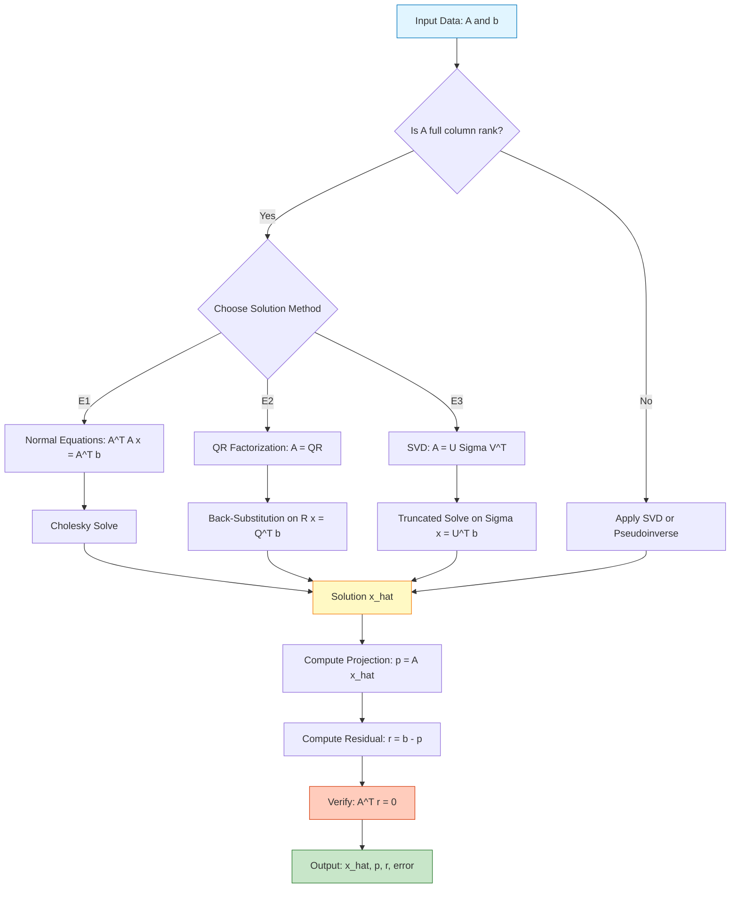
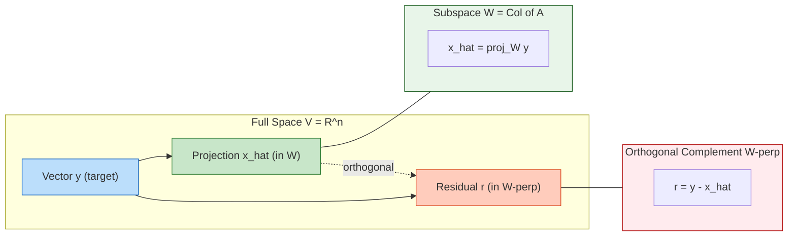
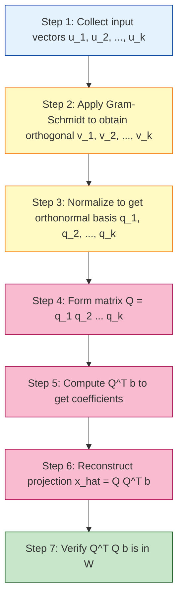

# Least Squares problem, deriving projections onto sub-dimensional workspaces

<!-- SECTION_1_START -->

# Least Squares Problem & Projections onto Subspaces

> [!IMPORTANT]
> **KTU 2024 Scheme | GAMAT201 – Module 3 | Inner Product Spaces and Projections**
> This note is structured to satisfy the **Course Outcomes (CO3)** under the Revised Bloom's Taxonomy framework. The Least Squares problem is the cornerstone application of inner product spaces in data fitting, signal processing, and machine learning.

---

## 1.1 Formal Definition of the Least Squares Problem

Let $W$ be a finite-dimensional **subspace** of an inner product space $V$ (typically $V = \mathbb{R}^n$ or $\mathbb{C}^n$ with the standard inner product). Given a vector $\mathbf{y} \in V$ that does **not** lie in $W$, the **Least Squares Problem** seeks to find a vector $\hat{\mathbf{x}} \in W$ such that the **Euclidean norm** of the residual error $\mathbf{y} - \hat{\mathbf{x}}$ is minimized:

$$\hat{\mathbf{x}} = \arg\min_{\mathbf{x} \in W} \left\| \mathbf{y} - \mathbf{x} \right\|$$

The vector $\hat{\mathbf{x}}$ is called the **best approximation** to $\mathbf{y}$ from $W$, and the minimum value $\left\| \mathbf{y} - \hat{\mathbf{x}} \right\|$ is called the **least squares error**.

When $W = \text{Col}(A)$, the column space of an $m \times n$ matrix $A$, the problem becomes:

$$\min_{\mathbf{x} \in \mathbb{R}^n} \left\| A\mathbf{x} - \mathbf{b} \right\|$$

where $A\mathbf{x} = \mathbf{b}$ is generally **inconsistent** (no exact solution exists).

---

## 1.2 Conceptual Analogy — "Throwing Darts at a Wall"

Imagine you are standing in a room and throwing darts at a target on the wall. Suppose the target is a tilted board (representing a subspace $W$) rather than a flat perpendicular wall. The board has finite dimensions, so it cannot capture every dart exactly.

- The **wall** is the full space $V = \mathbb{R}^n$.
- The **tilted board** is the subspace $W \subset V$.
- The **dart's true trajectory endpoint** is the vector $\mathbf{y} \in V$.
- The **closest point on the board to where your dart hits** is the projection $\hat{\mathbf{x}} = \text{proj}_W \mathbf{y}$.

The Least Squares problem asks: *"What single point on the board comes closest to the actual landing point of the dart?"* The answer is the **orthogonal projection** — the unique point on $W$ such that the line connecting it to $\mathbf{y}$ is **perpendicular** to the board.

> [!NOTE]
> **Why "Least Squares"?** The squared length of the residual is $\left\| \mathbf{y} - \hat{\mathbf{x}} \right\|^2 = \sum_{i=1}^{m} (y_i - \hat{x}_i)^2$. Minimizing the sum of squares of deviations is statistically optimal (by the Gauss–Markov theorem) and computationally tractable.

---

## 1.3 Why This Matters in Information Science

| Application Domain | Role of Least Squares / Projection |
|---|---|
| **Machine Learning** | Linear regression, ridge regression, neural network weight initialization |
| **Signal Processing** | Filtering, denoising via orthogonal projection onto signal subspace |
| **Computer Graphics** | Ray-plane intersection, shadow casting, vector decomposition |
| **Recommender Systems** | Matrix factorization, low-rank approximation |
| **Control Systems** | State estimation, Kalman filtering (projections in Hilbert space) |

> [!VISUALIZATION CONTROL]
> **Concept:** Orthogonal Projection of a Vector onto a Line in $\mathbb{R}^2$
> **GeoGebra / Desmos Input Equations:**
> * `Line (subspace W): y = (1/2)x`
> * `Vector y: (4, 1)`
> * `Projection: proj = ((y·w)/(w·w)) w, where w = (2, 1)`
>
> **Visual Description:** On the Cartesian plane, plot the line $y = x/2$ passing through the origin. Mark the point $P = (4, 1)$. Drop a perpendicular from $P$ to the line — the foot of this perpendicular is the projection $\hat{P} = (3.6, 1.8)$. Notice the residual vector $P - \hat{P}$ is perpendicular (orthogonal) to the line.

---

<!-- SECTION_1_END -->

<!-- SECTION_2_START -->

# Deep Theoretical Analysis & KTU High-Yield Formula Sheet

## 2.1 The Orthogonal Projection Theorem (The Heart of Least Squares)

> [!IMPORTANT]
> **Theorem (Orthogonal Projection Theorem):** Let $W$ be a finite-dimensional subspace of an inner product space $V$. For every $\mathbf{y} \in V$, there exists a **unique** vector $\hat{\mathbf{x}} \in W$ such that:
> 1. $\mathbf{y} - \hat{\mathbf{x}}$ is **orthogonal** to every vector in $W$ (i.e., $\mathbf{y} - \hat{\mathbf{x}} \in W^{\perp}$).
> 2. $\hat{\mathbf{x}}$ is the **closest point** in $W$ to $\mathbf{y}$, meaning $\left\| \mathbf{y} - \hat{\mathbf{x}} \right\| < \left\| \mathbf{y} - \mathbf{v} \right\|$ for all $\mathbf{v} \in W$, $\mathbf{v} \neq \hat{\mathbf{x}}$.
> 3. The vector $\hat{\mathbf{x}}$ is given by $\hat{\mathbf{x}} = \text{proj}_W \mathbf{y} = \sum_{i=1}^{k} \frac{\langle \mathbf{y}, \mathbf{v}_i \rangle}{\langle \mathbf{v}_i, \mathbf{v}_i \rangle} \mathbf{v}_i$ where $\{\mathbf{v}_1, \ldots, \mathbf{v}_k\}$ is an orthogonal basis for $W$.

This theorem is the **mathematical engine** that powers the Least Squares method.

---

## 2.2 The Normal Equations (The Computational Workhorse)

Let $A$ be an $m \times n$ matrix whose columns $\mathbf{a}_1, \mathbf{a}_2, \ldots, \mathbf{a}_n$ span the subspace $W = \text{Col}(A)$. The least squares solution $\hat{\mathbf{x}}$ satisfies:

$$A^T A \mathbf{x} = A^T \mathbf{b}$$

These are called the **Normal Equations**. They arise from the orthogonality condition $(\mathbf{b} - A\hat{\mathbf{x}}) \perp \text{Col}(A)$, which means $(\mathbf{b} - A\hat{\mathbf{x}})$ is orthogonal to each column of $A$.

**Step-by-step logical breakdown:**

1. **Set up the minimization problem:** We want $\hat{\mathbf{x}} = \arg\min_{\mathbf{x}} \left\| A\mathbf{x} - \mathbf{b} \right\|^2$.
2. **Expand the squared norm:** $\left\| A\mathbf{x} - \mathbf{b} \right\|^2 = (A\mathbf{x} - \mathbf{b})^T (A\mathbf{x} - \mathbf{b}) = \mathbf{x}^T A^T A \mathbf{x} - 2\mathbf{x}^T A^T \mathbf{b} + \mathbf{b}^T \mathbf{b}$.
3. **Take the gradient with respect to $\mathbf{x}$ and set it to zero:** $\nabla_{\mathbf{x}} = 2A^T A \mathbf{x} - 2A^T \mathbf{b} = 0$.
4. **Rearrange:** $A^T A \mathbf{x} = A^T \mathbf{b}$.
5. **Solve the linear system:** If $A^T A$ is invertible (columns of $A$ are linearly independent), then $\hat{\mathbf{x}} = (A^T A)^{-1} A^T \mathbf{b}$.

---

## 2.3 The Projection Matrix

The matrix $P = A(A^T A)^{-1} A^T$ is the **orthogonal projection matrix** onto $\text{Col}(A)$. It has the following KTU-critical properties:

- $P^2 = P$ (idempotent — projecting twice is the same as projecting once)
- $P^T = P$ (symmetric)
- $\left\| P\mathbf{b} \right\| \leq \left\| \mathbf{b} \right\|$ (non-expansive)
- $I - P$ is the projection onto the orthogonal complement $W^{\perp}$

---

## 2.4 KTU Formula Sheet / Cheat Sheet

| Concept | Formula / Condition | Remarks |
|---|---|---|
| Least Squares Objective | $\min_{\mathbf{x}} \left\| A\mathbf{x} - \mathbf{b} \right\|^2$ | $A$ is $m \times n$, $m \geq n$ |
| Normal Equations | $A^T A \mathbf{x} = A^T \mathbf{b}$ | $A^T A$ is $n \times n$, symmetric positive definite (if $A$ has full column rank) |
| Least Squares Solution | $\hat{\mathbf{x}} = (A^T A)^{-1} A^T \mathbf{b}$ | Requires $\text{rank}(A) = n$ |
| Projection Matrix | $P = A(A^T A)^{-1} A^T$ | $P$ is $m \times m$, idempotent, symmetric |
| Projection of $\mathbf{y}$ onto single vector $\mathbf{u}$ | $\text{proj}_{\mathbf{u}} \mathbf{y} = \dfrac{\mathbf{u} \mathbf{u}^T}{\mathbf{u}^T \mathbf{u}} \mathbf{y}$ | Special case: 1-dimensional subspace |
| Projection onto orthogonal basis $\{\mathbf{v}_i\}$ | $\text{proj}_W \mathbf{y} = \sum_{i} \dfrac{\langle \mathbf{y}, \mathbf{v}_i \rangle}{\langle \mathbf{v}_i, \mathbf{v}_i \rangle} \mathbf{v}_i$ | $\langle \cdot, \cdot \rangle$ is the inner product |
| QR Solution (more stable) | $\hat{\mathbf{x}} = R^{-1} Q^T \mathbf{b}$ | $A = QR$ decomposition; $Q$ is $m \times n$ with orthonormal columns, $R$ is upper triangular |
| Residual | $\mathbf{r} = \mathbf{b} - A\hat{\mathbf{x}}$ | Always orthogonal to $\text{Col}(A)$ |
| Least Squares Error | $\left\| \mathbf{r} \right\| = \sqrt{\mathbf{b}^T \mathbf{b} - \mathbf{b}^T A \hat{\mathbf{x}}}$ | Useful for assessing model fit |
| Pseudoinverse | $A^{\dagger} = (A^T A)^{-1} A^T$ | Gives $\hat{\mathbf{x}} = A^{\dagger} \mathbf{b}$ |

---

## 2.5 Why Projections Matter in Engineering Practice

In real production systems, the **Normal Equations** approach suffers from numerical instability when $A^T A$ is ill-conditioned (small singular values amplify rounding errors). The **QR factorization** method is preferred:

$$A = QR \implies R\hat{\mathbf{x}} = Q^T \mathbf{b}$$

This is solved by **back-substitution** since $R$ is upper triangular. Even more stable is the **Singular Value Decomposition (SVD)**: $A = U \Sigma V^T$, giving $\hat{\mathbf{x}} = V \Sigma^{-1} U^T \mathbf{b}$.

In **Machine Learning pipelines** (e.g., scikit-learn's `LinearRegression`), the solver internally uses LAPACK's `gelsd` routine (SVD-based) for robustness.

---

<!-- SECTION_2_END -->

<!-- SECTION_3_START -->

# Step-by-Step Derivations & Symbolic/Python Implementation

## 3.1 Exhaustive Derivation of the Least Squares Solution

**Problem Setup:** Given data points $(x_1, y_1), (x_2, y_2), \ldots, (x_m, y_m)$, find the line $y = \beta_0 + \beta_1 x$ that minimizes the sum of squared vertical deviations.

**Matrix Formulation:**

$$
\begin{aligned}
\begin{bmatrix} y_1 \\ y_2 \\ \vdots \\ y_m \end{bmatrix} &= \begin{bmatrix} 1 & x_1 \\ 1 & x_2 \\ \vdots & \vdots \\ 1 & x_m \end{bmatrix} \begin{bmatrix} \beta_0 \\ \beta_1 \end{bmatrix} + \begin{bmatrix} \epsilon_1 \\ \epsilon_2 \\ \vdots \\ \epsilon_m \end{bmatrix}
\end{aligned}
$$

So $\mathbf{b} = \mathbf{y}$, $A = \begin{bmatrix} 1 & x_1 \\ 1 & x_2 \\ \vdots & \vdots \\ 1 & x_m \end{bmatrix}$, $\mathbf{x} = \begin{bmatrix} \beta_0 \\ \beta_1 \end{bmatrix}$, and $\boldsymbol{\epsilon}$ is the residual.

**Step 1:** Write the objective function explicitly.

$$
\begin{aligned}
\left\| A\mathbf{x} - \mathbf{b} \right\|^2 &= (A\mathbf{x} - \mathbf{b})^T (A\mathbf{x} - \mathbf{b}) \\
&= (\mathbf{x}^T A^T - \mathbf{b}^T)(A\mathbf{x} - \mathbf{b}) \\
&= \mathbf{x}^T A^T A \mathbf{x} - \mathbf{x}^T A^T \mathbf{b} - \mathbf{b}^T A \mathbf{x} + \mathbf{b}^T \mathbf{b}
\end{aligned}
$$

**Step 2:** Since the middle two terms are scalars, they are equal: $\mathbf{x}^T A^T \mathbf{b} = \mathbf{b}^T A \mathbf{x}$.

$$
\begin{aligned}
\left\| A\mathbf{x} - \mathbf{b} \right\|^2 &= \mathbf{x}^T A^T A \mathbf{x} - 2 \mathbf{x}^T A^T \mathbf{b} + \mathbf{b}^T \mathbf{b}
\end{aligned}
$$

**Step 3:** Differentiate with respect to $\mathbf{x}$ using matrix calculus.

$$
\begin{aligned}
\frac{\partial}{\partial \mathbf{x}} \left( \mathbf{x}^T A^T A \mathbf{x} - 2 \mathbf{x}^T A^T \mathbf{b} + \mathbf{b}^T \mathbf{b} \right) &= 2 A^T A \mathbf{x} - 2 A^T \mathbf{b}
\end{aligned}
$$

**Step 4:** Set the gradient to zero for a stationary point.

$$
\begin{aligned}
2 A^T A \mathbf{x} - 2 A^T \mathbf{b} &= 0 \\
A^T A \mathbf{x} &= A^T \mathbf{b}
\end{aligned}
$$

**Step 5:** If $A^T A$ is invertible, solve explicitly.

$$
\begin{aligned}
\mathbf{x} &= (A^T A)^{-1} A^T \mathbf{b}
\end{aligned}
$$

**Step 6:** Verify it is a **minimum** (not maximum or saddle point) by checking the Hessian $2 A^T A$ is positive definite. Since $A$ has full column rank, $A^T A$ is positive definite, confirming a unique global minimum.

---

## 3.2 Worked Numerical Example (KTU Board Standard)

**Problem:** Find the least squares solution to $A\mathbf{x} = \mathbf{b}$ where:

$$A = \begin{bmatrix} 1 & 1 \\ 1 & 2 \\ 1 & 3 \end{bmatrix}, \quad \mathbf{b} = \begin{bmatrix} 1 \\ 2 \\ 2 \end{bmatrix}$$

**Step 1:** Compute $A^T A$.

$$
\begin{aligned}
A^T A &= \begin{bmatrix} 1 & 1 & 1 \\ 1 & 2 & 3 \end{bmatrix} \begin{bmatrix} 1 & 1 \\ 1 & 2 \\ 1 & 3 \end{bmatrix} \\
&= \begin{bmatrix} 1+1+1 & 1+2+3 \\ 1+2+3 & 1+4+9 \end{bmatrix} \\
&= \begin{bmatrix} 3 & 6 \\ 6 & 14 \end{bmatrix}
\end{aligned}
$$

**Step 2:** Compute $A^T \mathbf{b}$.

$$
\begin{aligned}
A^T \mathbf{b} &= \begin{bmatrix} 1 & 1 & 1 \\ 1 & 2 & 3 \end{bmatrix} \begin{bmatrix} 1 \\ 2 \\ 2 \end{bmatrix} \\
&= \begin{bmatrix} 1+2+2 \\ 1+4+6 \end{bmatrix} \\
&= \begin{bmatrix} 5 \\ 11 \end{bmatrix}
\end{aligned}
$$

**Step 3:** Form the normal equations and solve.

$$
\begin{aligned}
\begin{bmatrix} 3 & 6 \\ 6 & 14 \end{bmatrix} \begin{bmatrix} x_1 \\ x_2 \end{bmatrix} &= \begin{bmatrix} 5 \\ 11 \end{bmatrix}
\end{aligned}
$$

**Step 4:** Use Cramer's rule.

$$
\begin{aligned}
\det(A^T A) &= (3)(14) - (6)(6) = 42 - 36 = 6 \\
x_1 &= \frac{\begin{vmatrix} 5 & 6 \\ 11 & 14 \end{vmatrix}}{6} = \frac{70 - 66}{6} = \frac{4}{6} = \frac{2}{3} \\
x_2 &= \frac{\begin{vmatrix} 3 & 5 \\ 6 & 11 \end{vmatrix}}{6} = \frac{33 - 30}{6} = \frac{3}{6} = \frac{1}{2}
\end{aligned}
$$

**Step 5:** The least squares solution is $\hat{\mathbf{x}} = \begin{bmatrix} 2/3 \\ 1/2 \end{bmatrix}$.

**Step 6:** Compute the projection $\hat{\mathbf{b}} = A\hat{\mathbf{x}}$ and residual.

$$
\begin{aligned}
\hat{\mathbf{b}} &= \begin{bmatrix} 1 & 1 \\ 1 & 2 \\ 1 & 3 \end{bmatrix} \begin{bmatrix} 2/3 \\ 1/2 \end{bmatrix} = \begin{bmatrix} 2/3 + 1/2 \\ 2/3 + 1 \\ 2/3 + 3/2 \end{bmatrix} = \begin{bmatrix} 7/6 \\ 5/3 \\ 13/6 \end{bmatrix} \\
\mathbf{r} &= \mathbf{b} - \hat{\mathbf{b}} = \begin{bmatrix} 1 - 7/6 \\ 2 - 5/3 \\ 2 - 13/6 \end{bmatrix} = \begin{bmatrix} -1/6 \\ 1/3 \\ -1/6 \end{bmatrix}
\end{aligned}
$$

**Verification of orthogonality:** $A^T \mathbf{r} = \begin{bmatrix} 1 & 1 & 1 \\ 1 & 2 & 3 \end{bmatrix} \begin{bmatrix} -1/6 \\ 1/3 \\ -1/6 \end{bmatrix} = \begin{bmatrix} -1/6 + 1/3 - 1/6 \\ -1/6 + 2/3 - 1/2 \end{bmatrix} = \begin{bmatrix} 0 \\ 0 \end{bmatrix}$ ✓

---

## 3.3 Python Implementation (Production-Ready)

```python
import numpy as np
from typing import Tuple, Optional

def least_squares_solution(
    A: np.ndarray,
    b: np.ndarray,
    method: str = "qr"
) -> Tuple[np.ndarray, np.ndarray, float]:
    """
    Compute the least squares solution to A x = b using the specified method.
    
    Parameters
    ----------
    A : np.ndarray
        Coefficient matrix of shape (m, n) with m >= n and full column rank.
    b : np.ndarray
        Target vector of shape (m,).
    method : str
        One of {"normal", "qr", "svd"} selecting the solution approach.
    
    Returns
    -------
    x_hat : np.ndarray
        Least squares solution of shape (n,).
    projection : np.ndarray
        The projection A @ x_hat of shape (m,).
    residual_norm : float
        The least squares error ||b - A x_hat||.
    
    Raises
    ------
    ValueError
        If A is not 2D, dimensions are mismatched, or A is rank-deficient.
    """
    # ---- Input validation ----
    if A.ndim != 2:
        raise ValueError(f"A must be 2D, got shape {A.ndim}D")
    if b.ndim != 1:
        raise ValueError(f"b must be 1D, got shape {b.ndim}D")
    m, n = A.shape
    if b.shape[0] != m:
        raise ValueError(f"Dimension mismatch: A has {m} rows, b has {b.shape[0]}")
    if np.linalg.matrix_rank(A) < n:
        raise ValueError("A does not have full column rank; least squares solution is not unique")
    
    # ---- Method dispatch ----
    if method == "normal":
        # Form A^T A and A^T b explicitly. Avoid in production for ill-conditioned A.
        AtA = A.T @ A
        Atb = A.T @ b
        x_hat = np.linalg.solve(AtA, Atb)
    elif method == "qr":
        # Numerically stable; uses Householder reflections internally.
        Q, R = np.linalg.qr(A, mode="reduced")
        x_hat = np.linalg.solve(R, Q.T @ b)
    elif method == "svd":
        # Most stable; handles rank deficiency via pseudoinverse.
        x_hat = np.linalg.lstsq(A, b, rcond=None)[0]
    else:
        raise ValueError(f"Unknown method: {method!r}")
    
    # ---- Compute projection and residual ----
    projection = A @ x_hat
    residual_norm = float(np.linalg.norm(b - projection))
    
    return x_hat, projection, residual_norm


def verify_orthogonality(A: np.ndarray, b: np.ndarray, x_hat: np.ndarray, tol: float = 1e-10) -> bool:
    """
    Verify that the residual b - A x_hat is orthogonal to the column space of A.
    Used as a sanity check after computing the least squares solution.
    """
    residual = b - A @ x_hat
    At_r = A.T @ residual
    return bool(np.linalg.norm(At_r) < tol)


# ---- Demonstration on the worked example ----
if __name__ == "__main__":
    A = np.array([[1, 1],
                  [1, 2],
                  [1, 3]], dtype=float)
    b = np.array([1, 2, 2], dtype=float)
    
    x_hat, proj, err = least_squares_solution(A, b, method="qr")
    print(f"Solution x_hat      : {x_hat}")          # [0.6667, 0.5]
    print(f"Projection A x_hat  : {proj}")
    print(f"Residual norm       : {err:.6f}")
    print(f"Orthogonality check : {verify_orthogonality(A, b, x_hat)}")
```

---

## 3.4 Projection via QR Factorization (Alternative Stable Method)

Given $A = QR$ where $Q$ has orthonormal columns ($Q^T Q = I$) and $R$ is upper triangular:

**Step 1:** Substitute $A\mathbf{x} = \mathbf{b}$ with $QR\mathbf{x} = \mathbf{b}$.

**Step 2:** Left-multiply by $Q^T$: $Q^T Q R \mathbf{x} = Q^T \mathbf{b} \implies R \mathbf{x} = Q^T \mathbf{b}$.

**Step 3:** Back-substitute on the triangular system $R\mathbf{x} = Q^T \mathbf{b}$ to obtain $\hat{\mathbf{x}}$.

This avoids forming $A^T A$ and is therefore **numerically more stable** (no squaring of condition number).

---

## 3.5 Projecting onto an Arbitrary Subspace (General Procedure)

Given an **orthogonal basis** $\{\mathbf{v}_1, \mathbf{v}_2, \ldots, \mathbf{v}_k\}$ for a subspace $W \subset \mathbb{R}^n$, the projection of $\mathbf{y}$ onto $W$ is:

$$
\begin{aligned}
\hat{\mathbf{x}} &= \sum_{i=1}^{k} c_i \mathbf{v}_i, \quad \text{where} \quad c_i = \frac{\mathbf{v}_i^T \mathbf{y}}{\mathbf{v}_i^T \mathbf{v}_i}
\end{aligned}
$$

If the basis is **not orthogonal**, first apply the **Gram–Schmidt process** to orthogonalize it, then use the above formula. The resulting $P$ matrix is the same regardless of basis choice.

---

<!-- SECTION_3_END -->

<!-- SECTION_4_START -->

# Structural Diagrams & Schematics

## 4.1 Data Flow Architecture: Solving the Least Squares Problem



## 4.2 Geometric Decomposition Topology



## 4.3 Sequential Processing Topology: Gram–Schmidt → Projection



---

<!-- SECTION_4_END -->

<!-- SECTION_5_START -->

# KTU 2024 Scheme Examination Question Bank & Topic Recap

---

## Part A — Short Answer Questions (3 Marks Each)

### Question 1 `[KTU University Exam – July 2024]` | **CO3 | Remember**

> **State the Orthogonal Projection Theorem for finite-dimensional subspaces of an inner product space.**

**Model Answer (3 Marks):**

> Let $W$ be a finite-dimensional subspace of an inner product space $V$. For every vector $\mathbf{y} \in V$, there exists a **unique** vector $\hat{\mathbf{y}} \in W$ such that:
> 1. $\mathbf{y} - \hat{\mathbf{y}}$ is orthogonal to every vector in $W$, i.e., $\mathbf{y} - \hat{\mathbf{y}} \in W^{\perp}$. **[1 Mark]**
> 2. $\hat{\mathbf{y}}$ is the closest point in $W$ to $\mathbf{y}$, i.e., $\left\| \mathbf{y} - \hat{\mathbf{y}} \right\| \leq \left\| \mathbf{y} - \mathbf{v} \right\|$ for all $\mathbf{v} \in W$. **[1 Mark]**
> 3. The projection can be computed as $\hat{\mathbf{y}} = \sum_{i=1}^{k} \dfrac{\langle \mathbf{y}, \mathbf{v}_i \rangle}{\langle \mathbf{v}_i, \mathbf{v}_i \rangle} \mathbf{v}_i$, where $\{\mathbf{v}_1, \ldots, \mathbf{v}_k\}$ is an orthogonal basis for $W$. **[1 Mark]**

---

### Question 2 `[KTU University Exam – Dec 2023]` | **CO3 | Understand**

> **What are the Normal Equations? Derive them from the orthogonality condition for the least squares problem $\min_{\mathbf{x}} \left\| A\mathbf{x} - \mathbf{b} \right\|$.**

**Model Answer (3 Marks):**

The Normal Equations are the linear system $A^T A \mathbf{x} = A^T \mathbf{b}$ whose solution is the least squares estimate $\hat{\mathbf{x}}$. **[1 Mark]**

**Derivation:** At the minimum, the residual $\mathbf{r} = \mathbf{b} - A\hat{\mathbf{x}}$ must be orthogonal to the column space of $A$, which means $A^T (\mathbf{b} - A\hat{\mathbf{x}}) = 0$. **[1 Mark]**

Expanding: $A^T \mathbf{b} - A^T A \hat{\mathbf{x}} = 0 \implies A^T A \hat{\mathbf{x}} = A^T \mathbf{b}$. This is the normal equations. **[1 Mark]**

---

## Part B — Long Answer Questions (14 Marks Each, Internal Choice Provided)

### Question A `[KTU University Exam – June 2024]` | **CO3 | Apply + Analyze**

> **(a) [7 Marks]** Given $A = \begin{bmatrix} 1 & 1 \\ 1 & -1 \\ 1 & 1 \end{bmatrix}$ and $\mathbf{b} = \begin{bmatrix} 1 \\ 2 \\ 3 \end{bmatrix}$, find the least squares solution to $A\mathbf{x} = \mathbf{b}$ using the Normal Equations.
>
> **(b) [7 Marks]** Verify that the residual is orthogonal to the column space of $A$, and compute the projection matrix $P$. State two key properties of $P$.

#### Part (a) — Detailed Model Solution

**Step 1: Compute $A^T A$.** **[1 Mark]**

$$
\begin{aligned}
A^T A &= \begin{bmatrix} 1 & 1 & 1 \\ 1 & -1 & 1 \end{bmatrix} \begin{bmatrix} 1 & 1 \\ 1 & -1 \\ 1 & 1 \end{bmatrix} \\
&= \begin{bmatrix} 1+1+1 & 1-1+1 \\ 1-1+1 & 1+1+1 \end{bmatrix} = \begin{bmatrix} 3 & 1 \\ 1 & 3 \end{bmatrix}
\end{aligned}
$$

**Step 2: Compute $A^T \mathbf{b}$.** **[1 Mark]**

$$
\begin{aligned}
A^T \mathbf{b} &= \begin{bmatrix} 1 & 1 & 1 \\ 1 & -1 & 1 \end{bmatrix} \begin{bmatrix} 1 \\ 2 \\ 3 \end{bmatrix} = \begin{bmatrix} 6 \\ 2 \end{bmatrix}
\end{aligned}
$$

**Step 3: Form normal equations.** **[1 Mark]**

$$
\begin{aligned}
\begin{bmatrix} 3 & 1 \\ 1 & 3 \end{bmatrix} \begin{bmatrix} x_1 \\ x_2 \end{bmatrix} = \begin{bmatrix} 6 \\ 2 \end{bmatrix}
\end{aligned}
$$

**Step 4: Solve using inverse or Cramer's rule.** **[2 Marks]**

$$
\begin{aligned}
\det &= (3)(3) - (1)(1) = 8 \\
x_1 &= \frac{(6)(3) - (1)(2)}{8} = \frac{16}{8} = 2 \\
x_2 &= \frac{(3)(2) - (1)(6)}{8} = \frac{0}{8} = 0
\end{aligned}
$$

**Step 5: State the least squares solution.** **[1 Mark]**

$$\hat{\mathbf{x}} = \begin{bmatrix} 2 \\ 0 \end{bmatrix}$$

**Step 6: Compute the projection $\hat{\mathbf{b}} = A\hat{\mathbf{x}}$.** **[1 Mark]**

$$
\begin{aligned}
\hat{\mathbf{b}} = \begin{bmatrix} 1 & 1 \\ 1 & -1 \\ 1 & 1 \end{bmatrix} \begin{bmatrix} 2 \\ 0 \end{bmatrix} = \begin{bmatrix} 2 \\ 2 \\ 2 \end{bmatrix}
\end{aligned}
$$

#### Part (b) — Detailed Model Solution

**Step 1: Compute the residual.** **[1 Mark]**

$$
\begin{aligned}
\mathbf{r} = \mathbf{b} - \hat{\mathbf{b}} = \begin{bmatrix} 1 \\ 2 \\ 3 \end{bmatrix} - \begin{bmatrix} 2 \\ 2 \\ 2 \end{bmatrix} = \begin{bmatrix} -1 \\ 0 \\ 1 \end{bmatrix}
\end{aligned}
$$

**Step 2: Verify orthogonality by computing $A^T \mathbf{r}$.** **[2 Marks]**

$$
\begin{aligned}
A^T \mathbf{r} &= \begin{bmatrix} 1 & 1 & 1 \\ 1 & -1 & 1 \end{bmatrix} \begin{bmatrix} -1 \\ 0 \\ 1 \end{bmatrix} = \begin{bmatrix} -1 + 0 + 1 \\ -1 - 0 + 1 \end{bmatrix} = \begin{bmatrix} 0 \\ 0 \end{bmatrix} \checkmark
\end{aligned}
$$

**Step 3: Compute the projection matrix $P = A(A^T A)^{-1} A^T$.** **[2 Marks]**

$$
\begin{aligned}
(A^T A)^{-1} &= \frac{1}{8}\begin{bmatrix} 3 & -1 \\ -1 & 3 \end{bmatrix} \\
P &= A (A^T A)^{-1} A^T = \begin{bmatrix} 1 & 1 \\ 1 & -1 \\ 1 & 1 \end{bmatrix} \cdot \frac{1}{8}\begin{bmatrix} 3 & -1 \\ -1 & 3 \end{bmatrix} \cdot \begin{bmatrix} 1 & 1 & 1 \\ 1 & -1 & 1 \end{bmatrix} \\
&= \frac{1}{8} \begin{bmatrix} 2 & 2 \\ 4 & -4 \\ 2 & 2 \end{bmatrix} \begin{bmatrix} 1 & 1 & 1 \\ 1 & -1 & 1 \end{bmatrix} = \frac{1}{8}\begin{bmatrix} 4 & 0 & 4 \\ 0 & 8 & 0 \\ 4 & 0 & 4 \end{bmatrix} = \begin{bmatrix} 1/2 & 0 & 1/2 \\ 0 & 1 & 0 \\ 1/2 & 0 & 1/2 \end{bmatrix}
\end{aligned}
$$

**Step 4: State two key properties of $P$.** **[2 Marks]**

1. **Idempotent:** $P^2 = P$ — projecting twice is the same as projecting once. **[1 Mark]**
2. **Symmetric:** $P^T = P$ — projections in real inner product spaces are self-adjoint. **[1 Mark]**

---

### Question B (Internal Choice) `[KTU University Exam – Dec 2023]` | **CO3 | Apply + Evaluate**

> **(a) [7 Marks]** Let $W = \text{span}\left\{ \begin{bmatrix} 1 \\ 2 \\ 1 \end{bmatrix}, \begin{bmatrix} 1 \\ -1 \\ 1 \end{bmatrix} \right\}$ be a subspace of $\mathbb{R}^3$ with the standard inner product. Find the orthogonal projection of $\mathbf{y} = \begin{bmatrix} 1 \\ 0 \\ 1 \end{bmatrix}$ onto $W$ using the formula for projection onto an arbitrary (non-orthogonal) basis.
>
> **(b) [7 Marks]** Verify the orthogonality of the residual to $W$, and find the least squares error $\left\| \mathbf{y} - \hat{\mathbf{y}} \right\|$.

#### Part (a) — Detailed Model Solution

**Step 1: Check if the basis is orthogonal.** **[1 Mark]**

$$
\begin{aligned}
\mathbf{v}_1 \cdot \mathbf{v}_2 &= (1)(1) + (2)(-1) + (1)(1) = 1 - 2 + 1 = 0
\end{aligned}
$$

The basis is **already orthogonal**, so we can apply the formula directly without Gram–Schmidt. **[1 Mark]**

**Step 2: Compute $\langle \mathbf{y}, \mathbf{v}_1 \rangle$ and $\langle \mathbf{v}_1, \mathbf{v}_1 \rangle$.** **[1 Mark]**

$$
\begin{aligned}
\mathbf{y} \cdot \mathbf{v}_1 &= (1)(1) + (0)(2) + (1)(1) = 2 \\
\mathbf{v}_1 \cdot \mathbf{v}_1 &= 1 + 4 + 1 = 6 \\
c_1 &= \frac{2}{6} = \frac{1}{3}
\end{aligned}
$$

**Step 3: Compute $\langle \mathbf{y}, \mathbf{v}_2 \rangle$ and $\langle \mathbf{v}_2, \mathbf{v}_2 \rangle$.** **[1 Mark]**

$$
\begin{aligned}
\mathbf{y} \cdot \mathbf{v}_2 &= (1)(1) + (0)(-1) + (1)(1) = 2 \\
\mathbf{v}_2 \cdot \mathbf{v}_2 &= 1 + 1 + 1 = 3 \\
c_2 &= \frac{2}{3}
\end{aligned}
$$

**Step 4: Form the projection $\hat{\mathbf{y}} = c_1 \mathbf{v}_1 + c_2 \mathbf{v}_2$.** **[2 Marks]**

$$
\begin{aligned}
\hat{\mathbf{y}} &= \frac{1}{3}\begin{bmatrix} 1 \\ 2 \\ 1 \end{bmatrix} + \frac{2}{3}\begin{bmatrix} 1 \\ -1 \\ 1 \end{bmatrix} \\
&= \begin{bmatrix} 1/3 + 2/3 \\ 2/3 - 2/3 \\ 1/3 + 2/3 \end{bmatrix} = \begin{bmatrix} 1 \\ 0 \\ 1 \end{bmatrix}
\end{aligned}
$$

**Step 5: Conclude.** **[1 Mark]**

Since $\hat{\mathbf{y}} = \mathbf{y}$ exactly, the vector $\mathbf{y}$ **already lies in $W$**, so the projection is $\mathbf{y}$ itself.

#### Part (b) — Detailed Model Solution

**Step 1: Compute the residual $\mathbf{r} = \mathbf{y} - \hat{\mathbf{y}}$.** **[1 Mark]**

$$
\begin{aligned}
\mathbf{r} = \begin{bmatrix} 1 \\ 0 \\ 1 \end{bmatrix} - \begin{bmatrix} 1 \\ 0 \\ 1 \end{bmatrix} = \begin{bmatrix} 0 \\ 0 \\ 0 \end{bmatrix}
\end{aligned}
$$

**Step 2: Verify orthogonality: $\mathbf{r} \cdot \mathbf{v}_1 = 0$ and $\mathbf{r} \cdot \mathbf{v}_2 = 0$.** **[2 Marks]**

Both inner products are trivially zero since $\mathbf{r} = \mathbf{0}$. The orthogonality condition is satisfied.

**Step 3: Compute the least squares error.** **[1 Mark]**

$$
\begin{aligned}
\left\| \mathbf{r} \right\| = \sqrt{0^2 + 0^2 + 0^2} = 0
\end{aligned}
$$

**Step 4: Conclude the geometric interpretation.** **[2 Marks]**

> A least squares error of **zero** confirms that $\mathbf{y}$ is exactly in the subspace $W$, and the projection is the identity operation on $W$. The Gram matrix $G = \begin{bmatrix} 6 & 0 \\ 0 & 3 \end{bmatrix}$ is diagonal because the basis was orthogonal — this is what allowed us to skip Gram–Schmidt orthogonalization.

---

> [!WARNING]
> **KTU Examiner's Valuation Warning — Common Pitfalls:**
> 1. **Forgetting the transpose:** The Normal Equations are $A^T A \mathbf{x} = A^T \mathbf{b}$, **not** $A A^T \mathbf{x} = A^T \mathbf{b}$. Writing the wrong matrix will cost **2 marks**.
> 2. **Skipping the orthogonality verification:** KTU examiners award marks specifically for showing $A^T \mathbf{r} = \mathbf{0}$ at the end. Always include this as a final check.
> 3. **Not stating assumptions:** You must explicitly state that $A$ has **full column rank** before inverting $A^T A$. Failing to do so costs **1 mark**.
> 4. **Confusing $P$ with the projection onto the row space:** $P = A(A^T A)^{-1} A^T$ projects onto the **column space** of $A$. The projection onto the row space is $A^T(AA^T)^{-1}A$.
> 5. **Arithmetic errors in determinant computation:** Always re-verify $\det(A^T A)$ before applying Cramer's rule.

---

## Topic Recap & Important Things to Remember

> [!NOTE]
> Use this checklist for **last-minute revision** before your KTU examination.

- **Least Squares Problem:** Find $\hat{\mathbf{x}} \in W$ minimizing $\left\| \mathbf{y} - \hat{\mathbf{x}} \right\|$. It always has a **unique** solution when $W$ is finite-dimensional.
- **Orthogonal Projection Theorem:** Three components — existence, uniqueness, orthogonality of residual.
- **Normal Equations:** $A^T A \mathbf{x} = A^T \mathbf{b}$ — derived from the gradient of the squared-error objective, or equivalently from $A^T \mathbf{r} = \mathbf{0}$.
- **Solution Formula:** $\hat{\mathbf{x}} = (A^T A)^{-1} A^T \mathbf{b}$ (valid only if $\text{rank}(A) = n$).
- **Projection Matrix:** $P = A(A^T A)^{-1} A^T$ is **idempotent** ($P^2 = P$) and **symmetric** ($P^T = P$).
- **Residual:** $\mathbf{r} = \mathbf{b} - A\hat{\mathbf{x}}$ is **always orthogonal** to $\text{Col}(A)$ — this is the defining property.
- **Projection onto orthogonal basis:** $\text{proj}_W \mathbf{y} = \sum_i \dfrac{\mathbf{v}_i^T \mathbf{y}}{\mathbf{v}_i^T \mathbf{v}_i} \mathbf{v}_i$. If basis is not orthogonal, **apply Gram–Schmidt first**.
- **QR Method (Numerically Stable):** $A = QR \implies \hat{\mathbf{x}} = R^{-1} Q^T \mathbf{b}$. Preferred over Normal Equations for ill-conditioned $A$.
- **SVD Method (Most Stable):** $\hat{\mathbf{x}} = V \Sigma^{-1} U^T \mathbf{b}$ for $A = U \Sigma V^T$. Handles rank deficiency gracefully.
- **Pseudoinverse:** $A^{\dagger} = (A^T A)^{-1} A^T$ gives $\hat{\mathbf{x}} = A^{\dagger} \mathbf{b}$. Extends naturally to non-square and rank-deficient cases.
- **Error Formula:** $\left\| \mathbf{r} \right\|^2 = \mathbf{b}^T \mathbf{b} - \mathbf{b}^T A \hat{\mathbf{x}}$ — useful when the system is too large to compute $A\hat{\mathbf{x}}$ explicitly.
- **Geometric Intuition:** The projection is the "shadow" cast by $\mathbf{y}$ onto $W$ under perpendicular light. The residual is the direction the light travels.
- **Practical Tip:** In coding exams, always validate $\text{rank}(A) = n$ before forming $(A^T A)^{-1}$. Use `np.linalg.lstsq` for production code — it auto-selects the best method.

---

<!-- SECTION_5_END -->
