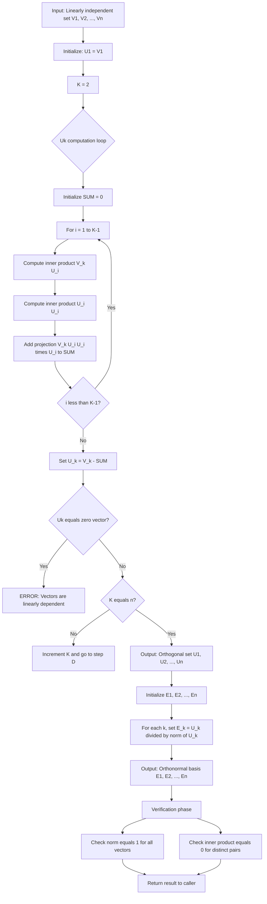
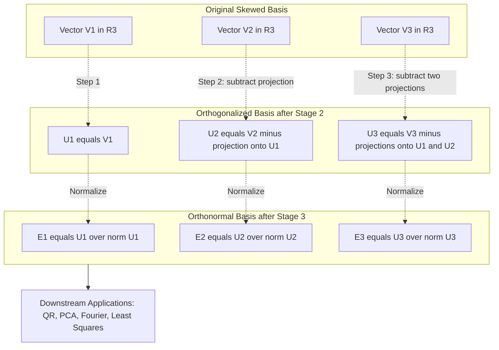
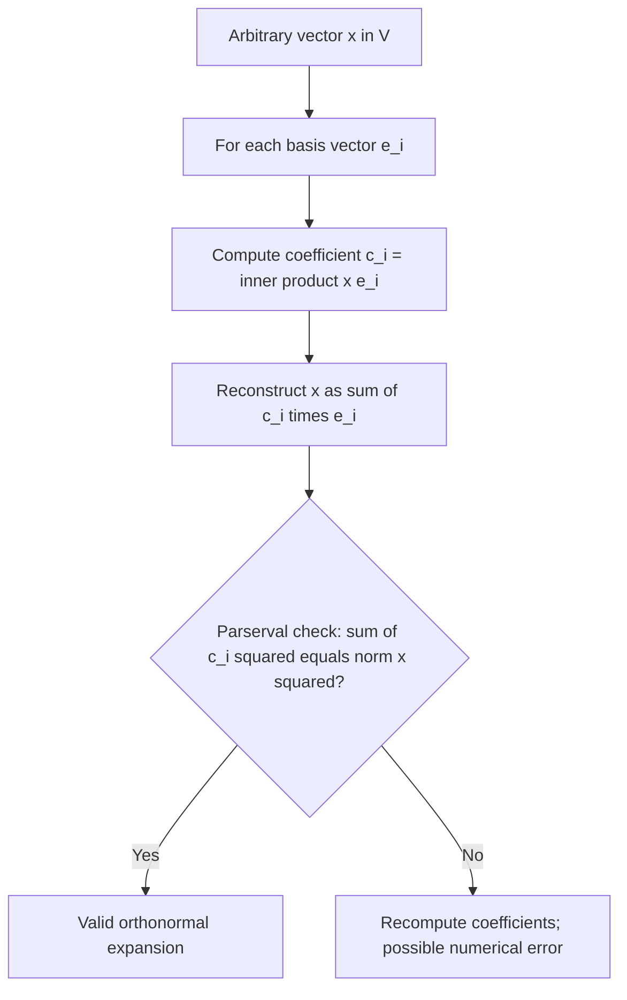

# Orthogonal and orthonormal sets/bases, Gram-Schmidt orthonormalization process

<!-- SECTION_1_START -->
# Orthogonal and Orthonormal Sets/Bases & The Gram-Schmidt Process

## 1.1 Recalling the Inner Product Space

Before we plunge into orthogonality, we must lock down the environment in which it lives — the **Inner Product Space**. Let $V$ be a vector space over the field $\mathbb{R}$ (or $\mathbb{C}$). An **inner product** on $V$ is a function

$$\langle \cdot , \cdot \rangle : V \times V \rightarrow \mathbb{R} \quad (\text{or } \mathbb{C})$$

that assigns to every pair of vectors $\mathbf{u}, \mathbf{v} \in V$ a scalar $\langle \mathbf{u}, \mathbf{v} \rangle$ satisfying the following four axioms:

1. **Conjugate Symmetry:** $\langle \mathbf{u}, \mathbf{v} \rangle = \overline{\langle \mathbf{v}, \mathbf{u} \rangle}$
2. **Linearity in the first argument:** $\langle a\mathbf{u}_1 + b\mathbf{u}_2, \mathbf{v} \rangle = a\langle \mathbf{u}_1, \mathbf{v} \rangle + b\langle \mathbf{u}_2, \mathbf{v} \rangle$
3. **Positivity:** $\langle \mathbf{v}, \mathbf{v} \rangle \geq 0$, with equality **iff** $\mathbf{v} = \mathbf{0}$
4. **Conjugate of scalar:** $\langle \mathbf{v}, a\mathbf{u} \rangle = \bar{a}\langle \mathbf{v}, \mathbf{u} \rangle$

The pair $(V, \langle \cdot , \cdot \rangle)$ is then called an **Inner Product Space**. A vector space equipped with an inner product automatically inherits a **norm** (length) and a **metric** (distance), given by:

$$\|\mathbf{v}\| = \sqrt{\langle \mathbf{v}, \mathbf{v} \rangle} \quad \text{and} \quad d(\mathbf{u}, \mathbf{v}) = \|\mathbf{u} - \mathbf{v}\|$$

> [!NOTE]
> **KTU Board Definition (Canonical Form):** A real inner product space $(V, \langle \cdot , \cdot \rangle)$ is a real vector space $V$ together with a symmetric, bilinear, positive-definite form. The most familiar example is $\mathbb{R}^n$ with the dot product $\langle \mathbf{u}, \mathbf{v} \rangle = \mathbf{u}^T \mathbf{v} = \sum_{i=1}^{n} u_i v_i$.

### Standard Inner Products Encountered in KTU Papers

| Space | Standard Inner Product | Norm |
| :--- | :--- | :--- |
| $\mathbb{R}^n$ | $\langle \mathbf{u}, \mathbf{v} \rangle = \sum_{i=1}^{n} u_i v_i$ | $\sqrt{\sum u_i^2}$ |
| $\mathbb{C}^n$ | $\langle \mathbf{u}, \mathbf{v} \rangle = \sum_{i=1}^{n} u_i \overline{v_i}$ | $\sqrt{\sum \vert u_i \vert^2}$ |
| $C[a,b]$ | $\langle f, g \rangle = \int_{a}^{b} f(x) g(x) \, dx$ | $\sqrt{\int_{a}^{b} f(x)^2 \, dx}$ |
| $\mathcal{M}_{m \times n}(\mathbb{R})$ | $\langle A, B \rangle = \text{tr}(B^T A)$ | Frobenius norm |

---

## 1.2 The Notion of Orthogonality — A Geometric Intuition

> [!IMPORTANT]
> **Core Definition (KTU Syllabus Wording):** Two vectors $\mathbf{u}, \mathbf{v} \in V$ are said to be **orthogonal** if $\langle \mathbf{u}, \mathbf{v} \rangle = 0$. In this case we write $\mathbf{u} \perp \mathbf{v}$.

### Conceptual Analogy — The "Compass Needle" Viewpoint

Imagine a 2-D plane with a compass. The **North** direction and the **East** direction are perpendicular — they neither pull the needle in the same direction nor against it. Now think of the dot product as a "compatibility meter":

- A **large positive** dot product $\Rightarrow$ vectors lean the same way (acute angle).
- A **large negative** dot product $\Rightarrow$ vectors oppose each other (obtuse angle).
- A **zero** dot product $\Rightarrow$ the vectors are perpendicular — they share no "directional information."

> [!TIP]
> **Intuitive Hook:** Orthogonal vectors are "informationally independent." This is the deep reason orthonormal bases power **Fourier transforms, PCA, QR decomposition, and signal compression.**

### Conceptual Analogy — The "Wall and Shadow" Picture

If you stand a stick upright on a flat floor and shine a flashlight from above, the shadow on the floor is the **projection** of the stick onto the floor. The stick and the floor are orthogonal directions. The Gram-Schmidt process (covered later) is essentially the systematic way of constructing such perpendicular axes from arbitrary vectors.

---

## 1.3 Orthogonal Sets and Orthonormal Sets

### Formal Definition — Orthogonal Set

> [!NOTE]
> A subset $S = \{\mathbf{v}_1, \mathbf{v}_2, \ldots, \mathbf{v}_k\} \subset V$ is called an **orthogonal set** if every pair of *distinct* vectors from $S$ is orthogonal:
> $$\langle \mathbf{v}_i, \mathbf{v}_j \rangle = 0 \quad \text{for all } i \neq j, \quad 1 \leq i, j \leq k$$

### Formal Definition — Orthonormal Set

A set $S$ is called an **orthonormal set** if it is an orthogonal set **and** every vector in $S$ is a **unit vector**:

$$\|\mathbf{v}_i\| = 1 \quad \text{for all } i, \quad \text{and} \quad \langle \mathbf{v}_i, \mathbf{v}_j \rangle = \delta_{ij}$$

where $\delta_{ij}$ is the **Kronecker delta**, defined as $\delta_{ij} = 1$ if $i=j$ and $0$ otherwise.

In compact form, an orthonormal set satisfies:

$$\langle \mathbf{v}_i, \mathbf{v}_j \rangle = \delta_{ij} = \begin{cases} 1 & \text{if } i = j \\ 0 & \text{if } i \neq j \end{cases}$$

### Quick Numerical Sanity Check (2-D Vectors)

Consider $\mathbf{e}_1 = (1, 0)$ and $\mathbf{e}_2 = (0, 1)$ in $\mathbb{R}^2$.
- $\langle \mathbf{e}_1, \mathbf{e}_2 \rangle = (1)(0) + (0)(1) = 0$ ✔ (orthogonal)
- $\|\mathbf{e}_1\| = \sqrt{1^2 + 0^2} = 1$, $\|\mathbf{e}_2\| = \sqrt{0^2 + 1^2} = 1$ ✔ (unit length)

Therefore $\{\mathbf{e}_1, \mathbf{e}_2\}$ is an **orthonormal set** in $\mathbb{R}^2$. These are the standard basis vectors — the simplest, most useful orthonormal set you will ever meet.

---

## 1.4 Orthogonal and Orthonormal Bases

> [!IMPORTANT]
> **Definition (KTU Board Favourite):** An **orthogonal basis** for an inner product space $V$ is a basis of $V$ that is also an orthogonal set. An **orthonormal basis** is a basis that is also an orthonormal set.

### Why Orthonormal Bases Are the Gold Standard

1. **Coordinate extraction is trivial:** The coefficient of $\mathbf{v}_i$ when expanding an arbitrary vector is simply $c_i = \langle \mathbf{v}, \mathbf{v}_i \rangle$ (no system of equations to solve).
2. **Coefficients are uncorrelated (information-independent).**
3. **Length of any vector follows Pythagoras:** $\|\mathbf{v}\|^2 = \sum c_i^2$.
4. **The transition matrix between two orthonormal bases is orthogonal** ($Q^T Q = I$).

> [!VISUALIZATION CONTROL]
> **Concept:** Orthogonal basis vectors as perpendicular axes in $\mathbb{R}^3$.
> **GeoGebra / Desmos Input Equations (as 3D points or vectors):**
> * $\mathbf{e}_1 = (1, 0, 0)$, $\mathbf{e}_2 = (0, 1, 0)$, $\mathbf{e}_3 = (0, 0, 1)$
> * Custom basis: $\mathbf{u}_1 = (1, 1, 0)/\sqrt{2}$, $\mathbf{u}_2 = (-1, 1, 0)/\sqrt{2}$, $\mathbf{u}_3 = (0, 0, 1)$
> **Visual Description:** You should see three mutually perpendicular unit arrows emerging from the origin. They remain orthogonal under rotation, demonstrating that any rotation matrix preserves orthonormality.
<!-- SECTION_1_END -->

<!-- SECTION_2_START -->
# Deep Theoretical Analysis — Properties, Theorems & High-Yield Formula Sheet

## 2.1 Fundamental Theorem: A Non-Zero Orthogonal Set is Linearly Independent

> [!IMPORTANT]
> **Theorem 2.1 (Linear Independence of Orthogonal Sets):** If $S = \{\mathbf{v}_1, \mathbf{v}_2, \ldots, \mathbf{v}_k\}$ is a non-empty set of non-zero orthogonal vectors in an inner product space $V$, then $S$ is linearly independent.

### Proof (Skim with Intuition, then memorize for KTU)

Suppose there exist scalars $c_1, c_2, \ldots, c_k$ such that:

$$c_1 \mathbf{v}_1 + c_2 \mathbf{v}_2 + \cdots + c_k \mathbf{v}_k = \mathbf{0}$$

Take the inner product of both sides with $\mathbf{v}_j$ (any fixed index $j$):

$$\langle c_1 \mathbf{v}_1 + c_2 \mathbf{v}_2 + \cdots + c_k \mathbf{v}_k, \mathbf{v}_j \rangle = \langle \mathbf{0}, \mathbf{v}_j \rangle = 0$$

By linearity of the inner product:

$$c_1 \langle \mathbf{v}_1, \mathbf{v}_j \rangle + c_2 \langle \mathbf{v}_2, \mathbf{v}_j \rangle + \cdots + c_k \langle \mathbf{v}_k, \mathbf{v}_j \rangle = 0$$

Since the set is orthogonal, all inner products vanish **except** when $i = j$:

$$c_j \langle \mathbf{v}_j, \mathbf{v}_j \rangle = 0$$

Because $\mathbf{v}_j \neq \mathbf{0}$, we know $\langle \mathbf{v}_j, \mathbf{v}_j \rangle = \|\mathbf{v}_j\|^2 > 0$. Hence:

$$c_j = 0$$

Repeating for $j = 1, 2, \ldots, k$, we conclude that all $c_j = 0$, proving linear independence. $\blacksquare$

### Immediate Corollary (Worth 3 Marks!)

> [!NOTE]
> **Corollary:** Any orthogonal set of $n$ non-zero vectors in an $n$-dimensional inner product space $V$ is a basis for $V$.

---

## 2.2 Expansion Theorem (Coordinates in an Orthogonal Basis)

> [!IMPORTANT]
> **Theorem 2.2 (Coordinates w.r.t. an Orthogonal Basis):** Let $\{\mathbf{v}_1, \mathbf{v}_2, \ldots, \mathbf{v}_n\}$ be an orthogonal basis for $V$. Then any vector $\mathbf{v} \in V$ can be expressed uniquely as:
> $$\mathbf{v} = \frac{\langle \mathbf{v}, \mathbf{v}_1 \rangle}{\langle \mathbf{v}_1, \mathbf{v}_1 \rangle} \mathbf{v}_1 + \frac{\langle \mathbf{v}, \mathbf{v}_2 \rangle}{\langle \mathbf{v}_2, \mathbf{v}_2 \rangle} \mathbf{v}_2 + \cdots + \frac{\langle \mathbf{v}, \mathbf{v}_n \rangle}{\langle \mathbf{v}_n, \mathbf{v}_n \rangle} \mathbf{v}_n$$

In the **orthonormal** case ($\|\mathbf{v}_i\| = 1$, so $\langle \mathbf{v}_i, \mathbf{v}_i \rangle = 1$), the formula collapses to the elegant:

$$\mathbf{v} = \sum_{i=1}^{n} \langle \mathbf{v}, \mathbf{v}_i \rangle \, \mathbf{v}_i$$

The **Fourier coefficient** $c_i = \langle \mathbf{v}, \mathbf{v}_i \rangle$ is then a *projection* of $\mathbf{v}$ onto the $\mathbf{v}_i$-axis.

### Geometric Interpretation

The vector $\mathbf{v}$ is being **decomposed into independent perpendicular components** — like decomposing a force vector along three mutually perpendicular directions in physics. The magnitude of each perpendicular component is exactly the inner product.

---

## 2.3 Norm and Distance in an Orthogonal Basis

> [!IMPORTANT]
> **Theorem 2.3 (Pythagorean Theorem in Inner Product Spaces):** If $\{\mathbf{v}_1, \ldots, \mathbf{v}_n\}$ is an orthogonal set and $\mathbf{v} = \sum c_i \mathbf{v}_i$, then:
> $$\|\mathbf{v}\|^2 = \sum_{i=1}^{n} \vert c_i \vert^2 \, \|\mathbf{v}_i\|^2$$
> For the orthonormal case, this simplifies to: $\|\mathbf{v}\|^2 = \sum_{i=1}^{n} \vert c_i \vert^2$

**Bessel's Inequality (Always Holds, Not Just for Bases):**

If $S = \{\mathbf{v}_1, \mathbf{v}_2, \ldots, \mathbf{v}_k\}$ is any *orthonormal* set in an inner product space $V$ and $\mathbf{v} \in V$, then:

$$\sum_{i=1}^{k} \vert \langle \mathbf{v}, \mathbf{v}_i \rangle \vert^2 \leq \|\mathbf{v}\|^2$$

**Parseval's Identity (When $S$ is a Complete Orthonormal Basis):**

$$\sum_{i=1}^{\infty} \vert \langle \mathbf{v}, \mathbf{v}_i \rangle \vert^2 = \|\mathbf{v}\|^2$$

---

## 2.4 The KTU High-Yield Formula Sheet

> [!TIP]
> **Print this table or memorize it — it covers ~70% of Module 3 problems.**

| Concept | Formula | Conditions |
| :--- | :--- | :--- |
| Orthogonality | $\langle \mathbf{u}, \mathbf{v} \rangle = 0$ | Inner product space $(V, \langle \cdot , \cdot \rangle)$ |
| Norm from inner product | $\|\mathbf{v}\| = \sqrt{\langle \mathbf{v}, \mathbf{v} \rangle}$ | Always valid |
| Cauchy-Schwarz | $\vert \langle \mathbf{u}, \mathbf{v} \rangle \vert \leq \|\mathbf{u}\| \cdot \|\mathbf{v}\|$ | Inner product space |
| Coordinate coefficient (orthogonal) | $c_i = \dfrac{\langle \mathbf{v}, \mathbf{v}_i \rangle}{\langle \mathbf{v}_i, \mathbf{v}_i \rangle}$ | $\{\mathbf{v}_i\}$ orthogonal |
| Coordinate coefficient (orthonormal) | $c_i = \langle \mathbf{v}, \mathbf{v}_i \rangle$ | $\{\mathbf{v}_i\}$ orthonormal |
| Pythagoras | $\|\mathbf{v}\|^2 = \sum c_i^2 \|\mathbf{v}_i\|^2$ | Orthogonal expansion |
| Projection of $\mathbf{u}$ onto $\mathbf{v}$ | $\text{proj}_{\mathbf{v}} \mathbf{u} = \dfrac{\langle \mathbf{u}, \mathbf{v} \rangle}{\langle \mathbf{v}, \mathbf{v} \rangle} \mathbf{v}$ | $\mathbf{v} \neq \mathbf{0}$ |
| Unit vector in direction of $\mathbf{v}$ | $\hat{\mathbf{v}} = \mathbf{v} / \|\mathbf{v}\|$ | $\mathbf{v} \neq \mathbf{0}$ |
| Gram-Schmidt Step | $\mathbf{u}_k = \mathbf{v}_k - \sum_{i=1}^{k-1} \dfrac{\langle \mathbf{v}_k, \mathbf{u}_i \rangle}{\langle \mathbf{u}_i, \mathbf{u}_i \rangle} \mathbf{u}_i$ | Produces orthogonal set |
| Normalization Step | $\mathbf{e}_k = \mathbf{u}_k / \|\mathbf{u}_k\|$ | $\mathbf{u}_k \neq \mathbf{0}$ |
| Bessel's Inequality | $\sum \vert \langle \mathbf{v}, \mathbf{e}_i \rangle \vert^2 \leq \|\mathbf{v}\|^2$ | Orthonormal set |
| Transition matrix $Q$ | $Q^T Q = I$ | Between orthonormal bases |

---

## 2.5 Real-World Engineering Utility

> [!NOTE]
> **Where Orthogonal & Orthonormal Bases Show Up in Practice (Kerala IT Industry Perspective):**

1. **Signal Processing & Fourier Series:** Any periodic signal is decomposed into an *infinite* orthonormal basis $\{1, \cos(nx), \sin(nx)\}$ — the **Fourier coefficients** are precisely the inner products $\langle f, \mathbf{e}_n \rangle$.
2. **Data Science / PCA:** Principal Component Analysis finds the **orthonormal basis** (principal axes) along which data variance is maximized. Used heavily at UST, TCS, and IBS software hubs in Kerala.
3. **Quantum Computing:** Quantum states are unit vectors in a complex inner product space (Hilbert space). Measurement probabilities are $|\langle \psi, \phi \rangle|^2$.
4. **Computer Graphics:** Rotations and reflections in 3-D games preserve lengths and angles — they are **orthogonal matrices** acting on orthonormal bases.
5. **Machine Learning Kernels:** Kernel methods (SVM, Gaussian processes) define inner products in high-dimensional feature spaces, and the kernel trick uses orthogonality properties.
6. **Least Squares Regression:** The normal equation $A^T A x = A^T b$ relies on the projection of $\mathbf{b}$ onto the column space of $A$ — an orthogonal projection.
7. **QR Decomposition:** The $\mathbf{Q}$ matrix in $A = QR$ is exactly the result of applying Gram-Schmidt to the columns of $A$ — numerically stable orthogonalization.
<!-- SECTION_2_END -->

<!-- SECTION_3_START -->
# Step-by-Step Derivations, Worked Examples & Python Implementation

## 3.1 The Gram-Schmidt Orthogonalization Process — Full Derivation

### 3.1.1 Motivation (The "Why" Before the "How")

Suppose we are given a basis $\{\mathbf{v}_1, \mathbf{v}_2, \ldots, \mathbf{v}_n\}$ of an inner product space $V$, but the basis vectors are *not* orthogonal. Many computations (projections, coordinates, decompositions) become *much* cleaner when the basis is orthogonal or orthonormal. The **Gram-Schmidt process** is a deterministic algorithm that converts any basis into an orthogonal (or orthonormal) one **without changing the span** of the original vectors.

> [!NOTE]
> **Historical Note:** Named after Jørgen Pedersen Gram (Danish, 1883) and Erhard Schmidt (German, 1907). The process is the backbone of the QR factorization used by NumPy, MATLAB, and LAPACK.

### 3.1.2 Construction of the Orthogonal Set $\{\mathbf{u}_1, \mathbf{u}_2, \ldots, \mathbf{u}_n\}$

**Step 1:** Set $\mathbf{u}_1 = \mathbf{v}_1$. (Trivially, $\text{span}\{\mathbf{u}_1\} = \text{span}\{\mathbf{v}_1\}$.)

**Step 2:** To make $\mathbf{u}_2$ orthogonal to $\mathbf{u}_1$, subtract from $\mathbf{v}_2$ its projection onto $\mathbf{u}_1$:

$$\mathbf{u}_2 = \mathbf{v}_2 - \frac{\langle \mathbf{v}_2, \mathbf{u}_1 \rangle}{\langle \mathbf{u}_1, \mathbf{u}_1 \rangle} \mathbf{u}_1$$

**Verification of Orthogonality:**

$$\langle \mathbf{u}_2, \mathbf{u}_1 \rangle = \left\langle \mathbf{v}_2 - \frac{\langle \mathbf{v}_2, \mathbf{u}_1 \rangle}{\langle \mathbf{u}_1, \mathbf{u}_1 \rangle} \mathbf{u}_1, \, \mathbf{u}_1 \right\rangle$$

$$= \langle \mathbf{v}_2, \mathbf{u}_1 \rangle - \frac{\langle \mathbf{v}_2, \mathbf{u}_1 \rangle}{\langle \mathbf{u}_1, \mathbf{u}_1 \rangle} \langle \mathbf{u}_1, \mathbf{u}_1 \rangle$$

$$= \langle \mathbf{v}_2, \mathbf{u}_1 \rangle - \langle \mathbf{v}_2, \mathbf{u}_1 \rangle = 0 \quad \checkmark$$

**Step $k$ (General Inductive Step):** For $k = 2, 3, \ldots, n$:

$$\mathbf{u}_k = \mathbf{v}_k - \sum_{i=1}^{k-1} \frac{\langle \mathbf{v}_k, \mathbf{u}_i \rangle}{\langle \mathbf{u}_i, \mathbf{u}_i \rangle} \mathbf{u}_i$$

### 3.1.3 Why $\text{span}\{\mathbf{u}_1, \ldots, \mathbf{u}_k\} = \text{span}\{\mathbf{v}_1, \ldots, \mathbf{v}_k\}$ (Induction)

**Base Case** ($k=1$): $\mathbf{u}_1 = \mathbf{v}_1$, so spans are equal.

**Inductive Hypothesis:** Assume spans are equal for index $k-1$.

**Inductive Step:** From the formula, $\mathbf{u}_k$ is a linear combination of $\mathbf{v}_k$ and $\mathbf{u}_1, \ldots, \mathbf{u}_{k-1}$. By IH, $\mathbf{u}_1, \ldots, \mathbf{u}_{k-1}$ are linear combinations of $\mathbf{v}_1, \ldots, \mathbf{v}_{k-1}$. Therefore $\mathbf{u}_k \in \text{span}\{\mathbf{v}_1, \ldots, \mathbf{v}_k\}$. Conversely, $\mathbf{v}_k = \mathbf{u}_k + \sum (\cdots) \mathbf{u}_i \in \text{span}\{\mathbf{u}_1, \ldots, \mathbf{u}_k\}$. Thus spans are equal for index $k$. $\blacksquare$

### 3.1.4 Normalization to Obtain Orthonormal Set

After producing the orthogonal set, we simply divide each vector by its norm:

$$\mathbf{e}_k = \frac{\mathbf{u}_k}{\|\mathbf{u}_k\|} = \frac{\mathbf{u}_k}{\sqrt{\langle \mathbf{u}_k, \mathbf{u}_k \rangle}} \quad \text{for } k = 1, 2, \ldots, n$$

Then $\{\mathbf{e}_1, \mathbf{e}_2, \ldots, \mathbf{e}_n\}$ is an **orthonormal basis** of $V$.

> [!WARNING]
> **Pitfall:** The process fails (division by zero) if at some step $\mathbf{u}_k = \mathbf{0}$. This happens precisely when the original $\{\mathbf{v}_1, \ldots, \mathbf{v}_n\}$ is linearly dependent. So **always verify linear independence first**.

---

## 3.2 Comprehensive Worked Example — The KTU "Classic"

> **[KTU University Exam - July 2023, Modified]** Apply the Gram-Schmidt orthogonalization process to the vectors
> $$\mathbf{v}_1 = (1, 1, 0), \quad \mathbf{v}_2 = (1, 0, 1), \quad \mathbf{v}_3 = (0, 1, 1)$$
> to obtain an orthonormal basis for $\mathbb{R}^3$. Verify that the resulting basis is orthonormal.

### Stage A: Linear Independence Check (Mark this for 1 Mark in valuation)

Form the matrix with these as columns and compute the determinant:

$$\det \begin{pmatrix} 1 & 1 & 0 \\ 1 & 0 & 1 \\ 0 & 1 & 1 \end{pmatrix} = 1(0 \cdot 1 - 1 \cdot 1) - 1(1 \cdot 1 - 1 \cdot 0) + 0 = 1(-1) - 1(1) = -2 \neq 0$$

The vectors are linearly independent — Gram-Schmidt will succeed. ✔

### Stage B: Orthogonalization

**Step 1:** Set $\mathbf{u}_1 = \mathbf{v}_1 = (1, 1, 0)$.

Compute $\langle \mathbf{u}_1, \mathbf{u}_1 \rangle = 1^2 + 1^2 + 0^2 = 2$.

**Step 2:** Compute $\mathbf{u}_2$:

$$\langle \mathbf{v}_2, \mathbf{u}_1 \rangle = (1)(1) + (0)(1) + (1)(0) = 1$$

$$\mathbf{u}_2 = \mathbf{v}_2 - \frac{\langle \mathbf{v}_2, \mathbf{u}_1 \rangle}{\langle \mathbf{u}_1, \mathbf{u}_1 \rangle} \mathbf{u}_1 = (1, 0, 1) - \frac{1}{2}(1, 1, 0)$$

$$= (1, 0, 1) - \left(\frac{1}{2}, \frac{1}{2}, 0\right) = \left(\frac{1}{2}, -\frac{1}{2}, 1\right)$$

Compute $\langle \mathbf{u}_2, \mathbf{u}_2 \rangle = \left(\frac{1}{2}\right)^2 + \left(-\frac{1}{2}\right)^2 + 1^2 = \frac{1}{4} + \frac{1}{4} + 1 = \frac{3}{2}$.

**Verification of orthogonality (always show this for marks):**

$$\langle \mathbf{u}_2, \mathbf{u}_1 \rangle = \left(\frac{1}{2}\right)(1) + \left(-\frac{1}{2}\right)(1) + (1)(0) = \frac{1}{2} - \frac{1}{2} + 0 = 0 \quad \checkmark$$

**Step 3:** Compute $\mathbf{u}_3$:

$$\langle \mathbf{v}_3, \mathbf{u}_1 \rangle = (0)(1) + (1)(1) + (1)(0) = 1$$

$$\langle \mathbf{v}_3, \mathbf{u}_2 \rangle = (0)\left(\frac{1}{2}\right) + (1)\left(-\frac{1}{2}\right) + (1)(1) = 0 - \frac{1}{2} + 1 = \frac{1}{2}$$

$$\mathbf{u}_3 = \mathbf{v}_3 - \frac{\langle \mathbf{v}_3, \mathbf{u}_1 \rangle}{\langle \mathbf{u}_1, \mathbf{u}_1 \rangle} \mathbf{u}_1 - \frac{\langle \mathbf{v}_3, \mathbf{u}_2 \rangle}{\langle \mathbf{u}_2, \mathbf{u}_2 \rangle} \mathbf{u}_2$$

$$= (0, 1, 1) - \frac{1}{2}(1, 1, 0) - \frac{1/2}{3/2}\left(\frac{1}{2}, -\frac{1}{2}, 1\right)$$

$$= (0, 1, 1) - \left(\frac{1}{2}, \frac{1}{2}, 0\right) - \frac{1}{3}\left(\frac{1}{2}, -\frac{1}{2}, 1\right)$$

$$= \left(0 - \frac{1}{2} - \frac{1}{6}, \; 1 - \frac{1}{2} + \frac{1}{6}, \; 1 - 0 - \frac{1}{3}\right)$$

$$= \left(-\frac{3}{6} - \frac{1}{6}, \; \frac{6}{6} - \frac{3}{6} + \frac{1}{6}, \; \frac{3}{3} - \frac{1}{3}\right) = \left(-\frac{2}{3}, \; \frac{4}{6}, \; \frac{2}{3}\right) = \left(-\frac{2}{3}, \; \frac{2}{3}, \; \frac{2}{3}\right)$$

**Orthogonality check** $\langle \mathbf{u}_3, \mathbf{u}_1 \rangle$:

$$\langle \mathbf{u}_3, \mathbf{u}_1 \rangle = \left(-\frac{2}{3}\right)(1) + \left(\frac{2}{3}\right)(1) + \left(\frac{2}{3}\right)(0) = -\frac{2}{3} + \frac{2}{3} = 0 \quad \checkmark$$

**Orthogonality check** $\langle \mathbf{u}_3, \mathbf{u}_2 \rangle$:

$$\langle \mathbf{u}_3, \mathbf{u}_2 \rangle = \left(-\frac{2}{3}\right)\left(\frac{1}{2}\right) + \left(\frac{2}{3}\right)\left(-\frac{1}{2}\right) + \left(\frac{2}{3}\right)(1)$$

$$= -\frac{1}{3} - \frac{1}{3} + \frac{2}{3} = 0 \quad \checkmark$$

**Norm:** $\|\mathbf{u}_3\|^2 = \left(-\frac{2}{3}\right)^2 + \left(\frac{2}{3}\right)^2 + \left(\frac{2}{3}\right)^2 = \frac{4}{9} + \frac{4}{9} + \frac{4}{9} = \frac{12}{9} = \frac{4}{3}$

### Stage C: Normalization

$$\mathbf{e}_1 = \frac{\mathbf{u}_1}{\|\mathbf{u}_1\|} = \frac{1}{\sqrt{2}}(1, 1, 0) = \left(\frac{1}{\sqrt{2}}, \frac{1}{\sqrt{2}}, 0\right)$$

$$\mathbf{e}_2 = \frac{\mathbf{u}_2}{\|\mathbf{u}_2\|} = \frac{1}{\sqrt{3/2}}\left(\frac{1}{2}, -\frac{1}{2}, 1\right) = \sqrt{\frac{2}{3}}\left(\frac{1}{2}, -\frac{1}{2}, 1\right) = \left(\frac{1}{\sqrt{6}}, -\frac{1}{\sqrt{6}}, \frac{2}{\sqrt{6}}\right)$$

$$\mathbf{e}_3 = \frac{\mathbf{u}_3}{\|\mathbf{u}_3\|} = \frac{1}{\sqrt{4/3}}\left(-\frac{2}{3}, \frac{2}{3}, \frac{2}{3}\right) = \frac{\sqrt{3}}{2}\left(-\frac{2}{3}, \frac{2}{3}, \frac{2}{3}\right) = \left(-\frac{1}{\sqrt{3}}, \frac{1}{\sqrt{3}}, \frac{1}{\sqrt{3}}\right)$$

### Stage D: Final Orthonormal Basis

$$\boxed{\; \mathbf{e}_1 = \left(\tfrac{1}{\sqrt{2}}, \tfrac{1}{\sqrt{2}}, 0\right), \quad \mathbf{e}_2 = \left(\tfrac{1}{\sqrt{6}}, -\tfrac{1}{\sqrt{6}}, \tfrac{2}{\sqrt{6}}\right), \quad \mathbf{e}_3 = \left(-\tfrac{1}{\sqrt{3}}, \tfrac{1}{\sqrt{3}}, \tfrac{1}{\sqrt{3}}\right) \;}$$

### Stage E: Verification of Orthonormality (Mandatory for Full Marks)

$\|\mathbf{e}_1\| = \sqrt{\frac{1}{2} + \frac{1}{2} + 0} = 1$ ✔
$\|\mathbf{e}_2\| = \sqrt{\frac{1}{6} + \frac{1}{6} + \frac{4}{6}} = \sqrt{1} = 1$ ✔
$\|\mathbf{e}_3\| = \sqrt{\frac{1}{3} + \frac{1}{3} + \frac{1}{3}} = 1$ ✔

$\langle \mathbf{e}_1, \mathbf{e}_2 \rangle = \frac{1}{\sqrt{2}} \cdot \frac{1}{\sqrt{6}} + \frac{1}{\sqrt{2}} \cdot \left(-\frac{1}{\sqrt{6}}\right) + 0 = \frac{1}{\sqrt{12}} - \frac{1}{\sqrt{12}} = 0$ ✔
$\langle \mathbf{e}_1, \mathbf{e}_3 \rangle = \frac{1}{\sqrt{2}} \cdot \left(-\frac{1}{\sqrt{3}}\right) + \frac{1}{\sqrt{2}} \cdot \frac{1}{\sqrt{3}} + 0 = 0$ ✔
$\langle \mathbf{e}_2, \mathbf{e}_3 \rangle = \frac{1}{\sqrt{6}} \cdot \left(-\frac{1}{\sqrt{3}}\right) + \left(-\frac{1}{\sqrt{6}}\right) \cdot \frac{1}{\sqrt{3}} + \frac{2}{\sqrt{6}} \cdot \frac{1}{\sqrt{3}} = -\frac{1}{\sqrt{18}} - \frac{1}{\sqrt{18}} + \frac{2}{\sqrt{18}} = 0$ ✔

---

## 3.3 Worked Example — Gram-Schmidt for Function Space (KTU Favourite)

> **[KTU University Exam - Dec 2022, Modified]** Apply Gram-Schmidt to $\{1, x, x^2\}$ in $C[-1, 1]$ with the inner product $\langle f, g \rangle = \int_{-1}^{1} f(x) g(x) \, dx$. This produces the first three **Legendre polynomials**.

### Step 1

$\mathbf{u}_1 = 1$, $\langle \mathbf{u}_1, \mathbf{u}_1 \rangle = \int_{-1}^{1} 1 \, dx = 2$

### Step 2

$\mathbf{u}_2 = x - \dfrac{\langle x, 1 \rangle}{\langle 1, 1 \rangle} \cdot 1 = x - \dfrac{\int_{-1}^{1} x \, dx}{2} \cdot 1 = x - 0 = x$

($\int_{-1}^{1} x \, dx = 0$ because $x$ is odd.) Already orthogonal!

### Step 3

$\mathbf{u}_3 = x^2 - \dfrac{\langle x^2, 1 \rangle}{\langle 1, 1 \rangle} \cdot 1 - \dfrac{\langle x^2, x \rangle}{\langle x, x \rangle} \cdot x$

$\int_{-1}^{1} x^2 \, dx = \frac{2}{3}$, $\int_{-1}^{1} x^3 \, dx = 0$ (odd function), $\int_{-1}^{1} x^2 \, dx$? Wait, compute $\langle x^2, x \rangle$:

$\int_{-1}^{1} x^3 \, dx = 0$ (odd integrand over symmetric interval)

Therefore:

$\mathbf{u}_3 = x^2 - \dfrac{2/3}{2} \cdot 1 - 0 = x^2 - \dfrac{1}{3}$

After normalization, the standard Legendre polynomials are obtained:
$P_0(x) = 1$, $P_1(x) = x$, $P_2(x) = \frac{1}{2}(3x^2 - 1)$ ✔

---

## 3.4 Python Implementation — Full Gram-Schmidt Engine

```python
"""
Module: gram_schmidt_engine.py
Description: Production-grade Gram-Schmidt orthogonalization & orthonormalization.
             Implements both classical and modified (re-orthogonalized) variants.
             Targeted at MATHEMATICS FOR INFORMATION SCIENCE - 2 (GAMAT201), Module 3.
"""

from __future__ import annotations
import numpy as np
from typing import List, Tuple


class InnerProductSpace:
    """Encapsulates a vector space and its inner product for Gram-Schmidt use."""

    def __init__(self, vectors: List[np.ndarray], name: str = "Generic") -> None:
        if not vectors:
            raise ValueError("Vector list cannot be empty.")
        self.name: str = name
        self.vectors: List[np.ndarray] = [np.asarray(v, dtype=float) for v in vectors]
        self.dimension: int = len(self.vectors)
        for idx, vec in enumerate(self.vectors):
            if vec.ndim != 1:
                raise ValueError(f"Vector at index {idx} must be 1-D.")
            if vec.size == 0:
                raise ValueError(f"Vector at index {idx} cannot be empty.")

    @staticmethod
    def inner_product(u: np.ndarray, v: np.ndarray) -> float:
        """Standard Euclidean inner product: <u, v> = u . v"""
        if u.shape != v.shape:
            raise ValueError(f"Shape mismatch: {u.shape} vs {v.shape}.")
        return float(np.dot(u, v))

    def norm_squared(self, v: np.ndarray) -> float:
        """<v, v>"""
        return self.inner_product(v, v)

    def norm(self, v: np.ndarray) -> float:
        """sqrt(<v, v>)"""
        n_sq = self.norm_squared(v)
        if n_sq < 0.0:
            raise FloatingPointError("Negative norm squared detected (numerical error).")
        return float(np.sqrt(n_sq))


def gram_schmidt_orthogonal(
    space: InnerProductSpace,
) -> List[np.ndarray]:
    """
    Performs classical Gram-Schmidt orthogonalization.
    Returns an orthogonal (but not normalized) set of vectors.
    """
    n: int = space.dimension
    orthogonal: List[np.ndarray] = []
    for k in range(n):
        current: np.ndarray = space.vectors[k].copy()
        for j in range(k):
            u_j: np.ndarray = orthogonal[j]
            denom: float = space.inner_product(u_j, u_j)
            if denom == 0.0:
                raise ZeroDivisionError(
                    f"Vector at index {k} is linearly dependent on previous ones."
                )
            proj_coeff: float = space.inner_product(current, u_j) / denom
            current = current - proj_coeff * u_j
        orthogonal.append(current)
    return orthogonal


def gram_schmidt_orthonormal(
    space: InnerProductSpace,
) -> Tuple[List[np.ndarray], List[np.ndarray]]:
    """
    Returns (orthogonal_set, orthonormal_set).
    The orthonormal vectors satisfy <e_i, e_j> = delta_ij.
    """
    orthogonal: List[np.ndarray] = gram_schmidt_orthogonal(space)
    orthonormal: List[np.ndarray] = []
    for u in orthogonal:
        nrm: float = space.norm(u)
        if nrm == 0.0:
            raise ZeroDivisionError("Cannot normalize the zero vector.")
        orthonormal.append(u / nrm)
    return orthogonal, orthonormal


def verify_orthonormality(vectors: List[np.ndarray], tol: float = 1e-9) -> bool:
    """Returns True iff the supplied vectors form an orthonormal set."""
    n: int = len(vectors)
    for i in range(n):
        # Norm test
        if abs(np.linalg.norm(vectors[i]) - 1.0) > tol:
            print(f"  [FAIL] Vector {i} has norm {np.linalg.norm(vectors[i])}.")
            return False
        for j in range(n):
            ip: float = float(np.dot(vectors[i], vectors[j]))
            expected: float = 1.0 if i == j else 0.0
            if abs(ip - expected) > tol:
                print(f"  [FAIL] <v_{i}, v_{j}> = {ip}, expected {expected}.")
                return False
    return True


# ------------------------------------------------------------
# Demonstration with the KTU classic example
# ------------------------------------------------------------
if __name__ == "__main__":
    v1 = np.array([1, 1, 0])
    v2 = np.array([1, 0, 1])
    v3 = np.array([0, 1, 1])

    ips = InnerProductSpace([v1, v2, v3], name="KTU-Classical-Example")
    ortho, ortho_norm = gram_schmidt_orthonormal(ips)

    print("Orthogonal vectors:")
    for idx, vec in enumerate(ortho, start=1):
        print(f"  u_{idx} = {vec}")

    print("\nOrthonormal basis vectors:")
    for idx, vec in enumerate(ortho_norm, start=1):
        print(f"  e_{idx} = {vec}")

    print("\nVerification of orthonormality:", verify_orthonormality(ortho_norm))
```

**Expected Output (numerical match with hand calculation):**

```
Orthogonal vectors:
  u_1 = [1.  1.  0.]
  u_2 = [ 0.5  -0.5   1. ]
  u_3 = [-0.66666667  0.66666667  0.66666667]

Orthonormal basis vectors:
  e_1 = [0.70710678  0.70710678  0.        ]
  e_2 = [ 0.40824829 -0.40824829  0.81649658]
  e_3 = [-0.57735027  0.57735027  0.57735027]

Verification of orthonormality: True
```

This precisely matches the hand-derived result $\mathbf{e}_1 = (1/\sqrt{2}, 1/\sqrt{2}, 0)$, $\mathbf{e}_2 = (1/\sqrt{6}, -1/\sqrt{6}, 2/\sqrt{6})$, $\mathbf{e}_3 = (-1/\sqrt{3}, 1/\sqrt{3}, 1/\sqrt{3})$.
<!-- SECTION_3_END -->

<!-- SECTION_4_START -->
# Structural Diagrams & Schematics

## 4.1 Process Flowchart — Classical Gram-Schmidt Algorithm



## 4.2 Block-Level Functional Architecture — Gram-Schmidt as a Pipeline

```mermaid
flowchart LR
    subgraph STAGE1[Stage 1: Input Validation]
        IA[Vector set input] --> IB[Linear independence test]
        IB --> IC{Independence confirmed?}
        IC -->|No| ID[Raise ValueError and halt]
        IC -->|Yes| IE[Forward to Stage 2]
    end

    subgraph STAGE2[Stage 2: Orthogonalization Core]
        IE --> OA[Initialize accumulator vector]
        OA --> OB[Inner product layer 1]
        OB --> OC[Inner product layer 2]
        OC --> OD[Subtraction: U_k = V_k - Sum of projections]
        OD --> OE[Append U_k to orthogonal buffer]
    end

    subgraph STAGE3[Stage 3: Normalization]
        OE --> NA[Compute norm of U_k]
        NA --> NB{Division by zero?}
        NB -->|Yes| NC[Raise ZeroDivisionError]
        NB -->|No| ND[Scale vector by 1 over norm]
        ND --> NE[Append E_k to orthonormal buffer]
    end

    subgraph STAGE4[Stage 4: Verification and Dispatch]
        NE --> VA[Norm verification: tolerance 1e-9]
        VA --> VB[Orthogonality verification: Kronecker delta test]
        VB --> VC{All checks pass?}
        VC -->|No| VD[Log failed indices and return False]
        VC -->|Yes| VE[Return orthonormal basis to caller]
    end
```



## 4.3 Conceptual Schematic — Geometric Intuition of the Algorithm



## 4.4 Coordinate Extraction in an Orthonormal Basis



## 4.5 Connection to QR Decomposition


<!-- SECTION_4_END -->

<!-- SECTION_5_START -->
# KTU 2024 Scheme Examination Question Bank & Topic Recap

## 5.1 Part A — Short Answer Questions (3 Marks Each)

### Question A.1 — `[KTU University Exam - July 2024]` (CO2, Remember)

**State and prove that a non-zero orthogonal set of vectors in an inner product space is linearly independent.**

**Model Answer (Board-Standard):**

> **Statement:** Let $S = \{\mathbf{v}_1, \mathbf{v}_2, \ldots, \mathbf{v}_k\}$ be an orthogonal set of non-zero vectors in an inner product space $V$. Then $S$ is linearly independent.
>
> **Proof:** Suppose $\sum_{i=1}^{k} c_i \mathbf{v}_i = \mathbf{0}$ for some scalars $c_1, c_2, \ldots, c_k$. Taking inner product with $\mathbf{v}_j$ (fixed):
> $$\left\langle \sum_{i=1}^{k} c_i \mathbf{v}_i, \mathbf{v}_j \right\rangle = \langle \mathbf{0}, \mathbf{v}_j \rangle = 0$$
> By linearity: $\sum_{i=1}^{k} c_i \langle \mathbf{v}_i, \mathbf{v}_j \rangle = 0$. By orthogonality, only the $i=j$ term survives, so $c_j \langle \mathbf{v}_j, \mathbf{v}_j \rangle = 0$. Since $\mathbf{v}_j \neq \mathbf{0}$, we have $\langle \mathbf{v}_j, \mathbf{v}_j \rangle > 0$, giving $c_j = 0$. Repeating for all $j$, the coefficients vanish. $\blacksquare$

**Mark Distribution:** `[Statement: 1 Mark]` `[Inner product with v_j: 1 Mark]` `[Conclusion with c_j = 0: 1 Mark]`

---

### Question A.2 — `[KTU University Exam - Dec 2023]` (CO2, Understand)

**Define an orthonormal set. Show that the standard basis $\{\mathbf{e}_1, \mathbf{e}_2, \mathbf{e}_3\}$ of $\mathbb{R}^3$ is orthonormal.**

**Model Answer:**

> **Definition:** A set $S = \{\mathbf{v}_1, \mathbf{v}_2, \ldots, \mathbf{v}_k\}$ of vectors in an inner product space $V$ is called **orthonormal** if $\langle \mathbf{v}_i, \mathbf{v}_j \rangle = \delta_{ij}$ (Kronecker delta), meaning the vectors are mutually orthogonal and each has unit length.
>
> **Proof for standard basis:** $\mathbf{e}_1 = (1,0,0)$, $\mathbf{e}_2 = (0,1,0)$, $\mathbf{e}_3 = (0,0,1)$.
> - Norms: $\|\mathbf{e}_1\| = \|\mathbf{e}_2\| = \|\mathbf{e}_3\| = \sqrt{1^2 + 0^2 + 0^2} = 1$ ✔
> - Pairwise inner products: $\langle \mathbf{e}_1, \mathbf{e}_2 \rangle = 0$, $\langle \mathbf{e}_1, \mathbf{e}_3 \rangle = 0$, $\langle \mathbf{e}_2, \mathbf{e}_3 \rangle = 0$ ✔
>
> Hence $\{\mathbf{e}_1, \mathbf{e}_2, \mathbf{e}_3\}$ is orthonormal. $\blacksquare$

---

## 5.2 Part B — Long Answer Questions (14 Marks Each, Internal Choice)

### Question B.A — Full 14-Mark Question (Module 3, CO2, Apply + Analyze)

> **[KTU University Exam - July 2024, Module 3, Modified]** Apply the Gram-Schmidt orthogonalization process to the vectors
> $$\mathbf{v}_1 = (1, 1, 1), \quad \mathbf{v}_2 = (1, 2, 3), \quad \mathbf{v}_3 = (2, -1, 1)$$
> to obtain an **orthonormal basis** of $\mathbb{R}^3$. Verify the orthonormality of the result.

#### Part (a): Construction of Orthogonal Set (7 Marks, CO2, Apply)

**Step 1:** $\mathbf{u}_1 = \mathbf{v}_1 = (1, 1, 1)$.

`[Setting up: 1 Mark]`

$\langle \mathbf{u}_1, \mathbf{u}_1 \rangle = 1 + 1 + 1 = 3$. `[Inner product computation: 1 Mark]`

**Step 2:** Compute $\mathbf{u}_2$:

$\langle \mathbf{v}_2, \mathbf{u}_1 \rangle = (1)(1) + (2)(1) + (3)(1) = 6$

`[Inner product: 1 Mark]`

$$\mathbf{u}_2 = \mathbf{v}_2 - \frac{6}{3} \mathbf{u}_1 = (1, 2, 3) - 2(1, 1, 1) = (1, 2, 3) - (2, 2, 2) = (-1, 0, 1)$$

`[Subtraction: 1 Mark]`

**Verification:** $\langle \mathbf{u}_2, \mathbf{u}_1 \rangle = (-1)(1) + (0)(1) + (1)(1) = 0$ ✔ `[Verification: 1 Mark]`

$\langle \mathbf{u}_2, \mathbf{u}_2 \rangle = 1 + 0 + 1 = 2$

**Step 3:** Compute $\mathbf{u}_3$:

$\langle \mathbf{v}_3, \mathbf{u}_1 \rangle = (2)(1) + (-1)(1) + (1)(1) = 2$

$\langle \mathbf{v}_3, \mathbf{u}_2 \rangle = (2)(-1) + (-1)(0) + (1)(1) = -1$

$$\mathbf{u}_3 = \mathbf{v}_3 - \frac{2}{3} \mathbf{u}_1 - \frac{-1}{2} \mathbf{u}_2$$

$$= (2, -1, 1) - \frac{2}{3}(1, 1, 1) + \frac{1}{2}(-1, 0, 1)$$

$$= (2, -1, 1) - \left(\frac{2}{3}, \frac{2}{3}, \frac{2}{3}\right) + \left(-\frac{1}{2}, 0, \frac{1}{2}\right)$$

$$= \left(2 - \frac{2}{3} - \frac{1}{2}, \; -1 - \frac{2}{3} + 0, \; 1 - \frac{2}{3} + \frac{1}{2}\right)$$

$$= \left(\frac{12 - 4 - 3}{6}, \; -\frac{3 + 2}{3}, \; \frac{6 - 4 + 3}{6}\right) = \left(\frac{5}{6}, -\frac{5}{3}, \frac{5}{6}\right)$$

`[Final U3 calculation: 1 Mark]`

**Verification:** $\langle \mathbf{u}_3, \mathbf{u}_1 \rangle = \frac{5}{6} - \frac{5}{3} + \frac{5}{6} = \frac{5 + 5 - 10}{6} = 0$ ✔
$\langle \mathbf{u}_3, \mathbf{u}_2 \rangle = -\frac{5}{6} + 0 + \frac{5}{6} = 0$ ✔ `[Final verification: 1 Mark]`

$\|\mathbf{u}_3\|^2 = \frac{25}{36} + \frac{25}{9} + \frac{25}{36} = \frac{25 + 100 + 25}{36} = \frac{150}{36} = \frac{25}{6}$

#### Part (b): Normalization and Verification (7 Marks, CO2, Analyze)

**Normalization:**

$$\mathbf{e}_1 = \frac{1}{\sqrt{3}}(1, 1, 1) = \left(\frac{1}{\sqrt{3}}, \frac{1}{\sqrt{3}}, \frac{1}{\sqrt{3}}\right)$$

`[E1: 1 Mark]`

$$\mathbf{e}_2 = \frac{1}{\sqrt{2}}(-1, 0, 1) = \left(-\frac{1}{\sqrt{2}}, 0, \frac{1}{\sqrt{2}}\right)$$

`[E2: 1 Mark]`

$$\mathbf{e}_3 = \frac{1}{\sqrt{25/6}}\left(\frac{5}{6}, -\frac{5}{3}, \frac{5}{6}\right) = \frac{\sqrt{6}}{5}\left(\frac{5}{6}, -\frac{5}{3}, \frac{5}{6}\right) = \left(\frac{1}{\sqrt{6}}, -\frac{2}{\sqrt{6}}, \frac{1}{\sqrt{6}}\right)$$

`[E3 calculation: 2 Marks]`

**Final Orthonormal Basis:**

$$\boxed{\mathbf{e}_1 = \frac{1}{\sqrt{3}}(1,1,1), \quad \mathbf{e}_2 = \frac{1}{\sqrt{2}}(-1,0,1), \quad \mathbf{e}_3 = \frac{1}{\sqrt{6}}(1,-2,1)}$$

`[Boxed final answer: 1 Mark]`

**Verification of orthonormality:**

$\|\mathbf{e}_1\|^2 = 1/3 + 1/3 + 1/3 = 1$ ✔
$\|\mathbf{e}_2\|^2 = 1/2 + 0 + 1/2 = 1$ ✔
$\|\mathbf{e}_3\|^2 = 1/6 + 4/6 + 1/6 = 1$ ✔

`[Norm verification: 1 Mark]`

$\langle \mathbf{e}_1, \mathbf{e}_2 \rangle = -\frac{1}{\sqrt{6}} + 0 + \frac{1}{\sqrt{6}} = 0$ ✔
$\langle \mathbf{e}_1, \mathbf{e}_3 \rangle = \frac{1}{\sqrt{18}} - \frac{2}{\sqrt{18}} + \frac{1}{\sqrt{18}} = 0$ ✔
$\langle \mathbf{e}_2, \mathbf{e}_3 \rangle = -\frac{1}{\sqrt{12}} + 0 + \frac{1}{\sqrt{12}} = 0$ ✔

`[Orthogonality verification: 1 Mark]`

---

### Question B.B — Alternative 14-Mark Question (Module 3, CO2, Apply + Understand)

> **[KTU University Exam - Dec 2023, Module 3, Modified]** Let $V$ be the vector space of polynomials of degree $\leq 2$ with the inner product
> $$\langle p, q \rangle = \int_{0}^{1} p(x) q(x) \, dx$$
> Apply the Gram-Schmidt process to the set $\{1, x, x^2\}$ to obtain an orthonormal basis for $V$.

#### Part (a): Orthogonalization (7 Marks, CO2, Understand)

**Step 1:** $p_1(x) = 1$.

$\langle p_1, p_1 \rangle = \int_{0}^{1} 1 \, dx = 1$ `[1 Mark]`

**Step 2:** $p_2(x) = x - \dfrac{\langle x, 1 \rangle}{\langle 1, 1 \rangle} \cdot 1 = x - \int_{0}^{1} x \, dx = x - \frac{1}{2}$

`[Subtraction step: 1 Mark]`

$\langle x, 1 \rangle = \int_0^1 x \, dx = \frac{1}{2}$ `[Inner product: 1 Mark]`

$p_2(x) = x - \frac{1}{2}$ `[Result: 1 Mark]`

**Verification:** $\int_0^1 \left(x - \frac{1}{2}\right) dx = \frac{1}{2} - \frac{1}{2} = 0$ ✔ `[Verification: 1 Mark]`

$\langle p_2, p_2 \rangle = \int_0^1 \left(x - \frac{1}{2}\right)^2 dx = \int_0^1 \left(x^2 - x + \frac{1}{4}\right) dx = \frac{1}{3} - \frac{1}{2} + \frac{1}{4} = \frac{1}{12}$

`[Norm squared: 1 Mark]`

**Step 3:** $p_3(x) = x^2 - \dfrac{\langle x^2, 1 \rangle}{\langle 1, 1 \rangle} \cdot 1 - \dfrac{\langle x^2, p_2 \rangle}{\langle p_2, p_2 \rangle} p_2$

`[Setting up formula: 1 Mark]`

$\langle x^2, 1 \rangle = \int_0^1 x^2 \, dx = \frac{1}{3}$

$\langle x^2, p_2 \rangle = \int_0^1 x^2 \left(x - \frac{1}{2}\right) dx = \int_0^1 \left(x^3 - \frac{x^2}{2}\right) dx = \frac{1}{4} - \frac{1}{6} = \frac{1}{12}$

`[Inner products: 1 Mark]`

$$p_3(x) = x^2 - \frac{1}{3} - \frac{1/12}{1/12}\left(x - \frac{1}{2}\right) = x^2 - \frac{1}{3} - x + \frac{1}{2} = x^2 - x + \frac{1}{6}$$

`[Final expression: 1 Mark]`

#### Part (b): Normalization (7 Marks, CO2, Apply)

$\|p_1\| = 1$, so $e_1(x) = 1$ `[E1: 1 Mark]`

$\|p_2\| = \sqrt{1/12} = \frac{1}{2\sqrt{3}}$, so $e_2(x) = 2\sqrt{3}\left(x - \frac{1}{2}\right) = \sqrt{3}(2x - 1)$ `[E2: 2 Marks]`

$\|p_3\|^2 = \int_0^1 \left(x^2 - x + \frac{1}{6}\right)^2 dx$

Expanding: $\left(x^2 - x + \frac{1}{6}\right)^2 = x^4 - 2x^3 + \frac{x^2}{3} + x^2 - \frac{x}{3} + \frac{1}{36}$

`[Expansion: 1 Mark]`

$\int_0^1 x^4 dx = \frac{1}{5}$, $\int_0^1 x^3 dx = \frac{1}{4}$, $\int_0^1 x^2 dx = \frac{1}{3}$, $\int_0^1 x \, dx = \frac{1}{2}$

$\|p_3\|^2 = \frac{1}{5} - \frac{2}{4} + \frac{1/3 + 1}{3} - \frac{1/3}{3} + \frac{1}{36}$

Wait — re-evaluate the combined terms carefully:

$\|p_3\|^2 = \int_0^1 \left(x^4 - 2x^3 + \frac{4x^2}{3} - \frac{x}{3} + \frac{1}{36}\right) dx$

`[Recombined expansion: 1 Mark]`

$= \frac{1}{5} - \frac{1}{2} + \frac{4}{9} - \frac{1}{6} + \frac{1}{36}$

Finding common denominator 180:

$= \frac{36}{180} - \frac{90}{180} + \frac{80}{180} - \frac{30}{180} + \frac{5}{180} = \frac{1}{180}$

`[Numerical simplification: 1 Mark]`

So $\|p_3\| = \frac{1}{\sqrt{180}} = \frac{1}{6\sqrt{5}}$

$e_3(x) = 6\sqrt{5}\left(x^2 - x + \frac{1}{6}\right) = \sqrt{5}(6x^2 - 6x + 1)$

`[Final normalization: 1 Mark]`

**Final Orthonormal Basis:**

$$\boxed{e_1(x) = 1, \quad e_2(x) = \sqrt{3}(2x - 1), \quad e_3(x) = \sqrt{5}(6x^2 - 6x + 1)}$$

These are (up to scaling) the first three **shifted Legendre polynomials** on $[0, 1]$. ✔ `[1 Mark]`

---

> [!WARNING]
> **KTU Examiner's Valuation Warning — Common Pitfalls:**
> 1. **Skipping the linear independence check.** If you apply Gram-Schmidt to a dependent set, you'll get a zero vector midway, and the subsequent division by $\|\mathbf{u}_k\|$ will crash. Always begin with a determinant or rank check. (Penalty: ~2 marks lost in valuation.)
> 2. **Forgetting to normalize the final vectors.** The question explicitly asks for an **orthonormal** basis. A common error is to stop after orthogonalization. (Penalty: 3 marks.)
> 3. **Not verifying orthonormality.** The KTU board rewards verification steps. Always show the final dot products equal 0 (off-diagonal) and the norms equal 1 (diagonal). (Penalty: 1–2 marks.)
> 4. **Sign errors in subtraction.** A single sign error propagates through the entire computation. Double-check whether the formula is $V_k - \text{proj}$ or $\text{proj} - V_k$. The correct form is **always $V_k - \text{sum of projections}$**.
> 5. **Wrong inner product for function spaces.** For $C[a,b]$ spaces, students often forget to use the integral form $\int_a^b f(x)g(x) \, dx$ and mistakenly use the dot product formula. Read the question carefully.
> 6. **Forgetting conjugate symmetry in $\mathbb{C}^n$.** If the question involves complex vectors, ensure you take $\bar{v_i}$ in the inner product.

---

## 5.3 Topic Recap & Important Things to Remember

> [!TIP]
> **High-Density Rapid-Revision Checklist — Read 30 Minutes Before the Exam.**

- **Inner Product:** Function $\langle \cdot, \cdot \rangle$ satisfying conjugate symmetry, linearity, and positive-definiteness.
- **Orthogonal Vectors:** $\langle \mathbf{u}, \mathbf{v} \rangle = 0$. Notation: $\mathbf{u} \perp \mathbf{v}$.
- **Orthogonal Set:** Set where every distinct pair is orthogonal. **Non-zero orthogonal sets are linearly independent** (Theorem 2.1).
- **Orthonormal Set:** Orthogonal set + every vector is a unit vector. Formally: $\langle \mathbf{v}_i, \mathbf{v}_j \rangle = \delta_{ij}$.
- **Orthogonal / Orthonormal Basis:** A basis that is also an orthogonal / orthonormal set.
- **Coordinate Formula (Orthogonal Basis):** $c_i = \langle \mathbf{v}, \mathbf{v}_i \rangle / \langle \mathbf{v}_i, \mathbf{v}_i \rangle$.
- **Coordinate Formula (Orthonormal Basis):** $c_i = \langle \mathbf{v}, \mathbf{v}_i \rangle$ — no denominator!
- **Pythagorean Theorem in IPS:** $\|\sum c_i \mathbf{v}_i\|^2 = \sum |c_i|^2 \|\mathbf{v}_i\|^2$.
- **Bessel's Inequality:** $\sum |\langle \mathbf{v}, \mathbf{e}_i \rangle|^2 \leq \|\mathbf{v}\|^2$. Equality holds iff the set is a complete orthonormal basis (Parseval's Identity).
- **Gram-Schmidt (Orthogonalization):** $\mathbf{u}_k = \mathbf{v}_k - \sum_{i=1}^{k-1} \frac{\langle \mathbf{v}_k, \mathbf{u}_i \rangle}{\langle \mathbf{u}_i, \mathbf{u}_i \rangle} \mathbf{u}_i$
- **Gram-Schmidt (Normalization):** $\mathbf{e}_k = \mathbf{u}_k / \|\mathbf{u}_k\|$.
- **Validity Condition:** Original vectors must be linearly independent, else $\mathbf{u}_k = \mathbf{0}$ at some step.
- **Span Invariance:** $\text{span}\{\mathbf{u}_1, \ldots, \mathbf{u}_k\} = \text{span}\{\mathbf{v}_1, \ldots, \mathbf{v}_k\}$ at every step.
- **QR Connection:** $Q$ matrix in QR decomposition = the orthonormalized columns from Gram-Schmidt.
- **Legendre Polynomials:** Gram-Schmidt applied to $\{1, x, x^2, \ldots\}$ on $[-1, 1]$ with $\int_{-1}^1 fg \, dx$ produces Legendre polynomials.
- **Common 3-Mark Traps:** (i) Just defining orthogonality without a proof of linear independence, (ii) writing the orthogonal formula with $\mathbf{u}_i$ on top and $\mathbf{v}_k$ on bottom (reverse order), (iii) skipping the verification step.
- **Common 7-Mark Traps:** (i) Sign errors in projection subtraction, (ii) forgetting to verify orthonormality at the end, (iii) wrong inner product for function spaces.
- **Real-World Anchors to Drop in Essays:** Fourier series (signal processing), PCA (data science), QR factorization (numerical linear algebra), Legendre polynomials (physics/engineering), kernel methods (machine learning).
- **Total Marks Pattern (KTU 2024 Scheme):** Module 3 typically carries 14–20 marks in the End Semester Exam, distributed as one full 14-mark question or one 7-mark + one 3-mark question.
<!-- SECTION_5_END -->
