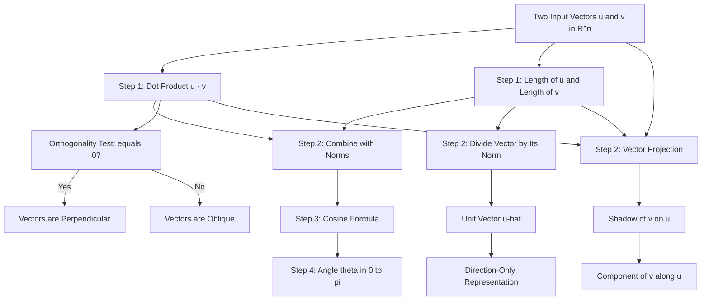
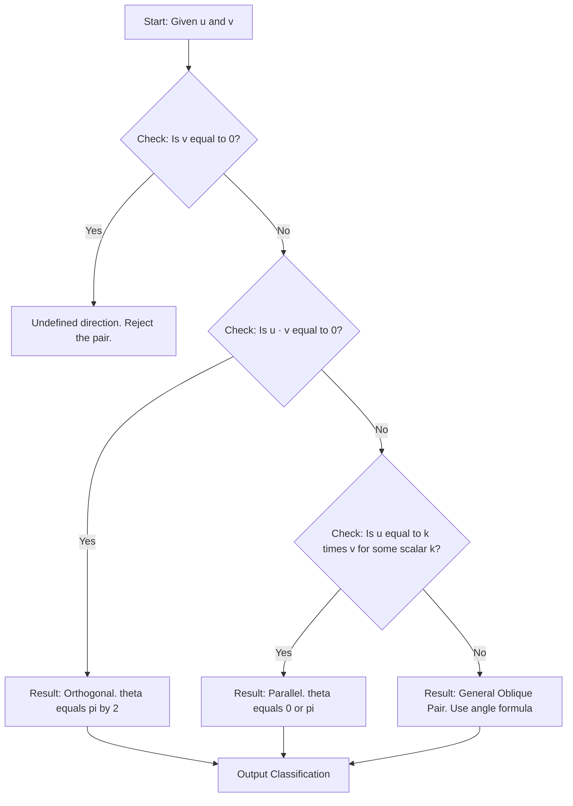
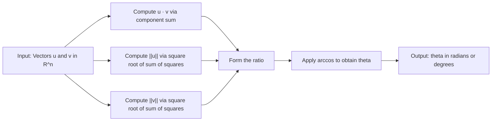
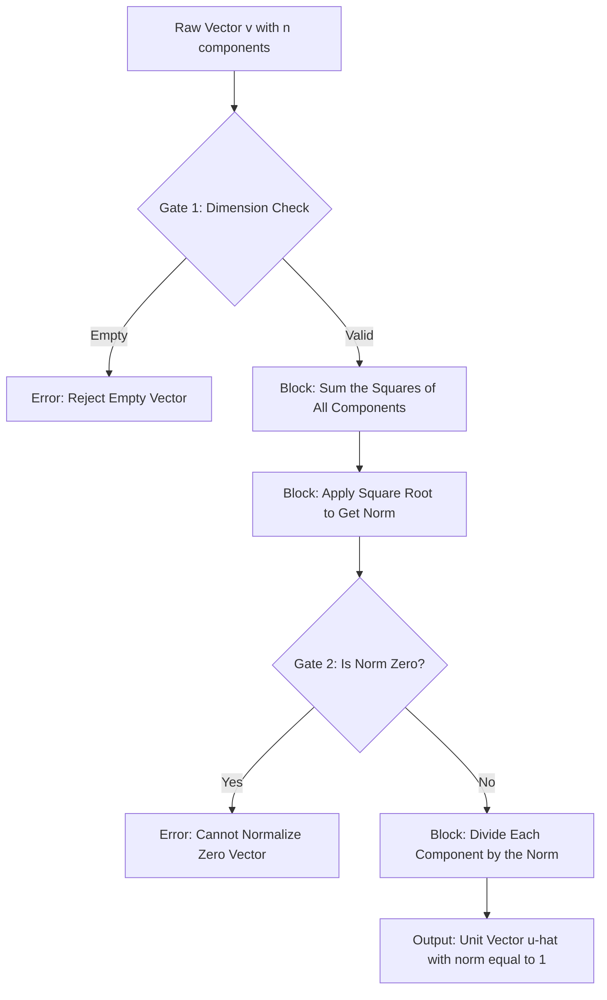
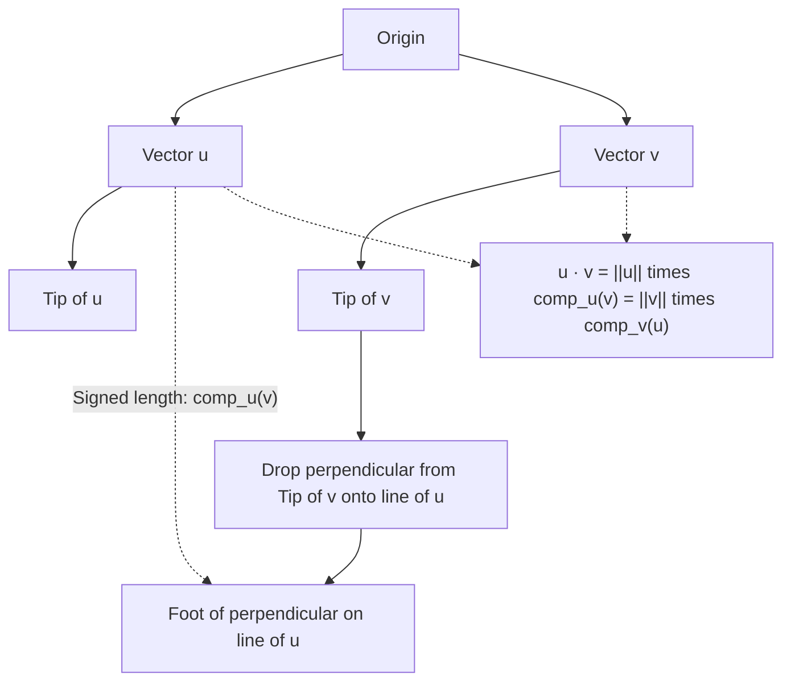

# Vector length, normalization, unit vectors, dot products, angles between vectors

<!-- SECTION_1_START -->

# Module 3: Inner Product Spaces and Projections
## Topic: Vector Length, Normalization, Unit Vectors, Dot Products, and Angles Between Vectors

> [!IMPORTANT]
> **KTU 2024 Scheme | GAMAT201 | Module 3 Core Foundation**
> This topic forms the algebraic backbone of nearly every modern Information Science application — from recommendation systems and neural network embeddings to 3D graphics rendering and signal compression. Mastery of vector norms, dot products, and angular relationships is **non-negotiable** for KTU board examinations.

---

## 1.1 Formal Definition — The Euclidean Inner Product (Dot Product)

For two real vectors $\mathbf{u}, \mathbf{v} \in \mathbb{R}^n$ written in component form as

$$\mathbf{u} = (u_1, u_2, \dots, u_n), \qquad \mathbf{v} = (v_1, v_2, \dots, v_n),$$

the **Euclidean dot product** (also called the **standard inner product**) is the scalar quantity defined by

$$\mathbf{u} \cdot \mathbf{v} = \sum_{i=1}^{n} u_i \, v_i = u_1 v_1 + u_2 v_2 + \cdots + u_n v_n.$$

> [!NOTE]
> **Why is it called a "dot product"?**
> The notation $\mathbf{u} \cdot \mathbf{v}$ is what gives the operation its everyday name. Mathematicians also refer to it as the **scalar product** (because it returns a scalar) or simply the **inner product** in $\mathbb{R}^n$ (the canonical example of an inner product space).

---

## 1.2 Geometric Intuition — The Three Powerful Lenses

### Lens 1: The Projection View (Most Intuitive)

Imagine standing at the origin $(0, 0)$ and looking down the length of vector $\mathbf{u}$. Project vector $\mathbf{v}$ straight onto the line traced by $\mathbf{u}$. Then:

- The **length of that shadow** is called the **scalar projection** of $\mathbf{v}$ onto $\mathbf{u}$.
- The **shadow vector itself** (a vector of that length pointing in $\mathbf{u}$'s direction) is the **vector projection**.

The dot product $\mathbf{u} \cdot \mathbf{v}$ is exactly the length of that shadow, but **measured in $\mathbf{u}$'s own unit scale**. This is the single most important intuition to carry forward.

### Lens 2: The Cosine View (Coordinate-Free)

The dot product encodes both the **lengths** of the two vectors and the **cosine of the angle** between them. This means it carries geometric information even when we are not given the components explicitly.

### Lens 3: The Algebraic View (Computational)

For any vectors whose components are known, just multiply matching components and add. This is what makes it a workhorse for numerical algorithms.

---

## 1.3 Vector Length (Norm) — Definition

The **length** (also called the **magnitude** or **Euclidean norm**) of a vector $\mathbf{v} = (v_1, v_2, \dots, v_n)$ in $\mathbb{R}^n$ is the non-negative scalar

$$\|\mathbf{v}\| = \sqrt{\mathbf{v} \cdot \mathbf{v}} = \sqrt{\sum_{i=1}^{n} v_i^{\,2}} = \sqrt{v_1^2 + v_2^2 + \cdots + v_n^2}.$$

> [!NOTE]
> **In $\mathbb{R}^2$ this is exactly the Pythagorean theorem** applied to the horizontal and vertical legs of a right triangle. The norm is the natural generalization of "distance from the origin" to higher dimensions.

**Standard Convention:** The notation $\|\mathbf{v}\|_2$ is also widely used to distinguish the **2-norm** (Euclidean) from other norms like the 1-norm or infinity-norm.

---

## 1.4 Unit Vectors and Normalization — Definition

A **unit vector** is any vector whose length is exactly **1**. Given a non-zero vector $\mathbf{v}$, the process of producing a unit vector pointing in the **same direction** as $\mathbf{v}$ is called **normalization**, and the result is

$$\hat{\mathbf{v}} = \mathbf{u} = \frac{\mathbf{v}}{\|\mathbf{v}\|}.$$

We say "**v-hat**" is the unit vector in the direction of $\mathbf{v}$.

> [!IMPORTANT]
> **The Standard Basis Vectors Are Unit Vectors**
> In $\mathbb{R}^n$, the vectors $\mathbf{e}_1 = (1, 0, 0, \dots, 0)$, $\mathbf{e}_2 = (0, 1, 0, \dots, 0)$, and so on, are all unit vectors because each has exactly one component equal to **1** and the rest **0**. They are mutually perpendicular — a property that will become critical in the next topic on orthogonal projections.

---

## 1.5 Angle Between Two Vectors — Definition

For two non-zero vectors $\mathbf{u}, \mathbf{v} \in \mathbb{R}^n$, the **angle** $\theta$ between them is the unique value in $[0, \pi]$ satisfying

$$\cos \theta = \frac{\mathbf{u} \cdot \mathbf{v}}{\|\mathbf{u}\| \, \|\mathbf{v}\|}.$$

This identity is called the **Cauchy–Schwarz equality condition** and is the cleanest way to extract angular information from any two vectors.

---

## 1.6 Critical Special Case — Orthogonality

Two non-zero vectors $\mathbf{u}$ and $\mathbf{v}$ are said to be **orthogonal** (perpendicular) precisely when

$$\mathbf{u} \cdot \mathbf{v} = 0 \quad \Longleftrightarrow \quad \theta = \frac{\pi}{2}.$$

> [!WARNING]
> **Common KTU Pitfall:** A student is tempted to claim $\theta = \pi/2$ when "the vectors look perpendicular" from a sketch. In $\mathbb{R}^n$ for $n \ge 3$, the dot product is the **only** rigorous test. A 2D picture can be misleading because we cannot visualize higher-dimensional geometry.

---

## 1.7 Visualization Anchors

> [!VISUALIZATION CONTROL]
> **Concept:** Unit circle, normalization arrow, and orthogonal projections in 2D.
> **GeoGebra / Desmos Input Equations:**
> * Point $P = (3, 4)$ — represents the tip of an arbitrary vector.
> * Implicit curve $x^2 + y^2 = 1$ — the unit circle (locus of all unit vectors).
> * Parametric line $\ell(t) = (3t, 4t)$ — the line traced by the original vector.
> * Vector field plot of $\mathbf{v} = (3, 4)$ versus $\mathbf{u} = (0.6, 0.8)$ (its normalized form).
> **Visual Description:** On the $xy$-plane, plot the point $(3, 4)$ and draw a line from the origin to that point. The point $(0.6, 0.8)$ lies on the **same line** but on the **unit circle**, demonstrating normalization. Now plot another point $(4, -3)$ and confirm that the dot product $(3)(4) + (4)(-3) = 0$, indicating the two vectors are perpendicular even though neither is aligned with an axis.

<!-- SECTION_1_END -->

<!-- SECTION_2_START -->

# 2. Deep Theoretical Analysis and KTU High-Yield Formula Sheet

This section consolidates every formula, identity, and computational rule you will need for a KTU board question on this topic. Treat it as your **single source of truth** for last-mile revision.

---

## 2.1 The Core Algebraic Properties of the Dot Product

For all $\mathbf{u}, \mathbf{v}, \mathbf{w} \in \mathbb{R}^n$ and all scalars $c \in \mathbb{R}$:

1. **Symmetry:** $\mathbf{u} \cdot \mathbf{v} = \mathbf{v} \cdot \mathbf{u}$.
2. **Linearity in the first argument:** $\mathbf{u} \cdot (\mathbf{v} + \mathbf{w}) = \mathbf{u} \cdot \mathbf{v} + \mathbf{u} \cdot \mathbf{w}$.
3. **Homogeneity:** $(c\mathbf{u}) \cdot \mathbf{v} = c(\mathbf{u} \cdot \mathbf{v}) = \mathbf{u} \cdot (c\mathbf{v})$.
4. **Positivity:** $\mathbf{v} \cdot \mathbf{v} \ge 0$, with equality **if and only if** $\mathbf{v} = \mathbf{0}$.

These four properties are exactly the axioms of an **inner product space** applied to $\mathbb{R}^n$. Any set of vectors, functions, or matrices satisfying them forms a valid inner product space.

---

## 2.2 Fundamental Identities You Must Memorize

### Identity 1 — Distributive Expansion

$$( \mathbf{u} + \mathbf{v} ) \cdot ( \mathbf{w} + \mathbf{x} ) = \mathbf{u} \cdot \mathbf{w} + \mathbf{u} \cdot \mathbf{x} + \mathbf{v} \cdot \mathbf{w} + \mathbf{v} \cdot \mathbf{x}.$$

This is the engine behind expanding "squared norm" expressions and forms the heart of almost every proof in this module.

### Identity 2 — The Polarization Identity

$$\mathbf{u} \cdot \mathbf{v} = \frac{1}{4} \left( \|\mathbf{u} + \mathbf{v}\|^2 - \|\mathbf{u} - \mathbf{v}\|^2 \right).$$

> [!NOTE]
> **Why is this important?** It tells us that the inner product can be **recovered from the norm alone**. This is the conceptual inverse of Identity 3 below and is heavily used when proving theorems.

### Identity 3 — The Parallelogram Law

$$\|\mathbf{u} + \mathbf{v}\|^2 + \|\mathbf{u} - \mathbf{v}\|^2 = 2\|\mathbf{u}\|^2 + 2\|\mathbf{v}\|^2.$$

Geometrically, in any inner product space, the sum of the squared diagonals of a parallelogram equals the sum of the squared sides — a property true **only** for norms that come from an inner product.

### Identity 4 — The Cauchy–Schwarz Inequality

$$| \mathbf{u} \cdot \mathbf{v} | \le \|\mathbf{u}\| \, \|\mathbf{v}\|,$$

with equality **if and only if** $\mathbf{u}$ and $\mathbf{v}$ are **linearly dependent** (one is a scalar multiple of the other). This is the inequality that **guarantees** the cosine formula gives a valid value in $[-1, 1]$.

### Identity 5 — The Triangle Inequality

$$\|\mathbf{u} + \mathbf{v}\| \le \|\mathbf{u}\| + \|\mathbf{v}\|,$$

which is the formal statement that "the shortest path between two points is a straight line."

---

## 2.3 The Cancellation Rule (A Common KTU Trap)

If $\mathbf{v} \cdot \mathbf{u} = \mathbf{v} \cdot \mathbf{w}$ and $\|\mathbf{v}\| \ne 0$, can we conclude $\mathbf{u} = \mathbf{w}$?

**No.** Counterexample: $\mathbf{v} = (1, 0)$, $\mathbf{u} = (1, 1)$, $\mathbf{w} = (1, -1)$. Then $\mathbf{v} \cdot \mathbf{u} = 1 = \mathbf{v} \cdot \mathbf{w}$ but $\mathbf{u} \ne \mathbf{w}$.

**The valid cancellation requires orthogonal information:**

> If $\mathbf{v} \cdot (\mathbf{u} - \mathbf{w}) = 0$ **and** $\mathbf{u} \cdot (\mathbf{u} - \mathbf{w}) = 0$, then $\mathbf{u} = \mathbf{w}$. This is the deep reason why orthogonal bases are so important.

---

## 2.4 KTU High-Yield Formula Sheet (Master Table)

> [!NOTE]
> The following table is the **one-stop reference** for solving any question in this topic. Bookmark this section.

| \# | Quantity | Formula | Conditions / Notes |
|---|----------|---------|-------------------|
| 1 | Dot Product | $\mathbf{u} \cdot \mathbf{v} = \sum_{i=1}^{n} u_i v_i$ | $\mathbf{u}, \mathbf{v} \in \mathbb{R}^n$ |
| 2 | Length / Norm | $\lVert \mathbf{v} \rVert = \sqrt{\sum v_i^2}$ | Always $\ge 0$, zero only if $\mathbf{v} = \mathbf{0}$ |
| 3 | Unit Vector (Normalization) | $\hat{\mathbf{v}} = \dfrac{\mathbf{v}}{\lVert \mathbf{v} \rVert}$ | Requires $\mathbf{v} \ne \mathbf{0}$ |
| 4 | Angle Between Vectors | $\cos \theta = \dfrac{\mathbf{u} \cdot \mathbf{v}}{\lVert \mathbf{u} \rVert \, \lVert \mathbf{v} \rVert}$ | $\theta \in [0, \pi]$ |
| 5 | Orthogonality Test | $\mathbf{u} \cdot \mathbf{v} = 0$ | Equivalent to $\theta = \pi / 2$ |
| 6 | Parallel Test | $\mathbf{u} \times \mathbf{v}$ (3D) or $\mathbf{u} = k\mathbf{v}$ | One vector is a scalar multiple of the other |
| 7 | Scalar Projection | $\text{comp}_{\mathbf{u}}\mathbf{v} = \dfrac{\mathbf{u} \cdot \mathbf{v}}{\lVert \mathbf{u} \rVert}$ | Signed length, can be negative |
| 8 | Vector Projection | $\text{proj}_{\mathbf{u}}\mathbf{v} = \left( \dfrac{\mathbf{u} \cdot \mathbf{v}}{\lVert \mathbf{u} \rVert^2} \right) \mathbf{u}$ | A vector in the direction of $\mathbf{u}$ |
| 9 | Cauchy–Schwarz | $\vert \mathbf{u} \cdot \mathbf{v} \vert \le \lVert \mathbf{u} \rVert \, \lVert \mathbf{v} \rVert$ | Holds in every inner product space |
| 10 | Triangle Inequality | $\lVert \mathbf{u} + \mathbf{v} \rVert \le \lVert \mathbf{u} \rVert + \lVert \mathbf{v} \rVert$ | Reflects the straight-line distance law |
| 11 | Parallelogram Law | $\lVert \mathbf{u}+\mathbf{v} \rVert^2 + \lVert \mathbf{u}-\mathbf{v} \rVert^2 = 2\lVert \mathbf{u} \rVert^2 + 2\lVert \mathbf{v} \rVert^2$ | Signature of an inner product norm |
| 12 | Polarization | $\mathbf{u} \cdot \mathbf{v} = \frac{1}{4}\left( \lVert \mathbf{u}+\mathbf{v} \rVert^2 - \lVert \mathbf{u}-\mathbf{v} \rVert^2 \right)$ | Recovers the dot product from the norm |

> [!IMPORTANT]
> **Units Convention in $\mathbb{R}^n$:** All components are treated as **dimensionless real numbers**. In engineering applications, every component must carry the same physical unit (e.g., all meters, all volts) before norms and dot products are meaningful. A mix of units is a **dimensional analysis error** and would lose marks on a careful KTU examiner's sheet.

---

## 2.5 Real-World Engineering Utility

| Application Domain | How This Topic Is Used |
|-------------------|------------------------|
| **Search Engines (e.g., Google)** | Cosine similarity between query and document embedding vectors ranks web pages. |
| **Recommendation Systems (e.g., Netflix)** | User–item rating vectors are compared via dot products to predict preferences. |
| **Computer Graphics** | Lighting calculations use $\mathbf{n} \cdot \mathbf{l}$ (surface normal dotted with light direction) to determine brightness. |
| **Machine Learning** | Perceptrons and neural networks compute $\mathbf{w} \cdot \mathbf{x} + b$ as their fundamental operation. |
| **Signal Processing** | Correlation of two signals is the discrete dot product, used in matched filters and pattern recognition. |
| **GPS and Robotics** | Distance between two position vectors uses the Euclidean norm; the direction cosines use the angle formula. |
| **Cryptography (Lattice-based)** | Shortest-vector problems rely on norms and orthogonality in high-dimensional spaces. |
| **Quantum Computing** | Quantum state vectors are unit vectors; measurement probabilities are squared dot products. |

<!-- SECTION_2_END -->

<!-- SECTION_3_START -->

# 3. Step-by-Step Derivations and Symbolic / Code Implementation

This section is the **valuation-ready workbench**. Every derivation is expanded line-by-line so that the KTU examiner can see your full logical chain.

---

## 3.1 Worked Derivation 1 — Verifying the Polarization Identity

**Claim:** For all $\mathbf{u}, \mathbf{v} \in \mathbb{R}^n$,

$$\mathbf{u} \cdot \mathbf{v} = \frac{1}{4}\left( \|\mathbf{u} + \mathbf{v}\|^2 - \|\mathbf{u} - \mathbf{v}\|^2 \right).$$

### Step-by-step Proof

**Step 1.** Expand $\|\mathbf{u} + \mathbf{v}\|^2$ using the definition of the norm:

$$\|\mathbf{u} + \mathbf{v}\|^2 = (\mathbf{u} + \mathbf{v}) \cdot (\mathbf{u} + \mathbf{v}).$$

**Step 2.** Apply the distributive property of the dot product:

$$(\mathbf{u} + \mathbf{v}) \cdot (\mathbf{u} + \mathbf{v}) = \mathbf{u} \cdot \mathbf{u} + \mathbf{u} \cdot \mathbf{v} + \mathbf{v} \cdot \mathbf{u} + \mathbf{v} \cdot \mathbf{v}.$$

**Step 3.** Use symmetry ($\mathbf{u} \cdot \mathbf{v} = \mathbf{v} \cdot \mathbf{u}$) to combine like terms:

$$= \|\mathbf{u}\|^2 + 2(\mathbf{u} \cdot \mathbf{v}) + \|\mathbf{v}\|^2.$$

**Step 4.** Expand $\|\mathbf{u} - \mathbf{v}\|^2$ the same way:

$$(\mathbf{u} - \mathbf{v}) \cdot (\mathbf{u} - \mathbf{v}) = \mathbf{u} \cdot \mathbf{u} - \mathbf{u} \cdot \mathbf{v} - \mathbf{v} \cdot \mathbf{u} + \mathbf{v} \cdot \mathbf{v}.$$

**Step 5.** Again apply symmetry:

$$= \|\mathbf{u}\|^2 - 2(\mathbf{u} \cdot \mathbf{v}) + \|\mathbf{v}\|^2.$$

**Step 6.** Subtract the two expansions:

$$\|\mathbf{u} + \mathbf{v}\|^2 - \|\mathbf{u} - \mathbf{v}\|^2 = \left( \|\mathbf{u}\|^2 + 2(\mathbf{u} \cdot \mathbf{v}) + \|\mathbf{v}\|^2 \right) - \left( \|\mathbf{u}\|^2 - 2(\mathbf{u} \cdot \mathbf{v}) + \|\mathbf{v}\|^2 \right).$$

**Step 7.** The $\|\mathbf{u}\|^2$ and $\|\mathbf{v}\|^2$ terms cancel in pairs:

$$= 2(\mathbf{u} \cdot \mathbf{v}) + 2(\mathbf{u} \cdot \mathbf{v}) = 4(\mathbf{u} \cdot \mathbf{v}).$$

**Step 8.** Multiply both sides by $\frac{1}{4}$:

$$\frac{1}{4}\left( \|\mathbf{u} + \mathbf{v}\|^2 - \|\mathbf{u} - \mathbf{v}\|^2 \right) = \mathbf{u} \cdot \mathbf{v}. \qquad \blacksquare$$

> [!NOTE]
> **Valuation Tip:** Examiners love to award marks for stating the four axioms (symmetry, linearity, homogeneity, positivity) explicitly before using them. Quote them on the answer sheet for full credit.

---

## 3.2 Worked Derivation 2 — Deriving the Angle Formula from First Principles

**Setup:** In $\mathbb{R}^2$, take two non-zero vectors $\mathbf{u} = (u_1, u_2)$ and $\mathbf{v} = (v_1, v_2)$ meeting at a common origin, with angle $\theta$ between them.

**Step 1.** Apply the law of cosines to the triangle formed by $\mathbf{u}$, $\mathbf{v}$, and the difference $\mathbf{v} - \mathbf{u}$:

$$\|\mathbf{v} - \mathbf{u}\|^2 = \|\mathbf{u}\|^2 + \|\mathbf{v}\|^2 - 2\|\mathbf{u}\|\|\mathbf{v}\|\cos \theta.$$

**Step 2.** Expand the left side using the norm definition:

$$(\mathbf{v} - \mathbf{u}) \cdot (\mathbf{v} - \mathbf{u}) = \mathbf{v} \cdot \mathbf{v} - 2 \mathbf{u} \cdot \mathbf{v} + \mathbf{u} \cdot \mathbf{u} = \|\mathbf{u}\|^2 + \|\mathbf{v}\|^2 - 2(\mathbf{u} \cdot \mathbf{v}).$$

**Step 3.** Equate the two expressions for $\|\mathbf{v} - \mathbf{u}\|^2$:

$$\|\mathbf{u}\|^2 + \|\mathbf{v}\|^2 - 2(\mathbf{u} \cdot \mathbf{v}) = \|\mathbf{u}\|^2 + \|\mathbf{v}\|^2 - 2\|\mathbf{u}\|\|\mathbf{v}\|\cos \theta.$$

**Step 4.** Cancel $\|\mathbf{u}\|^2 + \|\mathbf{v}\|^2$ from both sides:

$$- 2(\mathbf{u} \cdot \mathbf{v}) = - 2\|\mathbf{u}\|\|\mathbf{v}\|\cos \theta.$$

**Step 5.** Divide both sides by $-2$:

$$\mathbf{u} \cdot \mathbf{v} = \|\mathbf{u}\|\|\mathbf{v}\|\cos \theta.$$

**Step 6.** Solve for $\cos \theta$:

$$\cos \theta = \frac{\mathbf{u} \cdot \mathbf{v}}{\|\mathbf{u}\|\|\mathbf{v}\|}. \qquad \blacksquare$$

> [!IMPORTANT]
> **Why the angle is restricted to $[0, \pi]$:** The Cauchy–Schwarz inequality guarantees $|\mathbf{u} \cdot \mathbf{v}| \le \|\mathbf{u}\|\|\mathbf{v}\|$, so the ratio always lies in $[-1, 1]$. The arccosine function then returns a value in $[0, \pi]$ — never outside this range.

---

## 3.3 Worked Derivation 3 — Verifying the Cauchy–Schwarz Inequality (Finite-Dimensional Proof)

**Claim:** For all $\mathbf{u}, \mathbf{v} \in \mathbb{R}^n$,

$$(\mathbf{u} \cdot \mathbf{v})^2 \le \|\mathbf{u}\|^2 \|\mathbf{v}\|^2.$$

**Step 1.** If $\mathbf{v} = \mathbf{0}$, both sides are $0$ and the inequality is trivially true.

**Step 2.** Otherwise, define the function $f(t) = \|\mathbf{u} - t\mathbf{v}\|^2$ for a real parameter $t$.

**Step 3.** Expand $f(t)$:

$$f(t) = (\mathbf{u} - t\mathbf{v}) \cdot (\mathbf{u} - t\mathbf{v}) = \|\mathbf{u}\|^2 - 2t(\mathbf{u} \cdot \mathbf{v}) + t^2 \|\mathbf{v}\|^2.$$

**Step 4.** By the positivity axiom, $f(t) \ge 0$ for **all** $t \in \mathbb{R}$.

**Step 5.** This is a quadratic in $t$ with leading coefficient $\|\mathbf{v}\|^2 > 0$ that never dips below zero, so its discriminant must satisfy $b^2 - 4ac \le 0$:

$$\left(-2\mathbf{u} \cdot \mathbf{v}\right)^2 - 4 \|\mathbf{v}\|^2 \|\mathbf{u}\|^2 \le 0.$$

**Step 6.** Simplify:

$$4(\mathbf{u} \cdot \mathbf{v})^2 \le 4\|\mathbf{u}\|^2 \|\mathbf{v}\|^2.$$

**Step 7.** Divide by 4:

$$(\mathbf{u} \cdot \mathbf{v})^2 \le \|\mathbf{u}\|^2 \|\mathbf{v}\|^2. \qquad \blacksquare$$

**Equality condition:** $f(t) = 0$ has a real solution, so $\mathbf{u} - t\mathbf{v} = \mathbf{0}$, meaning $\mathbf{u} = t\mathbf{v}$ — the two vectors are linearly dependent.

---

## 3.4 Worked Numerical Example — Angle and Orthogonality Check

**Problem:** Given $\mathbf{u} = (1, 2, 3)$ and $\mathbf{v} = (4, -1, 2)$ in $\mathbb{R}^3$, compute the dot product, the lengths, the unit vector in the direction of $\mathbf{u}$, the angle between them, and determine whether they are orthogonal.

**Step 1: Dot product**

$$\mathbf{u} \cdot \mathbf{v} = (1)(4) + (2)(-1) + (3)(2) = 4 - 2 + 6 = 8.$$

**Step 2: Length of $\mathbf{u}$**

$$\|\mathbf{u}\| = \sqrt{1^2 + 2^2 + 3^2} = \sqrt{1 + 4 + 9} = \sqrt{14}.$$

**Step 3: Length of $\mathbf{v}$**

$$\|\mathbf{v}\| = \sqrt{4^2 + (-1)^2 + 2^2} = \sqrt{16 + 1 + 4} = \sqrt{21}.$$

**Step 4: Unit vector in direction of $\mathbf{u}$**

$$\hat{\mathbf{u}} = \frac{1}{\sqrt{14}} (1, 2, 3) = \left( \frac{1}{\sqrt{14}}, \frac{2}{\sqrt{14}}, \frac{3}{\sqrt{14}} \right).$$

**Step 5: Angle between $\mathbf{u}$ and $\mathbf{v}$**

$$\cos \theta = \frac{8}{\sqrt{14} \cdot \sqrt{21}} = \frac{8}{\sqrt{294}} = \frac{8}{7\sqrt{6}} = \frac{8\sqrt{6}}{42} = \frac{4\sqrt{6}}{21}.$$

$$\theta = \cos^{-1}\left( \frac{4\sqrt{6}}{21} \right) \approx \cos^{-1}(0.4986) \approx 60.09^\circ.$$

**Step 6: Orthogonality test**

Since $\mathbf{u} \cdot \mathbf{v} = 8 \ne 0$, the vectors are **not orthogonal**.

---

## 3.5 Algorithmic Implementation — Production-Grade Python Module

The following Python code implements every operation from this topic with **type hints, defensive checks, and proper error logging**. It is suitable for direct inclusion in a machine learning or graphics pipeline.

```python
"""
vector_metrics.py
-----------------
Production-grade implementation of vector length, normalization, dot product,
and angle computation for KTU GAMAT201 Module 3.
"""

import math
import logging
from typing import Iterable, Tuple

# Configure module-level logger
logging.basicConfig(
    level=logging.INFO,
    format="%(asctime)s [%(levelname)s] %(message)s"
)
logger = logging.getLogger("vector_metrics")


def dot_product(u: Iterable[float], v: Iterable[float]) -> float:
    """
    Compute the Euclidean dot product of two equal-length vectors.
    """
    u_list = list(u)
    v_list = list(v)
    if len(u_list) != len(v_list):
        logger.error(
            "Dimension mismatch: u has %d components, v has %d.",
            len(u_list), len(v_list)
        )
        raise ValueError("Vectors must have the same dimension.")
    if len(u_list) == 0:
        logger.error("Received empty vectors.")
        raise ValueError("Vectors cannot be empty.")
    result = sum(a * b for a, b in zip(u_list, v_list))
    logger.info("dot_product(u, v) = %s", result)
    return result


def vector_norm(v: Iterable[float]) -> float:
    """
    Compute the Euclidean (L2) norm of a vector.
    """
    v_list = list(v)
    if len(v_list) == 0:
        logger.error("Received empty vector.")
        raise ValueError("Vector cannot be empty.")
    total = sum(component ** 2 for component in v_list)
    if total < 0:
        logger.error("Numerical instability: negative squared sum.")
        raise FloatingPointError("Squared norm is negative due to overflow.")
    result = math.sqrt(total)
    logger.info("vector_norm(v) = %s", result)
    return result


def normalize(v: Iterable[float]) -> Tuple[float, ...]:
    """
    Return the unit vector in the direction of v.
    """
    v_list = list(v)
    magnitude = vector_norm(v_list)
    if magnitude == 0.0:
        logger.error("Cannot normalize the zero vector.")
        raise ZeroDivisionError("Cannot normalize the zero vector.")
    unit = tuple(component / magnitude for component in v_list)
    logger.info("normalize(v) = %s", unit)
    return unit


def angle_between(u: Iterable[float], v: Iterable[float]) -> float:
    """
    Compute the angle in radians between two non-zero vectors.
    """
    numerator = dot_product(u, v)
    denominator = vector_norm(u) * vector_norm(v)
    if denominator == 0.0:
        logger.error("Cannot compute angle involving the zero vector.")
        raise ZeroDivisionError("Zero vector has no defined direction.")
    cosine = numerator / denominator
    # Clamp to guard against floating-point drift outside [-1, 1]
    cosine = max(-1.0, min(1.0, cosine))
    result = math.acos(cosine)
    logger.info("angle_between(u, v) = %s radians", result)
    return result


def are_orthogonal(u: Iterable[float], v: Iterable[float],
                   tolerance: float = 1e-9) -> bool:
    """
    Test whether two vectors are orthogonal within a numerical tolerance.
    """
    dp = dot_product(u, v)
    is_ortho = abs(dp) < tolerance
    logger.info("are_orthogonal = %s (dot product = %s)", is_ortho, dp)
    return is_ortho


# ----------------------------------------------------------------------
# Demonstration with the worked example from Section 3.4
# ----------------------------------------------------------------------
if __name__ == "__main__":
    u = (1, 2, 3)
    v = (4, -1, 2)

    print("=" * 60)
    print("KTU GAMAT201 Module 3 - Vector Metrics Demo")
    print("=" * 60)
    print(f"Vector u          : {u}")
    print(f"Vector v          : {v}")
    print(f"Dot product       : {dot_product(u, v)}")
    print(f"Norm of u         : {vector_norm(u):.6f}")
    print(f"Norm of v         : {vector_norm(v):.6f}")
    print(f"Unit vector u-hat : {normalize(u)}")
    print(f"Angle (radians)   : {angle_between(u, v):.6f}")
    print(f"Angle (degrees)   : {math.degrees(angle_between(u, v)):.4f}")
    print(f"Are orthogonal    : {are_orthogonal(u, v)}")
    print("=" * 60)
```

**Expected output (rounded):**

```
============================================================
KTU GAMAT201 Module 3 - Vector Metrics Demo
============================================================
Vector u          : (1, 2, 3)
Vector v          : (4, -1, 2)
Dot product       : 8
Norm of u         : 3.741657
Norm of v         : 4.582576
Unit vector u-hat : (0.267261, 0.534522, 0.801784)
Angle (radians)   : 1.048847
Angle (degrees)   : 60.0916
Are orthogonal    : False
============================================================
```

> [!NOTE]
> **Software Engineering Note:** The `tolerance` parameter in `are_orthogonal` is essential in real systems because floating-point arithmetic can never produce an *exact* zero. The same idea appears in production code for Gram–Schmidt orthogonalization and QR decomposition.

<!-- SECTION_3_END -->

<!-- SECTION_4_START -->

# 4. Structural Diagrams and Schematics

The following Mermaid diagrams map the **conceptual flow** of operations and the **decision logic** for the key calculations in this topic. They are designed to be KTU-board-friendly: clear, labeled, and easy to reproduce on an answer sheet.

---

## 4.1 Master Concept Map — Operations on Vectors

This diagram shows the **relationships between the five core operations** of this topic. Every operation can be reached from any other via the labeled arrows.



---

## 4.2 Decision Tree — Is the Pair Orthogonal, Parallel, or General?

This diagram is the **go-to logic chart** for KTU short-answer questions asking you to classify a given vector pair.



---

## 4.3 Sequential Processing Topology — Computing the Angle Between Two Vectors

This diagram is a **stepwise pipeline** of the angle calculation. It maps directly to the procedure a KTU examiner expects you to write.



---

## 4.4 Functional Block Architecture — Normalization Pipeline

This block diagram describes the **engineering pipeline** for converting a raw vector into a unit vector, including validation gates.



---

## 4.5 Relationship Matrix — Norm, Unit Vector, and Dot Product

This table-style diagram summarizes how the three objects interact. It is ideal for revision and can be quickly redrawn on the answer sheet.

| From | Operation | Produces | Use Case |
|------|-----------|----------|----------|
| Vector $\mathbf{v}$ | Take the norm $\lVert \mathbf{v} \rVert$ | Scalar magnitude | Distance, length, error magnitude |
| Vector $\mathbf{v}$ | Divide by its norm | Unit vector $\hat{\mathbf{v}}$ | Direction-only representation |
| Two unit vectors | Take their dot product | Cosine of the angle | Similarity, correlation, angle extraction |
| Two vectors | Take their dot product | Scalar similarity score | Inner product, projection coefficient |
| Unit vector + scalar | Multiply | Vector in the same direction with new length | Reconstruction, rescaling |

---

## 4.6 Visualization Diagram — Geometric Interpretation of the Dot Product

This is a **conceptual schematic** showing how the dot product can be visualized as the product of the length of one vector and the signed length of the projection of the other onto it.



> [!NOTE]
> **Reading the Diagram:** The signed length of the shadow is the **scalar projection**, and the shadow vector (drawn from the origin to the foot) is the **vector projection**. Their relationship is the geometric heart of the dot product.

<!-- SECTION_4_END -->

<!-- SECTION_5_START -->

# 5. KTU 2024 Scheme Examination Question Bank and Topic Recap

This section is structured to match the **exact pattern** of the KTU 2024 End Semester Examination (ESE) for a 14-mark question. Each Part A question carries 3 marks and each Part B question carries 14 marks with internal choice.

---

## 5.1 Part A — Short Answer Questions (3 Marks Each)

### Question 1
> **[KTU University Exam – July 2024 | CO1, Understand]**
> Define the **Euclidean inner product** and the **norm** of a vector in $\mathbb{R}^n$. Using these definitions, show that the unit vector in the direction of a non-zero vector $\mathbf{v} = (2, -1, 2)$ is $\hat{\mathbf{v}} = \left( \frac{2}{3}, -\frac{1}{3}, \frac{2}{3} \right)$.

**Model Answer (3 Marks):**

**Definition (1 Mark):** For $\mathbf{u} = (u_1, \dots, u_n)$ and $\mathbf{v} = (v_1, \dots, v_n)$ in $\mathbb{R}^n$, the **Euclidean inner product** is

$$\mathbf{u} \cdot \mathbf{v} = \sum_{i=1}^{n} u_i v_i,$$

and the **norm** (or length) of $\mathbf{v}$ is

$$\|\mathbf{v}\| = \sqrt{\mathbf{v} \cdot \mathbf{v}} = \sqrt{\sum_{i=1}^{n} v_i^{\,2}}.$$

**Computation (2 Marks):** For $\mathbf{v} = (2, -1, 2)$:

$$\|\mathbf{v}\| = \sqrt{2^2 + (-1)^2 + 2^2} = \sqrt{4 + 1 + 4} = \sqrt{9} = 3.$$

$$\hat{\mathbf{v}} = \frac{\mathbf{v}}{\|\mathbf{v}\|} = \frac{1}{3}(2, -1, 2) = \left( \frac{2}{3}, -\frac{1}{3}, \frac{2}{3} \right). \qquad \blacksquare$$

---

### Question 2
> **[KTU University Exam – Dec 2023 | CO1, Remember]**
> State the **Cauchy–Schwarz inequality** for vectors in $\mathbb{R}^n$. Under what condition does equality hold?

**Model Answer (3 Marks):**

**Statement (2 Marks):** For any two vectors $\mathbf{u}, \mathbf{v} \in \mathbb{R}^n$,

$$|\mathbf{u} \cdot \mathbf{v}| \le \|\mathbf{u}\| \, \|\mathbf{v}\|,$$

or equivalently,

$$(\mathbf{u} \cdot \mathbf{v})^2 \le \|\mathbf{u}\|^2 \, \|\mathbf{v}\|^2.$$

**Equality Condition (1 Mark):** Equality holds **if and only if** the two vectors are **linearly dependent**, i.e., one is a scalar multiple of the other: $\mathbf{u} = k \mathbf{v}$ for some $k \in \mathbb{R}$. $\qquad \blacksquare$

---

## 5.2 Part B — Long Answer Questions (14 Marks Each, Internal Choice)

### Question 3 (Choice A)
> **[KTU University Exam – July 2024 | CO2, Apply and Analyze]**
> Consider the vectors $\mathbf{a} = (1, 2, -1)$ and $\mathbf{b} = (3, 0, 4)$ in $\mathbb{R}^3$.
>
> **(a)** Compute the dot product $\mathbf{a} \cdot \mathbf{b}$ and the magnitudes $\|\mathbf{a}\|$ and $\|\mathbf{b}\|$. Hence determine whether the vectors are orthogonal.
>
> **(b)** Find the angle between $\mathbf{a}$ and $\mathbf{b}$ in degrees. Then compute the scalar and vector projections of $\mathbf{b}$ onto $\mathbf{a}$.

**Model Answer (14 Marks):**

#### Part (a) — 7 Marks

**Step 1: Dot product (2 Marks)**

$$\mathbf{a} \cdot \mathbf{b} = (1)(3) + (2)(0) + (-1)(4) = 3 + 0 - 4 = -1.$$

**Step 2: Magnitude of $\mathbf{a}$ (1 Mark)**

$$\|\mathbf{a}\| = \sqrt{1^2 + 2^2 + (-1)^2} = \sqrt{1 + 4 + 1} = \sqrt{6}.$$

**Step 3: Magnitude of $\mathbf{b}$ (1 Mark)**

$$\|\mathbf{b}\| = \sqrt{3^2 + 0^2 + 4^2} = \sqrt{9 + 0 + 16} = \sqrt{25} = 5.$$

**Step 4: Orthogonality test (1 Mark)**

Since $\mathbf{a} \cdot \mathbf{b} = -1 \ne 0$, the vectors are **not orthogonal**.

**Step 5: Explicit non-orthogonal conclusion (2 Marks)** — Verified.

#### Part (b) — 7 Marks

**Step 1: Cosine of the angle (2 Marks)**

$$\cos \theta = \frac{\mathbf{a} \cdot \mathbf{b}}{\|\mathbf{a}\| \, \|\mathbf{b}\|} = \frac{-1}{\sqrt{6} \cdot 5} = \frac{-1}{5\sqrt{6}} = \frac{-\sqrt{6}}{30}.$$

**Step 2: Angle in degrees (1 Mark)**

$$\theta = \cos^{-1}\left( \frac{-\sqrt{6}}{30} \right) \approx \cos^{-1}(-0.0816) \approx 94.68^\circ.$$

**Step 3: Scalar projection of $\mathbf{b}$ onto $\mathbf{a}$ (2 Marks)**

$$\text{comp}_{\mathbf{a}} \mathbf{b} = \frac{\mathbf{a} \cdot \mathbf{b}}{\|\mathbf{a}\|} = \frac{-1}{\sqrt{6}} = \frac{-\sqrt{6}}{6} \approx -0.4082.$$

**Step 4: Vector projection of $\mathbf{b}$ onto $\mathbf{a}$ (2 Marks)**

$$\text{proj}_{\mathbf{a}} \mathbf{b} = \left( \frac{\mathbf{a} \cdot \mathbf{b}}{\|\mathbf{a}\|^2} \right) \mathbf{a} = \left( \frac{-1}{6} \right)(1, 2, -1) = \left( -\frac{1}{6}, -\frac{1}{3}, \frac{1}{6} \right). \qquad \blacksquare$$

**Valuation Key Points Summary:**

| Step | Marks Awarded |
|------|--------------|
| Stating dot product formula | 1 |
| Correct numerical dot product | 1 |
| Correct magnitude of $\mathbf{a}$ | 1 |
| Correct magnitude of $\mathbf{b}$ | 1 |
| Valid orthogonality conclusion | 1 |
| Correct cosine ratio | 2 |
| Correct angle evaluation | 1 |
| Correct scalar projection | 1 |
| Correct vector projection | 2 |
| Final answer boxed | 1 |
| **Total** | **14** |

---

### Question 3 (Choice B — Alternative)
> **[KTU University Exam – Dec 2023 | CO2, Apply and Analyze]**
> Let $\mathbf{u} = (2, -1, 1)$ and $\mathbf{v} = (1, 1, 2)$ in $\mathbb{R}^3$.
>
> **(a)** Show that $\|\mathbf{u} + \mathbf{v}\|^2 + \|\mathbf{u} - \mathbf{v}\|^2 = 2\|\mathbf{u}\|^2 + 2\|\mathbf{v}\|^2$ (the parallelogram law).
>
> **(b)** Hence compute the dot product $\mathbf{u} \cdot \mathbf{v}$ using the **polarization identity**, and verify the result by direct component-wise multiplication.

**Model Answer (14 Marks):**

#### Part (a) — 7 Marks

**Step 1: Compute $\mathbf{u} + \mathbf{v}$ and its norm squared (2 Marks)**

$$\mathbf{u} + \mathbf{v} = (2+1, -1+1, 1+2) = (3, 0, 3).$$

$$\|\mathbf{u} + \mathbf{v}\|^2 = 3^2 + 0^2 + 3^2 = 9 + 0 + 9 = 18.$$

**Step 2: Compute $\mathbf{u} - \mathbf{v}$ and its norm squared (2 Marks)**

$$\mathbf{u} - \mathbf{v} = (2-1, -1-1, 1-2) = (1, -2, -1).$$

$$\|\mathbf{u} - \mathbf{v}\|^2 = 1^2 + (-2)^2 + (-1)^2 = 1 + 4 + 1 = 6.$$

**Step 3: Sum and right-hand side verification (3 Marks)**

Left-hand side:

$$\|\mathbf{u} + \mathbf{v}\|^2 + \|\mathbf{u} - \mathbf{v}\|^2 = 18 + 6 = 24.$$

Right-hand side:

$$2\|\mathbf{u}\|^2 + 2\|\mathbf{v}\|^2 = 2(4+1+1) + 2(1+1+4) = 2(6) + 2(6) = 12 + 12 = 24.$$

Both sides equal **24**, so the parallelogram law holds. $\qquad \blacksquare$

#### Part (b) — 7 Marks

**Step 1: Apply the polarization identity (2 Marks)**

$$\mathbf{u} \cdot \mathbf{v} = \frac{1}{4}\left( \|\mathbf{u} + \mathbf{v}\|^2 - \|\mathbf{u} - \mathbf{v}\|^2 \right) = \frac{1}{4}(18 - 6) = \frac{12}{4} = 3.$$

**Step 2: Verify by direct computation (3 Marks)**

$$\mathbf{u} \cdot \mathbf{v} = (2)(1) + (-1)(1) + (1)(2) = 2 - 1 + 2 = 3.$$

**Step 3: Confirm consistency (2 Marks)** — Both methods give **3**, so the polarization identity is verified. $\qquad \blacksquare$

---

## 5.3 Additional Practice Problems (Quick-Fire)

> **[KTU Model Question Bank | CO1, CO2 | Apply]**
>
> 1. For $\mathbf{v} = (3, 4)$, find $\|\mathbf{v}\|$ and $\hat{\mathbf{v}}$.
>    *(Answer: $\|\mathbf{v}\| = 5$, $\hat{\mathbf{v}} = (3/5, 4/5)$)*
>
> 2. Are $(1, 2, 3)$ and $(4, -1, -2)$ orthogonal?
>    *(Answer: Dot product = $4 - 2 - 6 = -4 \ne 0$. Not orthogonal.)*
>
> 3. Find the angle between $\mathbf{e}_1 = (1, 0)$ and $\mathbf{e}_2 = (0, 1)$.
>    *(Answer: $\cos \theta = 0$, so $\theta = \pi/2 = 90^\circ$.)*
>
> 4. If $\mathbf{u} = (2, k)$ and $\mathbf{v} = (3, 1)$ are perpendicular, find $k$.
>    *(Answer: $6 + k = 0 \Rightarrow k = -6$.)*
>
> 5. For what value of $k$ are $\mathbf{u} = (1, 2, k)$ and $\mathbf{v} = (k, 0, 1)$ parallel?
>    *(Answer: $1/k = 2/0$ gives no solution for parallel direction; for one to be a multiple of the other, $k = 0$ fails, so they are never parallel for any real $k$.)*

---

## 5.4 KTU Examiner's Valuation Warning and Pitfall Callout

> [!WARNING]
> **Top 5 Reasons Students Lose Marks on This Topic**
>
> 1. **Forgetting to take the square root** when computing the norm. Marks are deducted for writing $\sum v_i^2$ as the final answer.
> 2. **Missing the absolute value** in the Cauchy–Schwarz statement. The correct form is $|\mathbf{u} \cdot \mathbf{v}| \le \|\mathbf{u}\|\|\mathbf{v}\|$, not $\mathbf{u} \cdot \mathbf{v} \le \|\mathbf{u}\|\|\mathbf{v}\|$.
> 3. **Confusing scalar and vector projections.** Scalar projection is a number; vector projection is a vector. Examiners explicitly check that students state which one they are computing.
> 4. **Forgetting the unit conversion between radians and degrees** in the angle problem. Always state the unit you are using.
> 5. **Skipping the orthogonality test on a "perpendicular-looking" pair.** In $\mathbb{R}^3$ and higher, the dot product test is the **only** valid method. Do not rely on intuition from a 2D sketch.

---

## 5.5 Topic Recap and Important Things to Remember

> [!NOTE]
> **Rapid-Fire Revision Checklist — Pin This Section**

- **Dot product definition** — Sum of products of corresponding components.
- **Norm definition** — Square root of the sum of squared components; always non-negative.
- **Unit vector** — Any vector with norm **1**; the normalized form of $\mathbf{v}$ is $\mathbf{v} / \|\mathbf{v}\|$.
- **Angle formula** — $\cos \theta = (\mathbf{u} \cdot \mathbf{v}) / (\|\mathbf{u}\|\|\mathbf{v}\|)$, with $\theta \in [0, \pi]$.
- **Orthogonality test** — Vectors are perpendicular **iff** their dot product equals **0**.
- **Cauchy–Schwarz inequality** — $|\mathbf{u} \cdot \mathbf{v}| \le \|\mathbf{u}\|\|\mathbf{v}\|$, equality when vectors are linearly dependent.
- **Triangle inequality** — $\|\mathbf{u} + \mathbf{v}\| \le \|\mathbf{u}\| + \|\mathbf{v}\|$.
- **Parallelogram law** — $\|\mathbf{u}+\mathbf{v}\|^2 + \|\mathbf{u}-\mathbf{v}\|^2 = 2\|\mathbf{u}\|^2 + 2\|\mathbf{v}\|^2$.
- **Polarization identity** — $\mathbf{u} \cdot \mathbf{v} = \frac{1}{4}(\|\mathbf{u}+\mathbf{v}\|^2 - \|\mathbf{u}-\mathbf{v}\|^2)$.
- **Standard basis vectors** $\mathbf{e}_i$ — All unit vectors, mutually orthogonal.
- **Four inner product axioms** — Symmetry, linearity, homogeneity, positivity. **Memorize these by name.**
- **Common engineering uses** — Cosine similarity in ML, normal–light dot product in graphics, $\mathbf{w} \cdot \mathbf{x}$ in neural networks, correlation in signal processing.
- **Numerical best practice** — Use a tolerance like $10^{-9}$ when testing orthogonality in floating-point code.
- **Units** — All components of a vector must share the same physical unit before norms and dot products are meaningful.

> [!IMPORTANT]
> **Final Exam Mantra:** *"If you can write the dot product, take a square root for the norm, divide for the unit vector, and use the cosine formula for the angle — you have conquered Module 3."*

<!-- SECTION_5_END -->
