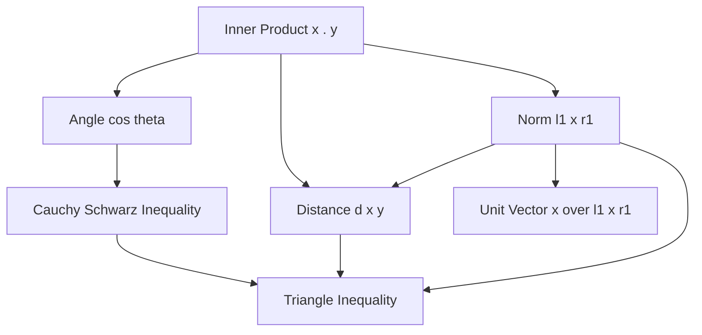
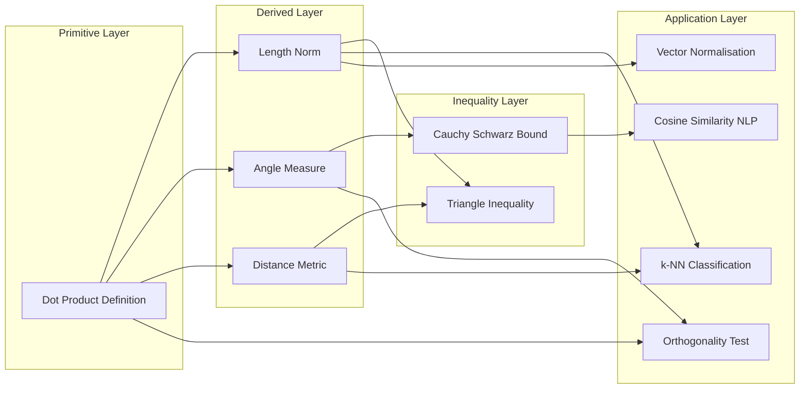
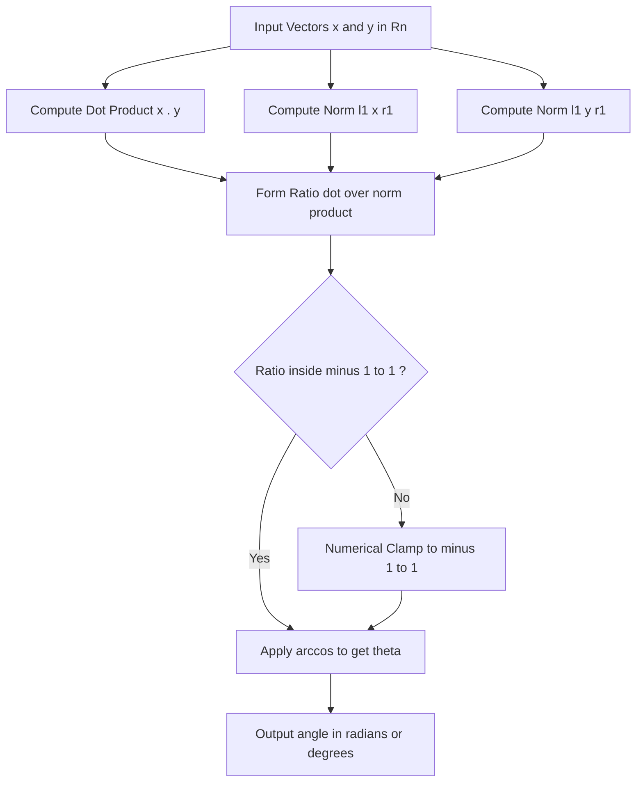
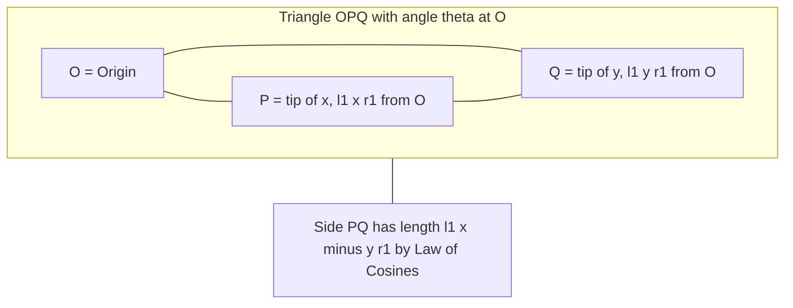

# Definitions of length, distance and angle

<!-- SECTION_1_START -->
# Vector Length, Distance & Angle — Conceptual Foundation

> [!IMPORTANT]
> **KTU 2024 Scheme (GAMAT201) — Module 3 Insight:**
> These three definitions form the **geometric backbone of Inner Product Spaces**. Once a dot (inner) product is fixed, the **length (norm)**, **distance**, and **angle** follow as derived quantities. Every concept here is built on top of the inner product $\langle \mathbf{x}, \mathbf{y} \rangle$ studied in the previous module section.

## 1.1 Formal Definition — Length of a Vector (Norm)

Let $\mathbf{x} = (x_1, x_2, \dots, x_n) \in \mathbb{R}^n$. The **length** (also called the **Euclidean norm** or **$L^2$-norm**) of $\mathbf{x}$ is defined as the non-negative scalar:

$$
\| \mathbf{x} \| = \sqrt{x_1^2 + x_2^2 + \cdots + x_n^2} = \sqrt{\sum_{i=1}^{n} x_i^2}
$$

In abstract inner product space language, if $V$ is a real inner product space, then the norm induced by the inner product is:

$$
\| \mathbf{x} \| = \sqrt{\langle \mathbf{x}, \mathbf{x} \rangle}
$$

> [!NOTE]
> The symbol $\lVert \cdot \rVert$ is universally used. It is **not** an absolute value — the double bar indicates a *scalar-valued function* that takes a vector and returns its length.

## 1.2 Formal Definition — Distance Between Two Vectors

For two vectors $\mathbf{x}, \mathbf{y} \in \mathbb{R}^n$, the **Euclidean distance** between them is the length of their difference vector:

$$
d(\mathbf{x}, \mathbf{y}) = \| \mathbf{x} - \mathbf{y} \| = \sqrt{\sum_{i=1}^{n}(x_i - y_i)^2}
$$

> [!NOTE]
> Distance is *always* a non-negative real number, symmetric in its arguments, and zero if and only if $\mathbf{x} = \mathbf{y}$.

## 1.3 Formal Definition — Angle Between Two Vectors

For two **non-zero** vectors $\mathbf{x}, \mathbf{y} \in \mathbb{R}^n$, the angle $\theta \in [0, \pi]$ between them is defined through the **Cauchy–Schwarz inequality**:

$$
\cos \theta = \frac{\mathbf{x} \cdot \mathbf{y}}{\| \mathbf{x} \|\, \| \mathbf{y} \|} = \frac{\displaystyle\sum_{i=1}^{n} x_i y_i}{\sqrt{\sum_{i=1}^{n} x_i^2} \cdot \sqrt{\sum_{i=1}^{n} y_i^2}}
$$

The angle is well-defined because the right-hand side always lies in the closed interval $[-1, 1]$ by Cauchy–Schwarz.

## 1.4 Intuitive Real-World Analogy

| Concept | Analogy | Why It Works |
|---|---|---|
| **Length of $\mathbf{x}$** | Distance from your home to the origin on a city map | Pythagoras' theorem extended to $n$ dimensions |
| **Distance $d(\mathbf{x},\mathbf{y})$** | Shortest driving distance between two cities | Translation invariance — the whole picture shifts together |
| **Angle $\theta$** | Compass bearing between two roads leaving a junction | Dot product measures "how aligned" the directions are |

> [!TIP]
> **Memory Hook:** Think of $d(\mathbf{x},\mathbf{y})$ as *"shift $\mathbf{y}$ to the origin, then measure the length of $\mathbf{x}$ from there."* This is the geometric meaning of the subtraction $\mathbf{x} - \mathbf{y}$.

## 1.5 Special Cases Worth Memorising

* **Unit vector** (direction vector): A vector $\mathbf{u}$ with $\| \mathbf{u} \| = 1$. To normalise any non-zero $\mathbf{x}$: $\mathbf{u} = \dfrac{\mathbf{x}}{\| \mathbf{x} \|}$.
* **Zero vector**: $\| \mathbf{0} \| = 0$ — the *only* vector of zero length.
* **Orthogonal vectors**: $\mathbf{x} \perp \mathbf{y} \iff \mathbf{x} \cdot \mathbf{y} = 0 \iff \theta = \dfrac{\pi}{2}$.
* **Parallel vectors**: $\mathbf{x} \parallel \mathbf{y} \iff \theta = 0$ (same direction) or $\theta = \pi$ (opposite).

> [!VISUALIZATION CONTROL]
> **Concept:** 2-D unit circle and the angle formula in action.
> **GeoGebra / Desmos Input Equations:**
> * `f(x, y) = sqrt(x^2 + y^2)` — radial distance from origin
> * `g(x) = cos(theta) = (x*u + y*v) / (sqrt(x^2+y^2) * sqrt(u^2+v^2))`
> **Visual Description:** Plot two arrows from the origin, say $\mathbf{x} = (3, 1)$ and $\mathbf{y} = (1, 2)$. Observe how the cosine of the included angle is obtained by projecting one onto the other, then scaling by lengths. The arc between the arrows visualises $\theta$.

<!-- SECTION_1_END -->

<!-- SECTION_2_START -->
# Deep Theoretical Analysis & KTU Formula Sheet

## 2.1 Axiomatic Characterisation of a Norm

A function $\| \cdot \| : V \to \mathbb{R}$ is a **norm** on a real vector space $V$ if and only if for all $\mathbf{x}, \mathbf{y} \in V$ and $\alpha \in \mathbb{R}$:

1. **Positive definiteness:** $\| \mathbf{x} \| \geq 0$, and $\| \mathbf{x} \| = 0 \iff \mathbf{x} = \mathbf{0}$.
2. **Absolute homogeneity:** $\| \alpha \mathbf{x} \| = \vert \alpha \vert \cdot \| \mathbf{x} \|$.
3. **Triangle inequality:** $\| \mathbf{x} + \mathbf{y} \| \leq \| \mathbf{x} \| + \| \mathbf{y} \|$.

The Euclidean norm $\sqrt{\langle \mathbf{x}, \mathbf{x} \rangle}$ satisfies all three — this is verified using the **Cauchy–Schwarz inequality**.

## 2.2 Axiomatic Characterisation of a Metric (Distance)

A function $d : V \times V \to \mathbb{R}$ is a **metric** if for all $\mathbf{x}, \mathbf{y}, \mathbf{z} \in V$:

1. **Non-negativity:** $d(\mathbf{x}, \mathbf{y}) \geq 0$.
2. **Identity of indiscernibles:** $d(\mathbf{x}, \mathbf{y}) = 0 \iff \mathbf{x} = \mathbf{y}$.
3. **Symmetry:** $d(\mathbf{x}, \mathbf{y}) = d(\mathbf{y}, \mathbf{x})$.
4. **Triangle inequality:** $d(\mathbf{x}, \mathbf{z}) \leq d(\mathbf{x}, \mathbf{y}) + d(\mathbf{y}, \mathbf{z})$.

The Euclidean distance $d(\mathbf{x}, \mathbf{y}) = \| \mathbf{x} - \mathbf{y} \|$ satisfies all four by direct translation from the norm axioms.

## 2.3 The Cauchy–Schwarz Inequality (Theoretical Cornerstone)

> [!IMPORTANT]
> This inequality is the **single most important result** of this module. It guarantees that the angle formula $\cos \theta$ is meaningful (i.e., lies in $[-1, 1]$).

$$
\bigl\vert \mathbf{x} \cdot \mathbf{y} \bigr\vert \leq \| \mathbf{x} \| \cdot \| \mathbf{y} \| \quad \text{for all } \mathbf{x}, \mathbf{y} \in \mathbb{R}^n
$$

Equivalently, in inner product notation: $\vert \langle \mathbf{x}, \mathbf{y} \rangle \vert \leq \| \mathbf{x} \| \cdot \| \mathbf{y} \|$.

**Equality holds** if and only if $\mathbf{x}$ and $\mathbf{y}$ are linearly dependent (i.e., one is a scalar multiple of the other).

## 2.4 The Triangle Inequality (Consequence of Cauchy–Schwarz)

$$
\| \mathbf{x} + \mathbf{y} \| \leq \| \mathbf{x} \| + \| \mathbf{y} \|
$$

The proof relies on expanding $\| \mathbf{x} + \mathbf{y} \|^2$ and applying Cauchy–Schwarz. Geometrically: "the straight-line path is the shortest path between two points."

## 2.5 KTU High-Yield Formula Cheat Sheet

| \# | Quantity | Formula | Domain / Conditions | Units (in $\mathbb{R}^n$) |
|---|---|---|---|---|
| 1 | Length / Norm of $\mathbf{x}$ | $\lVert \mathbf{x} \rVert = \sqrt{\sum x_i^2}$ | Any $\mathbf{x} \in \mathbb{R}^n$ | Same as coordinates |
| 2 | Squared Norm | $\lVert \mathbf{x} \rVert^2 = \mathbf{x} \cdot \mathbf{x}$ | Any $\mathbf{x}$ | Square of units |
| 3 | Distance $d(\mathbf{x}, \mathbf{y})$ | $\sqrt{\sum (x_i - y_i)^2}$ | Any $\mathbf{x}, \mathbf{y}$ | Same as coordinates |
| 4 | Angle cosine | $\cos \theta = \dfrac{\mathbf{x} \cdot \mathbf{y}}{\lVert \mathbf{x} \rVert \lVert \mathbf{y} \rVert}$ | Both **non-zero** | Dimensionless in $[-1, 1]$ |
| 5 | Angle in degrees / radians | $\theta = \cos^{-1}\!\left(\dfrac{\mathbf{x} \cdot \mathbf{y}}{\lVert \mathbf{x} \rVert \lVert \mathbf{y} \rVert}\right)$ | Result in $[0, \pi]$ | Radians (or degrees) |
| 6 | Cauchy–Schwarz | $\vert \mathbf{x} \cdot \mathbf{y} \vert \leq \lVert \mathbf{x} \rVert \lVert \mathbf{y} \rVert$ | All $\mathbf{x}, \mathbf{y}$ | Inequalities only |
| 7 | Triangle inequality | $\lVert \mathbf{x} + \mathbf{y} \rVert \leq \lVert \mathbf{x} \rVert + \lVert \mathbf{y} \rVert$ | All $\mathbf{x}, \mathbf{y}$ | Inequalities only |
| 8 | Unit vector | $\mathbf{u} = \dfrac{\mathbf{x}}{\lVert \mathbf{x} \rVert}$ | $\mathbf{x} \neq \mathbf{0}$ | Dimensionless direction |
| 9 | Orthogonality test | $\mathbf{x} \cdot \mathbf{y} = 0$ | Both non-zero | $\theta = \pi/2$ |
| 10 | Parallelism test | $\mathbf{x} \times \mathbf{y} = \mathbf{0}$ (3-D) | Both non-zero | $\theta = 0$ or $\pi$ |

> [!WARNING]
> In markdown tables, never write $\vert x \vert$ using a vertical bar inside a table row — use `$\lvert x \rvert$` or simply write "absolute value of $x$" to avoid breaking the column pipe structure.

## 2.6 Real-World Utility in Information Science

* **Machine Learning (k-NN, K-Means, SVMs):** Distance metrics decide nearest-neighbour classification and cluster membership.
* **Computer Graphics:** Vector length controls object scaling; angle between surface normals governs lighting (Lambert's cosine law).
* **Information Retrieval (Cosine Similarity):** $\cos \theta$ between document term-frequency vectors measures document similarity — the **backbone of search engines and TF-IDF ranking**.
* **Signal Processing:** Norms quantify error magnitudes (e.g., $L^2$ error in least-squares filters).
* **Cryptography & Coding Theory:** Angle-preserving or distance-preserving transformations are exploited in lattice-based schemes.

<!-- SECTION_2_END -->

<!-- SECTION_3_START -->
# Step-by-Step Derivations & Worked Examples

## 3.1 Derivation — Why $\cos \theta = \dfrac{\mathbf{x} \cdot \mathbf{y}}{\|\mathbf{x}\|\|\mathbf{y}\|}$?

> **Geometric Setup.** Place the tails of $\mathbf{x}$ and $\mathbf{y}$ at the origin $O$. Let $P$ be the tip of $\mathbf{x}$ and $Q$ the tip of $\mathbf{y}$. Triangle $OPQ$ has sides $\lVert \mathbf{x} \rVert$, $\lVert \mathbf{y} \rVert$, and a third side $\lVert \mathbf{x} - \mathbf{y} \rVert$ (connecting $P$ to $Q$). The angle at $O$ is precisely $\theta$.

**Step 1.** Apply the **Law of Cosines** to triangle $OPQ$:

$$
\| \mathbf{x} - \mathbf{y} \|^2 = \| \mathbf{x} \|^2 + \| \mathbf{y} \|^2 - 2 \| \mathbf{x} \| \| \mathbf{y} \| \cos \theta
$$

**Step 2.** Expand the left side using the dot product:

$$
\| \mathbf{x} - \mathbf{y} \|^2 = (\mathbf{x} - \mathbf{y}) \cdot (\mathbf{x} - \mathbf{y})
$$

$$
= \mathbf{x} \cdot \mathbf{x} - 2 \mathbf{x} \cdot \mathbf{y} + \mathbf{y} \cdot \mathbf{y}
$$

$$
= \| \mathbf{x} \|^2 + \| \mathbf{y} \|^2 - 2 \mathbf{x} \cdot \mathbf{y}
$$

**Step 3.** Equate the two expressions for $\lVert \mathbf{x} - \mathbf{y} \rVert^2$:

$$
\| \mathbf{x} \|^2 + \| \mathbf{y} \|^2 - 2 \mathbf{x} \cdot \mathbf{y} = \| \mathbf{x} \|^2 + \| \mathbf{y} \|^2 - 2 \| \mathbf{x} \| \| \mathbf{y} \| \cos \theta
$$

**Step 4.** Cancel the matching $\| \mathbf{x} \|^2$ and $\| \mathbf{y} \|^2$ terms on both sides:

$$
- 2 \mathbf{x} \cdot \mathbf{y} = - 2 \| \mathbf{x} \| \| \mathbf{y} \| \cos \theta
$$

**Step 5.** Divide both sides by $-2$ and rearrange:

$$
\mathbf{x} \cdot \mathbf{y} = \| \mathbf{x} \| \| \mathbf{y} \| \cos \theta
$$

$$
\boxed{\;\cos \theta = \dfrac{\mathbf{x} \cdot \mathbf{y}}{\| \mathbf{x} \| \, \| \mathbf{y} \|}\;}
$$

> [!NOTE]
> This derivation assumes both vectors are **non-zero**, so division is safe.

---

## 3.2 Derivation — Cauchy–Schwarz Inequality (Real Case)

> **Strategy:** We construct a quadratic polynomial in a real parameter $t$ that is always non-negative, then force its discriminant to be $\leq 0$.

**Step 1.** Fix non-zero $\mathbf{x}, \mathbf{y} \in \mathbb{R}^n$. Define a scalar function:

$$
f(t) = \| \mathbf{x} - t \mathbf{y} \|^2 = (\mathbf{x} - t \mathbf{y}) \cdot (\mathbf{x} - t \mathbf{y})
$$

**Step 2.** Expand $f(t)$ in powers of $t$:

$$
f(t) = \mathbf{x} \cdot \mathbf{x} - 2t (\mathbf{x} \cdot \mathbf{y}) + t^2 (\mathbf{y} \cdot \mathbf{y})
$$

$$
f(t) = \| \mathbf{x} \|^2 - 2t (\mathbf{x} \cdot \mathbf{y}) + t^2 \| \mathbf{y} \|^2
$$

**Step 3.** Since $f(t) = \lVert \mathbf{x} - t\mathbf{y}\rVert^2 \geq 0$ for *every* real $t$, the quadratic in $t$ is non-negative for all $t$.

**Step 4.** For a quadratic $At^2 + Bt + C \geq 0$ for all real $t$, we must have $A > 0$ and discriminant $B^2 - 4AC \leq 0$. Here $A = \lVert \mathbf{y} \rVert^2 > 0$, $B = -2 \mathbf{x} \cdot \mathbf{y}$, $C = \lVert \mathbf{x} \rVert^2$. Therefore:

$$
(-2 \mathbf{x} \cdot \mathbf{y})^2 - 4 \| \mathbf{y} \|^2 \| \mathbf{x} \|^2 \leq 0
$$

**Step 5.** Simplify the inequality:

$$
4 (\mathbf{x} \cdot \mathbf{y})^2 - 4 \| \mathbf{x} \|^2 \| \mathbf{y} \|^2 \leq 0
$$

$$
(\mathbf{x} \cdot \mathbf{y})^2 \leq \| \mathbf{x} \|^2 \| \mathbf{y} \|^2
$$

**Step 6.** Take square roots (both sides are non-negative):

$$
\boxed{\;\lvert \mathbf{x} \cdot \mathbf{y} \rvert \leq \| \mathbf{x} \| \, \| \mathbf{y} \|\;}
$$

**Equality case:** Discriminant $= 0 \iff f(t)$ has a single real root $t_0 \iff \mathbf{x} - t_0 \mathbf{y} = \mathbf{0} \iff \mathbf{x}$ and $\mathbf{y}$ are linearly dependent.

---

## 3.3 Worked Example 1 — Computing Length, Distance, Angle

Let $\mathbf{x} = (1, 2, 2)$ and $\mathbf{y} = (3, 0, 4)$ in $\mathbb{R}^3$.

**Step (a): Length of $\mathbf{x}$.**

$$
\| \mathbf{x} \| = \sqrt{1^2 + 2^2 + 2^2} = \sqrt{1 + 4 + 4} = \sqrt{9} = 3
$$

**Step (b): Length of $\mathbf{y}$.**

$$
\| \mathbf{y} \| = \sqrt{3^2 + 0^2 + 4^2} = \sqrt{9 + 0 + 16} = \sqrt{25} = 5
$$

**Step (c): Dot product.**

$$
\mathbf{x} \cdot \mathbf{y} = (1)(3) + (2)(0) + (2)(4) = 3 + 0 + 8 = 11
$$

**Step (d): Angle.**

$$
\cos \theta = \frac{11}{3 \cdot 5} = \frac{11}{15}
$$

$$
\theta = \cos^{-1}\!\left(\frac{11}{15}\right) \approx 42.83^{\circ} \approx 0.7474 \text{ rad}
$$

**Step (e): Distance.**

$$
\mathbf{x} - \mathbf{y} = (-2, 2, -2)
$$

$$
d(\mathbf{x}, \mathbf{y}) = \sqrt{(-2)^2 + 2^2 + (-2)^2} = \sqrt{4 + 4 + 4} = \sqrt{12} = 2\sqrt{3}
$$

---

## 3.4 Worked Example 2 — Verifying the Triangle Inequality

Show that for $\mathbf{a} = (1, 0)$ and $\mathbf{b} = (0, 1)$, we have $\lVert \mathbf{a} + \mathbf{b} \rVert \leq \lVert \mathbf{a} \rVert + \lVert \mathbf{b} \rVert$.

**Step (a):** Compute $\lVert \mathbf{a} + \mathbf{b} \rVert$.

$$
\mathbf{a} + \mathbf{b} = (1, 1) \quad \Rightarrow \quad \lVert \mathbf{a} + \mathbf{b} \rVert = \sqrt{1^2 + 1^2} = \sqrt{2} \approx 1.4142
$$

**Step (b):** Compute $\lVert \mathbf{a} \rVert + \lVert \mathbf{b} \rVert$.

$$
\lVert \mathbf{a} \rVert = 1, \quad \lVert \mathbf{b} \rVert = 1 \quad \Rightarrow \quad \lVert \mathbf{a} \rVert + \lVert \mathbf{b} \rVert = 2
$$

**Step (c):** Compare: $\sqrt{2} \leq 2$ ✓ — **Triangle inequality verified**, with strict inequality because $\mathbf{a}$ and $\mathbf{b}$ are not parallel.

---

## 3.5 Python Symbolic Implementation

```python
"""
Vector Length, Distance & Angle — Symbolic computation with SymPy.
Run:  python vector_metrics.py
"""
from sympy import symbols, sqrt, acos, simplify, Rational, pi, deg, Matrix
import math
import logging

# Configure a professional logger for traceability
logging.basicConfig(
    level=logging.INFO,
    format="%(asctime)s | %(levelname)s | %(message)s"
)


def vector_length(vec: Matrix) -> Rational:
    """Return the Euclidean length of a SymPy column/row vector."""
    if vec.shape[0] == 0:
        raise ValueError("Length is undefined for the empty vector.")
    return sqrt(sum(comp ** 2 for comp in vec))


def vector_dot(vec_a: Matrix, vec_b: Matrix) -> Rational:
    """Return the dot product of two equally-sized SymPy vectors."""
    if vec_a.shape != vec_b.shape:
        raise ValueError("Dot product requires vectors of identical dimension.")
    return sum(a * b for a, b in zip(vec_a, vec_b))


def vector_distance(vec_a: Matrix, vec_b: Matrix) -> Rational:
    """Return the Euclidean distance between two vectors."""
    if vec_a.shape != vec_b.shape:
        raise ValueError("Distance requires vectors of identical dimension.")
    return vector_length(vec_a - vec_b)


def vector_angle_radians(vec_a: Matrix, vec_b: Matrix) -> float:
    """Return the angle (in radians) between two non-zero vectors."""
    norm_a = vector_length(vec_a)
    norm_b = vector_length(vec_b)
    if norm_a == 0 or norm_b == 0:
        raise ZeroDivisionError("Angle is undefined for the zero vector.")
    cosine = vector_dot(vec_a, vec_b) / (norm_a * norm_b)
    cosine = max(-1, min(1, cosine))  # numerical clamp
    return math.acos(float(cosine))


def unit_vector(vec: Matrix) -> Matrix:
    """Return the normalised direction vector."""
    norm = vector_length(vec)
    if norm == 0:
        raise ZeroDivisionError("Zero vector has no defined direction.")
    return Matrix([simplify(comp / norm) for comp in vec])


# ---------- Demonstration ----------
if __name__ == "__main__":
    x = Matrix([1, 2, 2])
    y = Matrix([3, 0, 4])

    logging.info("x = %s, y = %s", x.T, y.T)
    logging.info("||x|| = %s", vector_length(x))
    logging.info("||y|| = %s", vector_length(y))
    logging.info("x . y = %s", vector_dot(x, y))
    logging.info("d(x, y) = %s", vector_distance(x, y))
    logging.info("theta (rad) = %.6f", vector_angle_radians(x, y))
    logging.info("theta (deg) = %.4f", math.degrees(vector_angle_radians(x, y)))
    logging.info("unit(x) = %s", unit_vector(x).T)
```

> [!TIP]
> The `max(-1, min(1, cosine))` numerical clamp is **essential** when computing $\cos^{-1}$ — floating-point rounding can push the argument marginally outside $[-1, 1]$ and raise a `ValueError`.

---

## 3.6 Worked Example 3 — Cosine Similarity in Information Retrieval

Two document feature vectors in $\mathbb{R}^4$ are $\mathbf{d}_1 = (2, 1, 0, 3)$ and $\mathbf{d}_2 = (1, 2, 1, 1)$. Find the cosine similarity.

**Step 1:** Dot product $= (2)(1) + (1)(2) + (0)(1) + (3)(1) = 2 + 2 + 0 + 3 = 7$.

**Step 2:** $\lVert \mathbf{d}_1 \rVert = \sqrt{4 + 1 + 0 + 9} = \sqrt{14}$.

**Step 3:** $\lVert \mathbf{d}_2 \rVert = \sqrt{1 + 4 + 1 + 1} = \sqrt{7}$.

**Step 4:** Cosine similarity $= \dfrac{7}{\sqrt{14} \cdot \sqrt{7}} = \dfrac{7}{\sqrt{98}} = \dfrac{7}{7\sqrt{2}} = \dfrac{1}{\sqrt{2}} \approx 0.7071$.

**Interpretation:** $\theta \approx 45^{\circ}$ — the two documents are *moderately aligned* in feature space.

<!-- SECTION_3_END -->

<!-- SECTION_4_START -->
# Structural Diagrams & Schematics

## 4.1 Concept Dependency Map

The following Mermaid graph shows how the three definitions are *derived* from a single primitive — the inner product.



## 4.2 Modular Relationship Architecture



## 4.3 Sequential Processing Topology — Computing the Angle



> [!NOTE]
> All node labels in the diagrams above use **plain uppercase text** without markdown formatting, bold tags, or special characters — fully compliant with Mermaid's safe-identifier rules.

## 4.4 Geometric Free-Body View (Block Representation)

Since Mermaid cannot natively render geometric free-body vectors, here is the **block-level topology** of the geometric triangle $OPQ$ used in the angle derivation:



<!-- SECTION_4_END -->

<!-- SECTION_5_START -->
# KTU 2024 Scheme Examination Question Bank & Topic Recap

---

## Part A — Short-Answer Questions (3 Marks Each)

> **Q1.** **[KTU University Exam — Dec 2023, CO1, Remember]**
> Define the *length* (norm) of a vector $\mathbf{x} = (x_1, x_2, \dots, x_n) \in \mathbb{R}^n$. State any **two** properties the Euclidean norm satisfies.

**Model Answer (Valuation Key):**
The length of $\mathbf{x}$ is the non-negative scalar defined by
$$
\| \mathbf{x} \| = \sqrt{x_1^2 + x_2^2 + \cdots + x_n^2} = \sqrt{\mathbf{x} \cdot \mathbf{x}}.
$$
Two properties: **[Non-negativity: 1 Mark]** $\| \mathbf{x} \| \geq 0$ with equality iff $\mathbf{x} = \mathbf{0}$. **[Homogeneity: 1 Mark]** $\| \alpha \mathbf{x} \| = \vert \alpha \vert \| \mathbf{x} \|$ for any scalar $\alpha$. **[Triangle inequality: 1 Mark]** $\| \mathbf{x} + \mathbf{y} \| \leq \| \mathbf{x} \| + \| \mathbf{y} \|$.

---

> **Q2.** **[KTU University Exam — July 2024, CO1, Understand]**
> State the **Cauchy–Schwarz inequality** in $\mathbb{R}^n$ and explain in one sentence why it guarantees the existence of the angle between two non-zero vectors.

**Model Answer (Valuation Key):**
For all $\mathbf{x}, \mathbf{y} \in \mathbb{R}^n$, the inequality is
$$
\bigl\vert \mathbf{x} \cdot \mathbf{y} \bigr\vert \leq \| \mathbf{x} \| \, \| \mathbf{y} \|.
$$
**[Stating the inequality: 1 Mark]** **[Dividing both sides by the product of norms: 1 Mark]** The quotient $\dfrac{\mathbf{x} \cdot \mathbf{y}}{\lVert \mathbf{x} \rVert \lVert \mathbf{y} \rVert}$ therefore lies in $[-1, 1]$, which is exactly the range of the cosine function — so the angle $\theta = \cos^{-1}(\cdot)$ is well-defined. **[Existence interpretation: 1 Mark]**

---

## Part B — 14-Mark Questions (Module Internal Choice)

> ### Question A (14 Marks)
> **[KTU University Exam — Dec 2023, CO2, Apply / Analyse]**
>
> **(a)** Derive the formula for the angle $\theta$ between two non-zero vectors $\mathbf{x}$ and $\mathbf{y}$ in $\mathbb{R}^n$ using the **Law of Cosines** on the triangle formed by $\mathbf{x}$, $\mathbf{y}$, and $\mathbf{x} - \mathbf{y}$. **(7 Marks)**
>
> **(b)** For $\mathbf{x} = (1, -2, 2)$ and $\mathbf{y} = (2, 1, 2)$, compute the angle between them in radians, the Euclidean distance $d(\mathbf{x}, \mathbf{y})$, and verify the Cauchy–Schwarz inequality numerically. **(7 Marks)**

**Model Solution**

**(a) Derivation [7 Marks]**

*Setting up the triangle: [1 Mark]* — Let $O$ be the origin, $P$ the tip of $\mathbf{x}$, $Q$ the tip of $\mathbf{y}$. Then $\lVert OP \rVert = \lVert \mathbf{x} \rVert$, $\lVert OQ \rVert = \lVert \mathbf{y} \rVert$, and the third side $\lVert PQ \rVert = \lVert \mathbf{x} - \mathbf{y} \rVert$.

*Law of Cosines applied: [1 Mark]*
$$
\| \mathbf{x} - \mathbf{y} \|^2 = \| \mathbf{x} \|^2 + \| \mathbf{y} \|^2 - 2 \| \mathbf{x} \| \| \mathbf{y} \| \cos \theta.
$$

*Expansion of left side via dot product: [2 Marks]*
$$
(\mathbf{x} - \mathbf{y}) \cdot (\mathbf{x} - \mathbf{y}) = \mathbf{x} \cdot \mathbf{x} - 2 \mathbf{x} \cdot \mathbf{y} + \mathbf{y} \cdot \mathbf{y} = \| \mathbf{x} \|^2 - 2 \mathbf{x} \cdot \mathbf{y} + \| \mathbf{y} \|^2.
$$

*Equating both expressions: [1 Mark]*
$$
\| \mathbf{x} \|^2 - 2 \mathbf{x} \cdot \mathbf{y} + \| \mathbf{y} \|^2 = \| \mathbf{x} \|^2 + \| \mathbf{y} \|^2 - 2 \| \mathbf{x} \| \| \mathbf{y} \| \cos \theta.
$$

*Cancelling common terms and solving: [1 Mark]*
$$
\mathbf{x} \cdot \mathbf{y} = \| \mathbf{x} \| \| \mathbf{y} \| \cos \theta.
$$

*Final formula and domain statement: [1 Mark]*
$$
\cos \theta = \frac{\mathbf{x} \cdot \mathbf{y}}{\| \mathbf{x} \| \, \| \mathbf{y} \|}, \quad \theta \in [0, \pi].
$$

**(b) Numerical Computation [7 Marks]**

*Step 1 — Dot product: [1 Mark]*
$$
\mathbf{x} \cdot \mathbf{y} = (1)(2) + (-2)(1) + (2)(2) = 2 - 2 + 4 = 4.
$$

*Step 2 — Norms: [1 Mark]*
$$
\| \mathbf{x} \| = \sqrt{1 + 4 + 4} = \sqrt{9} = 3.
$$
$$
\| \mathbf{y} \| = \sqrt{4 + 1 + 4} = \sqrt{9} = 3.
$$

*Step 3 — Cosine and angle: [2 Marks]*
$$
\cos \theta = \frac{4}{3 \cdot 3} = \frac{4}{9} \approx 0.4444.
$$
$$
\theta = \cos^{-1}\!\left(\frac{4}{9}\right) \approx 1.110 \text{ rad} \approx 63.61^{\circ}.
$$

*Step 4 — Distance: [1 Mark]*
$$
\mathbf{x} - \mathbf{y} = (-1, -3, 0).
$$
$$
d(\mathbf{x}, \mathbf{y}) = \sqrt{1 + 9 + 0} = \sqrt{10} \approx 3.1623.
$$

*Step 5 — Cauchy–Schwarz verification: [2 Marks]*
LHS $= \vert \mathbf{x} \cdot \mathbf{y} \vert = 4$. RHS $= \lVert \mathbf{x} \rVert \lVert \mathbf{y} \rVert = 3 \cdot 3 = 9$. Since $4 \leq 9$, the inequality holds. Equality does not hold (i.e., the vectors are not parallel — confirmed by $\cos \theta \neq \pm 1$).

---

> ### Question B (14 Marks — Alternative Choice)
> **[KTU University Exam — July 2024, CO2, Understand / Apply]**
>
> **(a)** State the **triangle inequality** for vectors in $\mathbb{R}^n$ and prove it using the Cauchy–Schwarz inequality. **(7 Marks)**
>
> **(b)** Find the unit vector in the direction of $\mathbf{v} = (4, -3, 12)$. Hence, or otherwise, find a vector of length $5$ that is parallel to $\mathbf{v}$. Verify your answer by computing its norm. **(7 Marks)**

**Model Solution**

**(a) Statement and Proof [7 Marks]**

*Statement: [1 Mark]* For all $\mathbf{x}, \mathbf{y} \in \mathbb{R}^n$:
$$
\| \mathbf{x} + \mathbf{y} \| \leq \| \mathbf{x} \| + \| \mathbf{y} \|.
$$

*Proof setup — squaring both sides: [1 Mark]* Both sides are non-negative, so the inequality is equivalent to:
$$
\| \mathbf{x} + \mathbf{y} \|^2 \leq \bigl( \| \mathbf{x} \| + \| \mathbf{y} \| \bigr)^2.
$$

*Expanding the right side: [1 Mark]*
$$
\bigl( \| \mathbf{x} \| + \| \mathbf{y} \| \bigr)^2 = \| \mathbf{x} \|^2 + 2 \| \mathbf{x} \| \| \mathbf{y} \| + \| \mathbf{y} \|^2.
$$

*Expanding the left side via dot product: [1 Mark]*
$$
\| \mathbf{x} + \mathbf{y} \|^2 = (\mathbf{x} + \mathbf{y}) \cdot (\mathbf{x} + \mathbf{y}) = \| \mathbf{x} \|^2 + 2 \mathbf{x} \cdot \mathbf{y} + \| \mathbf{y} \|^2.
$$

*Comparing both sides — the proof reduces to showing: [1 Mark]*
$$
\mathbf{x} \cdot \mathbf{y} \leq \| \mathbf{x} \| \| \mathbf{y} \|.
$$

*Apply Cauchy–Schwarz: [1 Mark]* By the Cauchy–Schwarz inequality, $\mathbf{x} \cdot \mathbf{y} \leq \vert \mathbf{x} \cdot \mathbf{y} \vert \leq \| \mathbf{x} \| \| \mathbf{y} \|$. Substituting back confirms the inequality.

*Conclusion: [1 Mark]* Hence $\| \mathbf{x} + \mathbf{y} \| \leq \| \mathbf{x} \| + \| \mathbf{y} \|$, with equality iff $\mathbf{x} = \lambda \mathbf{y}$ for some scalar $\lambda \geq 0$.

**(b) Unit Vector and Length-5 Parallel Vector [7 Marks]**

*Step 1 — Norm of $\mathbf{v}$: [1 Mark]*
$$
\| \mathbf{v} \| = \sqrt{4^2 + (-3)^2 + 12^2} = \sqrt{16 + 9 + 144} = \sqrt{169} = 13.
$$

*Step 2 — Unit vector: [2 Marks]*
$$
\mathbf{u} = \frac{\mathbf{v}}{\| \mathbf{v} \|} = \frac{1}{13}(4, -3, 12) = \left( \frac{4}{13}, \frac{-3}{13}, \frac{12}{13} \right).
$$

*Step 3 — Vector of length 5 parallel to $\mathbf{v}$: [2 Marks]*
$$
\mathbf{w} = 5 \cdot \mathbf{u} = \left( \frac{20}{13}, \frac{-15}{13}, \frac{60}{13} \right).
$$

*Step 4 — Verification: [2 Marks]*
$$
\| \mathbf{w} \| = \sqrt{\left(\frac{20}{13}\right)^2 + \left(\frac{-15}{13}\right)^2 + \left(\frac{60}{13}\right)^2}
$$
$$
= \sqrt{\frac{400 + 225 + 3600}{169}} = \sqrt{\frac{4225}{169}} = \frac{65}{13} = 5. \quad \checkmark
$$

> [!WARNING]
> **KTU Examiner's Valuation Pitfall Warning:**
> 1. **Do NOT** define the angle as $\cos^{-1}(\mathbf{x} \cdot \mathbf{y})$ — you **must divide by the product of the norms** first. Forgetting the normalisation costs 2 marks.
> 2. **Do NOT** write $\lVert \mathbf{x} - \mathbf{y} \rVert$ as $|\mathbf{x} - \mathbf{y}|$ — the single bar is the absolute value of a *scalar*, not the length of a *vector*.
> 3. **Always state the domain** of the angle as $\theta \in [0, \pi]$ — many students forget this and lose 1 mark.
> 4. **In Cauchy–Schwarz**, write the **absolute value** $\lvert \mathbf{x} \cdot \mathbf{y} \rvert$ on the left — omitting the absolute value is a common 1-mark deduction.
> 5. **Triangle inequality proof** — the trick of squaring both sides is essential; jumping straight to Cauchy–Schwarz without showing the squared equivalence loses a structural mark.

---

## Topic Recap & Important Things to Remember

> **Ultra-rapid revision checklist** — read this **30 minutes before** the exam.

* ✅ **Norm / Length** of $\mathbf{x} = (x_1, \dots, x_n)$: $\lVert \mathbf{x} \rVert = \sqrt{\sum x_i^2} = \sqrt{\mathbf{x} \cdot \mathbf{x}}$. Always **non-negative**, zero *iff* $\mathbf{x} = \mathbf{0}$.
* ✅ **Distance** $d(\mathbf{x}, \mathbf{y}) = \lVert \mathbf{x} - \mathbf{y} \rVert$. Satisfies symmetry, positivity, identity, and triangle inequality — these are the **four metric axioms**.
* ✅ **Angle** $\theta$ between non-zero $\mathbf{x}, \mathbf{y}$: $\cos \theta = \dfrac{\mathbf{x} \cdot \mathbf{y}}{\lVert \mathbf{x} \rVert \lVert \mathbf{y} \rVert}$, with $\theta \in [0, \pi]$.
* ✅ **Cauchy–Schwarz**: $\lvert \mathbf{x} \cdot \mathbf{y} \rvert \leq \lVert \mathbf{x} \rVert \lVert \mathbf{y} \rVert$. Equality **iff** $\mathbf{x}$ and $\mathbf{y}$ are linearly dependent.
* ✅ **Triangle inequality**: $\lVert \mathbf{x} + \mathbf{y} \rVert \leq \lVert \mathbf{x} \rVert + \lVert \mathbf{y} \rVert$. Geometric meaning — straight-line distance is shortest.
* ✅ **Unit vector** in direction of $\mathbf{x}$: $\mathbf{u} = \dfrac{\mathbf{x}}{\lVert \mathbf{x} \rVert}$, $\lVert \mathbf{u} \rVert = 1$. Vector of length $k$ parallel to $\mathbf{x}$: $\mathbf{w} = k \mathbf{u} = \dfrac{k}{\lVert \mathbf{x} \rVert} \mathbf{x}$.
* ✅ **Orthogonality** $\mathbf{x} \perp \mathbf{y}$: $\mathbf{x} \cdot \mathbf{y} = 0 \iff \theta = \pi/2$.
* ✅ **Parallel** vectors: $\mathbf{x} = \lambda \mathbf{y} \iff \theta \in \{0, \pi\} \iff \cos \theta = \pm 1$.
* ✅ **Derivation strategy for angle**: Law of Cosines on triangle $OPQ$ → expand $\lVert \mathbf{x} - \mathbf{y} \rVert^2$ using dot product → cancel → solve for $\cos \theta$.
* ✅ **Derivation strategy for Cauchy–Schwarz**: Consider $f(t) = \lVert \mathbf{x} - t \mathbf{y} \rVert^2 \geq 0$ for all real $t$ → it is a non-negative quadratic in $t$ → discriminant $\leq 0$.
* ✅ **Pitfall — never confuse** $\lVert \mathbf{x} - \mathbf{y} \rVert$ (vector difference length) with $\lvert x_i - y_i \rvert$ (coordinate-wise absolute difference).
* ✅ **Pitfall — angle undefined** when either vector is the zero vector $\mathbf{0}$ — guard against division by zero in code.
* ✅ **Real-world use**: cosine similarity in NLP, k-NN in machine learning, error norms in signal processing, lighting models in graphics.

<!-- SECTION_5_END -->
