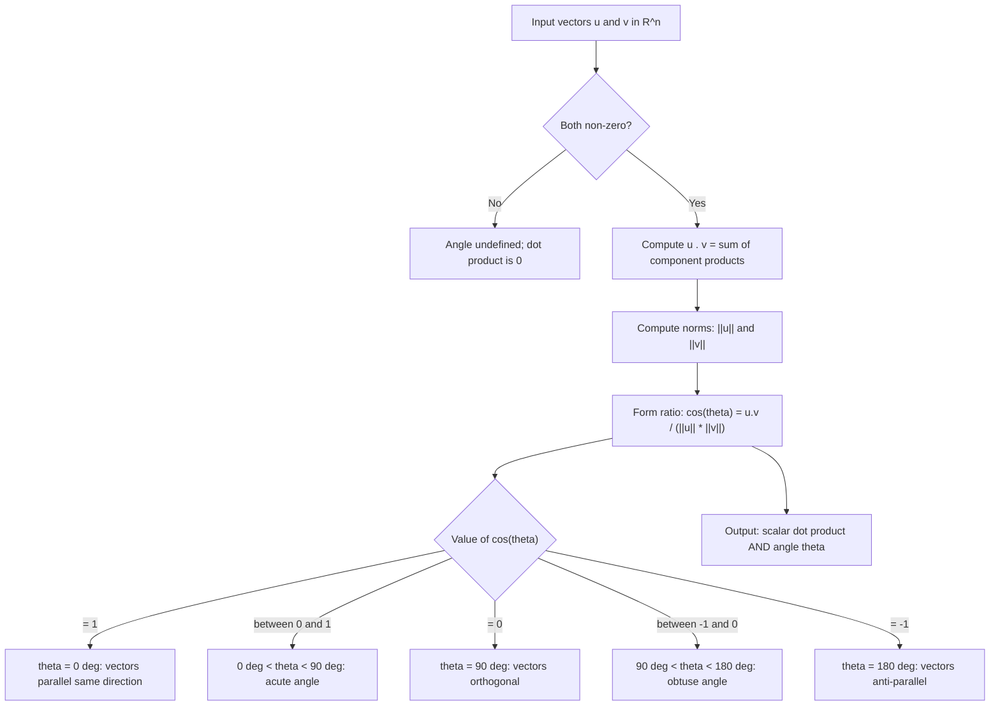
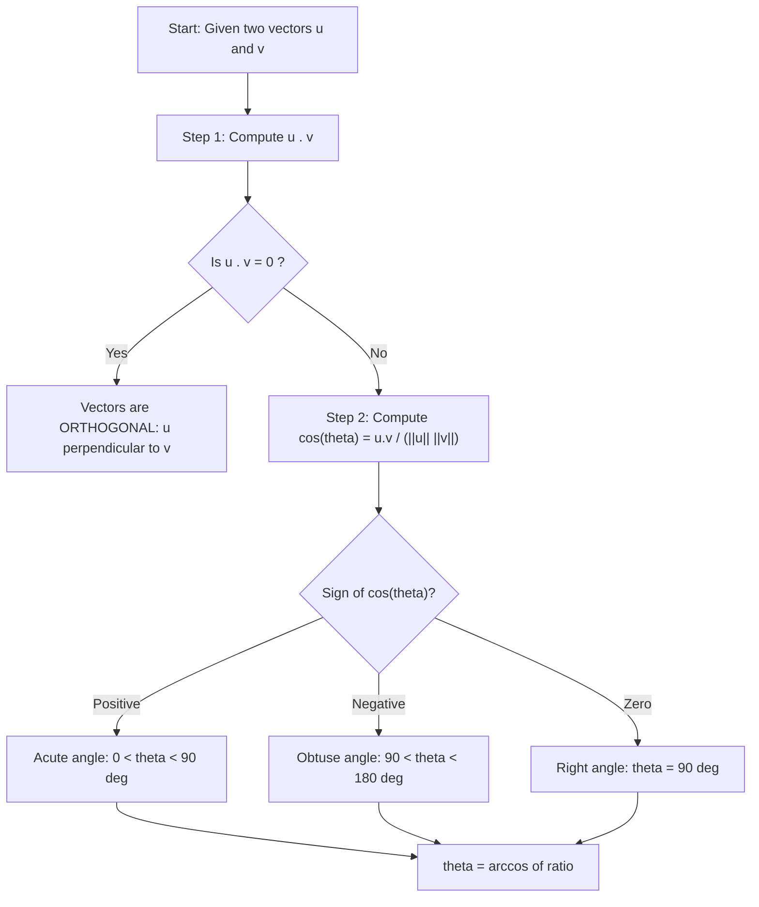
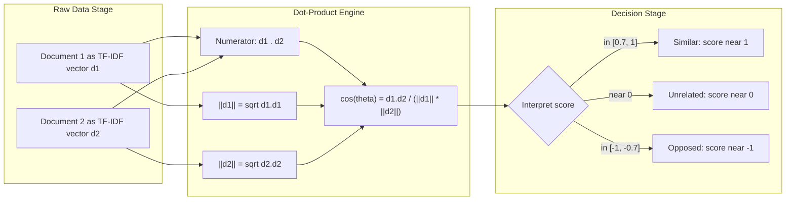

# Dot product and angle between two vectors

<!-- SECTION_1_START -->
# Dot Product and Angle Between Two Vectors

## 1.1 Formal Academic Definition (KTU 2024 Syllabus Standard)

> [!IMPORTANT]
> **Core Definition (KTU Board Standard):**
> The **dot product** (also called the **scalar product** or **inner product**) of two vectors $\mathbf{u}$ and $\mathbf{v}$ in $\mathbb{R}^n$ is the scalar quantity obtained by multiplying the magnitudes of the two vectors with the cosine of the angle $\theta$ between them. Formally:
> $$\mathbf{u} \cdot \mathbf{v} = \|\mathbf{u}\| \,\|\mathbf{v}\| \cos\theta$$
> where $0 \leq \theta \leq \pi$ and the result is a **scalar** (real number), not a vector.

For vectors in component form $\mathbf{u} = (u_1, u_2, \ldots, u_n)$ and $\mathbf{v} = (v_1, v_2, \ldots, v_n)$, the algebraic (component-wise) form is:
$$\mathbf{u} \cdot \mathbf{v} = \sum_{i=1}^{n} u_i v_i = u_1 v_1 + u_2 v_2 + \cdots + u_n v_n$$

> [!NOTE]
> **KTU 2024 Module 3 Anchor:** This topic builds directly on **vector length** ($\|\mathbf{v}\| = \sqrt{\mathbf{v}\cdot\mathbf{v}}$) and **unit vector** ($\hat{\mathbf{v}} = \mathbf{v}/\|\mathbf{v}\|$) — both of which are defined *using* the dot product itself.

## 1.2 Conceptual Analogy & Intuitive Overview

### Real-World Analogy: The "Push" Picture
Imagine you are pushing a heavy box along the floor using a stick. Two forces matter:
- **How hard** you push (magnitude $\|\mathbf{F}\|$)
- **How aligned** your push is with the direction of motion (the angle $\theta$)

The **effective work** done is $\|\mathbf{F}\| \cdot d \cdot \cos\theta$. This is exactly the dot product — it measures *how much of one vector is "shared" with the direction of another*.

- If $\theta = 0^\circ$ (same direction): full contribution, $\cos\theta = 1$
- If $\theta = 90^\circ$ (perpendicular): zero contribution, $\cos\theta = 0$
- If $\theta = 180^\circ$ (opposite direction): negative contribution (you're pulling backwards)

### Geometric Intuition (Vector Projection)
The dot product equals $\|\mathbf{u}\|$ times the **signed length of the projection** of $\mathbf{v}$ onto the direction of $\mathbf{u}$:
$$\mathbf{u} \cdot \mathbf{v} = \|\mathbf{u}\| \cdot \text{proj}_{\mathbf{u}}\mathbf{v}$$

> [!VISUALIZATION CONTROL]
> **Concept:** Geometric interpretation of dot product as projection
> **GeoGebra / Desmos Input Equations:**
> * `u = (4, 1)` (input as point)
> * `v = (2, 3)` (input as point)
> * `cos(θ) = (u · v) / (|u| · |v|)`
> * Drop a perpendicular from the tip of $\mathbf{v}$ onto the line of $\mathbf{u}$
> **Visual Description:** Observe that the foot of the perpendicular represents the projection of $\mathbf{v}$ along $\mathbf{u}$. The product $\|\mathbf{u}\| \times (\text{this projection length})$ gives $\mathbf{u} \cdot \mathbf{v}$.

## 1.3 Geometric Definitions Used in the Module

**Vector Length (Norm) via Dot Product:**
$$\|\mathbf{v}\| = \sqrt{\mathbf{v} \cdot \mathbf{v}}$$

**Unit Vector (Direction Vector):**
$$\hat{\mathbf{v}} = \frac{\mathbf{v}}{\|\mathbf{v}\|}, \quad \mathbf{v} \neq \mathbf{0}, \quad \|\hat{\mathbf{v}}\| = 1$$

**Angle Between Two Vectors:**
$$\cos\theta = \frac{\mathbf{u} \cdot \mathbf{v}}{\|\mathbf{u}\|\,\|\mathbf{v}\|}, \quad \theta \in [0, \pi]$$

**Orthogonality Condition:**
$$\mathbf{u} \perp \mathbf{v} \iff \mathbf{u} \cdot \mathbf{v} = 0$$

<!-- SECTION_1_END -->

<!-- SECTION_2_START -->
# 2. Deep Theoretical Analysis & KTU High-Yield Formula Sheet

## 2.1 Algebraic Properties of the Dot Product (Board-Favorite)

For vectors $\mathbf{u}, \mathbf{v}, \mathbf{w} \in \mathbb{R}^n$ and scalar $c \in \mathbb{R}$:

1. **Commutativity:** $\mathbf{u} \cdot \mathbf{v} = \mathbf{v} \cdot \mathbf{u}$
2. **Distributivity over addition:** $\mathbf{u} \cdot (\mathbf{v} + \mathbf{w}) = \mathbf{u} \cdot \mathbf{v} + \mathbf{u} \cdot \mathbf{w}$
3. **Scalar associativity:** $(c\mathbf{u}) \cdot \mathbf{v} = c(\mathbf{u} \cdot \mathbf{v}) = \mathbf{u} \cdot (c\mathbf{v})$
4. **Positivity:** $\mathbf{v} \cdot \mathbf{v} \geq 0$, with equality iff $\mathbf{v} = \mathbf{0}$
5. **Anticommutativity of sign:** $(-\mathbf{u}) \cdot \mathbf{v} = -(\mathbf{u} \cdot \mathbf{v})$
6. **Zero vector rule:** $\mathbf{0} \cdot \mathbf{v} = 0$

> [!IMPORTANT]
> **KTU Board Examiner Note:** The dot product is **NOT** associative like a matrix product. There is no concept of $\mathbf{u} \cdot \mathbf{v} \cdot \mathbf{w}$ as a triple product in the dot-product sense; it must be evaluated as $(\mathbf{u} \cdot \mathbf{v})\mathbf{w}$ or $\mathbf{u} \cdot (\mathbf{v} \cdot \mathbf{w})$, which yield completely different types (scalar-vector vs. dot of vector with scalar).

## 2.2 Deriving the Component Formula from the Geometric Definition

The fundamental identity linking the two definitions uses the angle between **standard basis vectors** $\hat{\mathbf{e}}_i$ and $\hat{\mathbf{e}}_j$:

$$\hat{\mathbf{e}}_i \cdot \hat{\mathbf{e}}_j = \cos(90^\circ) = 0 \quad (i \neq j)$$
$$\hat{\mathbf{e}}_i \cdot \hat{\mathbf{e}}_i = \cos(0^\circ) = 1$$

Expanding $\mathbf{u} \cdot \mathbf{v} = (u_1\hat{\mathbf{e}}_1 + \cdots + u_n\hat{\mathbf{e}}_n) \cdot (v_1\hat{\mathbf{e}}_1 + \cdots + v_n\hat{\mathbf{e}}_n)$ and using distributivity + the above rules, the cross terms vanish, leaving only the matched-index terms.

## 2.3 KTU Formula Sheet / Cheat Sheet

> [!NOTE]
> **Master this table — these are the only formulas you'll write on a Module 3 question.**

| # | Concept | Formula | Notes / Units |
|---|---------|---------|---------------|
| 1 | Geometric dot product | $\mathbf{u} \cdot \mathbf{v} = \vert\mathbf{u}\vert \cdot \vert\mathbf{v}\vert \cos\theta$ | Result is dimensionless scalar |
| 2 | Component-wise dot product (in $\mathbb{R}^n$) | $\mathbf{u} \cdot \mathbf{v} = \sum_{i=1}^{n} u_i v_i$ | Used for direct calculation |
| 3 | In $\mathbb{R}^2$ | $\mathbf{u} \cdot \mathbf{v} = u_1 v_1 + u_2 v_2$ | Special case $n=2$ |
| 4 | In $\mathbb{R}^3$ | $\mathbf{u} \cdot \mathbf{v} = u_1 v_1 + u_2 v_2 + u_3 v_3$ | Special case $n=3$ |
| 5 | Vector norm (length) | $\vert\mathbf{v}\vert = \sqrt{v_1^2 + v_2^2 + \cdots + v_n^2}$ | Always non-negative |
| 6 | Unit vector | $\hat{\mathbf{v}} = \dfrac{\mathbf{v}}{\vert\mathbf{v}\vert}$ | Magnitude equals **1** |
| 7 | Angle between vectors | $\cos\theta = \dfrac{\mathbf{u} \cdot \mathbf{v}}{\vert\mathbf{u}\vert \,\vert\mathbf{v}\vert}$ | $\theta \in [0, \pi]$ |
| 8 | Orthogonality test | $\mathbf{u} \perp \mathbf{v} \iff \mathbf{u} \cdot \mathbf{v} = 0$ | Most-tested 2-mark question |
| 9 | Cauchy–Schwarz inequality | $\vert\mathbf{u} \cdot \mathbf{v}\vert \leq \vert\mathbf{u}\vert \,\vert\mathbf{v}\vert$ | Confirms $\vert\cos\theta\vert \leq 1$ |
| 10 | Triangle inequality | $\vert\mathbf{u} + \mathbf{v}\vert \leq \vert\mathbf{u}\vert + \vert\mathbf{v}\vert$ | Follows from Cauchy–Schwarz |
| 11 | Parallel / collinearity | $\mathbf{u} \parallel \mathbf{v} \iff \vert\mathbf{u} \cdot \mathbf{v}\vert = \vert\mathbf{u}\vert\,\vert\mathbf{v}\vert$ | i.e. $\theta = 0$ or $\pi$ |
| 12 | Direction cosine relation | $\cos^2\alpha + \cos^2\beta + \cos^2\gamma = 1$ | For 3D unit vector angles with axes |

> [!IMPORTANT]
> **Avoid the vertical pipe `|` inside the table cells — LaTeX-rendered with `\vert` to prevent markdown table corruption.**

## 2.4 Real-World Utility in Information Science & Engineering

| Field | Application | Why Dot Product? |
|-------|-------------|------------------|
| **Machine Learning / NLP** | Cosine similarity for document/text comparison | Measures angle between TF-IDF vectors, independent of magnitude |
| **Computer Graphics** | Lighting (Lambert's cosine law), back-face culling | Determines surface illumination by light direction |
| **Recommender Systems** | User–item preference vectors | Score = $\mathbf{u}_{\text{user}} \cdot \mathbf{v}_{\text{item}}$ |
| **Robotics** | Joint torque computation, work done by a force | Torque = $\mathbf{r} \times \mathbf{F}$ uses related cross product |
| **Image Processing** | Convolution as inner product with kernels | Filters are linear functionals on the image vector space |
| **Physics / Engineering** | Work, power, flux, electric potential energy | $W = \mathbf{F} \cdot \mathbf{d}$, $P = \mathbf{F} \cdot \mathbf{v}$ |

<!-- SECTION_2_END -->

<!-- SECTION_3_START -->
# 3. Step-by-Step Derivations & Symbolic Implementation

## 3.1 Worked Derivations (KTU Board Format)

### Derivation 1: Angle Between Two 3D Vectors

**Problem:** Find the angle between $\mathbf{a} = (1, 2, 3)$ and $\mathbf{b} = (4, -1, 2)$.

**Step 1 — Compute the dot product (component form):**

$$\mathbf{a} \cdot \mathbf{b} = (1)(4) + (2)(-1) + (3)(2)$$

Row-by-row expansion of each term:
- $1 \times 4 = 4$
- $2 \times (-1) = -2$
- $3 \times 2 = 6$

$$\mathbf{a} \cdot \mathbf{b} = 4 + (-2) + 6 = 8$$

**Step 2 — Compute the magnitudes:**

$$\|\mathbf{a}\| = \sqrt{1^2 + 2^2 + 3^2} = \sqrt{1 + 4 + 9} = \sqrt{14}$$

$$\|\mathbf{b}\| = \sqrt{4^2 + (-1)^2 + 2^2} = \sqrt{16 + 1 + 4} = \sqrt{21}$$

**Step 3 — Apply the angle formula:**

$$\cos\theta = \frac{\mathbf{a} \cdot \mathbf{b}}{\|\mathbf{a}\|\,\|\mathbf{b}\|} = \frac{8}{\sqrt{14} \cdot \sqrt{21}} = \frac{8}{\sqrt{294}}$$

**Step 4 — Simplify the radical:**

$$\sqrt{294} = \sqrt{49 \cdot 6} = 7\sqrt{6}$$

$$\cos\theta = \frac{8}{7\sqrt{6}} = \frac{8\sqrt{6}}{7 \cdot 6} = \frac{8\sqrt{6}}{42} = \frac{4\sqrt{6}}{21}$$

**Step 5 — State the angle:**

$$\theta = \cos^{-1}\!\left(\frac{4\sqrt{6}}{21}\right) \approx 64.16^\circ$$

> [!NOTE]
> **Final Result:** $\theta = \cos^{-1}\!\left(\dfrac{4\sqrt{6}}{21}\right) \approx 64.16^\circ$. Both $\mathbf{a}$ and $\mathbf{b}$ are non-zero and the cosine is positive and less than 1, so the angle is acute and well-defined.

---

### Derivation 2: Finding a Vector Making a Given Angle (Typical KTU 14-Mark Application)

**Problem:** Find a unit vector perpendicular to both $\mathbf{u} = (2, 1, -1)$ and $\mathbf{v} = (1, -1, 2)$.

This is a foundational skill for Module 3, often paired with the dot product.

**Step 1 — Set up the unknown perpendicular vector $\mathbf{w} = (a, b, c)$** and impose orthogonality with both given vectors.

**Step 2 — Apply $\mathbf{u} \cdot \mathbf{w} = 0$:**

$$2a + 1b + (-1)c = 0 \quad \Longrightarrow \quad 2a + b - c = 0 \quad \text{...(i)}$$

**Step 3 — Apply $\mathbf{v} \cdot \mathbf{w} = 0$:**

$$1a + (-1)b + 2c = 0 \quad \Longrightarrow \quad a - b + 2c = 0 \quad \text{...(ii)}$$

**Step 4 — Solve the linear system. Multiply (ii) by 1 and add to (i):**

$$(2a + b - c) + (a - b + 2c) = 0 + 0$$

$$3a + 0b + c = 0 \quad \Longrightarrow \quad c = -3a$$

**Step 5 — Substitute $c = -3a$ into equation (i):**

$$2a + b - (-3a) = 0 \quad \Longrightarrow \quad 2a + b + 3a = 0 \quad \Longrightarrow \quad b = -5a$$

**Step 6 — Choose a convenient value of $a$ to get integer components:** Let $a = 1$. Then:

$$\mathbf{w} = (1, -5, -3)$$

**Step 7 — Convert to a unit vector. Compute the magnitude:**

$$\|\mathbf{w}\| = \sqrt{1^2 + (-5)^2 + (-3)^2} = \sqrt{1 + 25 + 9} = \sqrt{35}$$

**Step 8 — Form the unit vector:**

$$\hat{\mathbf{w}} = \frac{\mathbf{w}}{\|\mathbf{w}\|} = \left(\frac{1}{\sqrt{35}},\, \frac{-5}{\sqrt{35}},\, \frac{-3}{\sqrt{35}}\right) = \pm \frac{1}{\sqrt{35}}(1, -5, -3)$$

> [!IMPORTANT]
> **Both $\pm$ signs are valid answers** since both vectors are perpendicular to $\mathbf{u}$ and $\mathbf{v}$ (angle with each is $90^\circ$ in either direction).

---

## 3.2 Algorithmic Implementation: Python Code for Information Science

The dot product is the literal engine behind cosine similarity in recommender systems, NLP, and search engines.

```python
"""
Module: GAMAT201 - Mathematics for Information Science - 2
Topic  : Dot product, norm, unit vector, cosine similarity
Usage  : KTU lab / numerical-methods assignment demonstration
"""

from __future__ import annotations
import math
import logging
from typing import Iterable, List, Tuple

# Configure a logger so students can see the verification steps
logging.basicConfig(
    level=logging.INFO,
    format="[%(levelname)s] %(message)s",
)
logger = logging.getLogger("vector_math")


def dot_product(u: Iterable[float], v: Iterable[float]) -> float:
    """
    Compute the dot product of two equal-length vectors.

    Formula:
        u . v = sum_i (u_i * v_i)

    Raises:
        ValueError: If the two vectors have different dimensions.
    """
    u_list: List[float] = list(u)
    v_list: List[float] = list(v)

    if len(u_list) != len(v_list):
        raise ValueError(
            f"Dimension mismatch: len(u)={len(u_list)} vs len(v)={len(v_list)}"
        )

    if len(u_list) == 0:
        raise ValueError("Empty vector is not allowed in this module.")

    # Explicit accumulation with error logging on every term
    total: float = 0.0
    for idx, (ui, vi) in enumerate(zip(u_list, v_list), start=1):
        term = ui * vi
        logger.debug("  term %d: %s * %s = %s", idx, ui, vi, term)
        total += term
    return total


def vector_norm(v: Iterable[float]) -> float:
    """
    Euclidean norm (length) of a vector.
        ||v|| = sqrt(v . v)
    """
    return math.sqrt(dot_product(v, v))


def unit_vector(v: Iterable[float]) -> List[float]:
    """
    Return the unit vector in the direction of v.
        hat(v) = v / ||v||
    Raises:
        ValueError: If v is the zero vector (cannot normalise).
    """
    v_list: List[float] = list(v)
    magnitude: float = vector_norm(v_list)
    if magnitude == 0.0:
        raise ValueError("Cannot compute unit vector of the zero vector.")
    return [component / magnitude for component in v_list]


def angle_between(u: Iterable[float], v: Iterable[float]) -> Tuple[float, float]:
    """
    Return (cos_theta, theta_in_radians) between two non-zero vectors.
        cos(theta) = (u . v) / (||u|| * ||v||)
    """
    u_list: List[float] = list(u)
    v_list: List[float] = list(v)
    denom: float = vector_norm(u_list) * vector_norm(v_list)
    if denom == 0.0:
        raise ValueError("Angle is undefined for a zero vector.")
    cos_theta: float = dot_product(u_list, v_list) / denom
    # Clamp to [-1, 1] to absorb floating-point noise
    cos_theta = max(-1.0, min(1.0, cos_theta))
    theta_rad: float = math.acos(cos_theta)
    return cos_theta, theta_rad


def cosine_similarity(u: Iterable[float], v: Iterable[float]) -> float:
    """
    Information-science version: same formula, returned as a similarity
    score in [-1, 1].  1 means identical direction, 0 means orthogonal,
    -1 means opposite.
    """
    cos_theta, _ = angle_between(u, v)
    return cos_theta


# ---------------------------------------------------------------
# Demonstration block (KTU board-style verification)
# ---------------------------------------------------------------
if __name__ == "__main__":
    a = (1, 2, 3)
    b = (4, -1, 2)

    logger.info("Vector a = %s", a)
    logger.info("Vector b = %s", b)

    dp = dot_product(a, b)
    logger.info("a . b = %s", dp)                       # -> 8

    na = vector_norm(a)
    nb = vector_norm(b)
    logger.info("||a|| = sqrt(14) ~= %.6f", na)
    logger.info("||b|| = sqrt(21) ~= %.6f", nb)

    cos_t, theta = angle_between(a, b)
    logger.info("cos(theta) = %.6f", cos_t)            # -> 4*sqrt(6)/21
    logger.info("theta (deg) = %.4f", math.degrees(theta))

    logger.info("unit vector of a = %s",
                [round(x, 6) for x in unit_vector(a)])

    # Realistic information-science usage: document similarity
    doc1 = [0.1, 0.3, 0.5, 0.0, 0.7]   # TF-IDF vector of document 1
    doc2 = [0.0, 0.4, 0.4, 0.1, 0.6]   # TF-IDF vector of document 2
    logger.info("cosine similarity (doc1, doc2) = %.4f",
                cosine_similarity(doc1, doc2))
```

> [!TIP]
> **Production insight:** `numpy.dot`, `torch.dot`, and `tf.tensordot` all implement the same inner-product kernel — but the boundary checks shown above (`ZeroDivisionError`, dimension mismatch) are what make a function *production-grade* rather than a textbook snippet.

---

## 3.3 Worked Problem: Verifying the Cauchy–Schwarz Inequality

**Problem:** For $\mathbf{u} = (1, -2, 3)$ and $\mathbf{v} = (2, 0, -1)$, verify $|\mathbf{u} \cdot \mathbf{v}| \leq \|\mathbf{u}\|\,\|\mathbf{v}\|$.

**Step 1 — Dot product:**

$$\mathbf{u} \cdot \mathbf{v} = (1)(2) + (-2)(0) + (3)(-1) = 2 + 0 - 3 = -1$$

$$\Rightarrow \quad |\mathbf{u} \cdot \mathbf{v}| = |-1| = 1$$

**Step 2 — Magnitudes:**

$$\|\mathbf{u}\| = \sqrt{1^2 + (-2)^2 + 3^2} = \sqrt{1 + 4 + 9} = \sqrt{14}$$

$$\|\mathbf{v}\| = \sqrt{2^2 + 0^2 + (-1)^2} = \sqrt{4 + 0 + 1} = \sqrt{5}$$

**Step 3 — Product of magnitudes:**

$$\|\mathbf{u}\|\,\|\mathbf{v}\| = \sqrt{14}\sqrt{5} = \sqrt{70} \approx 8.3666$$

**Step 4 — Verification:**

$$|\mathbf{u} \cdot \mathbf{v}| = 1 \;\leq\; 8.3666 \;=\; \|\mathbf{u}\|\,\|\mathbf{v}\| \quad \checkmark$$

> [!NOTE]
> **Equality holds only when one vector is a scalar multiple of the other.** Here $\mathbf{u}$ and $\mathbf{v}$ are clearly not parallel, so strict inequality holds, confirming the geometric picture of a non-zero angle.

<!-- SECTION_3_END -->

<!-- SECTION_4_START -->
# 4. Structural Diagrams & Schematics

## 4.1 Geometric Interpretation Flow

The following diagram shows the operational flow of how the dot product relates two vectors to a scalar angle measurement.



## 4.2 Property Map of the Dot Product (Block Architecture)


## 4.3 Orthogonality Decision Tree (Board-Favorite Question)



## 4.4 Conceptual Block Diagram: From Data to Similarity Score



<!-- SECTION_4_END -->

<!-- SECTION_5_START -->
# 5. KTU 2024 Scheme Examination Question Bank & Topic Recap

## 5.1 Part A Questions (3 Marks Each)

### **Q1. [KTU University Exam - July 2024]**
**Define the dot product of two vectors. When are two vectors said to be orthogonal?**

**Course Outcome:** CO1 | **Cognitive Level:** Remember | **Marks: 3**

**Model Answer:**

> [!NOTE]
> **Definition of dot product (1 Mark):** The dot product of two non-zero vectors $\mathbf{u}$ and $\mathbf{v}$ is the scalar quantity defined as
> $$\mathbf{u} \cdot \mathbf{v} = \|\mathbf{u}\|\,\|\mathbf{v}\| \cos\theta$$
> where $\theta$ is the angle between $\mathbf{u}$ and $\mathbf{v}$ with $0 \leq \theta \leq \pi$.

> [!NOTE]
> **Component form (1 Mark):** In $\mathbb{R}^n$, for $\mathbf{u} = (u_1, \ldots, u_n)$ and $\mathbf{v} = (v_1, \ldots, v_n)$,
> $$\mathbf{u} \cdot \mathbf{v} = u_1 v_1 + u_2 v_2 + \cdots + u_n v_n.$$

> [!NOTE]
> **Orthogonality condition (1 Mark):** Two non-zero vectors $\mathbf{u}$ and $\mathbf{v}$ are said to be **orthogonal** (perpendicular) if and only if
> $$\mathbf{u} \cdot \mathbf{v} = 0.$$
> Equivalently, the angle between them is $\theta = 90^\circ$, since $\cos(90^\circ) = 0$.

---

### **Q2. [KTU University Exam - Dec 2023]**
**State the Cauchy–Schwarz inequality for vectors. What is its significance in defining the angle between two vectors?**

**Course Outcome:** CO1 | **Cognitive Level:** Understand | **Marks: 3**

**Model Answer:**

> [!NOTE]
> **Statement (2 Marks):** For any two vectors $\mathbf{u}, \mathbf{v} \in \mathbb{R}^n$,
> $$|\mathbf{u} \cdot \mathbf{v}| \leq \|\mathbf{u}\|\,\|\mathbf{v}\|.$$
> Equality holds if and only if $\mathbf{u}$ and $\mathbf{v}$ are linearly dependent (one is a scalar multiple of the other).

> [!NOTE]
> **Significance (1 Mark):** Dividing both sides by $\|\mathbf{u}\|\,\|\mathbf{v}\|$ gives $|\cos\theta| \leq 1$, which guarantees that the formula
> $$\cos\theta = \frac{\mathbf{u} \cdot \mathbf{v}}{\|\mathbf{u}\|\,\|\mathbf{v}\|}$$
> always produces a real angle in $[0, \pi]$. Without Cauchy–Schwarz, the dot-product-to-angle map would not be well-defined.

---

## 5.2 Part B Questions (14 Marks Each — Internal Choice)

### **Question A (14 Marks)**

> **[KTU University Exam - July 2024 — Module 3 Pattern]**

**(a)** Find the angle between the vectors $\mathbf{a} = (2, -1, 3)$ and $\mathbf{b} = (1, 4, -2)$. Also determine whether the vectors are orthogonal. **(7 Marks)**

**(b)** A unit vector $\hat{\mathbf{n}}$ makes equal angles with the positive coordinate axes. Find its components and verify that it forms a unit vector. **(7 Marks)**

**Course Outcome:** CO2, CO3 | **Cognitive Levels:** Apply, Analyze

---

#### **Solution to Q-A(a):** Angle Between Vectors

**Step 1 — Compute the dot product (component-wise):**

$$\mathbf{a} \cdot \mathbf{b} = (2)(1) + (-1)(4) + (3)(-2) = 2 - 4 - 6 = -8$$

*Valuation Key:* [Correct dot product expansion: **2 Marks**]

**Step 2 — Compute the magnitudes of each vector:**

$$\|\mathbf{a}\| = \sqrt{2^2 + (-1)^2 + 3^2} = \sqrt{4 + 1 + 9} = \sqrt{14}$$

$$\|\mathbf{b}\| = \sqrt{1^2 + 4^2 + (-2)^2} = \sqrt{1 + 16 + 4} = \sqrt{21}$$

*Valuation Key:* [Each magnitude correctly evaluated: **2 Marks** total]

**Step 3 — Substitute into the angle formula:**

$$\cos\theta = \frac{\mathbf{a} \cdot \mathbf{b}}{\|\mathbf{a}\|\,\|\mathbf{b}\|} = \frac{-8}{\sqrt{14}\cdot\sqrt{21}} = \frac{-8}{\sqrt{294}}$$

**Step 4 — Simplify the radical:**

$$\sqrt{294} = \sqrt{49 \cdot 6} = 7\sqrt{6} \quad \Longrightarrow \quad \cos\theta = \frac{-8}{7\sqrt{6}} = \frac{-4\sqrt{6}}{21}$$

*Valuation Key:* [Radical simplification: **1 Mark**]

**Step 5 — Conclude the angle and the orthogonality test:**

$$\theta = \cos^{-1}\!\left(\frac{-4\sqrt{6}}{21}\right) \approx 115.84^\circ$$

Since $\mathbf{a} \cdot \mathbf{b} = -8 \neq 0$, the vectors are **not orthogonal**. (They are obtuse to each other.)

*Valuation Key:* [Final angle and correct orthogonality statement: **2 Marks**]

---

#### **Solution to Q-A(b):** Unit Vector with Equal Angles

**Step 1 — Define direction cosines:** Let $\hat{\mathbf{n}}$ make equal angles $\alpha = \beta = \gamma$ with the $x$-, $y$-, and $z$-axes respectively. Then:

$$\cos\alpha = \cos\beta = \cos\gamma = \ell \quad \text{(say)}$$

**Step 2 — Apply the fundamental identity for direction cosines of a unit vector:**

$$\cos^2\alpha + \cos^2\beta + \cos^2\gamma = 1$$

Substituting equal cosines:

$$\ell^2 + \ell^2 + \ell^2 = 1 \quad \Longrightarrow \quad 3\ell^2 = 1 \quad \Longrightarrow \quad \ell^2 = \frac{1}{3}$$

$$\ell = \pm\frac{1}{\sqrt{3}}$$

*Valuation Key:* [Setting up direction-cosine relation: **3 Marks**]

**Step 3 — Write the unit vector components:** A unit vector with direction cosines $(\ell, \ell, \ell)$ is:

$$\hat{\mathbf{n}} = (\ell, \ell, \ell) = \pm\left(\frac{1}{\sqrt{3}},\, \frac{1}{\sqrt{3}},\, \frac{1}{\sqrt{3}}\right)$$

*Valuation Key:* [Components stated: **2 Marks**]

**Step 4 — Verify it is a unit vector:**

$$\|\hat{\mathbf{n}}\| = \sqrt{\left(\tfrac{1}{\sqrt{3}}\right)^2 + \left(\tfrac{1}{\sqrt{3}}\right)^2 + \left(\tfrac{1}{\sqrt{3}}\right)^2} = \sqrt{\tfrac{1}{3} + \tfrac{1}{3} + \tfrac{1}{3}} = \sqrt{1} = 1 \quad \checkmark$$

*Valuation Key:* [Verification step: **2 Marks**]

> [!NOTE]
> **Final Answer for Q-A(b):** $\hat{\mathbf{n}} = \pm\left(\dfrac{1}{\sqrt{3}},\, \dfrac{1}{\sqrt{3}},\, \dfrac{1}{\sqrt{3}}\right)$. There are **two** valid answers because a vector and its negative both lie on the same line.

---

### **Question B (14 Marks)** *(Internal Choice Alternative)*

> **[KTU University Exam - Dec 2023 — Module 3 Pattern]**

**(a)** Verify the Cauchy–Schwarz inequality for $\mathbf{u} = (3, -2, 1)$ and $\mathbf{v} = (1, -1, 2)$. Find the angle between them in degrees. **(7 Marks)**

**(b)** Find a vector of magnitude 5 that is perpendicular to both $\mathbf{p} = (2, 1, 0)$ and $\mathbf{q} = (0, 1, 3)$. Verify your answer using the dot product. **(7 Marks)**

**Course Outcome:** CO2, CO3 | **Cognitive Levels:** Apply, Analyze

---

#### **Solution to Q-B(a):** Verify Cauchy–Schwarz

**Step 1 — Compute the dot product:**

$$\mathbf{u} \cdot \mathbf{v} = (3)(1) + (-2)(-1) + (1)(2) = 3 + 2 + 2 = 7$$

*Valuation Key:* [Correct expansion: **1 Mark**]

**Step 2 — Compute magnitudes:**

$$\|\mathbf{u}\| = \sqrt{3^2 + (-2)^2 + 1^2} = \sqrt{9 + 4 + 1} = \sqrt{14}$$

$$\|\mathbf{v}\| = \sqrt{1^2 + (-1)^2 + 2^2} = \sqrt{1 + 1 + 4} = \sqrt{6}$$

*Valuation Key:* [Both norms: **2 Marks**]

**Step 3 — Product of magnitudes and verification:**

$$\|\mathbf{u}\|\,\|\mathbf{v}\| = \sqrt{14}\sqrt{6} = \sqrt{84} \approx 9.165$$

Check: $|\mathbf{u} \cdot \mathbf{v}| = |7| = 7 \leq \sqrt{84} \approx 9.165 \quad \checkmark$

*Valuation Key:* [Cauchy–Schwarz verified: **2 Marks**]

**Step 4 — Angle calculation:**

$$\cos\theta = \frac{7}{\sqrt{14}\sqrt{6}} = \frac{7}{\sqrt{84}} = \frac{7}{2\sqrt{21}} = \frac{7\sqrt{21}}{42} = \frac{\sqrt{21}}{6}$$

$$\theta = \cos^{-1}\!\left(\frac{\sqrt{21}}{6}\right) \approx 40.36^\circ$$

*Valuation Key:* [Final angle: **2 Marks**]

---

#### **Solution to Q-B(b):** Vector of Given Magnitude, Perpendicular to Two Vectors

**Step 1 — Let the required vector be $\mathbf{r} = (a, b, c)$ and apply orthogonality.**

**Step 2 — Apply $\mathbf{p} \cdot \mathbf{r} = 0$:**

$$2a + 1b + 0c = 0 \quad \Longrightarrow \quad 2a + b = 0 \quad \text{...(i)}$$

**Step 3 — Apply $\mathbf{q} \cdot \mathbf{r} = 0$:**

$$0a + 1b + 3c = 0 \quad \Longrightarrow \quad b + 3c = 0 \quad \text{...(ii)}$$

*Valuation Key:* [Two linear equations set up correctly: **2 Marks**]

**Step 4 — Solve the system:** From (i), $b = -2a$. Substitute into (ii):

$$-2a + 3c = 0 \quad \Longrightarrow \quad c = \frac{2a}{3}$$

To avoid fractions, take $a = 3$. Then $b = -6$ and $c = 2$.

So $\mathbf{r} = (3, -6, 2)$.

*Valuation Key:* [Solving the system: **2 Marks**]

**Step 5 — Impose the magnitude constraint $\|\mathbf{r}\| = 5$:**

$$\|\mathbf{r}\| = \sqrt{3^2 + (-6)^2 + 2^2} = \sqrt{9 + 36 + 4} = \sqrt{49} = 7$$

The candidate $\mathbf{r}$ has magnitude 7, not 5. Scale it by factor $5/7$:

$$\mathbf{r}_{\text{required}} = \frac{5}{7}(3, -6, 2) = \left(\frac{15}{7},\, -\frac{30}{7},\, \frac{10}{7}\right)$$

*Valuation Key:* [Scaling to get magnitude 5: **2 Marks**]

**Step 6 — Verify orthogonality using dot product:**

$$\mathbf{p} \cdot \mathbf{r}_{\text{required}} = (2)\left(\tfrac{15}{7}\right) + (1)\left(-\tfrac{30}{7}\right) + (0)\left(\tfrac{10}{7}\right) = \tfrac{30}{7} - \tfrac{30}{7} + 0 = 0 \quad \checkmark$$

$$\mathbf{q} \cdot \mathbf{r}_{\text{required}} = (0)\left(\tfrac{15}{7}\right) + (1)\left(-\tfrac{30}{7}\right) + (3)\left(\tfrac{10}{7}\right) = 0 - \tfrac{30}{7} + \tfrac{30}{7} = 0 \quad \checkmark$$

*Valuation Key:* [Final verification: **1 Mark**]

> [!NOTE]
> **Final Answer:** $\mathbf{r}_{\text{required}} = \pm\left(\dfrac{15}{7},\, -\dfrac{30}{7},\, \dfrac{10}{7}\right)$. Both signs are valid.

---

## 5.3 ⚠️ KTU Examiner's Valuation Warning / Pitfall Callout

> [!WARNING]
> **Common Mistakes That Cost Marks (Read Before Sitting the Exam):**
> 1. **Forgetting the unit-vector check** — many students find $(3,-6,2)$ and stop, losing 2 marks. *Always* state the final magnitude $\|\mathbf{r}\|=7$ and rescale.
> 2. **Writing the angle in radians when the question asks for degrees** — auto-deduction of 1 mark.
> 3. **Skipping the "orthogonal?" conclusion** — the examiner allocates 1 mark for the explicit yes/no statement, not just the calculation.
> 4. **Domain errors in the angle formula** — when $\|\mathbf{u}\|\,\|\mathbf{v}\|$ is left in the denominator without simplifying, you lose clarity marks. Simplify radicals.
> 5. **Treating the dot product as a vector** — it is a *scalar*; the result must be a single number.
> 6. **Ignoring the sign of $\cos\theta$** — a negative cosine means an *obtuse* angle, not just "an angle". This nuance carries weight in the mark scheme.
> 7. **Failing to write both $\pm$ for perpendicular vectors** — both directions are valid perpendiculars; the examiner may mark only the positive answer unless both are listed.

---

## 5.4 📋 Topic Recap & Important Things to Remember

> [!IMPORTANT]
> **High-Density Rapid-Revision Checklist — Pin This Before the Exam:**

- **Definition:** Dot product $\mathbf{u} \cdot \mathbf{v} = \|\mathbf{u}\|\,\|\mathbf{v}\|\cos\theta$; component form $\sum u_i v_i$; result is always a **scalar**.
- **Geometric meaning:** Equals the signed projection of one vector onto the other, scaled by the other's length.
- **Vector norm (length):** $\|\mathbf{v}\| = \sqrt{\mathbf{v}\cdot\mathbf{v}}$ — the *only* way to define length using the dot product.
- **Unit vector:** $\hat{\mathbf{v}} = \mathbf{v}/\|\mathbf{v}\|$, with $\|\hat{\mathbf{v}}\| = 1$. Choose a non-zero $\mathbf{v}$.
- **Angle formula:** $\cos\theta = \dfrac{\mathbf{u}\cdot\mathbf{v}}{\|\mathbf{u}\|\,\|\mathbf{v}\|}$, with $\theta \in [0,\pi]$.
- **Orthogonality:** $\mathbf{u}\perp\mathbf{v} \iff \mathbf{u}\cdot\mathbf{v} = 0$ (must be non-zero vectors).
- **Parallel / anti-parallel:** $\vert\mathbf{u}\cdot\mathbf{v}\vert = \|\mathbf{u}\|\,\|\mathbf{v}\|$, equivalently $\cos\theta = \pm 1$.
- **Cauchy–Schwarz inequality:** $\vert\mathbf{u}\cdot\mathbf{v}\vert \leq \|\mathbf{u}\|\,\|\mathbf{v}\|$ — guarantees $\cos\theta$ lies in $[-1,1]$.
- **Triangle inequality:** $\|\mathbf{u}+\mathbf{v}\| \leq \|\mathbf{u}\| + \|\mathbf{v}\|$ — a direct consequence of Cauchy–Schwarz.
- **Properties to memorize for proofs:** commutativity, distributivity, scalar associativity, positivity $\mathbf{v}\cdot\mathbf{v}\geq 0$.
- **Standard basis identity:** $\hat{\mathbf{e}}_i \cdot \hat{\mathbf{e}}_j = \delta_{ij}$ (Kronecker delta) — this is what makes the component formula work.
- **Direction cosines in 3D:** $\cos^2\alpha + \cos^2\beta + \cos^2\gamma = 1$ for any unit vector.
- **Information-science application:** **Cosine similarity** uses the same dot-product formula; score in $[-1,1]$, with $1$ = identical direction.
- **Engineering application:** Work done by a force, $W = \mathbf{F}\cdot\mathbf{d}$; lighting intensity in computer graphics (Lambert's law).
- **Dimension rule:** Both vectors in the dot product **must** be in $\mathbb{R}^n$ with the *same* $n$. A dot product between vectors of different dimensions is undefined.
- **Symmetry reminder:** The dot product is **symmetric** ($\mathbf{u}\cdot\mathbf{v}=\mathbf{v}\cdot\mathbf{u}$), unlike the cross product which is anti-symmetric.

<!-- SECTION_5_END -->
